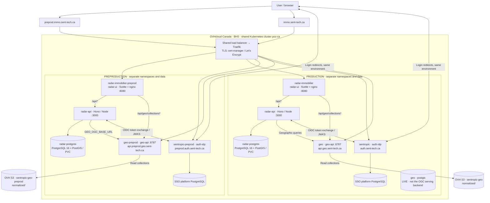

# Immo, Geo and Kubernetes architecture

Snapshot: **2026-09-13**, with read-only cluster checks at **11:38 UTC**. This describes the current system, including transitional wiring. The workstation is still required to produce/enrich LLM-derived graphs. A nightly scrape followed by a projection does not by itself create new LLM-derived signals.

Evidence labels: **LIVE** = observed during this inspection; **DECLARED** = repository configuration, not proof of deployment; **PLANNED** = documented evolution. Links and source revisions are collected at the end.

## 1. User access and environment boundaries

| Surface | Production | Preproduction | Evidence |
| --- | --- | --- | --- |
| Immo application | `https://immo.sent-tech.ca` | `https://preprod.immo.sent-tech.ca` | LIVE login redirects |
| Sent-tech SSO / OIDC issuer | `https://auth.sent-tech.ca` | `https://preprod.auth.sent-tech.ca` | LIVE discovery and redirects |
| OIDC client | `radar-immobilier` | `radar-immobilier-preprod` | LIVE redirect parameters |
| Geo OGC API | `https://api.geo.sent-tech.ca` | `https://api.preprod.geo.sent-tech.ca` | LIVE ingress / HTTP 200 conformance |
| Immo Kubernetes namespace | `radar-immobilier` | `radar-immobilier-preprod` | DECLARED / LIVE preprod |
| Geo Kubernetes namespace | `geo` | `geo-preprod` | LIVE prod / DECLARED preprod |
| SSO platform namespace | `sentropic` | `sentropic-preprod` | Platform records; not re-inventoried live |

The requested `preprod.sent-tech.ca` did **not resolve in DNS** during this inspection. It is not the observed Immo or SSO hostname. `sent-tech.ca` is the DNS domain; the actual identity-provider hosts include `auth` as shown above.

The cluster endpoint is `https://hlhedx.c1.bhs5.k8s.ovh.net`. `poc-k8s` owns the cluster, shared ingress/TLS, namespace quotas, RBAC, network policies and storage provisioning. Immo and Geo own their application workloads and images. Cloudflare provides DNS for `sent-tech.ca`; it is not the application host. The old Scaleway cluster description in `poc-k8s/README.md` is historical.

Authentication is application-level OIDC authorization code + PKCE. After the browser returns to `/api/v1/auth/oauth/callback`, `radar-api` verifies the identity and issues its own application session cookie. There is no ingress-level SSO enforcement on the Immo ingress. OGC collections are publicly readable; the Immo login boundary does not imply an OGC login boundary.
