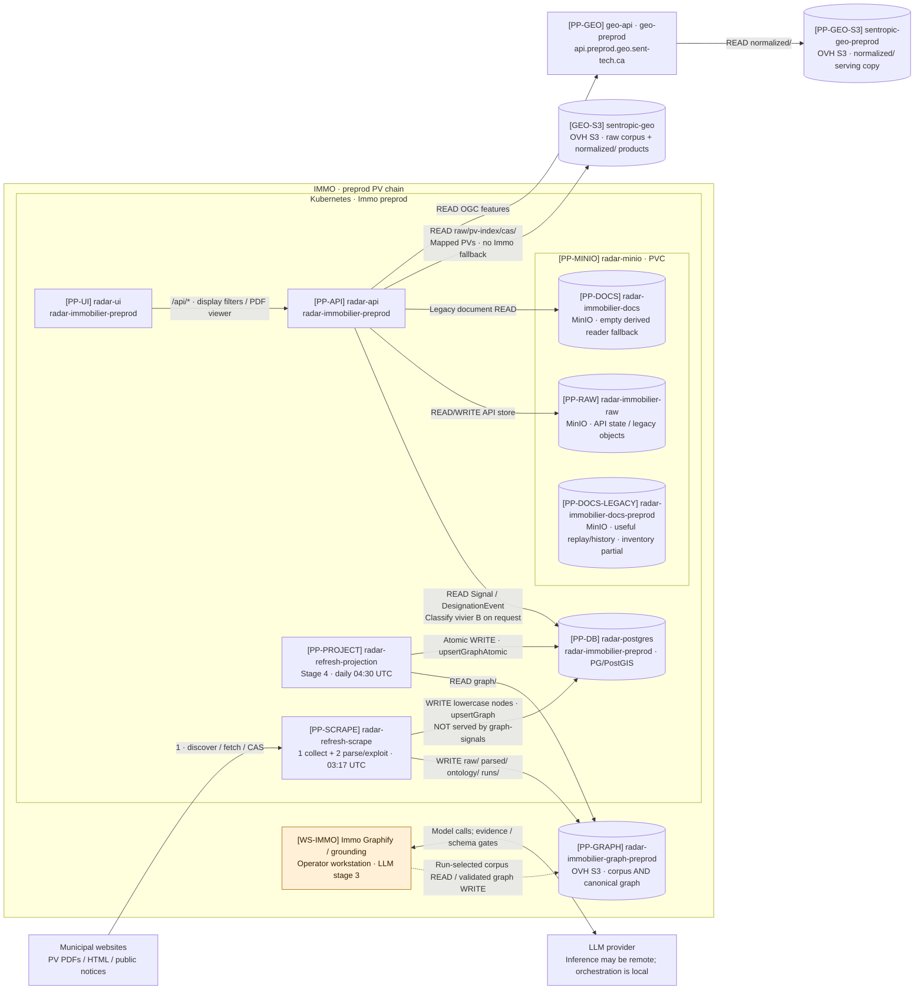
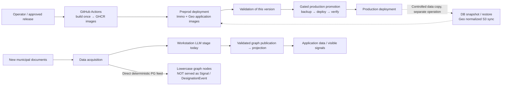

# Immo, Geo and Kubernetes architecture

Snapshot: **2026-09-13**, refreshed against remote **main `09703678`**, read-only preprod storage checks at **12:33–12:37 UTC** and a workload/CronJob recheck at **15:38 UTC**. This describes observed configuration, not an assertion that every configured path succeeds. The workstation is still required for the deployed LLM-derived graph path.

Evidence labels: **LIVE** = observed during this inspection; **DECLARED** = repository configuration, not proof of deployment; **PLANNED** = documented evolution. Links and source revisions are collected at the end.

**Reading the diagrams:** bracketed IDs identify the **same resource in every view**. `PP-` = preproduction, `PR-` = production; `GEO-S3` is a shared corpus. Diagram 1 locates resources, diagram 2 zooms into **preprod Immo** using those exact IDs, and diagram 3 follows Geo products. READ arrows point from consumer to store, not in the direction of byte transfer. Dashed edges are conditional/unverified. Unobserved legacy publication templates are listed in §3, **not drawn as active workloads**. Production storage is explicitly unknown until an OVH inventory is available.

The [local SvelteFlow dossier](architecture/README.md) adds service pictograms and
an explicit **repo + responsibility** label inside every component and nested box.
[Attribution evidence](architecture/service-provenance.md) separates application
code/manifests, platform provisioning, S3 client bindings and external services;
neither an icon nor a repo label is a new claim of runtime activation.

**Storage migration is partial, not complete** ([dated audit and migration PRs](architecture/storage-audit.md)):

| Effective path | Preproduction | Production |
| --- | --- | --- |
| API default object store | **MinIO still deployed and configured**: live `radar-immobilier-raw`; empty derived fallback `radar-immobilier-docs`; separate retained `radar-immobilier-docs-preprod` history | OVH runtime not audited; main still declares MinIO |
| Scrape + canonical projection | **OVH S3**, same `radar-immobilier-graph-preprod` bucket | OVH runtime not audited; main retains SCW refresh bindings |
| Mapped PV document reader | **OVH `sentropic-geo/raw/pv-index/cas/`** | Repoint activation not audited |
| Eradication work | #677 migrated preprod CronJobs, not API; #674 retains/pins MinIO | #670 is **OPEN DRAFT**, not merged; registry migration #671/#672 is not storage migration |

Do not read the old SCW cluster's retained workloads as today's production. The public production application is reachable, but the available OVH credential cannot inventory its namespace. No SCW S3 path is asserted as live here solely because a main manifest names it.

## 1. User access and environment boundaries

| Surface | Production | Preproduction | Evidence |
| --- | --- | --- | --- |
| Immo application | `https://immo.sent-tech.ca` | `https://preprod.immo.sent-tech.ca` | LIVE login redirects |
| Sent-tech SSO / OIDC issuer | `https://auth.sent-tech.ca` | `https://preprod.auth.sent-tech.ca` | LIVE discovery and redirects |
| OIDC client | `radar-immobilier` | `radar-immobilier-preprod` | LIVE redirect parameters |
| Geo OGC API | `https://api.geo.sent-tech.ca` | `https://api.preprod.geo.sent-tech.ca` | LIVE ingress / HTTP 200 conformance |
| Immo Kubernetes namespace | `radar-immobilier` | `radar-immobilier-preprod` | DECLARED / LIVE preprod |
| Geo Kubernetes namespace | `geo` | `geo-preprod` | LIVE prod / DECLARED preprod |
| SSO platform namespace | `sentropic` | `sentropic-preprod` | Platform records; not re-inventoried live |

The requested `preprod.sent-tech.ca` did **not resolve in DNS** during this inspection. It is not the observed Immo or SSO hostname. `sent-tech.ca` is the DNS domain; the actual identity-provider hosts include `auth` as shown above.

```mermaid
flowchart TB
  user["User / browser"]
  ppurl["preprod.immo.sent-tech.ca"]
  prurl["immo.sent-tech.ca"]
  user --> ppurl
  user --> prurl
  subgraph cloud["OVHcloud Canada · BHS · shared Kubernetes cluster poc-ca"]
    edge["Shared load balancer → Traefik<br/>TLS: cert-manager / Let's Encrypt"]
    subgraph preprod["PREPRODUCTION · namespaces"]
      PP_UI["[PP-UI] radar-ui<br/>radar-immobilier-preprod"]
      PP_API["[PP-API] radar-api<br/>radar-immobilier-preprod"]
      PP_DB[("[PP-DB] radar-postgres<br/>radar-immobilier-preprod · PG/PostGIS")]
      subgraph ppminio["[PP-MINIO] radar-minio · PVC"]
        PP_RAW[("[PP-RAW] radar-immobilier-raw<br/>MinIO · API state / legacy objects")]
        PP_DOCS[("[PP-DOCS] radar-immobilier-docs<br/>MinIO · empty derived reader fallback")]
        PP_DOCS_LEGACY[("[PP-DOCS-LEGACY] radar-immobilier-docs-preprod<br/>MinIO · useful replay/history · inventory partial")]
      end
      PP_SCRAPE["[PP-SCRAPE] radar-refresh-scrape<br/>1 collect + 2 parse/exploit · 03:17 UTC"]
      PP_PROJECT["[PP-PROJECT] radar-refresh-projection<br/>Stage 4 · daily 04:30 UTC"]
      pidp["sentropic-preprod · auth-idp<br/>preprod.auth.sent-tech.ca"]
      pidb[("[PP-SSO-DB] SSO PostgreSQL<br/>Not PP-DB · platform record")]
      PP_GEO["[PP-GEO] geo-api · geo-preprod<br/>api.preprod.geo.sent-tech.ca"]
      PP_UI -->|"/api/*"| PP_API
      PP_API -->|"SQL read/write"| PP_DB
      PP_API -->|"READ/WRITE API store"| PP_RAW
      PP_API -->|"Legacy document READ"| PP_DOCS
      PP_SCRAPE -->|"WRITE lowercase nodes<br/>NOT served by graph-signals"| PP_DB
      PP_PROJECT -->|"Atomic WRITE"| PP_DB
      PP_UI -->|"/api/geo/collections*"| PP_GEO
      PP_API -->|"READ OGC"| PP_GEO
      PP_API <-->|"OIDC token exchange / JWKS"| pidp
      pidp --> pidb
    end
    subgraph prod["PRODUCTION · access observed; Immo internals not audited"]
      PR_UI["[PR-UI] radar-ui<br/>radar-immobilier"]
      PR_API["[PR-API] radar-api<br/>radar-immobilier"]
      prodgap["Production DB / S3 / refresh<br/>OVH inventory unavailable<br/>No provider inferred from main"]
      idp["sentropic · auth-idp<br/>auth.sent-tech.ca"]
      idb[("[PR-SSO-DB] SSO PostgreSQL<br/>Not PR-DB · platform record")]
      GEO_API["[GEO-API] geo-api · geo<br/>api.geo.sent-tech.ca"]
      GEO_DB[("[GEO-DB] geo/postgis<br/>LIVE · no OGC DB dependency demonstrated")]
      PR_UI -->|"/api/*"| PR_API
      PR_API -.->|"Evidence gap"| prodgap
      PR_UI -->|"/api/geo/collections*"| GEO_API
      PR_API -->|"READ OGC"| GEO_API
      PR_API <-->|"OIDC token exchange / JWKS"| idp
      idp --> idb
    end
    edge --> PP_UI
    edge --> PR_UI
    edge --> pidp
    edge --> idp
    edge --> PP_GEO
    edge --> GEO_API
  end
  ppurl --> edge
  prurl --> edge
  user <-->|"Login redirects, same environment"| pidp
  user <-->|"Login redirects, same environment"| idp
  PP_GRAPH[("[PP-GRAPH] radar-immobilier-graph-preprod<br/>OVH S3 · corpus AND canonical graph")]
  PP_GEO_S3[("[PP-GEO-S3] sentropic-geo-preprod<br/>OVH S3 · normalized/ serving copy")]
  GEO_S3[("[GEO-S3] sentropic-geo<br/>OVH S3 · raw corpus + normalized/ products")]
  WS_IMMO["[WS-IMMO] Immo Graphify / grounding<br/>Operator workstation · LLM stage 3"]
  WS_IMMO -.->|"Run-selected corpus READ / validated graph WRITE"| PP_GRAPH
  PP_SCRAPE -->|"WRITE raw/ parsed/ ontology/ runs/"| PP_GRAPH
  PP_PROJECT -->|"READ graph/"| PP_GRAPH
  PP_GEO -->|"READ normalized/"| PP_GEO_S3
  GEO_API -->|"READ normalized/"| GEO_S3
  PP_API -->|"READ raw/pv-index/cas/<br/>Shared PV corpus · LIVE repoint"| GEO_S3
```

**Isolation is not absolute:** preprod has its own application DB and OGC serving copy, but `PP-API` currently reads mapped PV documents from `GEO-S3` (`sentropic-geo`), not from `PP-GEO-S3`. This read-only corpus dependency is separate from map/OGC traffic. Production Immo overrides and its document-repoint activation have not been inventoried live; do not infer them by symmetry.

The cluster endpoint is `https://hlhedx.c1.bhs5.k8s.ovh.net`. `poc-k8s` owns the cluster, shared ingress/TLS, namespace quotas, RBAC, network policies and storage provisioning. Immo and Geo own their application workloads and images. Cloudflare provides DNS for `sent-tech.ca`; it is not the application host. The old Scaleway cluster description in `poc-k8s/README.md` is historical.

Authentication is application-level OIDC authorization code + PKCE. After the browser returns to `/api/v1/auth/oauth/callback`, `radar-api` verifies the identity and issues its own application session cookie. There is no ingress-level SSO enforcement on the Immo ingress. OGC collections are publicly readable; the Immo login boundary does not imply an OGC login boundary.

## 2. Immo: the four stages from municipal minutes to signals

The four-stage decomposition is **collect → parse/exploit → graphify/ground → project**. **All four stages belong to Immo**, including its workstation-run Graphify/grounding tools, corpus and graph stores. Kubernetes, the workstation and external S3 are execution/storage locations, not a transfer of ownership to Geo. The Geo API is a separate geographic input; it does not own this PV-to-signal chain.

This is the **as-is** view, not the full-auto target. The older refresh study explains the four-stage baseline; the September 5 consolidated design describes its evolution (mapping below). Current code/manifests and live reads take precedence for deployed wiring.

**Exact zoom:** `PP-DB` is the same database as in diagram 1, not a new Graphify database. `PP-GRAPH` is **one physical bucket**: `raw/`, `parsed/`, `ontology/`, `runs/` and `graph/` are prefixes, not five S3 services. `PP-RAW` is the live API store; `PP-DOCS` is the empty derived fallback. The distinct `PP-DOCS-LEGACY` bucket contains useful replay/history but is not a live API binding. Stages 1 and 2 run in **one scrape worker**, not separate services. Workstation arrows are configurable run contracts, **not proof of a recent publication into PP-GRAPH**. No active stage-3 publisher was established by this inventory. Legacy Job 41 is excluded, not assumed to bridge the gap.

| Stage | Actual implementation | Output / boundary | Execution today |
| --- | --- | --- | --- |
| 1. Collect | `worker-live.ts`, `recueil.ts`, municipal adapters | Content-addressed raw documents, sidecar metadata, run manifests | In-cluster Job / scrape CronJob |
| 2. Parse/exploit | `exploit-scrape.ts`, `pdftotext`, deterministic zoning detection, `exploitation.ts` | `parsed/` and `ontology/`; optional **direct additive PG feed** via `projectStateToGraph → upsertGraph`, distinct from the canonical graph path | Same scrape worker with `LIVE_SCRAPE_EXPLOIT=1`; DB feed when explicitly wired |
| 3. Graphify/ground | `tools/graphify-v23/`, `tools/grounding/`, ontology contracts | Versioned graph with Signal/DesignationEvent nodes, stage/date, source/page/citation; staged candidates for publish-only path | Workstation agent/CLI, with provider access; not a nightly in-cluster LLM service |
| 4. Project | `project-graph-from-s3.ts` and `upsertGraphAtomic` | Canonical graph → PostgreSQL, with per-city replacement and non-regression gates | Projection Job / CronJob; does not execute stages 1–3 |

**Two PG paths, but only one feeds served Signals:** deterministic exploitation writes **lowercase types** (`nodeType → toLowerCase`). The signal routes select the exact capitalized types **`Signal` / `DesignationEvent`**. The direct scrape feed therefore **does not produce visible Signals by itself**. Live `LIVE_SCRAPE_EXPLOIT=1` and a DB Secret reference establish wiring, not a successful run or a bridge between these type contracts. Canonical projection and the workstation extraction/grounding path remain essential; a nightly scrape followed by projection does not prove fresh visible signals.

**Implemented post-projection processing, not an observed active CronJob:** Immo's **Graphify 3.4 Phase A** first reads PG for **EMIT PASS-1** (candidate/control outputs), then **APPLY PASS-2 recalculates from PG**, archives/publishes the canonical S3 graph through the guarded writer and atomically reprojections PG. APPLY does **not** read EMIT's candidate files; neither step performs new PV extraction or LLM inference. These on-demand tools exist on main, but no such Job was present in this preprod inventory. The API then computes vivier B dynamically; the UI applies display/date filters. There is no separate B database and no service filter requiring `graphify_pass=3.4`. Historical cohort counts are not today's runtime counts.

**As-is versus the documented refactoring target** ([consolidated design, September 5](https://github.com/rhanka/radar-immobilier/blob/6296396fed804cf9a3d4a6e031c452af57313357/docs/design/PIPELINE_FULLAUTO_CLUSTER_MESH.md), §§3/5/8/10):

| Four-stage baseline, owned by Immo | Full-auto target, not a deployed-state claim |
| --- | --- |
| 1 Collect + 2 Parse/exploit | **E1** deterministic acquisition produces a detection layer on S3 |
| 3 Graphify/ground on workstation | **E2** LLM detection + **E3** grounding produce separate contributions, with operated LLM execution replacing the workstation dependency |
| Several current canonical publishers | **E4** deterministic merge of detection + grounding + geographic contributions, through the guarded canonical writer |
| 4 Canonical projection + separate direct PG feed | **E5** `upsertGraphAtomic` becomes the sole PG writer; the interim direct feed is retired only after the validated cutover |

The target is explicitly an **Immo chain E1–E5 with Geo integration branches**, not a handoff of PV acquisition to Geo. Geo owns geographic acquisition, spatial joins and serving; the **Immo geo-to-graph adapter** consumes those contracts and emits the Immo geographic contribution. Geo never writes Immo `graph_nodes`. Moving inference/orchestration into a shared runtime does not transfer Immo's business pipeline to Geo.

Graphify extraction, evidence and grounding work remains relevant. **Its publication integration is not unchanged:** the full-auto design folds current direct canonical publishers into layer producers plus one merge/writer. Current Immo [#678](https://github.com/rhanka/radar-immobilier/pull/678), `ab98ce5b`, is an **open draft** adding CAS ingestion, bounded extraction and candidate gates. Its author reports 139/139 documents processed in a second dry run with zero uploads; this is not publication, projection or deployment evidence. See the [current continuation audit](architecture/continuation-audit.md), which supersedes the older local branch snapshot.

Grounding is an enrichment of stage 3, not a replacement for graph generation. Its publish-only Kubernetes Job verifies the staged content hash, preserves history and publishes one city. The committed grounding README names Sonnet; newer job commentary names a Codex/llm-mesh run. A single current model cannot be inferred from those conflicting records, so the diagram identifies the runtime boundary rather than asserting one provider/model.

**Current preprod split, measured:** scrape and projection bind to `PP-GRAPH`. The API's live default `S3_*` store is `PP-RAW`; with no API `SCRAPE_S3_*` override, its derived `PP-DOCS` fallback is the literal `radar-immobilier-docs` and is empty. A distinct MinIO bucket, `PP-DOCS-LEGACY` (`radar-immobilier-docs-preprod`), holds useful replay/history. Its partial inventory is exact where listed: `baseline/` 1 object / 2,821,583 B; `graph/` 4 / 639,226 B; `ontology/` 530 / 34,257,805 B; `parsed/` at least 4,884 / at least 272,554,144 B; `raw/` unknown; `runs/` at least 445. None is the refresh bucket. No copy, cutover or deletion has started.

**PDF delivery is another path:** `PP-API` has live `GEO_DOCUMENTS_REPOINT=1` and `GEO_DOCUMENTS_S3_BUCKET=sentropic-geo`. The primary rewrite maps Immo `raw/proces-verbaux-<city>/cas/<sha>.<ext>` to Geo **`raw/pv-index/cas/<sha>.<ext>`**; an optional frozen URL index can add a candidate. `/api/documents/raw` reads **only `GEO-S3`** for mapped candidates, with no Immo fallback on miss. Non-mapped references retain `PP-DOCS` then `PP-RAW`. This shares captured documents, not ownership of Immo's detection/graphification/SQL projection. `PP-GEO-S3/normalized/` serves geographic features, not these PDFs.

A fresh PV can enter `PP-GRAPH/raw/` and the lowercase PG feed **without any fresh served Signal**, new canonical graph or PDF resolvable through the separate Geo document reader. A successful projection can re-read an unchanged canonical graph. These are distinct freshness, graph-publication and evidence-serving boundaries, not proof that any individual document is missing.

## 3. Storage and scheduled processing

| Shared ID | Physical resource / binding | Readers and writers | Evidence / cross-view meaning |
| --- | --- | --- | --- |
| `PP-DB` | `radar-postgres`, namespace `radar-immobilier-preprod`, PG/PostGIS + PVC | `PP-API` SQL; direct additive `PP-SCRAPE` and atomic `PP-PROJECT` writes | LIVE workload/wiring; **one Immo DB in diagrams 1 and 2** |
| `PP-MINIO` | `http://radar-minio:9000`, same namespace, PVC-backed service | Live API `PP-RAW`, empty fallback `PP-DOCS`, retained history `PP-DOCS-LEGACY` | LIVE, ready replicas 1; partial object inventory below |
| `PP-RAW` | MinIO bucket `radar-immobilier-raw` | `PP-API` default `S3_*` store; state/metadata and legacy document path | LIVE ConfigMap; not `PP-GRAPH` |
| `PP-DOCS` | MinIO bucket `radar-immobilier-docs` | `PP-API` derived scrape-document fallback, ahead of `PP-RAW` | LIVE inventory: empty |
| `PP-DOCS-LEGACY` | MinIO bucket `radar-immobilier-docs-preprod` | No live API binding established; replay/history candidate | LIVE partial inventory: baseline 1/2,821,583 B; graph 4/639,226 B; ontology 530/34,257,805 B; parsed ≥4,884/≥272,554,144 B; raw unknown; runs ≥445 |
| `PP-GRAPH` | OVH S3 bucket `radar-immobilier-graph-preprod` | `PP-SCRAPE` writes corpus/derived state; `PP-PROJECT` reads canonical `graph/` | LIVE CronJob bindings. **Corpus and graph roles share this bucket**, not separate stores |
| `PP-GEO-S3` | OVH S3 `sentropic-geo-preprod`, serving prefix `normalized/` | Controlled Geo sync writes; `PP-GEO` reads geographic products | DECLARED overlay / LIVE OGC endpoint; **not the PDF source selected by PP-API** |
| `GEO-S3` | OVH S3 `sentropic-geo`: raw corpus, registries and `normalized/` products | Geo acquisition writes; `GEO-API` reads products; **`PP-API` reads mapped PV PDFs directly** | LIVE Geo serving URI and Immo reader binding; one bucket in diagrams 1–3, distinct prefixes |
| `GEO-DB` | `geo/postgis`, PG16 + PostGIS3.4 | No current OGC serving or batch-join dependency demonstrated | LIVE workload; separate from Immo's DB; explicitly unconnected in the Geo view |
| `PP-SSO-DB`, `PR-SSO-DB` | SSO platform PostgreSQL, respective Sentropic namespaces | Identity-provider workloads, not PV processing | Platform records; neither is an Immo graph DB. Diagram 1 only |
| `PP-BACKUP` | OVH S3 `radar-preprod-snapshot` | Completed snapshot-restore Job reads it | LIVE Job binding; operational restore source, **not** the corpus or canonical graph |

OVH S3 endpoint: `https://s3.bhs.io.cloud.ovh.net`. An S3 bucket is external to Kubernetes; the MinIO service is in-cluster and backed by a PVC. These are separate failure and persistence boundaries.

**Production declarations, not a live counterpart of diagram 2:** main names `PR-DB` and SCW `LEGACY-POC` for canonical projection; the scrape target is secret-backed. The old grounding workflow declares GitHub Actions publication `candidats/ → graph/` within that SCW bucket. Those declarations do not establish current execution. Only Geo's `GEO-API → GEO-S3` serving was inventoried live; production Immo overrides remain unknown.

**Main-only references, excluded from operational diagrams:** the following are templates, not verified production or preprod execution. The preceding production description is a manifest contract only.

| Reference ID | Main declaration | Runtime qualification |
| --- | --- | --- |
| `PP-GROUND` | Job 41 destination: `PP-DOCS-LEGACY/graph/` | Job absent live; retained bucket content does not establish an active writer/reader or bridge to `PP-GRAPH` |
| `LEGACY-POC` | SCW `radar-immobilier-docs-pocs`, prefixes `candidats/` and `graph/` | Job 41 source, prod grounding workflow and prod projection declaration; **no current execution asserted** |
| `PR-DB`, `PR-MINIO` | Base `radar-postgres` / `radar-minio` in `radar-immobilier` | Unknown OVH runtime; #670's September 11 retention note is historical, not today's inventory |

The completed snapshot-restore Job is likewise historical, not an active PV stage. Its retained SCW image name does not prove an ongoing image pull or S3 dependency. No restore-to-DB edge is asserted without inspecting its target.

| Scheduler / Job | Cadence | What it does | State at inspection |
| --- | --- | --- | --- |
| Immo `radar-refresh-scrape` | Daily **03:17 UTC** | Stages 1 + 2 | Preprod LIVE, enabled; last success Sep 13 **06:13:54 UTC** |
| Immo `radar-refresh-projection` | Daily **04:30 UTC** | Stage 4 from OVH graph-preprod | Preprod LIVE, enabled; last scheduled Sep 13, last success **Sep 11 04:30:13 UTC** |
| Immo production refresh pair | Same two UTC schedules | Prod corpus scrape / graph projection | DECLARED; activation gated by `REFRESH_CRONJOB_PROD_ENABLED`; not checked live |
| Immo `radar-consistency-snapshot` | Daily **04:45 UTC** | PG consistency / coverage snapshot | Preprod LIVE, **suspended** |
| Immo `radar-populate-geo-daily` | Daily **04:17 America/Toronto** | Import zones/lots and run reference resolution | DECLARED; absent from preprod live CronJobs |
| Immo grounding publication | On demand, one city per Job | Hash-checked publication; no model inference | DECLARED publish-only workflow |
| Geo capture / acquisition / norms | Bounded worklists, Jobs on demand | Capture, extraction and publication | Implemented runners; no Geo CronJob present in live `geo` namespace |
| Geo PV backlog controller | Every 2 minutes in manifest | Drain a finite capture campaign, state in S3 | Historical campaign, suspended in current backlog manifest; absent live |
| Geo prod → preprod sync | Controlled on-demand window | Mirror `normalized/`, stamp coherence, refresh serving index, verify collections | DECLARED Job; not an independent always-on refresh cron |

Schedules are independent timers, not a dependency-aware workflow. In particular 04:17 Toronto is **not** before 04:30 UTC. A last-scheduled timestamp is not proof of successful processing or fresh downstream signals.

## 4. Geo: sources, acquisition, joins and serving

Geo owns reusable geographic acquisition and products. Immo also has its own PV acquisition and graph pipeline: the two acquisition paths are not proof of a unified orchestrator. **They do share a concrete evidence-serving link:** preprod Immo reads mapped PV PDFs from `GEO-S3`. Geo captures/serves documents; Immo still owns its PV interpretation and Signal nodes. `raw/` and `normalized/` below are prefixes in the same `GEO-S3` bucket, not extra stores.

```mermaid
flowchart TB
  subgraph sources["External authoritative sources"]
    pv["Municipal PV / notices<br/>PDF, HTML, municipal portals"]
    zones["Zoning polygons<br/>ArcGIS / AGOL, WFS, CKAN, municipal GIS"]
    rules["Regulations / zoning grids<br/>Municipal PDFs, annexes, tables"]
    lots["Cadastral parcels / assessment data<br/>Québec MRNF and municipal sources"]
    env["Environment<br/>BDZI floods · GRHQ hydrography · CPTAQ agriculture"]
  end
  subgraph processing["Geo processing · source-specific runners / bounded Jobs"]
    capture["Capture on cluster<br/>Raw bytes + URL + retrieved_at + SHA-256"]
    normalize["Parse / normalize / validate provenance<br/>Geometries, PV, regulations, norms"]
    join["In-process spatial join: parcel ∩ zoning<br/>Area-majority / centroid fallback / multi-zone status"]
    fold["Semantic joins<br/>Canonical zone code → regulation / norms<br/>Parcel + zone + norms → enriched lot"]
    constraints["Normalize / intersect constraints<br/>Evidence and explicit missing-data status"]
    capture -->|"WRITE raw / manifests"| GEO_S3
    normalize -->|"READ captured corpus"| GEO_S3
    normalize --> join
    join --> fold
    normalize --> fold
    normalize --> constraints
    normalize -->|"WRITE normalized products"| GEO_S3
    fold -->|"WRITE enriched lots / zones"| GEO_S3
    constraints -->|"WRITE normalized constraints"| GEO_S3
  end
  pv --> capture
  zones --> capture
  rules --> capture
  lots --> capture
  env --> capture
  local["Workstation-assisted extraction where required<br/>OCR / vision / LLM for document tables<br/>Reads captured corpus; not local source capture"]
  local -->|"READ captured corpus"| GEO_S3
  local -->|"Validated extraction products"| normalize
  subgraph geoprod["PRODUCTION / SHARED CORPUS · cluster services + external OVH S3"]
    GEO_API["[GEO-API] geo-api · geo<br/>api.geo.sent-tech.ca"] -->|"READ normalized/"| GEO_S3
    GEO_S3[("[GEO-S3] sentropic-geo<br/>OVH S3 · raw corpus + normalized/ products")]
    GEO_DB[("[GEO-DB] geo/postgis<br/>LIVE · no OGC DB dependency demonstrated")]
    PR_API["[PR-API] radar-api<br/>radar-immobilier"] -->|"READ OGC"| GEO_API
  end
  sync["Controlled preprod sync<br/>coherence_id + count + set_hash<br/>Refresh index and verify through API"]
  sync -.->|"READ normalized/"| GEO_S3
  sync -.->|"WRITE normalized/"| PP_GEO_S3
  subgraph geopreprod["PREPRODUCTION · cluster service + external OVH S3"]
    PP_GEO["[PP-GEO] geo-api · geo-preprod<br/>api.preprod.geo.sent-tech.ca"] -->|"READ normalized/"| PP_GEO_S3
    PP_GEO_S3[("[PP-GEO-S3] sentropic-geo-preprod<br/>OVH S3 · normalized/ serving copy")]
    PP_API["[PP-API] radar-api<br/>radar-immobilier-preprod"] -->|"READ OGC"| PP_GEO
  end
  PP_API -->|"CROSS-ENV READ raw/pv-index/cas/<br/>Same dependency as diagrams 1 and 2"| GEO_S3
  site["geo.sent-tech.ca<br/>Static catalogue · GitHub Pages"] -->|"OGC links / requests"| GEO_API
```

The diagram describes implemented source families and processing responsibilities; it is **not** a claim that every family has complete coverage, an active scheduler or a fully automatic extractor. The serving contract is file/object based: `GEO_DATA_URI=s3://…/normalized` selects `StoreProvider`. A running `geo/postgis` StatefulSet was observed, but no current API-to-PostGIS dependency is demonstrated by that configuration. Do not substitute a database-backed OGC architecture for the observed S3 serving path.

The lot/zone join (`packages/geo/src/zonage/lotZoneJoin.ts`) uses spatial intersections and records `area-majority`, `centroid-fallback` or `unassigned`, with multiple-zone information. Norms use canonicalized zone codes. The persisted intermediate `normalized/qc-lot-zonage/<city>.parquet` joins the zoning-norms registry and feeds served `qc-lots` products. Regulation references are folded into zoning products; Immo then resolves its own Signal/DesignationEvent references to zones and lots. An unresolved reference remains explicit, not a fabricated join.

Environmental source adapters exist for BDZI, GRHQ and CPTAQ. Data presence and coverage must be assessed separately from the existence of an adapter; an empty response alone does not establish the absence of a flood, watercourse or protected agricultural area. The S9 contract requires source and missing-data status. On-demand extraction runners and operator-assisted document interpretation are shown separately from deployed serving.

## 5. Supporting components and operational boundaries

| Component | Role | Current qualification |
| --- | --- | --- |
| `radar-immo-mcp` | OAuth-protected remote MCP access to Immo tools, through `/mcp` | Deployment LIVE in preprod; an additional user/agent entry point |
| Obscura | Browser automation for sources needing a browser | DECLARED and configured in Immo; no Obscura Deployment in the inspected preprod inventory |
| MinIO | In-cluster object store backed by PVC | LIVE in preprod: API uses `PP-RAW`, fallback `PP-DOCS` is empty, and separate `PP-DOCS-LEGACY` retains useful replay/history |
| Mail delivery | Invitations/enrolment via Scaleway TEM HTTP API | DECLARED; Maildev is a development/optional scaffold, not evidence of production email delivery |
| Maps / satellite | Geo basemap endpoint and browser-side map/tile requests; MapLibre rendering | Google basemap config exists in Geo overlays; current key activation is not established by the code flag alone |
| Chat / LLM access | User-facing assistant capability, distinct from scheduled document processing | Does not demonstrate autonomous graphify or grounding inside Kubernetes |
| CI + image registry | Build versioned `radar-api`, `radar-ui`, Geo images in GHCR; deploy preprod; gated promotion to prod | DECLARED; a source commit and a live image need not be the same version |
| Backups, PVCs, restore | Preserve business state and restore/copy environments | PostgreSQL and MinIO have persistence distinct from external S3; copy/sync is not a release or a new scrape |
| DNS / TLS / tenant isolation | Cloudflare DNS, Traefik, cert-manager, namespace-specific RBAC and network policy | Platform responsibility in `poc-k8s`; shared physical cluster, separate logical tenants |

The September full-auto design selects `@sentropic/s3-dag` reconciliation with durable progress, quota control, provenance and retries; it also requires the E4 merge / E5 sole-writer transition described in §2. LLM execution moves off the workstation in that **PLANNED** architecture; no deployed LLM gateway or completed cutover is asserted here. The older June workspace-data/queue proposal is historical context, not the current target. Code promotion, data refresh and production-to-preprod copying are three different operations.

**Latest continuation boundary:** the current design uses **Graphify with in-process mesh inside the Immo pod**, superseding the earlier hybrid/network-service assumption. Immo retains corpus/checkpoints/gates/canonical publication; Graphify supplies its library/provider lifecycle. Graphify remains pinned to exactly **0.18.0** and fail-closes correctly; `immo-pv-extraction-v3` is the internal PDF contract name, not a Graphify `0.18.3` version. At Immo HEAD `ac3a7150`, the two targeted suites pass **8/8 + 7/7**, and the full typecheck plus scope/branch checks pass. The nested `UND_ERR_SOCKET` is confirmed in the llm-mesh 0.19.0 normalizer, not Graphify; a delegated 0.19.1 patch is not yet published. T1 is **GO_WITH_GATES** for the preprod success path and **NO-GO** for unattended/retry/production before 0.19.1. No real-provider Signal or Kubernetes acceptance exists. The [D5 target dossier](architecture/decision-dossier.md) and [sequential states](architecture/transitions-target.md) place architecture before billing. **SCW TEM remains until its replacement is validated.**

## 6. Questions for the architecture walkthrough

1. **Address:** should `preprod.sent-tech.ca` become an alias/portal, or was it shorthand for the observed `preprod.immo.sent-tech.ca`? This document retains the verified URLs until clarified.
2. **Storage transition:** the recorded decision is **MIGRATE+RETAIN**: after T1, remediate fail-before-write and conditional-write capability gates, then migrate preprod before production while retaining `PP-DOCS-LEGACY` until complete parity and recovery. Commit `25ec9e04` starts fail-before-write remediation; its suite and conditional-write work remain in progress. No copy, cutover or deletion has begun. TEM remains retained.
3. **Automation scope:** should the future worker own only Immo graphify/grounding, or also Geo's remaining assisted regulation/grid extraction? Both dependencies are relevant, but no new architecture decision is assumed here.

## 7. Evidence and reproducibility

| Repository | Reference inspected | How it was used |
| --- | --- | --- |
| `radar-immobilier` | `097036783006226afea53a6b49383bf70890774f` (`origin/main`, 2026-09-11 commit with Sep-12 migration notes) | Current deploy/workflow/source baseline; this document is on an isolated branch from it |
| `geo` | `f68d8ddf` (`origin/main`, 2026-09-12) | Current serving overlays, S3 target, joins and acquisition code; local root HEAD was older |
| `poc-k8s` | `03acdfd` (local HEAD, 2026-09-05); freshly fetched main remains `346e49b8` (July 4) | OVH runbooks are newer local work, **not main**; live endpoint evidence takes precedence over the older main's SCW platform description |
| `i-cond` | Local `.lanes/conductor/docs/PLAN_PIPELINE_DONNEES_PREPROD.md`, dated 2026-09-03 | Operational context, workstation requirement and publish-only boundary; historical status superseded where live evidence exists |
| `i-cond` latest refresh study | Local `.remote/PIPELINE_PV_SIGNAUX_E2E.md` and `.remote/REFRESH_E2E_CONCEPTION.md`, September 11 | Case-sensitive served-node boundary and 3.4 EMIT/APPLY checked against current main; older storage/repoint claims superseded by this live audit; conception is not implementation |
| Immo full-auto design | `6296396fed804cf9a3d4a6e031c452af57313357` (`origin/design/fullauto-pipeline-consolidated`, September 5) | Follow-up ownership/transition audit: E1–E5, geographic seam, interim feed and future sole writer; design, not deployed state |
| Immo Graphify CAS work | `73172214a369ebfba0aab530dadde873341baa4a` (`feat/graphify-v23-cas-ingest`, September 11) | Follow-up branch inspection against its pre-change parent `8e18f01b`; changes remain in Immo tools and plan; qualification not inferred |
| Immo refresh continuation | `ac3a7150` (`feat/refresh-018`) plus the earlier `docs/reviews/refresh-018/preprod-readiness.md` runtime read | Exact Graphify 0.18.0 fail-closes; internal PDF contract `immo-pv-extraction-v3`; targeted 8/8 + 7/7, full typecheck and scope/branch PASS; llm-mesh 0.19.0 owns nested `UND_ERR_SOCKET`, 0.19.1 unpublished; preprod success GO_WITH_GATES, unattended/retry/prod NO-GO |
| T2 storage follow-up | September 13 live MinIO inventory; Fable postbuild review; remediation commit `25ec9e04` | Separates the empty API fallback from useful legacy history; fail-before-write work started, while its suite and conditional-write capability remain open before MIGRATE+RETAIN execution |

Primary Immo references: [refresh study](study/industrialisation-refresh-suivi.md), [four-stage pipeline study](spec/brainstorm-industrialisation-refresh-data.md), [worker](../api/src/scripts/worker-live.ts), [graph projection](../api/src/scripts/project-graph-from-s3.ts), [grounding tools](../tools/grounding/README.md), [publish-only Job](../deploy/k8s/41-grounding-citation-job.yaml), [OVH preprod refresh overlay](../deploy/k8s/refresh-cronjobs/kustomization.yaml), [prod refresh overlay](../deploy/k8s/refresh-cronjobs-prod/kustomization.yaml), [nginx preprod](../deploy/overlays/preprod/nginx/default.conf), [release workflow](../.github/workflows/build-push-images.yml), [Geo mapper](../api/src/services/geo/run-geo-mapper.ts). Resource-reconciliation evidence: [API store construction](../api/src/index.ts), [store resolvers](../api/src/config.ts), [PDF routing and no-fallback rule](../api/src/routes/documents.ts), [production publication workflow](../.github/workflows/grounding-publish-prod.yml).

Primary Geo references, pinned to the inspected revision: [serving overlays](https://github.com/rhanka/geo/tree/f68d8ddf/deploy/k8s/overlays), [S3 target](https://github.com/rhanka/geo/blob/f68d8ddf/acquisition/config/s3-target.json), [provider selection](https://github.com/rhanka/geo/blob/f68d8ddf/packages/geo/src/api/providers/make-provider.ts), [lot/zone joins](https://github.com/rhanka/geo/blob/f68d8ddf/packages/geo/src/zonage/lotZoneJoin.ts), [norms join diagnostic](https://github.com/rhanka/geo/blob/f68d8ddf/acquisition/src/_immo-lots-norms-join-probe.ts), [environment contract](https://github.com/rhanka/geo/blob/f68d8ddf/docs/spec/SPEC_GEO_ENV_CONSTRAINTS_S9.md), [capture campaign](https://github.com/rhanka/geo/blob/f68d8ddf/deploy/k8s/pv-probable-backlog-cronjob.yaml), [preprod sync contract](https://github.com/rhanka/geo/blob/f68d8ddf/deploy/k8s/preprod/README.md).

Platform references: `poc-k8s/docs/runbooks/ovh-operations.md`, `platform/overlays/ovh/20-traefik.yaml`, `tenants/{radar-immobilier,geo,sentropic-preprod}/README.md`, and `docs/migrations/ovh-canada-migration-plan.md`. These were read locally at the revision above; the initial Scaleway README and early tenant descriptions are not authoritative for today's provider or Immo UI routing.

Read-only live checks: Immo login redirects in both environments; OIDC discovery from both issuers; Geo preprod `/conformance`; `geo` deployments/StatefulSets/CronJobs/ingress and whitelisted API environment variables; `radar-immobilier-preprod` workloads/CronJobs/Jobs and whitelisted ConfigMap fields. No Secret values, database contents or private documents were read. Live production Immo and SSO namespace inventories were not accessible with the initial Geo-scoped credential; they are not represented as freshly verified deployment inventories.

At inspection, Immo preprod API/UI/MCP images were tagged `8e18f01`; Geo production API used digest `sha256:73332b22315a85991ebaefde7cabc3fce8760ab3d06d0ea5ee22acf3ff9b7220`. These identify observed workloads, not the source revision of every diagram component.

Follow-up [main/runtime audit](architecture/storage-audit.md) confirms the MinIO API / OVH refresh split and #670's unmerged state. Gemini completed the requested text-only review via **h2a run agy**, requested model `gemini-3.8-flash-high`, effort high: **NEEDS CHANGES** at `2ab8da2b`. Its [findings](architecture/gemini-review/response-findings.md) are [reconciled](architecture/gemini-review/review-inline.md), not treated as live cluster evidence. In particular, an absent legacy Job does not establish an active broken pipeline, and an unverified restore target must not be invented. This is a single third-party review, not multi-peer consensus or a reapproval of the revised diagrams.

The current [local companion](architecture/README.md) is a **native Focus-format architecture dossier**: four existing detailed views, full-platform T1/T2/T3 states and a causal T1 detail, each mapped to nested SvelteFlow and rendered Mermaid. The earlier FocusSnapshot/Mermaid orientation page is superseded. The page embeds evidence and local-only notes; it is neither a Track approval nor a deployment claim.
