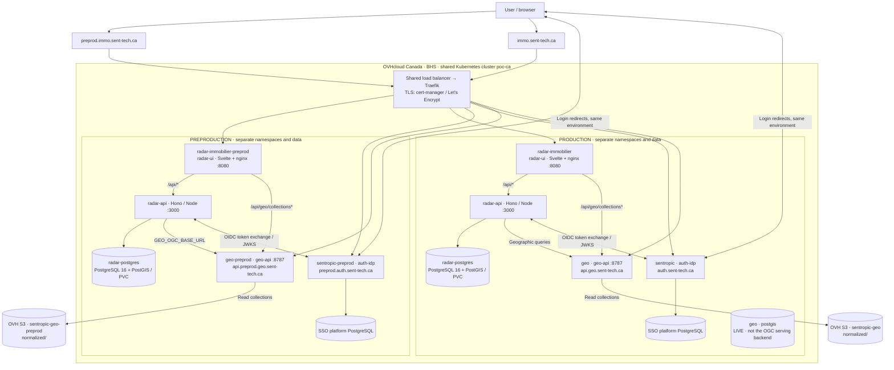

# Immo, Geo and Kubernetes architecture

Snapshot: **2026-09-13**, with read-only cluster checks at **11:38 UTC**. This describes the current system, including transitional wiring. The workstation is still required to produce/enrich LLM-derived graphs. A nightly scrape followed by a projection does not by itself create new LLM-derived signals.

Evidence labels: **LIVE** = observed during this inspection; **DECLARED** = repository configuration, not proof of deployment; **PLANNED** = documented evolution. Links and source revisions are collected at the end.

## 1. User access and environment boundaries

| Surface | Production | Preproduction | Evidence |
| --- | --- | --- | --- |
| Immo application | `https://immo.sent-tech.ca` | `https://preprod.immo.sent-tech.ca` | LIVE login redirects |
| Sent-tech SSO / OIDC issuer | `https://auth.sent-tech.ca` | `https://preprod.auth.sent-tech.ca` | LIVE discovery and redirects |
| OIDC client | `radar-immobilier` | `radar-immobilier-preprod` | LIVE redirect parameters |
| Geo OGC API | `https://api.geo.sent-tech.ca` | `https://api.preprod.geo.sent-tech.ca` | LIVE ingress / HTTP 200 conformance |
| Immo Kubernetes namespace | `radar-immobilier` | `radar-immobilier-preprod` | DECLARED / LIVE preprod |
| Geo Kubernetes namespace | `geo` | `geo-preprod` | LIVE prod / DECLARED preprod |
| SSO platform namespace | `sentropic` | `sentropic-preprod` | Platform records; not re-inventoried live |

The requested `preprod.sent-tech.ca` did **not resolve in DNS** during this inspection. It is not the observed Immo or SSO hostname. `sent-tech.ca` is the DNS domain; the actual identity-provider hosts include `auth` as shown above.



The cluster endpoint is `https://hlhedx.c1.bhs5.k8s.ovh.net`. `poc-k8s` owns the cluster, shared ingress/TLS, namespace quotas, RBAC, network policies and storage provisioning. Immo and Geo own their application workloads and images. Cloudflare provides DNS for `sent-tech.ca`; it is not the application host. The old Scaleway cluster description in `poc-k8s/README.md` is historical.

Authentication is application-level OIDC authorization code + PKCE. After the browser returns to `/api/v1/auth/oauth/callback`, `radar-api` verifies the identity and issues its own application session cookie. There is no ingress-level SSO enforcement on the Immo ingress. OGC collections are publicly readable; the Immo login boundary does not imply an OGC login boundary.

## 2. Immo: the four stages from municipal minutes to signals

The four-stage decomposition is **collect → parse/exploit → graphify/ground → project**. It follows the committed refresh study and the `i-cond` orchestration record. Those older records explain the processing boundary; current manifests and live reads take precedence for endpoints and activation.

```mermaid
flowchart TB
  websites["Municipal websites<br/>PV PDFs / HTML / public notices"]
  subgraph deterministic["Kubernetes · radar-immobilier or radar-immobilier-preprod"]
    scrape["1 · COLLECT<br/>worker-live → adapters → recueil<br/>URL discovery, HTTP fetch, SHA-256 / CAS"]
    parse["2 · PARSE + EXPLOIT<br/>pdftotext / deterministic detection<br/>extracts + project-state"]
    project["4 · PROJECT<br/>project-graph-from-s3 → upsertGraph<br/>Idempotent graph-to-PostgreSQL projection"]
    pub["Grounding publication Job<br/>PUBLISH-ONLY · verify hash / backup / publish<br/>No LLM inside this pod"]
    geoimport["Geo import / reference resolution<br/>zone_versions + lot_versions<br/>geo_resolutions + geo_unresolved"]
    pg[("PostgreSQL / PostGIS<br/>graph_nodes, graph_edges, application state")]
    api["radar-api<br/>Signal filtering / scoring / evidence / collaboration"]
    ui["radar-ui<br/>Signals, opportunities, sources, map, PDF citations"]
  end
  subgraph workstation["WORKSTATION · operator-triggered processing today"]
    llm["3 · GRAPHIFY + GROUND CITATIONS<br/>Agent / CLI + LLM access or llm-mesh<br/>Nodes, edges, stage, references, verbatim citations"]
    gate["Schema / provenance / non-regression gates<br/>Missing citation remains missing"]
    llm --> gate
  end
  provider["LLM provider<br/>Inference may be remote; orchestration is local"]
  corpus[("Corpus store<br/>raw/ + metadata, parsed/, runs/, ontology/")]
  candidate[("Staged candidates<br/>candidats/CITY/latest.json + SHA-256")]
  graph[("Canonical graph store<br/>graph/CITY/latest.json + history/")]
  geosvc["Geo OGC API<br/>Zones / lots / regulations / constraints"]
  websites --> scrape
  scrape --> corpus
  scrape --> parse
  corpus --> parse
  parse --> corpus
  corpus --> llm
  llm <-->|"Model calls"| provider
  gate -->|"Direct validated graph publication path"| graph
  gate -->|"Grounding candidate path"| candidate
  candidate --> pub
  pub -.->|"Destination alignment still required; see below"| graph
  graph --> project
  project --> pg
  geosvc --> geoimport
  geoimport --> pg
  pg --> api
  geosvc --> api
  api --> ui
  classDef local fill:#fff0d7,stroke:#ad6a00,color:#332000;
  class llm,gate local;
```

| Stage | Actual implementation | Output / boundary | Execution today |
| --- | --- | --- | --- |
| 1. Collect | `worker-live.ts`, `recueil.ts`, municipal adapters | Content-addressed raw documents, sidecar metadata, run manifests | In-cluster Job / scrape CronJob |
| 2. Parse/exploit | `exploit-scrape.ts`, `pdftotext`, deterministic zoning detection | `parsed/` and `ontology/` artifacts; deterministic extraction is distinct from the LLM graph | Same scrape worker with `LIVE_SCRAPE_EXPLOIT=1` |
| 3. Graphify/ground | `tools/graphify-v23/`, `tools/grounding/`, ontology contracts | Versioned graph with Signal/DesignationEvent nodes, stage/date, source/page/citation; staged candidates for publish-only path | Workstation agent/CLI, with provider access; not a nightly in-cluster LLM service |
| 4. Project | `project-graph-from-s3.ts` and graph repository | Graph → PostgreSQL; consumed by API and UI | Projection Job / CronJob; does not execute stages 1–3 |

Grounding is an enrichment of stage 3, not a replacement for graph generation. Its publish-only Kubernetes Job verifies the staged content hash, preserves history and publishes one city. The committed grounding README names Sonnet; newer job commentary names a Codex/llm-mesh run. A single current model cannot be inferred from those conflicting records, so the diagram identifies the runtime boundary rather than asserting one provider/model.

**Current preprod split, measured:** the scrape and projection CronJobs use OVH S3 `radar-immobilier-graph-preprod`; the API ConfigMap still points at `http://radar-minio:9000`, bucket `radar-immobilier-raw`. MinIO is running. The committed grounding publish Job still targets MinIO `radar-immobilier-docs-preprod`, whereas projection now reads OVH. This is a documented configuration mismatch, not a proven successful end-to-end publication path. No recent grounding Job survived in the live Job inventory to prove a runtime override.

The diagram's two publication arrows represent the general graph-publication contract and the grounding-specific staged path. They do not assert both destinations are currently aligned. A newly collected PV can remain without a new graph until stage 3 runs; a successful projection can therefore re-read an unchanged graph.

## 3. Storage and scheduled processing

| Store | Preproduction | Production / shared reference | Status |
| --- | --- | --- | --- |
| Immo application database | `radar-postgres`, PostgreSQL 16 + PostGIS, PVC | Same workload declared in `radar-immobilier` | Preprod LIVE; prod topology DECLARED |
| Immo API object store | MinIO `radar-immobilier-raw` | Base ConfigMap also declares MinIO; prod override not inspected | Preprod LIVE |
| Immo scrape + graph store | OVH `radar-immobilier-graph-preprod`, `bhs` | Refresh manifests still use Scaleway `radar-immobilier-docs-pocs`, `fr-par` | Preprod LIVE; prod DECLARED, migration debt `#670` |
| Grounding staging | `candidats/` in Scaleway `radar-immobilier-docs-pocs` | Production publish workflow also references this bucket | DECLARED; transitional |
| Grounding publication | MinIO `radar-immobilier-docs-preprod` in committed Job | Production publish workflow uses the Scaleway graph bucket | DECLARED; preprod differs from live projection store |
| Geo corpus / products | OVH `sentropic-geo-preprod/normalized` serving copy | OVH `sentropic-geo`, raw capture + registries + normalized products | Source target versioned; prod serving URI LIVE |
| Geo database | No DB in current serving overlay | `geo/postgis`, PostgreSQL 16 + PostGIS 3.4 | Prod database LIVE; no DB dependency in current OGC provider wiring |
| Backups / restore | A completed `radar-preprod-snapshot-restore` Job read OVH `radar-preprod-snapshot` | Release workflow creates external S3 backups before promotion | Preprod restore LIVE; backup destination selected through CI configuration |

OVH S3 endpoint: `https://s3.bhs.io.cloud.ovh.net`. An S3 bucket is external to Kubernetes; the MinIO service is in-cluster and backed by a PVC. These are separate failure and persistence boundaries.

| Scheduler / Job | Cadence | What it does | State at inspection |
| --- | --- | --- | --- |
| Immo `radar-refresh-scrape` | Daily **03:17 UTC** | Stages 1 + 2 | Preprod LIVE, enabled; last scheduled 2026-09-13 |
| Immo `radar-refresh-projection` | Daily **04:30 UTC** | Stage 4 from OVH graph-preprod | Preprod LIVE, enabled; last scheduled 2026-09-13 |
| Immo production refresh pair | Same two UTC schedules | Prod corpus scrape / graph projection | DECLARED; activation gated by `REFRESH_CRONJOB_PROD_ENABLED`; not checked live |
| Immo `radar-consistency-snapshot` | Daily **04:45 UTC** | PG consistency / coverage snapshot | Preprod LIVE, **suspended** |
| Immo `radar-populate-geo-daily` | Daily **04:17 America/Toronto** | Import zones/lots and run reference resolution | DECLARED; absent from preprod live CronJobs |
| Immo grounding publication | On demand, one city per Job | Hash-checked publication; no model inference | DECLARED publish-only workflow |
| Geo capture / acquisition / norms | Bounded worklists, Jobs on demand | Capture, extraction and publication | Implemented runners; no Geo CronJob present in live `geo` namespace |
| Geo PV backlog controller | Every 2 minutes in manifest | Drain a finite capture campaign, state in S3 | Historical campaign, suspended in current backlog manifest; absent live |
| Geo prod → preprod sync | Controlled on-demand window | Mirror `normalized/`, stamp coherence, refresh serving index, verify collections | DECLARED Job; not an independent always-on refresh cron |

Schedules are independent timers, not a dependency-aware workflow. In particular 04:17 Toronto is **not** before 04:30 UTC. A last-scheduled timestamp is not proof of successful processing or fresh downstream signals.
