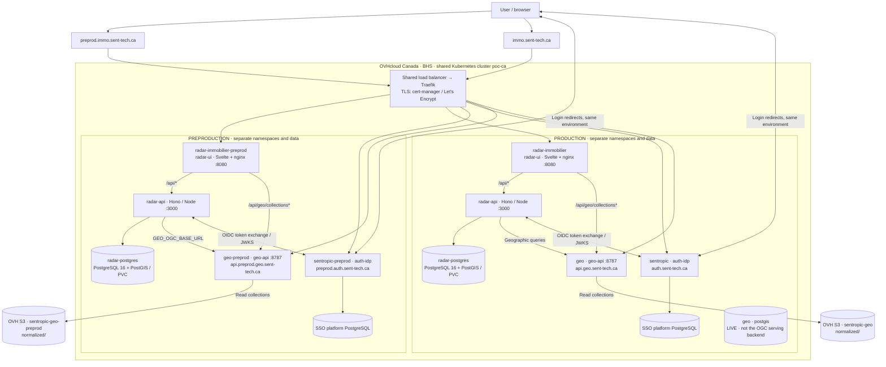
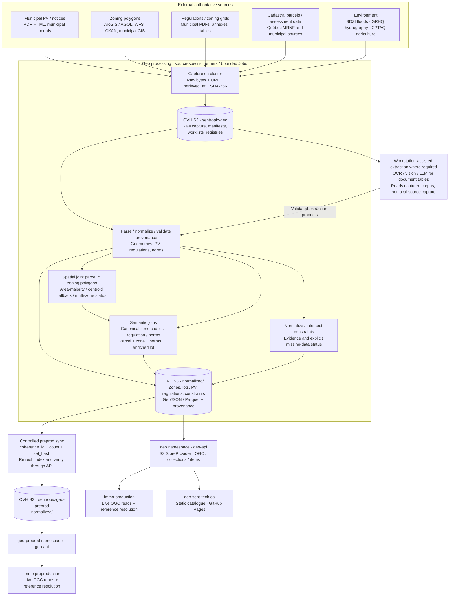
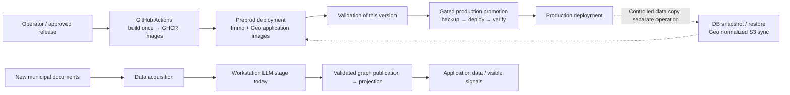

# Immo, Geo and Kubernetes architecture

Snapshot: **2026-09-13**, with read-only cluster checks at **11:38 UTC**. This describes the current system, including transitional wiring. The workstation is still required to produce/enrich LLM-derived graphs. A nightly scrape followed by a projection does not by itself create new LLM-derived signals.

Evidence labels: **LIVE** = observed during this inspection; **DECLARED** = repository configuration, not proof of deployment; **PLANNED** = documented evolution. Links and source revisions are collected at the end.

## 1. User access and environment boundaries

| Surface | Production | Preproduction | Evidence |
| --- | --- | --- | --- |
| Immo application | `https://immo.sent-tech.ca` | `https://preprod.immo.sent-tech.ca` | LIVE login redirects |
| Sent-tech SSO / OIDC issuer | `https://auth.sent-tech.ca` | `https://preprod.auth.sent-tech.ca` | LIVE discovery and redirects |
| OIDC client | `radar-immobilier` | `radar-immobilier-preprod` | LIVE redirect parameters |
| Geo OGC API | `https://api.geo.sent-tech.ca` | `https://api.preprod.geo.sent-tech.ca` | LIVE ingress / HTTP 200 conformance |
| Immo Kubernetes namespace | `radar-immobilier` | `radar-immobilier-preprod` | DECLARED / LIVE preprod |
| Geo Kubernetes namespace | `geo` | `geo-preprod` | LIVE prod / DECLARED preprod |
| SSO platform namespace | `sentropic` | `sentropic-preprod` | Platform records; not re-inventoried live |

The requested `preprod.sent-tech.ca` did **not resolve in DNS** during this inspection. It is not the observed Immo or SSO hostname. `sent-tech.ca` is the DNS domain; the actual identity-provider hosts include `auth` as shown above.



The cluster endpoint is `https://hlhedx.c1.bhs5.k8s.ovh.net`. `poc-k8s` owns the cluster, shared ingress/TLS, namespace quotas, RBAC, network policies and storage provisioning. Immo and Geo own their application workloads and images. Cloudflare provides DNS for `sent-tech.ca`; it is not the application host. The old Scaleway cluster description in `poc-k8s/README.md` is historical.

Authentication is application-level OIDC authorization code + PKCE. After the browser returns to `/api/v1/auth/oauth/callback`, `radar-api` verifies the identity and issues its own application session cookie. There is no ingress-level SSO enforcement on the Immo ingress. OGC collections are publicly readable; the Immo login boundary does not imply an OGC login boundary.

## 2. Immo: the four stages from municipal minutes to signals

The four-stage decomposition is **collect → parse/exploit → graphify/ground → project**. It follows the committed refresh study and the `i-cond` orchestration record. Those older records explain the processing boundary; current manifests and live reads take precedence for endpoints and activation.

```mermaid
flowchart TB
  websites["Municipal websites<br/>PV PDFs / HTML / public notices"]
  subgraph deterministic["Kubernetes · radar-immobilier or radar-immobilier-preprod"]
    scrape["1 · COLLECT<br/>worker-live → adapters → recueil<br/>URL discovery, HTTP fetch, SHA-256 / CAS"]
    parse["2 · PARSE + EXPLOIT<br/>pdftotext / deterministic detection<br/>extracts + project-state"]
    project["4 · PROJECT<br/>project-graph-from-s3 → upsertGraph<br/>Idempotent graph-to-PostgreSQL projection"]
    pub["Grounding publication Job<br/>PUBLISH-ONLY · verify hash / backup / publish<br/>No LLM inside this pod"]
    geoimport["Geo import / reference resolution<br/>zone_versions + lot_versions<br/>geo_resolutions + geo_unresolved"]
    pg[("PostgreSQL / PostGIS<br/>graph_nodes, graph_edges, application state")]
    api["radar-api<br/>Signal filtering / scoring / evidence / collaboration"]
    ui["radar-ui<br/>Signals, opportunities, sources, map, PDF citations"]
  end
  subgraph workstation["WORKSTATION · operator-triggered processing today"]
    llm["3 · GRAPHIFY + GROUND CITATIONS<br/>Agent / CLI + LLM access or llm-mesh<br/>Nodes, edges, stage, references, verbatim citations"]
    gate["Schema / provenance / non-regression gates<br/>Missing citation remains missing"]
    llm --> gate
  end
  provider["LLM provider<br/>Inference may be remote; orchestration is local"]
  corpus[("Corpus store<br/>raw/ + metadata, parsed/, runs/, ontology/")]
  candidate[("Staged candidates<br/>candidats/CITY/latest.json + SHA-256")]
  graph[("Canonical graph store<br/>graph/CITY/latest.json + history/")]
  geosvc["Geo OGC API<br/>Zones / lots / regulations / constraints"]
  websites --> scrape
  scrape --> corpus
  scrape --> parse
  corpus --> parse
  parse --> corpus
  corpus --> llm
  llm <-->|"Model calls"| provider
  gate -->|"Direct validated graph publication path"| graph
  gate -->|"Grounding candidate path"| candidate
  candidate --> pub
  pub -.->|"Destination alignment still required; see below"| graph
  graph --> project
  project --> pg
  geosvc --> geoimport
  geoimport --> pg
  pg --> api
  geosvc --> api
  api --> ui
  classDef local fill:#fff0d7,stroke:#ad6a00,color:#332000;
  class llm,gate local;
```

| Stage | Actual implementation | Output / boundary | Execution today |
| --- | --- | --- | --- |
| 1. Collect | `worker-live.ts`, `recueil.ts`, municipal adapters | Content-addressed raw documents, sidecar metadata, run manifests | In-cluster Job / scrape CronJob |
| 2. Parse/exploit | `exploit-scrape.ts`, `pdftotext`, deterministic zoning detection | `parsed/` and `ontology/` artifacts; deterministic extraction is distinct from the LLM graph | Same scrape worker with `LIVE_SCRAPE_EXPLOIT=1` |
| 3. Graphify/ground | `tools/graphify-v23/`, `tools/grounding/`, ontology contracts | Versioned graph with Signal/DesignationEvent nodes, stage/date, source/page/citation; staged candidates for publish-only path | Workstation agent/CLI, with provider access; not a nightly in-cluster LLM service |
| 4. Project | `project-graph-from-s3.ts` and graph repository | Graph → PostgreSQL; consumed by API and UI | Projection Job / CronJob; does not execute stages 1–3 |

Grounding is an enrichment of stage 3, not a replacement for graph generation. Its publish-only Kubernetes Job verifies the staged content hash, preserves history and publishes one city. The committed grounding README names Sonnet; newer job commentary names a Codex/llm-mesh run. A single current model cannot be inferred from those conflicting records, so the diagram identifies the runtime boundary rather than asserting one provider/model.

**Current preprod split, measured:** the scrape and projection CronJobs use OVH S3 `radar-immobilier-graph-preprod`; the API ConfigMap still points at `http://radar-minio:9000`, bucket `radar-immobilier-raw`. MinIO is running. The committed grounding publish Job still targets MinIO `radar-immobilier-docs-preprod`, whereas projection now reads OVH. This is a documented configuration mismatch, not a proven successful end-to-end publication path. No recent grounding Job survived in the live Job inventory to prove a runtime override.

The diagram's two publication arrows represent the general graph-publication contract and the grounding-specific staged path. They do not assert both destinations are currently aligned. A newly collected PV can remain without a new graph until stage 3 runs; a successful projection can therefore re-read an unchanged graph.

## 3. Storage and scheduled processing

| Store | Preproduction | Production / shared reference | Status |
| --- | --- | --- | --- |
| Immo application database | `radar-postgres`, PostgreSQL 16 + PostGIS, PVC | Same workload declared in `radar-immobilier` | Preprod LIVE; prod topology DECLARED |
| Immo API object store | MinIO `radar-immobilier-raw` | Base ConfigMap also declares MinIO; prod override not inspected | Preprod LIVE |
| Immo scrape + graph store | OVH `radar-immobilier-graph-preprod`, `bhs` | Refresh manifests still use Scaleway `radar-immobilier-docs-pocs`, `fr-par` | Preprod LIVE; prod DECLARED, migration debt `#670` |
| Grounding staging | `candidats/` in Scaleway `radar-immobilier-docs-pocs` | Production publish workflow also references this bucket | DECLARED; transitional |
| Grounding publication | MinIO `radar-immobilier-docs-preprod` in committed Job | Production publish workflow uses the Scaleway graph bucket | DECLARED; preprod differs from live projection store |
| Geo corpus / products | OVH `sentropic-geo-preprod/normalized` serving copy | OVH `sentropic-geo`, raw capture + registries + normalized products | Source target versioned; prod serving URI LIVE |
| Geo database | No DB in current serving overlay | `geo/postgis`, PostgreSQL 16 + PostGIS 3.4 | Prod database LIVE; no DB dependency in current OGC provider wiring |
| Backups / restore | A completed `radar-preprod-snapshot-restore` Job read OVH `radar-preprod-snapshot` | Release workflow creates external S3 backups before promotion | Preprod restore LIVE; backup destination selected through CI configuration |

OVH S3 endpoint: `https://s3.bhs.io.cloud.ovh.net`. An S3 bucket is external to Kubernetes; the MinIO service is in-cluster and backed by a PVC. These are separate failure and persistence boundaries.

| Scheduler / Job | Cadence | What it does | State at inspection |
| --- | --- | --- | --- |
| Immo `radar-refresh-scrape` | Daily **03:17 UTC** | Stages 1 + 2 | Preprod LIVE, enabled; last scheduled 2026-09-13 |
| Immo `radar-refresh-projection` | Daily **04:30 UTC** | Stage 4 from OVH graph-preprod | Preprod LIVE, enabled; last scheduled 2026-09-13 |
| Immo production refresh pair | Same two UTC schedules | Prod corpus scrape / graph projection | DECLARED; activation gated by `REFRESH_CRONJOB_PROD_ENABLED`; not checked live |
| Immo `radar-consistency-snapshot` | Daily **04:45 UTC** | PG consistency / coverage snapshot | Preprod LIVE, **suspended** |
| Immo `radar-populate-geo-daily` | Daily **04:17 America/Toronto** | Import zones/lots and run reference resolution | DECLARED; absent from preprod live CronJobs |
| Immo grounding publication | On demand, one city per Job | Hash-checked publication; no model inference | DECLARED publish-only workflow |
| Geo capture / acquisition / norms | Bounded worklists, Jobs on demand | Capture, extraction and publication | Implemented runners; no Geo CronJob present in live `geo` namespace |
| Geo PV backlog controller | Every 2 minutes in manifest | Drain a finite capture campaign, state in S3 | Historical campaign, suspended in current backlog manifest; absent live |
| Geo prod → preprod sync | Controlled on-demand window | Mirror `normalized/`, stamp coherence, refresh serving index, verify collections | DECLARED Job; not an independent always-on refresh cron |

Schedules are independent timers, not a dependency-aware workflow. In particular 04:17 Toronto is **not** before 04:30 UTC. A last-scheduled timestamp is not proof of successful processing or fresh downstream signals.

## 4. Geo: sources, acquisition, joins and serving

Geo owns reusable geographic acquisition and products. Immo also has its own PV acquisition and graph pipeline: the two PV paths overlap in source material, but they are not evidence of a fully unified pipeline. Geo PV records must not be equated with Immo Signal nodes.



The diagram describes implemented source families and processing responsibilities; it is **not** a claim that every family has complete coverage, an active scheduler or a fully automatic extractor. The serving contract is file/object based: `GEO_DATA_URI=s3://…/normalized` selects `StoreProvider`. A running `geo/postgis` StatefulSet was observed, but no current API-to-PostGIS dependency is demonstrated by that configuration. Do not substitute a database-backed OGC architecture for the observed S3 serving path.

The lot/zone join (`packages/geo/src/zonage/lotZoneJoin.ts`) uses spatial intersections and records `area-majority`, `centroid-fallback` or `unassigned`, with multiple-zone information. Norms use canonicalized zone codes. The persisted intermediate `normalized/qc-lot-zonage/<city>.parquet` joins the zoning-norms registry and feeds served `qc-lots` products. Regulation references are folded into zoning products; Immo then resolves its own Signal/DesignationEvent references to zones and lots. An unresolved reference remains explicit, not a fabricated join.

Environmental source adapters exist for BDZI, GRHQ and CPTAQ. Data presence and coverage must be assessed separately from the existence of an adapter; an empty response alone does not establish the absence of a flood, watercourse or protected agricultural area. The S9 contract requires source and missing-data status. On-demand extraction runners and operator-assisted document interpretation are shown separately from deployed serving.

## 5. Supporting components and operational boundaries

| Component | Role | Current qualification |
| --- | --- | --- |
| `radar-immo-mcp` | OAuth-protected remote MCP access to Immo tools, through `/mcp` | Deployment LIVE in preprod; an additional user/agent entry point |
| Obscura | Browser automation for sources needing a browser | DECLARED and configured in Immo; no Obscura Deployment in the inspected preprod inventory |
| MinIO | In-cluster object store backed by PVC | LIVE in preprod; still the API-configured store despite refresh migration to OVH |
| Mail delivery | Invitations/enrolment via Scaleway TEM HTTP API | DECLARED; Maildev is a development/optional scaffold, not evidence of production email delivery |
| Maps / satellite | Geo basemap endpoint and browser-side map/tile requests; MapLibre rendering | Google basemap config exists in Geo overlays; current key activation is not established by the code flag alone |
| Chat / LLM access | User-facing assistant capability, distinct from scheduled document processing | Does not demonstrate autonomous graphify or grounding inside Kubernetes |
| CI + image registry | Build versioned `radar-api`, `radar-ui`, Geo images in GHCR; deploy preprod; gated promotion to prod | DECLARED; a source commit and a live image need not be the same version |
| Backups, PVCs, restore | Preserve business state and restore/copy environments | PostgreSQL and MinIO have persistence distinct from external S3; copy/sync is not a release or a new scrape |
| DNS / TLS / tenant isolation | Cloudflare DNS, Traefik, cert-manager, namespace-specific RBAC and network policy | Platform responsibility in `poc-k8s`; shared physical cluster, separate logical tenants |



The planned evolution moves LLM graph processing to an operated worker/queue with durable progress, quota control, provenance and retries. It is shown here as **PLANNED**, not an existing Kubernetes LLM deployment. Code promotion, data refresh and production-to-preprod copying are three different operations.

## 6. Questions for the architecture walkthrough

1. **Address:** should `preprod.sent-tech.ca` become an alias/portal, or was it shorthand for the observed `preprod.immo.sent-tech.ca`? This document retains the verified URLs until clarified.
2. **Storage transition:** should the next implementation align grounding publication and API document reads with OVH graph-preprod? Current evidence shows three preprod store roles that are not yet consolidated. This document records the state; it does not authorize or perform a migration.
3. **Automation scope:** should the future worker own only Immo graphify/grounding, or also Geo's remaining assisted regulation/grid extraction? Both dependencies are relevant, but no new architecture decision is assumed here.

## 7. Evidence and reproducibility

| Repository | Reference inspected | How it was used |
| --- | --- | --- |
| `radar-immobilier` | `097036783006226afea53a6b49383bf70890774f` (`origin/main`, 2026-09-11 commit with Sep-12 migration notes) | Current deploy/workflow/source baseline; this document is on an isolated branch from it |
| `geo` | `f68d8ddf` (`origin/main`, 2026-09-12) | Current serving overlays, S3 target, joins and acquisition code; local root HEAD was older |
| `poc-k8s` | `03acdfd` (local HEAD, 2026-09-05) | OVH runbook, shared platform and tenant ownership; its local remote-tracking ref was older |
| `i-cond` | Local `.lanes/conductor/docs/PLAN_PIPELINE_DONNEES_PREPROD.md`, dated 2026-09-03 | Operational context, workstation requirement and publish-only boundary; historical status superseded where live evidence exists |

Primary Immo references: [refresh study](study/industrialisation-refresh-suivi.md), [four-stage pipeline study](spec/brainstorm-industrialisation-refresh-data.md), [worker](../api/src/scripts/worker-live.ts), [graph projection](../api/src/scripts/project-graph-from-s3.ts), [grounding tools](../tools/grounding/README.md), [publish-only Job](../deploy/k8s/41-grounding-citation-job.yaml), [OVH preprod refresh overlay](../deploy/k8s/refresh-cronjobs/kustomization.yaml), [prod refresh overlay](../deploy/k8s/refresh-cronjobs-prod/kustomization.yaml), [nginx preprod](../deploy/overlays/preprod/nginx/default.conf), [release workflow](../.github/workflows/build-push-images.yml), [Geo mapper](../api/src/services/geo/run-geo-mapper.ts).

Primary Geo references, pinned to the inspected revision: [serving overlays](https://github.com/rhanka/geo/tree/f68d8ddf/deploy/k8s/overlays), [S3 target](https://github.com/rhanka/geo/blob/f68d8ddf/acquisition/config/s3-target.json), [provider selection](https://github.com/rhanka/geo/blob/f68d8ddf/packages/geo/src/api/providers/make-provider.ts), [lot/zone joins](https://github.com/rhanka/geo/blob/f68d8ddf/packages/geo/src/zonage/lotZoneJoin.ts), [norms join diagnostic](https://github.com/rhanka/geo/blob/f68d8ddf/acquisition/src/_immo-lots-norms-join-probe.ts), [environment contract](https://github.com/rhanka/geo/blob/f68d8ddf/docs/spec/SPEC_GEO_ENV_CONSTRAINTS_S9.md), [capture campaign](https://github.com/rhanka/geo/blob/f68d8ddf/deploy/k8s/pv-probable-backlog-cronjob.yaml), [preprod sync contract](https://github.com/rhanka/geo/blob/f68d8ddf/deploy/k8s/preprod/README.md).

Platform references: `poc-k8s/docs/runbooks/ovh-operations.md`, `platform/overlays/ovh/20-traefik.yaml`, `tenants/{radar-immobilier,geo,sentropic-preprod}/README.md`, and `docs/migrations/ovh-canada-migration-plan.md`. These were read locally at the revision above; the initial Scaleway README and early tenant descriptions are not authoritative for today's provider or Immo UI routing.

Read-only live checks: Immo login redirects in both environments; OIDC discovery from both issuers; Geo preprod `/conformance`; `geo` deployments/StatefulSets/CronJobs/ingress and whitelisted API environment variables; `radar-immobilier-preprod` workloads/CronJobs/Jobs and whitelisted ConfigMap fields. No Secret values, database contents or private documents were read. Live production Immo and SSO namespace inventories were not accessible with the initial Geo-scoped credential; they are not represented as freshly verified deployment inventories.

At inspection, Immo preprod API/UI/MCP images were tagged `8e18f01`; Geo production API used digest `sha256:73332b22315a85991ebaefde7cabc3fce8760ab3d06d0ea5ee22acf3ff9b7220`. These identify observed workloads, not the source revision of every diagram component.

The local HTML companion is generated from this Markdown with the **FocusSnapshot render core shipped in h2a**, then enhanced with Mermaid rendering. It is an architecture orientation document, not a Track approval or a live decision form.
