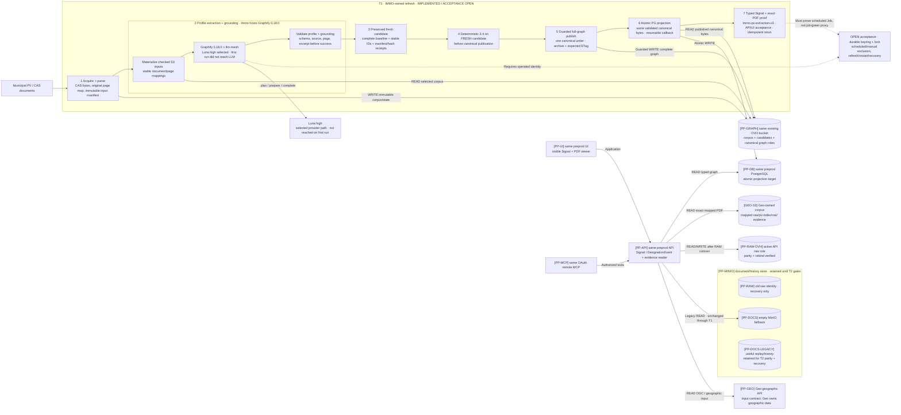

# T1 detailed refresh pipeline — implemented, acceptance in progress

[FACT] This is the implemented T1 path under acceptance on September 13. Graphify
stays exactly 0.18.0; the PDF contract name `immo-pv-extraction-v3` is not a
0.18.3 dependency version. Luna high is selected through llm-mesh. The first
Kubernetes run failed before invoking the LLM because the chosen input object was
`.html`, while the extraction profile requires PDF. That result proves input
validation and fail-closed behavior only: provider completion, a typed Signal,
the exact PDF and unattended scheduling remain open.

[JUDGMENT] Correct the input selection to a real PDF, then require a traceable
provider completion, one real typed Signal with its exact PDF, idempotent replay
and unattended schedule after pod replacement and credential refresh. Only then
may a separately gated production promotion begin. Model selection or a started
Job does not substitute for those acceptance levels. The workstation remains
available for administration/fallback until T1 is accepted.
