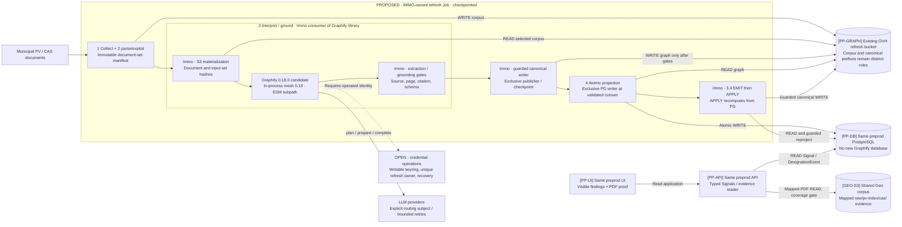

# Option A — proposed execution boundary

[JUDGMENT] This is an option, not an active deployment. The current application
still reads MinIO. Replacement OVH API buckets and durable credential operations
are intentionally unresolved until the inventory and owner recovery criteria exist.
Source: [decision dossier](decision-dossier.md), [continuation audit](continuation-audit.md).

[JUDGMENT] No service mesh network component is required by this option. The
keyring box denotes an unresolved contract, not a newly selected secret service.
The existing MinIO API roles must be inventoried and migrated separately; this
refresh diagram does not assert their removal or choose their replacement buckets.
