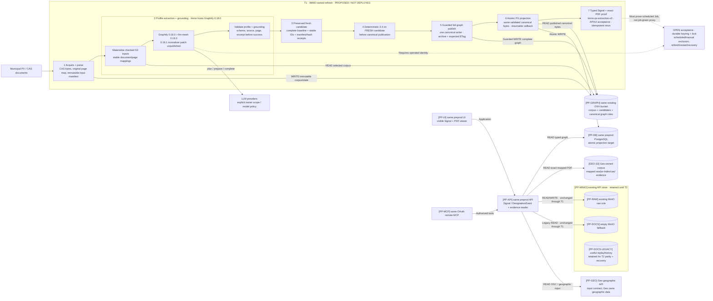

# T1 detailed refresh pipeline — proposed, not deployed

[FACT] This is the current T1 design from the September 13 refresh handoff, not
the former Option A and not an observed deployment. It keeps the existing
preproduction MinIO API roles until T2. Graphify stays exactly 0.18.0; the PDF
contract name `immo-pv-extraction-v3` is not a 0.18.3 dependency version. At
Immo HEAD `ac3a7150`, targeted suites pass 8/8 + 7/7 and the full typecheck plus
scope/branch checks pass. Graphify fail-closes correctly; nested `UND_ERR_SOCKET`
belongs to the llm-mesh 0.19.0 normalizer. Its delegated 0.19.1 patch is unpublished.
The preprod success path is GO_WITH_GATES; unattended/retry/production is NO-GO
before 0.19.1. Real-provider Signal and Kubernetes acceptance remain open.

[JUDGMENT] The preproduction ladder is installed-package → consumer/integration
tests → one real typed Signal with exact PDF → unattended schedule after pod
replacement and credential refresh. Only then may a separately gated production
promotion begin. No version bump, manual Job success or nonempty graph substitutes
for those acceptance levels. The workstation becomes optional enrollment/admin,
not a routine T1 runtime.
