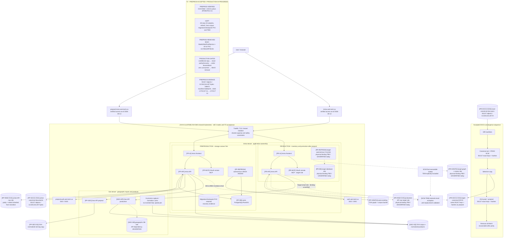

# Sequential target architecture — T1 → T2 → T3

Revision D8, 2026-09-13. The three diagrams are deliberately different kinds of
state: the first is the **effective transition snapshot** on September 13; the
second is the remaining **production T2 target** and the third is the complete
**AFTER target, not deployed**. The unchanged IDs identify the same logical or
physical resource between views. A production role marked `binding TBD` is a
target contract, not observed runtime. Preproduction evidence still precedes
any separately gated production promotion.

## Effective transition — T1 validation + preproduction T2 accepted

Graphify 0.18.0 is integrated and Luna high is selected. The first Kubernetes
run reached the workload but stopped **before any LLM call**: the selected input
was HTML, while the extraction contract requires a PDF. This is useful runtime
evidence, not T1 acceptance. In parallel, preproduction T2 is accepted:
`PP-RAW-OVH` remains the active API raw binding and `PP-DOCS-OVH` has exact
parity with the canonical production reference at **59,017 objects /
12,534,514,457 bytes**, manifest SHA-256 `52646a7b…0425`, `failed=0`. The MinIO
StatefulSet, Pod, Service, 40 Gi data PVC and six NetworkPolicies are removed;
the checkpoint/migration PVC remains. Namespace storage moved from four PVCs /
47 Gi to three PVCs / 7 Gi, and API/MCP/UI remain 1/1. Production T2 is still
in progress. The detailed causal pipeline is in [`proposal.md`](proposal.md).

```mermaid
flowchart TB
  subgraph T1_CARD["TRANSITION EFFECTIVE · 2026-09-13 · PREPROD T2 ACCEPTED"]
    T1_CHANGE["DONE / VERIFIED<br/>PP RAW + DOCS active on OVH<br/>API / MCP / UI remain 1/1"]
    T1_KEEP["KEPT<br/>PP-DB, PP-GRAPH, Geo evidence<br/>migration/checkpoint PVC + SCW TEM"]
    T1_REMOVE["REMOVED IN PREPROD<br/>MinIO StatefulSet, Pod, Service, 40 Gi data PVC<br/>six MinIO NetworkPolicies"]
    T1_GATES["OPEN GATES<br/>T1 provider/Signal/schedule acceptance<br/>production T2 parity/recovery/rebind/removal → T3 remeasurement"]
    T1_EVIDENCE["PREPROD DOCS PARITY<br/>59,017 objects / 12,534,514,457 bytes · failed 0<br/>manifest SHA-256 52646a7b…0425 · quota 4 PVC/47 Gi → 3 PVC/7 Gi"]
  end
  user["User / browser"]
  ppurl["preprod.immo.sent-tech.ca<br/>verified access as-of 2026-09-13"]
  prurl["immo.sent-tech.ca<br/>verified access as-of 2026-09-13"]
  user --> ppurl
  user --> prurl
  subgraph OVH_CLUSTER["[OVH-CLUSTER] OVH BHS shared Kubernetes · observed 3 b3-8 nodes · NOT T3"]
    edge["Traefik / TLS / tenant isolation<br/>shared capacity and safety constraints"]
    subgraph immo_tenant["Immo tenant · application ownership"]
      subgraph immo_pp["PREPRODUCTION · first acceptance"]
        PP_UI["[PP-UI] Immo frontend"]
        PP_API["[PP-API] Immo API"]
        PP_MCP["[PP-MCP] OAuth remote MCP"]
        PP_DB[("[PP-DB] same PostgreSQL/PostGIS")]
        PP_REFRESH["[PP-REFRESH] K8s validation workload<br/>first run stopped pre-LLM on .html input"]
        PP_MIGRATION_PVC[("Migration/checkpoint PVC retained<br/>recovery evidence · 3 PVC / 7 Gi quota use")]
      end
      subgraph immo_pr["PRODUCTION · promote only after preprod"]
        PR_UI["[PR-UI] Immo frontend"]
        PR_API["[PR-API] Immo API"]
        PR_MCP["[PR-MCP] OAuth remote MCP · target role"]
        PR_DB[("[PR-DB] target database role<br/>physical binding TBD / UNVERIFIED today")]
        PR_REFRESH["[PR-REFRESH] target autonomous CronJob<br/>physical binding TBD / UNVERIFIED today"]
        PR_OBJECT_GAP["Production T2 object migration<br/>IN PROGRESS · independently gated"]
      end
    end
    subgraph geo_tenant["Geo tenant · geographic inputs and products"]
      PP_GEO["[PP-GEO] Geo API preprod"]
      GEO_API["[GEO-API] Geo API production"]
      GEO_DB[("[GEO-DB] geographic DB role<br/>API dependency UNVERIFIED")]
      GEO_PROCESS["In-process capture / normalize / joins<br/>no invented SQL spatial join"]
    end
    pidp["preprod.auth.sent-tech.ca<br/>SSO / OIDC"]
    idp["auth.sent-tech.ca<br/>SSO / OIDC"]
  end
  PP_GRAPH[("[PP-GRAPH] same existing OVH graph + corpus bucket")]
  PR_GRAPH[("[PR-GRAPH] target graph + corpus role<br/>physical binding TBD / UNVERIFIED today")]
  PP_RAW_OVH[("[PP-RAW-OVH] active API raw role<br/>parity passed + rebind verified")]
  PP_DOCS_OVH[("[PP-DOCS-OVH] active canonical documents<br/>59,017 objects / 12,534,514,457 bytes<br/>manifest 52646a7b…0425 · failed 0")]
  PR_DOCS_SCW[("[PR-DOCS-SCW] exact canonical docs-pocs<br/>59,017 objects / 12,534,514,457 B")]
  PR_DOCS_OVH[("[PR-DOCS-OVH] production target<br/>T2 copy/parity IN PROGRESS")]
  subgraph docs_migration["DOCS convergence · preprod accepted · production open"]
    DOCS_DIFF["1 Canonical manifest<br/>PROD SCW reference · 59,017"]
    DOCS_CANONICAL["2 PREPROD ACCEPTED<br/>exact keys + hashes · failed 0"]
    DOCS_COPY["3 PRODUCTION IN PROGRESS<br/>selective conditional copy"]
    DOCS_PARITY["4 Production gate<br/>exact keys + hashes + recovery proof"]
    DOCS_PRUNE["5 Production MinIO removal<br/>only after its independent gate"]
    DOCS_DIFF --> DOCS_CANONICAL
    DOCS_CANONICAL --> DOCS_COPY
    DOCS_COPY --> DOCS_PARITY
    DOCS_PARITY --> DOCS_PRUNE
  end
  PP_GEO_S3[("[PP-GEO-S3] OVH normalized serving copy")]
  GEO_S3[("[GEO-S3] OVH corpus + normalized products")]
  WS_ADMIN["[WS-ADMIN] optional enrollment / administration only<br/>no routine LLM runtime after T1"]
  providers["Luna high via llm-mesh<br/>not reached by first K8s run"]
  TEM["[SCW-TEM] retained email exception<br/>until replacement is validated"]
  ppurl --> edge
  prurl --> edge
  edge --> PP_UI
  edge --> PR_UI
  PP_UI --> PP_API
  PP_UI --> PP_MCP
  PP_API <--> pidp
  PR_UI --> PR_API
  PR_UI --> PR_MCP
  PR_API <--> idp
  PP_API --> PP_DB
  PP_API --> PP_RAW_OVH
  PP_API --> PP_DOCS_OVH
  PR_DOCS_SCW --> DOCS_DIFF
  DOCS_COPY -.-> PR_DOCS_OVH
  PP_REFRESH --> PP_GRAPH
  PP_REFRESH --> PP_DB
  PP_REFRESH -.->|"Next valid-PDF run"| providers
  PP_API --> GEO_S3
  PP_API --> PP_GEO
  PP_API -.->|"DECLARED invitation email"| TEM
  PR_REFRESH -.-> PR_GRAPH
  PR_REFRESH -.-> PR_DB
  PR_API --> GEO_API
  PR_API -.->|"Target email role · binding unverified"| TEM
  PP_GEO --> PP_GEO_S3
  GEO_API --> GEO_S3
  GEO_API -.-> GEO_DB
  GEO_PROCESS --> GEO_S3
  WS_ADMIN -.->|"Retained during validation"| PP_REFRESH
```

## Remaining T2 target — production OVH roles active, old writers fenced

Preproduction has completed its **MIGRATE+RETAIN** cutover and MinIO removal.
Production still applies the same exact-canonical-set, recovery, writer-fence,
rebind and removal gates. Old physical MinIO identities are never reused for
new buckets; production bindings remain target roles until separately proved.

## T3 — complete target on one existing b3-8

This is the complete after-state requested for orientation. It is **PROPOSED /
NOT DEPLOYED**. One existing OVH b3-8 houses the Immo and Geo tenants only after
the shared full peak, requests, anti-affinity, PDB and PVC placement prove it
safe. T3 remains gated while production T2 is in progress; a fresh post-cleanup
capacity audit and a verified two-node step must precede any one-node test.
MatchID is outside this dossier. No MinIO or other active Scaleway component is
part of this target; SCW TEM is the sole explicit exception.

```mermaid
flowchart TB
  subgraph T3_CARD["T3 · PROPOSED / NOT DEPLOYED · stage card"]
    T3_CHANGE["CHANGES<br/>After production T2: remeasure + rightsize + reconcile constraints<br/>verify two nodes before testing one existing b3-8"]
    T3_KEEP["KEPT<br/>Prod/preprod URLs + SSO, Immo/Geo roles, OVH stores, backups/recovery and TEM"]
    T3_REMOVE["REMOVED<br/>Extra active cluster nodes only after drain acceptance; no MinIO / other SCW target"]
    T3_GATES["GATED<br/>production T2 complete → post-cleanup capacity proof<br/>affinity/PVC constraints → verified 2-node step → 1-node preprod THEN production"]
    T3_EVIDENCE["EVIDENCE<br/>Pre-T2: 3 b3-8; 1840m / 5907.82 Mi one-node allocatable vs 4095m / 8442 Mi requests<br/>Preprod storage now 3 PVC / 7 Gi; full-cluster remeasurement required"]
  end
  user["User / browser / approved MCP client"]
  ppurl["preprod.immo.sent-tech.ca<br/>verified access as-of 2026-09-13"]
  prurl["immo.sent-tech.ca<br/>verified access as-of 2026-09-13"]
  user --> ppurl
  user --> prurl
  subgraph OVH_CLUSTER["[OVH-CLUSTER] TARGET · one EXISTING b3-8 · both Immo and Geo tenants · shared safety/capacity caveat"]
    edge["Traefik / TLS / namespace isolation<br/>shared platform on one failure domain"]
    subgraph immo_tenant["Immo tenant · full product chain"]
      subgraph immo_pp["PREPRODUCTION · acceptance before production"]
        PP_UI["[PP-UI] Immo frontend"]
        PP_API["[PP-API] Immo API"]
        PP_MCP["[PP-MCP] OAuth remote MCP"]
        PP_DB[("[PP-DB] same PostgreSQL/PostGIS")]
        PP_REFRESH["[PP-REFRESH] autonomous Immo CronJob<br/>acquire → profile → 3.4 → graph → PG"]
      end
      subgraph immo_pr["PRODUCTION · target roles; private bindings UNVERIFIED today"]
        PR_UI["[PR-UI] Immo frontend"]
        PR_API["[PR-API] Immo API"]
        PR_MCP["[PR-MCP] OAuth remote MCP · target role"]
        PR_DB[("[PR-DB] target database role<br/>physical binding TBD / UNVERIFIED today")]
        PR_REFRESH["[PR-REFRESH] target autonomous CronJob<br/>physical binding TBD / UNVERIFIED today"]
      end
    end
    subgraph geo_tenant["Geo tenant · geographic services and bounded processing"]
      PP_GEO["[PP-GEO] Geo API preprod"]
      GEO_API["[GEO-API] Geo API production"]
      GEO_DB[("[GEO-DB] geographic database role<br/>API dependency uncertain / UNVERIFIED")]
      GEO_CAPTURE["Geo capture<br/>bytes + URL + time + SHA-256"]
      GEO_NORMALIZE["Geo normalize / provenance"]
      GEO_JOIN["In-process spatial join<br/>parcel ∩ zoning · not SQL"]
      GEO_FOLD["In-process semantic joins<br/>zones + regulations + lots"]
      GEO_CONSTRAINTS["In-process environment constraints<br/>explicit missing-data status"]
    end
    subgraph identity_platform["Shared SSO platform · separate environment issuers"]
      pidp["preprod.auth.sent-tech.ca<br/>SSO / OIDC"]
      idp["auth.sent-tech.ca<br/>SSO / OIDC"]
    end
  end
  subgraph OVH_OBJECTS["OVH object storage · external to the node"]
    PP_GRAPH[("[PP-GRAPH] same OVH graph + corpus bucket")]
    PR_GRAPH[("[PR-GRAPH] target graph + corpus role<br/>physical binding TBD / UNVERIFIED today")]
    PP_RAW_OVH[("[PP-RAW-OVH] active API raw role<br/>parity + rebind accepted in T2")]
    PP_DOCS_OVH[("[PP-DOCS-OVH] active canonical documents<br/>59,017 production-reference keys + hashes")]
    PR_RAW_OVH[("[PR-RAW-OVH] production API raw target role<br/>physical binding TBD / UNVERIFIED today")]
    PR_DOCS_OVH[("[PR-DOCS-OVH] active canonical documents<br/>same 59,017 keys + hashes")]
    PP_GEO_S3[("[PP-GEO-S3] OVH normalized serving copy")]
    GEO_S3[("[GEO-S3] OVH raw corpus + normalized products")]
  end
  subgraph geo_sources["Authoritative geographic and municipal inputs"]
    PV_SRC["PV / notices"]
    ZONES_SRC["Zoning polygons"]
    REGULATIONS_SRC["Regulations / grids"]
    LOTS_SRC["Cadastral lots / assessment"]
    ENV_SRC["Flood / hydrography / CPTAQ"]
  end
  providers["LLM providers<br/>called by operated Immo refresh"]
  WS_ADMIN["[WS-ADMIN] optional enrollment / administration only<br/>no routine LLM runtime"]
  TEM["[SCW-TEM] sole retained Scaleway service<br/>until replacement validated"]
  ppurl --> edge
  prurl --> edge
  edge --> PP_UI
  edge --> PR_UI
  PP_UI --> PP_API
  PP_UI --> PP_MCP
  PP_API <--> pidp
  PR_UI --> PR_API
  PR_UI --> PR_MCP
  PR_API <--> idp
  PP_API --> PP_DB
  PP_API --> PP_RAW_OVH
  PP_API --> PP_DOCS_OVH
  PP_REFRESH --> PP_GRAPH
  PP_REFRESH --> PP_DB
  PP_REFRESH --> providers
  PP_API --> GEO_S3
  PP_API --> PP_GEO
  PR_API -.-> PR_RAW_OVH
  PR_API -.-> PR_DOCS_OVH
  PR_REFRESH -.-> PR_GRAPH
  PR_REFRESH -.-> PR_DB
  PR_REFRESH -.-> providers
  PR_API --> GEO_API
  PP_API -.->|"DECLARED invitation email"| TEM
  PR_API -.->|"Target email role · binding unverified"| TEM
  PP_GEO --> PP_GEO_S3
  GEO_API --> GEO_S3
  GEO_API -.-> GEO_DB
  PV_SRC --> GEO_CAPTURE
  ZONES_SRC --> GEO_CAPTURE
  REGULATIONS_SRC --> GEO_CAPTURE
  LOTS_SRC --> GEO_CAPTURE
  ENV_SRC --> GEO_CAPTURE
  GEO_CAPTURE --> GEO_NORMALIZE
  GEO_NORMALIZE --> GEO_JOIN
  GEO_NORMALIZE --> GEO_FOLD
  GEO_JOIN --> GEO_FOLD
  GEO_NORMALIZE --> GEO_CONSTRAINTS
  GEO_NORMALIZE --> GEO_S3
  GEO_FOLD --> GEO_S3
  GEO_CONSTRAINTS --> GEO_S3
  WS_ADMIN -.-> PP_REFRESH
```

