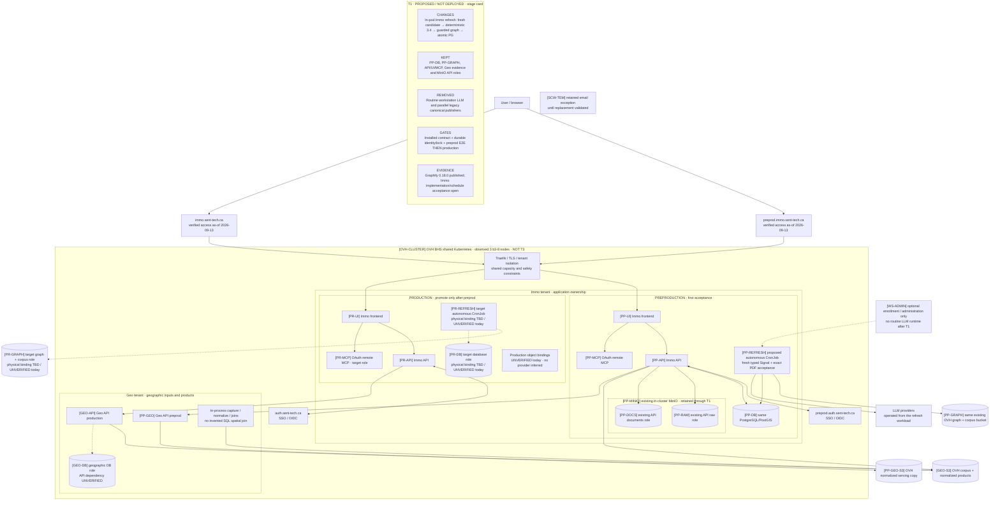
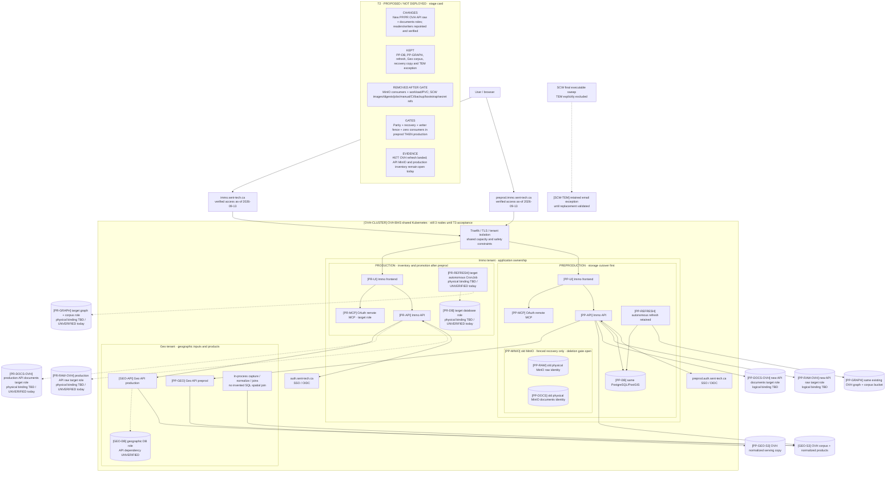

# Sequential target architecture — T1 → T2 → T3

Revision D5, 2026-09-13. These are **proposed, not deployed** states. The
unchanged IDs identify the same logical or physical resource between views. A
production role marked `binding TBD` is a target contract, not observed runtime.
The transition order is fixed; each stage still requires preproduction evidence
before a separately gated production promotion.

## T1 — autonomous refresh, existing storage retained

T1 removes routine workstation execution from the PV-to-Signal path. It keeps
the verified preproduction MinIO API bindings until T2 and does not infer the
unobservable production bindings. The detailed causal pipeline is in
[`proposal.md`](proposal.md).

## T2 — OVH object roles active, old writers fenced

T2 migrates the API raw/document roles to new OVH logical bindings. `PP-RAW`
and `PP-DOCS` remain the physical MinIO identities; they are never reused for
the new buckets. The old store is recovery-only after reader/writer parity and
stays present until the deletion gate. Production bindings remain target roles
until the separately authorized inventory and promotion prove them.

