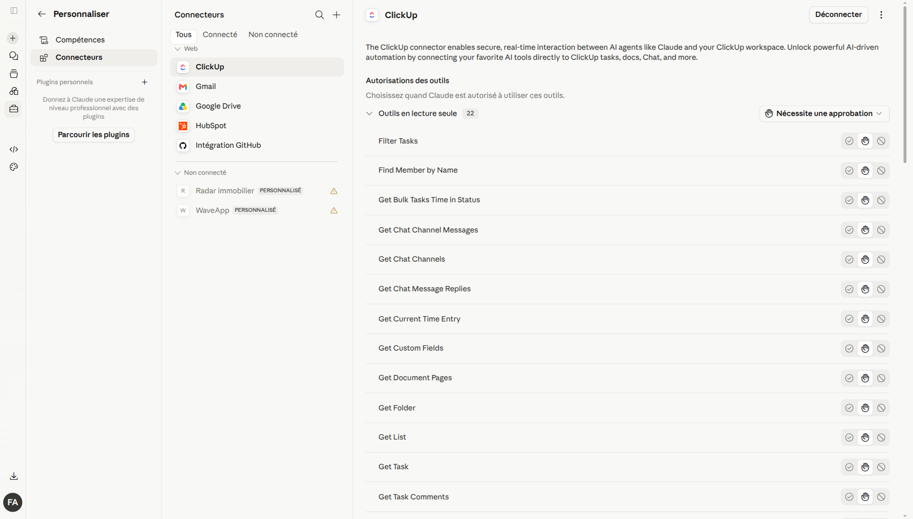
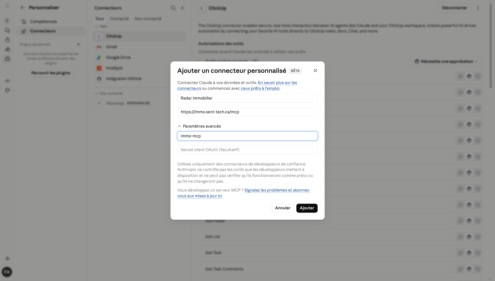
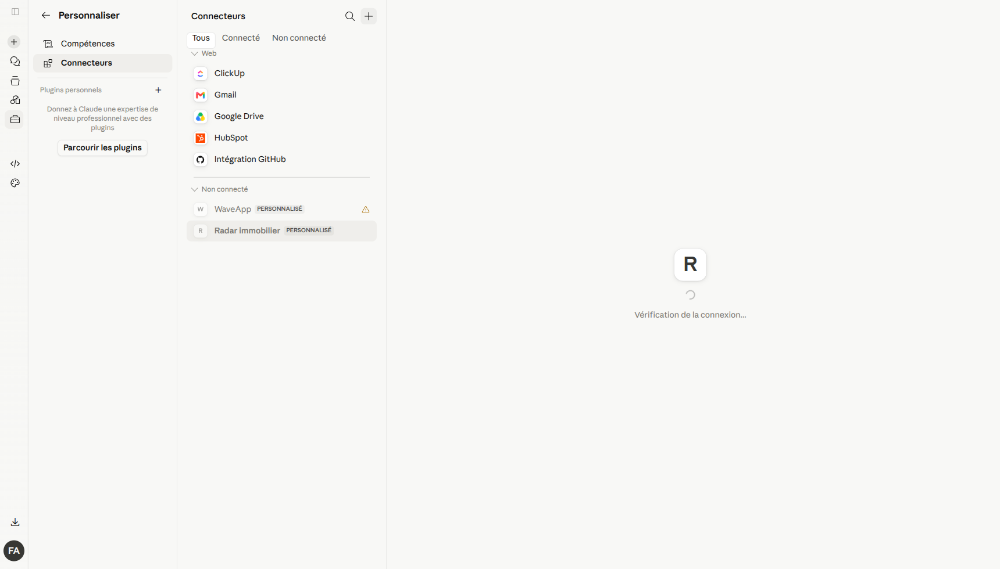
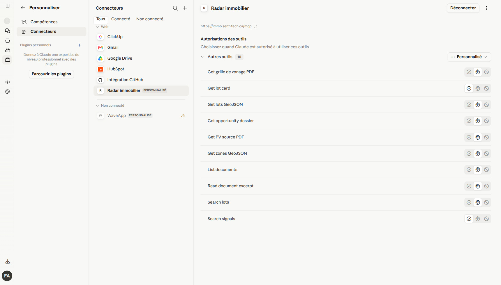
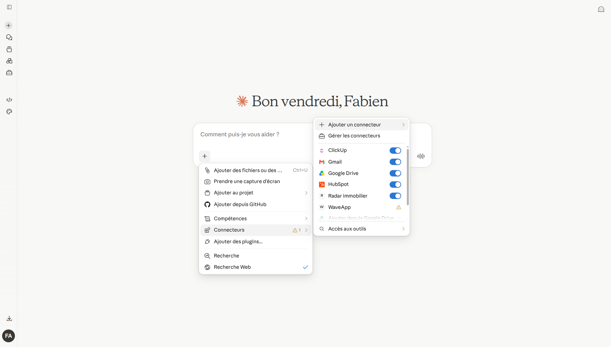
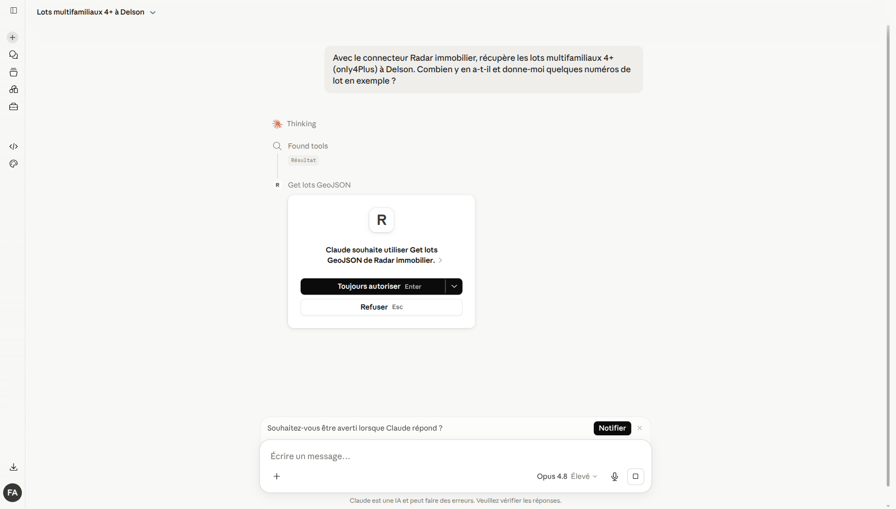
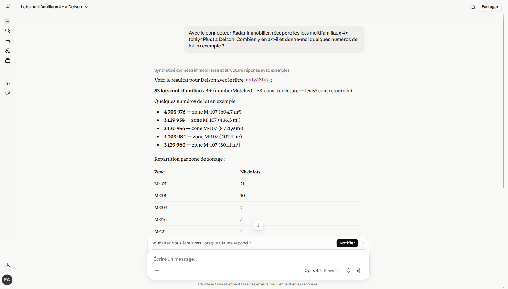
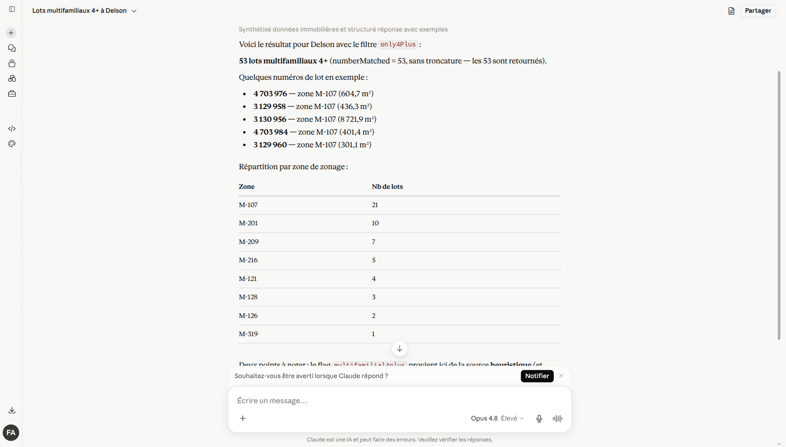
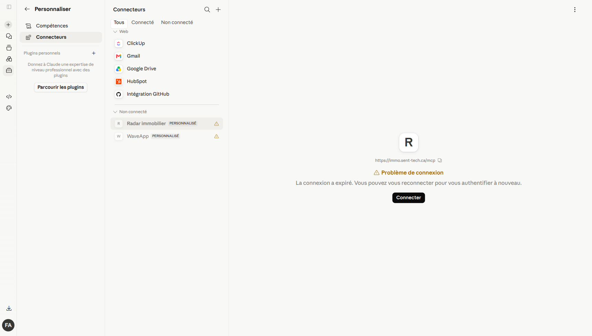
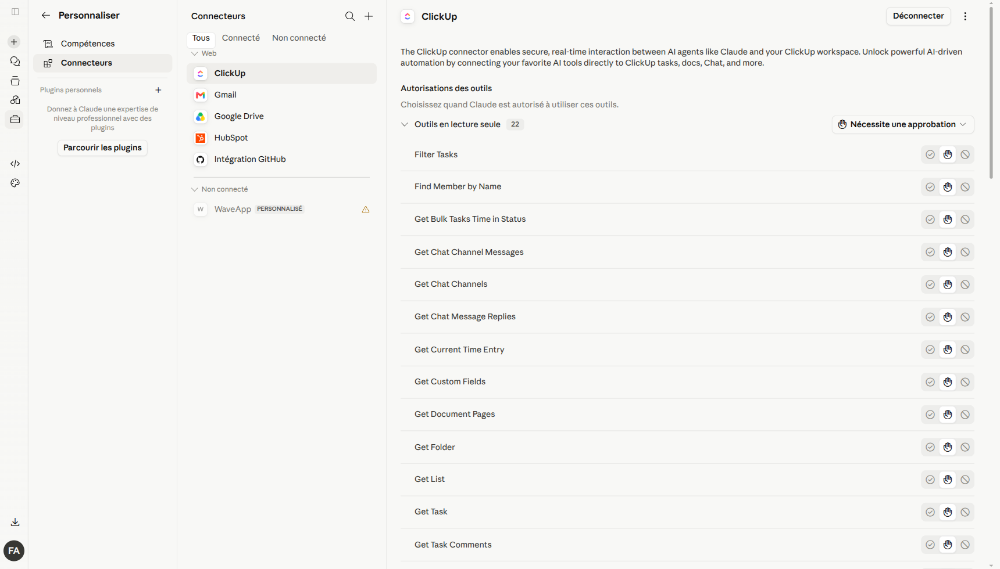

# Ajouter le connecteur « Radar immobilier » sur claude.ai

Guide utilisateur — environ 5 minutes.

## 1. Ce que fait le connecteur

Ce connecteur permet à Claude d'interroger directement les données du **Radar
immobilier** (lots cadastraux, zonage, signaux réglementaires, procès-verbaux)
pendant une conversation, en langage naturel.

Le connecteur est un **serveur MCP distant** (Model Context Protocol) hébergé par
l'équipe. La connexion est sécurisée par **OAuth** (client public + PKCE, sans secret
à saisir) : à la première connexion, Claude vous redirige vers `auth.sent-tech.ca`
pour vous authentifier et accorder les autorisations en lecture.

## 2. Prérequis

- Un compte **claude.ai** payant : **Pro, Max, Team ou Enterprise**.
  (Les connecteurs personnalisés ne sont pas disponibles sur le plan gratuit.)
- Sur **Team / Enterprise**, l'ajout d'un connecteur personnalisé peut être
  réservé à un **administrateur** de l'organisation.
- Un compte **sentropic** valide sur `auth.sent-tech.ca` (fourni par l'équipe),
  utilisé pour la connexion OAuth.

## 3. Paramètres à préparer

| Champ | Valeur |
|---|---|
| **Nom** | `Radar immobilier` |
| **URL du serveur MCP distant** | `https://immo.sent-tech.ca/mcp` |
| **ID client OAuth** (Paramètres avancés) | `immo-mcp` |
| **Secret client OAuth** | *(laisser **vide** — client public + PKCE)* |
| Fournisseur d'identité (OAuth) | `https://auth.sent-tech.ca` |
| Scopes accordés à la connexion | `immo:read`, `immo:search`, `immo:documents:read` |

> Le **secret client doit rester vide** : le serveur est un client OAuth **public**
> qui utilise PKCE. Renseigner un secret ferait échouer la connexion.

---

## 4. Ouvrir la page des connecteurs

Dans claude.ai, ouvrir **Personnaliser → Connecteurs**
(URL directe : `https://claude.ai/customize/connectors`).

La colonne de gauche liste vos connecteurs, regroupés en **Web / connectés** et
**Non connecté**. Les connecteurs personnalisés portent l'étiquette **PERSONNALISÉ**.

> Si un connecteur « Radar immobilier » **défaillant ou expiré** figure déjà dans
> la liste, supprimez-le d'abord : voir la procédure en
> [section 11 (Dépannage)](#11-dépannage).

## 5. Ajouter le connecteur personnalisé

1. En haut de la colonne **Connecteurs**, cliquer sur **＋ (Ajouter un connecteur)**,
   puis choisir **« Ajouter un connecteur personnalisé »**.
2. Dans la boîte de dialogue **« Ajouter un connecteur personnalisé »** :
   - **Nom** : `Radar immobilier`
   - **URL du serveur MCP distant** : `https://immo.sent-tech.ca/mcp`
3. Déplier **Paramètres avancés** et renseigner :
   - **ID client OAuth** : `immo-mcp`
   - **Secret client OAuth** : **laisser vide**
4. Cliquer sur **Ajouter**.

Le connecteur est créé et apparaît dans la liste, d'abord en **« Vérification de la
connexion… »**.

## 6. Autoriser l'accès (OAuth)

Ouvrir le connecteur et cliquer sur **Connecter**. Claude ouvre le flux
d'autorisation OAuth sur **`auth.sent-tech.ca`** :

- si vous êtes **déjà connecté** à `auth.sent-tech.ca`, l'autorisation est accordée
  automatiquement (SSO) et la fenêtre se referme ;
- sinon, connectez-vous avec votre compte sentropic, puis **acceptez** les
  autorisations demandées (scopes `immo:read`, `immo:search`, `immo:documents:read`).

À la fin, claude.ai revient sur la page des connecteurs avec l'état **succès**.

## 7. Vérifier que le connecteur est connecté

Le connecteur passe dans le groupe **connecté** (le bouton en haut à droite devient
**Déconnecter**). Son panneau de détail affiche l'URL et la liste des **outils**
disponibles, sous **« Autorisations des outils »**.

Les **10 outils** exposés (tels qu'affichés dans claude.ai) sont :

`Get grille de zonage PDF` · `Get lot card` · `Get lots GeoJSON` ·
`Get opportunity dossier` · `Get PV source PDF` · `Get zones GeoJSON` ·
`List documents` · `Read document excerpt` · `Search lots` · `Search signals`.

Ils sont détaillés à la [section 9](#9-méthodes-disponibles-les-10-outils).

## 8. Activer le connecteur dans une conversation

Un connecteur est **désactivé par défaut dans chaque nouvelle conversation**. Pour
l'utiliser :

1. Ouvrir (ou démarrer) une conversation.
2. Sous la zone de saisie, cliquer sur **＋ (Rechercher et outils / « Ajouter des
   fichiers, des connecteurs et plus »)** → **Connecteurs**.
3. Activer l'interrupteur **Radar immobilier**.

---

## 9. Méthodes disponibles (les 10 outils)

Tous les outils sont en **lecture seule**. Les paramètres ci-dessous sont ceux
réellement exposés par le serveur ; Claude les remplit lui-même à partir de votre
question. Les valeurs de `city` sont des **slugs** (ex. `longueuil`, `valleyfield`,
`delson`).

### 9.1 Recherche & fiches

| Outil (claude.ai) | Identifiant | Description | Paramètres | Scope |
|---|---|---|---|---|
| **Search lots** | `search_lots` | Recherche de lots par ville et critères. | `city` *(requis)*, `zone`, `no_lot`, `minArea` (m²), `limit` (1–100, défaut 20). | `immo:search` |
| **Get lot card** | `get_lot_card` | Fiche détaillée d'un lot (zonage, superficie, signaux liés). | `city` *(requis)*, `no_lot` *(requis, numéro cadastral exact)*. | `immo:read` |
| **Search signals** | `search_signals` | Recherche de signaux réglementaires par ville. | `city` *(requis)*, `etape` (ex. `avis_motion`, `adoption`, `consultation`), `query` (mot-clé), `limit` (1–100, défaut 20). | `immo:search` |
| **Get opportunity dossier** | `get_opportunity_dossier` | Dossier d'opportunité consolidé (score, lots et signaux liés, rationale). | `city` *(requis)*, `opportunityId` *(requis)*. | `immo:read` |

### 9.2 Documents sources

| Outil (claude.ai) | Identifiant | Description | Paramètres | Scope |
|---|---|---|---|---|
| **List documents** | `list_documents` | Liste les documents sources archivés (procès-verbaux, etc.). | `city` (optionnel), `limit` (1–100, défaut 20). | `immo:documents:read` |
| **Read document excerpt** | `read_document_excerpt` | Lit un **extrait borné** d'un document source. La sortie passe par une **rédaction anti-PII**. | `documentId` *(requis)*, `offset` (défaut 0), `maxChars` (1–4000, défaut 1200). | `immo:documents:read` |
| **Get grille de zonage PDF** | `get_grille_pdf` | URL de la **grille de zonage PDF** (`grillePdfUrl`) d'une zone, quand la source municipale la porte. L'URL retournée est **publique**. | `city` *(requis)*, `zone` *(requis, ex. `H-203`)*. Retourne `found=false` si la zone est inconnue, `grillePdfUrl=null` si la zone existe sans grille. | `immo:documents:read` |
| **Get PV source PDF** | `get_pv_pdf` | URL servie du **procès-verbal source** (PDF archivé) d'un signal + métadonnées (ville, content-type). Le PDF n'est **jamais** inliné dans la réponse. | `rawRef` *(requis)* — référence brute du document (ex. `raw/proces-verbaux-<ville>/cas/<sha>.pdf`). | `immo:documents:read` |

### 9.3 Données géographiques (GeoJSON)

Ces deux outils renvoient des **FeatureCollection GeoJSON** et sont **bornés** pour
ne jamais inonder la conversation :

- `limit` : défaut **500**, maximum **2000** ;
- `bbox` **obligatoire** dès que `limit > 500` — emprise `[minLon, minLat, maxLon, maxLat]`
  en WGS84 (ex. `[-73.53, 45.52, -73.5, 45.55]`) ;
- une ville peut dépasser **15 000 lots** : on **pagine par bbox** ;
- la réponse indique `numberMatched` / `numberReturned` / `truncated`. Si
  `truncated=true`, **resserrez le bbox** ;
- garde-fou dur : une réponse ne peut pas dépasser ~1 Mo (sinon réduire `limit`
  ou le `bbox`).

| Outil (claude.ai) | Identifiant | Description | Paramètres | Scope |
|---|---|---|---|---|
| **Get zones GeoJSON** | `get_zones_geojson` | Zones de zonage d'une ville (code de zone, `kind`, grille PDF et propriétés sources). | `city` *(requis)*, `bbox`, `limit`. | `immo:read` |
| **Get lots GeoJSON** | `get_lots_geojson` | Lots cadastraux d'une ville, **enrichis côté serveur** : zone jointe (`zone.code/kind/densiteLogHa/usages/grillePdfUrl`), `zoneCode`, `multifamilial4plus` (+ `multifamilial4plusSource: grille｜heuristique`), `superficieM2`, `tod`/`priorite` quand la source les porte. | `city` *(requis)*, `bbox`, `limit`, **`only4Plus`** (ne garder que les lots `multifamilial4plus === true`), **`superficieMinM2`** (superficie minimale en m²). Les filtres s'appliquent sur la page récupérée. | `immo:read` |

---

## 10. Cas d'usage illustré

Question posée dans une conversation (connecteur activé) :

> *« Avec le connecteur Radar immobilier, récupère les lots multifamiliaux 4+
> (only4Plus) à Delson. Combien y en a-t-il et donne-moi quelques numéros de lot en
> exemple ? »*

Claude reconnaît l'outil pertinent — **Get lots GeoJSON** (`get_lots_geojson`) — et
demande votre autorisation avant le premier appel (**« Toujours autoriser » / « Refuser »**).
C'est un garde-fou standard des connecteurs personnalisés.

Après autorisation, Claude appelle l'outil avec `city = delson` et `only4Plus = true`,
récupère le GeoJSON borné, puis synthétise :

Réponse obtenue (données réelles) : **53 lots multifamiliaux 4+ à Delson**
(`numberMatched = 53`, `truncated = false` — les 53 sont retournés), avec des
exemples de numéros de lot, leur zone et leur superficie, et une répartition par zone
de zonage. Claude signale aussi que le drapeau `multifamilial4plus` provient ici de la
**source heuristique** (et non d'une grille de zonage extraite) — à valider au cas par
cas.

Quelques autres questions typiques :

- « Quels **signaux de rezonage récents** à Sainte-Catherine ? » → `search_signals`
- « Cherche les signaux **PPCMOI** dans Roussillon » → `search_signals` (`query`)
- « Montre-moi le **procès-verbal source** de ce signal » → `get_pv_pdf`
- « Donne-moi la **grille de zonage** de la zone H-203 à Longueuil » → `get_grille_pdf`
- « Ouvre la **fiche** du lot 3 129 958 à Delson » → `get_lot_card`

---

## 11. Dépannage

- **La fenêtre OAuth ne s'ouvre pas / erreur au moment de « Connecter »** — vérifier
  l'**ID client OAuth** (Paramètres avancés) : il doit valoir exactement `immo-mcp`,
  sans espace, et le **secret** doit rester **vide**.
- **« Problème de connexion / La connexion a expiré »** — la session OAuth a expiré :
  rouvrir le connecteur et cliquer **Connecter** pour ré-autoriser. Si le problème
  persiste, **supprimer** puis **recréer** le connecteur (procédure de suppression
  ci-dessous, puis sections 5–6).
- **401 après connexion** — les autorisations n'ont pas été accordées : refaire le
  flux et **accepter** les scopes.
- **Le connecteur n'apparaît pas / n'est pas utilisé dans une conversation** —
  l'activer dans **Rechercher et outils → Connecteurs** (il est **désactivé par
  défaut** dans chaque conversation, cf. section 8).
- **Un popup a été bloqué à l'ajout** — cliquez ensuite sur **Connecter** dans le
  détail du connecteur pour relancer l'autorisation.
- **Réponse GeoJSON tronquée** (`truncated=true`) ou « réponse trop grande » —
  demandez à Claude de **resserrer le bbox** ou de **réduire `limit`** (voir les
  bornes en section 9.3).

### Si vous avez déjà un connecteur « Radar immobilier » défaillant ou expiré : supprimez-le d'abord

Si un connecteur « Radar immobilier » existe déjà mais est cassé (état
**« Problème de connexion / La connexion a expiré »**), le plus simple pour repartir
proprement est de le supprimer puis de le recréer.

Cliquer sur le connecteur pour ouvrir son panneau de détail : on y voit son URL et son
état de connexion.

En haut à droite du panneau, ouvrir le menu **« … » (Plus d'options)** →
**Supprimer**, puis confirmer dans la boîte de dialogue **« Supprimer Radar
immobilier ? »**. Le connecteur disparaît de la liste.

Recréez ensuite le connecteur en suivant les sections 5 (ajout) et 6 (autorisation
OAuth).

## 12. Références

- Documentation Anthropic : *Getting started with custom connectors using remote MCP*
  (`support.claude.com`).
- Runbook interne (déploiement, OAuth RS, manifests) :
  `docs/spec/mcp/immo-mcp-remote-deploy.md`.
- Fiche paramètres condensée : `docs/spec/mcp/claude-ai-connector-setup.md`.
