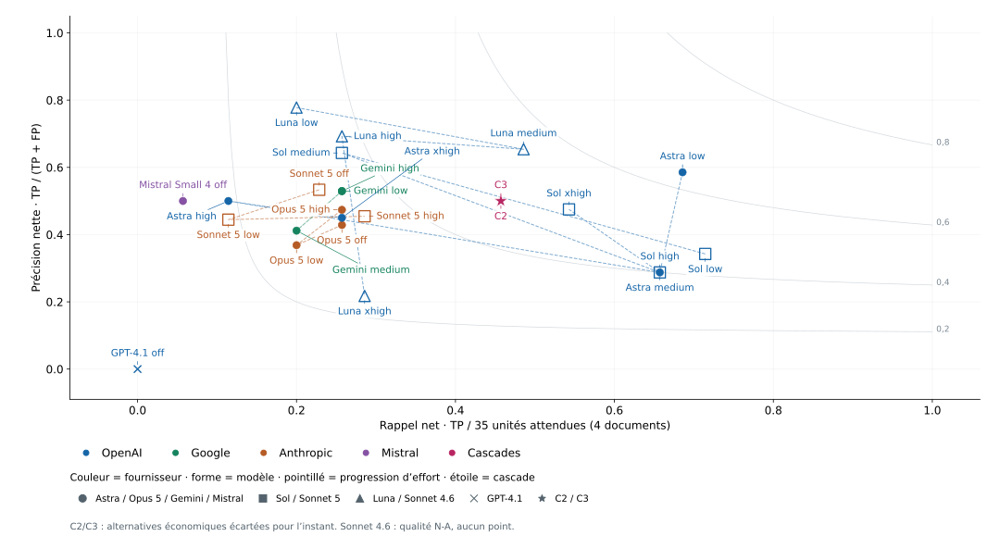
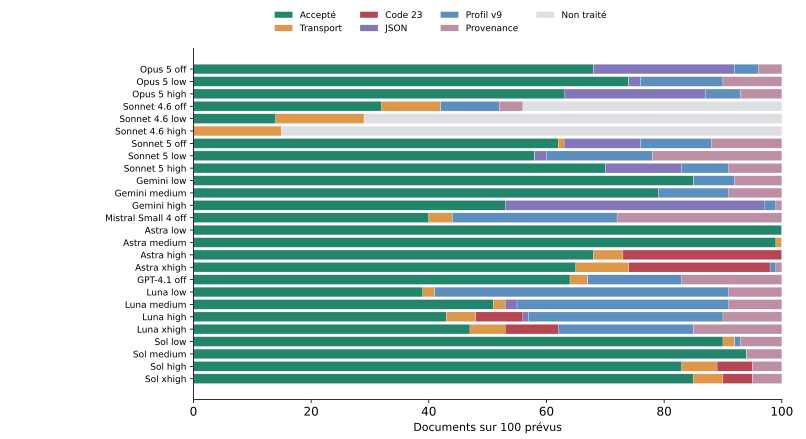

# Quel modèle pour lire les documents municipaux ?

**Benchmark v101b · Rapport v8 finale · 17 septembre 2026** 
Rédaction : lane rapport-v8-astra, GPT-6 Astra, effort high. Version finale non commitée, à relire par le conducteur.

## 1. Résumé exécutif

**Décision finale : `gpt-6-astra`, effort low, en modèle principal ; `gemini-3.8-flash`, effort low, en repli.**

**Un choix de qualité assumé.** Astra low accepte **100/100 documents**, sans refus qualité, et atteint un **F1 net de 0,632**, très au-dessus de C2/C3 (**0,478**) et de Gemini low seul (**0,346**). Le F1 porte sur **4 documents annotés / 35 unités**, refus comptés en manqué ; sur 100 documents, il reste **N-A**.

**Surcoût assumé :** Astra low coûte **0,407 USD/document à l’API**, ou **0,018 USD/document au siège Codex Pro 20x**, contre **0,038** et **0,0014** pour Gemini low. Le coût siège est une allocation à pleine capacité, distincte de la facture fixe.

**Repli déjà prouvé :** Gemini low a été accepté dans le job à repli forcé du **17 septembre 2026** en préproduction (Waterloo, **1 877 ms**, raison `forced`). **Gemini high est écarté : 53/100 acceptés, 44 refus JSON**, contre 85/100 acceptés et 15 refus au total pour low.

**C2 et C3 restent des alternatives économiques écartées pour l’instant**, à réexaminer si le volume explose. Leurs lignes, points et mesures sont conservés ; elles ne constituent pas la décision finale.

**Limites et état mesuré.** Quatre documents ont un oracle complet : aucune supériorité statistique sur les 100 villes n’est établie. Le rejeu historique de la cascade (18 documents acceptés, zéro signal matérialisé) reste détaillé en section 10. La bascule demandée et les nouveaux signaux restent à vérifier après intervention du conducteur. N-A signifie « non disponible ou non calculable » ; coûts en USD hors taxes.

**Version finale v8.** Noms en police normale dans les deux graphiques ; couleur par fournisseur et forme par modèle en précision-rappel. Performance/coût : losange siège, rond API.

<!-- page:portrait -->

## 2. Ce qu’on a mesuré et comment

Le corpus contient **100 documents municipaux de 2026, dans 100 villes** : principalement des procès-verbaux, mais aussi des ordres du jour. Un procès-verbal rapporte des décisions prises ; un ordre du jour annonce des points à traiter. Cette différence compte lorsqu’on décrit l’étape d’une procédure.

Le corpus est **gelé** : chaque fichier et son texte de page sont identifiés par une empreinte numérique, afin de vérifier qu’ils ne changent pas entre deux essais. La sélection comprend 32 petits documents, 32 moyens, 31 grands et cinq documents de référence, issus d’un ensemble admissible de 536 documents dans 225 villes.

### La tâche confiée au modèle

Le modèle doit relever les actes d’urbanisme : modification de zonage, règlement, dérogation, projet particulier ou autre événement pertinent. Il doit indiquer l’étape observée et fournir des **citations vérifiables**, avec la page physique du PDF et le passage copié. Une information absente du document ne doit pas être inventée.

Un **bras** est une configuration « modèle + effort ». L’effort règle la quantité de raisonnement demandée : `off` (désactivé), `low` (faible), `medium` (moyen), `high` (élevé), `xhigh` (très élevé). Ce réglage n’est pas une note de qualité. Les 26 bras sont exécutés ; les trois Sonnet 4.6 restent partiels après interruption liée aux quotas. Le bras supplémentaire `opus5-cli-off`, sans aucun document, est exclu du tableau des 26.

### Cinq couches avant de dire « accepté »

| Couche | Question posée par le contrôle |
|---|---|
| **Transport** | La requête a-t-elle abouti et le flux de réponse s’est-il terminé avec une sortie exploitable ? Un code HTTP 200 ne suffit pas. |
| **JSON** | La réponse est-elle lisible comme un objet de données structuré, sans commentaire autour ? |
| **Contrat v9** | Respecte-t-elle les champs, les types d’entités, les relations et les preuves exigés par le produit ? Le « profil » est cet ensemble de règles métier. |
| **Provenance** | Chaque citation renvoie-t-elle au bon PDF, à une page autorisée et à un passage effectivement présent sur cette page ? |
| **Accepté** | Les contrôles précédents permettent-ils d’utiliser l’extraction ? Cela ne garantit pas qu’elle ait trouvé tous les actes intéressants. |

Un **reçu v2** est le journal technique d’une tentative : modèle demandé, durée, consommation, résultat et cause du refus. « v2 » désigne le format du reçu, indépendamment de la version du contrat et de la référence de qualité. Un rejeu crée un nouveau reçu ; les anciens restent intacts.

Les données v101b réutilisent les résultats GPT-4.1 et Mistral de v101 ; les 24 autres bras sont relancés. Le plafond visé est **32 768 jetons de sortie**. Un jeton est un fragment de texte compté pour l’usage et la facturation. Le service Codex rejette le paramètre de plafond : ses rejeux l’omettent et portent `cap.enforced=false`. Le protocole et les reçus corrigent sur ce point l’annonce générale « wire-enforced » du manifeste ; les plafonds ne sont donc pas équivalents entre tous les transports.

<!-- page:portrait -->

## 3. Le contrat d’extraction immo-pv-extraction-v9

Le contrat est **la règle d’admission des données dans le radar**. Il transforme « le modèle a répondu » en « nous disposons d’une information structurée dont les citations sont contrôlables ».

### Ce que le code impose aujourd’hui

1. **Du JSON strict, sans texte autour.** Le code accepte aussi un unique bloc délimité par trois accents graves, avec le libellé `json` ou sans libellé. Deux blocs, un préambule ou un commentaire final sont refusés. Ce retrait d’enveloppe ne répare pas un JSON incomplet.
2. **Une citation pour chaque entité et chaque relation.** Un *nœud* représente une entité, par exemple un règlement ; une *arête* représente une relation entre deux entités. Chaque nœud et chaque arête doit porter au moins une citation compacte `{page, excerpt}` : `excerpt` signifie « extrait ».
3. **Un extrait assez long pour faire preuve.** Pour les citations de nœuds et d’arêtes, il faut au moins **20 points de code Unicode** — unités de caractère informatique — et au moins **12 lettres ou chiffres après normalisation**. Le code garde au maximum les **200 premiers points de code**, puis contrôle à nouveau leur présence sur la page. Il raccourcit un préfixe ; il ne complète jamais une phrase.
4. **Un ancrage sur la page citée.** L’*ancrage* est la recherche de l’extrait dans le texte de cette page. La normalisation NFKC rapproche les formes typographiques équivalentes ; le code neutralise ensuite casse, accents, espaces et ponctuation. Il exige toujours la même suite de lettres et chiffres, dans le même ordre. Une paraphrase ou une citation prise sur une autre page demeure refusée.
5. **Une identité PDF maîtrisée par le code.** Pour les citations compactes des entités, le code injecte le fichier, sa référence de stockage, son empreinte, son URL et la modalité PDF. Le modèle ne choisit pas cette identité. En revanche, les objets séparés de preuve `evidence[]` doivent recopier l’identité complète fournie par le schéma ; elle y est vérifiée, pas injectée. Leur extrait n’est pas tronqué à 200, mais doit franchir le plancher de 12 caractères normalisés.
6. **Des références de preuve explicites.** `evidence_refs` est une liste d’identifiants qui pointent vers `evidence[].id`, pas une liste d’objets incorporés. Elle est obligatoire pour chaque arête et les types de nœuds désignés par le profil. Ces références ne remplacent pas les citations.
7. **Des valeurs de statut autorisées.** La liste de statuts est exposée à chaque type d’entité. Le code actuel répète la même liste du profil pour tous les types : il ne faut pas en déduire des vocabulaires différents par type, malgré la formulation du prompt.
8. **Une version contrôlée si elle est déclarée.** `contract_version` doit alors valoir exactement `immo-pv-extraction-v9`, sinon le refus se nomme `contract_version_mismatch`. L’absence du champ reste acceptée pour compatibilité historique ; tous les autres contrôles continuent de s’appliquer.

**Exemple réel, Saint-Étienne-de-Bolton.** « Zone : RUR-12 » est un libellé, insuffisant pour prouver une décision. Le code de zone va dans une propriété. La citation doit reprendre le passage : « QUE le conseil municipal autorise, sur recommandation du CCU, ». Sur un ordre du jour, on cite le point annoncé ; on ne transforme pas cette annonce en décision adoptée.

<!-- page:portrait -->

### Pourquoi le contrat a changé pendant les tests

Les versions successives répondent à des erreurs observées. Les chiffres des campagnes historiques à cinq documents sont séparés du benchmark v101b à 100 documents.

| Étape | Problème constaté et correction |
|---|---|
| **v3 : lecture directe** | Une réponse entourée d’un bloc Markdown échouait même si son contenu était du JSON valide. |
| **v4 : enveloppe unique** | Le parseur retire un seul bloc autorisé ; il conserve la cause native de l’erreur JSON pour rendre le diagnostic utile. Il refuse toujours les commentaires et les sorties multiples. |
| **v5 : citations compactes — PR #687** | Répéter l’identité complète du PDF sur chaque citation allongeait les réponses et multipliait les occasions de se tromper. Le modèle fournit page et extrait ; le code injecte l’identité. La revue fait appliquer réellement la borne 200 et contrôler les versions déclarées. Elle remplace aussi un parseur susceptible de ralentir fortement sur une entrée longue. |
| **v6 : statuts alignés** | Les indications de statut devaient correspondre aux valeurs réellement acceptées. La liste du validateur est exposée dans chaque type du schéma. |
| **v7 : typographie normalisée** | Les différences de casse, d’accents ou de ponctuation pouvaient empêcher de reconnaître un passage. L’ancrage neutralise ces différences, tout en restant local à la page et exact sur lettres et chiffres. |
| **v8 : borne par troncature** | Des extraits fidèles dépassaient la limite de 1 à 7 caractères. Le code garde leurs 200 premiers points de code et les revérifie. Une consigne de longueur seule ne suffisait pas. |
| **v9 : acte et planchers nommés — PR #688** | Les modèles citaient des codes de zone trop courts. Le contrôle impose les deux planchers et nomme `entity_citation_excerpt_too_short`. Pour les preuves séparées, `excerpt_below_anchor_floor` distingue « trop court pour prouver » de « absent de la page ». La forme compacte est retirée du bloc `evidence`, où elle était annoncée à tort. |

Une première formulation v9 a produit une extraction **acceptée mais vide** sur l’ordre du jour de Valcourt : le modèle cherchait uniquement des décisions prises. La consigne a été corrigée pour reconnaître les points annoncés. Cet épisode explique pourquoi le taux d’acceptation doit toujours être lu avec une mesure de couverture.

### Les effets mesurés, avec leur périmètre

La référence de qualité, appelée **oracle**, a aussi été réalignée : numérotation des points ignorée, règlements admis parmi les candidats, autres passages de preuve autorisés lorsqu’ils sont vérifiés. Sur les **mêmes sorties historiques v13 de Gemini**, le F1 passe de **0,133 à 0,389**. C’est une correction de la mesure, pas un gain de modèle attribuable à elle seule au contrat.

Sous v9, les campagnes **v14 et v15 font chacune 5/5 acceptés**, avec F1 v2 de **0,576 et 0,582**. Aucune des 197 citations d’entités n’est sous 20 points de code, contre 17 sur 331 citations v13. Les deux campagnes retrouvent le même nombre d’unités de référence.

La campagne **v16, après les corrections de revue, fait 3/5**, F1 de 0,566 sur ses acceptés : deux erreurs de page sont rejetées, sans défaut de forme compacte ni de plancher. Les dix anciennes sorties v14/v15 restent acceptées par ce validateur. Les succès 5/5 ne constituent donc pas une garantie universelle ; le contrôle de page a continué à intercepter de vraies erreurs du modèle.

<!-- page:portrait -->

## 4. F1, précision et rappel : quelle qualité a-t-on obtenue ?

La **précision** répond à « parmi les actes produits, combien correspondent à la référence ? ». Le **rappel** répond à « parmi les actes attendus, combien ont été retrouvés ? ». Le **F1**, de 0 à 1, combine les deux ; il baisse si l’un est faible. Formellement : P = TP/(TP+FP), R = TP/(TP+FN), F1 = 2TP/(2TP+FP+FN). TP désigne un acte correctement retrouvé, FP un résultat sans correspondance, FN un acte manqué.

La précision traduit « ne pas ajouter d’actes inexacts ou mal rattachés » ; le rappel traduit « ne pas manquer d’actes attendus ». Le F1 équilibre les deux. Un faux positif fait baisser la précision, une omission fait baisser le rappel ; un refus technique empêche d’utiliser la sortie et laisse ses actes attendus manquants dans la mesure nette.

**Exemple chiffré réel : Gemini low sur Valcourt.** Sur six actes de référence, cinq sont retrouvés. Sept groupes sont produits : cinq corrects, un groupe sans correspondance et un doublon. Précision **5/7**, rappel **5/6**, F1 **10/13 = 0,769**. Le doublon baisse la précision sans constituer une invention. Les illustrations suivantes montrent les différences sur le contenu réel.

**Mesure nette après acceptation :** TP = unités attendues retrouvées dans les sorties acceptées ; FP = groupes supplémentaires ou doublons ; tout document refusé ajoute ses unités attendues aux FN. Précision = TP/(TP+FP), rappel = TP/(TP+FN), F1 = 2TP/(2TP+FP+FN). Le dénominateur attendu reste fixe, même quand une sortie est refusée. Les 100 documents sont inventoriés, mais seuls **4 ont un oracle complet, soit 35 unités** ; Waterloo est partiel et 95 documents sont sans annotation. **P/R/F1 nets sur 100 : N-A (source-gap).** Les chiffres et le graphique nets portent donc sur ces 4 documents, sans assimiler une annotation absente à zéro acte attendu.

**Pourquoi Luna high n’est plus en tête :** ses refus de deux documents annotés comptent désormais leurs 25 unités attendues en manqué ; avec TP = 9, FP = 4 et FN = 26, son rappel net tombe à **0,257** et son F1 net à **0,375**, contre **0,632 pour Astra low**. Ses 57 refus sur 100 restent mesurés séparément ; multiplier le rappel brut par 43 % ne donnerait pas le rappel documentaire net.

**Les cas concrets avant la méthode de référence.** Les pages suivantes montrent une réussite, une erreur de précision, une omission et les quatre classes de refus demandées. La construction de l’oracle et le rôle des juges viennent ensuite.

<!-- page:portrait -->

### Exemples concrets — du passage municipal au signal

Les quatre illustrations suivantes viennent des textes gelés, des sorties brutes et des reçus de validation. Les noms de personnes, adresses privées et identifiants techniques inutiles sont omis ou remplacés par des crochets. Les numéros de règlement et de zone restent ceux des sources publiques. Les citations conservent leurs mots ; les retours de ligne sont réduits à des espaces pour la lecture.

**a) Une information correctement extraite : un projet de densification.** Dans le [procès-verbal de Saint-Barthélemy du 8 septembre 2026](https://www.saint-barthelemy.ca/storage/app/media/municipalite/conseil-municipal/ordre-du-jour-et-proces-verbaux/Proc%C3%A8s-verbaux/2026/Proc%C3%A8s-verbal%20-%20S%C3%A9ance%20ordinaire%20-%208%20septembre%202026.pdf), **page physique 5**, le passage dit : « Le but du présent règlement est de permettre la densification des zones R-7 et R-8 ». La même page précise : « MODIFICATION DE LA GRILLE DE SPÉCIFICATION (ANNEXE I) AFIN D’AJOUTER LES USAGES HABITATION II ET III DANS LES ZONES R-7 ET R-8 ».

Gemini low produit un nœud `Signal`, intitulé **« Signal densification zones R-7 et R-8 »**, de catégorie `densification`, à l’étape `projet_reglement`, daté du 8 septembre et rattaché au règlement **739-26**. Une relation `raises_signal` le relie à l’événement de la résolution **2026-09-191**, avec la citation page 5. L’unité de référence **S739P** est retrouvée. Pour le radar, cela fournit une alerte de projet de densification à suivre ; ce premier projet ne prouve pas une autorisation finale de construire. Le même passage conditionne certains usages à la présence d’égout et d’aqueduc. **La sortie est mesurée ; sa matérialisation comme nouveau signal en préproduction n’est pas démontrée par ce benchmark.**

**b) Une erreur de précision : une étape rattachée au mauvais passage.** L’[ordre du jour de Lac-des-Seize-Îles](https://www.lac-des-seize-iles.com/fichiersUpload/fichiers/20260911113130-projet-odj-septembre-2026.pdf), **page 1**, distingue « **3.6 Avis de motion – Projet de règlement numéro 2026-08 régissant l’occupation du domaine public municipal** » et « **3.7 Dépôt du projet de règlement numéro 2026-08 régissant l’occupation du domaine public municipal** ».

Le nœud `Bylaw` produit par Gemini low porte `stage: "projet"` mais cite le **point 3.6**, celui de l’avis de motion. La référence attend **L36 = avis_motion** à 3.6 et **L37 = projet_reglement** à 3.7. Le couple étape/passage produit ne correspond à aucun des deux : il compte comme résultat supplémentaire sans correspondance, donc fait baisser la précision. Le nom du règlement existe bien ; **l’erreur est son rattachement à l’étape**, pas l’invention d’un règlement. Le radar risque de présenter un avancement de procédure mal étayé. Les deux points demeurent annoncés dans un ordre du jour.

*Pistes de preuve : `campaign/gemini-low/saint-barthelemy-2026-09-08--gemini-low.attempt-1.{raw.txt,output.json,receipt.json}` ; même chemin avec `lac-des-seize-iles-2026-09-agenda` ; textes PDF gelés et `manual-oracle-v2.json`, unités S739P, L36 et L37.*

<!-- page:portrait -->

### Exemples concrets — omission et refus de validation

**c) Une non-détection : l’acquisition qui facilite le développement.** Le procès-verbal de Saint-Barthélemy, **page 7**, précise : « **la récupération de ce matricule par la Municipalité facilitera le développement de certains terrains dans ce secteur** ». La résolution autorise l’achat de l’immeuble de la Montée du Lac-Robert, identifié par un matricule fiscal `[masqué]`. La référence **S195**, à l’étape `adoption`, attend cet acte foncier.

La sortie Gemini low ne contient aucun nœud sur cette acquisition ; ses unités retrouvées sont S738 et S739P. S195 est donc un acte manqué : le rappel diminue et l’utilisateur perd un indice de développement rendu possible par une maîtrise foncière municipale. Un matricule fiscal ne doit pas être transformé en numéro de lot cadastral. Ici, l’omission est visible dans le contenu lui-même ; elle ne vient pas seulement d’une différence d’ancrage.

**d) Quatre classes de refus : ce qui a été renvoyé et la règle appliquée.** Les messages ci-dessous sont ceux des reçus, **à la seule substitution de l’identifiant de fragment par `[fragment]`**. Un fragment est la portion du document envoyée au modèle.

| Classe | Sortie réelle et contrôle qui échoue | Message exact du reçu, identifiant anonymisé |
|---|---|---|
| **JSON** · Gemini high, Acton Vale | Le fichier brut s’arrête au milieu de `"sourceUrl": "https://ville.actonvale.qc.ca/wp-content/uploads/2026` : chaîne sans guillemet final, objet incomplet. | `Invalid JSON for chunk [fragment]: Unterminated string in JSON at position 20034 (line 501 column 74)` |
| **Profil v9** · Gemini low, Coteau-du-Lac | Une relation `lifecycle_predecessor` porte `confidence: "INFERRED"`. Cette relation déduite n’est pas admissible dans l’extraction exigeant des relations étayées. | `Invalid profile extraction for chunk [fragment]: inferred_relation_disallowed` |
| **Provenance** · Gemini low, Berthier-sur-Mer | La preuve `ev-3` cite page 5 : « CONSIDÉRANT QUE la zone Rb 23, ainsique la création d'une nouvelle zone Rd.5, sont situées à l'intérieur du périmètre d'urbanisation de la Municipalité ». La page 5 s’arrête après « Rd.5, » ; la suite déborde sur la page suivante. La citation complète ne s’ancre pas sur la page annoncée. | `Model output has ungrounded PDF excerpt for chunk [fragment]` |
| **Code 23** · Luna high, Beloeil | Aucune sortie brute ni extraction à relire ; le reçu indique une fin de flux en échec. Le validateur JSON n’a pas été atteint. | Objet d’erreur exact : `{"category":"terminal","code":"23","httpStatus":200}`. **Aucun message textuel n’est conservé** ; le champ d’erreur v9 vaut `null`. |

*Pistes : mêmes dossiers `campaign/<bras>/` pour les trois premiers, `codex-replay/campaign/luna-high/` pour Beloeil ; reçus `.attempt-1.receipt.json` et sorties `.raw.txt` correspondantes. Omission : sortie Saint-Barthélemy et unité S195. Les quatre catégories sont distinctes d’un score sémantique faible sur une sortie acceptée.*

<!-- page:portrait -->

### Une référence annotée pour comparer les extractions

Une **unité oracle** est un acte annoté avec son étape, son passage de preuve, sa page et l’identité du PDF. Le scoreur rapproche les entités admissibles — signal, événement et règlement — en regroupant celles liées au même signal. Il compare étape et ancre normalisées, en vérifiant leur provenance. Sans annotation, la qualité du document reste inconnue.

### Construction et validation de l’oracle v2

La référence initiale annotée manuellement comporte **36 unités sur cinq documents**. La v2 garde ces unités, ajoute **zéro unité et dix sites de citation alternatifs** vérifiés dans les textes gelés. Elle retire les numéros de points dans les ancres, admet les règlements parmi les candidats et accepte les sites alternatifs explicitement documentés. Les tests historiques de l’oracle passent 7/7 et les contrôles v13 27/27 ; ils n’ont pas été relancés pour cette rédaction.

Waterloo possède une référence partielle et est exclue des moyennes : il reste **quatre documents complètement annotés**. Quatre unités ont une étape `inconnu`, difficile à apparier ; le regroupement de plusieurs règlements sous une seule résolution limite aussi l’interprétation du rappel. L’oracle reste une référence perfectible et étroite.

**Macro** donne le même poids à chaque document noté. **Micro** additionne les actes corrects, manqués et supplémentaires avant calcul : les documents les plus denses pèsent davantage. La v6 emploie le calcul micro net sur une base fixe de 35 unités. Pour Gemini low : TP = 9, FP = 8, FN = 26, F1 net = 0,346 ; la moyenne macro brute 0,518 ne portait que sur les trois sorties annotées acceptées. Les valeurs brutes sont conservées en annexe.

### Les juges aveugles : un contrôle complémentaire

**Terra : 605/605 verdicts exploitables ; Opus 4.6 : 149/605, donc partiel.** Sur les 149 paires disponibles, les juges donnent la même note d’utilité dans **71/149 cas (47,7 %)** ; l’écart absolu moyen vaut **0,544 point sur l’échelle 1–5**. Ce résultat décrit les paires disponibles, sans extrapolation aux 605. La collecte filtre les erreurs et les intentions de requête ; un fichier présent ou un processus terminé n’est pas nécessairement un verdict exploitable.

L’accord avec l’oracle n’est pas exprimé comme un pourcentage de notes identiques : une note d’utilité de 1 à 5 et un F1 de 0 à 1 ne sont pas la même mesure. Les champs « juge/oracle » de l’agrégat fourni comparent ces échelles et incluent des documents non annotés ; ils ne prouvent pas une validation de l’oracle. Les juges apportent une relecture des omissions et des citations ; ils ne remplacent pas une annotation humaine étendue.

<!-- page:portrait -->

### Gemini low seul contre cascade C2

*Alternatives économiques C2/C3 : écartées pour l’instant ; principal retenu : Astra low.*

> **Comparaison directe — le F1 net progresse de 38 %.** Sur la même référence fixe de 35 unités, C2 passe de 0,346 à **0,478** (environ +0,132 ; **+38 %**). Sur le corpus de 100 documents, elle supprime les 15 refus. Ces deux résultats ont des périmètres distincts : le gain de qualité est mesuré sur quatre documents, l’acceptation sur 100.

| Configuration | Acceptés /100 | F1 net · 4 documents, refus comptés en manqué | F1 net · 100 documents, refus comptés en manqué | F1 sur documents acceptés seulement · non comparable entre bras |
|---|---:|---:|---:|---:|
| C2 | **100** | **0,478** | N-A | 0,498 · 4 documents |
| C3 | **100** | **0,478** | N-A | 0,498 · 4 documents |
| Gemini low seul | 85 | 0,346 | N-A | 0,518 · 3 documents |

**Lecture :** tri décroissant et gras sur le F1 net, seule mesure de qualité comparable ici à référence fixe. Sur les seuls acceptés, l’écart apparent de **−0,020** (0,498 contre 0,518) provient de populations différentes : trois documents pour Gemini seul, quatre après rejeu. Le brut est une moyenne macro ; le net agrège TP/FP/FN. Les scores sur 100 restent **N-A — source-gap**, faute d’oracle complet.

**D’où vient le gain mesuré ?** Gemini seul : TP = 9, FP = 8, FN = 26. La cascade récupère Saint-Étienne-de-Bolton au premier rejeu : +7 TP et +8 FP ; TP = 16, FP = 16, FN = 19. Le gain net vient donc ici du second essai Gemini. Les sorties initiales déjà acceptées sont conservées.

**Pourquoi C2 et C3 ont la même qualité mesurée.** Les quatre sorties annotées retenues sont identiques et toutes issues de Gemini : **trois au premier appel, Saint-Étienne-de-Bolton au deuxième**. Astra n’intervient sur aucun document de la référence. Les deux cascades diffèrent par leurs coûts, leurs durées et leur répartition Gemini/Astra sur les documents non annotés ; leur différence de qualité sur ces documents reste inconnue. Affirmer « quatre acceptés au premier appel » contredirait les reçus.

**Compléter l’oracle avant de conclure sur le repli Astra.** Annoter au moins `potton-2026-01-05`, `coteau-du-lac-2026-02-10` et `berthier-sur-mer-2026-03-24`, tous refusés par Gemini au départ. Prévoir environ **10 unités par document, soit 30 unités supplémentaires** ; enveloppe de travail estimée **3 à 5 heures** (lecture et annotation : 2–3 h ; contrelecture et rapprochement : 1–2 h), à confirmer après lecture. Potton et Coteau-du-Lac exercent Astra dans C2/C3 ; Berthier-sur-Mer distingue C2 (Astra) de C3 (Gemini). Recalculer ensuite les mêmes métriques sur la référence élargie, à partir des reçus existants.

<!-- page:wide -->

## 5. Tableau complet — tri par F1 net (1/3)

28 configurations : 26 bras et C2/C3. Tri décroissant sur le F1 net ; N-A en fin de tableau.

| Fournisseur · Modèle | Effort | Acc./100 | P net | R net | F1 net¹ | F1 sur documents acceptés seulement² | Jetons E/S par doc | USD API /doc | USD siège /doc | Sièges /1 000 | p50 s | p95 s | Docs/h | Échecs |
|---|---|---|---|---|---|---|---|---|---|---|---|---|---|---|
| OpenAI Astra | low | **100/100** | 0,585 | 0,686 | **0,632** | 0,584 | 15 112 5 122 | 0,40724 | 0,01801 P | **1** | 147,8 | 297,0 | 24,4 | **0** |
| OpenAI Luna | medium | 51/100 | 0,654 | 0,486 | 0,557 | 0,582 | 14 868 7 094 | 0,01172 | 0,00052 P | **1** | 126,6 | 216,8 | 28,4 | T:2 · J:2 · V:36 · Pr:9 |
| OpenAI Sol | xhigh | 85/100 | 0,475 | 0,543 | 0,507 | 0,517 | 12 970 22 146 | 0,54978 | 0,02432 P | **1** | 416,1 | 878,9 | 8,7 | T:5 · Pr:5 · C23:5 · B*:20 |
| Cascades C2 | 2 essais | **100/100** | 0,500 | 0,457 | 0,478 | 0,498 | 20506 8093 | 0,06895 | 0,00277 | 1 G + 1 P | 15,9 | 81,0 | 68,2 | 0 |
| Cascades C3 | 3 essais | **100/100** | 0,500 | 0,457 | 0,478 | 0,498 | 21086 8207 | 0,05427 | 0,00211 | 1 G + 1 P | 15,9 | 72,0 | 76,4 | 0 |
| OpenAI Sol | low | 90/100 | 0,342 | **0,714** | 0,463 | 0,583 | 14 823 6 674 | 0,19671 | 0,00870 P | **1** | 121,3 | 205,5 | 29,7 | T:2 · V:1 · Pr:7 |
| OpenAI Astra | medium | 99/100 | 0,287 | 0,657 | 0,400 | 0,452 | 15 044 6 276 | 0,46894 | 0,02074 P | **1** | 189,8 | 320,2 | 19,0 | T:1 |
| OpenAI Sol | high | 83/100 | 0,287 | 0,657 | 0,400 | 0,505 | 12 307 12 761 | 0,34596 | 0,01530 P | **1** | 266,9 | 480,0 | 13,5 | T:6 · Pr:5 · C23:6 |
| OpenAI Luna | high | 43/100 | 0,692 | 0,257 | 0,375 | 0,788 | 12 139 12 425 | 0,01993 | 0,00088 P | **1** | 247,8 | 480,0 | 14,5 | T:5 · J:1 · V:33 · Pr:10 · C23:8 |
| OpenAI Sol | medium | 94/100 | 0,643 | 0,257 | 0,367 | 0,558 | 15 112 10 405 | 0,26855 | 0,01188 P | **1** | 187,3 | 317,3 | 19,2 | Pr:6 |

**¹ F1 net : 4 documents / 35 unités, refus comptés en manqué. F1 net · 100 documents, refus comptés en manqué : N-A (oracle incomplet). ² F1 sur documents acceptés seulement · non comparable entre bras d’acceptation différente**, moyenne macro historique ; aucun gras sur cette mesure.

**Échecs :** T = transport ; J = JSON ; V = profil v9 ; Pr = provenance ; C23 = flux sans sortie ; B* = budget ; Q* = quota (non additifs). **G/P :** facteurs Google/Codex ; **† :** campagne partielle. **Gras :** meilleurs résultats nets et optima des autres colonnes parmi les 26 bras (égalités incluses).

**Coûts et délais :** API = usages connus, rejeux inclus ; siège = API × facteur. Jetons : dernière tentative pour les bras, passes cumulées pour C2/C3. Débit des bras : 3 600/p50 ; cascades : 3 600/moyenne. Anthropic : siège N-A — burn planifié le 17/09 à 22:10Z ; résultat absent de cet instantané.

<!-- page:wide -->

### Tableau complet — tri par F1 net (2/3)

28 configurations : 26 bras et C2/C3. Tri décroissant sur le F1 net ; N-A en fin de tableau.

| Fournisseur · Modèle | Effort | Acc./100 | P net | R net | F1 net¹ | F1 sur documents acceptés seulement² | Jetons E/S par doc | USD API /doc | USD siège /doc | Sièges /1 000 | p50 s | p95 s | Docs/h | Échecs |
|---|---|---|---|---|---|---|---|---|---|---|---|---|---|---|
| Anthropic Sonnet 5 | high | 70/100 | 0,455 | 0,286 | 0,351 | 0,396 | 24 969 17 959 | 0,22953 | N-A burn planifié 17/09 22:10Z | N-A | 121,4 | 249,4 | 29,7 | J:13 · V:8 · Pr:9 |
| Google Gemini | high | 53/100 | 0,529 | 0,257 | 0,346 | 0,518 | 16 468 7 187 | 0,11232 | 0,00426 G | **1** | 69,0 | 88,4 | 52,2 | J:44 · V:2 · Pr:1 |
| Google Gemini | low | 85/100 | 0,529 | 0,257 | 0,346 | 0,518 | 16 468 6 743 | 0,03764 | 0,00143 G | **1** | **15,3** | **37,0** | **235,9** | V:7 · Pr:8 |
| Anthropic Opus 5 | high | 63/100 | 0,474 | 0,257 | 0,333 | 0,523 | 24 969 20 893 | 0,64717 | N-A burn planifié 17/09 22:10Z | N-A | 158,0 | 276,8 | 22,8 | J:24 · V:6 · Pr:7 |
| OpenAI Astra | xhigh | 65/100 | 0,450 | 0,257 | 0,327 | 0,611 | **8 221** 11 660 | 0,99288 | 0,04392 P | **1** | 596,7 | 900,0 | 6,0 | T:9 · V:1 · Pr:1 · C23:24 |
| Anthropic Opus 5 | off | 68/100 | 0,429 | 0,257 | 0,321 | 0,502 | 24 969 21 035 | 0,65071 | N-A burn planifié 17/09 22:10Z | N-A | 167,0 | 279,0 | 21,6 | J:24 · V:4 · Pr:4 |
| Anthropic Sonnet 5 | off | 62/100 | 0,533 | 0,229 | 0,320 | 0,528 | 24 614 17 919 | 0,23072 | N-A burn planifié 17/09 22:10Z | N-A | 113,2 | 242,7 | 31,8 | T:1 · J:13 · V:12 · Pr:12 |
| OpenAI Luna | low | 39/100 | **0,778** | 0,200 | 0,318 | 0,621 | 14 857 5 273 | 0,00949 | **0,00042** P | **1** | 94,8 | 168,2 | 38,0 | T:2 · V:50 · Pr:9 |
| Google Gemini | medium | 79/100 | 0,412 | 0,200 | 0,269 | 0,423 | 16 468 6 360 | 0,05386 | 0,00204 G | **1** | 27,0 | 44,6 | 133,4 | V:12 · Pr:9 |
| Anthropic Opus 5 | low | 74/100 | 0,368 | 0,200 | 0,259 | 0,386 | 24 969 10 909 | 0,39756 | N-A burn planifié 17/09 22:10Z | N-A | 79,3 | 157,0 | 45,4 | J:2 · V:14 · Pr:10 |

**¹ F1 net : 4 documents / 35 unités, refus comptés en manqué. F1 net · 100 documents, refus comptés en manqué : N-A (oracle incomplet). ² F1 sur documents acceptés seulement · non comparable entre bras d’acceptation différente**, moyenne macro historique ; aucun gras sur cette mesure.

**Échecs :** T = transport ; J = JSON ; V = profil v9 ; Pr = provenance ; C23 = flux sans sortie ; B* = budget ; Q* = quota (non additifs). **G/P :** facteurs Google/Codex ; **† :** campagne partielle. **Gras :** meilleurs résultats nets et optima des autres colonnes parmi les 26 bras (égalités incluses).

**Coûts et délais :** API = usages connus, rejeux inclus ; siège = API × facteur. Jetons : dernière tentative pour les bras, passes cumulées pour C2/C3. Débit des bras : 3 600/p50 ; cascades : 3 600/moyenne. Anthropic : siège N-A — burn planifié le 17/09 à 22:10Z ; résultat absent de cet instantané.

<!-- page:wide -->

### Tableau complet — tri par F1 net (3/3)

28 configurations : 26 bras et C2/C3. Tri décroissant sur le F1 net ; N-A en fin de tableau.

| Fournisseur · Modèle | Effort | Acc./100 | P net | R net | F1 net¹ | F1 sur documents acceptés seulement² | Jetons E/S par doc | USD API /doc | USD siège /doc | Sièges /1 000 | p50 s | p95 s | Docs/h | Échecs |
|---|---|---|---|---|---|---|---|---|---|---|---|---|---|---|
| OpenAI Luna | xhigh | 47/100 | 0,217 | 0,286 | 0,247 | 0,236 | 12 073 22 489 | 0,03459 | 0,00153 P | **1** | 480,0 | 900,0 | 7,5 | T:6 · V:23 · Pr:15 · C23:9 · B*:22 |
| OpenAI Astra | high | 68/100 | 0,500 | 0,114 | 0,186 | 0,667 | 8 333 6 351 | 0,58955 | 0,02608 P | **1** | 316,1 | 480,0 | 11,4 | T:5 · C23:27 |
| Anthropic Sonnet 5 | low | 58/100 | 0,444 | 0,114 | 0,182 | 0,512 | 24 969 6 150 | 0,11143 | N-A burn planifié 17/09 22:10Z | N-A | 38,0 | 71,2 | 94,7 | J:2 · V:18 · Pr:22 |
| Mistral Mistral Small 4 | off | 40/100 | 0,500 | 0,057 | 0,103 | 0,250 | 15 989 4 001 | **0,00500** | N-A | N-A | 15,9 | 63,0 | 226,7 | T:4 · V:28 · Pr:28 |
| OpenAI GPT-4.1 | off | 64/100 | 0,000 | 0,000 | 0,000 | 0,000 | 14 889 **2 856** | 0,05425 | N-A | N-A | 17,2 | 41,3 | 209,8 | T:3 · V:16 · Pr:17 |
| Anthropic Sonnet 4.6 | high | 0/100 15 tentés | N-A | N-A | N-A | N-A | 0 0 | N-A | N-A | N-A | 0,3† | 0,4† | N-A† | T:15 |
| Anthropic Sonnet 4.6 | low | 14/100 29 tentés | N-A | N-A | N-A | N-A | 4 205 3 916 | 0,14782 | N-A | N-A | 0,7† | 93,7† | N-A† | T:15 · Q*:1 |
| Anthropic Sonnet 4.6 | off | 32/100 56 tentés | N-A | N-A | N-A | N-A | 9 404 7 702 | 0,17499 | N-A | N-A | 64,1† | 146,8† | N-A† | T:10 · V:10 · Pr:4 |

**¹ F1 net : 4 documents / 35 unités, refus comptés en manqué. F1 net · 100 documents, refus comptés en manqué : N-A (oracle incomplet). ² F1 sur documents acceptés seulement · non comparable entre bras d’acceptation différente**, moyenne macro historique ; aucun gras sur cette mesure.

**Échecs :** T = transport ; J = JSON ; V = profil v9 ; Pr = provenance ; C23 = flux sans sortie ; B* = budget ; Q* = quota (non additifs). **G/P :** facteurs Google/Codex ; **† :** campagne partielle. **Gras :** meilleurs résultats nets et optima des autres colonnes parmi les 26 bras (égalités incluses).

**Coûts et délais :** API = usages connus, rejeux inclus ; siège = API × facteur. Jetons : dernière tentative pour les bras, passes cumulées pour C2/C3. Débit des bras : 3 600/p50 ; cascades : 3 600/moyenne. Anthropic : siège N-A — burn planifié le 17/09 à 22:10Z ; résultat absent de cet instantané.

<!-- page:wide -->

### Tableau complet — les deux cascades reconstruites

**Deux lignes supplémentaires aux 26 bras.** C2 décrit la politique historique #719 ; C3 est une variante documentaire à trois essais Gemini. Ces alternatives économiques sont écartées pour l’instant. La sélection s’arrête à la première réussite, puis utilise le reçu Astra du même document si nécessaire.

| Cascade | Acceptés | P net | R net | F1 net¹ | F1 sur documents acceptés seulement² | Jetons E/S | API USD/doc | Siège USD/doc | Sièges/1 000 | p50 s | p95 s | Docs/h | Refus final |
|---|---|---|---|---|---|---|---|---|---|---|---|---|---|
| C2 · 2× Gemini → Astra | **100/100** | **0,500** | **0,457** | **0,478** | 0,498 | **20506** / **8093** | 0,06895 | 0,00277 | **1 G + 1 P** | **15,9** | 81,0 | 68,2 | **0** |
| C3 · 3× Gemini → Astra | **100/100** | **0,500** | **0,457** | **0,478** | 0,498 | 21086 / 8207 | **0,05427** | **0,00211** | **1 G + 1 P** | **15,9** | **72,0** | **76,4** | **0** |

**Unités et dénominateurs.** P/R/F1 nets : TP = 16, FP = 16, FN = 19 sur les 35 unités des quatre documents annotés. ¹ F1 net mesuré sur 4 documents ; F1 net · 100 documents, refus comptés en manqué : N-A. ² F1 sur documents acceptés seulement · non comparable entre bras d’acceptation différente (moyenne macro). Gras : meilleur résultat des deux cascades pour chaque colonne numérique comparable, hors brut (minimum coût/jetons/délai/refus, maximum qualité/débit). Acceptation, jetons, coûts et durées : 100 documents. E/S = entrée/sortie visible cumulées de toutes les passes retenues ; aucune réflexion séparée mesurée sur ces passes low. p50/p95 = rangs supérieurs 50/95 des durées cumulées ; débit = 3 600 / **moyenne**, contrairement au repère médian des 26 bras.

**Répartition.** C2 : 85 réussites au premier appel Gemini + 10 au deuxième + 5 Astra. C3 : 85 + 10 + 3 Gemini + 2 Astra. Durées moyennes : **52,8 s C2**, **47,1 s C3**. Les cinq puis deux sorties Astra existent et sont acceptées ; cette reconstruction n’est pas un essai de la politique déployée.

**Coûts.** API : usages connus × tarifs archivés, soit **6,89461 USD C2** et **5,42695 USD C3** pour 100 documents. Un incident sans usage connu demeure non chiffré : les valeurs sont des sous-totaux mesurables. Siège G+P : somme des coûts API de chaque passe × facteur de son fournisseur (G = 0,037931 ; P = 0,044235) ; projection linéaire, pas facture unitaire. À 1 000 documents/mois, il faut ici **un siège Gemini et un siège Codex**, soit 219,99 USD/mois, donc **0,21999 USD/doc** réparti si les deux abonnements sont dédiés.

**Comparabilité de C3.** Cette variante conserve le deuxième rejeu de Saint-Sylvère après son incident réseau, conformément aux reçus expérimentaux. La politique #719 bascule immédiatement sur un tel incident : C3 ne représente donc pas simplement #719 avec un plafond relevé. Une variante trois essais conservant cette bascule immédiate ferait **97 Gemini / 3 Astra** sur ces reçus. C2 correspond à la politique historique #719 ; C2/C3 sont désormais des alternatives économiques écartées pour l’instant.

<!-- page:portrait -->

### Pourquoi le recalcul diffère de l’estimation de cascade

| Mesure C2 | Estimation conducteur | Recalcul par document | Écart relatif |
|---|---:|---:|---:|
| Acceptés | 100/100 | 100/100 | 0 % |
| F1 macro | ≈ 0,521 | **0,4981** | −4,4 % |
| USD API/document | ≈ 0,064 | **0,06895** | **+7,7 %** |
| USD siège/document à saturation | ≈ 0,0024 | **0,00277** | **+15,6 %** |
| Secondes/document, moyenne | ≈ 28,5 | **52,8** | **+85,2 %** |
| Documents/heure, concurrence 1 | ≈ 126 | **68,2** | **−45,9 %** |

**La qualité n’est pas une moyenne des scores de modèles pondérée 95/5.** Les quatre documents annotés sont tous finalement acceptés par Gemini. Le F1 de chacun vaut 0,5000 (Lac-des-Seize-Îles), 0,4375 (Saint-Étienne-de-Bolton, premier rejeu), 0,7692 (Valcourt) et 0,2857 (Saint-Barthélemy). Leur moyenne vaut **0,4981**. Les cinq replis Astra ne disposent pas d’oracle complet : leur qualité sémantique reste non vérifiée. C2 et C3 retiennent les mêmes quatre sorties annotées : trois au premier appel Gemini, Saint-Étienne-de-Bolton au premier rejeu. Astra ne traite aucun document de la référence ; sa qualité de repli reste non vérifiée, d’où les mêmes P/R/F1 mesurés pour C2/C3. En agrégation nette : **TP = 16, FP = 16, FN = 19 ; P = 0,500, R = 0,457 et F1 = 0,478**. La moyenne macro 0,498 est conservée ici pour expliquer l’écart historique à 0,521.

**Les cinq documents envoyés à Astra ne sont pas un échantillon moyen.** Additionner leurs reçus et ceux des rejeux Gemini donne un coût différent de 115 fois le coût moyen Gemini + 5 fois le coût moyen Astra. Le calcul siège suit les coûts API de chaque passe, avec le facteur fournisseur de la section 8.

**Un incident de 2 284,798 secondes compte dans la durée.** Le premier rejeu de Saint-Sylvère commence à 11:44:15 UTC et finit à 12:22:19 UTC en `network_error`, sans sortie ni usage. Son temps représente **22,85 secondes par document** après répartition sur le corpus. Il n’est pas supprimé. En retirant uniquement ce délai pour une analyse de sensibilité, C2 ferait **29,93 s/doc et 120,3 docs/h** ; ce scénario ne remplace pas la mesure de 52,8 s/doc. Aucun coût nul n’est attribué à cet incident.

**Le gain reste mesurable dans ce périmètre.** Astra low seul : 0,4072 USD/doc, moyenne 156,1 s/doc, soit 23,1 docs/h. C2 : coût connu divisé par **5,9**, durée cumulée divisée par **3,0**. Face à Astra low seul, le F1 net sur la petite référence baisse de **24,4 %** (0,478 contre 0,632) ; face à Gemini low seul, il augmente de **38 %** (0,478 contre 0,346). Ces rapports ne sont pas une garantie de coût ou de débit du rafraîchissement complet en préproduction.

*Reproduction : `tmp/measure-v5.mjs` importe les fonctions archivées de tarification et `scoreValidV2`. `tmp/qa/v5-cascade.json` conserve les passes, scores, usages, durées et empreintes des fichiers lus, sans modification des reçus ni du manifeste.*

<!-- page:wide -->

## 6. Graphiques — performance nette et coût

**F1 net sur 4 documents / 35 unités, refus inclus ; sur 100 : N-A.** C2/C3 : 0,478 contre 0,346 pour Gemini low. Losange = siège, rond = API ; trait plein entre les deux coûts d’un bras, pointillés entre efforts. Chaque point porte son modèle et son effort. Surface indicative du débit ; cascades de taille fixe. Siège à pleine capacité, facture fixe distincte ; C2/C3 incluent les usages connus des rejeux et replis.

<!-- page:wide -->

### Précision-rappel nets — refus inclus

**Base fixe : 35 unités / 4 documents annotés ; sur 100 : N-A.** Rappel = TP/35 ; précision = TP/(TP+FP). Courbes grises : iso-F1. Couleur = fournisseur ; forme = modèle ; pointillé = progression d’effort ; étoile = cascade. Astra/Opus 5/Gemini/Mistral : cercle ; Sol/Sonnet 5 : carré ; Luna/Sonnet 4.6 : triangle ; GPT-4.1 : croix. Sonnet 4.6 reste N-A, sans point. C2/C3, Gemini low/high et Astra medium/Sol high ont des coordonnées communes : chaque bras garde son nom avec un trait de rappel.

<!-- page:wide -->

### Graphiques — acceptation et classes de refus

**Lecture :** 100 documents prévus par barre ; vert = accepté ; couleurs = dernier refus ; gris hachuré = non traité. Le code 23 est séparé du transport à partir des reçus.

Budget (22 Luna xhigh, 20 Sol xhigh) et quota (un événement Sonnet 4.6 low) peuvent recouvrir ces états : aucune tranche additionnelle. La classe « profil » de l’agrégateur inclut certains défauts d’identité PDF ; le reçu précise la cause à traiter.

<!-- page:portrait -->

## 7. Taux d’acceptation : pourquoi un document est refusé

**Un refus protège le radar d’une sortie inutilisable ou insuffisamment prouvée.** Il ne signifie pas toujours que le modèle ignore le contenu. Une nouvelle tentative peut réussir, mais sa récupération doit être mesurée. Les extraits ci-dessous sont abrégés ; les identifiants de document sont remplacés par `[document]`.

| Classe et extrait | Pourquoi c’est refusé ; récupération possible |
|---|---|
| **Transport** — `code: UND_ERR_SOCKET; httpStatus: 200` | La connexion a échoué malgré une réponse HTTP initiale. **Récupérable : oui, potentiellement. Rejeu sans autre modèle : oui**, après attente, avec la même entrée. Les 13 trous réseau initiaux Luna xhigh/Sol low disposent désormais d’une dernière tentative non réseau ; cela ne signifie pas 13 extractions acceptées. |
| **Quota 429** — `category: rate-limit; status: 429` | Le fournisseur refuse temporairement davantage de requêtes. **Récupérable : oui après disponibilité du quota. Sans autre modèle : oui**, attente puis reprise contrôlée. Un événement est enregistré pour Sonnet 4.6 low ; la campagne reste partielle. La récupération après réinitialisation n’est pas démontrée. |
| **JSON invalide** — `Unterminated string in JSON at position 20034` | Le texte structuré est incomplet ou mal formé ; le validateur ne peut pas le lire. **Récupérable : parfois. Sans autre modèle : oui**, relecture hors ligne pour un défaut d’enveloppe, sinon nouvelle génération du même modèle. Le test hors ligne récupère 2/125 sorties après tous les contrôles. |
| **Profil v9** — `entity_citation_excerpt_too_short` ; extrait `Zone : RUR-12` | La citation ne prouve pas l’acte, ou un champ, un statut ou une relation est incorrect. **Récupérable : potentiellement par nouvelle génération, pas par simple reparse. Sans autre modèle : oui**, puis passage des mêmes validateurs. Les récupérations mesurées sont détaillées dans la section de rejeu : 13/15 low, 11/16 medium rejoués. |
| **Provenance** — `ungrounded PDF excerpt for chunk [document]` | Le passage ne se retrouve pas sur la page indiquée, ou la preuve porte une identité incorrecte. **Récupérable : potentiellement par nouvelle génération. Sans autre modèle : oui**, mais pas en inventant une citation ou en changeant arbitrairement sa page. Les rejets historiques v16 sur page erronée et passage à cheval sur deux pages illustrent ce contrôle. |

Le modèle ne doit pas auto-certifier sa correction : **le même validateur déterministe décide après le rejeu**. Aucun autre modèle évaluateur n’est nécessaire pour les couches de format, de contrat et de provenance. La qualité sémantique et les omissions restent une autre question, mesurée par la référence et les juges.

*Sources des illustrations : reçus de campagne pour transport, JSON et provenance ; journal de limites pour 429 ; fixture et revue du contrat pour le libellé de zone.*

<!-- page:portrait -->

### Luna : comprendre les refus de format et de preuve

Les refus observés viennent de **violations du contrat de sortie** : types d’entités incompatibles dans un lien, extrait absent de la page citée, ou identité du PDF modifiée. Le modèle peut repérer des actes pertinents tout en produisant une sortie inutilisable. Ces contrôles expliquent les refus ; ils ne prouvent pas à eux seuls que toute la compréhension du document est correcte.

| Bras | Refus /100 | Causes mesurées communiquées par le conducteur |
|---|---:|---|
| Luna high | 57 | 18 types de départ incompatibles ; 10 extraits absents ; 6 identités PDF modifiées ; 13 sans message conservé ; 10 autres. |
| Luna medium | 49 | 9 extraits absents ; 8 types de départ incompatibles ; 6 identités PDF modifiées ; 5 types d’arrivée incompatibles ; 21 autres. |
| Luna low | 61 | 9 extraits absents ; 13 types d’arrivée incompatibles ; 5 identités PDF modifiées ; 34 autres. |
| Gemini low | 15 | 8 extraits absents ; 3 preuves non référencées ; 1 identité PDF modifiée ; 1 relation déduite interdite ; 1 lien mal référencé ; 1 cause non détaillée. |
| Astra low | **0** | Aucun refus sur ce corpus. |

**Concrètement :** un règlement est placé à une extrémité d’un lien où le contrat attend un lot ou une zone ; un extrait ne se retrouve pas dans la page citée après normalisation ; ou le modèle réécrit le nom, l’empreinte ou l’URL du PDF au lieu de respecter son identité fournie. Pour les citations compactes, le code injecte cette identité ; les preuves séparées doivent la recopier à l’identique.

Les trois familles principales expliquent **34/57 refus de Luna high** ; **13/57 sont sans message conservé**. Le F1 brut élevé sur ses deux documents annotés acceptés (0,788) ne suffit donc pas : avec les refus comptés en manqué sur la référence fixe, son F1 net tombe à **0,375**. Astra low n’a aucun refus ; chez Gemini low, les extraits absents expliquent 8/15 refus.

**Traduction des messages :** `incompatible_source_type` / `incompatible_target_type` = type d’entité interdit au départ / à l’arrivée de ce lien ; `ungrounded PDF excerpt` = extrait absent de la page citée ; `invalid original PDF identity` = identité du document modifiée par le modèle ; `missing_evidence_ref` = preuve non référencée ; `inferred_relation_disallowed` = relation déduite, non attestée dans le texte. « Autres » désigne le solde non ventilé ici, sans cause inventée.

<!-- page:portrait -->

### Budget, code 23 et résultats des tests de rejeu

| Classe et extrait | Pourquoi ; récupération et état du test |
|---|---|
| **Budget** — `cap.enforced: false; classification: out-of-cap` | La sortie observée dépasse le plafond visé. **Récupération d’une sortie déjà tronquée : non. Rejeu sans autre modèle : oui**, avec une stratégie de plafond supportée et mesurée. Pour Codex, le plafond n’est pas imposé par le service : le dépassement est un diagnostic, pas toujours un refus. Aucun test de récupération propre à cette classe n’est établi ici. |
| **Code 23 Codex** — `category: terminal; code: "23"; httpStatus: 200` | Le flux se termine sans sortie exploitable. **Reparse : non, aucune sortie à relire. Rejeu sans autre modèle : oui en principe**, par une nouvelle requête au même service ; succès non démontré et incident non rejoué dans cette campagne. C’est une défaillance de sortie du service, distincte d’une coupure réseau. |

### Reparse hors ligne : un gain réel, mais limité

Le test du **17 septembre à 11:32:52 UTC** reprend les 125 dernières sorties refusées pour JSON. Après le parseur strict, une tolérance limitée traite enveloppe, marque de début de fichier et virgule finale, puis **repasse le profil v9 et la provenance**. Il ne fait aucun appel modèle.

**125 refus JSON → 5 JSON valides → 2 extractions acceptées**, soit **1,6 %** des refus initiaux. Les deux acceptations sont une sortie Opus5 off et une Opus5 low. Les 44 refus JSON de Gemini high n’en récupèrent aucun. Les trois autres JSON relus restent refusés par les couches suivantes. Cette expérience ne modifie ni le parseur de production ni les reçus initiaux.

<!-- page:portrait -->

### Rejeu Gemini : récupération reconstruite depuis les reçus

Un **rejeu** est une tentative supplémentaire après l’appel initial. On retient **la première tentative acceptée par document** ; une absence de tentative suivante n’annule jamais une réussite déjà acquise. Les intentions d’appel sans reçu ne comptent pas comme des appels terminés.

| Bras | Refus qualité initiaux | Documents rejoués | Récupérés au 1er rejeu | Cumul après 2 rejeux | Refus persistants observés |
|---|---:|---:|---:|---:|---:|
| Gemini low | 15 | 15 | **10/15** | **13/15 (86,7 %, soit 87 %)** | **2** |
| Gemini medium | 21 | 16 | **10/16** | **11/16 (68,8 %)** | **5**, plus 5 non rejoués |

La première génération Gemini low accepte 85 documents. Un premier rejeu récupère dix des quinze refus ; un second en récupère trois de plus. **Aucun troisième rejeu terminé n’est présent dans les reçus consultés** : le cumul connu reste 13, sans preuve d’un troisième appel supplémentaire. Pour medium, 11 récupérations sur les 21 refus initiaux représentent 52,4 % ; le taux de 68,8 % concerne uniquement les 16 documents effectivement rejoués.

**Réponse à la question de l’owner : non, les deux documents `potton-2026-01-05` et `coteau-du-lac-2026-02-10` ne passent à aucun essai Gemini low observé.** Ils échouent dès l’initiale et après chacun des deux rejeux terminés, dans la couche contrat v9. Les reçus Astra low de ces deux documents sont acceptés : **le repli Astra les couvre**. Il ne faut pas transformer ces observations en affirmation d’un échec à toute tentative future.

Après un seul rejeu, les cinq replis Astra portent sur **Berthier-sur-Mer, Coteau-du-Lac, Potton, Saint-Sylvère et Stanstead-Est**. Saint-Sylvère a un incident réseau au premier rejeu ; l’implémentation historique #719 bascule alors immédiatement vers Astra. Avec le second rejeu de la variante expérimentale, Berthier-sur-Mer, Saint-Sylvère et Stanstead-Est sont récupérés par Gemini.

Les cinq refus medium encore observés après rejeu sont **Berthier-sur-Mer, Contrecœur, Potton, Saint-Sylvère et Wentworth-Nord**. Les cinq documents medium sans reçu de rejeu terminé restent non vérifiés : aucun taux de récupération ne leur est attribué.

**Correction de la preuve antérieure.** `retry-proof.md` annonçait 3/15 récupérés en low (20 %) et 1/21 en medium : son agrégation perdait les premières réussites. Ces valeurs sont remplacées ici par le décompte des reçus. Le dossier BENCH est monté en lecture seule dans l’environnement de rédaction ; sa correction est remise au conducteur dans `tmp/retry-proof-v5-corrected.md`.

L’ancien objectif de récupération Gemini seule ≥ 90 % n’est pas atteint sur low. **La cascade avec Astra atteint 100/100 acceptés en reconstruction ; elle reste une alternative économique écartée pour l’instant. La décision finale retient Astra low principal et Gemini low en repli.** Le benchmark assemble des appels historiques ; le rejeu préproduction du 17 septembre est rapporté en section 10, sur un autre périmètre de documents. Aucun appel modèle n’a été lancé pour cette rédaction.

<!-- page:portrait -->

## 8. Coûts, sièges et consommation de quota

Un **accès API** facture les jetons consommés. Un **siège** est un abonnement mensuel dont l’usage est limité par des quotas. Le **burn**, ou consommation de quota, mesure la baisse de la réserve disponible pendant une activité observée. Il sert à estimer combien de documents le siège pourrait traiter.

### Tarifs utilisés par la calculatrice

La grille ci-dessous est le relevé archivé au **16 septembre 2026** dans `costs.md`. Les liens renvoient aux sources fournisseur citées par ce relevé ; ils n’ont pas fait l’objet d’une nouvelle vérification web pour cette rédaction. Un million de jetons est noté M.

| Modèle | USD/M entrée | USD/M sortie | Source du tarif archivé |
|---|---:|---:|---|
| Claude Opus 5 | 5 | 25 | [Anthropic](https://platform.claude.com/docs/en/about-claude/pricing) |
| Claude Sonnet 4.6 | 3 | 15 | [Anthropic](https://platform.claude.com/docs/en/about-claude/pricing) |
| Claude Sonnet 5 | 2 | 10 | [Anthropic](https://platform.claude.com/docs/en/about-claude/pricing) |
| Gemini 3.8 Flash | 0,75 | 3,75 | [Google](https://ai.google.dev/gemini-api/docs/pricing#gemini-3.8-flash) ; validité indiquée au 31/12/2026 |
| Mistral Small 4 | **0,15** | **0,60** | [Mistral](https://docs.mistral.ai/models/model-cards/mistral-small-4-0-26-03) |
| GPT-4.1 | 2 | 8 | [OpenAI](https://developers.openai.com/api/docs/pricing) |
| GPT-6 Astra | 10 | 50 | [OpenAI](https://developers.openai.com/api/docs/pricing) |
| GPT-5.6 Luna | 0,20 | 1,20 | [OpenAI](https://developers.openai.com/api/docs/pricing) |
| GPT-5.6 Sol | 4 | 20 | [OpenAI](https://developers.openai.com/api/docs/pricing) ; promotion indiquée au 21/11/2026 |

Tri fournisseur/modèle ; gras : tarifs minimums.

La calculatrice multiplie les entrées par leur tarif et les sorties facturables par le leur. **La réflexion facturée séparément est ajoutée à la sortie visible.** Pour Gemini high, cela ajoute 1 947 086 jetons sur la campagne ; medium en ajoute 470 930. Le mode « simulé » utilise les mêmes tarifs et proportions, et est algébriquement égal au coût API. Un coût API équivalent d’un appel par siège n’est pas une seconde facture réellement payée.

Toutes les tentatives munies d’un reçu d’usage sont comptées, y compris les rejeux. Les tentatives sans usage connu restent une limite de mesure ; leur consommation n’est pas prouvée nulle. Le tableau utilise la projection par document avec usage de la calculatrice, tandis que les colonnes jetons résument les dernières tentatives par document prévu ou traité.

À **1 000 documents tentés**, la référence API vaut environ **407,24 USD Astra low** et **37,64 USD Gemini low**, avant nouvelles tentatives. Pour comparer le coût par résultat accepté au taux initial, on obtient environ **0,4072 USD Astra low** et **0,0443 USD Gemini low**. Un coût de cycle de production demeure inconnu : le manifeste de 100 documents n’est pas un volume garanti par exécution du traitement planifié.

<!-- page:portrait -->

### Coût siège : une remise proportionnelle au coût API

La v5 appliquait une réserve commune de jetons à des bras de prix très différents, comme un forfait indifférencié sur une fenêtre dominée par des bras chers ; elle faisait ainsi coûter Luna high plus cher au siège qu’à l’API. **La v6 alloue le quota selon le coût des jetons.**

Équivalent API de la cohorte = Σ (entrée × tarif entrée + sortie facturable × tarif sortie). Équivalent mensuel = équivalent observé ÷ fraction de quota × 52/12. **Facteur siège = prix mensuel ÷ équivalent API mensuel ; coût siège du bras = coût API du bras × facteur.**

| Fournisseur / abonnement | Reçus | Quota | Équivalent API mesuré | Équivalent /mois | USD/mois | Facteur |
|---|---:|---:|---:|---:|---:|---:|
| Codex Pro 20x | 207 | 12 points | 125,20533 USD | 4 521,30 USD | 200 | 0,044235 |
| Gemini AI Pro | 260 | 7,58 points | **9,21858 USD** | 527,01 USD | **19,99** | **0,037931** |

Gras : coût, abonnement et facteur les plus faibles ; effectif/quota/capacité n’ont pas d’optimum entre deux cohortes différentes. Le siège correspond ici à une remise d’environ **22,6× Codex** et **26,4× Gemini**, à pleine capacité. Pour un même usage ainsi alloué, il coûte moins cher que l’API ; une facture d’abonnement peu utilisé reste un coût fixe distinct.

**Écarts au contrôle conducteur, supérieurs à 5 %.** Codex : 125,21 USD au lieu d’environ 96 (**+30,4 %**), facteur 0,04424 au lieu de 0,058 (**−23,7 %**). Gemini : 9,21858 au lieu de 9,78 (**−5,7 %**), facteur 0,03793 au lieu de 0,036 (**+5,4 %**). Les sommes des reçus prévalent sur les moyennes de campagne : les documents des fenêtres n’ont pas le même coût moyen.

**Contrôle Gemini.** 260 × 0,03764 donne 9,7864 USD, ce qui reproduit l’approximation conducteur ; la vraie moyenne de la cohorte vaut 9,21858/260 = **0,035456 USD**. Cette moyenne × 0,037931 = **0,001345 USD/doc**, exactement le forfait mesuré sur ces 260 documents. Sur le bras de campagne à 0,03764, la projection vaut **0,001428 USD/doc**.

**Statuts.** Gemini : burn contrôlé ; Codex : mesure passive, quota partagé et granularité ±1 point, soit environ ±8 % sur le delta. Claude : mesure reportée, coût siège N-A. Sonnet 4.6 utilise Cloud Code et ne constitue pas une mesure de siège Claude.

**Pourquoi Claude reste N-A.** Selon le relevé conducteur, la fenêtre hebdomadaire Claude Max 20x était consommée à **77 %** par les sessions de travail ; ajouter dix points aurait réduit la disponibilité pour l’owner. Le burn est **planifié le 17 septembre 2026 à 22:10Z**, juste après le reset ; son résultat n’est pas présent dans cet instantané. Quelques dizaines de documents avec usage et delta de quota permettront de calculer l’équivalent API puis le facteur de remise, selon la même méthode. Les bras `sonnet46-cloud-*` consomment le siège **Google Code Assist**, et non le siège Claude.

<!-- page:portrait -->

### Audit de la cohorte Codex et seuils d’abonnement

| Bras dans la cohorte | Reçus | Équivalent API USD |
|---|---:|---:|
| astra-low | 56 | 27,83715 |
| astra-medium | 34 | 20,86774 |
| astra-high | 56 | 31,48137 |
| astra-xhigh | 10 | 11,62218 |
| sol-xhigh | 51 | 33,39689 |

Cette ventilation reproduit **207 reçus et 6 348 891 jetons**, exactement les totaux archivés. La cohorte est retrouvée avec les effectifs par bras communiqués et les premières fins d’appel après le début de fenêtre. Un reçu Sol xhigh commence à 04:06:17 et finit à **04:17:59 UTC**, après la borne de compteur annoncée 04:15. Il appartient au total archivé ; son allocation temporelle exacte est non vérifiée. Le retirer donnerait 206 reçus, 124,35621 USD et un facteur **0,044537**, soit +0,7 %. Cette sensibilité ne justifie pas 0,058.

Le facteur est une projection de consommation à capacité remplie. Pour payer **un abonnement dédié**, le seuil strict reste le premier entier supérieur au prix mensuel divisé par le coût API par document. Le facteur corrigé modifie la capacité et vérifie si ce seuil est atteignable ; il ne modifie pas cette formule économique.

| Configuration | Prix/mois | API USD/doc | Siège alloué USD/doc | Capacité docs/mois | Seuil strict | Sièges/1 000 |
|---|---:|---:|---:|---:|---:|---:|
| Gemini low | **19,99** | 0,03764 | 0,001428 | 14001 | 532 | **1** |
| Astra low | 200,00 | 0,40724 | 0,018014 | 11102 | **492** | **1** |
| Luna high | 200,00 | **0,01993** | **0,000882** | **226859** | 10036 | **1** |
| Sol low | 200,00 | 0,19671 | 0,008701 | 22985 | 1017 | **1** |
| Sol medium | 200,00 | 0,26855 | 0,011879 | 16836 | 745 | **1** |

Meilleurs coûts/prix : Gemini pour l’abonnement, Luna pour API et siège ; capacité maximale Luna ; seuil minimal Astra (492). Les valeurs correspondantes sont en gras. Tous ces seuils sont atteignables dans la capacité projetée. À 1 000 documents, les factures dédiées restent **19,99 USD Gemini** ou **200 USD Codex**, même si la consommation allouée est moindre.

Pour C2, deux sièges dédiés coûtent 219,99 USD/mois : bascule stricte à **3 191 documents/mois** contre 0,068946 USD/doc API (C3 : **4 054**). Avec un siège Codex déjà payé et disponible, ajouter Gemini seul devient rentable à **456 documents C2/mois**, sur sa composante Gemini API mesurée de 0,043845 USD/doc ; cette hypothèse n’est pas celle de deux sièges dédiés.

<!-- page:portrait -->

## 9. Vélocité : combien de temps faut-il attendre ?

La **latence p50**, ou médiane, est le délai sous lequel se terminent la moitié des tentatives. La **p95** est le délai sous lequel se terminent 95 % d’entre elles. Les mesures du tableau incluent les derniers échecs terminaux ; elles ne portent pas uniquement sur les succès.

| Configuration | p50 | p95 | Repère documents/heure, concurrence 1 |
|---|---:|---:|---:|
| Gemini low | **15,3 s** | **37,0 s** | **235,9** |
| Astra low | 147,8 s | 297,0 s | 24,4 |
| Astra xhigh | 596,7 s | 900,0 s | 6,0 |
| Sol low | 121,3 s | 205,5 s | 29,7 |

Gras : latences minimums et débit maximum parmi ces quatre configurations.

La **concurrence 1** signifie une seule requête à la fois. Le débit affiché est **3 600 secondes / médiane**, un repère comparable, pas une cadence mesurée sur une heure complète. Il ignore l’attente entre requêtes, les quotas, les nouveaux essais et le temps des autres étapes du radar. La moyenne réelle serait nécessaire pour une prévision de temps de campagne.

Les plafonds d’attente de 480 ou 900 secondes augmentent fortement le temps perdu. Parmi les échecs Astra high, les reçus distinguent **27 codes 23 et 5 autres transports** ; Astra xhigh en compte **24 et 9**. Augmenter l’effort de raisonnement n’a donc pas amélioré automatiquement le résultat utilisable.

Les médianes inférieures à une seconde des bras Sonnet 4.6 low/high partiels correspondent surtout à des refus rapides. Leurs inverses, pourtant calculables, **ne représentent pas une capacité de traitement utile**. Les astérisques du tableau les signalent. Les cascades C2/C3 additionnent les durées de chaque passe et emploient la moyenne pour leur débit : 68,2 et 76,4 docs/h, incident compris. Le repère médian des bras ne doit pas être comparé directement à ces débits.

<!-- page:portrait -->

## 10. Décision M1 et suites

**Décision finale : `gpt-6-astra`, effort low, en modèle principal ; `gemini-3.8-flash`, effort low, en repli.**

Astra low : **100/100 acceptés**, F1 net **0,632** contre **0,478** pour C2/C3 et **0,346** pour Gemini low, sur 4 documents / 35 unités. Le surcoût (**0,407 USD API/doc ; 0,018 au siège Codex Pro 20x**, contre **0,038 ; 0,0014** pour Gemini low) est assumé pour la qualité.

**Repli déjà prouvé :** Gemini low a été accepté dans le job à repli forcé du **17 septembre 2026** en préproduction (Waterloo, **1 877 ms**, raison `forced`). **Gemini high est écarté : 53/100 acceptés, 44 refus JSON**, contre 85/100 acceptés et 15 refus au total pour low.

**C2 et C3 restent des alternatives économiques écartées pour l’instant**, à réexaminer si le volume explose. Leurs lignes, points et mesures sont conservés ; elles ne constituent pas la décision finale.

**Suites confiées au conducteur :** relire, commiter et pousser le rapport ; basculer la politique vers Astra low avec repli Gemini low via PR, CI et déploiement préproduction ; rejouer en préproduction, lier le PDF dans la carte #703 et y publier les nouveaux signaux dès qu’ils sont mesurés. Cette livraison ne prouve ni cette bascule ni ce nouveau rejeu.

**Historique de la cascade #719 — rejeu préproduction du 17 septembre 2026, après purge, sur 30 villes :** image `radar-api:d5d0c1a` ; **18 documents traités, 18 acceptés par Gemini au premier essai, zéro second essai, zéro bascule Astra**. Onze villes n’ont aucun appel modèle à cause de sources en erreur ; une ville n’a aucun document nouveau. **Zéro signal matérialisé.** Quota Gemini hebdomadaire affiché à **76 % avant et après** : aucune variation visible à la résolution du compteur, sans preuve d’une consommation nulle. Résultat communiqué par le conducteur ; aucun rejeu n’a été lancé pour cette rédaction.

Ce rejeu historique n’exerce ni second essai Gemini ni repli Astra. Il ne vaut pas rejeu de la décision finale. Les comptes suivants concernent l’image antérieure `radar-api:94e4abf` (Astra principal), dont la preuve de repli Gemini forcé.

<!-- page:portrait -->

### Limite de l’oracle et prochaine mesure

**Quatre documents complets, 35 unités : aucun repli Astra évalué.** C2/C3 retiennent exactement les mêmes sorties Gemini, trois au premier appel et une au premier rejeu. Leur F1 identique (0,478) ne prouve pas une qualité identique sur les 100 documents. Le +38 % contre Gemini seul est mesuré sur cette petite référence grâce au rejeu ; le gain propre au repli Astra reste non vérifié. Les 100/100 acceptés attestent les contrôles de forme et de provenance, pas la couverture sémantique.

**Action recommandée :** étendre l’oracle à `potton-2026-01-05`, `coteau-du-lac-2026-02-10` et `berthier-sur-mer-2026-03-24` au minimum. Environ 30 unités à annoter (10 par document), **3 à 5 heures estimées**, annotation et contrelecture comprises. Cette extension permettra de mesurer les sorties Astra et de comparer C2/C3 sur un cas de bascule différent. Aucun appel modèle supplémentaire n’est nécessaire pour exploiter les reçus déjà présents.

La suppression d’un refus améliore l’acceptation ; elle ne garantit pas à elle seule un meilleur F1 : la sortie récupérée peut aussi ajouter des faux positifs. Le gain publié ici est celui observé, sans garantie générale de supériorité.

<!-- page:portrait -->

### Comptes des cycles de preuve en préproduction

| Cycle / ville | Acquis | Déjà sourcés | Modèle / latence | Levés | Nouveaux matérialisés |
|---|---:|---:|---|---:|---:|
| Repli forcé · Waterloo | 1 | 1 | Gemini low / 1,877 s | 3 | 0 |
| Normal · Waterloo | 1 | 1 | Astra low / 4,111 s | 3 | 0 |
| Après purge de l’état · Waterloo | 1 | 1 | Astra low / 5,195 s | 3 | 0 |
| Boucle · Cowansville | 1 | 1 | Astra low / 37,5 s | 2 | 0 |
| Boucle · Boisbriand | 1 | 1 | Astra low / 164 s | 4 | 0 |
| Boucle · Rosemère | 1 | 1 | Astra low / 69 s | 3 | 0 |
| Boucle · Mont-Saint-Hilaire | 1 | 1 | Astra low / 3,8 s | 2 | 0 |
| Boucle · Dollard-des-Ormeaux | 1 | 1 | Astra low / 131 s | 1 | 0 |
| Boucle · Lorraine | 1 | 1 | Astra low / 8,4 s | 3¹ | 0 |

¹ Deux des trois signaux de Lorraine sont marqués `withSourced`, c’est-à-dire déjà reliés à une source.

« Acquis » compte les documents pris en charge dans ce cycle. **Les neuf traitements portent tous sur un contenu déjà sourcé : zéro document inédit acquis et zéro signal neuf matérialisé.** Les signaux « levés » sont ceux identifiés au cours du passage ; ils ne sont pas nécessairement nouveaux ni enregistrés une seconde fois. Les trois lignes Waterloo sont trois cycles, pas trois villes différentes.

Candiac, Beloeil, Saint-Constant, Chibougamau et Val-d’Or renvoient une source **404** (document introuvable), donc aucun document acquis dans cette preuve. Brossard reste **inconclusif** après plus de 300 secondes et suppression du job. Ces villes ne sont pas comptées parmi les sept réussites.

La différence entre ces durées préproduction et les latences du benchmark s’explique par des populations et chemins de traitement différents. Elles ne permettent pas d’affirmer qu’Astra lit n’importe quel PDF municipal en quelques secondes.

**Accès et preuves.** Préproduction : [Waterloo](https://preprod.immo.sent-tech.ca/geo/city/waterloo?mode=signal&filter.subset=b). Dossier : [preuve-signaux](https://github.com/rhanka/radar-immobilier/blob/main/docs/reviews/refresh-astra/preuve-signaux.md). Détails de cycles : [issue #703](https://github.com/rhanka/radar-immobilier/issues/703). Les pages ville [Salaberry-de-Valleyfield](https://preprod.immo.sent-tech.ca/geo/city/salaberry-de-valleyfield?mode=signal&filter.subset=b) et [Sainte-Martine](https://preprod.immo.sent-tech.ca/geo/city/sainte-martine?mode=signal&filter.subset=b) restent des points d’entrée de rafraîchissement ; elles ne sont pas ajoutées au décompte de ces sept villes.

<!-- page:portrait -->

## 11. Annexes — glossaire et traçabilité

| Terme | Sens dans ce rapport |
|---|---|
| Bras / effort | Un modèle et son niveau de raisonnement ; chaque couple forme une ligne du tableau. |
| JSON / parse / reparse | Format de données structuré ; lecture de ce format ; nouvelle lecture hors ligne du même texte. |
| Profil / contrat v9 | Règles imposées aux entités, relations, statuts et preuves avant admission. |
| Provenance / ancrage | Identité du document source ; présence de l’extrait sur sa page. |
| Oracle v2 / unité | Référence annotée ; acte attendu avec étape et preuve. |
| Macro / micro | Moyenne donnant le même poids aux documents ; calcul agrégeant tous les actes. |
| Reçu v2 / rejeu | Journal immuable d’une tentative ; nouvelle tentative consignée séparément. |
| Siège / burn | Abonnement à quota ; consommation observée de ce quota. |
| p50 / p95 / concurrence | Délais de 50 % / 95 % des tentatives ; nombre de requêtes simultanées. |
| Code 23 | Flux Codex terminé sans sortie exploitable, malgré HTTP 200. |
| Source-gap / N-A | Source nécessaire absente ; valeur non disponible ou non calculable. |

**Noms des modèles.** Astra = `gpt-6-astra` ; Sol = `gpt-5.6-sol` ; Luna = `gpt-5.6-luna` ; Gemini = `gemini-3.8-flash` ; GPT-4.1 = `gpt-4.1` ; Sonnet 5 = `claude-sonnet-5` ; Opus 5 = `claude-opus-5` ; Sonnet 4.6 = `claude-sonnet-4.6` via Cloud Code ; Mistral Small 4 = `mistral-small-2603`.

### Protocole des juges

Le paquet aveugle choisit 25 documents : huit petits, huit moyens, huit grands et une ancre. Chaque couple document/bras reçoit un alias opaque ; la table de correspondance est séparée. Les bras partiels réduisent le nombre de couples disponibles à **605**. Terra (`gpt-5.6-terra`, effort medium) et Opus 4.6 thinking évaluent utilité, unités supportées, omissions, affirmations non supportées et défauts de citation.

L’agrégation de cette version retient, par alias, le dernier fichier contenant un verdict avec note d’utilité et sans erreur de requête ni de lecture. Les intentions seules et les répertoires `*-aborted-*` sont exclus. Les marqueurs de fin ne sont pas identiques : `completed` pour Terra, `end_turn` pour Opus. Exiger littéralement `completed` pour Opus produisait à tort zéro verdict dans la v3.1.

**Arrêté des lectures.** Scores : 2026-09-17T11:30:41.610Z ; tableau source : 2026-09-17T11:30:41.966Z. Verdicts relus localement : **17/09/2026 16:29 UTC**. Oracle v2 : `be5e21a69a09b9deed21bb4fa757d4847d63bc9b9e376655e2b08d153caf1bcb`. Les sources de campagne peuvent évoluer dans une autre lane ; les valeurs de cette version proviennent de l’instantané conservé dans `tmp/v4-sources/`.

<!-- page:portrait -->

### Sources, versions et règles de reconstruction

| Élément | Source de référence |
|---|---|
| Contrat courant | `api/src/services/graph/refresh-profile.ts` et `refresh-corpus.ts` ; constante v9, implémentation `93994e454a91031dcbbd49b8590fdd45b47a6cd4`, fusion main `4e3a4db8f71fe4824bf9aa9f166d1d47b95211c4` dans le manifeste. |
| Histoire du contrat | Notes conducteur `FIX_PR687`, `REVIEW_PR687`, `FIX_PR688_V9_V16`, `REVIEW_PR688_V9`, `LANE_T1_V9_RUNS` ; PR #687 et #688. |
| Tableau et scores | BENCH, `docs/reviews/refresh-benchmark/v101b/report-data.json` et `oracle-v2-comparison.json`. L’ancien `tableau-complet.md` est recoupé, pas repris aveuglément. |
| Coûts et capacité | Même dossier : `costs.md`, `burn/seat-observations.json` ; calculatrice `tools/refresh-benchmark/cost-calculator.mjs`. |
| Refus et rejeux | `campaign/`, `codex-replay/campaign/`, `replay-test/reparse-offline.json`, `replay-test/campaign/` ; recalcul de la première acceptation ; ancien `retry-proof.md` invalidé, correction remise au conducteur. |
| Juges | `judges/blind-bundle.json`, `blind-map.json`, répertoires de verdicts ; agrégation locale des seuls verdicts exploitables. |
| Gel et protocole | `manifest.json`, `protocol.md`. Le protocole et les reçus explicitent l’absence de plafond Codex, malgré l’annonce générale du manifeste. |
| Préproduction | Consignes `RAPPORT_V101B_INPUTS_V31.md`, preuve signaux et issue #703 ; preuve antérieure PR #714 ; historique de cascade et implémentation PR #719 ; décision finale owner Astra low + repli Gemini low (`DECISION_FINALE_M1.md`), notes CASCADE_POLICY_DECISION / CASCADE_POLICY / CASCADE_MEASURED. |

**BENCH (données en lecture seule ; calculatrice, tests et observation dérivée corrigés)** : `/home/antoinefa/src/radar-immobilier/tmp/t1-model-benchmark-real`, branche `feat/t1-model-benchmark-real`, tête relevée `6ce677efa84fcfdf7a78c551c5b49f577c0f6505`.

**RAPPORT** : `/home/antoinefa/src/radar-immobilier/.lanes/conductor/tmp/rapport-benchmark`, branche `docs/rapport-benchmark-v101b`, tête de départ et référence `origin/main` : `4b99c269b877ba76a08e52c457893e508f795659`. Le module du contrat lu dans ce checkout est identique à celui de `origin/main` et à l’empreinte du manifeste.

**Reconstruction v8 finale.** Tri décroissant sur le F1 net ; métriques nettes TP/FP/FN sur les 35 unités des quatre documents complets, refus inclus. N-A sur 100 documents. API et F1 bruts : instantané v4 préservé ; cascades : sélection document par document v5. Siège : coût API × facteur de la cohorte fournisseur, détails et empreintes dans `tmp/qa/v6-measure.json`. Calculatrice et tests corrigés ; aucun reçu ni manifeste modifié.

**Cascade (mesure v5 conservée).** Recalcul hors ligne depuis `campaign/gemini-low/`, `replay-test/campaign/gemini-low/` et `codex-replay/campaign/astra-low/`. Première acceptation, usage et durée cumulés ; sorties retenues renotées par le scoreur v2. C2/C3 ajoutent deux lignes et deux marqueurs dédiés. Les écarts aux estimations conducteur sont conservés et documentés.

Les fichiers livrés sont le Markdown, le HTML, le PDF, trois graphiques SVG, le projet de commentaires #697/#703 et le dossier M1. Les graphiques et les tableaux sont produits à partir d’un instantané local de lecture ; les reçus et le manifeste source restent inchangés. Les contrôles de rendu sont conservés sous `tmp/qa/`.

**État de livraison : non commité, non publié.** Les liens GitHub `blob/main` sont les destinations prévues après relecture et intégration par le conducteur ; ils ne prouvent pas que cette v8 y soit déjà disponible.

**Vérification G/H.** Saint-Étienne-de-Bolton est refusé dans `campaign/gemini-low/` et accepté dans `replay-test/campaign/gemini-low/` : `attempt-1` y désigne le premier rejeu, pas le premier appel global. La v8 conserve ces faits mesurés. Rendu et placements : `tmp/build-v8.py`, `tmp/qa/v8-labels.json`.

<!-- page:wide -->

### Annexe — scores bruts sur les seules sorties annotées acceptées

Tri selon le F1 net du tableau principal. Ces valeurs historiques sont conditionnelles à l’acceptation ; elles ne remplacent pas le calcul net. `n` = documents annotés acceptés. Aucun gras ni classement sur ces scores bruts ; n décrit la couverture et ne constitue pas un score.

| Fournisseur · Modèle | Effort | n | P brut macro | R brut macro | F1 sur documents acceptés seulement · non comparable entre bras |
|---|---|---:|---:|---:|---:|
| OpenAI · Astra | low | 4 | 0,533 | 0,664 | 0,584 |
| OpenAI · Luna | medium | 4 | 0,685 | 0,513 | 0,582 |
| OpenAI · Sol | xhigh | 3 | 0,433 | 0,650 | 0,517 |
| OpenAI · Sol | low | 4 | 0,554 | 0,695 | 0,583 |
| OpenAI · Astra | medium | 4 | 0,389 | 0,602 | 0,452 |
| OpenAI · Sol | high | 4 | 0,471 | 0,633 | 0,505 |
| OpenAI · Luna | high | 2 | 0,750 | 0,917 | 0,788 |
| OpenAI · Sol | medium | 3 | 0,627 | 0,528 | 0,558 |
| Anthropic · Sonnet 5 | high | 4 | 0,440 | 0,377 | 0,396 |
| Google · Gemini | high | 3 | 0,516 | 0,528 | 0,518 |
| Google · Gemini | low | 3 | 0,516 | 0,528 | 0,518 |
| Anthropic · Opus 5 | high | 3 | 0,486 | 0,569 | 0,523 |
| OpenAI · Astra | xhigh | 2 | 0,458 | 0,917 | 0,611 |
| Anthropic · Opus 5 | off | 3 | 0,450 | 0,569 | 0,502 |
| Anthropic · Sonnet 5 | off | 3 | 0,528 | 0,528 | 0,528 |
| OpenAI · Luna | low | 2 | 0,750 | 0,542 | 0,621 |
| Google · Gemini | medium | 3 | 0,405 | 0,444 | 0,423 |
| Anthropic · Opus 5 | low | 3 | 0,342 | 0,444 | 0,386 |
| OpenAI · Luna | xhigh | 4 | 0,193 | 0,317 | 0,236 |
| OpenAI · Astra | high | 1 | 0,500 | 1,000 | 0,667 |
| Anthropic · Sonnet 5 | low | 2 | 0,583 | 0,458 | 0,512 |
| Mistral · Mistral Small 4 | off | 2 | 0,500 | 0,250 | 0,250 |
| OpenAI · GPT-4.1 | off | 4 | 0,000 | 0,000 | 0,000 |
| Anthropic · Sonnet 4.6 | high | 0 | N-A | N-A | N-A |
| Anthropic · Sonnet 4.6 | low | 0 | N-A | N-A | N-A |
| Anthropic · Sonnet 4.6 | off | 0 | N-A | N-A | N-A |

C2/C3 : n = 4, précision macro brute 0,504, rappel macro brut 0,499, F1 macro brut 0,498. Les mesures nettes communes valent 0,500 / 0,457 / 0,478.
