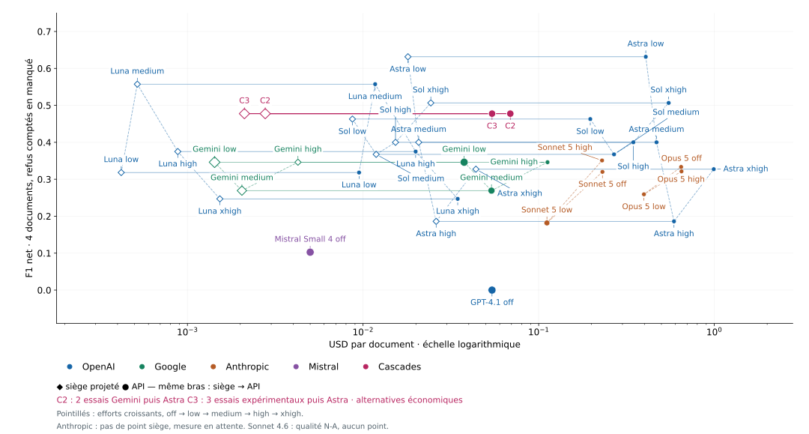

# Rapport benchmark v101b — modèles, coûts, sièges

*Date de mesure : 17 septembre 2026 · corpus gelé : 100 documents municipaux · contrat : `immo-pv-extraction-v9`.*

## Résumé exécutif

**Décision M1 : `astra-low` en production, repli `gemini-low`.** `astra-low` est le seul bras à 100/100 acceptés et son F1 Oracle v2 pondéré est **0,584**. `gemini-low` est le repli disponible : 85/100 acceptés, F1 pondéré 0,441, API $0,0376/doc et burn AI Pro mesuré.

## Tableau complet unique

F1 macro sur les acceptés Oracle v2; F1 × acceptation inclut les 100 documents. Waterloo est exclue du macro-oracle (oracle partiel). API/doc est le coût observé. Docs/h = 3 600 / p50 à concurrence 1, non une promesse de production.

| Bras | État; acceptés/N | F1 v2 | F1 × acc. | API/doc | USD siège/doc mesuré | Sièges / 1 000 docs/mois | Docs/h (c=1) | p50 | p95 | Échecs dernière tentative |
|---|---|---|---|---|---|---|---|---|---|---|
| gemini-low | completed; 85/100 | 0.518 | 0.441 | $0.0376 | $0.0013 | 1 (AI Pro; low)  | 235.9 | 15.3 s | 37.0 s | profile:7 · provenance:8 |
| gemini-medium | completed; 79/100 | 0.423 | 0.334 | $0.0539 | N-A (burn low seul) | N-A | 133.4 | 27.0 s | 44.6 s | profile:12 · provenance:9 |
| gemini-high | completed; 53/100 | 0.518 | 0.275 | $0.1123 | N-A (burn low seul) | N-A | 52.2 | 69.0 s | 88.4 s | json:44 · profile:2 · provenance:1 |
| luna-low | completed; 39/100 | 0.621 | 0.242 | $0.0095 | $1.7558 | 9 | 38.0 | 94.8 s | 168.2 s | transport:2 · profile:50 · provenance:9 |
| luna-medium | completed; 51/100 | 0.582 | 0.297 | $0.0117 | $1.9155 | 10 | 28.4 | 126.6 s | 216.8 s | transport:2 · json:2 · profile:36 · provenance:9 |
| luna-high | completed; 43/100 | 0.788 | 0.339 | $0.0199 | $2.1426 | 11 | 14.5 | 247.8 s | 480.0 s | transport:13 · json:1 · profile:33 · provenance:10 |
| luna-xhigh | completed; 47/100 | 0.236 | 0.111 | $0.0346 | $3.0146 | 16 | 7.5 | 480.0 s | 900.0 s | transport:15 · profile:23 · provenance:15 · budget:22 |
| gpt41 | completed; 64/100 | 0.000 | 0.000 | $0.0542 | N-A (Claude/API) | N-A | 209.8 | 17.2 s | 41.3 s | transport:3 · profile:16 · provenance:17 |
| sonnet46-cloud-off | circuit-open; 32/56 | N-A | N-A | $0.1750 | N-A (Claude/API) | N-A | 56.1 | 64.1 s | 146.8 s | transport:10 · profile:10 · provenance:4 |
| sonnet46-cloud-low | circuit-open; 14/29 | N-A | N-A | $0.1478 | N-A (Claude/API) | N-A | 5106.4 | 0.7 s | 93.7 s | transport:15 |
| sonnet46-cloud-high | circuit-open; 0/15 | N-A | N-A | N-A | N-A (Claude/API) | N-A | 12720.8 | 0.3 s | 0.4 s | transport:15 |
| sonnet5-off | completed; 62/100 | 0.528 | 0.327 | $0.2307 | N-A (Claude/API) | N-A | 31.8 | 113.2 s | 242.7 s | transport:1 · json:13 · profile:12 · provenance:12 |
| sonnet5-low | completed; 58/100 | 0.512 | 0.297 | $0.1114 | N-A (Claude/API) | N-A | 94.7 | 38.0 s | 71.2 s | json:2 · profile:18 · provenance:22 |
| sonnet5-high | completed; 70/100 | 0.396 | 0.277 | $0.2295 | N-A (Claude/API) | N-A | 29.7 | 121.4 s | 249.4 s | json:13 · profile:8 · provenance:9 |
| opus5-off | completed; 68/100 | 0.690 | 0.470 | $0.6507 | N-A (Claude/API) | N-A | 21.6 | 167.0 s | 279.0 s | json:24 · profile:4 · provenance:4 |
| opus5-low | completed; 74/100 | N-A | N-A | $0.3976 | N-A (Claude/API) | N-A | 45.4 | 79.3 s | 157.0 s | json:2 · profile:14 · provenance:10 |
| opus5-high | completed; 63/100 | N-A | N-A | $0.6472 | N-A (Claude/API) | N-A | 22.8 | 158.0 s | 276.8 s | json:24 · profile:6 · provenance:7 |
| opus5-cli-off | unknown; 0/0 | N-A | N-A | N-A | N-A (Claude/API) | N-A | N-A | N-A | N-A | — |
| sol-low | completed; 90/100 | 0.583 | 0.525 | $0.1967 | $1.8750 | 10 | 29.7 | 121.3 s | 205.5 s | transport:2 · profile:1 · provenance:7 |
| sol-medium | completed; 94/100 | 0.558 | 0.525 | $0.2686 | $2.2257 | 12 | 19.2 | 187.3 s | 317.3 s | provenance:6 |
| sol-high | completed; 83/100 | 0.505 | 0.419 | $0.3460 | $2.1865 | 11 | 13.5 | 266.9 s | 480.0 s | transport:12 · provenance:5 |
| sol-xhigh | completed; 85/100 | 0.517 | 0.439 | $0.5498 | $3.0629 | 16 | 8.7 | 416.1 s | 878.9 s | transport:10 · provenance:5 · budget:20 |
| astra-low | completed; 100/100 | 0.584 | 0.584 | $0.4072 | $1.7649 | 9 | 24.4 | 147.8 s | 297.0 s | — |
| astra-medium | completed; 99/100 | 0.452 | 0.448 | $0.4689 | $1.8596 | 10 | 19.0 | 189.8 s | 320.2 s | transport:1 |
| astra-high | completed; 68/100 | 0.667 | 0.453 | $0.5896 | $1.2808 | 7 | 11.4 | 316.1 s | 480.0 s | transport:32 |
| astra-xhigh | circuit-open; 65/100 | 0.611 | 0.397 | $0.9929 | $1.7341 | 9 | 6.0 | 596.7 s | 900.0 s | transport:33 · profile:1 · provenance:1 |
| mistral-small4 | completed; 40/100 | 0.250 | 0.100 | $0.0050 | N-A (Claude/API) | N-A | 226.7 | 15.9 s | 63.0 s | transport:4 · profile:28 · provenance:28 |

## Graphique décisionnel

Les marqueurs pleins sont les coûts API; les marqueurs creux sont les coûts siège mesurés/conditionnels. Axe x logarithmique; taille = docs/h à concurrence 1. Les séries ne sont pas interchangeables.

## Coûts, sièges et méthode

Gemini AI Pro : burn contrôlé réel de 260 documents, 5 635 342 tokens et −7,58 points sur fenêtre 10 080 min; `gemini-low` ≈ $0,0014/doc, 1 siège/1 000 docs/mois au débit observé. Codex/ChatGPT : mesure passive réelle de 12 points, 207 reçus et 6 348 891 tokens; la dérivation par bras utilise les tokens/doc. Granularité : 1 point, incertitude ±8 %. Claude : N-A, burn après reset 22:10Z non disponible. Les coûts siège restent conditionnels du palier et ne constituent pas un SLA.

## Juges aveugles

Terra direct API : **422/605** verdicts terminaux au rendu; accord Terra/oracle par bras non finalisable avant 605/605. Opus 4.6 : **en cours, 227/605**; une mise à jour sera livrée quand les deux jeux seront terminaux. Les juges ne modifient pas la décision M1, fondée sur l'oracle v2 gelé.

## Décision M1 et limites

Déployer `astra-low` sous les gates existants; repli document par document vers `gemini-low` si Astra est indisponible ou si les signaux qualité se dégradent. Le CronJob production couvre aujourd’hui **Waterloo seule**. Avant extension : preuve de signaux neufs par ville, stratégie multi-ville, puis revue volume/palier réel.

## Traçabilité

Données : `docs/reviews/refresh-benchmark/v101b/report-data.json`, `costs.md`, reçus immuables et verdicts dans le worktree BENCH. F1 source-gap signifie score oracle absent, non zéro.
