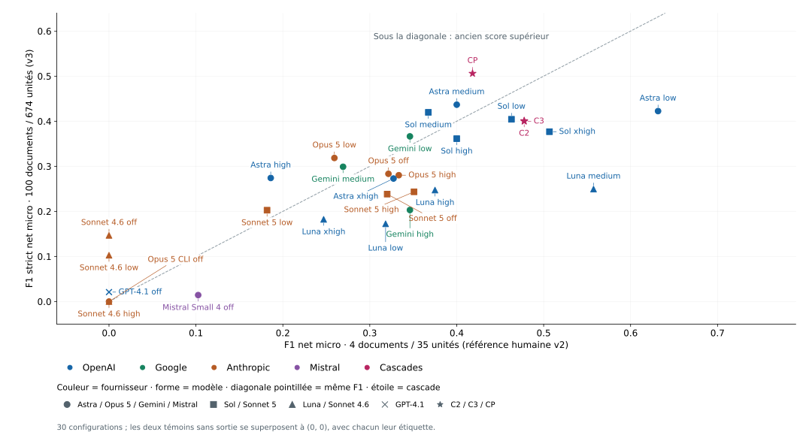

# Quel modèle pour lire les documents municipaux ?

**Benchmark v101b · Rapport v10 · 18 septembre 2026** 
Rédaction : lane rapport-v10 ; base v9 et référence oracle v3 arrêtée le 18 septembre 2026.

## 1. Résumé exécutif

**Décision de l’owner : CP est la cascade de référence du rapport**, astra-medium suivi d’une vérification gemini-3.8 low. CP est première en stricte (F1 0,506) comme en large (0,498), devant Astra medium seul (0,437 en stricte) et Astra low (0,423). La v9 classait Astra low premier à 0,632 sur quatre documents. Le réexamen M1 s’appuie sur cette référence ; ce rapport n’atteste aucune bascule de production.

**Gain total mesuré : +11,3 points de précision (P 0,483) ; gain propre à la relecture : +5,2 points (P 0,422), un majorant, pas une mesure pure.** **Rappel −0,1 point : une unité juste perdue.** La consigne du filtre porte la liste d’exclusions du corrigé et le critère « rappel historique », absents de la consigne d’extraction des 26 bras. Une part du gain vient donc de la règle donnée au filtre ; même la famille B dépend surtout de ce critère historique.

**CP par document : API 0,468989899 + 0,012346348 = 0,481336247 USD, soit 0,48134 ; siège 0,020745782 + 0,000468311 = 0,021214093 USD, soit 0,021214.** Les deux termes sont respectivement Astra medium (facteur Codex) et la vérification Gemini low (facteur Google).

**Repli déjà prouvé :** Gemini low a été accepté dans le job à repli forcé du **17 septembre 2026** en préproduction (Waterloo, **1 877 ms**, raison `forced`). **Gemini high est écarté : 53/100 acceptés, 44 refus JSON**, contre 85/100 acceptés et 15 refus au total pour low.

**C2 et C3 restent des alternatives économiques écartées pour l’instant**, à réexaminer si le volume explose. Leurs lignes, points et mesures sont conservés ; elles ne constituent pas la décision finale.

**Limites et état mesuré.** 47 points restent non résolus : la stricte les neutralise, la large les attend. Seuls les rangs 15 et 16 changent ; la tête résiste à ce choix. L’unanimité des annotateurs ne garantit pas une vérité exhaustive. Les preuves de préproduction restent historiques ; aucun nouveau signal matérialisé n’est démontré ici. N-A = non disponible ou non calculable ; USD hors taxes.

**Version v10.** Trois graphiques de qualité régénérés, méthode de référence, variantes de notation, rejet documenté de ROUGE-L, coûts et incidents ; siège Claude, tarifs et preuves historiques conservés.

<!-- page:portrait -->

## 2. Ce qu’on a mesuré et comment

Le corpus contient **100 documents municipaux de 2026, dans 100 villes** : principalement des procès-verbaux, mais aussi des ordres du jour. Un procès-verbal rapporte des décisions prises ; un ordre du jour annonce des points à traiter. Cette différence compte lorsqu’on décrit l’étape d’une procédure.

Le corpus est **gelé** : chaque fichier et son texte de page sont identifiés par une empreinte numérique, afin de vérifier qu’ils ne changent pas entre deux essais. La sélection comprend 32 petits documents, 32 moyens, 31 grands et cinq documents de référence, issus d’un ensemble admissible de 536 documents dans 225 villes.

### La tâche confiée au modèle

Le modèle doit relever les actes d’urbanisme : modification de zonage, règlement, dérogation, projet particulier ou autre événement pertinent. Il doit indiquer l’étape observée et fournir des **citations vérifiables**, avec la page physique du PDF et le passage copié. Une information absente du document ne doit pas être inventée.

Un **bras** est une configuration « modèle + effort ». L’effort règle la quantité de raisonnement demandée : `off` (désactivé), `low` (faible), `medium` (moyen), `high` (élevé), `xhigh` (très élevé). Ce réglage n’est pas une note de qualité. Les 26 bras sont exécutés ; les trois Sonnet 4.6 restent partiels après interruption liée aux quotas. Le bras supplémentaire `opus5-cli-off`, sans aucun document traité, est affiché comme témoin non exécuté. Avec C2/C3 et CP, la notation compte donc **30 lignes** ; son F1 nul ne mesure pas la qualité du modèle.

### Cinq couches avant de dire « accepté »

| Couche | Question posée par le contrôle |
|---|---|
| **Transport** | La requête a-t-elle abouti et le flux de réponse s’est-il terminé avec une sortie exploitable ? Un code HTTP 200 ne suffit pas. |
| **JSON** | La réponse est-elle lisible comme un objet de données structuré, sans commentaire autour ? |
| **Contrat v9** | Respecte-t-elle les champs, les types d’entités, les relations et les preuves exigés par le produit ? Le « profil » est cet ensemble de règles métier. |
| **Provenance** | Chaque citation renvoie-t-elle au bon PDF, à une page autorisée et à un passage effectivement présent sur cette page ? |
| **Accepté** | Les contrôles précédents permettent-ils d’utiliser l’extraction ? Cela ne garantit pas qu’elle ait trouvé tous les actes intéressants. |

Un **reçu v2** est le journal technique d’une tentative : modèle demandé, durée, consommation, résultat et cause du refus. « v2 » désigne le format du reçu, indépendamment de la version du contrat et de la référence de qualité. Un rejeu crée un nouveau reçu ; les anciens restent intacts.

Les données v101b réutilisent les résultats GPT-4.1 et Mistral de v101 ; les 24 autres bras sont relancés. Le plafond visé est **32 768 jetons de sortie**. Un jeton est un fragment de texte compté pour l’usage et la facturation. Le service Codex rejette le paramètre de plafond : ses rejeux l’omettent et portent `cap.enforced=false`. Le protocole et les reçus corrigent sur ce point l’annonce générale « wire-enforced » du manifeste ; les plafonds ne sont donc pas équivalents entre tous les transports.

<!-- page:portrait -->

## 3. Le contrat d’extraction immo-pv-extraction-v9

Le contrat est **la règle d’admission des données dans le radar**. Il transforme « le modèle a répondu » en « nous disposons d’une information structurée dont les citations sont contrôlables ».

### Ce que le code impose aujourd’hui

1. **Du JSON strict, sans texte autour.** Le code accepte aussi un unique bloc délimité par trois accents graves, avec le libellé `json` ou sans libellé. Deux blocs, un préambule ou un commentaire final sont refusés. Ce retrait d’enveloppe ne répare pas un JSON incomplet.
2. **Une citation pour chaque entité et chaque relation.** Un *nœud* représente une entité, par exemple un règlement ; une *arête* représente une relation entre deux entités. Chaque nœud et chaque arête doit porter au moins une citation compacte `{page, excerpt}` : `excerpt` signifie « extrait ».
3. **Un extrait assez long pour faire preuve.** Pour les citations de nœuds et d’arêtes, il faut au moins **20 points de code Unicode** — unités de caractère informatique — et au moins **12 lettres ou chiffres après normalisation**. Le code garde au maximum les **200 premiers points de code**, puis contrôle à nouveau leur présence sur la page. Il raccourcit un préfixe ; il ne complète jamais une phrase.
4. **Un ancrage sur la page citée.** L’*ancrage* est la recherche de l’extrait dans le texte de cette page. La normalisation NFKC rapproche les formes typographiques équivalentes ; le code neutralise ensuite casse, accents, espaces et ponctuation. Il exige toujours la même suite de lettres et chiffres, dans le même ordre. Une paraphrase ou une citation prise sur une autre page demeure refusée.
5. **Une identité PDF maîtrisée par le code.** Pour les citations compactes des entités, le code injecte le fichier, sa référence de stockage, son empreinte, son URL et la modalité PDF. Le modèle ne choisit pas cette identité. En revanche, les objets séparés de preuve `evidence[]` doivent recopier l’identité complète fournie par le schéma ; elle y est vérifiée, pas injectée. Leur extrait n’est pas tronqué à 200, mais doit franchir le plancher de 12 caractères normalisés.
6. **Des références de preuve explicites.** `evidence_refs` est une liste d’identifiants qui pointent vers `evidence[].id`, pas une liste d’objets incorporés. Elle est obligatoire pour chaque arête et les types de nœuds désignés par le profil. Ces références ne remplacent pas les citations.
7. **Des valeurs de statut autorisées.** La liste de statuts est exposée à chaque type d’entité. Le code actuel répète la même liste du profil pour tous les types : il ne faut pas en déduire des vocabulaires différents par type, malgré la formulation du prompt.
8. **Une version contrôlée si elle est déclarée.** `contract_version` doit alors valoir exactement `immo-pv-extraction-v9`, sinon le refus se nomme `contract_version_mismatch`. L’absence du champ reste acceptée pour compatibilité historique ; tous les autres contrôles continuent de s’appliquer.

**Exemple réel, Saint-Étienne-de-Bolton.** « Zone : RUR-12 » est un libellé, insuffisant pour prouver une décision. Le code de zone va dans une propriété. La citation doit reprendre le passage : « QUE le conseil municipal autorise, sur recommandation du CCU, ». Sur un ordre du jour, on cite le point annoncé ; on ne transforme pas cette annonce en décision adoptée.

<!-- page:portrait -->

### Pourquoi le contrat a changé pendant les tests

Les versions successives répondent à des erreurs observées. Les chiffres des campagnes historiques à cinq documents sont séparés du benchmark v101b à 100 documents.

| Étape | Problème constaté et correction |
|---|---|
| **v3 : lecture directe** | Une réponse entourée d’un bloc Markdown échouait même si son contenu était du JSON valide. |
| **v4 : enveloppe unique** | Le parseur retire un seul bloc autorisé ; il conserve la cause native de l’erreur JSON pour rendre le diagnostic utile. Il refuse toujours les commentaires et les sorties multiples. |
| **v5 : citations compactes — PR #687** | Répéter l’identité complète du PDF sur chaque citation allongeait les réponses et multipliait les occasions de se tromper. Le modèle fournit page et extrait ; le code injecte l’identité. La revue fait appliquer réellement la borne 200 et contrôler les versions déclarées. Elle remplace aussi un parseur susceptible de ralentir fortement sur une entrée longue. |
| **v6 : statuts alignés** | Les indications de statut devaient correspondre aux valeurs réellement acceptées. La liste du validateur est exposée dans chaque type du schéma. |
| **v7 : typographie normalisée** | Les différences de casse, d’accents ou de ponctuation pouvaient empêcher de reconnaître un passage. L’ancrage neutralise ces différences, tout en restant local à la page et exact sur lettres et chiffres. |
| **v8 : borne par troncature** | Des extraits fidèles dépassaient la limite de 1 à 7 caractères. Le code garde leurs 200 premiers points de code et les revérifie. Une consigne de longueur seule ne suffisait pas. |
| **v9 : acte et planchers nommés — PR #688** | Les modèles citaient des codes de zone trop courts. Le contrôle impose les deux planchers et nomme `entity_citation_excerpt_too_short`. Pour les preuves séparées, `excerpt_below_anchor_floor` distingue « trop court pour prouver » de « absent de la page ». La forme compacte est retirée du bloc `evidence`, où elle était annoncée à tort. |

Une première formulation v9 a produit une extraction **acceptée mais vide** sur l’ordre du jour de Valcourt : le modèle cherchait uniquement des décisions prises. La consigne a été corrigée pour reconnaître les points annoncés. Cet épisode explique pourquoi le taux d’acceptation doit toujours être lu avec une mesure de couverture.

### Les effets mesurés, avec leur périmètre

La référence de qualité, appelée **oracle**, a aussi été réalignée : numérotation des points ignorée, règlements admis parmi les candidats, autres passages de preuve autorisés lorsqu’ils sont vérifiés. Sur les **mêmes sorties historiques v13 de Gemini**, le F1 passe de **0,133 à 0,389**. C’est une correction de la mesure, pas un gain de modèle attribuable à elle seule au contrat.

Sous v9, les campagnes **v14 et v15 font chacune 5/5 acceptés**, avec F1 v2 de **0,576 et 0,582**. Aucune des 197 citations d’entités n’est sous 20 points de code, contre 17 sur 331 citations v13. Les deux campagnes retrouvent le même nombre d’unités de référence.

La campagne **v16, après les corrections de revue, fait 3/5**, F1 de 0,566 sur ses acceptés : deux erreurs de page sont rejetées, sans défaut de forme compacte ni de plancher. Les dix anciennes sorties v14/v15 restent acceptées par ce validateur. Les succès 5/5 ne constituent donc pas une garantie universelle ; le contrôle de page a continué à intercepter de vraies erreurs du modèle.

<!-- page:portrait -->

## 4. F1, précision et rappel : quelle qualité a-t-on obtenue ?

La **précision** répond à « parmi les actes produits, combien correspondent à la référence ? ». Le **rappel** répond à « parmi les actes attendus, combien ont été retrouvés ? ». Le **F1**, de 0 à 1, combine les deux ; il baisse si l’un est faible.

P = TPTP + FPP : précision, part des actes produits qui sont justes.

R = TPTP + FNR : rappel, part des actes attendus retrouvés.

F1 = 2 TP2 TP + FP + FNF₁ : équilibre entre précision et rappel.

<b>TP</b> : actes correctement retrouvés · <b>FP</b> : résultats sans correspondance · <b>FN</b> : actes manqués. Si aucun acte n’est produit, la précision est N-A.

La précision traduit « ne pas ajouter d’actes inexacts ou mal rattachés » ; le rappel traduit « ne pas manquer d’actes attendus ». Le F1 équilibre les deux. Un faux positif fait baisser la précision, une omission fait baisser le rappel ; un refus technique empêche d’utiliser la sortie et laisse ses actes attendus manquants dans la mesure nette.

<!-- page:portrait -->

### Qualité — exemples de calcul et couverture

**Exemple historique v2 : Gemini low sur Valcourt.** Sur six actes de référence, cinq sont retrouvés. Sept groupes sont produits : cinq corrects, un groupe sans correspondance et un doublon.

P = 57 &nbsp; R = 56 &nbsp; F1 = 1013 ≈ 0,769Exemple v2 : TP = 5, FP = 2, FN = 1.

 Le doublon baisse la précision sans constituer une invention. Les illustrations suivantes montrent les différences sur le contenu réel.

**Mesure nette après acceptation :** les actes corrects (TP), supplémentaires (FP) et manqués (FN) sont additionnés sur **100 documents et 674 éléments** avant le calcul. Tout refus ou absence laisse les unités du document en FN ; les 47 points non résolus sont neutralisés en stricte. Les mêmes sorties archivées sont renotées, sans nouvelle génération. Exemple Astra medium : **TP = 359, FP = 611, FN = 315**, d’où P = 0,370, R = 0,533 et F1 = 0,437.

**L’effet de la couverture complète.** Luna medium, 2ᵉ dans la v9 malgré 49 refus sur 100, passe au **17ᵉ rang, F1 0,249**. Luna high atteint **0,247** (18ᵉ) ; Astra low **0,423** (3ᵉ). L’ancien échantillon épargnait certains bras : le graphique 4 contre 100 documents expose cet effet, sans supposer une baisse pour chaque modèle.

**Les cas concrets avant la méthode de référence.** Les pages suivantes montrent une réussite, une erreur de précision, une omission et les quatre classes de refus demandées. La construction de l’oracle et le rôle des juges viennent ensuite.

<!-- page:portrait -->

### Exemples concrets — du passage municipal au signal

**Repère historique :** les identifiants S739P, L36 et L37 ci-dessous sont ceux du corrigé humain v2. La preuve et les sorties restent inchangées ; S739P est désormais un point non résolu, neutralisé dans le score strict v3.

Les quatre illustrations suivantes viennent des textes gelés, des sorties brutes et des reçus de validation. Les noms de personnes, adresses privées et identifiants techniques inutiles sont omis ou remplacés par des crochets. Les numéros de règlement et de zone restent ceux des sources publiques. Les citations conservent leurs mots ; les retours de ligne sont réduits à des espaces pour la lecture.

**a) Une information correctement extraite : un projet de densification.** Dans le [procès-verbal de Saint-Barthélemy du 8 septembre 2026](https://www.saint-barthelemy.ca/storage/app/media/municipalite/conseil-municipal/ordre-du-jour-et-proces-verbaux/Proc%C3%A8s-verbaux/2026/Proc%C3%A8s-verbal%20-%20S%C3%A9ance%20ordinaire%20-%208%20septembre%202026.pdf), **page physique 5**, le passage dit : « Le but du présent règlement est de permettre la densification des zones R-7 et R-8 ». La même page précise : « MODIFICATION DE LA GRILLE DE SPÉCIFICATION (ANNEXE I) AFIN D’AJOUTER LES USAGES HABITATION II ET III DANS LES ZONES R-7 ET R-8 ».

Gemini low produit un nœud `Signal`, intitulé **« Signal densification zones R-7 et R-8 »**, de catégorie `densification`, à l’étape `projet_reglement`, daté du 8 septembre et rattaché au règlement **739-26**. Une relation `raises_signal` le relie à l’événement de la résolution **2026-09-191**, avec la citation page 5. L’unité de référence **S739P** est retrouvée. Pour le radar, cela fournit une alerte de projet de densification à suivre ; ce premier projet ne prouve pas une autorisation finale de construire. Le même passage conditionne certains usages à la présence d’égout et d’aqueduc. **La sortie est mesurée ; sa matérialisation comme nouveau signal en préproduction n’est pas démontrée par ce benchmark.**

**b) Une erreur de précision : une étape rattachée au mauvais passage.** L’[ordre du jour de Lac-des-Seize-Îles](https://www.lac-des-seize-iles.com/fichiersUpload/fichiers/20260911113130-projet-odj-septembre-2026.pdf), **page 1**, distingue « **3.6 Avis de motion – Projet de règlement numéro 2026-08 régissant l’occupation du domaine public municipal** » et « **3.7 Dépôt du projet de règlement numéro 2026-08 régissant l’occupation du domaine public municipal** ».

Le nœud `Bylaw` produit par Gemini low porte `stage: "projet"` mais cite le **point 3.6**, celui de l’avis de motion. La référence attend **L36 = avis_motion** à 3.6 et **L37 = projet_reglement** à 3.7. Le couple étape/passage produit ne correspond à aucun des deux : il compte comme résultat supplémentaire sans correspondance, donc fait baisser la précision. Le nom du règlement existe bien ; **l’erreur est son rattachement à l’étape**, pas l’invention d’un règlement. Le radar risque de présenter un avancement de procédure mal étayé. Les deux points demeurent annoncés dans un ordre du jour.

*Pistes de preuve : `campaign/gemini-low/saint-barthelemy-2026-09-08--gemini-low.attempt-1.{raw.txt,output.json,receipt.json}` ; même chemin avec `lac-des-seize-iles-2026-09-agenda` ; textes PDF gelés et `manual-oracle-v2.json`, unités S739P, L36 et L37.*

<!-- page:portrait -->

### Exemples concrets — omission et refus de validation

**c) Une non-détection : l’acquisition qui facilite le développement.** Le procès-verbal de Saint-Barthélemy, **page 7**, précise : « **la récupération de ce matricule par la Municipalité facilitera le développement de certains terrains dans ce secteur** ». La résolution autorise l’achat de l’immeuble de la Montée du Lac-Robert, identifié par un matricule fiscal `[masqué]`. La référence humaine v2 **S195**, à l’étape `adoption`, attend cet acte foncier.

La sortie Gemini low ne contient aucun nœud sur cette acquisition ; ses unités retrouvées sont S738 et S739P. S195 est donc un acte manqué : le rappel diminue et l’utilisateur perd un indice de développement rendu possible par une maîtrise foncière municipale. Un matricule fiscal ne doit pas être transformé en numéro de lot cadastral. Ici, l’omission est visible dans le contenu lui-même ; elle ne vient pas seulement d’une différence d’ancrage.

**Actualisation v3.** Le passage foncier est conservé sous une annotation différente (`saint-barthelemy-2026-09-08#u06`) ; l’ancien identifiant humain S195 ne sert plus au décompte principal. L’exemple reste celui de la sortie archivée.

**d) Quatre classes de refus : ce qui a été renvoyé et la règle appliquée.** Les messages ci-dessous sont ceux des reçus, **à la seule substitution de l’identifiant de fragment par `[fragment]`**. Un fragment est la portion du document envoyée au modèle.

| Classe | Sortie réelle et contrôle qui échoue | Message exact du reçu, identifiant anonymisé |
|---|---|---|
| **JSON** · Gemini high, Acton Vale | Le fichier brut s’arrête au milieu de `"sourceUrl": "https://ville.actonvale.qc.ca/wp-content/uploads/2026` : chaîne sans guillemet final, objet incomplet. | `Invalid JSON for chunk [fragment]: Unterminated string in JSON at position 20034 (line 501 column 74)` |
| **Profil v9** · Gemini low, Coteau-du-Lac | Une relation `lifecycle_predecessor` porte `confidence: "INFERRED"`. Cette relation déduite n’est pas admissible dans l’extraction exigeant des relations étayées. | `Invalid profile extraction for chunk [fragment]: inferred_relation_disallowed` |
| **Provenance** · Gemini low, Berthier-sur-Mer | La preuve `ev-3` cite page 5 : « CONSIDÉRANT QUE la zone Rb 23, ainsique la création d'une nouvelle zone Rd.5, sont situées à l'intérieur du périmètre d'urbanisation de la Municipalité ». La page 5 s’arrête après « Rd.5, » ; la suite déborde sur la page suivante. La citation complète ne s’ancre pas sur la page annoncée. | `Model output has ungrounded PDF excerpt for chunk [fragment]` |
| **Code 23** · Luna high, Beloeil | Aucune sortie brute ni extraction à relire ; le reçu indique une fin de flux en échec. Le validateur JSON n’a pas été atteint. | Objet d’erreur exact : `{"category":"terminal","code":"23","httpStatus":200}`. **Aucun message textuel n’est conservé** ; le champ d’erreur v9 vaut `null`. |

*Pistes : mêmes dossiers `campaign/<bras>/` pour les trois premiers, `codex-replay/campaign/luna-high/` pour Beloeil ; reçus `.attempt-1.receipt.json` et sorties `.raw.txt` correspondantes. Omission : sortie Saint-Barthélemy et unité S195. Les quatre catégories sont distinctes d’un score sémantique faible sur une sortie acceptée.*

<!-- page:portrait -->

### Une référence annotée pour comparer les extractions

Une **unité oracle** est un acte annoté avec son étape, son passage de preuve, sa page et l’identité du PDF. Le scoreur rapproche les entités admissibles — signal, événement et règlement — en regroupant celles liées au même signal. Il compare étape et ancre normalisées, en vérifiant leur provenance. Les 100 documents disposent désormais d’une annotation v3 complète ; le contrôle humain v2 demeure limité à ses cinq documents.

### Construction et validation de l’oracle v2

La référence initiale annotée manuellement comporte **36 unités sur cinq documents**. La v2 garde ces unités, ajoute **zéro unité et dix sites de citation alternatifs** vérifiés dans les textes gelés. Elle retire les numéros de points dans les ancres, admet les règlements parmi les candidats et accepte les sites alternatifs explicitement documentés. Les tests historiques de l’oracle passent 7/7 et les contrôles v13 27/27 ; ils n’ont pas été relancés pour cette rédaction.

Dans la v2, Waterloo possède une référence partielle et est exclue des moyennes : il reste **quatre documents complètement annotés**. Quatre unités ont une étape `inconnu`, difficile à apparier ; le regroupement de plusieurs règlements sous une seule résolution limite aussi l’interprétation du rappel. Cette référence historique est remplacée par la v3 pour la notation principale.

**Macro** donne le même poids à chaque document noté. **Micro** additionne les actes corrects, manqués et supplémentaires avant calcul : les documents les plus denses pèsent davantage. Les v6 à v9 employaient le calcul micro net sur une base fixe de 35 unités. Pour Gemini low : TP = 9, FP = 8, FN = 26, F1 net = 0,346 ; la moyenne macro brute 0,518 ne portait que sur les trois sorties annotées acceptées. Les valeurs brutes sont conservées en annexe.

### Les juges aveugles : un contrôle complémentaire

**Terra : 605/605 verdicts exploitables ; Opus 4.6 : 149/605, donc partiel.** Sur les 149 paires disponibles, les juges donnent la même note d’utilité dans **71/149 cas (47,7 %)** ; l’écart absolu moyen vaut **0,544 point sur l’échelle 1–5**. Ce résultat décrit les paires disponibles, sans extrapolation aux 605. La collecte filtre les erreurs et les intentions de requête ; un fichier présent ou un processus terminé n’est pas nécessairement un verdict exploitable.

L’accord avec l’oracle n’est pas exprimé comme un pourcentage de notes identiques : une note d’utilité de 1 à 5 et un F1 de 0 à 1 ne sont pas la même mesure. Les champs « juge/oracle » de l’agrégat fourni comparent ces échelles et incluent des documents non annotés ; ils ne prouvent pas une validation de l’oracle. Les juges apportent une relecture des omissions et des citations ; ils ne remplacent pas une annotation humaine étendue.

<!-- page:portrait -->

### Construction de l’oracle v3 : les 100 documents, trois modèles, unanimité

**Pourquoi un nouvel oracle.** Jusqu’à la v9, la qualité reposait sur l’oracle v2 : **36 unités annotées à la main sur cinq documents**, dont quatre complets (35 unités). Un refus ne pesait sur le rappel que s’il tombait sur l’un de ces quatre documents. Ainsi, Luna medium refusait 49 documents sur 100 et restait pourtant 2ᵉ en F1 net, aucun de ses refus ne touchant les documents annotés. L’owner a exigé que **les 100 documents soient annotés**, et que la référence obtenue soit **fiable sans exception**.

**Unité annotée.** La définition ne change pas, et les règles sont reprises mot pour mot de l’oracle v2. Une unité est un objet réglementaire ou foncier explicite, correspondant à un signal ou à un événement de désignation du profil : l’acte, son étape (avis de motion, projet, second projet, adoption, dérogation mineure, PIIA…), le passage exact qui le prouve et sa page. Un avis de motion et le projet qui le suit sont deux unités ; les mentions historiques d’un même dossier ne se multiplient pas. Les annotateurs lisent **le texte gelé du PV**, jamais les sorties des modèles évalués : la référence n’est pas bâtie à partir de ce qu’elle doit noter.

**Ancrage obligatoire.** Toute unité doit citer un extrait retrouvé **mot à mot** dans le texte du PDF : entre 20 et 200 caractères, même normalisation que le contrat d’extraction v9. Sinon, elle est rejetée et comptée. Si l’extrait figure à une autre page, la page est corrigée. Une version non ancrée ne peut jamais entrer dans la référence.

**Sept passes, trois familles de modèles, en séquence.** Seule la première passe annote à partir de rien. Chacune des suivantes reçoit le texte gelé et le corrigé courant, et rend des **ajouts, retraits et corrections motivés** ; aucune ne recommence l’annotation.

| Ordre | Passe | Modèle | Rôle |
|---:|---|---|---|
| 1 | astra-pass1 | `gpt-6-astra`, effort xhigh | annotation initiale des 100 documents |
| 2 | fable-pass1 | `claude-fable-5-1`, effort xhigh | vérification et complément |
| 3 | gemini-pass1 | `gemini-3.8-flash`, effort high | vérification et complément |
| 4 | astra-pass2 | `gpt-6-astra`, effort xhigh | vérification et complément, après Fable et Gemini |
| 5 | fable-pass2 | `claude-fable-5-1`, effort xhigh | vérification et complément |
| 6 | gemini-pass2 | `gemini-3.8-flash`, effort high | vérification et complément |
| 7 | astra-pass3 | `gpt-6-astra`, effort xhigh | troisième vérification et complément, demandée par l’owner |

Une vérification Astra lancée par erreur trop tôt, sur 52 documents, avant Fable et Gemini, est **archivée sous le nom `astra-pass1b`**. Elle n’a apporté qu’un ajout : les 173 autres propositions reprenaient à l’identique le corrigé existant. Astra passe 2 a été rejouée sur les 100 documents, dans l’ordre voulu.

La première vérification Astra, commencée avant la troisième passe, a aussi été archivée : 97 documents, dont 5 sans appel. Ses votes ne sont pas utilisés ; la vérification a ensuite repris sur le corrigé issu d’Astra passe 3.

<!-- page:portrait -->

### Construction de l’oracle v3 — votes et arbitrage

**Convergence à l’unanimité.** Après les sept passes, chacun des trois modèles vote seul, avec un motif obligatoire, sur **chaque unité proposée au moins une fois**. Il choisit l’une de ses versions, ou « absente ».

- Une unité **entre** dans la référence si les trois votes désignent la même version ancrée.
- Elle en est **écartée** si les trois votes disent « absente ».
- Les versions limitées à des découpages du même passage peuvent être rapprochées par leurs positions exactes (règle décrite plus bas) : 7 unités fusionnées, avec un verdict d’arbitrage concordant dans les 7 cas.
- Tout le reste passe en **arbitrage** : les trois modèles revoient l’extrait du PDF et les positions motivées des autres, anonymisées, puis revotent.
- Ce qui reste partagé après arbitrage **n’entre pas** dans la référence : il est remis à l’owner dans une liste nominative, avec extraits et positions. Rien n’est tranché en silence.

**Contrôle contre l’oracle humain.** Sur les cinq documents annotés à la main, **chaque écart** entre la référence v3 et l’oracle v2 passe lui aussi en arbitrage, dans les deux sens : unité humaine absente de la v3, unité v3 absente de l’humain, ou même passage avec une étape différente. L’oracle humain y figure comme « référence humaine, non présumée juste ». Chaque écart reçoit un verdict motivé : l’humain avait raison, la v3 avait raison, les deux se trompent, ou non résolu. La cible est **zéro écart inexpliqué**.

<!-- page:portrait -->

### Construction de l’oracle v3 — résultat

**Résultat.**

Les comptes de votes et d’arbitrages décrivent des étapes successives : ils ne s’additionnent pas tous. Cinq unités initialement unanimes ont été réexaminées face à l’humain. Le total final est **636 conservées directement + 31 retenues après arbitrage + 7 fusionnées = 674**. La comparaison finale à l’humain donne un rappel de **0,889 (32/36)** et une précision de **0,939 (31/33)** sur les quatre documents humains complets ; Waterloo reste partiel dans ce seul contrôle.

| Mesure | Valeur |
|---|---:|
| Unités de la référence finale | 674 |
| — dont retenues à l’unanimité dès le premier vote | 641 au premier vote ; 636 conservées dans la référence finale |
| — dont retenues après arbitrage | 31, plus 7 fusionnées (arbitrage concordant) |
| Unités écartées (unanimes ou après arbitrage) | 29 au premier vote + 24 après arbitrage |
| Points non résolus, remis à l’owner | 47 |
| Rejets d’ancrage, toutes passes confondues | 1 (Gemini passe 2 ; 1 407 propositions sans changement ne sont pas des rejets d’ancrage) |
| Écarts avec l’oracle humain : v3 juste / humain juste / les deux faux / non résolus | 3 / 1 / 0 / 6 |
| Écarts inexpliqués | 0 — les 6 désaccords restants sont explicités |

*Mesure intermédiaire : astra-pass1 a produit 724 unités ; l’unique ajout d’astra-pass1b portait le corrigé à 725 (7,25 par document), avec 0 rejet d’ancrage. Sur cet état intermédiaire, précision 0,838 et rappel 0,889 face à l’humain. Ces chiffres ne décrivent pas la référence finale.*

**Ce que l’oracle v3 change pour la lecture des résultats.** P, R et F1 sont recalculés pour les 26 configurations, les cascades C2/C3, CP et le témoin non exécuté Opus 5 CLI (30 lignes) sur **les 100 documents**, à partir des sorties déjà archivées : les bras simples ne sont pas relancés. CP ajoute une passe Gemini low sur les sorties Astra medium archivées, sans nouvel appel Astra. Un document refusé compte toutes ses unités comme manquées. Les colonnes « F1 net · 4 documents » de la v9 restent affichées à côté, pour mesurer l’écart. L’oracle v2 n’est plus la base de notation : il sert désormais de témoin, pour mesurer l’erreur de la référence v3 elle-même.

**Coût et durée mesurés.** Les reçus par passe et les compteurs sont détaillés ci-après. Du redémarrage du 18 septembre à 12:03:13Z à la fin de chaîne à 22:49:27Z : **10 h 46 min 14 s**, attentes et incidents compris. En incluant le démarrage interrompu à 02:14:59Z : **20 h 34 min 28 s** de temps écoulé, et non de calcul continu. La reprise de la première passe Astra, à 4 appels en parallèle, a pris 52 minutes pour les 98 documents restants ; latence médiane 94 s, au plus 439 s, sur les 100 reçus.

**Traçabilité.** La consigne d’annotation (`oracle-v3/prompt-annotation.md`), la chaîne (`tools/refresh-benchmark/run-oracle-v3.sh` et les modules `oracle-v3-*`) et les tests sont versionnés sur la branche du banc (commit `37ea23ba`, puis suivants). Les annotations, reçus, votes, arbitrages et journaux de quota sont conservés sous `docs/reviews/refresh-benchmark/v101b/oracle-v3/`.

<!-- page:portrait -->

### Quatre lectures séparées de la qualité

**Stricte : score principal.** 674 éléments attendus sur 100 documents. Les **47 points non résolus sont neutralisés : ni attendus, ni comptés comme fausses détections** lorsqu’une sortie leur correspond. Tout document refusé ou absent laisse ses éléments attendus manqués.

**Large : sensibilité aux désaccords.** Les 47 points sont attendus, soit **721 éléments**. Les variantes d’un point sont prises en compte sans lui donner plusieurs crédits. Seulement **deux bras échangent leur rang**, Astra high et Astra xhigh aux **15ᵉ et 16ᵉ places**. La tête du classement est robuste à ce choix de traitement des désaccords.

**Tolérante à l’étape : colonne distincte.** Une citation atteint le même site de preuve, mais son étape peut différer ; une détection couvre au plus une unité. Elle ajoute **1 169 correspondances** cumulées sur les 30 lignes. Ce gain mesure notamment la sensibilité aux étapes et ne remplace pas le F1 strict.

**Souple par positions : colonne distincte.** Même document gelé, même page, même étape, identifiant d’objet exact avec frontière de chiffres, et intersection des positions des citations dans le texte normalisé. Une unité au plus par détection. Elle ajoute **101 correspondances**, contre 117 pour le diagnostic ROUGE-L abandonné ; **66 communes, 35 propres aux intervalles, 51 propres à ROUGE-L**.

**Pas de seuil de similarité à calibrer.** Les positions sont connues exactement puisque les citations sont ancrées mot à mot. La version mesurée conserve le **plancher d’ancrage de 12 caractères normalisés de recouvrement**. « Sans seuil » désigne ici l’absence de seuil lexical appris ; cela ne signifie pas que le code crédite n’importe quelle intersection d’un caractère. Aucun chiffre n’a été recalculé avec une règle différente.

Le scoreur conserve les alias d’étapes documentés (R4). Ces résultats restent ceux de ce corpus ; l’unanimité de trois modèles n’est pas une preuve d’absence d’erreur, et les familles participant à l’annotation peuvent partager des biais avec les bras évalués.

<!-- page:portrait -->

### Pourquoi ROUGE-L est écarté

**La décision est documentée.** ROUGE-L compare le vocabulaire et son ordre ; ici, on connaît déjà l’emplacement exact de chaque citation. Des formulations municipales très proches peuvent attester deux actes distincts.

Sur **8 paires d’unités réellement distinctes**, partageant objet, étape et page, les intervalles n’en rapprochent **aucune** ; ROUGE-L en rapproche **7**, jusqu’à **0,94**. Dans la notation, **51 correspondances viennent seulement de ROUGE-L**. L’avis Fable les décrit comme majoritairement fausses, notamment sur des numéros de règlement voisins. Ce diagnostic ne crédite aucune détection.

**Le petit corrigé humain ne permet pas de calibrer un seuil fiable.** Ses citations atteignent **350 caractères**, contre **200** pour les nouvelles annotations ; sur les 32 paires pourtant correctes, le ROUGE-L médian est **0,38** et 23 sont sous 0,5. Des paires humaines distinctes obtiennent des scores supérieurs. La tentative de calibration à 0,5 a été abandonnée et archivée ; elle ne valide pas la méthode finale.

**La règle retenue est l’intersection des positions dans le texte source**, sous les conditions d’identité décrites à la page précédente. Une fusion conserve l’une des citations votées, mot à mot — celle qui a le plus de votes, puis la plus longue — sans synthétiser une nouvelle citation. Sur la référence, les deux méthodes fusionnent **les mêmes 7 unités**, toutes concordantes avec leur arbitrage : le choix ne change pas le total de **674**, il supprime le risque lexical observé.

Sur les **15 paires de versions d’une même unité**, 12 sont rapprochées par les intervalles et 13 par ROUGE-L. **Limite assumée : deux passages éloignés prouvant le même acte ne sont pas rapprochés et restent en arbitrage.** Cela concerne Saint-Tite-des-Caps (pages 1 et 2) et Contrecœur (deux passages disjoints de la page 4). Les avis Astra et Fable sont repris verbatim en annexe ; leurs chiffres intermédiaires ne remplacent pas les diagnostics finaux ci-dessus.

<!-- page:portrait -->

### Incidents de production de la référence

| Incident observé | Effet mesuré et correction |
|---|---|
| Limite de session du siège Claude | **45 documents en échec** lors de Fable passe 2, puis tous repris. Cause probable à ce stade : le texte d’erreur n’était pas enregistré, contrairement au blocage de session observé en parallèle. L’enregistrement de l’erreur et un coupe-circuit après trois échecs vides ont été ajoutés. Lors de l’arbitrage Fable, la limite est explicite (**429**, réinitialisation à 22:40Z) : **3 échecs seulement**, puis arrêt et reprise. Le quota hebdomadaire seul ne prévenait pas la limite de session de cinq heures. |
| Incident réseau, environ **20:00–21:07Z** | **9 documents** d’arbitrage Astra touchés : délai dépassé, DNS introuvable ou connexion réinitialisée. DNS et HTTPS de nouveau accessibles à 21:10Z ; les neuf documents sont rejoués à l’identique et réussissent entre 21:11 et 21:13Z. L’origine hôte ou fournisseur n’est pas établie ; aucun refus du modèle ni quota n’est démontré. |
| Appel bloqué **58 minutes malgré une limite de 30** | Le signal d’abandon ne coupait pas la connexion bloquée. Correction : délais d’en-têtes (120 s), d’inactivité (600 s), échéance totale et garde supplémentaire à échéance + 60 s. Intégrée à **21:13:30Z**, première utilisation dans l’arbitrage Gemini ; les appels antérieurs n’en bénéficiaient pas. |
| Plafond Gemini | Troncature de Bedford à **32 768** jetons, puis plafond relevé à **65 536**. Le rejeu Bedford termine sous l’ancien plafond : il ne prouve pas à lui seul l’effet du changement. À la passe 2, **7 appels** dépassent effectivement l’ancienne borne ; maximum **53 195** (Carignan). |

Ces événements expliquent une partie de la durée et des reprises. Les usages absents ne sont pas supposés nuls. Un JSON Gemini malformé à Tadoussac et une erreur réseau Astra isolée à Grenville-sur-la-Rouge ont également été rejoués. Aucun appel de cette chaîne n’a été relancé pour rédiger la v10.

<!-- page:wide -->

### Coût de construction de la référence — reçus disponibles

Les sept passes, les votes et les arbitrages sont séparés. E = entrée, S = sortie ; la réflexion Gemini est facturée en plus de S. Pour Astra et Claude, elle est comprise dans les sorties déclarées. Les durées sont les fenêtres réelles entre premier début et dernière fin conservés, attentes comprises, et ne s’additionnent pas au temps de chaîne.

| Étape | Appels conservés | Jetons E | Jetons S | Réflexion | Équiv. API USD | Durée écoulée |
|---|---|---|---|---|---|---|
| astra-pass1 | 100 | 1 063 248 | 381 717 | incluse en sortie | 29,72 | 52 min (reprise) |
| fable-pass1 | 100 | 2 120 358 | 521 264 | incluse en sortie | 64,71 | 34,4 min |
| gemini-pass1 | 100 | 1 265 406 | 1 973 | 1 259 878 | 5,68 | 17,6 min |
| astra-pass2 | 100 | 1 158 461 | 285 353 | incluse en sortie | 25,85 | 40,4 min |
| fable-pass2 | 100 | 2 122 186 | 509 490 | incluse en sortie | 63,39 | 196,8 min |
| gemini-pass2 | 100 | 1 265 663 | 2 631 | 1 292 791 | 5,81 | 14,7 min |
| astra-pass3 | 100 | 1 158 097 | 273 941 | incluse en sortie | 25,28 | 36,6 min |
| vote-astra | 95 | 1 070 838 | 107 750 | incluse en sortie | 16,10 | 15,2 min |
| vote-fable | 95 | 1 952 687 | 339 908 | incluse en sortie | 54,00 | 19,2 min |
| vote-gemini | 95 | 1 173 455 | 38 370 | 897 414 | 4,39 | 11,5 min |
| arbitrage-astra | 49 | 630 142 | 60 037 | incluse en sortie | 9,30 | 78,4 min |
| arbitrage-fable | 49 | 1 146 766 | 109 243 | incluse en sortie | 27,43 | 93,1 min |
| arbitrage-gemini | 49 | 684 199 | 8 017 | 197 668 | 1,28 | 2,8 min |
| astra-pass1b | 52 | 308 899 | 76 511 | incluse en sortie | 6,91 | 10,6 min |
| vote-astra-pre-pass3 | 92 | 1 027 133 | 109 714 | incluse en sortie | 15,76 | 15,0 min |

**Sous-total des treize étapes retenues : 332,94 USD.** Passes archivées : **22,67 USD** supplémentaires, soit **355,61 USD** sur les reçus conservés de ces quinze étapes. Ce montant n’est ni une facture de siège ni un total exhaustif de toutes les tentatives.

<!-- page:portrait -->

### Consommation et limites de la mesure de référence

| Siège | Relevés hebdomadaires | Variation observée |
|---|---|---|
| Codex | 7 % à 12:03:15Z → 50 % à 21:11:10Z, le 18 septembre | **43 points** sur la reprise ; 0 → 50, soit **50 points**, en incluant le début interrompu à 02:14:59Z |
| Claude | 21 % à 13:09:33Z → 52 % à 22:42:52Z | **31 points** ; l’ancien relevé 11 % appartient au ping du 17 septembre, pas au début de cette fenêtre |
| Gemini / Cloud Code | Aucun relevé de compteur dans le journal de cette chaîne | **N-A** ; les jetons sont disponibles, le quota propre à la construction ne l’est pas |

**Compteurs partagés.** Ces variations incluent les autres sessions des comptes ; les derniers relevés précèdent la fin des étapes. Elles ne permettent pas d’attribuer exactement tous les points à la référence ni de déduire une consommation nulle pour les intervalles non relevés.

**Calcul de l’équivalent API.** Tarifs archivés du banc.

CAstra = 10 I + 50 O106Coût Astra, en USD.

CGemini = 0,75 I + 3,75 (O + T)106Coût Gemini, en USD.

I : jetons d’entrée · O : jetons de sortie · T : jetons de réflexion Gemini.

 Claude : somme du `totalCostUsd` déclaré par la CLI, auxiliaire Haiku inclus ; les jetons du tableau sont ceux du modèle principal, cache lu et créé inclus en entrée. Aucun tarif Fable n’a été déduit du ping pour remplacer ces coûts déclarés.

**Ce qui manque au total.** Les reçus par document sont ceux conservés après reprise : ils ne cumulent pas systématiquement les essais remplacés. Le premier appel Bedford tronqué, le premier JSON Tadoussac et l’appel perdu au plantage ne sont donc pas tous valorisables par cette somme. Le ping Fable préalable (**0,2525 USD**) est séparé. Les deux étapes archivées restent comptées ; la première vérification Astra archivée comprend 92 reçus et 5 documents sans appel.

Le journal signalait une incertitude sur la répartition Gemini : les reçus finaux vérifiés satisfont tous l’identité comptable ci-dessous.

N = I + O + TN : total des jetons ; I : entrée ; O : sortie ; T : réflexion.

Cela contrôle leur cohérence interne ; aucune facturation fournisseur n’a été rapprochée. Les champs `costUsd: 0` de `volumes.json` pour Astra et Gemini indiquent l’absence de coût calculé dans ce fichier, pas une gratuité.

<!-- page:portrait -->

### Gemini low seul contre les cascades C2/C3

Sur les **674 éléments des 100 documents**, C2 atteint **0,401**, C3 **0,400**, contre **0,366** pour Gemini low seul. Le gain de C2 est de **9,4 %**. Les deux cascades acceptent 100/100 documents, contre 85/100 ; elles restent les alternatives économiques précédemment écartées, à remettre en perspective lors du réexamen M1.

| Configuration | Acceptés /100 | F1 net 4 doc (v9) | F1 strict 100 doc | TP / FP / FN |
|---|---|---|---|---|
| C2 | **100** | **0,478** | **0,401** | **241**   /  287  / **433** |
| C3 | **100** | **0,478** | 0,400 | 238   /  278  / 436 |
| Gemini low | 85 | 0,346 | 0,366 | 201   /  **222**  / 473 |

Gras : acceptation, F1 et TP maximaux ; FP et FN minimaux ; égalités incluses. TP / FP / FN : actes justes / fausses détections / actes manqués.

**Ce qui change.** Les cinq sorties de repli Astra de C2 et les deux de C3 sont maintenant dans le périmètre annoté. C2 retient 85 sorties Gemini initiales, 10 du premier rejeu et 5 Astra ; C3 retient 85 + 10 + 3 Gemini et 2 Astra. Leurs qualités diffèrent légèrement sur les 100 documents ; leur égalité historique à 0,478 concernait seulement les mêmes quatre sorties Gemini.

**Lecture de l’écart.** La v9 mesurait +38 % pour C2 sur quatre documents. Le nouveau gain ne peut pas être attribué uniquement au repli Astra : il combine les rejeux, les sorties finalement retenues et le changement de référence. La suppression d’un refus peut ajouter des détections justes comme des fausses détections.

<!-- page:wide -->

## 5. Tableau complet — tri par F1 strict (1/3)

30 lignes : 26 bras, C2/C3, CP et un témoin non exécuté. Qualité sur 100 documents ; CP : Astra medium puis vérification Gemini low, coûts cumulés.

| Fournisseur · Modèle | Effort | Acc./100 | P stricte | R strict | F1 strict¹ | F1 net 4 doc² | Jetons E/S par doc | USD API /doc | USD siège /doc | Sièges /1 000 | p50 s | p95 s | Docs/h | Échecs |
|---|---|---|---|---|---|---|---|---|---|---|---|---|---|---|
| Cascades CP | medium → low | 99/100 | **0,483** | 0,531 | **0,506** | 0,418 | 27562 7159 | 0,48134 | 0,021214 | 1 P + 1 G | 193,4 | 326,1 | 18,5 | 1 T |
| OpenAI Astra | medium | 99/100 | 0,370 | **0,533** | 0,437 | 0,400 | 15 044 6 276 | 0,46894 | 0,02074 P | **1** | 189,8 | 320,2 | 19,0 | T:1 |
| OpenAI Astra | low | **100/100** | 0,372 | 0,490 | 0,423 | **0,632** | 15 112 5 122 | 0,40724 | 0,01801 P | **1** | 147,8 | 297,0 | 24,4 | **0** |
| OpenAI Sol | medium | 94/100 | 0,444 | 0,398 | 0,420 | 0,367 | 15 112 10 405 | 0,26855 | 0,01188 P | **1** | 187,3 | 317,3 | 19,2 | Pr:6 |
| OpenAI Sol | low | 90/100 | 0,465 | 0,358 | 0,404 | 0,463 | 14 823 6 674 | 0,19671 | 0,00870 P | **1** | 121,3 | 205,5 | 29,7 | T:2 · V:1 · Pr:7 |
| Cascades C2 | 2 essais | **100/100** | 0,456 | 0,358 | 0,401 | 0,478 | 20506 8093 | 0,06895 | 0,00277 | 1 G + 1 P | 15,9 | 81,0 | 68,2 | **0** |
| Cascades C3 | 3 essais | **100/100** | 0,461 | 0,353 | 0,400 | 0,478 | 21086 8207 | 0,05427 | 0,00211 | 1 G + 1 P | 15,9 | 72,0 | 76,4 | **0** |
| OpenAI Sol | xhigh | 85/100 | 0,307 | 0,487 | 0,377 | 0,507 | 12 970 22 146 | 0,54978 | 0,02432 P | **1** | 416,1 | 878,9 | 8,7 | T:5 · Pr:5 · C23:5 · B*:20 |
| Google Gemini | low | 85/100 | 0,475 | 0,298 | 0,366 | 0,346 | 16 468 6 743 | 0,03764 | 0,00143 G | **1** | 15,3 | 37,0 | **235,9** | V:7 · Pr:8 |
| OpenAI Sol | high | 83/100 | 0,380 | 0,344 | 0,361 | 0,400 | 12 307 12 761 | 0,34596 | 0,01530 P | **1** | 266,9 | 480,0 | 13,5 | T:6 · Pr:5 · C23:6 |

Gras : maxima de qualité, acceptation et débit ; minima de coût, jetons, sièges, délais et refus ; égalités à la précision affichée incluses. N-A exclu. Optima sur les 30 lignes des trois pages. Les minima Sonnet 4.6 (†), dont zéro jeton sans sortie, décrivent des essais partiels ou échoués, pas une extraction efficace ; classes d’échecs non additives.

**¹ Sur 100 documents / 674 unités, refus ou absences comptés en manqué.** Les 47 points non résolus sont neutralisés. **² Ancien F1 net micro sur 4 documents / 35 unités** ; pour les bras sans sortie sur ces documents, le recalcul vaut 0,000 (la v9 affichait N-A pour Sonnet 4.6). La moyenne macro sur acceptés reste en annexe.

**Échecs :** T = transport ; J = JSON ; V = profil v9 ; Pr = provenance ; C23 = flux sans sortie ; B* = budget ; Q* = quota (non additifs). **G/P/A :** facteurs Google/Codex/Anthropic ; **† :** campagne partielle. Les optima sont précisés sous le tableau.

**Coûts et délais :** usages connus, rejeux inclus. Jetons : dernière tentative pour les bras, passes cumulées pour C2/C3/CP. Méthodes et siège Claude : sections 8–9, détails repris sous les tableaux suivants.

**CP :** API 0,468989899 + 0,012346348 ≈ 0,48134 USD/doc ; siège 0,020745782 + 0,000468311 ≈ 0,021214 USD/doc (Codex + Google).

**Dénominateur des coûts :** nombre de documents ayant une sortie pour toute la colonne, bras partiels compris. Astra medium et CP ont 99 sorties : leurs coûts sont divisés par 99, pas par 100.

**99/100 contre 100/100 est une différence de couverture, pas de qualité** : Waterville sans sortie compte toutes ses unités en manqué, avant et après filtre.

<!-- page:wide -->

### Tableau complet — tri par F1 strict (2/3)

30 lignes : 26 bras, C2/C3, CP et un témoin non exécuté. Qualité sur 100 documents ; CP : Astra medium puis vérification Gemini low, coûts cumulés.

| Fournisseur · Modèle | Effort | Acc./100 | P stricte | R strict | F1 strict¹ | F1 net 4 doc² | Jetons E/S par doc | USD API /doc | USD siège /doc | Sièges /1 000 | p50 s | p95 s | Docs/h | Échecs |
|---|---|---|---|---|---|---|---|---|---|---|---|---|---|---|
| Anthropic Opus 5 | low | 74/100 | 0,350 | 0,292 | 0,319 | 0,259 | 24 969 10 909 | 0,39756 | 0,01203 A | **1** | 79,3 | 157,0 | 45,4 | J:2 · V:14 · Pr:10 |
| Google Gemini | medium | 79/100 | 0,449 | 0,224 | 0,299 | 0,269 | 16 468 6 360 | 0,05386 | 0,00204 G | **1** | 27,0 | 44,6 | 133,4 | V:12 · Pr:9 |
| Anthropic Opus 5 | off | 68/100 | 0,314 | 0,258 | 0,283 | 0,321 | 24 969 21 035 | 0,65071 | 0,01968 A | **1** | 167,0 | 279,0 | 21,6 | J:24 · V:4 · Pr:4 |
| Anthropic Opus 5 | high | 63/100 | 0,318 | 0,251 | 0,280 | 0,333 | 24 969 20 893 | 0,64717 | 0,01958 A | **1** | 158,0 | 276,8 | 22,8 | J:24 · V:6 · Pr:7 |
| OpenAI Astra | high | 68/100 | 0,289 | 0,261 | 0,274 | 0,186 | 8 333 6 351 | 0,58955 | 0,02608 P | **1** | 316,1 | 480,0 | 11,4 | T:5 · C23:27 |
| OpenAI Astra | xhigh | 65/100 | 0,252 | 0,298 | 0,273 | 0,327 | 8 221 11 660 | 0,99288 | 0,04392 P | **1** | 596,7 | 900,0 | 6,0 | T:9 · V:1 · Pr:1 · C23:24 |
| OpenAI Luna | medium | 51/100 | 0,453 | 0,172 | 0,249 | 0,557 | 14 868 7 094 | 0,01172 | 0,00052 P | **1** | 126,6 | 216,8 | 28,4 | T:2 · J:2 · V:36 · Pr:9 |
| OpenAI Luna | high | 43/100 | 0,371 | 0,185 | 0,247 | 0,375 | 12 139 12 425 | 0,01993 | 0,00088 P | **1** | 247,8 | 480,0 | 14,5 | T:5 · J:1 · V:33 · Pr:10 · C23:8 |
| Anthropic Sonnet 5 | high | 70/100 | 0,330 | 0,193 | 0,243 | 0,351 | 24 969 17 959 | 0,22953 | 0,00694 A | **1** | 121,4 | 249,4 | 29,7 | J:13 · V:8 · Pr:9 |
| Anthropic Sonnet 5 | off | 62/100 | 0,333 | 0,185 | 0,238 | 0,320 | 24 614 17 919 | 0,23072 | 0,00698 A | **1** | 113,2 | 242,7 | 31,8 | T:1 · J:13 · V:12 · Pr:12 |

Gras : maxima de qualité, acceptation et débit ; minima de coût, jetons, sièges, délais et refus ; égalités à la précision affichée incluses. N-A exclu. Optima sur les 30 lignes des trois pages. Les minima Sonnet 4.6 (†), dont zéro jeton sans sortie, décrivent des essais partiels ou échoués, pas une extraction efficace ; classes d’échecs non additives.

**¹ Sur 100 documents / 674 unités, refus ou absences comptés en manqué.** Les 47 points non résolus sont neutralisés. **² Ancien F1 net micro sur 4 documents / 35 unités** ; pour les bras sans sortie sur ces documents, le recalcul vaut 0,000 (la v9 affichait N-A pour Sonnet 4.6). La moyenne macro sur acceptés reste en annexe.

**Échecs :** T = transport ; J = JSON ; V = profil v9 ; Pr = provenance ; C23 = flux sans sortie ; B* = budget ; Q* = quota (non additifs). **G/P/A :** facteurs Google/Codex/Anthropic ; **† :** campagne partielle. Les optima sont précisés sous le tableau.

**Coûts et délais inchangés :** usages connus, rejeux inclus ; coût siège calculé avec le facteur fournisseur (section 8). Jetons : dernière tentative pour les bras, passes cumulées pour C2/C3/CP. Débit calculé selon la section 9 (médiane ; moyenne pour les cascades). Claude Max 20x : facteur 0,030248, mesuré sur le burn de 96 documents du 17/09 (111,55 USD équivalent API).

**CP :** API 0,468989899 + 0,012346348 ≈ 0,48134 USD/doc ; siège 0,020745782 + 0,000468311 ≈ 0,021214 USD/doc (Codex + Google).

**Dénominateur des coûts :** nombre de documents ayant une sortie pour toute la colonne, bras partiels compris. Astra medium et CP ont 99 sorties : leurs coûts sont divisés par 99, pas par 100.

<!-- page:wide -->

### Tableau complet — tri par F1 strict (3/3)

30 lignes : 26 bras, C2/C3, CP et un témoin non exécuté. Qualité sur 100 documents ; CP : Astra medium puis vérification Gemini low, coûts cumulés.

| Fournisseur · Modèle | Effort | Acc./100 | P stricte | R strict | F1 strict¹ | F1 net 4 doc² | Jetons E/S par doc | USD API /doc | USD siège /doc | Sièges /1 000 | p50 s | p95 s | Docs/h | Échecs |
|---|---|---|---|---|---|---|---|---|---|---|---|---|---|---|
| Google Gemini | high | 53/100 | 0,384 | 0,138 | 0,203 | 0,346 | 16 468 7 187 | 0,11232 | 0,00426 G | **1** | 69,0 | 88,4 | 52,2 | J:44 · V:2 · Pr:1 |
| Anthropic Sonnet 5 | low | 58/100 | 0,393 | 0,136 | 0,203 | 0,182 | 24 969 6 150 | 0,11143 | 0,00337 A | **1** | 38,0 | 71,2 | 94,7 | J:2 · V:18 · Pr:22 |
| OpenAI Luna | xhigh | 47/100 | 0,240 | 0,147 | 0,182 | 0,247 | 12 073 22 489 | 0,03459 | 0,00153 P | **1** | 480,0 | 900,0 | 7,5 | T:6 · V:23 · Pr:15 · C23:9 · B*:22 |
| OpenAI Luna | low | 39/100 | 0,447 | 0,107 | 0,172 | 0,318 | 14 857 5 273 | 0,00949 | **0,00042 P** | **1** | 94,8 | 168,2 | 38,0 | T:2 · V:50 · Pr:9 |
| Anthropic Sonnet 4.6 | off | 32/100 56 tentés | 0,307 | 0,096 | 0,147 | 0,000 | 9 404 7 702 | 0,17499 | N-A | N-A | 64,1† | 146,8† | N-A† | T:10 · V:10 · Pr:4 |
| Anthropic Sonnet 4.6 | low | 14/100 29 tentés | 0,453 | 0,058 | 0,103 | 0,000 | 4 205 3 916 | 0,14782 | N-A | N-A | 0,7† | 93,7† | N-A† | T:15 · Q*:1 |
| OpenAI GPT-4.1 | off | 64/100 | 0,048 | 0,013 | 0,021 | 0,000 | 14 889 2 856 | 0,05425 | N-A | N-A | 17,2 | 41,3 | 209,8 | T:3 · V:16 · Pr:17 |
| Mistral Mistral Small 4 | off | 40/100 | 0,227 | 0,007 | 0,014 | 0,103 | 15 989 4 001 | **0,00500** | N-A | N-A | 15,9 | 63,0 | 226,7 | T:4 · V:28 · Pr:28 |
| Anthropic Sonnet 4.6 | high | 0/100 15 tentés | N-A | 0,000 | 0,000 | 0,000 | **0** **0** | N-A | N-A | N-A | **0,3†** | **0,4†** | N-A† | T:15 |
| Anthropic Opus 5 CLI | off | 0/100 0 tenté | N-A | 0,000 | 0,000 | 0,000 | N-A | N-A | N-A | N-A | N-A | N-A | N-A | Non exécuté |

Gras : maxima de qualité, acceptation et débit ; minima de coût, jetons, sièges, délais et refus ; égalités à la précision affichée incluses. N-A exclu. Optima sur les 30 lignes des trois pages. Les minima Sonnet 4.6 (†), dont zéro jeton sans sortie, décrivent des essais partiels ou échoués, pas une extraction efficace ; classes d’échecs non additives.

**¹ Sur 100 documents / 674 unités, refus ou absences comptés en manqué.** Les 47 points non résolus sont neutralisés. **² Ancien F1 net micro sur 4 documents / 35 unités** ; pour les bras sans sortie sur ces documents, le recalcul vaut 0,000 (la v9 affichait N-A pour Sonnet 4.6). La moyenne macro sur acceptés reste en annexe.

**Échecs :** T = transport ; J = JSON ; V = profil v9 ; Pr = provenance ; C23 = flux sans sortie ; B* = budget ; Q* = quota (non additifs). **G/P/A :** facteurs Google/Codex/Anthropic ; **† :** campagne partielle. Les optima sont précisés sous le tableau.

**Coûts et délais inchangés :** usages connus, rejeux inclus ; coût siège calculé avec le facteur fournisseur (section 8). Jetons : dernière tentative pour les bras, passes cumulées pour C2/C3/CP. Débit calculé selon la section 9 (médiane ; moyenne pour les cascades). Claude Max 20x : facteur 0,030248, mesuré sur le burn de 96 documents du 17/09 (111,55 USD équivalent API).

**CP :** API 0,468989899 + 0,012346348 ≈ 0,48134 USD/doc ; siège 0,020745782 + 0,000468311 ≈ 0,021214 USD/doc (Codex + Google).

**Dénominateur des coûts :** nombre de documents ayant une sortie pour toute la colonne, bras partiels compris. Astra medium et CP ont 99 sorties : leurs coûts sont divisés par 99, pas par 100.

<!-- page:wide -->

### Variantes de notation sur 100 documents (1/2)

| Rang strict | Bras | F1 stricte | F1 large | Δ large − stricte | Rang large | F1 tolérante étape | F1 souple positions | F1 net 4 doc |
|---|---|---|---|---|---|---|---|---|
| **1** | CP | **0,506** | **0,498** | -0,008 | **1** | **0,618** | **0,514** | 0,418 |
| 2 | Astra medium | 0,437 | 0,432 | -0,005 | 2 | 0,543 | 0,444 | 0,400 |
| 3 | Astra low | 0,423 | 0,415 | -0,008 | 3 | 0,543 | 0,435 | **0,632** |
| 4 | Sol medium | 0,420 | 0,413 | -0,007 | 4 | 0,499 | 0,420 | 0,367 |
| 5 | Sol low | 0,404 | 0,395 | -0,009 | 5 | 0,462 | 0,404 | 0,463 |
| 6 | C2 | 0,401 | 0,393 | -0,008 | 6 | 0,468 | 0,408 | 0,478 |
| 7 | C3 | 0,400 | 0,392 | -0,008 | 7 | 0,468 | 0,405 | 0,478 |
| 8 | Sol xhigh | 0,377 | 0,374 | -0,003 | 8 | 0,447 | 0,377 | 0,507 |
| 9 | Gemini low | 0,366 | 0,359 | -0,007 | 9 | 0,422 | 0,372 | 0,346 |
| 10 | Sol high | 0,361 | 0,351 | -0,010 | 10 | 0,464 | 0,363 | 0,400 |
| 11 | Opus 5 low | 0,319 | 0,309 | -0,009 | 11 | 0,418 | 0,322 | 0,259 |
| 12 | Gemini medium | 0,299 | 0,289 | -0,010 | 12 | 0,368 | 0,311 | 0,269 |
| 13 | Opus 5 off | 0,283 | 0,282 | -0,001 | 13 | 0,340 | 0,293 | 0,321 |
| 14 | Opus 5 high | 0,280 | 0,273 | -0,007 | 14 | 0,360 | 0,287 | 0,333 |
| 15 | Astra high | 0,274 | 0,268 | -0,006 | 16 | 0,349 | 0,276 | 0,186 |

Gras : F1 maximal et rang minimal sur les 30 lignes des deux pages ; toutes les égalités à trois décimales sont signalées. Δ décrit une sensibilité, sans optimum.

Stricte : 674 éléments, 47 neutralisés. Large : 721 attendus. Tolérante et souple restent séparées. Seuls Astra high et xhigh échangent leurs rangs 15 et 16. Le diagnostic ROUGE-L ne crédite rien.

<!-- page:wide -->

### Variantes de notation sur 100 documents (2/2)

| Rang strict | Bras | F1 stricte | F1 large | Δ large − stricte | Rang large | F1 tolérante étape | F1 souple positions | F1 net 4 doc |
|---|---|---|---|---|---|---|---|---|
| 16 | Astra xhigh | 0,273 | 0,269 | -0,004 | 15 | 0,319 | 0,273 | 0,327 |
| 17 | Luna medium | 0,249 | 0,248 | -0,002 | 17 | 0,279 | 0,252 | 0,557 |
| 18 | Luna high | 0,247 | 0,241 | -0,006 | 18 | 0,283 | 0,253 | 0,375 |
| 19 | Sonnet 5 high | 0,243 | 0,236 | -0,007 | 19 | 0,324 | 0,255 | 0,351 |
| 20 | Sonnet 5 off | 0,238 | 0,230 | -0,009 | 20 | 0,299 | 0,252 | 0,320 |
| 21 | Gemini high | 0,203 | 0,200 | -0,003 | 21 | 0,240 | 0,216 | 0,346 |
| 22 | Sonnet 5 low | 0,203 | 0,198 | -0,004 | 22 | 0,258 | 0,227 | 0,182 |
| 23 | Luna xhigh | 0,182 | 0,176 | -0,006 | 23 | 0,250 | 0,193 | 0,247 |
| 24 | Luna low | 0,172 | 0,167 | -0,005 | 24 | 0,210 | 0,177 | 0,318 |
| 25 | Sonnet 4.6 off | 0,147 | 0,141 | -0,005 | 25 | 0,212 | 0,160 | 0,000 |
| 26 | Sonnet 4.6 low | 0,103 | 0,099 | -0,004 | 26 | 0,118 | 0,105 | 0,000 |
| 27 | GPT-4.1 off | 0,021 | 0,020 | -0,001 | 27 | 0,193 | 0,021 | 0,000 |
| 28 | Mistral Small 4 off | 0,014 | 0,013 | -0,001 | 28 | 0,034 | 0,014 | 0,103 |
| 29 | Sonnet 4.6 high | 0,000 | 0,000 | 0,000 | 29 | 0,000 | 0,000 | 0,000 |
| 30 | Opus 5 CLI off | 0,000 | 0,000 | 0,000 | 30 | 0,000 | 0,000 | 0,000 |

Gras : F1 maximal et rang minimal sur les 30 lignes des deux pages ; toutes les égalités à trois décimales sont signalées. Δ décrit une sensibilité, sans optimum.

Stricte : 674 éléments, 47 neutralisés. Large : 721 attendus. Tolérante et souple restent séparées. Seuls Astra high et xhigh échangent leurs rangs 15 et 16. Le diagnostic ROUGE-L ne crédite rien.

<!-- page:wide -->

### Tableau complet — les deux cascades reconstruites

**Deux lignes supplémentaires aux 26 bras.** C2 décrit la politique historique #719 ; C3 est une variante documentaire à trois essais Gemini. Ces alternatives économiques sont écartées pour l’instant. La sélection s’arrête à la première réussite, puis utilise le reçu Astra du même document si nécessaire.

| Cascade | Acceptés | P net | R net | F1 net¹ | F1 sur documents acceptés seulement² | Jetons E/S | API USD/doc | Siège USD/doc | Sièges/1 000 | p50 s | p95 s | Docs/h | Refus final |
|---|---|---|---|---|---|---|---|---|---|---|---|---|---|
| C2 · 2× Gemini → Astra | **100/100** | 0,456 | **0,358** | **0,401** | **0,498** | **20506**  / **8093** | 0,06895 | 0,00277 | **1 G + 1 P** | **15,9** | 81,0 | 68,2 | **0** |
| C3 · 3× Gemini → Astra | **100/100** | **0,461** | 0,353 | 0,400 | **0,498** | 21086  / 8207 | **0,05427** | **0,00211** | **1 G + 1 P** | **15,9** | **72,0** | **76,4** | **0** |

Gras : maxima de qualité, acceptation et débit ; minima de coût, jetons, sièges, délais et refus ; égalités à la précision affichée incluses. N-A exclu.

**Unités et dénominateurs.** P/R/F1 stricts sur 100 documents / 674 éléments : C2, **TP 241 / FP 287 / FN 433** ; C3, **TP 238 / FP 278 / FN 436**. La moyenne macro historique sur quatre acceptés reste séparée. Le gras signale les optima de qualité et de fonctionnement, égalités incluses. Acceptation, jetons, coûts et durées : 100 documents. E/S = entrée/sortie visible cumulées de toutes les passes retenues ; aucune réflexion séparée mesurée sur ces passes low. p50/p95 = rangs supérieurs 50/95 des durées cumulées ; débit fondé sur la **moyenne**, contrairement au repère médian des 26 bras (formules en section 9).

**Répartition.** C2 : 85 réussites au premier appel Gemini + 10 au deuxième + 5 Astra. C3 : 85 + 10 + 3 Gemini + 2 Astra. Durées moyennes : **52,8 s C2**, **47,1 s C3**. Les cinq puis deux sorties Astra existent et sont acceptées ; cette reconstruction n’est pas un essai de la politique déployée.

**Coûts.** API : usages connus × tarifs archivés, soit **6,89461 USD C2** et **5,42695 USD C3** pour 100 documents. Un incident sans usage connu demeure non chiffré : les valeurs sont des sous-totaux mesurables. Siège G+P : somme des coûts API de chaque passe × facteur de son fournisseur (G = 0,037931 ; P = 0,044235) ; projection linéaire, pas facture unitaire. À 1 000 documents/mois, il faut ici **un siège Gemini et un siège Codex**, soit 219,99 USD/mois, donc **0,21999 USD/doc** réparti si les deux abonnements sont dédiés.

**Comparabilité de C3.** Cette variante conserve le deuxième rejeu de Saint-Sylvère après son incident réseau, conformément aux reçus expérimentaux. La politique #719 bascule immédiatement sur un tel incident : C3 ne représente donc pas simplement #719 avec un plafond relevé. Une variante trois essais conservant cette bascule immédiate ferait **97 Gemini / 3 Astra** sur ces reçus. C2 correspond à la politique historique #719 ; C2/C3 sont désormais des alternatives économiques écartées pour l’instant.

<!-- page:portrait -->

### Pourquoi le recalcul diffère de l’estimation de cascade

| Mesure C2 | Estimation conducteur | Recalcul par document | Écart relatif |
|---|---:|---:|---:|
| Acceptés | 100/100 | 100/100 | 0 % |
| F1 macro | ≈ 0,521 | **0,4981** | −4,4 % |
| USD API/document | ≈ 0,064 | **0,06895** | **+7,7 %** |
| USD siège/document à saturation | ≈ 0,0024 | **0,00277** | **+15,6 %** |
| Secondes/document, moyenne | ≈ 28,5 | **52,8** | **+85,2 %** |
| Documents/heure, concurrence 1 | ≈ 126 | **68,2** | **−45,9 %** |

**La qualité n’est pas une moyenne des scores de modèles pondérée 95/5.** La moyenne macro historique **0,4981** expliquait l’écart à l’estimation 0,521 sur quatre sorties Gemini. Le F1 net micro historique était **0,478**. Ces repères sont conservés pour comprendre l’estimation initiale ; la v10 note désormais les sorties réellement retenues sur **100 documents**, dont les replis Astra : **0,401 C2 / 0,400 C3**.

**Les cinq documents envoyés à Astra ne sont pas un échantillon moyen.** Additionner leurs reçus et ceux des rejeux Gemini donne un coût différent de 115 fois le coût moyen Gemini + 5 fois le coût moyen Astra. Le calcul siège suit les coûts API de chaque passe, avec le facteur fournisseur de la section 8.

**Un incident de 2 284,798 secondes compte dans la durée.** Le premier rejeu de Saint-Sylvère commence à 11:44:15 UTC et finit à 12:22:19 UTC en `network_error`, sans sortie ni usage. Son temps représente **22,85 secondes par document** après répartition sur le corpus. Il n’est pas supprimé. En retirant uniquement ce délai pour une analyse de sensibilité, C2 ferait **29,93 s/doc et 120,3 docs/h** ; ce scénario ne remplace pas la mesure de 52,8 s/doc. Aucun coût nul n’est attribué à cet incident.

**Le gain reste mesurable dans ce périmètre.** Astra low seul : 0,4072 USD/doc, moyenne 156,1 s/doc, soit 23,1 docs/h. C2 : coût connu divisé par **5,9**, durée cumulée divisée par **3,0**. Sur la nouvelle référence, le F1 strict de C2 est inférieur de **5,1 %** à celui d’Astra low, et supérieur de **9,4 %** à celui de Gemini low. Ces rapports ne garantissent pas le coût ou le débit du rafraîchissement complet en préproduction.

*Reproduction : `tmp/measure-v5.mjs` importe les fonctions archivées de tarification et `scoreValidV2`. `tmp/qa/v5-cascade.json` conserve les passes, scores, usages, durées et empreintes des fichiers lus, sans modification des reçus ni du manifeste.*

<!-- page:portrait -->

### CP — cascade de précision sur astra-medium

Les sorties d'astra-medium déjà archivées (99/100 acceptées, aucun nouvel appel Astra) sont relues par
gemini-low. Pour chaque acte, Gemini dit s'il est soutenu par le document, avec motif et extrait. **Il
n'ajoute rien**, et c'est garanti par l'outillage : la sortie filtrée est la sortie d'Astra moins les
actes jugés non soutenus avec motif. Les défauts sont asymétriques : sans décision valide, l'acte est
gardé. Ce n'est pas la cascade C2/C3, où Gemini remplace Astra en cas de refus.

**Gain total mesuré : +11,3 points de précision (P 0,483) ; gain propre à la relecture : +5,2 points (P 0,422), un majorant, pas une mesure pure.**

| Variante | P | R | F1 | Rang |
|---|---:|---:|---:|---:|
| Stricte (non résolus neutralisés) | 0,483 | 0,531 | **0,506** | **1** (devant astra-medium 0,437 et astra-low 0,423) |
| Large (non résolus attendus) | 0,488 | 0,508 | 0,498 | 1 |
| Tolérante à l'étape (colonne séparée) | — | — | 0,618 (+80 correspondances) | — |
| Souple par intervalles (colonne séparée) | — | — | 0,514 (+6) | — |
| Diagnostic ROUGE-L (ne crédite rien) | — | — | 0,516 (+7) | — |

<!-- page:portrait -->

### CP — retraits et coût en rappel

Avant / après le filtre, en stricte :

| Configuration CP | P | R | F1 | VP | FP | FN |
|---|---|---|---|---|---|---|
| astra-medium seul | 0,370 | **0,533** | 0,437 | **359** | 611 | **315** |
| après filtre gemini-low (CP) | **0,483** | 0,531 | **0,506** | 358 | **383** | 316 |

Gras : précision, rappel, F1, VP et gain de précision maximaux ; FP et FN minimaux ; égalités incluses. Les scénarios ne constituent pas des expériences indépendantes à consigne égale.

- Précision **+11,3 points**, rappel **−0,1 point**, F1 **+6,9 points**. Le filtre supprime 37,3 %
  des fausses détections.

- 912 actes jugés, 229 retirés. Nature de l'acte retiré au regard de la référence :
    - 225 **actes faux** : retrait justifié ;
    - 4 **actes justes** : retrait erroné ;
    - 0 non résolu.

- **Coût en rappel : 1 unité de la référence perdue** (VP 359 → 358). Les 3 autres actes justes retirés
  doublonnaient des actes gardés.

- Contrôles : 7 actes gardés comme « soutenus » avec un extrait non retrouvé mot à mot (sur 683
  gardés) ; 0 identifiant inconnu ; 0 acte gardé faute de décision valide.

- **Couverture** : astra-medium n'a pas de sortie pour waterville-2026-04-07 (échec de transport,
  `UND_ERR_SOCKET`). Ce document est noté comme par le scoreur, toutes ses unités en manqué, avant
  comme après le filtre. C'est une différence de couverture, pas de qualité du filtre.

**Convention de dénominateur.** Les coûts par document sont divisés par le nombre de documents ayant une sortie, comme pour les bras partiels de toute la colonne. Astra medium et CP n’ont que 99 sorties : leurs coûts sont divisés par 99, pas par 100. L’absence de sortie pour waterville-2026-04-07 vient d’un échec de transport (UND_ERR_SOCKET). **99/100 contre 100/100 est une différence de couverture, pas de qualité** : le document sans sortie compte toutes ses unités en manqué, avant comme après le filtre.

<!-- page:portrait -->

### CP — coûts mesurés et dénominateur

| | API (USD) | Siège (USD) | Jetons | Latence par document P50 / P95 |
|---|---:|---:|---:|---:|
| astra-medium (bras consommé) | 46,43 | 2,0538 (× P) | 2 132 053 | 191,5 s / 323,2 s |
| passe gemini-low (99 appels) | 1,22 | 0,0464 (× G) | 1 305 290 | 2,7 s / 6,8 s |
| **Total CP, passage du banc** | **47,65** | **2,1002** | **3 437 343** | **193,4 s / 326,1 s** |
| **Total CP par document ayant une sortie (÷ 99)** | **0,48134** | **0,021214** | 34 721 | — |

Débit : 18,5 documents/heure par fil d'exécution (×4 en parallèle).

*Note sur le tableau.* Siège d'une passe = coût API × facteur de son fournisseur (méthode de la
section 8) :

- facteur Codex P = 0,04423502937 : ChatGPT pro-20x, 200 USD/mois ; burn mesuré de 125,21 USD d'API
  pour 12 points de quota hebdomadaire, × 52/12 ;

- facteur Google G = 0,03793111955 : AI Pro, 19,99 USD/mois ; burn mesuré de 9,22 USD pour 7,58 points.

**Convention de dénominateur** : comme sur les 30 lignes du tableau, les coûts par document sont
divisés par le **nombre de documents ayant une sortie**. astra-medium et CP n'ont que 99 sorties : ils
sont divisés par 99, pas par 100.

<!-- page:portrait -->

### CP — réserve centrale : les consignes diffèrent

**Gain total mesuré : +11,3 points de précision (P 0,483) ; gain propre à la relecture : +5,2 points (P 0,422), un majorant, pas une mesure pure.**

La consigne du filtre définit « non_soutenu » notamment par « si l'acte relève des exclusions
(nominations, comptes, contrats de services, loisirs, entretien de voirie sans développement
explicite, simples dépôts de correspondance) » et « si ce n'est qu'un rappel historique ». C'est la
liste du corrigé : consigne PASSE de l'oracle v3, point 7, « Exclus : nominations, comptes, rapports
financiers, contrats et marchés de services, loisirs, entretien de voirie sans développement explicite,
simples dépôts de correspondance, avis publics génériques », et point 4 pour le rappel historique.

La consigne d'extraction des bras (contrat `immo-pv-extraction-v9`) **ne porte ni cette liste ni ce
critère**. Ses seules indications de périmètre sont « Emit only these node types: Source, Bylaw, Zone,
DesignationEvent, Signal, Constraint. », « If no supported fact is grounded in the PDF, return empty
nodes, edges, and evidence. » et « extract procedures, processes, components, tools, and cited
evidence. »

Vérification : `precision-cascade/verification-consigne-bras/`. La consigne a été régénérée hors ligne
depuis le module de profil gelé (sha256 65e06be3…). Le schéma est identique à l'empreinte gelée. Le
texte d'instruction diffère de 103 octets (graphify 0.10.0 sur l'hôte contre 0.18.0 au gel), et une
liste de plus de 200 caractères ne tiendrait pas dans cet écart.

**Expérience non faite.** Il s'agirait de redonner la liste d'exclusions et le critère « rappel
historique » à un extracteur, puis de le renoter, pour mesurer ce qu'un extracteur mieux instruit
obtiendrait seul. Coût estimé : un bras complet sur le siège Codex, de l'ordre de 40 à 47 USD
d'équivalent API. L'expérience demande une consigne hors gel explicitement nommée. **Elle n'a pas été
lancée.**

<!-- page:portrait -->

### CP — partage publié et contestable du gain

Chaque motif de retrait est classé par mots-clés reproductibles. La règle et la liste nominative des
229 motifs sont dans `precision-cascade-medium/familles.json` et `familles.md`. Les trois familles :

- **A — règle** : le motif invoque la liste d'exclusions. **80 retraits.**

- **B — document** : le motif invoque le texte (seulement mentionné ou cité, rappel, texte antérieur,
  aucun acte ni étape dans la séance, doublon). **120 retraits.**

- **C — mixte ou inclassable** : compté à part, jamais réparti. **29 retraits.**

| Scénario (stricte) | P | R | F1 | Δ précision |
|---|---|---|---|---|
| astra-medium seul | 0,370 | **0,533** | 0,437 | — |
| filtre B seul : gain propre à la cascade (majorant) | 0,422 | **0,533** | 0,471 | +5,2 |
| filtre A + B | 0,465 | 0,531 | 0,496 | +9,5 |
| filtre complet (mesuré) | **0,483** | 0,531 | **0,506** | **+11,3** |

Gras : précision, rappel, F1, VP et gain de précision maximaux ; FP et FN minimaux ; égalités incluses. Les scénarios ne constituent pas des expériences indépendantes à consigne égale.

**À mettre en avant : +5,2 points de précision imputables à la relecture, sur +11,3 au total.**

Réserves sur ce partage :

- **B est un majorant.** Le critère « rappel historique / texte antérieur », qui porte l'essentiel de B
  (règlements de base cités comme règlement modifié), figure dans la consigne du filtre et dans les
  règles du corrigé, pas dans la consigne d'extraction des bras.

- Classement par mots-clés : les erreurs repérées ne sont pas corrigées après coup. Le classement reste contestable et n’est pas ajusté après observation des scores.

La consigne du filtre porte la liste d’exclusions du corrigé et le critère « rappel historique », absents de la consigne d’extraction des 26 bras. Une part du gain vient donc de la règle donnée au filtre ; même la famille B dépend surtout de ce critère historique.

<!-- page:wide -->

## 6. Graphiques — performance nette et coût

**F1 strict sur 100 documents / 674 éléments, refus inclus.** **CP 0,506 : 0,021214 USD siège/doc et 0,48134 USD API/doc** ; Astra medium 0,437 ; Astra low 0,423 ; C2 0,401 ; C3 0,400 ; Gemini low 0,366. Losange = siège, rond = API ; couleur = fournisseur ; trait plein entre les deux coûts d’un bras, pointillés entre efforts. Noms et efforts en police normale. Siège à pleine capacité, facture fixe distincte ; coûts de la v9 conservés. Les configurations sans coût calculable n’ont pas de point (Sonnet 4.6 high, Opus 5 CLI off).

CP : losange siège et rond API reliés par un trait plein, chaque coût comprenant les deux passes.

<!-- page:wide -->

### Précision-rappel nets — refus inclus

**Base fixe : 674 éléments / 100 documents ; 47 points non résolus neutralisés.** Rappel et précision suivent les formules de la section 4, avec 674 actes attendus. Courbes grises : même F1. Couleur = fournisseur ; forme = modèle ; pointillé = progression d’effort ; étoile = cascade. Astra/Opus 5/Gemini/Mistral : cercle ; Sol/Sonnet 5 : carré ; Luna/Sonnet 4.6 : triangle ; GPT-4.1 : croix. Sonnet 4.6 off/low sont désormais notés ; high et Opus 5 CLI off n’ont aucune détection, donc aucune précision calculable ni point sur ce graphique.

<!-- page:wide -->

### F1 sur 4 documents contre F1 sur 100 documents

**30 points, un par ligne notée.** Les deux axes utilisent le F1 net micro, refus inclus. Sous la diagonale, l’ancien score était supérieur ; au-dessus, le nouveau est supérieur. Astra low : **0,632 → 0,423** ; Astra medium : **0,400 → 0,437** ; Luna medium : **0,557 → 0,249**. Les bras sans sortie sur l’ancien échantillon sont à x = 0 après recalcul ; Sonnet 4.6 high et Opus 5 CLI off coïncident à (0,0). Il s’agit de deux références différentes, pas d’une expérience isolant le seul effet de taille. Le « F1 4 doc publié » du fichier source est une moyenne macro sur acceptés (Astra low 0,584) ; elle n’est pas utilisée sur cet axe.

CP : **0,418 → 0,506** dans le fichier de scores fourni ; le score sur quatre documents est un recalcul archivé après filtrage, absent de la v9.

<!-- page:wide -->

### Graphiques — acceptation et classes de refus

**Lecture :** 100 documents prévus par barre ; vert = accepté ; couleurs = dernier refus ; gris hachuré = non traité. Le code 23 est séparé du transport à partir des reçus.

Budget (22 Luna xhigh, 20 Sol xhigh) et quota (un événement Sonnet 4.6 low) peuvent recouvrir ces états : aucune tranche additionnelle. La classe « profil » de l’agrégateur inclut certains défauts d’identité PDF ; le reçu précise la cause à traiter.

<!-- page:portrait -->

## 7. Taux d’acceptation : pourquoi un document est refusé

**Un refus protège le radar d’une sortie inutilisable ou insuffisamment prouvée.** Il ne signifie pas toujours que le modèle ignore le contenu. Une nouvelle tentative peut réussir, mais sa récupération doit être mesurée. Les extraits ci-dessous sont abrégés ; les identifiants de document sont remplacés par `[document]`.

| Classe et extrait | Pourquoi c’est refusé ; récupération possible |
|---|---|
| **Transport** — `code: UND_ERR_SOCKET; httpStatus: 200` | La connexion a échoué malgré une réponse HTTP initiale. **Récupérable : oui, potentiellement. Rejeu sans autre modèle : oui**, après attente, avec la même entrée. Les 13 trous réseau initiaux Luna xhigh/Sol low disposent désormais d’une dernière tentative non réseau ; cela ne signifie pas 13 extractions acceptées. |
| **Quota 429** — `category: rate-limit; status: 429` | Le fournisseur refuse temporairement davantage de requêtes. **Récupérable : oui après disponibilité du quota. Sans autre modèle : oui**, attente puis reprise contrôlée. Un événement est enregistré pour Sonnet 4.6 low ; la campagne reste partielle. La récupération après réinitialisation n’est pas démontrée. |
| **JSON invalide** — `Unterminated string in JSON at position 20034` | Le texte structuré est incomplet ou mal formé ; le validateur ne peut pas le lire. **Récupérable : parfois. Sans autre modèle : oui**, relecture hors ligne pour un défaut d’enveloppe, sinon nouvelle génération du même modèle. Le test hors ligne récupère 2/125 sorties après tous les contrôles. |
| **Profil v9** — `entity_citation_excerpt_too_short` ; extrait `Zone : RUR-12` | La citation ne prouve pas l’acte, ou un champ, un statut ou une relation est incorrect. **Récupérable : potentiellement par nouvelle génération, pas par simple reparse. Sans autre modèle : oui**, puis passage des mêmes validateurs. Les récupérations mesurées sont détaillées dans la section de rejeu : 13/15 low, 11/16 medium rejoués. |
| **Provenance** — `ungrounded PDF excerpt for chunk [document]` | Le passage ne se retrouve pas sur la page indiquée, ou la preuve porte une identité incorrecte. **Récupérable : potentiellement par nouvelle génération. Sans autre modèle : oui**, mais pas en inventant une citation ou en changeant arbitrairement sa page. Les rejets historiques v16 sur page erronée et passage à cheval sur deux pages illustrent ce contrôle. |

Le modèle ne doit pas auto-certifier sa correction : **le même validateur déterministe décide après le rejeu**. Aucun autre modèle évaluateur n’est nécessaire pour les couches de format, de contrat et de provenance. La qualité sémantique et les omissions restent une autre question, mesurée par la référence et les juges.

*Sources des illustrations : reçus de campagne pour transport, JSON et provenance ; journal de limites pour 429 ; fixture et revue du contrat pour le libellé de zone.*

<!-- page:portrait -->

### Luna : comprendre les refus de format et de preuve

Les refus observés viennent de **violations du contrat de sortie** : types d’entités incompatibles dans un lien, extrait absent de la page citée, ou identité du PDF modifiée. Le modèle peut repérer des actes pertinents tout en produisant une sortie inutilisable. Ces contrôles expliquent les refus ; ils ne prouvent pas à eux seuls que toute la compréhension du document est correcte.

| Bras | Refus /100 | Causes mesurées communiquées par le conducteur |
|---|---|---|
| Luna high | 57 | 18 types de départ incompatibles ; 10 extraits absents ; 6 identités PDF modifiées ; 13 sans message conservé ; 10 autres. |
| Luna medium | 49 | 9 extraits absents ; 8 types de départ incompatibles ; 6 identités PDF modifiées ; 5 types d’arrivée incompatibles ; 21 autres. |
| Luna low | 61 | 9 extraits absents ; 13 types d’arrivée incompatibles ; 5 identités PDF modifiées ; 34 autres. |
| Gemini low | 15 | 8 extraits absents ; 3 preuves non référencées ; 1 identité PDF modifiée ; 1 relation déduite interdite ; 1 lien mal référencé ; 1 cause non détaillée. |
| Astra low | **0** | Aucun refus sur ce corpus. |

Gras : nombre de refus le plus faible sur 100 documents ; égalités incluses.

**Concrètement :** un règlement est placé à une extrémité d’un lien où le contrat attend un lot ou une zone ; un extrait ne se retrouve pas dans la page citée après normalisation ; ou le modèle réécrit le nom, l’empreinte ou l’URL du PDF au lieu de respecter son identité fournie. Pour les citations compactes, le code injecte cette identité ; les preuves séparées doivent la recopier à l’identique.

Les trois familles principales expliquent **34/57 refus de Luna high** ; **13/57 sont sans message conservé**. Le F1 brut élevé sur ses deux documents annotés acceptés (0,788) ne suffit donc pas : avec les refus comptés en manqué sur la référence fixe, son F1 strict sur 100 documents vaut **0,247** (contre 0,375 net sur les quatre documents de la v9). Astra low n’a aucun refus ; chez Gemini low, les extraits absents expliquent 8/15 refus.

**Traduction des messages :** `incompatible_source_type` / `incompatible_target_type` = type d’entité interdit au départ / à l’arrivée de ce lien ; `ungrounded PDF excerpt` = extrait absent de la page citée ; `invalid original PDF identity` = identité du document modifiée par le modèle ; `missing_evidence_ref` = preuve non référencée ; `inferred_relation_disallowed` = relation déduite, non attestée dans le texte. « Autres » désigne le solde non ventilé ici, sans cause inventée.

<!-- page:portrait -->

### Budget, code 23 et résultats des tests de rejeu

| Classe et extrait | Pourquoi ; récupération et état du test |
|---|---|
| **Budget** — `cap.enforced: false; classification: out-of-cap` | La sortie observée dépasse le plafond visé. **Récupération d’une sortie déjà tronquée : non. Rejeu sans autre modèle : oui**, avec une stratégie de plafond supportée et mesurée. Pour Codex, le plafond n’est pas imposé par le service : le dépassement est un diagnostic, pas toujours un refus. Aucun test de récupération propre à cette classe n’est établi ici. |
| **Code 23 Codex** — `category: terminal; code: "23"; httpStatus: 200` | Le flux se termine sans sortie exploitable. **Reparse : non, aucune sortie à relire. Rejeu sans autre modèle : oui en principe**, par une nouvelle requête au même service ; succès non démontré et incident non rejoué dans cette campagne. C’est une défaillance de sortie du service, distincte d’une coupure réseau. |

### Reparse hors ligne : un gain réel, mais limité

Le test du **17 septembre à 11:32:52 UTC** reprend les 125 dernières sorties refusées pour JSON. Après le parseur strict, une tolérance limitée traite enveloppe, marque de début de fichier et virgule finale, puis **repasse le profil v9 et la provenance**. Il ne fait aucun appel modèle.

**125 refus JSON → 5 JSON valides → 2 extractions acceptées**, soit **1,6 %** des refus initiaux. Les deux acceptations sont une sortie Opus5 off et une Opus5 low. Les 44 refus JSON de Gemini high n’en récupèrent aucun. Les trois autres JSON relus restent refusés par les couches suivantes. Cette expérience ne modifie ni le parseur de production ni les reçus initiaux.

<!-- page:portrait -->

### Rejeu Gemini : récupération reconstruite depuis les reçus

Un **rejeu** est une tentative supplémentaire après l’appel initial. On retient **la première tentative acceptée par document** ; une absence de tentative suivante n’annule jamais une réussite déjà acquise. Les intentions d’appel sans reçu ne comptent pas comme des appels terminés.

| Bras | Refus qualité initiaux | Documents rejoués | Récupérés au 1er rejeu | Cumul après 2 rejeux | Refus persistants observés |
|---|---|---|---|---|---|
| Gemini low | 15 | 15 | **10/15** | **13/15 (86,7 %, soit 87 %)** | 2 |
| Gemini medium | 21 | 16 | 10/16 | 11/16 (68,8 %) | 5, plus 5 non rejoués |

Gras : meilleur taux de récupération à chaque reprise, égalités incluses ; effectifs et refus résiduels portent sur des lots de tailles différentes, sans optimum comparable.

La première génération Gemini low accepte 85 documents. Un premier rejeu récupère dix des quinze refus ; un second en récupère trois de plus. **Aucun troisième rejeu terminé n’est présent dans les reçus consultés** : le cumul connu reste 13, sans preuve d’un troisième appel supplémentaire. Pour medium, 11 récupérations sur les 21 refus initiaux représentent 52,4 % ; le taux de 68,8 % concerne uniquement les 16 documents effectivement rejoués.

**Réponse à la question de l’owner : non, les deux documents `potton-2026-01-05` et `coteau-du-lac-2026-02-10` ne passent à aucun essai Gemini low observé.** Ils échouent dès l’initiale et après chacun des deux rejeux terminés, dans la couche contrat v9. Les reçus Astra low de ces deux documents sont acceptés : **le repli Astra les couvre**. Il ne faut pas transformer ces observations en affirmation d’un échec à toute tentative future.

Après un seul rejeu, les cinq replis Astra portent sur **Berthier-sur-Mer, Coteau-du-Lac, Potton, Saint-Sylvère et Stanstead-Est**. Saint-Sylvère a un incident réseau au premier rejeu ; l’implémentation historique #719 bascule alors immédiatement vers Astra. Avec le second rejeu de la variante expérimentale, Berthier-sur-Mer, Saint-Sylvère et Stanstead-Est sont récupérés par Gemini.

Les cinq refus medium encore observés après rejeu sont **Berthier-sur-Mer, Contrecœur, Potton, Saint-Sylvère et Wentworth-Nord**. Les cinq documents medium sans reçu de rejeu terminé restent non vérifiés : aucun taux de récupération ne leur est attribué.

**Correction de la preuve antérieure.** `retry-proof.md` annonçait 3/15 récupérés en low (20 %) et 1/21 en medium : son agrégation perdait les premières réussites. Ces valeurs sont remplacées ici par le décompte des reçus. Le dossier BENCH est monté en lecture seule dans l’environnement de rédaction ; sa correction est remise au conducteur dans `tmp/retry-proof-v5-corrected.md`.

L’ancien objectif de récupération Gemini seule ≥ 90 % n’est pas atteint sur low. **La cascade avec Astra atteint 100/100 acceptés en reconstruction ; elle reste une alternative économique écartée pour l’instant. La décision antérieure retient Astra low principal et Gemini low en repli ; la nouvelle notation appelle son réexamen.** Le benchmark assemble des appels historiques ; le rejeu préproduction du 17 septembre est rapporté en section 10, sur un autre périmètre de documents. Aucun appel modèle n’a été lancé pour cette rédaction.

<!-- page:portrait -->

## 8. Coûts, sièges et consommation de quota

Un **accès API** facture les jetons consommés. Un **siège** est un abonnement mensuel dont l’usage est limité par des quotas. Le **burn**, ou consommation de quota, mesure la baisse de la réserve disponible pendant une activité observée. Il sert à estimer combien de documents le siège pourrait traiter.

### Tarifs utilisés par la calculatrice

La grille ci-dessous est le relevé archivé au **16 septembre 2026** dans `costs.md`. Les liens renvoient aux sources fournisseur citées par ce relevé ; ils n’ont pas fait l’objet d’une nouvelle vérification web pour cette rédaction. Un million de jetons est noté M.

| Modèle | USD/M entrée | USD/M sortie | Source du tarif archivé |
|---|---|---|---|
| Claude Opus 5 | 5 | 25 | [Anthropic](https://platform.claude.com/docs/en/about-claude/pricing) |
| Claude Sonnet 4.6 | 3 | 15 | [Anthropic](https://platform.claude.com/docs/en/about-claude/pricing) |
| Claude Sonnet 5 | 2 | 10 | [Anthropic](https://platform.claude.com/docs/en/about-claude/pricing) |
| Gemini 3.8 Flash | 0,75 | 3,75 | [Google](https://ai.google.dev/gemini-api/docs/pricing#gemini-3.8-flash) ; validité indiquée au 31/12/2026 |
| Mistral Small 4 | **0,15** | **0,60** | [Mistral](https://docs.mistral.ai/models/model-cards/mistral-small-4-0-26-03) |
| GPT-4.1 | 2 | 8 | [OpenAI](https://developers.openai.com/api/docs/pricing) |
| GPT-6 Astra | 10 | 50 | [OpenAI](https://developers.openai.com/api/docs/pricing) |
| GPT-5.6 Luna | 0,20 | 1,20 | [OpenAI](https://developers.openai.com/api/docs/pricing) |
| GPT-5.6 Sol | 4 | 20 | [OpenAI](https://developers.openai.com/api/docs/pricing) ; promotion indiquée au 21/11/2026 |

Gras : tarif par million de jetons le plus bas, séparément en entrée et en sortie ; égalités incluses.

Tri fournisseur/modèle ; gras : tarifs minimums.

La calculatrice multiplie les entrées par leur tarif et les sorties facturables par le leur. **La réflexion facturée séparément est ajoutée à la sortie visible.** Pour Gemini high, cela ajoute 1 947 086 jetons sur la campagne ; medium en ajoute 470 930. Le mode « simulé » utilise les mêmes tarifs et proportions, et est algébriquement égal au coût API. Un coût API équivalent d’un appel par siège n’est pas une seconde facture réellement payée.

Toutes les tentatives munies d’un reçu d’usage sont comptées, y compris les rejeux. Les tentatives sans usage connu restent une limite de mesure ; leur consommation n’est pas prouvée nulle. Le tableau utilise la projection par document avec usage de la calculatrice, tandis que les colonnes jetons résument les dernières tentatives par document prévu ou traité.

À **1 000 documents tentés**, la référence API vaut environ **407,24 USD Astra low** et **37,64 USD Gemini low**, avant nouvelles tentatives. Pour comparer le coût par résultat accepté au taux initial, on obtient environ **0,4072 USD Astra low** et **0,0443 USD Gemini low**. Un coût de cycle de production demeure inconnu : le manifeste de 100 documents n’est pas un volume garanti par exécution du traitement planifié.

<!-- page:portrait -->

### Coût siège : une remise proportionnelle au coût API

La v5 appliquait une réserve commune de jetons à des bras de prix très différents, comme un forfait indifférencié sur une fenêtre dominée par des bras chers ; elle faisait ainsi coûter Luna high plus cher au siège qu’à l’API. **La v6 alloue le quota selon le coût des jetons.**

E = ∑ I × tI + O × tO106E : équivalent API de la cohorte, en USD.

Emois = Eq × 5212q : fraction du quota hebdomadaire consommée (12 % = 0,12).

f = SEmoisS : prix mensuel du siège ; f : facteur de coût.

Csiège = CAPI × fC : coût par document, en USD.

I : jetons d’entrée · O : sortie facturable · tI, tO : tarifs USD par million de jetons. La somme porte sur les appels de la cohorte ; la réflexion facturable est incluse en sortie.

<!-- page:portrait -->

### Coût siège — mesures et contrôle

| Fournisseur / abonnement | Reçus | Quota | Équivalent API mesuré | Équivalent /mois | USD/mois | Facteur |
|---|---|---|---|---|---|---|
| Codex Pro 20x | 207 | 12 points | 125,20533 USD | 4 521,30 USD | 200 | 0,044235 |
| Gemini AI Pro | 260 | 7,58 points | 9,21858 USD | 527,01 USD | **19,99** | 0,037931 |
| Claude Max 20x | 96 (≈ 20 dans la fenêtre) | 3 points (7 → 10 %) | 45,77583 USD | 6 612,06 USD | 200 | **0,030248** |

Gras : abonnement et facteur les plus faibles, égalités incluses ; coûts API totaux, effectifs, quotas et équivalents mensuels décrivent des cohortes différentes, sans optimum comparable.

Les cohortes différentes n’autorisent pas de classement sur leur dépense totale ; seuls l’abonnement et le facteur ont ici un optimum comparable. Le siège correspond ici à une remise d’environ **22,6× Codex**, **26,4× Gemini** et **33,1× Claude**, à pleine capacité. Le siège Claude offre la meilleure remise des trois ; la mesure est un plancher, son compteur étant partagé avec les autres sessions du compte. Pour un même usage ainsi alloué, il coûte moins cher que l’API ; une facture d’abonnement peu utilisé reste un coût fixe distinct.

**Écarts au contrôle conducteur, supérieurs à 5 %.** Codex : 125,21 USD au lieu d’environ 96 (**+30,4 %**), facteur 0,04424 au lieu de 0,058 (**−23,7 %**). Gemini : 9,21858 au lieu de 9,78 (**−5,7 %**), facteur 0,03793 au lieu de 0,036 (**+5,4 %**). Les sommes des reçus prévalent sur les moyennes de campagne : les documents des fenêtres n’ont pas le même coût moyen.

**Contrôle Gemini.** 260 × 0,03764 donne 9,7864 USD, ce qui reproduit l’approximation conducteur ; la vraie moyenne et son coût siège se calculent ci-dessous, exactement sur ces 260 documents.

C̄API = 9,21858260 ≈ 0,035456Coût moyen de la cohorte Gemini, en USD/doc.

C̄siège = C̄API × 0,037931 ≈ 0,001345Coût moyen alloué au siège, en USD/doc.

 Sur le bras de campagne à 0,03764, la projection vaut **0,001428 USD/doc**.

**Statuts.** Gemini : burn contrôlé ; Codex : mesure passive, quota partagé et granularité ±1 point, soit environ ±8 % sur le delta. Claude : burn contrôlé du 17/09, pente mesurée entre quatre bascules du compteur (7 → 10 %), incertitude d’environ ±9 % ; contrôle brut 30,2×. Sonnet 4.6 utilise Cloud Code et ne constitue pas une mesure de siège Claude.

<!-- page:portrait -->

### Coûts siège de CP — deux passes mesurées

La méthode commune applique à chaque passe le facteur de son fournisseur, puis additionne. **P = 0,04423502937 ; G = 0,03793111955.** Les facteurs non arrondis de la calculatrice sont conservés. Les sommes sont arrondies après cumul.

**CP par document : API 0,468989899 + 0,012346348 = 0,481336247 USD, soit 0,48134 ; siège 0,020745782 + 0,000468311 = 0,021214093 USD, soit 0,021214.** Les deux termes sont respectivement Astra medium (facteur Codex) et la vérification Gemini low (facteur Google).

- **API :** 46,43 USD Astra medium + 1,2222885 USD Gemini low = 47,6522885 USD pour les 99 sorties.
- **Siège :** 46,43 × P + 1,2222885 × G = 2,053832414 + 0,046362771 = 2,100195185 USD pour les 99 sorties.
- **Jetons entrée/doc :** 15196,31 + 12365,48 = 27561,80.
- **Jetons sortie/doc :** 6339,58 + 819,26 = 7158,84.

Le total fourni est de **2 132 053 + 1 305 290 = 3 437 343 jetons**, soit 34 721 par sortie après arrondi. Les usages du filtre sont ceux de ses 99 appels mesurés ; ils ne sont pas remplacés par ceux du bras Gemini d’extraction.

**Latences cumulées par document : p50 193,414 s ; p95 326,054 s.** Elles sont fournies après somme des durées par document, jamais par addition de percentiles. Débit mesuré : **18,5 docs/h**. La base de latence Astra de cet export est 191,489 / 323,239 s ; le classement conserve le repère historique v9 du bras simple, 189,827 / 320,214 s.

**Sièges / 1 000 : 1 P + 1 G.** La consommation projetée reste inférieure à la capacité mensuelle de chaque abonnement. Deux abonnements dédiés coûtent **200,00 + 19,99 = 219,99 USD/mois**, distincts de l’allocation de **21,21 USD**. Le surcoût contre la passe Astra medium consommée vaut **+2,63 % à l’API ; +2,26 % au siège**.

**Précision des coûts.** CP reprend la base Astra de 46,43 USD déjà publiée dans les mesures. La ligne historique Astra medium affiche 0,46894 USD/doc ; 46,43 ÷ 99 vaut 0,468989899. Cet écart de précision des sources ne correspond pas à un nouvel usage. Aucun coût ni score n’a été remesuré.

<!-- page:portrait -->

### Mesure du siège Claude Max 20x

**Comment le siège Claude a été mesuré.** Le burn a été joué le 17 septembre 2026, juste après la réinitialisation hebdomadaire, depuis un répertoire vide, outils coupés et invite système figée du banc : 96 documents du manifeste envoyés à `claude-opus-5` par la ligne de commande Claude Code, pour 111,55 USD d’équivalent API déclarés par l’outil lui-même. Le compteur hebdomadaire ne s’affiche qu’en points entiers : rapporter un coût cumulé à un petit delta donne donc des estimations qui glissent. La mesure retenue est la **pente** — coût du banc et compteur relevés ensemble toutes les 100 secondes, puis régression sur les quatre bascules observées de 7 % à 10 % : **15,26 USD d’équivalent API par point**, soit 6 612,06 USD par mois et un facteur **0,030248** (33,1×). Contrôle brut sur tout le burn : 111,55 USD pour 8 points, soit 30,2×.

**Pourquoi c’est un plancher.** Le compteur hebdomadaire Claude est partagé par toutes les sessions du compte, dont celle qui pilotait le burn. Toute consommation parasite fait monter le compteur sans ajouter de coût au banc : elle ne peut que faire paraître le siège moins avantageux qu’il ne l’est.

**Une mise en garde sur la forme d’appel.** Une première sonde lancée sans contraintes a coûté **3,374 USD pour un seul document** — 2,24 millions de jetons lus en cache, 43 927 jetons produits, 9,4 minutes — parce que la ligne de commande ouvre alors une session outillée avec le contexte du dépôt, et non une extraction sèche. Sous contrainte, le même travail revient à **0,51 USD** en un seul tour, comparable aux **0,651 USD** du bras API `opus5-off`. Seule la forme contrainte entre dans la mesure : c’est la seule comparable au banc. Les bras `sonnet46-cloud-*` consomment le siège **Google Code Assist**, et non le siège Claude.

<!-- page:wide -->

### Simulation : rafraîchir 1 000 procès-verbaux

Hypothèse de volume posée par l’owner : **1 000 procès-verbaux à rafraîchir**. La projection applique les coûts par document mesurés et les taux stricts aux **6 740 éléments attendus**, soit **6,74 par document**. Le corpus contient aussi des ordres du jour : cette densité ne garantit pas celle d’un lot composé uniquement de procès-verbaux.

| Modèle | Acceptés /100 | API USD | Siège USD | Unités justes | Fausses détections | Unités manquées | Siège USD / unité juste |
|---|---|---|---|---|---|---|---|
| Astra medium — premier bras simple | 99/100 | 468,94 | 20,74 | **3 590** | 6 110 | **3 150** | 0,0058 |
| Astra low — choix antérieur | **100/100** | 407,24 | 18,01 | 3 300 | 5 580 | 3 440 | 0,0055 |
| CP | 99/100 | 481,34 | 21,21 | 3 580 | 3 830 | 3 160 | 0,0059 |
| C2 | **100/100** | 68,95 | 2,77 | 2 410 | 2 870 | 4 330 | 0,0012 |
| C3 | **100/100** | 54,27 | 2,11 | 2 380 | 2 780 | 4 360 | 0,0009 |
| Gemini low — repli antérieur | 85/100 | **37,64** | **1,43** | 2 010 | **2 220** | 4 730 | **0,0007** |
| Opus 5 low — meilleur Claude | 74/100 | 397,56 | 12,03 | 1 970 | 3 660 | 4 770 | 0,0061 |
| Sonnet 5 high | 70/100 | 229,53 | 6,94 | 1 300 | 2 640 | 5 440 | 0,0053 |
| Opus 5 off | 68/100 | 650,71 | 19,68 | 1 740 | 3 800 | 5 000 | 0,0113 |

Gras : acceptation et unités justes maximales ; coûts, fausses détections et unités manquées minimaux ; égalités incluses.

**Lecture des coûts.** Astra low : **407 USD à l’API / 18,01 USD au siège** ; Gemini low : **38 / 1,43 USD**, soit toujours **12,6×** au siège. Astra medium : **469 / 20,74 USD**. Ce sont des allocations à pleine capacité, distinctes des abonnements dédiés.

**Lecture des détections.** TP, FP et FN de chacun des 100 documents sont multipliés par dix ; les 47 points non résolus restent neutralisés. Astra low projette **3 300 unités justes**, contre **2 010** Gemini low (1,64×) ; Astra medium en projette **3 590**, avec **6 110 fausses détections** contre **5 580** Astra low. Le meilleur bras Claude est maintenant **Opus 5 low (F1 0,319)**, devant Sonnet 5 high (0,243). Les coûts Claude et le facteur de siège sont inchangés.

Il s’agit d’une extrapolation des 674 éléments observés, pas d’une mesure sur 1 000 procès-verbaux. La précision imparfaite produit beaucoup de fausses détections : le nombre d’unités justes ne suffit pas à décider M1. Le rapport expose le compromis à l’owner.

**CP :** API 468,98990 + 12,34635 ≈ **481,34 USD / 1 000 PV** ; siège 20,745782 + 0,468311 ≈ **21,21 USD**. Ces coûts utilisent les 99 sorties ; les TP/FP/FN sont extrapolés sur les 100 documents, absence comprise.

<!-- page:portrait -->

### Audit de la cohorte Codex et seuils d’abonnement

| Bras dans la cohorte | Reçus | Équivalent API USD |
|---|---:|---:|
| astra-low | 56 | 27,83715 |
| astra-medium | 34 | 20,86774 |
| astra-high | 56 | 31,48137 |
| astra-xhigh | 10 | 11,62218 |
| sol-xhigh | 51 | 33,39689 |

Cette ventilation reproduit **207 reçus et 6 348 891 jetons**, exactement les totaux archivés. La cohorte est retrouvée avec les effectifs par bras communiqués et les premières fins d’appel après le début de fenêtre. Un reçu Sol xhigh commence à 04:06:17 et finit à **04:17:59 UTC**, après la borne de compteur annoncée 04:15. Il appartient au total archivé ; son allocation temporelle exacte est non vérifiée. Le retirer donnerait 206 reçus, 124,35621 USD et un facteur **0,044537**, soit +0,7 %. Cette sensibilité ne justifie pas 0,058.

Le facteur est une projection de consommation à capacité remplie. Pour payer **un abonnement dédié**, le seuil strict reste le premier entier supérieur au prix mensuel divisé par le coût API par document. Le facteur corrigé modifie la capacité et vérifie si ce seuil est atteignable ; il ne modifie pas cette formule économique.

| Configuration | Prix/mois | API USD/doc | Siège alloué USD/doc | Capacité docs/mois | Seuil strict | Sièges/1 000 |
|---|---|---|---|---|---|---|
| Gemini low | **19,99** | 0,03764 | 0,001428 | 14001 | 532 | **1** |
| Astra low | 200,00 | 0,40724 | 0,018014 | 11102 | **492** | **1** |
| Luna high | 200,00 | **0,01993** | **0,000882** | **226859** | 10036 | **1** |
| Sol low | 200,00 | 0,19671 | 0,008701 | 22985 | 1017 | **1** |
| Sol medium | 200,00 | 0,26855 | 0,011879 | 16836 | 745 | **1** |

Gras : capacité maximale ; prix, coûts, seuil de rentabilité et nombre de sièges minimaux ; égalités incluses.

Meilleurs coûts/prix : Gemini pour l’abonnement, Luna pour API et siège ; capacité maximale Luna ; seuil minimal Astra (492). Les valeurs correspondantes sont en gras. Tous ces seuils sont atteignables dans la capacité projetée. À 1 000 documents, les factures dédiées restent **19,99 USD Gemini** ou **200 USD Codex**, même si la consommation allouée est moindre.

Pour C2, deux sièges dédiés coûtent 219,99 USD/mois : bascule stricte à **3 191 documents/mois** contre 0,068946 USD/doc API (C3 : **4 054**). Avec un siège Codex déjà payé et disponible, ajouter Gemini seul devient rentable à **456 documents C2/mois**, sur sa composante Gemini API mesurée de 0,043845 USD/doc ; cette hypothèse n’est pas celle de deux sièges dédiés.

<!-- page:portrait -->

## 9. Vélocité : combien de temps faut-il attendre ?

D = 3 600tD : documents par heure, concurrence 1 ; t : secondes par document.

Bras : t = p50 (médiane) · Cascades : t = durée moyenne cumulée par document.

La **latence p50**, ou médiane, est le délai sous lequel se terminent la moitié des tentatives. La **p95** est le délai sous lequel se terminent 95 % d’entre elles. Les mesures du tableau incluent les derniers échecs terminaux ; elles ne portent pas uniquement sur les succès.

| Configuration | p50 | p95 | Repère documents/heure, concurrence 1 |
|---|---|---|---|
| Gemini low | **15,3 s** | **37,0 s** | **235,9** |
| Astra low | 147,8 s | 297,0 s | 24,4 |
| Astra xhigh | 596,7 s | 900,0 s | 6,0 |
| Sol low | 121,3 s | 205,5 s | 29,7 |

Gras : latences p50 et p95 minimales, débit maximal parmi ces quatre configurations ; égalités incluses.

La **concurrence 1** signifie une seule requête à la fois. Le débit affiché suit la formule ci-dessus avec la médiane ; il constitue un repère comparable, pas une cadence mesurée sur une heure complète. Il ignore l’attente entre requêtes, les quotas, les nouveaux essais et le temps des autres étapes du radar. La moyenne réelle serait nécessaire pour une prévision de temps de campagne.

Les plafonds d’attente de 480 ou 900 secondes augmentent fortement le temps perdu. Parmi les échecs Astra high, les reçus distinguent **27 codes 23 et 5 autres transports** ; Astra xhigh en compte **24 et 9**. Augmenter l’effort de raisonnement n’a donc pas amélioré automatiquement le résultat utilisable.

Les médianes inférieures à une seconde des bras Sonnet 4.6 low/high partiels correspondent surtout à des refus rapides. Leurs inverses, pourtant calculables, **ne représentent pas une capacité de traitement utile**. Les astérisques du tableau les signalent. Les cascades C2/C3 additionnent les durées de chaque passe et emploient la moyenne pour leur débit : 68,2 et 76,4 docs/h, incident compris. Le repère médian des bras ne doit pas être comparé directement à ces débits.

**CP : 18,5 documents/heure par fil d’exécution**, débit cumulé fourni dans les mesures ; ×4 en parallèle. Il reste fondé sur la durée moyenne des deux passes, comme C2/C3.

<!-- page:portrait -->

## 10. Décision M1 et suites

**Décision de l’owner : CP est la cascade de référence du rapport**, astra-medium suivi d’une vérification gemini-3.8 low. CP est première en stricte (F1 0,506) comme en large (0,498), devant Astra medium seul (0,437 en stricte) et Astra low (0,423). La v9 classait Astra low premier à 0,632 sur quatre documents. Le réexamen M1 s’appuie sur cette référence ; ce rapport n’atteste aucune bascule de production.

**Gain total mesuré : +11,3 points de précision (P 0,483) ; gain propre à la relecture : +5,2 points (P 0,422), un majorant, pas une mesure pure.** **Rappel −0,1 point : une unité juste perdue.** La consigne du filtre porte la liste d’exclusions du corrigé et le critère « rappel historique », absents de la consigne d’extraction des 26 bras. Une part du gain vient donc de la règle donnée au filtre ; même la famille B dépend surtout de ce critère historique.

**Repli déjà prouvé :** Gemini low a été accepté dans le job à repli forcé du **17 septembre 2026** en préproduction (Waterloo, **1 877 ms**, raison `forced`). **Gemini high est écarté : 53/100 acceptés, 44 refus JSON**, contre 85/100 acceptés et 15 refus au total pour low.

**C2 et C3 restent des alternatives économiques écartées pour l’instant**, à réexaminer si le volume explose. Leurs lignes, points et mesures sont conservés ; elles ne constituent pas la décision finale.

**Suites confiées au conducteur :** relire le rapport et présenter à l’owner le réexamen M1 avec les 47 points non résolus. Toute décision ultérieure de politique et sa preuve de déploiement restent à documenter. Cette livraison n’atteste aucune nouvelle bascule ni aucun nouveau rejeu ; aucun commit, push ou action cluster n’a été effectué pour la v10.

**Historique de la cascade #719 — rejeu préproduction du 17 septembre 2026, après purge, sur 30 villes :** image `radar-api:d5d0c1a` ; **18 documents traités, 18 acceptés par Gemini au premier essai, zéro second essai, zéro bascule Astra**. Onze villes n’ont aucun appel modèle à cause de sources en erreur ; une ville n’a aucun document nouveau. **Zéro signal matérialisé.** Quota Gemini hebdomadaire affiché à **76 % avant et après** : aucune variation visible à la résolution du compteur, sans preuve d’une consommation nulle. Résultat communiqué par le conducteur ; aucun rejeu n’a été lancé pour cette rédaction.

Ce rejeu historique n’exerce ni second essai Gemini ni repli Astra. Il ne vaut pas rejeu de la décision finale. Les comptes suivants concernent l’image antérieure `radar-api:94e4abf` (Astra principal), dont la preuve de repli Gemini forcé.

**CP par document : API 0,468989899 + 0,012346348 = 0,481336247 USD, soit 0,48134 ; siège 0,020745782 + 0,000468311 = 0,021214093 USD, soit 0,021214.** Les deux termes sont respectivement Astra medium (facteur Codex) et la vérification Gemini low (facteur Google).

**Contrôle non fait :** donner à l’extracteur les deux règles du filtre puis le renoter (de l’ordre de 40 à 47 USD équivalent API). Cette expérience distinguerait le bénéfice d’une meilleure consigne de celui de la seconde passe.

<!-- page:portrait -->

### Limites de la référence et points à réexaminer

**Les 100 documents sont annotés.** L’extension recommandée dans la v9 est réalisée, y compris Potton, Coteau-du-Lac et Berthier-sur-Mer. La qualité des sorties de repli entre maintenant dans le calcul des cascades. Il n’est plus justifié de laisser le F1 sur 100 documents à N-A.

**47 points restent non résolus après arbitrage.** Ils sont nommés avec leurs extraits et les votes dans `oracle-v3/unresolved.json`. La stricte les neutralise ; la large les attend. Parmi les dix écarts au corrigé humain, trois donnent raison à la v3, un à l’humain, aucun aux deux à tort, et six restent non résolus. **Zéro écart inexpliqué ne signifie pas zéro désaccord.**

**La référence est contrôlée, pas infaillible.** Les trois modèles peuvent partager une omission ou une interprétation. La vérification humaine ne couvre que cinq documents, dont Waterloo partiel. La méthode par positions ne rapproche pas des preuves éloignées d’un même acte. Aucun intervalle statistique ni validation sur un autre corpus ne permet de garantir la supériorité future d’un bras.

Les chiffres permettent de réexaminer le compromis entre F1, acceptation, coût et durée. Ils ne décident pas à la place de l’owner et ne démontrent pas de nouveaux signaux matérialisés en production.

<!-- page:portrait -->

### Comptes des cycles de preuve en préproduction

| Cycle / ville | Acquis | Déjà sourcés | Modèle / latence | Levés | Nouveaux matérialisés |
|---|---:|---:|---|---:|---:|
| Repli forcé · Waterloo | 1 | 1 | Gemini low / 1,877 s | 3 | 0 |
| Normal · Waterloo | 1 | 1 | Astra low / 4,111 s | 3 | 0 |
| Après purge de l’état · Waterloo | 1 | 1 | Astra low / 5,195 s | 3 | 0 |
| Boucle · Cowansville | 1 | 1 | Astra low / 37,5 s | 2 | 0 |
| Boucle · Boisbriand | 1 | 1 | Astra low / 164 s | 4 | 0 |
| Boucle · Rosemère | 1 | 1 | Astra low / 69 s | 3 | 0 |
| Boucle · Mont-Saint-Hilaire | 1 | 1 | Astra low / 3,8 s | 2 | 0 |
| Boucle · Dollard-des-Ormeaux | 1 | 1 | Astra low / 131 s | 1 | 0 |
| Boucle · Lorraine | 1 | 1 | Astra low / 8,4 s | 3¹ | 0 |

¹ Deux des trois signaux de Lorraine sont marqués `withSourced`, c’est-à-dire déjà reliés à une source.

« Acquis » compte les documents pris en charge dans ce cycle. **Les neuf traitements portent tous sur un contenu déjà sourcé : zéro document inédit acquis et zéro signal neuf matérialisé.** Les signaux « levés » sont ceux identifiés au cours du passage ; ils ne sont pas nécessairement nouveaux ni enregistrés une seconde fois. Les trois lignes Waterloo sont trois cycles, pas trois villes différentes.

Candiac, Beloeil, Saint-Constant, Chibougamau et Val-d’Or renvoient une source **404** (document introuvable), donc aucun document acquis dans cette preuve. Brossard reste **inconclusif** après plus de 300 secondes et suppression du job. Ces villes ne sont pas comptées parmi les sept réussites.

La différence entre ces durées préproduction et les latences du benchmark s’explique par des populations et chemins de traitement différents. Elles ne permettent pas d’affirmer qu’Astra lit n’importe quel PDF municipal en quelques secondes.

**Accès et preuves.** Préproduction : [Waterloo](https://preprod.immo.sent-tech.ca/geo/city/waterloo?mode=signal&filter.subset=b). Dossier : [preuve-signaux](https://github.com/rhanka/radar-immobilier/blob/main/docs/reviews/refresh-astra/preuve-signaux.md). Détails de cycles : [issue #703](https://github.com/rhanka/radar-immobilier/issues/703). Les pages ville [Salaberry-de-Valleyfield](https://preprod.immo.sent-tech.ca/geo/city/salaberry-de-valleyfield?mode=signal&filter.subset=b) et [Sainte-Martine](https://preprod.immo.sent-tech.ca/geo/city/sainte-martine?mode=signal&filter.subset=b) restent des points d’entrée de rafraîchissement ; elles ne sont pas ajoutées au décompte de ces sept villes.

<!-- page:portrait -->

## 11. Annexes — glossaire et traçabilité

| Terme | Sens dans ce rapport |
|---|---|
| Bras / effort | Un modèle et son niveau de raisonnement ; chaque couple forme une ligne du tableau. |
| JSON / parse / reparse | Format de données structuré ; lecture de ce format ; nouvelle lecture hors ligne du même texte. |
| Profil / contrat v9 | Règles imposées aux entités, relations, statuts et preuves avant admission. |
| Provenance / ancrage | Identité du document source ; présence de l’extrait sur sa page. |
| Oracle v2 / v3 / unité | Référence humaine historique / nouvelle référence sur 100 documents / acte attendu avec étape et preuve. |
| Macro / micro | Moyenne donnant le même poids aux documents ; calcul agrégeant tous les actes. |
| Reçu v2 / rejeu | Journal immuable d’une tentative ; nouvelle tentative consignée séparément. |
| Siège / burn | Abonnement à quota ; consommation observée de ce quota. |
| p50 / p95 / concurrence | Délais de 50 % / 95 % des tentatives ; nombre de requêtes simultanées. |
| Code 23 | Flux Codex terminé sans sortie exploitable, malgré HTTP 200. |
| Source-gap / N-A | Source nécessaire absente ; valeur non disponible ou non calculable. |

**Noms des modèles.** Astra = `gpt-6-astra` ; Sol = `gpt-5.6-sol` ; Luna = `gpt-5.6-luna` ; Gemini = `gemini-3.8-flash` ; GPT-4.1 = `gpt-4.1` ; Sonnet 5 = `claude-sonnet-5` ; Opus 5 = `claude-opus-5` ; Sonnet 4.6 = `claude-sonnet-4.6` via Cloud Code ; Mistral Small 4 = `mistral-small-2603`.

### Protocole des juges

Le paquet aveugle choisit 25 documents : huit petits, huit moyens, huit grands et une ancre. Chaque couple document/bras reçoit un alias opaque ; la table de correspondance est séparée. Les bras partiels réduisent le nombre de couples disponibles à **605**. Terra (`gpt-5.6-terra`, effort medium) et Opus 4.6 thinking évaluent utilité, unités supportées, omissions, affirmations non supportées et défauts de citation.

L’agrégation de cette version retient, par alias, le dernier fichier contenant un verdict avec note d’utilité et sans erreur de requête ni de lecture. Les intentions seules et les répertoires `*-aborted-*` sont exclus. Les marqueurs de fin ne sont pas identiques : `completed` pour Terra, `end_turn` pour Opus. Exiger littéralement `completed` pour Opus produisait à tort zéro verdict dans la v3.1.

**Arrêté des lectures.** Scores : 2026-09-17T11:30:41.610Z ; tableau source : 2026-09-17T11:30:41.966Z. Verdicts relus localement : **17/09/2026 16:29 UTC**. Oracle v2 : `be5e21a69a09b9deed21bb4fa757d4847d63bc9b9e376655e2b08d153caf1bcb`. Les sources de campagne peuvent évoluer dans une autre lane ; les valeurs de cette version proviennent de l’instantané conservé dans `tmp/v4-sources/`.

**Arrêté qualité v10.** Scores v3 : `2026-09-19T03:28:53.166Z` ; référence `2026-09-18T22:55:43.115Z` ; SHA-256 `e70d4dea604e5aa8b31ee648132b027e00a0e47b7d5cd81ba4c8eacb083d5074`. Les coûts d’extraction et juges restent issus de l’instantané v9.

<!-- page:portrait -->

### Sources, versions et règles de reconstruction

| Élément | Source de référence |
|---|---|
| Contrat courant | `api/src/services/graph/refresh-profile.ts` et `refresh-corpus.ts` ; constante v9, implémentation `93994e454a91031dcbbd49b8590fdd45b47a6cd4`, fusion main `4e3a4db8f71fe4824bf9aa9f166d1d47b95211c4` dans le manifeste. |
| Histoire du contrat | Notes conducteur `FIX_PR687`, `REVIEW_PR687`, `FIX_PR688_V9_V16`, `REVIEW_PR688_V9`, `LANE_T1_V9_RUNS` ; PR #687 et #688. |
| Tableau et scores historiques | BENCH, `docs/reviews/refresh-benchmark/v101b/report-data.json` et `oracle-v2-comparison.json`. L’ancien `tableau-complet.md` est recoupé, pas repris aveuglément. |
| Qualité v10 | BENCH, `oracle-v3/scores-100.json`, `consensus.json`, `calibration.md`, `unresolved.json`, `human-diffs.json`, `soft-diagnostics.json`. |
| Référence : usage et incidents | `oracle-v3/annotations/`, `volumes.json`, `quota-log.jsonl` ; journal conducteur `ORACLE_V3_STATUS.md`. |
| Coûts et capacité | Même dossier : `costs.md`, `burn/seat-observations.json` ; calculatrice `tools/refresh-benchmark/cost-calculator.mjs`. |
| Refus et rejeux | `campaign/`, `codex-replay/campaign/`, `replay-test/reparse-offline.json`, `replay-test/campaign/` ; recalcul de la première acceptation ; ancien `retry-proof.md` invalidé, correction remise au conducteur. |
| Juges | `judges/blind-bundle.json`, `blind-map.json`, répertoires de verdicts ; agrégation locale des seuls verdicts exploitables. |
| Gel et protocole | `manifest.json`, `protocol.md`. Le protocole et les reçus explicitent l’absence de plafond Codex, malgré l’annonce générale du manifeste. |
| Préproduction | Consignes `RAPPORT_V101B_INPUTS_V31.md`, preuve signaux et issue #703 ; preuve antérieure PR #714 ; historique de cascade et implémentation PR #719 ; décision finale owner Astra low + repli Gemini low (`DECISION_FINALE_M1.md`), notes CASCADE_POLICY_DECISION / CASCADE_POLICY / CASCADE_MEASURED. |

<!-- page:portrait -->

### Sources, versions — traçabilité de la livraison

**BENCH (données en lecture seule ; calculatrice, tests et observation dérivée corrigés)** : `/home/antoinefa/src/radar-immobilier/tmp/t1-model-benchmark-real`, branche `feat/t1-model-benchmark-real`, tête relevée `6ce677efa84fcfdf7a78c551c5b49f577c0f6505`.

**RAPPORT** : `/home/antoinefa/src/radar-immobilier/.lanes/conductor/tmp/rapport-benchmark`, branche `docs/rapport-benchmark-v101b`, tête de départ et référence `origin/main` : `4b99c269b877ba76a08e52c457893e508f795659`. Le module du contrat lu dans ce checkout est identique à celui de `origin/main` et à l’empreinte du manifeste.

**Reconstruction v10.** Classement décroissant du F1 strict net micro sur les 674 éléments des 100 documents. Variantes large, tolérante à l’étape et souple publiées séparément. Comparaison ancienne : `f1On4.humanNetMicro`, et non le champ macro sur acceptés du tableau source. Coûts, reçus et manifeste de campagne inchangés. Construction : `tmp/build-v10.py` ; usage dérivé : `tmp/measure-v10.py` ; empreintes et contrôles : `tmp/qa/v10-*.json`.

**Cascade (mesure v5 conservée).** Recalcul hors ligne depuis `campaign/gemini-low/`, `replay-test/campaign/gemini-low/` et `codex-replay/campaign/astra-low/`. Première acceptation, usage et durée cumulés ; sorties retenues renotées dans la v10 par le scoreur v3. C2/C3 ajoutent deux lignes et deux marqueurs dédiés. Les écarts aux estimations conducteur sont conservés et documentés.

Les fichiers livrés dans cette v10 sont le Markdown, le HTML, le PDF, les deux graphiques de qualité régénérés et le nouveau graphique F1 4 contre 100. Le graphique d’acceptation est conservé. Les avis source sont reproduits verbatim en fin de rapport. Le dossier de décision et les anciens projets de commentaires restent ceux de leur livraison précédente ; ils ne constituent pas une décision v10.

**État de livraison : non commité, non publié.** Les liens GitHub `blob/main` sont les destinations prévues après relecture et intégration par le conducteur ; ils ne prouvent pas que cette v10 y soit déjà disponible.

**Vérification G/H.** Saint-Étienne-de-Bolton est refusé dans `campaign/gemini-low/` et accepté dans `replay-test/campaign/gemini-low/` : `attempt-1` y désigne le premier rejeu, pas le premier appel global. La v10 conserve ces faits mesurés. Rendu et placements : `tmp/build-v10.py`, `tmp/qa/v10-labels.json`.

**Instantané cascade de précision.** Scores partagés regelés : `2026-09-19T03:28:53.166Z`, 30 lignes dont CP ; `tmp/v10-sources/scores-100.json`, SHA-256 `5a1de7338d98c765af302dbdcb32cadb031432f9be4b35672e61d415c504b723`. Les 116 scores des 29 anciennes lignes et la référence restent identiques. Les passes précédentes sont conservées dans `tmp/v10-before-cascade/` et `tmp/v10-before-medium/`. Bloc CP, mesures, familles et décisions sont gelés dans `tmp/v10-sources/precision-cascade-medium/` ; la vérification de consigne reste dans `tmp/v10-sources/precision-cascade/verification-consigne-bras/`. Empreintes : `tmp/qa/v10-medium-snapshot.json`. Aucun chiffre CP renoté, aucun modèle relancé.

<!-- page:wide -->

### Annexe — scores bruts sur les seules sorties annotées acceptées

Ordre historique de la v9 conservé. Ces valeurs historiques sont conditionnelles à l’acceptation ; elles ne remplacent pas le calcul net. `n` = documents annotés acceptés. Les maxima bruts sont signalés en gras sans constituer un classement comparable ; n décrit la couverture et ne constitue pas un score.

| Fournisseur · Modèle | Effort | n | P brut macro | R brut macro | F1 sur documents acceptés seulement · non comparable entre bras |
|---|---|---|---|---|---|
| OpenAI · Astra | low | 4 | 0,533 | 0,664 | 0,584 |
| OpenAI · Luna | medium | 4 | 0,685 | 0,513 | 0,582 |
| OpenAI · Sol | xhigh | 3 | 0,433 | 0,650 | 0,517 |
| OpenAI · Sol | low | 4 | 0,554 | 0,695 | 0,583 |
| OpenAI · Astra | medium | 4 | 0,389 | 0,602 | 0,452 |
| OpenAI · Sol | high | 4 | 0,471 | 0,633 | 0,505 |
| OpenAI · Luna | high | 2 | **0,750** | 0,917 | **0,788** |
| OpenAI · Sol | medium | 3 | 0,627 | 0,528 | 0,558 |
| Anthropic · Sonnet 5 | high | 4 | 0,440 | 0,377 | 0,396 |
| Google · Gemini | high | 3 | 0,516 | 0,528 | 0,518 |
| Google · Gemini | low | 3 | 0,516 | 0,528 | 0,518 |
| Anthropic · Opus 5 | high | 3 | 0,486 | 0,569 | 0,523 |
| OpenAI · Astra | xhigh | 2 | 0,458 | 0,917 | 0,611 |
| Anthropic · Opus 5 | off | 3 | 0,450 | 0,569 | 0,502 |
| Anthropic · Sonnet 5 | off | 3 | 0,528 | 0,528 | 0,528 |
| OpenAI · Luna | low | 2 | **0,750** | 0,542 | 0,621 |
| Google · Gemini | medium | 3 | 0,405 | 0,444 | 0,423 |
| Anthropic · Opus 5 | low | 3 | 0,342 | 0,444 | 0,386 |
| OpenAI · Luna | xhigh | 4 | 0,193 | 0,317 | 0,236 |
| OpenAI · Astra | high | 1 | 0,500 | **1,000** | 0,667 |
| Anthropic · Sonnet 5 | low | 2 | 0,583 | 0,458 | 0,512 |
| Mistral · Mistral Small 4 | off | 2 | 0,500 | 0,250 | 0,250 |
| OpenAI · GPT-4.1 | off | 4 | 0,000 | 0,000 | 0,000 |
| Anthropic · Sonnet 4.6 | high | 0 | N-A | N-A | N-A |
| Anthropic · Sonnet 4.6 | low | 0 | N-A | N-A | N-A |
| Anthropic · Sonnet 4.6 | off | 0 | N-A | N-A | N-A |

Gras : maximum affiché de chaque score brut, égalités incluses. Couvertures différentes : ces maxima conditionnels ne classent pas la qualité sur le corpus ; n n’a pas d’optimum.

C2/C3 : n = 4, précision macro brute 0,504, rappel macro brut 0,499, F1 macro brut 0,498. Les mesures nettes historiques sur 4 documents valaient 0,500 / 0,457 / 0,478.

<!-- page:portrait -->

### Annexe — cinq cas réels sur la référence v3 (1/3)

Ces cas illustrent la référence des **674 éléments** et ses **47 points non résolus** ; ils ne constituent pas un nouvel échantillon statistique. Les citations viennent des textes gelés, avec leurs mots d’origine et leurs retours à la ligne ramenés à des espaces. « De tête » désigne ici les six premières configurations du classement strict avant ajout de CP : Astra medium, Astra low, Sol medium, Sol low, C2 et C3.

<h4>1. Extraction juste — adoption patrimoniale</h4>
<b>Tadoussac · 2026-01-13 · page physique 15</b> Fichier source : <a href="https://www.municipalite.tadoussac.com/fichiersUpload/fichiers/20260319111528-13-01-26-seance-ordinaire.pdf">20260319111528-13-01-26-seance-ordinaire.pdf</a>
<blockquote>D’adopter le règlement no 415 ayant pour objet la citation de la Maison du Tourisme située au 197, Rue des Pionniers, à titre d’immeubles patrimonial</blockquote>
Le procès-verbal adopte le règlement 415 qui protège la Maison du Tourisme au 197, rue des Pionniers, comme immeuble patrimonial. Astra medium produit le nœud <code>bylaw-415</code>, intitulé « Règlement 415 — citation patrimoniale de la Maison du Tourisme », avec <code>stage: adoption</code>, la résolution <code>2026-01-32</code> et cette même citation page 15. L’unité <code>u10</code> est retrouvée en notation stricte : l’acte, son étape et son passage concordent.

<b>Trace :</b> oracle-v3/consensus.json : tadoussac-2026-01-13#u10 codex-replay/campaign/astra-medium/tadoussac-2026-01-13--astra-medium.attempt-1.output.json

<h4>2. Manqué — une location municipale</h4>
<b>Lac-Saint-Paul · 2026-05-11 · page physique 5</b> Fichier source : <a href="https://vplus-documents.s3.ca-central-1.amazonaws.com/lac-saint-paul/_publication/fichiers/2026-05-11_P-V%20CONSEIL(1).pdf">2026-05-11_P-V CONSEIL(1).pdf</a>
<blockquote>QUE le conseil municipal de Lac-Saint-Paul autorise la location du garage situé au 366, rue Principale</blockquote>
Le procès-verbal autorise la location du garage pour entreposer le camion de déneigement ; cet acte immobilier figure dans la référence sous <code>u01</code>, étape <code>inconnu</code>. Aucune des six configurations de tête ne le retrouve, même dans la variante tolérante à l’étape, alors que leurs sorties sur ce document sont acceptées : ni le garage ni son adresse ne figurent dans leurs nœuds. <b>Hypothèse :</b> le contexte d’entretien hivernal a pu détourner l’extraction de l’acte immobilier ; la référence l’a conservé après arbitrage.

<b>Trace :</b> oracle-v3/consensus.json : lac-saint-paul-2026-05-11#u01 Sorties acceptées : codex-replay/campaign/{astra-medium,astra-low,sol-medium,sol-low}/lac-saint-paul-2026-05-11--&lt;bras&gt;.attempt-1.output.json ; C2/C3 : campaign/gemini-low/lac-saint-paul-2026-05-11--gemini-low.attempt-1.output.json

<!-- page:portrait -->

### Annexe — cinq cas réels sur la référence v3 (2/3)

<h4>3. Imprécision — un budget promu en signal</h4>
<b>Amherst · 2026-06-08 · page physique 2</b> Fichier source : <a href="https://municipalite.amherst.qc.ca/wp-content/uploads/2026/06/Projet-dordre-du-jour-seance-8-juin-2026.pdf">Projet-dordre-du-jour-seance-8-juin-2026.pdf</a>
<blockquote>10.4 Affectation budgétaire – Fonds de parcs, terrains de jeux et espaces verts</blockquote>
Dans cet ordre du jour, Astra medium produit <code>signal-fonds-parcs</code>, « Affectation budgétaire au fonds de parcs, terrains de jeux et espaces verts ». Le passage existe, mais aucun acte de référence ni point neutralisé ne lui correspond ; ce nœud compte comme une fausse détection. <b>Hypothèse :</b> les mots « terrains » et « espaces verts » ont favorisé un signal immobilier alors que la ligne annonce seulement une affectation budgétaire, sans terrain ni opération foncière identifiés.

<b>Trace :</b> oracle-v3/consensus.json : seule unité Amherst #u01 ; aucune correspondance à ce passage codex-replay/campaign/astra-medium/amherst-2026-06-08--astra-medium.attempt-1.output.json

<h4>4. Divergence d’étape — appui CPTAQ annoncé</h4>
<b>Saint-Polycarpe · 2026-01-19 · page physique 2</b> Fichier source : <a href="https://stpolycarpe.ca/wp-content/uploads/2026/01/ordre-du-jour-conseil-19-01-2026.pdf">ordre-du-jour-conseil-19-01-2026.pdf</a>
<blockquote>RÉSOLUTION D’APPUI POUR LA CPTAQ VISANT L’AUTORISATION À UNE FIN AUTRE QUE L’AGRICULTURE</blockquote>
Sur ce même passage de l’ordre du jour, la référence retient <code>u03</code> à l’étape <code>adoption</code>, en précisant que l’adoption est <b>prévue</b>. Astra medium produit <code>event-cptaq</code> à l’étape <code>inconnu</code> et explique qu’aucune adoption n’est constatée dans ce document. Le rapprochement échoue en stricte mais réussit lorsque seule l’étape est tolérée : le sujet est trouvé, le désaccord porte sur la façon de coder une décision annoncée. Ce cas illustre la forte sensibilité aux étapes ; il ne prouve pas que la résolution a effectivement été adoptée.

<b>Trace :</b> oracle-v3/consensus.json : saint-polycarpe-2026-01-19#u03 codex-replay/campaign/astra-medium/saint-polycarpe-2026-01-19--astra-medium.attempt-1.output.json

<!-- page:portrait -->

### Annexe — cinq cas réels sur la référence v3 (3/3)

<h4>5. Non résolu — vente pour taxes ou gestion financière ?</h4>
<b>Saint-Polycarpe · 2026-01-19 · page physique 1</b> Fichier source : <a href="https://stpolycarpe.ca/wp-content/uploads/2026/01/ordre-du-jour-conseil-19-01-2026.pdf">ordre-du-jour-conseil-19-01-2026.pdf</a>
<blockquote>AUTORISATION - ÉTAT RELATIF À LA VENTE DES IMMEUBLES POUR DÉFAUT DE PAIEMENT DE TAXES MUNICIPALES</blockquote>
L’ordre du jour annonce l’autorisation d’un état de vente d’immeubles pour taxes impayées, sans identifier de lot ni d’immeuble. <b>Après arbitrage, Astra vote « présent »</b> : l’intitulé suffit selon lui à désigner un acte foncier prévu ; <b>Fable et Gemini votent « absent »</b> : ils y voient un document général de recouvrement fiscal sans objet foncier ciblé. Le partage final <b>1 contre 2</b> ne satisfait pas la règle d’unanimité : ce point <code>a01 / u02</code> reste parmi les 47 non résolus, neutralisé en stricte et attendu dans la variante large. Fable votait présent lors de la vérification initiale : les positions ci-dessus sont bien celles du nouvel arbitrage.

<b>Trace :</b> oracle-v3/unresolved.json : saint-polycarpe-2026-01-19 / a01, unité u02, champs votes et resolution Votes finaux : oracle-v3/annotations/arbitrate-{astra,fable,gemini}/saint-polycarpe-2026-01-19.json

**Périmètre des preuves.** Les chemins de données sont relatifs à `docs/reviews/refresh-benchmark/v101b/` dans le checkout BENCH indiqué dans la traçabilité du rapport ; les sources municipales sont liées depuis chaque cas. Les correspondances, absences et votes ont été vérifiés hors réseau avec le scoreur existant et les sorties archivées ; les citations ont été retrouvées sur leurs pages dans le texte gelé, dont l’empreinte concorde avec le manifeste. Le détail des contrôles et des empreintes est dans `tmp/qa/v10-examples-proof.json`.

<!-- page:portrait -->

### Annexe — cascade de précision : cas 6

<h4>6. CP : retrait justifié, motif conforme</h4>
Fichier source : <a href="https://stpolycarpe.ca/wp-content/uploads/2026/01/ordre-du-jour-conseil-19-01-2026.pdf">ordre-du-jour-conseil-19-01-2026.pdf</a> · page physique 1

<strong>Retrait justifié, motif conforme</strong> — Saint-Polycarpe, séance du 2026-01-19, page 1, acte A02
(Signal), « Vente des immeubles pour défaut de paiement de taxes — point à l'ordre du jour ».
Extrait : « AUTORISATION - ÉTAT RELATIF À LA VENTE DES IMMEUBLES POUR DÉFAUT DE PAIEMENT DE TAXES
MUNICIPALES ».
Motif gemini-low : « La vente pour défaut de paiement de taxes est une procédure fiscale/financière
exclue du champ de l'urbanisme et de l'aménagement foncier. »
La référence ne contient pas cet acte.

Ce retrait est classé juste au regard du score fourni. Le désaccord d’annotation a01/u02 du cas 5 reste ouvert parmi les 47 non résolus.
<blockquote>AUTORISATION - ÉTAT RELATIF À LA VENTE DES IMMEUBLES POUR DÉFAUT DE PAIEMENT DE TAXES MUNICIPALES</blockquote>
<b>Trace :</b> precision-cascade-medium/decisions/saint-polycarpe-2026-01-19.json, acte A02 ; bloc-rapport-v10.md. Motif verbatim de CP, sourceArm astra-medium.

<!-- page:portrait -->

### Annexe — cascade de précision : cas 7

<h4>7. CP : retrait justifié, motif contestable</h4>
Fichier source : <a href="https://www.lacducerf.ca/wp-content/uploads/ODJ_conseil_ordinaire_11-05-2026.pdf">ODJ_conseil_ordinaire_11-05-2026.pdf</a> · page physique 1

<strong>Retrait justifié, motif contestable</strong> — Lac-du-Cerf, séance du 2026-04-11, page 1, acte A01
(Signal), « Évaluation des terrains du projet de lotissement chemin Dicaire / St- Louis ».
Extrait : « 8.1 Octroi de contrat pour l’évaluation des terrains du projet de lotissement chemin
Dicaire / St- Louis ».
Motif gemini-low : « Il s'agit d'un simple octroi de contrat de services professionnels pour de
l'évaluation, ce qui relève des exclusions. »
La référence ne contient pas cet acte, donc le retrait est juste au regard du score. Le motif se
discute pourtant : le contrat porte explicitement sur un projet de lotissement, que les règles
incluent quand le développement est explicite.
<blockquote>8.1 Octroi de contrat pour l’évaluation des terrains du projet de lotissement chemin Dicaire / St- Louis</blockquote>
<b>Trace :</b> precision-cascade-medium/decisions/lac-du-cerf-2026-04-11.json, acte A01 ; bloc-rapport-v10.md. Motif verbatim de CP, sourceArm astra-medium.

<!-- page:portrait -->

### Annexe — cascade de précision : cas 8

<h4>8. CP : retrait erroné — seule unité juste perdue</h4>
Fichier source : <a href="https://www.sainte-brigide.qc.ca/fichiersUpload/fichiers/20260602162414-2026-06-01-ordre-du-jour.pdf">20260602162414-2026-06-01-ordre-du-jour.pdf</a> · page physique 1

<strong>Retrait erroné</strong> — Sainte-Brigide-d'Iberville, séance du 2026-06-01, page 1. L'unité de référence u02,
« Demande de prolongation prévue à la CPTAQ pour le projet éolien », a pour extrait « 6.6 Coopérative
Régionale d’Électricité de Saint0Jean-Baptiste de Rouville – projet éolien : demande de prolongation à
la CPTAQ ». L'acte A05 d'Astra qui la couvrait a été retiré avec le motif « Il s'agit d'un simple point
de correspondance/demande sans décision d'urbanisme ou acte municipal formel caractérisé. » Le motif
contredit une règle explicite du corrigé : un point d'ordre du jour atteste une étape prévue. C'est la
seule unité perdue par le filtre.

<b>Une seule unité de référence perdue : u02.</b> Les trois autres retraits d’actes justes étaient des doublons d’actes gardés. La référence compte une étape prévue lorsqu’elle figure à l’ordre du jour.
<blockquote>6.6 Coopérative Régionale d’Électricité de Saint0Jean-Baptiste de Rouville – projet éolien : demande de prolongation à la CPTAQ</blockquote>
<b>Trace :</b> precision-cascade-medium/decisions/sainte-brigide-diberville-2026-06-01.json, acte A05 ; bloc-rapport-v10.md. Motif verbatim de CP, sourceArm astra-medium.

<!-- page:portrait -->

### Annexe — avis Astra reproduit verbatim

Le texte ci-dessous est la copie exacte du fichier remis. Les observations et recommandations datent de la revue, avant les diagnostics finaux ; elles ne remplacent pas les résultats v10. La source est signalée comme abrégée par le conducteur, avec retrait de liens locaux ; nous reproduisons intégralement le fichier disponible.

# Avis contradictoire — Astra (gpt-6-astra, effort high)

**Recommandation ferme — privilégier les positions dans le texte source ; refuser la fusion automatique par ROUGE-L seul.**  
L’hypothèse du conducteur est étayée : à [Sainte-Barbe, u04], v1 commence par « Il est proposé par : Élodie Tricoire. », tandis que v2 conserve « accepte la demande de PIIA 2026-0055 tel que recommandé par le Comité consultatif d’urbanisme » ; les votes se divisent entre ces versions emboîtées.  
Mais reconnaître une même unité et approuver sa description sont deux décisions différentes : regrouper les variantes ne doit pas transformer un désaccord de fond en unanimité.  
Je recommande une colonne exploratoire séparée, intitulée « appariement par passage source », sans présenter tout gain comme une reformulation correcte.

**Formule retenue — coefficient de recouvrement des intervalles.**  
Pour deux occurrences exactement localisées, \(I=[a,b)\) et \(J=[c,d)\), sur une même page du même texte normalisé : \(C(I,J)=\frac{\max(0,\min(b,d)-\max(a,c))}{\min(b-a,d-c)}\).  
Une inclusion donne \(C=1\), même avec des découpages de longueurs différentes ; deux passages disjoints donnent zéro malgré des formulations identiques. Ce coefficient propose un rapprochement, sans prouver l’identité de l’acte.  
ROUGE-L conserve l’ordre des jetons, mais peut aligner des formules rituelles éloignées ; le F1 de jetons ignore leur ordre ; Jaccard sur n-grammes dépend du choix de \(n\) et des coupures ; la distance d’édition pénalise les extensions pourtant légitimes. Aucun ne localise la preuve.  
BLEU-4 standard est mal adapté ici ; un BLEU de phrase lissé à ordre effectif réduit serait défendable comme diagnostic lexical, mais conserverait l’asymétrie et la pénalité de brièveté, sans résoudre l’identité juridique.

**Conditions d’application — ajouter une identité d’acte, pas seulement une adresse.**  
À [Valcourt, u01/u02], « 1070, RUE BISSONNETTE - PIIA BOISÉ DU RUISSEAU - LOTISSEMENT » et le PIIA de construction de deux bâtiments concernent la même adresse et la même étape, mais deux points distincts.  
Exiger donc même document gelé, objet canonique exact, étape vérifiée, procédure, opération et statut compatibles — prévu, accordé, refusé — ainsi qu’un rattachement au même dossier ou point de décision ; une occurrence ambiguë impose une revue. Avis de motion et adoption sont déjà séparés si leurs étapes sont correctement étiquetées.  
Dans l’oracle, conserver les versions et les motifs ; seul un désaccord limité au découpage peut être regroupé. Un vote « absent » motivé par le périmètre ou une divergence sur une contrainte demeure à arbitrer.  
Dans la notation, empêcher le double crédit d’une unité et préserver les règles des nœuds groupés ; ne pas fusionner transitivement A–B–C sur la seule base de recouvrements successifs.  
Je confirme les interdits : aucun assouplissement de l’ancrage ni des identifiants ; seuls des alias déterministes documentés sont admissibles. Les documents refusés restent des échecs dans les deux colonnes.

**Risques restants et seuil — les 36 unités ne constituent pas une validation suffisante.**  
À [Saint-Barthélemy, u07], deux versions ont exactement la même citation, mais seule la seconde explicite « aménagements permanents interdits sauf travaux de correction majeurs de la pente » : même un score maximal ne valide pas le libellé.  
Les intervalles manquent aussi les preuves équivalentes éloignées : [B158] possède des sites aux pages 2 et 14 ; traiter ces sites par équivalences explicitement validées.  
La calibration doit porter sur des **paires annotées comme identiques ou distinctes**, avec négatifs difficiles. L’[oracle manuel] contient 31 citations sur 36 dépassant 200 caractères, 17 unités d’un seul document et un corrigé Waterloo partiel : ses citations ne reproduisent pas directement le format v3.  
Fixer préalablement une tolérance de faux appariements, choisir le seuil sur un lot de calibration, puis le tester sur des documents réservés, sans consulter les classements des modèles ; publier paires, normalisation, seuil, précision/rappel, intervalles d’incertitude et courbe des correspondances.  
À titre illustratif, zéro erreur sur 36 décisions indépendantes laisserait une borne supérieure unilatérale à 95 % de \(1-0{,}05^{1/36}\approx8\,\%\) ; ici, les unités ne sont même pas 36 décisions d’appariement indépendantes. La courbe seule ne justifie donc aucun seuil.

**Paragraphe proposé pour le rapport — à employer tant que cette validation reste à faire.**  
« Nous proposons, en complément du score exact, une analyse exploratoire des différences de découpage entre citations retrouvées exactement dans le document source. Le rapprochement reposera sur leur recouvrement positionnel et sur la vérification qu’elles décrivent le même acte, avec le même objet, la même étape et les mêmes conditions. Il ne corrigera ni une citation absente du document, ni un identifiant erroné, ni un désaccord de fond. Le seuil devra être validé sur des paires annotées et des documents réservés ; les cinq documents manuels ne suffisent pas à démontrer sa fiabilité. Les gains seront publiés séparément, avec les erreurs d’appariement observées, les ambiguïtés et les exclusions non résolues ; ils ne modifieront pas le score principal. »

<!-- page:portrait -->

### Annexe — avis Fable reproduit verbatim

Le texte ci-dessous est la copie exacte du fichier remis. Les observations et recommandations datent de la revue, avant les diagnostics finaux ; elles ne remplacent pas les résultats v10. L’avis Fable est signalé comme complet.

# Avis contradicteur — appariement souple par ROUGE-L dans l'oracle v3

Auteur : Fable 5.1 (session `rouge-fable`), 2026-09-18. Lecture seule de `v101b/oracle-v3/` (corrigés `astra-pass3`, votes `converge-*`), de `manual-oracle-v2.json` et des sorties archivées `v101b/campaign/`. Aucun autre avis consulté. Chaque chiffre ci-dessous est recomptable à partir de ces fichiers ; ce qui n'est pas recompté est marqué **[hypothèse]**.

## Recommandation ferme

1. **Non à ROUGE-L, oui au recouvrement d'intervalles de caractères.** Les deux citations viennent du même texte gelé et sont ancrées mot à mot : chaque unité du corrigé porte déjà `spanStart`/`spanEnd` sur sa page (`groundUnit`), et les extraits des bras sont tous localisables (contrat v9, `provenanceViolations`). Comparer des chaînes par n-grammes alors qu'on connaît leurs positions, c'est remplacer une mesure exacte par une approximation. L'outillage applique d'ailleurs déjà cette règle exacte au moment de l'ajout (`isDuplicate` : même objet, même étape, même page, intervalles qui se chevauchent) ; il ne l'applique pas à l'énumération des versions soumises au vote (`contentKey`), et c'est là, uniquement là, qu'est le défaut.
2. **Le problème visé est réel mais petit.** Recompte sur les 770 unités et les 300 fichiers de vérification : 641 unanimes présentes, 29 unanimes absentes, 91 partages « présent contre absent », 9 partages « version contre version » (le brief dit 660/99 ; l'écart tient sans doute à l'instantané du build **[hypothèse]**). Seules 30 unités ont plus d'une version distincte, et 12 seulement ont même objet, même étape et citation différente. Parmi celles-ci, 6 sont non unanimes : Sainte-Barbe u04/u05/u06, Brownsburg-Chatham u19, Saint-Tite-des-Caps u05, Gracefield u03. La 7e (Brossard u31) est un vrai désaccord de fond (deux votes « absent »). **Le gain attendu est donc de 6 points d'arbitrage sur 100, pas « une part » des désaccords.** Les 91 autres partages portent sur l'existence même de l'unité ; aucune mesure de recouvrement textuel ne les touche.
3. **Sur ces 12 paires réelles, ROUGE-L va de 0,55 à 0,94 et l'intersection d'intervalles est toujours non vide** (IoU 0,25 à 0,91 ; dans 11 cas sur 12 un intervalle contient l'autre). Gracefield u03 (« 2026-04-064 Demande d'autorisation (aliénation temporaire)… Lots 5 410 305 » contre « Québec – Lots 5 410 305, 5 412 018… circonscription foncière de Gatineau ») vaut 0,55 en ROUGE-L : tout seuil « raisonnable » à 0,6 ou 0,7 le rate, alors que les deux fenêtres se recouvrent sur 58 caractères.

## Formule retenue

Deux versions `a` et `b` proposées pour un même document désignent la même unité si et seulement si :
`stage(a) = stage(b)` **et** `objectKey(a) = objectKey(b)` (égalité stricte, pas le mode « contained » de `keysCompatible`) **et** `page(a) = page(b)` **et** `|[spanStart_a, spanEnd_a) ∩ [spanStart_b, spanEnd_b)| ≥ 12` caractères normalisés (le plancher d'ancre déjà en vigueur). Aucun seuil flottant à calibrer : sur les 100 documents, les 12 paires « même unité » ont une intersection ≥ 58 caractères et les 8 paires d'unités **distinctes** à objet, étape et page identiques ont une intersection de 0. La citation publiée après fusion reste **l'une des versions verbatim** (celle qui a le plus de votes, puis la plus longue) ; l'ancre retenue est la plus courte qui contient l'identifiant. Un vote pour n'importe quelle version fusionnée compte comme un vote « présent ».

## Réponses aux six questions

**Q1 — mesure.** ROUGE-L, F1 de jetons et Jaccard mesurent tous du vocabulaire, et le vocabulaire est rituel : dans un même document, 1 593 paires d'unités à même étape et objet différent donnent 580 fois ROUGE-L ≥ 0,5, 286 fois ≥ 0,7, 49 fois exactement 1,0 (Cowansville PIIA 2026-043 et 2026-047 partagent une citation ; Pincourt 778-03/779-03/780-28/784-09 idem). La distance d'édition souffre du même biais sur des phrases « Il est proposé par … Que le conseil accepte la demande … tel que recommandé par le CCU ». Le recouvrement d'intervalles est la seule mesure qui ne dépend pas des mots ; elle exige seulement ce que le contrat exige déjà (verbatim, page).

**Q2 — faux appariement.** La contrainte « même objet, même étape » est **nécessaire et fait tout le travail** : sans elle, 77 paires même objet/étapes différentes ont ROUGE-L médian 0,52, 33 ≥ 0,7 et 12 égales à 1,00 (Daveluyville R-2026-154 : la même phrase « Avis de motion et dépôt du projet de règlement » atteste légitimement `avis_motion` et `projet_reglement`, règle 2 de la consigne). Mais elle **ne suffit pas** : Eastman u16/u17 (lot 2 240 000, `piia`, même page) ont ROUGE-L 0,94 (« rénovation du bâtiment principal » / « rénovation du bâtiment accessoire ») et sont deux unités vraies, intervalles disjoints ; Saint-Lin-Laurentides u05/u06 (70, route 335, deux enseignes) 0,86 ; Hatley u04/u05 (100, rue Main : le hall et le gazebo) 0,67. ROUGE-L à tout seuil ≤ 0,94 fusionnerait Eastman ; l'intervalle jamais. Il faut donc ajouter la page et l'intersection d'intervalles, et interdire le mode « contained » d'`objectKey` (« 2026-04 » est contenu dans « 2026-04-064 »).

**Q3 — seuil et calibration sur 36 unités.** Impossible telle quelle, pour trois raisons vérifiables. (a) Les citations humaines font 87 à 350 caractères (médiane 350), celles du v3 au plus 200 : ROUGE-L des 32 paires humain↔v3 **correctes** (appariées par `calibrationMatch`) a une médiane de 0,38, 23 sont sous 0,5 ; seules W001 (1,00), B11 (0,95) et V75 (0,90) dépassent 0,9. (b) Des unités humaines **distinctes** de même ville et même étape scorent plus haut que les paires correctes : B08/B09 0,86, B04/B05 0,80, V71/V72 0,77. Un seuil qui accepte les bonnes paires accepte les mauvaises. (c) Le corrigé humain n'a pas de champ `objet` (l'outillage y met l'ancre) : la contrainte « même objet » n'y est pas évaluable. La preuve défendable dans un rapport n'est pas une courbe de seuil sur 36 unités, c'est la **liste nominative des 12 paires fusionnées avec leurs deux citations et leurs intervalles**, plus la liste des 8 paires voisines non fusionnées, relisibles à l'œil en dix minutes ; et la séparation nette (≥ 58 contre 0) sur les 100 documents.

**Q4 — BLEU.** À écarter, d'accord, et aucune variante n'est nécessaire : chrF ou BLEU lissé resteraient des mesures de vocabulaire avec les mêmes faux positifs que Q1. Le seul cas où un score textuel aurait un sens serait l'absence d'offsets ; ce cas n'existe pas ici, puisqu'une citation non localisable est rejetée.

**Q5 — interdits.** Confirmés et durcis : ancrage exact, identifiants exacts, **et étape exacte, et page exacte**. J'ajoute un quatrième interdit : ne jamais synthétiser une citation fusionnée (union de deux fenêtres) ; elle pourrait dépasser 200 caractères et n'a été votée par personne.

**Q6 — colonne souple du scoreur (proposition 2).** Oui à une colonne séparée, mais par intervalle, et en s'attendant à de petits chiffres. Sur les unanimes-présentes, par bras : Gemini low, 504 unités notables, 239 atteintes par l'ancre, **4** manquées par l'ancre mais recouvertes par l'intervalle, 253 vraies absences de site ; Sonnet 5 high, 329 / 171 / **7** / 140 ; Opus 5 high, 306 / 224 / **1** / 80 ; GPT-4.1, 421 / 87 / **1** / 331. Les reformulations expliquent donc 1 à 5 % des manqués, pas davantage. ROUGE-L ≥ 0,5 sur cette même colonne serait **majoritairement faux** : sur Gemini low, 10 cas dont 8 sans recouvrement d'intervalle, par exemple Beloeil u17 à 0,93 (recommandation CCU 2026/02/35 dans le corrigé, 2026/02/34 dans le bras), Dollard-des-Ormeaux à 0,64 (R-2026-084-1 contre R-2026-199-1), Lac-Tremblant-Nord à 0,69 (point 9.2.1 contre 9.2.5) ; sur Sonnet 5 high, 17 cas dont 11 sans recouvrement, dont Saint-Étienne-de-Bolton « 2026-04 » contre « 2026-05 » à 0,60 : l'exemple même du brief, observé dans les données. Côté bras, l'ancre est le seul porteur de l'identifiant d'objet ; une colonne « site atteint, ancre absente » doit donc rester lisible comme ce qu'elle est : une citation qui a coupé l'identifiant.

## Conditions d'application et risques restants

- Appliquer la fusion **avant** la vérification (énumération des options), pas après les votes, sinon les motifs des vérificateurs ne portent plus sur les mêmes options ; rejouer la vérification des 12 unités concernées ou, plus simple, laisser les 6 points en arbitrage et ne changer que la règle pour l'avenir **[choix owner]**.
- Corriger aussi la clé d'option : 6 des 30 unités multi-versions ne diffèrent que par `label` ou `anchor` (Wentworth-Nord u06 est partagée 2-1 sur la seule ancre). Sortir `label` et `anchor` de l'identité d'option supprime ces partages sans aucune métrique.
- Risque résiduel : deux actes réellement distincts cités par des fenêtres qui se chevauchent sur la même page, même objet, même étape (deux PIIA du même lot dans une même résolution). Non observé sur les 100 documents ; à journaliser comme aujourd'hui `duplicate_add`, jamais à fusionner en silence.
- Ce que la règle ne règle pas : les 91 partages « présent contre absent » et les 6 partages d'étape (Berthier-sur-Mer, Lac-Saint-Paul, Sacré-Cœur, Warden : ROUGE-L 1,00 entre versions, étape différente). Il ne faut pas laisser croire au lecteur que la fusion fait baisser le nombre d'arbitrages de façon visible.

## Paragraphe proposé pour le rapport

> Deux annotateurs peuvent attester le même acte en recopiant des extraits différents du même passage : l'un cite la phrase entière, l'autre sa seconde moitié. Pour ne pas compter ces variantes comme des désaccords, nous n'utilisons pas de score de similarité de texte : sur des procès-verbaux, des résolutions différentes se ressemblent mot pour mot (« accepte la demande de PIIA … tel que recommandé par le comité »), et un tel score confond deux dérogations voisines aussi souvent qu'il réunit deux formulations d'une même décision. Nous utilisons la position des extraits dans le texte figé du document, connue exactement puisque chaque extrait doit s'y retrouver mot à mot : deux extraits désignent la même unité s'ils portent le même identifiant d'objet, la même étape, la même page, et se recouvrent d'au moins douze caractères. Sur les 100 documents, cette règle réunit 12 paires d'extraits, listées en annexe avec leurs deux textes, et n'en réunit aucune parmi les 8 paires d'actes distincts qui partagent objet, étape et page. Elle ne s'applique ni à l'ancrage des citations, qui reste exact, ni aux identifiants, ni entre étapes. Dans la notation des modèles, une colonne distincte compte les unités dont l'extrait du modèle recouvre le bon passage sans contenir l'identifiant ; elle représente entre 1 et 5 % des manqués selon le modèle et n'entre pas dans le score principal. Limites déclarées : la règle a été vérifiée sur ce corpus et pas sur un autre ; elle ne peut pas être calibrée sur le corrigé humain, dont les extraits font jusqu'à 350 caractères contre 200 ici ; et elle ne réduit pas les désaccords sur l'existence d'une unité, qui forment l'essentiel de l'arbitrage.

## Annexe — pièces recomptables

| Mesure | Valeur | Source |
|---|---|---|
| Unités / actives / multi-versions | 770 / 732 / 30 | `corrige/astra-pass3/*.json` |
| Même objet + étape, citation différente | 12 (ROUGE-L 0,55–0,94 ; IoU intervalle 0,25–0,91 ; intersection min 58 car.) | idem |
| Verdicts de vérification | 641 unanimes présents, 29 absents, 91 présent/absent, 9 version/version | `annotations/converge-{astra,fable,gemini}/*.json` |
| Partages dus à la seule citation | 6 (Sainte-Barbe u04-u06, Brownsburg u19, Saint-Tite u05, Gracefield u03) | idem |
| Même objet, étapes différentes | 77 paires ; ROUGE-L médian 0,52 ; 33 ≥ 0,7 ; 12 = 1,00 | corrigés |
| Unités distinctes, même objet+étape+page | 8 paires ; ROUGE-L max 0,94 (Eastman u16/u17) ; intersection 0 partout | corrigés |
| Même étape, objet différent, même doc | 1 593 paires ; 580 ≥ 0,5 ; 165 ≥ 0,9 ; 49 = 1,00 | corrigés |
| Humain v2 ↔ v3 correctes | 32 paires ; ROUGE-L médian 0,38 ; 23 < 0,5 | `manual-oracle-v2.json` (citations 87–350 car., sans champ `objet`) |
| Colonne « intervalle sans ancre » | Gemini low 4/504, Sonnet 5 high 7/329, Opus 5 high 1/306, GPT-4.1 1/421 | `campaign/<bras>/*.output.json` + texte gelé du manifeste |

Méthode de recompte : normalisation `normalizeV9` (NFKC, NFD, diacritiques et non-alphanumériques retirés, minuscules) ; ROUGE-L = F1 de la plus longue sous-séquence commune sur les jetons ainsi normalisés ; intervalles = `spanStart`/`spanEnd` des corrigés, et pour les bras, localisation de l'extrait normalisé dans la page du texte gelé avec retour aux offsets bruts. Bras Astra, Sol et Luna : aucune sortie `output.json` archivée dans `campaign/`, non mesurés.
