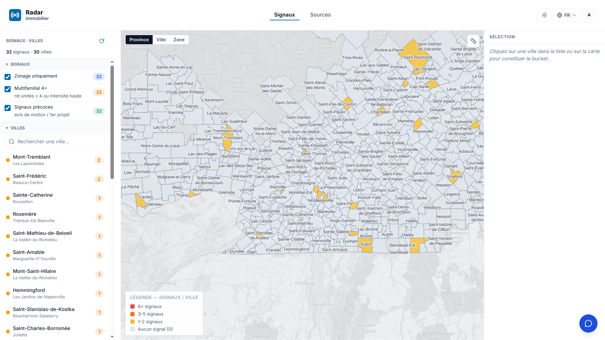
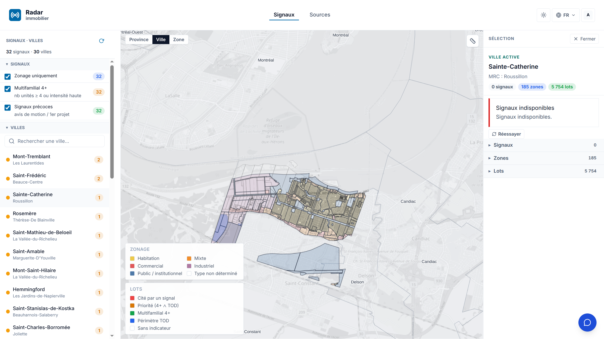
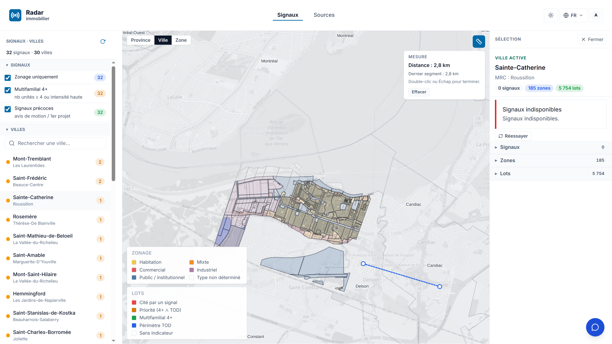
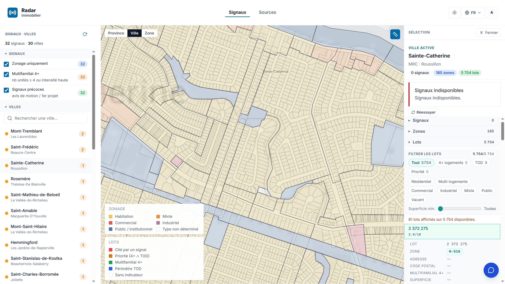
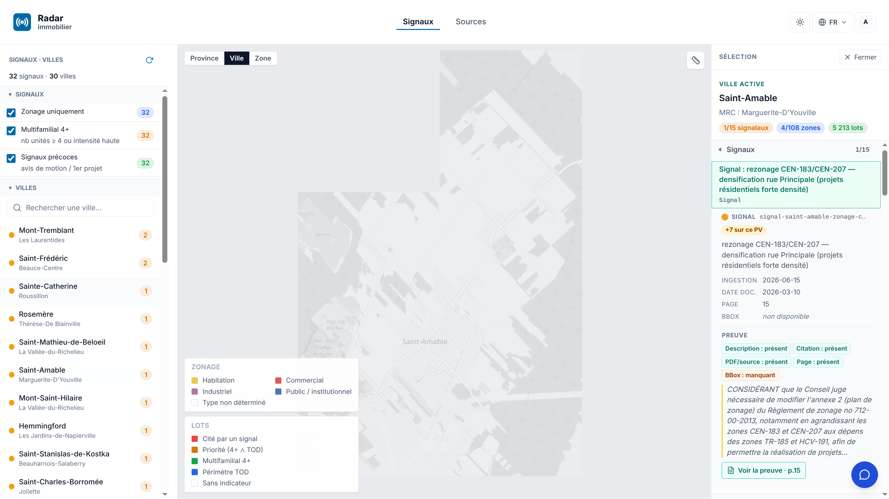
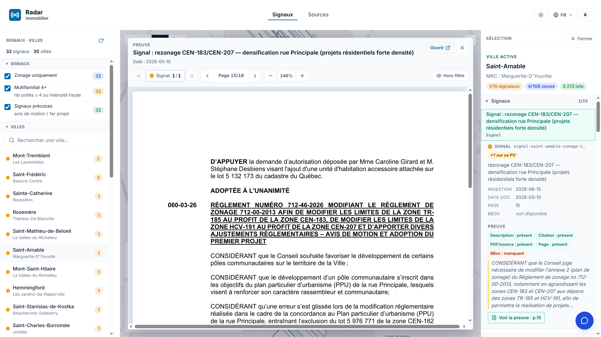
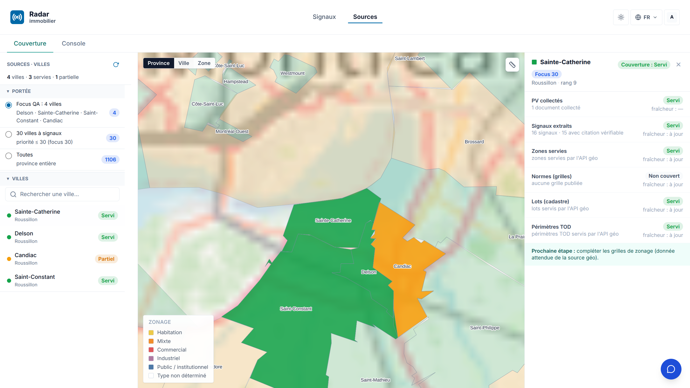
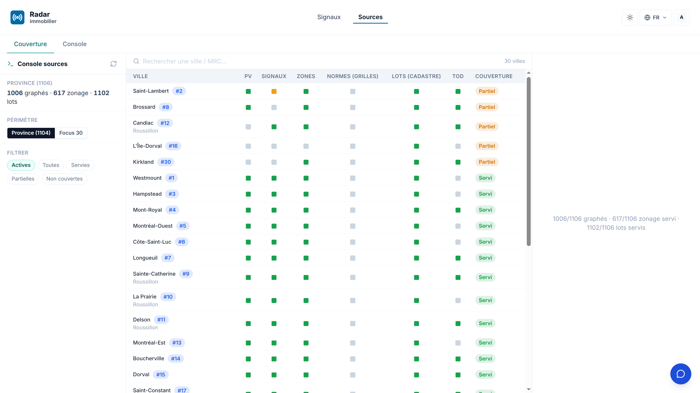

# Rapport de livraison — 19 juin → 3 juillet 2026

**Périmètre** : plateforme Radar immobilier (immo) + socle géographique (geo).
**Méthode** : tous les chiffres de ce rapport sont mesurés (journal track, PR GitHub mergées, runs CI, matrice de couverture geo régénérée le 2026-07-03, application en production observée le 3 juillet au soir). Les captures d'écran proviennent de l'application en production (immo.sent-tech.ca), prises le 3 juillet 2026.

---

## 1. Synthèse exécutive

Sur la quinzaine, le produit est passé d'un socle en construction à une **application déployée en continu en production**, avec un pipeline CI/CD né le 22 juin (48 builds sur la période, 46 réussis) et un connecteur MCP en service.

Les deux axes de lecture du produit, mesurés en direct le 3 juillet :

- **Détection : l'axe « 30 villes / 33 signaux précoces »** — les signaux PRIORITAIRES, c'est-à-dire l'intersection zonage ∩ multifamilial 4+ ∩ étape précoce (avis de motion / projet de règlement), et les villes distinctes qui les portent. Mesuré le 3 juillet : **32 signaux prioritaires sur 30 villes** dans l'application (projection en production) ; **33 signaux sur 31 villes** sur les graphes S3 du même jour (la projection rattrape). L'ensemble émerge d'un périmètre suivi de **1 106 municipalités** du Québec. La couverture de la chaîne de données atteint **1 006/1 106 municipalités graphées**, **617/1 106 avec zonage servi**, **1 102/1 106 avec lots (cadastre) servis** (bannière live de la vue Sources).
- **Granularité : plusieurs milliers de lots par ville** (5 754 lots à Sainte-Catherine, 10 016 à Mont-Tremblant), chacun scoré (multifamilial 4+, périmètre TOD, potentiel /10) — c'est de cet univers que les ~33 signaux prioritaires émergent.

En deux semaines :

| Volet | Livré |
|---|---|
| **immo** | **99 PR mergées** (#237 → #339), dont la parité carte concurrente, la couverture Sources mesurée en direct, le viewer PDF de preuve, le connecteur MCP en production et la résolution du crashloop API |
| **geo** | **337 commits, 3 PR** ; cadastre et rôle foncier complets à **100 % (1 106/1 106)**, PV **994/1 106 (89,9 %)**, zonage **658/1 106 (59,5 %)**, normes **471/1 106 (42,6 %)**, TOD amorcé (39 municipalités) |
| **prod** | Déploiement automatique sur merge ; radar-api stabilisée (probes/mémoire) ; MCP HTTP servi via ingress |
| **suivi** | 30 items track passés « done » sur la période (+ 7 réalisés dont le pointage suit), 25 en cours |

---

## 2. Livraisons immo

99 PR mergées entre le 19 juin et le 3 juillet (#237 → #339). Par chantier :

| Chantier | PR principales | État prod (3 juil.) |
|---|---|---|
| **Sources — couverture mesurée** : tri-état Servi/Partiel/Non couvert réel (A1), légende unique (A2), colonnes par couche (A3), couverture calculée sur le listing geo live, Console avec toggle Province (1104)/Focus, vue Couverture au mode d'interaction Signaux (radio 3 portées, drill zones, scorecard) ; définition du focus corrigée en 2 passes le 3 juillet (villes des signaux prioritaires z∩m∩p — voir encadré §2) | #318, #323, #337, #339, #343 | En prod |
| **Signaux — parité carte** : 645 zones OGC teintées par usage, lots colorés et scorés, flags 4+ réels et zone jointe sur lots OGC, filtres 4+/TOD/priorité/usage/superficie, fiche lot, légendes carte, fond gris, sélection + fiche au clic, chargement de tous les lots, zoom initial | #309, #314, #315, #321, #324 | En prod |
| **Signaux — ergonomie C7-C14** : filtre Zones et Lots au rail gauche, rail en liste de villes plate, outil de mesure de distance, menu Évaluation masqué (beta), filtres splittés par accordéon | #329, #331, #332, #334, #335 | En prod |
| **Preuve — viewer PDF** : route documents (PDF CAS), rendu via route interne, surlignage de citation multi-signaux, navigation par signal, perf (worker + cache partagés), affichage explicite quand la preuve est indisponible | #278, #287, #295, #299–#302, #304, #307 | En prod |
| **Connecteur MCP** : image immo-mcp autonome, outils données brutes (zones/lots GeoJSON, grille/PV PDF), workflow k8s d'apply, smoke via ingress, guide utilisateur claude.ai (MD + PDF 9 pages, validé e2e) | #312, #313, #316, #317, #333 | En prod (ingress vérifié) |
| **API & exploitation** : résolution du crashloop radar-api (startupProbe, limites mémoire, heap cap, probes découplées, /livez public, image :latest), scale à 0 de maildev/obscura (FinOps) | #322, #325–#328 | En prod, stable |
| **Auth & administration** : invitation par email (relais TEM), enrôlement mobile, logout fiable, menus gatés au rôle, correctif de session sur lien d'invitation, prompt de ré-authentification | #252, #260–#268, #280, #284, #290, #293 | En prod |
| **Header / design system** : migration AppHeader DS 0.34.62 (0 custo), TopNav 100 % composants DS, police DS app-wide, AppChrome | #254, #286, #296, #297, #310, #311 | En prod |
| **Graphify / grounding v2.3** : runner central (preflight + gate/publish), signaux ancrés PV+page+citation+URL (pilote Mont-Tremblant), projection atomique par ville + gate de complétude, auto-link PV des signaux prioritaires | #237, #240, #243, #244, #259, #303, #305 | En prod |
| **Études & spécifications** : SPEC_CONSOLIDATED_2026-07 (double consensus), étude convergence UI (DS/geo/PDF + responsive), plan reversal immo→geo, division DATA immo↔geo (RACI), audit du gisement 295 villes sans signal | #330, #336, #338, #272, #258 | Documents mergés |

**Suivi track** : 30 items passés « done » sur la période (13 carte-signaux-parité, 7 frontA-viz, 4 frontB-geo, 3 wp5-ontology, 2 réorientation, 1 frontA-infra). 7 items encore marqués « en cours » sont en réalité couverts par des PR mergées le 3 juillet (C11 mesure, C12 rail plat, C13 Évaluation masquée, Sources mode Signaux, étude convergence, étude crashloop, focus-30) — l'état réel du chantier « carte-signaux-parité » est d'environ 19–20 items livrés sur 21.

### La vue Signaux en production

Vue province : 32 signaux sur 30 villes avec les trois filtres actifs (zonage ∩ multifamilial 4+ ∩ précoce — le périmètre « signaux prioritaires » de l'axe 30/33), filtres par nature de signal à gauche, liste de villes plate, légende par intensité.

Parité carte au niveau ville : zonage teinté par usage (habitation, mixte, commercial, industriel, public), 5 754 lots dessinés à Sainte-Catherine, légendes dédiées. Le bandeau « Signaux indisponibles » visible à droite est un incident connu, encore ouvert sur cette ville (voir §5, action n° 3).

Outil de mesure de distance (nouveau, PR #332) :

Fiche lot au clic (zone de rattachement, indicateurs 4+/TOD, potentiel, source et collection geo), avec le filtre de lots (nombre de logements, TOD, priorité, usage, superficie) :

### La chaîne de preuve en production

Chaque signal expose sa traçabilité : date d'ingestion, date du document, page, citation exacte, et l'état de chaque élément de preuve (description, citation, PDF, page, bbox) :

Le viewer PDF ouvre le procès-verbal à la page du signal, avec navigation par signal et lien d'ouverture du document source :

### La vue Sources en production

Couverture par ville en tri-état (Servi / Partiel / Non couvert), radio de portée (Focus QA 4 villes / Villes à signaux précoces / province 1 106), et scorecard par ville : état par couche (PV, signaux, zones, normes, lots, TOD), fraîcheur, et prochaine étape :

Console sources : bannière live (1 006/1 106 graphés · 617/1 106 zonage · 1 102/1 106 lots), périmètre Province (1 104) / Villes à signaux précoces, filtres par état, et tableau par couche pour chacune des villes du focus :

> **Définition du focus (corrigée le 3 juillet, 2 passes)** : le focus de la vue
> Sources = les **villes distinctes portant au moins un signal PRIORITAIRE**
> (zonage ∩ multifamilial 4+ ∩ étape précoce) — l'axe de reporting
> « 30 villes / 33 signaux précoces ». Ce n'est ni un rayon autour de Montréal
> (`priorityRank ≤ 30`, bug signalé par Steve — les captures ci-dessus, prises
> le 3 juillet au soir, montrent encore ce périmètre), ni un top 30 par nombre
> de signaux (première correction, également erronée : une ville à 400 signaux
> sans signal prioritaire n'est PAS focus). L'ensemble est data-driven :
> 33 signaux prioritaires portés par 31 villes mesurés sur les graphes S3 du
> 3 juillet ; le libellé du radio devient « Villes à signaux précoces ».
> Détail et table complète : `docs/spec/reports/consolidation-30-pv-signaux-2026-07.md`.

---

## 3. Livraisons geo

Le socle géographique a fortement progressé sur la fenêtre (337 commits, 3 PR — composants UI Svelte zonage/lots et portage de l'acquisition dans le monorepo).

**Couverture par couche** (matrice de couverture régénérée le 2026-07-03, cible 1 106 municipalités) :

| Couche | Servi | % | Progression depuis le 27 juin |
|---|---:|---:|---:|
| Cadastre | **1 106/1 106** | **100 %** | complet |
| Rôle foncier | **1 106/1 106** | **100 %** | complet |
| Procès-verbaux | **994/1 106** | 89,9 % | +225 |
| Zonage (zones) | **658/1 106** | 59,5 % | +468 |
| Normes (grilles) | **471/1 106** | 42,6 % | +157 |
| TOD | 39 municipalités | — | nouvelle couche |
| PMTiles | 0 (planifié) | 0 % | — |

Nota : la vue Sources de l'application affiche 617/1 106 en zonage servi ; l'écart avec les 658 de la matrice geo correspond au délai de propagation entre l'acquisition geo et le listing consommé par l'application.

**Principales voies d'acquisition livrées sur la période** :

- **Recomposition PDF → GeoJSON** (levier phare pour le zonage) : chaîne T1 GeoPDF géoréférencé, T2 auto-calage (similarity/Umeyama, arbitrage par lots cadastraux), T3 raster ; 29/30 villes servies par cette chaîne ou une voie directe (mesuré sur l'ancien périmètre focus « proximité », avant la correction de définition — voir encadré §2).
- **Acquisition multi-voies du zonage** : moissonnage ArcGIS/AGOL, découverte GeoServer/WFS, GoNet/goAzimut (PG Solutions), désagrégation MRC → municipalité, canonicalisation des codes de zone.
- **Normes / grilles** : orchestrateur OCR à 2 moteurs (vision + contrôle croisé) avec extracteurs de grilles transposées et garde-fous anti-invention (rejet en cas de non-recoupement SIG).
- **TOD** : ingestion des aires TOD des plans métropolitains (CMM/CMQ), marquage `in_tod` des lots, couche TOD intégrée à la réconciliation.
- **Lots enrichis** : jointure géométrique lot → zone → normes → TOD, servie en OGC par municipalité (collections `qc-lots-*`) — c'est cette couche qui alimente la parité carte et le scoring 4+/TOD de l'application.
- **PV** : moissonneurs additionnels (portails municipaux spécialisés, deep-crawl), +225 municipalités servies.

---

## 4. Déploiements et exploitation

| Élément | Mesure (période) |
|---|---|
| Pipeline build & push images (radar-api, radar-ui) | Créé le 22 juin (PR #289/#292) ; **48 runs sur main, 46 succès**, 1 échec (doc), 1 annulé ; dernier build : 3 juillet 21:48 UTC |
| Déploiement k8s du MCP (immo-mcp) | Workflow créé le 2 juillet (PR #312) ; 6 runs, stabilisé le 3 juillet au matin (les 4 échecs initiaux correspondent à la mise au point des probes/API) |
| Incident crashloop radar-api | Résolu le 3 juillet (PR #322, #325, #326, #327) : startupProbe, limites mémoire, heap cap, /livez public, image épinglée |
| FinOps | maildev et obscura passés à 0 réplique (PR #328) pour tenir le quota du cluster |

**Volume d'activité de l'équipe d'agents sur la période** (mesuré via agent-stats sur les journaux de sessions, hors coûts — rapport séparé) : environ **7 100 sessions d'agents** (fichiers de transcript, sous-agents inclus) sur le périmètre radar, **≈ 84 000 événements de travail** dont ≈ 32 000 substantiels (tours de dialogue, actions) et ≈ 2 900 appels d'outils ; l'orchestration multi-agents (lanes parallèles en worktrees isolés) concentre l'essentiel du volume. Côté geo, l'activité est portée par une boucle d'acquisition automatisée (170 commits de réconciliation sur les 337).

---

## 5. Action items de la dernière réunion — pointage

Légende : ✓ fait (preuve) · ◐ partiel/en cours · ☐ à faire

| # | Action | État | Preuve / commentaire |
|---|---|---|---|
| 1 | E-mail à Steve + documentation de connexion du connecteur MCP (captures, étapes Claude) | ◐ | **Doc faite** : guide utilisateur MD + PDF 9 pages, validé e2e (PR #333, `docs/guides/connecteur-mcp/`). L'envoi de l'e-mail reste une action du responsable produit. |
| 2 | Utiliser le connecteur MCP pour analyser les 30 villes + tableau bons vs mauvais signaux + reco critères | ◐ | **MCP en production et validé** (PR #312/#313/#316/#317, smoke via ingress, outils zones/lots/grilles/PV — PR #316). L'analyse consolidée des 30 villes est en cours (item track « consolidation »). |
| 3 | Corriger les bugs API (Sainte-Catherine, Montréal-Ouest, Cowansville) : signaux indisponibles, doublons, mappage zones↔signaux | ◐ | **Crashloop résolu** (PR #322/#325/#326/#327) et mappage multi-niveau signal→zone/lot livré (PR #253/#282/#285/#294). **Constat live du 3 juillet : les signaux de Sainte-Catherine restent « indisponibles » dans la vue ville** (capture §2) alors que la scorecard Sources lui compte 16 signaux — l'incohérence est précisément le chantier de consolidation en cours. |
| 4 | Retravailler la vue 4 villes cibles (lots, zones, carto, recalage) + sélection/« shopping list » | ◐ | Parité carte, fiches, filtres et outil de mesure **livrés en prod** (PR #314/#315/#321/#324/#329/#331/#332/#335) ; portée « Focus QA : 4 villes » dédiée dans Sources (capture §2). La « shopping list » (constitution de sélection) reste à faire (P3). |
| 5 | Intégrer/mapper les zones TOD (gares, stationnements, métros) — 4 villes puis Québec | ◐ | geo a livré la couche TOD : aires PMAD CMM/CMQ ingérées, **39 municipalités servies**, lots marqués `in_tod` ; l'application affiche le périmètre TOD (légende lots, filtre TOD, scorecard). Généralisation au-delà des aires métropolitaines à poursuivre. |
| 6 | Court rapport sur les difficultés de scraping des zones (CAPTCHA…) + pistes | ☐ | Non livré en tant que tel. Des éléments existent (audit du gisement de 295 villes sans signal, PR #258 ; clarification du scraping des PV, PR #269) mais le rapport dédié reste à écrire. |
| 7 | Stratégie de recueil de données personnelles (cadastre) ad hoc, sans stockage persistant | ✓ | Décision arrêtée le 27 juin (conformité Loi 25) : collecte ad hoc au besoin, aucun stockage persistant de données personnelles. |
| 8 | Analyse manuelle des signaux présents (Sainte-Catherine, Cowansville…) : bons vs mal classés → valider les règles | ◐ | En cours via la consolidation. L'outillage livré la facilite : scorecard « signaux extraits · avec citation vérifiable » par ville et viewer de preuve page/citation (captures §2). |
| 9 | Diagnostiquer/optimiser la performance API (temps de réponse, saturation) | ✓ | Étude crashloop/mémoire (double consensus) + correctifs en prod : heap cap, probes découplées, startupProbe, /livez public, timeouts PG (PR #322/#325/#326/#327, spec #330) ; waiters de chargement côté UI (PR #311). API stable depuis le 3 juillet au matin. |
| 10 | Rapport consolidé 30 villes (signaux détectés + cas manquants) pour ajuster les critères | ◐ | L'infrastructure de mesure est livrée : couverture calculée sur le listing geo live (PR #318), Console Focus 30 (PR #337), vue Couverture (PR #339). Le rapport consolidé lui-même est en cours. |

**Bilan : 2 faits, 7 partiels/en cours, 1 à faire.** Les 7 « partiels » ont tous leur socle technique livré en production sur la période ; le travail restant est d'analyse (items 2, 8, 10), d'extension de couverture (5), de fonctionnalité complémentaire (4) ou de rédaction (1, 6).

---

## 6. Points d'attention et suite

- **Cohérence signaux ↔ vue ville** : l'incident « Signaux indisponibles » (Sainte-Catherine, constaté live) est le premier candidat de la consolidation — la donnée existe (16 signaux dans la scorecard) mais la vue ville ne la sert pas.
- **Zonage 617/1 106 côté application vs 658 côté geo** : resserrer la boucle de propagation acquisition → listing → application ; 433 complétions rapides identifiées par la bannière de couverture.
- **Normes (grilles) 471/1 106** : c'est la couche la moins couverte ; elle conditionne la qualité du scoring de potentiel par lot.
- **PMTiles** : 0 servi (planifié) — levier de performance carto pour la montée en charge province entière.
- Reliquats d'interface mineurs (ex. libellé « signalaux » dans le panneau ville, corrigé côté scorecard Sources mais pas encore dans ce panneau).
- Rédactions attendues : rapport difficultés scraping (item 6), analyse consolidée 30 villes (items 2/8/10), shopping list (item 4).

---

*Rapport généré le 3 juillet 2026. Sources : journal track immo (`.track/events.jsonl`), PR GitHub rhanka/radar-immobilier #237–#339, journal track geo et matrice `work/coverage/coverage-matrix.json` (régénérée 2026-07-03), runs GitHub Actions (Build & push images, Apply immo-mcp manifests), agent-stats (journaux de sessions), application en production immo.sent-tech.ca (captures du 3 juillet 2026).*
