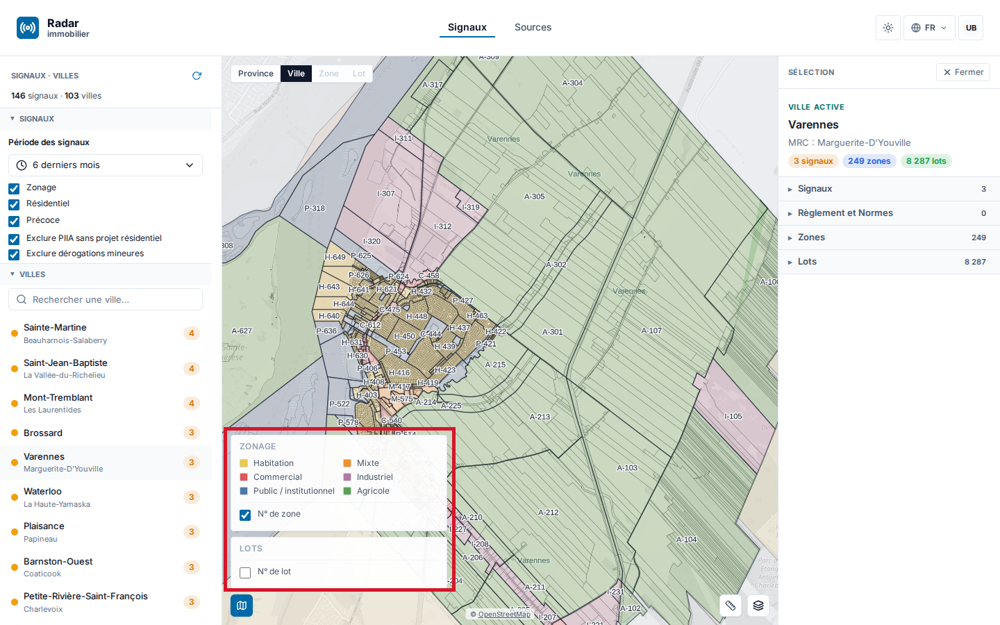

# Rapport d’activité — 10 août → 13 septembre 2026

**Périmètre** : plateforme Radar immobilier (immo), socle géographique (geo), déploiements et exploitation.  
**Fenêtre** : `2026-08-10T00:00:00-04:00` → `2026-09-13T23:59:59-04:00`, soit 35 jours.  
**Document distinct** : les montants, projections et allocations sont consignés uniquement dans `couts-2026-08-10_2026-09-13.*`.  
**Rapport précédent** : `docs/reports/rapport-mois-2026-07-13_2026-08-09.pdf` — document distinct, non reproduit ici.

---

## 1. Synthèse exécutive

La période livre trois fonctions visibles et corrige quatre sujets signalés.

Côté fonctions : la carte peut désormais s’afficher sur fond **satellite 2D** sans perdre les limites de zones et de lots ; le panneau de droite permet de **chercher un lot ou une zone** directement dans la ville consultée ; le lecteur de PDF **déroule le document entier** et **cherche dans son texte**.

Côté correctifs : les **couleurs et les intitulés de la légende** de la carte ont été fixés ; la **liste des villes** du panneau de gauche est redevenue complète ; le **rafraîchissement des procès-verbaux** a été outillé sans être encore entièrement automatique ; les **règlements** ne sont plus confondus avec les simples annonces qui les précèdent dans les procès-verbaux.

Côté technique : le **cycle préproduction → production fonctionne pour tous les composants** — interface, service immo, service geo, traitement des données et base de données destinée aux futures annotations. L’hébergement est consolidé sur une seule machine, et la chaîne qui fabrique les signaux à partir des procès-verbaux tourne seule en préproduction.

Deux transitions d’exploitation sont lisibles dans cinq schémas datés, joints en annexe : l’hébergement de juillet à aujourd’hui, et la chaîne procès-verbaux → signaux avant et après intégration. Cette chaîne est acceptée en préproduction ; **la production reste dormante tant que la PR #682 n’est pas promue**. Ce rapport ne transforme pas cette acceptation en mise en production.

## 2. Livraisons immo visibles

### La carte passe en vue satellite sans perdre ses limites

La difficulté du fond satellite est simple à énoncer : les aplats de couleur qui rendent le plan lisible **cachent l’image aérienne**. L’exigence suivie est donc la **gestion des contours sur les trois niveaux de lecture** — région, ville, et zone/lot : en mode satellite, chaque surface passe en transparence totale et n’est plus dessinée que par son **contour**, dans la couleur exacte de sa légende. Le découpage administratif reste visible, l’image aérienne aussi.

Le détail a été spécifié niveau par niveau avant d’être codé (`docs/spec/reports/PLAN_CORRECTION_SATELLITE_2MODES_2026-09-07.md`) : contour de région repris sur la couleur du dégradé de la carte, contour de zone repris sur la couleur de la famille d’affectation, contour de lot fin et repris sur la couleur du signal. Les livraisons associées vont du moteur cartographique (#622) à la bascule contour en satellite pour les zones et les lots (#640), au choix Plan/Satellite offert à l’utilisateur (#645, #646, #647), puis à l’activation en production (#664) avec le **Plan conservé par défaut au chargement** (#665). La vue 3D reste désactivée.

*Le fond satellite 2D, choisi explicitement par l’utilisateur ; le plan reste la vue de départ.*

### Chercher un lot ou une zone dans le panneau de droite

Une ville peut porter plusieurs milliers de lots et plusieurs centaines de zones. Le panneau de droite offre maintenant une **recherche par section** : on tape un numéro de lot ou de zone, la liste se réduit à la volée, et la sélection conserve le contexte de consultation (#520, #523).

Deux difficultés d’usage ont été traitées derrière cette recherche : les numéros s’écrivent de plusieurs façons selon les sources, et une recherche littérale échouait donc souvent. Une **normalisation commune** des numéros de lots et de zones a été centralisée au même endroit pour toute l’application (#527), puis la recherche a été rendue **tolérante aux séparateurs**, avec correspondance exacte puis par préfixe (#530).

*Recherche directe dans les lots et les zones de la ville consultée, sans quitter le panneau.*

### Lire la preuve dans le PDF sans le quitter

La preuve d’un signal est un document municipal. Auparavant, le lecteur affichait une page à la fois. Il **déroule maintenant le document en continu** et offre une **recherche plein texte** avec navigation d’une occurrence à l’autre (#539, #541). On vérifie donc une mention dans son document d’origine, sans le télécharger.

Deux défauts d’affichage signalés sur ce lecteur ont été corrigés dans la foulée : un débordement de la mention de source cartographique (#583) et un bouton de barre d’outils qui débordait de son emplacement (#587).

Limite connue : un PDF composé uniquement d’images numérisées, sans couche de texte, ne peut pas être cherché. Ce cas reste hors de cette fonction.

*Défilement continu du document et recherche dans son texte.*

### Les catégories de la légende ont été fixées

*Les catégories de la légende ont été fixées ; elles étaient jusque-là approximatives et fondées sur trop peu d’exemples.*

Jusqu’à présent, la couleur d’une zone était parfois **déduite de son numéro** : un numéro commençant par « H » devenait « Habitation », un numéro en « C » devenait « Commercial ». Cette déduction fonctionnait sur les quelques villes servant d’exemple, et se trompait ailleurs, car chaque municipalité numérote comme elle l’entend.

La règle a été inversée : la carte n’affiche plus que la **famille réellement déclarée par la source municipale**, sans catégorie devinée à partir du code (#632). La correspondance code → famille a ensuite été restaurée là où elle est fournie par la source, et la légende des lots est devenue dynamique, c’est-à-dire qu’elle n’affiche que les catégories effectivement présentes à l’écran (#666). Une dernière passe a borné la déduction et corrigé quatre défauts d’intitulé et de mise en forme de la légende (#667). Une valeur que la source ne permet pas de trancher **reste non résolue** plutôt que d’être rangée dans une famille plausible.

### La liste des villes du panneau de gauche est complète

Signalé par Steve lors de sa revue de production du 12 août : une ville apparaissait **quand on la cherchait** mais était **absente de la liste non filtrée**. La cause s’est révélée être un plafond d’affichage de 60 entrées, hérité d’une autre vue où la liste était déjà pré-filtrée, et appliqué ici à la liste provinciale complète : au-delà du 60ᵉ rang, une ville n’était visible que par la recherche. Le plafond a été retiré, la liste défile intégralement, et la recherche ne révèle plus rien que la liste cache (#512).

### Correctifs sans capture dédiée

Les correctifs des **panneaux gauche et droit** et des icônes font partie des livraisons de la fenêtre : marges du rail gauche (#583), avertissements compacts et rechargement par section dans le panneau droit (#585), alignement de l’icône de légende sur celle de mesure (#561). Le jeu de preuves disponible ne contient pas de capture isolant chacun de ces correctifs ; aucune image sans rapport avec la fonctionnalité n’est substituée. Les quatre captures ci-dessus correspondent toutes à des fonctions effectivement livrées pendant la période.

## 3. Données — procès-verbaux et règlements

### Le rafraîchissement des procès-verbaux, outillé mais pas encore entièrement automatique

La chaîne qui va chercher les procès-verbaux, en extrait les signaux et les publie a été entièrement outillée pendant la période : tâches planifiées décrites dans le dépôt, images figées par empreinte pour que l’exécution soit reproductible (#577), déploiement et activation sur la préproduction seulement (#586), déclenchement manuel du ramassage mis à disposition (#669), puis la version 0.18 de l’extracteur exécutée en tâche planifiée complète (#679). Un chemin production existe, mais il est **volontairement gardé fermé par un interrupteur** tant que la preuve d’un cycle complet n’est pas produite (#675).

**Ce n’est donc pas encore automatique à 100 %.** Le plan d’orchestration du 3 septembre (`docs/PLAN_PIPELINE_DONNEES_PREPROD.md`) classe explicitement la fraîcheur des données en priorité P0 « bloquée avant activation », et pose la condition de sortie : ce n’est pas la présence d’une tâche planifiée qui compte, mais **la preuve qu’un cycle a réellement mis à jour une donnée**. C’est la prochaine priorité.

### Les règlements ne sont plus confondus avec les annonces qui les précèdent

Un procès-verbal contient souvent un **avis de motion** : l’annonce légale qu’un règlement *sera* présenté pour adoption à une séance ultérieure. Ce n’est pas un règlement. L’application créait pourtant un règlement portant le numéro du futur texte, ce qui affirmait comme acquis un texte non encore adopté (spécification `docs/spec/SPEC_EVOL_AVIS_MOTION_CYCLE_VIE.md`, déclenchée par l’owner le 30 août sur un cas réel).

Le modèle a été repris : un avis de motion devient un **objet distinct**, daté, portant le numéro du règlement visé, et aucun règlement n’est créé tant qu’il n’est pas adopté (#544). Le cycle de vie avis → projet → adoption → en vigueur est modélisé (#532, #536), la distinction entre texte ferme et simple anticipation est servie par l’interface (#540, #542), les numéros issus d’un simple avis sont exclus de la liste des règlements (#537, #538, #546, #547), les objets erronés déjà créés ont été retirés et la base reprojetée (#548, #552), et l’affichage ne montre plus que les règlements fermes (#560). La preuve source du signal et le PDF de règlement sont désormais deux choses distinctes dans le panneau de droite (#511).

**La récupération des règlements reste non exhaustive.** Les liens vers les PDF municipaux ne sont établis que pour quatre villes de démonstration (#615), une source municipale supplémentaire a été raccordée (#553), et le plan d’orchestration du 3 septembre chiffre le manque amont : environ **235 villes sur 1 106 n’ont pas de zonage geo publié**, ce qui produit un « 0 règlement » légitime à l’écran. Ce manque relève de la collecte, pas de l’affichage.

## 4. Livraisons geo

Geo fournit les briques nécessaires aux parcours visibles d’immo : contrats et service des règlements, chaîne CPTAQ, moteur de carte et sessions de tuiles, résolution procès-verbal/zonage et jointures municipales. Le moteur cartographique livré par geo est ce qui rend possible la vue satellite décrite plus haut.

Les contraintes agricoles CPTAQ sont servies et affichables en couche optionnelle sur la carte (#591), sur un périmètre encore borné à quelques municipalités. Les sources BDZI et GRHQ sont raccordées mais leur couverture reste partielle ; aucune généralisation provinciale n’est déduite de ces raccordements.

La période retire aussi la dépendance au registre d’images Scaleway pour `geo-api`, `geo-capture`, `geo-acquisition` et `normes-job` : les images d’exécution viennent du registre GitHub. Cette indépendance de registre ne prouve pas la complétude réglementaire de toutes les couches dans toutes les municipalités.

## 5. Le pipeline procès-verbaux → signaux

La chaîne qui transforme un procès-verbal municipal en signal affichable compte **quatre étapes**, identiques avant et après :

1. **collecte** — récupérer les procès-verbaux publiés par la municipalité ;
2. **lecture et exploitation** — repérer dans le document les passages qui portent une décision d’urbanisme ;
3. **extraction** — en tirer des objets structurés (zone, lot, règlement, date) avec la citation qui les justifie ;
4. **projection** — écrire ces objets dans la base et les publier vers l’application.

**Avant** (`pipeline-before-20260810`, annexe **B1**) : les étapes 1 et 2 tournaient dans le cluster, mais l’étape 3 s’exécutait **sur le poste de l’opérateur**, avec ses propres clés d’accès aux modèles de langage, et l’étape 4 était **déclenchée à la main**. Rien ne pouvait donc partir seul : chaque rafraîchissement demandait une personne devant son écran, et la partie la plus coûteuse du traitement vivait hors de l’infrastructure.

**Après** (`pipeline-after-20260913`, annexe **B2**) : les quatre étapes s’exécutent **au même endroit, dans le cluster**, sous une tâche planifiée unique (`radar-refresh-pv`, 05:17 UTC). L’extracteur est consommé comme une bibliothèque au lieu d’un outil externe, l’accès aux modèles de langage se fait à l’intérieur du même processus, et les clés sont conservées chiffrées côté serveur. Le poste de l’opérateur ne sert plus qu’à l’enrôlement initial des accès.

L’ensemble est **accepté en préproduction**. La production est représentée dans un conteneur distinct portant l’état **dormante** ; la PR #682 est explicitement non promue. Aucune scène, légende ou conclusion de ce rapport ne présente ce pipeline comme actif en production.

## 6. Hébergement et déploiements

L’hébergement a changé deux fois pendant l’été : de Scaleway vers OVH, puis de trois machines vers une seule. Le schéma ci-dessous montre l’état d’arrivée au 13 septembre ; les trois états datés sont détaillés dans le tableau qui suit, et chacun dispose de sa version lisible en annexe.

### Trois états datés

| Date | Ce qui était en place | Ce que cela apporte | Annexe |
| --- | --- | --- | :---: |
| **Juillet 2026** | Tout tournait sur Scaleway, en Scaleway pur, avant la décision de migrer. Un seul environnement existait : ce qui était déployé était directement ce que voyait l’utilisateur. Le stockage des documents était assuré par un service interne au cluster, adossé à un disque. | Une plateforme qui fonctionne, mais sans filet : aucune étape intermédiaire ne permet de voir une livraison avant qu’elle n’arrive chez l’utilisateur. | **A1** |
| **10 août 2026** | La migration vers OVH est faite à environ 90 % — estimation datée fournie par l’owner, pas une mesure. Le stockage interne au cluster est encore présent. Il n’y a toujours qu’un seul environnement. | Le coût d’hébergement bascule chez le nouveau fournisseur, mais la double dépendance (ancien stockage interne, ancien registre d’images) n’est pas encore levée. | **A2** |
| **13 septembre 2026** | Deux environnements complets coexistent sur le même cluster OVH, consolidé sur une seule machine `r2-15` : une **préproduction** et une **production**, chacune avec son interface, son service immo, son service geo, sa base de données et son stockage de documents. Le stockage interne au cluster a disparu au profit du stockage objet du fournisseur. | Une livraison est visible et validable en préproduction avant d’atteindre l’utilisateur, et la plateforme tient sur une seule machine au lieu de trois. | **A3** |

Le retrait du stockage interne au cluster a été fait en deux temps (#683, #685), en préproduction comme en production. La copie des documents vers le stockage objet du fournisseur est prouvée par son journal d’exécution : **59 017 objets**, 12 534 514 457 octets, aucune copie manquante et aucun échec, avec quatre empreintes de contrôle. Le service d’envoi d’e-mails transactionnels demeure la seule exception restée chez Scaleway.

### Le cycle préproduction → production fonctionne pour tous les composants

C’est le changement structurant de la période. Jusqu’en août, la branche principale se déployait directement en production. Depuis la refonte de la chaîne de livraison (#518), elle se déploie en **préproduction**, et la production n’est atteinte que par la pose explicite d’une étiquette de version, en réutilisant l’image exacte déjà construite et vérifiée — pas une reconstruction.

Le cycle couvre bien **l’ensemble des composants** : l’interface, le service immo, le service geo (qui dispose de son propre environnement de préproduction), le traitement des données sous forme de tâches planifiées déployées en préproduction (#586, #679), et la **base de données PostgreSQL** qui porte déjà les annotations collaboratives livrées pendant la période (#584) et servira aux annotations à venir. Une correction a rétabli la parité du dernier composant qui manquait à l’appel en préproduction (#676).

Trois garanties accompagnent ce cycle : un compte de déploiement aux droits limités au seul espace de préproduction, un contrôle qui refuse de promouvoir en production un code non fusionné, et un interrupteur unique permettant de revenir en arrière immédiatement.

## 7. Les cinq schémas joints

Le dossier hors ligne `docs/architecture/decision-focus.html`, et sa copie `docs/reports/architecture-monthly/architecture-before-after-2026-09-13.html`, rendent les cinq scènes suivantes, toutes reprises en annexe du PDF :

1. `hosting-july-2026` — hébergement en juillet, annexe **A1** ;
2. `hosting-august-20260810` — hébergement au 10 août, annexe **A2** ;
3. `hosting-today-20260913` — hébergement au 13 septembre, annexe **A3** ;
4. `pipeline-before-20260810` — chaîne procès-verbaux → signaux avant intégration, annexe **B1** ;
5. `pipeline-after-20260913` — la même chaîne après intégration, annexe **B2**.

Chaque scène conserve ses conteneurs imbriqués, ses cartes avec état et dépôt d’origine, et ses relations orthogonales. L’annexe est en deux parties : **annexe A** pour les trois états d’hébergement (A1, A2, A3), **annexe B** pour la chaîne avant et après (B1, B2). Chaque page d’annexe porte la scène entière, sans découpe, ajustée à la largeur d’une page A4 portrait, suivie d’un commentaire qui explique comment on est arrivé à l’état montré. L’image conserve sa résolution native : elle se lit en zoomant dans le PDF.

## 8. Action items — pointage

| # | Action | État | Preuve ou limite |
| ---: | --- | :---: | --- |
| 1 | Fixer les catégories et les couleurs de la légende | **fait** | Famille déclarée par la source, plus de catégorie devinée (#632, #666, #667) |
| 2 | Offrir le fond Plan et le fond Satellite | **fait** | Satellite livré en production ; Plan conservé au chargement (#664, #665) |
| 3 | Chercher un lot ou une zone dans le panneau de droite | **fait** | Recherche par section, tolérante aux séparateurs (#520, #523, #527, #530) |
| 4 | Dérouler et chercher dans le PDF de preuve | **fait** | Défilement continu et recherche plein texte (#539, #541) |
| 5 | Compléter la liste des villes du panneau de gauche | **fait** | Plafond d’affichage retiré (#512) |
| 6 | Rendre le rafraîchissement des procès-verbaux autonome | *partiel* | Outillé et accepté en préproduction ; production dormante jusqu’à la PR #682 ; preuve d’un cycle complet attendue |
| 7 | Ne plus confondre règlement et avis de motion | *partiel* | Confusion corrigée (#544 et suivants) ; récupération des règlements encore non exhaustive |
| 8 | Faire fonctionner le cycle préproduction → production | **fait** | Tous les composants couverts (#518, #586, #676, #679) |
| 9 | Sortir le stockage interne du cluster | **fait** | Préproduction et production sur le stockage objet du fournisseur (#683, #685) |
| 10 | Consolider l’hébergement | **fait** | Une seule machine `r2-15` ; réservations et usage mesurés le 14 septembre |
| 11 | Corriger les panneaux et les icônes | **fait** | Livraison établie ; captures dédiées absentes du jeu fourni |

## 9. Prochaines étapes

**Attendu de Steve** : valider les parcours de démonstration — recherche d’un lot ou d’une zone, lecture de la légende, bascule Plan/Satellite, ouverture du procès-verbal et recherche dans le PDF — puis prioriser les couches environnementales suivantes.

**De notre côté** :

- prouver un cycle complet de rafraîchissement des procès-verbaux, donnée mise à jour à l’appui, avant toute promotion en production ; c’est la priorité annoncée ;
- conserver la production du pipeline dormante tant que la PR #682 n’est pas promue ;
- étendre la récupération des règlements au-delà des quatre villes de démonstration, et réduire le manque de zonage amont ;
- suivre la capacité de la machine consolidée avec une série de mesures dans le temps plutôt qu’un relevé unique ;
- étendre la couverture geo en maintenant les qualifications `partiel`, `inconnu` ou `non-vérifié` lorsqu’une preuve manque.

---

*Sources : historique Git et PR citées, spécifications sous `docs/spec` et `docs/spec/reports`, plan d’orchestration du 3 septembre, revue de production du 12 août, preuves de copie objet, quatre captures sous `docs/reports/assets/2026-09/`, schémas canoniques sous `docs/architecture.md`, et rapport précédent joint sous `docs/reports/rapport-mois-2026-07-13_2026-08-09.pdf`.*
