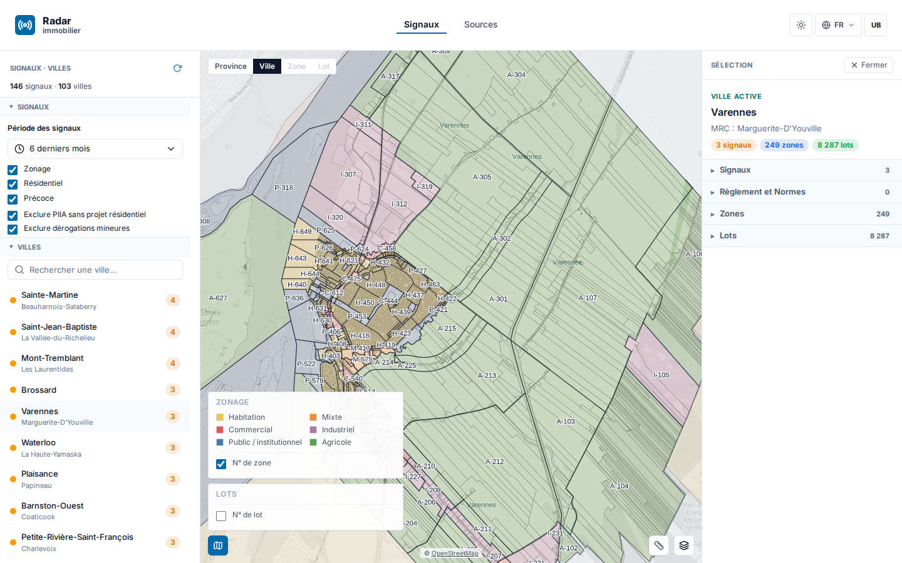
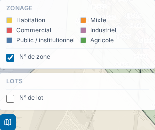
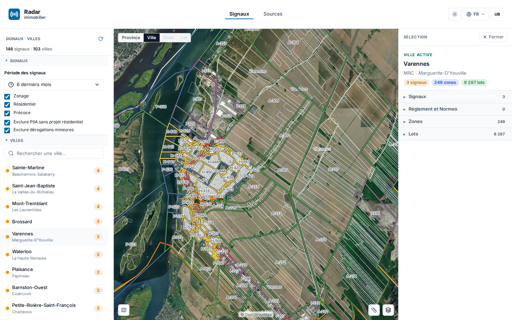
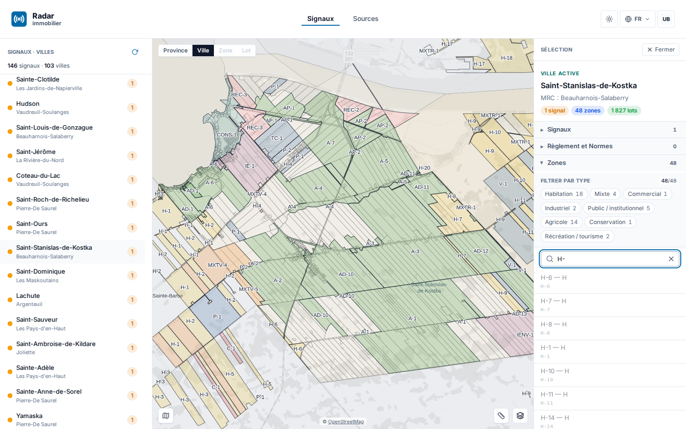

# Rapport de livraison — 12 août → 10 septembre 2026

**Périmètre** : plateforme Radar immobilier (immo) + socle géographique (geo).
**Méthode** : tous les chiffres de ce rapport sont mesurés sur la fenêtre Montréal `2026-08-12T00:00:00-04:00` → `2026-09-10T23:59:59-04:00` : historique premier parent et tags de `origin/main`, PR mergées, journal Track local et état d'exploitation relevé le 11 septembre. Les captures référencées dans `assets/2026-09/` documentent les parcours livrés ; leur intégration au rendu final est assurée séparément.

---

## 1. Synthèse exécutive

Le mois livre un saut de produit visible : **recherche directe de lots et de zones**, **viewer PDF multipage avec recherche**, **satellite 2D**, **légende de zonage restaurée avec déductions bornées**, cycle de vie des règlements, provenance renforcée et premières notes collaboratives. La chaîne Geo progresse en parallèle sur les règlements, le CPTAQ, le moteur cartographique et plusieurs jointures municipales.

La mesure Git donne **132 PR immo mergées** et **9 releases**, de **v1.0.0 à v1.2.5**. Côté geo, **174 PR sont mergées** et **5 versions** sont publiées, de **v0.5.1 à v0.6.1**. Le 11 septembre, les points publics `/build.json` et `/health` servent le SHA **831cad2**, soit **v1.2.5**.

| Volet | Livré |
| --- | --- |
| **immo** | **132 PR mergées** ; recherche lots/zones, preuve PV→règlement, PDF multipage, satellite 2D, légende de zonage et déduction auditée, CPTAQ conditionnel, provenance réglementaire, notes lots/signaux |
| **geo** | **174 PR mergées** ; contrat et service des règlements, chaîne CPTAQ, moteur de carte et sessions de tuiles, résolution PV/zonage et nouvelles jointures municipales |
| **prod** | **9 releases immo** ; production observée sur **v1.2.5** ; refresh automatique présent en préproduction, pas encore armé en production |
| **suivi** | Journal Track local arrêté au 5 septembre : **119 événements** dans la fenêtre, **48 items créés**, **12 décisions** et **2 transitions distinctes vers done** ; Git demeure la mesure de livraison après cette coupe |

---

## 2. Livraisons immo

Les livraisons principales sont regroupées ci-dessous. « En prod » signifie que le changement est contenu dans **v1.2.5**, version observée le 11 septembre ; cela ne remplace pas une recette ville par ville.

| Chantier | PR principales | État prod (11 sept.) |
| --- | --- | --- |
| **Zonage — couleurs, légende et numéros** : restauration des couleurs de familles ; affichage distinct du numéro de zone et du numéro de lot ; priorité aux valeurs de source, puis repli alphabétique audité ; les valeurs non résolues restent non résolues | #632 (v1.2.0), #666 (v1.2.4), #667 (v1.2.5) | En prod, v1.2.0 puis v1.2.4–v1.2.5 |
| **Carte — satellite 2D** : intégration du moteur Geo, stabilisation des changements de style, autorisation du domaine de tuiles en production et retour au fond Plan par défaut | #640, #643, #645–#649, #652–#654, #664, #665 | En prod, v1.2.2–v1.2.3 ; 3D désactivée |
| **Recherche et chaîne de preuve** : recherche séparée dans lots et zones ; distinction entre PV source et règlement ; corrections du rattachement de preuve | #511, #520, #523, #526, #527, #530 | En prod, v1.1.1–v1.2.0 |
| **Viewer PDF** : défilement continu entre pages et recherche plein texte dans tout le document, avec navigation entre occurrences | #539, #541 | En prod, v1.2.0 ; dépend de la couche texte du PDF |
| **Règlements et provenance** : cycle avis/projet/adoption, statut dérivé à l'ingestion, rattachement aux objets Geo, exposition MCP et garde-fous de citation | #532, #540, #542, #556, #560, #568–#571, #588, #603, #606, #615, #616 | En prod, v1.2.0 |
| **Contraintes CPTAQ** : contrôle de couche et passage par le proxy OGC de production lorsque la collection municipale existe | #591, #614 | En prod, v1.2.0 ; disponibilité variable selon la ville |
| **Notes lots/signaux** : migration additive, édition, suppression logique, interface et mise à jour SSE | #576, #581, #584 | En prod, v1.2.0 ; périmètre mono-client, pas la collaboration complète |
| **Liste des municipalités** : suppression du plafond qui masquait Saint-Stanislas-de-Kostka hors recherche | #512 | En prod, v1.1.1 |

### Le zonage redevient lisible et traçable

Les PR **#666/#667** rétablissent la lecture couleur sans confondre trois notions : le numéro municipal de zone, le type déclaré par la source et la famille d'usage utilisée pour la couleur. La déduction suit une précédence bornée — `affectation`, puis `kind`, puis code alphabétique audité — et ne transforme pas ce dernier repli en norme québécoise universelle.

*Les signaux restent visibles dans leur contexte de zone ; les familles distinguées par la légende proviennent du contrat livré, pas d'une correspondance libre ajoutée au rapport.*

*La fiche sépare le numéro de zone, le numéro de lot et la famille d'affichage. Les codes sans correspondance auditée ne sont pas forcés.*

Le relevé Track du 4 septembre quantifie le terrain : `zone_code` est servi pour **868 municipalités** sur **871 collections** examinées, dont **727** avec provenance de source citée et **144** avec un vrai numéro de zone mais une provenance encore incomplète. `usage_dominant` est dérivé pour **710 municipalités**. Les écarts de géométrie restent concentrés sur **195 + 43 municipalités** selon les deux catégories consignées dans la décision ; ils ne sont pas masqués par la légende.

### Le fond satellite 2D complète le plan

La série **#640, #643, #645–#649, #652–#654** raccorde le moteur cartographique Geo à l'application. **#664** autorise les tuiles en production et **#665** conserve Plan comme mode initial, afin que le satellite soit un choix explicite. La vue 3D reste désactivée dans la version servie.

### Retrouver un objet puis ouvrir sa preuve

La recherche lots/zones est livrée par **#520/#523**, puis consolidée par **#527/#530**. La preuve distingue désormais le PV ayant produit le signal du règlement applicable (**#511/#526**). Dans le document, **#539/#541** ajoutent le défilement multipage et la recherche avec occurrences précédente/suivante ; les PDF constitués uniquement d'images restent hors de cette preuve faute d'OCR.

Les correctifs de provenance **#568/#569/#588/#603/#606/#616** ferment plusieurs chemins où une citation pouvait être affichée sans référence exploitable. Ils renforcent la chaîne de preuve ; ils ne démontrent pas que chaque municipalité publie des documents de qualité identique.

---

## 3. Livraisons geo

Geo totalise **174 PR mergées** sur le premier parent et cinq versions dans la période : **v0.5.1, v0.5.2, v0.5.3, v0.6.0 et v0.6.1**.

**Principales voies livrées sur la période** :

- **Règlements** : mesure de couverture des URL, contrat de cycle de vie, KPI sur l'univers de **1 106 municipalités**, émission des événements de zonage, état de décision et exposition MCP/service (#277, #278, #282, #283, #286, #294, #295, #325, #343).
- **Contraintes CPTAQ** : normalisation, métadonnées de service, collections et garde-fous de publication (#280, #302, #303, #306, #307, #310–#312). À la coupe Track du 5 septembre, quatre municipalités servent effectivement cette couche — **Coaticook, Saint-Stanislas-de-Kostka, Sutton et Warden** — sous forme de MultiPolygons. BDZI et GRHQ sont raccordés mais pas encore servis.
- **Moteur cartographique** : interfaces initiales, package 0.5.1, création des sessions de tuiles, service et adaptateurs jusqu'à 0.6.1, puis activation de l'overlay de production et RBAC (#206–#223, #297, #301, #330, #331, #333, #334, #337, #339, #341, #354, #368, #369).
- **Résolution PV et zonage** : audit, remédiations et résolution CAS des événements pour mieux relier les documents aux municipalités et aux objets réglementaires (#255, #256, #258, #261–#264, #267, #272–#275).
- **Jointures municipales** : travaux ciblés pour **Amherst, Beaupré et Boischatel**, avec leurs correctifs associés (#194, #196, #199, #201).

Ces apports alimentent les parcours immo visibles au §2. Ils ne justifient pas d'extrapoler une couverture provinciale aux couches encore servies sur un nombre limité de municipalités.

---

## 4. Déploiements et exploitation

| Élément | Mesure (période) |
| --- | --- |
| Releases immo | **9 tags** : v1.0.0 (19 août), v1.1.0 (22 août), v1.1.1 (23 août), v1.2.0 (9 septembre), puis v1.2.1 à v1.2.5 (10 septembre) |
| Production | `/build.json` et `/health` observés le 11 septembre sur **831cad2 = v1.2.5** |
| Préproduction | Séparation préprod/prod, sauvegarde pré-release, rollback applicatif et migrations dans le pipeline (#518, #572, #575, #656, #659). Les CronJobs scrape/projection sont actifs et leur dernier succès observé date du 11 septembre. La finalisation de la migration **SCW→OVH** reste rattachée à ce chantier préprod : registry→GHCR, transfert vers les buckets OVH et décommissionnement de MinIO |
| Fraîcheur production | Aucun CronJob de refresh n'est présent dans le namespace de production OVH au relevé : l'actualisation automatique de production n'est pas encore armée. Données servies en production au relevé du 11 septembre (requêtes bornées en lecture seule) : nœuds Signal, Zone, Lot et Bylaw créés au plus tard le **6 août 2026** ; nœuds réglementaires (`source`, `designationevent`) jusqu'au 10 septembre ; dates de documents source au plus tard le **16 juin 2026**. Un premier refresh de production (scrape + détection des signaux, Job `radar-scrape`) a été déclenché le 11 septembre à 18:27Z via le workflow self-service `run-job` (option `scrape`, PR #669) ; son résultat est en cours de mesure |

---

## 5. Action items de la dernière réunion — pointage

Le journal ne contient pas un procès-verbal unique et exhaustif. Le tableau reprend les directives owner explicitement datées du **4 septembre**, sans compléter les blancs par supposition.

Légende : ✓ fait (preuve) · ◐ partiel/en cours · ☐ à faire

| # | Action | État | Preuve / commentaire |
| --- | --- | --- | --- |
| 1 | Distinguer les vrais numéros de zone de la famille colorée et privilégier la lecture habitation | ✓ | Affichage corrigé et repli audité dans #632/#666/#667, servi en v1.2.5. La provenance municipale reste incomplète pour une partie des 144 jeux portant un vrai numéro. |
| 2 | Activer les deux choix de fond utiles : satellite et plan | ✓ | Satellite autorisé en production par #664 ; Plan remis par défaut par #665. La livraison est 2D, sans activation implicite de la 3D. Directive non retrouvée sous cette forme dans le journal Track au 4 septembre (source-gap) : la livraison est établie par Git, les items satellite tracés datent du 5 septembre (GO#2). |
| 3 | Ne pas faire du CPTAQ l'unique réponse environnementale ; avancer aussi les couches inondation et autres contraintes | ◐ | CPTAQ est servi pour quatre municipalités à la coupe ; BDZI et GRHQ sont raccordés côté Geo mais pas servis. Extension et recette bout en bout à poursuivre. |
| 4 | Rendre la publication des citations autonome, sans action manuelle de l'owner | ✓ | Le journal consigne le 4 septembre la création d'une identité IAM dédiée, de sa politique, de sa clé et de la variable de publication. Aucune valeur secrète n'est reproduite ici. |

**Bilan : 3 faits, 1 partiel.** Le reste porte sur l'extension mesurée des contraintes environnementales, pas sur la reprise des parcours déjà livrés.

---

## 6. Prochaines étapes

**Attendu de Steve** :

- **Valider les parcours de démonstration** : recherche lot/zone, lecture de la famille et du vrai numéro de zone, bascule Plan/Satellite, ouverture du PV et recherche dans le PDF.
- **Qualifier les familles d'usage** : signaler les cas municipaux où le code affiché ou la couleur ne correspond pas au sens attendu, afin d'étendre uniquement les correspondances vérifiables.
- **Prioriser les couches environnementales** : ordonner inondation, hydrographie et autres contraintes après le pilote CPTAQ, à partir des villes de démonstration.

**De notre côté** :

- **Armer le refresh production** : promouvoir le circuit scrape→projection avec métriques de couverture, critères d'arrêt et preuve de fraîcheur ; un succès de CronJob ne remplacera pas la mesure des données servies.
- **Étendre les contraintes Geo** : faire passer BDZI/GRHQ du raccordement au service, puis élargir la couverture CPTAQ au-delà des quatre municipalités mesurées.
- **Achever la provenance du zonage** : réduire les villes sans géométrie ou sans source citée et conserver l'état non résolu lorsqu'aucune correspondance municipale n'est démontrée.
- **Recetter la chaîne de release** : joindre aux pipelines les preuves de restauration, de rollback de schéma et d'approbation de promotion.
- **Finaliser le chantier préprod OVH** : basculer le registry vers GHCR, transférer les objets requis dans les buckets OVH et retirer MinIO après validation.
- **Réconcilier Track avec Git** : rattacher aux items les PR, versions et preuves visuelles livrées après la dernière coupe locale du 5 septembre.

---

*Rapport généré le 11 septembre 2026. Sources : historique premier parent et tags de `origin/main` pour `rhanka/radar-immobilier` et geo, références de PR mergées, journal Track local (`.track/events.jsonl`, dernière entrée le 5 septembre), points publics `/build.json` et `/health`, inventaire Kubernetes borné du 11 septembre, requêtes bornées en lecture seule sur la base de production (`radar-immobilier-freshness.txt`, `radar-immobilier-source-dates.txt`) et captures `docs/reports/assets/2026-09/`.*
