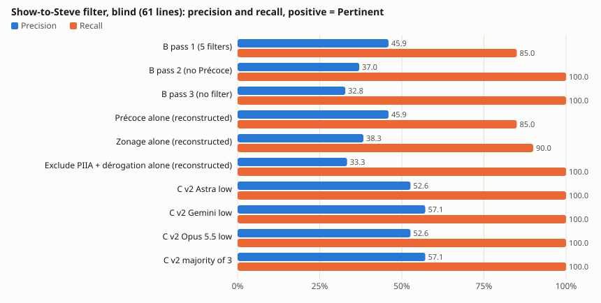
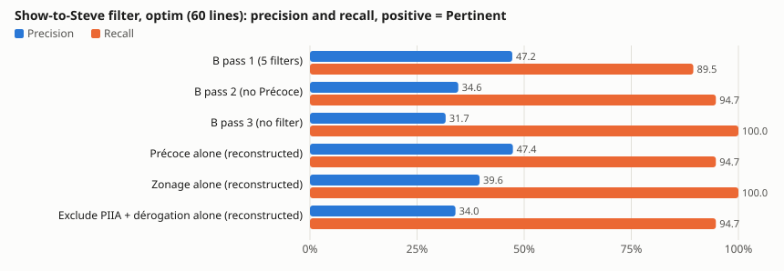

# Results — draft oracle C, three models at low effort

> **Contamination notice (read first).** The test-set scores of prompt v2 below are
> **contaminated**: rule 1 of v2 comes from an aggregate of Steve's analysis (§2 table) that
> includes 37 test lines, 6 of them exactly in the row the rule relies on; and the agent that wrote
> the prompts had read material covering the test set (full analysis with its itemised lists, the
> dossier's whole-set tables, two test rows during exploration). Inventory and rule-by-rule audit:
> `TEST-SET-PROTOCOL.md` §1. A recomputation without the 6 lines is shown as a **mitigation, not a
> proof**. Reference figures for C must come from a new, virgin test set (Steve's next 52
> municipalities, sealed before any optimisation; `extension-plan.md`).
>
> **Status**: exploratory Steve-agreement pilot (reviews in `review.md`), not a D13-grade oracle.

All figures are produced by the scripts from the archived answers (no model call after the single
test run); tables are copied from `results/score-*.md` and `results/filter-metrics-*.md`.

## Measurement level

- **Unit** = one line of Steve's Triage sheet attached to the radar record(s) it names: 121 lines
  (3 of 124 excluded, no radar record). **Test set = 61 lines / 25 municipalities** (reference);
  development set (`optim`) = 60 lines / 26 municipalities (diagnostic only, Annex A).
- **Truth** = Steve's verdict on the line (Pertinent / À surveiller / Non pertinent), given on
  2026-09-15..21 from what the screen and the MCP tools showed him.
- **Task** = the display decision "show this line to Steve" vs "hide it". B (today's radar) shows
  a line if it was visible in the pass Steve ran with that filter combination; C shows it if the
  model answers Pertinent or À surveiller (C hides only Non pertinent); "C strict" shows only
  model-Pertinent lines.
- **Positives**: positive = Pertinent; positive = Pertinent or À surveiller.
- **Precision** = shown positives / shown; **recall** = shown positives / positives of the set;
  **F1**; **noise** = Steve-Non pertinent among shown; **Pertinent lost** = Steve-Pertinent hidden.
  Intervals: 95 %, bootstrap resampling whole municipalities.

### Selection bias of the universe
Every line exists because it was visible in one of Steve's three passes. Lines the radar never
showed, and records his filters rightly removed ("Écartés par les filtres"), are outside the
universe. Recall is therefore measured **inside the 121-line universe only** (B pass 3 has recall
100 % by construction; true recall over the radar is not measurable here); precision is comparable
between systems on the same lines, and the bias favours B. B passes 1-3 are **observed**; single
filters are **reconstructed** from record properties read on 2026-10-04 (`non vérifié` against the
September code); "Résidentiel alone" is not computable (N-A). The reconstructed Précoce matches the
observed pass 1 / pass 2 split on 53 of 54 test lines.

## Reference: test set (61 lines: 20 Pertinent, 15 À surveiller, 26 Non pertinent)

Single run of the frozen prompt v2, 2026-10-04 21:21-21:23Z. **C v2 rows: contaminated (rule 1 +
exposure).** C v1 was never run on the test set (one run, final prompt only). B rows involve no
prompt and are not contaminated.

| System | Precision (P) | Recall (P) | F1 (P) | Precision (P+S) | Recall (P+S) | F1 (P+S) | Noise | Pertinent lost |
|---|---:|---:|---:|---:|---:|---:|---:|---:|
| B pass 1 (5 filters) | 45.9 | 85.0 | 59.6 | 64.9 | 68.6 | 66.7 | 35.1 | 3/20 |
| B pass 2 (no Précoce) | 37.0 | 100.0 | 54.1 | 61.1 | 94.3 | 74.2 | 38.9 | 0/20 |
| B pass 3 (no filter) | 32.8 | 100.0 | 49.4 | 57.4 | 100.0 | 72.9 | 42.6 | 0/20 |
| Précoce alone (reconstructed) | 45.9 | 85.0 | 59.6 | 64.9 | 68.6 | 66.7 | 35.1 | 3/20 |
| Zonage alone (reconstructed) | 38.3 | 90.0 | 53.7 | 66.0 | 88.6 | 75.6 | 34.0 | 2/20 |
| Exclude PIIA + dérogation alone (reconstructed) | 33.3 | 100.0 | 50.0 | 58.3 | 100.0 | 73.7 | 41.7 | 0/20 |
| C v1 (3 models) | N-A | N-A | N-A | N-A | N-A | N-A | N-A | not run on test |
| C v2 Astra low — *contaminated* | 52.6 | 100.0 | 69.0 | 81.6 | 88.6 | 84.9 | 18.4 | 0/20 |
| C v2 Gemini low — *contaminated* | 57.1 | 100.0 | 72.7 | 88.6 | 88.6 | 88.6 | 11.4 | 0/20 |
| C v2 Opus 5.5 low — *contaminated* | 52.6 | 100.0 | 69.0 | 84.2 | 91.4 | 87.7 | 15.8 | 0/20 |
| C v2 strict Gemini low (Pertinent only) — *contaminated* | 81.0 | 85.0 | 82.9 | 90.5 | 54.3 | 67.9 | 9.5 | 3/20 |

Clustered intervals (positive = P+S, precision): B pass 1 64.9 [48.3–80.6]; C v2 Astra 81.6
[69.2–93.2], Gemini 88.6 [75.6–100], Opus 84.2 [72.2–95.7]. Positive = P, recall: B pass 1 85.0
[66.7–100]; C v2 100 for all three (Wilson lower bound 83.9 %).

**Mitigation, not proof — same test set without the 6 lines of the "sens non donné" row**
(55 lines: 14 P, 15 S, 26 N; the 6 removed lines are pass-1 Pertinent, so B loses them too):

| System | Precision (P) | Recall (P) | F1 (P) | Precision (P+S) | Recall (P+S) | F1 (P+S) | Noise | Pertinent lost |
|---|---:|---:|---:|---:|---:|---:|---:|---:|
| B pass 1 (5 filters) | 35.5 | 78.6 | 48.9 | 58.1 | 62.1 | 60.0 | 41.9 | 3/14 |
| B pass 2 (no Précoce) | 29.2 | 100.0 | 45.2 | 56.3 | 93.1 | 70.1 | 43.8 | 0/14 |
| B pass 3 (no filter) | 25.5 | 100.0 | 40.6 | 52.7 | 100.0 | 69.0 | 47.3 | 0/14 |
| C v2 Astra low | 43.8 | 100.0 | 60.9 | 78.1 | 86.2 | 82.0 | 21.9 | 0/14 |
| C v2 Gemini low | 48.3 | 100.0 | 65.1 | 86.2 | 86.2 | 86.2 | 13.8 | 0/14 |
| C v2 Opus 5.5 low | 43.8 | 100.0 | 60.9 | 81.3 | 89.7 | 85.2 | 18.8 | 0/14 |

It removes the lines rule 1 targets; it does not remove the exposure of the optimiser (§1.2 of the
protocol), so it bounds nothing.

**3-class verdict on the test set (precision / recall per class, %) — contaminated**

| Class | Astra low | Gemini low | Opus 5.5 low |
|---|---|---|---|
| Pertinent | 83.3 / 75.0 | 81.0 / 85.0 | 86.7 / 65.0 |
| À surveiller | 45.0 / 60.0 | 64.3 / 60.0 | 47.8 / 73.3 |
| Non pertinent | 82.6 / 73.1 | 84.6 / 84.6 | 87.0 / 76.9 |
| Accuracy (clustered 95 % CI) | 70.5 (58.0–81.4) | 78.7 (69.1–87.3) | 72.1 (60.0–81.8) |

No model ranking: McNemar p = 0.13 (Astra–Gemini), 0.34 (Gemini–Opus), 1.00 (Astra–Opus).
Inter-model Fleiss κ 0.75.

### Reading (JUGEMENT, under the contamination caveat)
On the test lines, positive = Pertinent, B pass 1 shows 37 lines for 17 of 20 Pertinent; C v2
shows 35-38 lines for all 20. With positive = Pertinent or À surveiller, C v2 reaches precision
81.6-88.6 at recall 88.6-91.4 against 64.9 / 68.6 for B pass 1. Intervals are wide and partly
overlap. Because v2 is contaminated, these figures indicate a direction to verify on a virgin
test set; they are not a measured gain.

## Timeline (UTC, from commits, run receipts and `test-access-log.jsonl`)
| Step | Time | Evidence |
|---|---|---|
| Split script committed (deterministic, seed 20261004) | 21:10:08 | commit `6d79793a`; hash files committed later (`cbc1185d`) |
| Dev v1 run (3 models x 60) | 21:12:53–21:16:23 | receipts |
| Prompts v1 / v2, runner, scorer, selection rule committed | 21:18:03 | commit `5a13ff07` (after the v1 run) |
| Dev v2 run | 21:18:14–21:20:36 | receipts |
| v2 frozen | 21:21:08 | commit `9715c72c`, `final-prompt.json` |
| Test run v2, single pass (3 models x 61) | 21:21:18–21:23:49 | receipts; audit log (retroactive entries) |
| Test set sealed outside the repo; protocol enforced in code | 2026-10-04 evening | `test-access-log.jsonl`, `TEST-SET-PROTOCOL.md` |

"Single run" = one retained response per item (an unparsable answer was retried once; attempts were
not logged then). All 543 retained receipts: exit code 0, valid verdict.

## Costs and routes
Seat runs, no API billing. Astra and Gemini token counts include the CLI agent's own system prompt
(~13.6 k input tokens per call). The Claude CLI reports an API-equivalent of 1.45 USD for the 61
test lines; Astra and Gemini: `non vérifié`. Latency p50 on test: Astra 9.8 s, Gemini 4.9 s, Opus
5.7 s. Routes and model ids: `README.md`.

## Limits
- Contamination of the v2 test scores (above). No virgin test measure exists yet.
- Small sets, clustered by municipality (61 test lines, 25 municipalities).
- Steve's labels taken as truth, including D8 points; lines where he used MCP answers absent from
  the record are scored. One annotator, no adjudication, no "non résolu".
- Records read on 2026-10-04 (`non vérifié` identical to what Steve saw); 4 test lines scored with
  one cited record missing; family N-agenda-only absent from the test set.
- Isolation of the models asserted, not proven; effective auth mode not logged; inputs sent to
  providers contain names from public minutes.

---

## Annex A — development set (optim, 60 lines): tuning diagnostics only

These figures were used to write and select the prompt; they are **not** performance figures.

| System | Precision (P) | Recall (P) | F1 (P) | Precision (P+S) | Recall (P+S) | F1 (P+S) | Noise | Pertinent lost |
|---|---:|---:|---:|---:|---:|---:|---:|---:|
| B pass 1 (5 filters) | 47.2 | 89.5 | 61.8 | 69.4 | 75.8 | 72.5 | 30.6 | 2/19 |
| B pass 2 (no Précoce) | 34.6 | 94.7 | 50.7 | 59.6 | 93.9 | 72.9 | 40.4 | 1/19 |
| B pass 3 (no filter) | 31.7 | 100.0 | 48.1 | 55.0 | 100.0 | 71.0 | 45.0 | 0/19 |
| C v1 Astra low | 48.1 | 68.4 | 56.5 | 81.5 | 66.7 | 73.3 | 18.5 | 6/19 |
| C v1 Gemini low | 60.0 | 94.7 | 73.5 | 86.7 | 78.8 | 82.5 | 13.3 | 1/19 |
| C v1 Opus 5.5 low | 54.5 | 94.7 | 69.2 | 84.8 | 84.8 | 84.8 | 15.2 | 1/19 |
| C v2 Astra low | 50.0 | 94.7 | 65.5 | 80.6 | 87.9 | 84.1 | 19.4 | 1/19 |
| C v2 Gemini low | 59.4 | 100.0 | 74.5 | 87.5 | 84.8 | 86.2 | 12.5 | 0/19 |
| C v2 Opus 5.5 low | 54.3 | 100.0 | 70.4 | 85.7 | 90.9 | 88.2 | 14.3 | 0/19 |

3-class accuracy on optim: v1 56.7 / 66.7 / 58.3 %; v2 73.3 / 76.7 / 78.3 % (Astra / Gemini / Opus).

**Iterations.** Selection rule (`selection-rule.md`, written after v1 was scored): no more hidden
Pertinent than v1 (8, summed over 3 models), then highest mean 3-class accuracy. v1: 60.6 % mean,
8 hidden; v2: 76.1 %, 1 hidden → v2 selected. v2's rules are audited in `TEST-SET-PROTOCOL.md`
§1.3: rule 1 is a leak; rule 2 is suspect; rules 3-6 come from allowed sources (rule 4 with an
overfit risk); all are author arbitrations of D8 points to be confirmed by Steve.

**Why no v3 (classified optim v2 errors).**

| Error class | Astra (16) | Gemini (14) | Opus (13) |
|---|---:|---:|---:|
| (a) record lacks what Steve used | 4 | 4 | 4 |
| (b) Steve more lenient than his own legend | 1 | 3 | 2 |
| (c) conflict between a v2 rule or the legend and Steve's label, on a D8-type point | 5 | 4 | 6 |
| (d) plain model error | 6 | 3 | 1 |

## Annex B — full tables (generated)

### blind — 61 lines, 25 municipalities (Steve: 20 Pertinent, 15 À surveiller, 26 Non pertinent)

Values in %, municipality-clustered bootstrap 95 % interval in brackets (2000 draws, seed 808).

**Positive = Pertinent**

| System | Shown | TP | FP | FN | TN | Precision | Recall | F1 |
|---|---:|---:|---:|---:|---:|---:|---:|---:|
| B pass 1 (5 filters) | 37 | 17 | 20 | 3 | 21 | 45.9 [28.1–62.9] | 85.0 [66.7–100.0] | 59.6 [40.7–74.6] |
| B pass 2 (no Précoce) | 54 | 20 | 34 | 0 | 7 | 37.0 [25.0–52.1] | 100.0 [100.0–100.0] | 54.1 [40.0–68.5] |
| B pass 3 (no filter) | 61 | 20 | 41 | 0 | 0 | 32.8 [22.4–44.9] | 100.0 [100.0–100.0] | 49.4 [36.7–62.0] |
| Précoce alone (reconstructed) | 37 | 17 | 20 | 3 | 21 | 45.9 [28.3–63.6] | 85.0 [66.7–100.0] | 59.6 [40.8–75.0] |
| Zonage alone (reconstructed) | 47 | 18 | 29 | 2 | 12 | 38.3 [25.8–55.6] | 90.0 [78.1–100.0] | 53.7 [40.0–69.1] |
| Exclude PIIA + dérogation alone (reconstructed) | 60 | 20 | 40 | 0 | 1 | 33.3 [23.0–45.8] | 100.0 [100.0–100.0] | 50.0 [37.3–62.8] |
| C v2 Astra low | 38 | 20 | 18 | 0 | 23 | 52.6 [37.8–69.2] | 100.0 [100.0–100.0] | 69.0 [54.9–81.8] |
| C v2 Gemini low | 35 | 20 | 15 | 0 | 26 | 57.1 [40.0–77.1] | 100.0 [100.0–100.0] | 72.7 [57.1–87.1] |
| C v2 Opus 5.5 low | 38 | 20 | 18 | 0 | 23 | 52.6 [37.5–69.4] | 100.0 [100.0–100.0] | 69.0 [54.5–82.0] |
| C v2 majority of 3 | 35 | 20 | 15 | 0 | 26 | 57.1 [40.6–75.9] | 100.0 [100.0–100.0] | 72.7 [57.8–86.3] |
| C v2 strict Astra low (shows Pertinent only) | 18 | 15 | 3 | 5 | 38 | 83.3 [66.7–100.0] | 75.0 [55.0–93.8] | 78.9 [63.2–90.6] |
| C v2 strict Gemini low (shows Pertinent only) | 21 | 17 | 4 | 3 | 37 | 81.0 [63.2–100.0] | 85.0 [69.6–100.0] | 82.9 [69.8–94.1] |
| C v2 strict Opus 5.5 low (shows Pertinent only) | 15 | 13 | 2 | 7 | 39 | 86.7 [68.8–100.0] | 65.0 [47.8–83.3] | 74.3 [60.0–86.5] |

**Positive = Pertinent or À surveiller**

| System | Shown | TP | FP | FN | TN | Precision | Recall | F1 |
|---|---:|---:|---:|---:|---:|---:|---:|---:|
| B pass 1 (5 filters) | 37 | 24 | 13 | 11 | 13 | 64.9 [48.3–80.6] | 68.6 [55.9–82.1] | 66.7 [53.3–77.9] |
| B pass 2 (no Précoce) | 54 | 33 | 21 | 2 | 5 | 61.1 [51.4–72.7] | 94.3 [87.5–100.0] | 74.2 [66.7–81.8] |
| B pass 3 (no filter) | 61 | 35 | 26 | 0 | 0 | 57.4 [47.6–69.8] | 100.0 [100.0–100.0] | 72.9 [64.5–82.2] |
| Précoce alone (reconstructed) | 37 | 24 | 13 | 11 | 13 | 64.9 [48.5–79.5] | 68.6 [55.9–82.1] | 66.7 [54.0–77.9] |
| Zonage alone (reconstructed) | 47 | 31 | 16 | 4 | 10 | 66.0 [53.6–82.1] | 88.6 [80.0–97.1] | 75.6 [66.7–85.3] |
| Exclude PIIA + dérogation alone (reconstructed) | 60 | 35 | 25 | 0 | 1 | 58.3 [48.3–70.6] | 100.0 [100.0–100.0] | 73.7 [65.2–82.8] |
| C v2 Astra low | 38 | 31 | 7 | 4 | 19 | 81.6 [69.2–93.2] | 88.6 [76.9–97.4] | 84.9 [75.7–93.2] |
| C v2 Gemini low | 35 | 31 | 4 | 4 | 22 | 88.6 [75.6–100.0] | 88.6 [76.9–97.4] | 88.6 [79.3–96.2] |
| C v2 Opus 5.5 low | 38 | 32 | 6 | 3 | 20 | 84.2 [72.2–95.7] | 91.4 [81.3–100.0] | 87.7 [80.0–94.7] |
| C v2 majority of 3 | 35 | 31 | 4 | 4 | 22 | 88.6 [75.0–100.0] | 88.6 [76.9–97.4] | 88.6 [78.6–96.8] |
| C v2 strict Astra low (shows Pertinent only) | 18 | 17 | 1 | 18 | 25 | 94.4 [82.4–100.0] | 48.6 [32.3–65.6] | 64.2 [47.6–78.0] |
| C v2 strict Gemini low (shows Pertinent only) | 21 | 19 | 2 | 16 | 24 | 90.5 [72.4–100.0] | 54.3 [38.9–70.3] | 67.9 [53.1–80.8] |
| C v2 strict Opus 5.5 low (shows Pertinent only) | 15 | 14 | 1 | 21 | 25 | 93.3 [80.0–100.0] | 40.0 [26.3–56.4] | 56.0 [40.9–70.8] |

**Summary** (noise = Steve-"Non pertinent" among shown lines; Pertinent lost = Steve-Pertinent hidden)

| System | Precision (P) | Recall (P) | F1 (P) | Precision (P+S) | Recall (P+S) | F1 (P+S) | Noise | Pertinent lost |
|---|---:|---:|---:|---:|---:|---:|---:|---:|
| B pass 1 (5 filters) | 45.9 | 85.0 | 59.6 | 64.9 | 68.6 | 66.7 | 35.1 | 3/20 |
| B pass 2 (no Précoce) | 37.0 | 100.0 | 54.1 | 61.1 | 94.3 | 74.2 | 38.9 | 0/20 |
| B pass 3 (no filter) | 32.8 | 100.0 | 49.4 | 57.4 | 100.0 | 72.9 | 42.6 | 0/20 |
| Précoce alone (reconstructed) | 45.9 | 85.0 | 59.6 | 64.9 | 68.6 | 66.7 | 35.1 | 3/20 |
| Zonage alone (reconstructed) | 38.3 | 90.0 | 53.7 | 66.0 | 88.6 | 75.6 | 34.0 | 2/20 |
| Exclude PIIA + dérogation alone (reconstructed) | 33.3 | 100.0 | 50.0 | 58.3 | 100.0 | 73.7 | 41.7 | 0/20 |
| C v1 Astra low | N-A | N-A | N-A | N-A | N-A | N-A | N-A | N-A — not run on blind (blind is measured once, with the frozen final prompt only) |
| C v1 Gemini low | N-A | N-A | N-A | N-A | N-A | N-A | N-A | N-A — not run on blind (blind is measured once, with the frozen final prompt only) |
| C v1 Opus 5.5 low | N-A | N-A | N-A | N-A | N-A | N-A | N-A | N-A — not run on blind (blind is measured once, with the frozen final prompt only) |
| C v2 Astra low | 52.6 | 100.0 | 69.0 | 81.6 | 88.6 | 84.9 | 18.4 | 0/20 |
| C v2 Gemini low | 57.1 | 100.0 | 72.7 | 88.6 | 88.6 | 88.6 | 11.4 | 0/20 |
| C v2 Opus 5.5 low | 52.6 | 100.0 | 69.0 | 84.2 | 91.4 | 87.7 | 15.8 | 0/20 |
| C v2 majority of 3 | 57.1 | 100.0 | 72.7 | 88.6 | 88.6 | 88.6 | 11.4 | 0/20 |
| C v2 strict Astra low (shows Pertinent only) | 83.3 | 75.0 | 78.9 | 94.4 | 48.6 | 64.2 | 5.6 | 5/20 |
| C v2 strict Gemini low (shows Pertinent only) | 81.0 | 85.0 | 82.9 | 90.5 | 54.3 | 67.9 | 9.5 | 3/20 |
| C v2 strict Opus 5.5 low (shows Pertinent only) | 86.7 | 65.0 | 74.3 | 93.3 | 40.0 | 56.0 | 6.7 | 7/20 |

Reconstructed filters (approximation from 2026-10-04 record properties, `non vérifié` against the code deployed in September):
- Précoce alone (reconstructed): etape ∈ {avis_motion, projet_reglement} on any record of the line.
- Zonage alone (reconstructed): category ∈ {rezonage, modification_zonage, densification, refonte, plan d'urbanisme}; densification_residentielle excluded as in the code.
- Exclude PIIA + dérogation alone (reconstructed): hides any record typed piia or dérogation (the code keeps a PIIA with residential proof: not reproducible here).
- Résidentiel alone: N-A — it depends on residential markers computed by the code, not stored in the record properties.
- Sanity check: on the 54 lines of pass 1 or 2, the reconstructed Précoce agrees with the observed pass on 53.

### blind (excluding sens-non-donne) — 55 lines, 21 municipalities (Steve: 14 Pertinent, 15 À surveiller, 26 Non pertinent)

Values in %, municipality-clustered bootstrap 95 % interval in brackets (2000 draws, seed 808).

**Positive = Pertinent**

| System | Shown | TP | FP | FN | TN | Precision | Recall | F1 |
|---|---:|---:|---:|---:|---:|---:|---:|---:|
| B pass 1 (5 filters) | 31 | 11 | 20 | 3 | 21 | 35.5 [15.6–54.5] | 78.6 [52.9–100.0] | 48.9 [25.0–66.7] |
| B pass 2 (no Précoce) | 48 | 14 | 34 | 0 | 7 | 29.2 [15.8–42.9] | 100.0 [100.0–100.0] | 45.2 [27.3–60.0] |
| B pass 3 (no filter) | 55 | 14 | 41 | 0 | 0 | 25.5 [14.1–36.2] | 100.0 [100.0–100.0] | 40.6 [24.7–53.2] |
| Précoce alone (reconstructed) | 31 | 11 | 20 | 3 | 21 | 35.5 [15.6–54.5] | 78.6 [52.9–100.0] | 48.9 [25.0–66.7] |
| Zonage alone (reconstructed) | 42 | 13 | 29 | 1 | 12 | 31.0 [18.4–45.7] | 92.9 [78.6–100.0] | 46.4 [30.8–61.5] |
| Exclude PIIA + dérogation alone (reconstructed) | 54 | 14 | 40 | 0 | 1 | 25.9 [14.3–37.0] | 100.0 [100.0–100.0] | 41.2 [25.0–54.1] |
| C v2 Astra low | 32 | 14 | 18 | 0 | 23 | 43.8 [26.9–60.5] | 100.0 [100.0–100.0] | 60.9 [42.4–75.4] |
| C v2 Gemini low | 29 | 14 | 15 | 0 | 26 | 48.3 [28.6–68.0] | 100.0 [100.0–100.0] | 65.1 [44.4–81.0] |
| C v2 Opus 5.5 low | 32 | 14 | 18 | 0 | 23 | 43.8 [25.9–60.5] | 100.0 [100.0–100.0] | 60.9 [41.2–75.4] |
| C v2 majority of 3 | 29 | 14 | 15 | 0 | 26 | 48.3 [29.2–66.7] | 100.0 [100.0–100.0] | 65.1 [45.2–80.0] |
| C v2 strict Astra low (shows Pertinent only) | 14 | 11 | 3 | 3 | 38 | 78.6 [57.1–100.0] | 78.6 [57.9–100.0] | 78.6 [61.5–90.3] |
| C v2 strict Gemini low (shows Pertinent only) | 16 | 12 | 4 | 2 | 37 | 75.0 [53.8–100.0] | 85.7 [70.0–100.0] | 80.0 [66.7–92.9] |
| C v2 strict Opus 5.5 low (shows Pertinent only) | 11 | 9 | 2 | 5 | 39 | 81.8 [60.0–100.0] | 64.3 [50.0–84.6] | 72.0 [57.1–84.2] |

**Positive = Pertinent or À surveiller**

| System | Shown | TP | FP | FN | TN | Precision | Recall | F1 |
|---|---:|---:|---:|---:|---:|---:|---:|---:|
| B pass 1 (5 filters) | 31 | 18 | 13 | 11 | 13 | 58.1 [39.3–76.5] | 62.1 [47.8–75.0] | 60.0 [44.9–71.8] |
| B pass 2 (no Précoce) | 48 | 27 | 21 | 2 | 5 | 56.3 [45.0–69.0] | 93.1 [84.8–100.0] | 70.1 [61.0–78.5] |
| B pass 3 (no filter) | 55 | 29 | 26 | 0 | 0 | 52.7 [41.2–67.2] | 100.0 [100.0–100.0] | 69.0 [58.3–80.4] |
| Précoce alone (reconstructed) | 31 | 18 | 13 | 11 | 13 | 58.1 [40.0–75.0] | 62.1 [47.8–75.0] | 60.0 [45.3–71.2] |
| Zonage alone (reconstructed) | 42 | 26 | 16 | 3 | 10 | 61.9 [50.0–78.4] | 89.7 [80.0–100.0] | 73.2 [64.6–82.9] |
| Exclude PIIA + dérogation alone (reconstructed) | 54 | 29 | 25 | 0 | 1 | 53.7 [41.9–67.9] | 100.0 [100.0–100.0] | 69.9 [59.1–80.9] |
| C v2 Astra low | 32 | 25 | 7 | 4 | 19 | 78.1 [64.3–90.9] | 86.2 [72.4–96.7] | 82.0 [70.3–90.9] |
| C v2 Gemini low | 29 | 25 | 4 | 4 | 22 | 86.2 [71.0–100.0] | 86.2 [72.4–96.7] | 86.2 [74.4–95.2] |
| C v2 Opus 5.5 low | 32 | 26 | 6 | 3 | 20 | 81.3 [66.7–95.3] | 89.7 [78.1–100.0] | 85.2 [75.4–93.7] |
| C v2 majority of 3 | 29 | 25 | 4 | 4 | 22 | 86.2 [70.8–100.0] | 86.2 [72.4–96.7] | 86.2 [73.9–95.2] |
| C v2 strict Astra low (shows Pertinent only) | 14 | 13 | 1 | 16 | 25 | 92.9 [78.6–100.0] | 44.8 [26.7–61.5] | 60.5 [41.2–75.0] |
| C v2 strict Gemini low (shows Pertinent only) | 16 | 14 | 2 | 15 | 24 | 87.5 [66.7–100.0] | 48.3 [31.0–64.0] | 62.2 [44.4–76.6] |
| C v2 strict Opus 5.5 low (shows Pertinent only) | 11 | 10 | 1 | 19 | 25 | 90.9 [75.0–100.0] | 34.5 [21.4–48.5] | 50.0 [34.5–63.8] |

**Summary** (noise = Steve-"Non pertinent" among shown lines; Pertinent lost = Steve-Pertinent hidden)

| System | Precision (P) | Recall (P) | F1 (P) | Precision (P+S) | Recall (P+S) | F1 (P+S) | Noise | Pertinent lost |
|---|---:|---:|---:|---:|---:|---:|---:|---:|
| B pass 1 (5 filters) | 35.5 | 78.6 | 48.9 | 58.1 | 62.1 | 60.0 | 41.9 | 3/14 |
| B pass 2 (no Précoce) | 29.2 | 100.0 | 45.2 | 56.3 | 93.1 | 70.1 | 43.8 | 0/14 |
| B pass 3 (no filter) | 25.5 | 100.0 | 40.6 | 52.7 | 100.0 | 69.0 | 47.3 | 0/14 |
| Précoce alone (reconstructed) | 35.5 | 78.6 | 48.9 | 58.1 | 62.1 | 60.0 | 41.9 | 3/14 |
| Zonage alone (reconstructed) | 31.0 | 92.9 | 46.4 | 61.9 | 89.7 | 73.2 | 38.1 | 1/14 |
| Exclude PIIA + dérogation alone (reconstructed) | 25.9 | 100.0 | 41.2 | 53.7 | 100.0 | 69.9 | 46.3 | 0/14 |
| C v1 Astra low | N-A | N-A | N-A | N-A | N-A | N-A | N-A | N-A — not run on blind (blind is measured once, with the frozen final prompt only) |
| C v1 Gemini low | N-A | N-A | N-A | N-A | N-A | N-A | N-A | N-A — not run on blind (blind is measured once, with the frozen final prompt only) |
| C v1 Opus 5.5 low | N-A | N-A | N-A | N-A | N-A | N-A | N-A | N-A — not run on blind (blind is measured once, with the frozen final prompt only) |
| C v2 Astra low | 43.8 | 100.0 | 60.9 | 78.1 | 86.2 | 82.0 | 21.9 | 0/14 |
| C v2 Gemini low | 48.3 | 100.0 | 65.1 | 86.2 | 86.2 | 86.2 | 13.8 | 0/14 |
| C v2 Opus 5.5 low | 43.8 | 100.0 | 60.9 | 81.3 | 89.7 | 85.2 | 18.8 | 0/14 |
| C v2 majority of 3 | 48.3 | 100.0 | 65.1 | 86.2 | 86.2 | 86.2 | 13.8 | 0/14 |
| C v2 strict Astra low (shows Pertinent only) | 78.6 | 78.6 | 78.6 | 92.9 | 44.8 | 60.5 | 7.1 | 3/14 |
| C v2 strict Gemini low (shows Pertinent only) | 75.0 | 85.7 | 80.0 | 87.5 | 48.3 | 62.2 | 12.5 | 2/14 |
| C v2 strict Opus 5.5 low (shows Pertinent only) | 81.8 | 64.3 | 72.0 | 90.9 | 34.5 | 50.0 | 9.1 | 5/14 |

Reconstructed filters (approximation from 2026-10-04 record properties, `non vérifié` against the code deployed in September):
- Précoce alone (reconstructed): etape ∈ {avis_motion, projet_reglement} on any record of the line.
- Zonage alone (reconstructed): category ∈ {rezonage, modification_zonage, densification, refonte, plan d'urbanisme}; densification_residentielle excluded as in the code.
- Exclude PIIA + dérogation alone (reconstructed): hides any record typed piia or dérogation (the code keeps a PIIA with residential proof: not reproducible here).
- Résidentiel alone: N-A — it depends on residential markers computed by the code, not stored in the record properties.
- Sanity check: on the 48 lines of pass 1 or 2, the reconstructed Précoce agrees with the observed pass on 47.

### blind — prompt v2 (n = 61)

| Metric | B (pass 1) | Astra low | Gemini low | Claude Opus 5.5 low | Majority of 3 |
|---|---:|---:|---:|---:|---:|
| Verdict accuracy (3 classes) | N-A | 70.5 % [58.1 %–80.4 %] | 78.7 % [66.9 %–87.1 %] | 72.1 % [59.8 %–81.8 %] | 77.0 % |
| Pertinent precision / recall | N-A | 83.3 % / 75.0 % | 81.0 % / 85.0 % | 86.7 % / 65.0 % | 84.2 % / 80.0 % |
| À surveiller precision / recall | N-A | 45.0 % / 60.0 % | 64.3 % / 60.0 % | 47.8 % / 73.3 % | 56.3 % / 60.0 % |
| Non pertinent precision / recall | N-A | 82.6 % / 73.1 % | 84.6 % / 84.6 % | 87.0 % / 76.9 % | 84.6 % / 84.6 % |
| Default view: lines shown | 37 | 38 | 35 | 38 | 35 |
| Noise rate in view (Non pertinent shown / shown) | 35.1 % (13/37) | 18.4 % (7/38) | 11.4 % (4/35) | 15.8 % (6/38) | 11.4 % (4/35) |
| Pertinent kept visible | 17/20 | 20/20 | 20/20 | 20/20 | 20/20 |
| Useful (P or S) hidden | 11 | 4 | 4 | 3 | 4 |
| Noise removed | 13/26 | 19/26 | 22/26 | 20/26 | 22/26 |
| B view + C post-filter: noise kept (of pass-1 lines kept) | 35.1 % (13/37) | 12.0 % (3/25) | 8.3 % (2/24) | 11.5 % (3/26) |  |
| B view + C post-filter: Pertinent kept | 17/17 | 17/17 | 17/17 | 17/17 |  |
| Motif exact / family | N-A | 50.8 % / 65.6 % | 59.0 % / 75.4 % | 54.1 % / 67.2 % |  |
| Invalid or missing verdicts | N-A | 0 | 0 | 0 |  |
| Latency p50 / p90 (s) | N-A | 9.8 / 12.8 | 4.9 / 6.5 | 5.7 / 8.1 |  |
| Tokens in / out (total) | N-A | 980127 / 9323 | 929343 / 9517 | 345794 / 16814 |  |
| API-equivalent cost reported by the CLI (USD) | N-A | non vérifié | non vérifié | 1.45 |  |

Inter-model agreement on the verdict: astra~gemini κ = 0.80 (agreement 86.9 %); astra~opus κ = 0.73 (agreement 82.0 %); gemini~opus κ = 0.73 (agreement 82.0 %); Fleiss κ = 0.75; unanimous on 46/61.

Confusion — Astra low (rows = Steve, columns = model):

| Steve \ model | P | S | N | invalid |
|---|---:|---:|---:|---:|
| Pertinent | 15 | 5 | 0 | 0 |
| À surveiller | 2 | 9 | 4 | 0 |
| Non pertinent | 1 | 6 | 19 | 0 |

Confusion — Gemini low (rows = Steve, columns = model):

| Steve \ model | P | S | N | invalid |
|---|---:|---:|---:|---:|
| Pertinent | 17 | 3 | 0 | 0 |
| À surveiller | 2 | 9 | 4 | 0 |
| Non pertinent | 2 | 2 | 22 | 0 |

Confusion — Claude Opus 5.5 low (rows = Steve, columns = model):

| Steve \ model | P | S | N | invalid |
|---|---:|---:|---:|---:|
| Pertinent | 13 | 7 | 0 | 0 |
| À surveiller | 1 | 11 | 3 | 0 |
| Non pertinent | 1 | 5 | 20 | 0 |

Robustness (25 municipalities; bootstrap resamples whole municipalities, 2000 draws, seed 797):

| Metric | Astra low | Gemini low | Claude Opus 5.5 low |
|---|---:|---:|---:|
| Accuracy, municipality-clustered 95 % CI | 58.0 %–81.4 % | 69.1 %–87.3 % | 60.0 %–81.8 % |
| Noise in view, municipality-clustered 95 % CI | 7.1 %–31.0 % | 0.0 %–24.3 % | 5.0 %–27.3 % |
| Pertinent kept visible, Wilson 95 % lower bound | 83.9 % | 83.9 % | 83.9 % |
| Sens of the modification = Steve's sens (5 values) | 67.2 % | 72.1 % | 75.4 % |

McNemar exact test on verdict correctness: astra~gemini: 1 vs 6 discordant, p = 0.13; astra~opus: 5 vs 6 discordant, p = 1.00; gemini~opus: 7 vs 3 discordant, p = 0.34.

Unanimous "Non pertinent" (3 models): 19 lines, of which Steve N 16, Steve P 0. Split vote: 15 lines (Steve P 5 / S 2 / N 8).

### blind — prompt v2 (n = 55) — excluding sens-non-donne

| Metric | B (pass 1) | Astra low | Gemini low | Claude Opus 5.5 low | Majority of 3 |
|---|---:|---:|---:|---:|---:|
| Verdict accuracy (3 classes) | N-A | 70.9 % [57.9 %–81.2 %] | 78.2 % [65.6 %–87.1 %] | 72.7 % [59.8 %–82.7 %] | 76.4 % |
| Pertinent precision / recall | N-A | 78.6 % / 78.6 % | 75.0 % / 85.7 % | 81.8 % / 64.3 % | 78.6 % / 78.6 % |
| À surveiller precision / recall | N-A | 50.0 % / 60.0 % | 69.2 % / 60.0 % | 52.4 % / 73.3 % | 60.0 % / 60.0 % |
| Non pertinent precision / recall | N-A | 82.6 % / 73.1 % | 84.6 % / 84.6 % | 87.0 % / 76.9 % | 84.6 % / 84.6 % |
| Default view: lines shown | 31 | 32 | 29 | 32 | 29 |
| Noise rate in view (Non pertinent shown / shown) | 41.9 % (13/31) | 21.9 % (7/32) | 13.8 % (4/29) | 18.8 % (6/32) | 13.8 % (4/29) |
| Pertinent kept visible | 11/14 | 14/14 | 14/14 | 14/14 | 14/14 |
| Useful (P or S) hidden | 11 | 4 | 4 | 3 | 4 |
| Noise removed | 13/26 | 19/26 | 22/26 | 20/26 | 22/26 |
| B view + C post-filter: noise kept (of pass-1 lines kept) | 41.9 % (13/31) | 15.8 % (3/19) | 11.1 % (2/18) | 15.0 % (3/20) |  |
| B view + C post-filter: Pertinent kept | 11/11 | 11/11 | 11/11 | 11/11 |  |
| Motif exact / family | N-A | 50.9 % / 65.5 % | 58.2 % / 74.5 % | 54.5 % / 67.3 % |  |
| Invalid or missing verdicts | N-A | 0 | 0 | 0 |  |
| Latency p50 / p90 (s) | N-A | 9.5 / 12.8 | 4.9 / 6.4 | 5.7 / 8.1 |  |
| Tokens in / out (total) | N-A | 883709 / 8308 | 831519 / 8853 | 311785 / 15061 |  |
| API-equivalent cost reported by the CLI (USD) | N-A | non vérifié | non vérifié | 1.31 |  |

Inter-model agreement on the verdict: astra~gemini κ = 0.80 (agreement 87.3 %); astra~opus κ = 0.75 (agreement 83.6 %); gemini~opus κ = 0.72 (agreement 81.8 %); Fleiss κ = 0.76; unanimous on 42/55.

Confusion — Astra low (rows = Steve, columns = model):

| Steve \ model | P | S | N | invalid |
|---|---:|---:|---:|---:|
| Pertinent | 11 | 3 | 0 | 0 |
| À surveiller | 2 | 9 | 4 | 0 |
| Non pertinent | 1 | 6 | 19 | 0 |

Confusion — Gemini low (rows = Steve, columns = model):

| Steve \ model | P | S | N | invalid |
|---|---:|---:|---:|---:|
| Pertinent | 12 | 2 | 0 | 0 |
| À surveiller | 2 | 9 | 4 | 0 |
| Non pertinent | 2 | 2 | 22 | 0 |

Confusion — Claude Opus 5.5 low (rows = Steve, columns = model):

| Steve \ model | P | S | N | invalid |
|---|---:|---:|---:|---:|
| Pertinent | 9 | 5 | 0 | 0 |
| À surveiller | 1 | 11 | 3 | 0 |
| Non pertinent | 1 | 5 | 20 | 0 |

Robustness (21 municipalities; bootstrap resamples whole municipalities, 2000 draws, seed 797):

| Metric | Astra low | Gemini low | Claude Opus 5.5 low |
|---|---:|---:|---:|
| Accuracy, municipality-clustered 95 % CI | 57.4 %–82.4 % | 67.2 %–87.9 % | 59.6 %–83.9 % |
| Noise in view, municipality-clustered 95 % CI | 7.7 %–36.1 % | 0.0 %–28.6 % | 6.3 %–33.3 % |
| Pertinent kept visible, Wilson 95 % lower bound | 78.5 % | 78.5 % | 78.5 % |
| Sens of the modification = Steve's sens (5 values) | 67.3 % | 74.5 % | 76.4 % |

McNemar exact test on verdict correctness: astra~gemini: 1 vs 5 discordant, p = 0.22; astra~opus: 4 vs 5 discordant, p = 1.00; gemini~opus: 6 vs 3 discordant, p = 0.51.

Unanimous "Non pertinent" (3 models): 19 lines, of which Steve N 16, Steve P 0. Split vote: 13 lines (Steve P 3 / S 2 / N 8).

### optim — 60 lines, 26 municipalities (Steve: 19 Pertinent, 14 À surveiller, 27 Non pertinent)

Values in %, municipality-clustered bootstrap 95 % interval in brackets (2000 draws, seed 808).

**Positive = Pertinent**

| System | Shown | TP | FP | FN | TN | Precision | Recall | F1 |
|---|---:|---:|---:|---:|---:|---:|---:|---:|
| B pass 1 (5 filters) | 36 | 17 | 19 | 2 | 22 | 47.2 [30.2–65.5] | 89.5 [78.3–100.0] | 61.8 [44.8–76.7] |
| B pass 2 (no Précoce) | 52 | 18 | 34 | 1 | 7 | 34.6 [21.2–50.0] | 94.7 [83.3–100.0] | 50.7 [34.5–65.6] |
| B pass 3 (no filter) | 60 | 19 | 41 | 0 | 0 | 31.7 [19.7–45.9] | 100.0 [100.0–100.0] | 48.1 [32.9–62.9] |
| Précoce alone (reconstructed) | 38 | 18 | 20 | 1 | 21 | 47.4 [29.5–66.7] | 94.7 [85.7–100.0] | 63.2 [45.2–79.3] |
| Zonage alone (reconstructed) | 48 | 19 | 29 | 0 | 12 | 39.6 [25.5–55.8] | 100.0 [100.0–100.0] | 56.7 [40.6–71.6] |
| Exclude PIIA + dérogation alone (reconstructed) | 53 | 18 | 35 | 1 | 6 | 34.0 [21.3–48.1] | 94.7 [85.7–100.0] | 50.0 [34.6–64.6] |
| C v1 Astra low | 27 | 13 | 14 | 6 | 27 | 48.1 [29.0–70.0] | 68.4 [38.9–91.3] | 56.5 [35.0–73.2] |
| C v1 Gemini low | 30 | 18 | 12 | 1 | 29 | 60.0 [41.2–80.0] | 94.7 [81.3–100.0] | 73.5 [57.1–87.0] |
| C v1 Opus 5.5 low | 33 | 18 | 15 | 1 | 26 | 54.5 [36.4–75.0] | 94.7 [81.3–100.0] | 69.2 [51.6–83.7] |
| C v2 Astra low | 36 | 18 | 18 | 1 | 23 | 50.0 [33.3–69.0] | 94.7 [81.3–100.0] | 65.5 [49.1–80.0] |
| C v2 Gemini low | 32 | 19 | 13 | 0 | 28 | 59.4 [41.9–77.8] | 100.0 [100.0–100.0] | 74.5 [59.1–87.5] |
| C v2 Opus 5.5 low | 35 | 19 | 16 | 0 | 25 | 54.3 [36.1–73.7] | 100.0 [100.0–100.0] | 70.4 [53.1–84.8] |
| C v2 majority of 3 | 35 | 19 | 16 | 0 | 25 | 54.3 [36.1–73.7] | 100.0 [100.0–100.0] | 70.4 [53.1–84.8] |
| C v2 strict Astra low (shows Pertinent only) | 17 | 14 | 3 | 5 | 38 | 82.4 [64.7–100.0] | 73.7 [52.6–91.7] | 77.8 [60.9–88.9] |
| C v2 strict Gemini low (shows Pertinent only) | 20 | 16 | 4 | 3 | 37 | 80.0 [62.5–100.0] | 84.2 [72.2–100.0] | 82.1 [69.2–95.7] |
| C v2 strict Opus 5.5 low (shows Pertinent only) | 18 | 15 | 3 | 4 | 38 | 83.3 [68.2–100.0] | 78.9 [60.0–95.0] | 81.1 [69.0–92.3] |

**Positive = Pertinent or À surveiller**

| System | Shown | TP | FP | FN | TN | Precision | Recall | F1 |
|---|---:|---:|---:|---:|---:|---:|---:|---:|
| B pass 1 (5 filters) | 36 | 25 | 11 | 8 | 16 | 69.4 [50.0–89.3] | 75.8 [63.3–88.9] | 72.5 [59.0–84.6] |
| B pass 2 (no Précoce) | 52 | 31 | 21 | 2 | 6 | 59.6 [44.7–74.4] | 93.9 [85.3–100.0] | 72.9 [60.6–83.2] |
| B pass 3 (no filter) | 60 | 33 | 27 | 0 | 0 | 55.0 [41.0–69.8] | 100.0 [100.0–100.0] | 71.0 [58.1–82.2] |
| Précoce alone (reconstructed) | 38 | 26 | 12 | 7 | 15 | 68.4 [47.7–90.2] | 78.8 [65.8–92.0] | 73.2 [58.8–86.1] |
| Zonage alone (reconstructed) | 48 | 33 | 15 | 0 | 12 | 68.8 [52.7–85.0] | 100.0 [100.0–100.0] | 81.5 [69.0–91.9] |
| Exclude PIIA + dérogation alone (reconstructed) | 53 | 32 | 21 | 1 | 6 | 60.4 [45.5–75.5] | 97.0 [91.7–100.0] | 74.4 [62.3–85.1] |
| C v1 Astra low | 27 | 22 | 5 | 11 | 22 | 81.5 [66.7–94.1] | 66.7 [45.2–85.4] | 73.3 [56.0–84.3] |
| C v1 Gemini low | 30 | 26 | 4 | 7 | 23 | 86.7 [72.2–100.0] | 78.8 [64.7–90.9] | 82.5 [71.4–91.4] |
| C v1 Opus 5.5 low | 33 | 28 | 5 | 5 | 22 | 84.8 [71.4–96.8] | 84.8 [72.7–94.7] | 84.8 [74.7–93.5] |
| C v2 Astra low | 36 | 29 | 7 | 4 | 20 | 80.6 [67.6–93.3] | 87.9 [74.1–97.4] | 84.1 [73.3–92.1] |
| C v2 Gemini low | 32 | 28 | 4 | 5 | 23 | 87.5 [77.5–96.9] | 84.8 [73.3–96.0] | 86.2 [78.0–93.5] |
| C v2 Opus 5.5 low | 35 | 30 | 5 | 3 | 22 | 85.7 [73.7–97.0] | 90.9 [82.1–100.0] | 88.2 [80.0–95.9] |
| C v2 majority of 3 | 35 | 30 | 5 | 3 | 22 | 85.7 [73.7–97.0] | 90.9 [82.1–100.0] | 88.2 [80.0–95.9] |
| C v2 strict Astra low (shows Pertinent only) | 17 | 15 | 2 | 18 | 25 | 88.2 [75.0–100.0] | 45.5 [29.0–60.9] | 60.0 [43.2–72.7] |
| C v2 strict Gemini low (shows Pertinent only) | 20 | 18 | 2 | 15 | 25 | 90.0 [78.3–100.0] | 54.5 [38.2–72.7] | 67.9 [52.9–81.8] |
| C v2 strict Opus 5.5 low (shows Pertinent only) | 18 | 16 | 2 | 17 | 25 | 88.9 [75.0–100.0] | 48.5 [29.4–66.7] | 62.7 [43.8–76.6] |

**Summary** (noise = Steve-"Non pertinent" among shown lines; Pertinent lost = Steve-Pertinent hidden)

| System | Precision (P) | Recall (P) | F1 (P) | Precision (P+S) | Recall (P+S) | F1 (P+S) | Noise | Pertinent lost |
|---|---:|---:|---:|---:|---:|---:|---:|---:|
| B pass 1 (5 filters) | 47.2 | 89.5 | 61.8 | 69.4 | 75.8 | 72.5 | 30.6 | 2/19 |
| B pass 2 (no Précoce) | 34.6 | 94.7 | 50.7 | 59.6 | 93.9 | 72.9 | 40.4 | 1/19 |
| B pass 3 (no filter) | 31.7 | 100.0 | 48.1 | 55.0 | 100.0 | 71.0 | 45.0 | 0/19 |
| Précoce alone (reconstructed) | 47.4 | 94.7 | 63.2 | 68.4 | 78.8 | 73.2 | 31.6 | 1/19 |
| Zonage alone (reconstructed) | 39.6 | 100.0 | 56.7 | 68.8 | 100.0 | 81.5 | 31.3 | 0/19 |
| Exclude PIIA + dérogation alone (reconstructed) | 34.0 | 94.7 | 50.0 | 60.4 | 97.0 | 74.4 | 39.6 | 1/19 |
| C v1 Astra low | 48.1 | 68.4 | 56.5 | 81.5 | 66.7 | 73.3 | 18.5 | 6/19 |
| C v1 Gemini low | 60.0 | 94.7 | 73.5 | 86.7 | 78.8 | 82.5 | 13.3 | 1/19 |
| C v1 Opus 5.5 low | 54.5 | 94.7 | 69.2 | 84.8 | 84.8 | 84.8 | 15.2 | 1/19 |
| C v2 Astra low | 50.0 | 94.7 | 65.5 | 80.6 | 87.9 | 84.1 | 19.4 | 1/19 |
| C v2 Gemini low | 59.4 | 100.0 | 74.5 | 87.5 | 84.8 | 86.2 | 12.5 | 0/19 |
| C v2 Opus 5.5 low | 54.3 | 100.0 | 70.4 | 85.7 | 90.9 | 88.2 | 14.3 | 0/19 |
| C v2 majority of 3 | 54.3 | 100.0 | 70.4 | 85.7 | 90.9 | 88.2 | 14.3 | 0/19 |
| C v2 strict Astra low (shows Pertinent only) | 82.4 | 73.7 | 77.8 | 88.2 | 45.5 | 60.0 | 11.8 | 5/19 |
| C v2 strict Gemini low (shows Pertinent only) | 80.0 | 84.2 | 82.1 | 90.0 | 54.5 | 67.9 | 10.0 | 3/19 |
| C v2 strict Opus 5.5 low (shows Pertinent only) | 83.3 | 78.9 | 81.1 | 88.9 | 48.5 | 62.7 | 11.1 | 4/19 |

Reconstructed filters (approximation from 2026-10-04 record properties, `non vérifié` against the code deployed in September):
- Précoce alone (reconstructed): etape ∈ {avis_motion, projet_reglement} on any record of the line.
- Zonage alone (reconstructed): category ∈ {rezonage, modification_zonage, densification, refonte, plan d'urbanisme}; densification_residentielle excluded as in the code.
- Exclude PIIA + dérogation alone (reconstructed): hides any record typed piia or dérogation (the code keeps a PIIA with residential proof: not reproducible here).
- Résidentiel alone: N-A — it depends on residential markers computed by the code, not stored in the record properties.
- Sanity check: on the 52 lines of pass 1 or 2, the reconstructed Précoce agrees with the observed pass on 51.

### optim — prompt v1 (n = 60)

| Metric | B (pass 1) | Astra low | Gemini low | Claude Opus 5.5 low | Majority of 3 |
|---|---:|---:|---:|---:|---:|
| Verdict accuracy (3 classes) | N-A | 56.7 % [44.1 %–68.4 %] | 66.7 % [54.1 %–77.3 %] | 58.3 % [45.7 %–69.9 %] | 56.7 % |
| Pertinent precision / recall | N-A | 60.0 % / 15.8 % | 90.0 % / 47.4 % | 100.0 % / 15.8 % | 75.0 % / 15.8 % |
| À surveiller precision / recall | N-A | 40.9 % / 64.3 % | 40.0 % / 57.1 % | 33.3 % / 71.4 % | 32.1 % / 64.3 % |
| Non pertinent precision / recall | N-A | 66.7 % / 81.5 % | 76.7 % / 85.2 % | 81.5 % / 81.5 % | 78.6 % / 81.5 % |
| Default view: lines shown | 36 | 27 | 30 | 33 | 32 |
| Noise rate in view (Non pertinent shown / shown) | 30.6 % (11/36) | 18.5 % (5/27) | 13.3 % (4/30) | 15.2 % (5/33) | 15.6 % (5/32) |
| Pertinent kept visible | 17/19 | 13/19 | 18/19 | 18/19 | 18/19 |
| Useful (P or S) hidden | 8 | 11 | 7 | 5 | 6 |
| Noise removed | 16/27 | 22/27 | 23/27 | 22/27 | 22/27 |
| B view + C post-filter: noise kept (of pass-1 lines kept) | 30.6 % (11/36) | 10.5 % (2/19) | 12.5 % (3/24) | 12.0 % (3/25) |  |
| B view + C post-filter: Pertinent kept | 17/17 | 11/17 | 16/17 | 16/17 |  |
| Motif exact / family | N-A | 30.0 % / 40.0 % | 36.7 % / 46.7 % | 36.7 % / 46.7 % |  |
| Invalid or missing verdicts | N-A | 0 | 0 | 0 |  |
| Latency p50 / p90 (s) | N-A | 9.9 / 12.5 | 4.6 / 6.1 | 5.2 / 7.9 |  |
| Tokens in / out (total) | N-A | 937175 / 9521 | 964509 / 11234 | 298393 / 15795 |  |
| API-equivalent cost reported by the CLI (USD) | N-A | non vérifié | non vérifié | 1.45 |  |

Inter-model agreement on the verdict: astra~gemini κ = 0.55 (agreement 73.3 %); astra~opus κ = 0.65 (agreement 80.0 %); gemini~opus κ = 0.72 (agreement 83.3 %); Fleiss κ = 0.64; unanimous on 42/60.

Confusion — Astra low (rows = Steve, columns = model):

| Steve \ model | P | S | N | invalid |
|---|---:|---:|---:|---:|
| Pertinent | 3 | 10 | 6 | 0 |
| À surveiller | 0 | 9 | 5 | 0 |
| Non pertinent | 2 | 3 | 22 | 0 |

Confusion — Gemini low (rows = Steve, columns = model):

| Steve \ model | P | S | N | invalid |
|---|---:|---:|---:|---:|
| Pertinent | 9 | 9 | 1 | 0 |
| À surveiller | 0 | 8 | 6 | 0 |
| Non pertinent | 1 | 3 | 23 | 0 |

Confusion — Claude Opus 5.5 low (rows = Steve, columns = model):

| Steve \ model | P | S | N | invalid |
|---|---:|---:|---:|---:|
| Pertinent | 3 | 15 | 1 | 0 |
| À surveiller | 0 | 10 | 4 | 0 |
| Non pertinent | 0 | 5 | 22 | 0 |

Robustness (26 municipalities; bootstrap resamples whole municipalities, 2000 draws, seed 797):

| Metric | Astra low | Gemini low | Claude Opus 5.5 low |
|---|---:|---:|---:|
| Accuracy, municipality-clustered 95 % CI | 43.4 %–69.4 % | 55.7 %–79.7 % | 45.7 %–71.2 % |
| Noise in view, municipality-clustered 95 % CI | 6.3 %–33.3 % | 0.0 %–27.8 % | 3.4 %–29.5 % |
| Pertinent kept visible, Wilson 95 % lower bound | 46.0 % | 75.4 % | 75.4 % |
| Sens of the modification = Steve's sens (5 values) | 51.7 % | 55.0 % | 58.3 % |

McNemar exact test on verdict correctness: astra~gemini: 3 vs 9 discordant, p = 0.15; astra~opus: 2 vs 3 discordant, p = 1.00; gemini~opus: 7 vs 2 discordant, p = 0.18.

Unanimous "Non pertinent" (3 models): 25 lines, of which Steve N 21, Steve P 1. Split vote: 18 lines (Steve P 9 / S 4 / N 5).

### optim — prompt v2 (n = 60)

| Metric | B (pass 1) | Astra low | Gemini low | Claude Opus 5.5 low | Majority of 3 |
|---|---:|---:|---:|---:|---:|
| Verdict accuracy (3 classes) | N-A | 73.3 % [61.0 %–82.9 %] | 76.7 % [64.6 %–85.6 %] | 78.3 % [66.4 %–86.9 %] | 80.0 % |
| Pertinent precision / recall | N-A | 82.4 % / 73.7 % | 80.0 % / 84.2 % | 83.3 % / 78.9 % | 84.2 % / 84.2 % |
| À surveiller precision / recall | N-A | 52.6 % / 71.4 % | 58.3 % / 50.0 % | 58.8 % / 71.4 % | 62.5 % / 71.4 % |
| Non pertinent precision / recall | N-A | 83.3 % / 74.1 % | 82.1 % / 85.2 % | 88.0 % / 81.5 % | 88.0 % / 81.5 % |
| Default view: lines shown | 36 | 36 | 32 | 35 | 35 |
| Noise rate in view (Non pertinent shown / shown) | 30.6 % (11/36) | 19.4 % (7/36) | 12.5 % (4/32) | 14.3 % (5/35) | 14.3 % (5/35) |
| Pertinent kept visible | 17/19 | 18/19 | 19/19 | 19/19 | 19/19 |
| Useful (P or S) hidden | 8 | 4 | 5 | 3 | 3 |
| Noise removed | 16/27 | 20/27 | 23/27 | 22/27 | 22/27 |
| B view + C post-filter: noise kept (of pass-1 lines kept) | 30.6 % (11/36) | 8.0 % (2/25) | 8.0 % (2/25) | 7.7 % (2/26) |  |
| B view + C post-filter: Pertinent kept | 17/17 | 16/17 | 17/17 | 17/17 |  |
| Motif exact / family | N-A | 48.3 % / 61.7 % | 51.7 % / 65.0 % | 58.3 % / 68.3 % |  |
| Invalid or missing verdicts | N-A | 0 | 0 | 0 |  |
| Latency p50 / p90 (s) | N-A | 9.5 / 11.7 | 5.0 / 6.3 | 5.5 / 7.8 |  |
| Tokens in / out (total) | N-A | 963649 / 8953 | 901731 / 7902 | 340156 / 15169 |  |
| API-equivalent cost reported by the CLI (USD) | N-A | non vérifié | non vérifié | 1.51 |  |

Inter-model agreement on the verdict: astra~gemini κ = 0.69 (agreement 80.0 %); astra~opus κ = 0.77 (agreement 85.0 %); gemini~opus κ = 0.82 (agreement 88.3 %); Fleiss κ = 0.76; unanimous on 47/60.

Confusion — Astra low (rows = Steve, columns = model):

| Steve \ model | P | S | N | invalid |
|---|---:|---:|---:|---:|
| Pertinent | 14 | 4 | 1 | 0 |
| À surveiller | 1 | 10 | 3 | 0 |
| Non pertinent | 2 | 5 | 20 | 0 |

Confusion — Gemini low (rows = Steve, columns = model):

| Steve \ model | P | S | N | invalid |
|---|---:|---:|---:|---:|
| Pertinent | 16 | 3 | 0 | 0 |
| À surveiller | 2 | 7 | 5 | 0 |
| Non pertinent | 2 | 2 | 23 | 0 |

Confusion — Claude Opus 5.5 low (rows = Steve, columns = model):

| Steve \ model | P | S | N | invalid |
|---|---:|---:|---:|---:|
| Pertinent | 15 | 4 | 0 | 0 |
| À surveiller | 1 | 10 | 3 | 0 |
| Non pertinent | 2 | 3 | 22 | 0 |

Robustness (26 municipalities; bootstrap resamples whole municipalities, 2000 draws, seed 797):

| Metric | Astra low | Gemini low | Claude Opus 5.5 low |
|---|---:|---:|---:|
| Accuracy, municipality-clustered 95 % CI | 62.1 %–82.8 % | 67.1 %–87.8 % | 69.0 %–89.3 % |
| Noise in view, municipality-clustered 95 % CI | 6.9 %–32.4 % | 3.2 %–22.2 % | 3.3 %–27.3 % |
| Pertinent kept visible, Wilson 95 % lower bound | 75.4 % | 83.2 % | 83.2 % |
| Sens of the modification = Steve's sens (5 values) | 53.3 % | 60.0 % | 61.7 % |

McNemar exact test on verdict correctness: astra~gemini: 4 vs 6 discordant, p = 0.75; astra~opus: 3 vs 6 discordant, p = 0.51; gemini~opus: 3 vs 4 discordant, p = 1.00.

Unanimous "Non pertinent" (3 models): 22 lines, of which Steve N 20, Steve P 0. Split vote: 13 lines (Steve P 5 / S 5 / N 3).
