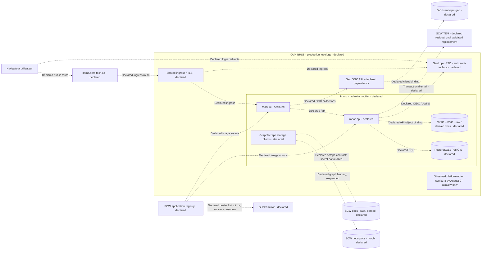
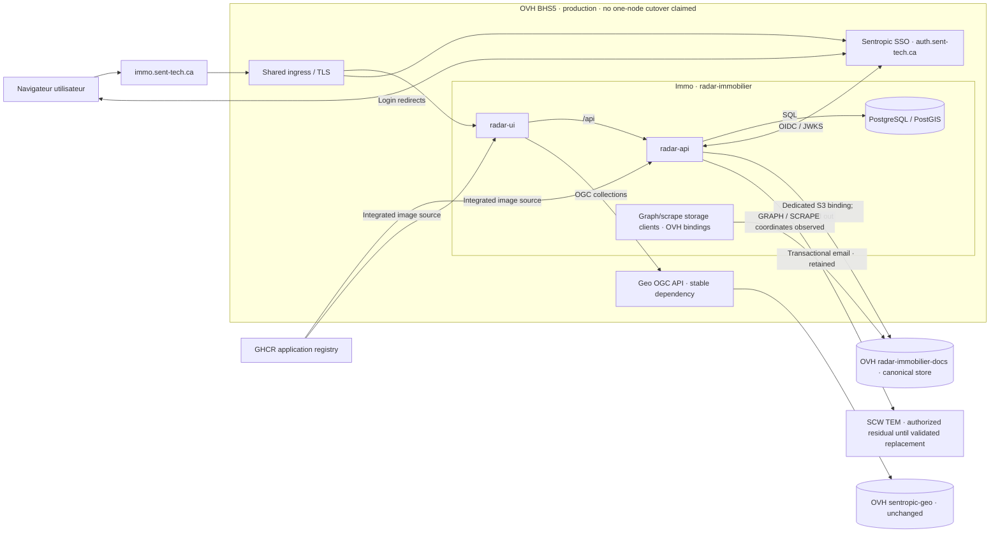
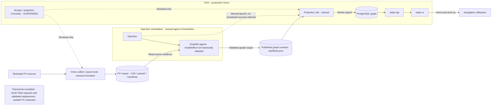
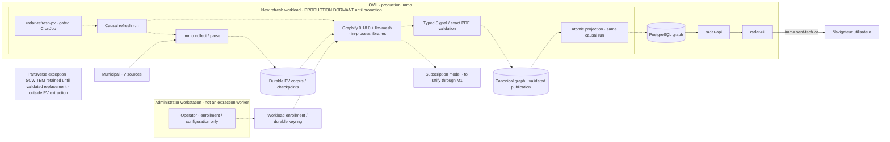

# Two dated architecture transitions for Immo Focus

Status: EVOL design reviewed by two independent adversarial legs; cycle v6 consensus `GO` releases bounded implementation only. No production promotion is accepted by this document.

## Intent and boundary

[FACT: OWNER] The owner requires four diagrams in two autonomous pairs: A, production storage/registry; B, production PV-to-Signal refresh. Each pair compares August 9 with September 13, 2026. The report period, cost method and amounts remain unchanged. The existing D8 mixes a September 13 preproduction snapshot with a future architecture; that is the defect being corrected [S1].

[JUDGMENT] Keep application boundaries and physical identity stable within each pair. Show only the dependencies that explain that pair's transition. Changing a label or drawing never constitutes rollout, successful extraction, complete parity or provider-resource deletion.

## D1 — Dates, evidence and honest state

- [FACT] The August documentary anchor is the latest first-parent main commit at or before `2026-08-09T23:59:59-04:00`, not the most recently dated side-branch commit. This Git selection rule reconstructs declarations available by that cutoff; it is not a runtime inventory or proof that every declared relation executed that day.
- [FACT] Immo documentary anchor: `26caa4d95fe09a6cccb665cd88942f1edfb853c8` (August 9, 21:56 Toronto); Geo: `49573c0f9356d97e64563d87fa6038678acb9902` (23:57). Commit author/committer timestamps establish repository ordering only, not operational observation time.
- [FACT] September documentary main anchors inspected for this design: Immo `4d5cb8f7f5e7934196b57e29305fec37813bf7a9`; Geo `5a262a9bd12b1e2196ee0a9bb8b46b5e6277616e`. Pin the full revision and blob path when rendering. Later side-branch artifacts remain branch-scoped evidence unless their exact revisions are independently cited; they are not silently promoted to main history.
- [FACT] T2 runtime receipt is on Immo `9d004b0fc9af3df970df22ed439eb46be5b80b06`, separate from documentary main, observed at September 13 `23:39:15Z` [S5].
- [UNKNOWN] poc-k8s local `origin/main` is stale at July 5. Use `0f382f12027953335455f46d041b23414fcf9a9c` as a dated platform report source, not a newly fetched main attestation; its August 1 report agrees with the August 9 cost report [S2].
- [JUDGMENT] Every node/edge has evidence class `observed`, `declared`, `historical`, `dormant` or `unknown`, plus repo, commit, path, line anchor and observation date where available. Historical prose cannot override later executable configuration or a later runtime receipt.

## D2 — Pair A: storage/registry only

[FACT] By August 9, the repository declared production compute on OVH BHS5 with two b3-8 nodes, an in-cluster Immo MinIO API binding, SCW graph/scrape coordinates, suspended refresh CronJobs and an SCW application registry. GHCR mirroring was also declared as best effort. These pinned manifests establish configuration, not an August 9 runtime inventory, secret resolution, traffic, successful mirror or completed refresh [S2,S3]. Geo's serving bucket was declared on OVH as a stable external data dependency in this pair [S4].

[FACT] By the September 13 T2 receipt, production API rollout, OVH GRAPH/SCRAPE bindings and MinIO absence are observed. Final parity acceptance is reopened for destination attributes and final source rescan [S5]. GHCR application-image integration is in main; Geo has a separate stronger runtime/provider-retirement receipt [S6].

[JUDGMENT] A-after shows migrated application storage clients, not a certification that every retained source bucket, historical object, suspended template or provider resource has been deleted. Its caption must state the final T2 sweep/parity gap. SCW TEM is an explicitly retained email exception visible in all four diagrams until a replacement is validated: show its API email relation in pair A and a transverse annotation, outside the extraction path, in pair B. Its presence must never be styled as eradicated. The single-node cost projection does not change observed cluster capacity [S5,S7].

## D3 — Pair B: refresh causality and production gate

[FACT] The August manifest separates deterministic scrape/projection from manually orchestrated Graphify and suspends both CronJobs. Do not relabel declared 03:17/04:30 schedules as successful unattended production [S8]. The September 11 workstation CAS campaign is not the August baseline [S11].

[FACT] Graphify 0.18.0 is integrated and preproduction accepted a grounded Waterloo Signal/PDF, exact-image replay and a controller-created CronJob run. Production remains dormant pending independent promotion [S9]. The earlier HTML-input failure is superseded as preproduction status, retained only as history.

[JUDGMENT] B-after draws the new causal path inside a visibly dormant production refresh boundary. A separate annotation states the preproduction acceptance and exact receipt. The administrator workstation only enrolls/configures credentials; it is not part of scheduled extraction. The model label is `To ratify through M1`; Luna high appears only as an observed acceptance trial, never the selected benchmark winner. Pair B names the corpus and publication graph by durable function, not by object-storage provider. Pair A alone carries the dated SCW-to-OVH storage transition; changing provider must not change the refresh contract or logical node identity.

## D4 — Four canonical diagrams, two rendering forms

[JUDGMENT] Scene IDs are `storage-before-20260809`, `storage-after-20260913`, `refresh-before-20260809`, `refresh-after-20260913`. These are the four primary graph identities, not four aggregate architecture views. Each pair is independently understandable and has before/after dates, evidence legend and scope caption.

- Preserve physical node IDs within a pair; qualify scene membership separately. Label storage consolidation explicitly instead of cloning one physical bucket under multiple role names.
- Author exactly four canonical Mermaid graphs and derive four complete nested SvelteFlow scenes. Preserve `parentId`, containment, edges, service icons and `repo:` labels in both forms; no miniature placeholder substitutes for a complete graph.
- Visible Mermaid labels, rendered SVG and native SvelteFlow use the same source and facts. Dormant/declared edges require labels or dashed styles, not color alone. No preproduction resource node enters a production container.
- Render pair A together, then pair B, in Focus and the dated report. PDF includes all four complete diagrams at readable size; optional detail pages supplement, never replace, a complete view. Do not continue to call a two-graph screenshot the full architecture export.
- Each artifact records source revisions and content hashes. HTML/PDF share the graph inventory and captions; none may silently reload a later source under an old report date.
- Existing service icons and repository attribution are reused. Platform owns cluster/ingress/TLS; Immo owns API/UI/refresh; Geo owns its API/data contract. A library such as Graphify or llm-mesh is not a new network service.
- `docs/architecture.md` is the authoritative Mermaid source for these four scene IDs; `docs/architecture/focus/scene-metadata.js` is the authoritative exhaustive provenance/state map keyed by scene plus case-sensitive Mermaid node/group or deterministic edge ID. No default/fallback entry is legal. Each node/group has non-null `kind`, `repo`, `evidenceClass` and `runtimeState`; each edge has non-null `evidenceClass` and `runtimeState`. Closed evidence classes are `observed|declared|historical|dormant|unknown|external`; runtime states are `active|suspended|dormant|manual|retained|unknown|not-applicable`. Provider/repo values are explicit sorted identifiers or `external`, never inferred from label text.
- Canonical labels convert CRLF to LF, replace only case-insensitive `<br>`, `<br/>` or `<br />` with LF, trim each line, collapse internal ASCII whitespace to one space and normalize NFC; HTML entities are forbidden in canonical Mermaid labels. Clusters join the node array with `kind:"cluster"` and their real `parentId`; roots use `null`. Node IDs are verbatim case-sensitive Mermaid IDs. Edge IDs are `source + "__" + target + "__" + sha256(normalizedLabel).slice(0,12)`; duplicate endpoint+label edges fail instead of receiving order-dependent IDs. Mermaid parsing rejects unknown statements, duplicate IDs, missing metadata and extra metadata.
- For each scene, serialize compact UTF-8/NFC JSON with LF and keys in fixed order `sceneId,pair,date,nodes,edges`; sort nodes by `id` and include `id,kind,label,evidenceClass,runtimeState,parentId,repo`; sort edges by `id` and include `id,source,target,label,dashed,both,evidenceClass,runtimeState`. Hash with SHA-256. Focus reconstructs this projection independently from parsed Mermaid plus the exhaustive metadata map, then browser checks reconstruct it again from native DOM attributes/content. The report manifest embeds the same full projection/hash and each captured page prints its scene ID/hash. Missing, extra, reordered or divergent topology/state/provenance fails; copied hashes alone cannot pass. Every transition update changes reference, Focus inventory and report manifest atomically.
- The current report window is exactly August 10 through September 13, 2026 inclusive in America/Toronto: `[2026-08-10T00:00:00-04:00, 2026-09-14T00:00:00-04:00)`, 35 days / 840 hours. Architecture corrections do not move this boundary or silently recalculate the protected cost method and amounts.
- Attach the preceding report `docs/spec/reports/study-2026-08/report.pdf`, SHA-256 `86ae37810016bca61cc897105121cfcbcd1951426fc889616ae1efe37ae29528`. Its historical source revision is `72b966664523801ea00cfcb704e0285ee765c136`, which is not treated as main ancestry and must not be cherry-picked. The HTML links that exact file. The final PDF first contains the current report and four graph pages, then the predecessor's nine pages as a visual appendix, and also embeds the original bytes as attachment `study-2026-08-report.pdf`. Page merging may renumber/recompress objects and is not the byte proof: extract the embedded attachment with `pdfdetach`, hash the extracted bytes and require exact equality with the source SHA-256.

### D4.1 — Owner amendment: compact cards and readable type

[FACT: OWNER] Service cards must be about half as tall as D8, visibly denser, with reduced padding and no large empty zones. Typography must be visibly about twice D8's size and readable at normal browser zoom. The exact French user-node label is `Navigateur utilisateur`; do not uppercase it or render the old `UTILISATEUR / Navigateur` string. Apply this label to all four diagrams and both rendering forms, including PDF [S12].

[FACT: S12] D8 sets ordinary nodes to 350 × 260 CSS px, card padding 16 px and grid gap 10 px. Service titles are 16 px, descriptions and repo labels 12 px, secondary metadata 11 px; subflow titles are 18 px and edge labels 12 px. These source values are the frozen comparison baseline, not measured transformed screen sizes.

| Surface | New design requirement at normal browser zoom |
| --- | --- |
| Ordinary service card | Target 130 CSS px high; 120–156 px accepted (46–60% of D8's 260 px); content must not be cropped to meet the target |
| Card padding / gaps | Padding 6–8 px; row/column gaps 4–6 px; remove the stretching `1fr` description row and empty spacer/footer rows |
| Service title / node description | At least 32 px / 24 px rendered on screen; short primary labels, full meaning retained |
| Repo label / necessary status or secondary text | At least 24 px / 22 px rendered on screen; `repo:` and observed/declared/dormant qualification remain visible |
| Subflow heading / edge label | At least 36 px / 24 px rendered on screen; headers content-sized, without D8's fixed 110 px reservation |
| Card usable space | Unused trailing vertical space ≤ 12 px; no blank interior row > 12 px; content-sized containers with ≤ 24 px bottom/right slack after children and required routing lanes |

[JUDGMENT] Reconcile larger type with lower cards by using a compact icon/title row, a short role/status line and a compact repo line. Deduplicate repeated service names and metadata; put long evidence prose and full source details in the existing inspector. Do not hide the provider, repo ownership, essential runtime state, TEM exception or source identity needed to understand the graph. Permit wider cards and ordinary scrolling/panning of a complete scene at readable scale; do not shrink fonts or use fit-to-view scaling below these screen minima merely to fit the whole topology into a small viewport. All four complete graphs must still exist; opening an inspector must not be necessary to read their essential meaning.

[JUDGMENT] Typography thresholds apply after SVG/SvelteFlow transforms, not just `getComputedStyle(...).fontSize`. PDF export must preserve at least 18 pt titles, 14 pt descriptions/edges and 12 pt repo/status text in the complete diagram; select a suitable page size/orientation instead of shrinking below these minima. Supplemental detail pages do not waive readable complete views.

## D5 — Implementation acceptance after design reviews

[JUDGMENT] Release implementation only after two reviews reconcile history/state correctness and presentation/decision integrity. The later scoped plan must cover Mermaid sources, Focus scene selection/rendering, source/provenance mapping, M1 controls, report export and meaningful regressions. It must use existing Make targets and actual browser/clipboard checks; no test is run or reported as passed in this design step.

- Assert four primary scenes, two pairs, correct dates and no preproduction resource in either production graph.
- Assert the August SCW/MinIO versus September OVH/GHCR application bindings, residual uncertainty, unchanged stable dependency IDs and no claimed one-node runtime.
- Assert B-after production dormancy, preproduction acceptance as an annotation and no model choice before M1 ratification.
- Inspect every full Mermaid/SvelteFlow render and every PDF graph page for missing nodes, clipping, unreadable labels, lost nested containment or contradictory status.
- Compare protected billing content and period against the input report: exact values/method/window unchanged. Textual corrections elsewhere must not regenerate or reinterpret billing.
- Assert the exact inclusive report label `10 août → 13 septembre 2026`, the timestamp interval, 35 days and 840 hours in HTML, PDF text and the evidence manifest.
- Assert the preceding PDF path/SHA-256, nine source pages, a working HTML download and embedded attachment name. Extract it with `pdfdetach`, compare exact SHA-256, and record current-report end, four graph-page numbers, predecessor start/end and attachment hash in `previousReport`. Separately render source pages 1–9 and the recorded final-PDF appendix range with Poppler 26.01.0 `pdftoppm -png -r 144 -cropbox -singlefile`; require equal page counts and exact ordered PNG SHA-256 equality. Record renderer/version/flags, both per-page hash arrays and the one-to-one page map. Verify the four complete graph pages before the predecessor range. Reject mention-only, attachment-only, page-count-only or visually substituted appendices.
- Assert `docs/architecture.md`, Focus and PDF manifest expose the same ordered four scene IDs, canonical projections and SHA-256 values. Reconstruct the native DOM projection, verify every `parentId` and exact edge, bind each PDF capture/page to its scene hash, and reject a missing/reordered/topology-divergent scene. A transition change is incomplete until all three committed surfaces move together.
- Reject a report presented as completed T2, a three-model winner or active production refresh without the corresponding new dated acceptance evidence.
- Assert each of the four Mermaid and SvelteFlow scenes contains a visible SCW TEM residual-exception node/annotation stating retention until a validated replacement. Pair B must not connect TEM into the PV extraction chain; pair A labels the email relation. Preserve the exception in every complete PDF view.
- Assert exactly `Navigateur utilisateur` on the user node in all four scenes and both forms; reject the former label and automatic uppercase presentation.
- Run later Chromium visual checks at 1440 × 1000 and 1920 × 1080, deviceScaleFactor 1, browser zoom 100%, with no manual zoom adjustment. Capture each initial readable scene, full-scene view, metadata and report export at the same implementation HEAD.
- Measure ordinary-card height/padding/gaps, content/child bounding boxes and effective transformed text sizes; assert every D4.1 minimum and the card-height band, report medians plus worst cases, and compare against the frozen D8 source baseline. An invisible/clipped label does not satisfy a font-size assertion.
- Check text overflow, clipping, overlap, blank stretched rows and excess trailing container space, including wrapped TEM text and the dormant production banner. Any necessary routing clearance beyond the slack bound must be measured and justified by an actual edge, not an empty filler panel.
- Inspect screenshots for visibly larger type, denser cards and legible repo/status/edge labels without zoom; retain the corresponding Chromium metrics. PDF checks must include text size and all four complete-page screenshots, not merely count exported pages. These are future implementation gates, not tests performed by this spec amendment.
- Give every native ordinary card `data-node-kind="ordinary"`, every text element `data-text-role`, every node `data-id`/`data-parent-id`/`data-evidence-class`/`data-runtime-state`, and every edge its canonical ID/endpoints/state. For each of the four scenes and both fixed viewports, record every card's transformed rectangle, padding/gaps, content bounds and trailing slack; every required SvelteFlow text role's computed size, transform scale, effective pixels and glyph/content bounds; every Mermaid node/cluster/edge label's SVG bounding box; and every native/Mermaid edge path's transformed bounding rectangle, computed stroke visibility, total length and sampled points at no more than 8 CSS px intervals. Zero-length, hidden, missing or clipped edge geometry fails unless the canonical metadata names an explicit tested exception (none exist initially). Aggregate only after every inventory entry passes, then report median and worst case.
- The complete-scene bounds are the union of every node, cluster, edge-label and sampled edge-path geometry box at native graph transform `scale(1)`. Initial and export checks use browser zoom 100%, deviceScaleFactor 1 and no fit-to-view below scale 1. Panning/scrolling is allowed in Focus; the full-scene capture expands the canvas at the same scale rather than shrinking it. Require every sampled edge point and all inventory boxes—including TEM and the dormant banner—to intersect and remain inside that full capture without clipping. PDF pages bind the same edge inventory, scene hash and capture hash; measurements apply recorded print scale and fail any effective-size minimum. Each scene retains its full screenshot, smallest text, worst card, edge inventory and capture hash; supplemental pages cannot repair a failed complete view.

## Graph contracts — design sketches, not deployment manifests

These four Mermaid sketches specify topology and state. Implementation adds the common service icons, `repo:` labels and source metadata to every node/container through the existing renderer; those decorations must not alter evidence classes. Solid edges express the documented dependency, not success of every request; dashed edges explicitly qualify mirroring, declared scheduling or dormant execution.

### A-before — production storage and registry, August 9



[FACT/JUDGMENT: S2,S3,S4] A-before is a documentary configuration reconstruction. Dashed storage/image/email edges mean `declared`, not failed or observed traffic. The two-node OVH platform statement and suspended CronJob declarations are preserved separately from unverified secret resolution, image pulls, application storage use and refresh execution.

### A-after — production storage and registry, September 13



[FACT/JUDGMENT: S5,S6] A-after removes MinIO because absence is observed, consolidates object roles into the canonical OVH bucket and removes SCW from these storage/image binding paths. Caption: `Runtime cutover observed 23:39Z; final object-attribute/source-freshness parity and global legacy dependency sweep remain open. Retained source/recovery resources are not represented as live application stores. SCW TEM remains the explicitly authorized email exception until a validated replacement.` Distinguish GHCR integration evidence from a fresh Immo production imageID read, which this receipt does not supply. Geo's historical SCW archive does not become an OGC dependency.

### B-before — production PV-to-Signal refresh, August 9



[UNKNOWN: S8] Collection execution placement and exact secret-resolved scrape endpoint are not reconstructed from the mere presence of a Job template. Keep collect/parse outside the cluster containment until dated runtime evidence locates it. The manually controlled pipeline is evidenced as an operating method, not a receipt for a complete August 9 run. Its corpus is separate from the canonical graph store. The functional labels deliberately omit the backing provider; pair A carries that physical placement.

### B-after — production refresh implementation, September 13; activation dormant



[FACT/JUDGMENT: S9] Mandatory separate annotation: `Preproduction accepted: real Luna high Waterloo Signal/PDF, immutable release replay, controller-created Job at 22:21Z. Production promotion remains pending; dashed refresh paths describe the integrated dormant implementation.` The annotation is not a preprod resource subgraph. Existing API/UI/DB serving is distinct from the dormant new writer. A successful replay without additional model calls proves idempotence, not a new benchmark result. Administrator enrollment is not a per-cycle extraction dependency. Corpus and graph labels remain provider-neutral in this pair; their September physical storage is explained only by pair A and its evidence state.

## D6 — M1: benchmark-backed extraction-model decision

[FACT: OWNER] M1 is a separate decision below the two architecture pairs. The owner requests three options: comparable effective Sonnet, Luna low and Gemini 3.8 at its lowest supported effort. No model is selected by this design. The existing Luna high acceptance run is evidence of that trial, not evidence for Luna low or a three-model ranking [S9,S11].

### M1.1 Decision asked

Which of `sonnet-comparable`, `luna-low`, or `gemini38-lowest` should be ratified for production PV extraction after the matched M1 benchmark and independent judging? Scope: the extraction model and its exact qualified runtime configuration, not production promotion, storage retirement or invoicing.

### M1.2 Context and unknowns

[FACT] Existing historical CLI/CAS campaigns and the September 13 Sol-medium v3 diagnostic use different configurations and have disclosed quality/protocol limitations [S11]. A later side-branch v4 report records five Luna-low responses, no comparable Sonnet call and no full Gemini output; it is bounded evidence from exact revision `ece2beb551e24cd6694434ea2f6464c8493aae5d`, not part of the August baseline or of inspected documentary main [S13]. [UNKNOWN] A complete three-candidate matched bundle, fully qualified judge panel and winner are not available. Keep each missing cell visibly `not measured`, `not classifiable` or `not qualified`, never zero or green. Model aliases are display labels until enrollment/preflight records the exact effective provider/model/effort.

### M1.3 Stakes

[JUDGMENT] Extraction quality changes user-visible regulatory findings and evidence. Subscription compatibility, latency, quotas and repeatability matter alongside semantic coverage; ease of reusing the already observed Luna trial is an agent convenience, not proof of owner value. The production write/promotion gate remains independent of M1 ratification.

### M1.4 Options

| ID | Requested option | Strongest case for evaluation | Strongest limitation | Cost / reversibility | What would make it win |
| --- | --- | --- | --- | --- | --- |
| `sonnet-comparable` | Sonnet, exact effective identity/effort recorded; same frozen Graphify request, source bytes, prompt, schema, retry policy and 16,384-token cap | Tests Sonnet on the common contract rather than treating the legacy pipeline as its proxy | Historical outputs are context only; comparable execution remains pending on the cited branch | Usage unmeasured; configuration reversible, published findings require audit | Best qualified quality/latency/usage tradeoff on the same oracle |
| `luna-low` | Luna, explicit native low effort | Tests whether a lower-effort configuration meets the extraction contract | The successful high-effort trial is not a low-effort result | Usage unmeasured; same rollback boundary | Best qualified quality/latency/usage tradeoff on the same oracle |
| `gemini38-lowest` | Gemini 3.8, lowest natively supported effort | Tests a separate provider/configuration against the same requirements | Enrollment and faithful effective effort must be attested first | Usage unmeasured; same rollback boundary | Best qualified quality/latency/usage tradeoff on the same oracle |

Unsupported low effort or missing model enrollment yields `not qualified`; never silently substitute another effort, provider or model. Keep all three rows visible even when one cannot run. No invented preflight call, zero-call proof or API-paid fallback counts as a completed candidate. Sonnet is a first-class comparable candidate only through the same frozen end-to-end contract: its historical outputs may be shown in a separately labelled context column but cannot fill the comparable row.

Candidate credentials are runtime inputs, never benchmark artifacts. Any Sonnet credential must remain in an owner-controlled store outside this repository, be mounted read-only only for the isolated call, and be absent from command arguments, stdout/stderr, receipts, diffs, commits and the PDF. Artifacts retain only a one-way account pseudonym and sanitized requested/effective identity. A credential-bearing log or committed file invalidates the run and requires revocation handling outside this document.

### M1.5 Recommendation and anti-bias requirements

[JUDGMENT] Recommendation is `defer model ratification` until comparable evidence exists. Strongest counterargument: waiting delays an already workable trial path; this does not establish that trial's superiority. The recommendation is overturned by a qualified frozen benchmark with complete independent judgment and owner ratification, not by one successful extraction. Pre-mortem: six months later the choice failed because differences in prompt, effort, source selection or transport limits were hidden behind model labels. Disclose presenter convenience separately from owner interests: reliable findings, understandable evidence, accountable usage and an auditable reversible choice.

### M1.6 Reversibility and cost

[JUDGMENT] Changing the configured model is reversible; provider usage already consumed is not recoverable, and changing future configuration does not retract previously published findings. Freeze inputs/oracle/prompt/schema/tool versions, effective budgets and retry policy before matched calls. Record wall time, per-attempt failures and attributable usage; a shared-account quota delta is not per-model cost. A request that returns no candidate output is transport/execution evidence only: it has no quality, latency-to-valid-output or semantic score, cannot enter a ranking denominator and cannot be described as a candidate result. This design authorizes no calls, tariff changes or report-cost recalculation.

### M1.7 Required results, judges and owner criteria

| Required panel content | Evidence / acceptance rule | Initial state |
| --- | --- | --- |
| Three candidate rows | Same public PDFs/oracle, source hashes, prompt/schema/runtime freeze; exact effective route/effort and actual wire budgets | Incomplete: Luna-low responses exist on a side branch; comparable Sonnet and classifiable Gemini output remain pending |
| Outcome and quality | Attempt state, typed findings, source/page/excerpt grounding, stage/outcome accuracy, unsupported claims and coverage; preserve refusals and agenda modality | Not measured |
| Runtime/usage | Successful and failed attempts, latency, replay behavior, attributable tokens/usage; unavailable values remain null; no-output attempts stay outside candidate-result aggregates | Partial, branch-scoped; no cross-candidate comparison |
| Independent judges | Two separately frozen qualified judge identities/efforts; blinded candidate identities; own verdict/evidence before reconciliation | Pending; no verdict invented |
| Disagreements | Both original judge assessments plus reconciliation; no silent averaging of regulatory or evidence disagreements | Pending |
| Owner choice | Named option or explicit deferral plus optional comment; no default selection or silent adoption from a trial | Unratified |

The intended independent judge roles are Sol xhigh and Fable 5 xhigh, subject to faithful qualification before judging; inability to obtain either stays visible and does not silently change the judging panel [S11]. Existing unrelated design reviews are not benchmark judge verdicts. Show historical diagnostics separately from M1, with their incompatible contracts and dates.

### M1.8 Comment and JSON capture

Present the question, context, option table, measured results and judge findings before choice controls. While evidence or the two design reviews are incomplete, mark the dossier `Incomplete` and permit commentary/explicit deferral without advertising a justified model winner. The UI captures a user-selected option or deferral and free text; it exports the same structured record through the existing comment/JSON clipboard pattern. It does not deploy, send a message, mutate Track or claim signed comprehension. Conductor recording is a separate authorized step.

The finite attempt state machine is:

| `attemptState` | Only legal `classification` | Output / metrics / rank |
| --- | --- | --- |
| `not-launched` | `not-measured` | output, quality, latency-to-valid-output and rank are null/false |
| `transport-failed` | `not-classifiable` | output, quality, latency-to-valid-output and rank are null/false |
| `no-output` | `not-classifiable` | output, quality, latency-to-valid-output and rank are null/false |
| `completed-invalid` | `output-invalid` | output and validator evidence required; quality ranking remains false |
| `completed-valid` | `classifiable` | output and validator evidence required; rank is still false until identity/freeze/judges qualify it |

The exact option set is `sonnet-comparable,luna-low,gemini38-lowest`. `candidateAttempts` is the canonical three-row benchmark summary: it contains exactly one stable `attemptId` for each option, no duplicate/extra option and no transport retry as a candidate row. Each launched row points to a content-hashed `transportLedgerRef` whose immutable ledger retains every case call and retry with option ID, case ID, retry index, state and receipt; a retry stays under the same canonical option row and cannot create or replace a candidate silently. The row's terminal state is derived from that ledger under the frozen retry policy. A not-launched row has a null ledger reference.

The implementation publishes and validates `docs/architecture/focus/m1-decision.schema.json` as JSON Schema 2020-12. A candidate attempt owns `requestedIdentity`, nullable `effectiveIdentity`, `sourceFreezeHash`, `inputRef`, `transportLedgerRef`, `attemptState`, `classification`, nullable `outputRef`, nullable `validationRef`, nullable `usage`, nullable `missingReason`, nullable quality/latency-to-valid-output fields and `rankEligible`. A result owns only `attemptId`, `optionId`, the same `outputRef`/`validationRef`, quality metrics, `judgeRefs` and rank status; identity/freeze/usage are resolved from its attempt.

The mapping is bijective over output-bearing candidate attempts: the set of `attemptId` values whose state is `completed-invalid` or `completed-valid` equals the set of result `attemptId` values. Each such attempt has exactly one result; each result refers to exactly one distinct output-bearing attempt; no two results share an attempt ID or output reference; and result option/output/validation values equal their attempt. `rankEligible:true` requires `completed-valid` + `classifiable`, non-null qualified requested/effective provider/model/effort, source-freeze hash, input/output/validation/transport-ledger references and two qualified independent judge references. Ratification additionally requires the set of rank-eligible result option IDs to equal the exact three-option set. Non-classifiable attempts require null output, quality, latency-to-valid-output and `rankEligible:false` regardless of transport latency. Invalid fixtures cover Gemini no-output promoted to results, detached results, missing results for output-bearing attempts, duplicate result attempt/output references, mismatched option/output/validation, duplicate/omitted/extra candidate options, three results from one option, a retry promoted to a candidate row, duplicate attempt IDs, illegal state/classification pairs and no-output with metrics or rank eligibility.

Illustrative pending payload (a copiable schema example, not a recorded decision):

```json
{
  "schemaVersion": 2,
  "decisionId": "M1",
  "status": "awaiting-benchmark",
  "selectedOption": null,
  "comment": "",
  "options": ["sonnet-comparable", "luna-low", "gemini38-lowest"],
  "benchmarkRef": null,
  "sourceFreezeHash": null,
  "candidateAttempts": [
    {
      "attemptId": "sonnet-comparable-pending",
      "optionId": "sonnet-comparable",
      "requestedIdentity": { "provider": "anthropic", "model": "claude-sonnet-4-6", "effort": "effective-to-attest" },
      "effectiveIdentity": null,
      "sourceFreezeHash": null,
      "inputRef": null,
      "transportLedgerRef": null,
      "attemptState": "not-launched",
      "classification": "not-measured",
      "outputRef": null,
      "validationRef": null,
      "usage": null,
      "missingReason": "supported comparable runtime pending",
      "qualityMetrics": null,
      "latencyToValidOutputMs": null,
      "rankEligible": false,
      "evidenceRef": "S13"
    },
    {
      "attemptId": "gemini38-side-branch-no-output",
      "optionId": "gemini38-lowest",
      "requestedIdentity": { "provider": "google", "model": "gemini-3.8-flash", "effort": "LOW" },
      "effectiveIdentity": null,
      "sourceFreezeHash": null,
      "inputRef": "S13#frozen-five-document-input",
      "transportLedgerRef": "S13#gemini-transport-ledger",
      "attemptState": "no-output",
      "classification": "not-classifiable",
      "outputRef": null,
      "validationRef": null,
      "usage": null,
      "missingReason": "official gateway execution pending",
      "qualityMetrics": null,
      "latencyToValidOutputMs": null,
      "rankEligible": false,
      "evidenceRef": "S13"
    },
    {
      "attemptId": "luna-low-side-branch",
      "optionId": "luna-low",
      "requestedIdentity": { "provider": "codex-subscription", "model": "gpt-5.6-luna", "effort": "low" },
      "effectiveIdentity": { "provider": "codex-subscription", "model": "gpt-5.6-luna", "effort": "low" },
      "sourceFreezeHash": null,
      "inputRef": "S13#frozen-five-document-input",
      "transportLedgerRef": "S13#luna-low-transport-ledger",
      "attemptState": "completed-invalid",
      "classification": "output-invalid",
      "outputRef": "S13#luna-low-outputs",
      "validationRef": "S13#five-validator-failures",
      "usage": "S13#luna-low-usage",
      "missingReason": "branch-scoped output failed the current validator",
      "qualityMetrics": null,
      "latencyToValidOutputMs": null,
      "rankEligible": false,
      "evidenceRef": "S13"
    }
  ],
  "candidateResults": [
    {
      "attemptId": "luna-low-side-branch",
      "optionId": "luna-low",
      "outputRef": "S13#luna-low-outputs",
      "validationRef": "S13#five-validator-failures",
      "qualityMetrics": null,
      "judgeRefs": [],
      "rankEligible": false,
      "evidenceRef": "S13"
    }
  ],
  "judgeAssessments": [],
  "reconciliationRef": null,
  "recordedAt": null,
  "decisionActor": null
}
```

`candidateAttempts` retains every launched, blocked or failed execution without converting absence into quality. `candidateResults` references only output-bearing attempts; Gemini's cited no-output attempt therefore cannot appear there. Records retain requested/effective provider/model/effort, evidence scope, input/output references, usage and missing-data reasons where applicable. Judge entries retain exact identity/effort, frozen rubric, independent verdict references and candidate blinding. Validate all finite-state invariants and legal decision states (`awaiting-benchmark`, `deferred`, `ratified`). A ratified export requires three classifiable matched results, evidence references and an explicit owner choice. Free text is escaped safely in HTML/PDF and round-trips literal newlines in JSON. Never infer `decisionActor` from the relay agent or mark an exported browser choice as cryptographically signed.

## Source register and freshness handoff

Sources below are pinned commit/blob references. Line numbers are navigation hints within those exact blobs, not durable identifiers across revisions. References to runtime receipts are versioned operator observations, not fresh live checks performed for this design. A Git commit date alone does not establish runtime state, and a side-branch report is not main history. The implementation must preserve timestamps, reachability qualification and evidence class; a newer acceptance may update September state only with a new cited receipt and regenerated source hashes.

| Ref | Repository / revision / anchor | What it establishes and limits |
| --- | --- | --- |
| S1 | Immo `4d5cb8f7`, `docs/architecture.md:3`; `docs/reports/architecture-monthly/report-through-2026-09-13.md:27` | D8 before is September preprod and after mixes future transitions; protected report billing is later in the same report |
| S2 | Immo `26caa4d9`, `docs/reports/couts-2026-07-13_2026-08-09.md:40`; `.github/workflows/build-push-images.yml:44`; poc-k8s `0f382f12`, `docs/migrations/ovh-rapport-2026-07-26.md:146` | OVH migration already occurred; two nodes and namespace usage observed by August 9; platform report is historical, not freshly fetched main |
| S3 | Immo `26caa4d9`, `deploy/k8s/30-api.yaml:29`, `25-minio.yaml:30`, `34-refresh-cronjob.yaml:159`, `.github/workflows/build-push-images.yml:109,153,212` | API DB/MinIO declaration; SCW graph binding; SCW image source and non-fatal GHCR mirror; not successful mirror receipts |
| S4 | Geo `49573c0f`, `deploy/k8s/geo-api-deployment.yaml:36,45`; Immo `26caa4d9`, cost report `:60`; poc-k8s `a2ff303f`, `docs/migrations/scw-immo-geo-closure-2026-09-13.md:36` | Geo API SCW image declaration; OVH bucket already billed; later platform report dates S3 Geo cutover to July 29 |
| S5 | Immo `9d004b0f`, `docs/architecture/evidence/scw-final-sweep-prod-live-receipt-2026-09-13.json:3,33,41,53,67,72`; `docs/architecture/scw-final-sweep.md:12`; `plan/SCWF-BRANCH_chore-scw-final-sweep.md:112` | September 13 23:39Z API rollout, OVH graph/scrape, MinIO absence, TEM retained; final full parity and dependency sweep still open |
| S6 | Immo `4d5cb8f7`, `docs/architecture/storage-audit.md:15`; Geo `5a262a9b`, `docs/ops/scw-eradication/evidence/runtime-after-20260913.json:2`, `decommission-after-20260913.json:1` | Immo GHCR merged; Geo GHCR runtime at 15:47Z and provider retirement at 15:49Z; do not extrapolate Geo certification to Immo |
| S7 | poc-k8s `a2ff303f`, `docs/migrations/scw-immo-geo-closure-2026-09-13.md:80`; Immo `4d5cb8f7`, `docs/architecture/transitions.md:85` | Three-node platform observation and one-node capacity gate; not a one-node rollout |
| S8 | Immo `26caa4d9`, `api/src/scripts/worker-live.ts:4`, `deploy/k8s/34-refresh-cronjob.yaml:17,43,111`, `api/src/scripts/project-graph-from-s3.ts:2`, `radar/ontology/graphify-output-contract.md:1`, `docs/study/industrialisation-refresh-suivi.md:60` | Manual Graphify method, suspended schedules, repaired atomic projection, v2.3 ontology / 3.4 enrichment; no exact-day end-to-end receipt |
| S9 | Immo `4d5cb8f7`, `docs/reviews/refresh-018/acceptance.md:5,18,24,35,37` | Exact Graphify 0.18 release, Luna high trial, preprod scheduled replay and explicit production dormancy |
| S10 | Immo `26caa4d9`, `deploy/k8s/60-ingress.yaml:35`, `50-ui.yaml:56,76`, `80-auth.yaml:11`, `api/src/routes/graph-signals.ts:4`; Immo `4d5cb8f7`, `docs/architecture.md:47` | User URL, UI/API/Geo routes, OIDC and graph-node serving; later public URL/SSO observations |
| S11 | Immo `4d5cb8f7`, `docs/reviews/refresh-018/extraction-baseline-audit.md:9,82,90`; local benchmark `b98aa6cf`, `docs/reviews/refresh-benchmark/v3/report.md:3,12,66,73` | Historical campaigns are not August baseline or matched M1 ranking; Sol-medium diagnostic has fairness limits; judge plan is not completed judging |
| S12 | Immo `4d5cb8f7`, `docs/architecture/focus/style.css:43,47`, `ServiceNode.svelte:33`, `Subflow.svelte:17`, `scenes.js:18`; owner amendment after initial design handoff | Frozen D8 card/type/layout values; owner requires roughly half-height cards, twice-size visible type, exact French user label and visible TEM in every graph. These frontend filenames are relative to the same `docs/architecture/focus/` directory |
| S13 | Immo side branch `feat/t1-model-benchmark-real`, exact revision `ece2beb551e24cd6694434ea2f6464c8493aae5d`, `docs/reviews/refresh-benchmark/v4/protocol.md` and `report.md` | Branch-scoped v4 evidence: Luna-low produced five responses; comparable Sonnet made no call; Gemini direct-runner diagnostics produced no full output and do not qualify the operational gateway. This revision is not an ancestor of the architecture branch and is not represented as documentary main, a three-way result or an architecture transition receipt |
| S14 | Immo historical revision `72b966664523801ea00cfcb704e0285ee765c136`, `docs/spec/reports/study-2026-08/report.pdf`; identical current blob SHA-256 `86ae37810016bca61cc897105121cfcbcd1951426fc889616ae1efe37ae29528` | Preceding report to attach intact; the historical revision is a source locator, not claimed main ancestry and not a commit to replay into this branch |

[UNKNOWN] No fresh August 9 per-pod environment/image inventory, successful GHCR mirror inventory, exact-day manual extraction receipts or matched three-option M1 verdict exists among these inspected sources. [JUDGMENT] These gaps limit claims; they do not authorize replacing August with a later preproduction snapshot.
