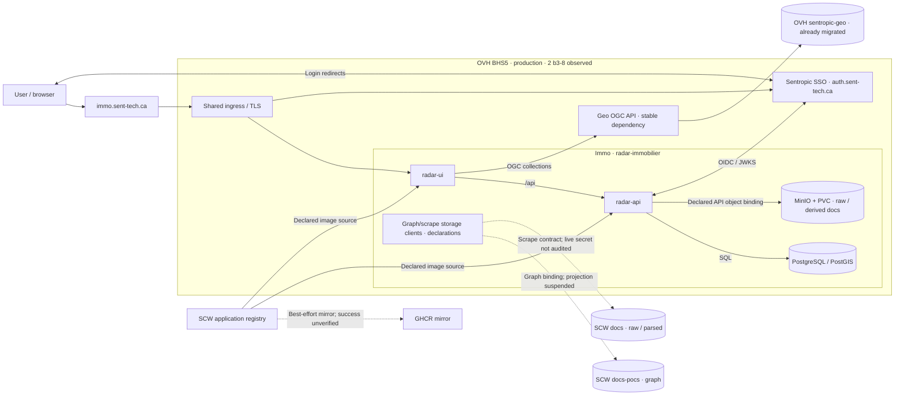
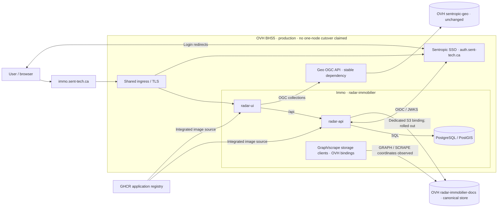
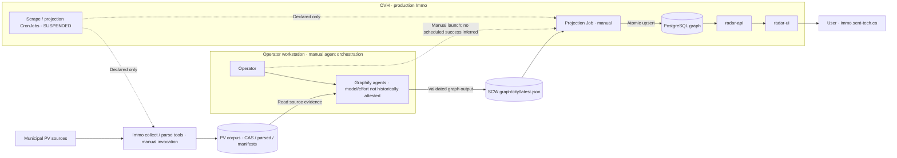
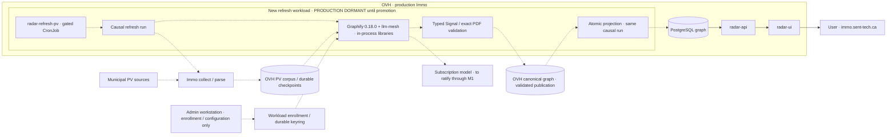

# Two dated architecture transitions for Immo Focus

Status: EVOL design, awaiting two independent adversarial reviews. No Focus implementation or production promotion is accepted by this document.

## Intent and boundary

[FACT: OWNER] The owner requires four diagrams in two autonomous pairs: A, production storage/registry; B, production PV-to-Signal refresh. Each pair compares August 9 with September 13, 2026. The report period, cost method and amounts remain unchanged. The existing D8 mixes a September 13 preproduction snapshot with a future architecture; that is the defect being corrected [S1].

[JUDGMENT] Keep application boundaries and physical identity stable within each pair. Show only the dependencies that explain that pair's transition. Changing a label or drawing never constitutes rollout, successful extraction, complete parity or provider-resource deletion.

## D1 — Dates, evidence and honest state

- [FACT] August baseline means latest first-parent main commit at or before `2026-08-09T23:59:59-04:00`, not the most recently dated side-branch commit.
- [FACT] Immo baseline: `26caa4d95fe09a6cccb665cd88942f1edfb853c8` (August 9, 21:56 Toronto); Geo: `49573c0f9356d97e64563d87fa6038678acb9902` (23:57).
- [FACT] Current documentary main: Immo `4d5cb8f7f5e7934196b57e29305fec37813bf7a9`; Geo `5a262a9bd12b1e2196ee0a9bb8b46b5e6277616e`. Pin sources rather than silently reading moving refs during rendering.
- [FACT] T2 runtime receipt is on Immo `9d004b0fc9af3df970df22ed439eb46be5b80b06`, separate from documentary main, observed at September 13 `23:39:15Z` [S5].
- [UNKNOWN] poc-k8s local `origin/main` is stale at July 5. Use `0f382f12027953335455f46d041b23414fcf9a9c` as a dated platform report source, not a newly fetched main attestation; its August 1 report agrees with the August 9 cost report [S2].
- [JUDGMENT] Every node/edge has evidence class `observed`, `declared`, `historical`, `dormant` or `unknown`, plus repo, commit, path, line anchor and observation date where available. Historical prose cannot override later executable configuration or a later runtime receipt.

## D2 — Pair A: storage/registry only

[FACT] By August 9, production compute was already OVH BHS5 with two b3-8 nodes; Immo used its in-cluster MinIO declaration, SCW graph/scrape coordinates and SCW application registry. GHCR mirroring existed but was best effort, not evidence that Immo pulled GHCR [S2,S3]. Geo's serving bucket was already OVH; it is a stable external data dependency in this pair [S4].

[FACT] By the September 13 T2 receipt, production API rollout, OVH GRAPH/SCRAPE bindings and MinIO absence are observed. Final parity acceptance is reopened for destination attributes and final source rescan [S5]. GHCR application-image integration is in main; Geo has a separate stronger runtime/provider-retirement receipt [S6].

[JUDGMENT] A-after shows migrated application storage clients, not a certification that every retained source bucket, historical object, suspended template or provider resource has been deleted. Its caption must state the final T2 sweep/parity gap. SCW TEM is an explicitly retained email exception explained in prose, outside these storage diagrams. The single-node cost projection does not change observed cluster capacity [S5,S7].

## D3 — Pair B: refresh causality and production gate

[FACT] The August manifest separates deterministic scrape/projection from manually orchestrated Graphify and suspends both CronJobs. Do not relabel declared 03:17/04:30 schedules as successful unattended production [S8]. The September 11 workstation CAS campaign is not the August baseline [S11].

[FACT] Graphify 0.18.0 is integrated and preproduction accepted a grounded Waterloo Signal/PDF, exact-image replay and a controller-created CronJob run. Production remains dormant pending independent promotion [S9]. The earlier HTML-input failure is superseded as preproduction status, retained only as history.

[JUDGMENT] B-after draws the new causal path inside a visibly dormant production refresh boundary. A separate annotation states the preproduction acceptance and exact receipt. The administrator workstation only enrolls/configures credentials; it is not part of scheduled extraction. The model label is `To ratify through M1`; Luna high appears only as an observed acceptance trial, never the selected benchmark winner.

## D4 — Four canonical diagrams, two rendering forms

[JUDGMENT] Scene IDs are `storage-before-20260809`, `storage-after-20260913`, `refresh-before-20260809`, `refresh-after-20260913`. These are the four primary graph identities, not four aggregate architecture views. Each pair is independently understandable and has before/after dates, evidence legend and scope caption.

- Preserve physical node IDs within a pair; qualify scene membership separately. Label storage consolidation explicitly instead of cloning one physical bucket under multiple role names.
- Author exactly four canonical Mermaid graphs and derive four complete nested SvelteFlow scenes. Preserve `parentId`, containment, edges, service icons and `repo:` labels in both forms; no miniature placeholder substitutes for a complete graph.
- Visible Mermaid labels, rendered SVG and native SvelteFlow use the same source and facts. Dormant/declared edges require labels or dashed styles, not color alone. No preproduction resource node enters a production container.
- Render pair A together, then pair B, in Focus and the dated report. PDF includes all four complete diagrams at readable size; optional detail pages supplement, never replace, a complete view. Do not continue to call a two-graph screenshot the full architecture export.
- Each artifact records source revisions and content hashes. HTML/PDF share the graph inventory and captions; none may silently reload a later source under an old report date.
- Existing service icons and repository attribution are reused. Platform owns cluster/ingress/TLS; Immo owns API/UI/refresh; Geo owns its API/data contract. A library such as Graphify or llm-mesh is not a new network service.

## D5 — Implementation acceptance after design reviews

[JUDGMENT] Release implementation only after two reviews reconcile history/state correctness and presentation/decision integrity. The later scoped plan must cover Mermaid sources, Focus scene selection/rendering, source/provenance mapping, M1 controls, report export and meaningful regressions. It must use existing Make targets and actual browser/clipboard checks; no test is run or reported as passed in this design step.

- Assert four primary scenes, two pairs, correct dates and no preproduction resource in either production graph.
- Assert the August SCW/MinIO versus September OVH/GHCR application bindings, residual uncertainty, unchanged stable dependency IDs and no claimed one-node runtime.
- Assert B-after production dormancy, preproduction acceptance as an annotation and no model choice before M1 ratification.
- Inspect every full Mermaid/SvelteFlow render and every PDF graph page for missing nodes, clipping, unreadable labels, lost nested containment or contradictory status.
- Compare protected billing content and period against the input report: exact values/method/window unchanged. Textual corrections elsewhere must not regenerate or reinterpret billing.
- Reject a report presented as completed T2, a three-model winner or active production refresh without the corresponding new dated acceptance evidence.

## Graph contracts — design sketches, not deployment manifests

These four Mermaid sketches specify topology and state. Implementation adds the common service icons, `repo:` labels and source metadata to every node/container through the existing renderer; those decorations must not alter evidence classes. Solid edges express the documented dependency, not success of every request; dashed edges explicitly qualify mirroring, declared scheduling or dormant execution.

### A-before — production storage and registry, August 9

### A-after — production storage and registry, September 13

[FACT/JUDGMENT: S5,S6] A-after removes MinIO because absence is observed, consolidates object roles into the canonical OVH bucket and removes SCW from these application binding paths. Caption: `Runtime cutover observed 23:39Z; final object-attribute/source-freshness parity and global legacy dependency sweep remain open. Retained source/recovery resources are not represented as live application stores.` Distinguish GHCR integration evidence from a fresh Immo production imageID read, which this receipt does not supply. TEM remains outside scope in text. Geo's historical SCW archive does not become an OGC dependency.

### B-before — production PV-to-Signal refresh, August 9

[UNKNOWN: S8] Collection execution placement and exact secret-resolved scrape endpoint are not reconstructed from the mere presence of a Job template. Keep collect/parse outside the cluster containment until dated runtime evidence locates it. The manually controlled pipeline is evidenced as an operating method, not a receipt for a complete August 9 run. Its corpus is separate from the canonical graph store.

### B-after — production refresh implementation, September 13; activation dormant

[FACT/JUDGMENT: S9] Mandatory separate annotation: `Preproduction accepted: real Luna high Waterloo Signal/PDF, immutable release replay, controller-created Job at 22:21Z. Production promotion remains pending; dashed refresh paths describe the integrated dormant implementation.` The annotation is not a preprod resource subgraph. Existing API/UI/DB serving is distinct from the dormant new writer. A successful replay without additional model calls proves idempotence, not a new benchmark result. Administrator enrollment is not a per-cycle extraction dependency.
