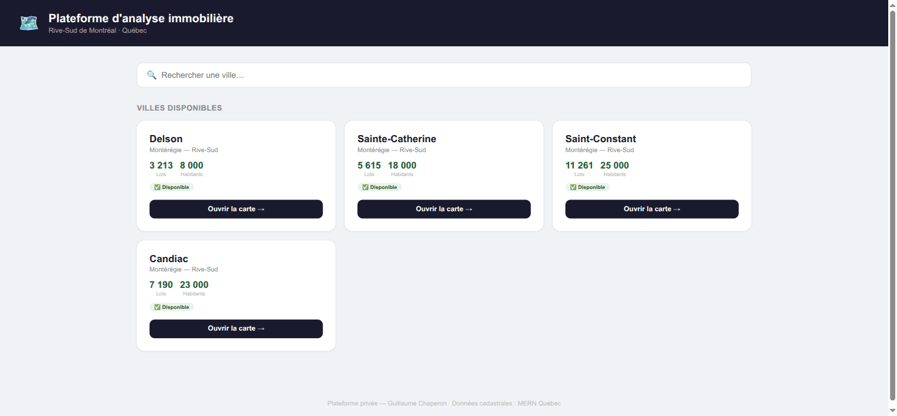
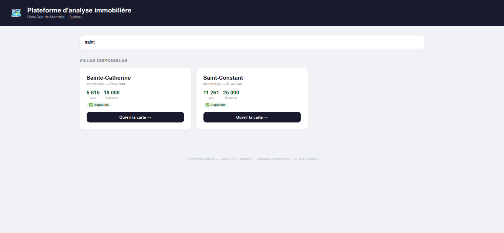

# 00 — Tableau de bord multi-villes (captures 00, 01)

[← retour à l'index](README.md)

---

## Capture 00 — Dashboard / index

**Ce que montre la vue Steve.** Page d'accueil sur fond clair. En-tête bleu nuit avec un logo carte
et le titre **« Plateforme d'analyse immobilière »**, sous-titre « Rive-Sud de Montréal · Québec ».
Une grande barre de **recherche** « Rechercher une ville… ». Sous le label « VILLES DISPONIBLES »,
une **grille de 4 cartes-villes** : **Delson** (3 213 lots · 8 000 habitants), **Sainte-Catherine**
(5 615 · 18 000), **Saint-Constant** (11 261 · 25 000), **Candiac** (7 190 · 23 000). Chaque carte
porte la région « Montérégie — Rive-Sud », un badge vert **« ✅ Disponible »** et un bouton bleu
nuit **« Ouvrir la carte → »**. Pied de page : « Plateforme privée — Guillaume Chaperon · Données
cadastrales : MERN Québec ».

**Feature(s) Steve.** **S-17** — Dashboard multi-villes avec statut de couverture des données par
ville (README §A : grille de cartes-villes, badge ✅ Disponible / ⏳ En préparation).

**Notre couverture.** **Vue Sources** (`SourcesMapView.svelte` + `CityDetailPanel.svelte`).
`SPEC_EVOL_INTEGRATION_CARTE_STEVE.md` §2 **S-17** est explicite : *« le dashboard de villes de
Steve **est notre vue Sources** »* — villes coloriées par **maturité de recueil**
(`CityMaturitySummary`, statut par source todo/identified/scraped/graphified), enrichie du statut
par couche attendue par Steve (lots / zonage / TOD). **Comment on le reproduit** : là où Steve a un
badge binaire « Disponible / En préparation » figé dans `cities.json`, le radar dérive le statut de
**`ScrapeStatusT{source, status, coveragePct}`** et **`CoverageCityEntry{hasZonage}`** — donc un
statut **data-driven par ville ET par couche**, pas un drapeau hardcodé. Le geste utilisateur
(choisir une ville → ouvrir sa carte) est le même.

**Écart / note.** 🟡 **partielle.** L'écran existe (vue Sources câblée sur `/api/scrape-status`),
mais la **parité visuelle** avec la grille de cartes-villes de Steve (lots/population, badge par
couche lots/zonage/TOD) est en aval : c'est le chapeau **CS-P2 / S-17** (`INTEGRATION` §9.1, P2).
Différence assumée et **meilleure** : le radar vise ~150 villes (pas 4), avec un statut **honnête**
par source au lieu d'un « Disponible » qui masque les couches manquantes (cf. Candiac, capture 50,
« Disponible » alors qu'il n'a ni zonage ni TOD).

---

## Capture 01 — Recherche de ville (filtre live)

**Ce que montre la vue Steve.** Même dashboard, mais l'utilisateur a tapé **« saint »** dans la
barre de recherche. La grille s'est **filtrée en direct** : il ne reste que **Sainte-Catherine** et
**Saint-Constant** (Delson et Candiac ont disparu). Filtre sur le nom (et la région).

**Feature(s) Steve.** **S-17** (recherche de ville dans le dashboard) — apparenté à **S-8**
(recherche, mais ici à la maille **ville**, pas lot).

**Notre couverture.** **Vue Sources** (sélecteur de municipalité). `INTEGRATION` §2 **S-17** : notre
sélecteur de municipalité joue ce rôle ; nos `sources` couvrent déjà ~150 villes, donc le besoin de
**filtrer la liste** est encore plus fort que chez Steve. **Comment on le reproduit** : recherche en
mémoire sur le nom/slug de ville servis par `/api/scrape-status` (réutilise la mécanique de la barre
de recherche lot S-8 décrite en `INTEGRATION` §2 S-8, mais sur l'index des villes).

**Écart / note.** 🟡 **partielle.** Le filtre live « par nom de ville » est un raffinement UI du
sélecteur de villes existant ; il s'inscrit dans le même lot CS-P2 que S-17. Rien de bloquant — pur
front sur des données déjà chargées.
