# 01 — Sainte-Catherine : carte principale, fiche, filtres, couches, pastilles, sélection, mobile (captures 10–28)

[← retour à l'index](README.md)

Sainte-Catherine est la ville où l'**usage réel** de l'équipe est massif : 5 favoris, **5 043 lots
« non retenus »**, 1 sollicité, **204 « à lettre »**, 1 pastille PPCMOI (rétrodoc README §« Données
d'usage réelles »). C'est pourquoi presque toutes ses captures sont **noyées de rouge** (= lots
écartés). Règlement de zonage affiché : **2009-Z-00**. 868 zones 4+, **0 TOD** (Sainte-Catherine
n'est pas couverte par un périmètre TOD dans le JSON), donc **0 priorité max**.

---

## Capture 10 — Vue globale

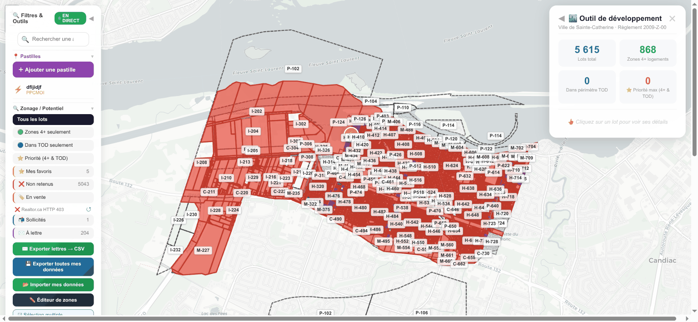

**Ce que montre la vue Steve.** Carte de toute la ville. Une **grande masse de lots rouges**
(« non retenu » — la donnée d'équipe réelle) au centre, sur fond de plan clair (CARTO light), avec
les contours de lots cadastraux. À **gauche**, le panneau **« 🔍 Filtres & Outils »** (sections
collapsibles : Recherche, Pastilles, Zonage/Potentiel avec une liste de filtres exclusifs, boutons
Exporter/Importer, Éditeur de zones). À **droite**, le **panneau de stats « Outil de
développement »** : **5 615** Lots total, **868** Zones 4+ logements, **0** Dans périmètre TOD,
**0** ⭐ Priorité max — avec une croix (✕) de fermeture et un lien retour dashboard.

**Feature(s) Steve.** **S-1** (carte lots colorée), **S-1b** (panneau stats ville + légende),
**S-3** (les rouges = marque d'équipe « non retenu »).

**Notre couverture.** **Vue Opportunités** (couche lots) + son **panneau latéral**.
- **S-1** (`INTEGRATION` §2 S-1) : la palette de Steve (rouge non-retenu, vert 4+, etc.) devient une
  **couche lots coloriée par le *score de potentiel par lot*** (dérivé `ZoneVersion.densiteLogHa` /
  usages ∩ TOD ∩ pré-filtres physiques) + la **couleur de statut de marque** par-dessus. La couleur
  des lots écartés vient du **statut `ProspectMark`**, pas d'un flag importé.
- **S-1b** (`INTEGRATION` §2 S-1b) : reproduire le panneau droit avec 4 compteurs (Lots / 4+ / TOD /
  priorité) comme **agrégats data-driven recalculés** (`count(lots)`, `count(score ≥ seuil)`,
  `count(∩ TOD)`, `count(priorité)`), fermable, + légende. En maquette (CS-L6) ces compteurs servent
  de **contrôle de calibration** face aux totaux de Steve.

**Écart / note.** 🟡 **partielle.** L'écran et le contrat de données existent ; il manque (a) la
**couche MapLibre data-driven** (CS-L1, prérequis « carto tranchée » §8 — le SVG actuel plafonne à
200 lots) et (b) le **substrat de données** (CS-L6, maquette JSON Netlife `simulation`, §6).

---

## Capture 11 — Recherche d'adresse

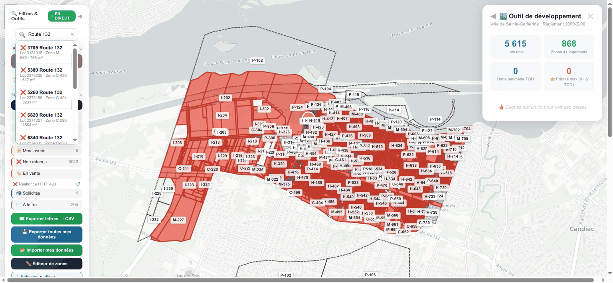

**Ce que montre la vue Steve.** Même vue, mais le panneau gauche affiche un **dropdown de
résultats** sous la barre de recherche (plusieurs lignes « Route 132 … » avec des pictos). C'est la
recherche adresse / n° de lot / code de zone.

**Feature(s) Steve.** **S-8** — Recherche adresse / n° lot / zone (dropdown 10 résultats, navigation
clavier ↑↓ Enter Esc, zoom + ouverture de fiche).

**Notre couverture.** **Contrôle commun aux vues carto Opportunités / Évaluation**.
`INTEGRATION` §2 **S-8** : barre de recherche en mémoire qui tape sur l'index `Lot.noLot` /
`LotVersion.adresseCivique` / `ZoneVersion.codeAffiche` de la ville chargée (déjà servie par
`/api/geo/:city/lots`), avec dropdown + zoom + ouverture de la fiche lot — **identique** au geste de
Steve. **Gain** : la sélection (lot/zone) est reflétée dans l'**état d'URL** (§7, deep-link).

**Écart / note.** ✅ **couverte.** Feature simple, données déjà chargées ; rien de bloquant.

---

## Capture 12 — Fiche lot (zoom 18, mini-fiche)

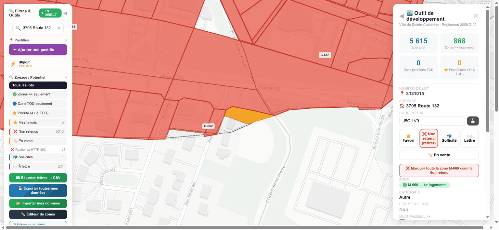

**Ce que montre la vue Steve.** Zoom rapproché : un lot est **sélectionné et surligné orange** au
milieu des lots rouges, et le panneau droit a basculé du mode stats vers la **fiche du lot** (n° de
lot, adresse, code postal, boutons de marque). On voit aussi le bandeau « ❌ Marquer toute la zone …
comme Non retenu » sous les boutons.

**Feature(s) Steve.** **S-2** (fiche lot), avec le surlignage orange du lot cliqué.

**Notre couverture.** **Vue Évaluation** (panneau de détail au clic). `INTEGRATION` §2 **S-2** : la
fiche lot de l'Évaluation. **Comment** : clic sur un lot → fiche avec n° lot, adresse, code postal,
zone, etc. (détaillé en capture 13). Le surlignage orange = lot sélectionné, géré par MapLibre.

**Écart / note.** 🟡 **partielle.** Voir capture 13 pour le détail des champs et l'écart de données.

---

## Capture 13 — Fiche lot (panneau complet) — la vue de référence

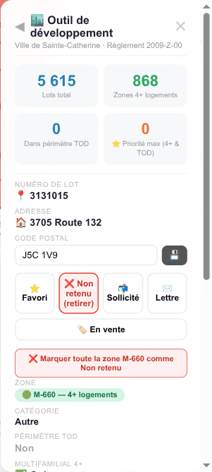

**Ce que montre la vue Steve.** Le panneau droit en mode fiche, très lisible. De haut en bas :
- En-tête « 🏙️ Outil de développement », sous-titre **« Ville de Sainte-Catherine · Règlement
  2009-Z-00 »**, croix de fermeture.
- Le bloc **4 stats** : **5 615** Lots total · **868** Zones 4+ logements · **0** Dans périmètre TOD
  · **0** ⭐ Priorité max (4+ & TOD).
- **NUMÉRO DE LOT** : `3131015` (avec une épingle 📍).
- **ADRESSE** : `3705 Route 132`.
- **CODE POSTAL** : champ éditable `J5C 1V9` + un bouton d'action (lookup/sauvegarde).
- **5 boutons de marquage** en ligne : **⭐ Favori** · **❌ Non retenu (retirer)** (en rouge, donc
  ce lot **est** déjà non-retenu) · **📬 Sollicité** · **✉️ Lettre** · **🏷️ En vente**.
- Un bouton pleine largeur **« 🏷️ En vente »**.
- Un bandeau rouge **« ❌ Marquer toute la zone M-660 comme Non retenu »** (batch par zone).
- **ZONE** : badge vert **« M-660 — 4+ logements »**.
- **CATÉGORIE** : Autre · **PÉRIMÈTRE TOD** : Non · **MULTIFAMILIAL 4+** : (✓, coupé en bas).

**Feature(s) Steve.** **S-2** (fiche complète), **S-3** (5 boutons de marque), **S-13** (code postal
éditable + lookup), **S-15** (batch « marquer toute la zone »). Le bouton « En vente » ouvre le
mini-formulaire prix + lien (S-2 / S-12).

**Notre couverture.**
- **S-2 fiche** → **Évaluation** (`INTEGRATION` §2 S-2) : mêmes champs (n° lot, adresse, code postal,
  zone badge, catégorie, TOD, superficie, façade/profondeur, usage, année, logements, étages,
  **valeurs totale/bâtiment/terrain du rôle**), champs masqués si vides comme Steve. Données :
  `LotVersion`, `Valuation` (rôle **A5 MAMH**), `ZoneVersion`.
- **S-3 marques** → **Opportunités** (statuts de pipeline) + notes en Évaluation : les 5 marques
  deviennent des statuts `ProspectMark{status: favori|écarté|sollicité|lettre-envoyée|en-vente}`,
  **append-only + journalisés** (`INTEGRATION` §4.1 ; `SOCLE` §2.4). Persistance = **pas Firestore**.
- **S-13 code postal** → champ éditable avec lookup **A7 IGO** (geocoder.ca en fallback), cache en
  base (`INTEGRATION` §2 S-13).
- **S-15 batch zone** → `ProspectMark{status:"écarté"}` sur tous les lots de `ZoneVersion.codeAffiche`
  avec confirmation (`INTEGRATION` §2 S-15) — exactement le geste de masse réel (5 043 non-retenus).
- **Mini-formulaire « en vente »** : `prixDemande` + `lienAnnonce` portés **par le `ProspectMark`**
  (saisie humaine = **source de vérité**), jamais une `Valuation` (`INTEGRATION` §4.1).

**Écart / note.** 🟡 **partielle.** Honnêteté importante : (1) en **maquette**, le **code postal est
vide** — le JSON Netlife de Steve n'exporte pas le cache geocoder.ca (seulement un préfixe ville
« J5C »), donc le champ reste blanc tant que S-13 n'est pas branché (`INTEGRATION` §2 S-2 note
maquette / §6.3). (2) Les **valeurs du rôle** dépendent du **rôle MAMH A5** pas encore extrait (en
maquette : fixture Netlife `mode:"simulation"`). (3) Le marquage multi-utilisateurs **réel** dépend
de l'infra CS-P3 (auth) — en maquette il reste `simulation`.

---

## Capture 14 — Labels de zones (zoom 15)

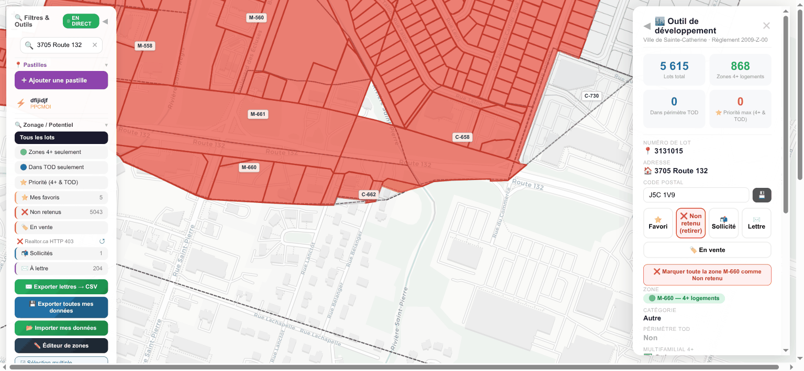

**Ce que montre la vue Steve.** Vue intermédiaire : sur les lots, des **étiquettes permanentes de
codes de zone** apparaissent (M-660 et voisines), visibles à partir du zoom ≥ 14. Le panneau fiche
(lot 3131015) reste ouvert à droite.

**Feature(s) Steve.** **S-10** — Labels de zones dépendants du zoom (codes permanents à zoom ≥ 14).

**Notre couverture.** **Couches d'étiquettes des vues carto (Opportunités / Évaluation)**.
`INTEGRATION` §2 **S-10** : labels permanents de `ZoneVersion.codeAffiche` à zoom ≥ 14. **Comment** :
en MapLibre, c'est natif (`symbol layer` avec `minzoom`), justement un argument en faveur de MapLibre
(`INTEGRATION` §8.2).

**Écart / note.** ✅ **couverte.** Pur rendu carto sur `ZoneVersion.codeAffiche` ; outillé nativement
par la lib choisie. (Reste à brancher sur le zonage extrait réel ; en maquette, sur les zones du JSON.)

---

## Capture 15 — Numéros civiques (zoom ≥ 15)

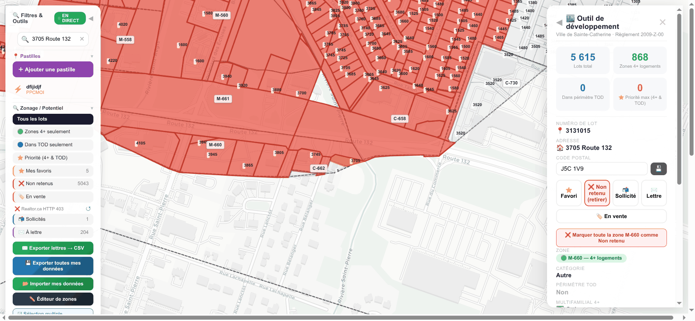

**Ce que montre la vue Steve.** Même secteur, encore plus zoomé : des **numéros civiques** s'affichent
au centroïde des lots (en plus des codes de zone). Fiche lot toujours ouverte.

**Feature(s) Steve.** **S-10** — N° civiques aux centroïdes à zoom ≥ 15.

**Notre couverture.** **Couches d'étiquettes Opportunités / Évaluation**. `INTEGRATION` §2 **S-10** :
labels de `LotVersion.adresseCivique` (n° civique) aux centroïdes à zoom ≥ 15.

**Écart / note.** 🟡 **partielle.** Le rendu est trivial en MapLibre, **mais** il dépend de la
disponibilité de l'**adresse civique** (`LotVersion.adresseCivique`) — présente dans la fixture pour
certains lots, complète seulement avec le rôle/IGO réel. D'où 🟡 (donnée) vs ✅ pour les labels de
zone (capture 14) qui ne dépendent que du code de zone.

---

## Capture 16 — Filtre « 4+ logements »

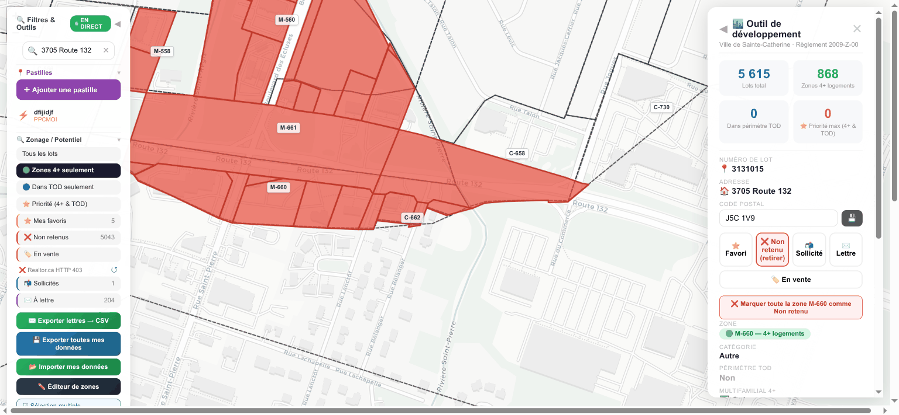

**Ce que montre la vue Steve.** Dans le panneau gauche « Zonage / Potentiel », le filtre **🟢 4+**
est actif : seuls les lots des **zones 4+ logements** restent affichés (les autres sont masqués /
grisés). On distingue des polygones de zones colorés. Fiche lot ouverte à droite.

**Feature(s) Steve.** **S-1** (notion 4+), **S-5** (filtre potentiel exclusif « 4+ »).

**Notre couverture.** **Vue Opportunités** (filtres). `INTEGRATION` §2 **S-5** : filtre **potentiel
(exclusif)** Tous / 4+ / TOD / Priorité / + statuts. Côté radar, « 4+ » devient un **seuil sur le
score de potentiel par lot** (dérivé `ZoneVersion` ∩ TOD ∩ pré-filtres), **pas** un flag importé ni
le `scoreGlobal` legacy.

**Écart / note.** 🟡 **partielle.** Le filtre est simple, mais sa donnée (le score de potentiel par
lot) dépend du **zonage extrait** + des seuils du socle (`SOCLE` §2.1) ; complet une fois CS-L1 +
substrat livrés.

---

## Capture 17 — Filtre « Non retenus » (donnée d'équipe réelle)

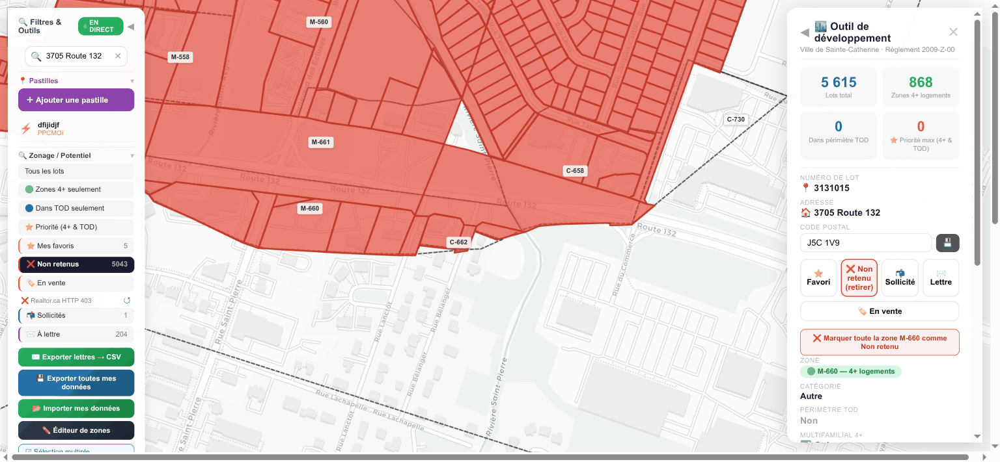

**Ce que montre la vue Steve.** Le filtre **❌ Non retenus** est actif : on voit la **masse réelle
des lots rouges** triés par l'équipe (c'est la donnée Firestore : 5 043 lots non retenus à
Sainte-Catherine). Fiche lot ouverte.

**Feature(s) Steve.** **S-3** (statut « non retenu »), **S-5** (filtre par marque).

**Notre couverture.** **Vue Opportunités**. `INTEGRATION` §2 **S-3** : filtres par marque **avec
compteurs**, agrégés sur le **dernier état** de `ProspectMark` (`INTEGRATION` §4.1). C'est exactement
ce tri de masse — le radar le rend **traçable** (chaque écartement = une `JournalEntry`).

**Écart / note.** 🟡 **partielle.** La mécanique de filtre existe ; ce qui est en aval, c'est
l'entité `ProspectMark` + le journal (lot CS-L3) et, pour le **réel multi-utilisateurs**, l'infra
auth (CS-P3). **Décision produit en attente** (`INTEGRATION` §6.2) : importer ou non le corpus
Firestore réel de l'équipe (5 043 non-retenus, 204 lettres) comme `ProspectMark{simulation}` pour
démarrer la maquette avec l'historique réel — **laissée à l'utilisateur**.

---

## Capture 18 — Filtre « À lettre »

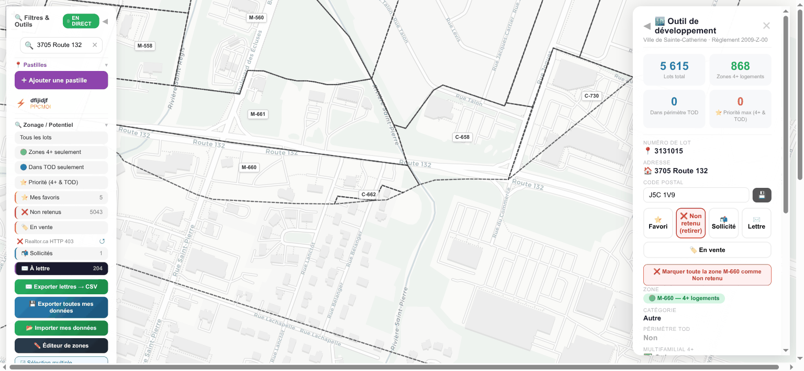

**Ce que montre la vue Steve.** Le filtre **✉️ À lettre** est actif : la carte se **vide presque
entièrement** (les lots non concernés disparaissent), ne laissant qu'un **sous-ensemble** de lots —
les ~204 lots « à lettre » de l'équipe, prêts pour le publipostage.

**Feature(s) Steve.** **S-3** (statut « lettre »), **S-4** (préparation de l'export lettres).

**Notre couverture.** **Vue Opportunités**. `INTEGRATION` §2 **S-3** (filtre statut `lettre-envoyée`)
+ **S-4** : depuis cette liste filtrée, le bouton **« Exporter → CSV »** produit le fichier de
lettres de sollicitation (20 colonnes, BOM UTF-8) — lot **CS-L4**.

**Écart / note.** 🟡 **partielle.** Filtre + export spécifiés (CS-L3 / CS-L4). La **colonne code
postal** de l'export reste **blanche** en maquette (S-13 non branché) — l'export part **quand même**,
colonne vide (dépendance **non bloquante** corrigée en revue Fable5, `INTEGRATION` §9.1).

---

## Capture 19 — Filtre usage « Vacant » + superficie min

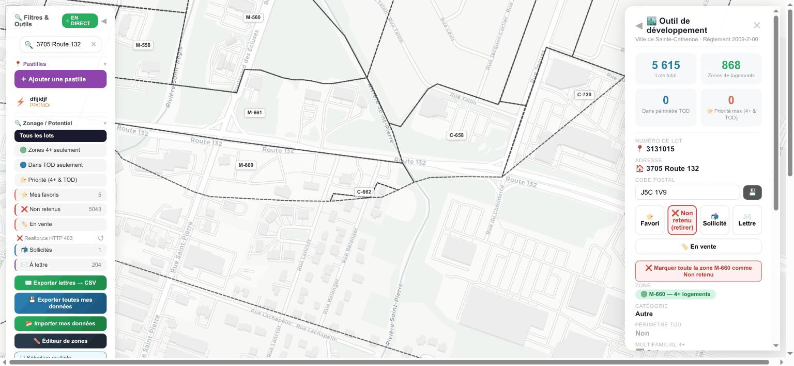

**Ce que montre la vue Steve.** Combinaison de filtres : dans « 🏗️ Usage actuel », **Vacant** est
coché (filtre additif) et le **slider de superficie minimale** est poussé (~1 000 m²). Résultat : la
carte ne montre plus que **quelques lots** (vacants ≥ 1 000 m²), avec un compteur « n / total ».

**Feature(s) Steve.** **S-5** — Filtres combinés : **potentiel (exclusif) × usage (additif) ×
superficie min (slider)**.

**Notre couverture.** **Vue Opportunités** (+ slider en Évaluation). `INTEGRATION` §2 **S-5** :
- **usage actuel** (additif) → filtre sur `LotVersion.usageCode` / `cubf` (Vacant, Résidentiel,
  Multi-logements CUBF 5xxx, etc.) ;
- **superficie min** (slider 0–10 000 m²) → filtre `LotVersion.superficieM2`, aligné sur le
  pré-filtre physique `minLotAreaM2` (`SOCLE` §2.1) ;
- le tout combiné avec le filtre potentiel exclusif.

**Écart / note.** ✅ **couverte.** Filtres purs sur des **champs déjà chargés** (`usageCode`,
`superficieM2`) ; le modèle simple de Steve est repris tel quel, **rendu partageable via l'URL**
(§7). C'est un des lots les plus légers (CS-L5, estim. S-M).

---

## Capture 20 — Couches environnementales (milieux humides + zones inondables)

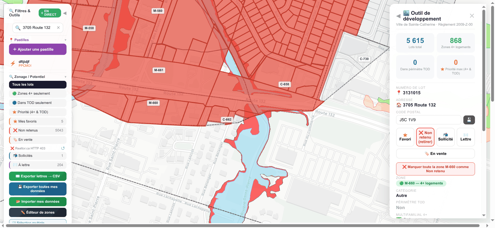

**Ce que montre la vue Steve.** Sur la carte, en plus des lots rouges, un **overlay bleu/cyan** en
bas (milieux humides MELCC et zones inondables BDZI), activé via les toggles de couches
environnementales. Fiche lot ouverte.

**Feature(s) Steve.** **S-7** — Couches environnementales (milieux humides MELCC, zones inondables
BDZI).

**Notre couverture.** **Couches des vues carto (Opportunités / Évaluation principalement)**.
`INTEGRATION` §2 **S-7** : ces couches **publiques** sont déjà des **sources radar prévues** —
**BDZI** = source **A9** (`bdzi-flood-zones`), milieux humides **MELCC** via le **même endpoint
ArcGIS** que Steve (`servicesgeo.enviroweb.gouv.qc.ca`, couche 2). **Double usage** : affichage **et**
**scoring `risque`** (axe 20 %, `SOCLE` §3.2 : inondation 0-20 ans = blocker).

**Écart / note.** 🟡 **partielle.** Toggles de couches + intersections de risque spécifiés (lot
**CS-P1 / S-7**, P1). Tuiles/WMS publics, pas de stockage lourd ; le branchement réel est en aval du
P0.

---

## Capture 21 — Vue satellite

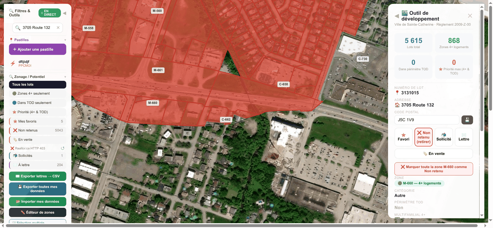

**Ce que montre la vue Steve.** Le fond de carte est passé en **imagerie satellite** (Esri World
Imagery) : on voit le bâti réel, les rues, et par-dessus les **lots rouges** semi-transparents + un
**triangle vert** (un milieu humide / parc). Fiche lot ouverte.

**Feature(s) Steve.** **S-7** — Vue satellite (fond Esri World Imagery).

**Notre couverture.** **Couches Opportunités / Évaluation**. `INTEGRATION` §2 **S-7** : satellite =
fond **Esri World Imagery** en option de fond de carte. **Comment** : MapLibre accepte un raster
source Esri ; bascule de fond de carte standard.

**Écart / note.** ✅ **couverte.** Fond raster public, sans dépendance de données radar — c'est un
simple toggle de fond. (Reste dans CS-P1 côté planning, mais sans verrou de donnée.)

---

## Capture 22 — Zones agricoles CPTAQ

**Ce que montre la vue Steve.** Couche **CPTAQ** (zones agricoles protégées) activée en overlay WMS,
sur les lots. Visuellement proche de la vue globale (la zone agricole borde la ville). Fiche ouverte.

**Feature(s) Steve.** **S-7** — Zones agricoles CPTAQ (WMS).

**Notre couverture.** **Couches Opportunités / Évaluation**. `INTEGRATION` §2 **S-7** : CPTAQ =
source **A8** (`cptaq-zone-agricole`, WMS public). **Double usage** : couche + scoring `risque`
(agricole sans dézonage = bas potentiel / contrainte, `SOCLE` §3.2).

**Écart / note.** 🟡 **partielle.** WMS public, simple à afficher ; l'**intersection pour le scoring**
(et la cohérence avec le pré-filtre agricole) est en aval (CS-P1 / S-7). D'où 🟡 vs ✅ du satellite :
ici la couche **nourrit aussi le score**, donc elle attend le pipeline de scoring.

---

## Capture 23 — Modal « Pastille » (annotation réglementaire)

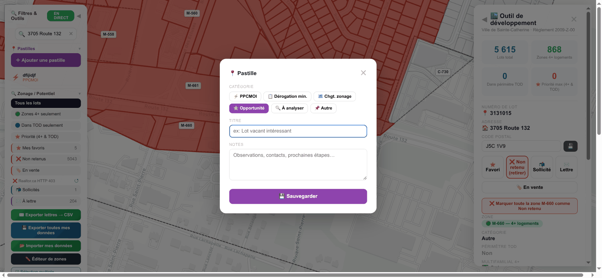

**Ce que montre la vue Steve.** Une **modal « 📍 Pastille »** ouverte au centre. Rangée de boutons de
**catégorie** : **⚡ PPCMOI** (sélectionné), **📋 Dérogation mineure**, **🗺️ Changement de zonage**,
**⭐ Opportunité**, **🔍 À analyser**, **📌 Autre**. En dessous : un champ **titre** (« Ex : Lot
récemment intéressant ») et un champ **notes** (« Observations, contexte, prochaines étapes… »), puis
un bouton violet **« 💾 Enregistrer »**. C'est l'outil qui pose un marqueur manuel d'événement
réglementaire sur la carte.

**Feature(s) Steve.** **S-6** — Pastilles / annotations réglementaires par catégorie (posées **à la
main** par l'opérateur).

**Notre couverture.** **Vue Signaux** (génération **automatique**). `INTEGRATION` §2 **S-6** : *« C'est
exactement nos Signaux. »* Les catégories de pastilles mappent **1-1** sur nos `Signal.type` :
⚡ PPCMOI → `ppcmoi` · 📋 Dérogation → `derogation-relevant`/`-irrelevant` · 🗺️ Changement de zonage
→ `residential-rezoning`/`grid-cos-modification` · ⭐ Opportunité → dossier T2 · 🔍 À analyser →
`Signal.status = à-approfondir`. **Comment** : au lieu de poser une pastille à la main, le pipeline
radar génère le `Signal` **depuis les PV de conseil** (sources `proces-verbaux-*` / `avis-publics-*`)
→ `DesignationEvent` → `Signal`. Le rendu marqueur+popup de Steve (`ev-popup`/`ev-marker`) sert
d'**inspiration UI** pour le pin de Signal.

**Écart / note.** 🟡 **partielle.** Le mapping catégorie→`Signal.type` est défini et le pipeline PV
existe partiellement (sources `proces-verbaux-*` câblées). La **génération auto** complète et le rendu
pin/popup sont dans **CS-P1 / S-6** (P1). La **pastille manuelle reste possible** (cas dégradé =
`Signal{verification:"hypothese"}`), mais ce n'est plus le défaut : la différence majeure et **le
gain** = automatiser sur ~150 villes ce que Steve fait à la main (1 seule pastille posée).

---

## Capture 24 — Sélection multiple (en cours)

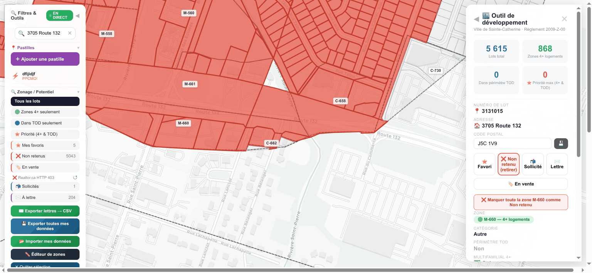

**Ce que montre la vue Steve.** Mode sélection multiple activé : parmi les lots rouges, **quelques
lots passent en surbrillance bleu/cyan** (sélectionnés clic-à-clic). Fiche / panneau à droite.

**Feature(s) Steve.** **S-9** — Sélection multiple (clic-à-clic) avant action batch.

**Notre couverture.** **Vues Opportunités / Évaluation**. `INTEGRATION` §2 **S-9** : sélection
clic-à-clic d'un ensemble de `lotId`, en vue d'un statut batch (S-3) ou d'un export (S-4).

**Écart / note.** 🔭 **planifiée.** Différenciateur P1 (lot **CS-P1 / S-9**) ; il consomme
`ProspectMark` en lot (déjà spécifié), mais arrive après le P0 (fiche/marques/filtres). Voir 25.

---

## Capture 25 — Multi-sélection (3 lots) + actions batch

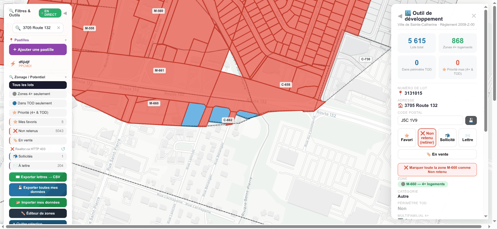

**Ce que montre la vue Steve.** **3 lots** sont sélectionnés (surlignés bleu) et une barre / des
**actions batch** apparaissent (appliquer une marque aux 3, ou exporter la sélection en CSV).

**Feature(s) Steve.** **S-9** (batch marquage/export), apparenté **S-15** (batch par zone).

**Notre couverture.** **Vue Opportunités**. `INTEGRATION` §2 **S-9** : appliquer un `ProspectMark`
batch aux N lots (journalisé, `JournalEntry`, réversible) ou exporter la sélection en CSV (sous-
ensemble de S-4). **S-15** (`INTEGRATION` §2 S-15) est le cas « toute une zone » du même geste.

**Écart / note.** 🔭 **planifiée.** P1 (CS-P1). Le **gain** : batch **journalisé et réversible** (vs
écriture Firestore last-write-wins).

---

## Capture 26 — Panneau de filtres réduit (collapsé) + « EN DIRECT »

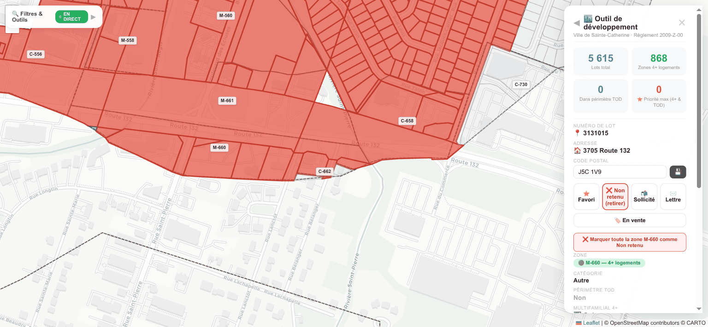

**Ce que montre la vue Steve.** Le panneau gauche « Filtres & Outils » est **replié** (réduit à son
en-tête), libérant la carte. Un badge vert **« EN DIRECT »** indique que la **synchronisation
Firebase temps réel** est active.

**Feature(s) Steve.** Ergonomie de panneau collapsible + **S-11** (le badge « EN DIRECT » = sync
temps réel multi-utilisateurs).

**Notre couverture.** **Transverse** (état visible sur Opportunités / Évaluation). `INTEGRATION` §2
**S-11** : remplacer Firestore ouvert par **backend radar + AUTH** ; les `ProspectMark` / notes se
synchronisent via l'API radar (pas de clés en clair), avec export/import JSON en filet. Le « EN
DIRECT » devient un indicateur de sync **authentifiée**.

**Écart / note.** 🔭 **planifiée (infra).** S-11 a été **sorti des features carto** pour devenir un
item d'**infrastructure dédié CS-P3** (`INTEGRATION` §9.2) — backend + auth + persistance S3-first
(`SPEC_PERSISTENCE_S3_FIRST.md`), multi-semaines. C'est le **prérequis** du marquage **réel**
multi-utilisateurs (CS-L3 en `mode:"real"` en dépend). **Anti-feature corrigée** : pas de Firestore
ouvert sans auth (`INTEGRATION` §5).

---

## Capture 27 — Mobile 390×844 (header + FAB)

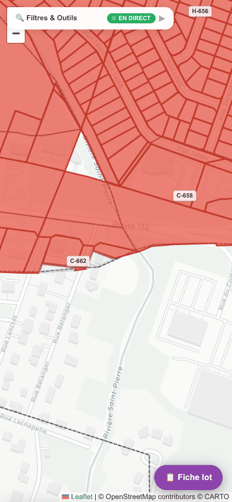

**Ce que montre la vue Steve.** Vue **mobile** (portrait étroit). En haut : un en-tête compact
**« 🔍 Filtres & Outils »** avec le badge **« EN DIRECT »** et une flèche d'ouverture. La carte
occupe tout l'écran (lots rouges, étiquettes de zone H-656 / C-658 / C-662, rivière Saint-Pierre,
rues nommées). En bas à droite, un **FAB violet « 📋 Fiche lot »**. Attribution « Leaflet · ©
OpenStreetMap · © CARTO » visible.

**Feature(s) Steve.** **S-16** — Mobile (fiche lot en bottom-sheet, panneau filtres rétréci, FAB).

**Notre couverture.** **Vue Évaluation (responsive)**. `INTEGRATION` §2 **S-16** : < 768 px, la fiche
lot devient un **bottom-sheet** ouvert via FAB ou clic lot ; **même composant**, pur responsive.

**Écart / note.** 🔭 **planifiée.** P2 (CS-P2 / S-16). Pas de nouvelle donnée ni nouvel écran : c'est
le responsive de la fiche S-2. (Note technique : le « Leaflet » visible ici est l'outil de Steve ;
côté radar la carte lots passe à **MapLibre**, `INTEGRATION` §8.)

---

## Capture 28 — Mobile : fiche lot en bottom-sheet

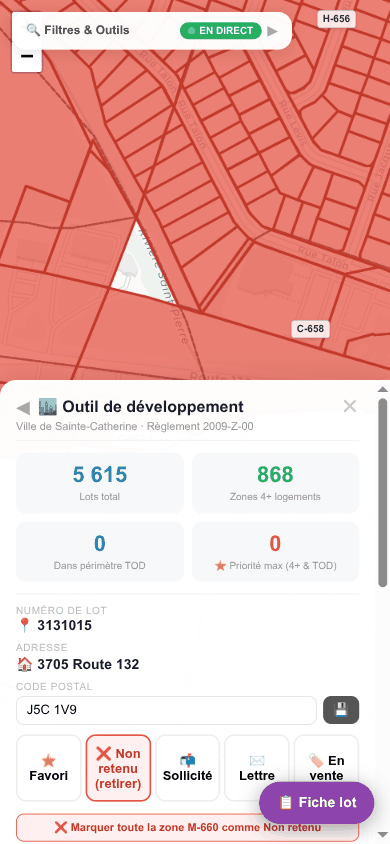

**Ce que montre la vue Steve.** Toujours en mobile, la **fiche lot** est ouverte en **feuille basse
(bottom-sheet, ~55 vh)** qui remonte du bas : on y retrouve exactement les champs de la capture 13
(bloc stats 5615/868/0/0, n° de lot 3131015, adresse 3705 Route 132, code postal J5C 1V9, les 5
boutons de marque, le batch « zone M-660 »). Le FAB « Fiche lot » reste visible.

**Feature(s) Steve.** **S-16** (bottom-sheet) + **S-2** (mêmes champs de fiche).

**Notre couverture.** **Vue Évaluation (responsive)**. `INTEGRATION` §2 **S-16 + S-2** : le
bottom-sheet réutilise le **même composant fiche lot** que le desktop, monté en feuille basse en
dessous de 768 px.

**Écart / note.** 🔭 **planifiée.** P2 (CS-P2). Même contenu que la fiche desktop (S-2) ; hérite donc
des mêmes dépendances de données (code postal vide en maquette, valeurs = rôle A5).
