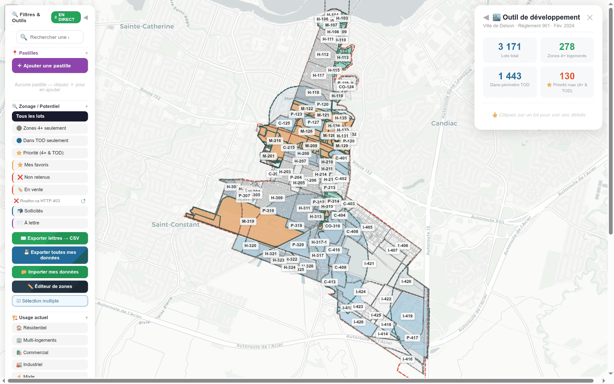
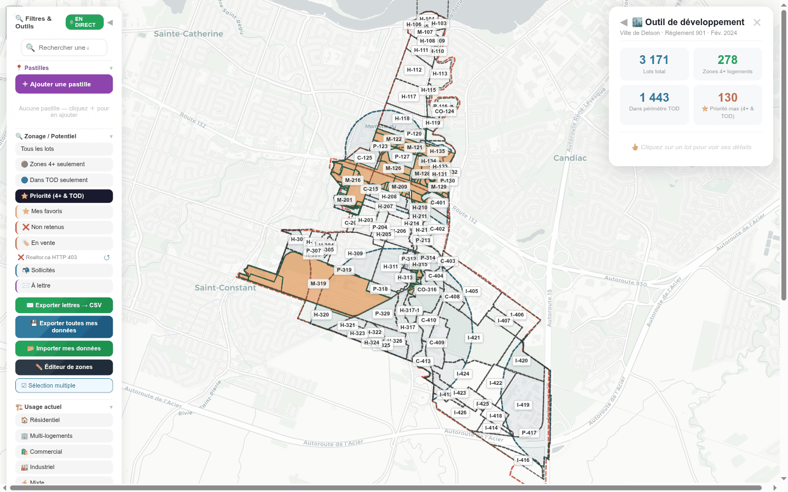
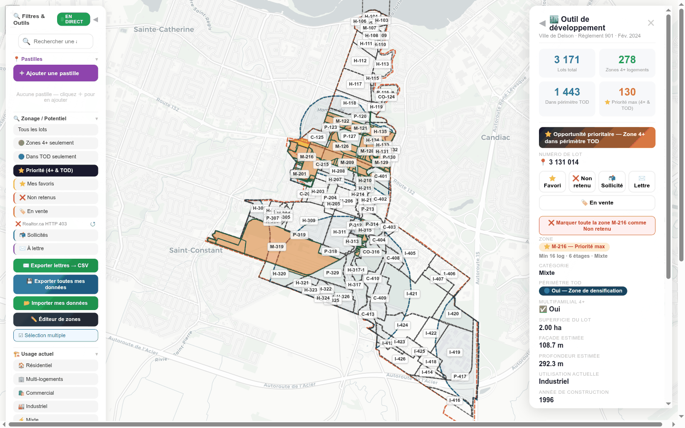

# 02 — Delson : la vue la plus complète (TOD + boundary + priorité) (captures 30–32)

[← retour à l'index](README.md)

Delson est la ville **la plus riche** de l'outil : zonage + **périmètre TOD** + **limite municipale
(boundary)** + descriptions de zones hardcodées (Règlement 901). C'est la seule où le concept
**« priorité = 4+ ∩ TOD »** s'illustre pleinement : **130 lots « priorité max »** (rétrodoc README,
`analyse-donnees.json`). Aucune marque d'équipe à Delson au moment de l'analyse → on voit la donnée
**brute** (4+/TOD/priorité), pas le tri humain.

---

## Capture 30 — Vue globale (TOD + boundary)

**Ce que montre la vue Steve.** Carte de Delson avec, à droite, le panneau stats : **3 171** Lots
total · **278** Zones 4+ logements · **1 443** Dans périmètre TOD · **130** ⭐ Priorité max (4+ &
TOD). Sur la carte : un **remplissage bleu pâle** marque le **périmètre TOD**, des **lots orange**
marquent la **priorité** (4+ ∩ TOD), des zones **vertes** = 4+, et un **contour pointillé rouge** =
la **limite de ville (boundary)**. Panneau gauche « Filtres & Outils » classique.

**Feature(s) Steve.** **S-1** (carte lots colorée, palette priorité), **S-1b** (panneau stats +
légende). C'est l'illustration canonique du **« priorité = 4+ ∩ TOD »**.

**Notre couverture.** **Vue Opportunités**.
- **S-1** (`INTEGRATION` §2 S-1) : le « 4+ ∩ TOD » booléen de Steve est **précisément le cas que le
  radar généralise** en **score de potentiel par lot** continu (dérivé `ZoneVersion.densiteLogHa` /
  usages **∩** couche TOD **∩** pré-filtres physiques), **calculable sur 100 % des lots**, sans
  hardcode par ville.
- **TOD** : la couche bleue de Delson vient du `tod` du JSON. Côté radar réel, c'est la **source A13
  `aires-tod-pmad-cmm`** (open data **CMM**), **ajoutée au plan** par `INTEGRATION` §4.0 — Delson est
  dans la CMM, donc couverte. Cette couche alimente CS-L1 (couleur), S-1b (compteur TOD) et l'axe
  **timing** du scoring T2 (`SOCLE` §3.3).
- **S-1b** : les 4 compteurs (3171/278/1443/130) deviennent des **agrégats recalculés** ; en maquette
  CS-L6, **les 130 priorités attendues de Delson** servent de **jeu de calibration** pour vérifier
  que notre scoring retrouve des priorités cohérentes (`INTEGRATION` §6 / §6.3).
- **boundary** : la limite de ville = `CityProfile.bbox` / boundary GeoJSON (source A11 StatCan /
  A4) — `INTEGRATION` §4.

**Écart / note.** 🟡 **partielle.** Architecturalement couvert ; en attente de (a) la couche TOD réelle
A13 (jusque-là : fixture du JSON Delson, `mode:"simulation"`), (b) le zonage extrait pour le score, et
(c) la couche MapLibre (CS-L1). **Honnêteté hors CMM** : pour une ville hors CMM, A13 n'a pas d'aire
TOD → couche TOD `non-disponible` (≠ « pas de TOD ») et score calculé **sans** l'axe TOD
(`INTEGRATION` §4.0 ; `SOCLE` §3.4.0). Les **descriptions de zones** hardcodées de Delson (« Min 16
log · 6 étages ») ne seront **pas** hardcodées chez nous : elles viendront de `ZoneVersion.normes` /
grilles.

---

## Capture 31 — Filtre priorité (4+ ∩ TOD)

**Ce que montre la vue Steve.** Le filtre **⭐ Priorité** est actif : la carte ne montre plus que les
**130 lots « priorité max »** (en orange), tous situés à l'intersection des zones 4+ et du périmètre
TOD. Le reste des lots est masqué. Panneau stats inchangé (130 priorité max).

**Feature(s) Steve.** **S-1** (concept priorité), **S-5** (filtre potentiel exclusif « Priorité »).

**Notre couverture.** **Vue Opportunités** (filtres). `INTEGRATION` §2 **S-5** : « Priorité » devient
un **seuil haut sur le score de potentiel par lot** (les lots où `ZoneVersion` 4+ **∩** TOD **∩**
pré-filtres convergent), **pas** un flag importé. Filtre exclusif, comme Steve.

**Écart / note.** 🟡 **partielle.** Filtre simple, mais sa donnée (score de potentiel) dépend du
zonage + de la couche TOD A13. En maquette, on peut **recalculer** le score et **comparer aux 130
priorités de référence** de Steve (calibration, `INTEGRATION` §6.3) — c'est le bon cas-test.

---

## Capture 32 — Fiche lot avec bannière « Opportunité prioritaire »

**Ce que montre la vue Steve.** Un lot priorité est cliqué. La fiche à droite affiche en haut une
**bannière orange « ⭐ Opportunité prioritaire — Zone 4+ dans périmètre TOD »**, puis les boutons de
marque, et un **rôle d'évaluation complet** : n° de lot, catégorie (ex. Industriel), superficie
(~282,3 m²), façade, **année de construction (ex. 1990)**, valeurs (terrain/bâtiment/total). Le bloc
stats Delson (3171/278/1443/130) reste visible.

**Feature(s) Steve.** **S-1** (bannière priorité), **S-2** (fiche lot complète avec rôle).

**Notre couverture.** **Vue Évaluation** (fiche). `INTEGRATION` §2 **S-2** : la fiche lot porte la
**bannière** « Opportunité prioritaire » quand le **score de potentiel par lot** est en zone haute
(4+ ∩ TOD). **Comment** : les champs de rôle (catégorie, superficie, façade/profondeur, année,
valeurs) viennent du **rôle MAMH A5** (`Valuation` + `LotVersion`) ; la mention 4+/TOD vient du score
dérivé + de la couche TOD A13. **Distinction load-bearing** (`INTEGRATION` §2 S-1) : la bannière
reflète le **score de potentiel par lot** (maille lot), **pas** le score T2 0-5 d'un `OpportunityDossier`
(qui n'existe qu'à la maille dossier, né d'un signal) — si ce lot est rattaché à un dossier, le score
T2 s'affiche **en plus** dans la fiche, jamais comme couleur de la couche.

**Écart / note.** 🟡 **partielle.** Fiche + bannière spécifiées (CS-L1 pour le score, CS-L2 pour la
fiche). En attente du rôle MAMH A5 (maquette : fixture Delson `simulation`) et de la couche TOD A13.
