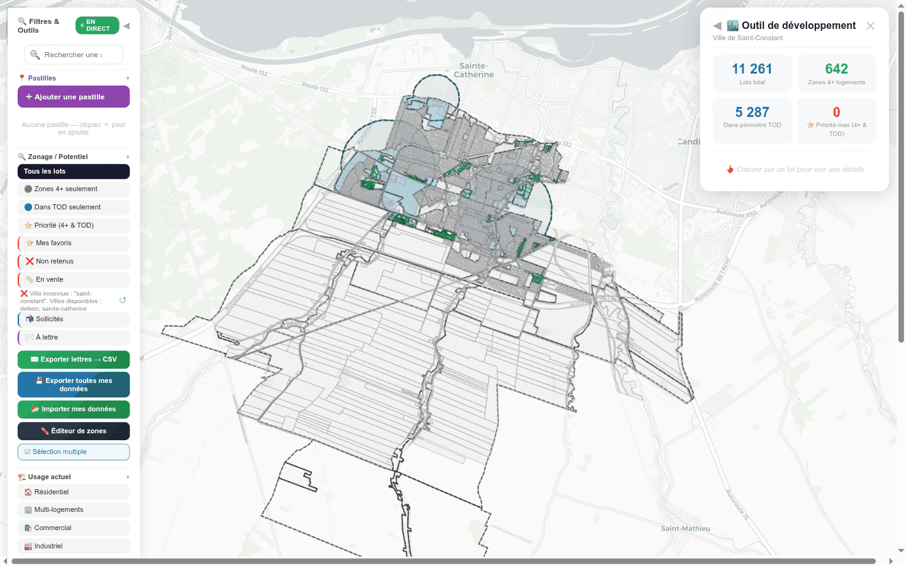
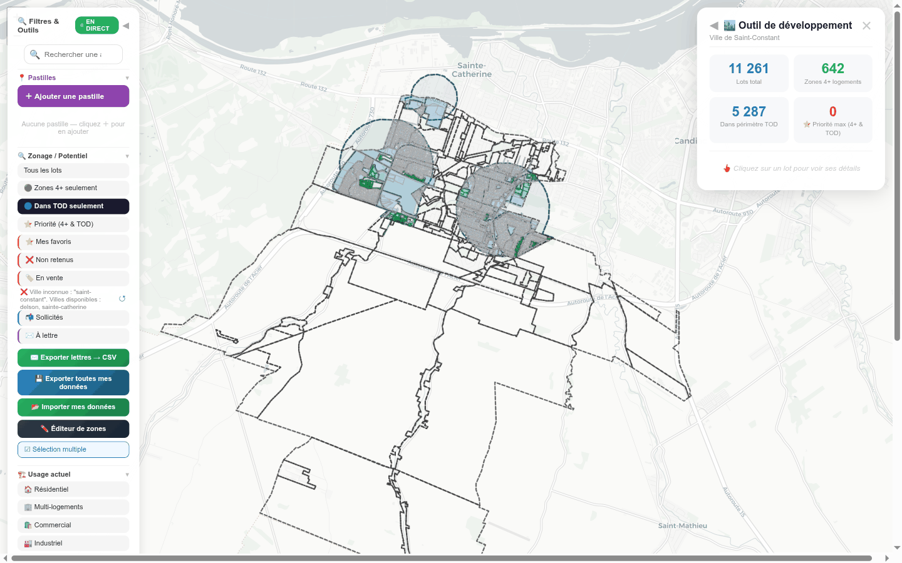
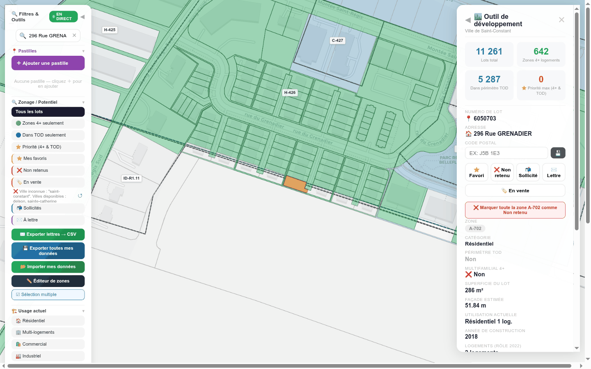

# 03 — Saint-Constant : le rôle le plus riche + TOD (captures 40–42)

[← retour à l'index](README.md)

Saint-Constant est la ville au **rôle d'évaluation le plus riche** (utilisation, année, étages,
façade, valeurs détaillées — rétrodoc README). Elle a **1 périmètre TOD** (en fait deux grands
cercles d'orientation transport) couvrant **5 287 lots**, **642 zones 4+**, mais **0 priorité max**
dans le JSON observé. Aucune marque d'équipe → donnée brute.

---

## Capture 40 — Vue globale

**Ce que montre la vue Steve.** Carte de Saint-Constant. Panneau stats à droite : **11 261** Lots
total · **642** Zones 4+ logements · **5 287** Dans périmètre TOD · **0** ⭐ Priorité max. Sur la
carte : **deux grands périmètres TOD circulaires bleus** (remplissage pâle, contour pointillé bleu
foncé) autour des points d'accès au réseau structurant, des **zones vertes** (4+), et l'essentiel des
lots en gris (contours cadastraux fins). C'est la ville la **plus volumineuse** (11 261 lots) — preuve
que l'outil de Steve (Leaflet) rend bien ~11 k polygones.

**Feature(s) Steve.** **S-1** (carte lots + TOD), **S-1b** (panneau stats).

**Notre couverture.** **Vue Opportunités**. `INTEGRATION` §2 **S-1 / S-1b** : couche lots scorée +
panneau de 4 compteurs recalculés ; **TOD** = source **A13 `aires-tod-pmad-cmm`** (Saint-Constant est
dans la CMM, `INTEGRATION` §4.0). **Point carto load-bearing** : ces 11 261 lots sont **exactement**
le cas qui **justifie MapLibre** côté radar — notre rendu **SVG plafonne à 200 lots**
(`EvaluationMapView.svelte:125`, `fetchLots(..., { limit: 200 })`), d'où la décision MapLibre GL dès
CS-L1/CS-L6 (`INTEGRATION` §8.1/§8.2).

**Écart / note.** 🟡 **partielle.** En attente de la couche MapLibre (CS-L1), du substrat (CS-L6,
fixture JSON Saint-Constant), et de la couche TOD A13. La **volumétrie** (11 261 lots × ~150 villes)
est précisément l'**anti-feature** « JSON monolithique » que le radar corrige par API paginée +
PMTiles différé (`INTEGRATION` §5 / §8.2).

---

## Capture 41 — Filtre TOD

**Ce que montre la vue Steve.** Le filtre **🔵 TOD** est actif : ne restent affichés que les lots
**dans les deux périmètres TOD** (les deux disques bleus), le reste de la ville est masqué. Panneau
stats inchangé (5 287 dans TOD).

**Feature(s) Steve.** **S-1** (couche TOD), **S-5** (filtre potentiel exclusif « TOD »).

**Notre couverture.** **Vue Opportunités** (filtres). `INTEGRATION` §2 **S-5** : « TOD » = filtre sur
l'appartenance à la couche `requalification-tod` (intersection géométrique lot ∩ périmètre A13).
Filtre exclusif, comme Steve.

**Écart / note.** 🟡 **partielle.** Dépend de la couche TOD A13 (réel) / de la fixture `tod` du JSON
(maquette). **Honnêteté** : hors CMM, ce filtre serait `non-disponible`, pas vide (`INTEGRATION`
§4.0).

---

## Capture 42 — Fiche lot avec rôle complet

**Ce que montre la vue Steve.** Un lot est cliqué (surligné **orange** dans une **zone verte 4+**).
La fiche à droite montre un **rôle d'évaluation détaillé** : n° de lot (ex. 6256755), adresse (ex.
296 Rue Grenadier), les boutons de marque, **catégorie Résidentiel**, **superficie ~286 m²**,
**façade ~51,84 m**, **utilisation « Résidentiel 1 logement »**, **année 2019**, valeurs du rôle.
C'est la fiche la plus complète grâce à la richesse du rôle de Saint-Constant.

**Feature(s) Steve.** **S-2** — Fiche lot complète (cadastre + **rôle complet** + zone).

**Notre couverture.** **Vue Évaluation** (fiche). `INTEGRATION` §2 **S-2** : c'est **la** vue de
référence pour la fiche. **Comment** : tous ces champs viennent du **rôle MAMH A5**
(`roles-evaluation-fonciere-mamh`) — `Valuation{valeurTotale/Terrain/Batiment, rolYear}`,
`LotVersion{usageCode, superficieM2, adresseCivique}`, façade/profondeur = champs estimés du rôle
(RL), `ZoneVersion{codeAffiche, densiteLogHa}`. Le **gain** : le rôle MAMH est **universel au Québec**
(code MAMH standardisé) — donc la même fiche fonctionne pour ~150 villes, pas un JSON figé par ville.

**Écart / note.** 🟡 **partielle.** Fiche spécifiée (CS-L2). En attente de l'extraction du **rôle MAMH
A5** (jusque-là : fixture Saint-Constant `mode:"simulation"`, qui porte déjà ces champs riches — bon
substrat de validation UX). **Pas de PII** : NO_LOT seul, pas de nom de propriétaire (Loi 25,
`INTEGRATION` §2 S-2).

---

## Note transverse Saint-Constant — flux « en vente » (S-12)

Aucune capture de Saint-Constant ne montre le **flux d'annonces en vente** (Realtor/Centris), et pour
cause : chez Steve il est **cassé (403 Realtor.ca, anti-bot)**. Position radar (`INTEGRATION` §2
**S-12** / §4.1) :
- Le **prix demandé** et le **lien d'annonce** d'un lot « en vente » sont une **saisie humaine** portée
  par le `ProspectMark{status:"en-vente"}` (`prixDemande`, `lienAnnonce`) = **source de vérité**.
- L'enrichissement « estimation marché » du dossier (`Valuation{kind:"market-estimate"}`) est une
  **valeur dérivée** qui peut **citer** ce prix mais ne le remplace pas.
- **Centris/MLS = DO-NOT-SCRAPE** (Tier C, ToS strict, `SPEC_PLAN_SCRAPING.md`) → on ne scrape pas ;
  on prévoit un **connecteur Sources honnête** (statut todo/error **visible** en vue Sources) au lieu
  d'un 403 silencieux. C'est l'unique cas **❌ non reproduit en l'état** (la **source**, pas l'écran).
