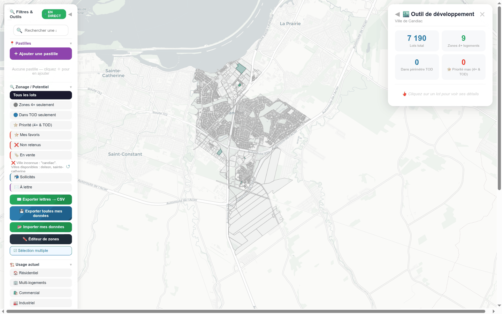

# 04 — Candiac : le cas « données brutes » (ni zonage ni TOD) (capture 50)

[← retour à l'index](README.md)

Candiac est le **cas-test du « partiel »** : l'outil n'a que les **lots + le rôle**, **aucun zonage**
et **aucun TOD** (le fichier `data/candiac-zones.json` renvoie 404, rétrodoc README). C'est précieux :
il montre ce qui se passe quand des couches **manquent** — exactement le scénario d'honnêteté
`partial`/`non-disponible` que le radar doit gérer proprement.

---

## Capture 50 — Vue globale

**Ce que montre la vue Steve.** Carte de Candiac. Panneau stats à droite : **7 190** Lots total ·
**0** Zones 4+ logements · **0** Dans périmètre TOD · **0** ⭐ Priorité max. Sur la carte : **tous les
lots sont gris** (contours cadastraux uniquement), **aucune zone verte**, **aucun périmètre TOD**, car
il n'y a ni zonage ni TOD chargés. Panneau gauche « Filtres & Outils » présent mais les filtres
potentiel (4+/TOD/priorité) ne donnent rien.

**Feature(s) Steve.** **S-1** (carte lots — mais **sans** la couche scoring faute de zonage/TOD),
**S-1b** (panneau stats, à zéro pour 4+/TOD/priorité), **S-17** (côté dashboard, Candiac est pourtant
marqué « ✅ Disponible »).

**Notre couverture.**
- **S-1** (`INTEGRATION` §2 S-1) : sans `ZoneVersion` ni couche TOD, le **score de potentiel par lot**
  est **calculé sur les axes disponibles seulement** (superficie/usage du rôle), et le manque est
  **affiché honnêtement** : `partial` / `non-disponible` (≠ score bas implicite). C'est exactement le
  comportement spécifié : *« honnêteté `partial`/`non-disponible` quand la zone ou la couche TOD
  manque »* (`INTEGRATION` §2 S-1) et la **doctrine de disponibilité** *unknown ≠ pas-de-TOD*
  (`SOCLE` §3.4.0, `INTEGRATION` §4.0).
- **S-17 / Sources** : là où Steve affiche un badge binaire « Disponible » **trompeur** (Candiac n'a
  ni zonage ni TOD mais est « Disponible »), la **vue Sources** du radar montre un statut **par
  couche** (`CoverageCityEntry{hasZonage}`, `ScrapeStatusT.coveragePct`) — donc « lots ✅ / zonage ❌
  / TOD ❌ », bien plus honnête.

**Écart / note.** 🟡 **partielle.** Candiac est le **meilleur cas-test** du `partial` du scoring
(`INTEGRATION` §6.3 : *« Candiac = lots + rôle seuls — bon cas-test du partial/non-disponible »*).
**Comment on le reproduit** : on **ne hardcode pas** un faux zonage ; on calcule le score sur ce qu'on
a et on signale les axes absents. Le **gain net** vs Steve : pas de badge « Disponible » qui ment sur
la complétude des couches.
