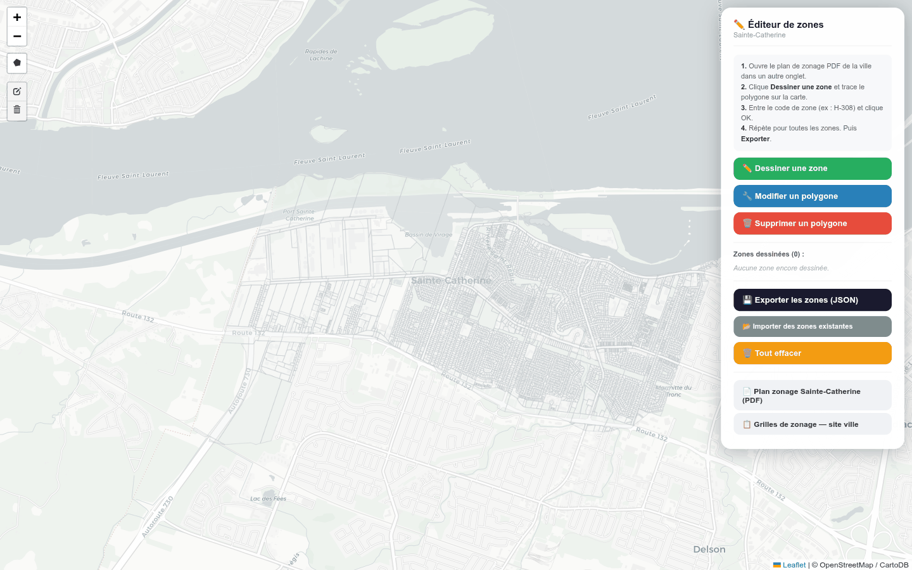
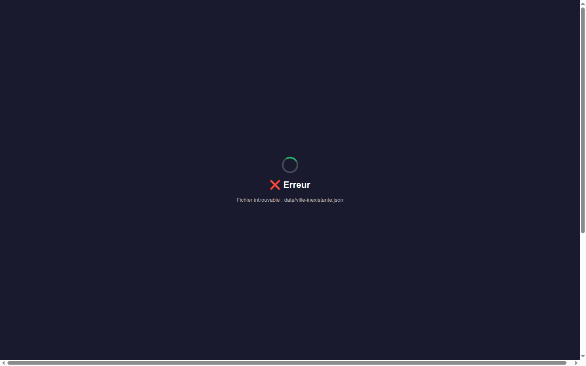

# 05 — Éditeur de zones & écran d'erreur (captures 60, 61)

[← retour à l'index](README.md)

---

## Capture 60 — Éditeur de zones (`editeur-zones.html`)

**Ce que montre la vue Steve.** Outil **séparé** de **numérisation manuelle du zonage**. Fond de carte
clair avec les **lots en filigrane gris** (Sainte-Catherine). En haut à gauche, une **barre d'outils
de dessin** (Leaflet.draw : tracer / éditer / supprimer un polygone). À droite, le panneau **« Éditeur
de zones »** : une liste d'instructions, un bouton vert **« Dessiner une zone »**, des boutons
**« Modifier un polygone »** / **« Supprimer un polygone »**, puis des boutons orange
**« 💾 Exporter les zones (JSON) »** et **« 📂 Importer des zones »**, et en bas des **liens directs**
vers le **plan de zonage PDF** et les **grilles** de la ville. Le workflow réel : dessiner → exporter
→ déposer `data/<slug>-zones.json` sur Netlify (c'est ainsi que les 193 zones de Sainte-Catherine
existent).

**Feature(s) Steve.** **S-14** — Éditeur de zonage manuel (Leaflet.draw), outil de **bootstrap** quand
une ville n'a pas de zonage numérique.

**Notre couverture.** **Vue Sources** (outil de bootstrap d'une source zonage manquante).
`INTEGRATION` §2 **S-14** : l'éditeur devient un **outil de saisie manuelle de `ZoneVersion.geom`**
rattaché à la vue **Sources**, pour le cas `geomSource = hypothese-street-name | non-disponible` (le
**« gap polygone »** de zone identifié comme manque majeur dans `SPEC_PLAN_SCRAPING.md` B2). **Comment
on le reproduit** : même geste (dessiner des polygones, code + type de zone), mais **export GeoJSON
versionné dans S3** (`SPEC_PERSISTENCE_S3_FIRST.md`) **au lieu** d'un `localStorage` + dépôt manuel
Netlify. C'est le **fallback humain** du pipeline d'ingestion, traçable, qui alimente **directement**
le modèle (`ZoneVersion{codeAffiche, kind, geom, geomSource:"vectorised-pdf"|manual}`) — pas un JSON
parallèle.

**Écart / note.** 🔭 **planifiée.** P2 (chapeau **CS-P2 / S-14**, identifié comme « gros »). C'est un
outil interne d'ingestion, pas une feature de prospection ; il vient quand on attaque le **gap
polygone de zonage**. **Gain** : versionné + traçable (vs `localStorage` perdu), branché au modèle.

---

## Capture 61 — Écran d'erreur (ville inexistante)

**Ce que montre la vue Steve.** Page sur fond bleu nuit, centrée : un **spinner** (anneau partiel
vert) au-dessus d'un message **« ❌ Erreur »** et, en sous-titre, **« Fichier introuvable :
data/ville-inexistante.json »**. C'est ce qu'affiche `carte.html?ville=<slug-inconnu>` : la ville
n'existe pas → le JSON par ville est introuvable → l'app reste bloquée sur l'overlay de chargement en
erreur.

**Feature(s) Steve.** Comportement de **robustesse** (gestion d'un `?ville=` inconnu), pas une feature
fonctionnelle S-N. Révèle aussi une **fragilité** : pas d'état d'URL propre, dépendance à un fichier
statique par ville.

**Notre couverture.** **Pas un écran dédié** côté radar — c'est le **sélecteur de municipalité** qui
borne les villes disponibles (on ne navigue pas vers une ville absente). Sur le fond, `INTEGRATION`
§5 (anti-features) et §7 (état d'URL) traitent la cause : (1) le radar sert les villes via une **API**
(`/api/scrape-status`, `/api/geo/:city/lots`) avec un **registre `CityProfile`**, pas un fichier
statique par ville → une ville inconnue donne une **erreur API gérée**, pas un overlay figé ; (2)
l'**état d'URL** partageable (`?ville=&view=&zoom=&lot=`) remplace le `?ville=` brut de Steve.

**Écart / note.** ✅ **couverte** (au sens : le cas est **mieux géré** par construction). Le radar n'a
pas à reproduire cet écran d'erreur tel quel ; il évite la situation (registre de villes + API + état
d'URL). Si une ville n'est pas encore recueillie, elle apparaît avec un **statut de maturité** en vue
Sources (S-17), pas comme un crash de chargement.

---

## Récapitulatif des écarts portés par ce fichier

| Capture | Feature | Statut | Écart résumé |
|---|---|---|---|
| 60 | S-14 éditeur de zones | 🔭 planifiée | outil de bootstrap zonage → vue Sources, export GeoJSON **versionné S3** (P2, CS-P2) |
| 61 | robustesse `?ville=` | ✅ couverte | géré par registre `CityProfile` + API + état d'URL (`INTEGRATION` §5/§7), pas d'écran d'erreur à recopier |
