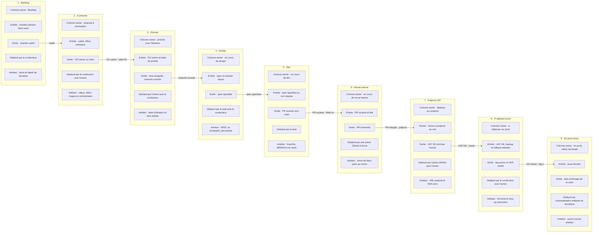
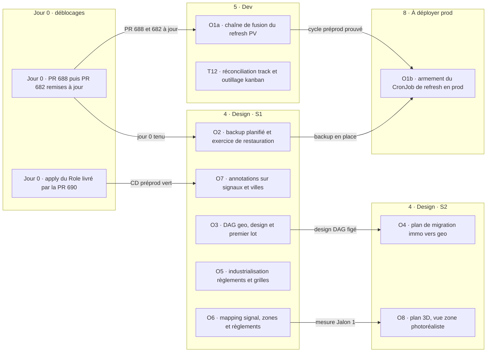

# Dossier de décision — Kanban GitHub (way of working) + contenu de l'itération de 15 jours (bascule prod)

Date : 2026-09-14 · Présentateur : Claude Fable 5.1 (délégué par l'owner, conducteur i-cond) · Statut : **PRÉPARATION — rien n'a été créé sur GitHub, rien n'est commité**. Relu par une passe indépendante (Opus, annexe A) ; passe Codex `N-A` (hors quota jusqu'au 20/09).

Convention : `[FAIT]` = mesuré, avec sa source (commande, fichier, PR, item track). `[JUGEMENT]` = appréciation du présentateur. `N-A` = non disponible. `source-gap` = aucune source dans le dépôt ou le journal. `non-vérifié` = affirmé par un document, non re-mesuré ici.

Sources lues : `track 0.94.3` (`report --wp --decisions`, `report --raw`, `query --bucket TO-DO|DONE|AWAITED|DROPPED`, `decision ls --outcome pending`, `item show`) ; `docs/spec/SPEC_RAW_USER_REVIEW_2026-08-12.md` (8b85003) ; `docs/spec/PLAN_USER_REVIEW_2026-08-12.md` ; `docs/spec/reports/plan-user-review-2026-08-13/CONVERGENCE.md` ; `docs/reports/rapport-mois-2026-08-12_2026-09-10.md` ; `docs/PLAN_PIPELINE_DONNEES_PREPROD.md` ; `docs/spec/reports/DRAFT_CIRCUIT_RB_PREPROD_PROD_2026-09-06.md` ; `docs/spec/reports/DOSSIER_DECISION_PATCH_CIRCUIT_2026-08-16.md` ; `.remote/BILAN_11_AXES.md`, `DECISION_M1_V2.md`, `LANE_T1_V9_RUNS.md`, `RAPPORT_V11_ANNEXES.md`, `K8S_RESERVATIONS_R2-15.md`, `LANE_682_REBASE.md`, `REFRESH_PROD_CRON_BRIEF.md` ; `gh pr list/view`, `gh issue list`, `gh variable list`, `gh label list`, `gh auth status`, `gh project list`, `gh api graphql` (introspection) ; `git` sur radar-immobilier, poc-k8s, geo ; `npm view` ; manuels `gh project` et automatisations intégrées de GitHub Projects (docs.github.com).

**Avertissement de mesure** `[FAIT]` : le journal track a été écrit par une autre session pendant la rédaction (909 → 951 événements ; `head.json streamLength=951`). Les chiffres track ci-dessous sont ceux de la **révision 951** (`sha256:0d472947…`), re-mesurés en fin de session. Les nouveaux items apparus entre les deux lectures sont pris en compte (§3.3, §3.4).

---

## 1. Décision demandée

Deux questions distinctes :

**Q1 — Way of working.** Adopter un projet GitHub Projects en Kanban à 8 colonnes (liste owner) au-dessus de track, avec les règles d'entrée/sortie, de WIP et d'automatisation de §2. Options : **A** (8 colonnes owner + valeur terminale, 2 automatisations intégrées, 1 action GitHub à écrire, déplacement scripté par le conducteur) · **B** (6 colonnes, phases en labels) · **C** (track seul + rapport hebdomadaire) · **D** (board généré en lecture seule depuis track — cible, pas disponible aujourd'hui).

**Q2 — Contenu de l'itération (15 jours, objectif : bascule prod).** Retenir, parmi les 45 candidats de §3, la sélection recommandée en §4 (liste cochable en §7).

Hors décision : le circuit release-branch (draft du 6 septembre, non ratifié) ; la réponse au dossier M1 v2 (A/B/C/D) qui reste due séparément ; les décisions internes à geo.

---

## 2. Way of working Kanban

### 2.1 Contexte mesuré

- `[FAIT]` Le dépôt `rhanka/radar-immobilier` compte **2 issues** au total, toutes deux ouvertes (`gh issue list --state all --limit 200 --json number --jq length` → `2` : #663 « Prod scrape OOM on heavy cities », #660 « CD migrate/backup: deferred fast-follow nits »). Le suivi vit dans track et les PR. Le kanban part d'une surface vide.
- `[FAIT]` **44 PR ouvertes, dont 8 brouillons** en fin de session (`gh pr list --state open --limit 100 --json isDraft`) ; 43/10 en début de session : la file bouge d'heure en heure. 11 étiquettes, toutes par défaut (`gh label list`) : aucune P1/P2/P3, aucune étiquette de domaine.
- `[FAIT]` Le jeton `gh` n'a pas le scope `project` : `gh project list --owner rhanka` → `error: your authentication token is missing required scopes [read:project]` ; scopes présents `gist, read:org, repo, workflow, write:packages` (`gh auth status`). Toute création exige `gh auth refresh -s project` (manuel `gh project` : « the minimum required scope for the token is: project »).
- `[FAIT]` track (révision 951) : **96/232 (41 %)**, 3 abandonnés ; buckets TO-DO 128, DONE 96, AWAITED 8, DROPPED 3 ; aucune décision `pending` (`decision ls --outcome pending` → `[]`). Contrôle du skill : 96 + 128 + 8 + 3 = 235 = 96 + (232 − 96) + 3 = 235 ✓.
- `[FAIT]` Parmi les 128 TO-DO : des **faits datés** enregistrés comme items (`§6 refresh r3 : … 0 upsert PG`, `§5 GO#2 APPROUVÉ …`, `Règle owner (mémorisée) : …` ; handles 11.21–11.39 du rapport) ; 7 items « Steve meeting: … » importés de la chaîne `origin/main` (`a132d4a`) qui doublonnent les §1–§9 ; 6 items « Dette : … » et 1 item « T1 Refresh PV→Signaux » créés le 2026-09-14 par i-cond. `[JUGEMENT]` Une issue = un chantier ; les faits datés et les doublons ne montent pas sur le board.
- `[FAIT]` Capacités `gh project` (manuel) : `create`, `link`, `field-create` (`TEXT|SINGLE_SELECT|DATE|NUMBER`, `--single-select-options "a,b,c"`), `field-list`, `item-add --url`, `item-edit --id … --project-id … --field-id … --single-select-option-id …`, `item-list`, `view`. Pas de création de vues par CLI dans le manuel.
- `[FAIT]` Schéma GraphQL (introspection `gh api graphql`, jeton courant) : la mutation `updateProjectV2Field` existe ; `UpdateProjectV2FieldInput { fieldId!, name, singleSelectOptions:[…], multiSelectOptions, iterationConfiguration }` ; `ProjectV2SingleSelectFieldOptionInput { id, name!, color!, description! }`. Le jeu d'options passé **remplace** l'existant (`id` permet de conserver une option). Exécution non testée (scope absent).
- `[FAIT]` Automatisations intégrées (docs « using the built-in automations ») : *item ajouté → Status X* ; *PR fusionnée → Status X* ; *issue/PR fermée → Status X* ; *auto-ajout* par filtre (`is:issue`, `label:…`, `-label:…` ; **1 workflow d'auto-ajout par projet sur GitHub Free**, 5 sur Pro/Team) ; *auto-archivage*. UI seulement ; champ `Status` seulement. **« PR fusionnée » agit sur la carte de la PR, pas sur l'issue liée** : sur un board composé d'issues, elle ne déplace rien (point 1 de la relecture, retenu).
- `[FAIT]` Mots-clés de fermeture : `Closes #n` et `Fixes octo-org/octo-repo#100` (inter-dépôts) ferment l'issue **à la fusion de la PR** (docs « using keywords »). Dans le flux proposé l'issue ne doit pas se fermer à la fusion (UAT et prod suivent) : les PR référencent l'issue par `Refs #n`, jamais par `Closes`.
- `[FAIT]` Préprod : `deploy-preprod` sur `origin/main` (`PREPROD_CD_ENABLED=true`) : backup pré-release fail-closed → migration → reconcile ciblé → `set image`. **CD préprod rouge depuis le 13/09**, en attente de l'apply du Role livré par #690 sur GO owner (item `01M2GY9QTN…`, corps). Prod : tag `v*` → job `promote-prod`, `environment: production`, garde d'ancêtre. Dernier tag `v1.2.6` → `7d85ec07` (2026-09-11).
- `[FAIT]` Verbes harness : `branch init|close`, `brainstorm`, `plan`, `test`, `review [--consensus]`, `verify --category static|unit|integration|e2e|ci|uat`, `check scope|branch` (`harness --help`).

### 2.2 Les 8 colonnes owner + 1 valeur terminale — règles proposées `[JUGEMENT]`

| # | Colonne | Critère d'entrée | Critère de sortie | Qui déplace | Artefact attendu | Lien track | Lien harness |
|---|---|---|---|---|---|---|---|
| 1 | **Backlog** | Chantier présent dans track (`TO-DO`/`AWAITED`) ou demande owner/Steve. Corps : `track:<id>`. | Chantier cadré (titre, valeur en une ligne, effort ou `N-A`). | Conducteur | Issue + labels domaine + `track:<id>` | `item new` si absent | — |
| 2 | **Proposé à priorisation** | Cadré + effort + prérequis. | Owner coche (« GO itération ») ou refuse. | Conducteur (entrée) · **Owner** (sortie) | Commentaire : valeur, effort, prérequis, risque | `priority assess` facultatif | — |
| 3 | **Priorisé pour l'itération** | GO owner ; label `P1/P2/P3` posé par l'owner. | Lane assignée, branche ouverte. | Owner (entrée) · Conducteur (sortie) | Label `iteration:2026-09-15` | `item realize in-progress` | `harness branch init <slug>` |
| 4 | **En cours de design** | Spec ou dossier requis (`specStatus: to-specify` ou déclencheur dur present-decision). | Spec `specified` ; dossier tranché si nécessaire. | Lane (entrée) · Conducteur (sortie) | `docs/spec/SPEC_*.md` / `DOSSIER_DECISION_*.md` | `item spec <id> specified` ; `decision new/select` | `harness brainstorm`, `harness plan` |
| 5 | **En cours de dev** | Spec `specified` ou non requise. | PR ouverte vers `main`, CI verte, `Refs #n`. | Lane | Branche + BRANCH.md + tests | `accept criterion/link` | `harness test`, `harness verify --category static\|unit` |
| 6 | **En cours de revue interne** | PR ouverte et liée (`Refs #n`). | PR fusionnée (merge commit). | Action GitHub à écrire (§2.3) ; repli conducteur | PR + revue ≥ 2 pairs si consensus | `accept run --result pass --commit <sha>` | `harness review --consensus`, `verify --category ci` |
| 7 | **Déployé sur preprod (UAT)** | Fusion **et** run `deploy-preprod` vert (SHA servi). | Owner écrit « UAT OK » (« UAT KO » → retour en 5). | Action GitHub à écrire ; repli conducteur · **Owner** (sortie) | Preuve de rendu préprod (URL, SHA servi) | `accept run --result pass --env preprod` | `harness verify --category uat` |
| 8 | **À déployer sur prod** | UAT OK ; backup et rollback attestés pour la vague. | Tag `v*` promu (`environment: production`), SHA servi vérifié → **issue fermée**. | Conducteur (entrée) · **Owner** (approbation `production`) | GO prod + receipt `promote-prod` | `item realize done` + `consolidate --commit <merge>` | `harness branch close` |
| 9 | **En prod (clos)** — valeur terminale obligatoire | Issue fermée. | Auto-archivage. | Automatisation intégrée « fermée → En prod (clos) » | — | — | — |

`[FAIT]` La 9ᵉ valeur n'est pas un choix : l'automatisation « fermée → Status » a besoin d'une option cible, et la mutation d'options remplace le jeu complet (point 2 de la relecture, retenu).

### 2.3 Règles

**Niveau d'abstraction.** Une issue = un chantier ou une feature au sens owner. Lots, lanes, campagnes, incidents restent dans track et les PR. Une issue peut être servie par plusieurs PR (`Refs #n`). Les §1–§9 Steve sont des **parents** track ; seuls les chantiers de l'itération deviennent des issues. Les issues geo-owned se créent dans `rhanka/geo`, celles de poc-k8s dans `rhanka/poc-k8s` ; le projet (niveau utilisateur) les agrège.

**WIP maximal** (révisé après relecture, point 4) :

| Colonne | WIP max | Statut de la borne |
|---|---|---|
| Priorisé pour l'itération | = taille validée par l'owner en §7 (9 recommandés) | `[FAIT : décision owner]` |
| En cours de design | 3 | `[JUGEMENT]` : chaque dossier exige une double revue (`SPEC_RAW` §10.2–10.3) ; §4.2 échelonne les 5 designs en conséquence |
| En cours de dev | 4 | `[FAIT]` « Maximum quatre branches actives par vague » (`PLAN_USER_REVIEW_2026-08-12.md` §1.6) |
| En cours de revue interne | 4 | `[JUGEMENT] non sourcé` : même borne que dev, par capacité de relecture |
| Déployé sur preprod (UAT) | 3 | `[JUGEMENT]` inspiré d'un draft non ratifié (préprod unique, `DRAFT_CIRCUIT_RB` addendum) |
| À déployer sur prod | 2 | `[JUGEMENT]` inspiré du même draft (§9.3 « une vague à la fois ») |

**Étiquettes** (aucune n'existe) : `P1`, `P2`, `P3` · `Data`, `Infra`, `App`, `Geo` · `effort:1h|2h|3h|N-A` · `iteration:2026-09-15` · `kanban` (auto-ajout ; **à créer dans les 3 dépôts**) · `cross-repo:geo`, `cross-repo:poc-k8s`. Les champs de projet (`Priorité`, `Domaine`, `Effort (h)`, `Track`) doublent les labels pour le tri.

**Automatisations réalisables et ce qui reste manuel** (corrigé) :

| Transition | Mécanisme | Statut |
|---|---|---|
| Issue créée avec label `kanban` → Backlog | Auto-ajout `is:issue label:kanban` (1 seul workflow sur Free : le filtre doit couvrir les 3 dépôts ou le plan doit être Pro) + « item ajouté → Backlog » | Intégré, UI |
| Issue fermée → En prod (clos) → archivée | « fermée → Status » + auto-archivage | Intégré, UI |
| PR ouverte `Refs #n` → issue en « Revue interne » ; PR fusionnée → issue en « Déployé sur preprod » | **Action GitHub à écrire** (`pull_request: opened|closed(merged)`, lit `Refs #n`, appelle `updateProjectV2ItemFieldValue` avec un secret `PROJECT_TOKEN` de scope `project` ; `[JUGEMENT] non-vérifié` : le `GITHUB_TOKEN` d'un dépôt n'atteint pas un projet utilisateur) | À écrire (T12) ; repli conducteur |
| Backlog → Proposé → Priorisé → Design → Dev | Script `make kanban-move ISSUE=<n> STATUS=<colonne>` enveloppant `gh project item-edit`, appelé par le conducteur dans `harness branch init/close` | Manuel scripté |
| UAT OK → À déployer ; GO prod | Owner (commentaire + approbation `production`) | Manuel, voulu |

`[FAIT]` Bilan : A ne dispose que de **2** automatisations intégrées utiles (ajout, fermeture) ; les transitions 6 et 7 dépendent d'une action à écrire. Variante possible : ajouter aussi les PR au board (`is:pr label:kanban`) pour bénéficier de « PR fusionnée → Status » sur les cartes PR ; coût : 44 PR ouvertes aujourd'hui, bruit `[JUGEMENT]`.

**Cadence** `[JUGEMENT]` : synchronisation track ↔ board par le conducteur à chaque verbe harness ; point hebdomadaire owner sur les colonnes 2, 7 et 8.

### 2.4 Options et coût

| id | Choix | Pour | Contre | Coût |
|---|---|---|---|---|
| **A** | 8 colonnes owner + « En prod (clos) », champs/labels, 2 automatisations intégrées, 1 action à écrire, `kanban-move` scripté | Correspond à la demande ; les deux points de décision owner (2→3, 7→8) sont des colonnes ; une fois scripté, un déplacement = un appel `gh` (même coût qu'un label) | 4 colonnes intermédiaires ne bougent que par le script ; si la discipline lâche, le board ment ; avec 9 cartes et WIP 3/4/4, ces colonnes contiennent souvent 0–2 cartes (relecture, point 5) | Création : ~35 commandes `gh` (§5) + 15 min UI ; tenue ~1 h/semaine `[JUGEMENT]` |
| **B** | 6 colonnes : Backlog · Priorisé · En cours (labels `phase:design|dev|revue`) · Préprod UAT · À déployer prod · En prod (clos) | Moins de colonnes vides ; la phase est un label posé par la lane elle-même | Moins lisible « où ça bloque » ; les labels vieillissent autant que les colonnes | Idem A ; tenue ~30 min/semaine `[JUGEMENT]` |
| **C** | Pas de projet : `track report` hebdomadaire (fonctionne aujourd'hui : 96/232, 951 événements) ; la « main » owner existe déjà via revue de PR et approbation `production` | Zéro double saisie ; track reste la seule vérité | Pas de surface de **priorisation** owner (colonne 2) ni de vue d'itération ; ne répond pas à la demande de visibilité GitHub | Nul |
| **D** | Board GitHub **généré** en lecture seule depuis track par le script de synchronisation (T12) : track porte l'état, le board l'affiche | Aucune colonne qui ment ; une seule saisie | track n'a pas aujourd'hui les notions « priorisé pour l'itération », « préprod UAT », « à déployer prod » (buckets TO-DO/AWAITED/DONE, `realization`, `specStatus`, `acceptance`) : il faut étendre track (item `WP6.3 Kanban UI / projection PG`, `to-specify`) | Développement track + script ; > 15 jours `[JUGEMENT]` |

`[JUGEMENT]` Recommandation Q1 : **A, conditionnelle** — A si T12 (script `kanban-move` branché sur `harness branch init/close`) fait partie de l'itération ; sinon **B**. D est la cible après T12. Clause de repli : si au point hebdomadaire plus de 3 cartes sont dans une colonne qui ne reflète pas l'état réel, passer à B sans re-décision. **Dissent de la relecture (annexe A) : recommande B ou D d'emblée.**

---

## 3. Backlog candidat pour l'itération

Légende « état » : abouti / partiel / non abouti, preuve. Effort : heures owner si fournies, sinon `N-A`. Valeur bascule prod : `[JUGEMENT]`.

### 3.1 Propositions owner (8)

| id | Source | Description | État actuel (preuve) | Effort | Prérequis | Valeur bascule prod |
|---|---|---|---|---|---|---|
| **O1** | Owner P1 Data | Finaliser l'automatisation du refresh PV/signaux ; benchmark des modèles pour stabiliser la qualité | **Partiel.** `[FAIT]` Item track `T1 Refresh PV→Signaux — remise en marche` (`01M2GY9QTN1PJBH6X6NW94601G`, in-progress, `specified`) : #689 (llm-mesh 0.19.2), #687 (JSON strict + citations), #690 (RBAC PVC) **fusionnées le 14/09** ; #688 (contrat v9) ouverte, revue APPROVE-WITH-NITS, `mergeStateStatus=BEHIND` ; #682 (CronJob `radar-refresh-pv` prod) **brouillon, BEHIND**, garde « Draft until the T2 MinIO/SCW transition is merged » **levée** depuis #683/#685 (13/09). Benchmark : Gemini 3.8 Flash LOW sous contrat v9 = **5/5 sur deux runs** (v14, v15), **v16 = 3/5 (erreurs de page)** ; Sonnet 4.6 = 4/5 sous v8, 4,0× plus lent ; juges aveugles : égalité (corps de l'item ; `LANE_T1_V9_RUNS.md`). Rappel macro 0,547 : l'acceptation ne mesure pas la couverture (`LANE_T1_V9_RUNS.md` §5.1). Prod : aucun CronJob de refresh armé (`rapport-mois` §4 ; aucune variable `REFRESH_CRONJOB_PROD_*`). **CD préprod rouge depuis le 13/09** (apply du Role #690 attendu sur GO owner). #678 (ingestion layout CAS, brouillon) : « le refresh de production ne produisait aucun signal frais ». Issue #663 : OOM scrape prod. #636 (netpol scrape→postgres, brouillon). | 1 h | Réponse M1 v2 (A/B/C/D) ; apply Role #690 (GO owner) ; #688 puis #682 remises à jour sur `main` (merge commit) ; identités de stockage prod dédiées (`verify-render-prod` de #682) | **Très haute** |
| **O2** | Owner P1 Infra | Backup prod et PRA | **Non abouti (tracké, sous hold).** `[FAIT]` Item `01M2F4TCT2Q3TJW8NYCEWVTHY0` (TO-DO, `to-specify`) : daily 7 j / weekly 1 mois / monthly 6 mois ; S3 OVH + Postgres (radar prod/préprod, geo, sentropic, openerp) ; « NE PAS LANCER avant clôture des 4 chantiers » = **refresh PV→Signaux, MinIO/SCW, cluster r2-15, rapport** (corps). Trois sont clos : SCW (#683/#685, 13/09), r2-15 (`e8e2d0b`, 14/09), rapport (#691, 14/09) ; le quatrième **est O1**. Doublon `01M2F4S34R8KCRXCSX339V6TBB` `cancelled`. Existant : backup **pré-release** fail-closed (`deploy/ci/run-db-backup.sh`, `BACKUP_RETAIN_COUNT=14`, préprod et prod armés) qui écrit dans `BACKUP_S3_BUCKET=sentropic-pgbackup-preprod` **y compris pour la prod** (`gh variable list`) ; rollback image (`rollback.yml`) ; #515 (dump prod chiffré → OVH-S3) et #516 (restore verify→scratch→swap) ouvertes. Cluster sur **un seul nœud `r2-15`** depuis le 14/09 (`K8S_RESERVATIONS` §1). | 3 h | Définition owner de « chantier refresh clos » (§7) ; poc-k8s pour le versioning S3 ; la partie Postgres (CronJob dans les manifests immo, gabarit `db-backup-job.tmpl.yaml`) ne dépend pas de la branche infra | **Très haute** |
| **O3** | Owner P1 Data | DAG geo : finaliser design et build | **Design décidé, build non commencé.** `[FAIT]` geo : décision `01M0JAMM5YWV1ZH8D6R47RA9A8` → Option B « strangulation incrémentale par voies », 8 DAG ; `01M0N9Z2DHP65ZQ2DR2G18500X` → lib custom `@sentropic/s3-dag`, Argo en repli (`geo/docs/spec/SPEC_PIPELINES_MIGRATION.md` ; `MIGRATION_D1_SYNTHESIS.md`). « Sur `origin/main`, aucun moteur DAG n'est déclaré » (`MIGRATION_PLAN_PASS_SOL.md` l.10). Aucun paquet `s3-dag` dans `sentropic/packages`. | 2 h | LLM in-cluster (`01M197X0076A87ZS8KEVT426VF`, AWAITED, accountable geo) pour les nœuds LLM | Moyenne à 15 j ; haute à terme |
| **O4** | Owner P2 Data | Plan de migration immo → geo (scraping PV côté geo, conf immo pour la détection) | **Non abouti.** `[FAIT]` `Jalon 2` (`01M18979R5ZJQQXNTB218H19ZY`, TO-DO) ; geo : « geo est le moteur et le seul écrivain ; immo ne fournit qu'une configuration ». Prérequis dur `Jalon 1` (`01M189A10EH828F6X580480T36`) : recall 92,9 %, plafond 95,3 %, ground-truth 5/167. | 2 h | Jalon 1 ; O3 | Faible à 15 j (plan) |
| **O5** | Owner P2 Data | Industrialisation du scraping règlements / grilles | **Partiel.** `[FAIT]` `§3 fiabilité règlement` (`01M1A7Y3M32VWHD07G00BXJCS8`, TO-DO) : (b) vraies sources projet/règlement avec geo, (c) grilles servies ; `Structure documentaire des règlements` (`01M0SRPNZSBKWDPK1P7ZHQ3C3A`) : dossier de décision préalable exigé. « ~235/1 106 villes sans zonage geo publié » (`RAPPORT_V8_TEXTES.md` l.87). geo #381 (acquisition normes) fusionnée 13/09. | 2 h | Dossier structure documentaire ; geo | Moyenne |
| **O6** | Owner P2 Data | Industrialisation du mapping signal / zones + règlements | **Partiel.** `[FAIT]` `WP3.2 Niveau 2` (`01KW7HWBVFG5AYV7T0X7GWDQQZ`, in-progress) ; `WP3.3 Niveau 3` (`01KW7HWC05G2DX55M6D5STKP07`, TO-DO) ; `Engagement #13a` gaté recall ≥ 95 %. Décision « Légende Zonage » livrée (v1.2.4/v1.2.5) mais `deferred` au journal (`BILAN` §5). | 2 h | Mesure Jalon 1 (incluse dans le lot 1 de O6) ; O5 | Moyenne |
| **O7** | Owner P2 App | Annotation signaux / villes | **Partiel.** `[FAIT]` Notes lots/signaux en prod v1.2.0 (#576, #581, #584 ; `rapport-mois` §2). `PLAN_PIPELINE` §2 : §2 « Complet et live » ; `BILAN` §2 : « paniers, archive, partage non prouvés » ; track §2 `to-do`. Cibles annotables réelles aujourd'hui : **non-vérifié**. | 3 h | Mesure de l'existant ; UAT Steve en préprod (CD préprod à remettre au vert) | Moyenne |
| **O8** | Owner P3 Geo | Plan 3D | **Non abouti (plan).** `[FAIT]` §5 in-progress ; satellite 2D en prod (v1.2.2) ; 3D non livrée (`BILAN` §5) ; décisions 3D ratifiées le 2026-08-15. | 1 h | geo | Faible à 15 j |

Somme des heures owner : 1 + 3 + 2 + 2 + 2 + 2 + 3 + 1 = **16 h** `[FAIT : proposition owner]`.

### 3.2 Priorités du 12 août non abouties (8)

Source : `SPEC_RAW_USER_REVIEW_2026-08-12.md` (`8b850037`), inscrites dans track le 2026-08-16 (`3c2e9afe`, 9 items §1–§9). État : `.remote/BILAN_11_AXES.md` (validé 2026-09-11), `rapport-mois`, `PLAN_PIPELINE` §2.

| id | Priorité 12 août | État (preuve) | Effort | Valeur bascule prod |
|---|---|---|---|---|
| **A1** | §1 Sûreté release & pré-production | **Partiel.** Préprod-first + tag→prod (v1.0.0 → v1.2.6), backup pré-release, migrations dans le pipeline (#518, #572, #575, #656, #659) ; track `in-progress`, acceptation `unknown` ; circuit RB non ratifié (`DRAFT_CIRCUIT_RB` §9.2). | N-A | Haute (cadre de la bascule) |
| **A2** | §2 Domaine collaboratif | **Partiel** (= O7) ; chat désactivé (#651). | = O7 | Moyenne |
| **A3** | §3 Right pane | **Partiel.** Recherche et preuve PV↔règlement en prod (v1.1.0–v1.2.0) ; `§3 fiabilité règlement` `to-do` ; recette multi-villes non-vérifiée. | = O5 | Moyenne |
| **A4** | §5 Vue géo 3D | **Partiel** (= O8). | = O8 | Faible |
| **A5** | §6 Fraîcheur / CronJob | **Partiel** (= O1). CronJobs préprod armés le 11/09 ; prod non armée ; nœuds Signal/Zone/Lot/Bylaw servis en prod créés au plus tard le 6 août (`rapport-mois` §4). | = O1 | Très haute |
| **A6** | §7 Règlements/normes Geo→Immo→MCP | **Partiel.** Cycle + MCP en prod v1.2.0 ; couverture par ville non-vérifiée ; ~235/1 106 villes sans zonage geo publié. | = O5 | Moyenne |
| **A7** | §8 KPI (matrice 20 KPI, KPI moyen) | **Contradiction de sources** : `PLAN_PIPELINE` §2 « Complet » vs `BILAN` §8 « aucun merge ne prouve la livraison » ; track `to-do`. → mesurer avant de planifier. | N-A | Faible |
| **A8** | §9 Couches environnementales + couches user | **Partiel.** CPTAQ servi pour 4 municipalités (préprod geo) ; BDZI/GRHQ non servis ; G03 non commencé ; Steve doit prioriser les couches (`rapport-mois` §6). | N-A | Moyenne (Steve), hors bascule |

Abouties, à réconcilier dans track : §4 Saint-Stanislas (v1.1.1, #512, track `to-do`) ; #10 viewer PDF (v1.2.0, track `to-do`). `[FAIT : BILAN §4, #10]`.

### 3.3 Items TO-DO track pertinents (12)

| id | Item track | État (preuve) | Effort | Valeur bascule prod |
|---|---|---|---|---|
| **T1** | Pipeline FULL-AUTO k8s / cluster-mesh (`01M1S25MVCND04YZN76KTVNGAE`) | TO-DO, `to-specify`, WSJF 5,6 (seul item avec priorité évaluée) ; design #634 (brouillon) ; parent naturel de O1/O3. | N-A | Haute à terme |
| **T2** | Stratégie de backup | = O2 | 3 h | — |
| **T3** | Process préprod/prod pour les patchs (`01M0SSSZ9SQ5T2F5BSKR3EG6HR`) | TO-DO ; décisions patch ratifiées 2026-08-16 ; circuit RB « plusieurs jours d'ingénierie coordonnée », non ratifié. | N-A | Haute, > 15 j |
| **T4** | LLM in-cluster (`01M197X0076A87ZS8KEVT426VF`) | AWAITED, accountable geo ; spec #627. | N-A | Prérequis de T1/O3 |
| **T5** | Jalon 1 (`01M189A10EH828F6X580480T36`) | TO-DO ; recall 92,9 %, ground-truth 5/167. | N-A | Prérequis de O4/O6 |
| **T6** | Jalon 2 | = O4 | 2 h | — |
| **T7** | Structure documentaire des règlements | TO-DO ; dossier préalable ; prérequis de O5. | N-A | — |
| **T8** | Cycle de vie règlement avis → adoption (`01M198W98GAA3B9NGRS53PEKGX`) | TO-DO ; cycle déjà en prod v1.2.0 → à réconcilier. | N-A | Faible |
| **T9** | §3 fiabilité règlement | = O5 | 2 h | — |
| **T10/T11** | WP3.2 Niveau 2 · WP3.3 Niveau 3 | = O6 | 2 h | — |
| **T12** | WP6.3 Kanban UI (`01KW7HWE1QFZW7H5W4ZBT71Q4K`) + Recalage Track (`01KW2KS5K2D1Y7KGYF41ZAZGSW`) | TO-DO ; réconciliation demandée par `rapport-mois` §6 et `BILAN` §10 ; 7 doublons « Steve meeting » à fusionner avec §1–§9. | N-A | Indirecte (vérité du board) |

Obsolètes ou à clore `[JUGEMENT]` : `clé IAM read-only SCW` (11.16), `Rollback graphe préprod … OVH graph-preprod` (11.22) — SCW décommissionné ; `L4/L5/L6` S3-first (6.2–6.4) ; faits datés 11.23–11.39.

### 3.4 Dettes T1–T4 (17)

| id | Dette | État (preuve) | Effort | Valeur bascule prod |
|---|---|---|---|---|
| **D1** | Backup / PRA | = O2 | 3 h | Très haute |
| **D2** | `infra/ovh` hors `main` | `[FAIT]` Item `01M2GYBYC03B2ECWDEAAZZQVG5` : « le répertoire infra/ovh n'est pas présent sur main du dépôt poc-k8s ». Mesuré : poc-k8s `feat/ovh-canada-migration` **56 devant / 2 derrière** `origin/main` (dont `e8e2d0b`, consolidation r2-15) ; `chore/ovh-one-node` 61 devant ; working tree sale. | N-A | Haute (PRA reproductible) |
| **D3** | CD préprod « set image » seulement | `[FAIT]` Item `01M2GYBYHGGGXM0J5SF5GM5SNB` : Role/RBAC/CronJob/ConfigMap non appliqués automatiquement ; « CD préprod rouge depuis le 13/09 jusqu'à l'apply du Role livré par #690 ». Nuance : `origin/main` a un reconcile **ciblé** (`build-push-images.yml` l.792, #617). Prod : apply du seul `40-immo-mcp` + `set image`. Trim CPU live non tracé (`K8S_RESERVATIONS` §4.2–4.3, `source-gap`). | N-A | Haute (bloque la colonne 7 aujourd'hui) |
| **D4** | Clé OVH | `[FAIT]` Item `01M2GYBYP4SXP9KX4013AB8JGF` : « la clé API OVH en usage porte les pleins droits ; à remplacer par une clé à moindre privilège ». Distinct des identités de stockage prod exigées par #682 (existence non-vérifiée). | N-A | Moyenne (sécurité) |
| **D5** | llm-mesh 0.19.3 | `[FAIT]` Item `01M2GYBYYV3QH0EPRVWKYSJ9J9` « différée » : périmètre `responseFormat`, `finishReason` sur `generate`, `thoughtsTokenCount` ; « non planifiée ». `origin/main` = 0.19.2 (#689) ; `npm view` → 0.19.2 ; **0.19.3 non publiée**. | N-A | Faible |
| **D6** | graphify 0.18.1 | `[FAIT]` Item `01M2GYBZ3TMAX2HXBTRS00X486` « datée » : parseur de fence exporté, validation JSON par défaut ; « suivi hors dépôt radar-immobilier ». `origin/main` = 0.18.0 ; **0.18.1 non publiée**. | N-A | Faible |
| **D7** | Envoi du rapport | `[FAIT]` Rapport 10 août → 13 septembre fusionné (#691, 14/09). Envoi à Steve : `source-gap`. | N-A | Nulle |
| **D8** | Règlements non exhaustifs | = O5 (~235/1 106 villes). | 2 h | Moyenne |
| **D9** | Oracle / juges | `[FAIT]` Juge A v13 en attente ; aucun juge v14 ; Sonnet non rejoué sous v9 ; 4 unités d'oracle inappariables ; conflit v9 ↔ oracle sur Saint-Étienne (`LANE_T1_V9_RUNS.md` §5) ; v16 = 3/5. | N-A | Moyenne (confiance O1) |
| **D10** | Quota Codex | `[FAIT]` Hors quota jusqu'au 20/09 (item T1 ; `DECISION_M1_V2.md` §5). | N-A | Contrainte |
| **D11** | #688 / #682 `BEHIND` | `[FAIT]` `gh pr view` ; #682 remise à jour par merge commit `7dc91350` le 14/09 puis de nouveau en retard. | N-A | Haute (O1) |
| **D12** | #678 ingestion layout CAS (brouillon) | « aucun signal frais » en prod (corps PR). | N-A | Haute (O1) |
| **D13** | Issue #663 OOM scrape prod | Ouverte 2026-09-10. | N-A | Haute (O1) |
| **D14** | #636 netpol scrape → postgres (brouillon) | « moitié manquante de #629 ». | N-A | Haute (O1 préprod) |
| **D15** | Track ↔ Git non réconciliés | §4, #10 livrés mais `to-do` ; « Légende Zonage » `deferred` mais livrée ; 7 doublons « Steve meeting ». | N-A | Indirecte |
| **D16** | ESLint non couvert sur `tools/refresh-benchmark/**` | `[FAIT]` Item `01M2GYBYTADV821STN5PDSBR62`. | N-A | Faible |
| **D17** | Bucket de backup unique nommé préprod | `[FAIT]` `BACKUP_S3_BUCKET=sentropic-pgbackup-preprod` avec `BACKUP_BEFORE_RELEASE_PROD_ENABLED=true` : les dumps prod atterrissent dans un bucket nommé préprod (relecture, point 10). | N-A | Haute (O2) |

**Compte** : owner 8 · 12 août 8 · track 12 · dettes 17 = **45 lignes**, recouvrements explicites (O2 = T2 = D1 ; O1 ⊃ A5, D9, D11–D14 ; O5 ⊃ A3, A6, T7, T9, D8 ; O6 ⊃ T10, T11 ; O4 = T6 ; O7 = A2 ; O8 = A4).

---

## 4. Proposition d'itération (15 jours, bascule prod)

### 4.1 Capacité

- `[FAIT]` Heures owner : 16 h (§3.1). Capacité lanes : Codex hors quota jusqu'au 20/09 ; exécuteurs « Opus 5 + Gemini 3.8 » (item T1) ; pas d'autre mesure → `N-A`.
- `[JUGEMENT]` Les 8 propositions = **3 chantiers exécutables** (O1, O2, O7) + **5 livrables de conception** (O3, O4, O5, O6, O8). Seuls O1, O2, O7 peuvent atteindre les colonnes 7–8 en 15 jours.

### 4.2 Sélection recommandée `[JUGEMENT]`

| Ordre | Item | Quand | Colonnes | Sortie attendue à J+15 | Dépendances |
|---|---|---|---|---|---|
| 0 | **Jour 0 — déblocages** (dans O1/T12) | J0–J2 | — | Apply du Role #690 sur GO owner → CD préprod au vert ; `gh pr update-branch 688` puis fusion ; #682 sortie du brouillon et remise à jour par merge commit | GO owner (apply k8s) |
| 1 | **O2 Backup + PRA** | S1 | Design → Dev → Préprod | CronJob de dump Postgres prod + préprod vers S3 OVH, rétention daily 7 / weekly 1 mois / monthly 6 mois ; **bucket prod distinct** (D17) ; exercice de restauration sur préprod (#516) ; versioning S3 à confirmer avec poc-k8s ; runbook nœud unique | Définition owner du hold (§7) ; poc-k8s pour S3 |
| 2a | **O1a Chaîne de fusion refresh** | J0–J5 | Dev → Revue → Préprod | #688, #682, #678, #636 fusionnées ; #663 traité ; cycle préprod prouvé sur les données servies ; réponse M1 | Jour 0 |
| 2b | **O1b Armement prod** | S2 | À déployer prod | CronJob `radar-refresh-pv` armé en prod par tag `v*` après GO owner | O2 en place ; critère de couverture décidé (rappel 0,547) |
| 3 | **O7 Annotation signaux / villes** | S1–S2 | Design court → Dev → Préprod UAT | Mesure des cibles annotables ; extension `signal` + `ville` ; UAT Steve | CD préprod vert |
| 4 | **O3 DAG geo** | S1 | Design | Design finalisé (s3-dag) ; premier lot de build en PR geo | T4 pour les nœuds LLM |
| 5 | **O5 Règlements / grilles** | S1 | Design | Dossier structure documentaire tranché ; lot geo d'acquisition ouvert | geo |
| 6 | **O6 Mapping signal × zones × règlements** | S1→S2 | Design | Lot 1 = relance de la mesure Jalon 1 ; spec Niveau 2/3 | T5 |
| 7 | **O4 Plan migration immo → geo** | S2, après O3 | Design | Plan écrit, pas de code | O3, T5 |
| 8 | **O8 Plan 3D** | S2, après O6 | Design | Plan d'une page | geo |
| 9 | **T12 Réconciliation Track ↔ Git + kanban** | S1 | Dev | Items §4, #10, décision Légende Zonage réconciliés ; doublons « Steve meeting » fusionnés ; obsolètes clos ; board créé ; `kanban-move` + action GitHub | Q1 tranchée |

WIP design = 3 respecté par l'échelonnement (O3, O5, O6 en S1 ; O4 et O8 entrent quand O3/O6 sortent).

**Ce qui sort, et pourquoi** `[JUGEMENT]` : circuit RB / patch (T3 : plusieurs jours, non ratifié) ; LLM in-cluster (T4 : geo, > 15 j) ; Jalon 2 en build (gaté Jalon 1) ; couches BDZI/GRHQ et G03 (A8 : priorisation Steve attendue, hors bascule) ; KPI (A7 : état contradictoire) ; paniers/archive/chat ; 3D en build ; llm-mesh 0.19.3 / graphify 0.18.1 (non publiées, D5/D6 « non planifiée » / « hors dépôt »).

**Sortie possible signalée par la relecture** (point 9, dissent conservé) : O4 et O8 (3 h owner pour deux documents sans lien avec la bascule). Je les garde parce que l'owner les a proposés et qu'ils n'occupent pas les colonnes 5–8 ; à cocher ou non en §7.

**Option si capacité** : A8 (couches environnementales), attendu Steve nommé dans le rapport du mois §6 ; portée geo.

**Somme** : 9 items (O1–O8 + T12), 16 h owner + `N-A` pour T12.

### 4.3 Dépendances vers la bascule prod

```
Jour 0 : apply Role #690 (GO owner) ─► CD préprod vert ─► #688 fusionnée ─► #682 à jour
O2 : CronJob backup + bucket prod distinct + restore drill ──┐
Réponse owner M1 (A/B/C/D) + critère de couverture ─────────┼─► O1b : tag v* ─► GO owner (environment production) ─► CronJob prod armé
O1a : #682/#678/#636 fusionnées + cycle préprod prouvé ──────┘
O7 ─► préprod UAT Steve ─► GO owner ─► même tag v* ou suivant
```

`[JUGEMENT]` La bascule prod de l'itération = **un tag `v*`** portant #688/#682 (+ #678/#636/#663) et O7, promu après backup planifié en place. Circuit actuel (tag/digest de `main`, gate `production`), pas le circuit RB. Le hold de O2 et l'activation prod de O1 sont **circulaires** si « chantier refresh clos » signifie « cron prod armé » ; ils ne le sont pas si cela signifie « cycle préprod prouvé » (relecture, point 3) : c'est la question posée en §7.

---

## 5. Plan de création GitHub — dry-run, **non exécuté**

### 5.1 Prérequis

```bash
# 0. scope projet (interactif, à faire par l'owner ou sur son GO)
gh auth refresh -h github.com -s project,read:project
gh auth status   # attendu : 'project' dans les scopes
```

### 5.2 Projet, champs, colonnes, liens, labels

```bash
OWNER=rhanka
# 1. projet utilisateur (agrège immo + geo + poc-k8s)
gh project create --owner "$OWNER" --title "Radar immobilier — Kanban livraison" --format json
N=<number> ; PVT=<id PVT_…>

# 2. champs (manuel gh project field-create, vérifié)
gh project field-create "$N" --owner "$OWNER" --name "Priorité"   --data-type SINGLE_SELECT --single-select-options "P1,P2,P3"
gh project field-create "$N" --owner "$OWNER" --name "Domaine"    --data-type SINGLE_SELECT --single-select-options "Data,Infra,App,Geo"
gh project field-create "$N" --owner "$OWNER" --name "Effort (h)" --data-type NUMBER
gh project field-create "$N" --owner "$OWNER" --name "Track"      --data-type TEXT
gh project field-list  "$N" --owner "$OWNER" --format json   # → ids, dont le champ Status (PVTSSF_…)

# 3. colonnes = 9 options du champ Status (schéma vérifié par introspection ; exécution non testée)
gh api graphql -f query='
mutation($project:ID!,$field:ID!){
  updateProjectV2Field(input:{projectId:$project, fieldId:$field, singleSelectOptions:[
    {name:"Backlog",color:GRAY,description:"Chantier tracké, non cadré"},
    {name:"Proposé à priorisation",color:BLUE,description:"Cadré : valeur, effort, prérequis"},
    {name:"Priorisé pour l'"'"'itération",color:PURPLE,description:"GO owner"},
    {name:"En cours de design",color:YELLOW,description:"Spec / dossier"},
    {name:"En cours de dev",color:ORANGE,description:"Branche ouverte"},
    {name:"En cours de revue interne",color:PINK,description:"PR ouverte (Refs #n)"},
    {name:"Déployé sur preprod (UAT)",color:GREEN,description:"Fusionné + deploy-preprod vert"},
    {name:"À déployer sur prod",color:RED,description:"UAT OK, attend le tag v*"},
    {name:"En prod (clos)",color:GRAY,description:"Issue fermée à la promotion prod"}
  ]}){ projectV2Field { ... on ProjectV2SingleSelectField { id name options { id name } } } } }' \
  -f project="$PVT" -f field=<Status_field_id>
#    Repli si la mutation est refusée sur le champ intégré : champ « Étape » via field-create (même liste) ;
#    on perd alors les automatisations intégrées, qui n'agissent que sur Status.

# 4. lier les dépôts
for r in radar-immobilier geo poc-k8s; do gh project link "$N" --owner "$OWNER" --repo "rhanka/$r"; done

# 5. labels dans les 3 dépôts (auto-ajout : le label kanban doit exister partout)
for r in radar-immobilier geo poc-k8s; do
  for l in P1:B60205 P2:D93F0B P3:FBCA04 Data:0E8A16 Infra:1D76DB App:5319E7 Geo:006B75 kanban:000000 \
           iteration-2026-09-15:C5DEF5 effort-1h:EDEDED effort-2h:EDEDED effort-3h:EDEDED effort-N-A:EDEDED \
           cross-repo-geo:BFD4F2 cross-repo-poc-k8s:BFD4F2; do
    gh label create "${l%:*}" --repo "rhanka/$r" --color "${l##*:}" --force
  done
done
```

### 5.3 Issues à créer (18) et issues existantes à adopter (2)

Corps type : « **Chantier** · **Track** `<ulid>` · **Source** · **Prérequis** · **Preuve de sortie** · **PR liées** (`Refs`) ». Titres et labels exacts :

| # | Dépôt | Titre | Labels | Track | Statut initial |
|---|---|---|---|---|---|
| I1a | radar-immobilier | Refresh PV → signaux : chaîne de fusion (#688, #682, #678, #636) et cycle préprod prouvé | P1, Data, effort-1h, iteration-2026-09-15, kanban | `01M2GY9QTN1PJBH6X6NW94601G` | Priorisé pour l'itération |
| I1b | radar-immobilier | Refresh PV → signaux : armement du CronJob `radar-refresh-pv` en production | P1, Data, Infra, effort-N-A, iteration-2026-09-15, kanban | `01M062D20KCJ9FBTVCMYFZC9NA` | Priorisé pour l'itération |
| I2 | radar-immobilier | Backup planifié Postgres + S3 (daily 7 j / weekly 1 mois / monthly 6 mois), bucket prod distinct, exercice de restauration (PRA) | P1, Infra, effort-3h, iteration-2026-09-15, kanban, cross-repo-poc-k8s | `01M2F4TCT2Q3TJW8NYCEWVTHY0` | Priorisé pour l'itération |
| I3 | **geo** | DAG geo (`@sentropic/s3-dag`) : design final et premier lot de build | P1, Geo, Data, effort-2h, iteration-2026-09-15, kanban | (geo `01M0JAMM…`, `01M0N9Z2…`) | Priorisé pour l'itération |
| I4 | radar-immobilier | Plan de migration immo → geo (scraping PV côté geo, configuration immo pour la détection) | P2, Data, effort-2h, iteration-2026-09-15, kanban, cross-repo-geo | `01M18979R5ZJQQXNTB218H19ZY` | Priorisé pour l'itération |
| I5 | radar-immobilier | Industrialiser le scraping des règlements et des grilles (vraies sources, grilles servies) | P2, Data, effort-2h, iteration-2026-09-15, kanban, cross-repo-geo | `01M1A7Y3M32VWHD07G00BXJCS8`, `01M0SRPNZSBKWDPK1P7ZHQ3C3A` | Priorisé pour l'itération |
| I6 | radar-immobilier | Industrialiser le mapping signal × zones × règlements (Niveau 2/3) — lot 1 : mesure Jalon 1 | P2, Data, effort-2h, iteration-2026-09-15, kanban | `01KW7HWBVFG5AYV7T0X7GWDQQZ`, `01KW7HWC05G2DX55M6D5STKP07`, `01M189A10EH828F6X580480T36` | Priorisé pour l'itération |
| I7 | radar-immobilier | Annotations sur signaux et villes | P2, App, effort-3h, iteration-2026-09-15, kanban | `01M062D1FQENDZP3M5RVD9A6SV` | Priorisé pour l'itération |
| I8 | **geo** | Plan 3D (vue zone photoréaliste) | P3, Geo, effort-1h, iteration-2026-09-15, kanban | `01M062D1WC6CJVQBA197WMEN62` | Priorisé pour l'itération |
| I9 | radar-immobilier | Réconcilier Track avec Git et outiller le kanban (`kanban-move`, action PR → Status) | P2, App, effort-N-A, iteration-2026-09-15, kanban | `01KW7HWE1QFZW7H5W4ZBT71Q4K`, `01KW2KS5K2D1Y7KGYF41ZAZGSW` | Priorisé pour l'itération |
| B1 | radar-immobilier | Pipeline de rafraîchissement 100 % automatisé sur k8s / cluster-mesh (toutes couches) | P1, Data, Infra, effort-N-A, kanban | `01M1S25MVCND04YZN76KTVNGAE` | Proposé à priorisation |
| B2 | **geo** | LLM in-cluster pour le grounding automatisé (compte mesh dédié) | P1, Geo, Infra, effort-N-A, kanban | `01M197X0076A87ZS8KEVT426VF` | Proposé à priorisation |
| B3 | radar-immobilier | Circuit de promotion prod : patch/hotfix et release branch | P2, Infra, effort-N-A, kanban | `01M0SSSZ9SQ5T2F5BSKR3EG6HR` | Proposé à priorisation |
| B4 | **geo** | Couches environnementales : servir BDZI/GRHQ, élargir CPTAQ, couche utilisateur (G03) | P2, Geo, App, effort-N-A, kanban | `01M062D2D7F196M6EJ10X929NX` | Proposé à priorisation |
| B5 | radar-immobilier | Domaine collaboratif : paniers, archive, partage, réactivation du chat | P3, App, effort-N-A, kanban | `01M062D1FQENDZP3M5RVD9A6SV` | Backlog |
| B6 | radar-immobilier | KPI : matrice 20 KPI × villes et KPI moyen — mesurer l'état puis remédier | P3, App, effort-N-A, kanban | `01M062D290BVPD126NSPTHWREJ` | Backlog |
| B7 | **poc-k8s** | Fusionner `feat/ovh-canada-migration` dans `main` (source de vérité OVH, `infra/ovh`) | P2, Infra, effort-N-A, kanban | `01M2GYBYC03B2ECWDEAAZZQVG5` | Proposé à priorisation |
| B8 | radar-immobilier | Dettes plateforme : reconcile prod complet, trim CPU non tracé, clé API OVH à moindre privilège, llm-mesh 0.19.3, graphify 0.18.1, ESLint benchmark | P2, Infra, effort-N-A, kanban | `01M2GYBYHGG…`, `01M2GYBYP4S…`, `01M2GYBYYV3…`, `01M2GYBZ3TM…`, `01M2GYBYTAD…` | Backlog |
| — | adopter **#663** (OOM scrape prod) | label `kanban`, `P1`, `Data` ; enfant de I1a | — | Priorisé pour l'itération |
| — | adopter **#660** (nits CD migrate/backup) | label `kanban`, `P3`, `Infra` | — | Backlog |

Variante réduite proposée par la relecture (point 9) : **12 cartes** = I1a, I1b, I2–I9 + #663 + #660, le backlog restant dans track jusqu'à promotion. Choix en §7 (Q3).

```bash
# 6. création (exemple I2) ; répéter par ligne, dans le dépôt indiqué
gh issue create --repo rhanka/radar-immobilier \
  --title "Backup planifié Postgres + S3 (daily 7 j / weekly 1 mois / monthly 6 mois), bucket prod distinct, exercice de restauration (PRA)" \
  --label "P1,Infra,effort-3h,iteration-2026-09-15,kanban,cross-repo-poc-k8s" \
  --body-file /tmp/kanban/I2.md
gh issue edit 663 --repo rhanka/radar-immobilier --add-label "kanban,P1,Data"
# 7. ajout au projet et positionnement (ids via field-list / item-list)
gh project item-add  "$N" --owner "$OWNER" --url https://github.com/rhanka/radar-immobilier/issues/<n>
gh project item-list "$N" --owner "$OWNER" --format json      # → PVTI_…
gh project item-edit --project-id "$PVT" --id <PVTI> --field-id <Status_id>   --single-select-option-id <id "Priorisé pour l'itération">
gh project item-edit --project-id "$PVT" --id <PVTI> --field-id <Priorité_id> --single-select-option-id <id P1>
gh project item-edit --project-id "$PVT" --id <PVTI> --field-id <Effort_id>   --number 3
gh project item-edit --project-id "$PVT" --id <PVTI> --field-id <Track_id>    --text 01M2F4TCT2Q3TJW8NYCEWVTHY0
```

### 5.4 Étapes manuelles (interface GitHub, une fois)

1. Vue **Board** groupée par `Status` ; vue **Table** triée Priorité puis Effort ; vue **Itération** filtrée `label:iteration-2026-09-15`.
2. Workflows du projet : *auto-add* `is:issue label:kanban` (un seul workflow sur GitHub Free : vérifier le plan du compte `rhanka`, `non-vérifié`) ; *item added → Backlog* ; *item closed → En prod (clos)* ; auto-archivage.
3. Action `.github/workflows/kanban-sync.yml` (T12) : `pull_request: opened` → issue `Refs #n` en « Revue interne » ; `pull_request: closed` avec `merged == true` → « Déployé sur preprod » ; secret `PROJECT_TOKEN` (scope `project`). À écrire, à revoir ; non fournie ici.

Aucune commande n'a été exécutée. Le jeton courant les refuserait (§2.1).

---

## 6. Recommandation, cas contre, renversement, pré-mortem, intérêts

**Recommandation** `[JUGEMENT]` : **Q1 = A conditionnelle** (A si T12 est dans l'itération et fournit `kanban-move` + l'action PR → Status ; sinon B) · **Q2 = 9 items de §4.2** dans cet ordre, avec **jour 0 = remise au vert du CD préprod** et **O2 avant O1b**.

**Le jugement décisif.** Une fois le déplacement scripté, A et B coûtent le même geste par transition (un appel `gh`) ; la différence est ce que l'owner lit. L'owner a demandé les 8 colonnes : A ne coûte rien de plus que B **si** le script existe, et les deux mentent autant s'il n'existe pas. C'est pourquoi T12 est dans l'itération et conditionne A. Pour Q2, la bascule prod ne dépend que de O1 et O2 ; les cinq autres propositions sont de la conception, compatible avec un quota Codex absent jusqu'au 20/09. La version précédente de ce dossier justifiait A par « la revue et la préprod se mettent à jour seules » : c'était faux sur un board d'issues (relecture, point 1) ; l'argument est retiré.

**Cas le plus fort contre la recommandation.**
- Contre A (repris de la relecture, points 5–6) : les trois colonnes qu'A ajoute à B sont exactement celles sans automatisation et celles que le pré-mortem désigne comme les premières à mentir ; avec 9 cartes elles contiennent 0 à 2 cartes ; le dépôt n'a jamais tenu d'issues (2 au total) et track porte déjà 128 TO-DO dont des faits datés, signe que la tenue d'un second registre n'est pas acquise. C fonctionne aujourd'hui et la main owner existe déjà par la revue de PR et l'environnement `production`. D supprime la double saisie.
- Contre la sélection : O1/O2 sont circulaires sous la lecture stricte du hold ; 5 des 9 items sont des plans (« beaucoup de papier, une capacité en prod ») ; O1 porte un risque mesuré (rappel 0,547, v16 = 3/5) qui plaide pour un critère de couverture avant l'armement prod ; O2 et O6/O4 dépendent d'items laissés hors itération (poc-k8s B7, Jalon 1) — atténué en scindant O2 (Postgres d'abord) et en mettant la mesure Jalon 1 dans O6.

**Ce qui renverserait la recommandation.**
- Q1 → B si l'owner ne veut pas de T12 dans l'itération ; → C si l'owner accepte un rapport hebdomadaire à la place du board ; → D après T12 si le script bidirectionnel existe.
- Q2 → retirer O1b (armement prod) si l'owner définit « chantier refresh clos » comme « cron prod armé » et maintient le hold : alors O2 attend O1, et **on n'arme pas un cron prod sur un nœud unique sans backup planifié** ; l'itération se limite à la préprod.
- Q2 → remplacer O4/O8 par A8 si Steve rend sa priorisation des couches pendant l'itération.

**Pré-mortem** `[JUGEMENT]`. Dans un mois, le kanban a échoué parce que : le CD préprod est resté rouge une semaine faute d'apply du Role, et la colonne 7 est restée vide ; les cartes design/dev n'ont plus bougé après S1 (le conducteur a repris ses lanes sans `kanban-move`) ; l'action PR → Status n'a pas été écrite et la colonne 6 a été tenue à la main puis oubliée ; l'itération a fermé avec 5 documents mais sans CronJob prod, O2 ayant attendu la « clôture du chantier refresh » qui attendait O2. Signaux à J+5 : CD préprod toujours rouge ; #688 non fusionnée ; aucune carte déplacée hors automatisation ; O2 sans branche. Parades : jour 0 dédié aux déblocages ; question du hold tranchée en §7 ; `kanban-move` appelé par `harness branch init/close` ; filtre d'auto-ajout limité aux issues.

**Intérêt du présentateur.** Recommander A et neuf items est ce qui colle le plus à la demande telle que formulée : c'est le choix qui m'expose le moins à « tu n'as pas fait ce que j'ai demandé ». Il me pousse à sous-pondérer B et D, que la relecture indépendante préfère. Mettre T12 dans l'itération sert aussi le conducteur (son rapport hebdomadaire en dépend). La relecture n'a pu être demandée qu'à un modèle de la même famille (Codex hors quota) ; elle a néanmoins trouvé deux erreurs factuelles et une circularité, intégrées ici.

**Intérêt de l'owner**, tel que compris : une prod qui se rafraîchit seule sans perdre de données, une surface où il décide vite (priorisation, GO prod), et des plans geo/immo qui ne fabriquent pas une seconde vérité à côté de track.

---

## 7. Ce qu'on demande à l'owner

**Q1 — Way of working (une réponse) :**
- ☐ **A** — 8 colonnes owner + « En prod (clos) », scripté par T12 (recommandé, conditionnel à T12)
- ☐ **B** — 6 colonnes, phases en labels (préféré par la relecture indépendante)
- ☐ **C** — pas de projet GitHub, `track report` hebdomadaire
- ☐ **D** — board généré depuis track (cible après T12, pas disponible sous 15 jours)
- Prérequis à exécuter par l'owner (interactif) : `gh auth refresh -s project,read:project` · plan GitHub du compte `rhanka` (Free = 1 auto-ajout) : ☐ Free ☐ Pro

**Q2 — Itération 2026-09-15 → 2026-09-29 (cocher) :**
- **Hold backup** — « clôture du chantier refresh PV→Signaux » signifie : ☐ cycle préprod prouvé (O2 démarre en S1) · ☐ cron prod armé (O2 après O1b ; alors pas d'armement prod dans l'itération)
- ☐ O2 Backup + PRA (3 h) — inclut le bucket prod distinct (D17)
- ☐ O1a Chaîne de fusion refresh + cycle préprod prouvé (1 h) — réponse M1 v2 : ☐ A ☐ B ☐ C ☐ D
- ☐ O1b Armement prod du CronJob — critère de couverture requis avant : ☐ oui ☐ non
- ☐ Jour 0 : GO owner pour l'apply du Role #690 (CD préprod au vert)
- ☐ O7 Annotation signaux / villes (3 h)
- ☐ O3 DAG geo, design + début de build (2 h)
- ☐ O5 Industrialisation règlements / grilles (2 h)
- ☐ O6 Mapping signal × zones × règlements, lot 1 = mesure Jalon 1 (2 h)
- ☐ O4 Plan de migration immo → geo (2 h) — sortie possible selon la relecture
- ☐ O8 Plan 3D (1 h) — sortie possible selon la relecture
- ☐ T12 Réconciliation Track ↔ Git + `kanban-move` + action PR → Status (N-A) — condition de A
- ☐ Option : A8 Couches environnementales BDZI/GRHQ (geo, N-A)

**Q3 — Création :** ☐ 18 issues + 2 adoptées (backlog visible) · ☐ 12 cartes (itération seule) · ☐ modifier la liste d'abord · ☐ GO pour exécuter §5 après Q1/Q2.

Réponse minimale valide : `Q1 A · hold = préprod prouvé · O2, O1a M1-B, O1b oui, jour 0 GO, O7, O3, O5, O6, O4, O8, T12 · Q3 18+2 GO`.

---

## Annexe A — Relecture indépendante (Opus, 2026-09-14) — verbatim, désaccords conservés

> Mot interdit : `grep -rni "honn"` sur le dossier → **0 occurrence**.
>
> **MESURES** — 2 issues OK · PR : dossier 43/10, re-mesuré 45/8 → DIVERGENCE (re-mesuré en fin de session : 44/8 ; la file bouge) · scopes OK · track : dossier 93/215, 909 ; re-mesuré 96/232, 951, TO-DO 128 → DIVERGENCE (journal écrit pendant la session ; dossier mis à jour à la révision 951) · pending vide OK · #688/#682 OK · llm-mesh 0.19.2 OK · graphify 0.18.0 OK · poc-k8s 56/2/61 OK · item O2 : le corps nomme les 4 chantiers, le dossier ne les citait pas → DIVERGENCE (corrigé) · v1.2.6 OK · variables OK · ids track OK.
>
> **DÉSACCORDS**
> 1. [ERREUR] « PR fusionnée → Déployé sur preprod » agit sur la carte de la PR, pas sur l'issue ; A n'a que 2 automatisations réelles. → **Retenu** (§2.1, §2.3, §2.4, §6).
> 2. [ERREUR] La mutation remplace toutes les options ; il manque `Done`. → **Retenu** : 9ᵉ valeur « En prod (clos) » obligatoire (§2.2, §5.2).
> 3. [ERREUR] Circularité O1↔O2 : 3 des 4 chantiers du hold sont clos, le 4ᵉ est O1. → **Retenu** : question de définition en §7 ; O1 scindé en O1a/O1b.
> 4. [DÉSACCORD] WIP incohérents (design 3 vs 5 designs ; priorisé 10 ≥ 9 ; revue justifiée par des PR ; préprod/prod tirés d'un draft non ratifié). → **Retenu** : bornes re-sourcées ou marquées non sourcées ; designs échelonnés.
> 5. [DÉSACCORD] Le cas pour B est sous-pondéré ; recommander B par défaut, A seulement si `kanban-move` est branché sur `harness branch init/close`. → **Partiellement retenu** : A rendue conditionnelle à T12 ; le dissent « B par défaut » est conservé tel quel.
> 6. [DÉSACCORD] C présenté en homme de paille ; ajouter une option D (board généré depuis track). → **Retenu** : C réécrit, D ajoutée comme cible.
> 7. [DÉSACCORD] O2 dépend de poc-k8s (B7), O4/O6 de Jalon 1, laissés hors itération. → **Partiellement retenu** : O2 scindé (Postgres sans la branche infra), mesure Jalon 1 = lot 1 de O6 ; O4 gardé au choix owner.
> 8. [DÉSACCORD] O1 sous-estimé ; garde de #682 levée ; scinder I1a/I1b. → **Retenu**.
> 9. [MANQUE] Ignorer #663/#660 ; B1–B8 = double saisie ; 11 cartes suffisent ; sortir O4/O8. → **Partiellement retenu** : #663/#660 adoptées ; variante 12 cartes offerte en Q3 ; B1–B8 gardées parce que l'owner demande les issues des demandes track avec un niveau d'abstraction ; O4/O8 signalés comme sortie possible.
> 10. [MANQUE] Cross-dépôt (label `kanban` dans les 3 dépôts, cartes geo dans geo) ; bucket de backup prod nommé préprod. → **Retenu** (§5.2, §5.3, D17, périmètre de I2).
>
> **VERDICT** : **DIVERGE** — réserve principale : l'argument décisif en faveur de A était faux et la sélection Q2 était circulaire sur O1/O2 ; le relecteur recommande **Q1 = B** (ou D) et **Q2 = 4 items** (O1 scindé, O2 Postgres, O7, T12), les 5 livrables de conception restant en « Proposé à priorisation » sans étiquette d'itération.

Position du présentateur après relecture : les erreurs 1–3 sont corrigées ; la recommandation A est maintenue mais rendue conditionnelle à T12, et la recommandation alternative du relecteur (B ; 4 items) est présentée à l'owner sans lissage en §7.

---

## Annexe B — Scènes Focus (sources canoniques)

Deux scènes, deux blocs Mermaid `flowchart LR`. Elles ne changent rien au fond :
elles rendent lisibles §2.2 (colonnes, critères, mains, artefacts, automatisations)
et §4.2–§4.3 (ordre, semaine, dépendances). Chaque nœud est une carte A' 460 × 200
du gabarit ratifié ; chaque `subgraph` est un conteneur natif `parentId`.

### `way-of-working` — Scène 1 · les 8 colonnes owner et « En prod (clos) »



### `iteration-15-jours` — Scène 2 · les neuf items dans leur colonne de départ


