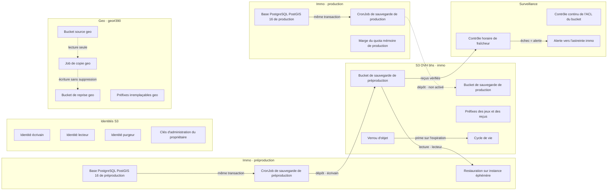

# Dossier de décision — Sauvegardes et PRA d'ensemble immo + geo (PR #712 et rhanka/geo#390, carte #698) — v2

*2026-09-18 · conducteur i-cond · livraison reprise par Astra (PR #712, branche `feat/backup-pra-698`, HEAD `5ee7900c`) · revues contradictoires Fable 5.1 et Gemini 3.8 high · agrément de la lane k8s · co-validation de sécurité i-infra. Remplace le dossier v1 du même jour, qui décrivait la première version de la PR, rejetée.*

## 1. Décision demandée et état réel

Que faire de la PR immo **#712** et de la PR geo conjointe **rhanka/geo#390**, qui forment ensemble le plan de sauvegarde et de reprise d'ensemble (PRA) ?

**Recommandation : corriger avant fusion.** Les deux revues contradictoires de la livraison actuelle concluent, chacune de son côté, **« non fusionnable en l'état »**. Rien n'est fusionné tant que les défauts bloquants de la section 4 ne sont pas corrigés et que la preuve de sauvegarde et de restauration en préproduction n'est pas faite.

**État réel au 2026-09-18 :**

| Élément | État |
|---|---|
| Provisionnement (bucket, identités, secrets) | **gelé**, en attente de la décision D2 sur le verrou d'objet. Seul le bucket de préproduction a été recréé, pour pouvoir porter un verrou. |
| Preuve de sauvegarde et de restauration en préproduction | **pas faite** |
| Mesures geo : volumes, débit de copie, délai de reprise | **pas faites** |
| Coordinateur de cycle joint (gel, inventaire, marqueur commun) | **n'existe pas** : aucun code (réserve R4 de la lane k8s) |
| Fusion #712 et geo#390 | **aucune** |
| Activation d'une sauvegarde planifiée, en préproduction ou en production | **aucune** : aujourd'hui, aucune sauvegarde planifiée de la base radar n'existe |
| Revues contradictoires de la livraison actuelle | Fable 5.1 : non fusionnable, 5 bloquants. Gemini 3.8 high : non fusionnable, 5 bloquants. |
| Agrément de la lane k8s, clés comprises | agréé **sous réserves R1 à R7** ; il autorise le provisionnement de la préproduction et la preuve PostgreSQL, pas la production, ni la fusion, ni l'activation |
| Co-validation de sécurité i-infra | validée, **auto-invalidée**, puis reconduite après re-mesure |

**Tes quatre exigences, et où elles en sont :**

| # | Ton exigence | État |
|---|---|---|
| 1 | Un plan d'ensemble, double PR immo + geo conjointe, immo présente et orchestre | Plan écrit dans #712, volet geo dans geo#390. L'orchestration (coordinateur de cycle) n'est pas livrée, et les deux plans se contredisent sur le gel et sur la copie de `exports/immo/` (constat Fable I13). |
| 2 | Un schéma qui incorpore les deux, bout en bout, avec la séquence de consistance | Scènes 1 et 2 de ce dossier. Seul le chemin PostgreSQL de la séquence est livré. |
| 3 | Activer en même temps la sauvegarde préprod et prod lors de la fusion | Livré dans le workflow `deploy-backup-pra`, mais l'activation simultanée déclenche une alerte d'astreinte immédiate (Gemini 2, Fable I10) et active une image qui n'est pas l'image prouvée (Fable I7). |
| 4 | Démontrer que sauvegarde et restauration préprod fonctionnent AVANT la fusion | **Pas faite.** Bloquée par le gel du provisionnement (D2) et par les défauts B1 à B5. |

**Cinq décisions t'attendent** (section 12) : **D1** le sort des deux PR, **D2** le mode et la durée du verrou d'objet, **D3** le versionnement du bucket `sentropic-geo`, **D4** le nom et la région du bucket de reprise geo, **D5** la détection d'exposition au niveau des objets.

## 2. Ce qui a été livré

**PR immo #712**, entièrement reprise depuis la version rejetée (branche `feat/backup-pra-698`, HEAD `5ee7900c`, trois commits de reprise) :

| Élément | Ce qu'il fait | État |
|---|---|---|
| Provisionnement en une commande | Commande idempotente et gardée (`PRA_PROVISION_GO`, `BACKUP_ENV`, et `PRA_PRODUCTION_GO` pour la prod), jouée par toi avec tes identifiants d'administration, dans ton environnement. Préflight en lecture seule avant toute écriture OVH. Crée le bucket **privé, versionné, avec verrou d'objet**, les **trois identités** et leurs politiques, le cycle de vie ; écrit les secrets dans le cluster par un tube anonyme, sans jamais afficher de valeur ; **se vérifie elle-même** par une sonde. | livré ; 44 tests hors ligne verts ; exécution **gelée** en attente de D2 |
| Trois identités par environnement | Écrivain : dépôt seul, ni lecture ni suppression. Lecteur : lecture seule. Purgeur : seul à supprimer. Trois au lieu de cinq, sur l'avis de sécurité d'i-infra. | livré ; défauts B1, B3, B5 ouverts |
| Dump cohérent | Comptes exacts par table relevés **dans la même transaction** que `pg_dump --snapshot`, inscrits au manifeste. | livré |
| Restauration de vérification | Sur **instance PostgreSQL éphémère**, par socket, sans identifiants vivants, sans PVC source ; valide schéma, cycle, empreintes et tailles avant de démarrer ; compare comptes et extensions au manifeste. Jamais la base de préproduction. | livré ; jamais exécuté en cluster |
| Surveillance | Contrôle horaire de fraîcheur sur les **reçus vérifiés** (échec au-delà de 86 400 s), contrôle continu de l'ACL du bucket, règle d'alerte Prometheus vers l'astreinte immo. | livré ; livraison de l'alerte non prouvée (R3) |
| Planification | Sauvegarde à 02:15 et 14:15 UTC, avant le rafraîchissement de 05:17 ; overlays préprod et prod actifs, appliqués ensemble par le workflow `deploy-backup-pra` sous approbation production. | livré ; non activé |
| Plan d'ensemble | Plan immo + geo réécrit, séquence de consistance, identifiant de cycle commun, ordre de reprise. | document ; coordinateur non livré |

**PR geo conjointe rhanka/geo#390**, document `docs/ops/pra/GEO_PRA_PLAN.md`. Sa contrainte change la conception d'ensemble : **les données irremplaçables de geo sont immuables et adressées par contenu** (`raw/<source>/cas/<sha256>`, grilles en ajout seul), donc une copie est cohérente **sans geler les écritures**. Le gel ne concerne que la base PostgreSQL immo. Irremplaçables aujourd'hui : `sources/qc-zonage-grilles/` (44 objets) ; `raw/` et `capture/_runs/` sont vides (0 objet). Bucket `sentropic-geo` entier : ~48,9 GB, 45 378 objets (relevé du 2026-07-29). Cible proposée : `sentropic-geo-pra`, privée, versionnée, verrou en conformité 1 an roulant. C'est un plan : aucun job de copie n'existe.

## 3. Contraintes de la plateforme OVH, mesurées en direct

| Fait mesuré sur OVH BHS | Ce qu'il coûte |
|---|---|
| **Pas de blocage d'accès public**, **pas de politique de bucket** : l'API répond « non implémenté ». | L'absence d'accès public repose sur l'ACL privée. Un droit public posé à la main n'est pas empêché, seulement **détecté**, avec au plus une heure de retard (R6). |
| L'IAM **refuse les formules « tout sauf »** (`NotAction`, `NotResource`). | Chaque interdit est énuméré verbe par verbe. Un verbe oublié reste hérité du rôle de base (Gemini 6), et rien ne confine une identité hors de son bucket (Fable B5). |
| **`GetObjectVersion` et `DeleteObjectVersion` n'existent pas** dans l'énumération. | Ces deux verbes ne peuvent être ni accordés ni interdits. La purge passe par la suppression de l'objet courant et l'expiration des versions non courantes ; seul le verrou d'objet protège une version (Fable B3). |
| **Aucun rôle en lecture seule.** | La séparation des droits passe par la politique, pas par le rôle : chaque identité porte le rôle large `objectstore_operator`, restreint par des interdits. |
| Un **interdit explicite contient bien le rôle de base**. | C'est ce qui sauve le modèle à trois identités. |
| Le **verrou d'objet existe**, en gouvernance et en conformité, **activable seulement à la création du bucket**. | Le bucket de préproduction a été recréé pour le porter ; celui de production devra être créé avec. |
| Le **verrou prime sur le cycle de vie** : une version verrouillée n'expire pas tant que le verrou court. | Le stockage facturé suit la durée du verrou, pas seulement la rétention voulue (D2). |

**L'épisode de la mesure faussée.** Une première mesure avait conclu que l'IAM d'OVH ne pouvait pas exprimer le modèle de moindre privilège, et la lane k8s avait alerté en conséquence (réserve R7). La mesure était faussée par la **propagation lente des identifiants S3** : les refus observés venaient de clés pas encore actives, pas de la politique. Re-mesurée proprement, la conclusion s'est inversée : un interdit explicite contient le rôle de base, le modèle est exprimable. La leçon : **une mesure non gatée peut conduire à une décision d'architecture erronée**. Ici, elle aurait fait abandonner les trois identités au profit d'une architecture découplée plus lourde. Toute mesure de droits doit attendre la propagation effective de la clé, vérifiée par un appel témoin qui réussit, avant d'interpréter un refus.

## 4. Ce que les revues contradictoires ont trouvé

Deux revues indépendantes de la livraison actuelle (HEAD `5ee7900c`), par les deux familles de modèles qui ne l'ont pas livrée : **Fable 5.1** et **Gemini 3.8 high**. **Verdict des deux : non fusionnable en l'état.** Aucun commit n'a été poussé sur la branche depuis `5ee7900c` : aucun défaut n'est donc corrigé à ce jour. Chaque objection a été re-vérifiée dans le code de HEAD ; celles qui ne tiennent pas sont marquées **contesté**, avec la preuve, et restent listées. Les numéros de ligne cités par la revue Gemini ne correspondent pas à ceux de HEAD : les constats ont été relocalisés dans le code de HEAD.

**Défauts bloquants**

| # | Défaut | Relevé par | État |
|---|---|---|---|
| B1 | **Des reçus forgés permettent au purgeur de détruire de vraies sauvegardes.** L'écrivain signe les reçus `verified/` ; des jeux forgés, datés juste après chaque jeu réel, évincent les réels de la rétention, et le purgeur les supprime. Rejoué hors ligne : 4 jeux réels (16 objets) supprimés en une exécution. | Fable | **ouvert** |
| B2 | **L'écrasement n'est pas empêché ; rien n'est immuable par défaut.** L'écrivain peut déposer une nouvelle version courante de n'importe quel jeu passé ; la rétention par défaut du verrou est optionnelle (`None` si non fournie) ; la restauration ne lit que la version courante. | Fable (B2), Gemini (7) | **ouvert** : la rétention par défaut attend D2 |
| B3 | **La lecture et la suppression de version par l'écrivain ne sont ni testées ni interdites.** La sonde n'essaie `delete_object` et `get_object` que sans identifiant de version ; ces verbes de version n'existent pas dans l'IAM OVH. Si OVH suit la sémantique AWS, seul le verrou empêche l'écrivain de détruire une version. | Fable | **ouvert** ; à mesurer par la sonde |
| B4 | **Le provisionnement ne peut plus se terminer une fois la rétention par défaut posée.** L'objet sonde hérite de la rétention ; son nettoyage final, sans contournement de gouvernance, est refusé, et la commande échoue après avoir créé utilisateurs et clés, avant d'écrire les secrets. En conformité, l'objet sonde est indestructible jusqu'à échéance. | Fable | **ouvert** ; bloque tout choix de D2 exercé de bout en bout |
| B5 | **Aucun confinement hors du bucket.** Le rôle de base porte sur tout le projet OVH ; les interdits ne visent que le bucket de l'environnement. L'écrivain de préproduction a donc plein accès au bucket de production, et réciproquement ; les autres buckets du même projet (`radar-immobilier-docs`, `radar-immobilier-raw`, `sentropic-geo`, hypothèse de même projet) sont exposés. | Fable (B5), Gemini (1) | **ouvert** |
| G2 | **L'activation simultanée en production déclenche une alerte d'astreinte immédiate.** Le contrôle de fraîcheur est actif dès l'application (`suspend: false`, `45 * * * *`) ; sans reçu, l'âge vaut l'infini et le contrôle échoue avant la première sauvegarde de 02:15 ou 14:15. | Gemini (2), Fable (I10) | **ouvert** ; confirmé à HEAD (`43-backup-freshness-cronjob.yaml:7`, `backup.py:288`) |
| G3 | **Pas de `pg_dumpall --globals-only`** : rôles, mots de passe et droits ne sont pas sauvegardés ; la restauration de vérification tourne avec `--no-owner --no-privileges`. Après perte totale du cluster, les données restaurées ne sont pas utilisables telles quelles par l'application. | Gemini (3) | **ouvert**. Le plan prévoit de reconstruire les rôles depuis l'infrastructure versionnée et les mots de passe depuis le coffre, mais aucune procédure exécutable ne le fait. |
| G4 | **Les règles de cycle de vie ne portent pas sur les vrais préfixes de sauvegarde.** Elles expirent `daily/`, `weekly/`, `monthly/`, alors que la sauvegarde écrit sous `postgres/<env>/sets/<cycle>/`. Aucune règle S3 ne borne `sets/` ; la rétention y dépend entièrement du purgeur. | Gemini (4), Fable (I3) | **ouvert** ; confirmé (`backup-provision.py:98`, `backup.py:127`). Le plan présente ces préfixes comme « réservés », mais aucun filet S3 ne couvre `sets/` quand le purgeur ne tourne pas. |
| G5 | **La purge et le contrôle de fraîcheur se bloquent sur un rapport invalide.** Un seul reçu incohérent fait échouer `verified_sets()`, donc la purge et la fraîcheur, en continu. | Gemini (5), Fable (I4) | **ouvert** |
| G13 | **Deux gabarits bloquants restent dans le code**, `PIN-BEFORE-APPLY` et `SELECT-A-COMPLETE-SET` : un déploiement direct échouerait au tirage de l'image. | Gemini (13, classé mineur par Gemini) | **contesté** : ce sont des sentinelles volontaires, fail-close. Le rendu (`deploy/ci/backup-pra.sh:5` et `:11`) refuse une image `PIN-BEFORE*` et substitue le digest ; `backup-pra-render.py:34` remplace `BACKUP_OBJECT` ; un test vérifie qu'aucun `PIN-BEFORE-APPLY` ne subsiste après rendu (`backup-pra.test.py:287`). Ce qui reste vrai : un `kubectl apply` direct des fichiers bruts échouerait, sans rien activer. |

**Autres objections de Gemini, re-vérifiées**

| # | Objection | État |
|---|---|---|
| 6 | Les verbes de verrou (`PutObjectRetention`, `BypassGovernanceRetention`) et `ListBucketVersions` ne sont pas interdits : un écrivain compromis pourrait verrouiller ou contourner une rétention en gouvernance. | **ouvert** ; confirmé : ces verbes sont reconnus (`backup-provision.py:29-35`) mais absents des interdits (`:37-39`). |
| 8 | Restauration sous-dimensionnée (512 Mi, 6 GiB de disque) pour une base de 1 GiB. | **ouvert**, à mesurer : c'est la réserve R2 de la lane k8s. |
| 9 | Identifiant de cycle tiré au hasard dans le pod, sans synchronisation avec geo. | **ouvert** : le coordinateur de cycle n'existe pas (R4). |
| 10 | Plantage `UnboundLocalError` dans la sonde si le premier dépôt échoue. | **contesté** : à HEAD, le dépôt a lieu **avant** le bloc `try` (`backup-provision.py:284-285`) ; un échec lève directement, le `finally` n'est pas atteint. |
| 11 | Le comptage de lignes ne lit pas les colonnes TOAST, ni les contraintes, ni les séquences. | **ouvert** ; le plan le reconnaît : l'égalité des comptes est nécessaire, pas suffisante. |
| 12 | Relire un secret S3 existant provoquerait une rotation silencieuse. | **contesté, non mesuré** : la route `POST …/s3Credentials/{access}/secret` est la route de lecture du secret de l'API OVH v1 ; l'agrément k8s note « récupère le secret S3 existant sans rotation ». À confirmer par une mesure. |

**Défauts importants relevés par Fable** (le détail est en annexe A) : le reçu quotidien prouve que le dump local se restaure, pas l'objet S3 (I1) ; l'horizon réel de rétention est de 20 jours au plus, pas un mois (I2) ; la purge des orphelins ne tourne qu'après un pipeline réussi (I3) ; égalité stricte des versions d'extensions contre des images flottantes (I5, I6) ; **l'image activée n'est pas l'image prouvée** (I7) ; le RBAC de l'activation n'est pas livré (I8) ; le job d'activation demande une approbation production à chaque push sur `main` (I9) ; aucune commande de restauration réelle, durée non mesurée (I11) ; le runbook contredit le code sur des garanties de sécurité (I12) ; **les plans immo et geo se contredisent** sur le gel, sur `exports/immo/` et sur le versionnement (I13) ; quotas partagés non mesurés (I14).

**Ce que ça change** : la reprise a réglé les défauts de la première version (empreinte, admission, comptes estimés, isolation de la restauration), mais la nouvelle version porte l'invariant central, « l'écrivain ne peut ni lire, ni détruire, ni exposer », et les revues montrent trois chemins détournés (B1, B2, B3) et un confinement absent (B5). La recommandation ne peut pas être « fusionner ».

## 5. Agrément de la lane k8s, clés comprises

Exigé par toi : « k8s doit agréer notre plan de sauvegarde et pra incluant les clés et ceci doit être inclus au dossier de décision ». Le texte intégral de la lane est en annexe B.

**Verdict : AGRÉÉ SOUS RÉSERVES.** Portée : il autorise le provisionnement de la préproduction et la preuve PostgreSQL depuis la branche. Il n'autorise **ni** le provisionnement de la production (feu vert owner séparé), **ni** l'activation, **ni** la fusion, qui dépendent de R2, R3 et R4, ni aucune allégation de reprise de service complète.

**Le modèle de clés**

| Clé | Porteur | Où elle vit | Ce qu'elle peut | Ce qu'elle ne peut pas |
|---|---|---|---|---|
| Écrivain S3 (`radar-pra-<env>-writer`) | CronJob de sauvegarde | secret du namespace | déposer sous `postgres/<env>/` | lire, supprimer, poser une ACL publique, suspendre le versionnement (sonde) — mais : reçus forgés (B1), écrasement (B2), versions (B3), autres buckets (B5) |
| Lecteur S3 (`radar-pra-<env>-reader`) | restauration, fraîcheur | secret du namespace | lire les objets et la configuration du bucket | écrire, supprimer |
| Purgeur S3 (`radar-pra-<env>-retainer`) | conteneur de rétention | secret du namespace | lire et supprimer l'objet courant | détruire une version (verbe absent d'OVH) |
| Administration S3 | toi | ton environnement, jamais le cluster | créer et configurer le bucket, contourner la gouvernance | — (R1 : à réduire et rendre éphémère) |
| Jeton d'API OVH | toi | ton environnement, jamais le cluster | créer utilisateurs, politiques et clés S3 | — (R1) |

**Les réserves, une par une**

| Réserve | Objet | État |
|---|---|---|
| R1 | Réduire au moindre privilège et rendre éphémères les deux jetons larges de provisionnement ; jamais d'administration au runtime. | **ouverte** |
| R2 | Mesurer en préproduction le pic réel de la restauration et le non-chevauchement avec le rafraîchissement de 05:17, avant activation. | **ouverte** : rien n'est mesuré |
| R3 | Prouver la livraison de l'alerte, y compris le cas du contrôleur arrêté, avant activation. | **ouverte** |
| R4 | Le coordinateur de gel et l'export geo sont des points d'étape non remplis ; aucun marqueur « PostgreSQL seul » ne doit être présenté comme cycle complet ; le dossier de fusion doit porter la preuve geo appariée. | **ouverte** |
| R5 | Cibles en bhs, résidence québécoise préservée ; la protection immuable hors région est une décision owner avec mesure de coût séparée. | **transformée** en décision D4 |
| R6 | Pas de blocage d'accès public ni de politique de bucket sur OVH BHS : la garantie repose sur l'ACL privée, vérifiée à la création et en continu ; un droit public posé à la main est détecté, pas empêché, avec au plus une heure de retard. | **transformée** : résidu accepté et documenté. Le rectificatif 2 ajoute la preuve que l'écrivain se voit refuser la pose d'une ACL publique ; l'extension au niveau des objets est la décision D5. |
| R7 | La lane avait conclu que l'IAM d'OVH ne pouvait pas exprimer le modèle. | **levée** (caduque) après re-mesure ; l'épisode est conservé (section 3) |

Deux rectificatifs de la lane elle-même figurent dans son texte : les manifestes `41`, `42`, `43` et les overlays existent bien ; et elle a refusé d'élargir seule les droits du lecteur, ce qui a conduit à la solution sans élargissement (D5).

## 6. Co-validation de sécurité i-infra : validée, invalidée, reconduite

Texte intégral en annexe B.

| Étape | Contenu |
|---|---|
| **1. Co-validée sous réserves** | P1 actions par identité au moindre privilège ; P2 « l'écrivain ne peut pas supprimer », en politique et à l'exécution ; P3 cycle de vie, sous réserve (expiration par âge : il faudrait ignorer les alertes 7 jours pour vider le palier quotidien, environ un mois pour tout perdre) ; P4 identité d'administration confinée. |
| **2. Auto-invalidée** | i-infra avait validé la **logique** de la politique sans marquer comme non vérifiée l'hypothèse porteuse : qu'OVH BHS sache exprimer ces formules et que l'interdit écrase le rôle de base. Elle n'avait aucun accès OVH. Elle a daté et invalidé son propre verdict. |
| **3. Reconduite** | Après re-mesure : le verrou d'objet est disponible, un interdit explicite contient le rôle de base. La branche haute de son arbre de décision est atteignable (« verrou disponible → l'utiliser ») ; P1 et P2 sont reconduits, avec le mode et la durée du verrou à trancher (D2). |

La reconduction porte sur les invariants **dans le bucket**. Les chemins détournés relevés ensuite par Fable (B1 reçus forgés, B2 écrasement, B3 versions, B5 autres buckets) sont postérieurs et ne sont couverts par aucune des deux validations.

## 7. La séquence de bout en bout (ton exigence 2)

Un **cycle** est une unité de reprise : un identifiant commun, un environnement, un instant de référence T0. La scène 2 la dessine.

**Sauvegarde, dans l'ordre**

| # | Étape | Qui | Preuve qu'elle a réussi | Existe ? |
|---|---|---|---|---|
| 1 | Allouer l'identifiant de cycle commun et T0 | coordinateur immo | identifiant et T0 inscrits dans chaque manifeste | non |
| 2 | Geler les écritures **côté immo seulement** (API, annotations, rafraîchissements, dépôts d'objets) et drainer | coordinateur immo | inventaire complet des écrivains et accusés de gel | non |
| 3 | Instantané PostgreSQL, comptes exacts et `pg_dump --snapshot` **dans la même transaction** | CronJob de sauvegarde immo | manifeste : comptes, extensions, taille et SHA-256 du dump | **oui** |
| 4 | Copier les objets immo (documents, graphe, trousseau), versions exactes | coordinateur immo | inventaire : clé, version, taille, SHA-256 | non |
| 5 | Copier geo **sans gel**, puisque ses irremplaçables sont immuables | job de copie geo | inventaire réconcilié avec le bucket cible ; SHA-256 = nom de l'objet | non |
| 6 | Vérifier les octets et la fermeture des références PostgreSQL → documents → graphe → geo, puis publier le **marqueur commun en dernier** (`cycles/<env>/<cycle>/complete.json`) | coordinateur immo | marqueur portant les empreintes de tous les manifestes ; aucun marqueur si un composant manque | non |
| 7 | Dégeler et restaurer l'état exact des planificateurs | coordinateur immo | durée du gel et arriéré mesurés | non |

**Restauration, dans l'ordre inverse de la dépendance** (immo dépend de geo, geo ne dépend pas d'immo) :

| # | Étape | Qui | Preuve |
|---|---|---|---|
| 1 | Choisir un cycle **complet** ; à défaut, reprise PostgreSQL seule, sur accord explicite du propriétaire | astreinte immo | marqueur et reçus concordants |
| 2 | Provisionner un environnement vide (namespaces, PostgreSQL 16 + PostGIS 3.4, buckets, secrets du coffre) | lane k8s | environnement prêt, aucun secret tiré de Git |
| 3 | Restaurer les irremplaçables geo, puis re-dériver `normalized/` et `exports/immo/` | lane geo | SHA-256 = nom, invariants géométriques |
| 4 | Restaurer les objets immo du même cycle | lane immo | empreintes et fermeture des références |
| 5 | Restaurer PostgreSQL sur une instance neuve, puis rôles et droits | lane immo | comptes exacts, extensions, index ; rôles applicatifs (non sauvegardés aujourd'hui, G3) |
| 6 | Rouvrir l'API en lecture, puis en écriture | toi, feu vert | annotation existante lue, écriture contrôlée, durée mesurée = RTO réel |

**Ce qui est livré de cette séquence : l'étape 3 seule**, qui garantit son propre instantané cohérent sans gel. Ses manifestes portent `scope: postgres-only` et ne doivent jamais être présentés comme un cycle complet (R4). Point ouvert entre les deux plans (Fable I13) : le plan immo gèle encore geo et exige de copier `exports/immo/` tant que sa reproduction n'est pas démontrée ; le plan geo exclut `exports/immo/` et `normalized/`, réécrits en place, de sa copie. Tant que ce n'est pas tranché, un cycle ne peut pas épingler la version geo consommée par immo à T0.

## 8. Mise en service : la preuve avant la fusion, puis l'activation simultanée (tes exigences 3 et 4)

La scène 3 la dessine. Chaque étape a un acteur, un garde-fou et une preuve de sortie.

| # | Étape | Acteur | Garde-fou | Preuve de sortie |
|---|---|---|---|---|
| 1 | Corriger B1 à B5, G2 à G5 et les verbes de verrou non interdits | lane de reprise immo | revue contradictoire sur les corrections | tests hors ligne verts, revue sans bloquant |
| 2 | Trancher le verrou d'objet | toi | D2 | mode et durée écrits dans la commande |
| 3 | Provisionner la préproduction | toi, commande unique | `PRA_PROVISION_GO`, `BACKUP_ENV`, préflight lecture seule | sonde auto-vérifiée ; secrets écrits sans valeur affichée |
| 4 | Sauvegarde de preuve en préproduction | lane k8s | `PRA_CLUSTER_GO`, image de la branche épinglée par digest | Job unique, objet S3 et reçu vérifié |
| 5 | Restauration de preuve **depuis l'objet S3** | lane k8s | instance éphémère, identité lecteur | comptes exacts, durée et pic mémoire mesurés (R2) |
| 6 | Preuve d'alerte | lane k8s | contrôleur volontairement arrêté | alerte reçue par l'astreinte (R3) |
| 7 | Preuve geo appariée | lane geo | même identifiant de cycle | inventaire geo réconcilié (R4) |
| 8 | Provisionner la production | toi | **feu vert direct dans la session qui l'exécute**, `PRA_PRODUCTION_GO` | sonde de production auto-vérifiée |
| 9 | Contrôles de production | lane k8s | `kubectl describe quota`, `auth can-i` | marge et droits relevés dans les deux namespaces |
| 10 | Fusionner #712 et geo#390 | toi | D1 | deux PR fusionnées |
| 11 | Activer préproduction **et** production ensemble | workflow `deploy-backup-pra` | approbation production, image prouvée promue (pas reconstruite), fraîcheur appliquée suspendue | dry-run et application dans les deux namespaces |
| 12 | Premiers Jobs manuels, préproduction puis production | lane k8s | observés jusqu'au reçu | deux reçus vérifiés |
| 13 | Réactiver le contrôle de fraîcheur | lane k8s | après les deux reçus | une exécution de :45 réussie par namespace |
| 14 | Compte rendu sur #698 | conducteur | — | commentaire sur la carte |

L'**acte de production** (étapes 8, 10 et 11) est soumis à ton feu vert direct, dans la session de la lane qui l'exécute. Les deux revues jugent que la preuve préproduction seule ne suffit pas à activer la production le même jour ; Fable admet l'activation simultanée si les étapes 4 à 9 sont réunies et si le premier Job de production est observé jusqu'au reçu (étape 12). C'est ce que ce chemin retient, pour satisfaire ton exigence 3.

## 9. Options pour D1

| Option | Meilleur argument pour | Meilleur argument contre | Coût | Réversibilité |
|---|---|---|---|---|
| **A — corriger avant fusion, prouver en préproduction, puis fusionner les deux PR et activer préprod et prod ensemble** | Satisfait tes exigences 3 et 4 telles quelles ; les deux revues n'ont plus de bloquant à opposer. | Une passe de corrections substantielle (sécurité des reçus, confinement, rétention, sonde), puis D2, puis la preuve : plusieurs jours sans sauvegarde planifiée. | une lane de reprise + la lane k8s + la lane geo | élevée : rien n'est actif avant l'étape 11 |
| **B — corriger avant fusion, prouver, puis fusionner et activer la préproduction seule ; la production après un premier cycle préproduction vérifié (≤ 12 h)** | Position par défaut des deux revues : risque de fausse confiance réduit. | Déroge à ton exigence 3 (activation simultanée). | identique à A, plus un second acte | élevée |
| **C — fusionner en l'état** | Le code entre dans `main` aujourd'hui. | Deux revues : non fusionnable. Les reçus forgés, l'écrasement et l'absence de confinement resteraient ; l'activation déclencherait l'astreinte ; la preuve avant fusion (exigence 4) serait sautée. | nul maintenant | moyenne : un workflow actif sur chaque push de `main` (I9) |
| **D — reporter** | Livrer d'un coup coordinateur de cycle et copie geo. | Aucune sauvegarde planifiée d'ici là, annotations de Steve comprises. | plusieurs jours de plus | totale |

## 10. Recommandation

**A — corriger avant fusion.** Les deux contradicteurs l'établissent indépendamment : l'invariant « l'écrivain ne peut ni lire, ni détruire, ni exposer » tombe par trois chemins détournés et par l'absence de confinement, et l'activation telle que livrée réveillerait l'astreinte. A est le seul chemin qui satisfait tes exigences 3 et 4 sans exception.

- **Argument le plus fort contre A** : chaque jour sans sauvegarde est un risque réel. Mais C n'apporte pas de sauvegarde plus tôt : sans provisionnement (gelé en attente de D2), le CronJob n'a ni bucket ni identité.
- **Ce qui ferait changer d'avis** : une mesure qui montrerait qu'OVH refuse déjà `DeleteObject?versionId=` à l'écrivain réduirait B3 ; elle ne changerait ni B1, ni B2, ni B5.
- **Pré-mortem** : « Le jour du sinistre, un écrivain compromis avait remplacé les dumps par des versions courantes vides, et le purgeur avait supprimé les derniers vrais jeux sur la foi de reçus forgés. » C'est exactement ce que A corrige avant toute activation.
- **Intérêt du présentateur** : B me ferait deux actes de production à piloter au lieu d'un ; C m'en ferait zéro aujourd'hui. Je recommande A parce que tes exigences 3 et 4 le demandent et que les revues l'imposent.

**Ce que la preuve préproduction ne couvrira pas encore** : la reprise de service complète (coordinateur de cycle, R4) et le délai de reprise geo. Le dossier de fusion le dira ; aucun test PostgreSQL ne sera présenté comme un résultat complet.

## 11. Tes critères

| Critère | Source | Couvert par | Écart |
|---|---|---|---|
| Plan d'ensemble, immo orchestre les deux PR | ta demande, point 1 | #712 + geo#390, section 7 | coordinateur non livré (R4) ; contradiction immo/geo (I13) |
| Schéma incorporant immo et geo, bout en bout | ta demande, point 2 | scènes 1 et 2 | — |
| Activation simultanée préprod et prod à la fusion | ta demande, point 3 | workflow `deploy-backup-pra`, section 8 | alerte immédiate (G2), image non prouvée (I7), RBAC non livré (I8) |
| Preuve sauvegarde et restauration préprod **avant** la fusion | ta demande, point 4 | section 8, étapes 3 à 7 | **pas faite** ; gelée par D2 |
| Agrément k8s, clés comprises, dans le dossier | ta demande | section 5, annexe B | R1 à R4 ouvertes |
| Challenge par Fable 5.1 (livraison Astra) et Gemini 3.8 high | ta demande | section 4, annexe A | — |
| Format h2a Focus avec SvelteFlow | ta demande | cette page | — |
| Aucun secret dans Git, aucune valeur affichée | règles du dépôt | provisionnement par tube anonyme | — |

## 12. Ce que j'attends de toi

- **D1 — PR #712 et geo#390** : A (corriger avant fusion, prouver, fusionner et activer ensemble — recommandé), B (activer la préproduction d'abord), C (fusionner en l'état) ou D (reporter) ?
- **D2 — mode et durée du verrou d'objet**, pour immo préproduction, immo production et geo. Recommandation du conducteur : **conformité 7 jours en production, gouvernance 1 jour en préproduction, conformité 1 an pour geo**, dont les irremplaçables n'expirent pas. À savoir avant de trancher :
  - la **conformité est irréversible** : personne, ni un administrateur ni toi, ne peut supprimer une version verrouillée ni raccourcir son verrou avant échéance, et le stockage est facturé quoi qu'il arrive ; la gouvernance peut être contournée par une identité qui détient le droit de contournement, que n'a aucune identité runtime ;
  - le **verrou prime sur l'expiration** : une version verrouillée n'expire pas tant que le verrou court ;
  - avec 7 jours en production, seuls les jeux des 7 derniers jours sont indestructibles ; les plus anciens restent récupérables 35 jours comme versions non courantes, sans verrou ;
  - les revues proposent d'autres valeurs : **Fable, gouvernance 35 jours** dans les deux environnements ; **Gemini, gouvernance 14 jours**, jamais conformité ; le plan geo, conformité 1 an roulant ;
  - **préalable technique** : tant que B4 n'est pas corrigé, aucune rétention par défaut ne permet au provisionnement d'aller au bout.
- **D3 — versionnement du bucket `sentropic-geo`** : non confirmé actif à ce jour. Confirmé actif, à activer, ou à mesurer d'abord par la lane k8s ?
- **D4 — bucket de reprise geo** : `sentropic-geo-pra` en bhs, proposé. Une cible dans la même région **ne couvre pas une panne régionale** ; une autre région ajoute sortie réseau, stockage et latence, à chiffrer par i-infra et k8s. Validé, autre région, ou autre nom ?
- **D5 — détection d'exposition** : (a) s'en tenir au niveau du bucket, avec la preuve que l'écrivain se voit refuser la pose d'une ACL publique — solution retenue par le conducteur, résidu au niveau des objets documenté ; (b) étendre la détection au niveau des objets, ce qui demande d'élargir les droits du lecteur à la lecture des ACL d'objets.

## Annexe A — Revues contradictoires de la livraison actuelle (verbatim)

Revues de la PR #712 à HEAD `5ee7900c`, 2026-09-18. Contenu intégral, sans modification.

### Revue A1 — Fable 5.1

# Revue contradictoire PR #712 (reprise Astra, carte #698) — rendu Fable

Date : 2026-09-18. Worktree `tmp/backup-pra-698`, branche `feat/backup-pra-698`, HEAD `5ee7900c`.
Périmètre : ce qui est livré à HEAD, lu dans les fichiers réels. Aucun fichier modifié, aucun commit, aucune action cluster ni OVH.

Méthode. Lecture intégrale des fichiers listés dans le brief plus le contexte cluster existant (`20-postgres-postgis.yaml`, `70-networkpolicy.yaml`, `10-rbac.yaml`, `11-ci-deployer-preprod-rbac.yaml`, overlay `deploy/overlays/preprod`, workflows). Le volet geo a été lu depuis la branche locale `docs/geo-pra-plan` du dépôt `~/src/geo` (`docs/ops/pra/GEO_PRA_PLAN.md`). Trois exécutions hors réseau dans l'image `radar-backup:test` déjà construite (conteneurs `--rm --network none --read-only`, dépôt monté en lecture seule) : (a) scénario « writer compromis forge des reçus » contre `retain()` ; (b) calcul de l'horizon réel de `keep_sets()` ; (c) impression de la politique writer produite par `policy()` ; plus une vérification d'ordre de tri des noms de tables (résultat : pas de défaut, le type `name` trie en C quelle que soit la locale) et un relevé des versions embarquées (Debian 11, PostgreSQL 16.4, PostGIS 3.4.3, boto3 1.40.0, `_ssl` lié à libssl 1.1). Tout constat non étayé par une ligne ou une exécution est marqué « hypothèse ».

## Tableau des constats

| # | Constat | Gravité | Preuve (fichier:ligne) | Correction proposée |
|---|---|---|---|---|
| B1 | **Un writer compromis fait supprimer les vraies sauvegardes par le retainer.** Le writer signe légitimement les reçus `verified/` (étape `report`), et `verified_sets()` accepte tout reçu cohérent avec un manifeste que ce même writer a pu déposer. `keep_sets()` retient le point le plus récent par jour/semaine/mois : des jeux forgés datés après chaque jeu réel évincent les réels, puis `retain()` les supprime. Rejoué hors ligne : 40 jeux forgés une heure après chaque réel, une exécution de `retain()` a supprimé 4 jeux réels (16 objets) ; positionnés sur chaque jour conservé, ils évincent tout. L'invariant « l'écrivain ne peut pas supprimer » ne tient pas par chemin détourné. | bloquant | `deploy/k8s/db-backup/backup.py:213-228`, `:199-210`, `:244-254` ; `deploy/k8s/41-db-backup-cronjob.yaml:84-96` (report = `radar-pra-writer`) ; `deploy/ci/backup-provision.py:63` (PutObject sur tout `postgres/<env>/*`, donc `verified/` inclus) | Identité « verifier » distincte (PutObject uniquement sous `verified/` et `exercises/`), Deny explicite PutObject du writer sur `arn/postgres/<env>/verified/*` (exprimable sans NotResource) ; garde dans `retain()` : jamais plus de N suppressions par exécution et jamais un jeu plus récent que le plus ancien point conservé ; rétention Object Lock obligatoire (B2). |
| B2 | **L'écrasement n'est pas empêché et rien n'est immuable par défaut.** PutObject sur une clé existante crée une nouvelle version courante : le writer peut remplacer `backup.dump`/`manifest.json` de tous les jeux. La rétention Object Lock par défaut est optionnelle (`None` si non fournie), `upload()` ne pose aucune rétention par objet, et `download()` ne sait lire que la version courante (aucun VersionId). Les versions écrasées expirent à 35 j. La restauration après un tel incident dépend d'un admin manipulant des versions non courantes à la main. | bloquant | `deploy/ci/backup-provision.py:120-131`, `:172-175`, `:336` ; `deploy/k8s/db-backup/backup.py:134-136`, `:140-149` ; `deploy/ci/backup-provision.py:90` | Rendre `OBJECT_LOCK_MODE`/`OBJECT_LOCK_DAYS` obligatoires au provisionnement (refus sinon) ; ajouter un paramètre `BACKUP_OBJECT_VERSION` à `download` ; NoncurrentDays ≥ rétention. |
| B3 | **La suppression et la lecture de version par le writer ne sont ni testées ni interdites.** La sonde n'appelle que `delete_object` sans VersionId et `get_object` sans VersionId. `DeleteObjectVersion` et `GetObjectVersion` sont absents de l'énumération OVH (fait du brief), donc non refusables par politique. Hypothèse à mesurer : OVH applique la sémantique AWS (un `DeleteObject?versionId=` relève de `DeleteObjectVersion`, hérité du rôle de base). Si oui, sans rétention par défaut (B2), un writer supprime définitivement toute version, et lit toute version. Le runbook affirme le contraire. | bloquant | `deploy/ci/backup-provision.py:294-297`, `:302-303` ; `deploy/ci/README.md:341` (« including version deletion ») | Ajouter à `probe()` : `expect_denied(writer.delete_object, Key, VersionId=version)` sur une version NON verrouillée et `expect_denied(writer.get_object, Key, VersionId=version)` ; si l'un des deux réussit, la rétention Object Lock devient l'unique barrière et doit être documentée comme telle. |
| B4 | **Le provisionnement ne peut pas aboutir dès que la rétention par défaut est configurée.** L'objet sonde écrit par le writer hérite de la rétention par défaut ; le nettoyage final supprime sa version sans `BypassGovernanceRetention` → AccessDenied dans les deux modes, dans un `finally`, donc échec de la commande après création des utilisateurs/clés et avant émission des Secrets. En COMPLIANCE, la sonde est indestructible jusqu'à échéance. Le test ne couvre pas le cas. Le paramétrage « mode et durée au choix de l'owner » n'est donc pas exerçable de bout en bout. | bloquant | `deploy/ci/backup-provision.py:284-285`, `:312-318` (ligne 318 sans bypass), `:364-366` ; `deploy/ci/backup-provision.test.py:276-298` (aucun `lock_config`) | `BypassGovernanceRetention=True` ligne 318 (GOVERNANCE) ; en COMPLIANCE, ne pas supprimer les objets sonde (préfixe `exercises/_provision/`, expiration 90 j) ; test avec rétention par défaut posée. |
| B5 | **Aucun confinement hors du bucket.** Toutes les ressources de la politique sont `arn:aws:s3:::<ce bucket>[...]` (politique writer imprimée depuis `policy()`). Le rôle de base `objectstore_operator` est à l'échelle du projet : chaque identité runtime hérite lecture/écriture/suppression sur tous les autres buckets du projet. Le même `OVH_PROJECT_ID` sert aux deux environnements, donc le writer préprod a plein accès au bucket prod et réciproquement (fait). Hypothèse : `radar-immobilier-docs`, `radar-immobilier-raw`, `sentropic-geo` sont dans le même projet (même endpoint bhs), auquel cas ils sont exposés à un writer compromis. Le runbook annonce « Deny other buckets/envs » ; la sonde ne teste qu'un autre préfixe du même bucket. | bloquant | `deploy/ci/backup-provision.py:59-61`, `:72-78`, `:239-241`, `:302-303` ; `deploy/ci/README.md:279`, `:313-314` ; `deploy/ci/object-storage-prod.mk:285` ; `docs/architecture/storage-audit.md:44` | Sans NotResource : au provisionnement, `list_buckets` (admin) et Deny `s3:*` explicite sur chaque autre bucket (`arn` et `arn/*`), à relancer à chaque nouveau bucket ; sonde `expect_denied(writer.list_objects_v2 / put_object, Bucket=<autre>)` ; décision owner : projet Public Cloud dédié aux buckets PRA. |
| I1 | **Le reçu quotidien prouve que le dump local se restaure, pas l'objet S3.** Dans le CronJob, `restore-and-verify` lit `/work` (emptyDir rempli par `dump`), sans étape `download` ; celle-ci n'existe que dans le Job manuel. `verified_sets()` ne vérifie que `ContentLength`. Un objet corrompu à l'envoi porte un reçu « vérifié ». | important | `deploy/k8s/41-db-backup-cronjob.yaml:69-82` vs `deploy/k8s/42-db-restore-verify-job.yaml:24-39` ; `deploy/k8s/db-backup/backup.py:224-226` ; `deploy/ci/README.md:257` | Init container `download` (identité reader) vers un second emptyDir vierge avant `restore` ; à défaut, relecture SHA-256 de l'objet et renommer le reçu « local-verified ». |
| I2 | **L'horizon de rétention réel est ≤ 20 jours, pas un mois.** Le palier mensuel (`limit=1`) retient toujours le point le plus récent, déjà retenu par le palier quotidien. Calcul exécuté sur des points toutes les 12 h : 9 points conservés, âge maximal 17,5 à 20 j selon la date. Le plan et le runbook annoncent 12 points et 1 mois ; le chiffrage de stockage repose sur 12. Une corruption découverte après trois semaines est irrécupérable. | important | `deploy/k8s/db-backup/backup.py:199-210` ; `docs/spec/reports/PLAN_BACKUP_PRA_2026-09-17.md:139-141`, `:166` ; `deploy/ci/README.md:260-261` ; `deploy/ci/backup-pra.test.py:251-257` (ne fixe pas l'horizon) | Palier mensuel = dernier point de chacun des 2 derniers mois représentés (ou N mois hors mois courant) ; aligner NoncurrentDays et rétention Object Lock sur l'âge maximal (≥ 62 j) ; corriger le chiffrage. |
| I3 | **La purge des orphelins ne s'exécute qu'après un pipeline entièrement réussi.** `retain` est le conteneur principal, après quatre init containers ; si `restore` échoue plusieurs jours (mémoire, extension, I5), chaque exécution laisse un dump ≈ 500 MiB sous `sets/`, préfixe sans aucune règle de cycle de vie. Croissance ≈ 1 GiB/jour/env jusqu'à correction. | important | `deploy/k8s/41-db-backup-cronjob.yaml:33-116` ; `deploy/k8s/db-backup/backup.py:255-267` ; `deploy/ci/backup-provision.py:85-99` ; `PLAN...md:152-153` | Exécuter `retain` en premier init container (purge des orphelins des cycles précédents) ou CronJob quotidien séparé avec l'identité retainer ; conserver la garde « au moins un point vérifié ». |
| I4 | **Un seul reçu incohérent bloque définitivement la fraîcheur et la purge.** `verified_sets()` lève à la première incohérence ; rejoué : `retain()` lève `verification report does not match manifest`. Un writer compromis ou bogué maintient la page en alarme et arrête la purge ; seul le retainer peut effacer le reçu et aucune procédure n'existe. | important | `deploy/k8s/db-backup/backup.py:221-223`, `:246`, `:287` ; `deploy/ci/README.md:486-494` | Mettre en quarantaine (ignorer, journaliser, compter) les reçus incohérents et paginer sur ce compteur ; documenter le nettoyage avec l'identité retainer. |
| I5 | **Égalité stricte des versions d'extensions contre des images flottantes.** `extensions()` compare `extversion` à l'identique ; l'image de restauration installe sa version par défaut (3.4.3 mesurée) alors que la source tourne `postgis/postgis:16-3.4` en `IfNotPresent` (version figée au premier pull du nœud) et que l'image de sauvegarde est reconstruite à chaque push sur main. Au premier écart mineur, toutes les vérifications échouent, aucun reçu, page permanente. Le plan exige un pin par digest, non réalisé. | important | `deploy/k8s/db-backup/backup.py:51-53`, `:175` ; `deploy/k8s/db-backup/Dockerfile:1`, `:3` ; `deploy/k8s/20-postgres-postgis.yaml:50-51` ; `PLAN...md:115-116` | Comparer nom + version majeure.mineure, ou restaurer avec `CREATE EXTENSION ... VERSION` de la source ; pinner les bases par digest ; consigner la version source dans le manifeste. |
| I6 | **Compatibilité Python/libssl non garantie entre les deux bases.** Python de `python:3.11-slim-bullseye` copié dans `postgis/postgis:16-3.4`. Mesuré : l'image locale est bullseye, `_ssl` lié à `libssl.so.1.1`, base PostGIS en cache datée 2024-10-14. Un pull frais du tag peut être bookworm (libssl3) : `import ssl`/boto3 échoue à l'exécution alors que `docker build` réussit. | important | `deploy/k8s/db-backup/Dockerfile:1-5` | Pin des deux bases par digest ; `RUN python3 -c "import ssl, boto3, psycopg2"` dans le Dockerfile. |
| I7 | **L'image activée n'est pas l'image prouvée.** La preuve préprod utilise `pra-712-v2` construite depuis la branche ; `deploy-backup-pra` active `radar-backup:<sha7>` reconstruite sur main (digest différent, jamais exécuté en cluster), simultanément en préprod et prod. | important | `deploy/ci/README.md:433`, `:186` ; `.github/workflows/build-push-images.yml` job `deploy-backup-pra` (`radar-backup:${GITHUB_SHA::7}`) | Promouvoir le digest prouvé (retag) au lieu de reconstruire ; sinon, après activation, `kubectl create job --from=cronjob/radar-db-backup` en préprod et attendre le reçu avant d'appliquer prod. |
| I8 | **Le RBAC de `PRA_KUBE_CONFIG` n'est pas livré.** Aucun Role du dépôt n'accorde `networkpolicies` ; le runbook décrit les droits sans manifeste ; `activate` n'a aucun préflight `auth can-i` (contrairement au provisionnement). L'activation échouera en Forbidden ou sera préparée hors dépôt. | important | `deploy/k8s/10-rbac.yaml`, `deploy/k8s/11-ci-deployer-preprod-rbac.yaml` (aucune règle networkpolicies) ; `deploy/ci/README.md:471-473` ; `deploy/ci/backup-pra.sh:35-42` vs `deploy/ci/backup-provision.sh:28-30` | Livrer Role + RoleBinding (cronjobs, configmaps, networkpolicies ; get/create/patch) pour les deux namespaces ou ticket opérateur ; préflight `kubectl auth can-i` par kind et namespace dans `activate`. |
| I9 | **`deploy-backup-pra` s'exécute à chaque push sur main avec approbation `production`.** Chaque fusion sans rapport attend une approbation owner et re-pinne l'image de sauvegarde sur un digest non éprouvé (I7). | important | `.github/workflows/build-push-images.yml` job `deploy-backup-pra` (`if: main && BACKUP_PRA_ENABLED`, `environment: production`, `needs: build-push`) | Déclencher seulement si le digest de `radar-backup` change (comparer au CronJob en place) ou par `workflow_dispatch` ; sinon documenter la charge d'approbation. |
| I10 | **La fraîcheur pagine dès l'activation, jusqu'au premier point vérifié.** Sans reçu, `freshness()` lève ; la règle `unless last_successful_time` s'arme après 10 min. Fusion l'après-midi UTC : première sauvegarde prod à 02:15, jusqu'à 12 h d'échecs horaires en prod, sans consigne de premier lancement manuel. | important | `deploy/k8s/db-backup/backup.py:288-293` ; `deploy/k8s/backup-common/alerts.yaml:15-21` ; `deploy/k8s/41-db-backup-cronjob.yaml:8` | Runbook : `kubectl -n <ns> create job --from=cronjob/radar-db-backup radar-pra-first` immédiatement après activation et attente du reçu ; ou fraîcheur suspendue 24 h. |
| I11 | **Aucun chemin exécutable de restauration réelle, et durée non mesurée à 1 GiB.** `restore` ne vise que le serveur éphémère, arrêté en `finally` ; la reprise réelle est de la prose. Le budget `activeDeadlineSeconds: 3600` couvre dump + upload + restore + report + retain avec 500m CPU, `maintenance_work_mem=32MB`, `--single-transaction` ; le plan reconnaît que c'est une proposition à mesurer. | important | `deploy/k8s/db-backup/backup.py:152-187`, `:163-165`, `:171-172` ; `deploy/k8s/41-db-backup-cronjob.yaml:17`, `:75` ; `PLAN...md:83-106`, `:125-126` | Action `restore-into` (PGHOST cible, GO explicite, identité reader, `pg_restore -j` sans single-transaction) ; exercice chronométré taille réelle en préprod (950 MiB) avec durée, pic mémoire et disque avant activation prod ; budget de temps séparé pour la vérification. |
| I12 | **Le runbook contredit le code sur des affirmations de sécurité.** Reader « GetObjectVersion, GetBucketPublicAccessBlock » (non octroyables) ; retainer « DeleteObjectVersion sous `_provision/` » (non implémenté, c'est l'admin) ; « exact version removed by retainer » et « writer deletion (including version deletion) » (faux) ; « Deny other buckets » (absent). | important | `deploy/ci/README.md:275`, `:276`, `:279`, `:339-341` vs `deploy/ci/backup-provision.py:62-68`, `:294-297`, `:313-318` | Régénérer la matrice depuis `policy()` et le paragraphe sonde depuis `probe()` ; test qui compare la matrice du README à la politique. |
| I13 | **Le plan d'ensemble et le plan geo se contredisent sur ce qui est copié et gelé.** Le plan immo exige de copier les artefacts publiés référencés par immo tant que la reproduction n'est pas démontrée, avec versions exactes, et suspend l'export geo. Le plan geo exclut par principe `normalized/`, `exports/immo/`, `pmtiles/` et PostGIS, affirme « aucun gel », admet que `normalized/` « peut se re-stamper » (mutation en place de ce qu'immo consomme), compte 0 objet dans `raw/` et n'a pas confirmé le versioning de `sentropic-geo`. Aujourd'hui, un sinistre du bucket geo perd le contrat sans copie ni reproduction démontrée, et un cycle ne peut pas épingler la version geo référencée à T0. | important | `PLAN...md:24-27`, `:44`, `:55-57` ; geo `docs/ops/pra/GEO_PRA_PLAN.md:16-18`, `:83-87`, `:14`, `:105-106` | Inscrire la contradiction comme décision owner ouverte dans le plan immo ; minimum : geo copie `exports/immo/` (et ses entrées) avec version-id par cycle jusqu'à démonstration de reproduction ; inventaire des writers immo incluant `35b-populate-geo-cronjob.yaml`. |
| I14 | **Le CronJob prod partage la fenêtre de fraîcheur et le quota avec le reste sans mesure.** Le pod de sauvegarde vaut 512 MiB de limite (max des init), la fraîcheur 128 MiB à :45, soit 640 MiB en chevauchement à 02:45 et 14:45 ; la marge « ~768 MiB » est rapportée, non mesurée ; la sauvegarde de 14:15 UTC tombe en heures ouvrées (10:15 EDT) sur une source limitée à 600m CPU. | important | `deploy/k8s/41-db-backup-cronjob.yaml:8`, `:73-75` ; `deploy/k8s/43-backup-freshness-cronjob.yaml:8`, `:39` ; `deploy/k8s/20-postgres-postgis.yaml:83-84` ; `PLAN...md:127-131` | `kubectl describe quota` des deux namespaces dans le dossier de fusion ; décaler la fraîcheur hors des fenêtres de sauvegarde (par ex. `:05`) ; envisager 02:15/20:15 UTC. |
| M1 | `verify_bucket()` compare les règles de cycle de vie par égalité de dictionnaires ; une normalisation côté serveur (forme de `Filter`, booléens) produit un faux « lifecycle readback failed ». Hypothèse : non mesuré sur OVH. | mineur | `deploy/ci/backup-provision.py:192-194` | Comparer champ par champ sur ID/Status/Filter.Prefix/valeurs numériques. |
| M2 | Le moindre privilège est obtenu par exclusion : `ListAllMyBuckets`, `ListBucketVersions`, `GetBucketObjectLockConfiguration` restent hérités ; `verify_bucket(reader)` dépend de ce dernier sans l'avoir accordé. | mineur | `deploy/ci/backup-provision.py:67-68` vs `:183` ; `:29-35` | Ajouter `GetBucketObjectLockConfiguration` aux `bucket_reads`, refuser `ListAllMyBuckets`/`ListBucketVersions` aux runtimes, documenter le reste. |
| M3 | boto3 1.40 calcule par défaut des sommes de contrôle (`when_supported`, mesuré) : classe d'incompatibilité connue avec des S3 non AWS. Hypothèse : la validation live du 18/09 n'indique pas le client utilisé. | mineur | `deploy/k8s/db-backup/Dockerfile:2`, `:9` | `ENV AWS_REQUEST_CHECKSUM_CALCULATION=when_required AWS_RESPONSE_CHECKSUM_VALIDATION=when_required` sauf preuve live avec ce boto3. |
| M4 | `kubectl wait --for=condition=complete` sur un Job échoué attend les 3700 s complètes. | mineur | `deploy/ci/backup-pra.sh:55`, `:61` | Boucle surveillant `complete` et `failed`. |
| M5 | Conflit d'apply côté serveur silencieux : si un Secret `radar-pra-*` existe déjà sous un autre field manager, l'apply échoue et stderr est jeté ; le runbook ne le dit pas. | mineur | `deploy/ci/backup-provision.sh:40`, `:43` | Consigne « supprimer tout Secret préexistant de même nom avant provisionnement ». |
| M6 | `JOB_UID` lit le label `batch.kubernetes.io/controller-uid` (Kubernetes ≥ 1.27, hypothèse sur la version MKS) ; sinon `jobUid` vide, accepté par la preuve (`!= "local-test"`). | mineur | `deploy/k8s/41-db-backup-cronjob.yaml:78-79` ; `deploy/ci/backup-pra.sh:63` | Vérifier la version serveur ; exiger un UID non vide dans la preuve. |
| M7 | `db-restore-verify/kustomization.yaml` n'est utilisé par aucun script (le rendu lit `42-…yaml` directement) ; `gettext-base` installé sans usage dans l'image. | mineur | `deploy/k8s/db-restore-verify/kustomization.yaml:1-7` vs `deploy/ci/backup-pra-render.py:26` ; `deploy/k8s/db-backup/Dockerfile:6` | Supprimer les deux. |
| M8 | `radar-pra-postgres-ingress` duplique `allow-backup-to-postgres` en prod (même sélecteur `component: db-backup`). Sans effet, mais à connaître pour éviter une suppression « inutile » de l'un ou l'autre. | mineur | `deploy/k8s/backup-common/network.yaml:29-41` vs `deploy/k8s/70-networkpolicy.yaml:206-229` | Note dans le runbook. |

## Réponses aux huit questions

**1. Les invariants tiennent-ils ?** Non. Dans le bucket, les Deny énumérés couvrent bien lecture, suppression courante, ACL et versioning (politique writer imprimée : Allow PutObject/Abort/ListParts sous le préfixe, ListBucket conditionné, Deny des sept verbes sensibles). Mais trois chemins détournés subsistent : destruction par écrasement (B2), destruction par reçus forgés via le retainer (B1, reproduit), et suppression/lecture de version non testées et vraisemblablement non refusables (B3). Hors du bucket, aucun confinement (B5). Les préfixes sont bien ancrés (`postgres/<env>/*`, condition `s3:prefix` en StringLike/StringNotLike, clé absente couverte par le NotLike) ; l'objet sonde et la clé de verrou vivent sous `exercises/_provision/`, dans le périmètre.

**2. La restauration prouve-t-elle la restaurabilité ?** Elle prouve qu'un dump pris dans la même transaction que les comptes se restaure dans une instance éphémère de même version majeure avec les mêmes comptes par table, les mêmes extensions et des index valides. Elle ne prouve toujours pas : l'objet S3 lui-même (I1), les rôles et privilèges (`--no-owner --no-privileges`, admis par le plan), l'égalité sémantique (comptes seulement), le démarrage de l'API sur la base restaurée, la compatibilité de version d'extension dans le temps (I5), ni la durée (I11). Jour de sinistre réel, instance perdue, base d'un gigaoctet : il n'existe aucune commande de restauration vers une instance cible ; l'opérateur doit télécharger avec l'identité reader (aucun outil de sélection de version), recréer la StatefulSet, jouer `pg_restore` à la main (le `--single-transaction` du vérificateur n'est pas adapté à une restauration réelle), puis reconstituer les rôles ; la durée n'a jamais été mesurée et le budget d'une heure du vérificateur ne renseigne pas le RTO de 4 h annoncé.

**3. Verrou d'objet : valeurs recommandées.** Mode GOVERNANCE, durée 35 jours, posés dès le provisionnement des deux environnements (jamais laissés vides). Raisons : COMPLIANCE rend indestructible une sonde ou un envoi erroné pour toute la durée et engage le coût quoi qu'il arrive ; le bypass GOVERNANCE n'est détenu par aucune identité runtime, ce qui couvre la menace retenue (writer/retainer compromis) ; la menace « administrateur compromis » est déclarée hors périmètre par le plan (`PLAN...md:32-33`). Interactions à intégrer : le verrou repousse `NoncurrentVersionExpiration`, les expirations `daily/weekly/monthly` (7/28/31 j) et `exercises/` (90 j) jusqu'à l'échéance, d'où une durée alignée sur NoncurrentDays (35) et supérieure à l'âge maximal d'un point conservé (≤ 20 j aujourd'hui, ≥ 62 j si I2 est corrigé, auquel cas monter les deux valeurs ensemble) ; sous verrou, toute suppression du retainer n'est qu'un marqueur, donc le stockage vaut jeux courants + 2 jeux/jour × durée (≈ 35 GiB/env à 35 j, ≈ 90 GiB/env à 90 j). Le plan geo propose COMPLIANCE 1 an roulant pour ses irremplaçables ; deux doctrines par bucket sont acceptables si la décision owner les formule ensemble. Préalables techniques : B4 (nettoyage de la sonde) et B3 (mesurer ce que le verrou est seul à empêcher).

**4. La purge suffit-elle à borner le stockage ?** En régime sain, oui : ≤ 9 jeux courants (I2), orphelins < 48 h, versions non courantes ≤ 35 j (≈ 70 jeux, ≈ 35 GiB/env à 0,5 GiB le jeu, ce qui domine la facture comme le plan l'admet). En cas d'échec répété de la sauvegarde, non : `retain` ne s'exécute pas, chaque tentative dépose un dump orphelin sous `sets/` sans règle de cycle de vie, croissance ≈ 1 GiB/jour/env jusqu'à intervention (I3) ; la fraîcheur alerte au bout de 24 h, mais l'alerte ne stoppe pas la croissance. Le dernier bon point n'est jamais supprimé (garde « au moins un point vérifié ») ; un reçu incohérent bloque en revanche toute purge (I4).

**5. Séquence de consistance et « geo immuable ».** Le plan immo, tel qu'écrit, gèle aussi geo (`PLAN...md:44`) ; c'est le plan geo qui retire le gel. L'absence de gel est correcte pour `raw/cas` (adressé par contenu) et les grilles (append-only). Elle est incorrecte pour ce qu'immo consomme réellement : `normalized/` et `exports/immo/` sont réécrits en place et exclus de la copie (I13). Ce qui peut encore produire un état incohérent : (a) geo re-publie `exports/immo/` ou `normalized/` entre T0 immo et la copie ou la restauration, sans version épinglée ; (b) le versioning de `sentropic-geo` n'est pas confirmé, donc « copier une version exacte » est impossible ; (c) `raw/` est vide, donc la « re-dérivation » n'a pas d'entrée aujourd'hui ; (d) `35b-populate-geo-cronjob` (immo) lit geo et écrit PG : il doit figurer dans l'inventaire des writers gelés ; (e) les objets immo (`radar-immobilier-docs`, `raw`, graph) écrits par l'API pendant la fenêtre ; (f) le marqueur `complete.json` n'existe dans aucun code, le cycle joint reste un plan.

**6. Activation simultanée à la fusion : risques et ordre sûr.** Ce qui peut mal tourner : image non éprouvée (I7), Forbidden RBAC (I8), Secrets prod absents si le provisionnement prod n'a pas eu lieu (pods en CreateContainerConfigError), refus de quota (I14), page immédiate de fraîcheur (I10), échec au premier cycle sur version d'extension (I5), et un writer prod en cluster avec les trous B1 à B5. Ordre qui rend l'opération sûre : 1) corriger B1 à B5 et relancer les tests ; 2) provisionner préprod puis prod avec rétention GOVERNANCE 35 j, conserver les résumés ; 3) preuve préprod complète chronométrée, y compris un `download` depuis S3 ; 4) `kubectl describe quota` et `auth can-i` des deux namespaces avec `PRA_KUBE_CONFIG` ; 5) installer la règle d'alerte et prouver la remontée avec un checker volontairement arrêté ; 6) fusion, activation appariée ; 7) aussitôt, Job manuel `--from=cronjob` en préprod puis en prod, attendre les deux reçus ; 8) vérifier une exécution de fraîcheur réussie à :45 dans chaque namespace, puis seulement déclarer l'activation terminée.

**7. La preuve préprod suffit-elle pour activer prod le même jour ?** Non, en l'état. Elle n'exerce ni le bucket et les identités prod (seule la sonde de provisionnement les touche), ni le quota prod, ni les versions d'extensions prod, ni le RBAC d'activation, ni la remontée d'alerte, ni l'image qui sera activée (I7). Elle devient suffisante pour une activation prod le même jour si les conditions de la question 6 sont réunies et si le premier Job prod manuel est observé jusqu'au reçu par un humain. Sinon, activer préprod à la fusion et prod après le premier cycle préprod vérifié (≤ 12 h) ; le risque sur la source prod est faible (session en lecture seule, pas de PVC monté), le risque principal est une fausse confiance.

**8. Autres défauts.** Voir I8 à I14 et M1 à M8. À souligner : le runbook affirme des garanties que le code n'implémente pas (I12), et le pipeline CD active à chaque push sur main (I9).

## Synthèse

1. **Fusionnable en l'état : non.** Cinq constats bloquants portent sur l'invariant central « l'écrivain ne peut ni lire, ni détruire, ni exposer » : destruction par reçus forgés (B1, reproduite), écrasement sans immuabilité par défaut (B2), suppression/lecture de version non testées (B3), provisionnement impossible avec rétention (B4), aucun confinement hors du bucket (B5).
2. Conditions de sécurité : identité « verifier » séparée et Deny du writer sur `verified/`, garde de suppression dans `retain()`, rétention GOVERNANCE 35 j obligatoire avec sonde corrigée, sondes de version, Deny explicites sur les autres buckets du projet (ou projet dédié), le tout couvert par les tests hors ligne et par la sonde live.
3. Conditions de preuve : vérification quotidienne depuis l'objet S3 (I1), comparaison d'extensions tolérante et images pinnées (I5, I6), horizon de rétention réel corrigé et chiffré (I2), purge indépendante du succès du pipeline (I3), exercice de restauration taille réelle chronométré en préprod (I11).
4. Conditions d'activation : RBAC livré et préflight (I8), image promue plutôt que reconstruite ou re-preuve post-fusion (I7, I9), premier Job manuel et fraîcheur observés dans chaque namespace (I10), quotas mesurés (I14).
5. Conditions documentaires : runbook réaligné sur `policy()`/`probe()` (I12) et contradiction immo/geo sur `exports/immo/`, le gel et le versioning inscrite comme décision owner ouverte (I13) ; tant qu'elle n'est pas tranchée, le plan d'ensemble ne décrit pas une reprise de service, seulement une reprise PostgreSQL.

### Revue A2 — Gemini 3.8 high

# Revue contradictoire — PR #712 (Sauvegardes et PRA, carte #698)

## 1. Tableau des constats

| # | Constat | Gravité | Preuve (fichier:ligne) | Correction proposée |
|---|---|---|---|---|
| **1** | **Fuite de privilèges inter-environnements et inter-buckets** : L'utilisateur OVH est créé avec le rôle projet global `objectstore_operator`. La politique générée n'applique des `Deny` que sur `arn` (le bucket de l'environnement courant). Aucune règle ne refuse les actions sur les autres buckets du projet OVH. L'écrivain ou le lecteur de préproduction a donc un accès opérateur complet sur le bucket de production (`radar-immobilier-backups`) et les buckets geo (`rhanka/geo`). De plus, `probe()` ne teste `postgres/other/` que sur le même bucket, masquant la faille. | **Bloquant** | `deploy/ci/backup-provision.py:147` `deploy/ci/backup-provision.py:74` `deploy/ci/backup-provision.py:223-225` | Créer les identités dans des projets Cloud OVH séparés par environnement, ou injecter un `Deny` explicite sur les ressources des autres buckets connus (`radar-immobilier-backups`, `rhanka-geo-*`). |
| **2** | **Alerte d'astreinte immédiate au déploiement simultané en production** : Le CronJob de fraîcheur est actif dès l'application (`suspend: false`) et s'exécute à `45 * * * *`. Lors du déploiement initial, aucune sauvegarde n'existe encore. `verified_sets` retourne une liste vide, ce qui fixe `age = float("inf")`. La condition `age > 86400` lève immédiatement une exception et déclenche une alerte d'astreinte non justifiée avant même le premier cycle planifié à 02:15 / 14:15. | **Bloquant** | `deploy/k8s/43-backup-freshness-cronjob.yaml:6-8` `deploy/k8s/db-backup/backup.py:242-247` | Déployer le CronJob de fraîcheur suspendu (`suspend: true`), exécuter un Job manuel initial de sauvegarde/vérification validé, puis activer le CronJob de fraîcheur. |
| **3** | **PRA incomplet : absence totale de sauvegarde des rôles et globaux PostgreSQL** : Seule la base applicative est exportée via `pg_dump` dans `dump()`. Aucun `pg_dumpall --globals-only` n'est exécuté. La restauration s'effectue avec `--no-owner --no-privileges` dans une base vierge en mode trust sous l'utilisateur `postgres`. En cas de sinistre réel avec perte totale du cluster, les rôles applicatifs (`radar`), les mots de passe et les permissions n'existent pas : la restauration des données est inutilisable par l'application. | **Bloquant** | `deploy/k8s/db-backup/backup.py:59-62` `deploy/k8s/db-backup/backup.py:164-165` | Sauvegarder les objets globaux (`pg_dumpall --globals-only`) chiffrés avec le jeu de sauvegarde, et inclure la création/vérification des rôles sans `--no-owner` dans le test de restauration. |
| **4** | **Règles de cycle de vie S3 inopérantes sur les sauvegardes réelles** : Les règles de cycle de vie appliquent l'expiration sur les préfixes `postgres/{env}/daily/`, `weekly/`, et `monthly/`. Or, `backup.py` écrit exclusivement dans `postgres/{env}/sets/{cycleId}/`. Aucun objet n'est jamais écrit sous ces préfixes de rétention. Les sauvegardes courantes ne sont donc jamais purgées par S3 ; leur expiration dépend à 100 % du script `retain()`. | **Bloquant** | `deploy/ci/backup-provision.py:90-92` `deploy/k8s/db-backup/backup.py:133` | Aligner les filtres de cycle de vie S3 sur l'arborescence réelle (`postgres/{env}/sets/`) ou faire écrire `backup.py` dans les sous-dossiers de palier correspondants. |
| **5** | **Blocage définitif de la purge et de la fraîcheur sur rapport invalide** : Dans `verified_sets()`, la lecture des manifestes et le `head_object` lèvent directement une exception `ValueError` non interceptée dès qu'un fichier est altéré, manquant ou incomplet. Si un seul rapport ancien est corrompu ou désynchronisé, `verified_sets()` plante systématiquement, paralysant à la fois `retain()` (rétention bloquée, accumulation de stockage) et `freshness()` (alerte continue d'astreinte). | **Bloquant** | `deploy/k8s/db-backup/backup.py:197-205` `deploy/k8s/db-backup/backup.py:217` `deploy/k8s/db-backup/backup.py:241` | Intercepter les exceptions (`ClientError`, `ValueError`) au sein de la boucle dans `verified_sets` pour ignorer/archiver le rapport invalide avec un log d'avertissement au lieu de faire échouer l'ensemble du processus. |
| **6** | **Omission de verbes critiques dans `DANGER_ACTIONS`** : `OVH_POLICY_ACTIONS` contient `s3:PutObjectRetention`, `s3:BypassGovernanceRetention`, `s3:GetObjectRetention` et `s3:ListBucketVersions`. Aucun d'eux ne figure dans `DANGER_ACTIONS`. Par conséquent, ils ne sont jamais ajoutés au bloc `Deny`. Les comptes `writer`, `reader` et `retainer` héritent de ces actions via `objectstore_operator`. Un attaquant disposant des identifiants `writer` peut verrouiller arbitrairement un objet ou contourner une rétention gouvernance. | **Important** | `deploy/ci/backup-provision.py:24-25` `deploy/ci/backup-provision.py:28-30` `deploy/ci/backup-provision.py:66` | Ajouter l'ensemble des verbes d'Object Lock et `s3:ListBucketVersions` dans `DANGER_ACTIONS` pour tout rôle ne nécessitant pas explicitement ce privilège. |
| **7** | **Possibilité d'écrasement des sauvegardes antérieures par l'écrivain** : L'autorisation accordée à l'écrivain porte sur `arn + '/' + prefix + '*'`. Rien ne restreint `PutObject` au `cycleId` courant. Un processus écrivain compromis peut exécuter un `PutObject` sur les clés existantes d'un jeu antérieur (`postgres/{env}/sets/{cycle_passe}/backup.dump`). Dans S3, cela crée une nouvelle version courante non intègre qui sera téléchargée par défaut lors d'un `download()`. | **Important** | `deploy/ci/backup-provision.py:57-59` `deploy/k8s/db-backup/backup.py:149-151` | Restreindre le préfixe accessible ou associer un verrouillage systématique dès l'écriture pour empêcher la substitution de la version courante. |
| **8** | **Sous-dimensionnement critique pour une base de 1 Go+ (risque d'expulsion Kubelet)** : Le conteneur `restore-and-verify` est bridé à 512 MiB de mémoire et le volume `/scratch` à 6 GiB. Lors d'un dump de 1 Go compressé, la restauration décompressée (données, index, WALs) dans `/scratch/pgdata` et le dump sur `/work` (2 GiB max) risquent de saturer l'espace éphémère ou la mémoire, provoquant l'expulsion immédiate du pod (`Evicted`). | **Important** | `deploy/k8s/41-db-backup-cronjob.yaml:28-29` `deploy/k8s/41-db-backup-cronjob.yaml:67` | Rehausser les limites du conteneur de restauration (mémoire ≥ 2 GiB, volume `/scratch` ≥ 15 GiB, `/work` ≥ 5 GiB) pour absorber l'expansion d'une base de 1 Go+. |
| **9** | **Désynchronisation du cycle Immo/Geo et consistance référentielle rompue** : `dump()` génère localement un `CYCLE_ID` aléatoire (`uuid.uuid4().hex[:12]`) dans le pod. Le CronJob K8s ne lui transmet aucun identifiant commun. Même si les données geo sont immuables, l'application immo peut acter en base une dépendance vers une nouvelle ressource geo dont l'export côté geo n'a pas encore eu lieu, créant un lien orphelin lors d'une restauration PRA. | **Important** | `deploy/k8s/db-backup/backup.py:53` `deploy/k8s/41-db-backup-cronjob.yaml:32-47` `docs/spec/reports/PLAN_BACKUP_PRA_2026-09-17.md` | Orchestrer l'exécution via un déclencheur commun transmettant le même `CYCLE_ID` et figer le référentiel de publication geo avant de prendre le snapshot PostgreSQL immo. |
| **10** | **Crash `UnboundLocalError` dans `probe()` en cas d'échec initial** : Si `writer.put_object` échoue à la ligne 210, la variable `version` n'est pas initialisée. Le bloc `finally` tente alors d'exécuter `admin.delete_object(..., VersionId=version)`, levant une exception Python interne qui masque l'erreur de droit d'origine. | **Important** | `deploy/ci/backup-provision.py:210` `deploy/ci/backup-provision.py:234` | Initialiser `version = None` avant l'appel et n'exécuter la suppression dans `finally` que si `version is not None`. |
| **11** | **Limites de la validation par simple comptage de lignes** : `table_counts()` exécute `SELECT count(*) FROM ONLY {schema}.{table}`. Cela valide le nombre d'enregistrements mais ne lit pas les colonnes déportées en TOAST (champs texte longs, géométries volumineuses, JSONB). Une corruption de bloc TOAST ne sera pas détectée. De plus, les contraintes d'intégrité référentielle, les déclencheurs et les séquences (`last_value`) ne sont pas validés. | **Important** | `deploy/k8s/db-backup/backup.py:37-43` `deploy/k8s/db-backup/backup.py:167` | Compléter la validation post-restauration par un parcours des colonnes TOAST, un contrôle de validité des clés étrangères (`pg_constraint`) et une vérification des valeurs de séquences. |
| **12** | **Absence d'idempotence sur les identifiants S3 dans `identity()`** : La méthode `identity()` appelle `POST .../s3Credentials/{access}/secret` lorsqu'un accès existe déjà. Dans l'API OVH Cloud v1, cette action génère un nouveau secret (rotation) au lieu d'une simple lecture. Un ré-approvisionnement invalide ainsi silencieusement les secrets en cours d'utilisation dans le cluster. | **Mineur** | `deploy/ci/backup-provision.py:158-160` | Ne pas tenter de relire un secret existant (impossible sans réinitialisation sur OVH S3) ; conserver le secret existant ou prévoir une procédure de rotation déclarée. |
| **13** | **Présence de placeholders bloquants dans les fichiers K8s** : Les fichiers contiennent des valeurs sentinelles `ghcr.io/rhanka/radar-backup:PIN-BEFORE-APPLY` et `SELECT-A-COMPLETE-SET`. Un déploiement direct sans étape de templating ou de kustomize échouera immédiatement au tirage de l'image (`ErrImagePull`). | **Mineur** | `deploy/k8s/41-db-backup-cronjob.yaml:32` `deploy/k8s/42-db-restore-verify-job.yaml:33` | Valider les manifests par un overlay Kustomize substituant l'empreinte de build exacte (`sha256`) avant tout commit ou application. |

---

## 2. Réponses aux questions d'arbitrage

### 1. Invariants de politique IAM
Les invariants **ne tiennent pas**. La politique repose sur l'hypothèse que lister des `Deny` sur le bucket cible suffit. Comme les identités reçoivent le rôle OVH global `objectstore_operator` au niveau du projet Cloud, et qu'aucun `Deny` n'est posé sur les autres buckets, un compte écrivain ou lecteur préproduction a le contrôle total sur le bucket de production et les buckets geo. De plus, l'écrivain conserve `s3:PutObject` sur tout le préfixe sans verrou par cycle, lui permettant d'écraser la version courante de n'importe quel backup existant.

### 2. Validité de la preuve de restaurabilité
La procédure **ne prouve pas la restaurabilité en conditions réelles de sinistre**. Relever les comptes dans la transaction prouve la cohérence de lecture du dump, mais :
1. Elle ignore les corruptions physiques sous-jacentes (tables TOAST non lues par un `count(*)`).
2. Elle ignore totalement les rôles, droits et utilisateurs applicatifs car exécutée avec `--no-owner --no-privileges`.
3. Sur une base d'un gigaoctet ou plus, les plafonds mémoire (512 MiB) et stockage temporaire (6 GiB) provoqueront un échec d'allocation lors de la reconstruction des index et des tables dans `/scratch`.

### 3. Recommandations sur le verrou d'objet (Object Lock)
- **Mode recommandé** : `GOVERNANCE` exclusivement. Le mode `COMPLIANCE` est irréversible et interdirait toute correction d'erreur ou purge prématurée en cas de bug de rétention, même par l'administrateur OVH.
- **Durée recommandée** : **14 jours**.
- **Interaction avec le cycle de vie** : Dans S3, le verrou prime sur l'expiration. Si une durée de verrou supérieure à la règle d'expiration non courante (35 jours) est choisie, le cycle de vie S3 échouera à purger les versions non courantes, générant une fuite de stockage et une surfacturation incontrôlable.

### 4. Bilan de la purge et gestion des pannes prolongées
La purge par suppression de l'objet courant s'appuie sur la pose d'un marqueur de suppression (*delete marker*). La version sous-jacente passe en version non courante et n'est supprimée qu'après 35 jours.
- En cas de panne de sauvegarde pendant plusieurs jours, `keep_sets()` préserve les derniers points connus sans les éliminer (l'âge calendaire ne les périme pas dans l'algorithme tant que le quota de 7 jours / 4 semaines n'est pas rempli par de nouveaux succès).
- En revanche, le filtre de cycle de vie étant déconnecté du préfixe réel (`sets/`), aucune version courante n'est jamais purgée par S3 si le conteneur `retain` cesse de tourner.

### 5. Séquence de consistance d'ensemble (Immo + Geo)
Ne pas geler Geo repose sur l'hypothèse de son immuabilité, mais **la consistance d'ensemble n'est pas garantie** :
- Le `CYCLE_ID` est généré à la volée par le pod Immo sans synchronisation avec Geo.
- Si une transaction Immo référence une ressource Geo en cours de synchronisation ou publiée postérieurement au dernier snapshot Geo, la restauration produira des clés étrangères ou des identifiants orphelins.
- Le périmètre est explicitement restreint à `"scope": "postgres-only"`, excluant tout objet non-base côté immo.

### 6. Activation simultanée préproduction et production
L'activation simultanée échouera immédiatement car la surveillance horaire (`freshness`) se déclenchera avant la première sauvegarde planifiée et alertera l'astreinte pour dépassement de RPO.
**Ordre d'opérations requis** :
1. Provisionner et valider la préproduction de bout en bout (sauvegarde, restauration, fraîcheur).
2. Provisionner l'infrastructure de stockage production.
3. Déployer les CronJobs de production avec `radar-backup-freshness` **suspendu**.
4. Déclencher un Job de sauvegarde initial en production et attendre le reçu `verified.json`.
5. Réactiver le CronJob de surveillance de fraîcheur.

### 7. Suffisance de la preuve préproduction avant fusion
La preuve en préproduction **ne suffit pas** pour autoriser une mise en production le jour même. La volumétrie, les extensions installées, la concurrence I/O et les ressources allouées au conteneur de restauration en préproduction ne reproduisent pas les contraintes d'une base de production (taille réelle, intégrité TOAST, reconstruction d'index lourds).

---

## 3. Synthèse

**Fusionnable en l'état : NON.**

1. **Isolation OVH défaillante** : Les identités préproduction disposent des droits opérateur sur le stockage de production via le rôle de projet OpenStack non restreint hors bucket.
2. **PRA incomplet** : Les rôles, utilisateurs et privilèges du cluster PostgreSQL ne sont pas sauvegardés, rendant une restauration après sinistre inutilisable par l'application.
3. **Faux positif d'astreinte garanti** : Le contrôle horaire de fraîcheur entrera immédiatement en alerte critique dès le déploiement en production en l'absence de sauvegarde initiale préalable.
4. **Purge S3 désynchronisée** : Les règles d'expiration S3 ciblent des répertoires inexistants (`daily/`, `weekly/`, `monthly/`) au lieu de `sets/`.
5. **Résilience insuffisante du monitoring** : Une seule anomalie de manifeste fait crasher l'ensemble du cycle de rétention et de surveillance de fraîcheur sans tolérance aux pannes.

## Annexe B — Agréments (verbatim)

Textes intégraux, sans modification.

### Agrément B1 — lane k8s, clés comprises

# Agrément formel de la lane k8s — plan de sauvegarde et de reprise, clés comprises (2026-09-18)

*Exigé par l'owner : « k8s doit agréer notre plan de sauvegarde et pra incluant les clés et ceci doit être inclus au dossier de décision ». Texte de la lane, cité tel quel, réserves comprises. Deux rectificatifs de la lane elle-même sont inclus à la fin.*

**1. Exploitabilité** — Une commande owner/env, fail-close, idempotente. Gardes `PRA_PROVISION_GO` + `BACKUP_ENV` (+ `PRA_PRODUCTION_GO` pour prod). Préflight lecture seule AVANT toute écriture OVH : identité cluster == `PRA_EXPECTED_SERVER`, namespace existe, `kubectl auth can-i get/create/patch secrets`. Payload secret uniquement via pipe anonyme vers `kubectl apply --server-side` (pas de tee, pas de fichier temporaire, pas d'annotation last-applied) ; conteneur `--read-only --cap-drop ALL --no-new-privileges --log-driver=none --memory 256m`. Idempotence : réutilise les utilisateurs par description exacte, refuse doublons et rôles inattendus, récupère le secret S3 existant sans rotation, préserve les règles de cycle de vie non gérées, STOPPE sur règle active non gérée (revue owner). 44 tests hors ligne verts, image 238,9 MiB. → **opérable**.

**2. Modèle de clés** — 3 identités runtime au moindre privilège par environnement (writer/reader/retainer) : rôle de base `objectstore_operator` plus politique IAM restrictive. Isolation prouvée à l'exécution par la sonde. Le seul secret large au repos est l'administration S3, pour créer et configurer le bucket, dans l'environnement du propriétaire. **Réserve R1** : le jeton d'administration S3 et le jeton d'API OVH sont les deux identifiants larges ; à porter au moindre privilège et idéalement à rendre éphémères après provisionnement, jamais exposés au runtime. → **isolation runtime forte, réserve sur les deux jetons de provisionnement**.

**3. Séquence de consistance** — Le chemin PostgreSQL garantit son propre instantané cohérent SANS gel (lecture répétable et `pg_dump --snapshot` de la même transaction, exporteur maintenu ouvert). Manifestes `scope: postgres-only`, interdits d'être relabellisés « cycle joint complet ». Le cycle joint (gel, inventaire, référence) est identifié comme un point d'étape d'implémentation, non caché dans le CronJob. **Réserve R4** : le coordinateur de gel et l'export geo restent des points d'étape NON LIVRÉS ; aujourd'hui seule la récupération PostgreSQL est démontrable — le plan le dit explicitement, aucune fausse déclaration.

**4. Restauration et quotas** — La restauration valide schéma, base, environnement, cycle, horodatage, empreinte du manifeste, empreinte et taille du dump, et structure AVANT de démarrer PostgreSQL. Instance éphémère par socket uniquement, sans identifiants vivants, sans identité S3, sans PVC source ; `--single-transaction --exit-on-error` ; comparaison des comptes et des extensions au manifeste. Budget mémoire : restauration 512 Mi, dump 256 Mi, S3 128 Mi, fraîcheur 128 Mi, chevauchement maximal 640 Mi contre environ 768 Mi de marge en production ; sauvegarde à 02:15 et 14:15 UTC, avant le rafraîchissement de 05:17. **Réserve R2** : ces chiffres sont des propositions à mesurer en préproduction ; le pic réel de la restauration doit être mesuré avant activation.

**5. Surveillance** — Le contrôle horaire de fraîcheur lit les reçus vérifiés et échoue si aucun point, point pendant, corrompu, ou âge supérieur à 86 400 s. Règle Prometheus installée par l'opérateur, routée vers l'astreinte immo. **Réserve R3** : la livraison de l'alerte, y compris le cas « contrôleur arrêté », doit être PROUVÉE avant activation — un job en échec n'est pas une alerte reçue.

**6. Verdict — AGRÉÉ SOUS RÉSERVES.** Le livré PostgreSQL est cohérent, fail-close, au moindre privilège, sans fuite de secret, avec 44 tests verts et un provisionnement idempotent et gardé. Le plan est exact sur ce qui n'est pas livré et ne présente jamais un test PostgreSQL comme un résultat complet.

Réserves, aucune ne bloquant le provisionnement ni la preuve en préproduction :
- **R1 — modèle de clés** : réduire et rendre éphémères les deux jetons larges de provisionnement ; jamais d'administration au runtime.
- **R2 — quotas** : mesurer le pic réel de la restauration et le non-chevauchement avec le rafraîchissement de 05:17, en préproduction, avant activation.
- **R3 — surveillance** : prouver la livraison de l'alerte, y compris le cas du contrôleur arrêté, avant activation.
- **R4 — consistance jointe** : le coordinateur de gel et l'export geo sont des points d'étape non remplis ; ne relabelliser aucun marqueur « PostgreSQL seul » en cycle complet ; le dossier de fusion doit porter la preuve geo appariée.
- **R5 — résidence** : cibles en bhs, résidence québécoise préservée ; la protection immuable hors région est une décision owner avec mesure de coût séparée.
- **R6 — accès public** : OVH BHS ne supporte ni le blocage d'accès public ni les politiques de bucket ; la garantie repose sur une ACL privée et l'absence de mécanisme de politique, vérifiée à la création et en continu par le contrôle de fraîcheur. Un droit public posé à la main ne serait pas empêché, seulement détecté, avec au plus une heure de retard.
- **R7 — devenue caduque** : la lane avait conclu que l'IAM d'OVH ne pouvait pas exprimer le modèle de moindre privilège. Cette conclusion reposait sur une mesure faussée par la propagation lente des identifiants S3. Re-mesuré proprement, un interdit explicite contient bien le rôle de base, et le modèle est exprimable. La réserve est levée, l'épisode conservé.

**Portée du verdict** : il autorise le provisionnement de la préproduction et la preuve PostgreSQL depuis la branche. Il n'autorise pas le provisionnement de la production, qui demande un feu vert owner séparé, ni l'activation ou la fusion, qui dépendent des réserves R2, R3 et R4, ni aucune allégation de reprise de service complète.

**Rectificatif 1** : la lane avait écrit que les manifestes `41`, `42`, `43` et les overlays n'existaient plus, après n'avoir regardé qu'un répertoire. C'est faux : ils existent, et le provisionneur Python s'ajoute à eux sans les remplacer.

**Rectificatif 2** : sur l'ACL au niveau des objets, la lane a refusé d'élargir unilatéralement les droits du lecteur. Le conducteur a retenu une solution sans élargissement : prouver par la sonde que l'écrivain se voit refuser la pose d'une ACL publique. Le contrôle continu reste au niveau du bucket ; le résidu au niveau des objets est documenté.

### Agrément B2 — co-validation de sécurité i-infra

# Co-validation de sécurité — lane i-infra (2026-09-18)

*Texte de la lane, cité tel quel. La séquence importe : co-validée, puis invalidée par elle-même, puis reconduite après re-mesure.*

## Premier verdict — co-validé sous réserves

**P1 — actions S3 par identité au moindre privilège : co-validé.** Écrivain limité au dépôt d'objets, sans lecture ni suppression. Lecteur limité à la lecture des objets et de la configuration du bucket, sans dépôt ni suppression. Purgeur limité à la lecture et à la suppression, avec la suppression de version restreinte au seul préfixe de la sonde.

**P2 — invariant « l'écrivain ne peut pas supprimer » : co-validé, en politique et à l'exécution.** La sonde de provisionnement vérifie les refus au moment de la création. Protection supplémentaire relevée : aucune identité ne peut détruire définitivement une version d'une vraie sauvegarde ; une suppression ne pose qu'un marqueur, et la version reste récupérable 35 jours.

**P3 — cycle de vie : co-validé sous réserve.** L'expiration se fait par âge et non par nombre de jeux conservés, ce que le code dit explicitement. Le filet est ailleurs : contrôle de fraîcheur horaire, alerte critique après 90 minutes, versions récupérables 35 jours. **Réserve non bloquante** : il faudrait ignorer les alertes sept jours pour vider le palier quotidien, et environ un mois pour tout perdre. À documenter comme risque d'exploitation.

**P4 — identité d'administration confinée : co-validé.** Identifiants transitoires, jamais sur disque ; la sortie standard ne contient qu'une liste de secrets destinée au cluster.

**Réserves mineures** : le chiffrement au repos est imposé par la sonde mais pas par la politique ; la sortie réseau vers le port 443 reste large, limite des politiques réseau standard, atténuée par le cantonnement des identités.

## Auto-invalidation

> « j'ai validé la LOGIQUE de la policy (sémantique IAM type-AWS : Deny/NotAction/NotResource clampant le rôle large) sans marquer en source-gap l'hypothèse porteuse — « OVH BHS supporte ces constructs + ces verbes + Deny-écrase-le-rôle-de-base », que je NE POUVAIS PAS vérifier (0 accès OVH). Leçon gravée : une co-val de policy IAM cloud depuis le fichier DOIT marquer la capacité-plateforme comme non-vérifiée quand je ne peux pas la tester. Mon verdict précédent = daté/invalidé, à raison. »

## Arbre de décision proposé par la lane, conditionné aux mesures

- **Verrou d'objet disponible** → l'utiliser : reprise possible même après compromission, car les versions deviennent indestructibles pendant la fenêtre, y compris pour un administrateur.
- **Sinon**, si le rôle large ne peut ni suspendre le versionnement ni détruire une version → « sauvegarde récupérable », avec le résidu écrit.
- **Sinon** → ce n'est plus une sauvegarde protégée mais un stockage de commodité, à nommer ainsi : cela couvre la panne matérielle et l'effacement accidentel, pas un attaquant.
- **À défaut de verrou**, architecture découplée : l'application pousse vers un premier bucket ; un processus séparé, dont elle ne voit jamais les identifiants, réplique vers un second bucket immuable.

## État après re-mesure

Le verrou d'objet **est disponible** sur OVH BHS, en gouvernance comme en conformité, activable à la création du bucket seulement. Un interdit explicite **contient** bien le rôle de base. La branche haute de l'arbre est donc atteignable, et les invariants co-validés en P1 et P2 sont réalisables — la co-validation est reconduite sous cette condition, avec le mode et la durée du verrou à trancher par l'owner.

## Annexe C — Revues de la première version (historique, 2026-09-17)

Revues de la première version de la PR #712, livrée par Claude Opus 5 et rejetée. Elles ne portent pas sur la livraison actuelle. Contenu intégral, sans modification.

### Revue C1 — Astra high (2026-09-17, première version)

# Revue contradictoire — PR #712, sauvegardes PostgreSQL et restauration de vérification

Branche examinée : `feat/backup-pra-698`, commit `fe17d4414dec1800aa35ee32b5e3df7ee76dee1c`. Brief lu intégralement ; diff confronté aux fichiers complets du worktree. Revue statique individuelle : aucune exécution des scripts de sauvegarde/restauration, aucun test connecté, aucune action cluster, aucun commit. Seul ce rendu est écrit. Les quotas, volumes et observations d'exploitation sont ceux fournis par le brief, sans nouvelle mesure. Les références désignent les lignes des fichiers de la branche ; les compléments hors diff sont explicitement signalés. « À vérifier » ne signifie pas que la configuration externe est absente, mais que les pièces examinées ne la démontrent pas.

| # | Constat | Gravité | Preuve (fichier:ligne) | Correction proposée |
|---|---|---|---|---|
| 1 | **Q1/Q2 — Ne tient pas : le contrôle SHA-256 empêche toute restauration normale d'un dump produit par ce code.** Le fichier de contrôle contient `<hash>  /work/radar-<date>.dump`. Le téléchargement crée `/work/restore.dump`, puis `sha256sum -c` ouvre le chemin enregistré dans le fichier de contrôle, pas le fichier voisin portant le même radical. Dans le nouvel `emptyDir`, le chemin d'origine n'existe pas : arrêt avant `pg_restore`. Le dump peut être valide ; c'est sa chaîne de vérification qui est cassée. | bloquant | `deploy/k8s/db-backup/dump.sh:6,10` ; `deploy/k8s/42-db-restore-verify-job.yaml:25,32` ; `deploy/k8s/db-backup/restore-verify.sh:9`. | Définir un format de contrôle indépendant du chemin de création ; valider un hash de 64 chiffres hexadécimaux puis le comparer au SHA-256 du fichier effectivement téléchargé, ou conserver un nom relatif cohérent. Exiger un test de bout en bout avec un vrai jeu produit par `dump.sh`, puis un cas de corruption qui échoue avant toute commande SQL. |
| 2 | **Q5 — Ne tient pas dans les conditions du brief : pods refusés à l'admission.** Aucun des quatre conteneurs, init inclus, ne déclare de `resources`. Avec un ResourceQuota sur `limits.memory` et sans LimitRange qui injecte une valeur, l'API refuse la création des pods pour limite mémoire manquante. Créer le CronJob/Job ne prouve donc pas qu'il puisse démarrer. Ce n'est pas seulement un risque d'OOM ou de pod Pending. | bloquant | `deploy/k8s/41-db-backup-cronjob.yaml:42-70` ; `deploy/k8s/42-db-restore-verify-job.yaml:28-64` ; contexte ResourceQuota du brief. | Déclarer requests/limits pour chaque conteneur et dimensionner CPU, mémoire et stockage temporaire. Vérifier le quota réel avant activation : en production, la marge annoncée est seulement d'environ 0,7 Gi. Pour les init conteneurs classiques séquentiels, tenir compte du maximum des ressources init et de la somme des conteneurs applicatifs, pas d'une addition systématique de tous les conteneurs. Admission à démontrer ultérieurement par la lane k8s autorisée. |
| 3 | **Q2 — Ne tient pas : `n_live_tup` n'est pas un décompte de données.** C'est une estimation issue des statistiques PostgreSQL, pas `COUNT(*)`. Ces statistiques ne sont pas sauvegardées/restaurées comme les lignes par ce dump PG16 ; après chargement elles peuvent être en retard ou différentes, selon les mises à jour des compteurs et l'autovacuum/analyze. Une valeur nulle immédiatement après restore n'est pas une certitude universelle. Faux négatif : mêmes données, statistiques différentes. Faux positif : mêmes estimations, données différentes ; même des comptes exacts égaux ne démontreraient pas l'égalité du contenu. | bloquant | `deploy/k8s/db-backup/restore-verify.sh:10-11,17-20`. | Comparer des comptes exacts à une référence cohérente avec le snapshot du dump, et ajouter quelques invariants métier, contraintes et lectures d'annotations. `ANALYZE` est utile après restauration pour le planificateur, mais ne transforme pas une estimation en preuve d'intégrité. |
| 4 | **Q2/Q3 — Ne tient pas : la référence est la source vivante au moment du test, pas l'état sauvegardé.** Une insertion ou suppression après le dump fait échouer une restauration pourtant fidèle, même en remplaçant `n_live_tup` par `COUNT(*)`. En cas de perte de l'instance source, le script échoue sur sa lecture de source avant de pouvoir restaurer. | important | `deploy/k8s/db-backup/restore-verify.sh:11-18` ; `deploy/k8s/db-backup/dump.sh:7-11`. | Produire une référence de validation lors de la sauvegarde, dans le même snapshot cohérent que `pg_dump` si des comptes source sont utilisés. La restauration et son verdict doivent fonctionner depuis le jeu S3 et les prérequis documentés, sans accès à l'ancienne instance. |
| 5 | **Q3 — Ne tient pas : seule la base logique est distincte, pas l'instance ni le stockage.** La garde protège le nom `POSTGRES_DB`, mais le restore écrit sur `radar-postgres`, donc dans le même PGDATA/PVC de 5 Gi. Avec environ 950 MiB en préprod, la copie restaurée ajoute un volume du même ordre, auquel s'ajoutent WAL, index et temporaires. Saturation et dégradation sont des risques, pas des faits mesurés ici : la taille de la base ne donne pas l'espace libre du PVC. CPU, mémoire, I/O et checkpoints sont partagés. Le plan exige pourtant une PVC dédiée. Le test ne prouve ni reconstruction d'instance, ni récupération après perte du volume, ni redémarrage applicatif ou RTO complet. | bloquant | `deploy/k8s/42-db-restore-verify-job.yaml:56` ; `deploy/k8s/db-backup/restore-verify.sh:7,12-16` ; `docs/spec/reports/PLAN_BACKUP_PRA_2026-09-17.md:7-8,15-17,64-65`. Complément hors diff : `deploy/k8s/20-postgres-postgis.yaml:79-93`. | Diriger le rehearsal vers une instance PostgreSQL/PostGIS jetable et une PVC dédiée, avec quotas dimensionnés et aucune dépendance à la source. Mesurer l'espace de pointe et la durée. Inclure provisionnement, extensions, rôles, configuration et contrôle applicatif dans un exercice PRA distinct avant d'annoncer le RTO de 4 h comme démontré. |
| 6 | **Q3/Q8 — Ne tient pas : la base « jetable » n'est jamais nettoyée en fin d'exécution.** Le seul DROP précède le CREATE. Une fois les autres blocages corrigés, réussite, erreur de restore, échec de comparaison ou arrêt du Job laissent la base entière ou partielle sur la PVC source. Le TTL supprime des objets Kubernetes, pas une base PostgreSQL. | important | `deploy/k8s/db-backup/restore-verify.sh:12-20` ; `deploy/k8s/42-db-restore-verify-job.yaml:13-14` ; `deploy/ci/README.md:269`. | Définir une destruction contrôlée de l'environnement de rehearsal et une durée explicite de conservation pour diagnostic. Prévoir la reprise après arrêt forcé, qu'un simple trap ne couvre pas. Vérifier que les ressources et volumes temporaires ont effectivement disparu. |
| 7 | **Q4 — Ne tient pas : rétention déclarée, non livrée ni attribuée.** Le script ne supprime rien. Le plan délègue à un lifecycle S3 sans configuration, responsable de création, échéance ni preuve d'installation. Le README attribue au CronJob la conservation des « newest 7/4/1 » et lui prête validation numérique/`awk`, qui appartiennent au script de sauvegarde avant release, indépendant de ce CronJob. L'existence effective d'un lifecycle externe reste **à vérifier**. | bloquant | `docs/spec/reports/PLAN_BACKUP_PRA_2026-09-17.md:21-26` ; `deploy/k8s/db-backup/upload.sh:10-18` ; `deploy/ci/README.md:244-249` ; `deploy/ci/run-db-backup.sh:47-51,133-139`. | Confier explicitement à la lane infrastructure/owner la politique de chaque bucket et préfixe, la versionner ou joindre un reçu vérifiable de son installation, puis en faire un prérequis d'activation. Corriger le README pour distinguer sauvegardes quotidiennes et sauvegardes avant release. |
| 8 | **Q4 — Ne tient pas : expiration par âge ≠ conservation des N derniers jeux complets.** Un lifecycle S3 standard expire les objets selon leur âge, indépendamment du succès du prochain backup ; il ne classe pas les jeux complets pour garder exactement 7 quotidiens, 4 hebdomadaires et 1 mensuel. Une interruption assez longue peut faire expirer tous les anciens points valides. Les trois objets sont traités séparément ; les versions non courantes peuvent continuer à coûter si le bucket est versionné. | important | `deploy/ci/README.md:247-248` ; `docs/spec/reports/PLAN_BACKUP_PRA_2026-09-17.md:21-26,33-34` ; `deploy/k8s/db-backup/upload.sh:12-14`. | Choisir et écrire le contrat : fenêtres temporelles approximatives avec délais d'expiration et comportement en cas d'échec, ou sélection des N derniers jeux complets avec conservation du dernier valide. Préciser le traitement des versions non courantes et des uploads multipart abandonnés. |
| 9 | **Q7 — Ne tient pas : fusionner n'installe pas ces nouveaux objets en préprod.** L'ajout au kustomization et `suspend:false` ne suffisent pas. Nuance au brief : le checkout contient bien une réconciliation CD, mais elle est ciblée sur nginx, deux Deployments et le CronJob consistency-snapshot ; elle exclut le nouveau CronJob, sa ConfigMap et la NetworkPolicy. Les étapes refresh déploient leur propre sous-ensemble. En production, aucune activation automatique de ce CronJob n'est apportée ; même appliqué explicitement, il demeure suspendu. | bloquant | Diff : `deploy/k8s/kustomization.yaml:55,80-84` ; `deploy/overlays/preprod/kustomization.yaml:50-69` ; `deploy/k8s/41-db-backup-cronjob.yaml:11`. Compléments hors diff : `deploy/ci/reconcile-preprod.sh:53-60,68-81` ; `.github/workflows/build-push-images.yml:782-806,1397-1415`. | Livrer un chemin de mise en service borné avec responsable : buckets, IAM/lifecycle, secrets, admission, ConfigMap, réseau, CronJob, puis preuve d'un premier jeu complet. Soit étendre la réconciliation et ses droits, soit fournir une procédure d'application explicite à la lane k8s. Conserver l'activation production derrière le GO prévu ; qualifier la préprod de « configurée dans Git », pas déjà active. |
| 10 | **Q6/Q7 — Tient pour l'ouverture ingress ciblée ; à vérifier pour le trajet réseau complet.** La nouvelle règle autorise les pods `db-restore-verify` du même namespace vers les pods PostgreSQL sur TCP/5432, sans ouvrir ce port à tous les namespaces. Elle ne donne aucune autorisation egress DNS/Postgres/S3. **Hypothèse conditionnelle :** si la baseline isole leur egress sans autorisation adaptée, téléchargement ou connexion restent bloqués. De plus, le renderer de rehearsal ne contient que le Job et la ConfigMap : sa commande d'application n'installe pas la nouvelle règle ingress. | important | `deploy/k8s/70-networkpolicy.yaml:227-233` ; `deploy/k8s/db-restore-verify/kustomization.yaml:5-12` ; `deploy/ci/README.md:262`. Complément hors diff : `deploy/k8s/70-networkpolicy.yaml:215-222`. | Faire de l'installation de la règle un prérequis explicite et vérifier les politiques effectives et le CNI. Autoriser uniquement les flux nécessaires de l'environnement de rehearsal. Ne pas attribuer un blocage egress certain sans lecture des politiques opérateur. |
| 11 | **Q1 — Tient pour le choix du dump logique ; restaurabilité complète à vérifier.** `pg_dump -Fc` convient à `pg_restore` et fournit un snapshot cohérent de la base. Clients et serveur déclaré sont PG16/PostGIS 3.4. Cependant, un dump de base n'emporte ni les rôles globaux, ni les binaires des extensions, ni la configuration de l'instance. Pour une archive custom, `--no-owner` de `pg_dump` ne suffit pas : c'est son emploi dans `pg_restore`, présent ici, qui supprime les restaurations de propriétaires. `--no-privileges` omet les GRANT/REVOKE ; les objets restaurés appartiennent au rôle de restore, sans reconstitution des droits applicatifs d'origine. Une réussite sous ce rôle ne prouve pas l'accès de l'application sous ses rôles attendus. | important | `deploy/k8s/db-backup/dump.sh:7-8` ; `deploy/k8s/db-backup/restore-verify.sh:15-16` ; `deploy/k8s/41-db-backup-cronjob.yaml:44` ; `deploy/k8s/42-db-restore-verify-job.yaml:52`. Compléments hors diff : `deploy/k8s/20-postgres-postgis.yaml:50` ; `api/drizzle/0001_wp5v1_ontology_bitemporal.sql:5-6` ; `api/drizzle/0003_graph_indexes.sql:37`. | Documenter et tester la création des rôles, propriétaires et droits attendus, ainsi que les extensions serveur nécessaires, dont PostGIS, btree_gist et pg_trgm. Relever les versions réelles et les extensions dans le manifeste ; tester sur une instance fraîche compatible avec le rôle applicatif final. L'image PostGIS du client seule n'installe aucune extension sur un serveur distant. |
| 12 | **Q6 — À vérifier : l'isolation IAM au préfixe et le blocage public sont des promesses documentaires.** Les secrets contiennent des références/placeholders, pas une politique IAM ou de bucket. Le code demande bien HTTPS vers OVH et `--sse AES256` pour chacun des trois objets : ces dispositions tiennent au niveau de la requête. Elles ne démontrent ni la politique effective du bucket, ni les refus hors préfixe, ni une protection contre effacement par une identité compromise. SHA-256 détecte une corruption mais n'authentifie pas un couple dump/hash réécrit ensemble. Aucun secret réel n'est ajouté par les blocs de la PR. | important | `deploy/ci/README.md:251-254` ; `deploy/k8s/secrets.example.yaml:101-124` ; `deploy/k8s/41-db-backup-cronjob.yaml:51,58-61` ; `deploy/k8s/db-backup/upload.sh:12-14`. | Avant activation, faire fournir par l'owner une politique et des preuves de refus hors `postgres/<env>/`, de bucket privé et de chiffrement observé sur les objets. Séparer les droits d'écriture de sauvegarde et de lecture de restauration ; préciser les garanties attendues contre suppression/altération. Ne pas présenter le chiffrement SSE comme chiffrement côté client ou comme immutabilité. |
| 13 | **Q6/Q8 — À vérifier : réutilisation d'un secret ayant déjà un autre contrat.** Le nouveau CronJob et le restore utilisent `radar-backup-s3-credentials`, également secret par défaut du backup avant release. Ce dernier écrit par défaut sous `db-backups/`, tandis que le nouveau README demande une identité restreinte à `postgres/`. **Hypothèse conditionnelle :** remplacer le secret existant par cette identité stricte fait échouer le backup avant release lorsqu'il est activé ; élargir ses permissions contredit l'isolation annoncée. Le bucket peut aussi différer selon les variables CD. | important | Diff : `deploy/k8s/41-db-backup-cronjob.yaml:58-61` ; `deploy/k8s/42-db-restore-verify-job.yaml:45-48` ; `deploy/ci/README.md:253-254`. Compléments hors diff : `deploy/ci/run-db-backup.sh:45,51,63` ; `.github/workflows/build-push-images.yml:688-716`. | Inventorier les consommateurs avant de provisionner le secret. Utiliser un secret propre au dispositif quotidien, ou un contrat IAM commun explicitement documenté et validé pour les deux chemins. Exiger un contrôle de non-régression du backup avant release si son secret change. |
| 14 | **Q4/Q8 — Ne tient pas : les erreurs weekly/monthly peuvent produire un Job vert.** Les appels `upload weekly` et `upload monthly` sont dans une liste AND/OR terminée par `\|\| :`. Une erreur est neutralisée ; `set -e` ne rend pas cette construction sûre et peut aussi laisser la fonction poursuivre ses commandes. Un dump weekly peut échouer tandis que hash/manifeste sont envoyés. Le succès quotidien ne garantit donc pas les classes de rétention annoncées. | important | `deploy/k8s/db-backup/upload.sh:10-18`. | Employer des blocs `if` et faire remonter chaque erreur d'envoi ; ne publier un marqueur de complétude qu'après tous les envois réussis. Tester les échecs séparément sur dump, hash et manifeste, le dimanche et le premier du mois. |
| 15 | **Q1/Q2/Q8 — Ne tient pas pour la validation d'un jeu complet : le manifeste n'est jamais téléchargé ni vérifié.** Trois objets sont créés, mais le restore accepte uniquement dump + hash. Il ne contrôle ni schéma du manifeste, ni identité de base/environnement, ni version déclarée, ni fraîcheur. Les uploads ne sont pas atomiques. Le SHA-256, après correction du chemin, prouvera la cohérence des deux fichiers téléchargés, pas que le bon jeu complet a été choisi. | important | `deploy/k8s/db-backup/upload.sh:8-14` ; `deploy/k8s/42-db-restore-verify-job.yaml:32,37` ; `deploy/k8s/db-backup/restore-verify.sh:9,20`. | Télécharger et valider le manifeste comme marqueur final de complétude ; rattacher dump, hash, base, environnement, versions et instant du snapshot à un même jeu. Rejeter un jeu incomplet ou incompatible. Ajouter une validation de fraîcheur pour le suivi du RPO. |
| 16 | **Q7/Q8 — Ne tient pas pour un rehearsal répétable : nom de Job fixe et procédure limitée à apply/wait.** Pendant les sept jours de TTL, réappliquer le même Job terminé ne lance pas une nouvelle restauration. Changer `BACKUP_OBJECT` ou le hash de ConfigMap change le pod template d'un Job existant, normalement immuable : l'apply est rejeté. Le wait peut sinon constater une ancienne réussite. | important | `deploy/k8s/42-db-restore-verify-job.yaml:6,14,37` ; `deploy/k8s/db-restore-verify/kustomization.yaml:7-12` ; `deploy/ci/README.md:258-264`. | Créer un nom unique par exercice, ou documenter une suppression/recréation explicitement contrôlée du Job. Associer le rapport à l'UID du Job et à la clé S3 testée ; ne pas accepter le statut d'un exercice précédent. |
| 17 | **Q8 — À vérifier : RPO 24 h et RTO 4 h restent des objectifs.** La cadence quotidienne n'est pas une garantie de fraîcheur disponible : transfert en cours, échec ou exécution manquée allongent l'âge du dernier snapshot récupérable. `backoffLimit:0`, délai de démarrage de 30 minutes et deadline d'une heure n'apportent ni reprise ni alerte de fraîcheur. Le diff n'apporte pas de surveillance de la dernière sauvegarde complète. Le test actuel ne mesure pas la remise en service nécessaire au RTO. | important | `deploy/k8s/41-db-backup-cronjob.yaml:12-22` ; `docs/spec/reports/PLAN_BACKUP_PRA_2026-09-17.md:64-74`. | Définir une alerte sur l'âge du dernier jeu complet et validé, un destinataire et une procédure de rattrapage. Adapter la fréquence à un RPO strict si requis. Mesurer le RTO de bout en bout avant toute déclaration de garantie ; conserver la formulation « cible à mesurer » jusque-là. |
| 18 | **Q8 — Ne tient pas comme validation du nouveau dispositif : le test ajouté porte sur l'ancien runner.** Le cas `BACKUP_RETAIN_COUNT=not-a-number` vérifie un code de sortie du backup avant release. Il n'exécute ni le nouveau dump, ni upload, ni restore, et ne peut détecter le chemin SHA cassé, les erreurs masquées ou la comparaison de statistiques. L'absence d'exécution de tests dans cette revue ne vaut pas résultat de CI. | important | `deploy/ci/db-backup.test.sh:106-108` ; `deploy/k8s/db-backup/dump.sh:6-10` ; `deploy/k8s/db-backup/upload.sh:17-18` ; `deploy/k8s/db-backup/restore-verify.sh:9-18`. Complément hors diff : `deploy/ci/db-backup.test.sh:14`. | Ajouter des tests ciblés de la nouvelle chaîne, dont archive réelle PG16/PostGIS sur environnement isolé, corruption, jeu incomplet et erreurs S3. Tester qu'aucune étape SQL ne commence si les contrôles du jeu échouent. |
| 19 | **Q8 — Ne tient pas : exemple de secret dupliqué à l'identique.** Deux documents définissent le même Secret dans le même namespace. Ce n'est pas une fuite de secret, mais une ambiguïté inutile pour le provisioning et un risque d'échec des outils exigeant des identifiants uniques. Le fichier est hors kustomization principal : ne pas en déduire que son doublon casse le rendu normal de la base. | mineur | `deploy/k8s/secrets.example.yaml:100-124`. Complément hors diff : `deploy/k8s/kustomization.yaml:3-5`. | Conserver un seul exemple et clarifier le nom de secret par usage et environnement selon le contrat retenu au constat 13. |
| 20 | **Q8 — Ne tient pas : estimation mensuelle des écritures sous-évaluée.** Le plan annonce environ 29,3 GiB/mois pour « 30 dumps quotidiens par environnement, jeux weekly/monthly inclus », alors que le script envoie réellement une copie supplémentaire chaque dimanche et chaque premier du mois. Avec 30 jours, 4 dimanches et un premier du mois, cela fait 35 copies par environnement ; avec les tailles exactes et le ratio 50 % du plan, environ 33,4 GiB, pas 29,3. Un mois à 5 dimanches augmente encore ce total. Ce calcul demeure une hypothèse de compression, pas une mesure de coût OVH. | mineur | `docs/spec/reports/PLAN_BACKUP_PRA_2026-09-17.md:28-35` ; `deploy/k8s/db-backup/upload.sh:16-18`. | Compter séparément daily, weekly et monthly, puis remplacer l'hypothèse de taille par la mesure du premier dump. Séparer volume écrit, stockage retenu et tarification réelle des requêtes/transferts. |
| 21 | **Q8/Geo — Tient comme contrat de travail à déléguer ; ne prouve pas une reprise Geo opérationnelle.** Le plan distingue correctement les données irremplaçables des dérivés et laisse le RTO Geo non mesuré. Il ne livre pas la synchro ni sa validation. Source et cible sont annoncées dans bhs : ce choix ne couvre pas une indisponibilité régionale. Un bucket privé/versionné n'est pas en soi une preuve de conservation historique des écrasements ni de re-dérivation complète. | important | `docs/spec/reports/PLAN_BACKUP_PRA_2026-09-17.md:10,45-60,66-68,78-79`. | Faire accepter à geo-cond le périmètre, la conservation des versions, l'inventaire et un test de re-dérivation. Définir les sinistres couverts ; si la perte régionale est dans le contrat, prévoir une cible hors bhs. Ne pas compter ce contrat comme sauvegarde Geo déjà déployée. |

**Fusionnable en l'état : non** — blocages démontrés sur le contrôle SHA, l'admission sous quota, la preuve de restauration, l'isolation, la rétention et le chemin de mise en service.  
**Avant fusion :** corriger ces blocages et les erreurs weekly/monthly, puis apporter des tests ciblés de la nouvelle chaîne ; la validation du runner avant release ne suffit pas.  
**Avant activation préprod :** la lane k8s/infra doit fournir les preuves IAM/lifecycle, de déploiement des objets et d'admission, puis un premier jeu complet et une restauration sur instance/PVC dédiées.  
**Production :** conserver la suspension jusqu'au GO owner, avec capacité vérifiée, surveillance de fraîcheur et reprise applicative mesurée ; 24 h/4 h sont des cibles, pas des résultats acquis.  
**Portée du verdict :** revue statique individuelle, sans preuve d'exécution ni consensus multi-agent ; les configurations externes signalées « à vérifier » et la livraison Geo restent à établir par leurs responsables.

### Revue C2 — Gemini 3.8 high (2026-09-17, première version)

# Revue contradictoire de la PR #712

---

## I. Réponses aux questions d'arbitrage

### 1. La sauvegarde est-elle correcte et restaurable ?
**Verdict : Ne tient pas**
* **Format** : L'usage de `pg_dump --format=custom` ([`deploy/k8s/db-backup/dump.sh:8`](file:///deploy/k8s/db-backup/dump.sh#L8)) est standard et adapté à PostgreSQL.
* **Perte de droits et d'appartenance** : L'emploi systématique de `--no-owner --no-privileges` ([`deploy/k8s/db-backup/dump.sh:8`](file:///deploy/k8s/db-backup/dump.sh#L8) et [`deploy/k8s/db-backup/restore-verify.sh:16`](file:///deploy/k8s/db-backup/restore-verify.sh#L16)) écarte tous les `GRANT`/`REVOKE` et assigne tous les objets à l'utilisateur de restauration. Si l'application ou des composants d'analyse utilisent des rôles distincts, ces habilitations sont perdues à la restauration.
* **Absence des rôles globaux** : `pg_dump` n'exporte pas le cluster global (`pg_dumpall --globals-only` absent). En cas de sinistre réel sur une instance vierge, la restauration échoue si les rôles applicatifs requis n'ont pas été réinjectés en amont.
* **PostGIS et extensions** : La base de vérification est créée vierge (`CREATE DATABASE` à [`deploy/k8s/db-backup/restore-verify.sh:14`](file:///deploy/k8s/db-backup/restore-verify.sh#L14)) sans exécuter `CREATE EXTENSION postgis`. Si le dump contient l'instruction et que `POSTGRES_USER` ne dispose pas des privilèges nécessaires sur l'instance cible, `--exit-on-error` ([`deploy/k8s/db-backup/restore-verify.sh:16`](file:///deploy/k8s/db-backup/restore-verify.sh#L16)) interrompt immédiatement la restauration.

---

### 2. La vérification de restauration prouve-t-elle quelque chose ?
**Verdict : Ne tient pas**
* **Compteurs statistiques non déterministes** : La requête s'appuie sur `pg_stat_user_tables.n_live_tup` ([`deploy/k8s/db-backup/restore-verify.sh:10`](file:///deploy/k8s/db-backup/restore-verify.sh#L10)), qui est une estimation asynchrone du collecteur statistique et non un compte réel (`COUNT(*)`).
* **Base restaurée non analysée** : Juste après un `pg_restore`, aucun `ANALYZE` n'a tourné sur `radar_restore_verify`. Les valeurs de `n_live_tup` sont à 0 ou non initialisées, rendant toute comparaison caduque.
* **Faux négatif garanti par dérive temporelle** : Le script extrait l'état de `POSTGRES_DB` en direct lors du test ([`deploy/k8s/db-backup/restore-verify.sh:11`](file:///deploy/k8s/db-backup/restore-verify.sh#L11)) et le compare par `cmp` strict ([`deploy/k8s/db-backup/restore-verify.sh:18`](file:///deploy/k8s/db-backup/restore-verify.sh#L18)) à un dump pris la nuit ou plusieurs jours plus tôt. La moindre écriture en préproduction entre le dump et le test fait échouer le `cmp` et crashe le Job sous `set -eu`.
* **Bug fatal sur le contrôle SHA-256** : [`deploy/k8s/db-backup/dump.sh:10`](file:///deploy/k8s/db-backup/dump.sh#L10) stocke dans le fichier `.sha256` la chaîne brute issue de `sha256sum /work/radar-${now}.dump`. Or [`deploy/k8s/42-db-restore-verify-job.yaml:32`](file:///deploy/k8s/42-db-restore-verify-job.yaml#L32) télécharge le dump sous le nom `/work/restore.dump`. L'appel `sha256sum -c /work/restore.dump.sha256` ([`deploy/k8s/db-backup/restore-verify.sh:9`](file:///deploy/k8s/db-backup/restore-verify.sh#L9)) échoue systématiquement (`No such file or directory` sur l'ancien chemin) et stoppe le script avant toute restauration.

---

### 3. Le test est-il vraiment isolé ?
**Verdict : Ne tient pas**
* **Même serveur et même stockage** : Le Job pointe sur `PGHOST=radar-postgres` ([`deploy/k8s/42-db-restore-verify-job.yaml:56`](file:///deploy/k8s/42-db-restore-verify-job.yaml#L56)). La restauration s'exécute directement sur l'instance PostgreSQL active.
* **Risque de saturation de la PVC de 5 GiB** : La base active occupe ~950 MiB en préproduction et 1 002 MiB en production. Restaurer une copie complète de 1 Go tout en générant les journaux de transactions (WAL) associés sur un disque de 5 GiB partagé menace directement la base active d'un arrêt brutal par saturation de volume (`disk full`).
* **Contradiction avec le plan PRA** : [`docs/spec/reports/PLAN_BACKUP_PRA_2026-09-17.md:15`](file:///docs/spec/reports/PLAN_BACKUP_PRA_2026-09-17.md#L15) indique formellement : *« Les PVC ne sont pas une capacité de sauvegarde : une restauration isolée exige une PVC dédiée »*. Le fichier YAML livre l'exact inverse.
* **Validité nulle en cas de sinistre** : Le test ne valide ni le provisionnement d'un nouveau pod, ni le montage d'un volume vierge, ni la reconfiguration réseau ou des secrets dans un cluster de secours.

---

### 4. La rétention est-elle garantie ?
**Verdict : Ne tient pas**
* **Aucun lifecycle S3 déployé** : Aucun manifeste Terraform, script d'automatisation ou appel API ne configure de cycle de vie sur les buckets OVH S3.
* **Code d'upload sans purge** : [`deploy/k8s/db-backup/upload.sh:16-18`](file:///deploy/k8s/db-backup/upload.sh#L16-L18) empile les objets dans `daily/`, `weekly/` et `monthly/` sans jamais appeler de suppression. Sans règle S3 externe (dont l'existence relève de l'hypothèse), le stockage s'accumulera indéfiniment, reproduisant l'anomalie documentée à [`docs/spec/reports/PLAN_BACKUP_PRA_2026-09-17.md:24-26`](file:///docs/spec/reports/PLAN_BACKUP_PRA_2026-09-17.md#L24-L26) (67 dumps non purgés).
* **Documentation contradictoire** : [`deploy/ci/README.md:246-248`](file:///deploy/ci/README.md#L246-L248) prétend que le CronJob applique une rétention et filtre les valeurs non numériques via `awk`. C'est une confusion complète avec la modification apportée au script de release CI [`deploy/ci/run-db-backup.sh:48-50`](file:///deploy/ci/run-db-backup.sh#L48-L50).

---

### 5. Les pods seront-ils admis ?
**Verdict : Ne tient pas**
* **Absence totale de ressources** : Aucun conteneur ni initConteneur de [`deploy/k8s/41-db-backup-cronjob.yaml:42-70`](file:///deploy/k8s/41-db-backup-cronjob.yaml#L42-L70) et [`deploy/k8s/42-db-restore-verify-job.yaml:28-64`](file:///deploy/k8s/42-db-restore-verify-job.yaml#L28-L64) ne déclare de section `resources.limits.memory` ou `resources.requests`.
* **Rejet strict par l'admission** : Dans un namespace contraint par un `ResourceQuota` sur `limits.memory` (3 Gi en prod, 6 Gi en préprod) et sans `LimitRange` fournissant des valeurs par défaut, l'Admission Controller Kubernetes rejette immédiatement la création des pods (`failed quota: must specify limits.memory`). Aucun pod ne démarrera.
* **Budget mémoire en production** : Avec 2,3 Gi déjà alloués sur un quota de 3 Gi en production, la marge résiduelle n'est que de ~700 MiB. Sans limites ajustées au millimètre, le pod dépassera le quota global ou subira un `OOMKilled`.

---

### 6. Sécurité
**Verdict : À vérifier**
* **Restriction de préfixe S3 non garantie** : La politique IAM limitant la clé au préfixe `postgres/` n'est définie nulle part dans le code. Sa présence repose sur une hypothèse opérationnelle hors-bande ([`deploy/ci/README.md:251`](file:///deploy/ci/README.md#L251)).
* **Doublon dans les exemples de secrets** : [`deploy/k8s/secrets.example.yaml:105-123`](file:///deploy/k8s/secrets.example.yaml#L105-L123) déclare deux fois exactement le même secret `radar-backup-s3-credentials` dans le namespace `radar-immobilier`. Aucun exemple n'est fourni pour `radar-immobilier-preprod`.
* **Fuite de privilèges entre conteneurs** : Via l'ancre YAML `&backup-env` ([`deploy/k8s/41-db-backup-cronjob.yaml:47-61`](file:///deploy/k8s/41-db-backup-cronjob.yaml#L47-L61)), l'initConteneur `dump` reçoit les identifiants S3 sans en avoir l'usage, et le conteneur `upload-and-retain` reçoit le mot de passe superutilisateur de PostgreSQL.
* **NetworkPolicy incomplète (Egress non géré)** : [`deploy/k8s/70-networkpolicy.yaml:227-233`](file:///deploy/k8s/70-networkpolicy.yaml#L227-L233) autorise le port 5432 vers la base de données. En revanche, aucune egress policy n'est ajoutée pour joindre l'endpoint OVH S3 (`s3.bhs.io.cloud.ovh.net:443`) ni le serveur DNS du cluster (port 53). Si le namespace bloque l'egress par défaut, les uploads et downloads échouent par timeout.

---

### 7. Chemin de mise en service
**Verdict : Ne tient pas**
* **Déploiement fantôme en préproduction** : Le CD actuel se limitant à un `kubectl set image` sur les Deployments existants, les nouveaux objets de [`deploy/k8s/kustomization.yaml:55, 81`](file:///deploy/k8s/kustomization.yaml#L55) (`radar-db-backup` et `radar-db-backup-scripts`) ne seront jamais créés ni appliqués sur le cluster lors de la fusion.
* **Blocage en production** : Le CronJob y est expressément suspendu (`suspend: true` à [`deploy/k8s/41-db-backup-cronjob.yaml:11`](file:///deploy/k8s/41-db-backup-cronjob.yaml#L11)). De plus, le secret `radar-backup-s3-credentials` n'y existe pas encore ; un déblocage manuel provoquerait immédiatement une erreur `CreateContainerConfigError`.

---

### 8. Autres défauts constatés dans le diff
* **Incompatibilité `kubectl apply -k`** : La commande documentée ([`deploy/ci/README.md:261`](file:///deploy/ci/README.md#L261)) requiert impérativement `--load-restrictor LoadRestrictionsNone` car [`deploy/k8s/db-restore-verify/kustomization.yaml:6-11`](file:///deploy/k8s/db-restore-verify/kustomization.yaml#L6-L11) référence des fichiers situés dans le répertoire parent (`..`).
* **Variable placeholder non injectée** : Dans [`deploy/k8s/42-db-restore-verify-job.yaml:37`](file:///deploy/k8s/42-db-restore-verify-job.yaml#L37), `BACKUP_OBJECT` vaut en dur `REPLACE_WITH_POSTGRES_PREPROD_BACKUP_STEM`. L'instruction du README commande d'appliquer le dossier directement, ce qui déclenche un échec de téléchargement S3 404 immédiat.
* **Uploads redondants le dimanche et le 1er du mois** : [`deploy/k8s/db-backup/upload.sh:16-18`](file:///deploy/k8s/db-backup/upload.sh#L16-L18) ré-uploade trois fois le fichier complet de 500 MiB à travers la connexion Internet au lieu de réaliser une copie côté bucket (`aws s3 cp s3://... s3://...`).
* **Violation de la convention CronJob du dépôt** : [`deploy/k8s/kustomization.yaml:55`](file:///deploy/k8s/kustomization.yaml#L55) insère le CronJob sous le commentaire explicite : *« créés + pinnés UNIQUEMENT par la CI via kustomize build … refresh-cronjobs [...] Ne PAS re-lister »*.
* **Modification hors périmètre** : Modification inutile de [`deploy/ci/run-db-backup.sh:48-50`](file:///deploy/ci/run-db-backup.sh#L48-L50) et [`deploy/ci/db-backup.test.sh:106-109`](file:///deploy/ci/db-backup.test.sh#L106-L109), qui appartiennent au mécanisme de release CI et n'ont aucun lien avec le CronJob planifié #698.

---

## II. Tableau des constats

| # | Constat | Gravité | Preuve | Correction proposée |
|---|---|---|---|---|
| 1 | Échec d'admission Kubernetes : absence de `limits.memory` sous quota strict | **Bloquant** | [`deploy/k8s/41-db-backup-cronjob.yaml:42-70`](file:///deploy/k8s/41-db-backup-cronjob.yaml#L42-L70), [`deploy/k8s/42-db-restore-verify-job.yaml:28-64`](file:///deploy/k8s/42-db-restore-verify-job.yaml#L28-L64) | Déclarer `resources.requests` et `resources.limits` pour la mémoire et le CPU sur tous les conteneurs et initConteneurs. |
| 2 | Échec systématique de vérification du hash SHA-256 (incohérence de nommage de fichier) | **Bloquant** | [`deploy/k8s/db-backup/dump.sh:10`](file:///deploy/k8s/db-backup/dump.sh#L10), [`deploy/k8s/42-db-restore-verify-job.yaml:32`](file:///deploy/k8s/42-db-restore-verify-job.yaml#L32), [`deploy/k8s/db-backup/restore-verify.sh:9`](file:///deploy/k8s/db-backup/restore-verify.sh#L9) | Générer le checksum avec un nom relatif (`(cd /work && sha256sum "$(basename "$dump")" > restore.dump.sha256)`) ou faire `echo "$hash  /work/restore.dump" \| sha256sum -c`. |
| 3 | Faux négatif garanti lors de la vérification : comparaison stricte `cmp` avec une base source active | **Bloquant** | [`deploy/k8s/db-backup/restore-verify.sh:10-18`](file:///deploy/k8s/db-backup/restore-verify.sh#L10-L18) | Enregistrer le compte réel (`COUNT(*)`) de chaque table dans le fichier manifest lors du dump, puis comparer l'état restauré à ce manifeste. |
| 4 | Métrique de décompte invalide : usage de `n_live_tup` non initialisé après restauration | **Bloquant** | [`deploy/k8s/db-backup/restore-verify.sh:10, 17`](file:///deploy/k8s/db-backup/restore-verify.sh#L10) | Remplacer l'interrogation de `pg_stat_user_tables` par une boucle calculant le `COUNT(*)` exact des tables applicatives. |
| 5 | Risque de panne d'exploitation : restauration non isolée menaçant la PVC partagée de 5 GiB de saturation | **Bloquant** | [`deploy/k8s/42-db-restore-verify-job.yaml:56`](file:///deploy/k8s/42-db-restore-verify-job.yaml#L56), [`deploy/k8s/db-backup/restore-verify.sh:12-16`](file:///deploy/k8s/db-backup/restore-verify.sh#L12-L16) | Exécuter la restauration dans un conteneur PostgreSQL éphémère dédié avec sa propre PVC ou volume temporaire isolé. |
| 6 | Absence totale de mécanisme de rétention (dumps accumulés indéfiniment) | **Bloquant** | [`deploy/k8s/db-backup/upload.sh:16-18`](file:///deploy/k8s/db-backup/upload.sh#L16-L18), [`docs/spec/reports/PLAN_BACKUP_PRA_2026-09-17.md:21-26`](file:///docs/spec/reports/PLAN_BACKUP_PRA_2026-09-17.md#L21-L26) | Fournir le manifest ou le script Terraform/API appliquant réellement les règles de cycle de vie sur les préfixes S3 OVH. |
| 7 | Déploiement inopérant : objets Kustomize non pris en compte par le CD préprod | **Important** | [`deploy/k8s/kustomization.yaml:55`](file:///deploy/k8s/kustomization.yaml#L55) et Contexte d'exploitation | Adapter le pipeline de déploiement pour appliquer les manifests durables ou exécuter une étape d'apply dédiée aux CronJobs. |
| 8 | Bloquage réseau potentiel : absence de règles Egress vers S3 et le DNS | **Important** | [`deploy/k8s/70-networkpolicy.yaml:227-233`](file:///deploy/k8s/70-networkpolicy.yaml#L227-L233) | Ajouter les règles Egress autorisant le port 443 vers le CIDR/domaine S3 OVH et le port 53 UDP/TCP vers CoreDNS. |
| 9 | Fuite des identifiants entre conteneurs (`&backup-env`) | **Important** | [`deploy/k8s/41-db-backup-cronjob.yaml:47-69`](file:///deploy/k8s/41-db-backup-cronjob.yaml#L47-L69) | Séparer les blocs d'environnement : variables DB pour `dump`, variables S3 pour `upload-and-retain`. |
| 10 | Placeholder `BACKUP_OBJECT` non substitué dans la commande de vérification | **Important** | [`deploy/k8s/42-db-restore-verify-job.yaml:37`](file:///deploy/k8s/42-db-restore-verify-job.yaml#L37), [`deploy/ci/README.md:261`](file:///deploy/ci/README.md#L261) | Documenter la commande exacte de patch kustomize ou injecter dynamiquement le nom du dernier dump valide. |
| 11 | Duplication du manifest secret dans les exemples | **Mineur** | [`deploy/k8s/secrets.example.yaml:105-123`](file:///deploy/k8s/secrets.example.yaml#L105-L123) | Supprimer le bloc dupliqué et ajouter un exemple explicite pour le namespace préproduction. |
| 12 | Surconsommation de bande passante par uploads S3 redondants | **Mineur** | [`deploy/k8s/db-backup/upload.sh:16-18`](file:///deploy/k8s/db-backup/upload.sh#L16-L18) | Uploader une seule fois vers `daily/`, puis copier d'objet à objet (`aws s3 cp s3://... s3://...`) vers `weekly/` et `monthly/`. |
| 13 | Modification parasite du script de release CI | **Mineur** | [`deploy/ci/run-db-backup.sh:48-50`](file:///deploy/ci/run-db-backup.sh#L48-L50), [`deploy/ci/db-backup.test.sh:106-109`](file:///deploy/ci/db-backup.test.sh#L106-L109) | Revert des modifications sur `deploy/ci/run-db-backup.sh`, qui ne concernent pas le CronJob planifié. |

---

## III. Synthèse

1. **Fusionnable en l'état : NON.**
2. Les pods ne peuvent pas démarrer car ils violent le `ResourceQuota` mémoire obligatoire du cluster.
3. Le script de test échoue systématiquement sur le contrôle SHA-256 puis sur la comparaison `cmp` des tables.
4. L'exercice de restauration menace directement la stabilité du PostgreSQL de préproduction en ciblant sa PVC partagée de 5 GiB.
5. **Conditions de fusion** : déclarer les quotas de ressources (`limits.memory`), isoler la vérification sur un PostgreSQL éphémère dédié, baser la validation sur le manifeste du dump (et non sur `n_live_tup`), corriger la vérification SHA-256 et livrer le provisionnement effectif du lifecycle S3.

## Annexe D — Scènes Focus (sources canoniques)

Trois scènes, trois blocs Mermaid `flowchart LR`. Elles ne changent rien au fond :
elles rendent lisibles les sections 2, 3 et 5 (l'architecture immo + geo), la
section 7 (la séquence de bout en bout) et la section 8 (la mise en service).
Chaque nœud est une carte A' 460 × 200 du gabarit ratifié ; chaque `subgraph` est
un conteneur natif `parentId`.

### `architecture-sauvegardes` — Scène 1 · l'architecture des sauvegardes, immo et geo ensemble

### `sequence-bout-en-bout` — Scène 2 · la séquence de bout en bout, sauvegarde puis restauration

```mermaid
flowchart LR
  subgraph SAVE["Sauvegarde · un cycle"]
    C1["Identifiant de cycle commun et T0"]
    C2["Gel des écritures côté immo seulement"]
    C3["Instantané et dump PostgreSQL dans la même transaction"]
    C4["Copie des objets immo"]
    C5["Copie geo sans gel"]
    C6["Marqueur commun publié en dernier"]
    C7["Dégel"]
  end
  subgraph REST["Restauration · inverse"]
    R1["Choix d'un cycle complet"]
    R2["Environnement vide provisionné"]
    R3["Restauration geo puis re-dérivation"]
    R4["Restauration des objets immo"]
    R5["Restauration PostgreSQL et rôles"]
    R6["Réouverture de l'API"]
  end
  C1 -->|"cycle alloué"| C2
  C2 -->|"écrivains drainés"| C3
  C3 -->|"dump vérifié"| C4
  C4 -->|"objets inventoriés"| C5
  C5 -->|"inventaire réconcilié"| C6
  C6 -->|"marqueur publié"| C7
  C7 -->|"cycle complet disponible"| R1
  R1 -->|"cycle retenu"| R2
  R2 -->|"environnement prêt"| R3
  R3 -->|"exports geo prêts"| R4
  R4 -->|"références fermées"| R5
  R5 -->|"comptes exacts"| R6
```

### `mise-en-service` — Scène 3 · la preuve avant la fusion, puis l'activation simultanée

```mermaid
flowchart LR
  subgraph AVANT["Avant fusion · preuve"]
    M1["Correction des défauts bloquants"]
    M2["Décision sur le verrou d'objet"]
    M3["Provisionnement de la préproduction"]
    M4["Sauvegarde de preuve en préproduction"]
    M5["Restauration de preuve depuis S3"]
    M6["Preuve de livraison de l'alerte"]
    M7["Preuve geo appariée"]
    M8["Provisionnement de la production"]
    M9["Contrôles de quota et de droits"]
  end
  subgraph FUSION["Fusion · activation"]
    F1["Fusion des deux PR"]
    F2["Activation préproduction et production"]
  end
  subgraph APRES["Après activation"]
    A1["Premiers Jobs manuels"]
    A2["Réactivation de la fraîcheur"]
    A3["Compte rendu sur la carte 698"]
  end
  M1 -->|"revue sans bloquant"| M2
  M2 -->|"mode et durée écrits"| M3
  M3 -->|"sonde verte"| M4
  M4 -->|"reçu vérifié"| M5
  M5 -->|"comptes exacts · durée"| M6
  M6 -->|"alerte reçue"| M7
  M7 -->|"inventaire geo"| M8
  M8 -->|"sonde prod verte"| M9
  M9 -->|"marge et droits relevés"| F1
  F1 -->|"deux PR fusionnées"| F2
  F2 -->|"deux namespaces appliqués"| A1
  A1 -->|"deux reçus vérifiés"| A2
  A2 -->|"fraîcheur verte"| A3
```

