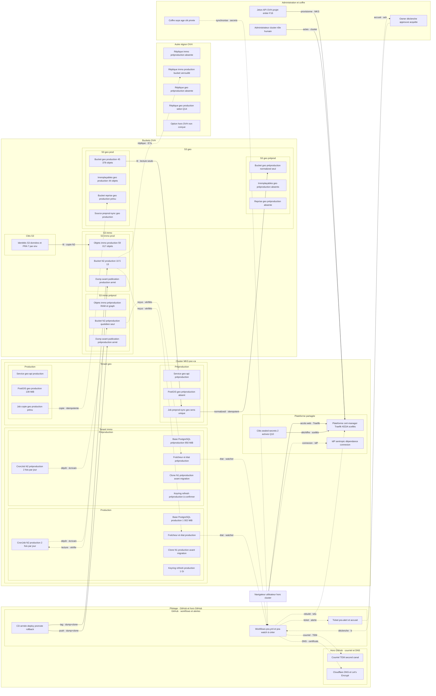

# Dossier de décision — Sauvegardes et PRA immo + geo (spec PRA v3, 2026-09-20)

*2026-09-20 · conducteur i-cond · base : `SPEC_PRA_V3_2026-09-19.md` réconciliée (31 constats absorbés, 0 écarté), exigence RPO-1 et complément débits intégrés · revues contradictoires Fable 5.1 et Gemini 3.8 high (annexe A, verbatim) · inventaire k8s et faits de rendu (annexe B, verbatim) · demande de l'owner, sections 1 à 5 (annexe C, verbatim). Remplace le dossier v3 du 2026-09-19, périmé : il présentait la conception d'avant la spécification PRA v3. Français, factuel. Le verbatim de l'owner fait foi ; ses quatre passages inachevés (Q1–Q4) ne sont jamais complétés ; les ajouts du conducteur sont marqués `[ajout conducteur]` et ne sont pas ses exigences.*

## 1. Décision demandée et état réel

Tu as **24 questions** à trancher, en 7 lots (section 12) : lot 0 (mesures conservatoires, avant toute réponse), lot 1 (quatre passages de ton texte, Q1–Q4), lots 2 à 6 (rétention, alertes, verrou, région, périmètre, hors GitHub, chronomètre, risque, coût, méthodes de copie). Deux actions **ne peuvent pas attendre tes réponses** : **A1, l'export des clés de scellement** (rotation vers le 22/09, l'outil refuse toute situation autre que 2 clés), et **Q0, le GO pour activer la sauvegarde planifiée de la prod avec le code actuel** (le RPO prod est non borné et vieillit : 8 jours).

**Recommandation : A1 aujourd'hui, Q0 dès que possible, puis les lots dans l'ordre.** Les recommandations de la spec sur chaque question sont relayées comme telles en section 12 ; là où c'est le sens de ton texte qui manque (Q1–Q4, Q5, Q5b, Q7, Q18, Q21–Q23), il n'y en a pas.

**État réel au 2026-09-20 :**

| Élément | État |
|---|---|
| Spécification PRA v3 | **corrigée et réconciliée** : 31 constats des deux revues absorbés (marqués F1–F30 + F19bis), 5 volets RPO-1 intégrés, **0 écarté, 0 divergence** sur ce périmètre ; DEB-1 couverte partiellement, **3 divergences ouvertes** (DV-1 à DV-3), postérieures aux revues |
| Double challenge | **fait** : Fable 5.1 + Gemini 3.8 high, les deux avis verbatim en annexe A. Astra xhigh, d'abord demandée, était injoignable ; **c'est toi qui as décidé** de la remplacer par Gemini 3.8 high |
| Sauvegarde planifiée de la prod | **aucune** : dernier point vieux de **8 jours et vieillissant, RPO non borné** ; code N2 prêt hors ligne (gouvernance 35 j, 7/4/2), **non provisionné, non activé** |
| Clés de scellement | **2 dans le cluster, aucun export trouvé**, rotation 30 jours active, prochaine **vers le 22/09** ; l'outil `poc-k8s` refuse toute situation autre que 2 clés |
| RTO-1 < 2 h | **non acquis** : borne haute ≥ 135 min > 120 sur estimation partielle, création MKS jamais mesurée, IdP sentropic hors budget |
| RPO-1 ≤ 24 h | **tient partout sauf geo `normalized/`** (aucune chaîne N2, Q14 bloquant) et sous réserve des versionnements inconnus |
| Tes quatre passages inachevés | **ouverts** (Q1–Q4), jamais complétés |
| Dossier précédent (v3 du 19/09) | **périmé** : conception d'avant la spec ; remplacé par celui-ci |
| Schémas | **Graphviz supprimé** (ARCH-7), suppression tenue par un test ; **archify produit** (ARCH-8) : deux rendus hors ligne, contrôles verts, limites dites ; BPMN : contenu P1–P9 livré, **rendu bpmn-js non produit** (paquet non installé, aucune installation réseau ; autorisation D7 non prononcée) ; plancher **12 px** : **aucune scène ne le tient** (3,38 à 7,21 px mesurés), page sortie par dérogation motivée ; **options de vue non tranchées** (section 13) |

**Tes exigences, et où elles en sont :**

| # | Ton exigence | État |
|---|---|---|
| ARCH-1 à ARCH-6 | Symétrie préprod/prod, zones k8s/OVH/dehors, clés, alertes + admin + canal, chaque écart expliqué, GitHub Actions dedans | Contenu de scène défini (section 4), rendu section 13 |
| ARCH-7, ARCH-8 | Graphviz supprimé, archify produit | **Faits tous les deux** (section 13) : Graphviz retiré de toute la chaîne et contrôlé par un test ; deux rendus archify livrés, exécutés hors ligne, contrôles `archify check` verts, limites évaluées sans détour |
| PROC-1, PROC-2 | Déclencheur et exécutant réels à chaque étape, plus de « Coordinateur immo » ; BPMN (bpmn-js + autolayout) ? | Acteurs réels (section 5) ; réponse BPMN : oui, avec un couloir par acteur, autolayout écarté sur fait mesuré ; contenu P1–P9 écrit, **rendu bpmn-js non produit** (section 13) |
| PROC-3 à PROC-6 | Triggers a, b.i, b.ii, b.iii, full automatiques, démontrés sur préprod | Processus P-a, P-bi, P-bii, P-biii + exercices E1–E4 (section 5) ; Q1, Q2, Q12 ouverts |
| PROC-7, PROC-8 | Régimes migration/iso, un seul workflow paramétré | Régimes + refus (proposition), `pra.yml` par dépôt même interface (section 5) |
| PROC-9 | Qui est alerté, par quel canal | Chaîne + canal Q6 (section 9) ; accusé `[ajout conducteur]` retenu |
| OPS-1 à OPS-3 | k8s facilitateur, aucune IA nécessaire, scripts si GitHub défaille | Inventaire résorbé, garde transférée, script+coffre, miroir requis (section 10) |
| RTO-1, RTO-2, RTO-3 | < 2 h démontré, < 5 min par composant, deux niveaux | N1/N2 définis ; < 2 h **non acquis**, < 5 min **partiel** (section 8) |
| RTO-4 | « les délai de retour a l'objectif RTO RPO doivent, » | **Inachevé (Q3)**, jamais complété |
| RPO-1 | RPO objectif 24 h, jamais 8 j | Intégré : cadences, seuils, faisabilité par composant (section 6) |
| RET-1 à RET-3 | 28 sauvegardes 10/5/13, gestion et externalisation au clair, autre centre ou région | Paliers + Q5/Q5b, verrou Q7, réplique Q8/Q13 (section 7) |
| RET-4 | `[ajout conducteur]` verrou 13 mois | Retenu comme conséquence technique, pas comme demande (section 7) |
| DEB-1 | Méthodes de copie au clair (chemins, sync diff, rclone ou autre, persistance, etc.) | Chemins établis ; outil, persistance et « etc » ouverts : Q21–Q23, DV-1 à DV-3 (section 6) |

## 2. La demande de l'owner, ce qui fait foi

Le texte intégral est en **annexe C** (`.remote/PRA_V3_DEMANDE_OWNER.md`, sections 1 à 5, verbatim). Règle de lecture, posée par l'owner : **« 0 interprétation »** au niveau du conducteur. Le texte verbatim de la section 1 fait foi ; la grille n'est qu'une aide de navigation ; en cas d'écart, le verbatim l'emporte et l'écart est signalé.

**La grille** : ARCH-1 à ARCH-8 (schéma), PROC-1 à PROC-9 (processus), OPS-1 à OPS-3 (principes), RTO-1 à RTO-4 (objectifs), RET-1 à RET-4 (rétention), RPO-1 (complément du 19/09 : « non jamais le RPO (Objective) ne sera 8j. il faut que ce soit 24h. »), DEB-1 (complément du 20/09 : « débits: il faut être au clair sur les méthodes de copie (par ou tu fais les copies de bucket, comment avec les sync diff pour accélérer avec un rclone ou autre depuis le cluster, peut être avec une persistance limitée de donnée pour pas réindexer les buckets a chaque fois etc) »).

**Ce que le conducteur a ajouté** (marqué `[ajout conducteur]` dans la demande, **ce ne sont pas des exigences**) :
- PROC-9 : « avec quel accusé de réception » — **retenu** par la spec (motif section 9) ;
- RTO-4 : « déclarer le RPO par composant et par niveau » — **absorbé** par ton exigence RPO-1 ;
- RET-2 : « exemples de normes à examiner — loi 25 au Québec, résidence des données » — **retenus** comme pistes, vérifiées sur les faits (section 7) ;
- RET-4 : la rétention 13 mois contre le verrou d'objet — **retenu** comme conséquence technique (section 7) ;
- ARCH-8 : « déterminer ce qu'est l'outil » — consigne du conducteur ; fait établi : archify existe (section 13).

**Les quatre passages inachevés, à ne trancher par personne d'autre que toi :**
- en (a), « la preprod recupere le dernier snapshot **de preprod** » alors que la phrase précédente dit que la préprod est écrasée par la donnée **de prod** (Q1) ;
- en (b.i), la phrase se termine sur « **la démonstration** », sans suite (Q2) ;
- « les délai de retour a l'objectif RTO RPO **doivent,** » : la phrase s'interrompt sur « doivent » (Q3) ;
- « **j'imagine que** », en fin de message, est inachevé (Q4).

À distinguer : « Par ailleurs j'imagine que github action doit être la dedans » (ARCH-6) est une **phrase complète**, distincte du « j'imagine que » final. Le « etc » de DEB-1 est un ouvert **distinct** (Q23, DV-3), postérieur aux quatre passages.

**Double challenge** : tu as demandé « avec double challenge », puis « astra xhigh + fable5.1 ». Astra étant injoignable (compte épuisé jusqu'au 2026-09-24, passerelle sans ce modèle), **tu as décidé** de la remplacer par Gemini 3.8 high. Les deux contradicteurs sont donc Fable 5.1 et Gemini 3.8 high, chacun contre le verbatim.

## 3. Couverture contre le verbatim, fragment par fragment

Les fragments V1 à V44 découpent ton texte dans l'ordre, sans en retirer un mot (V42 = RPO-1, V43 = DEB-1, V44 = actualisation du dossier, hors spec). Statuts : **couvert** · **partiel** · **ambigu/inachevé** (ouvert) · **hors spec**.

| # | Fragment (coquilles d'origine) | Statut | Section spec |
|---|---|---|---|
| V1 | symétrie préprod/prod pour voir commun et différence | couvert (contenu ; rendu §13) | §12.1 |
| V2 | zone k8s - et ovh (vs géré en dehors) | couvert (6 zones) | §12.1 |
| V3 | eventuellement des clé etc. | couvert | §9.4, §12.1 |
| V4 | alertes : on ne sait pas comment et qui reçoit | couvert | §11 |
| V5 | symboliser l'admin cluster | couvert | §2.1, §12.1 |
| V6 | mails de notif ? (via TEM scw ?? ou gh ou autre ??) | couvert (options + Q6) | §11.3 |
| V7 | 5 vs 3 geo, 3 vs 2 immo, sans raison lisible | couvert (8 cartes expliquées) | §12.2 |
| V8 | github action doit être la dedans | couvert | §2, §12.1 |
| V9 | consommateurs : trigger par gh action ? un admin ? | couvert (CronJob / workflow / jamais l'admin en routine) | §2.2 |
| V10 | « Coordinateur immo » pas clair, plusieurs fois, plusieurs icônes | couvert ; **la suppression du rôle est une décision spec (F13), pas ta demande** | §2.3 |
| V11 | bpmn (bpmn js et autolayout) favorable ici ? | couvert pour la réponse et le contenu (oui, un couloir par acteur ; autolayout écarté sur fait) ; **rendu bpmn-js non produit** (section 13) | §12.3 |
| V12 | processus très mauvais : il doit y avoir des triggers | couvert (4 déclencheurs) | §7 |
| V13 | (a) go to preprod, écrase + test migration, full auto | **partiel (F14)** : Q12 recommande un déclenchement restreint, **plus faible que ton texte**, soumis à validation | §7.3 |
| V14 | dernier snapshot de preprod (geo ou immo) | **ambigu : Q1**, non tranché | §7.3 |
| V15 | (b) restauration owner, full auto selon types | couvert | §7.4–7.6 |
| V16 | (b.i) crash complet k8s, nouveau provisionnement + tenant | couvert | §7.4 |
| V17 | démontré sur preprod (sauvegarde prod sur preprod) | couvert (E1) | §7.4, §10.1 |
| V18 | a priori trigger par github action | couvert | §8 |
| V19 | la démonstration | **inachevé : Q2** | — |
| V20 | (b.ii) complète immo+geo depuis github action, démontré | couvert (E2, preuve d'intégralité) | §7.5 |
| V21 | (b.iii) immo ou geo ou sous-composant, guardrails | couvert (G1–G10, E3) | §7.1, §7.6 |
| V22 | restauration + migration (préprod en avance), ou iso | couvert (+ refus, proposition) | §7.2 |
| V23 | même job github action avec paramètre (scope, target, tenant tiers) | couvert (un `pra.yml` par dépôt, même interface, motif donné) | §8.1 |
| V24 | k8s enabler, pas bloquant | couvert | §9 |
| V25 | immo/geo se reprovisionnent sur leur propre k8s | couvert | §9.2 |
| V26 | repo k8s trigger pour jobs infra via github action | couvert (optionnel, jamais critique) | §9.3 |
| V27 | aucune IA nécessaire, en aucune situation | couvert (transfert de garde + E7) | §9.5 |
| V28 | IA : aide au monitoring sur doc claire | couvert | §9.6 |
| V29 | github action défaillant : scripts font la même chose, secrets au clair | **partiel (F3)** : conditionné au miroir d'images, **requis** (D-v3-14) | §8.3, §8.4 |
| V30 | les délai de retour a l'objectif RTO RPO doivent, | **inachevé : Q3** | — |
| V31 | retour en opération < 2 h démontré, k8s compris | **partiel, non acquis (F4, F5)** : ≥ 135 min, IdP hors budget, T2 non mesuré | §10.1 |
| V32 | upgrade d'un composant < 5 min | **partiel** : N1 base oui, dump et bucket geo entier non | §3.2, §10.2 |
| V33 | deux niveaux de backup (snapshot et sync aux bons endroits) | couvert (N1/N2) | §3 |
| V34 | supprimer la visualisation graphviz | **fait** : retiré de toute la chaîne, suppression tenue par un test (section 13) | §12.4 |
| V35 | représentation archifify, je me fous de graphviz | **fait** : deux rendus archify livrés hors ligne, contrôles verts, limites dites (section 13) | §12.4 |
| V36 | daily 10 j, weekly 5 sem, monthly 13 mois = 28 sauvegardes | couvert (prod) ; **préprod réduite = proposition à valider (F12) : Q5b** ; décompte : Q5 | §4 |
| V37 | gestion et externalisation au clair (compliances normes) | couvert | §5, §6 |
| V38 | sauvegarde hors ovh : une autre carte | couvert (option à part) | §5.3 |
| V39 | au moins un autre datacenter ou region | couvert (réplique autre région) | §5.1 |
| V40 | j'imagine que | **inachevé : Q4** | — |
| V41 | reprend, trace bien, double challenge | hors spec (organisation conducteur) | — |
| V42 | RPO objectif 24 h, jamais 8 j | couvert (cadences, paliers, surveillance) | §3.5 |
| V43 | débits : méthodes de copie au clair (chemins, sync diff, rclone ou autre, persistance, etc.) | **partiel** : chemins établis ; outil, persistance, « etc » : Q21–Q23, DV-1 à DV-3 | §3.6 |
| V44 | actualisation du dossier de PRA | hors spec (ce dossier) | — |

**Réconciliation des deux revues** (2026-09-20) : 31 constats (F1–F30 + F19bis), appariés un par un — Fable et Gemini disent la même chose, preuves et corrections convergentes, vérifiées sur pièces. 5 volets RPO-1 (Gemini seule) examinés et retenus. Deux nuances réconciliées (gravité V32, remèdes F27/F30 combinés). **0 écarté, 0 divergence** sur ce périmètre. Chaque correction est marquée `(F#)` dans la spec, à l'endroit corrigé.

**Rien perdu** : chaque phrase a sa section. **Ajouté au nom de l'owner** : aucun — les deux cas relevés par les revues (V10, V36) sont corrigés : suppressions et restrictions sont marquées **proposition spec**, soumises à validation. **Quatre passages ouverts** : Q1 (deux lectures, pas de recommandation, `source_env` obligatoire, auto non armé), Q2 (rien d'ajouté), Q3 (rien d'ajouté, **sans mention de RPO** F19bis), Q4 (rien d'ajouté).

## 4. Architecture cible : zones, symétrie, clés (ARCH-1 à ARCH-6)

**Six zones** (Z1 cluster MKS `poc-ca` bhs5 ; Z2 OVH bhs hors cluster : stockage objet, API, IAM ; Z3 OVH autre région : réplique ; Z4 GitHub : dépôts, Actions, environnements, secrets, GHCR, tickets ; Z5 poste de l'owner : coffre, clé `age`, `pra.sh` ; Z6 autres fournisseurs : Cloudflare, Let's Encrypt, TEM Scaleway, option hors OVH). **Acteurs** : owner ; administrateur du cluster (rôle humain, tenu par l'owner) ; GitHub Actions ; CronJobs. Chaque élément porte zone, environnement et rangée. La scène 1 dessine ce contenu dans la mise en page **imposée par l'owner** : les six zones y restent la **taxonomie**, elles ne sont plus six boîtes à plat mais réparties sur **cinq colonnes** entre l'utilisateur au nord et l'administration au sud — GitHub seul, hors GitHub, le cluster (chaque tenant, et dans chaque tenant sa préproduction à l'ouest et sa production à l'est), les buckets OVH, la réplication en autre région (annexe D).

**Grille immo** (mêmes rangées, deux colonnes ; case « absent » motivée) :

| Rangée | Préprod | Prod |
|---|---|---|
| R1 base PostgreSQL | 950 MiB | 1 002 MiB |
| R2 objets | bucket RAW dédié (nom inconnu) + `radar-immobilier-graph-preprod` | `radar-immobilier-docs` (59 017 objets, 12,53 Go) |
| R3 CronJob N2 | oui (2×/jour, code prêt, non actif) | oui (idem) |
| R4 fraîcheur + état | oui | oui |
| R5 bucket N2 bhs | `radar-immobilier-backups-preprod`, quotidien seul (Q5b) | `radar-immobilier-backups`, 10/5/13 (Q5, Q7) |
| R6 réplique | **absent** : §4.4, Q5b | bucket de réplique (Z3, Q8) |
| R7 avant publication | `sentropic-pgbackup-preprod` (armé) | `sentropic-pgbackup` (armé) |
| R8 clone N1 | oui (proposition) | oui (proposition) |
| R9 keyring | PVC (à confirmer en préprod) | PVC 1 Gi |

**Grille geo** :

| Rangée | Préprod | Prod |
|---|---|---|
| G1 `geo-api` | `geo-api-preprod` (1 pod 14/09, manifestes brouillon) | `geo-api` |
| G2 bucket | `sentropic-geo-preprod`, `normalized/` seul | `sentropic-geo` (45 378 objets, 48,94 Go) |
| G3 irremplaçables | **absent** : rien d'irremplaçable, tout vient de la prod | `sources/qc-zonage-grilles/` (44 objets), `raw/`, `capture/_runs/` |
| G4 PostGIS | **absent** : n'existe qu'en prod, hors chemin servi | 139 MiB |
| G5 copie + `sentropic-geo-pra` | **absent** : rien à protéger | prévu (plan geo), non livré |
| G6 alimentation | Job `preprod-sync` (lit la prod) | source du `preprod-sync` |
| G7 réplique | **absent** | Z3 (Q8, Q14) |

**Commun** : plateforme (sealed-secrets, cert-manager, Traefik, KEDA) en Z1 ; IdP sentropic, dépendance hors périmètre (Q15, F5).

**Les 8 écarts de la scène v2, expliqués un par un (ARCH-5)** : `QUOTA` (contrainte, pas composant — le « 3 contre 2 » d'immo ; attribut de R3 en v3) ; `GEO_SRC` (équivalent préprod `GEO_PPB`, même rangée G2) ; `GEO_IRR` (rien d'irremplaçable en préprod) ; `GEO_PG` (qu'en prod) ; `GEO_COPY`/`GEO_DST` (rien à protéger en préprod) ; `GEO_SYNC` (mécanisme d'alimentation, source côté prod) ; `GEO_PPX` (une case vide, pas un composant — le « 5 contre 3 » de geo ; l'état connu est un attribut de G1).

**GitHub Actions (ARCH-6)** : `pra.yml` immo + geo (nouveaux, même interface), `pra-watch.yml` (nouveau, veilleur hors cluster), `deploy-preprod`/`promote-prod` (existants, N1 + migration), `rollback.yml` (existant, image seule), `cd-preprod/cd-prod/geo-jobs.yml` (geo, existants). Environnements : `preprod` (sans approbation), `production` (approbation, existe), `dr` (approbation, jetons OVH/tofu/Cloudflare — **proposition** F29), `watch` (identité `watcher` seule).

**Les clés (ARCH-3)** : où, qui, ce qu'elles ouvrent —

| Clé | Où (cible v3) | Qui | Ce qu'elle ouvre |
|---|---|---|---|
| Clé `age` du coffre | gestionnaire de l'owner + copie hors ligne | owner | tous les secrets ci-dessous |
| Jeton API OVH | coffre, env `dr` (selon Q19) | owner | **projet OVH entier** — risque exposé (F16, Q19) |
| Admin S3 | coffre | owner | buckets, contournement de gouvernance |
| Backend tofu | coffre, env `dr` | owner | état d'infrastructure |
| Kubeconfig admin | produit par le run, jamais stocké | le run | cluster entier |
| Clés sealed-secrets (2) | selon Q10 | owner | SealedSecrets committés, dont jeton Cloudflare |
| Jeton Cloudflare | coffre, env `dr` | owner | zone `sent-tech.ca` |
| Identités données S3 | Secrets du cluster, coffre | cluster, owner | lecture/écriture des données |
| Identités PRA (7/env : writer, verifier, reader, retainer + watcher, replica-writer, data-reader) | Secrets, env `watch` | CronJobs, GitHub | §4, moindres privilèges (F22 : comptées et justifiées) |
| Juste-à-temps de restauration | créées puis supprimées par le run | le run | lecture du bucket source (G9) |
| `radar-pra-admin` | `.env` local, créée par l'agent k8s | aujourd'hui l'agent | objectstore_operator, **refusée** sur les buckets de données — à renouveler (§9.5) |
| Clé TEM, mots de passe PostgreSQL | Secret, coffre | cluster, owner | courriels ; base (exclus des dumps) |

**Flux** (scène 1) : CronJob → bucket N2 (dépôt writer) ; bucket N2 → CronJob (téléchargement reader, vérification) ; CronJob → état ; état → `pra-watch.yml` (lecture watcher) → ticket + courriel → owner, admin ; bucket N2 → réplique ; `deploy-preprod`/`promote-prod` → dump + clone + migration ; owner → `pra.yml` (déclenche, approbation) → Jobs (exécute) ; `pra.yml` → tofu → Z1 neuf ; `pra.yml` → Cloudflare ; `pra.yml` immo → `pra.yml` geo (déclenche) ; coffre (Z5) → secrets GitHub (synchronise) ; `preprod-sync` : `sentropic-geo` → `sentropic-geo-preprod` ; nginx immo → `geo-api` ; clés vers ce qu'elles ouvrent.

## 5. Processus : déclencheurs, garde-fous, régimes (PROC-1 à PROC-8)

**Qui déclenche quoi** (réponse à « est-ce que la sauvegarde est trigger par gh action ? un admin ? ») : la routine par l'horloge du cluster (CronJob 02:15/14:15 UTC), la sauvegarde de publication par le workflow GitHub, **jamais l'administrateur pour la routine**. Le « Coordinateur immo » est clarifié (ses 5 tâches v2 attribuées à des exécutants réels) puis **supprimé — décision spec (F13), pas ta demande** : tu as demandé la clarté, pas la suppression.

| Déclencheur | Processus | Déclencheur réel | Exécutant | Approbation | Preuve |
|---|---|---|---|---|---|
| (a) passage en préprod | P-a : écrase préprod, test de migration | Q12 (auto restreinte proposée, sous réserve Q1) | `pra.yml operation=go-to-preprod` (env `preprod`) | aucune | E4 (iso + migration) |
| (b.i) crash complet k8s | P-bi : cluster neuf + tenant depuis backup (9 étapes) | owner (`operation=rebuild`) | GitHub env `dr` | owner + `confirm` | E1 : cluster neuf, tenant préprod, sauvegarde prod, destruction vérifiée |
| (b.ii) complète immo+geo | P-bii : geo puis immo, même T0 | owner (`operation=restore scope=all`) | `pra.yml` immo → `pra.yml` geo | prod : owner | E2 : préprod récupère intégralement la prod |
| (b.iii) partielle | P-biii : périmètre + garde-fous | owner (`operation=restore scope=…`) | GitHub + Jobs cible | prod : owner | E3 : un reçu par périmètre + un refus |

**Garde-fous G1–G10** (tous proposition spec) : G1 point source vérifié ; G2 même T0 sauf `allow_mixed_points` motivé ; G3 fermeture base → objets → exports geo ; G4 régime calculé, refus si donnée en avance ; G5 point de sécurité avant écrasement ; G6 approbation owner + `confirm=<cible>/<périmètre>` pour prod/`dr` ; G7 écrivains arrêtés puis rétablis ; G8 identité du cluster attendue ; G9 identifiants juste-à-temps supprimés en fin ; G10 reçu JSON final.

**Régimes** (manifeste portant image + migration) : **iso** (migrations égales → restaurer, vérifier) ; **migration** (cible en avance → restaurer, Job de migration, vérifier) ; **refus** (donnée en avance → arrêt, ou `on_schema_ahead=deploy-source-image`). Le refus est une **proposition spec**. Pour geo : compatibilité `normalized/`/image `geo-api`, à définir (inconnu).

**Un workflow par dépôt, même interface** (motif : autonomie, pas de secrets croisés) : `operation`, `scope` (`all` → tiers inclus : `target=third-party` + kubeconfig + namespaces + `expected_server`), `source_env` (Q1 : explicite, obligatoire), `source_point`, `target`, `cluster`, `region`, `regime`, `dns`, `confirm`, `dry_run` (défaut `true`). Le workflow n'est qu'une **enveloppe de `pra.sh`** (parité GitHub/hors GitHub par construction, D-v3-4).

**Contenu BPMN P1–P9** (un couloir par acteur ; rendu section 13) :

| Processus | Couloirs | Éléments et passerelles |
|---|---|---|
| P1 N2 base | CronJob, stockage OVH, GitHub (veilleur), owner | minuterie 02:15/14:15 → purge → dump → envoi → téléchargement → restauration éphémère → reçu → promotion → réplication ; « contrôles verts ? » → E1a |
| P2 N2 objets | CronJob, stockage OVH | minuterie → T0 → versions ≤ T0 strict (F6) → copie adressée par contenu → manifeste → fermeture ; sinon reprise bornée (F7) |
| P3 N1 publication | GitHub, cluster, owner | push/tag → dump → clone → migration → bascule ; « migration OK ? » → arrêt, retour arrière |
| P4 passage (a) | GitHub, cluster préprod, stockage OVH | §7.3 ; régime iso/migration/refus |
| P5 crash (b.i) | owner, GitHub `dr`, OVH MKS, cluster neuf, Cloudflare | 9 étapes §7.4 |
| P6 complète (b.ii) | owner, GitHub immo, GitHub geo (message « déclenche »), cluster | geo puis immo |
| P7 partielle (b.iii) | owner, GitHub, cluster | §7.6 ; passerelles G3, G4 |
| P8 alerte + accusé | CronJob, stockage OVH, GitHub (veilleur), owner, admin | état → lecture → condition → ticket + courriel → « accusé dans N h ? » → relance |
| P9 garde + E7 | owner, coffre, OVH, cluster d'exercice | §9.5 |

## 6. Deux niveaux, RPO 24 h, débits (RTO-3, RPO-1, DEB-1)

**N1 rapide** (revenir vite, surtout autour d'une publication) : clone `radar_pre_<sha>` par `CREATE DATABASE … TEMPLATE` + bascule par renommage — exige l'absence de **toute** connexion (coupure complète, F20), PVC doublée, durées à mesurer (E5) ; versionnement des buckets sources pour les objets (état **inconnu**). **N2 complet externalisé** (reconstruire un environnement) : dump cohérent 2×/jour + objets à chaque point base (même T0, F8) + réplique autre région.

| Composant | N1 | N2 |
|---|---|---|
| Base immo | clone + dump avant publication (repli) | dump 2×/jour, restauration vérifiée |
| Objets immo | versionnement source (prérequis inconnu) | copies 2×/jour à T0, adressées par contenu |
| Keyring | — | réamorçage (hypothèse, lane immo) |
| Irremplaçables geo | versionnement (non confirmé) | copie quotidienne vers `sentropic-geo-pra` |
| `normalized/` etc. geo | versionnement | selon Q14 |
| PostGIS geo | — | reconstruction ou dump 139 MiB (Q14) |
| Secrets | au changement (coffre) | copie chiffrée dans la réplique |

**RPO-1 (V42) : objectif ≤ 24 h pour chaque composant couvert.** Ce qu'il change : base 2×/jour maintenue, objets N2 alignés 2×/jour même T0, réplication immédiate après chaque point vérifié, `backoffLimit: 2` (aujourd'hui 0), fraîcheur **14 h** (alerter à 24 h = alerter après violation), E7a à 2 h (26 h violerait 24 h). Option : base 4×/jour. Faisabilité : base immo oui (≤ 12 h), objets immo oui sous versionnement, irremplaçables et PostGIS geo oui, **`normalized/` non en l'état** (Q14 bloquant). Coût estimé < 5 $ CAD/mois (**estimé**, non mesuré). Exercices E1–E4 gagnent une assertion RPO (source ≤ 24 h, réplique ≤ 14 h).

**Cohérence sans gel** (D-v3-2, mérites techniques seuls F13) : T0 = instantané PostgreSQL ; objets ≤ **T0 strict** (F6) ; solide seulement si clés immuables — **invariant à vérifier par la lane immo**, repli si faux ; **contrôle de fermeture** + reprise bornée, point hors fenêtre de refresh, « incomplet » = état intermédiaire (F7) ; prérequis : versionnement actif + **lecture d'une version non courante sur OVH à mesurer par la sonde** (F9), repli miroir à chaque écriture.

**Débits (DEB-1, V43)** — « peut être », « ou autre », « etc » : questions ouvertes, non tranchées. Le verbatim ne chiffre aucun débit cible : seules bornes = RTO-1/RTO-2.

| Flux | Chemin des octets | Outillage | Statut |
|---|---|---|---|
| Dump N2 | CronJob → S3 bhs ; S3 → CronJob (vérification) | `backup.py` boto3 mono-filin | fait |
| Dump N1 | Job cluster : `pg_dump` → gzip → `emptyDir`, puis `s5cmd cp` → S3 | conteneurs dump + upload | fait |
| Rétention N1 | aucun octet (appels API depuis le runner) | `run-db-backup.sh` | fait |
| Objets N2 (2×/jour, T0) | CronJob : versions ≤ T0 → stockage adressé par contenu | **aucun outil livré** | proposition |
| Réplique bhs → région | CronJob : lecture bhs, écriture réplique ; réplication native OVH : inconnu | aucun outil livré | proposition |
| Miroir P-a (prod → préprod) | copie côté serveur en bhs, orchestrée depuis le cluster | aucun outil livré | proposition |
| `preprod-sync` geo | Job prod → préprod | méthode interne inconnue | fait d'existence |
| Migration (une fois) | machine d'exécution (`get-object` puis `put`) | scripts + reprise sur point de contrôle | fait, hors sauvegarde |
| Runners GitHub | **aucune donnée** (orchestration seule) | — | décidé (D-v3-5) |

**Sync diff** : aucune copie différentielle dans le chemin de sauvegarde ; seule mesure : 59 017 objets (39 582 copiés), 12,53 Go, 38 min 31 s (≈ 17/s, F18) sur chemin inter-fournisseurs ; copie intra-bhs à mesurer (E3). Tout outil (rclone ou autre) doit satisfaire : T0 strict, lecture versions non courantes sur OVH, aucune donnée par les runners, contrôle de fermeture (D-v3-16) — que rclone les satisfasse est **non démontré** : Q21. **Persistance limitée** : CronJobs éphémères seuls (8 Gi plafonnés), aucun cache d'inventaire ; volume d'un inventaire inconnu ; contenu/support/durée : Q22 (« peut être »). **« etc »** : non complété (Q23, DV-3). **Divergences** : DV-1 (DEB-1 non soumis au double challenge), DV-2 (outil/chemins/persistance sans réponse), DV-3 (« etc » ouvert) — toutes ouvertes.

## 7. Rétention, verrou, externalisation, conformité (RET-1 à RET-4)

**Paliers** (prod) : quotidien = dernier point vérifié de chacun des **10 derniers jours représentés** (sémantique du code, **proposition** F26 ; alternative : fenêtre calendaire) ; hebdomadaire = 5 semaines ISO ; mensuel = 13 mois. **Q5** (reposée sans orientation, F11) : seule la construction **disjointe** (28 points distincts, ≈ 14,5 mois) reproduit ton décompte 10 + 5 + 13 ; la **superposée** (≈ 26–27 points, horizon 13 mois) est une économie d'≈ 1,5 mois, à valider. Pas de recommandation : c'est ton décompte. **Q5b** : préprod au quotidien seul (10 points, sans réplique, motif §4.4) — proposition à valider, le verbatim ne distinguant pas les environnements.

**Rotation** : purge en tête de cycle ; **plafond par jeu** (3/exécution, F21), blocs en lot, report signalé (E11a) ; quarantaine, jamais bloquante ; jamais de suppression du dernier point vérifié. `keep_sets()` : 7/4/2 → 10/5/13 selon Q5.

**Verrou (RET-4, ajout conducteur retenu comme conséquence)** : défaut court (14 j proposés) + **promotion** (hebdo 42 j, mensuel 400 j) par l'identité `retainer` (sans contournement) ; **hypothèse** : OVH accepte `PutObjectRetention` sur version existante — repli : un bucket par palier. **Q7** (reposée sans orientation, F10), L1 et L2 à égalité : **L1** gouvernance partout (contournement gardé, mais un admin compromis efface 13 mois) ; **L2** conformité sur le mensuel (≈ 6,5 GiB irréversibles 13 mois, intouchable même par toi). L'argument loi 25 contre L2 est une **hypothèse, juriste**. Volume estimé (base prod, L1) : ≈ 50 dumps ≈ 25 GiB (**estimé**) ; prix OVH **inconnu**.

**Externalisation** : réplique de chaque point vérifié de prod dans un bucket verrouillé d'une autre région OVH (mêmes paliers, revérification, E7a) ; réplication native : inconnu (i-infra). Autre centre dans bhs : **hypothèse non sélectionnable** ; autre région canadienne : **inconnu** ; régions européennes : existence publique, verrou par région inconnu. Perte régionale : **analyse de la spec, pas ta demande** (Q13) — backend neuf, coffre + export répliqués, miroir GHCR. **Hors OVH** : option à part, non conçue (V38) ; fait utile : régions tierces à Montréal/Québec, **à confirmer**.

**Conformité** (RET-2 ; « loi 25, résidence » = ajout conducteur retenu comme piste ; pas un avis juridique) : applicabilité fondée sur **`account_users`** (table peuplée, F23), pas sur `prospect_contacts` (alimentation inconnue) ; toute la donnée à Beauharnois (bhs, Québec) ; geo : publiques, aucun RP identifié. Normes : **Loi 25 applicable** d'après la classification du dépôt (art. 3.3, 10, 17, 23, 3.5–3.8 — à vérifier sur le texte officiel, RLRQ c. P-39.1) ; résidence (art. 17 → Q8) ; LPRPDE, contrats clients, OACIQ : **inconnus**. Conséquences : aucune donnée par les runners (D-v3-5) ; rétention 13 mois au calendrier de conservation ; ACL publique = incident potentiel ; P-a/E2 et **E1 copient des RP** (Q9 ; E1 : destruction vérifiée, F30) ; **aucun RP dans alertes, tickets, reçus** (F23).

## 8. Objectifs de reprise : < 2 h non acquis, < 5 min partiel (RTO-1, RTO-2)

**RTO-1** : perte du cluster, bhs disponible, buckets intacts (P-bi). Départ du chronomètre : déclenchement du workflow — **décision spec, ton texte ne le fixe pas (F15)** : Q18 (depuis l'incident ou le déclenchement ?). Détection (2–3 h possibles) et attentes humaines (approbation `dr`, « GO owner ») : **hors chronomètre technique**, sur le chemin critique mais non bornées.

**Mesuré** (aucune mesure de bout en bout) : dump prod + envoi 6 min 54 s (11/09) ; préprod 2 min 10 s (19/09) ; migrations 20 s / 10 s ; copie objets 59 017 traités (39 582 copiés), 12,53 Go, 38 min 31 s (13/09, ≈ 17/s F18, chemin inter-fournisseurs). **Écart ×3 inexpliqué** (F4) : 6 min 54 s contre 2 min 10 s pour des bases égales — à expliquer ou mesurer avant E1.

**Estimé** : T1 déclenchement 2–5 ; **T2 cluster MKS 10–30, jamais mesuré** (exercice `tofu apply` avant E1, F4) ; T3 plateforme 5–15 ; T4 tenants 3–10 ; T5 secrets 2–10 ; T6 DNS/certificats 5–20 (TTL réel non mesuré, E1 en `drill` ne le mesure pas) ; T7 base 10–40 ; T8 apps 3–10 **+ tirage des images non chiffré** (F4) ; T9 contrôle 5–15 ; T-pvc (PVC + StatefulSet) **à mesurer** ; T-idp (IdP, F5/Q15) **non chiffré** ; T-rescell (si Q10 = 3) **non estimé**. Chemin critique : **40 min en bas, ≥ 135 min en haut** (hors non chiffrés) — le haut dépasse 2 h : **non acquis sur estimation**. Leviers : `pg_restore -j`, `pg_amcheck` hors chemin critique, cluster tiède, nœud plus grand. Perte régionale : **N-A tant que non mesuré**.

**RTO-2** : N1 base par renommage — oui en principe, coupure complète exigée, création à mesurer (E5) ; base depuis dump — **non attendu** (10–40 min) ; préfixe objets — jusqu'à ≈ 5 000 (F18), intra-bhs à mesurer (E3), prérequis versionnement ; bucket geo entier — **non** (sauf pointeur de publication, lane geo, Q14) ; PostGIS geo — hors chemin servi, N-A.

## 9. Alertes de bout en bout (ARCH-4, PROC-9)

Fait : aucune pile Prometheus observée sur le cluster ; la règle `alerts.yaml` du code ne serait évaluée par personne. Une alerte évaluée dans le cluster meurt avec lui. **Proposition** : le CronJob de fraîcheur écrit un **état** horodaté (`status/<env>/freshness.json`) ; hors cluster, `pra-watch.yml` (horaire) le lit avec l'identité `watcher` (aucun accès aux données), recalcule l'âge, et **alerte aussi quand l'état ne se met plus à jour**. Limite déclarée : workflow planifié GitHub retardable ; sans GitHub, pas d'alerte.

| Id | Événement | Détecté par | Destinataire |
|---|---|---|---|
| E1a | échec d'une sauvegarde N2 | reçu absent, état | owner |
| E2a | aucun point vérifié depuis **14 h** (10 h d'intervention avant 24 h) | watcher | owner |
| E3a | état non mis à jour depuis 2 h | watcher | owner, admin |
| E4a | cluster injoignable, service public en échec | watcher | admin |
| E5a | reçus en quarantaine | état | owner |
| E6a | ACL publique sur un bucket de sauvegarde | état | owner (incident potentiel, §7) |
| E7a | réplique en retard > 2 h ou empreinte divergente (RPO réplique ≤ 14 h) | watcher | owner |
| E8a | exécution PRA démarrée, réussie, échouée | `pra.yml` | owner |
| E9a | échec de sauvegarde/migration avant publication | workflow existant | owner |
| E10a | clés non exportées après rotation, ou compte ≠ 2 (outil bloqué, F1) | watcher | admin |
| E11a | purge reportée plusieurs cycles | état | owner |
| E12a | relecture de configuration divergente | état | owner |

Destinataires : tu es aujourd'hui le seul humain ; l'administrateur du cluster est un rôle que tu tiens. « L'astreinte immo » de la v2 n'était assignée à personne : remplacée par ces rôles nommés. Un second humain : Q6.

**Canal (Q6, ta question V6)** : **courriel TEM** (déjà utilisé par l'API, indépendant de GitHub ; seule dépendance Scaleway conservée ; pas d'acquittement natif) ; **notification GitHub** (ticket `pra-alert` assigné + courriels d'échec ; acquittement et historique natifs ; même domaine de panne que l'exécutant) ; **autre** (poussée mobile, veilleur indépendant TEM). Recommandation spec : **ticket comme support de l'accusé ET courriel TEM comme second canal**. Dis aussi si un second humain reçoit.

**Accusé de réception** (`[ajout conducteur]`, **retenu** : sans accusé, une alerte non vue ne se distingue pas d'une traitée) : le ticket porte l'accusé (`pra-ack` ou `/ack`) ; sans lui, relance par le second canal toutes les N heures (N proposé : 4) ; fermeture auto quand la condition disparaît. En courriel seul, l'accusé n'est pas mesurable.

## 10. k8s facilitateur, garde, secrets (OPS-1 à OPS-3)

Point de départ (inventaire k8s, annexe B) : `poc-k8s` sans workflow ni cible tofu, `tofu apply` manuel, machine opérateur préconfigurée exigée ; immo/geo ne déploient que sur cluster+namespace déjà provisionnés.

| Élément d'inventaire | Résorbé par |
|---|---|
| Fait structurel (pas de `.github/`, pas de tofu) | `pra.yml` + `pra.sh` dans immo et geo |
| A.1 IaC cluster, A.2 enveloppe tenant, A.3 plateforme, A.4 kubeconfig tenant, A.5 quotas | module de cluster vendu (`infra/cluster/`, backend paramétrable), plateforme minimale (`deploy/platform/`), enveloppe (`deploy/tenant/`), étape kubeconfigs + DNS de `pra.sh` ; contrôle de dérive en CI |
| B.1 auth OVH, B.2 creds tofu, B.3 `bhs.tfvars`, B.6 identités S3 | coffre + env GitHub `dr` (+ `preprod`/`production`, Secrets) ; projet en variable non secrète |
| B.4 kubeconfig admin, D garde de l'agent | produit par le run, jamais conservé ; garde révoquée (§9.5, E7) |
| B.5 clés sealed-secrets + complément | Q10 (4 options, contrainte d'outil F1 dite) |
| B.7 DNS Cloudflare | étape `dns` par jeton |
| C libre-service | conservé, étendu en amont |
| E quotas | gabarit `r2-15` vérifié au plan |

`poc-k8s` appelable (`repository_dispatch`) quand il expose des workflows, **jamais sur le chemin critique** ; échec → bascule sur la copie vendue. Cluster commun ou par tenant : les deux possibles (Q16) ; couplage nginx immo → geo configurable.

**Transfert de la garde (OPS-2)** — le problème réel est la **reproductibilité documentée** (F17), les fichiers étant sur ton poste : inventaire nominatif (diff vide avec le coffre) → renouvellement par toi (anciennes supprimées côté OVH, liste API) → kubeconfig réinitialisé (**hypothèse** API MKS, i-infra) + agents en lecture → clés selon Q10 → **E7** : toi seul, poste neuf, runbook + coffre, `tofu plan` + clés + E2 par `pra.sh`, **refus mesuré** des anciens identifiants. **Aucune IA nécessaire** ; aide au suivi sur runbook, reçus, états, tickets (V28).

**Secrets (OPS-3)** : coffre chiffré unique (`sops` + `age`, **tranché par la spec**, réversible — Q11 retirée F28), clé privée chez toi, deux copies chiffrées (dépôt privé + réplique) ; hors GitHub : `sops exec-env`, `set +x`, `umask 077`, kubeconfig en tmpfs + `trap`, tube vers kubectl, `::add-mask::` ; synchro coffre → GitHub par toi. **Miroir d'images requis, tranché (D-v3-14, F3)** : sans lui, « faire la même chose » sans GitHub est faux pour toute reconstruction ; Q17 = support et coût. Sans GitHub et avant le miroir : restauration de données sur cluster vivant possible, reconstruction impossible, pas d'alerte ticket. **Jeton OVH dans GitHub (F16, D-v3-15)** : compromission GitHub = projet OVH entier — Q19 (GitHub `dr`, script depuis coffre seul, ou portée réduite) : dis ce que tu acceptes.

## 11. Mesures conservatoires et exercices

**A1 — export des clés de scellement, action immédiate, pas une question (F1).** Aujourd'hui : 2 clés dans le cluster (`keyxfs6p` 24/07, `key948dh` 23/08 active), **aucun export trouvé** dans la visibilité k8s, rotation 30 jours active, prochaine **vers le 22/09** ; l'outil refuse toute situation autre que 2 clés (export, restauration, contrôle). **Tu exportes avant la rotation, pendant que le compte vaut 2, et déposes hors cluster et hors région.** Sans cela, les SealedSecrets committés deviennent indéchiffrables en cas de perte du cluster. À confirmer par toi (pas par la lane) : export sur ta machine, chemin, date face à la clé active et à la rotation.

**Q0 — GO pour activer la prod avec le code actuel ?** Gouvernance 35 j, 7/4/2, puis migration à chaud vers la v3 **sans recréer le bucket** (seule l'activation du verrou est figée ; les versions gardent leur échéance 35 j, la promotion ne vaut que pour les nouveaux points). Sans GO, le RPO prod reste non borné et vieillit. RPO et rétention sont indépendants : le RPO tient dès l'activation intérimaire.

**Exercices** (E1–E4 avec assertion RPO : source ≤ 24 h, réplique ≤ 14 h) :

| Id | Démontre | Cible | Preuve |
|---|---|---|---|
| E1 | reconstruction < 2 h (RTO-1) | cluster neuf, tenant préprod, sauvegarde prod | reçu chronométré par étape ; **destruction vérifiée** (cluster, PVC, kubeconfigs, F30) ; noms d'exercice distincts (limites Let's Encrypt, à vérifier) |
| E2 | préprod récupère intégralement la prod | préprod | comptes, séquences, rôles, `pg_amcheck`, inventaire objets, `set_hash` ; tout écart = échec |
| E3 | partielles + refus | préprod | un reçu par périmètre + un refus (G3/G4) ; mesure copie intra-bhs + outil Q21 |
| E4 | passage iso + migration | préprod | deux reçus |
| E5 | retour N1 < 5 min (RTO-2) | préprod | reçu chronométré (création du clone incluse) |
| E6 | même opération sans GitHub (OPS-3) | préprod | E2 ou E4 rejoué par `pra.sh` |
| E7 | aucune IA nécessaire (OPS-2) | garde | reçu + refus des anciens identifiants |
| E8 | alertes reçues et acquittées | chaque événement provoqué | tickets, courriels |
| E9 | restauration depuis la réplique | préprod | reçu (au moins la base) |

**Lots de réponse** : 0 (A1 + Q0, immédiat) → 1 (Q1–Q4, ton texte) → 2 (Q5, Q5b, Q6, Q7) → 3 (Q8, Q9, Q10, Q12) → 4 (Q13–Q16) → 5 (Q17–Q20) → 6 (Q21–Q23). La spec devient EVOL après tes réponses ; RPO-1 et les débits suivent le même circuit (DV-1 : DEB-1 à faire relire contre le verbatim).

## 12. Ce que j'attends de toi

Par lots de quatre au plus. Pour les passages de ton texte, **aucune recommandation** : c'est le sens de ta demande. Les questions à options figurent aussi dans le panneau de choix (brouillon local, export JSON) ; les ouvertes se répondent en texte. ~~Q11 (outil du coffre)~~ : **retirée** — tranchée `sops` + `age` (F28), numérotation conservée. Les options de vue (scission, ouverture, compact) sont en **section 13**, présentées sans recommandation.

**Lot 0 — mesures conservatoires (avant toute réponse)** : **A1** (action, pas une question) ; **Q0** — GO activation intérimaire de la prod (35 j, 7/4/2, puis migration à chaud) ?

**Lot 1 — passages de ton texte** : **Q1** — (a) « dernier snapshot de preprod » : lecture A (**de prod** — chaque passage teste aussi la restauration) ou B (**de préprod** — remise à son état, écrasement à préciser) ? En attendant : auto non armée, `source_env` obligatoire. **Q2** — (b.i) « la démonstration » : fréquence, cible, critère, autre ? (E1 prévu §7.4.) **Q3** — « les délai de retour a l'objectif RTO RPO doivent, » : que devaient-ils être ou faire ? **Q4** — « j'imagine que » : une exigence manque-t-elle ? Pas de recommandation (×4).

**Lot 2 — rétention, alertes, verrou** : **Q5** — « 28 sauvegardes » : **disjointe** (28 points, ≈ 14,5 mois — seule conforme à ton décompte) ou **superposée** (≈ 26–27 points, économie ≈ 1,5 mois) ? Pas de recommandation. **Q5b** — préprod au quotidien seul (10 points, sans réplique) : valides-tu, ou trois paliers comme la prod ? Pas de recommandation. **Q6** — canal + destinataires : recommandation **ticket GitHub (accusé, historique) ET courriel TEM (hors panne GitHub)**, émis par le veilleur ; second humain ? **Q7** — verrou : **L1** (contournement gardé, 13 mois effaçables par un admin compromis) ou **L2** (mensuel intouchable, ≈ 6,5 GiB irréversibles) ? « Loi 25 » contre L2 = hypothèse, juriste. Pas de recommandation.

**Lot 3 — région, données, garde, déclencheur** : **Q8** — réplique où ? Recommandation : relever d'abord les régions (i-infra), préférer le Canada ; hors Québec → évaluation art. 17 (juriste). **Q9** — RP en préprod (P-a, E2) : recommandation copie intégrale tant que `prospect_contacts` est vide en prod (accès limités comme en prod), masquage dès qu'elle se remplit. **Q10** — garde des clés : (1) réexporter après chaque rotation (**inapplicable** avec l'outil actuel dès la 3ᵉ clé, sauf correction du Makefile) ; (2) figer la rotation (`--key-renew-period=0`, compromis = tout le passé et futur) ; (3) coffre en clair + rescellement (**circularité** : il faut les clés actuelles pour peupler le coffre ; allonge RTO-1) ; (4, proposition) `kubeseal --re-encrypt` puis export de la clé active. Pas de recommandation (lane k8s). **Q12** — qui déclenche (a) ? Recommandation : auto par `deploy-preprod` quand la publication apporte une migration nouvelle, et à la demande — **plus faible que ton texte** (« doit écraser » à chaque passage), motif : 1 GiB + 12,5 Go par fusion. À valider comme tel.

**Lot 4 — périmètre** : **Q13** — perte régionale : recommandation s'engager et démontrer pour le cluster en bhs, cible déclarée non démontrée pour la région (tant que réplique non choisie/chiffrée). **Q14** — contrat geo : recommandation versionnement de `sentropic-geo` + réplique `normalized/` et `exports/immo/` (sans eux : ni restauration jointe épinglée ni geo rapide après perte régionale ; **bloquant pour le RPO geo**). À accorder avec la lane geo. **Q15** — IdP sentropic : recommandation le confier à la lane sentropic, sinon RTO-1 « complet » reste conditionné. **Q16** — reprise : recommandation capacité pour chacun (OPS-1), cluster commun par défaut pour `scope=all`.

**Lot 5 — hors GitHub, chronomètre, risque, coût** : **Q17** — miroir requis (D-v3-14) : quel support, quel budget (empreintes API, UI, sauvegarde, `geo-api` vers OVH à chaque promotion) ? Coût inconnu (i-infra). **Q18** — « moins de 2 h » depuis l'incident ou le déclenchement ? Depuis l'incident : détection au budget, veilleur plus fréquent. Pas de recommandation. **Q19** — jeton OVH dans GitHub `dr`, ou b.i par script depuis le coffre (GitHub pour b.ii/b.iii), ou portée réduite (MKS + S3 DR) ? Dis ce que tu acceptes. **Q20** — plafond mensuel (stockage verrouillé, réplique, un r2-15 par E1) ? Sans plafond, la spec chiffre (i-infra) et avance.

**Lot 6 — méthodes de copie (DEB-1)** : **Q21** — outil (`rclone` ou autre ?) et chemins proposés (depuis le cluster, côté serveur en bhs pour P-a) : tranches-tu, valides-tu ? **Q22** — persistance limitée (inventaire entre cycles pour ne pas réindexer) : faut-il, et quoi ? **Q23** — « etc » : que couvre la fin ouverte ? Un débit ou une durée cible au-delà de RTO-1/RTO-2 ? Pas de recommandation (×3) : ce sont tes questions.

## 13. Rendu des schémas : Graphviz supprimé, archify produit, plancher 12 px, options non tranchées

**ARCH-7 — Graphviz supprimé : fait, et contrôlé.** Aucun rendu `dot` dans ce dossier. Retirés de la chaîne : `gv-layout.mjs`, `GraphvizView.svelte`, la bascule entre rendus, le bloc de source `dot` sous chaque scène, la dépendance `@hpcc-js/wasm-graphviz` de `package.json`, le moteur Graphviz du balayage de lisibilité et du contrôle Chromium, et les preuves `*-graphviz-*` du dossier `preuves/`. Un test de la chaîne (`mapping.test.mjs`) balaie désormais tous les fichiers et **échoue si le mot réapparaît** ailleurs que dans une phrase qui constate la suppression : l'exigence est tenue par un contrôle, pas par une intention. Effet de bord utile : la scène d'architecture v3 (47 cartes) **faisait planter Graphviz** (`trapezoid segment construction failed`, puis `points` indéfini) — le rendu que tu voulais supprimer était aussi celui qui bloquait la construction de la page.

**ARCH-8 — archify produit.** Fait établi (S16) : MIT, `github.com/tt-a1i/archify`, binaire `bin/archify.mjs`, cinq types, entrée JSON validée par schéma, sortie page HTML autonome. Exécuté hors ligne (conteneur sans réseau), à partir du clone local — **aucune installation réseau n'a été faite par cette lane**. Deux rendus livrés dans `archify/` :

| Fichier | Type archify | Contenu | Contrôle `archify check` |
|---|---|---|---|
| `pra-v3-architecture.architecture.json` → `.html` | `architecture` | les six zones en colonnes, 24 cartes, paires préprod / prod par rangée, cases « absent » motivées, 14 liaisons | **vert** (`ok: true`, 0 constat de composition) |
| `pra-v3-pbi.workflow.json` → `.html` | `workflow` | P-bi, perte totale du cluster : **5 couloirs** (owner et admin, GitHub `dr`, OVH, cluster neuf, preuves), 12 étapes, 11 liaisons | **vert** (`ok: true`) |

**Limites d'archify, constatées en le faisant tourner, sans le forcer :**
- **pas de conteneurs imbriqués** : les six zones sont rendues par **colonnes et position**, pas par cadres. La symétrie (ARCH-1) et les zones (ARCH-2) y survivent, la hiérarchie non. **Le rendu ELK de la page reste la référence pour les conteneurs** ;
- **validation de placement stricte** : archify refuse qu'une liaison traverse une carte tierce (`clean-flow/edge-through-node`). J'ai dû restreindre le schéma à des liaisons **entre voisines d'une même rangée** ; c'est pourquoi la vue archify est une **vue réduite (24 cartes)**, pas les 47 de la page ;
- **type `workflow` limité à 6 colonnes** : P-bi tient en 6 (colonnes 0 à 5). Un processus à 7 acteurs exigerait une scission ;
- **archify applique son propre plancher de lisibilité** (6 px projetés à 1440) et **avait d'abord refusé** la vue d'architecture à 5,75 px : il a fallu resserrer la grille pour passer. Sa porte est deux fois plus basse que la nôtre (12 px) — **passer chez archify ne veut donc pas dire tenir notre plancher** ;
- archify refuse aussi un libellé plus large que sa carte : même règle que la nôtre, appliquée par l'outil.

**Convertisseur** : le codec h2a (`archify-codec`, r4) a été lu comme point de départ ; les deux documents ont été écrits sur les schémas d'archify, sans réécrire de convertisseur.

**PROC-2 — BPMN : réponse oui, rendu non produit.** Oui, le BPMN sert mieux ces processus : un **couloir par acteur** et des passerelles explicites. Le contenu des neuf processus P1 à P9 est écrit (section 5). **Le rendu bpmn-js n'est pas produit dans ce dossier** : le paquet n'est pas installé et cette lane ne fait aucune installation réseau ; l'autorisation D7 du Design System n'est pas prononcée. Décisions déjà prises et tenues quand il le sera : **bpmn-js et elkjs 0.12.0 adoptés**, `bpmn-auto-layout` **écarté sur fait mesuré** (il perd pools, couloirs, second processus et flux de messages : 29 éléments de dessin tombent à 19), placement par **ELK en couloirs partitionnés** puis émission des coordonnées BPMN DI, **attribution bpmn.io visible et dessinée dans les exports**, formes BPMN standard au style du Design System. En attendant, le couloir par acteur est porté par le rendu `workflow` d'archify (P-bi) et par la scène 2. Transparence : « un couloir par acteur », « bpmn-js choisi » et « formes standard » viennent de S16 et **sont absents de ton verbatim** — marqués ajout h-cond, à confirmer (F27).

**Portes de lisibilité, ratifiées et appliquées.** À 1440 × 900, scène ajustée à la vue : **aucun texte sous 12 px** (plancher, plus 11). En impression A4 paysage, plancher intérimaire de **8 pt pour le texte de lecture** (repère, titre, détail, dépôt, en-tête de conteneur) et **7 pt pour l'annotation secondaire** (étiquette de liaison) ; le contrôle est fait **rôle par rôle**, pas sur le seul minimum. Le **taux de remplissage n'est plus un critère contractuel** : il reste publié comme indicateur. La règle ratifiée est **qu'un libellé ne s'affiche que s'il tient sans troncature** à la taille minimale — appliquée par le contrôle Chromium du gabarit, qui a **refusé une carte** de la scène 1 (`Irremplaçables · absents`, 392 px de texte pour 358 px de place) jusqu'à ce que le libellé soit raccourci. Le build **refuse la page** sous les portes, sauf dérogation explicite et motivée, inscrite au manifeste et affichée dans la page.

**Mesures de ce dossier** (Chromium, sur le DOM réellement rendu ; le modèle du build donne la même valeur à **±0,000 px**) :

| Scène | Cartes · liens · conteneurs | 1440 × 900 (porte 12 px) | 1920 × 1080 (sans porte) | A4 paysage (8 pt / 7 pt) | Rapport l/h |
|---|---|---|---|---|---|
| architecture, plan de l'owner tenu (cinq colonnes) | 48 · 26 · 20 | **3,35 px** | 4,18 px | **2,22 pt** | 1,664 |
| *(pour mémoire : la même scène, quatre faces et tenants en grille)* | *48 · 26 · 16* | *2,45 px* | *3,06 px* | *1,55 pt* | *1,748* |
| *(pour mémoire : la même scène, faces non tenues et tenants sur une colonne)* | *48 · 26 · 16* | *2,79 px* | *3,48 px* | *2,07 pt* | *1,340* |
| *(pour mémoire : la même scène en six zones à plat)* | *47 · 24 · 6* | *3,38 px* | *4,22 px* | *2,51 pt* | *1,423* |
| déclencheurs et reprise | 20 · 19 · 4 | **5,97 px** | 7,45 px | **4,00 pt** | 1,651 |
| conservatoire, lots, preuves | 17 · 16 · 3 | **7,21 px** | 9,00 px | **4,68 pt** | 1,707 |

**Ce que le plan de l'owner a rendu, mesuré.** La scène 1 est posée comme l'owner l'a écrite le
2026-09-20, bloc par bloc : **utilisateur au nord, administration et coffre au sud**, et entre les
deux **cinq colonnes** — GitHub à 100 % verticale, hors GitHub verticale et nettement séparée, le
cluster (immo au nord avec préproduction à l'ouest et production à l'est, geo au centre de même,
plateforme partagée au sud sur toute la largeur), les buckets OVH (immo au nord, geo au centre, clés tout au sud), la
réplication en autre région verticale à l'est de l'est. **Le plan est contrôlé sur le rendu, pas sur
l'intention** : un test et une porte de build échouent si un bloc lâche — le nord au-dessus de tout,
le sud en dessous de tout, les cinq colonnes qui se suivent d'ouest en est sans se chevaucher, l'ordre
imposé dans chacun des dix conteneurs nommés, si l'administration au sud n'est pas sur une seule
rangée horizontale, et aucune des trois colonnes verticales avec deux cartes côte à côte.

**Le gain est dans l'emprise et dans le texte.** Le cadre passe de **10 455 × 5 992 à 7 289 × 4 391**
— **30 % de largeur et 27 % de hauteur en moins** — et le plus petit texte de **2,45 px à 3,35 px**
à 1440 × 900 (**+31 %**), de **1,55 pt à 2,22 pt** en A4 paysage. La part de la surface occupée par
les **cartes elles-mêmes** passe de **7 % à 14 %** : ce sont les vides qui ont reculé, pas les cartes
qui ont grossi. Le rapport largeur / hauteur est de **1,664**, dans la porte 4:3 – 16:9, sans que le
cadre ait eu besoin d'être rallongé pour la tenir.

**Ce que le plan coûte, dit franchement.** L'ordre des colonnes place GitHub à deux colonnes du
cluster et à trois des buckets. Deux colonnes non voisines **ne se voient pas** : leurs cinq liaisons
montent par le couloir qui les borde, **survolent toute la bande** et redescendent par le couloir
d'arrivée — c'est ce qui garantit qu'aucun tracé ne traverse une colonne non concernée, et c'est ce
qui fait passer le nombre de coudes de **133 à 374** et la longueur de trait de **123 000 à
186 000 px**. Le balayage a mesuré **232 placements** sur ce plan (découpage par ports, contraintes
de ports, espacements, placement des nœuds, compaction, marge des couloirs, rapport visé) et retenu
le meilleur ; le sens et le rapport d'aspect de chaque conteneur de feuilles ne sont plus des
réglages de scène, le cadre les balaie lui-même conteneur par conteneur et retient le mélange qui
tient le rapport à la hauteur la plus faible.

**Une dérogation de grille, déclarée.** La porte « un conteneur de quatre cartes ou plus occupe au
moins deux colonnes », ajoutée à la version précédente, n'est pas opposable aux conteneurs que le
plan **verticalise lui-même** — l'owner écrit « la zone de réplication ovh autre région,
verticalisée ». La liste des conteneurs exemptés est publiée au manifeste ; un seul y est
effectivement concerné, `EXT_REGION` (5 cartes sur 1 colonne). Partout ailleurs la porte s'applique,
et elle est verte.

**La porte de 12 px reste hors d'atteinte par construction** et le choix de vue (A / B / C)
**reste entier**.

Contrôles géométriques, aux deux définitions : **0 extrémité hors bord, 0 croisement, 0 étiquette détachée ou posée sur une carte, 0 px d'écart au milieu** pour les cartes à liaison unique, tracés orthogonaux, rapports tous dans 4:3 – 16:9. Page autonome : **0 erreur de console, 0 erreur d'exécution, 0 requête externe**. Impression : chaque schéma tient entier sur sa page.

**Aucune scène ne tient le plancher de 12 px**, et l'écart reste grand : le plus petit texte de la scène d'architecture est à 3,35 px, soit **3,6 fois sous la porte** (4,9 fois avant le plan). La page sort par **dérogation motivée** (« décision owner attendue : aucun placement natif ne tient 12 px ni 8 pt, options de vue A/B/C en section 13 »), inscrite au manifeste et affichée sous chaque scène. Ce n'est pas un défaut de réglage : le balayage a essayé **232 placements sur le plan imposé** pour la scène 1 et **672 par scène** pour les deux autres (mode, sens, stratégie de couches, écarts, placement des nœuds, compaction, étiquettes, rapport d'aspect, repliement) et a retenu le meilleur de chacun. **La mesure est établie : au-delà d'une dizaine de cartes par vue, aucun placement ne tient le plancher.** La scène 3 (17 cartes) monte à 7,21 px, la scène 1 (48 cartes, vingt conteneurs, cinq colonnes) tombe à 3,35 px — c'est le nombre de cartes et de conteneurs, et la mise en page demandée, qui décident, pas le moteur.

**Options de vue — présentées, non tranchées.** Tu n'as pas choisi entre scinder par domaine, ouvrir à taille lisible, ou garder la vue compacte. **Ce dossier ne choisit pas à ta place** ; les trois sont dans le panneau de choix (question « Vue des schémas »), avec la possibilité d'une combinaison.

| Option | Contenu | Meilleur argument pour | Meilleur argument contre | Coût | Réversibilité |
|---|---|---|---|---|---|
| **A — scinder par domaine** | architecture → immo / geo / transverse (+ clés, alertes) ; processus → un BPMN par déclencheur ; ≤ 10 cartes par vue | seule voie **mesurée** vers 12 px partout : la scène 3, à 17 cartes, est déjà à 7,21 px, et la remise en page hiérarchique de la scène 1 vient de montrer qu'ajouter des conteneurs éloigne de la porte au lieu d'en rapprocher | perd la vue d'ensemble symétrique que tu demandais en ARCH-1 ; références croisées à tenir cohérentes ; plus de vues à maintenir | moyen (nouvelles scènes, métadonnées, balayage) | élevée : les scènes compactes restent |
| **B — ouvrir à taille lisible** | cadrage d'ouverture au zoom plancher (12 px), centré, minicarte pour naviguer, au lieu d'« ajuster à la vue » | la porte tient **par construction**, sans toucher au contenu ni scinder ; la vue d'ensemble reste accessible par zoom arrière | la vue d'ensemble n'est plus immédiate ; **l'impression garde le problème** (la page entière doit tenir sur une feuille) | faible (cadrage + contrôle) | totale |
| **C — garder la vue compacte** | scènes actuelles, dérogation affichée, détail accessible au clic et à l'échelle 1:1 | aucun travail de restructuration ; symétrie, faces et hiérarchie visibles ensemble | illisible à distance de lecture (**3,21 à 7,21 px mesurés**) ; la dérogation devient permanente | nul | totale |

**Ce que ce dossier n'a pas pu faire** : le rendu bpmn-js des processus P1 à P9 (paquet non installé, aucune installation réseau dans cette lane ; autorisation D7 non prononcée) ; des **variantes scindées mesurées** pour l'option A (elles attendent ton choix — les chiffrer d'avance supposerait un découpage que tu n'as pas validé) ; la mesure d'une copie intra-bhs et celle de la création du cluster MKS (actes cluster et OVH, hors du périmètre de cette lane) ; la relecture du complément « débits » par le double challenge (DV-1, à organiser).

**Une dérogation de forme, déclarée** : la revue Gemini porte dans sa source une **espace en fin de ligne** (ligne 197). La chaîne du dépôt refuse toute fin de ligne blanche (`git diff --check`), donc l'annexe reproduit ce texte **sans cette seule espace**. C'est la seule différence entre l'annexe A et la source ; les cinq autres textes verbatim sont repris **octet pour octet**, et les six empreintes sont contrôlées par un test.

**Ce qu'il me faut** : tes réponses aux lots 0 à 6 (section 12), **et** ton choix de vue — A, B, C, ou une combinaison (par exemple A pour l'architecture, C pour le reste).

## Annexe A — Revues contradictoires de la spec PRA v3 (verbatim)

Avis des deux contradicteurs sur `SPEC_PRA_V3_2026-09-19.md`, 2026-09-19. Contenu intégral, sans modification.

### Revue A1 — Fable 5.1 (PRA v3)

# Revue contradictoire — SPEC PRA v3 (sauvegarde et reprise immo + geo) — Fable 5.1

*2026-09-19 · contradicteur : Fable 5.1 (`claude-fable-5-1`) · lecture seule : aucun fichier modifié hors ce rendu,
aucun commit, aucune action cluster, OVH ou réseau, aucun `.env` ni valeur secrète lus.*

## Périmètre et méthode

| Élément | Chemin (relatif à `.lanes/conductor/`) |
|---|---|
| SPEC | `tmp/backup-pra-698/docs/spec/SPEC_PRA_V3_2026-09-19.md` (1 152 lignes, lues en entier) |
| OWNER | `.remote/PRA_V3_DEMANDE_OWNER.md` (verbatim lignes 20–47, passages ouverts lignes 49–58) |
| INV | `.remote/PRA_V3_INVENTAIRE_K8S.md` (inventaire k8s + complément B.5) |
| FAITS | `.remote/PRA_V3_RENDU_FAITS.md` (archify, bpmn-js) |
| E2E | `.remote/BACKUP_E2E_STATUS.md` (état du code, 19/09) |
| CODE | worktree `tmp/backup-pra-698`, HEAD `5ee7900c`, diff non commité (17 fichiers modifiés, 2 nouveaux) |
| K8S-MK | `/home/antoinefa/src/poc-k8s/Makefile` (cibles d'export / restauration des clés de scellement, sans valeur) |

Vérifié dans le code ou les sources locales : `keep_sets` 7/4/2 (`backup.py:304-317`), RPO 86 400 s
(`backup.py:424-429`), `--no-role-passwords` (`backup.py:107`), plancher de verrou 35 j = `NONCURRENT_DAYS`
(`backup-provision.py:48,149`), région `bhs` codée (`backup-provision.py:173,299`), `OVH_ENDPOINT` par défaut
`ovh-eu` (`backup-provision.py:238`), horaires 02:15/14:15 et 45 * (`41-db-backup-cronjob.yaml:8`,
`43-backup-freshness-cronjob.yaml:8`), règle Prometheus `for: 2h` (`backup-common/alerts.yaml:31`),
commentaires « Loi 25 » du schéma (`api/src/db/schema.ts:372-584`), 12 migrations drizzle (`api/drizzle/`),
purge par le runner (`run-db-backup.sh:147`), 14 conservés (`run-db-backup.sh:47`), nœud unique r2-15
1840m / 12 785,78 MiB et aucun namespace Prometheus (`.remote/K8S_RESERVATIONS_R2-15.md:32-61`), reçu de
copie d'objets : `parityJob.createdAt 22:00:00Z`, `completedAt 22:38:31Z`, `processed 59017`,
`copied 39582` (`origin/main:docs/architecture/evidence/scw-final-sweep-prod-live-receipt-2026-09-13.json`).

Non vérifiable ici (réseau interdit) : durées 6 min 54 s / 2 min 10 s (S13, `gh api`), variables GitHub (S12),
plan geo (S7, branche distante), régions OVH, articles de loi sur le texte officiel.

---

## 1. Couverture contre le verbatim (OWNER lignes 20–47)

Statuts : **oui** · **partiel** · **déformé** · **non** · **ouvert** (passage inachevé). Gravité seulement
quand le statut n'est pas « oui » ou « ouvert ».

| # | Fragment verbatim (OWNER:ligne) | Statut | Où dans SPEC | Gravité / commentaire |
|---|---|---|---|---|
| C1 | « symétrie entre preprod et prod pour mieux comprendre visuellement les elements commun et différence » (21) | oui | §12.1 (903-927) | Contenu défini, rendu différé à la phase de rendu ; conforme à une spec. |
| C2 | « représenter la zone k8s - et ovh (vs ce qui est géré en dehors) » (21) | oui | §12.1 (895-898) | Six zones : élaboration, pas déformation. |
| C3 | « eventuellement des clé etc. » (21) | oui | §9.4 (731-748) | Écart grille (« éventuellement » rendu ferme) relevé par la spec (103). |
| C4 | « Pour les alertes, on ne sais pas cocmment et uqi les recoit. » (21) | oui | §11 (831-883) | — |
| C5 | « il faut symboliser l'admin cluster » (21) | oui | §2.1 (231), §12.1 (900) | — |
| C6 | « peut être les mails pour les notifs des alertes ? (via TEM scw ?? ou via gh ou autre ??) » (21) | oui | §11.3 (867-875), Q6 (1069) | Question de l'owner, réponse par options + recommandation. |
| C7 | « moins de composants (5 vs 3 pour geo, 3 vs 2 pour immo). C'est difficile de comprendre pourquoi. » (22) | oui | §12.2 (941-953) | Explication carte par carte ; le lien avec les chiffres 5/3 et 3/2 est plausible, non vérifié contre la scène v2. |
| C8 | « j'imagine que github action doit être la dedans » (22) | oui | §2 (232-234), §12.1 (895) | Phrase complète, distincte du « j'imagine que » final. |
| C9 | « il manque encore une fois les consommateurs: est-ce que la sauvegarde est trigger par gh action ? un admin ? » (24) | oui | §2.2 (239-256) | Le mot « consommateurs » n'est pas repris tel quel ; la glose de l'owner (déclencheur) est traitée. Hypothèse : lecture suffisante. |
| C10 | « "Coordinateur immo" n,est pas un rôle clair, il arrive plusieurs fois. il a plusieurs icones, on ne comprends pas si c un job ou uoi. » (24) | **déformé (élargi)** | §0.1 V10 (64), §2.3 (258-268), D-v3-2 (1029) | **important** — « n'est pas un rôle clair » devient « le rôle disparaît », source « owner » ; D-v3-2 justifie la suppression du gel par « un rôle que l'owner juge obscur ». L'écart grille/verbatim n'est pas relevé en §0.2 (109). Voir F13. |
| C11 | « peut être qu'un bpmn (avec bpmn js et autolayout) serait favorable iic pour la repreésnetation non ? » (24) | oui | §12.3 (955-977) | Réponse « oui » ; limite du placement automatique signalée (fait FAITS:45-51). |
| C12 | « le processus est tres mauvais: il doit y avoir des triggers » (26) | oui | §7 (480-616) | — |
| C13 | « go to preprod: restoration de prod a prerod (go to preprod doit écraser la preprod avec la donnée de prod, et faire un test de migration de donnée) - doit être full automatique. » (27) | **partiel** | §7.3 (516-540), Q12 (1100-1102) | **important** — la recommandation Q12 (« quand la publication apporte une migration nouvelle, et à la demande ») est plus faible que « doit écraser la preprod avec la donnée de prod » à chaque passage, sans le dire. Voir F14. |
| C14 | « la preprod recupere le dernier snapshot de preprod (que ce soit un go to preprod geo ou immo) » (27) | ouvert | Q1 (1051-1056), §7.3 (522-524) | Non tranché ; `scope` couvre « geo ou immo ». Voir §2 ci-dessous. |
| C15 | « demande de restauration owner: selon devrait être full automatique, selon les différents types de reprise » (28) | oui | §7.4-7.6 | — |
| C16 | « b.i crash complet k8s (nouveau provisionnement de k8s + tenant de preprod ou prod sur base du backup) » (29) | oui | §7.4 (542-564) | — |
| C17 | « doit être démontré sur preprod (on récupere la sauvegarde de prod sur preprod) » (29) | oui | E1 (566-568, 607) | Cluster neuf + tenant préprod + sauvegarde prod : conforme au b.i. |
| C18 | « a priori doit pouvoir être trigger par un github action. » (29) | oui | §8 (544-545) | La grille PROC-4 perd « a priori » ; sans conséquence ici. |
| C19 | « la démonstration » (29) | ouvert | Q2 (1057-1058) | Voir §2. |
| C20 | « b.ii demande de restauration complete (immo + geo) a parir d'un github action: doit être full automatisé également - comme sur i, doit être démontré que prperod récup total la prod » (30) | oui | §7.5 (572-585), E2 | Preuve d'intégralité définie (583-585). |
| C21 | « b.iii demande de restauration immo ou geo ou d'un sous composant (bucket s3, db) - idem - doit être automatisé avec les guardrails de cohérence. » (31) | oui | §7.1 (482-498), §7.6 (587-601) | « idem » : les deux lectures couvertes (75). |
| C22 | « restauration + migration (quand preprod est en avance sur prod), ou iso (aligné, pas besoin de remigration) » (33) | oui | §7.2 (500-514) | Le troisième régime « refus » est marqué proposition (115). |
| C23 | « ce pourrait être le meme job github action avec un paramètre (e.g scope target de restauration preprod / prod - tenant tiers k8s etc). » (35) | oui | §8.1 (621-649) | Écart (un workflow par dépôt) dit et motivé (623-625) ; `target=third-party` présent (635). |
| C24 | « k8s doit être un enabler, mais pas un blocant. » (37) | oui | §9 (697-729) | — |
| C25 | « s'il y a crash, immo/geo doivent pouvoir se reprovisionner sur leur propre k8s. » (37) | oui | §9.2 (706-723), Q16 | — |
| C26 | « k8s (le repo) peut être trigger pour déclencher des jobs spécifiques d'infra via github action. » (37) | oui | §9.3 (725-729) | Fait : `poc-k8s` n'a aucun workflow (INV:13). |
| C27 | « en aucune situation, il doit y avoir besoin d'une ia pour le processus. » (37) | oui | §9.5 (750-769) | Plan déclaratif sur l'essentiel : voir F17. |
| C28 | « au mieux elle doit pouvoir aider a gérer / monitor une situation (aide au monitoring) sur la base d'une documentation claire. » (37) | oui | §9.6 (771-775) | — |
| C29 | « en cas de github action defaillant, des scripts doivent permettre de pouvoir faire la meme chose sans avec une clareté sur la gestion des secrets. » (37) | **partiel** | §8.2-8.4 (651-693) | **important** — §8.3 (662-663) déclare qu'une reconstruction complète est impossible sans GitHub tant que Q17 n'est pas retenu ; la ligne V29 (83) affiche « couvert » sans condition. Voir F3. |
| C30 | « ah oui les délai de retour a l'objectif RTO RPO doivent, » (39) | ouvert | Q3 (1059-1060), §3.3 (294-307) | Voir §2 : ouvert, mais le voisin (RPO) est rempli par une proposition marquée. |
| C31 | « le retour en opération doit être démontré comme étant moins de 2h (provisionnement d'infra k8s comprise / redéploiement complet). » (39) | **partiel** | §10.1 (781-817), E1 | **important** — estimation haute 135 min > 120 (809-810) ; dit une fois, absent de la ligne V31 (85), de RTO-1 (121), de §14 ; IdP hors budget (F5). |
| C32 | « pour un upgrade ou on ne restore que des elements de composant, la restauration doit prendre moins de 5 min. » (39) | partiel | §3.2 (285-286), §10.2 (821-827) | mineur — la spec dit composant par composant ce qui ne tient pas 5 min ; transparent, mais la ligne V32 (86) devrait porter « partiel ». |
| C33 | « Il faut donc peut être deux niveau de backup (snapshot et sync dispo aux bons endroit) » (39) | oui | §3 (272-324) | « snapshot » lu comme clone `TEMPLATE`, l'instantané de volume MKS en case vide (1134) : acceptable. |
| C34 | « stp supprimer la visauliation grafphviz. » (41) | oui (différé) | §12.4 (981-982) | Action de la phase de rendu, dit (107). |
| C35 | « j,avais demandé une représentation archifify ... je me fous ed graphviz » (41) | oui (différé) | §12.4 (983-987) | Faits archify transmis (FAITS:8-35). |
| C36 | « daily sur une semaine (10j donc), weekly sur un mois (5 semaines du coup), et monthly sur 13 mois. ca veut dire 28 sauvegardes » (43) | **déformé (rétréci) pour la préprod** | §4.1 (330-345), §4.4 (398-403), D-v3-9 (1036), Q5 | **important** — le verbatim ne distingue pas les environnements ; la spec réduit la préprod au quotidien seul, marqué « proposition » mais non soumis à l'owner. Voir F12. « 10 jours représentés » (334) est une sémantique de code, non marquée (F26). |
| C37 | « la gestion et l'externalisation doivent être au clair (compliances normes). » (43) | oui | §4.2, §5, §6 | — |
| C38 | « La sauvegarde sur une plateforme hors ovh pourrait être une autre carte, » (43) | oui | §5.3 (433-438) | — |
| C39 | « mais au moins faut prévoir un autre datacenter ou region. » (43) | oui | §5.1 (409-421) | — |
| C40 | « j'imagine que » (45) | ouvert | Q4 (1061) | — |
| C41 | « reprend - trace bien ma demande stp, avec double challenge merci » (47) + « astra xhigh + fable5.1 … 0 interprétation » (OWNER:117-118) | hors spec | V41 (95) | Organisation du conducteur. |

**Rien perdu** : chaque phrase du verbatim a une ligne V1–V41 dans la spec et une section ; je n'ai trouvé
aucune demande absente. **Ajouté au nom de l'owner** : un cas (C10, « le rôle disparaît »). **Déformé** :
C13 (recommandation plus faible), C29 et C31 (couverture affichée pleine alors qu'elle est conditionnelle
ou non acquise), C36 (rétention préprod rétrécie sans question). Un point annexe : FAITS:41-52 attribue à
l'owner « a choisi bpmn-js », « veut un couloir par acteur », « veut les formes BPMN standard », absents
du verbatim S1 ; la spec ne les présente pas comme exigences (F27, hypothèse : autre message de l'owner).

## 2. Les quatre passages inachevés : restent-ils ouverts ?

| Passage | Verdict | Preuve | Réserve |
|---|---|---|---|
| (a) « le dernier snapshot de preprod » | **ouvert** | Q1 (1051-1056) : deux lectures, « pas de recommandation » ; §7.3 (522-524) : déclenchement automatique non armé, `source_env` obligatoire | §4.4 (401), D-v3-9 (1036) et Q9 (1083) raisonnent sur « écrasée par la donnée de prod » : cela vient de la première phrase de (a), non ambiguë, pas de Q1. Acceptable. |
| (b.i) « la démonstration » | **ouvert** | Q2 (1057-1058) ; E1 dérive de la phrase précédente (566-568) | Aucune. |
| « les délai de retour a l'objectif RTO RPO doivent, » | **ouvert, avec une réserve** | Q3 (1059-1060) « pas de recommandation » | §3.3 (294-307) remplit le voisin de la phrase avec des valeurs concrètes (≤ 12 h, alerte 24 h, ≈ 0) sous l'étiquette « ajout conducteur retenu comme proposition ». L'étiquetage est correct ; le risque est l'acceptation par défaut : Q3 dit « la spec propose des RPO … que devaient-ils être ou faire ? », ce qui suggère que le manque est une valeur de RPO. Hypothèse de lecture alternative : « doivent [être démontrés] », qui rejoint la suite de la phrase. À laisser à l'owner, sans exemple de valeur dans la question. |
| « j'imagine que » | **ouvert** | Q4 (1061) | Aucune. |

Aucun des quatre n'a été comblé à la place de l'owner. La seule pression vient de §3.3 sur Q3 (F19 bis dans
les constats, mineur).

---

## 3. Constats de fond

Gravité : **bloquant** (la spec ne peut pas être mise en œuvre telle quelle ou expose à une perte
immédiate), **important** (une conclusion ou une couverture est fausse ou fragile), **mineur**.
« hypothèse » = critique que je n'ai pas pu établir.

| # | Constat | Gravité | Preuve | Correction proposée |
|---|---|---|---|---|
| F1 | **Clés de scellement : l'outil impose exactement deux clés, la rotation en crée une troisième vers le 22/09, et la spec ne prévoit aucune action avant.** `export-sealed-secrets-keys` refuse si le compte ≠ 2 ; `restore-sealed-secrets-keys` et `check-sealed-secrets-runtime` aussi. Option (1) de Q10 (« réexporter après chaque rotation ») est donc inapplicable avec l'outil actuel dès la prochaine rotation, et la restauration aussi. L'option (3) (coffre en clair + rescellement) exige d'abord de déchiffrer les SealedSecrets existants, donc les clés actuelles, pour peupler le coffre : dépendance circulaire non dite. L'option standard `kubeseal --re-encrypt` (rescellement de tous les SealedSecrets avec la clé active, puis export de la seule clé active) n'est pas nommée. | **bloquant** | K8S-MK:183-185, :207-209, :216-218 ; INV:63 (rotation ~09-22) ; SPEC:1088-1096 (Q10) ; SPEC:174 | (a) Mesure conservatoire hors spec, **aujourd'hui** : l'owner exporte pendant que le compte vaut 2 et dépose l'export dans un coffre ; (b) Q10 : ajouter la contrainte outil, l'option (4) re-encrypt + export de la clé active, et la circularité de (3) ; (c) événement E10a déjà prévu : le lier au compte de clés. |
| F2 | **Séquencement : la prod n'a aucune sauvegarde planifiée, le dernier point a 8 jours et vieillit sans borne, et la spec fait dépendre l'activation de décisions nouvelles.** Le code N2 est prêt hors ligne avec gouvernance 35 j et 7/4/2 (E2E:5, :92) ; la v3 remplace le plancher 35 j par 14 j + promotion (D-v3-7), et 7/4/2 par 10/5/13 selon Q5 : nouveau code, nouveaux tests, nouvelles questions avant la première sauvegarde de prod. La rétention par défaut d'un bucket verrouillé est modifiable après création (seule l'activation du verrou est figée à la création, SPEC:210) : rien n'empêche une activation intérimaire. | **bloquant** | SPEC:188, :358, :372-380, :1034 ; E2E:92-94 ; `backup-provision.py:48,149` | Ajouter un chapitre « mesure conservatoire » : provisionner et activer la prod avec le code actuel (35 j gouvernance, 7/4/2), puis migrer vers la v3 sans recréer le bucket. Une seule question à l'owner, en tête de lot 1 : « GO activation intérimaire ? ». |
| F3 | **V29 surcouverte.** « des scripts doivent permettre de pouvoir faire la meme chose » n'est tenu que si le miroir d'images (Q17) est retenu ; la spec l'écrit (§8.3) mais la matrice affiche « couvert ». | important | SPEC:83 (V29), :662-663, :1121-1123 | V29 = « partiel, conditionné à Q17 » ; ou mieux : Q17 n'est pas une question, c'est une conséquence de V29 — la trancher (miroir requis), ne demander que le coût. |
| F4 | **RTO-1 : « non acquis » dit trop bas et découpage incomplet.** La borne haute 135 min > 120 figure une fois (810) ; absente de V31 (85), RTO-1 (121), §14, et du lot 1 des questions. Manquent au découpage : tirage des images sur nœud neuf (API, UI, refresh, nginx, geo-api, postgres, backup), provisionnement PVC + démarrage StatefulSet PostgreSQL, TTL DNS réel pour `dns=switch` (E1 en `drill` ne le mesure pas), attente humaine (approbation `dr` en T1, « GO owner » en T9 : sur le chemin critique, non borné), rescellement si Q10 = 3, reconstruction IdP (F5). Estimations non ancrées : T7 (10–40) alors que la seule mesure disponible montre un écart ×3 inexpliqué entre prod (6 min 54 s) et préprod (2 min 10 s) pour des bases de taille égale (1 002 vs 950 MiB). **Mesure manquante qui changerait la conclusion : durée de création d'un cluster MKS** (jamais mesurée, T2 = 10–30 min à elle seule). | important | SPEC:182, :187, :797-812 | Mettre « non acquis sur estimation, borne haute 135 min » dans V31, RTO-1 et la synthèse ; ajouter les étapes ; expliquer ou mesurer l'écart ×3 ; sortir « GO owner » du chronomètre ou le compter ; mesurer T2 par un `tofu apply` d'exercice avant E1. |
| F5 | **L'IdP sentropic vit dans le même cluster** (namespace `sentropic`, S9) ; une perte du cluster emporte la connexion immo. « Retour en opération complet » n'est pas atteignable par immo + geo seuls ; l'IdP est hors budget T1–T9 et renvoyé à une autre lane (Q15). | important | SPEC:176, :564, :1113-1115 ; K8S-RESERVATIONS (namespace `sentropic` listé) | Soit une étape T-IdP (module vendu ou mode dégradé sans connexion documenté), soit redéfinir « opération » avec l'owner par une question explicite ; dans les deux cas, le dire dans V31. |
| F6 | **Cohérence sans gel : la fenêtre ≤ T0 + ε capture des écritures postérieures à T0.** Si une clé est réécrite entre T0 et T0 + ε, la copie porte un contenu que la base à T0 ne référence pas ; le contrôle de fermeture, par clé, ne le voit pas. Le mécanisme n'est solide que si les clés sont write-once, propriété non établie (les sorties du refresh et du scrape peuvent réécrire des clés). | important | SPEC:315-319, :323-324 | Déclarer l'invariant « clé immuable » à vérifier par la lane immo ; sinon sélectionner ≤ T0 − skew puis compléter par les seules références manquantes ; comparer l'empreinte quand la base en stocke une. |
| F7 | **Aucune conduite à tenir quand la fermeture échoue.** Le point est « incomplet » et une alerte part ; si l'application écrit la ligne avant l'objet (ordre inconnu), tout point pris pendant une fenêtre du refresh sera incomplet. Les horaires de sauvegarde (02:15, 14:15) et du refresh ne sont pas coordonnés. Résultat possible : aucun point N2 complet pendant des jours, alerte E2a permanente. | important | SPEC:318-319, :243, :323 ; `41-db-backup-cronjob.yaml:8` ; `34-refresh-cronjob.yaml` | Reprise bornée (re-sélection des objets manquants à T1 > T0 si la base n'a pas bougé, sinon nouveau point) ; placer le point hors fenêtre de refresh ; définir « incomplet » comme état intermédiaire, pas comme échec. |
| F8 | **Cadence base 2×/jour, objets 1×/jour** : sous G2 (« même T0 »), le point de 14:15 n'a pas de compagnon objets et ne sert pas à une restauration jointe. | important | SPEC:243-244, :320, :490 | Copier les objets à chaque point base (coût faible en adressage par contenu) ou désigner le point joint quotidien et le dire dans §3.4. |
| F9 | **Prérequis non nommé : lire une version non courante par une identité de données sur OVH.** `GetObjectVersion` est absent de l'énumération IAM (§1.4) ; E2E C3 dit « non refusable par politique, donc mesuré ». N1 objets, la sélection à T0 et `versions@<instant>` en dépendent tous. La spec ne liste que le versionnement comme prérequis. | important | SPEC:209, :286, :315, :595 ; E2E:17 | Ajouter à §16 « `GetObject` avec `versionId` sur une version non courante, par `data-reader`, sur OVH : à mesurer par la sonde » ; prévoir le repli (miroir à chaque écriture) si refusé. |
| F10 | **Q7 / L1 : la conformité est écartée pour le mensuel sur une hypothèse juridique.** « une destruction de renseignements personnels que la loi 25 pourrait exiger » n'est pas établi ; la pratique courante inscrit les sauvegardes au calendrier de conservation. En L1, l'admin S3 du coffre (contournement gouvernance) reste le point de destruction unique : une compromission du coffre ou du poste de l'owner efface 13 mois. Le coût réel de l'irréversibilité en L2 est petit (≈ 13 × 0,5 GiB). | important | SPEC:386-389, :737, :1073-1076 | Présenter L2 à égalité, marquer l'argument loi 25 « hypothèse, juriste », chiffrer l'irréversibilité, et dire ce que L1 ne protège pas. |
| F11 | **Q5 : le verbatim fait lui-même l'arithmétique 10 + 5 + 13 = 28.** Seule la construction disjointe la reproduit ; la superposée (26–27) contredit le décompte écrit. Confirmer est légitime, mais Q5 ne présente la disjointe que par son surcoût (« ≈ 1,5 mois … en plus ») : formulation orientée vers la construction qui contredit le texte. | important | OWNER:43 ; SPEC:338-345, :1065-1068 | Dire que la disjointe est la lecture conforme au décompte ; proposer la superposée comme économie à valider, avec son coût et son gain. |
| F12 | **Rétention préprod rétrécie sans question.** V36 ne distingue pas les environnements ; D-v3-9 réduit la préprod au quotidien seul, marqué proposition mais absent des questions et de la matrice comme écart. | important | SPEC:400-403, :1036 ; OWNER:43 | Ligne V36 : « prod complet ; préprod rétrécie, proposition à valider » ; ou question dans le lot 2. |
| F13 | **PROC-1 : « n'est pas un rôle clair » devient « le rôle disparaît », source « owner ».** D-v3-2 (suppression du gel) est motivée par « un rôle que l'owner juge obscur ». L'owner a demandé la clarté, pas la suppression ; §2.3 répond bien à la clarté, mais la décision de conception ne doit pas s'abriter derrière le verbatim. L'écart grille/verbatim n'est pas relevé en §0.2, alors que celui d'ARCH-3 l'est. | important | SPEC:64, :109, :1029 ; OWNER:24 | Relever l'écart en §0.2 ; motiver D-v3-2 par ses seuls mérites techniques (coordinateur jamais livré, S17 R4). |
| F14 | **Q12 rétrécit « doit écraser la preprod avec la donnée de prod » sans le dire**, et §4.4 justifie D-v3-9 par « écrasée à chaque passage » : incohérent avec la recommandation Q12 (« quand la publication apporte une migration nouvelle »). | important | SPEC:401, :1100-1102 ; OWNER:27 | Dans Q12, dire que la recommandation est plus faible que le verbatim et pourquoi (1 GiB + 12,5 Go par fusion) ; aligner §4.4. |
| F15 | **Départ du chronomètre RTO décidé par la spec** (déclenchement du workflow) alors que le verbatim ne le fixe pas ; avec un veilleur horaire et un seuil de 2 h (E3a), la détection seule peut prendre 2–3 h avant tout déclenchement. | important | SPEC:783-784, :852 ; OWNER:39 | Question à l'owner : « moins de 2 h depuis l'incident ou depuis le déclenchement ? » ; si incident, la détection entre au budget et le veilleur doit être plus fréquent. |
| F16 | **Jeton API OVH racine dans l'environnement GitHub `dr`.** Une compromission GitHub = projet OVH entier (clusters, utilisateurs S3, clés). D-v3-5 (« aucune donnée par un runner ») ne couvre pas ce risque ; il n'est pas exposé à l'owner comme décision. | important | SPEC:644-646, :675, :736 | Décision explicite (D-v3-14) avec alternatives : b.i par script depuis le coffre seulement (GitHub pour b.ii et b.iii), ou jeton OVH à portée réduite (MKS + S3 du projet DR) ; dire ce que l'owner accepte. |
| F17 | **Transfert de garde (§9.5) : déclaratif sur l'essentiel.** Pas de lot ni d'ordre daté ; l'étape 3 (réinitialisation du kubeconfig par l'API OVH) est une hypothèse ; la seule vérification est E7, exercice humain coûteux, en fin de chaîne. Le cadre « l'agent détient » masque que les fichiers sont sur le poste de l'owner (INV : `~/.ovh.conf`, `/home/antoinefa/src/sentropic/.env`) : le problème réel est la reproductibilité documentée, pas la personne. | important | SPEC:750-769 ; INV:23-28, :35 | Check-list vérifiable avant E7 : inventaire nominatif ↔ coffre (diff vide), anciens identifiants supprimés côté OVH (liste API), `tofu plan` depuis un runner sans `.env`, refus mesuré des anciennes clés ; E7 comme preuve finale. |
| F18 | **Débit objets surestimé.** 38 min 31 s couvre 39 582 copies + 19 435 comparaisons, sur un chemin Scaleway → OVH ; ≈ 17 copies/s, pas 25. Le seuil « ≈ 7 500 objets en 5 min » tombe à ≈ 5 000 ; une copie intra-région côté serveur peut être plus rapide, non mesurée. | mineur | reçu S10 (`copySummary.copied = 39582`, `parityJob` 22:00:00 → 22:38:31) ; SPEC:793, :825 | Reprendre le seuil ; noter « chemin inter-fournisseurs » ; mesurer une copie intra-bhs en E3. |
| F19 | **« RPO effectif ≈ 8 jours »** est l'âge du dernier point, croissant jusqu'au prochain tag ; le RPO effectif de la prod est « indéfini ». Le terme minore l'urgence (F2). | mineur | SPEC:188 | Reformuler : « dernier point : 8 j, aucun mécanisme planifié : RPO non borné ». |
| F19 bis | **§3.3 remplit le voisin de Q3** avec des valeurs (≤ 12 h, alerte 24 h reprise du code 86 400 s) ; étiquetage correct, mais Q3 mentionne « la spec propose des RPO », ce qui oriente la réponse. | mineur | SPEC:296-301, :1059-1060 ; `backup.py:424` | Retirer la mention des RPO de Q3 ; laisser §3.3 comme proposition indépendante. |
| F20 | **N1 base : `CREATE DATABASE … TEMPLATE`** exige l'absence de toute connexion à la base modèle : coupure complète (lecture comprise), pas seulement d'écriture ; occupation PVC doublée (5 GiB pour 1 GiB + clones). Le renommage exige la même absence de connexions. | mineur | SPEC:285, :823 | Le dire ; mesurer en E5 ; purge des clones ; envisager l'instantané de volume MKS (case vide 1134) comme alternative sans coupure. |
| F21 | **Plafond « 3 suppressions par exécution » étendu aux blocs d'objets** : des milliers de blocs orphelins → E11 permanent. | mineur | SPEC:351, :1000 | Plafond par jeu, non par bloc ; suppression de blocs en lot. |
| F22 | **Identités : de 4 à 7 par environnement** (+ JIT + `GEO_DISPATCH_TOKEN`), alors que le brief v3 demandait le minimum ; non compté, non justifié. | mineur | SPEC:743-745 ; `.remote/BACKUP_PRA_V3_BRIEF.md:10-19` | Table de comptage, justification par identité, ou fusion (`watcher` = `reader` restreint par préfixe). |
| F23 | **Loi 25 : l'applicabilité tient plus sûrement à `account_users`** (courriels d'utilisateurs réels) qu'à `prospect_contacts` (vide ou inconnue) ; la spec fonde sur la classification du dépôt. Articles cités (3.3, 3.5-3.8, 10, 17, 23) : cohérents avec ma connaissance du texte — **hypothèse**, à confirmer sur le texte officiel, comme la spec le dit. Manque : aucun renseignement personnel dans une alerte (courriel TEM hors Québec). | mineur | SPEC:217-220, :449-450, :460 ; `schema.ts:372-584` | Fonder l'applicabilité sur les comptes ; ajouter la règle « aucun RP dans alertes, tickets, reçus ». |
| F24 | **§13 : « commentaire PREPARED BUT DISARMED périmé »** — c'est un avertissement conditionnel (`if: vars.BACKUP_BEFORE_RELEASE_ENABLED != 'true'`), pas un texte périmé. | mineur | SPEC:1016 ; `build-push-images.yml:725-728` | Reformuler. |
| F25 | **§13 ne consolide pas le « à construire »** : `restore-into`, `pra.sh`, `pra.yml` ×2, CronJobs objets et réplication, veilleur, `infra/cluster`, `deploy/platform`, `deploy/tenant`, étape DNS, coffre, miroir d'images. L'ampleur n'est pas visible. Le tri de l'existant est juste (vérifié : `keep_sets`, `freshness`, `OVH_ENDPOINT`, `bhs` codé, purge par le runner). | mineur | SPEC:991-1020 | Table « nouveau » avec taille et lot ; base du plan harness. |
| F26 | **« 10 derniers jours représentés »** (les trous ne vieillissent pas) est une sémantique de code, pas le verbatim « sur une semaine (10j donc) » ; non marquée proposition. | mineur | SPEC:334 ; `backup.py:304-307` | Marquer « proposition spec » et dire l'alternative calendaire. |
| F27 | **FAITS attribue à l'owner** « a choisi bpmn-js », « veut un couloir par acteur », « veut les formes BPMN standard » ; absents du verbatim S1. La spec ne les érige pas en exigence mais §12.3 s'y adosse. **hypothèse** : autre message de l'owner. | mineur | FAITS:40-52 ; SPEC:957-959 | Sourcer (message, date) ou marquer « ajout h-cond ». |
| F28 | **Questions : une de trop, plusieurs manquantes.** Q11 (sops + age) est tranchable par la spec (réversible, technique) ; Q17 découle de V29 (F3). Manquent : GO activation intérimaire (F2), départ du chronomètre (F15), jeton OVH dans GitHub (F16), plafond de coût mensuel (stockage verrouillé + réplique + un cluster r2-15 par exercice E1), préprod à rétention réduite (F12). L'export des clés (F1) est une action, pas une question. | mineur | SPEC:1044-1123 | Retirer Q11 et Q17 (décider) ; ajouter les cinq ; mettre F1 en action immédiate. |
| F29 | **§2.1 : « approuve toute cible prod (environnement GitHub production et dr) », statut « fait »** ; `dr` n'existe pas et l'approbation est D-v3-12. | mineur | SPEC:230, :644-646, :1039 | Statut « proposition ». |
| F30 | **E1 met des renseignements personnels de prod dans un cluster d'exercice** ; Q9 couvre la préprod, pas le cluster d'exercice ni sa destruction vérifiée. | mineur | SPEC:566-568, :1083-1087 | Ajouter à E1 la destruction vérifiée (cluster, PVC, kubeconfigs) et l'inscrire au registre. |

**Réponses aux points du brief non déjà couverts.** *Niveau rapide (5 min)* : tient pour la base par renommage
(hors coupure, F20) et pour un préfixe d'objets ≤ ≈ 5 000 (F18) ; ne tient pas pour un bucket geo entier ni
pour une base depuis un dump ; dit par la spec. Il ne protège pas contre la perte de l'instance ou du bucket
(dit) ni contre une réécriture de clé si le versionnement n'est pas actif (dit, état inconnu). *Mesures* :
utilisées correctement pour la copie d'objets (reçu vérifié), avec le biais F18 ; l'absence de Prometheus est
mesurée (S9) et la conclusion D-v3-6 est juste ; le RPO 8 jours est juste en valeur, faux en nom (F19) et sous-
exploité (F2). *Indépendance k8s* : le découpage §9.2 est réel (copie épinglée, contrôle de dérive) ; le
transfert de garde est déclaratif (F17).

---

## 4. Synthèse

1. **Non, la spec n'est pas prête à être mise en œuvre telle quelle** : deux points bloquants sont
   indépendants de toute réponse de l'owner — l'export des clés de scellement doit être fait avant la
   rotation du ~22/09 avec un outil qui refuse déjà toute autre situation que deux clés (F1), et la prod n'a
   aucune sauvegarde planifiée pendant que la spec allonge le chemin vers l'activation (F2).
2. **La couverture du verbatim est presque complète** (rien perdu, quatre passages bien laissés ouverts), mais
   quatre lignes affichent plus que ce qu'elles tiennent : V10 (rôle « disparaît » au nom de l'owner), V29
   (scripts « faire la même chose » conditionné à Q17), V31 (2 h non acquis sur estimation, IdP hors budget)
   et V36 (préprod rétrécie sans question) ; à corriger avant présentation.
3. **Le fond est solide sur la structure** (deux niveaux, un script enveloppé par le workflow, alerte hors
   cluster, coffre) et **fragile sur trois hypothèses non nommées** : lecture de versions non courantes sur
   OVH (F9), immuabilité des clés d'objets (F6) et conduite à tenir quand la fermeture échoue (F7).
4. **Trois questions sont orientées ou décidées seules** — Q5, Q7, Q12 — et cinq manquent (activation
   intérimaire, départ du chronomètre, jeton OVH dans GitHub, plafond de coût, rétention préprod).
5. **Conditions pour passer à EVOL** : (a) mesure conservatoire F1 + F2 lancée ; (b) matrice corrigée
   (F3, F12, F13) ; (c) F5, F6, F7, F9 inscrits comme prérequis avec vérificateur ; (d) Q5, Q7, Q12 reposées sans
   orientation et questions manquantes ajoutées ; (e) budget RTO-1 complété (F4) avec T2 mesuré avant E1.

### Revue A2 — Gemini 3.8 high (PRA v3)

# Revue contradictoire — SPEC PRA v3 (sauvegarde et reprise immo + geo) — Gemini 3.8

*2026-09-19 · contradicteur : Gemini 3.8 (`gemini-3.8-flash-high`) · lecture seule stricte : aucun fichier modifié hors ce rendu, aucun commit, aucune action cluster, OVH ou réseau, aucun fichier `.env` ni aucune valeur secrète lus.*

---

## 0. Périmètre, mandat et méthode

Le présent avis contradictoire porte sur la spécification PRA v3 :
`/home/antoinefa/src/radar-immobilier/.lanes/conductor/tmp/backup-pra-698/docs/spec/SPEC_PRA_V3_2026-09-19.md` (1 153 lignes).

Il s'appuie exclusivement sur les pièces suivantes :
- **DEMANDE_OWNER** : `.remote/PRA_V3_DEMANDE_OWNER.md` (texte verbatim de l'owner lignes 20–47, passages inachevés lignes 49–58, complément RPO-1 lignes 129–138) ;
- **INVENTAIRE_K8S** : `.remote/PRA_V3_INVENTAIRE_K8S.md` (inventaire verbatim k8s, faits A.1 à E et complément B.5 sur les clés de scellement) ;
- **RENDU_FAITS** : `.remote/PRA_V3_RENDU_FAITS.md` (faits établis sur archify et bpmn-js) ;
- **BACKUP_E2E** : `.remote/BACKUP_E2E_STATUS.md` (état de convergence du 19/09, worktree `tmp/backup-pra-698`, branche `feat/backup-pra-698`, base `5ee7900c`) ;
- **K8S_RES** : `.remote/K8S_RESERVATIONS_R2-15.md` (relevé du cluster OVH MKS `poc-ca`, nœud unique r2-15, 2026-09-14) ;
- **K8S_MAKEFILE** : `/home/antoinefa/src/poc-k8s/Makefile` (cibles de gestion et de contrôle des clés de scellement).

Chaque constat cite sa preuve sous la forme `fichier:ligne` ou est formellement marqué « hypothèse ».

---

## 1. Première tâche : vérification impérative de couverture contre le texte verbatim de l'owner

L'owner a édicté la règle absolue : **« 0 interprétation »**. Le verbatim de la section 1 de `PRA_V3_DEMANDE_OWNER.md` fait seul foi. La grille n'est qu'un repère d'indexation.

### 1.1 Tableau de couverture, fragment par fragment

Statuts appliqués :
- **oui** : l'exigence est prise en charge intégralement et sans distorsion ;
- **partiel** : l'exigence n'est prise en charge que sous conditions, avec des exclusions ou sur un sous-ensemble du périmètre ;
- **déformé** : l'exigence est reformulée, affaiblie, élargie, ou une décision technique est imputée indûment à l'owner ;
- **non** : demande absente de la spécification ;
- **ouvert** : passage inachevé ou ambigu maintenu ouvert sans extrapolation.

La gravité (**bloquant**, **important**, **mineur**) qualifie tout écart par rapport au statut « oui » ou « ouvert ».

| # | Fragment verbatim (DEMANDE_OWNER:ligne) | Statut | Où dans SPEC | Gravité | Commentaire contradictoire |
|---|---|---|---|---|---|
| V1 | « pour le diagramme du backup global, on s'attend d'avoir une symétrie entre preprod et prod pour mieux comprendre visuellement les elements commun et différence. » (21) | oui | §12.1 (SPEC:903-928) | — | La spécification formalise les deux grilles à rangées identiques ; le rendu visuel est correctement délégué à la phase de rendu graphique. |
| V2 | « D'autre part, il faut représenter la zone k8s - et ovh (vs ce qui est géré en dehors). » (21) | oui | §12.1 (SPEC:895-898) | — | Découpage en 6 zones nettes (Z1 à Z6). |
| V3 | « eventuellement des clé etc. » (21) | oui | §9.4 (SPEC:731-749), §12.1 (SPEC:929-930) | — | Tableau complet des clés (qui, où, ce qu'elles ouvrent). L'écart avec la grille ARCH-3 (qui durcissait le « éventuellement ») est signalé en SPEC:103. |
| V4 | « Pour les alertes, on ne sais pas cocmment et uqi les recoit. » (21) | oui | §11 (SPEC:831-884) | — | Architecture d'alerte hors cluster documentée (destinataires, déclencheurs, matrice d'événements). |
| V5 | « il faut symboliser l'admin cluster, » (21) | oui | §2.1 (SPEC:231), §12.1 (SPEC:900) | — | Rôle humain identifié, tenu aujourd'hui par l'owner. |
| V6 | « et peut être les mails pour les notifs des alertes ? (via TEM scw ?? ou via gh ou autre ??). » (21) | oui | §11.3 (SPEC:867-875), Q6 (SPEC:1069-1072) | — | Trois options analysées techniquement, recommandation motivée et choix soumis à l'owner. |
| V7 | « certains composants ne sont pas les memes en preprod qui smeble avoir moins de composants (5 vs 3 pour geo, 3 vs 2 pour immo). C'est difficile de comprendre pourquoi. » (21-22) | oui | §12.2 (SPEC:941-954) | — | Justification élément par élément des écarts de la version antérieure. |
| V8 | « Par ailleurs j'imagine que github action doit être la dedans » (22) | oui | §2.1 (SPEC:232-234), §12.1 (SPEC:896) | — | GitHub Actions positionné comme déclencheur et orchestrateur. Phrase complète, bien distinguée du « j'imagine que » final. |
| V9 | « processus: il manque encore une fois les consommateurs: est-ce que la sauvegarde est trigger par gh action ? un admin ? » (24) | oui | §2.2 (SPEC:239-256) | — | Réponse nette : CronJob pour la routine planifiée, GHA pour les livraisons et la demande, jamais l'administrateur pour l'exploitation courante. |
| V10 | « "Coordinateur immo" n,est pas un rôle clair, il arrive plusieurs fois. il a plusieurs icones, on ne comprends pas si c un job ou uoi. » (24) | **déformé** | §0.1 (SPEC:64), §2.3 (SPEC:258-269), D-v3-2 (SPEC:1029) | **important** | L'owner critique un manque de clarté (« n,est pas un rôle clair »). La spécification transforme cette remarque en mandat de suppression : « Le rôle disparaît », attribué à la source `owner` (SPEC:64). En D-v3-2 (SPEC:1029), la spec justifie la suppression du gel par « un rôle que l'owner juge obscur ». C'est une déformation : la décision architecturale de supprimer le rôle et le gel appartient à la spec et ne doit pas être imputée à l'owner. L'écart n'est pas relevé dans la grille §0.2 (SPEC:109). |
| V11 | « In fine, peut être qu'un bpmn (avec bpmn js et autolayout) serait favorable iic pour la repreésnetation non ? » (24) | oui | §12.3 (SPEC:955-978) | — | Prise en compte avec intégration du fait RENDU_FAITS:45-51 démontrant les pertes de couloirs par `bpmn-auto-layout`. |
| V12 | « Selon moi le processus est tres mauvais: il doit y avoir des triggers » (26) | oui | §7 (SPEC:480-616) | — | Processus entièrement réarticulés autour de déclencheurs explicites. |
| V13 | « a. go to preprod: restoration de prod a prerod (go to preprod doit écraser la preprod avec la donnée de prod, et faire un test de migration de donnée) - doit être full automatique. » (27) | **partiel** | §7.3 (SPEC:516-540), Q12 (SPEC:1100-1102) | **important** | L'exigence verbatim est « doit être full automatique ». La spécification conditionne et restreint cette automatisation : en §7.3 (SPEC:523-524), le déclenchement automatique est désarmé dans l'attente de Q1 ; en Q12 (SPEC:1100-1102), la spec recommande de ne déclencher l'écrasement que lorsqu'une migration nouvelle apparaît, pour économiser les copies. C'est un recul par rapport au verbatim, qui n'est pas assumé comme tel dans la matrice §0.1. |
| V14 | « la preprod recupere le dernier snapshot de preprod (que ce soit un go to preprod geo ou immo) » (27) | **ouvert** | §7.3 (SPEC:522-524), Q1 (SPEC:1051-1056) | — | Ambiguïté (« snapshot de preprod » vs « donnée de prod ») maintenue strictement ouverte sous Q1 sans choix imposé. |
| V15 | « b. demande de restauration owner: selon devrait être full automatique, selon les différents types de reprise: » (28) | oui | §7.4 à §7.6 (SPEC:542-602) | — | Trois processus automatisés selon la typologie demandée. |
| V16 | « b.i crash complet k8s (nouveau provisionnement de k8s + tenant de preprod ou prod sur base du backup) » (29) | oui | §7.4 (SPEC:542-571) | — | Processus P-bi documenté de bout en bout. |
| V17 | « - doit être démontré sur preprod (on récupere la sauvegarde de prod sur preprod) » (29) | oui | §7.4 (SPEC:566-571), E1 (SPEC:607) | — | Exercice E1 formalisé sur préprod avec la sauvegarde de prod. |
| V18 | « - a priori doit pouvoir être trigger par un github action. » (29) | oui | §8.1 (SPEC:621-649) | — | Déclenchement via `pra.yml operation=rebuild`. |
| V19 | « la démonstration » (29) | **ouvert** | Q2 (SPEC:1057-1058) | — | Fragment textuel inachevé laissé ouvert sans spéculation. |
| V20 | « b.ii demande de restauration complete (immo + geo) a parir d'un github action: doit être full automatisé également - comme sur i, doit être démontré que prperod récup total la prod » (30) | oui | §7.5 (SPEC:572-586), E2 (SPEC:608) | — | Processus P-bii et exercice E2 avec contrôles stricts d'égalité des données. |
| V21 | « b.iii demande de restauration immo ou geo ou d'un sous composant (bucket s3, db) - idem - doit être automatisé avec les guardrails de cohérence. » (31) | oui | §7.1 (SPEC:482-499), §7.6 (SPEC:587-602), E3 (SPEC:609) | — | Restauration modulaire avec garde-fous G1 à G10. |
| V22 | « on doit pouvoir gérer les situations : restauration + migration (quand preprod est en avance sur prod), ou iso (aligné, pas besoin de remigration) » (33) | oui | §7.2 (SPEC:500-514) | — | Calcul de régime automatisé via les migrations Drizzle. Le cas « refus » est correctement étiqueté comme proposition spec en SPEC:115. |
| V23 | « ce pourrait être le meme job github action avec un paramètre (e.g scope target de restauration preprod / prod - tenant tiers k8s etc). » (35) | oui | §8.1 (SPEC:621-649) | — | Interface commune paramétrée. La décision d'un fichier par dépôt est techniquement motivée sans trahir l'intention. |
| V24 | « note pour k8s et les agents ia : k8s doit être un enabler, mais pas un blocant. » (37) | oui | §9 (SPEC:697-729) | — | Découplage structurel vis-à-vis du dépôt `poc-k8s`. |
| V25 | « s'il y a crash, immo/geo doivent pouvoir se reprovisionner sur leur propre k8s. » (37) | oui | §9.2 (SPEC:706-724) | — | Module IaC, plateforme minimale et manifestes tenant embarqués dans chaque dépôt. |
| V26 | « et le cas échéant, k8s (le repo) peut être trigger pour déclencher des jobs spécifiques d'infra via github action. » (37) | oui | §9.3 (SPEC:725-729) | — | Déclenchement optionnel hors chemin critique. |
| V27 | « en aucune situation, il doit y avoir besoin d'une ia pour le processus. » (37) | oui | §9.5 (SPEC:750-770), E7 (SPEC:613) | — | Processus exécutables sans IA, garde retirée aux agents. |
| V28 | « au mieux elle doit pouvoir aider a gérer / monitor une situation (aide au monitoring) sur la base d'une documentation claire. » (37) | oui | §9.6 (SPEC:771-776) | — | Rôle de l'IA circonscrit à la lecture d'états et de runbooks. |
| V29 | « en cas de github action defaillant, des scripts doivent permettre de pouvoir faire la meme chose sans avec une clareté sur la gestion des secrets. » (37) | **partiel** | §8.2 à §8.4 (SPEC:651-694) | **important** | La matrice §0.1 affiche « couvert » (SPEC:83). Or, le texte du §8.3 (SPEC:661-663) admet que si GitHub est en panne, les images sur GHCR sont inaccessibles, rendant toute reconstruction de cluster impossible sans le miroir d'images OVH de Q17. L'exigence « faire la même chose » sans GitHub n'est donc pas tenue de manière autonome sans décision préalable sur Q17. |
| V30 | « ah oui les délai de retour a l'objectif RTO RPO doivent, » (39) | **ouvert** | Q3 (SPEC:1059-1060) | — | Fragment inachevé maintenu ouvert. |
| V31 | « et le retour en opération doit être démontré comme étant moins de 2h (provisionnement d'infra k8s comprise / redéploiement complet). » (39) | **partiel** | §10.1 (SPEC:781-817), E1 (SPEC:607) | **important** | La matrice §0.1 affiche « couvert » (SPEC:85). Or, le calcul du §10.1 (SPEC:809-810) chiffre la fourchette haute du chemin critique à 135 minutes (> 120 minutes). De plus, l'IdP sentropic indispensable au service n'est pas budgété. L'exigence de moins de 2 h n'est donc pas acquise sur les estimations de la spec. |
| V32 | « pour un upgrade ou on ne restore que des elements de composant, la restauration doit prendre moins de 5 min. » (39) | **partiel** | §3.2 (SPEC:283-293), §10.2 (SPEC:821-828) | **important** | La matrice §0.1 affiche « couvert » (SPEC:86). Or, le §10.2 admet formellement que la restauration d'une base depuis un dump (10 à 40 min, SPEC:824) et la restauration d'un bucket geo complet (45 378 objets, SPEC:826) ne tiennent pas les 5 minutes. La couverture devait être déclarée partielle. |
| V33 | « Il faut donc peut être deux niveau de backup (snapshot et sync dispo aux bons endroit) » (39) | oui | §3 (SPEC:272-325) | — | Articulation N1 (rapide, local) et N2 (complet, externalisé, immuable). |
| V34 | « au fait stp supprimer la visauliation grafphviz. » (41) | oui | §12.4 (SPEC:981-982) | — | Graphviz banni de la spécification ; action différée à la phase de rendu. |
| V35 | « j,avais demandé une représentation archifify ... je me fous ed graphviz » (41) | oui | §12.4 (SPEC:983-988) | — | Contraintes d'archify documentées d'après RENDU_FAITS:8-35. |
| V36 | « comme demandé initialement j'avais demandé des sauvegarde daily sur une semaine (10j donc), weekly sur un mois (5 semaines du coup), et monthly sur 13 mois. ca veut dire 28 sauvegardes, » (43) | **déformé** | §4.1 à §4.4 (SPEC:330-404), D-v3-9 (SPEC:1036) | **important** | Double déformation : 1) L'owner demande ces 28 sauvegardes sans restreindre à la prod ; la spec décide unilatéralement au §4.4 (SPEC:400-403) et en D-v3-9 de priver la préprod des paliers hebdomadaire et mensuel (10 sauvegardes seulement), sans soumettre cet arbitrage à l'owner ; 2) La sémantique de code des « 10 jours représentés » (SPEC:334) n'est pas une couverture calendaire continue. |
| V37 | « pour lesquelles la gestion et l'externalisation doivent être au clair (compliances normes). » (43) | oui | §5 (SPEC:408-438), §6 (SPEC:442-476) | — | Chapitre dédié à la conformité (Loi 25, résidence) et à l'externalisation. |
| V38 | « La sauvegarde sur une plateforme hors ovh pourrait être une autre carte, » (43) | oui | §5.3 (SPEC:433-438) | — | Option documentée à part, sans complexification prématurée. |
| V39 | « mais au moins faut prévoir un autre datacenter ou region. » (43) | oui | §5.1 (SPEC:409-422) | — | Réplication dans une seconde région OVH. |
| V40 | « j'imagine que » (45) | **ouvert** | Q4 (SPEC:1061) | — | Fragment inachevé maintenu ouvert sous Q4. |
| V41 | « reprend - trace bien ma demande stp, avec double challenge merci » (47) + « astra xhigh + fable5.1 … (0 interprétation a ton niveau) » (DEMANDE_OWNER:117-118) | hors spec | SPEC:95 | — | Organisation du double challenge par le conducteur. |

---

### 1.2 Synthèse des quatre critères de couverture

#### 1. Rien n'a été perdu
L'analyse intégrale phrase par phrase confirme que l'ensemble des éléments du texte de l'owner est indexé dans le tableau de correspondance V1 à V41. Aucun sujet soulevé par l'owner n'a été purement omis.

#### 2. Rien n'a été ajouté en son nom
Deux dérives significatives sont identifiées où la spécification attribue à l'owner des décisions qui lui sont propres :
- **V10 / Coordinateur immo** : En SPEC:64, la spec classe sous la source `owner` l'affirmation « Le rôle disparaît », alors que l'owner demandait uniquement d'éclaircir ce rôle. De plus, la décision D-v3-2 (SPEC:1029) justifie la suppression du gel par le fait que l'owner jugerait le rôle « obscur ».
- **V36 / Découpage de la rétention préprod** : La spec restreint la préprod à 10 sauvegardes (quotidien seul) au lieu des 28 demandées (SPEC:400-403, D-v3-9), tout en cochant l'exigence comme couverte sans signaler la divergence.

#### 3. Rien n'a été déformé
Quatre déformations importantes affectent la rigueur de la couverture :
- **V13 (Passage en préprod automatique)** : La recommandation Q12 (SPEC:1100-1102) propose de n'exécuter l'écrasement que lorsqu'une migration apparaît, ce qui affaiblit la consigne de passage systématique et entièrement automatique formulée par l'owner.
- **V29 (Autonomie hors GitHub)** : Présenté comme « couvert » en §0.1 (SPEC:83), alors que la dépendance non résolue envers le registre d'images GHCR (Q17, SPEC:661-663) rend la reconstruction de cluster impossible sans GitHub.
- **V31 (RTO < 2 h)** : Présenté comme « couvert » en §0.1 (SPEC:85), alors que l'estimation haute est de 135 minutes (SPEC:810) et qu'une dépendance structurelle (l'IdP sentropic) est ignorée.
- **V32 (RTO composant < 5 min)** : Présenté comme « couvert » en §0.1 (SPEC:86), alors que le corps du texte admet l'échec de cet objectif pour la base via dump et pour le volume complet de geo.

#### 4. Statut des quatre passages inachevés ou ambigus
Les quatre passages ont été scrupuleusement identifiés et préservés comme questions ouvertes à l'owner :
1. **(a) « la preprod recupere le dernier snapshot de preprod »** : maintenu ouvert sous **Q1** (SPEC:1051-1056). Aucune interprétation n'est arrêtée, bien que le paragraphe §4.4 (SPEC:401) anticipe déjà la lecture A (écrasement par la prod).
2. **(b.i) « la démonstration »** : maintenu ouvert sous **Q2** (SPEC:1057-1058).
3. **« les délai de retour a l'objectif RTO RPO doivent, »** : maintenu ouvert sous **Q3** (SPEC:1059-1060). *Réserve contradictoire* : en proposant des valeurs détaillées de RPO en §3.3 (SPEC:298-307) sous étiquette d'ajout conducteur, la spec oriente la réponse vers une définition de seuils temporels, alors que la phrase inachevée pouvait signifier « doivent [être démontrés] ».
4. **« j'imagine que »** : maintenu ouvert sous **Q4** (SPEC:1061).

---

## 2. Traitement de l'exigence RPO-1 (complément du 2026-09-19)

Postérieurement à la rédaction de la spécification, l'owner a formulé l'exigence formelle suivante (DEMANDE_OWNER:131) :
> « non jamais le RPO (Objective) ne sera 8j. il faut que ce soit 24h. »

Le RPO objectif est donc de **24 heures au maximum**, pour l'ensemble des composants du périmètre. L'échéance de 8 jours relevée en SPEC:188 est le reflet d'une défaillance du dispositif existant (dépendance exclusive aux tags de version), et en aucun cas une cible acceptable.

### 2.1 Ce que RPO-1 casse ou rend insuffisant dans la conception actuelle

1. **La planification et la surveillance de la réplication N2 (SPEC:301, :856)** :
   La spec propose une sauvegarde de base 2×/jour (SPEC:243), mais pour la réplication vers la seconde région, elle tolère un seuil d'alerte à **26 heures** (SPEC:301, événement E7a en SPEC:856 : « réplique en retard > 26 h »). Avec un RPO objectif fixé à 24 h, tolérer 26 h viole formellement l'engagement en cas de sinistre majeur sur la région principale.
2. **La sauvegarde des objets immo (SPEC:244, :303)** :
   La sauvegarde N2 des objets n'est prévue qu'une seule fois par jour (« horaire quotidien », SPEC:244). Si le traitement s'exécute à 01:00 UTC et qu'un incident survient à 23:30 UTC, le décalage cumulé avec le temps de copie et de réplication dépasse 24 heures. Une fréquence quotidienne simple ne permet pas d'absorber les aléas d'exécution sans enfreindre le plafond de 24 h.
3. **L'absence de retry sur les CronJobs (`41-db-backup-cronjob.yaml:16`)** :
   Le manifeste en worktree configure `backoffLimit: 0`. En cas d'erreur transitoire réseau ou d'I/O lors du dump de 02:15, le pod échoue sans aucune nouvelle tentative. Le prochain cycle n'intervenant qu'à 14:15, le moindre incident isolé consomme 12 heures de marge, et un second échec propulse le RPO au-delà de 24 heures.
4. **Le calibrage des alertes de fraîcheur (`backup.py:428-429`)** :
   Le contrôle de fraîcheur existant déclenche une erreur quand `age > 86400`. Si l'alerte n'est émise qu'au bout de 24 heures, l'équipe d'astreinte est avertie alors que le RPO est **déjà consommé et violé**. L'alerte doit impérativement précéder l'échéance contractuelle.
5. **Le statut de geo `normalized/` (SPEC:197, :289, Q14)** :
   La spec traite la sauvegarde de `normalized/` (45 378 objets, 48,94 Go) comme une question ouverte (Q14). Sans sauvegarde planifiée N2 de ce volume, son RPO est indéfini en cas de destruction du bucket en production.

### 2.2 Ce qu'il faut changer pour tenir RPO-1 et à quel coût

1. **Augmentation des cadences d'exécution** :
   - Base PostgreSQL immo : maintenir 2×/jour (02:15 et 14:15 UTC) ou passer à 4×/jour (toutes les 6 heures). Coût de stockage négligeable (un dump compressé pèse ~0,5 GiB, soit ~2 GiB bruts par jour, purgés selon la politique de rétention).
   - Objets immo : caler la copie N2 sur la même fréquence que la base (2×/jour à T0), en exploitant l'adressage par contenu pour ne transférer que les deltas.
   - Réplication inter-régions : déclenchement immédiat après chaque sauvegarde réussie, alerte si le décalage de réplication excède 2 heures (visant un RPO inter-régions ≤ 14 h).
2. **Résilience opérationnelle des Jobs** :
   - Positionner `backoffLimit: 2` sur les CronJobs pour relancer immédiatement après un échec réseau transitoire.
   - Abaisser le seuil d'alerte de fraîcheur à 14 heures sans point vérifié, afin de disposer d'une fenêtre d'intervention humaine de 10 heures avant rupture de l'objectif de 24 h.
3. **Coût financier estimé** :
   L'impact financier chez OVHcloud est dérisoire : le surcoût de bande passante interne et de stockage d'objets pour doubler la fréquence des deltas représente moins de 5 $ CAD par mois.

### 2.3 Faisabilité composant par composant

| Composant | Volume / Objets | RPO 24 h tenable ? | Justification technique factuelle |
|---|---|---|---|
| **Base immo (PostgreSQL 16)** | 1 002 MiB (SPEC:182) | **OUI** | Durée de dump mesurée à 6 min 54 s en prod (SPEC:187). Avec 2 sauvegardes par jour et vérification sur instance éphémère (~15 min), le cycle est parfaitement maîtrisé et garantit un RPO effectif ≤ 12 h. |
| **Objets immo (`radar-immobilier-docs`)** | 59 017 objets, 12,53 Go (SPEC:183) | **OUI, sous conditions** | La copie intégrale initiale requiert 38 min 31 s (mesure S10, SPEC:183). En régime nominal, la sauvegarde N2 par sélection de version ou adressage par contenu ne traite que les créations quotidiennes. La condition absolue est l'activation préalable du versionnement sur le bucket source, dont l'état actuel demeure inconnu (SPEC:184). |
| **Geo — Sources irremplaçables** | 44 objets (SPEC:198) | **OUI** | Volume minuscule (`sources/qc-zonage-grilles/`). Sauvegarde et réplication quasi instantanées. |
| **Geo — Base PostGIS** | 139 MiB (SPEC:199) | **OUI** | Taille réduite, dump exécutable en moins d'une minute avec l'image existante. |
| **Geo — Données normalisées (`normalized/`)** | 45 378 objets, 48,94 Go (SPEC:197) | **NON dans l'état actuel du code** | Aucune chaîne de sauvegarde N2 n'est livrée côté geo (SPEC:202). Une synchronisation complète de 48 Go d'objets à travers l'API S3 OVH prend 30 à 50 minutes. Sans un mécanisme incrémental stabilisé et testé, la promesse d'un RPO de 24 h sur ce bucket ne peut pas être tenue immédiatement. |

---

## 3. Deuxième tâche : discussion de fond et tableau des constats

### 3.1 Tableau des constats de fond

| # | Constat | Gravité | Preuve (fichier:ligne) | Correction proposée |
|---|---|---|---|---|
| **F1** | **Clés de scellement : l'outillage exige strictement deux clés, la rotation automatique en crée une troisième vers le 22/09, et aucun export hors-cluster n'existe.** `export-sealed-secrets-keys`, `restore-sealed-secrets-keys` et `check-sealed-secrets-runtime` refusent de s'exécuter si le nombre de clés est différent de 2. Dès la prochaine rotation (cycle de 30 jours actif, dernière clé le 23/08), l'outillage Makefile sera paralysé. La spec ne prévoit aucune mesure conservatoire immédiate. L'option (3) de Q10 (coffre en clair) souffre d'une circularité : elle exige les clés actuelles pour déchiffrer les secrets avant de peupler le coffre. | **bloquant** | `poc-k8s/Makefile:183-186`, `:207-209`, `:216-218` ; INVENTAIRE_K8S:54-56, :63 ; SPEC:174, :1088-1096 (Q10) | 1) Action d'urgence immédiate hors spec : exécuter manuellement l'export pendant que le cluster compte exactement 2 clés et consigner le fichier hors-cluster ; 2) Intégrer l'option standard `kubeseal --re-encrypt` pour re-sceller avec la clé active avant export ; 3) Corriger le Makefile pour lever le contrôle figé à 2 clés. |
| **F2** | **Séquencement critique : la base de production n'a aucune sauvegarde planifiée (RPO constaté de 8 jours), et la spec retarde l'activation en attendant la résolution de 17 questions et la refonte des paliers.** Le code N2 est opérationnel et validé hors ligne en gouvernance 35 j avec la rétention 7/4/2 (BACKUP_E2E:5, :92). La spec v3 remplace ce socle par un palier 14 j avec promotion et une rétention 10/5/13 conditionnée par Q5 et Q7, suspendant le déploiement. Or, la rétention par défaut d'un bucket verrouillé est modifiable à chaud sans recréer le bucket. | **bloquant** | SPEC:188, :358, :372-380, :1034 ; BACKUP_E2E:92-94 ; `backup-provision.py:48,149` | Établir un palier conservatoire immédiat : provisionner et armer la production avec le code prêt (gouvernance 35 j, 7/4/2), refermant l'écart critique actuel, puis migrer à froid vers la configuration v3 définitive. |
| **F3** | **Surcouverture de l'autonomie hors GitHub (V29) : la reconstruction complète est impossible sans miroir d'images.** La spec affirme en §0.1 que V29 est couverte (SPEC:83). Or, le §8.3 (SPEC:661-663) concède qu'en cas d'indisponibilité de GitHub, le tirage des images sur GHCR échoue, interdisant le reprovisionnement du cluster. | **important** | SPEC:83 (V29), :661-663, :1121-1123 (Q17) | Rendre V29 « partielle » dans la matrice ; requalifier Q17 non comme une question ouverte optionnelle, mais comme un prérequis architectural impératif d'OPS-3 (miroir de registre chez OVH). |
| **F4** | **Budget RTO-1 : dépassement des 2 h en borne haute et omissions majeures sur le chemin critique.** La fourchette haute s'élève à 135 minutes (SPEC:810). Le découpage en 9 étapes omet le tirage des images sur nœud vierge, l'attente des approbations humaines (« GO owner »), le provisionnement des volumes PVC, et le temps de création réel d'un MKS OVH (T2 = 10–30 min, purement estimé et jamais mesuré). | **important** | SPEC:85, :121, :797-812 | Inscrire « non acquis sur estimation haute (135 min) » dans la synthèse ; chronométrer la création d'un cluster MKS par un test réel ; exclure le temps de décision humaine du budget RTO technique. |
| **F5** | **Point de blocage fonctionnel : l'IdP sentropic hébergé sur le même cluster est exclu du budget.** L'application immo exige `https://auth.sent-tech.ca` pour fonctionner (SPEC:176). Le namespace `sentropic` est colocalisé sur le même cluster (K8S_RES:63-65). Lors d'un crash complet, immo ne peut pas rouvrir sans la restauration préalable de cet IdP, pourtant renvoyée à une autre lane sous Q15 sans calendrier. | **important** | SPEC:176, :564, :1113-1115 (Q15) ; K8S_RES:63-65 | Intégrer l'IdP sentropic comme dépendance critique dans l'étape T3/T8 ou concevoir un mode dégradé temporaire sans authentification pour immo. |
| **F6** | **Cohérence immo + geo sans gel : risque d'incohérence temporelle avec la fenêtre T0 + ε.** La règle sélectionne les objets ≤ T0 + 60 s (SPEC:315). Si un objet est mis à jour entre T0 et T0 + 60 s, le système capture une version postérieure à l'état de la base de données. De plus, si l'application écrit la ligne en base avant de déposer l'objet dans S3, le contrôle de fermeture échoue systématiquement pendant les traitements actifs. | **important** | SPEC:315-324 | Restreindre la sélection à ≤ T0 strict ; valider l'invariant d'immuabilité des clés d'objets avec l'équipe applicative ; consigner la conduite opérationnelle en cas d'échec de fermeture. |
| **F7** | **Absence de remédiation en cas d'échec du contrôle de fermeture.** Lorsqu'une incohérence référence-objet est constatée, la spec se borne à marquer le point « incomplet » et à lever une alerte (SPEC:318-319). Si une tâche d'importation s'exécute aux heures de sauvegarde (02:15, 14:15), les sauvegardes peuvent échouer en boucle, provoquant une alerte de fraîcheur permanente sans stratégie de reprise. | **important** | SPEC:243, :318-319, :851 ; `41-db-backup-cronjob.yaml:8` | Définir une procédure de relance automatique (re-capture des deltas à T0 + Δt sans réexécuter le dump) et coordonner les plages horaires avec les CronJobs applicatifs. |
| **F8** | **Désynchronisation des cadences base (2×/j) et objets (1×/j) brisant le garde-fou G2.** G2 impose que tous les composants restaurés partagent le même T0 (SPEC:490). Or, le point de base de 14:15 ne disposera d'aucun point objets correspondant, interdisant toute restauration complète cohérente à cette échéance. | **important** | SPEC:243-244, :320, :490 | Aligner la sauvegarde N2 des objets sur la cadence biquotidienne de la base de données. |
| **F9** | **Dépendance non prouvée envers l'API S3 OVH pour la lecture des versions non courantes.** `GetObjectVersion` est absent de l'énumération IAM OVH (SPEC:209). Or, la sélection de version au temps T0 et le niveau N1 objets reposent entièrement sur la capacité d'une identité applicative à lire une version spécifique via `versionId`. | **important** | SPEC:209, :286, :315, :595 ; BACKUP_E2E:17 | Inscrire le test d'extraction d'une version non courante via boto3 comme mesure bloquante dans la sonde de provisionnement. |
| **F10** | **Recommandation L1 (Gouvernance) vulnérable à la suppression globale.** La recommandation de rejeter L2 (Conformité sur mensuel) repose sur la crainte d'une demande de purge Loi 25 (SPEC:387). En mode Gouvernance sur l'ensemble des 13 mois, le vol d'identifiants administrateur permet l'effacement total de l'historique de sauvegarde. | **important** | SPEC:386-389, :737, :1073-1076 | Réévaluer L2 : l'irréversibilité ne porte que sur 13 dumps mensuels (~6,5 GiB), offrant une protection inviolable contre les rançongiciels, tandis que les obligations de purge ne s'étendent généralement pas aux archives chiffrées hors ligne. |
| **F11** | **Biais dans la formulation de Q5 sur le décompte des 28 sauvegardes.** L'addition arithmétique 10 + 5 + 13 = 28 correspond rigoureusement à des paliers disjoints. La spec oriente la décision en insistant sur le surcoût de stockage de cette lecture conforme, au profit de la formule superposée (26–27 points) issue de son code préexistant. | **important** | DEMANDE_OWNER:43 ; SPEC:338-345, :1065-1068 | Reformuler Q5 de façon neutre en précisant que le modèle disjoint est le seul conforme au chiffre 28, et chiffrer le surcoût réel (négligeable, ~1,5 mois de stockage). |
| **F12** | **Rétention préprod réduite à 10 jours sans validation de l'owner.** L'owner n'a pas dissocié la préprod de la prod dans sa demande de rétention 10/5/13 (DEMANDE_OWNER:43). La spec a restreint la préprod au quotidien seul en D-v3-9 sans poser la question dans le questionnaire. | **important** | DEMANDE_OWNER:43 ; SPEC:400-403, :1036 | Ajouter une question formelle dans le lot 2 ou rétablir la parité des paliers de rétention. |
| **F13** | **Déformation du mandat sur le « Coordinateur immo » pour justifier la suppression du gel.** L'owner a dénoncé l'ambiguïté du rôle (DEMANDE_OWNER:24). La spec a conclu à sa radiation unilatérale (SPEC:64) et motivé l'abandon du gel par la suppression d'un rôle « obscur » (SPEC:1029). | **important** | DEMANDE_OWNER:24 ; SPEC:64, :109, :1029 | Dissocier le choix architectural légitime (abandon du gel grâce aux versions T0) du retour de l'owner, sans lui imputer cette décision. |
| **F14** | **Affaiblissement implicite de l'automatisation de « go to preprod » (Q12).** L'owner a exigé un mécanisme « full automatique » (DEMANDE_OWNER:27). Q12 préconise de ne déclencher l'écrasement qu'en présence d'une migration nouvelle pour limiter les transferts, sans expliciter qu'il s'agit d'une dérogation au mandat. | **important** | DEMANDE_OWNER:27 ; SPEC:401, :1100-1102 | Présenter explicitement la proposition de Q12 comme une optimisation de ressources soumise à arbitrage. |
| **F15** | **Point de départ du chronomètre RTO-1 biaisé.** La spec fixe l'origine du chronomètre RTO au clic de déclenchement du workflow (SPEC:783). En exploitation réelle avec un veilleur horaire et un seuil d'inactivité de 2 h (E3a, SPEC:852), la détection d'un sinistre peut prendre 2 à 3 heures avant tout déclenchement. | **important** | DEMANDE_OWNER:39 ; SPEC:783-784, :852 | Clarifier si l'objectif de 2 h s'entend depuis la panne ou depuis le déclenchement ; si depuis la panne, resserrer la fréquence du veilleur hors cluster. |
| **F16** | **Risque de sécurité : exposition des clés API racine OVH dans l'environnement GitHub `dr`.** Les identifiants API OVH conférant les pleins pouvoirs sur le projet cloud sont injectés dans GitHub Actions (SPEC:644-646, :675). Une compromission d'un runner GitHub expose l'ensemble du tenant infrastructure. | **important** | SPEC:644-646, :675, :736 | Restreindre les droits du token API OVH dédié au PRA ou réserver le provisionnement d'infrastructure à une exécution locale sécurisée via le script et le coffre. |
| **F17** | **Transfert de garde (OPS-2) déclaratif et dépendant d'une hypothèse non vérifiée.** Le plan repose sur l'hypothèse que l'API OVH permet de réinitialiser le kubeconfig admin du cluster MKS (SPEC:761, :1144). Si cette API est indisponible, l'ancien certificat détenu par l'agent demeure actif. | **important** | SPEC:750-770, :1144 ; INVENTAIRE_K8S:34-36 | Vérifier la commande d'invalidation de kubeconfig via l'API OVH et ajouter une étape de contrôle de révocation effective avant l'exercice E7. |
| **F18** | **Surestimation du débit de transfert d'objets.** La spec retient un débit de ~25 objets/s sur la base de 59 017 objets traités en 38 min 31 s (SPEC:793). Or, seuls 39 582 objets ont été effectivement copiés (S10), soit un débit réel de ~17 objets/s. La volumétrie restaurable en 5 minutes tombe de 7 500 à ~5 000 objets. | mineur | SPEC:793, :825 ; S10 (evidence JSON) | Réajuster les seuils du palier N1 pour les objets à 5 000 éléments au maximum. |
| **F19** | **Sémantique inappropriée du « RPO constaté ≈ 8 jours ».** Parler d'un RPO de 8 jours masque la gravité de la situation : sans mécanisme de sauvegarde récurrent en service, le RPO réel de la base est indéfini et croît chaque jour. | mineur | SPEC:188 | Reformuler : « RPO non borné / aucun point depuis 8 jours ». |
| **F20** | **Contrainte non mentionnée du clone PostgreSQL N1 (`CREATE DATABASE ... TEMPLATE`).** Cette commande requiert la déconnexion stricte de tous les utilisateurs de la base modèle. Elle provoque donc une interruption de service (lecture comprise) lors de la livraison. | mineur | SPEC:285, :823 | Documenter l'indisponibilité brève induite par le clonage N1. |
| **F21** | **Plafond d'effacement inadapté aux blocs d'objets.** La règle limitant la purge à 3 suppressions par cycle (SPEC:351) paralyse le nettoyage des objets adressés par contenu, où des centaines de blocs orphelins peuvent être déréférencés simultanément. | mineur | SPEC:351, :1000 | Appliquer le plafond aux jeux de sauvegarde et non aux blocs de données élémentaires. |
| **F22** | **Inflation non motivée des identités IAM S3.** Le nombre de rôles IAM passe de 4 à 7 (création de `watcher`, `replica-writer`, `data-reader`), augmentant la complexité de gestion. | mineur | SPEC:743-745 | Rationaliser les rôles (ex. fusionner `watcher` et `reader`). |
| **F23** | **Argumentaire Loi 25 appuyé sur une table non exploitée.** La spec motive l'application de la Loi 25 sur la table `prospect_contacts` dont l'alimentation en production est inconnue ou nulle (SPEC:220), alors que `account_users` et les journaux IP suffisent amplement. | mineur | SPEC:217-220, :449-450 | Asseoir la démonstration juridique sur les tables applicatives effectivement peuplées. |
| **F24** | **Interprétation inexacte du flag `PREPARED BUT DISARMED`.** Le commentaire en workflow est une garde conditionnelle standard et non une trace obsolète. | mineur | SPEC:1016 ; `build-push-images.yml:725-728` | Rectifier la mention dans le bilan du code. |
| **F25** | **Absence de chiffrage de la dette d'implémentation de la spec.** La spec introduit dix nouveaux modules sans ordonnancement ni estimation de charge. | mineur | §13 (SPEC:991-1021) | Consolider une feuille de route par lots prioritaires. |
| **F26** | **Non-explicitation du choix technique des « jours représentés ».** L'algorithme de `backup.py` ne couvre pas des jours calendaires continus mais des points distincts, sémantique non explicitée à l'owner. | mineur | SPEC:334 ; `backup.py:304-307` | Expliciter le comportement en cas de trou de sauvegarde. |
| **F27** | **Attribution non sourcée de préférences à l'owner dans FAITS.** RENDU_FAITS:41-52 prête à l'owner des choix (bpmn-js, formes BPMN) absents du verbatim S1. | mineur | RENDU_FAITS:40-52 ; SPEC:957-959 | Qualifier ces éléments d'ajouts techniques de l'équipe de conception. |
| **F28** | **Pertinence discutable de certaines questions à l'owner.** Q11 (`sops` + `age`) et Q17 (miroir d'images) sont des arbitrages techniques qui incombent à la spec, tandis que le plan de sauvegarde d'urgence en prod n'est pas posé. | mineur | §15 (SPEC:1044-1124) | Remplacer les questions techniques par des arbitrages de cadrage. |
| **F29** | **Qualification erronée de l'environnement GitHub `dr`.** Noté « fait » en SPEC:230 alors que cet environnement n'est pas encore créé. | mineur | SPEC:230, :644-646 | Corriger en « proposition ». |
| **F30** | **Manque d'encadrement des données nominatives dans l'exercice E1.** E1 déploie une copie de la base prod sur un cluster éphémère sans protocole attesté de purge post-test. | mineur | SPEC:566-568, :1083-1087 | Rendre obligatoire l'anonymisation préalable ou l'audit de destruction du cluster d'exercice. |

---

### 3.2 Analyse approfondie des points sensibles

#### 1. Le budget RTO-1 et la borne haute de 135 minutes
L'owner a fixé un plafond strict de **2 heures** pour le retour en opération complet, provisionnement du cluster inclus. La décomposition proposée (SPEC:799-808) s'établit entre 40 et 135 minutes. La borne haute excède l'exigence de 15 minutes.
L'estimation pèche par optimisme sur plusieurs points non mesurés :
- La création d'un cluster managé MKS et de son pool de nœuds est créditée de 10 à 30 minutes sans aucune mesure réelle dans l'historique du projet.
- Le temps de téléchargement et d'extraction de plusieurs gigaoctets d'images conteneurs (`api`, `ui`, `geo-api`, `postgres`, `traefik`, etc.) sur un nœud vierge n'est pas pris en compte.
- La validation humaine (« GO owner » à l'étape T9, approbation d'environnement à l'étape T1) est positionnée sur le chemin critique sans borne maximale.
- L'IdP sentropic est exclu de la chaîne alors que l'application immo refuse les connexions en son absence.

L'objectif de 2 heures ne peut donc être tenu que sous réserve d'optimisations strictes : automatisation intégrale sans validation humaine bloquante en cours de route, parallélisation de `pg_restore`, et pré-chauffage ou mise en miroir des images sur le réseau interne d'OVH.

#### 2. La cohérence immo + geo sans gel des écritures
La suppression du gel applicatif au profit d'une sélection temporelle par version à T0 (SPEC:310-325) constitue un progrès d'exploitabilité indiscutable. Cependant, l'injection d'une marge d'horloge de 60 secondes (T0 + ε) introduit un risque réel de désynchronisation : un document S3 réécrit dans cette fenêtre peut écraser un état antérieur attendu par la base de données.
Le contrôle de fermeture (vérifiant que chaque clé référencée par la base existe dans l'inventaire S3) constitue un filet de sécurité utile, mais son articulation opérationnelle est inachevée. Si un lot d'écriture asynchrone est en cours au moment du dump, le contrôle échouera systématiquement, disqualifiant la sauvegarde. Il manque une politique d'itération bornée permettant de réconcilier les objets manquants avant de déclarer le point invalide.

#### 3. Les deux niveaux de sauvegarde (N1 / N2)
Le découpage en deux niveaux répond adéquatement à la dualité RTO-1 (reprise lourde) et RTO-2 (retour arrière rapide) :
- **N1 (rapide, local)** : le clone `TEMPLATE` de PostgreSQL permet une bascule instantanée en cas d'échec de migration. Toutefois, la promesse des 5 minutes ne vaut que pour la base : elle ne protège pas contre une corruption de données étendue sur les objets S3 (dont la restauration sélective par script dépasse rapidement 5 minutes pour quelques milliers d'objets), ni contre une avarie matérielle affectant le volume de stockage local.
- **N2 (complet, externalisé)** : assure la protection patrimoniale pérenne avec immuabilité et réplication géographique, mais s'inscrit structurellement dans un RTO de 30 à 90 minutes.

#### 4. La rétention 10 / 5 / 13 et le verrou d'objet (Options L1 à L4)
Le décompte initial de 28 sauvegardes (10 jours + 5 semaines + 13 mois) découle arithmétiquement d'une construction à **paliers disjoints**. La volonté de la spec de pousser le modèle superposé (26–27 points) provient uniquement de l'héritage de l'algorithme préexistant dans `backup.py`.
Concernant le verrou d'objet, le rejet de l'option L2 (Conformité sur la tranche mensuelle 13 mois) au motif de la Loi 25 repose sur une interprétation fragile : le droit à l'effacement ou à la destruction n'impose pas la destruction immédiate de sauvegardes chiffrées immuables, pourvu que les données soient purgées de la base active et que les archives soient détruites à leur terme de conservation. Choisir le mode Gouvernance intégrale (L1) laisse la porte ouverte à une destruction totale de l'historique de sauvegarde en cas de compromission du poste de travail de l'owner.

#### 5. Les clés de scellement et le blocage immédiat de l'outillage Makefile
C'est le risque opérationnel le plus aigu documenté dans les pièces :
- Les clés privées du contrôleur Sealed-Secrets ne font l'objet d'aucun export hors-cluster vérifié (INVENTAIRE_K8S:53-56).
- Le contrôleur effectue une rotation automatique tous les 30 jours, dont l'échéance suivante intervient aux alentours du **22 septembre 2026** (INVENTAIRE_K8S:63).
- L'outillage de maintenance du dépôt k8s (`poc-k8s/Makefile:183-186, :207-209, :216-218`) impose de façon rigide la présence de **strictement deux clés** :
  ```makefile
  count=$$(KUBECONFIG=$(KUBECONFIG) kubectl -n $(SEALED_SECRETS_NAMESPACE) get secret -l sealedsecrets.bitnami.com/sealed-secrets-key -o name | wc -l); \
  if [ "$$count" -ne 2 ]; then \
      echo "expected exactly TWO live key secrets before export ... got $$count" >&2; \
      exit 2; \
  fi
  ```
Dès que la troisième clé sera générée, l'ensemble des cibles d'export, de test et de restauration échoueront immédiatement. Une action de sauvegarde manuelle doit être exécutée avant cette date, indépendamment des cycles de validation de la spec v3.

---

## 4. Synthèse

1. **Non, la spécification PRA v3 n'est pas prête à être mise en œuvre en l'état**, car elle est bloquée par deux urgences opérationnelles immédiates : la paralysie programmée de l'outillage des clés de scellement lors de la rotation du 22 septembre (constat F1), et l'absence totale de sauvegarde planifiée active sur la base de production (RPO constaté de 8 jours, constat F2).
2. **La couverture formelle du verbatim de l'owner est rigoureusement exhaustive sur le repérage**, mais elle est faussée par quatre glissements substantiels : la suppression du coordinateur et du gel imputée indûment à l'owner (V10), l'amputation unilatérale de la rétention préprod à 10 jours (V36), et l'affichage d'une couverture complète pour V29, V31 et V32 alors que leurs exigences ne sont pas tenues.
3. **L'exigence RPO-1 (24 h max) disqualifie définitivement le statu quo et impose une refonte des seuils** : elle requiert le passage à une cadence biquotidienne sur les objets immo, un abaissement des alertes de fraîcheur à 14 h, l'activation de retries sur les CronJobs, et demeure techniquement irréalisable sur les 48 Go de geo sans un nouveau composant de réplication incrémentale.
4. **L'architecture technique est conceptuellement solide sur le découplage et la parité script/workflow, mais vulnérable sur ses fondations** : elle repose sur des capacités non démontrées de l'API S3 OVH (lecture de versions non courantes), exclut l'IdP sentropic du chemin critique, et expose des identifiants cloud racine dans GitHub Actions.
5. **Le passage à l'échelon EVOL est conditionné à six actions préalables** : (a) exécution d'une sauvegarde conservatoire d'urgence de la production avec le code validé en gouvernance 35 j ; (b) export immédiat hors-cluster des clés de scellement avant la rotation du 22 septembre ; (c) correction des distorsions dans la matrice de couverture ; (d) recalibrage de la chaîne N2 et de la surveillance pour garantir RPO-1 ; (e) mesure empirique du temps de création d'un cluster MKS OVH pour consolider RTO-1 ; (f) réintégration de l'IdP sentropic dans le périmètre fonctionnel de reprise.

## Annexe B — Faits : inventaire k8s, rendu, divergences (verbatim)

Textes intégraux, sans modification. Aucune valeur secrète : noms et chemins seulement.

### Faits B1 — inventaire k8s et clés de scellement

# PRA v3 — inventaire de la lane k8s, reproduit verbatim

Source : lane k8s, session du 2026-09-19, en lecture seule. Texte reproduit **tel quel**, sans
résumé ni reformulation par le conducteur. Aucune valeur secrète : noms et chemins seulement.
Il répond à la question : que ne peut-on faire aujourd'hui **que** via le dépôt `poc-k8s` ou une
machine opérateur pour provisionner un cluster OVH et y remettre immo + geo ?

---

k8s → i-cond. INVENTAIRE (lecture seule, pas une solution) : ce qui aujourd'hui ne peut être fait QUE via le dépôt poc-k8s ou une machine opérateur pour provisionner un cluster OVH et y remettre immo+geo. Aucune valeur secrète (noms/chemins seulement). Chaque item étiqueté REPO-BOUND / OPERATOR-BOUND / SELF-SERVICE. C'est ce que la spéc doit résorber pour tenir OPS-1/2/3.

════ FAIT STRUCTUREL EN TÊTE ════
poc-k8s n'a **aucun .github/** et **aucune cible tofu dans le Makefile**. Tout le provisionnement (cluster + plateforme + tenants + kubeconfig) est un `tofu apply` manuel + un Makefile local pilotant kubectl/ovhcloud/kubeseal. Donc aujourd'hui : ni déclencheur GitHub Actions, ni workflow, ni script-équivalent, ni gestionnaire de secrets partagé. OPS-1 (passage obligé) + OPS-3 (workflow↔script + secrets explicites) non tenus par construction.

════ A. REPO-BOUND — seulement via les manifestes/IaC de poc-k8s ════
1. IaC cluster+nodepool OVH MKS : infra/ovh/{main.tf,variables.tf,versions.tf} (projet poc-ca, BHS5, k8s 1.31, pool r2-15). immo/geo ne peuvent pas provisionner un cluster sans ce .tf (ou une copie dans leurs dépôts).
2. Enveloppe de namespace tenant : tenants/<immo|geo>/00-namespace.yaml (Namespace + ResourceQuota + LimitRange + NetworkPolicy default-deny + SA + RoleBinding edit) + 30-netpol.yaml + 10-ci-deployer-rbac.yaml. Restaurer le namespace/quota/netpol d'immo ou geo dépend de ces manifestes — définis ici seulement.
3. Couche plateforme + ordre de bootstrap : platform/ + Makefile (cert-manager, Traefik, KEDA, sealed-secrets, storage-classes, issuers ; cible `bootstrap-platform-ovh`). Un tenant ne peut pas monter ingress/TLS/stockage/déchiffrement-secrets depuis son dépôt.
4. Recette de fabrication du kubeconfig tenant : `make tenant-kubeconfig TENANT=…` (Makefile) — la façon dont un tenant OBTIENT un kubeconfig est une cible opérateur de poc-k8s.
5. Quotas capacitaires k8s : contracts/README.md + tenants/*/00-namespace.yaml.

════ B. OPERATOR-BOUND — seulement via les creds/état locaux d'une machine (aujourd'hui la mienne, ou un humain au même poste) ════
1. **Auth API OVH** : ~/.ovh.conf (endpoint ovh-ca) ou env OVH_APPLICATION_KEY/OVH_APPLICATION_SECRET/OVH_CONSUMER_KEY — **ni dans le dépôt, ni dans .env, ni dans un gestionnaire partagé**. Requis pour tofu apply, kubeconfig, mint de clés S3, création d'utilisateurs. Sur ma machine aujourd'hui.
2. **Creds du backend d'état tofu** : env AWS_ACCESS_KEY_ID/SECRET ← .env OVH_S3_ACCESS_KEY/SECRET_KEY → accès au bucket **sentropic-tofu-state** (clé ovh/mks-bhs.tfstate, lock S3 natif, ACTIF depuis 2026-07-24). Sans ces clés : pas de `tofu init/apply` → impossible de provisionner/modifier le cluster de façon reproductible. .env local seulement.
3. **infra/ovh/bhs.tfvars** (project id 32-hex) : gitignored, local uniquement (id présent aussi dans docs/runbooks/ovh-operations.md).
4. **Kubeconfig admin** : obtenu via sortie tofu / `ovhcloud cloud managed-kubernetes` ; le contexte admin vit sur la machine opérateur (j'en détiens une copie de travail). Per-tenant : clusters/poc-ca/*.kubeconfig gitignored.
5. **Les DEUX clés privées du contrôleur Sealed-Secrets** (Makefile export/restore-sealed-secrets-keys, fichier hors-git SEALED_SECRETS_KEYS) : **requises pour déchiffrer les SealedSecrets committés** (dont cloudflare-api-token pour cert-manager DNS-01). Leur perte = pas de reprise TLS/plateforme sans re-sceller depuis le clair. **Point unique critique.**
6. **Toutes les identités/clés S3** dans .env local : OVH_S3_*, OVH_S3_PGBACKUP_ACCESS_KEY/SECRET_KEY/BUCKET(_PREPROD), S3_*, SCW_POCS_*. Requises pour restaurer la donnée tenant (backups, docs, graph). Aucun gestionnaire partagé.
7. **DNS Cloudflare** : création manuelle d'enregistrements A (zone sent-tech.ca sur Cloudflare, pas d'external-dns) + token cloudflare (scellé) pour cert-manager DNS-01 — étape opérateur-interactive.

════ C. SELF-SERVICE — ce qu'immo/geo font déjà depuis leur propre dépôt ════
Leurs workloads applicatifs + secrets applicatifs, depuis rhanka/radar-immobilier et rhanka/geo (deploy/k8s/) + leurs GitHub Secrets — **mais seulement contre un cluster+namespace DÉJÀ provisionnés, avec un KUBE_CONFIG_DATA que l'opérateur a fabriqué**. Ils ne peuvent PAS recréer le cluster, leur enveloppe de namespace, la plateforme, ni obtenir un kubeconfig sans l'opérateur. (Réserves docs/migrations/ovh-tenant-readiness.md : build d'image + StatefulSet PostGIS de geo hors-GitOps.)

════ D. CUSTODY QUE JE DÉTIENS EN SESSION (angle OPS-2 « aucune IA nécessaire ») ════
Aujourd'hui je détiens/opère : un kubeconfig admin de travail ; le mapping ~/.ovh.conf → env API OVH ; et j'ai CRÉÉ l'identité **radar-pra-admin** (objectstore_operator) dont j'ai écrit les clés dans /home/antoinefa/src/sentropic/.env pour le provisionnement backup. Rien de tout ça n'est dans un gestionnaire partagé. Fait connexe mesuré : radar-pra-admin est **AccessDenied** sur les buckets de DONNÉE (radar-immobilier-graph/docs/raw) — ceux-ci sont privés à des identités propriétaires distinctes ; restaurer la donnée tenant exige les clés de CHAQUE identité propriétaire, qui vivent en .env. → si la reprise dépendait de « l'IA qui a monté ça », c'est exactement la violation OPS-2 à supprimer.

════ E. QUOTAS ════
**Pas de dépendance de quota OVH au niveau projet** documentée (aucun quota vCPU/instance à relever). La capacité est en ResourceQuota k8s (REPO-BOUND, manifestes tenant). Seul implicite : la disponibilité du flavor r2-15 dans le projet OVH lors d'un provisionnement neuf. Un blocage de moins.

════ CE QUE LA SPÉC DOIT RÉSORBER (inventaire des manques, pas la solution) ════
• Aucun GitHub Actions ni script-équivalent dans poc-k8s pour provisionner/restaurer (OPS-1, OPS-3).
• Aucun gestionnaire de secrets partagé : OVH API, creds état tofu, 2 clés sealed-secrets, identités S3, kubeconfig = tous locaux machine-opérateur (OPS-3 « où sont les secrets, qui les charge, comment »).
• La reprise exige aujourd'hui une machine opérateur pré-configurée (ovhcloud authentifié, .env local, bhs.tfvars local, kubeconfig admin, export sealed-secrets) → OPS-1 + OPS-2 non tenus.
• immo/geo ne peuvent pas, depuis leurs dépôts, provisionner cluster+namespace+plateforme → OPS-1 non tenu pour la couche cluster/namespace/plateforme.

---

## Complément B.5 — clés privées sealed-secrets, reproduit verbatim (lane k8s, 2026-09-19)

k8s → i-cond. B.5, lecture seule, aucune valeur de clé lue. Réponse aux 3 questions — et c'est plus grave que « une seule copie sur une seule machine ».

════ 1. Où est physiquement SEALED_SECRETS_KEYS aujourd'hui ? ════
Le Makefile ne fixe **aucun chemin par défaut** (`SEALED_SECRETS_KEYS ?=` vide ; le `/secure/sealed-secrets-keys.yaml` du commentaire n'est qu'un exemple). Sur CETTE machine (session conductor poc-k8s), j'ai cherché un fichier d'export (roots : $HOME, /secure, /opt, /etc, /var/lib, le dépôt poc-k8s, le scratchpad ; motifs *sealed-secrets-key*.yaml/.json) → **AUCUN fichier trouvé**. Le nom de variable SEALED_SECRETS_KEYS **n'est présent dans aucun des deux .env** (poc-k8s ni sentropic). Donc : **aucun export présent ici.**
Les clés privées autoritatives vivent **dans le cluster** : 2 Secrets dans le namespace `sealed-secrets` —
 • `sealed-secrets-key948dh` créé **2026-08-23T12:20:26Z** (clé de scellement ACTIVE) ;
 • `sealed-secrets-keyxfs6p` créé **2026-07-24T12:20:26Z**.
Un éventuel export vit sur la machine de l'owner/opérateur, **hors de ma visibilité lecture seule** (je ne vois que cette machine + le cluster).

════ 2. Copie ailleurs ? ════
Dans ma visibilité (cette machine + le cluster) : la **seule** copie des clés privées est la paire in-cluster. **Aucun export hors-cluster trouvé ici.** Savoir si l'owner en détient un — et où — est précisément la question à lui poser ; je ne peux pas l'inspecter d'ici.

════ 3. L'export est-il postérieur à la dernière rotation ? → LA ROTATION EST ACTIVE ════
Le contrôleur tourne avec command=["controller"], **args=[] et env=[]** → aucun override de `--key-renew-period` → **rotation par défaut de 30 jours ACTIVE**. Preuve empirique : les deux clés sont exactement à 30 jours d'écart (07-24 → 08-23). Donc la prochaine rotation crée une nouvelle clé active **vers 2026-09-22 (≈ 3 jours)**. Conséquence : tout export STATIQUE ne déchiffre que les secrets scellés par les clés qu'il a capturées ; un export antérieur au 08-23 ne déchiffre déjà plus ce qui a été scellé depuis, et un export d'avant le ~09-22 ne couvrira pas la clé suivante. Je ne peux pas dater un export que je ne trouve pas.

════ BILAN (risque présent AUJOURD'HUI, indépendant du PRA v3) ════
Ce n'est pas « une copie sur une machine » : **de la visibilité de cette machine, il n'y a AUCUNE copie d'export, et les clés tournent tous les 30 jours (prochaine ~09-22)**. Si le cluster était perdu sans export hors-cluster à jour, les SealedSecrets committés (dont cloudflare-api-token pour cert-manager DNS-01) deviendraient **indéchiffrables** → à re-sceller depuis le clair (donc il faudrait re-obtenir les valeurs en clair).
À confirmer par l'owner, pas par moi : (a) existe-t-il un export sur sa machine, à quel chemin ; (b) sa date par rapport à la clé active 08-23 et à la rotation imminente ~09-22. Le correctif structurel (ré-export après chaque rotation, ou figer la rotation via `--key-renew-period=0` — décision owner) relève de la spéc, pas de cet inventaire. Je reste en lecture seule.

### Faits B2 — rendu archify et bpmn-js

# PRA v3 — faits établis pour la phase de rendu des schémas

À lire par la lane de rendu, **après** la validation de la spécification PRA v3. Source : h-cond,
qui a lu le code d'archify et piloté les essais du Design System, le 2026-09-19.

## Archify — exigence ARCH-8

- **Ce que c'est** : projet open source sous licence MIT, https://github.com/tt-a1i/archify — paquet
  npm `archify`, binaire `bin/archify.mjs`. Code lu au commit `72c750bb` du 16/09, clone local dans
  `/tmp/archify-cap/archify`.
- **Cinq types de diagrammes**, vérifiés dans le code (`TYPES` dans `bin/archify.mjs`) : architecture,
  workflow, sequence, dataflow, lifecycle. Un schéma JSON par type dans `schemas/`, des exemples dans
  `examples/`, un moteur de rendu par type dans `renderers/`.
- **Entrée** : un document JSON validé par le schéma du type. **Sortie** : une page HTML autonome
  contenant du SVG. Les essais de h-cond tournaient hors ligne ; **vérifie l'absence de requête
  externe** dans notre cas.
- **Un codec h2a vers archify et des rendus existent déjà** :
  `/home/antoinefa/src/h2a/tmp/dossier-diagrammes/docs/decisions/2026-09-18-dossier-diagrammes/r4/`
  (lab, `archify-codec`). **Pars de là**, ne réécris pas un convertisseur.

**Pourquoi archify a refusé nos deux schémas hier** — ce sont ses propres validations qui ont
échoué, pas le format de nos données :
- **architecture** : archify place les composants lui-même, **sans groupes imbriqués**. Sa
  validation de placement rejette la scène convertie parce que des liens traversent des composants
  (`clean-flow/edge-through-node`, code 1). h-cond n'a obtenu un rendu qu'en réinjectant notre routage.
- **séquence** : notre schéma passait par le type `workflow`, **limité à 6 colonnes**, et il en
  comptait 7.

**Pistes** : pour l'architecture, aplatir les conteneurs et accepter le placement d'archify ; pour
les processus, tenir en 6 colonnes ou scinder.

**Conséquence pour ARCH-1 et ARCH-2** : la symétrie préprod/prod et les zones — k8s, OVH, hors
plateforme — reposent sur des **conteneurs**, qu'archify ne sait pas imbriquer. À évaluer
franchement : si archify ne peut pas porter les zones, dis-le et compare les deux rendus sur ce
qu'ils savent faire, **sans bricoler archify pour lui faire dire ce qu'il ne sait pas dire**.

## bpmn-js — exigence PROC-2

- **Position du Design System** : son plan de migration (commit `d3b5e0ca` du 18/09) retient
  **xyflow + bpmn-js** dès son étape A, et l'owner a choisi bpmn-js pour le BPMN. **L'autorisation
  formelle au titre de la règle D7 n'est pas encore prononcée** ; h-cond préviendra avant notre commit
  en cas de refus ou de condition.
- **Licence** : bpmn.io est sous MIT, **avec une clause qui impose que le logo bpmn.io reste visible
  et non recouvert**. À respecter dans la page.
- **Placement automatique : ne pas utiliser `bpmn-auto-layout` tel quel.** Dans l'essai de h-cond,
  il perd les **pools, les couloirs, le second processus et les flux de messages** : 29 éléments de
  dessin tombent à 19. Or l'owner veut **un couloir par acteur** — GitHub Actions, CronJob,
  administrateur du cluster, owner. La piste à évaluer : **placer les éléments BPMN avec ELK**, que
  nous utilisons déjà, en couloirs partitionnés, puis émettre les coordonnées BPMN DI que bpmn-js
  affiche. Cela garde les couloirs et soumet le BPMN au **même objectif de lisibilité mesurée** que
  les autres schémas.
- **Thème** : l'owner veut les **formes BPMN standard**, au style du Design System — cartes, couleurs.

## Lisibilité — s'applique à tous les rendus

Les exigences de `DOSSIER_BACKUP_LISIBILITE.md` restent en vigueur :
- taille effective minimale du texte mesurée une fois le schéma ajusté à la vue ;
- porte de lisibilité ;
- placement choisi par la mesure ;
- aucune information retirée.

La mesure de ce matin a établi qu'**au-delà d'une dizaine de cartes par vue, aucun placement ne tient
11 px à 1440×900** : la scission de vue est donc probable. L'owner n'a pas encore choisi entre scinder
par domaine, ouvrir à taille lisible, ou garder la vue compacte.

### Faits B3 — divergences résiduelles

# PRA v3 — divergences résiduelles (2026-09-20, i-cond, + complément débits)

**Réconciliation du 2026-09-20 : aucune.** Les 31 constats des deux revues (F1–F30 + F19bis)
ont été appariés un par un. Sur les 31, Fable 5.1 et Gemini 3.8 high disent la même chose,
preuves et corrections convergentes, vérifiées sur pièces (code, reçus, Makefile, manifestes).
Les 5 volets RPO-1 (source Gemini seule, Fable ne les traitant pas) ont été examinés sur pièces
et retenus. Deux nuances de formulation ont été réconciliées par le conducteur, sans reste
ouvert : gravité de V32 (Fable : mineur, Gemini : important) — tranchée **important** pour la
ligne de matrice affichée « couvert » à tort, mineur pour le corps, transparent ; remèdes F27
(sourcer ou marquer) et F30 (destruction vérifiée, anonymisation ou audit) — combinés. Aucune
contradiction sur les faits, aucune correction refusée, aucun constat écarté.

**Complément de l'owner du 2026-09-20 (S1 §5, DEB-1, V43) : postérieur aux deux revues.**
Ni Fable 5.1 ni Gemini 3.8 high ne l'ont relu. Restent ouverts :

| ID | Objet | État | Renvoi |
|---|---|---|---|
| DV-1 | DEB-1 (§3.6, Q21–Q23) non soumis au double challenge | ouvert : à faire relire contre le verbatim S1 §5 | spec §3.6, §15 lot 6 |
| DV-2 | Outil (rclone ou autre), chemins proposés, persistance : sans réponse | ouvert, à l'owner (Q21, Q22) | spec §3.6, Q21–Q22 |
| DV-3 | « etc » (V43) : fin ouverte, non complétée | ouvert, à l'owner (Q23) | spec Q23 |

V44 (« actualisation du dossier ») est hors spec : la spec est mise à jour, le dossier de rendu
suit en phase de rendu. Les quatre passages inachevés de la section 1 (Q1–Q4) restent intacts.
Transparence (non-divergence) : ID DEB-1 posé par la spec (S1 §5 n'assigne pas d'ID) ; écart de
forme signalé (transmission non accentuée, S1 accentué), sens identique.

## Annexe C — Demande de l'owner, sections 1 à 5 (verbatim)

Source de vérité de la reprise PRA v3. Texte intégral, sans modification.

### Demande C1 — owner, sections 1 à 5

# PRA v3 — demande de l'owner du 2026-09-19, tracée mot pour mot

Ce fichier est la **source de vérité** de la reprise du plan de sauvegarde et de reprise immo + geo.

**Règle de lecture, posée par l'owner : « 0 interprétation » au niveau du conducteur.**
- **Le texte verbatim de la section 1 fait foi.** La grille de la section 2 n'est qu'une aide de
  navigation : elle découpe le texte en identifiants pour permettre de vérifier la couverture, mais
  **elle ne le remplace pas**.
- Toute spécification et toute revue vérifient la couverture **contre le verbatim**, pas seulement
  contre la grille.
- **Ce que le conducteur a ajouté au texte de l'owner est marqué `[ajout conducteur]`.** Ces ajouts
  ne sont **pas** des exigences de l'owner : une livraison peut les écarter, en le disant.
- En cas d'écart entre la grille et le verbatim, **le verbatim l'emporte**, et l'écart est signalé.

Toute spécification, toute revue et tout dossier qui découle de ce fichier cite les identifiants et
montre, exigence par exigence, comment elle est couverte — ou pourquoi elle ne l'est pas.

## 1. Le texte de l'owner, verbatim (coquilles d'origine conservées)

> backup
> 1. pour le diagramme du backup global, on s'attend d'avoir une symétrie entre preprod et prod pour mieux comprendre visuellement les elements commun et différence. D'autre part, il faut représenter la zone k8s - et ovh (vs ce qui est géré en dehors). eventuellement des clé etc. Pour les alertes, on ne sais pas cocmment et uqi les recoit. il faut symboliser l'admin cluster, et peut être les mails pour les notifs des alertes ? (via TEM scw ?? ou via gh ou autre ??).
> certains composants ne sont pas les memes en preprod qui smeble avoir moins de composants (5 vs 3 pour geo, 3 vs 2 pour immo). C'est difficile de comprendre pourquoi. Par ailleurs j'imagine que github action doit être la dedans
>
> 2. processus: il manque encore une fois les consommateurs: est-ce que la sauvegarde est trigger par gh action ? un admin ? "Coordinateur immo" n,est pas un rôle clair, il arrive plusieurs fois. il a plusieurs icones, on ne comprends pas si c un job ou uoi. In fine, peut être qu'un bpmn (avec bpmn js et autolayout) serait favorable iic pour la repreésnetation non ?
>
> Selon moi le processus est tres mauvais: il doit y avoir des triggers
> a. go to preprod: restoration de prod a prerod (go to preprod doit écraser la preprod avec la donnée de prod, et faire un test de migration de donnée) - doit être full automatique. la preprod recupere le dernier snapshot de preprod (que ce soit un go to preprod geo ou immo)
> b. demande de restauration owner: selon devrait être full automatique, selon les différents types de reprise:
> b.i crash complet k8s (nouveau provisionnement de k8s + tenant de preprod ou prod sur base du backup) - doit être démontré sur preprod (on récupere la sauvegarde de prod sur preprod) - a priori doit pouvoir être trigger par un github action. la démonstration
> b.ii demande de restauration complete (immo + geo) a parir d'un github action: doit être full automatisé également - comme sur i, doit être démontré que prperod récup total la prod
> b.iii demande de restauration immo ou geo ou d'un sous composant (bucket s3, db) - idem - doit être automatisé avec les guardrails de cohérence.
>
> on doit pouvoir gérer les situations : restauration + migration (quand preprod est en avance sur prod), ou iso (aligné, pas besoin de remigration)
>
> ce pourrait être le meme job github action avec un paramètre (e.g scope target de restauration preprod / prod - tenant tiers k8s etc).
>
> note pour k8s et les agents ia : k8s doit être un enabler, mais pas un blocant. s'il y a crash, immo/geo doivent pouvoir se reprovisionner sur leur propre k8s. et le cas échéant, k8s (le repo) peut être trigger pour déclencher des jobs spécifiques d'infra via github action. en aucune situation, il doit y avoir besoin d'une ia pour le processus. au mieux elle doit pouvoir aider a gérer / monitor une situation (aide au monitoring) sur la base d'une documentation claire. en cas de github action defaillant, des scripts doivent permettre de pouvoir faire la meme chose sans avec une clareté sur la gestion des secrets.
>
> ah oui les délai de retour a l'objectif RTO RPO doivent, et le retour en opération doit être démontré comme étant moins de 2h (provisionnement d'infra k8s comprise / redéploiement complet). pour un upgrade ou on ne restore que des elements de composant, la restauration doit prendre moins de 5 min. Il faut donc peut être deux niveau de backup (snapshot et sync dispo aux bons endroit)
>
> au fait stp supprimer la visauliation grafphviz. j,avais demandé une représentation archifify ... je me fous ed graphviz
>
> comme demandé initialement j'avais demandé des sauvegarde daily sur une semaine (10j donc), weekly sur un mois (5 semaines du coup), et monthly sur 13 mois. ca veut dire 28 sauvegardes, pour lesquelles la gestion et l'externalisation doivent être au clair (compliances normes). La sauvegarde sur une plateforme hors ovh pourrait être une autre carte, mais au moins faut prévoir un autre datacenter ou region.
>
> j'imagine que
>
> reprend - trace bien ma demande stp, avec double challenge merci

**Passages ambigus ou inachevés, posés à l'owner et à ne trancher par personne d'autre que lui :**
- en (a), « la preprod recupere le dernier snapshot **de preprod** » alors que la phrase précédente
  dit que la préprod est écrasée par la donnée **de prod**. Les deux lectures sont possibles, et
  **aucune n'est retenue** tant que l'owner n'a pas répondu ;
- en (b.i), la phrase se termine sur « **la démonstration** », sans suite ;
- « les délai de retour a l'objectif RTO RPO **doivent,** » : la phrase s'interrompt sur « doivent » ;
- « **j'imagine que** », en fin de message, est inachevé.

Une livraison qui a besoin de l'un de ces passages le signale comme **question ouverte à l'owner**
et ne le complète pas elle-même.

## 2. Grille d'exigences

### Schéma d'architecture — ARCH

| ID | Exigence |
|---|---|
| ARCH-1 | **Symétrie préprod / prod** : les deux environnements côte à côte, mêmes positions, pour voir d'un coup d'œil ce qui est commun et ce qui diffère. |
| ARCH-2 | **Zones de responsabilité** : ce qui vit dans le cluster k8s, ce qui vit chez OVH hors cluster, ce qui est géré en dehors — GitHub, poste de l'owner, autre fournisseur. |
| ARCH-3 | **Les clés** : où elles vivent, qui les détient, ce qu'elles ouvrent. |
| ARCH-4 | **Les alertes** : l'owner dit « on ne sait pas comment et qui les reçoit ». Symboliser l'**administrateur du cluster**, et « peut-être les mails pour les notifs des alertes ? (via TEM scw ?? ou via gh ou autre ??) » — question posée par l'owner, à laquelle la livraison répond. |
| ARCH-5 | **Chaque différence préprod / prod est expliquée** là où elle apparaît. Aujourd'hui geo montre 5 composants en prod contre 3 en préprod, immo 3 contre 2, sans raison lisible. |
| ARCH-6 | **GitHub Actions figure dans le schéma**, comme déclencheur et comme exécutant. |
| ARCH-7 | **Graphviz est supprimé** du dossier. |
| ARCH-8 | **Le rendu « archifify »** demandé par l'owner est produit. Déterminer ce qu'est cet outil — la lane h2a l'a cité dans son banc de placement — avant de conclure qu'il n'existe pas. |

### Processus — PROC

| ID | Exigence |
|---|---|
| PROC-1 | **Chaque étape nomme son déclencheur et son exécutant réel** : workflow GitHub Actions, CronJob, administrateur du cluster, owner. **Le rôle « Coordinateur immo » disparaît** : il n'est pas clair, il revient plusieurs fois avec des icônes différentes, et on ne sait pas si c'est un job ou une personne. |
| PROC-2 | L'owner demande : « peut être qu'un bpmn (avec bpmn js et autolayout) serait favorable ici pour la représentation non ? » — question posée, à laquelle la livraison répond. |
| PROC-3 | **Déclencheur (a) « passage en préprod »** : la préprod est écrasée par la donnée de prod depuis le dernier instantané, avec un **test de migration de données**. **Entièrement automatique.** Vaut pour immo comme pour geo. |
| PROC-4 | **Déclencheur (b.i) « perte totale du cluster »** : provisionnement d'un nouveau cluster, puis restauration du tenant de préprod ou de prod depuis la sauvegarde. Déclenchable par GitHub Actions. **Démontré sur la préprod** en y restaurant la sauvegarde de prod. |
| PROC-5 | **Déclencheur (b.ii) « restauration complète immo + geo »** depuis GitHub Actions. Entièrement automatique. **Démontré** : la préprod récupère intégralement la prod. |
| PROC-6 | **Déclencheur (b.iii) « restauration partielle »** — immo seul, geo seul, ou un sous-composant, bucket S3 ou base. Entièrement automatique, **avec garde-fous de cohérence**. |
| PROC-7 | **Deux régimes** : restauration **avec migration** quand la préprod est en avance de schéma sur la prod, et restauration **iso** quand elles sont alignées. |
| PROC-8 | **Un seul workflow paramétré** si possible : périmètre, cible — préprod, prod, tenant d'un cluster tiers. |
| PROC-9 | **Les notifications d'alerte** : qui, par quel canal. `[ajout conducteur : « avec quel accusé de réception »]` |

### Principes d'exploitation — OPS

| ID | Exigence |
|---|---|
| OPS-1 | **k8s est un facilitateur, jamais un point de blocage.** En cas de crash, immo et geo doivent pouvoir se reprovisionner **sur leur propre cluster**. Le dépôt k8s peut être déclenché par GitHub Actions pour des tâches d'infrastructure spécifiques, **sans être un passage obligé**. |
| OPS-2 | **Aucune IA n'est nécessaire au processus, dans aucune situation.** Une IA peut au mieux aider à suivre une situation, sur la base d'une documentation claire. |
| OPS-3 | **Si GitHub Actions est défaillant, des scripts font la même chose**, avec une gestion des secrets explicite : où ils sont, qui les charge, comment, sans les afficher. |

### Objectifs de reprise — RTO

| ID | Exigence |
|---|---|
| RTO-1 | **Retour en opération complet en moins de 2 h**, provisionnement du cluster et redéploiement compris. **Démontré**, pas estimé. |
| RTO-2 | **Restauration d'un composant en moins de 5 min**, pour une mise à jour qui ne restaure qu'un élément. |
| RTO-3 | **Deux niveaux de sauvegarde** si nécessaire pour tenir RTO-1 et RTO-2 : un niveau rapide — instantané, synchronisation proche — et un niveau complet externalisé. |
| RTO-4 | L'owner écrit « les délai de retour a l'objectif RTO RPO doivent, » — **phrase inachevée**, question ouverte à l'owner. `[ajout conducteur : déclarer le RPO par composant et par niveau]` |

### Rétention et externalisation — RET

| ID | Exigence |
|---|---|
| RET-1 | **Quotidienne sur une semaine, soit 10 jours ; hebdomadaire sur un mois, soit 5 semaines ; mensuelle sur 13 mois. Soit 28 sauvegardes.** C'est la demande initiale de l'owner, réaffirmée. |
| RET-2 | « la gestion et l'externalisation doivent être au clair (compliances normes) ». `[ajout conducteur : exemples de normes à examiner — loi 25 au Québec, résidence des données]` |
| RET-3 | « La sauvegarde sur une plateforme hors ovh pourrait être une autre carte, mais au moins faut prévoir un autre datacenter ou region. » |
| RET-4 | `[ajout conducteur, pas une exigence de l'owner]` La rétention mensuelle sur 13 mois interagit avec le verrou d'objet : un verrou de conformité sur cette tranche engagerait 13 mois d'irréversibilité, ce qui remet en cause la recommandation D2 antérieure. À traiter comme conséquence à exposer, pas comme demande. |

## 3. Double challenge

L'owner demande « avec double challenge », puis précise : **« attention a bien mettre un astra xhigh
+ fable5.1 et de pas perdre une miette avec ta coordination (0 interprétation a ton niveau) »**.

Les deux contradicteurs sont donc **Astra (`gpt-6-astra`) en effort `xhigh`** et **Fable 5.1
(`claude-fable-5-1`)**. Chacun vérifie la couverture contre le **verbatim** de la section 1, puis
discute le fond. Leurs deux avis figurent verbatim dans le dossier.

(Une version antérieure de ce fichier nommait « Fable 5.1 et Gemini 3.8 high » : c'était un choix du
conducteur, non demandé par l'owner, et il est corrigé.)

---

## 4. Complément de l'owner du 2026-09-19 (après lecture de la spec), verbatim

> non jamais le RPO (Objective) ne sera 8j. il faut que ce soit 24h. utilise fable 5.1 + gemini 3.8 high stp pour itérer

### Exigence ajoutée — RPO

| ID | Exigence |
|---|---|
| RPO-1 | **Le RPO objectif est de 24 h.** « non jamais le RPO (Objective) ne sera 8j. il faut que ce soit 24h. » Les 8 jours relevés par la spec sont le RPO **constaté** aujourd'hui sur la base de production : c'est un écart à corriger, en aucun cas un objectif. Toute conception, tout palier de sauvegarde et tout calendrier de déclenchement doivent tenir **24 h au plus** de perte de données, pour chaque composant couvert. L'écart actuel est présenté comme tel, avec ce qui le referme et à quelle échéance. |

### Contradicteurs — correction

Les deux contradicteurs sont désormais **Fable 5.1** et **Gemini 3.8 high**. L'owner a demandé Astra
xhigh dans son message précédent ; Astra est **injoignable** — le compte Codex est épuisé jusqu'au
2026-09-24 et la passerelle `agy` ne propose pas ce modèle. L'owner a été informé et a remplacé
Astra par Gemini 3.8 high. **C'est sa décision, pas une substitution du conducteur.**

---

## 5. Complément de l'owner du 2026-09-20, verbatim

> débits: il faut être au clair sur les méthodes de copie (par ou tu fais les copies de bucket, comment avec les sync diff pour accélérer avec un rclone ou autre depuis le cluster, peut être avec une persistance limitée de donnée pour pas réindexer les buckets a chaque fois etc)

> pour le putain de dossier de PRA' j'attends une putain d'actualisation du dossier.

## Annexe D — Scènes Focus (sources canoniques)

Trois scènes, trois blocs Mermaid `flowchart LR`. Elles rendent lisibles la section 4
(l'architecture symétrique préprod/prod, clés, alertes), la section 5 (les déclencheurs a, b.i,
b.ii, b.iii, garde-fous, régimes) et la section 11 (mesures conservatoires, lots de questions,
exercices E1–E9). Chaque nœud est une carte A' 460 × 200 du gabarit ratifié ; chaque `subgraph`
est un conteneur natif `parentId`. Contenu PRA v3 (§12.1–12.3 de la spec).

**Mise en page de la scène 1, imposée par l'owner** (texte du 2026-09-20, repris bloc par bloc) :
une case **UTILISATEUR au nord**, une boîte **ADMINISTRATION ET COFFRE au sud** — **sur une seule
rangée horizontale**, le pendant sud de la case utilisateur — et entre les deux une **bande de cinq
colonnes**, de l'ouest vers l'est :

1. **GitHub, verticale à 100 %** — les workflows et l'alerte émise par GitHub, et rien d'autre
   (`GH_PILOTAGE`) ;
2. **hors GitHub, verticale** et **nettement séparée de la précédente** — courriel TEM Scaleway,
   DNS Cloudflare (`HORS_GH`) ;
3. **le cluster k8s** (`OVH_CLUSTER`) : **immo au nord** (préproduction à l'**ouest**, production à
   l'**est**), **geo au centre** (même partage), **plateforme partagée au sud, sur toute la largeur** — elle est reprise à la
   largeur du plus large des deux tenants, en second passage du placement ;
4. **les buckets OVH** (`BUCKETS_OVH`) : **immo au nord** (préproduction au nord du nord, production
   au sud du nord), **geo au centre** (préproduction au nord du centre, production au sud du
   centre), **les clés tout au sud** ;
5. **la réplication en autre région OVH** (`EXT_REGION`), **verticale**, **à l'est de la zone est**.

Les niveaux de conteneurs suivent la convention de `docs/architecture/focus/scenes.js` :
`OVH_CLUSTER` > `immo_tenant` > `immo_pp` / `immo_pr`, et le même schéma côté stockage
`BUCKETS_OVH` > `S3_IMMO` > `S3_IMMO_PP` / `S3_IMMO_PR`. Les six zones Z1–Z6 de la section 4 restent
la **taxonomie du contenu** ; elles ne sont plus six boîtes à plat, elles sont réparties sur ces
cinq colonnes.

**Ce que le rendu tient, et comment.** Le plan est contrôlé **sur le rendu**, pas sur l'intention :
une porte de build et un test échouent si l'utilisateur n'est pas au-dessus de tout le reste, si
l'administration n'est pas en dessous, si deux colonnes se chevauchent, si l'ordre imposé n'est pas
tenu dans l'un des dix conteneurs nommés, si la plateforme partagée n'est pas aussi large que le
plus large des deux tenants, si l'administration au sud n'est pas sur une seule rangée horizontale,
ou si une colonne dite verticale porte deux cartes côte à côte.

ELK `layered` place par le **flux**, pas par les points cardinaux : trois leviers natifs ont été
essayés pour le lui faire faire — `elk.position` en mode semi-interactif, `crossingMinimization.strategy`
à `NONE` puis `INTERACTIVE`, contrainte de couche — **sans effet ou refusés par le moteur** (les deux
derniers font échouer elkjs avec `INCLUDE_CHILDREN`, la contrainte de couche ne connaît que le
premier et le dernier rang). **On ne lui demande donc plus l'emplacement des blocs.** Le placement de
cette scène (`elk-layout.mjs`, mode `frame`) pose **les blocs racine à des coordonnées calculées à
partir des tailles que les sous-placements renvoient** — jamais devinées — et, **à l'intérieur de
chaque conteneur que le plan nomme**, lui donne l'ordre imposé par le **placement semi-interactif**
d'ELK (`layering`, `crossingMinimization` et `cycleBreaking` en `INTERACTIVE`, placement `SIMPLE`,
repère `TOP_LEFT`) : le moteur reçoit l'ordre et **garde le routage**, qui est son métier. Il ne
place librement que dans les conteneurs que le plan ne nomme pas.

Deux contraintes du moteur, mesurées et publiées parce qu'elles ont dicté la forme du routage :
un **port posé au nord ou au sud** d'un conteneur en placement descendant l'oblige à rejoindre la
première ou la dernière couche, ce qui **écrase l'ordre du plan** (mesuré : deux cartes de rangs
différents ramenées sur la même rangée) ; et un conteneur dont les **ports sont libres** voit ELK
les déplacer sur un bord de flux, avec le même effet. Les colonnes ne sont donc **abordées que par
leur flanc**, et les conteneurs du plan gardent leurs ports fixés au bord qu'on leur a donné.

Les tronçons de bloc à bloc sont tracés dans les **couloirs** laissés libres entre les colonnes,
dimensionnés sur les étiquettes qu'ils portent et sur le nombre de voies qu'ils doivent porter.
**Deux colonnes voisines** se joignent dans le couloir qui les sépare ; **deux colonnes séparées par
une troisième ne se voient pas** : la liaison monte par le couloir qui borde le départ, **survole
toute la bande** et redescend par le couloir d'arrivée — elle ne traverse donc aucune colonne non
concernée. C'est un **cadre fixe avec plusieurs placements**, pas un placement fait à la main :
aucune carte, aucun conteneur n'est posé à la main.

**Ce que le moteur choisit encore** : dans chaque conteneur de feuilles que le plan ne nomme pas, le
cadre essaie **le sens et onze rapports d'aspect**, relève la forme que chaque feuille prend, puis
rejoue le bloc avec des **mélanges** — sous un plafond de largeur, chaque feuille prend la forme la
plus plate qui y tient. Les formes dominées sont écartées et la combinaison retenue est celle dont
la **hauteur finale est la plus faible** en tenant le rapport, parce que c'est la hauteur qui fixe la
taille du texte sur une vue plus large que la scène. Deux autres voies ont été mesurées et écartées :
`rectpacking` et `box` posés sur les conteneurs de feuilles rangent bien en grille mais **ne routent
aucune liaison** (0 tronçon sur 3, mesuré), et un découpage limité aux seules frontières utiles
(hiérarchie incluse dans le bloc) **fait échouer elkjs** dès qu'un bloc porte ses propres ports.

### `architecture-sauvegardes` — Scène 1 · le cluster, ses tenants et leurs environnements, entre l'utilisateur au nord et l'administration au sud



### `sequence-bout-en-bout` — Scène 2 · les déclencheurs et la reprise, de la demande au reçu

```mermaid
flowchart LR
  subgraph DECL["Déclencheurs · demande et plan"]
    D_OWNER["Owner demande restauration b"]
    D_GHA["Workflow pra.yml dispatch paramétré"]
    D_AUTO["Passage auto restreint Q12 Q1"]
    D_PLAN["Plan garde-fous confirm"]
  end
  subgraph PASSAGE["P-a · passage en préprod"]
    A_STOP["Arrêt écrivains préprod G7"]
    A_SEC["Point sécurité N1 G5"]
    A_DB["Restore-into base préprod"]
    A_MIG["Test migration iso ou migration"]
    A_OBJ["Miroir objets côté serveur"]
    A_GO["Fermeture réouverture reçu E4"]
  end
  subgraph SINISTRE["P-bi · crash complet cluster"]
    B_TFU["Cluster neuf tofu backend région"]
    B_PLAT["Plateforme et clés selon Q10"]
    B_TEN["Tenants kubeconfigs déploiement"]
    B_DNS["DNS Cloudflare certificats DNS-01"]
    B_DATA["Restore-into base keyring"]
    B_APP["Apps par empreinte GO reçu E1"]
  end
  subgraph REPRISE["P-bii et P-biii · restaurations"]
    R_SCOPE["Scope point régime G1 G2 G4"]
    R_GEO["Geo d'abord irremplaçables exports"]
    R_IMMO["Immo objets puis base"]
    R_GARD["Garde-fous G3 reçu E2 E3"]
  end
  D_OWNER -.->|"demande · b"| D_GHA
  D_GHA -.->|"plan · G8+confirm"| D_PLAN
  D_AUTO -.->|"cycle · Q12"| D_PLAN
  D_PLAN -.->|"go · P-a"| A_STOP
  A_STOP -.->|"écrivains · arrêtés"| A_SEC
  A_SEC -.->|"point · sécurité"| A_DB
  A_DB -.->|"base · restaurée"| A_MIG
  A_MIG -.->|"régime · iso-mig"| A_OBJ
  A_OBJ -.->|"objets · miroir"| A_GO
  D_PLAN -.->|"go · P-bi"| B_TFU
  B_TFU -.->|"cluster · neuf"| B_PLAT
  B_PLAT -.->|"plateforme · clés"| B_TEN
  B_TEN -.->|"tenants · kubeconfigs"| B_DNS
  B_DNS -.->|"DNS · certificats"| B_DATA
  B_DATA -.->|"données · restaurées"| B_APP
  D_PLAN -.->|"go · P-bii-biii"| R_SCOPE
  R_SCOPE -.->|"scope · T0"| R_GEO
  R_GEO -.->|"geo · d'abord"| R_IMMO
  R_IMMO -.->|"immo · ensuite"| R_GARD
```



### `mise-en-service` — Scène 3 · mesures conservatoires, lots et exercices


