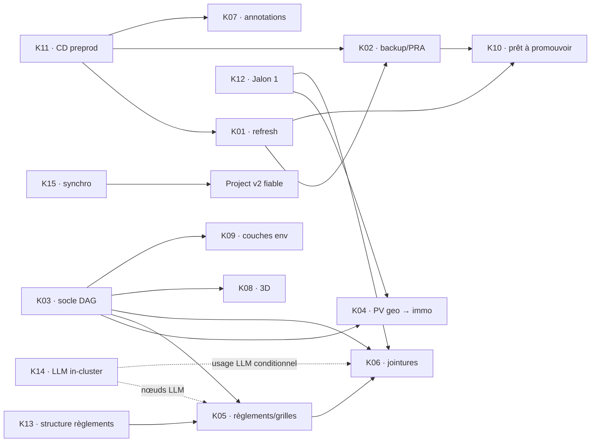

# Dossier de décision — Kanban GitHub et itération v3

Empreintes canoniques v3 : plan `6d16b085c54b1b69e6314a91fe5f5938af2cdbbc7191bd2ff356abfa20318e7e` · dossier `baae7ebcf0cf9b98ed84f3cdc00a68b86bd3b4972f8ed96f4bdd7642933dc465`.
Calcul reproductible : plan = SHA-256 des octets à partir de la ligne 3 de `KANBAN_V3_PLAN.md`; dossier = SHA-256 des octets à partir de la ligne 5 du présent fichier. Les lignes d'empreinte auto-référentes sont donc exclues. Bases du diff v2 : plan `13d279401694bcc478088ca8613ec21ddc47892d676e7d11734a247f5593be03`; dossier `4ac037c006c736fb4cda37bcaf842b6f6ceb203d02601fb17ff7988eb1d8bf9f`.

Date : 2026-09-15 · Conductor : `i-cond` · Statut : **PRÊT POUR RE-REVUE SUR DIFF, NON APPLIQUÉ**.

Sources relues : revues Astra et Fable v2; dossier owner du 2026-09-14; Track immo `/home/antoinefa/src/radar-immobilier/.lanes/conductor/.track` (`ce3a92fd…`); Track geo `/home/antoinefa/src/geo/.track` (`1bd767d1…`); schéma GraphQL GitHub et PR #694, en lecture seule le 2026-09-15. Aucun acte GitHub ou Track n'a été exécuté.

## 1. Synthèse d'une page

- Le flow ratifié comporte neuf valeurs : `Backlog` → `À prioriser` → `Priorisé pour l’itération` → `En cours de design` → `En cours de dev` → `En cours de revue interne` → `Déployé sur preprod (UAT)` → `À déployer sur prod` → `En prod (clos)`.
- La surface reste de 15 issues dans `rhanka/radar-immobilier` : 8 P1 à sortie preprod cible J+7 et 7 P2 à sortie preprod cible J+21. Les 15, y compris K14, démarrent dans `À prioriser`; aucune ne démarre dans `Backlog`.
- Track est la vérité de l'état, des décisions, des dépendances et de la priorité. Le Project v2 est une vue. Jusqu'à livraison de K15, `i-cond` compare la matrice K01–K15 avant tout déplacement et arrête la promotion en cas d'écart.
- Le champ intégré `Status` est tenté par GraphQL avec les neuf options. Ce chemin est **non testé** faute des scopes `project,read:project`; le script contrôle `.errors`, relit exactement neuf options et s'arrête avant toute issue au premier écart. Repli documenté : champ single-select `Étape`; ses workflows intégrés restent non-vérifiés.
- Les trois vues `Livraison`, `P1 — 7 jours` et `P2 — 21 jours` sont créées avec `createProjectV2View`, layout `BOARD_LAYOUT`, puis filtrées par `updateProjectV2View`. Groupement par `Status` et workflows restent des gestes UI non testés.
- Chaque issue est retrouvée par `<!-- kanban-v2:Kxx -->`, sur toutes les pages et tous les états; zéro ou un résultat est admis. Au rejeu, seule la section possédée du corps et les labels possédés sont synchronisés; P1/P2 restent exclusifs. Le `Status` n'est initialisé que lors de la création de la carte.
- Toute PR liée emploie `Refs #n`; `Closes #n` est interdit. Une issue n'est close qu'après UAT, promotion prod vérifiée et terminaison de tous ses items Track porteurs.
- Le hold owner de K02 est conservé : « ne pas lancer avant clôture des 4 chantiers ». Trois preuves sont déjà citées; K01 est le quatrième. Le démarrage exige aussi le versioning S3, un bucket prod distinct et la source `infra/ovh` de `poc-k8s` sur `main`.
- K03 accepte le socle DAG indépendamment des pipelines : artefacts S3 immuables, hash de changement, promotion atomique et un canari non-LLM en geo-preprod. Chaque pipeline garde ensuite ses propres prérequis et preuves; K14 bloque seulement les livrables qui consomment un nœud LLM.
- Charges owner sourcées au 14/09 : K01 1 h, K02 3 h, K03–K06 2 h chacune, K07 3 h, K08 1 h, soit 16 h. K09–K15, le travail exécutant et la capacité de livraison sont `source-gap`. Le calendrier ci-dessous prouve seulement la faisabilité de validations owner ≤ 1 h par fenêtre glissante de 5 jours.
- WIP conservé du dossier v1 : design 3, dev 4, revue 4, UAT 3, à déployer prod 2; la taille de `Priorisé pour l’itération` est celle ratifiée par l'owner.

## 2. Issues ratifiables

`Validation` est une réservation de calendrier `[JUGEMENT]`, sous-ensemble de la charge owner totale; `Exécutant` reste `source-gap` tant qu'une capacité n'est pas mesurée.

| ID | Titre exact | Portée / WP responsable | P | Départ | Charge owner totale | Validation | Exécutant | Cible preprod | Dépend de |
|---|---|---|---|---|---:|---:|---|---|---|
| K01 | Stabiliser le refresh PV → signaux et son benchmark | immo · WP7 | P1 | À prioriser | 1 h | 15 min J+5 | source-gap | 2026-09-22 | K11 |
| K02 | Backup planifié Postgres + S3 et PRA | immo · WP7 | P1 | À prioriser | 3 h | 15 min J+5 | source-gap | 2026-09-22 | K11, K01 |
| K03 | DAG geo pour industrialiser toute source | geo · migration pipelines | P1 | À prioriser | 2 h | 15 min J+5 | source-gap | 2026-09-22 | décision moteur; K14 seulement pour consommateurs LLM |
| K04 | Migrer l'acquisition PV vers geo et les signaux servis vers immo | geo+immo · WP4 PV / WP5 jointures · WP immo proposé | P2 | À prioriser | 2 h | 15 min J+10 | source-gap | 2026-10-06 | K03, K12, contrat V34 |
| K05 | Industrialiser règlements et grilles | geo+immo · WP3 règlements · WP6 immo | P2 | À prioriser | 2 h | 15 min J+10 | source-gap | 2026-10-06 | K03, K13, K14 si LLM |
| K06 | Industrialiser le mapping signal × zones × règlements | geo+immo · WP5 jointures · WP immo | P2 | À prioriser | 2 h | 20 min J+15 | source-gap | 2026-10-06 | K05, K12, K14 si LLM usage |
| K07 | Annoter signaux et villes | immo · WP6 | P2 | À prioriser | 3 h | 20 min J+15 | source-gap | 2026-10-06 | K11 |
| K08 | Produire le plan et le spike 3D | geo+immo · WP6 archi · WP6 immo | P2 | À prioriser | 1 h | 20 min J+15 | source-gap | 2026-10-06 | K03 |
| K09 | Servir les couches environnementales et user custom | geo+immo · WP6 archi proposé · WP1 immo | P2 | À prioriser | source-gap | 15 min J+10 | source-gap | 2026-10-06 | K03 |
| K10 | Armer le CronJob refresh en production | immo · WP1 | P1 | À prioriser | source-gap | 15 min J+5 | source-gap | 2026-09-22 : CronJob prêt à promouvoir, preuve preprod | K01, K02 |
| K11 | Rétablir le CD preprod et le reconcile des manifests | immo · WP7 | P1 | À prioriser | source-gap | 15 min J0 | source-gap | 2026-09-22 | — |
| K12 | Requalifier Jalon 1 : recall, ontologie, ground truth | geo+immo · WP5 jointures proposé · WP immo proposé | P1 | À prioriser | source-gap | 15 min J0 | source-gap | 2026-09-22 | — |
| K13 | Trancher la structure documentaire des règlements | geo+immo · WP3 règlements · WP8 immo | P1 | À prioriser | source-gap | 15 min J0 | source-gap | 2026-09-22 | — |
| K14 | Cadrer puis lancer le LLM in-cluster geo | geo · WP7 deploy · WP immo proposé | P2 | À prioriser | source-gap | 15 min J+10 | source-gap | 2026-10-06 | bloque K05 et K06 sur leurs nœuds LLM |
| K15 | Synchroniser Track, Git et le Kanban | immo · WP9 | P1 | À prioriser | source-gap | 15 min J0 | source-gap | 2026-09-22 | — |

Source des charges K01–K08 : proposition owner du 2026-09-14, dossier v1 §3.1, total mesuré 16 h. Les durées de validation ne ré-estiment pas ces charges; elles réservent les décisions/UAT. Les labels geo suivent les titres Track réels : `wp:geo-wp3-reglements`, `wp:geo-wp4-pv`, `wp:geo-wp5-jointures`, `wp:geo-wp6-archi`, `wp:geo-wp7-deploy`, `wp:geo-migration-pipelines`.

## 3. Correspondance unique Track ↔ GitHub

Les IDs `URL[Kxx]` et `CARD[Kxx]` sont résolus et relus par G; ils ne sont pas inventés avant la création. `Porteurs` gouverne priorité et terminaison. `Contexte` est conservé dans la correspondance mais n'empêche pas seul la clôture.

| K | Dépôt issue | Porteurs Track actifs | Contexte / historique Track | URL issue après G | id carte après G |
|---|---|---|---|---|---|
| K01 | `rhanka/radar-immobilier` | immo `01M2GY9QTN1PJBH6X6NW94601G` | issue support #663 | `URL[K01]` | `CARD[K01]` |
| K02 | `rhanka/radar-immobilier` | immo `01M2F4TCT2Q3TJW8NYCEWVTHY0` | doublon DROPPED `01M2F4S34R8KCRXCSX339V6TBB`; issue support #660 | `URL[K02]` | `CARD[K02]` |
| K03 | `rhanka/radar-immobilier` | geo `$K03_ID` créé/relu sous WP migration | WP `01M0N3PGJPY3FK8Y3ACXNV17A8`; dossier `01M0GWZW2753PV92WJ2PGX5GS2`; décision `01M0JAMM5YWV1ZH8D6R47RA9A8` | `URL[K03]` | `CARD[K03]` |
| K04 | `rhanka/radar-immobilier` | immo `01M18979R5ZJQQXNTB218H19ZY` | WP immo proposé | `URL[K04]` | `CARD[K04]` |
| K05 | `rhanka/radar-immobilier` | immo `01M1A7Y3M32VWHD07G00BXJCS8` | — | `URL[K05]` | `CARD[K05]` |
| K06 | `rhanka/radar-immobilier` | immo `01KW7HWBVFG5AYV7T0X7GWDQQZ`, `01KW7HWC05G2DX55M6D5STKP07` | — | `URL[K06]` | `CARD[K06]` |
| K07 | `rhanka/radar-immobilier` | immo `01M062D1FQENDZP3M5RVD9A6SV` | — | `URL[K07]` | `CARD[K07]` |
| K08 | `rhanka/radar-immobilier` | immo `01M062D1WC6CJVQBA197WMEN62`; geo `01M01MDJX95PDSQFWBTYXJ45JK`, `01M01MDYE1VTYYN6Y5R1QQB5DZ` | — | `URL[K08]` | `CARD[K08]` |
| K09 | `rhanka/radar-immobilier` | immo `01M062D2D7F196M6EJ10X929NX`; geo `01KZH14D9W5FWEV9QEAFC2PPT6` | WP geo proposé | `URL[K09]` | `CARD[K09]` |
| K10 | `rhanka/radar-immobilier` | immo `01M062D20KCJ9FBTVCMYFZC9NA` | — | `URL[K10]` | `CARD[K10]` |
| K11 | `rhanka/radar-immobilier` | immo `01M2GYBYHGGGXM0J5SF5GM5SNB` | incident DONE `01M1Q7STYNCD0P936D3Y4JPQDX`; issue support #660 | `URL[K11]` | `CARD[K11]` |
| K12 | `rhanka/radar-immobilier` | immo `01M189A10EH828F6X580480T36` | WP immo proposé | `URL[K12]` | `CARD[K12]` |
| K13 | `rhanka/radar-immobilier` | immo `01M0SRPNZSBKWDPK1P7ZHQ3C3A` | — | `URL[K13]` | `CARD[K13]` |
| K14 | `rhanka/radar-immobilier` | immo `01M197X0076A87ZS8KEVT426VF` | WP immo proposé | `URL[K14]` | `CARD[K14]` |
| K15 | `rhanka/radar-immobilier` | immo `01KW7HWE1QFZW7H5W4ZBT71Q4K`, `01KW2KS5K2D1Y7KGYF41ZAZGSW` | — | `URL[K15]` | `CARD[K15]` |

Règle multi-items : tous les porteurs actifs reçoivent la même évaluation WSJF lors de l'application initiale; si Track diverge ensuite, la carte prend la priorité la plus haute (`P1` gagne) sans réécrire Track. Une carte n'est terminale que si tous ses porteurs sont `DONE` ou explicitement `DROPPED` par décision ratifiée, que l'UAT est acceptée et que la promotion prod est prouvée. Tout `TO-DO`, `AWAITED`, `in-progress` ou preuve manquante interdit `En prod (clos)`.

## 4. Dépendances

Le hold K02 signifie ici : K11 rétabli, puis K01 clos au jalon « cycle refresh preprod prouvé »; MinIO/SCW (#683/#685), cluster r2-15 (`e8e2d0b`) et rapport (#691) sont déjà cités comme clos. Cela produit l'arête K01 → K02 sans cycle avec K10. La décision M1 `01M2GYBAPRZ35RXPJPJQG89H1T` est bien B/go, ce qui règle le choix de modèle sans lever le hold. K02 ne démarre pas tant que `poc-k8s/infra/ovh` n'est pas sur `main`, que le versioning S3 et le bucket prod distinct ne sont pas prouvés, et que le périmètre Postgres radar prod/préprod + geo + sentropic + openerp n'est pas conservé ou réduit par décision owner.

### Matrice source → DAG → prérequis → preuve

| Source / lane | DAG ou carte | Prérequis avant préparation | Preuve de sortie |
|---|---|---|---|
| Zones vectorielles | DAG `zones` | K03; adaptateur WFS/ArcGIS/AGOL/JMap | artefact S3 versionné, `proofFromFetched`, readback et promotion atomique |
| Normes / grilles | K05 · DAG `normes/grilles` | K03, K13; K14 si résidu LLM | cascade native→OCR→LLM gated, registre versionné, receipt fail-closed |
| PV | K04 · DAG `PV` | K03, K12, contrat frontière V34 | dual-run, documents capturés, événements `zone-change-candidate`, parité servie à immo |
| Règlements | K05 · DAG `règlement` | K03, K13; K14 si numéro/millésime ambigu | registre versionné, `fold-reglement-to-zonage`, readback |
| Usage dominant | K06 · DAG `usage dominant` | K03, K05; K14 si `prefix_map` doit être proposé | `prefix_map` validé puis `fold-usage-dominant` |
| Effet densifiant | K06 · DAG `effet densifiant` | K05 | diff de deux versions du registre normes; aucun LLM |
| Cadastre / rôle | hors itération, `source-gap` | K03, ADR Loi 25 ratifiée, allowlist, buckets/credentials séparés | `PII_REFUSED`, aucune copie raw en preprod, aucun LLM |
| Immo-lots | K06 · DAG `immo-lots` | K03, K05, K12; producteurs cadastre/rôle selon portée | hashes amont, `lotZoneJoin`, `enrichWithNorms`, `qc-lots-<slug>`; aucun LLM |
| Couches environnementales | K09 · instance à préparer, hors des 8 lanes formelles | K03; priorisation BDZI/GRHQ/CPTAQ/user | receipt par couche, provenance et readback; famille DAG à figer (`source-gap`) |
| 3D | K08 · spike, hors des 8 lanes formelles | K03 seulement si le spike devient pipeline | plan d'une page + spike mesuré; industrialisation `source-gap` |

## 5. Calendrier owner J0 → J+21

Les créneaux sont espacés de cinq jours pleins; toute fenêtre glissante de cinq jours contient au plus 60 minutes réservées. Les validations sont agrégées; les 16 h de charge owner comprennent aussi cadrage, décisions et préparation hors UAT.

| Jour | Date | Validation agrégée | Total fenêtre | Sortie visée |
|---|---|---|---:|---|
| J0 | 2026-09-15 | K11, K12, K13, K15 · 15 min chacun | 60 min | contrats/gates P1 acceptés |
| J+5 | 2026-09-20 | K01, K02, K03, K10 · 15 min chacun | 60 min | UAT/preuves P1 avant J+7 |
| J+10 | 2026-09-25 | K04, K05, K09, K14 · 15 min chacun | 60 min | contrats et canaris P2 |
| J+15 | 2026-09-30 | K06, K07, K08 · 20 min chacun | 60 min | UAT P2 |
| J+20 | 2026-10-05 | réserve agrégée de décision finale P2 | ≤ 60 min | écarts avant J+21 |
| J+21 | 2026-10-06 | aucune nouvelle réservation | 0 min | cible preprod P2 |

Ce calendrier démontre la contrainte de validation, pas la capacité de production. Heures, parallélisme et disponibilité des exécutants sont `source-gap`; les dates J+7/J+21 restent des cibles jusqu'à mesure de cette capacité.

## 6. Plan de commandes, non exécuté

1. Faire produire `.remote/KANBAN_V3_REVIEW_ASTRA.md` et `.remote/KANBAN_V3_REVIEW_FABLE.md` sur le SHA-256 **complet** du plan v3. Chaque fichier doit porter exactement un `verdict: APPROVE|APPROVE-WITH-NITS` et un `target-sha256` égal aux octets exécutés.
2. Avant la première écriture T, la garde commune relit les deux fichiers, leurs verdicts et le SHA complet du plan; elle exige seulement `IT3=apply`. T crée/retrouve K03, le relit après T02, garde `decision select` idempotent, consigne la matrice par hash, puis seulement consolide/rattache/évalue.
3. Avant la première écriture G, la même garde est rejouée. G vérifie les scopes; résout le projet; met à jour `Status` sans `projectId`; contrôle `.errors` et les neuf options avant labels/issues; crée les 15 issues par marqueur; relit `$K03_ID`; crée les cartes et initialise leur statut seulement à la création.
4. G fait une deuxième passe sur les corps pour remplacer chaque dépendance Kxx par son URL, crée/relit les trois vues `BOARD_LAYOUT`, puis compare les 15 lignes de correspondance attendues aux issues/cartes relues.
5. Dans l'UI, grouper les vues par `Status`; configurer dépôt `rhanka/radar-immobilier`, filtre `is:issue label:kanban`; activer `item added → Backlog`, `item closed → En prod (clos)` et l'archivage. Ces gestes sont non testés. Ne fermer qu'après les gates; toutes les PR disent `Refs #n`.
6. Adopter #663 comme travail support de K01 et #660 comme travail support de K02/K11 par liens explicites. Ils ne reçoivent pas `kanban`, mesure nécessaire pour garder exactement 15 cartes owner.
7. Rejouer le plan après avancement simulé : renommage d'une issue, statut avancé, interruption après création d'une carte, priorité Track déjà évaluée et décision déjà sélectionnée. Le rejeu doit préserver le statut, les commentaires et les labels non possédés, et s'arrêter sur toute collision.

Les commandes exactes, gardes et assertions sont dans `.remote/KANBAN_V3_PLAN.md`. Aucune option `CHARGE=N-A|corriger` ni `VIEWS=manual-go|defer` n'est offerte : les charges sourcées sont fixées, les autres sont `source-gap`, et les vues font partie du lot `IT3=apply`.
