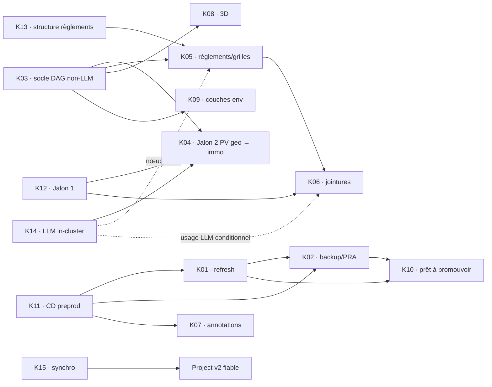

# Dossier de décision — Kanban GitHub et itération v6

Date : 2026-09-15 · Conductor : `i-cond` · Statut : **PRÊT POUR RE-REVUE SUR DIFF, NON APPLIQUÉ**.

Sources relues : re-revues Astra et Fable v5; dossier owner du 2026-09-14; verbatim owner du 2026-09-15; Track immo et geo en lecture seule; branche au head `dda78aebcbe6677a5c07e19dbc929a136a48bcf1` avant édition; schéma GraphQL GitHub. Aucun acte GitHub ou Track n'a été exécuté.

## 1. Synthèse et ratification demandée

- `IT5=apply` ratifie ce dossier et la matrice K01–K15; `IT5=revise` interdit toute écriture Track, GitHub ou repli. La garde exige deux avis favorables portant chacun les SHA-256 complets du plan **et** du dossier v6.
- Le flow comporte neuf valeurs : `Backlog` → `À prioriser` → `Priorisé pour l’itération` → `En cours de design` → `En cours de dev` → `En cours de revue interne` → `Déployé sur preprod (UAT)` → `À déployer sur prod` → `En prod (clos)`.
- La surface reste de 15 issues : 8 P1 et 7 P2. Les 15, K14 comprise, entrent dans la décision par `À prioriser`; cette lane n'est pas le champ `realization` Track. Les quatre porteurs déjà `in-progress` le restent, et une carte existante ne reçoit jamais une nouvelle valeur `Status` au rejeu.
- Track est l'autorité de la réalisation, des décisions, des dépendances et de la priorité. Le Project v2 projette le workflow Git/UAT sans recopier littéralement `realization`; toute divergence de la matrice ratifiée arrête l'exécution.
- Chaque issue est identifiée par `<!-- kanban-v2:Kxx -->`. Le contrôle final relit chaque marqueur avec `gh issue list`, chaque porteur avec `track item show`, chaque carte sur la liste exhaustive du projet et échoue à la première absence.
- K04/Jalon 2 exige K03, K12, le contrat V34 et K14 : son porteur Track demande l'écriture automatisée du graphe standard et le porteur K14 dit que cette cible a besoin du LLM in-cluster. K03 garde son canari non-LLM indépendant.
- K14 relève de geo `wp7: socle` (`01KYYYB3TJ525EA477EDZCMXTE`, `to-do` mesuré), jamais du WP `wp7: deploy` annulé. Les six WP geo utilisés sont relus et leur `realization` est contrôlée avant la création des labels.
- **Point `source-gap` à ratifier — charges K03–K06.** Le dossier du 14/09 porte 2 h par carte et un total historique de 16 h; le verbatim owner ultérieur dit « ma charge = 1 ou 3h » et demande `N-A` sinon. Le v6 n'invente pas de valeur applicable : K03–K06 restent `source-gap` jusqu'à choix owner; le total applicable confirmé est 8 h pour K01, K02, K07 et K08.
- **Point `source-gap` à ratifier — priorité/délai.** K02 et K10 restent P1 d'après la priorité owner, mais la chaîne dure K01 → K02 → K10 empêche trois sorties à J+7. Les cibles sont recalculées au 29/09 pour K02 et au 06/10 pour K10; cette exception au sens « P1 = preprod J+7 » doit être acceptée ou les priorités révisées.
- **Hold backup K02 restauré.** Verbatim owner : « ne pas lancer avant clôture des 4 chantiers ». #683/#685 (MinIO/SCW), le cluster r2-15 `e8e2d0b` et #691 sont clos; K01 clos au jalon « cycle refresh preprod prouvé » est le quatrième. Le démarrage exige aussi `poc-k8s/infra/ovh` sur `main`, versioning S3 et bucket prod distinct prouvés, le périmètre Postgres radar prod/préprod + geo + sentropic + openerp et les rétentions daily 7 jours / weekly 1 mois / monthly 6 mois. La décision M1 `01M2GYBAPRZ35RXPJPJQG89H1T` B/go ne lève pas ce hold.
- Cette version gelée fixe l'ancre au mardi 15/09/2026 et les dates exécutables au 15/09, 22/09, 29/09 et 06/10. Toute autre ancre exige une nouvelle version du plan et du dossier, regélée et ratifiée avant T/G. Une fenêtre de cinq jours ouvrés contient au plus 60 minutes réservées, UAT asynchrones comprises. La capacité exécutant reste `source-gap`; les cibles ne prouvent pas la capacité de production.
- Toute PR liée emploie `Refs #n`; `Closes #n` est interdit. Une issue n'est close qu'après UAT, promotion prod vérifiée et terminaison de tous ses porteurs Track.
- Le chemin GraphQL du champ intégré `Status` et les vues sont non testés faute de scopes. Le repli `Étape` est un bloc séparé, gardé avant sa première écriture; aucune poursuite automatique ne suit un échec `Status`.

## 2. Issues ratifiables et ventilation owner

`Charge owner totale` inclut la validation lorsqu'une valeur est applicable. `Validation` est une réservation `[JUGEMENT]`. `Exécutant` reste `source-gap` pour chaque carte tant qu'une capacité n'est pas mesurée.

| ID | Titre exact | Portée / WP | P | Départ | Charge owner totale | Validation owner | Exécutant | Cible preprod | Dépend de |
|---|---|---|---|---|---|---|---|---|---|
| K01 | Stabiliser le refresh PV → signaux et son benchmark | immo · WP7 | P1 | À prioriser | 1 h | 15 min · JO+5 · 22/09 | source-gap | 2026-09-22 | K11 |
| K02 | Backup planifié Postgres + S3 et PRA | immo · WP7 | P1 | À prioriser | 3 h | 12 min · JO+10 · 29/09 | source-gap | 2026-09-29 | K11, K01 |
| K03 | DAG geo pour industrialiser toute source | geo · migration pipelines | P1 | À prioriser | source-gap · historique 2 h | 15 min · JO+5 · 22/09 | source-gap | 2026-09-22 | décision moteur; K14 seulement pour consommateurs LLM |
| K04 | Migrer l'acquisition PV vers geo et les signaux servis vers immo | geo+immo · WP4 PV / WP5 jointures · WP immo proposé | P2 | À prioriser | source-gap · historique 2 h | 12 min · JO+10 · 29/09 | source-gap | 2026-09-29 | K03, K12, K14, contrat V34 |
| K05 | Industrialiser règlements et grilles | geo+immo · WP3 règlements · WP6 immo | P2 | À prioriser | source-gap · historique 2 h | 12 min · JO+10 · 29/09 | source-gap | 2026-09-29 | K03, K13, K14 si LLM |
| K06 | Industrialiser le mapping signal × zones × règlements | geo+immo · WP5 jointures · WP immo | P2 | À prioriser | source-gap · historique 2 h | 15 min · JO+15 · 06/10 | source-gap | 2026-10-06 | K05, K12, K14 si LLM |
| K07 | Annoter signaux et villes | immo · WP6 | P2 | À prioriser | 3 h | 15 min · JO+15 · 06/10 | source-gap | 2026-10-06 | K11 |
| K08 | Produire le plan et le spike 3D | geo+immo · WP6 archi · WP6 immo | P2 | À prioriser | 1 h | 15 min · JO+15 · 06/10 | source-gap | 2026-10-06 | K03 |
| K09 | Servir les couches environnementales et user custom | geo+immo · WP6 archi proposé · WP1 immo | P2 | À prioriser | source-gap | 12 min · JO+10 · 29/09 | source-gap | 2026-09-29 | K03 |
| K10 | Armer le CronJob refresh en production | immo · WP1 | P1 | À prioriser | source-gap | 15 min · JO+15 · 06/10 | source-gap | 2026-10-06 : prêt à promouvoir, preuve preprod | K01, K02 |
| K11 | Rétablir le CD preprod et le reconcile des manifests | immo · WP7 | P1 | À prioriser | source-gap | 12 min · JO+0 · 15/09 | source-gap | 2026-09-22 | — |
| K12 | Requalifier Jalon 1 : recall, ontologie, ground truth | geo+immo · WP5 jointures · WP immo proposé | P1 | À prioriser | source-gap | 12 min · JO+0 · 15/09 | source-gap | 2026-09-22 | — |
| K13 | Trancher la structure documentaire des règlements | geo+immo · WP3 règlements · WP8 immo | P1 | À prioriser | source-gap | 12 min · JO+0 · 15/09 | source-gap | 2026-09-22 | — |
| K14 | Cadrer puis lancer le LLM in-cluster geo | geo · WP7 socle · WP immo proposé | P2 | À prioriser | source-gap | 12 min · JO+5 · 22/09 | source-gap | 2026-09-22 | gate K04; bloque K05/K06 sur leurs nœuds LLM |
| K15 | Synchroniser Track, Git et le Kanban | immo · WP9 | P1 | À prioriser | source-gap | 12 min · JO+0 · 15/09 | source-gap | 2026-09-22 | — |

Sources de charge : K01 1 h, K02 3 h, K03–K06 2 h historiques, K07 3 h et K08 1 h viennent du dossier owner du 14/09 §3.1. Le verbatim du 15/09 rend les quatre valeurs 2 h contradictoires; elles restent informatives, non applicables, jusqu'à ratification. Total applicable confirmé : 8 h; total historique : 16 h; total final : `source-gap`.

Bornes WIP : `Priorisé pour l’itération` = taille ratifiée `[FAIT : décision owner]`; design 3 `[JUGEMENT]`; dev 4 `[FAIT : maximum quatre branches actives]`; revue 4 `[JUGEMENT non sourcé]`; UAT 3 et à déployer prod 2 `[JUGEMENT : draft non ratifié]`.

## 3. Correspondance unique Track ↔ GitHub

Les placeholders URL/carte ne sont résolus qu'à l'exécution. `Porteurs` gouverne priorité et terminaison. La passe finale reconstruit cette table depuis `gh issue list` par marqueur et `track item show`; `$K03_ID` est interpolé avant le contrôle.

| K | Porteurs Track actifs | Contexte / survivants | URL issue après G | id carte après G |
|---|---|---|---|---|
| K01 | immo `01M2GY9QTN1PJBH6X6NW94601G` | support #663 | `URL[K01]` | `CARD[K01]` |
| K02 | immo `01M2F4TCT2Q3TJW8NYCEWVTHY0` | doublon `01M2F4S34R8KCRXCSX339V6TBB` déjà DROPPED; support #660 | `URL[K02]` | `CARD[K02]` |
| K03 | geo `$K03_ID` | WP migration `01M0N3PGJPY3FK8Y3ACXNV17A8`; dossier `01M0GWZW2753PV92WJ2PGX5GS2` | `URL[K03]` | `CARD[K03]` |
| K04 | immo `01M18979R5ZJQQXNTB218H19ZY` | Jalon 2; WP immo proposé | `URL[K04]` | `CARD[K04]` |
| K05 | immo `01M1A7Y3M32VWHD07G00BXJCS8` | — | `URL[K05]` | `CARD[K05]` |
| K06 | immo `01KW7HWBVFG5AYV7T0X7GWDQQZ`, `01KW7HWC05G2DX55M6D5STKP07` | — | `URL[K06]` | `CARD[K06]` |
| K07 | immo `01M062D1FQENDZP3M5RVD9A6SV` | — | `URL[K07]` | `CARD[K07]` |
| K08 | immo `01M062D1WC6CJVQBA197WMEN62`; geo `01M01MDJX95PDSQFWBTYXJ45JK`, `01M01MDYE1VTYYN6Y5R1QQB5DZ` | — | `URL[K08]` | `CARD[K08]` |
| K09 | immo `01M062D2D7F196M6EJ10X929NX`; geo `01KZH14D9W5FWEV9QEAFC2PPT6` | WP geo proposé | `URL[K09]` | `CARD[K09]` |
| K10 | immo `01M062D20KCJ9FBTVCMYFZC9NA` | survivant KPI `01M062D290BVPD126NSPTHWREJ` conservé | `URL[K10]` | `CARD[K10]` |
| K11 | immo `01M2GYBYHGGGXM0J5SF5GM5SNB` | incident DONE `01M1Q7STYNCD0P936D3Y4JPQDX`; support #660 | `URL[K11]` | `CARD[K11]` |
| K12 | immo `01M189A10EH828F6X580480T36` | WP immo proposé | `URL[K12]` | `CARD[K12]` |
| K13 | immo `01M0SRPNZSBKWDPK1P7ZHQ3C3A` | — | `URL[K13]` | `CARD[K13]` |
| K14 | immo `01M197X0076A87ZS8KEVT426VF` | geo WP7 socle `01KYYYB3TJ525EA477EDZCMXTE` | `URL[K14]` | `CARD[K14]` |
| K15 | immo `01KW7HWE1QFZW7H5W4ZBT71Q4K`, `01KW2KS5K2D1Y7KGYF41ZAZGSW` | — | `URL[K15]` | `CARD[K15]` |

Tous les porteurs actifs reçoivent la même évaluation initiale par carte. Un changement Track ultérieur arrête G au préflight; il n'est pas masqué par un label statique. Une carte n'est terminale que si tous ses porteurs sont `DONE` ou `DROPPED` par décision ratifiée, l'UAT est acceptée et la promotion prod est prouvée.

## 4. Dépendances et portée DAG

K04 ne peut être réputée sortie qu'après une preuve de bout en bout : acquisition PV dans geo, écriture automatisée du graphe standard par geo, overlay de complétion immo, parité V34 et signaux servis. K14 ne gate pas le canari non-LLM de K03.

Le hold K02 reste distinct du choix de modèle M1 : K11 rétabli puis K01 clos complètent les quatre chantiers avec #683/#685, r2-15 `e8e2d0b` et #691. K02 ne démarre pas avant `poc-k8s/infra/ovh` sur `main`, preuve du versioning S3 et d'un bucket prod distinct, maintien du périmètre Postgres radar prod/préprod + geo + sentropic + openerp, et contrat de rétention daily 7 jours / weekly 1 mois / monthly 6 mois.

| Source / lane | Carte | Prérequis | Preuve de sortie |
|---|---|---|---|
| Zones vectorielles | K03 · DAG `zones` | adaptateur WFS/ArcGIS/AGOL/JMap | artefact S3 versionné, `proofFromFetched`, readback, promotion atomique |
| Normes / grilles | K05 | K03, K13; K14 si résidu LLM | cascade native→OCR→LLM gatée, registre versionné, receipt fail-closed |
| PV / Jalon 2 | K04 | K03, K12, K14, V34 | dual-run, graphe standard geo, overlay immo, événements et parité servie |
| Règlements | K05 | K03, K13; K14 si numéro/millésime ambigu | registre versionné, fold, readback |
| Usage dominant | K06 | K05, K12; K14 si proposition de `prefix_map` | `prefix_map` validé puis fold |
| Effet densifiant | K06 | K05 | diff de deux versions du registre; aucun LLM |
| Cadastre / rôle | hors itération · `source-gap` | ADR Loi 25, allowlist, stockage séparé | `PII_REFUSED`, aucune copie raw en preprod, aucun LLM |
| Immo-lots | hors itération · `source-gap` | producteurs cadastre/rôle non retenus dans ce lot | aucune sortie K06; futur lot après producteurs et preuve de fraîcheur |
| Couches environnementales | K09 | K03; priorisation BDZI/GRHQ/CPTAQ/user | receipt par couche, provenance et readback |
| 3D | K08 · spike | K03 seulement si pipeline | plan d'une page et spike mesuré |

## 5. Labels possédés

Les 20 labels sont : `P1`, `P2`, `data`, `infra`, `app`, `geo`, `kanban`; `wp:immo-WP1-sources-substrat`, `wp:immo-WP4-reconciliation-preuve`, `wp:immo-WP5-recette-parite`, `wp:immo-WP6-produit`, `wp:immo-WP7-plateforme-deploiement`, `wp:immo-WP8-spec-contrats`, `wp:immo-WP9-gouvernance`; `wp:geo-wp3-reglements`, `wp:geo-wp4-pv`, `wp:geo-wp5-jointures`, `wp:geo-wp6-archi`, `wp:geo-wp7-socle`, `wp:geo-migration-pipelines`.

## 6. Calendrier owner en jours ouvrés

`JO+0` est fixé au mardi 15/09/2026 dans cette version. Une autre ancre interdit l'exécution de T/G et exige une nouvelle version gelée. Les créneaux hebdomadaires du mardi empêchent qu'une fenêtre de cinq jours ouvrés contienne deux réservations.

| Jour ouvré | Date | Validation agrégée | Total | Sortie visée |
|---|---|---|---:|---|
| JO+0 | mar. 2026-09-15 | K11, K12, K13, K15 · 12 min chacun; arbitrages IT5 · 12 min | 60 min | gates P1 et deux `source-gap` ratifiés |
| JO+5 | mar. 2026-09-22 | K01, K03 · 15 min chacun; K14 · 12 min; UAT asynchrones K11/K12/K13/K15 · 4 min chacune | 58 min | K01 close avant démarrage K02; socle K03 et gate K14 acceptés; quatre UAT closes |
| JO+10 | mar. 2026-09-29 | K02, K04, K05, K09 · 12 min chacun | 48 min | K02 après K01; contrats/canaris P2 |
| JO+15 | mar. 2026-10-06 | K10, K06, K07, K08 · 15 min chacun | 60 min | K10 après K02; UAT P2 |

Chemin critique : K11 → K01 (22/09) → K02 (29/09) → K10 (06/10). Les UAT de K11/K12/K13/K15 sont asynchrones mais budgétées à 4 minutes chacune, soit 16 minutes incluses dans JO+5 : 42 + 16 = 58 minutes sur la fenêtre de cinq jours ouvrés. Les horaires, le parallélisme et la capacité exécutant sont `source-gap`; sans mesure de capacité, chaque date est une cible conditionnelle.

## 7. Plan de commandes, non exécuté

1. Produire deux revues v6 sur le même couple d'octets. Chacune porte exactement un verdict favorable, un `plan-sha256` complet et un `dossier-sha256` complet.
2. Avant la première écriture de T, G et du repli, `guard_consensus` recalcule les deux hashes et les compare aux deux revues. `IT_CONTEXT` reprend les variables déjà vérifiées.
3. T vérifie chaque sortie JSON, compare le contexte et les cibles d'une décision existante, conserve le survivant KPI, puis relit chaque effet. Une erreur de lecture n'est jamais convertie en absence.
4. Après T, l'opérateur conserve ses deux lignes de sortie et exporte leurs valeurs comme `Q1_DECISION_ID=<id Q1>` et `IT5_DECISION_ID=<id IT5>` dans l'environnement de `MODE=G`. Avant toute mutation, G exige ces IDs, vérifie option sélectionnée, outcome, cibles, contexte courant et deux hashes; toute absence ou divergence arrête. Il contrôle ensuite les listes exhaustives de projets et cartes. Une valeur de statut est écrite uniquement dans la branche où l'ajout d'une nouvelle carte vient d'être prouvé.
5. G relit les WP geo, puis les 15 issues par marqueur, les 20 porteurs avec `track item show`, les corps, dépendances, priorités et card IDs. La table runtime est conservée comme artefact hashé lié à la décision d'itération.
6. Le repli crée seulement `Étape` après sa propre garde, vérifie ses neuf options puis s'arrête. Toute suite est régénérée et revue avant sa première mutation.

## 8. Cas contre et pré-mortem

- Cas contre : le Project peut devenir une seconde vérité. Renversement : arrêter les déplacements, conserver Track et supprimer seulement les éléments possédés après décision owner.
- Pré-mortem : une page de cartes tronquée ferait reculer un statut. Mesure : `totalCount == length(items)` et arrêt au plafond avant la première mutation concernée.
- Pré-mortem : les quatre charges litigieuses seraient traitées comme acquises. Mesure : valeurs applicables `source-gap`, affichage de la source historique et ratification explicite en §1.
- Intérêt owner : une surface unique de 15 chantiers, sans masquer les dépendances, l'effort inconnu ni les preuves de sortie.

Question owner : `IT5=apply` accepte les 15 cartes, les deux `source-gap` de §1, le hold K02 complet, le calendrier ancré au 15/09/2026, K04 gatée par K03+K14 et le repli; `IT5=revise` n'autorise aucune écriture.
