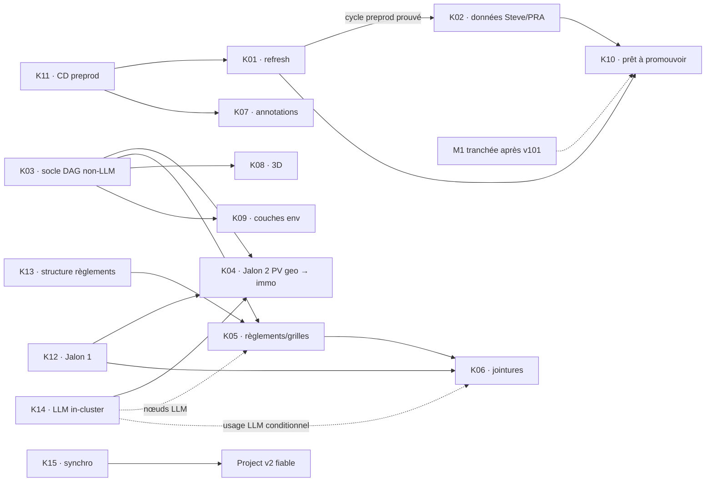

# Dossier de décision — Kanban GitHub et itération v7

Date : 2026-09-15 · Conductor : `i-cond` · Statut : **RÉPONSES REÇUES LE 15/09 À 22:38Z, BROUILLON LOCAL, NON RATIFIÉ DANS TRACK**.

Sources relues : dossier v6 commité; réponse owner capturée le 2026-09-15 à 22:38:18Z sur le dossier v1 et reproduite telle quelle en annexe; Track immo et geo en lecture seule; mesure des scopes GitHub. Aucun acte GitHub ou Track n'a été exécuté.

## 1. Synthèse et ratification demandée

- La réponse reçue est une ratification **en attente du GO final owner**. `IT=apply` ne peut être exporté qu'après ce GO écrit dans la session du conducteur; jusque-là `IT` reste absent et la garde interdit toute écriture Track, GitHub ou repli. `IT=revise` interdit également toute application. La garde exige deux avis favorables portant chacun les SHA-256 complets du plan **et** du dossier v7.
- Le flow comporte neuf valeurs : `Backlog` → `À prioriser` → `Priorisé pour l’itération` → `En cours de design` → `En cours de dev` → `En cours de revue interne` → `Déployé sur preprod (UAT)` → `À déployer sur prod` → `En prod (clos)`.
- Q1 est **A** et le plan GitHub est **Free** : un seul filtre d'auto-ajout `is:issue label:kanban` couvre `rhanka/radar-immobilier`, `rhanka/geo` et `rhanka/poc-k8s`.
- La surface reste de 15 issues : **9 P1 et 6 P2**, toutes créées dans `À prioriser`; aucune n'entre dans `Backlog`. La projection dépendancielle ajoute K12 et K14 au P1 requis par O4, et garde K13 en P2 avec O5. Cette lane n'est pas le champ `realization` Track; les porteurs déjà `in-progress` le restent et une carte existante ne reçoit jamais une nouvelle valeur `Status` au rejeu.
- P1, à livrer sur preprod sous 7 jours : J0/K11, O2/K02, O1a/K01, O1b/K10, O3/K03, O4/K04 avec ses gates K12/K14, et T12/K15. P2, démarrable sans obligation de livraison : O7/K07, O5/K05+K13, O6/K06, O8/K08 et A8/K09.
- Track est l'autorité de la réalisation, des décisions, des dépendances et de la priorité. Le Project v2 projette le workflow Git/UAT sans recopier littéralement `realization`; toute divergence de la matrice ratifiée arrête l'exécution.
- Chaque issue est identifiée par `<!-- kanban-v2:Kxx -->`. Le contrôle final relit chaque marqueur avec `gh issue list`, chaque porteur avec `track item show`, chaque carte sur la liste exhaustive du projet et échoue à la première absence.
- K04/Jalon 2 exige K03, K12, le contrat V34 et K14 : son porteur Track demande l'écriture automatisée du graphe standard et le porteur K14 dit que cette cible a besoin du LLM in-cluster. K03 garde son canari non-LLM indépendant.
- K14 relève de geo `wp7: socle` (`01KYYYB3TJ525EA477EDZCMXTE`, `to-do` mesuré), jamais du WP `wp7: deploy` annulé. Les six WP geo utilisés sont relus et leur `realization` est contrôlée avant la création des labels.
- **Charges.** K03–K06 conservent `source-gap` et leur historique 2 h seulement informatif; la charge confirmée reste 8 h pour K01, K02, K07 et K08. K02 reste à 3 h.
- **Hold K02.** Le seul jalon de levée est « cycle preprod prouvé » : la preuve preprod de K01 suffit, sans condition « quatre chantiers ». Le périmètre PRA protège les données non reconstructibles de Steve, en particulier ses annotations et la base Postgres. La sauvegarde des signaux scrapés n'est pas critique, car leur collecte est quasi idempotente; leur restauration n'est donc pas un critère bloquant.
- **M1 et couverture.** M1 reste ouverte dans l'attente de la campagne v101, mesurée à 58 % lors de la réponse. O1b/K10 exige « M1 tranchée » mais aucun seuil de couverture supplémentaire; ses dépendances techniques K01/K02 restent inchangées.
- Cette version gelée fixe l'ancre au mardi 15/09/2026. Les deux réservations owner sont JO+0 et JO+5, 60 minutes chacune et espacées de cinq jours ouvrés. La capacité exécutant reste `source-gap`; la cible P1 à 7 jours est conditionnelle à cette capacité et à M1.
- Toute PR liée emploie `Refs #n`; `Closes #n` est interdit. Une issue n'est close qu'après UAT, promotion prod vérifiée et terminaison de tous ses porteurs Track.
- Le jeton `gh` mesuré porte `gist, read:org, repo, workflow, write:packages` : le scope `project` est **absent**. Le bloc G et le repli s'arrêtent proprement avant mutation tant que l'owner n'a pas exécuté `gh auth refresh -s project,read:project`. Le chemin GraphQL du champ intégré `Status` et les vues reste non testé.

## 2. Issues ratifiables et ventilation owner

`Charge owner totale` inclut la validation lorsqu'une valeur est applicable. `Validation` est une réservation `[JUGEMENT]`. `Exécutant` reste `source-gap` pour chaque carte tant qu'une capacité n'est pas mesurée.

| ID | Titre exact | Portée / WP | P | Départ | Charge owner totale | Validation owner | Exécutant | Cible preprod | Dépend de |
|---|---|---|---|---|---|---|---|---|---|
| K01 | Stabiliser le refresh PV → signaux et son benchmark | immo · WP7 | P1 | À prioriser | 1 h | 12 min · JO+5 · 22/09 | source-gap | 2026-09-22 | K11 |
| K02 | Sauvegarder les données de Steve (annotations/Postgres) et prouver le PRA | immo · WP7 | P1 | À prioriser | 3 h | 12 min · JO+5 · 22/09 | source-gap | 2026-09-22 | K01; K11 transitif |
| K03 | DAG geo pour industrialiser toute source | geo · migration pipelines | P1 | À prioriser | source-gap · historique 2 h | 12 min · JO+5 · 22/09 | source-gap | 2026-09-22 | décision moteur; K14 seulement pour consommateurs LLM |
| K04 | Migrer l'acquisition PV vers geo et les signaux servis vers immo | geo+immo · WP4 PV / WP5 jointures · WP immo proposé | P1 | À prioriser | source-gap · historique 2 h | 12 min · JO+5 · 22/09 | source-gap | 2026-09-22 | K03, K12, K14, contrat V34 |
| K05 | Industrialiser règlements et grilles | geo+immo · WP3 règlements · WP6 immo | P2 | À prioriser | source-gap · historique 2 h | à planifier | source-gap | non engagée | K03, K13, K14 si LLM |
| K06 | Industrialiser le mapping signal × zones × règlements | geo+immo · WP5 jointures · WP immo | P2 | À prioriser | source-gap · historique 2 h | à planifier | source-gap | non engagée | K05, K12, K14 si LLM |
| K07 | Annoter signaux et villes | immo · WP6 | P2 | À prioriser | 3 h | à planifier | source-gap | non engagée | K11 |
| K08 | Produire le plan et le spike 3D | geo+immo · WP6 archi · WP6 immo | P2 | À prioriser | 1 h | à planifier | source-gap | non engagée | K03 |
| K09 | Servir les couches environnementales et user custom | geo+immo · WP6 archi proposé · WP1 immo | P2 | À prioriser | source-gap | à planifier | source-gap | non engagée | K03 |
| K10 | Armer le CronJob refresh en production | immo · WP1 | P1 | À prioriser | source-gap | 12 min · JO+5 · 22/09 | source-gap | 2026-09-22 : prêt à promouvoir, preuve preprod | K01, K02; M1 tranchée; aucun seuil de couverture |
| K11 | Rétablir le CD preprod et le reconcile des manifests | immo · WP7 | P1 | À prioriser | source-gap | 12 min · JO+0 · 15/09 | source-gap | 2026-09-15 | — |
| K12 | Requalifier Jalon 1 : recall, ontologie, ground truth | geo+immo · WP5 jointures · WP immo proposé | P1 | À prioriser | source-gap | 12 min · JO+0 · 15/09 | source-gap | 2026-09-15 | — |
| K13 | Trancher la structure documentaire des règlements | geo+immo · WP3 règlements · WP8 immo | P2 | À prioriser | source-gap | à planifier | source-gap | non engagée | — |
| K14 | Cadrer puis lancer le LLM in-cluster geo | geo · WP7 socle · WP immo proposé | P1 | À prioriser | source-gap | 12 min · JO+0 · 15/09 | source-gap | 2026-09-15 | gate K04; bloque K05/K06 sur leurs nœuds LLM |
| K15 | Synchroniser Track, Git et le Kanban | immo · WP9 | P1 | À prioriser | source-gap | 12 min · JO+0 · 15/09 | source-gap | 2026-09-15 | — |

Sources de charge : K01 1 h, K02 3 h, K03–K06 2 h historiques, K07 3 h et K08 1 h viennent du dossier owner du 14/09 §3.1. Le verbatim du 15/09 rend les quatre valeurs 2 h contradictoires; elles restent informatives, non applicables, jusqu'à ratification. Total applicable confirmé : 8 h; total historique : 16 h; total final : `source-gap`.

Bornes WIP : après GO final, `Priorisé pour l’itération` = 9 P1 `[RÉPONSE OWNER projetée avec dépendances]`; design 3 `[JUGEMENT]`; dev 4 `[FAIT : maximum quatre branches actives]`; revue 4 `[JUGEMENT non sourcé]`; UAT 3 et à déployer prod 2 `[JUGEMENT : draft non ratifié]`.

## 3. Correspondance unique Track ↔ GitHub

Les placeholders URL/carte ne sont résolus qu'à l'exécution. `Porteurs` gouverne priorité et terminaison. La passe finale reconstruit cette table depuis `gh issue list` par marqueur et `track item show`; `$K03_ID` est interpolé avant le contrôle.

| K | Porteurs Track actifs | Contexte / survivants | URL issue après G | id carte après G |
|---|---|---|---|---|
| K01 | immo `01M2GY9QTN1PJBH6X6NW94601G` | support #663 | `URL[K01]` | `CARD[K01]` |
| K02 | immo `01M2F4TCT2Q3TJW8NYCEWVTHY0` | doublon `01M2F4S34R8KCRXCSX339V6TBB` déjà DROPPED; support #660 | `URL[K02]` | `CARD[K02]` |
| K03 | geo `$K03_ID` | WP migration `01M0N3PGJPY3FK8Y3ACXNV17A8`; dossier `01M0GWZW2753PV92WJ2PGX5GS2` | `URL[K03]` | `CARD[K03]` |
| K04 | immo `01M18979R5ZJQQXNTB218H19ZY` | Jalon 2; WP immo proposé | `URL[K04]` | `CARD[K04]` |
| K05 | immo `01M1A7Y3M32VWHD07G00BXJCS8` | — | `URL[K05]` | `CARD[K05]` |
| K06 | immo `01KW7HWBVFG5AYV7T0X7GWDQQZ`, `01KW7HWC05G2DX55M6D5STKP07` | — | `URL[K06]` | `CARD[K06]` |
| K07 | immo `01M062D1FQENDZP3M5RVD9A6SV` | — | `URL[K07]` | `CARD[K07]` |
| K08 | immo `01M062D1WC6CJVQBA197WMEN62`; geo `01M01MDJX95PDSQFWBTYXJ45JK`, `01M01MDYE1VTYYN6Y5R1QQB5DZ` | — | `URL[K08]` | `CARD[K08]` |
| K09 | immo `01M062D2D7F196M6EJ10X929NX`; geo `01KZH14D9W5FWEV9QEAFC2PPT6` | WP geo proposé | `URL[K09]` | `CARD[K09]` |
| K10 | immo `01M062D20KCJ9FBTVCMYFZC9NA` | survivant KPI `01M062D290BVPD126NSPTHWREJ` conservé | `URL[K10]` | `CARD[K10]` |
| K11 | immo `01M2GYBYHGGGXM0J5SF5GM5SNB` | incident DONE `01M1Q7STYNCD0P936D3Y4JPQDX`; support #660 | `URL[K11]` | `CARD[K11]` |
| K12 | immo `01M189A10EH828F6X580480T36` | WP immo proposé | `URL[K12]` | `CARD[K12]` |
| K13 | immo `01M0SRPNZSBKWDPK1P7ZHQ3C3A` | — | `URL[K13]` | `CARD[K13]` |
| K14 | immo `01M197X0076A87ZS8KEVT426VF` | geo WP7 socle `01KYYYB3TJ525EA477EDZCMXTE` | `URL[K14]` | `CARD[K14]` |
| K15 | immo `01KW7HWE1QFZW7H5W4ZBT71Q4K`, `01KW2KS5K2D1Y7KGYF41ZAZGSW` | — | `URL[K15]` | `CARD[K15]` |

Tous les porteurs actifs reçoivent la même évaluation initiale par carte. Un changement Track ultérieur arrête G au préflight; il n'est pas masqué par un label statique. Une carte n'est terminale que si tous ses porteurs sont `DONE` ou `DROPPED` par décision ratifiée, l'UAT est acceptée et la promotion prod est prouvée.

### 3.1 Correspondance exhaustive du dossier v1 vers K01–K15

Les 18 créations et les deux adoptions du dossier v1 sont couvertes par les 15 cartes consolidées. Une même carte peut absorber plusieurs entrées lorsque le porteur Track, la dépendance ou la preuve de sortie est commun; aucune entrée v1 n'est écartée.

| Entrée v1 | Carte(s) K | Couverture après consolidation |
|---|---|---|
| I1a | K01 | Chaîne de fusion, cycle preprod et benchmark; #663 reste support adopté. |
| I1b | K10 | Armement du CronJob prod; M1 doit être tranchée, sans gate de couverture. |
| I2 | K02 | Sauvegarde/PRA recentrée sur annotations et Postgres de Steve. |
| I3 | K03 | DAG geo, design final et premier canari. |
| I4 | K04 | Migration acquisition PV geo → signaux servis immo. |
| I5 | K05 + K13 | Industrialisation règlements/grilles et décision de structure documentaire. |
| I6 | K06 + K12 | Mapping signal × zones × règlements et requalification Jalon 1. |
| I7 | K07 | Annotations signaux/villes. |
| I8 | K08 | Plan et spike 3D. |
| I9 | K15 | Réconciliation Track/Git et outillage Kanban. |
| B1 | K03 + K04 + K05 + K06 + K09 + K10 | Pipeline automatisé décomposé par lanes source, intégration et armement prod; aucune carte générique dupliquée. |
| B2 | K14 | LLM in-cluster geo. |
| B3 | K10 | Promotion prod couverte par le circuit tag `v*` retenu; aucune release branch parallèle n'est créée. |
| B4 | K09 | Couches BDZI/GRHQ/CPTAQ et couche utilisateur. |
| B5 | K07 | Même porteur Track que I7; le domaine collaboratif reste un sous-périmètre de la carte produit, sans seconde issue. |
| B6 | K01 | Mesure et remédiation KPI absorbées dans le benchmark; le survivant Track KPI est conservé sans carte dupliquée. |
| B7 | K02 | `poc-k8s/infra/ovh` demeure un prérequis d'infrastructure du PRA, pas une carte owner séparée. |
| B8 | K01 + K02 + K03 + K11 + K14 | Dette ventilée vers benchmark, sauvegarde, socle geo/LLM et reconcile plateforme; les porteurs Track restent la source de vérité. |
| #663 | K01 | Issue existante adoptée comme support OOM du refresh; pas de 16e carte. |
| #660 | K02 + K11 | Issue existante adoptée comme support backup/CD; pas de 16e carte. |

**Couverture : 20/20 entrées v1; 0 écartée; 15 cartes K.**

## 4. Dépendances et portée DAG



K04 ne peut être réputée sortie qu'après une preuve de bout en bout : acquisition PV dans geo, écriture automatisée du graphe standard par geo, overlay de complétion immo, parité V34 et signaux servis. K14 ne gate pas le canari non-LLM de K03.

Le hold K02 est levé par une seule preuve : K01 a terminé un cycle preprod prouvé. K11 reste transitif via K01; #683/#685, r2-15 et #691 ne forment plus un décompte de « quatre chantiers ». K02 protège les données de Steve qui ne sont pas reconstructibles : annotations et base Postgres. Sa sortie exige un dump planifié vers un stockage de backup versionné, des rétentions daily 7 jours / weekly 1 mois / monthly 6 mois, puis un exercice de restauration isolé qui relit les annotations et les données Postgres attendues. Les signaux issus des scraps sont quasi idempotents : leur backup et leur restauration ne bloquent pas le PRA. `poc-k8s/infra/ovh` sur `main` et un bucket prod distinct restent des prérequis d'infrastructure.

| Source / lane | Carte | Prérequis | Preuve de sortie |
|---|---|---|---|
| Zones vectorielles | K03 · DAG `zones` | adaptateur WFS/ArcGIS/AGOL/JMap | artefact S3 versionné, `proofFromFetched`, readback, promotion atomique |
| Normes / grilles | K05 | K03, K13; K14 si résidu LLM | cascade native→OCR→LLM gatée, registre versionné, receipt fail-closed |
| PV / Jalon 2 | K04 | K03, K12, K14, V34 | dual-run, graphe standard geo, overlay immo, événements et parité servie |
| Règlements | K05 | K03, K13; K14 si numéro/millésime ambigu | registre versionné, fold, readback |
| Usage dominant | K06 | K05, K12; K14 si proposition de `prefix_map` | `prefix_map` validé puis fold |
| Effet densifiant | K06 | K05 | diff de deux versions du registre; aucun LLM |
| Cadastre / rôle | hors itération · `source-gap` | ADR Loi 25, allowlist, stockage séparé | `PII_REFUSED`, aucune copie raw en preprod, aucun LLM |
| Immo-lots | hors itération · `source-gap` | producteurs cadastre/rôle non retenus dans ce lot | aucune sortie K06; futur lot après producteurs et preuve de fraîcheur |
| Couches environnementales | K09 | K03; priorisation BDZI/GRHQ/CPTAQ/user | receipt par couche, provenance et readback |
| 3D | K08 · spike | K03 seulement si pipeline | plan d'une page et spike mesuré |

## 5. Labels possédés

Les 20 labels sont : `P1`, `P2`, `data`, `infra`, `app`, `geo`, `kanban`; `wp:immo-WP1-sources-substrat`, `wp:immo-WP4-reconciliation-preuve`, `wp:immo-WP5-recette-parite`, `wp:immo-WP6-produit`, `wp:immo-WP7-plateforme-deploiement`, `wp:immo-WP8-spec-contrats`, `wp:immo-WP9-gouvernance`; `wp:geo-wp3-reglements`, `wp:geo-wp4-pv`, `wp:geo-wp5-jointures`, `wp:geo-wp6-archi`, `wp:geo-wp7-socle`, `wp:geo-migration-pipelines`.

## 6. Calendrier owner en jours ouvrés

`JO+0` est fixé au mardi 15/09/2026 dans cette version. Une autre ancre interdit l'exécution de T/G et exige une nouvelle version gelée. Le calendrier réserve uniquement le nouvel ensemble P1; P2 peut démarrer mais n'a ni date ni validation owner engagée. Les créneaux sont espacés de cinq jours ouvrés.

| Jour ouvré | Date | Validation agrégée | Total | Sortie visée |
|---|---|---|---:|---|
| JO+0 | mar. 2026-09-15 | K11, K12, K14, K15 · 12 min chacun; ratification finale `IT` · 12 min | 60 min | J0, gates O4, socle Kanban et GO final |
| JO+5 | mar. 2026-09-22 | K01, K02, K03, K04, K10 · 12 min chacun | 60 min | neuf P1 validées sur preprod; K02 après preuve K01; K10 après K02 et M1 tranchée |

Chemin critique : K11 → K01 → K02 → K10, avec « M1 tranchée » comme seul gate décisionnel additionnel de K10. Le tableau réserve exactement 60 minutes par fenêtre de cinq jours ouvrés. Il ne prouve ni le parallélisme ni la capacité exécutant : sans cette mesure, la livraison P1 sous 7 jours reste une cible conditionnelle. P2 n'est pas forcée à sortir.

## 7. Réponses reçues le 15/09 22:38Z (brouillon local, non ratifié dans Track)

1. Attendre un GO final owner écrit dans la session du conducteur. Sans ce message, ne pas définir `IT=apply` et ne lancer aucun mode.
2. Produire deux revues v7 sur le même couple d'octets. Chacune porte exactement un verdict favorable, un `plan-sha256` complet et un `dossier-sha256` complet.
3. Après GO final seulement, `IT=apply MODE=T` crée ou relit les décisions avec les sélections owner : Q1=`A`, plan GitHub=`FREE`, hold K02=`PREPROD_PROUVE`, P1/P2 ci-dessus, M1 ouverte, couverture=`NON`, création=`18_PLUS_2`; puis sélectionne Q1=`A` et IT=`apply`. `IT=revise` n'autorise aucune écriture.
4. Avant la première écriture de T, G et du repli, `guard_consensus` recalcule les deux hashes et les compare aux deux revues. `IT_CONTEXT` reprend les variables déjà vérifiées.
5. Après T, l'opérateur conserve les deux lignes de sortie et exporte `Q1_DECISION_ID=<id Q1>` et `IT_DECISION_ID=<id IT>` dans l'environnement de `MODE=G`. G vérifie les deux décisions et s'arrête avant mutation si le scope `project` manque. État mesuré : `gist, read:org, repo, workflow, write:packages`; remède owner : `gh auth refresh -s project,read:project`.
6. Sur GitHub Free, configurer un unique auto-ajout, dépôts `rhanka/radar-immobilier`, `rhanka/geo`, `rhanka/poc-k8s`, filtre `is:issue label:kanban`. Les 15 nouvelles cartes commencent toutes dans `À prioriser`; aucune n'est mise dans `Backlog`.
7. G relit les WP geo, puis les 15 issues par marqueur, les 20 porteurs avec `track item show`, les corps, dépendances, priorités et card IDs. La table runtime est conservée comme artefact hashé lié à la décision d'itération.
8. Le repli crée seulement `Étape` après sa propre garde, vérifie ses neuf options puis s'arrête. Toute suite est régénérée et revue avant sa première mutation.

## 8. Cas contre et pré-mortem

- Cas contre : le Project peut devenir une seconde vérité. Renversement : arrêter les déplacements, conserver Track et supprimer seulement les éléments possédés après décision owner.
- Pré-mortem : une page de cartes tronquée ferait reculer un statut. Mesure : `totalCount == length(items)` et arrêt au plafond avant la première mutation concernée.
- Pré-mortem : les quatre charges litigieuses seraient traitées comme acquises. Mesure : valeurs applicables `source-gap`, affichage de la source historique et ratification explicite en §1.
- Intérêt owner : une surface unique de 15 chantiers, sans masquer les dépendances, l'effort inconnu ni les preuves de sortie.

GO encore requis : un message owner final écrit dans la session du conducteur autorise à définir `IT=apply`. En son absence, ce dossier reste un brouillon local et aucune écriture Track/GitHub n'est permise.

## 9. Annexe — réponse owner intégrée telle quelle

```json
{
  "schema": "immo-kanban-decision-owner-response/v1",
  "dossier": "docs/spec/reports/DOSSIER_DECISION_KANBAN_ITERATION_2026-09-14.md",
  "dossierHash": "f2bd4d00c649a82e89f1d223324a239a5fae77ead0c73fec056432add30dff1d",
  "artifactInputHash": "9004174d34b00ae0cfa3e3ca6b2d663f6644b5bda1c888d3c431aa48a2605bd4",
  "capturedAt": "2026-09-15T22:38:18.654Z",
  "status": "draft-not-ratified",
  "authority": "brouillon local : aucune issue, aucun projet GitHub, aucun événement track, aucun déploiement",
  "minimalValidAnswer": "Q1 A · hold = préprod prouvé · O2, O1a M1-B, O1b oui, jour 0 GO, O7, O3, O5, O6, O4, O8, T12 · Q3 18+2 GO",
  "responses": [
    {"key": "q1-way-of-working", "selection": "A", "comment": ""},
    {"key": "q1-plan-github", "selection": "FREE", "comment": ""},
    {"key": "q2-hold", "selection": "PREPROD_PROUVE", "comment": "o2 est pour la sauvegarde des données de steve. le backup pour les données de signaux n'est pas critique, ce sont des scraps (quasi) idempotents."},
    {"key": "q2-items", "selection": ["J0", "O2", "O1a", "O1b", "O3", "O4", "T12"], "comment": "les autre ssont en p2: on peut les commencer mais on se force pas a les livrer (je pense a plan 3d, annotations"},
    {"key": "q2-m1", "selection": null, "decisionStatus": "open", "comment": "j'attend encore la campagne v101 qui est a 58% donc pas de réponse pour ca"},
    {"key": "q2-couverture", "selection": "NON", "comment": ""},
    {"key": "q3-creation", "selection": "18_PLUS_2", "comment": "2 fais les 18 et tu mets tout dans \"a prioriser\" stp c'est le PO qui va prioriser, nous on prendra le backlog"}
  ],
  "conductorNote": "Réponse owner transmise dans la session i-cond le 2026-09-15 ; message d'accompagnement : « ouvre le dossier des v101 dès que fini ; pour le backlog voici les réponses, merci de créer le kanban sur gh »."
}
```
