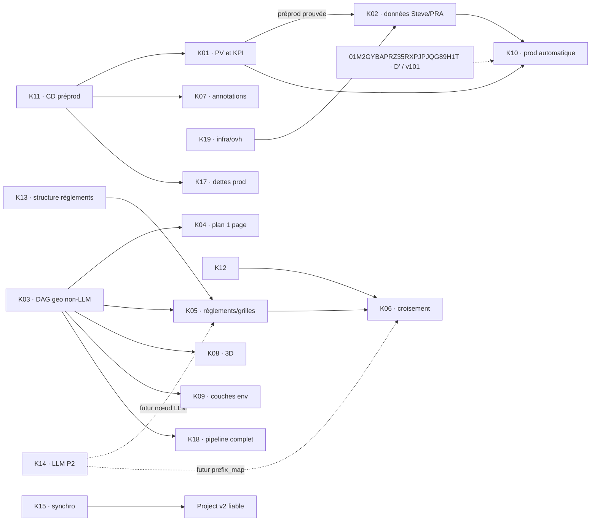

# Dossier de décision — Kanban GitHub et itération v9

Date : 2026-09-15 · Conductor : `i-cond` · Statut : **RÉPONSES REÇUES LE 15/09 À 22:38Z, BROUILLON LOCAL, NON RATIFIÉ DANS TRACK**.

Sources relues : base gelée v8; revue Fable v7, six findings; revue Opus des quinze cartes v7, 0/15 conformes; revue Gemini, 15/15 favorable avec remarques transversales; réponse owner capturée le 2026-09-15 à 22:38:18Z et reproduite telle quelle en annexe; Track immo et geo en lecture seule. Aucun acte GitHub et aucune écriture Track n'ont été exécutés.

## 1. Synthèse et ratification demandée

- La réponse reçue attend encore un **GO final owner**. `IT5=apply` ne peut être exporté qu'après ce GO écrit dans la session du conducteur. Sans lui, ou avec `IT5=revise`, la garde interdit toute écriture Track, GitHub et tout repli. Deux avis favorables doivent porter sur les SHA-256 complets du plan et du dossier v9.
- Le flow comporte neuf valeurs : `Backlog` → `À prioriser` → `Priorisé pour l’itération` → `En cours de design` → `En cours de dev` → `En cours de revue interne` → `Déployé sur preprod (UAT)` → `À déployer sur prod` → `En prod (clos)`.
- **Demandé : 18 nouvelles issues (+2 existantes). Proposé : 19 nouvelles issues K01–K19 et 2 adoptions, soit 21 cartes Project.** Les scissions I5→K05+K13, I6→K06+K12 et B8→K11+K17 ajoutent trois cartes; les consolidations B5→K07 et B6→K01 en retirent deux. La correspondance exhaustive figure en §3.1.
- Répartition : 14 nouvelles issues immo + #663/#660 adoptées = **16 cartes immo**; K03/K08/K09/K14 = **4 cartes geo**; K19 = **1 carte poc-k8s**. Ce routage reprend la v1 : I3, I8, B2 et B4 dans `rhanka/geo`; B7 dans `rhanka/poc-k8s`; le reste dans `rhanka/radar-immobilier`.
- Priorités Project : 9 nouvelles P1 + #663 = **10 P1**; 10 nouvelles P2 + #660 = **11 P2**. Les 21 cartes entrent dans `À prioriser`; aucune dans `Backlog`. Aucun score WSJF Track n'est créé ni réécrit : le PO ordonne les cartes.
- Q1 est **A** et GitHub est **Free**. L'unique auto-ajout `is:issue label:kanban` cible `rhanka/radar-immobilier`; les cartes geo et poc-k8s sont ajoutées explicitement par `gh project item-add`.
- **K04** est exactement « Plan de migration immo → geo (1 page, 2 h) ». Sa sortie est un document d'une page au 22/09; K03 est le seul gate de sa production documentaire. K12, K14 et V34 contraignent le futur build, pas la fermeture du document.
- **K14 revient P2. K12 reste P1 avec cible 22/09**, comme en v6, car son porteur Track est le Jalon 1 critique de O1a et un prérequis de la parité socle.
- K01 porte B6 avec le porteur `01M062D290BVPD126NSPTHWREJ` : matrice 20 KPI × villes, KPI moyen, mesure puis remédiation. K16 porte B3; K17 porte les cinq porteurs de B8; K18 porte B1; K19 porte B7.
- **Charges restaurées.** La proposition owner du 14/09 marque K03, K04, K05 et K06 à 2 h. Elles ne sont plus `source-gap`. K12 partage les 2 h de K06/I6 et K13 partage les 2 h de K05/I5 : ces parts ne s'ajoutent pas. Le total confirmé K01–K08 demeure 16 h.
- **Hold K02.** K01 en préproduction prouvée suffit pour le volet applicatif; K19 porte le prérequis `infra/ovh`. K02 protège uniquement les annotations et la base Postgres radar de Steve. Les bases geo, sentropic et openERP sont hors de cette carte, de même que les signaux reconstructibles issus des scraps.
- **M1.** Le gate K10 est la décision Track `01M2GYBAPRZ35RXPJPJQG89H1T`. Track porte historiquement `B/go` du dossier v2, tandis que l'owner a répondu **D′** sur le dossier v3 et que la campagne v101 est en cours. T ajoute au dossier Track le contexte D′/v101 sans falsifier l'événement B/go; K10 attend le résultat v101. Aucun gate de couverture supplémentaire n'est ajouté.
- **Cibles.** Aucune cible de sortie ni cible préproduction n'est au J0 du 15/09. Toutes les P1 visent le 22/09, cible owner dite « 7 jours ouvrés depuis la ratification ». Les mentions J0 sont uniquement des validations de gates. Les P2 ont un horizon indicatif au 06/10, sans engagement de livraison.
- Une carte se ferme à sa sortie; le porteur Track reste ouvert si sa portée est plus large. La promotion production n'est exigée que lorsque la carte livre en production. Toute PR liée emploie `Refs #n`; `Closes #n` est interdit.
- Le jeton `gh` mesuré porte `gist, read:org, repo, workflow, write:packages` : le scope `project` est **absent**. Le bloc G et le repli s'arrêtent proprement avant mutation tant que l'owner n'a pas exécuté `gh auth refresh -s project,read:project`. Le chemin GraphQL du champ intégré `Status` et les vues reste non testé.

## 2. Issues ratifiables et ventilation owner

`Charge owner totale` inclut la validation lorsqu'elle est chiffrée. `Validation` est une réservation owner; `Exécutant` reste `source-gap` tant que sa capacité n'est pas mesurée. « Validation J0 » n'est jamais une cible.

| ID | Titre exact | Dépôt · WP porté | P | Charge owner | Validation owner | Exécutant | Cible de sortie | Dépend de |
|---|---|---|---|---|---|---|---|---|
| K01 | Stabiliser le rafraîchissement des procès-verbaux vers les signaux et son banc d'essai | immo · WP7 + WP5 | P1 | 1 h | 12 min · 22/09 | source-gap | 22/09 | K11 |
| K02 | Sauvegarder les données de Steve (annotations/Postgres) et prouver le PRA | immo · WP7 | P1 | 3 h | 12 min · 22/09 | source-gap | 22/09 | K01, K19 |
| K03 | Industrialiser toute source par un graphe d'exécution geo | geo · geo WP6 archi | P1 | **2 h** | 12 min · 22/09 | source-gap | 22/09 | — |
| K04 | Plan de migration immo → geo (1 page, 2 h) | immo · WP4 | P1 | **2 h** | 12 min · 22/09 | source-gap | document 22/09 | K03 |
| K05 | Industrialiser règlements et grilles | immo · WP6 | P2 | **2 h** | à planifier | source-gap | non engagée · 06/10 indicatif | K03, K13 |
| K06 | Industrialiser le croisement signaux × zones × règlements | immo · WP4 | P2 | **2 h** | à planifier | source-gap | non engagée · 06/10 indicatif | K05, K12 |
| K07 | Annoter signaux et villes | immo · WP6 | P2 | 3 h | à planifier | source-gap | non engagée · 06/10 indicatif | K11 |
| K08 | Produire le plan et l'étude de faisabilité 3D | geo · immo WP6 + geo WP6 | P2 | 1 h | à planifier | source-gap | non engagée · 06/10 indicatif | K03 si pipeline |
| K09 | Servir les couches environnementales et les couches utilisateur personnalisées | geo · immo WP1 + geo WP6 | P2 | source-gap | à planifier | source-gap | non engagée · 06/10 indicatif | K03 |
| K10 | Mettre en production le rafraîchissement automatique | immo · WP1 | P1 | source-gap | 12 min · 22/09 | source-gap | 22/09 | K01, K02, M1 D′/v101 |
| K11 | Rétablir le déploiement continu en préproduction et la réconciliation des manifestes | immo · WP7 | P1 | source-gap | **validation J0** · 12 min | source-gap | 22/09 | — |
| K12 | Requalifier le jalon 1 : rappel, ontologie et vérité terrain | immo · WP5 | P1 | incluse dans K06/I6, non additionnelle | **validation J0** · 12 min | source-gap | décision 22/09 | — |
| K13 | Trancher la structure documentaire des règlements | immo · WP8 | P2 | incluse dans K05/I5, non additionnelle | à planifier | source-gap | non engagée · 06/10 indicatif | — |
| K14 | Cadrer puis lancer le modèle de langage dans le cluster geo | geo · immo WP7 | **P2** | source-gap | à planifier | source-gap | non engagée · 06/10 indicatif | futur build LLM seulement |
| K15 | Synchroniser Track, Git et le Kanban | immo · WP9 | P1 | source-gap | **validation J0** · 12 min | source-gap | outillage 22/09 | — |
| K16 | Valider le circuit de correctifs urgents et la politique de branche de publication | immo · WP7 | P2 | source-gap | à planifier | source-gap | non engagée · 06/10 indicatif | — |
| K17 | Résorber les dettes de plateforme en production | immo · WP7 | P2 | source-gap | à planifier | source-gap | non engagée · 06/10 indicatif | K11 |
| K18 | Automatiser entièrement le pipeline de rafraîchissement sur le cluster Kubernetes | immo · WP7 | P2 | source-gap | à planifier | source-gap | non engagée · 06/10 indicatif | K03 |
| K19 | Intégrer l'infrastructure OVH à la branche principale de poc-k8s | poc-k8s · immo WP7 | P1 | source-gap | **validation J0** · 12 min | source-gap | 22/09 | — |

| Adoption | Dépôt | P | Cible | Rôle |
|---|---|---:|---|---|
| #663 | immo | P1 | 22/09 | support OOM de K01, label `kanban` |
| #660 | immo | P2 | non engagée · 06/10 indicatif | support backup/CD de K02/K11, label `kanban` |

Sources de charge : proposition owner du 14/09, §3.1, pour K01=1 h, K02=3 h, K03=2 h, K04=2 h, K05=2 h, K06=2 h, K07=3 h et K08=1 h. Total confirmé : **16 h**. Les charges des autres cartes restent `source-gap`.

K17 conserve six critères distincts pour ses cinq porteurs : réconciliation production complète, trim CPU tracé, clé OVH à moindre privilège, couverture ESLint du benchmark, llm-mesh 0.19.3 et graphify 0.18.1. Les versions non publiées restent des gates.

## 3. Correspondance Track ↔ GitHub et fermabilité

Les placeholders URL/carte ne sont résolus qu'à l'exécution. La passe finale reconstruit cette table depuis les trois dépôts et `track item show`. K03 est créé par T directement sous le WP geo vivant `01KYYW0EH5RDC2ZCN5CJN3TGPP` (`wp6: archi`) : son **id est attribué par T**, puis G le retrouve par titre et le relit avant toute mutation.

| K | Porteurs Track actifs | Contexte / survivants | URL issue après G | id carte après G |
|---|---|---|---|---|
| K01 | immo `01M2GY9QTN1PJBH6X6NW94601G`, `01M062D290BVPD126NSPTHWREJ` | support #663; matrice KPI, mesure puis remédiation | `URL[K01]` | `CARD[K01]` |
| K02 | immo `01M2F4TCT2Q3TJW8NYCEWVTHY0` | doublon `01M2F4S34R8KCRXCSX339V6TBB` déjà DROPPED; support #660 | `URL[K02]` | `CARD[K02]` |
| K03 | geo `$K03_ID` | id attribué par T; geo WP6 archi; G le relit | `URL[K03]` | `CARD[K03]` |
| K04 | immo `01M18979R5ZJQQXNTB218H19ZY` | document d'une page; immo WP4 | `URL[K04]` | `CARD[K04]` |
| K05 | immo `01M1A7Y3M32VWHD07G00BXJCS8` | — | `URL[K05]` | `CARD[K05]` |
| K06 | immo `01KW7HWBVFG5AYV7T0X7GWDQQZ`, `01KW7HWC05G2DX55M6D5STKP07` | — | `URL[K06]` | `CARD[K06]` |
| K07 | immo `01M062D1FQENDZP3M5RVD9A6SV` | — | `URL[K07]` | `CARD[K07]` |
| K08 | immo `01M062D1WC6CJVQBA197WMEN62`; geo `01M01MDJX95PDSQFWBTYXJ45JK`, `01M01MDYE1VTYYN6Y5R1QQB5DZ` | — | `URL[K08]` | `CARD[K08]` |
| K09 | immo `01M062D2D7F196M6EJ10X929NX`; geo `01KZH14D9W5FWEV9QEAFC2PPT6` | geo WP6 archi | `URL[K09]` | `CARD[K09]` |
| K10 | immo `01M062D20KCJ9FBTVCMYFZC9NA` | — | `URL[K10]` | `CARD[K10]` |
| K11 | immo `01M2GYBYHGGGXM0J5SF5GM5SNB` | incident DONE `01M1Q7STYNCD0P936D3Y4JPQDX`; support #660 | `URL[K11]` | `CARD[K11]` |
| K12 | immo `01M189A10EH828F6X580480T36` | immo WP5 vivant | `URL[K12]` | `CARD[K12]` |
| K13 | immo `01M0SRPNZSBKWDPK1P7ZHQ3C3A` | — | `URL[K13]` | `CARD[K13]` |
| K14 | immo `01M197X0076A87ZS8KEVT426VF` | issue dans geo; porteur immo WP7 | `URL[K14]` | `CARD[K14]` |
| K15 | immo `01KW7HWE1QFZW7H5W4ZBT71Q4K`, `01KW2KS5K2D1Y7KGYF41ZAZGSW` | — | `URL[K15]` | `CARD[K15]` |
| K16 | immo `01M0SSSZ9SQ5T2F5BSKR3EG6HR` | patch/hotfix et release branch | `URL[K16]` | `CARD[K16]` |
| K17 | immo `01M2GYBYHGGGXM0J5SF5GM5SNB`, `01M2GYBYP4SXP9KX4013AB8JGF`, `01M2GYBYTADV821STN5PDSBR62`, `01M2GYBYYV3QH0EPRVWKYSJ9J9`, `01M2GYBZ3TMAX2HXBTRS00X486` | reconcile prod/trim CPU; OVH; ESLint; llm-mesh; graphify | `URL[K17]` | `CARD[K17]` |
| K18 | immo `01M1S25MVCND04YZN76KTVNGAE` | B1; ancien parent annulé remplacé par immo WP7 | `URL[K18]` | `CARD[K18]` |
| K19 | immo `01M2GYBYC03B2ECWDEAAZZQVG5` | B7; issue créée dans poc-k8s | `URL[K19]` | `CARD[K19]` |

Les priorités Track existantes, dont le 5,6 de B1, sont préservées. Aucun `priority.assessed` n'est émis. Règle uniforme des corps : **« La carte se ferme à sa sortie ; le porteur Track reste ouvert si sa portée est plus large. »** La promotion production n'est un critère que pour une carte dont la sortie annonce explicitement la production.

### 3.1 Correspondance du dossier v1 par portée vers K01–K19

Chaque ligne qualifie la portée réellement conservée dans le corps rendu. Une consolidation n'est admise que si ses critères de sortie reprennent l'obligation d'origine.

| Entrée v1 | Carte(s) K | État de portée | Portée vérifiable |
|---|---|---|---|
| I1a | K01 | couverte | Chaîne de fusion, cycle preprod et benchmark; #663 reste support adopté. |
| I1b | K10 | couverte | Armement du CronJob prod; M1 doit être tranchée, sans gate de couverture. |
| I2 | K02 | couverte | Sauvegarde/PRA des annotations et de Postgres de Steve, rétentions et restauration isolée. |
| I3 | K03 | couverte | DAG geo, design final et premier canari non-LLM. |
| I4 | K04 | couverte | Document d'une page : séquence de migration immo→geo, contrats, preuves, repli et responsabilités. |
| I5 | K05 + K13 | couverte | Industrialisation règlements/grilles et décision de structure documentaire. |
| I6 | K06 + K12 | couverte | Mapping signal × zones × règlements et requalification Jalon 1. |
| I7 | K07 | couverte | Annotations signaux/villes. |
| I8 | K08 | couverte | Plan d'une page et spike 3D mesuré. |
| I9 | K15 | couverte | Réconciliation Track/Git et outillage Kanban. |
| B1 | K18 | couverte | Pipeline complet cluster-mesh; porteur `01M1S25MVCND04YZN76KTVNGAE`. |
| B2 | K14 | couverte | LLM in-cluster geo, compte mesh, auth inbound et santé preprod. |
| B3 | K16 | couverte | Circuit patch/hotfix preprod→prod et politique de release branch, sans dépendre des évolutions en UAT. |
| B4 | K09 | couverte | Couches BDZI/GRHQ/CPTAQ et couche utilisateur avec provenance/readback. |
| B5 | K07 | couverte | Annotations plus paniers, archive, partage et réactivation du chat dans la carte produit P2. |
| B6 | K01 | couverte | Matrice 20 KPI × villes, KPI moyen, mesure puis remédiation; porteur `01M062D290BVPD126NSPTHWREJ`. |
| B7 | K19 | couverte | `poc-k8s/infra/ovh` présent sur `main`; porteur `01M2GYBYC03B2ECWDEAAZZQVG5`. |
| B8 | K11 + K17 | couverte | K11 couvre le socle CD étroit; K17 conserve les cinq porteurs et six preuves de dette. |
| #663 | K01 | couverte | Issue existante adoptée comme support OOM du refresh. |
| #660 | K02 + K11 | couverte | Issue existante adoptée comme support backup/CD. |

**Demandé 18 (+2); proposé 19 nouvelles cartes K + 2 adoptions = 21 cartes. Portées couvertes 20 · réduites 0 · écartées 0.**

## 4. Dépendances et portée DAG



K04 se ferme avec son document : séquence, contrats, responsabilités, preuves, repli et étapes de migration. Elle ne prétend pas livrer le Jalon 2. K14 ne gate ni K03 ni K04; elle ne contraint que les variantes LLM futures de K05/K06.

Le hold K02 est levé par une seule preuve : K01 a terminé un cycle preprod prouvé. K11 reste transitif via K01; #683/#685, r2-15 et #691 ne forment plus un décompte de « quatre chantiers ». K02 protège les données de Steve qui ne sont pas reconstructibles : annotations et base Postgres. Sa sortie exige un dump planifié vers un stockage de backup versionné, des rétentions daily 7 jours / weekly 1 mois / monthly 6 mois, puis un exercice de restauration isolé qui relit les annotations et les données Postgres attendues. Les signaux issus des scraps sont quasi idempotents : leur backup et leur restauration ne bloquent pas le PRA. `poc-k8s/infra/ovh` sur `main` et un bucket prod distinct restent des prérequis d'infrastructure.

| Source / lane | Carte | Prérequis | Preuve de sortie |
|---|---|---|---|
| Zones vectorielles | K03 · DAG `zones` | adaptateur WFS/ArcGIS/AGOL/JMap | artefact S3 versionné, `proofFromFetched`, readback, promotion atomique |
| Normes / grilles | K05 | K03, K13; K14 si résidu LLM | cascade native→OCR→LLM gatée, registre versionné, receipt fail-closed |
| Plan migration PV / Jalon 2 | K04 | K03 | document d'une page relu; K12/K14/V34 notés pour le futur build |
| Règlements | K05 | K03, K13; K14 si numéro/millésime ambigu | registre versionné, fold, readback |
| Usage dominant | K06 | K05, K12; K14 si proposition de `prefix_map` | `prefix_map` validé puis fold |
| Effet densifiant | K06 | K05 | diff de deux versions du registre; aucun LLM |
| Cadastre / rôle | hors itération · `source-gap` | ADR Loi 25, allowlist, stockage séparé | `PII_REFUSED`, aucune copie raw en preprod, aucun LLM |
| Immo-lots | hors itération · `source-gap` | producteurs cadastre/rôle non retenus dans ce lot | aucune sortie K06; futur lot après producteurs et preuve de fraîcheur |
| Couches environnementales | K09 | K03; priorisation BDZI/GRHQ/CPTAQ/user | receipt par couche, provenance et readback |
| 3D | K08 · spike | K03 seulement si pipeline | plan d'une page et spike mesuré |

## 5. Labels WP adossés et rattachements T

Les **15 labels possédés** sont : `P1`, `P2`, `data`, `infra`, `app`, `geo`, `kanban`; `wp:immo-WP1-sources-substrat`, `wp:immo-WP4-reconciliation-preuve`, `wp:immo-WP5-recette-parite`, `wp:immo-WP6-produit`, `wp:immo-WP7-plateforme-deploiement`, `wp:immo-WP8-spec-contrats`, `wp:immo-WP9-gouvernance`; `wp:geo-wp6-archi`.

Chaque label WP est présent seulement lorsque la carte possède au moins un porteur Track réellement rattaché à ce WP. Aucun label `wp:geo-migration-pipelines` ni label vers le WP geo déploiement annulé n'est créé.

| Rattachement assuré par T | WP réel | Motif |
|---|---|---|
| K03 créé directement | geo WP6 archi `01KYYW0EH5RDC2ZCN5CJN3TGPP` | label geo vivant; id K03 attribué par T |
| chantier 3D `01M01MDJX95PDSQFWBTYXJ45JK` | geo WP6 archi | K08; son spike reste enfant du chantier |
| couches `01KZH14D9W5FWEV9QEAFC2PPT6` | geo WP6 archi | K09 |
| K04 `01M18979R5ZJQQXNTB218H19ZY` | immo WP4 `01KYZPY6MKYQCCXZZ9KBZA4RTW` | label K04 adossé |
| K12 `01M189A10EH828F6X580480T36` | immo WP5 `01KYZPY6TV2E3VZC5FWA3RBSVW` | label K12 adossé |
| K14 `01M197X0076A87ZS8KEVT426VF` | immo WP7 `01KYZPY77BKD6ZXRB0PC96X3GJ` | label K14 adossé malgré dépôt geo |
| B1/K18 `01M1S25MVCND04YZN76KTVNGAE` | immo WP7 `01KYZPY77BKD6ZXRB0PC96X3GJ` | remplace son ancien parent WP annulé |

Le dossier pipelines geo `01M0GWZW2753PV92WJ2PGX5GS2` reste sous son WP migration vivant `01M0N3PGJPY3FK8Y3ACXNV17A8`; il n'est pas publié comme label de carte.

## 6. Calendrier owner

L'ancre reste le 15/09/2026. **J0 désigne une validation de gate, jamais une cible de sortie.** Toute P1 a une cible au 22/09. Une autre ancre exige une nouvelle version gelée.

| Fenêtre | Validation agrégée | Total | Cibles |
|---|---|---:|---|
| Validation J0 · 15/09 | K11, K12, K15, K19 · 12 min chacun; ratification finale `IT5` · 12 min | 60 min | aucune cible J0 |
| Validation du 22/09 | K01, K02, K03, K04, K10 · 12 min chacun | 60 min | toutes les sorties P1 au 22/09 |

K11/K12/K15/K19 continuent après la validation J0 jusqu'à leur sortie au 22/09. #663 suit la cible P1 au 22/09. Les dix nouvelles P2 et #660 ont un horizon indicatif au 06/10 sans engagement. Le calendrier ne prouve pas la capacité exécutant.

## 7. Séquence d'application après GO final

1. Attendre un GO final owner écrit dans la session du conducteur. Sans ce message, ne pas définir `IT5=apply` et ne lancer aucun mode.
2. Produire deux revues v9 sur le même couple d'octets. Chacune porte exactement un verdict favorable, un `plan-sha256` complet et un `dossier-sha256` complet.
3. Après GO final seulement, `IT5=apply MODE=T` crée ou relit les décisions, révise le contexte M1 vers D′/v101, crée ou relit K03, assure les rattachements et annule seulement les sept doublons mesurés. Aucun score de priorité n'est écrit. `IT5=revise` n'autorise aucune écriture.
4. Avant la première écriture de T, G et du repli, `guard_consensus` recalcule les deux hashes et les compare aux deux revues. `IT_CONTEXT` reprend les variables déjà vérifiées.
5. Après T, l'opérateur conserve les deux lignes de sortie et exporte `Q1_DECISION_ID=<id Q1>` et `IT5_DECISION_ID=<id IT5>` dans l'environnement de `MODE=G`. G vérifie les deux décisions et s'arrête avant mutation si le scope `project` manque. État mesuré : `gist, read:org, repo, workflow, write:packages`; remède owner : `gh auth refresh -s project,read:project`.
6. Sur GitHub Free, configurer l'unique auto-ajout sur `rhanka/radar-immobilier`, filtre `is:issue label:kanban`. Le script crée 19 issues selon les dépôts 14/4/1, adopte #663/#660 et ajoute explicitement les cartes externes geo/poc-k8s. Les 21 cartes commencent dans `À prioriser`; aucune n'est mise dans `Backlog`.
7. G relit K03 et le WP geo publié, puis les 19 issues par marqueur, les deux adoptions, tous les porteurs actifs, les corps, dépendances, labels et 21 card IDs. La table runtime est conservée comme artefact hashé lié à la décision d'itération.
8. Le repli crée seulement `Étape` après sa propre garde, vérifie ses neuf options puis s'arrête. Toute suite est régénérée et revue avant sa première mutation.

## 8. Cas contre et pré-mortem

- Cas contre : le Project peut devenir une seconde vérité. Renversement : arrêter les déplacements; Track reste l'autorité du portage et des décisions, la matrice ratifiée gouverne les labels et titres.
- Pré-mortem : un label WP pourrait survivre à un rattachement fictif. Mesure : T rattache, puis G relit chaque porteur actif et le WP geo publié avant de créer les labels.
- Pré-mortem : une carte étroite pourrait fermer un porteur plus large. Mesure : règle de fermabilité inscrite dans chaque corps; carte fermée à sa sortie, porteur large laissé ouvert.
- Pré-mortem : la divergence B/go v2 contre D′ v3 pourrait armer K10 trop tôt. Mesure : T inscrit le contexte D′/v101 sur l'id M1 exact et G le compare avant mutation.
- Pré-mortem : une page de cartes tronquée ferait reculer un statut. Mesure : `totalCount == length(items)` et arrêt au plafond avant la première mutation concernée.

GO encore requis : un message owner final écrit dans la session du conducteur autorise à définir `IT5=apply`. En son absence, ce dossier reste un brouillon local et aucune écriture Track/GitHub n'est permise.

## 9. Annexe — réponse owner intégrée telle quelle

Légende : `minimalValidAnswer` est le **gabarit minimal proposé dans le dossier v1**, pas la réponse structurée de l'owner. La réponse faisant autorité dans cette annexe est la liste `responses`, avec ses sélections et commentaires.

```json
{
  "schema": "immo-kanban-decision-owner-response/v1",
  "dossier": "docs/spec/reports/DOSSIER_DECISION_KANBAN_ITERATION_2026-09-14.md",
  "dossierHash": "f2bd4d00c649a82e89f1d223324a239a5fae77ead0c73fec056432add30dff1d",
  "artifactInputHash": "9004174d34b00ae0cfa3e3ca6b2d663f6644b5bda1c888d3c431aa48a2605bd4",
  "capturedAt": "2026-09-15T22:38:18.654Z",
  "status": "draft-not-ratified",
  "authority": "brouillon local : aucune issue, aucun projet GitHub, aucun événement track, aucun déploiement",
  "minimalValidAnswer": "Q1 A · hold = préprod prouvé · O2, O1a M1-B, O1b oui, jour 0 GO, O7, O3, O5, O6, O4, O8, T12 · Q3 18+2 GO",
  "responses": [
    {"key": "q1-way-of-working", "selection": "A", "comment": ""},
    {"key": "q1-plan-github", "selection": "FREE", "comment": ""},
    {"key": "q2-hold", "selection": "PREPROD_PROUVE", "comment": "o2 est pour la sauvegarde des données de steve. le backup pour les données de signaux n'est pas critique, ce sont des scraps (quasi) idempotents."},
    {"key": "q2-items", "selection": ["J0", "O2", "O1a", "O1b", "O3", "O4", "T12"], "comment": "les autre ssont en p2: on peut les commencer mais on se force pas a les livrer (je pense a plan 3d, annotations"},
    {"key": "q2-m1", "selection": null, "decisionStatus": "open", "comment": "j'attend encore la campagne v101 qui est a 58% donc pas de réponse pour ca"},
    {"key": "q2-couverture", "selection": "NON", "comment": ""},
    {"key": "q3-creation", "selection": "18_PLUS_2", "comment": "2 fais les 18 et tu mets tout dans \"a prioriser\" stp c'est le PO qui va prioriser, nous on prendra le backlog"}
  ],
  "conductorNote": "Réponse owner transmise dans la session i-cond le 2026-09-15 ; message d'accompagnement : « ouvre le dossier des v101 dès que fini ; pour le backlog voici les réponses, merci de créer le kanban sur gh »."
}
```
