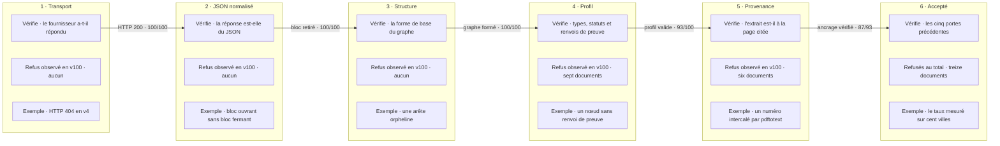
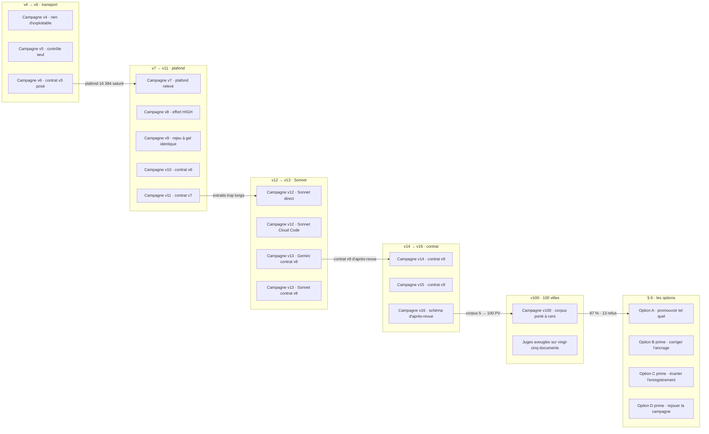

recommandation : A puis C′ · v100 : 87/100 acceptés (IC95 79-92 %) sur 100 villes · refus : ungrounded_pdf_excerpt 6, missing_evidence_ref 5, inferred_relation_disallowed 2 · 9 refus sur 13 pour un seul enregistrement · juges OpenAI/Opus : accord ±1 pt 21/25, κ −0,018, utilité 2,96/3,60, refusés notés aussi haut que les acceptés

# Dossier de décision M1 (v3) — quel modèle pour le CronJob `radar-refresh-pv`

Public : l'owner. Chaque notion mesurée est introduite par une phrase simple, puis
illustrée par un extrait réel tiré des reçus de campagne. `[FAIT]` = mesuré, avec
sa source. `[JUGEMENT]` = appréciation, identifiée comme telle. `N-A` = non
disponible ou non calculable.

---

## 1. En une page

### La question

[FAIT] La PR [#682](https://github.com/rhanka/radar-immobilier/pull/682)
(`feat/refresh-prod-018`, ouverte, `mergeStateStatus=CLEAN`) installe un CronJob
`radar-refresh-pv` qui tourne **sans surveillance** : il prend des procès-verbaux
et ordres du jour municipaux en PDF, demande à un modèle de langage d'en extraire
des signaux d'urbanisme structurés, et écrit le résultat dans le graphe.
Source : `gh pr view 682`, et §3 de la version 1 de ce dossier.

[JUGEMENT] La question posée à l'owner est : **quel modèle et quel réglage on met
dans ce CronJob**, et **maintenant ou après un tour de correction supplémentaire**.

### La réponse recommandée

[JUGEMENT] **Option A, puis C′.** Promouvoir **Gemini 3.8 Flash LOW, contrat v9
`93994e45`, plafond 64 000**, tel quel : sur 100 PV de 100 villes il accepte 87 % des
documents et ancre 98,49 % de ses citations, sans relâcher aucune garantie. Puis
instruire **C′** — écarter l'enregistrement fautif au lieu de refuser le document —
qui récupère neuf refus sur treize contre un compteur à publier.

[JUGEMENT] Ceci **retourne la recommandation de la version 2**, qui était B. Les deux
motifs de B sont tombés : le critère « 4 PV sur 5 » est remplacé par un taux estimé
avec intervalle sur 100 villes, et la classe de refus qui restait ouverte — le libellé
de zone court — a disparu (0 citation sous les planchers sur 2 119 enregistrements).

### Les trois chiffres qui comptent

| Chiffre | Ce qu'il dit | Source |
| --- | --- | --- |
| **87 %, IC 95 % [79 ; 92]** | Sur 100 PV de 100 villes différentes, le contrat v9 fait passer 87 documents à travers les six couches de validation. C'est la première estimation avec intervalle de la lane ; les campagnes précédentes donnaient un ratio sur cinq documents. | `v100/report.md`, §3 |
| **9 refus sur 13 pour un enregistrement** | Neuf des treize documents refusés le sont pour **un seul** enregistrement fautif, soit 2,7 % à 5,3 % des citations de leur propre document. Sur toute la campagne : 2 087 citations ancrées sur 2 119, **98,49 %**. | `v100/report.md`, §4.4 |
| **Les refusés notés aussi haut que les acceptés** | Deux juges aveugles indépendants notent les documents refusés par le validateur **3,00 et 3,80** sur 5, contre 2,95 et 3,55 pour les acceptés. La porte d'acceptation mesure la provenance, pas la valeur. | `v100/judge/agreement.json` |

[FAIT] Quatrième chiffre utile : la sortie la plus longue de la campagne fait
**17 424 tokens** contre un plafond de 64 000, et les 100 réponses se terminent par
`STOP`. Le plafond est surdimensionné d'un facteur 3,7 (`v100/report.md`, §5).

---

## 2. Le problème, raconté

### Ce qu'on demande au modèle

[FAIT] On lui donne le texte d'un PV municipal (par exemple les 14 pages du PV de
Saint-Étienne-de-Bolton du 4 août 2026) et on lui demande de rendre un objet JSON
qui contient : des **nœuds** (un règlement, une zone, une décision), des **arêtes**
(quel règlement est visé par quelle décision), et pour chaque nœud et chaque arête
une **citation** qui dit *à quelle page* et *avec quel extrait exact du PDF* cette
affirmation est soutenue. Source : `refresh-profile.ts:70-115` décrit dans
`DIAG_GEMINI_JSON.md`.

[JUGEMENT] La garantie visée n'est pas « le modèle a bien résumé ». Elle est : **on
peut retrouver, dans le PDF, à la page indiquée, le passage qui soutient chaque
affirmation**. C'est cette garantie qui permet de publier un signal à un
utilisateur sans qu'un humain relise le PV.

### Pourquoi « ça répond 200 » ne suffit pas

[FAIT] La toute première campagne réelle (v4) l'illustre : **5 requêtes sur 5 ont
reçu HTTP 200**, et **5 sorties sur 5 ont été refusées** par la validation du
contenu. Le transport était parfait, le produit inexploitable
(`BENCHMARK_T1_RUN.md`, tableau « Campagne PDF × modèle »).

[JUGEMENT] « HTTP 200 » ne mesure que le fait que le fournisseur a répondu. Tout le
travail de ce benchmark consiste à mesurer ce qu'il y a **dans** la réponse.

### Les cinq défauts, dans l'ordre où ils sont apparus

---

#### (a) L'identifiant de modèle n'existait pas chez le fournisseur — 404

[FAIT] **Avant.** La bibliothèque `@sentropic/llm-mesh` 0.19.0 demandait
`gemini-3.8-flash` sur l'hôte `daily-cloudcode-pa.googleapis.com`. Reçu
`v4/gemini-debug-01-mesh-low.json` :

~~~text
"httpStatus": 404,
"model": "gemini-3.8-flash",
"providerEffort": "LOW",
"providerError": { "code": 404, "status": "NOT_FOUND",
                   "message": "Requested entity was not found." }
~~~

[FAIT] Une sonde qui ne changeait **que l'hôte** (retrait du préfixe `daily-`) a
obtenu un 429 `RESOURCE_EXHAUSTED` au lieu du 404 : l'endpoint était bien la
première cause du 404, et l'effort LOW n'y était pour rien
(`v4/gemini-transport-diagnosis.md`).

[FAIT] **Après.** Avec l'identifiant `gemini-3.8-flash-tiered` et une route
épinglée, le ping mesure HTTP 200, message exact `PING_OK`, 929 ms
(`BENCHMARK_T1_RUN.md`, § « Couture modifiée »).

[JUGEMENT] Défaut d'outillage, pas de modèle. Il est fermé, mais il explique
pourquoi rien n'était mesurable avant le 14/09.

---

#### (b) La réponse arrivait emballée dans un bloc Markdown ` ```json `

[FAIT] **Avant.** Le texte brut rendu par Gemini commence par trois accents graves.
Le code appelait `JSON.parse` directement dessus. Rejeu Valcourt,
`v4/diag/valcourt--gemini-low.raw.txt`, 5 premières lignes :

~~~text
```json
{
  "nodes": [
    {
      "id": "source:31df8f116d84d1f50ef34a2aa8f746c6025c56089383b27345b901c8e45c026d",
~~~

[FAIT] Erreur exacte reproduite :
`SyntaxError: Unexpected token '`', "```json\n{\n"... is not valid JSON`, à
l'offset 0. Après retrait strict du bloc, le JSON est syntaxiquement valide
(`DIAG_GEMINI_JSON.md`, § « Reçu Valcourt »).

[FAIT] **Après.** Le parseur accepte soit du JSON direct, soit **un seul bloc
complet** ` ```json … ``` ` couvrant toute la réponse ; tout préambule, suffixe ou
bloc incomplet reste refusé (`LANE_T1_FIX_CAMPAIGN.md`, § « Diff du contrat »).
Depuis, la couche « normalisé » passe 5/5 sur toutes les campagnes.

[FAIT] Point mesuré contre-intuitif : demander au fournisseur
`responseMimeType: "application/json"` **n'a pas suffi**. La sonde a bien mis le
champ sur le fil, et le texte est revenu quand même entouré du bloc
(`DIAG_GEMINI_JSON.md`, § « Sonde `responseMimeType` »).

---

#### (c) Les citations manquaient, puis devenaient trop bavardes

[FAIT] **Avant.** Dans la sortie v4, les nœuds n'ont aucune citation. Extrait réel,
`v4/diag/valcourt--gemini-low.raw.txt` :

~~~json
{
  "id": "bylaw:560",
  "label": "Règlement de zonage 560",
  "node_type": "Bylaw",
  "status": "candidate",
  "numero": "560",
  "municipality": "valcourt"
}
~~~

[FAIT] Rien n'indique *où* dans le PDF ce règlement est mentionné. Le validateur a
produit **exactement 46 violations** sur 8 nœuds et 15 arêtes, deux par entité :
`missing_citation_source_file` et `missing_citation_page`
(`DIAG_GEMINI_JSON.md`, § « Validation après retrait du fence »).

[FAIT] **Correction intermédiaire (contrat v4).** On a exigé une citation sur
chaque nœud et chaque arête, avec 7 champs : `source_file`, `rawRef`, `docSha`,
`sourceUrl`, `modality`, `page`, `excerpt`. Effet mesuré : la sortie a gonflé et
s'est mise à saturer le plafond — c'est le défaut (d) ci-dessous
(`LANE_T1_FIX_CAMPAIGN.md`).

[FAIT] **Après (contrat v5).** Le modèle n'émet plus que `page` et `excerpt` ;
l'identité du PDF (chemin, empreinte, URL, modalité) est **injectée par le code**
avant la validation, puisqu'elle est constante pour un document donné. Extrait
réel, `v7/campaign-real/valcourt-2026-06-01-agenda--gemini-low.raw.txt` :

~~~json
{
  "id": "source_31df8f116d84d1f50ef34a2aa8f746c6025c56089383b27345b901c8e45c026d",
  "node_type": "Source",
  "citations": [
    { "page": 1,
      "excerpt": "SÉANCE ORDINAIRE\nLUNDI 1ER JUIN 2026\nOrdre du jour" }
  ]
}
~~~

[FAIT] Résultat de ce contrat compact sur le contrôle Valcourt : 19 citations sur
19 enrichies et validées, profil et provenance valides
(`LANE_T1_V5_CAMPAIGN.md`, § « Re-gel v6 et contrôle v5 »).

---

#### (d) La sortie était coupée en plein milieu — et affichée comme « terminée »

[FAIT] **Avant.** Saint-Étienne-de-Bolton, plafond 16 384 tokens. Le fichier brut
s'arrête au milieu d'un objet. Fin réelle de
`v6/campaign-real/saint-etienne-de-bolton-2026-08-04--gemini-low.raw.txt` :

~~~text
    {
      "id": "ev-9",
      "source_file": "raw/proces-verbaux-saint-etienne-de-bolton/cas/27799681….pdf",
~~~

[FAIT] Il n'y a ni accolade fermante, ni bloc de clôture : le texte s'interrompt à
la ligne 808, colonne 139. Le dernier événement du flux fournisseur porte
`finishReason=MAX_TOKENS` avec 15 057 tokens visibles — mais le reçu de haut
niveau affichait `finishReason=stop` (`LANE_T1_V5_CAMPAIGN.md`, § « Confirmation
au niveau fournisseur »).

[FAIT] Cause dans le code, lue en lecture seule : le chemin public `generate()` de
`cloud-code-runtime-client.js` (lignes 285-304) agrège le texte puis **ignore** la
raison de fin de l'événement final et construit `finishReason=stop`. Un
`MAX_TOKENS` fournisseur peut donc apparaître comme `stop`
(`LANE_T1_V5_CAMPAIGN.md`, § « Mapping llm-mesh observé »).

[FAIT] **Après.** Plafond porté à 65 536 (campagne v7) : 5 requêtes sur 5 en HTTP
200, **5 fins de flux `STOP` sur 5**, aucune saturation, 3 sorties acceptées
(`LANE_T1_V7_CAMPAIGN.md`). En v13 le plafond commun est descendu à **64 000**,
seule valeur admise côté Cloud Code : les sondes mesurent 64 000 → HTTP 200,
64 001 → HTTP 400, 65 536 → HTTP 400 (`v12/probes/`, cité par `v13/report.md`).

[JUGEMENT] C'est le défaut le plus coûteux de la série : pendant deux campagnes,
le reçu disait « terminé normalement » alors que la réponse était tronquée.

---

#### (e) Extraits trop longs, puis libellés de zone au lieu du texte de décision

**Premier temps — trop longs.**

[FAIT] **Avant.** Le contrat v7 demandait un extrait d'au plus 200 caractères,
coupé net même au milieu d'un mot. Le modèle **applique** la coupe, et dépasse
quand même la borne de 1 à 7 caractères. Cas réel, Waterloo,
`nodes[15].citations[0]`, page 9, 203 caractères, fin de l'extrait :

~~~text
… de 40
mètres, au fonds des lots 4 161 789 ou 6 098 789 du cadastre
du Québec dans le secte
~~~

[FAIT] 15 extraits dépassaient la borne sur la campagne v11
(201, 202, 202, 202, 203, 204, 204, 204, 204, 204, 204, 205, 205, 205, 207).
**14 sur 15 étaient des préfixes exacts du passage de la page citée, et 15 sur 15
étaient déjà ancrés** sur cette page. L'acceptation était tombée à 1/5
(`LANE_T1_V8_CONTRACT.md`, partie 1).

[JUGEMENT] Refuser une sortie parce que l'extrait fait 203 caractères au lieu de
200, alors qu'il est verbatim et retrouvé sur la bonne page, n'achète aucune
garantie.

[FAIT] **Après (contrat v8).** Le code tronque lui-même l'extrait à 200 caractères
**avant** la validation, et le code de refus pour longueur est retiré, devenu
inatteignable. Mesure v13 : **28 extraits tronqués côté Gemini, 22 côté Sonnet,
tous restés ancrés** (`v13/report.md`, § « Ce que le contrat v8 a corrigé »).

**Second temps — le libellé de zone. Non corrigé.**

[FAIT] Sur Saint-Étienne, le modèle crée un nœud par zone, et le cite par son
libellé. Extrait réel,
`v13/campaign-gemini/saint-etienne-de-bolton-2026-08-04--gemini-low.raw.txt` :

~~~json
{
  "id": "zone-COM-1",
  "node_type": "Zone",
  "citations": [ { "page": 11, "excerpt": "Zone : COM-1" } ]
}
~~~

[FAIT] `Zone : COM-1` est bien présent verbatim page 11 ; le contexte réel de la
page est `…Adresse : 12, rue Principale\nLot : 5 191 695\nZone : COM-1`. Mais la
vérification d'ancrage compare les deux textes après avoir supprimé tout
caractère non alphanumérique : il reste `zonecom1`, soit **8 caractères**, sous le
plancher de **12** exigé (`LANE_T1_V8_CONTRACT.md`, partie 1, point 2).

| extrait | page | caractères | après normalisation |
| --- | ---: | ---: | ---: |
| `Zone : COM-1` | 11 | 12 | 8 |
| `Zone : RUR-12` | 12 | 13 | 9 |
| `Zone : RUR-8` | 13 | 12 | 8 |
| `Zone : VIL-2` | 14 | 12 | 8 |

[FAIT] Ces mêmes libellés existaient déjà dans la sortie v9 — où Saint-Étienne
était **accepté** avec F1 0,364 (`v13/report.md`, tableau par PDF, ligne « Gemini
v5 (v9) » ; `v9/campaign-real/saint-etienne-de-bolton-2026-08-04--gemini-low.raw.txt`).
Ce qui a changé n'est pas le modèle : c'est le plancher d'ancrage de 12 caractères
normalisés, introduit avec le contrat v7 (`LANE_T1_V7_CONTRACT.md`, partie 1).

[FAIT] Le contrat v8 a tenté de corriger par la consigne : « quand le texte cité
fait moins de 20 caractères, continue la copie verbatim ». **Ni Gemini ni Sonnet ne
l'appliquent** sur ces quatre libellés. C'est vérifié sur deux modèles
indépendants (`v13/report.md`, § classe de refus restante).

[FAIT] Cette bascule a **deux effets d'une seule cause** : elle provoque le refus
d'ancrage, et elle fait perdre l'appariement à l'oracle — Saint-Étienne passe de
4 unités appariées sur 17 (v9) à **0** sur les deux bras (v13), aux mêmes étapes
et aux mêmes pages (`v13/report.md`, cause 2).

---

## 3. Comment on mesure

### Les six couches de validation

[FAIT] Chaque réponse traverse six portes, dans cet ordre. Une porte fermée arrête
tout : les portes suivantes ne sont pas évaluées et valent `N-A`.

| # | Couche | La question posée | Exemple de refus réel |
| --- | --- | --- | --- |
| 1 | **Transport** | Le fournisseur a-t-il répondu ? | v4 : HTTP 404 `NOT_FOUND` sur `gemini-3.8-flash` |
| 2 | **JSON brut / normalisé** | Le texte est-il un objet JSON, éventuellement après retrait d'un unique bloc ` ```json ` ? | v5 contrôle : bloc ouvrant sans bloc fermant, parse refusé à l'offset 0 |
| 3 | **Extraction** | La forme de base du graphe est-elle correcte (nœuds, arêtes, pas d'arête orpheline) ? | sonde v5 au plafond 65 536 : une arête orpheline |
| 4 | **Profil** | Les types, les statuts et les renvois de preuve appartiennent-ils bien au contrat ? | v12 Sonnet : `unknown_status` sur la valeur `projet` ; v9 Gemini : `missing_evidence_ref` ×3 sur Saint-Barthélemy |
| 5 | **Provenance page / extrait** | L'extrait cité se retrouve-t-il vraiment à la page indiquée du PDF ? | v13 : `ungrounded_pdf_excerpt` sur `Zone : COM-1` ; v9 : le modèle écrit `Yves-Malouin` là où le PDF porte `YvesMalouin` |
| 6 | **Accepté** | Les cinq précédentes sont-elles passées ? | — |

[FAIT] Lecture sur la campagne v13 : `brut 0/5 · normalisé 5/5 · extraction 5/5 ·
profil 5/5 · provenance 4/5 · accepté 4/5`, identique sur les deux modèles
(`v13/report.md`). Le `0/5` en première colonne signifie que **les deux modèles
emballent systématiquement leur réponse dans un bloc Markdown** ; le normalisateur
l'absorbe. Seule exception mesurée : Gemini en effort HIGH produit du JSON brut
5/5 (`LANE_T1_V8_HIGH.md`).

[FAIT] Ces six couches sont rejouées **hors ligne** sur les reçus après chaque
campagne. En v13, sur les dix reçus, la décision hors ligne est identique à la
décision prise en direct (`v13/report.md`, § comparaison par PDF).

### L'oracle manuel, et ce que P, R et F1 veulent dire

[FAIT] Un humain a lu les cinq PDF et écrit à la main la liste de ce qu'il faut
trouver : **36 unités** (Saint-Étienne 17, Saint-Barthélemy 8, Valcourt 6, Lac 4,
Waterloo 1). Chaque unité porte une étape, une page et une **ancre** : le morceau
de phrase qui doit se retrouver dans l'extrait cité. Le fichier est gelé et
**byte-identique de v9 à v13** (`4d50a26c…`, `v13/manual-oracle.json`).

[FAIT] Exemple d'unité, Valcourt V71 : étape `piia`, page 1, ancre
`7.1 1070, RUE BISSONNETTE`.

[FAIT] Les trois mesures, en une phrase chacune :
- **Précision (P)** : parmi ce que le modèle a produit, quelle part est attendue.
- **Rappel (R)** : parmi ce qui est attendu, quelle part le modèle a trouvée.
- **F1** : une moyenne des deux qui pénalise les déséquilibres ; 1 = parfait,
  0 = aucun appariement.

[FAIT] Règle d'appariement, lue dans le code (`tools/refresh-benchmark/score-v3.mjs:16-61`) :
seuls les nœuds de type `Signal` et `DesignationEvent` sont éligibles ; ils sont
regroupés par les arêtes `raises_signal` ; une unité compte comme trouvée si le
groupe déclare **la même étape** et porte une citation **à la même page** dont
l'extrait, en minuscules et espaces normalisés, **contient l'ancre**.

### Les limites mesurées de cet oracle — elles sont importantes

[FAIT] **Limite 1 — la numérotation d'ordre du jour (Valcourt).** L'ancre commence
par le numéro du point. Sous le contrat v5, le modèle commençait son extrait au
numéro ; sous v8, il commence juste après :

~~~text
ancre oracle  : 7.1 1070, RUE BISSONNETTE
extrait v5    : 7.1 1070, RUE BISSONNETTE - PIIA BOISÉ DU RUISSEAU - LOTISSEMENT
extrait v8    :     1070, RUE BISSONNETTE - PIIA BOISÉ DU RUISSEAU - LOTISSEMENT
~~~

[FAIT] L'extrait v8 reste verbatim, reste ancré, reste sur la bonne page — et le
scoreur ne le reconnaît plus. Valcourt passe de F1 0,909 à 0,000. En privant
l'ancre de sa numérotation, sans toucher aux sorties : Gemini v5 → 0,769,
Gemini v8 → 0,667, Sonnet v8 → 0,769 (`v13/report.md`, cause 1). Ces extraits font
56 à 118 caractères : ce n'est pas un effet de la troncature.

[FAIT] **Limite 2 — les `Bylaw` ne comptent pas (Saint-Étienne).** Sur la campagne
v7, Gemini a matérialisé neuf adoptions sous forme de nœuds `Bylaw` et cinq
décisions en `DesignationEvent`. Le scoreur n'admettant que `Signal` et
`DesignationEvent`, les neuf `Bylaw` sont hors du numérateur : **F1 automatique
0,000**, alors que **chacun des deux juges aveugles crédite 14 unités sur 17**
(version 1 de ce dossier, § réconciliation Saint-Étienne ; règle confirmée dans
`score-v3.mjs:17-18`).

[FAIT] **Limite 3 — le F1 ne porte que sur les sorties acceptées, donc pas sur la
même population d'une campagne à l'autre.** v9 note Lac, Saint-Étienne et
Valcourt ; v13 note Lac, Valcourt et Saint-Barthélemy. Lire « 0,558 contre 0,133 »
comme deux mesures du même objet serait une erreur (`v13/report.md`, § agrégats).

[FAIT] **Limite 4 — Waterloo porte un oracle volontairement partiel** (une seule
unité) : précision et F1 y valent `null` par construction, dans tous les bras.

[FAIT] **Écart entre la mesure automatique et la lecture humaine, v13.** F1 macro
automatique : Gemini 0,133, Sonnet 0,222. Sur les mêmes documents, le juge aveugle
crédite **12 unités sur 19 à Gemini et 13 sur 19 à Sonnet**
(`v13/judges/verdict-judge-b.json`).

[JUGEMENT] L'oracle mesure une correspondance de forme, pas l'utilité. Les deux
chiffres sont vrais et ne disent pas la même chose ; c'est pourquoi on lance aussi
des juges.

### Les juges aveugles

[FAIT] Protocole : les sorties acceptées sont figées dans un paquet
(`blind-bundle.json`) avec une empreinte SHA-256, et chaque système reçoit un
**alias opaque**. La correspondance alias → modèle est conservée à part
(`blind-map.json`) et n'est pas transmise au juge. Deux modèles indépendants jugent
le même paquet, sans savoir qui a produit quoi. Ils rendent, par document : les
unités soutenues, les défauts de citation, une note d'utilité sur 5 et un
classement.

[FAIT] **v7** — alias `system-20d310137265` = Gemini LOW, `system-02004a62770a` =
Sonnet 4.6 historique. Les **deux** juges classent Gemini premier globalement,
**premier sur 2 des 3 documents**, confiance `medium`. Sonnet l'emporte sur
Saint-Étienne. Motif cité par le juge B : « qualité de traçabilité, structuration
des relations et absence de conclusions non étayées »
(`v7/judges/verdict-judge-a.json`, `verdict-judge-b.json`, `v7/blind-map.json`).

[FAIT] **v13** — alias `system-87b5985c3e9f` = Gemini LOW v8,
`system-032f55c8cc8b` = Sonnet Cloud Code v8 (`v13/blind-map.json`). Juge B :

| document | premier | unités soutenues | utilité |
| --- | --- | ---: | ---: |
| Lac-des-Seize-Îles | Sonnet | 4 contre 3, sur 4 | 4 contre 3 |
| Valcourt | Gemini | 5 contre 5, sur 6 | 4 contre 3 |
| Saint-Barthélemy | Sonnet | 3 contre 3, sur 8 | 3 contre 2 |
| Waterloo | Gemini | 1 contre 1, sur 1 | 4 contre 3 |

[FAIT] Bilan du juge B : `winner: "tie"`, `confidence: "low"`, partage 2–2,
**13 unités contre 12 sur 19**, **utilités cumulées égales, 13 contre 13**. Ses
propres limites déclarées : une seule observation par cellule, Saint-Étienne non
jugé faute de sortie acceptée, et l'écart d'une unité « n'est pas discriminant ».
Profils de défaut opposés et de gravité comparable : Sonnet sur-relie et retouche
ses extraits ; Gemini cite littéralement partout (111 citations vérifiées sans
écart) mais fusionne ou omet des étapes.

**Juge A (Gemini) : en attente.** [FAIT] Le second juge v13 n'a pas été lancé, la
configuration Gemini n'étant pas disponible au moment de la rédaction (source :
brief du conducteur i-cond). Cette section est à compléter à sa réception ; aucun
verdict n'est anticipé ici.

### La variance : ce qu'on sait et ce qu'on ne sait pas

[FAIT] La campagne v9 est un **rejeu à gel identique** de la campagne v7 : même
contrat, même modèle, même effort, même plafond. Résultat : **acceptation
identique, 3/5, sur exactement les mêmes PDF**. Le F1 bouge sur 1 des 3 sorties
acceptées — Lac 0,000 d'écart, Valcourt 0,000 d'écart, Saint-Étienne +0,364
(version 1 de ce dossier, § contexte mesuré).

[FAIT] Deux observations par PDF ne permettent d'estimer ni une variance
statistique, ni une probabilité d'acceptation. La campagne v13 ne porte **qu'une
seule observation par document et par bras** (`v13/report.md`, § limites).

[JUGEMENT] Conséquence pratique : un écart d'une unité entre deux modèles, ou un
écart de F1 inférieur à celui déjà observé entre deux rejeux du même réglage, ne
doit pas servir à trancher.

---

## 4. Les résultats

### Toutes les campagnes, v4 → v13

[FAIT] « Contrat » = version du contrat d'extraction, c'est-à-dire ce qu'on demande
au modèle. « Plafond » = `maxOutputTokens`. Tokens = entrée / sortie visible,
cumulés sur la campagne.

| Campagne | Contrat | Modèle | Effort | Plafond | Acceptés | F1 macro | Latence moy. | Tokens |
| --- | --- | --- | --- | ---: | :-: | ---: | ---: | ---: |
| v4 | v3 | Gemini 3.8 Flash | LOW | 16 384 | **0/5** | `N-A` | 31 394 ms | 67 397 / 46 553 |
| v5 (contrôle seul) | v4 | Gemini 3.8 Flash | LOW | 16 384 | **0/1** | `N-A` | 56 170 ms | 7 838 / 14 360 |
| v6 (2 PDF lancés) | v5 | Gemini 3.8 Flash | LOW | 16 384 | **1/5** | 0,400 (n=1) | 20 945 et 54 670 ms | 26 157 / 22 624 |
| v7 | v5 | Gemini 3.8 Flash | LOW | 65 536 | **3/5** | 0,436 (n=3) | 25 747 ms | 66 930 / 42 040 |
| v8 | v5 | Gemini 3.8 Flash | **HIGH** | 65 536 | **3/5** | 0,200 (n=2) | 81 753 ms | 66 930 / 63 438 (+76 833 pensée) |
| v9 (rejeu de v7) | v5 | Gemini 3.8 Flash | LOW | 65 536 | **3/5** | 0,558 (n=3) | 30 703 ms | 66 930 / 50 075 |
| v10 | v6 | Gemini 3.8 Flash | LOW | 65 536 | **1/5** | 0,909 (n=1) | 34 127 ms | 68 125 / 50 646 |
| v11 | v7 | Gemini 3.8 Flash | LOW | 65 536 | **1/5** | 0,909 (n=1) | 30 413 ms | 68 565 / 46 088 |
| v12 | v5 | Sonnet 4.6 direct | `N-A` | 65 536 | **0/5** | `N-A` | 137 252 ms | 75 224 / 70 669 |
| v12 | v5 | Sonnet 4.6 Cloud Code | `N-A` | 64 000 appliqué | **0/5** | `N-A` | 130 486 ms | 75 224 / 72 590 |
| **v13** | **v8** | **Gemini 3.8 Flash** | **LOW** | **64 000** | **4/5** | **0,133** (n=3) | **30 537 ms** | **68 680 / 47 161** |
| **v13** | **v8** | **Sonnet 4.6 Cloud Code** | `N-A` | **64 000** | **4/5** | **0,222** (n=3) | **121 790 ms** | **77 144 / 70 046** |

[FAIT] **La colonne F1 n'est pas comparable ligne à ligne** : le scoreur ne note
que les sorties acceptées, donc chaque ligne porte sur une population de documents
différente (limite 3 du §3). C'est explicite dans les rapports v10, v11 et v13.

[FAIT] Pour comparer à population fixe, le rapport v13 rejoue les mêmes quatre
documents (Waterloo exclu, oracle partiel), en notant **toutes** les sorties
qu'elles soient acceptées ou non, avec l'ancre privée de sa numérotation. C'est un
diagnostic de contenu, pas la métrique produit :

| Bras | F1 macro à population fixe | micro P / R / F1 |
| --- | ---: | ---: |
| Gemini v5 (v9) | **0,383** | 0,625 / 0,286 / 0,392 |
| Sonnet v8 (v13) | **0,359** | 0,368 / 0,200 / 0,259 |
| Gemini v8 (v13) | **0,267** | 0,333 / 0,143 / 0,200 |

[FAIT] À population fixe, Sonnet v8 est au niveau de Gemini v5, et **Gemini v8 est
en retrait de son propre niveau v5** — l'écart venant presque entièrement de
Saint-Étienne (`v13/report.md`).

### Ce que le contrat v8 a réellement corrigé

[FAIT] Quatre familles de refus ont entièrement disparu des dix reçus v13 :

| Famille de refus | v12 Sonnet | v9 Gemini | v13 Gemini | v13 Sonnet |
| --- | ---: | ---: | ---: | ---: |
| `unknown_status` | 4 | 0 | **0** | **0** |
| `entity_citation_excerpt_too_long` | 5 | 0 | **0** (inatteignable) | **0** (inatteignable) |
| `missing_evidence_ref` | 1 | 3 | **0** | **0** |
| `incompatible_source_type` | 1 | 0 | **0** | **0** |
| `ungrounded_pdf_excerpt` | 42 | 2 | **4** | **17** |

### Les juges

[FAIT] **v7** : Gemini LOW l'emporte sur Sonnet 4.6 historique auprès des deux
juges, premier sur 2 des 3 documents, confiance `medium`.

[FAIT] **v13** : égalité. 2 documents chacun, 13 unités contre 12 sur 19, utilité
cumulée 13 contre 13, confiance `low`. Juge A en attente.

### Sonnet 4.6

[FAIT] Sous le contrat v5 (campagne v12), Sonnet obtient **0/5 en direct Anthropic
et 0/5 en Cloud Code**, avec 10 requêtes sur 10 en HTTP 200. Deux des trois
familles de refus pointaient vers le contrat, pas vers le modèle : `unknown_status`
venait d'une ambiguïté où le profil décrivait des valeurs métier (`actif`,
`projet`) que le validateur comparait à une liste générique
(`LANE_T1_SONNET_C.md`).

[FAIT] Sous le contrat v8 (campagne v13), Sonnet Cloud Code passe à **4/5**, avec
le meilleur F1 macro des deux bras v13 (0,222) et le meilleur score à population
fixe après Gemini v5 (0,359). Il est **4,0 fois plus lent** : 121 790 ms contre
30 537 ms de moyenne, et 209 710 ms contre 58 250 ms en p95.

[JUGEMENT] v12 concluait qu'on ne pouvait pas conclure sur Sonnet. v13 le mesure :
il n'est plus écartable sur la qualité, il l'est sur la latence si le débit compte.

### L'effort HIGH est écarté

[FAIT] Campagne v8 : même identifiant de modèle, seul `thinkingLevel` passe de LOW
à HIGH. Résultat : **acceptation inchangée à 3/5** (en échangeant un cas contre un
autre), latence moyenne **×3,18** (81,8 s contre 25,7 s), tokens fournisseur
totaux **×1,90**, F1 macro calculable en baisse de 0,436 à 0,200, et Valcourt qui
tombe de 0,909 à 0,000 (`LANE_T1_V8_HIGH.md`).

[JUGEMENT] HIGH coûte trois fois plus cher en temps sans acheter une acceptation
supplémentaire. Il n'est retenu dans aucune option.

---

### La campagne v100 — 100 PV, 100 villes, contrat v9 d'après-revue

[FAIT] Depuis la version 2 de ce dossier, trois campagnes ont tourné sur le contrat
v9 : v14 et v15 (5/5 chacune, contrat `d93f5c93`), v16 (3/5, contrat d'après-revue
`93994e45`), puis **v100** — **même contrat que v16, même modèle, même effort, même
plafond, corpus porté de 5 à 100 PV sur 100 villes**, tous datés 2026.

| Agrégat | v14 | v15 | v16 | **v100** |
| --- | ---: | ---: | ---: | ---: |
| Documents · villes | 5 · 5 | 5 · 5 | 5 · 5 | **100 · 100** |
| Acceptés | 5/5 | 5/5 | 3/5 | **87/100 — 87,0 %** |
| Intervalle de confiance 95 % | — | — | — | **[79,0 ; 92,2] %** |
| Classes de refus | 0 | 0 | 1 | **3** |
| Fins de flux `STOP` | 5/5 | 5/5 | 5/5 | **100/100** |
| Citations ancrées | 103/103 | 94/94 | 132/132 | **2 087 / 2 119 — 98,49 %** |
| Latence moyenne · p95 | 27,0 s · 52,7 s | 25,5 s · — | 40,8 s · — | **19,2 s · 39,5 s** |
| Tokens entrée / sortie | 70 080 / 42 920 | 70 080 / 39 225 | 69 630 / 55 882 | **1 646 755 / 679 330** |

[FAIT] **Le taux d'acceptation attendu en production est de 87 %, avec un intervalle
de confiance à 95 % de 79 % à 92 %**, sur un corpus de 100 villes différentes où
aucune ville ne pèse plus de 1 %. C'est la première fois que la lane produit un
intervalle plutôt qu'un ratio sur cinq documents.

[FAIT] **Les cinq documents du gel v13→v16 repassent 5/5** sous v100 — mêmes octets,
même contrat que v16. Sur quatre campagnes, ces cinq PV totalisent **18 acceptations
sur 20**. [JUGEMENT] Le 3/5 de v16 se lit donc comme un tirage, pas comme un
durcissement du validateur : la réserve ouverte par `FIX_PR688_V9_V16.md` est levée.

[FAIT] **Trois classes de refus, 13 documents sur 100 :**

| Classe | PV | Enregistrements fautifs | Cause mesurée |
| --- | :-: | :-: | --- |
| `ungrounded_pdf_excerpt` | 6 | 32 | La mise en page du PDF insère des caractères au milieu du passage dans la sortie de `pdftotext` : colonnes entrelacées, pied de page, numéro parasite, phrase qui déborde sur la page suivante. |
| `missing_evidence_ref` | 5 | 5 | Un nœud sur une vingtaine oublie son renvoi de preuve. |
| `inferred_relation_disallowed` | 2 | 2 | Une arête `lifecycle_predecessor` est déclarée `INFERRED` ; le contrat n'admet que l'extrait. |

[FAIT] **Neuf refus sur treize tiennent à un seul enregistrement fautif**, qui
représente 2,7 % à 5,3 % des citations de son propre document. Sur les 13 refusés :
39 enregistrements fautifs sur 332 cités, **11,7 %**.

[FAIT] **Aucun des six refus d'ancrage ne vient d'une page fausse ni d'un texte
inventé.** Exemple, Coteau-du-Lac page 3 : le modèle cite « 8.3. Demande d'un PPCMOI »
puis « a) Approbation. Demande d'un PPCMOI pour le 25, rue des Chutes… » ; la page
porte, dans l'ordre rendu par `pdftotext`, un **« 9. »** intercalé entre les deux — le
numéro de la section suivante, placé là par effet de colonne. La normalisation retire
la ponctuation mais **garde le chiffre**, qui casse la sous-chaîne. Préfixe commun :
18 caractères normalisés sur 91.

[JUGEMENT] C'est un changement de nature par rapport à v16, où les deux refus étaient
des **erreurs de page du modèle**. Sur 100 documents, la cause dominante n'est plus le
modèle : c'est **l'écart entre « verbatim tel qu'on le lit » et « verbatim dans
l'ordre des octets de `pdftotext` »**.

[FAIT] **Le plafond de 64 000 tokens de sortie est surdimensionné d'un facteur 3,7** :
la sortie la plus longue de la campagne fait **17 424 tokens**, et aucune des
100 réponses ne porte `MAX_TOKENS`.

### Les juges aveugles sur v100

[FAIT] Paquet gelé de **25 documents** — 20 sorties acceptées stratifiées par taille
et 5 sorties refusées stratifiées par classe de refus — avec alias opaques, sans
identifiant de document ni verdict de validateur. Deux juges, deux passes séparées :
**OpenAI `gpt-5.6-sol`** par API (25 appels, 409 453 tokens d'entrée) et **Claude
Opus 5**.

| Mesure | Valeur |
| --- | ---: |
| Utilité moyenne sur 5 — OpenAI / Opus | **2,96 / 3,60** |
| Corrélation de Pearson · de Spearman | **0,474 · 0,281** |
| Accord exact · à ±1 point | **7/25 · 21/25** |
| κ de Cohen, notes exactes · binarisé « utile ≥ 4 » | **−0,018 · −0,183** |
| Utilité moyenne des PV **acceptés** — OpenAI / Opus | 2,95 / 3,55 |
| Utilité moyenne des PV **refusés** — OpenAI / Opus | **3,00 / 3,80** |

[JUGEMENT] **Les deux juges s'accordent sur l'ordre de grandeur et pas au-delà du
hasard sur la note exacte** : 21 documents sur 25 sont d'accord à un point près, le κ
est nul ou négatif. Conséquence pratique, identique à celle du juge v13 : **un écart
d'un point d'utilité ne départage rien**.

[FAIT] **Ni l'un ni l'autre juge ne note les documents refusés plus bas que les
acceptés.** [JUGEMENT] C'est la mesure la plus directe de ce que la version 2 de ce
dossier avançait sur Saint-Barthélemy : **la porte d'acceptation mesure la provenance,
pas la valeur**. Un PV refusé parce qu'un nœud sur vingt-deux oublie son renvoi de
preuve reste jugé exploitable par les deux juges.

[JUGEMENT] Ce que les deux passes disent ensemble du contenu : les citations sont
littérales et bien paginées ; les actes de zonage sont extraits avec leur substance
(codes de zone créés, agrandis ou abrogés, numéros de lot, étapes, arêtes `amends`,
`defines`, `rezones`) ; et deux familles manquent — **les listes longues de dossiers
PIIA individuels**, repliées en un événement agrégé sans adresse ni lot
(Mont-Saint-Hilaire : 19 dossiers → 2 événements ; Cowansville : 18 dossiers sur 20
absents), et **les transactions immobilières** (Saint-Barthélemy : cinq résolutions de
transaction et un transfert grevé d'un droit de préemption, absents).

[FAIT] **Coût monétaire : toujours `N-A`, source manquante.** Le dépôt ne porte aucun
tarif par token, ni Google, ni Anthropic, ni OpenAI. Les tokens sont mesurés ; aucun
montant n'est fabriqué.

## 5. Ce qui reste ouvert

[FAIT] **Refermé par v100.**
1. *« Le taux d'acceptation du schéma d'après-revue n'est pas établi »* (réserve de
   `FIX_PR688_V9_V16.md`) : il l'est — **87 %, IC 95 % [79,0 ; 92,2]** sur 100 PV et
   100 villes, et les cinq documents du gel repassent 5/5.
2. *« Le corpus de 5 ne borne pas un risque »* : la distribution existe désormais sur
   100 documents, 100 villes, 1 à 77 pages.
3. *« Le plafond de 64 000 est-il suffisant ? »* : la sortie maximale sur 100 documents
   fait **17 424 tokens**, 100 fins `STOP`, aucune troncature.
4. *« Le validateur d'après-revue durcit-il quelque chose ? »* : non — les 100 reçus
   requalifiés hors ligne rendent le verdict en ligne, 100 fois sur 100.

[FAIT] **Ouvert, et mesuré comme tel.**

[FAIT] **1. La variance à corpus v100 fixe n'est pas mesurée.** Une seule observation
par document sur les 95 nouveaux ; le plafond de 100 requêtes de la lane est consommé.
La seule variance disponible reste celle des cinq ancres : 18 acceptations sur 20 en
quatre runs.

[FAIT] **2. La couverture n'est toujours pas mesurée à l'échelle.**
`manual-oracle: N-A` sur 95 documents sur 100. Les juges donnent une lecture d'utilité
sur 25 documents, pas un rappel sur 100. Les deux juges pointent le même déficit —
listes de dossiers PIIA repliées, transactions immobilières absentes — sans que sa
fréquence soit chiffrée sur l'ensemble du corpus.

[FAIT] **3. Trois classes de refus subsistent, dont une inédite.**
`inferred_relation_disallowed` n'était apparue dans aucune campagne v9 → v16 : elle
sort à 2 % sur 100 documents. C'est la démonstration que **cinq documents ne
suffisaient pas à énumérer les classes**.

[FAIT] **4. La cause dominante d'ancrage n'est pas dans le modèle mais dans la chaîne
de texte.** Les six refus d'ancrage viennent tous d'un artefact de mise en page rendu
par `pdftotext`. Aucune correction de prompt n'y changerait rien.

[FAIT] **5. L'accord inter-juges ne dépasse pas le hasard** sur la note exacte
(κ = −0,018 ; κ binarisé = −0,183), pour 21 accords sur 25 à un point près.

[FAIT] **6. Le coût unitaire est `N-A` — source manquante.** Inchangé depuis la
version 2 : aucun tarif par token dans le dépôt.

[FAIT] **7. Aucun bras comparatif sur v100.** Ni Sonnet, ni effort HIGH. La
comparaison Gemini/Sonnet reste celle de v13, sur 5 documents et sous le contrat v8.

[FAIT] **8. Rien n'est fusionné.** #687 et #688 restent ouvertes ; l'ordre de fusion
appartient à l'owner.

---

## 6. Les options

[JUGEMENT] Les quatre options de la version 2 portaient sur un choix de modèle à
5 documents. v100 déplace la question : **le modèle n'est plus l'inconnue**. Gemini
3.8 Flash LOW sous contrat v9 accepte 87 % d'un corpus réel de 100 villes, ancre
98,49 % de ses citations, ne sature jamais le plafond et répond en 19 s de moyenne.
L'inconnue est **ce qu'on fait des 13 % refusés**, dont neuf documents sur treize
tiennent à un enregistrement unique.

| id | choix | pour | contre | coût | réversibilité | ce qui le ferait gagner |
| --- | --- | --- | --- | --- | --- | --- |
| **A** | [JUGEMENT] **Promouvoir tel quel** : Gemini LOW, contrat v9 `93994e45`, plafond 64 000, et journaliser l'échec par PV via `recordOutcome`. | [FAIT] 87 % acceptés, IC 95 % [79 ; 92] sur 100 villes. [FAIT] 98,49 % des citations ancrées. [FAIT] 100 fins `STOP`, 0 troncature, 0 relance. [FAIT] 19,2 s de moyenne, p95 39,5 s. [JUGEMENT] La garantie de provenance n'est relâchée nulle part. | [FAIT] 13 PV sur 100 n'entrent pas au graphe, dont neuf pour **un seul** enregistrement. [FAIT] Les deux juges notent les refusés **aussi haut** que les acceptés : la porte jette de la valeur. [FAIT] Couverture `N-A` sur 95 documents. | [FAIT] Un appel par PV ; montant `N-A`. | [JUGEMENT] Forte : le CronJob n'est pas destructif. | [JUGEMENT] Si l'owner accepte que 13 PV sur 100 restent muets, contre une garantie de provenance intacte et une mise en service immédiate. |
| **B′** | [JUGEMENT] **Corriger l'ancrage avant de promouvoir** : tolérer les insertions de mise en page (appariement dans l'ordre avec budget borné d'insertions, ou nettoyage des pieds de page et numéros avant ancrage), et autoriser la page citée **et la suivante** pour un extrait qui déborde. | [FAIT] Vise **les six refus d'ancrage, tous de cause identique et diagnostiquée au caractère près**. [FAIT] Plafond mesuré : **87 → 93 %**. [JUGEMENT] La garantie « le passage est sur la page » survit ; c'est la définition de « sous-chaîne » qui s'assouplit. | [FAIT] Relâche une garantie : l'extrait cesse d'être une sous-chaîne exacte de la page. [JUGEMENT] Un appariement tolérant peut accepter un extrait recollé à tort — risque non mesuré. [JUGEMENT] Retarde la mise en service d'un tour de contrat. | [FAIT] Travail de contrat hors de cette lane, puis une campagne de requalification ; montant `N-A`. | [JUGEMENT] Forte : le seuil de tolérance reste un paramètre. | [JUGEMENT] Si l'owner veut récupérer les six PV d'ancrage **et** accepte de qualifier le risque de faux ancrage sur un corpus de contrôle. |
| **C′** | [JUGEMENT] **Écarter l'enregistrement fautif au lieu de refuser le document**, avec le compte des enregistrements écartés reporté dans le reçu et dans `recordOutcome`. | [FAIT] Vise **neuf refus sur treize**, chacun pour un enregistrement représentant 2,7 % à 5,3 % des citations du document. [FAIT] Plafond mesuré : **87 → 96 %**. [FAIT] Les deux juges jugent ces documents exploitables. | [FAIT] Relâche une garantie : un document entre au graphe avec un enregistrement écarté. [JUGEMENT] Le graphe devient partiellement silencieux sur ce qu'il a jeté, sauf à publier le compteur. | [FAIT] Modification de validateur hors de cette lane ; montant `N-A`. | [JUGEMENT] Forte : le seuil d'écartement reste un paramètre. | [JUGEMENT] Si l'owner juge qu'un PV utile à 96 % vaut mieux qu'un PV absent, **et** que le compteur d'écartements est publié. |
| **D′** | [JUGEMENT] **Rejouer v100 à l'identique** avant tout choix, pour mesurer la variance à corpus fixe. | [FAIT] Une seule observation par document sur 95 ; v16 a déjà montré qu'un tirage de 5 peut afficher 3/5 là où deux autres runs affichent 5/5. [JUGEMENT] Sépare le bruit de l'effet de contrat sur les 13 refus. | [FAIT] Ne corrige aucune cause. [FAIT] Coûte 100 requêtes de plus. [JUGEMENT] À 87 % et IC [79 ; 92], un second run déplacera l'estimation de quelques points, pas la décision. | [FAIT] 100 appels ; montant `N-A`. | [JUGEMENT] Totale : collecte seule. | [JUGEMENT] Si l'owner estime qu'aucune promotion ne se décide sur une observation par document. |

### Recommandation : A, puis C′

[JUGEMENT] **Promouvoir maintenant (A), et instruire C′ ensuite.**

[JUGEMENT] **La raison décisive a changé.** La version 2 recommandait B parce que le
critère d'alors — « au moins 4 PV sur 5 » — ne mesurait rien d'utile sur cinq
documents, et parce qu'une classe de refus restait ouverte sur les deux modèles.
Les deux motifs sont tombés : [FAIT] le taux est désormais estimé avec un intervalle
sur 100 villes, et [FAIT] la classe de refus de v13 — le libellé de zone court — a
**disparu** : 0 citation sous les planchers sur 2 119 enregistrements.

[JUGEMENT] **Pourquoi A plutôt que B′ tout de suite.** Le correctif d'ancrage relâche
la garantie la plus centrale du produit — « ce passage est bien à cette page, mot pour
mot ». Sur 100 documents, cette garantie tient à **98,49 %** et ne coûte que 6 PV.
[JUGEMENT] Assouplir la définition de la sous-chaîne pour récupérer six documents,
avant d'avoir mesuré le taux de faux ancrage que cet assouplissement introduit,
échange une garantie prouvée contre un gain non qualifié.

[JUGEMENT] **Pourquoi C′ ensuite plutôt que jamais.** Neuf documents sur cent sont
refusés pour un enregistrement sur vingt à trente-sept. [FAIT] Les deux juges
aveugles notent ces documents **aussi haut ou plus haut** que les acceptés. [JUGEMENT]
Jeter trente-six citations ancrées parce que la trente-septième ne l'est pas n'achète
aucune garantie supplémentaire, dès lors que le reçu publie ce qui a été écarté. C'est
la piste au meilleur rapport entre valeur récupérée et garantie relâchée : **+9 PV
pour un compteur à publier**.

[JUGEMENT] **Le cas le plus fort contre A.** Le rappel n'est toujours pas mesuré :
`manual-oracle: N-A` sur 95 documents. Les deux juges pointent une omission
systématique et concordante — listes de PIIA repliées, transactions immobilières
absentes — qui touche des documents **acceptés**. [JUGEMENT] Promouvoir à 87 %
d'acceptation n'est pas promouvoir à 87 % de couverture, et rien dans v100 ne dit ce
que vaut la seconde. Si l'owner considère que la valeur du CronJob est la couverture
et non la traçabilité, alors A est prématuré et il faut d'abord construire un oracle à
l'échelle — ce qu'aucune option ci-dessus ne fait.

[JUGEMENT] **Ce qui renverserait la recommandation.** D′ devient le bon choix si
l'owner refuse de décider sur une observation par document. B′ passe devant C′ si un
corpus de contrôle montre qu'un appariement tolérant n'introduit **aucun** faux
ancrage. C′ tombe si l'owner juge qu'un document partiellement amputé, même compté,
n'a pas sa place dans un graphe publié sans relecture.

[JUGEMENT] **Pré-mortem.** Supposons A choisi et le CronJob en service depuis trois
mois. Le scénario d'échec le plus vraisemblable au vu des mesures n'est pas le taux
d'acceptation — il est stable et borné — mais **la couverture silencieuse** : le
graphe se remplit de PV acceptés dont les listes de dossiers PIIA et les transactions
immobilières manquent, sans que rien ne le signale, parce que la seule porte mesure la
provenance. Signaux d'alerte : un volume de `DesignationEvent` par PV qui stagne alors
que le corpus grossit, des villes à forte activité de CCU qui ne produisent qu'un
événement agrégé par séance, des utilisateurs qui signalent un dossier absent d'un PV
présent. Parade : instrumenter dès la promotion un **compteur d'actes par PV** comparé
au nombre de points d'ordre du jour, et construire l'oracle à l'échelle en parallèle
plutôt qu'avant.

[JUGEMENT] **Mon intérêt de présentateur.** J'ai conduit la campagne v100 et j'ai été
l'un des deux juges : je suis juge et partie sur la qualité de la mesure que
j'utilise pour recommander. Je note aussi que je retourne la recommandation de la
version 2, ce qui me donne un intérêt à faire valoir que les données ont changé
plutôt qu'à reconnaître que B était déjà discutable. Le lecteur est fondé à peser
plus lourdement les chiffres que mes qualificatifs.

[JUGEMENT] **L'intérêt de l'owner**, tel que je le comprends : obtenir des signaux
municipaux exploitables et traçables, avec assez de continuité pour être utiles, un
coût maîtrisable, et la possibilité de revenir en arrière. Les deux termes qui
s'opposent ici ne sont plus la vitesse contre la fiabilité : ce sont la **traçabilité
garantie** et la **couverture**.

---

## 7. Ce qu'on demande à l'owner

[JUGEMENT] Répondre par **A**, **B′**, **C′** ou **D′**.

Cette réponse n'autorise, par elle-même, ni acte de production, ni fusion de #682,
#687 ou #688, ni modification de contrat, de prompt, de schéma ou de validateur dans
la présente lane.

---

## Annexe — glossaire

- **Fence** : le bloc ` ```json … ``` ` dont le modèle entoure sa réponse ; il doit être retiré avant de lire le JSON.
- **Ancrage** : vérification qu'un extrait cité se retrouve vraiment à la page indiquée du PDF, après normalisation typographique.
- **Plancher d'ancrage** : longueur minimale (12 caractères normalisés) qu'un extrait doit avoir pour être vérifiable ; en dessous, l'appariement serait accidentel.
- **Oracle** : la liste écrite à la main de ce qu'il faut trouver dans les cinq PDF ; 36 unités, gelée depuis v9.
- **Unité** : un fait réglementaire ou foncier attendu, avec son étape, sa page et son ancre.
- **P (précision)** : parmi ce que le modèle produit, la part attendue. **R (rappel)** : parmi ce qui est attendu, la part trouvée. **F1** : moyenne des deux pénalisant le déséquilibre ; 1 = parfait.
- **Macro / micro** : macro = moyenne des F1 par document ; micro = un seul F1 calculé sur toutes les unités mises ensemble.
- **thinkingLevel (LOW / HIGH)** : budget de réflexion interne accordé au modèle avant qu'il écrive sa réponse.
- **Plafond de tokens (`maxOutputTokens`)** : longueur maximale de la réponse ; s'il est atteint, la sortie est coupée en plein milieu.
- **Juge aveugle** : un modèle tiers qui note deux sorties désignées par des alias opaques, sans savoir qui les a produites.

---

## Annexe B — Scènes Focus (sources canoniques)

Deux scènes, deux blocs Mermaid `flowchart LR`. Elles ne changent rien au fond :
elles rendent lisibles §3 (les six couches de validation, leurs refus réels et
leurs exemples) et §4 (les campagnes v4 → v100, puis les quatre options de §6).
Chaque nœud est une carte A' 460 × 200 du gabarit ratifié ; chaque `subgraph` est
un conteneur natif `parentId`.

### `chaine-de-mesure` — Scène 1 · les six couches de validation, du transport à l'accepté



### `resultats-v4-v100` — Scène 2 · les campagnes v4 → v100 et les quatre options


