# Analyse des retours d'usage du 21 septembre 2026 : capitalisation des données annotées, vers de nouveaux critères de ciblage

- **Date** : 2026-10-03. Analyse de Steve Chaperon datée du 21 septembre 2026 (date du mail de transmission).
- **Type** : dossier de décision.
- **Nature** : dossier consolidé, issu de deux dossiers rédigés indépendamment (auteur A et auteur B), réconciliés point par point. Chaque divergence a été tranchée en revenant aux sources, ou laissée à l'owner (voir annexe A).
- **Destinataire** : Farid (Product Owner), qui décide le produit, le backlog et les priorités. **Validation technique** : Fabien (AI Builder) pour l'architecture, l'IA, l'oracle et le modèle de données. Consultés : Steve (client, utilisateur principal) et Mathieu (Product Manager).
- **Statut** : **PROPOSITION**. Aucune décision n'est prise. Aucun code, aucune migration, aucun import, aucune action prod ou cluster.
- **Cartes** : #783 (nouvel oracle), #784 (données de Steve en annotations), #760 (tri et classement), #761 (filtres), #697 et #782 (benchmark), #703 (rafraîchissement), #786, #787 et #788 (dates et URL), #725 (oracle v3).
- **Sources** :
  - `radar-triage-signaux.xlsx`, sha256 `c7e19f46feb78c245fcd04b3e64fd4ac6f174f2d30ff1d4c77aa5a2bf0dc1bb8` ;
  - `Analyse Radar 21 sept.docx`, sha256 `2dbc1d6f87a92ca128815575eb8e6830d5b552cd15b7c2b1e52a93d05ae067ff` ;
  - radar-immobilier `origin/main` `27891b10` ; branches `origin/feat/t1-model-benchmark-real` (oracle v3) et `origin/lane/conductor` (dossier COLLAB du 2026-08-16, absent de `main`) ;
  - sentropic `origin/main` `7d1002505`.
- **Méthode** : lectures Node uniquement (JSZip, fast-xml-parser, exceljs, mammoth), sans Python ; recomptages reproductibles sur les lignes du classeur ; lectures de code par `git show origin/main:<fichier>`.

Conventions : **FAIT** = constaté dans une source citée · **CALCUL** = dérivé des données, méthode donnée · **JUGEMENT** = appréciation · `non vérifié`, `source manquante`, `N-A` = limites déclarées.

### Le relevé de Steve du 21 septembre 2026 : trois passes (règle R-26, période de 6 mois)

| Passe | Filtres | Signaux | But |
|---|---|---:|---|
| Passe 1 | Les cinq filtres cochés (Précoce, Résidentiel, Zonage, Exclure PIIA, Exclure dérogation) : la vue de travail par défaut | 73 | Juger ce que l’outil montre normalement |
| Passe 2 | Les mêmes, sans le filtre Précoce | 33 | Voir ce que le filtre Précoce masquait |
| Passe 3 | Aucun filtre | 17 | Repérer les faux négatifs et les faux positifs |

Passe 1 → 34 Pertinent, 15 À surveiller, 24 Non pertinent (bruit 24/73 = 32,9 %). Les 124 lignes = total des lignes de triage sur les trois passes (73 + 33 + 17, plus 1 cas hors radar), 51 villes sur 103.

## Glossaire

Les termes employés sans définition dans la suite du dossier, dans l'ordre où on les rencontre.

| Terme | Sens dans ce dossier |
|---|---|
| Signal | Un événement réglementaire détecté par le radar dans un document municipal (avis de motion, projet de règlement, résolution…), affiché sur la carte. |
| Passe 1, vue de travail | Ce que Steve voit chaque jour : ses cinq filtres cochés (Précoce, Résidentiel, Zonage, Exclure PIIA, Exclure dérogation), période de six mois. Dans son relevé du 21 septembre 2026 : **73 signaux**. Voir l'encadré du §2. |
| Passes 2 et 3 | Les mêmes vues avec moins de filtres : passe 2 sans le filtre Précoce (33 signaux de plus), passe 3 sans aucun filtre (17 de plus), pour voir ce que les filtres masquaient. |
| 124 lignes | La feuille Triage complète du classeur de Steve, toutes passes confondues : 73 + 33 + 17 + 1 hors radar. Une ligne n'est pas toujours un signal (la ligne #112 en traite deux). |
| Classement P / S / N | Le verdict de Steve sur chaque ligne : Pertinent (P), À surveiller (S), Non pertinent (N). |
| Motifs N-…, P-…, S-…, V2-… | Les 28 codes de Steve qui justifient un classement : P- pour Pertinent (ex. P-DENSITE), S- pour À surveiller, N- pour Non pertinent (ex. N-RESTRICTIF : la modification resserre), V2- pour hors de son périmètre actuel (V2-PRECEDENT : autorisation individuelle). |
| Règles R-…, constats C-… | Les 26 règles de classement (R-01 à R-26) et les 77 constats transversaux (C-01 à C-82) écrits par Steve dans son classeur. |
| Vues (profils) A, B, B′, C | Trois manières de choisir les signaux affichés. A : l'ancienne sélection, retirée de l'écran en août. B : la sélection affichée aujourd'hui ; B′ (« B prime ») est sa définition actuelle : zonage, résidentiel, étape précoce, sans les exclusions. C : la **proposition** de ce dossier, alignée sur les critères de Steve ; elle n'existe pas encore. |
| Profil A gelé | La sélection A conservée telle quelle, calculée côté serveur, comme point de référence historique : elle ne change plus et ne s'affiche plus. |
| Shadow (C en shadow) | C calculée par le serveur en parallèle de B, sur les mêmes données, sans être montrée aux utilisateurs ; on la compare à B avant de décider une bascule. |
| UAT | Recette en préproduction (« user acceptance testing ») : l'environnement où Farid valide avant mise en service. |
| Critères K1 à K9 | Les neuf critères proposés pour C (§9.2) : règlement d'urbanisme, résidentiel, sens de la modification, densification, plein droit, capacité de construire, décision et non simple point d'ordre du jour, étape, épinglage. |
| Filtre, exclusion | Case à cocher qui retire des signaux de la vue ; une exclusion retire une famille entière (par exemple les PIIA ou les dérogations). |
| PIIA | Plan d'implantation et d'intégration architecturale : règlement sur l'apparence des bâtiments, sans effet sur le nombre de logements. |
| PPCMOI | Projet particulier de construction, de modification ou d'occupation d'un immeuble : autorisation accordée à un projet précis, sur un terrain précis. |
| Dérogation (mineure) | Écart autorisé à une norme, pour un seul terrain. |
| CPTAQ | Commission de protection du territoire agricole du Québec ; le « dézonage » retire un secteur de la zone agricole. |
| ODJ | Ordre du jour d'une séance du conseil : un point inscrit n'est pas une décision. |
| PV, MRC | Procès-verbal d'une séance du conseil ; municipalité régionale de comté (regroupement de municipalités). |
| Annotation | Note ou verdict attaché à un objet du radar (ville, zone, lot, signal, règlement). |
| Ancre | La référence qui attache une annotation à son objet (colonne anchor_key de la table annotation_anchors, scène 2). |
| UUID, identifiant texte | UUID : identifiant aléatoire d'une ligne de base de données. Les signaux du graphe ont un identifiant texte (« signal-… ») ; l'API actuelle des notes exige un UUID, d'où le défaut corrigé par B0. |
| B0 et lots L1, L2, U1, O1, C1, C2 | Les étapes de mise en œuvre proposées (§7). B0 : petit correctif qui répare l'annotation des signaux (l'API accepte l'identifiant texte). L1 : tables et import ; L2 : API de lecture ; U1 : affichage ; O1 : oracle de ciblage ; C1, C2 : sélection C puis bascule. |
| Tombstone | Marque laissée à la place d'un élément supprimé (qui, quand, pourquoi), au lieu de l'effacer physiquement ; exigée par la décision owner O1 du dossier COLLAB, à ne pas confondre avec l'objectif O1 ni le lot O1. |
| Oracle | Jeu de réponses de référence, vérifiées, qui sert à noter automatiquement le radar ou un modèle. |
| Oracle E | L'oracle d'extraction existant (674 unités committées, 676 en copie locale) : a-t-on bien extrait l'acte d'un procès-verbal ? |
| Oracle C | L'oracle de ciblage proposé (#783), construit à partir des verdicts de Steve : fallait-il montrer ce signal ? |
| Benchmark | Campagne de mesure qui compare plusieurs modèles ou réglages sur le même oracle (#782). |
| Précision, rappel, bruit | Précision : part des signaux affichés qui sont utiles. Rappel : part des signaux utiles qui sont affichés. Bruit : part des signaux affichés qui sont inutiles. |
| Seuil D13 | La règle chiffrée, à fixer par Farid (décision D13), au-delà de laquelle C remplace B à l'écran. |
| Design system (DS), composants geo | Bibliothèque commune de composants d'interface (boutons, badges, cartes) et de cartographie, partagée par les applications sentropic. |
| sentropic, contrat d'annotation | Plateforme commune ; son module de commentaires (comments) définit comment une annotation désigne sa cible. |
| MCP | Model Context Protocol : accès en lecture aux données du radar depuis un assistant (outils search_signals, query_zoning_events). |
| Cartes #nnn | Tickets GitHub du projet (#783 nouvel oracle, #784 données de Steve…). |
| `non vérifié`, `source manquante`, `N-A` | Ce que le dossier n'a pas pu établir, faute d'accès ou de source. |

---

## 1. Intention du dossier, objectifs de l'owner

Reformulation de la demande de l'owner, avant toute modélisation. Chaque objectif renvoie à l'endroit du dossier qui y répond.

| # | Objectif de l'owner | Où le dossier y répond | Décisions |
|---|---|---|---|
| O1 | Stocker **tous** les retours de Steve en base (données du tableur), chacun **attaché à l'élément associé** (ville, zone, signal, lot…), selon l'annotation prévue (#784, contrat d'ancre). | §6.3 (schéma : sources, lignes brutes, évaluations, ancres 1 à N), §6.4 (ancres par type d'objet), §6.5 (import idempotent, aucune ligne rejetée) ; scène `modele-donnees` | D1, D2, D3 |
| O2 | **Finaliser la modélisation** et proposer une **première mise en œuvre**, en base et dans l'interface (UI), qui respecte le **contrat sentropic d'annotation et de canevas**. | §6.1 (contrat sentropic lu dans le code), §6.3 (projection `Comment` conforme), §7 (lots B0, L1, L2, U1, O1, C1, C2) ; scènes `modele-donnees` et `flux-import-oracle` | D2, D4, D5, D6, D14, D15 |
| O3 | Faire un **focus sur l'état de la migration** vers l'UI de base (composants geo et design system). | §8 (mesures sur `origin/main`, ce qui conditionne l'UI des annotations) ; scène `architecture-ui` | D14 |
| O4 | Prendre en compte l'**analyse de Steve**, qui réoriente le ciblage : remettre en place un **oracle** qui détecte ses besoins et s'y aligne ; prévoir peut-être une **double annotation** (ancienne / nouvelle) et un **mécanisme d'affichage A/B étendu en C** (on était déjà sur B). | §2 (ce que veut Steve, écart avec l'existant), §9.2 (critères C), §9.3 (oracle #783), §6.6 (double annotation), §9.5 (A/B/C) ; scènes `criteres-steve` et `affichage-abc` | D7, D8, D9, D10, D11, D12, D13, D16 |

Les objectifs O1 à O4 n'emploient aucun terme technique ; les termes repris ensuite sont expliqués dans le glossaire, en tête du dossier.

Contraintes de forme : 0 Python (Node/TS uniquement) ; aucune action prod ou cluster ; aucun chiffre inventé (`non vérifié`, `source manquante`, `N-A` quand la source manque).

### 1.1 Destinataires et rôles

Ce dossier s'adresse à **Farid**. Il est rédigé pour le produit ; la partie technique y figure pour validation par **Fabien**.

| Personne | Rôle | Ce qu'on attend de lui dans ce dossier |
|---|---|---|
| Steve Chaperon | Client (financeur) et utilisateur principal | Ses retours sont la matière du dossier ; il est consulté sur ses critères et les cas ambigus (D7, D8). |
| Mathieu Portier | Product Manager : oriente | Consulté sur les orientations produit (priorités, exposition de la nouvelle sélection, retour à Steve). |
| Farid | Product Owner / proxy : définit et valide le backlog | **Décide** le produit, le backlog et les priorités : 10 décisions (D1, D5, D6, D7, D8, D12, D13, D14, D15, D16). |
| Fabien | AI Builder : propriétaire du code, garant de la livraison | **Valide** l'architecture, les algorithmes d'IA, les modèles, l'oracle et la modélisation technique : 6 décisions (D2, D3, D4, D9, D10, D11). |

Chaque décision porte la mention « Décide : … · Consulté : … » (§3 et §10).

### 1.2 Termes utilisés

Tous les termes et sigles employés dans le dossier sont définis dans le **glossaire**, en tête du dossier.

---

## 2. Ce que veut Steve

Sources : `Analyse Radar 21 sept.docx` (citations entre guillemets, avec la section de l'analyse) et `radar-triage-signaux.xlsx` (recomptes sur la feuille Triage ; passe 1 = la vue de travail de Steve, cinq filtres cochés, 73 signaux).

> **Passe 1, 124 lignes : de quoi parle-t-on ?**
>
> - **Qui, quand, sur quoi.** Steve Chaperon a relevé le 21 septembre 2026 les signaux que le radar lui affichait pour la période du 15 au 21 septembre, avec une période d'affichage réglée sur six mois. Il a travaillé depuis l'interface et les outils MCP en lecture, sans accès au code, et a trié 51 municipalités sur 103 (§4, §5.1).
> - **Trois passes, selon sa règle R-26.** **Passe 1** : sa vue de travail quotidienne, ses cinq filtres cochés (Précoce, Résidentiel, Zonage, Exclure PIIA, Exclure dérogation) : **73 signaux**. Passe 2 : les mêmes sans le filtre Précoce : 33 signaux de plus. Passe 3 : aucun filtre : 17 de plus, pour repérer ce que les filtres cachaient à tort ou laissaient passer. Un cas est hors radar.
> - **« 124 lignes ».** La feuille Triage complète, toutes passes confondues : 73 + 33 + 17 + 1 = 124. Une ligne n'est pas toujours un signal : la #112 en traite deux, la #55 décrit un dossier absent du radar.
> - **Comment lire les chiffres.** « Passe 1 » mesure ce que Steve voit chaque jour : c'est là que se mesure le bruit (24 sur 73). « 124 lignes » couvre tout ce qu'il a examiné, y compris ce que ses filtres masquaient.

### 2.1 Le principe : appartenance, pas classement

> « Un signal m'intéresse quand les trois conditions suivantes sont réunies. Pas deux sur trois - les trois. » (analyse, §1)

> « Tout ce qui ne réunit pas ces trois conditions est du bruit pour moi, et je ne devrais pas le recevoir. Ce n'est pas une question de hiérarchie entre les signaux : c'est une question d'appartenance ou non au périmètre. » (analyse, §1)

### 2.2 Les trois critères de ciblage

**Critère 1 — Résidentiel.**
> « Le règlement touche l'habitation. Pas le commercial, pas l'industriel, pas l'institutionnel, pas l'agricole (sauf en cas de dézonage par la CPTAQ), pas le récréatif. » (analyse, §1)

Il inclut, en amont, que l'acte soit un règlement d'urbanisme : « Reconnaître qu'un règlement n'est pas un règlement d'urbanisme. Matières résiduelles, gestion contractuelle, règlement d'emprunt, programme de subvention - ces règlements existent dans toutes les municipalités du Québec et reviendront partout. » (analyse, §5) Règles associées : R-18 (exception CPTAQ résidentielle).

| Mesure (CALCUL, tableur) | Passe 1 | 124 lignes |
|---|---:|---:|
| Non pertinent, motif N-NON-RES (zonage non résidentiel) | 1 | 6 |
| Non pertinent, motif N-FAUX-POSITIF (pas un règlement d'urbanisme) | 2 | 4 |
| Familles de l'analyse : « pas des règlements d'urbanisme » | 4 sur 24 | — |

« Ils occupaient à eux seuls toute la vue principale de leur municipalité. » (analyse, §3, à propos de Saint-Louis-de-Gonzague, Saint-Roch-de-Richelieu, Delson, Pointe-Claire.)

**Critère 2 — Assouplissement des règles.**
> « La modification ouvre, elle ne resserre pas. Un règlement qui réduit une hauteur, restreint un usage ou impose une nouvelle contrainte ne m'intéresse pas. » (analyse, §1)

> « Déterminer le sens de la modification. Le verbe du titre suffit le plus souvent : afin de permettre, afin d'autoriser, afin d'agrandir d'un côté ; afin d'interdire, afin de limiter, afin de préserver de l'autre. » (analyse, §5)

Avec une réserve explicite : « Quand le sens d'une modification n'est pas déterminable, le signal doit rester affiché. Masquer par défaut ce qui n'a pas pu être lu transformerait une lacune en dossier manqué, et c'est le risque que je ne peux pas prendre. Même chose pour un règlement qui resserre d'un côté et ouvre de l'autre : il y en a cinq dans mon relevé, et aucun ne doit disparaître. » (analyse, §5)

| Sens de la modification (CALCUL) | Passe 1 | 124 lignes | dont Pertinent / À surveiller / Non pertinent (124) |
|---|---:|---:|---|
| Assouplissement | 35 | 55 | 27 / 5 / 23 |
| Indéterminé | 21 | 38 | 7 / 21 / 10 |
| Restriction | 6 | 10 | 0 / 3 / 7 |
| Mixte | 5 | 7 | 5 / 0 / 2 |
| Neutre | 6 | 14 | 1 / 0 / 13 |
| Motif N-RESTRICTIF (resserrement) | 4 | 7 | Non pertinent |

<!-- chart:sens-classement -->

**Critère 3 — Densification.**
> « Le résultat est plus d'unités que le règlement en permettait avant. C'est le critère qui tranche : un assouplissement résidentiel qui ne change pas le nombre d'unités possibles ne m'apporte rien. » (analyse, §1)

> « Reconnaître qu'un règlement d'urbanisme ne touche pas la capacité de construire. Clôtures, cabanons, enseignes, structures de jardin : ce sont des règlements de zonage, mais ils ne changent aucun nombre d'unités. » (analyse, §5)

| Mesure (CALCUL) | Passe 1 | 124 lignes |
|---|---:|---:|
| Pertinent, motifs P-DENSITE + P-USAGE-MULTI (hausse de densité, multilogement) | 13 | 16 |
| Non pertinent sans effet sur la capacité : N-ADMIN, N-FORME, N-UNIFAM, N-ACCESSOIRE | 6 | 13 |
| Familles de l'analyse : « urbanisme sans effet sur la capacité » | 4 sur 24 | — |
| Passe 1 où le critère n'est pas qualifiable (analyse : « sens non donné » 12 + « portée ou ampleur non identifiables » 15) | 27 | — |

**Deux règles d'exclusion transversales**, posées par Steve à côté des trois critères :
- « Distinguer une décision d'un point d'ordre du jour. Un point inscrit à l'ordre du jour n'est pas une décision du conseil. » (analyse, §5) — N-ODJ-SEUL : 3 en passe 1, 4 au total.
- « Distinguer une règle générale d'une autorisation individuelle. Un PPCMOI ou une dérogation accordés à un demandeur pour un immeuble précis ne créent de droit pour personne d'autre. » (analyse, §5) — V2-PRECEDENT : 8 en passe 1, 21 au total, tous Non pertinent (« hors de mon périmètre actuel », analyse, §3).

Bilan de la passe 1 (CALCUL, recompté par motif) : les 24 Non pertinent se répartissent en **3** hors résidentiel ou hors urbanisme, **4** resserrements, **6** sans effet sur la capacité, **11** hors portée (8 autorisations individuelles, 3 points d'ordre du jour). 22 signaux réunissent les trois critères ; 27 ne sont pas qualifiables avec l'information servie.

<!-- chart:bruit-familles -->

### 2.3 Écart avec l'existant, critère par critère

Existant lu sur `origin/main` `27891b10` : vue A retirée de l'UI depuis `f2c20573` (comptes encore calculés côté serveur) ; vue B′ = `!exclusion && zonage && residentielEligible && precoce` ; classification `vivier_v2` par axes zonage / résidentiel / étape, avec un champ d'effet (`densifie`, `reduit`, `stable`, `inconnu`) ; exclusions d'affichage PIIA et dérogation ; oracle v3 (674 unités committées, 676 en copie locale) qui note l'extraction d'actes.

| Critère de Steve | Ce que fait le radar aujourd'hui | Couverture | Effet mesuré sur la vue de travail (passe 1) |
|---|---|---|---|
| 1. Résidentiel (et règlement d'urbanisme) | Filtre Résidentiel : `res=oui`, ou `res=indetermine` ∧ instrument ∈ {rezonage, refonte} ; `res` par marqueurs regex ; filtre Zonage par catégorie et étape. Aucune reconnaissance de la nature de l'acte : un règlement de matières résiduelles typé `rezonage` passe. | **Partiel** | 3 signaux hors résidentiel ou hors urbanisme affichés (codes) ; 4 selon l'analyse. Commentaire #761 : « résidentiel et zonage ne sont pas utiles pour Steve ». |
| 2. Assouplissement | Aucun champ « sens » dans `vivier_v2` ni dans B′ ; aucun filtre. | **Absent** | 6 restrictions affichées, dont 4 Non pertinent (N-RESTRICTIF) ; 21 indéterminés que le radar ne qualifie pas. |
| 3. Densification | Champ d'effet présent mais toujours `inconnu` ; `nb_unites_max` partiel ; le contrat B′ précise que l'appartenance au vivier « ne prouve pas une hausse de densité ». | **Absent** | 6 signaux sans effet sur la capacité affichés ; 27 non qualifiables (sens ou ampleur non donnés). |
| Exclusion « autorisation individuelle » | Exclusions PIIA (sans preuve résidentielle) et dérogation ; PPCMOI, usage conditionnel, Loi 31 et CPTAQ individuelle ne sont pas exclus. | **Partiel** | 8 autorisations individuelles affichées (V2-PRECEDENT). |
| Exclusion « point d'ordre du jour » | Aucune distinction ODJ / décision dans les propriétés lues. | **Absent** | 3 points d'ordre du jour affichés (Mont-Tremblant). |
| Ne rien masquer d'illisible (réserve) | B′ garde le résidentiel indéterminé pour certains instruments ; pas de notion de sens ni de mixte. | **Partiel** | 34 des 40 Pertinent sont dans la vue de travail (85 %) ; 6 n'apparaissent qu'en passe 2 ou 3 ; 7 dossiers manqués alors que « l'information existait dans la base du radar » (analyse, §4). |
| Mesure de tout cela | L'oracle 674/676 note l'extraction (étape + citation) sur 100 procès-verbaux (PV) ; aucun oracle ne note le ciblage ni le post-filtrage. | **Absent** | Bruit de la vue de travail : 24/73 = **32,9 %** ; précision « trois critères » : 22/73 = **30,1 %** ; précision P ∪ S : 49/73 = 67,1 %. |

**Lecture (JUGEMENT).** Le radar actuel filtre par **nature d'instrument et étape** ; Steve demande un filtre par **effet du règlement** (sens et nombre d'unités). Deux des trois critères n'ont aujourd'hui aucune donnée, ce qui explique que C demande une extraction nouvelle (§9.2) et un oracle de ciblage distinct (§9.3). Scène `criteres-steve` : les critères de Steve en regard de l'existant.

---

## 3. Synthèse et décisions demandées

**Recommandation globale (JUGEMENT).** Conserver intégralement les sources de Steve, les rattacher aux objets métier par des ancres durables, afficher son verdict en lecture seule dans les panneaux existants, construire un oracle de ciblage distinct de l'oracle d'extraction, puis développer une vue C mesurée contre B. B reste le défaut jusqu'à une bascule fondée sur la mesure. Tout cela reste subordonné à la priorité n° 1 de Steve : le rafraîchissement (#703, #786, #788).

| Sujet | Constat déterminant | Recommandation |
|---|---|---|
| Ce que Steve a livré | **FAIT.** 7 feuilles : 124 lignes de triage (51 villes sur 103), 121 contrôles d'exclusion, 77 constats, 26 règles, 28 codes de motif ; une analyse qui pose trois critères cumulatifs. | Tout importer, sans supposer « une ligne = un signal ». |
| Qualité de la vue de travail | **CALCUL.** Passe 1 (73 lignes) : 34 Pertinent, 15 À surveiller, 24 Non pertinent. L'analyse en retient 22 qui réunissent les trois critères. | Le défaut principal est le bruit (24/73 = 32,9 %) ; le rappel est secondaire. |
| Annotation de signal existante | **FAIT.** L'UI envoie l'identifiant texte du graphe ; l'API (le serveur) exige un UUID, identifiant aléatoire de l'ancienne table signals (`prospect-marks.ts:107`). | Correctif B0 avant tout import. |
| Contrat sentropic | **FAIT.** Les cibles `record` conviennent sans changement du paquet ; `delete` est une suppression physique dans la 0.2.0 publiée, alors que l'owner a ratifié une suppression qui laisse une trace (tombstone) et une durée de rétention (décision O1 du dossier COLLAB). | Lecture conforme, import immuable, aucun chemin de suppression par le paquet tant qu'il n'a pas de tombstone. |
| UI | **FAIT.** 39 composants Svelte sur 69 importent le DS ; les 3 composants d'annotation n'en importent aucun ; la carte Signaux reste MapLibre local. | Afficher dans le panneau et le rail avec le DS, sans attendre la migration geo. |
| Ciblage C | **FAIT.** Aucun champ « sens » ; `effet_densifiant` toujours `inconnu` ; ni « de plein droit », ni « ODJ / décision ». | C demande une extraction nouvelle, mesurée sur un oracle de Steve. |
| Oracle | **FAIT.** L'oracle v3 (674 unités committées, 676 en copie locale) mesure l'extraction d'actes, pas le ciblage. | Deux oracles distincts : extraction (E) et ciblage (C). |

### Décisions demandées (D1 à D16)

**Ordre de décision.** Fabien décide d'abord ses six décisions techniques (D2, D3, D4, D9, D10, D11 : architecture, données, IA, oracle) ; elles sont prises telles quelles, sauf incohérence avec une autre décision. Farid décide ensuite ses dix décisions produit (D1, D5, D6, D7, D8, D12, D13, D14, D15, D16 : backlog, affichage, priorités), en connaissant les choix de Fabien. Si un choix de Farid contredit un choix de Fabien, on revient à Fabien sur ce seul point. Steve et Mathieu sont consultés là où leur avis porte. Les dépendances entre décisions sont indiquées au §10 (« Dépend de », « Conditionne »).

| Étape | # | Décision | Décide · Consulté | Option recommandée | Alternatives |
|---|---|---|---|---|---|
| 1 · Fabien | D2 | Modèle de données | **Fabien** · Farid | **M3** couches : source → lignes brutes → évaluations → ancres → publication | M1 étendre `prospect_notes` ; M2 table de contrôle seule ; M4 attendre le paquet |
| 1 · Fabien | D3 | Ancre signal et correctif | **Fabien** · Farid | **(a)** clé texte namespacée sans clé étrangère + instantané observé ; B0 immédiat | (b) attendre une clé métier stable ; (c) passer par l'UUID `signals` |
| 1 · Fabien | D4 | Conformité sentropic et suppression | **Fabien** · Farid | **(a)** cibles, lecture et événements conformes ; import immuable ; réponses dans `prospect_notes` v1 ; demande de tombstone à sentropic | (b) adaptateur `CommentStore` à tombstone hôte ; (c) attendre le port complet |
| 1 · Fabien | D9 | Sens de « double annotation » | **Fabien** · Farid | **Point ouvert** — lecture proposée : verdict Steve source + ancienne classification radar + adjudication C + prédiction C | ancienne / nouvelle grille de Steve ; oracle 676 / oracle Steve |
| 1 · Fabien | D10 | Oracle #783 | **Fabien** · Steve, Farid | **Double oracle E / C** ; unité signal regroupée par dossier ; développement 51 villes, test 52 villes, partition par dossier | remplacer v3 par le tableur ; campagne C entièrement nouvelle |
| 1 · Fabien | D11 | Benchmark #782 | **Fabien** · Farid | **Volet ciblage séparé** ; enrichir le contrat d'extraction = nouvelle version, décision dédiée | fusion des métriques ; statu quo |
| 2 · Farid | D1 | Périmètre de conservation | **Farid** · Steve, Mathieu | **(b)** tout le classeur et l'analyse, brut immuable | (a) Triage seul ; (c) notes libres seules |
| 2 · Farid | D5 | Auteur des retours importés | **Farid** · Steve, Fabien | **(a)** auteur documentaire externe + importateur réel tracé, sans droit de mutation | (b) importateur seul comme auteur ; (c) compte Steve |
| 2 · Farid | D6 | Visibilité et données personnelles | **Farid** · Steve, Mathieu, Fabien | **(c)** utilisateurs approuvés, verbatims caviardés | (a) tous les approuvés sans caviardage ; (b) administrateurs et Steve |
| 2 · Farid | D7 | Définition de C v1 | **Farid** · Steve, Mathieu, Fabien | **K1–K9 (neuf critères, §9.2) + trois états** : confirmé, à instruire, exclu prouvé | triplet strict ; tri seulement |
| 2 · Farid | D8 | Cas contradictoires | **Farid** · Steve, Mathieu | **Revue métier** par Steve et Mathieu ; abstention explicite en attendant | arbitrage par l'équipe ; statu quo |
| 2 · Farid | D12 | Exposition A/B/C | **Farid** · Steve, Mathieu, Fabien | **Point ouvert** — recommandation consolidée : C en shadow (calculée en parallèle, invisible des utilisateurs) + mode comparatif réservé à l'UAT (recette en préproduction) ; B défaut | sélecteur A/B/C visible ; incréments dans B ; application C séparée |
| 2 · Farid | D13 | Seuil de bascule B → C | **Farid** · Steve, Mathieu, Fabien | **À fixer par Farid** — proposition : aucun Pertinent masqué sur le jeu test, précision P ∪ S > B, parité des ensembles | seuil chiffré différent ; bascule sur recette seule |
| 2 · Farid | D14 | Première livraison UI | **Farid** · Mathieu, Fabien | **(a)** panneau + rail + DS ciblé ; pastilles carte plus tard | (b) pastilles sur la carte actuelle dès L3 ; (c) migration geo d'abord ; (d) tableau séparé seul |
| 2 · Farid | D15 | Séquencement | **Farid** · Mathieu, Fabien | **(a)** B0, import et oracle en parallèle de la fraîcheur ; C1 après stabilisation du rafraîchissement | (b) tout après #703 |
| 2 · Farid | D16 | Retour à Steve | **Farid** · Mathieu | **Oui** : renvoyer la définition réelle des filtres et la table de dérivation, par Mathieu et Farid | ne rien renvoyer avant C |

Les options, leurs meilleurs arguments contraires et les conditions qui feraient changer la recommandation figurent au §10.

---

## 4. Contexte

- **FAIT.** Steve Chaperon (Chaperon Immobilier) a préparé le 21 septembre 2026 un relevé sur la période du 15 au 21 septembre. La transmission par Mathieu Portier, puis Farid le 27 septembre, provient du mandat de l'owner ; le courriel original est `source manquante`.
- **FAIT.** Le relevé repose sur ce qu'affiche l'interface et sur les outils MCP (Model Context Protocol) en lecture (`search_signals`, `query_zoning_events`). Steve écrit qu'il n'a pas eu accès au code et que la majorité des procès-verbaux n'ont pas été contre-vérifiés à la source.
- **FAIT.** Protocole en trois passes (règle R-26), période réglée sur 6 mois :
  1. passe 1 : les cinq filtres cochés (vue de travail) ;
  2. passe 2 : sans le filtre Précoce ;
  3. passe 3 : aucun filtre, pour repérer faux négatifs et faux positifs.
- **FAIT.** Les colonnes « Classement » (valeur pour Steve) et « Filtrage » (le filtre avait-il raison ?) sont indépendantes.
- **FAIT.** Priorités de Steve, dans l'ordre : rafraîchir les signaux ; enlever le bruit ; une interface plus simple pour archiver, classer, lier et épingler.
- **FAIT.** #783 et #784 n'ont ni corps ni commentaire : leur titre est tout le cadrage. #760 et #761 attendaient « le document d'analyse de Steve » ; il est disponible, sans que leurs autres critères soient clos pour autant.
- **FAIT.** Commentaire de `fbellame` sur #761 : « résidentiel et zonage ne sont pas utiles pour Steve. Précoce ne sera plus nécessaire lorsque la mise à jour des signaux sera quotidienne. »

### 4.1 Précédents à respecter

| Date | Source | Ce qui s'impose ici |
|---|---|---|
| 2026-06-11 | `SPEC_CONTROLE_PARITE_VILLES_STEVE.md` (main) | Un corpus de Steve va dans une table de contrôle séparée du store opérationnel : la parité « mesure le pipeline, elle ne le nourrit jamais ». Implémentation sur `main` : non trouvée. |
| 2026-08-12 | `SPEC_RAW_STEVE_MEETING_2026-08-12.md` (main) | Cibles annotables ville, signal, zone, lot, règlement. Réutiliser le modèle de commentaires sentropic, « pas de système parallèle ». |
| 2026-08-16 | `DOSSIER_DECISION_COLLAB_2026-08-16.md` (`origin/lane/conductor`, absent de `main`) | Décisions owner ratifiées : cible = objet métier ; suppression = tombstone + rétention (O1). « Le paquet porte l'intégrité » : un tombstone porté seulement par un adaptateur Radar est un piège. Tout chemin de suppression attend une version du paquet avec tombstone. Statut actuel du fichier hors `main` : `non vérifié`. |
| v1 | `SPEC_CONTRAT_ANCRE_ANNOTATIONS_v1.md` + migration 0011 (main) | Cibles `lot` et `signal` ; `signal_id` UUID `ON DELETE SET NULL` ; lecture par les approuvés, mutation par l'auteur ; suppression logique ; `tenant_id` inerte. Le §3.1 admet l'absence d'identité de signal stable à la ré-ingestion. |
| 2026-10-01 | #787, règles de partage validées par l'owner | Une URL avec un paramètre `filter.*` décrit tout l'état. Item 4 du comportement attendu : « sans réintroduire de choix entre plusieurs viviers ». |

### 4.2 Ce qui manque et ne doit pas être masqué

- Maquette de l'interface simplifiée annoncée par Steve et Mathieu : non fournie.
- Taux de résolution des identifiants de Steve contre le graphe actuel : `non vérifié` (aucune requête prod ou préprod).
- SHA déployé du 15 au 21 septembre : `non vérifié` (`30-api.yaml` utilise `:latest`).
- Classification serveur exacte au moment du relevé : non archivée (`source manquante`).

---

## 5. Retours de Steve, chiffrés

### 5.1 Inventaire du classeur

**FAIT.** 7 feuilles visibles, 433 lignes ayant au moins une valeur, 4 392 cellules non vides, 47 cellules de formule, aucun hyperlien Excel.

| Feuille | Contenu mesuré | Usage à l'import |
|---|---|---|
| Triage | 124 lignes (Excel 6–129), 20 colonnes A:T toutes renseignées, 51 municipalités | Évaluations individuelles ou groupées |
| Écartés par les filtres | 121 lignes (5–125), 8 colonnes, 46 municipalités ; certaines lignes regroupent plusieurs enregistrements | Évaluations d'exclusion, dont lignes agrégées |
| Constats transversaux | 77 constats C-01…C-82 (numéros absents : 40, 50, 62, 70, 71), 7 colonnes | Constats rattachés aux villes ou à un artefact |
| Règles de classement | 26 règles R-01…R-26 | Référentiel daté et sourcé |
| Codes de motif | 28 codes (8 P-, 8 S-, 11 N-, 1 V2-) | Dictionnaire ; 24 codes employés |
| Synthèse | 45 formules, **toutes avec une valeur mémorisée** | Conserver formule et valeur ; recalculer à part |
| Villes à couvrir | 51 traitées sur 103, 124 triés sur 146 captés ; pas de liste nominative des 52 restantes | Comptes déclarés |

« 124 signaux » est le libellé de Steve ; « 124 lignes » est la mesure reproductible. La ligne #112 traite deux signaux, la #7 nomme deux événements, la #55 décrit un dossier absent du radar.

### 5.2 Classement par passe (CALCUL, feuille Triage)

| Passe | Pertinent | À surveiller | Non pertinent | Total |
|---|---:|---:|---:|---:|
| 1 — 5 filtres | 34 | 15 | 24 | **73** |
| 2 — sans Précoce | 4 | 11 | 18 | 33 |
| 3 — reste | 2 | 3 | 12 | 17 |
| Hors radar | 0 | 0 | 1 | 1 |
| **Total** | **40** | **29** | **55** | **124** |

<!-- chart:classement-passes -->

Ce sont des distributions d'annotations, pas une précision ni un rappel du système. 34 des 40 Pertinent sont en passe 1, 38 en passe 1 ou 2.

### 5.3 Sens de la modification × classement (CALCUL)

| Sens | Pertinent | À surveiller | Non pertinent | Total | dont passe 1 |
|---|---:|---:|---:|---:|---:|
| Assouplissement | 27 | 5 | 23 | 55 | 35 |
| Indéterminé | 7 | 21 | 10 | 38 | 21 |
| Neutre | 1 | 0 | 13 | 14 | 6 |
| Restriction | 0 | 3 | 7 | 10 | 6 |
| Mixte | 5 | 0 | 2 | 7 | 5 |

Lecture (JUGEMENT) : 23 assouplissements sont Non pertinent, surtout des autorisations au cas par cas (V2-PRECEDENT). Le sens seul ne suffit pas : il faut aussi « de plein droit » (R-06). Trois restrictions sont À surveiller (S-RESTRICTIF), ce qui tempère R-21.

### 5.4 Motifs, exclusions et constats

| Motif le plus employé | Lignes | Motif | Lignes |
|---|---:|---|---:|
| V2-PRECEDENT | 21 | N-RESTRICTIF | 7 |
| P-VILLE-TERRITOIRE | 13 | N-NON-RES | 6 |
| S-PORTEE-FLOUE | 10 | N-ACCESSOIRE | 5 |
| P-USAGE-MULTI, P-DENSITE, S-INFO-MANQUANTE | 8 chacun | P-PERIM-URB, P-NOUV-ZONE, N-FAUX-POSITIF, N-ODJ-SEUL, N-FORME | 4 chacun |

Codes jamais employés : P-TYPO-INTERM, N-RETIRE, N-DOUBLON, N-HORS-TERR.

| Verdict « Écartés par les filtres » | Lignes |
|---|---:|
| Écarté à raison | 102 |
| Absent de l'UI | 6 |
| Typage fautif — hors fenêtre | 4 |
| Écarté — non vérifiable | 3 |
| Écarté à tort — faux négatif | 3 |
| Typage fautif — filtrage correct | 2 |
| Capté à tort — faux positif | 1 |
| **Total** | **121** |

102/121 n'est pas un rappel : des lignes décrivent des groupes ou des cas déjà présents dans Triage.

| Gravité des constats | Lignes | Périmètre | Lignes |
|---|---:|---|---:|
| Question | 20 | V1 | 67 |
| Confort | 19 | Info | 5 |
| Erreur vérifiée | 18 | V2 — pour mémoire | 4 |
| Exigence | 9 | V2 | 1 |
| Info | 7 | | |
| V2 | 4 | | |

Le bandeau de la feuille indique encore « 3 sur 25 » erreurs vérifiées : texte ancien, incohérent avec les 18 lignes actuelles.

**Qualité du filtrage (Synthèse, valeurs mémorisées)** : Correct 88, Fuite 25, Anomalie 7, À vérifier 3, Non évalué 0, soit 123 sur 124. Un regroupement par préfixe des 81 libellés libres de la colonne O donne 88 / 25 / 8 / 3 en rangeant ANOMALIE, ABSENT et SORTI DE LA VUE ensemble ; l'écart d'une ligne tient à ce regroupement.

### 5.5 Ce que dit l'analyse, rapprochée du tableur

| Catégorie de l'analyse (passe 1) | Analyse | Reconstitution par le tableur | Tableur |
|---|---:|---|---:|
| Trois critères réunis | 22 | Pertinent ∧ sens = Assouplissement | 22 |
| Résidentiel, portée générale, sens non donné | 12 | Pertinent ∧ sens ∈ {Indéterminé 6, Mixte 5, Neutre 1} | 12 |
| Portée ou ampleur non identifiable | 15 | À surveiller | 15 |
| Hors critères | 24 | Non pertinent | 24 |

**CALCUL, recompté.** La correspondance est exacte en effectifs. L'analyse n'énonce pas la règle de passage : le rangement des 5 « Mixte » dans « sens non donné » reste une reconstitution, à confirmer par Steve (D8).

Apports de l'analyse :
- **Trois critères cumulatifs** : résidentiel, assouplissement, densification (« pas deux sur trois — les trois ») ; la densification exige plus d'unités qu'avant.
- **Cinq exclusions** : pas un règlement d'urbanisme ; pas d'effet sur la capacité de construire ; sens restrictif ; point d'ordre du jour et non décision ; autorisation individuelle et non règle générale.
- **Réserve d'asymétrie** : un sens indéterminé reste affiché, un règlement mixte ne disparaît jamais (R-13, R-21, C-57, C-66).
- **Sept dossiers manqués** alors que « l'information existait dans la base » : Saint-Michel (36 logements, résumé tronqué), Richelieu, Deux-Montagnes 1770, Mascouche 1103-81, Sainte-Anne-des-Plaines 1079-1, Saint-Jérôme 0351-006, Saint-Gilbert U-161-2026 (affiché comme projet alors qu'il est en vigueur).
- **Interface souhaitée** : archiver sans supprimer ; classer ; lier les signaux d'un même règlement ou secteur ; garder en alerte (épingler hors période, notifier à chaque étape).
- **Suite** : 52 municipalités restent à relever selon la même méthode.

Écarts internes à ne pas lisser : la famille « autorisations individuelles » annonce six signaux puis cite sept municipalités ; l'analyse nomme 21 ou 22 cas pour 24 annoncés. **Le tableur fait foi pour l'import** ; l'analyse est conservée comme annotation distincte.

### 5.6 Exigences techniques des constats (sélection)

| Constat | Exigence | Carte |
|---|---|---|
| C-21, C-57, C-66 | Le sens devient un filtre coché par défaut qui masque le purement restrictif ; étiqueté par disposition ; « indéterminé » distinct de « neutre », toujours visible ; un restrictif masqué n'emporte pas l'étape d'un dossier visible. | C, #761 |
| C-15, C-26, R-07 | Lier les étapes d'un même règlement avec correction manuelle, sans fusion ; `reglement_number` vide ou incohérent (« 026-509 » / « 2026-509 »). | #760 |
| C-69, R-25 | Épingler un dossier et une municipalité, hors période, avec notification. | #760 |
| C-72 | Ampleur chiffrée : logements, densité, hauteur, avant et après. | extraction |
| C-82 | Le second projet est la dernière fenêtre avant le registre référendaire ; exclu de Précoce. | #761 |
| C-49, C-34 | Enregistrements servis par l'API et rendus dans aucune vue ; cause inconnue. | #761 |
| C-79 | Noms de particuliers en clair dans des résumés de signaux ; caviardage demandé. | conformité |
| C-81 | Municipalités introuvables par leur nom (slug désambiguïsé par la MRC, municipalité régionale de comté). | import, MCP |

### 5.7 Filtres reconstitués par Steve (R-16), confrontés au code

Lecture du code `27891b10` ; les causes sont des hypothèses de lecture, non exécutées, et le code peut différer de celui déployé en septembre.

| Filtre | Observé par Steve | Définition dans le code | Lecture (JUGEMENT) |
|---|---|---|---|
| Précoce | Retient avis_motion, projet_reglement, un ppcmoi mais pas un autre | `etape ∈ {avis_motion, projet_reglement}` ; étape annotée, sinon dérivée par mots-clés (`vivier-view-mode.ts`, `graph-store.ts`) | Étape dérivée différemment selon le texte ; second projet exclu par construction (C-82). |
| Résidentiel | « Se prononce sur le type et rien d'autre » ; fuites non urbanistiques | `res=oui` ou `res=indetermine` ∧ instrument ∈ {rezonage, refonte} (`radar-domain/src/vivier/counts.ts`) | Un règlement de matières résiduelles typé `rezonage` passe par l'instrument. |
| Zonage | Semble laisser tomber `densification_residentielle` | Liste contenant `densification` mais pas `densification_residentielle` (`graph-store.ts`) | Cohérent avec l'observation. |
| Exclure PIIA | Écarte tout `piia` | Masque un PIIA sans preuve de projet résidentiel (`vivier-display-exclusions.ts`) | Proche. |
| Exclure dérogation | Écarte dérogation et dérogation mineure | Masque toute dérogation | Cohérent. |
| Période | Glissante, datée par la première étape (C-56) | Depuis #793 (fusionnée le 2026-10-02) : date du document par défaut, collecte en période personnalisée (`document-date-filter.ts`) | Observations de Steve en partie périmées. |
| Jamais rendus (C-49) | Cause inconnue | `non vérifié` | À reproduire (#761). |

Steve écrit (R-16) qu'« une seule réponse des développeurs remplacerait toute cette reconstitution ». Ce tableau peut lui être renvoyé après relecture (D16).

---

## 6. Modèle de données conforme au contrat sentropic d'annotation et de canevas

### 6.0 Existant aujourd'hui : deux tables d'annotation, aucune table d'oracle

**Oui, un modèle d'annotation existe déjà, mais il ne sert pas à ce dont Steve a besoin.** FAIT, lu dans `api/src/db/schema.ts` et les migrations `0005_prospect_marks.sql` et `0011_prospect_notes_annotations.sql` sur `origin/main`.

| Table | Créée par | Ce qu'elle porte | À quoi elle sert dans l'UI aujourd'hui |
|---|---|---|---|
| `prospect_marks` | migration 0005 | Le **marquage d'équipe d'un lot**, sur deux dimensions : pipeline (favori, écarté, sollicité, lettre envoyée) et marché (en vente, prix demandé, lien d'annonce). Ancre : `lot_version_id` (+ `no_lot`, `city_slug`) ; auteur : `author_id` → `account_users`, obligatoire ; chaîne append-only `supersedes` / `superseded_by` (une nouvelle marque remplace l'ancienne sans l'effacer) ; mode `real` (saisie) ou `simulation`. | Boutons de statut de la fiche lot (`LotFichePanel`) et carte d'évaluation. Ce n'est pas une annotation de signal. |
| `prospect_notes` | migration 0005, revue en 0011 | Une **note libre** sur un lot (`no_lot` + `city_slug`) ou un signal (`signal_id` → `signals.id`, UUID, `ON DELETE SET NULL`) ; auteur = compte obligatoire ; `body` limité à 10 000 caractères ; édition en place, suppression logique (`deleted_at`) ; `tenant_id` inerte. | Composants `collab/*` : notes dans la fiche lot et dans le panneau signal (`SignalAnnotations`), flux en direct `prospect:note`. |

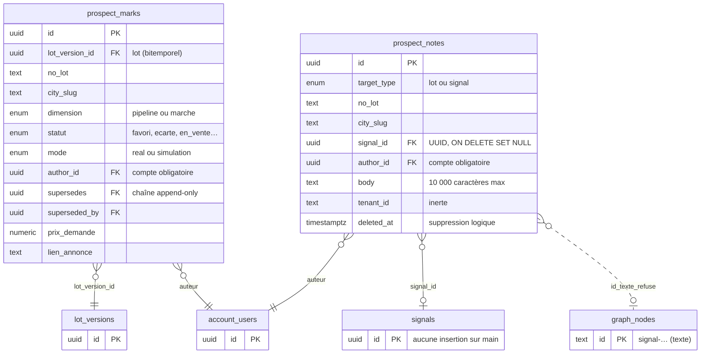

<!-- diagram:existant -->

**Pourquoi ces tables ne suffisent pas pour les retours de Steve.**
1. **Auteur avec compte obligatoire** : Steve n'a pas de compte vérifié, et ce n'est pas lui qui importe (D5).
2. **Une seule cible par note**, alors qu'une ligne du classeur vise 1 à N objets (la ligne #7 nomme deux événements ; une ligne agrégée vise une ville).
3. **10 000 caractères au plus** : la cellule E57 des Constats en compte 17 114.
4. **Aucune provenance** (fichier, sha256, feuille, ligne, révision) **ni verdict structuré** (classement, motif, sens, filtrage) : on ne peut ni réimporter sans doublon, ni construire un oracle.
5. **L'ancre signal est cassée (défaut corrigé par B0)** : l'UI envoie l'identifiant texte du graphe (`signal-…`, table `graph_nodes`), l'API exige l'UUID de la table `signals`, que plus aucun code de `main` n'alimente.

**Aucune table d'oracle n'existe en base aujourd'hui.** L'oracle actuel (oracle d'extraction v3, dit E) est un ensemble de fichiers JSON versionnés dans le dépôt, hors de `main` : `docs/reviews/refresh-benchmark/v101b/oracle-v3/` sur la branche `feat/t1-model-benchmark-real` (commit `dd0561f6`, 674 éléments sur 100 documents) ; la version 676 n'existe qu'en copie locale. Les campagnes du benchmark #782 lisent ces fichiers. Le §9.3 décrit comment l'oracle de ciblage C s'y ajoute.

La suite (§6.1 à §6.6 et scène 2) distingue ce qui **existe** sur `main` (en-tête ocre, bordure pleine : `graph_nodes`, `prospect_notes`) de ce qui est **proposé** (en-tête bleu, bordure en tirets : toutes les tables `annotation_*`, `comment_projection`, `oracle_releases`).

### 6.1 Contraintes établies

**Identité des objets annotables (FAIT).**

| Objet | Où il vit | Clé | Stabilité |
|---|---|---|---|
| Signal `signal-…`, événement `event-…` | `graph_nodes`, projetés depuis `graph/<ville>/latest.json` | `id` texte choisi par l'extraction | **Non garantie** : `upsertGraphAtomic` supprime les nœuds orphelins d'une ville (`graph-store.ts`, vers les lignes 1134–1166). |
| `signals` (historique) | table `signals` | UUID aléatoire | Aucune insertion dans le code applicatif de `main` (seulement dans un test d'intégration). |
| Municipalité | registre `QC_MUNICIPALITIES` ; nœuds `muni-<slug>` | slug, homonymes suffixés par la MRC | Stable |
| Règlement | `bylaw-<slug>-<num>`, `regulatory_stages.bylaw_canonical_id`, `reglement_number` | texte | Peu fiable (C-05, C-26) |
| Zone | `zone_versions` bitemporel | `ogc:zones:<ville>:<codeNorm>` | Stable par code |
| Lot | `lot_versions` bitemporel | `ogc:lots:<ville>:<noLotNorm>` | Stable |
| Document | `documents` | sha256 | Stable |

**Annotations existantes (FAIT, lecture de code).**
- `prospect_notes` (0011) : cible `lot` ou `signal` (UUID `ON DELETE SET NULL`), auteur `account_users`, corps limité à 10 000 caractères, suppression logique, flux SSE (événements poussés du serveur vers le navigateur) `prospect:note`.
- **Défaut 1** : l'UI envoie `GraphSignalNode.id` (texte) alors que l'API exige `z.string().uuid()` (`prospect-marks.ts:107`). Un refus 400 est attendu ; les tests utilisent `"sig-1"` sur un fetch simulé. Effet en prod : `non vérifié`.
- **Défaut 2** : `SignalAnnotations` compare `note.authorId` (`account_users.id`) à `$authStore.user.sub` (sujet IdP) quand `currentUserId` n'est pas fourni ; ni `SignauxSelPanel` ni `LotFichePanel` ne le fournissent. Les boutons d'édition n'apparaîtraient pas. Effet : `non vérifié`.
- **Défaut 3** : le badge de comptage n'est rempli qu'à l'ouverture de la fiche.
- Une cellule du classeur atteint **17 114 caractères** (Constats, E57) : le corps de note de 10 000 ne peut pas porter la source sans troncature.

**Contrat sentropic (FAIT, `origin/main` `7d1002505`).**

| Élément | `@sentropic/comments` 0.2.0 | Conséquence pour Radar |
|---|---|---|
| Cible | `{kind:'message'\|'canvas'\|'artifact'\|'field'\|'record', id, sectionKey?, recordType?}` ; `recordType` opaque | `{kind:'record', recordType:'radar.signal'\|'radar.municipality'\|'radar.bylaw'\|'radar.zone'\|'radar.lot'\|'radar.document', id:<clé namespacée>}` sans changement du paquet. Préfixer l'`id` : `TargetQuery` ne filtre pas sur `recordType`. |
| Fil | plat (`threadId`), `open\|resolved` par fil, `assignedTo` | Une évaluation publiée = un fil ; `resolved` ne signifie pas « non pertinent ». |
| Auteur | `{id, kind?: 'human'\|'agent'\|'nhi', displayLabel?}`, identifiant opaque | Auteur externe possible sans compte (D5). |
| Provenance | `{toolCallId?, runId?}` | La provenance d'import vit dans des tables hôtes. |
| Verdict structuré, étiquettes | absents | Tables hôtes ; le port n'est pas élargi. |
| Suppression | **physique par ligne** (`store.ts:47-48`) | Écart avec O1 (tombstone) ; pas de chemin de suppression par le paquet (D4). |
| Routeur Hono | `contextType` en énumération fermée (`hono.ts:17`) | Inutilisable tel quel pour `signal`. |
| Canevas | `SPEC_VOL_INTERACTIVE_CANVAS.md` = intentions brutes | Une position sur carte n'est qu'une représentation de la cible. |
| Focus | `packages/focus` supprimé de sentropic `main` (`6ca53d11a`, « focus is owned by h2a ») | Ne pas concevoir contre ce paquet. |
| Dépendance Radar | aucune référence à `@sentropic/comments` dans `ui/`, `api/` ou à la racine | À ajouter. |

### 6.2 Exigences

| # | Exigence | Source |
|---|---|---|
| E1 | Stocker toutes les cellules de toutes les feuilles, sans perte ni troncature | brief, #784 |
| E2 | Rattacher chaque retour à 1 à N éléments (signal, événement, ville, MRC, règlement, zone, lot, document, dossier) | brief, spec 2026-08-12 |
| E3 | Être conforme au contrat `comments`, sans système parallèle | spec 2026-08-12, COLLAB |
| E4 | Ne jamais détruire une annotation lors d'une ré-ingestion de sa cible | contrat d'ancre §3.1 |
| E5 | Provenance : fichier, sha256, feuille, ligne, révision, auteur, importateur, version du parseur | oracle |
| E6 | Import idempotent ; nouvelles révisions (52 villes) sans doublon, avec historique | analyse |
| E7 | Ne perdre aucune ligne non rattachable | brief |
| E8 | Coexistence de plusieurs jeux d'étiquettes (D9) | brief |
| E9 | Données personnelles (C-79) ; tombstone et rétention (O1) | Loi 25 (protection des renseignements personnels, Québec), COLLAB |

### 6.3 Schéma proposé (option M3)

Principes : clés naturelles texte **sans clé étrangère** vers le graphe (E4) ; valeurs brutes conservées à côté des valeurs normalisées ; versions par chaîne `supersedes` ; `tenant_id` inerte comme en 0011 ; migration nouvelle, 0011 n'est pas réécrite.

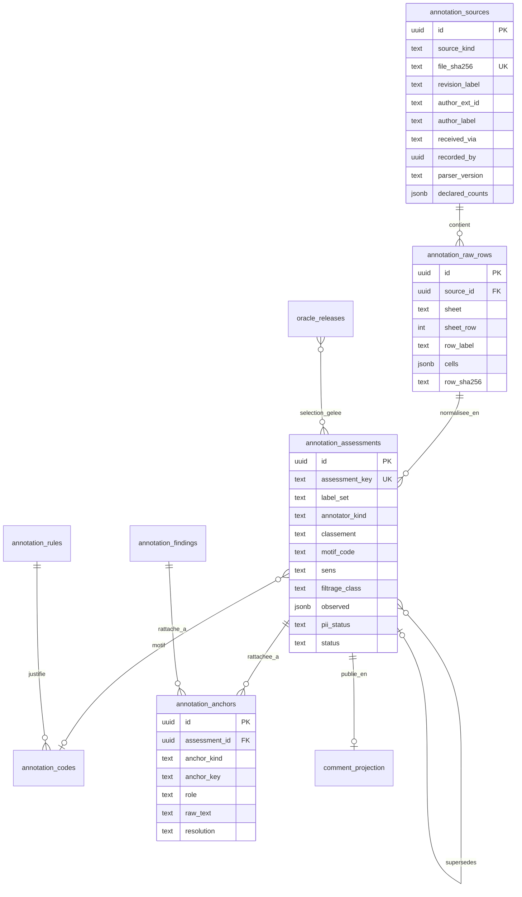

| Table | Rôle | Invariants |
|---|---|---|
| `annotation_sources` | Un fichier reçu : sha256, révision déclarée, auteur documentaire (`author_ext_id`, `author_label`), chaîne de transmission (`received_via`), importateur réel (`recorded_by`), version du parseur, comptes déclarés et mesurés | Octets originaux immuables, déposés dans le stockage objet ; unicité par sha256. |
| `annotation_raw_rows` | Toutes les cellules (valeur, formule, valeur mémorisée), par feuille et ligne Excel ; `row_label` = #, C-xx, R-xx | Aucune troncature ; unicité `(source_id, sheet, sheet_row)`. |
| `annotation_assessments` | Jugement structuré d'une ligne : classement, motif, sens, filtrage brut et normalisé, niveau de preuve, initiateur, portée, analyse, suites, instantané `observed` (ville, MRC, date, type, état, règlement, zones, verbatim) ; `label_set` et `annotator_kind` | Une nouvelle interprétation = une nouvelle ligne (`supersedes`) ; statut `active`, `withdrawn_in_revision`, `tombstoned`. |
| `annotation_anchors` | 1 à N ancres par évaluation ou constat : `anchor_kind`, `anchor_key`, `role` (`primary`, `twin`, `cited`, `aggregate`, `context`), texte brut, `resolution` (`resolved`, `abbreviated`, `ambiguous`, `unresolved`, `vanished`), validateur, date | Un lien de contexte à une ville ne propage pas le classement à tous ses signaux. |
| `annotation_codes`, `annotation_rules`, `annotation_findings` | Référentiels de Steve (28 codes, 26 règles, 77 constats) | Identifiants source conservés, jamais renumérotés. |
| `comment_projection` | Lien entre une évaluation publiée et sa représentation `Comment` (cible, fil) | Lecture conforme ; aucune suppression physique. |
| `oracle_releases` | Version d'oracle gelée : manifeste, sha256, unités, partitions, adjudications, version du scoreur | Une correction produit une nouvelle version. |

**Clé d'idempotence** : `assessment_key = sha256(label_set | feuille | city_slug | tri(ids complets cités) | règlement normalisé | zone normalisée)`. Le numéro « # » ne sert pas de clé : il peut changer d'une révision à l'autre ; il reste dans `row_label`.

**Projection conforme au contrat sentropic.** Chaque évaluation active publiée produit une représentation `Comment` :
- `target = {kind:'record', recordType:<type de l'ancre primary>, id:<anchor_key primary>, sectionKey:'steve:triage' | 'steve:ecartes'}` ;
- `author` selon D5 ; `body` = analyse puis « Suite à donner » ; le verdict structuré reste dans les tables hôtes ;
- les ancres secondaires (jumeau `event-`, ville, règlement) retrouvent le fil par requête hôte, sans dupliquer le fil ;
- une cellule précise se cible en `kind:'artifact'`, `id` = source, `sectionKey` = feuille/ligne/colonne.

### 6.4 Ancres et rattachement

| Objet | Ancre proposée | Vérification avant confirmation |
|---|---|---|
| Signal ou événement du graphe | `radar.signal:<ville>:<id>` + génération du graphe + instantané `observed` | Id exact présent dans un snapshot, ville, type et source concordants ; un préfixe seul n'est pas une preuve. |
| Document | sha256 + page + extrait | Un préfixe d'empreinte tronqué n'identifie pas un document. |
| Municipalité | slug du registre + alias source | Homonymes et suffixes MRC (C-81) ; pas de slug fabriqué par retrait des accents. |
| Zone | ville + code canonique + millésime | Pas de réancrage silencieux d'une zone renumérotée. |
| Lot | ville + numéro cadastral normalisé | Adresse civique ≠ numéro cadastral. |
| Dossier réglementaire | identité locale + liens vers règlement et étapes | Ville + numéro ne suffit pas (C-26) ; pas de fusion automatique des étapes. |
| Retour transversal, groupe non résolu | `artifact` = source + `sectionKey` de ligne | Ne jamais fabriquer une cible métier pour éliminer un reliquat. |

**Mesures lexicales (CALCUL, candidats, pas entités vérifiées).**
- Colonne L du Triage : au moins un identifiant complet dans **121/124** lignes, **148** chaînes distinctes, plusieurs candidats dans 27 lignes.
- Toutes colonnes du Triage : 121 lignes, 150 chaînes distinctes, plusieurs candidats dans 30 lignes.
- Trois feuilles Triage, Écartés et Constats : **227 à 237** identifiants complets distincts selon la règle d'extraction.
- Identifiants abrégés (`event-…-zonage-0013`) et lignes agrégées sans identifiant (« 13 signaux PIIA ») : présents dans Triage et surtout dans Écartés ; effectif exact dépendant de la règle, à publier par le rapport d'import.
- Les lignes #55 et #58 décrivent un dossier absent ; la #112 n'utilise que des identifiants abrégés.

Ordre de résolution : id exact + ville → identité documentaire + étape → dossier, zone ou lot validé → file de revue pour les ambiguïtés. Aucun rapprochement approximatif n'est confirmé sans trace humaine ou règle déterministe.

### 6.5 Import idempotent

1. **Script Node/TS** (exceljs en dépendance de développement d'`api/`), **dry-run par défaut**, via une cible Make. Rapport : comptes par feuille et par statut de résolution, écarts avec les comptes déclarés (124/146, 51/103, 121, 77, 26, 28).
2. **Idempotence** : un sha256 déjà importé ne produit aucune écriture ; une nouvelle révision fait un upsert par `assessment_key` ; une valeur modifiée crée une version `supersedes` ; une évaluation absente de la révision suivante passe en `withdrawn_in_revision`, jamais supprimée ; une transaction par fichier ; deux imports concurrents des mêmes octets convergent sans doublon ni double notification.
3. **Lignes non rattachables** : jamais rejetées. Ancre `municipality` toujours créée depuis la colonne Ville ; id abrégé résolu par ville + suffixe, sinon `ambiguous` ou `unresolved` ; ligne agrégée → ancre `municipality`, rôle `aggregate`, `count_hint` ; id complet absent du graphe → `vanished`, instantané `observed` affichable.
4. **Mesure de résolution avant tout affichage** : part des identifiants encore présents dans `graph_nodes` d'une préprod restaurée. C'est un critère de sortie du lot L1.
5. **Qualité à traiter dès l'import (FAIT)** : 4 dates partielles ou composites sur 124 ; 7 états `firm` hors liste de validation ; 66 « Procès-verbal » dans la colonne Type, hors liste d'étapes ; 29 initiateurs et 46 portées hors listes déroulantes ; 40 libellés de MRC non normalisés (dériver la MRC du registre) ; la Synthèse ne compte que 95 initiateurs normalisés sur 124. Toutes les cellules sont conservées ; les recomptages sont publiés avec leurs règles et une catégorie explicite pour les valeurs non reconnues.
6. **Données personnelles** : détection sur les verbatims, `pii_status` renseigné ; affichage selon D6.
7. **Retrait** : désactiver la publication d'un lot sans effacer source, évaluations ni réponses ultérieures des utilisateurs.
8. **Exécution en prod** : acte owner distinct, par un job de migration et d'import sur l'image Node existante de l'API ; aucun job Python.

### 6.6 Double annotation

**JUGEMENT, à confirmer (D9).** Le même schéma (`label_set`, `annotator_kind`) porte plusieurs jeux d'étiquettes sans table supplémentaire :

| Jeu | Contenu | Statut |
|---|---|---|
| `steve-source-2026-09` | Verdict original de Steve (classement, motif, sens, passe, filtrage) ; faits et interprétations de l'analyse séparés | Immuable |
| `radar-bprime` | Classification calculée par le radar (axes zonage, résidentiel, étape, exclusions, B′), reconstituée à la date du relevé | Partielle : la classification serveur de septembre n'est pas archivée |
| `targeting-c-adjudication` | Adjudication par critère C, auteur nommé, preuves, motifs de changement | Une interprétation de l'équipe n'est pas un reclassement signé Steve |
| `radar-c-v1` | Prédiction machine de C, version du classifieur, traces | Une prédiction ne devient jamais label de référence |

Cela permet de mesurer B contre Steve aujourd'hui, puis C contre Steve, de tracer les désaccords ligne par ligne, et d'ajouter un second annotateur humain si Fabien veut mesurer l'accord.

---

## 7. Première mise en œuvre — base et UI

| Lot | Contenu | Sortie observable | Taille (JUGEMENT) | Dépend de |
|---|---|---|---|---|
| **B0** — réparer l'ancre signal | Ancre texte du graphe acceptée par l'API pour les notes de signal, sans clé étrangère ; correction de la comparaison auteur (`account_users.id` contre `sub`) ; tests sur un id réel `signal-…` | Une note sur un signal réel est créée, relue et éditée en préprod, preuve navigateur | S | D3 |
| **L1** — schéma et import | Migration nouvelle (tables du §6.3) ; script Node/TS dry-run puis réel en préprod ; rapport de résolution | 124 + 121 + 77 + 26 + 28 lignes stockées ; ré-import du même fichier = 0 écriture ; taux de résolution mesuré | M | D1, D2, D3 |
| **L2** — ancres et API lecture | Résolution sur snapshot ; `GET` par entité, lecture groupée par lot d'ancres (badges), lecture complète d'un retour sans limite de 10 000 ; projection `Comment` conforme ; événement SSE étendu | Contrat zod et tests ; une seule requête par vue pour les compteurs | S–M | L1, D4, D6 |
| **U1** — affichage lecture seule | Dans `SignauxSelPanel` : badge de classement (vert, jaune, rouge), sens et code, section « Avis de Steve » (analyse, suite, niveau de preuve, provenance, statut de résolution) ; compteurs P / S / N par ville dans le rail ; migration DS des 3 composants `collab/*` | Exemples réels consultables avec contenu complet ; aucun nouveau `<button>` brut | M | L2, D14 |
| **O1** — oracle de ciblage v1 | Export `oracle-ciblage-steve-v1.json` depuis les évaluations et ancres ; partitions ; scoreur Node pour B (et C ensuite) | Tableau précision / rappel de B sur l'oracle | S–M | L1, D10 |
| **C1** — classifieur C en shadow | Extraction du sens par disposition, de la portée (plein droit / individuel), de la nature de la source (ODJ / PV), de l'effet sur les unités ; prédicat C côté serveur en parallèle de B | Précision / rappel de C contre B | L | O1, D7 |
| **C2** — comparaison et bascule | Diff B → C nommé ; parité API / rail / carte / panneau ; bascule si le seuil D13 est franchi | Décision de Farid sur mesure | S | C1, D12, D13 |
| **L7** — organisation #760 | Archiver, classer, lier, épingler hors période ; alertes seulement sur événement fiable | États durables et réversibles | N-A | maquette Steve/Mathieu, #703 |

Première valeur livrable : **B0 + L1 + L2 + U1**. O1 avance en parallèle de U1 une fois sources et ancres stabilisées. Les tailles S/M/L sont des appréciations, pas des charges mesurées.

**Parcours U1 depuis un signal.** Un badge « Retour de Steve » ouvre une section du panneau : classement original, code et sens ; analyse, niveau de preuve, suite proposée, recommandation ; fichier, feuille, numéro, ligne, révision ; état du rattachement et autres objets de la même ligne ; adjudication C distincte de la source le moment venu ; réponses des utilisateurs sous la restitution, sans édition du retour importé.

**Compteurs.** Un retour publié sur plusieurs objets ne compte qu'une fois dans le total d'import. Afficher séparément nombre de retours, nombre d'entités annotées et nombre de rattachements à confirmer. Les compteurs d'annotations ne changent pas le nombre de signaux des vues.

Tests futurs dans un environnement isolé `ENV=test-*` ou `ENV=e2e-*`, via Make, avec `down -v` après chaque stack. Cas de recette d'identité : Triage #1 (id complet), #7 (deux événements), #55 (dossier absent), #112 (ids abrégés), #110 (deux signaux proches).

---

## 8. Focus migration UI — geo et design system

**FAIT**, mesuré sur `origin/main` `27891b10`, `ui/` (application web monopage, Vite + Svelte 5). Les références sont textuelles : un import ne prouve pas une migration complète.

| Indicateur | Valeur | Lecture |
|---|---|---|
| Dépendances déclarées | design-system-svelte ^0.34.71, themes et tokens ^0.11.0, geo-core et geo-map-engine ^0.6.0, geo-ui-svelte ^0.1.1, chat-ui ^0.33.0 | Plages déclarées, pas version déployée |
| Racine | `App.svelte` dans `ThemeProvider`, thème Sent-Tech | Tokens disponibles pour les nouvelles surfaces |
| Composants `.svelte` | 69, dont **39** importent le DS (56,5 %) ; 63 hors stubs et harnais | Adoption large mais partielle, pas « 56,5 % migré » |
| Composants DS les plus utilisés | Badge (25 fichiers), Alert 19, Button 14, Card 12, EmptyState 11 | — |
| Composants DS jamais utilisés | Tabs, Modal, Table, Input, Textarea, Tooltip | — |
| Contrôles HTML bruts | **132** `<button>` dans 37 fichiers (125 dans 35 hors stubs et harnais) ; 13 `<input>` ; 7 `<textarea>` ; 6 `<select>` ; 8 `<table>` | Indice de reste, pas inventaire de violations |
| Couleurs | 1 668 classes de couleur Tailwind (49 fichiers) contre 370 `var(--st-*)` (13 fichiers) ; 481 couleurs hexadécimales | Tokens DS minoritaires |
| Carte Signaux | `SignauxMapView` → `GeoCityMapBase.svelte`, MapLibre local (2 761 lignes) ; geo-map-engine seulement pour le fond satellite | Non migrée |
| Composants geo partagés | Seule la route `#/geo` (`GeoView`) rend `GeoMap` + `GeoDetailPanel` | Pilote isolé, sans panneau d'annotations |
| Moteur geo partagé | `GEO3D_ENGINE_ENABLED = false` ; montage par défaut en attente de la « Porte 2 » | Désactivé ; l'activer exige caméra et sélection, pas seulement le booléen |
| Annotations `collab/*` | **0 sur 3** utilisent le DS (`<textarea>` ×2, `<button>` ×5, badge Tailwind) | À migrer dans U1 |
| `SignauxSelPanel` | Importe le DS, contient 16 `<button>` bruts | Point de montage des annotations |
| `@sentropic/comments`, focus | 0 référence | Adaptateurs à réaliser |
| Dernière mesure officielle | `audit-ds-realignement.md` (2026-06-14) : 5 OK, 29 à migrer | Aucune mesure plus récente : `source manquante` |

**Ce qui conditionne l'UI des annotations (JUGEMENT).**
1. On n'attend pas la migration geo : U1 vit dans le panneau et le rail, avec des composants DS déjà adoptés (Badge, Card, Alert, Popover, Drawer).
2. Les trois composants `collab/*` migrent vers le DS dans le même lot : faible coût, pas de dette ajoutée.
3. Une couche carte « annotations » (pastille par ville ou lot) attend la migration de `GeoCityMapBase` : sinon on ajoute du code à un composant local de 2 761 lignes destiné à être remplacé (D14).
4. Le badge par signal exige la lecture groupée de L2 : le comptage actuel n'affiche rien avant l'ouverture de la fiche.
5. Pas d'investissement dans l'UI de tri (#760) avant la maquette de Steve et Mathieu.

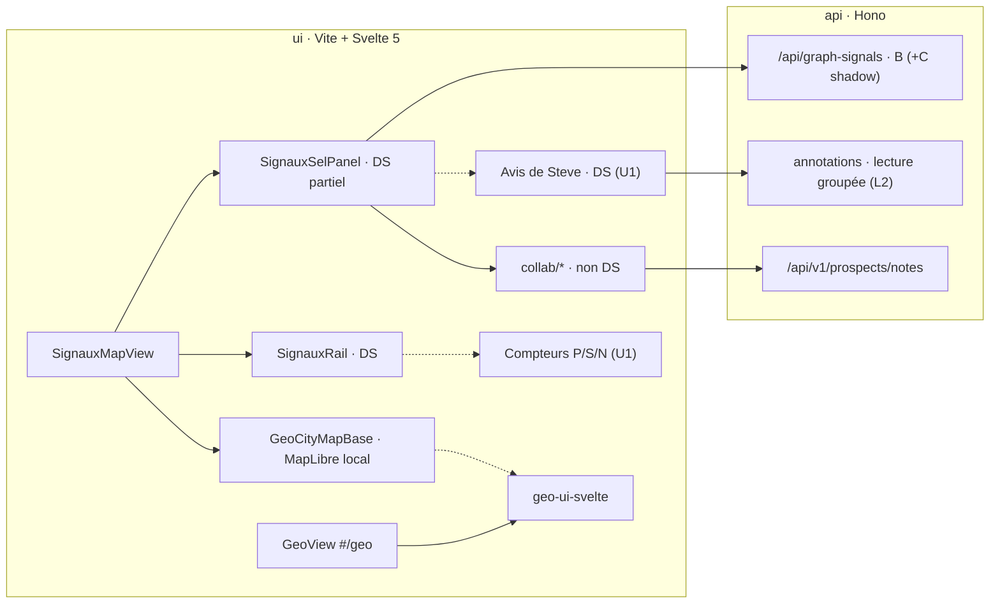

---

## 9. Ciblage réorienté, nouvel oracle, double annotation et affichage A/B/C

### 9.1 B actuel

- **FAIT.** Le contrat B′ définit son défaut par `!exclusion && zonage && residentielEligible && precoce`. Le résidentiel indéterminé est éligible pour certains instruments ; l'étape précoce est avis de motion ou projet de règlement. B′ est un vivier de découverte : son appartenance « ne prouve pas une hausse de densité ».
- **FAIT.** Le sélecteur A/B a été retiré du rail (`f2c20573`, 2026-08-22) : `SignauxRail` rend directement B, les anciennes clés A sont normalisées vers B. Les comptes A sont encore calculés côté serveur.
- **Conséquence.** Ajouter C n'est pas ajouter un troisième onglet à un sélecteur actif : toute comparaison A/B/C est un mécanisme à réexposer.

### 9.2 Critères C proposés

Un signal est **dans C** si aucune exclusion **établie** ne s'applique ; il est **confirmé** si les critères requis sont étayés, **à instruire** sinon. Les étiquettes de Steve servent de vérité par critère.

| # | Critère | Règle de Steve | Donnée disponible (FAIT) | Donnée à produire |
|---|---|---|---|---|
| K1 | Règlement d'urbanisme (pas matières résiduelles, emprunt, gestion contractuelle, subvention, éthique) | analyse ; N-FAUX-POSITIF, N-ADMIN | `category` fourre-tout (`rezonage`, C-52) | Nature de l'acte sur le titre complet |
| K2 | Résidentiel ; agricole seulement en dézonage CPTAQ résidentiel | critère 1, R-18 | `res` par regex et instrument | Usage visé, préfixe de zone (C-55) |
| K3 | Sens ≠ purement restrictif ; mixte et indéterminé restent visibles | critère 2, R-21, C-57, C-66 | aucune | `sens` par disposition, 5 valeurs |
| K4 | Densification : plus d'unités qu'avant | critère 3, R-08 | `effet_densifiant` toujours `inconnu` | `effet_unites` avant / après (C-72) |
| K5 | De plein droit, non individuel (exclut PPCMOI, dérogation, usage conditionnel, Loi 31, CPTAQ individuelle sauf R-18) | R-06, R-09, R-10 | `instrument` | Portée du droit ; finalité CPTAQ (C-53) |
| K6 | Capacité de construire (exclut PIIA, construction, clôtures ; lotissement seulement s'il agit seul, R-22) | R-06, R-15, R-22 | instrument piia | Rattachement du lotissement au dossier |
| K7 | Décision, pas simple point d'ordre du jour ; un point retiré est mort | R-01, R-02, R-23 | nature du document source : `non vérifié` | `source_nature` et état du point (C-35) |
| K8 | Étape : avis de motion, premier projet, **second projet**, mandat d'urbaniste, résolution CPTAQ | R-05, R-23, C-82, C-68 | `etape ∈ {avis_motion, projet_reglement}` | `second_projet` ; cycle par famille d'instrument |
| K9 | Épinglé ⇒ visible quelle que soit la période | R-25, C-69 | aucune | Hors C (#760), mais C le respecte |

**Règle d'asymétrie (contraignante).** Une absence de données n'est jamais une preuve négative. Si K3 ou K4 sont `indéterminé`, le signal reste dans C, état « à instruire ». On ne masque que ce qui est établi hors critères. Par construction, C ne dégrade pas le rappel sur les cas illisibles ; son gain porte sur la précision. Deux compteurs distincts, « confirmés » et « à instruire », évitent de présenter une conservation prudente comme une opportunité avérée.

**Cas à arbitrer par Steve plutôt que par regex (D8)** : Saint-Victor (resserrement des maxima de lots qui favorise la densification, R-22) ; Amos (logement sur commerce rejeté par l'analyse) ; portée exacte de l'exception CPTAQ ; seconds projets (R-19 contre C-82) ; visibilité des ODJ ; trois restrictions À surveiller (S-RESTRICTIF) contre R-21 ; ligne Mixte #41 non pertinente alors que l'analyse protège les mixtes ; rangement des 5 Mixte dans la reconstitution 22/12/15/24 ; table de dérivation code de motif → critères (S-CONTRAINTE, S-PPCMOI-SERIE, S-PREEMPTION ne se projettent pas proprement).

### 9.3 Nouvel oracle (#783)

#### Ancien oracle → nouvel oracle : la proposition

**Rien n'est remplacé ; on ajoute un oracle et un volet de mesure.** L'oracle d'extraction existant (E, v3) reste tel quel et continue de noter l'extraction des actes ; l'oracle de ciblage (C) est construit à partir des retours de Steve et note la sélection des signaux. Le benchmark #782 publie deux volets séparés, jamais fusionnés. Ce choix est la décision **D10** (option b, recommandée) ; les options a et c en sont les alternatives, chacune avec son schéma au §10.

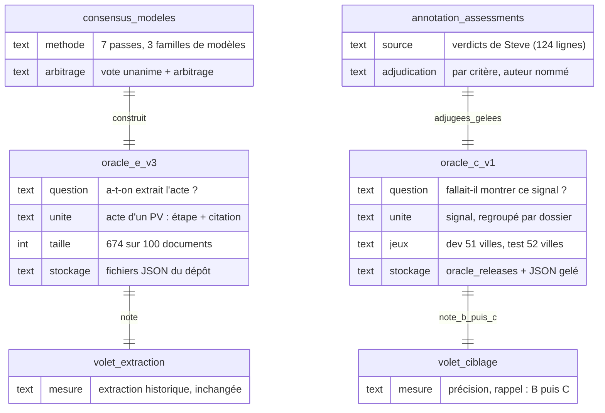

<!-- diagram:oracles -->

| | Ancien : oracle E (extraction, v3) | Nouveau : oracle C (ciblage, v1) |
|---|---|---|
| Question | A-t-on extrait l'acte d'un procès-verbal (étape + citation) ? | Fallait-il montrer ce signal à Steve ? |
| Construit par | 7 passes de 3 familles de modèles, vote unanime et arbitrage (commit `dd0561f6`) | Les évaluations et ancres de Steve (lot L1), adjugées critère par critère par un auteur nommé, avec preuve |
| Stockage | Fichiers JSON du dépôt (`v101b/oracle-v3/`), hors `main` | Une ligne `oracle_releases` (manifeste, sha256, unités, partitions) + export gelé `oracle-ciblage-steve-v1.json` versionné dans le dépôt, à côté de l'oracle E |
| Jeux | 100 documents | Développement : les 51 villes du relevé ; test : les 52 villes suivantes, jamais vues ; un dossier entier dans une seule partition |
| Gel et version | 674 committé ; **676 à committer et geler par empreinte avant toute campagne** | Gelé par sha256 avant la mesure ; toute correction = nouvelle version (v2…), jamais une modification en place |
| Qui valide | Fabien (D10, D11) | Fabien valide la construction et le gel (D10) ; Steve et Mathieu tranchent les cas contradictoires (D8) ; Farid fixe le seuil qui utilise la mesure (D13) |
| Ce qu'il note | Toute campagne d'extraction (modèles, prompts) | B aujourd'hui, puis C en shadow ; base de la bascule B → C |

**Étapes proposées.** 1) Committer et geler l'oracle E 676. 2) Importer les retours de Steve (L1). 3) Adjuger les labels C sur les 51 villes et geler `oracle-ciblage-steve-v1` (O1). 4) Mesurer B sur cet oracle. 5) Mesurer C en shadow (C1). 6) Quand Steve aura relevé les 52 villes suivantes, les annoter en jeu de test aveugle et geler v2. 7) Publier les deux volets du benchmark, chacun contre sa version gelée.

| | Oracle E — extraction | Oracle C — ciblage |
|---|---|---|
| Question | A-t-on extrait l'acte ? | L'aurait-on montré à raison ? |
| Unité | acte d'un PV (étape + citation) | signal (nœud du graphe), regroupé par dossier pour les jumeaux et les grappes |
| Étiquettes | étape | classement P/S/N, motif, sens, filtrage, critères K1–K8 dérivés du motif (table relue par Steve) |
| Origine | consensus de 3 familles de modèles, ancrage textuel, arbitrage ; pas d'annotation humaine | Steve (source), adjudication nommée |
| Version | 674 unités / 47 non résolus committés sur `feat/t1-model-benchmark-real` (`dd0561f6`) ; 676 / 43 en copie locale identifiée par sha256 (`consensus.json` `8e8e9cc0…`), non committée | `oracle-ciblage-steve-v1`, à geler |

« 676 » est le nombre d'unités, pas la carte #676 (déploiement immo-mcp) ; le suivi de l'oracle est #725. **La version 676 doit être committée et gelée par empreinte avant la campagne suivante.**

**Construction.**
1. Figer règles et unités ; séparer détection d'acte, qualification C et affichage.
2. Manifeste de corpus : documents, empreintes, millésimes, profils de filtre, liens vers les retours. L'intersection avec les 100 documents du banc est `non vérifié`, probablement faible.
3. Le jeu de Steve sert de régression et de jeu de développement ; seuls les labels rattachés et étayés entrent dans la référence notée.
4. Étendre la vérité documentaire : les retours issus de l'écran ne mesurent pas les opportunités jamais extraites (sept dossiers manqués).
5. Adjudication indépendante des sorties des modèles candidats ; désaccord métier → revue humaine ; absence de preuve → non résolu.
6. **Séparation développement / test** : les 51 villes du relevé pour régler C, les 52 suivantes annoncées par Steve comme jeu de test aveugle ; toutes les unités d'un même dossier dans la même partition.
7. Geler chaque version (sha256) ; ne jamais comparer deux bras sur deux versions différentes.

**Base B mesurée sur l'échantillon de Steve (CALCUL, passe 1 = 73).**

| Mesure | Valeur | Calcul |
|---|---:|---|
| Bruit (Non pertinent) | 32,9 % | 24/73 |
| Précision P ∪ S | 67,1 % | 49/73 |
| Précision P | 46,6 % | 34/73 |
| Précision « trois critères » | 30,1 % | 22/73 |
| Part des P en passe 1 | 85 % | 34/40 |
| Part des P en passe 1 ou 2 | 95 % | 38/40 |

<!-- chart:base-b -->

Biais : 124 signaux sur 146, 51 villes sur 103, choisies dans l'ordre du relevé ; non représentatif du parc (JUGEMENT).

### 9.4 Impacts sur le benchmark (#782)

| Mesure | Règle | Pourquoi |
|---|---|---|
| Extraction historique | Même oracle E, même corpus, même méthode ; refus comptés en manqués | Comparabilité ; détecter une perte d'extraction |
| Précision et rappel post-filtrage de B, puis de C | Oracle C, même snapshot | Sens concret du « rappel max post-filtrage » de #782 |
| Rappel critique | Aucun Pertinent masqué, en particulier mixtes et indéterminés | Réserve d'asymétrie de Steve |
| Couverture de qualification | Unités au verdict C étayé / unités candidates ; indéterminés publiés à part | Éviter un gain obtenu par abstention |
| Effet B → C | Entrants, sortants, conservés, nommés avec raison | Expliquer au lieu de proclamer |
| Parité d'affichage | Mêmes ensembles API / rail / carte / panneau, même profil, mêmes dates | Défaut de classe relevé dans #786 |
| Coût utile | Coût, latence, refus par opportunité C retrouvée | Aujourd'hui `N-A` |

Les tableaux extraction et ciblage restent séparés, sans fusion des F1. Pont possible : id Steve → nœud → `docRefs.docSha` → unités E, seulement pour les 100 documents du corpus. Toute modification du prompt gelé `immo-pv-extraction-v9` pour produire sens, effet et portée rompt la comparabilité v10/v11 : nouvelle version du contrat, décision dédiée (D11). Aucun changement de modèle principal n'est recommandé sur la seule base des retours de Steve.

### 9.5 Affichage A/B/C

| Profil | Rôle | Conservation |
|---|---|---|
| A | Référence historique (`z/m/p`), calculée côté serveur | Gelée ; pas de retour silencieux à A |
| B | Vivier actuel, défaut pendant la recette de C | Contrats B′ conservés ; ce que C retire ne disparaît pas de B |
| C | Ciblage Steve, versionné, calculé côté serveur sur le même inventaire | États confirmé / à instruire / exclu prouvé, chaque exclusion expliquée |

**Divergence non tranchée par les sources (D12).**
- Auteur B : C en shadow, comparée à B sur l'oracle, aperçu UAT par un paramètre non documenté, puis **remplacement** de B au seuil. Argument : #787 demande de ne pas réintroduire de choix entre plusieurs viviers, et Steve veut une interface plus simple.
- Auteur A : B par défaut, C expérimental, **sélecteur et mode comparatif A/B/C**, paramètre dédié du type `filter.targeting=a|b|c` (et non `mode`, déjà pris par le parcours geo).
- Vérification : la phrase de #787 figure dans l'item 4 du comportement attendu (grammaire d'URL), règles validées par l'owner le 1er octobre ; elle ne figure pas dans la liste « Décisions du propriétaire ». Le brief de ce dossier parle d'un « mécanisme A/B d'affichage étendu en C ». Les deux lectures sont défendables ; Farid tranche, après consultation de Steve, Mathieu et Fabien.
- **Recommandation consolidée** : C en shadow, comparaison A/B/C dans un mode réservé à l'UAT et aux administrateurs, B par défaut, aucun choix de vivier exposé aux utilisateurs courants ; bascule au seuil D13. Si Farid veut un sélecteur visible, la variante de l'auteur A s'applique, avec URL complète conforme à #787.

**Dates orthogonales au ciblage.** Date documentaire, de collecte, de l'acte, du retour et de l'import restent distinctes. C consomme les dates de #788 via la politique de #786, sans relancer de modèle de langage (LLM) à l'affichage. Un dossier épinglé hors période figure dans une liste de suivi, pas dans un total limité à la période. Les comparaisons A/B/C figent l'horloge des périodes relatives.

**Diagrammes** : critères de Steve en regard de l'existant (matrice), modèle de données (entité-relation), architecture de l'import à l'affichage avec l'oracle transversal (couloirs), architecture UI et A/B/C sont rendus en scènes Focus (annexe B).

---

## 10. Options et recommandation

**Ordre de décision.** Fabien décide d’abord ses six décisions (D2, D3, D4, D9, D10, D11) : elles sont prises telles quelles, sauf incohérence avec une autre décision. Farid décide ensuite ses dix décisions (D1, D5, D6, D7, D8, D12, D13, D14, D15, D16), en connaissant les choix de Fabien. Si un choix de Farid contredit un choix de Fabien (par exemple D1 « tout conserver » avec D2 = M1, qui tronque une cellule de 17 114 caractères), on revient à Fabien sur ce seul point.

Chaque décision s'ouvre sur une courte introduction (le problème, pourquoi maintenant, ce qui change selon le choix, les renvois au dossier), dit de quelles décisions elle dépend, puis détaille chaque option : une description de ce qui est proposé, ses avantages et ses inconvénients, et pour D2 et D3 un schéma de tables par option. Les coûts sont des jugements relatifs de périmètre, pas des estimations d'heures ni de budget (`N-A` jusqu'à l'inventaire des rattachements).

### Étape 1 · Fabien décide d’abord (architecture, données, oracle)

#### D2 — Modèle de données
**Étape 1 · Décide : Fabien · Consulté : Farid.** Prise telle quelle, sauf incohérence avec une autre décision.

Le classeur de Steve (7 feuilles, 433 lignes, une cellule de 17 114 caractères, §5.1) doit être stocké en base et rattaché aux objets du radar (#784). La seule table d’annotation existante, prospect_notes (migration 0011), exige un auteur avec compte, une seule cible et au plus 10 000 caractères (§6.1). Il faut choisir la forme des tables maintenant : l’import (lot L1), l’affichage (U1) et l’oracle (O1) en dépendent tous (§7). Le schéma proposé est la scène 2 (diagramme entité-relation) : sources immuables → lignes brutes → évaluations versionnées → ancres → publication.

**Dépend de :** aucune décision antérieure. **Conditionne :** D3 (Ancre signal et correctif B0), D4 (Conformité sentropic et suppression), D9 (Sens de « double annotation »), D10 (Oracle #783), D1 (Périmètre de conservation des retours de Steve).

| Option | Description | Avantages | Inconvénients |
|---|---|---|---|
| M1 — étendre prospect_notes | On ajoute des colonnes à prospect_notes (migration 0011) et chaque ligne du classeur devient une note libre sur un lot ou un signal. Aucune nouvelle table ; l’UI des notes existante affiche le texte. Exemple : la ligne #7 du Triage, qui nomme deux événements, doit être dupliquée en deux notes ; la cellule E57 des Constats (17 114 caractères) ne rentre pas. | • Réutilise la migration 0011, l’API et l’UI existantes. • Aucune nouvelle table à créer. | • Auteur = compte obligatoire : Steve n’en a pas (D5). • Une seule cible par note, alors qu’une ligne vise 1 à N objets (signal, ville, règlement…). • Corps limité à 10 000 caractères : la cellule de 17 114 caractères serait tronquée. • Ni provenance (fichier, feuille, ligne) ni verdict structuré : inutilisable pour l’oracle. |
| M2 — table de contrôle seule | On crée une seule table de contrôle qui recopie le classeur pour mesurer le radar, sans aucun lien vers ce qui est affiché. Le nom de table est indicatif. Rien n’apparaît dans le panneau du signal : Steve ne retrouve pas son verdict sur le signal qu’il a trié ; seul l’oracle lit la table. | • Rapide : une table. • Respecte le précédent du 2026-06-11 : la mesure ne nourrit pas la production. | • Rien d’affichable : ne répond pas à #784 (« attaché à l’élément associé »). • Steve ne voit pas ses retours dans l’outil. • Une seconde structure sera nécessaire plus tard pour l’affichage. |
| **M3 — couches hôtes + projection conforme** (recommandée) | On crée les tables de la scène 2 : le fichier reçu (sha256), toutes ses lignes brutes, une évaluation versionnée par ligne, 1 à N ancres vers les objets du radar, et une projection vers les fils de commentaires sentropic. Exemple : la ligne #7 donne une évaluation et deux ancres (deux événements) ; une ligne agrégée « 13 signaux PIIA » donne une ancre sur la ville. Le panneau affiche le verdict, l’oracle lit les mêmes évaluations. | • Couvre les neuf exigences E1 à E9 (§6.2) : aucune perte, 1 à N ancres, provenance, révisions sans doublon. • Les couches brutes et évaluations servent de table de contrôle pour l’oracle ; la projection Comment, d’annotation visible. • Conforme au contrat sentropic sans modifier le paquet. | • Neuf tables nouvelles et une migration à écrire et tester. • Une file de rapprochement (identifiants abrégés, ambiguïtés) à traiter à la main. • Plus de code d’import que les autres options. |
| M4 — attendre le paquet complet | On ne construit rien côté radar : on attend que le paquet comments de sentropic porte tout (cibles, verdict, provenance). En attendant, le classeur reste un fichier hors de l’outil. Même livré, le paquet ne porte ni classement, ni motif, ni sens : il faudrait encore des tables radar. | • Aucune dette côté radar : tout vit dans sentropic. • Aucune migration à écrire ni à maintenir maintenant. | • Bloquant sans date : #784 et l’oracle attendent. • Le paquet ne porte de toute façon ni verdict structuré ni provenance (§6.1). |

Schéma de l'option M1 — étendre prospect_notes :

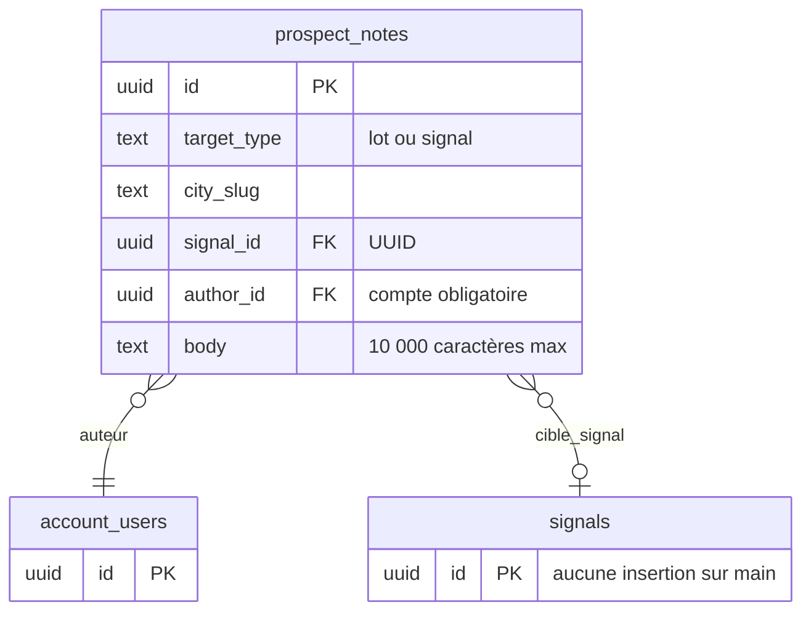

Schéma de l'option M2 — table de contrôle seule :

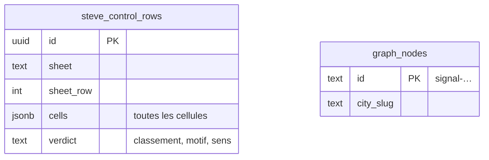

Schéma de l'option M3 — couches hôtes + projection conforme :

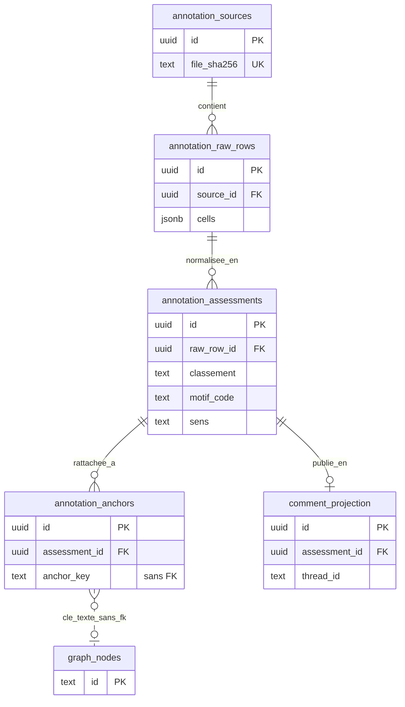

Schéma de l'option M4 — attendre le paquet complet :

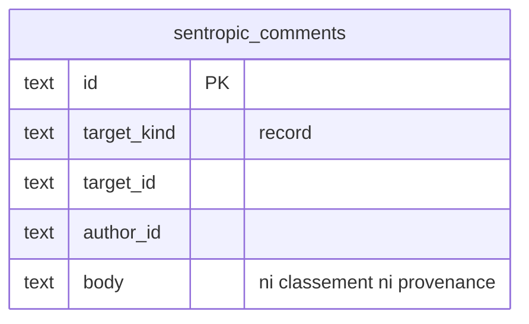

**Recommandation : M3 — couches hôtes + projection conforme.** M3 est la seule option qui conserve tout, rattache une ligne à plusieurs objets et sert à la fois l’affichage et l’oracle. Son vrai coût, la curation des identifiants abrégés, existe dans toutes les options.

#### D3 — Ancre signal et correctif B0
**Étape 1 · Décide : Fabien · Consulté : Farid.** Prise telle quelle, sauf incohérence avec une autre décision.

Une ancre est la référence qui attache une annotation à un objet du radar (signal, ville, zone, lot…) ; c’est la colonne anchor_key de la table annotation_anchors (scène 2). Aujourd’hui l’annotation d’un signal est cassée : l’UI envoie l’identifiant texte du graphe (« signal-… »), alors que l’API exige un UUID, identifiant aléatoire de l’ancienne table signals que plus aucun code n’alimente (§6.1, défaut 1). « B0 » est le petit lot correctif qui répare cela (§7). Sans ancre fiable, aucun retour de Steve ne s’affiche sur son signal. Risque connu : une ré-extraction du graphe peut supprimer ou renommer des identifiants (graph-store.ts, §6.1).

**Dépend de :** D2 (Modèle de données). **Conditionne :** D14 (Première livraison UI), D15 (Séquencement).

| Option | Description | Avantages | Inconvénients |
|---|---|---|---|
| **(a) Clé texte namespacée + instantané observé, B0 immédiat** (recommandée) | On stocke la cible sous forme de texte (« radar.signal:<ville>:<id> ») dans annotation_anchors, sans clé étrangère vers le graphe, avec un instantané de ce que Steve a vu (ville, date, type, verbatim). B0 corrige l’API pour accepter cet identifiant texte. Si une ré-extraction supprime le signal, l’ancre passe « disparue » et le panneau montre l’instantané au lieu de perdre le retour. | • Survit à la ré-extraction : l’ancre passe « disparue » au lieu d’effacer l’annotation, et l’instantané observé (ville, date, type, verbatim) reste lisible. • Répare tout de suite l’annotation existante (B0, taille S). • Aucune clé étrangère vers le graphe, donc aucune suppression en cascade. | • Si l’extraction renomme un identifiant, un rapprochement est nécessaire (file de revue). • La clé texte n’est pas une identité métier définitive. |
| (b) Attendre une clé métier stable | On n’ancre rien tant qu’une clé métier stable (dossier réglementaire, étape) n’existe pas dans une ontologie du radar. Aucun lot B0 : l’annotation de signal reste en échec 400 et les retours de Steve ne s’affichent sur aucun signal. | • Identité propre et stable par conception. • Évite plus tard tout rapprochement d’identifiants. | • Dépend d’une ontologie qui n’existe pas : bloquant, sans date. • L’annotation de signal reste cassée en attendant. |
| (c) Passer par l’UUID signals | On garde le contrat v1 : une annotation de signal pointe vers l’UUID de la table signals. Mais aucun code de main n’écrit dans signals : il n’existe aucun UUID à viser pour les 124 lignes de Steve. L’ancre ne peut pas être créée. | • Contrat v1 (migration 0011) inchangé. • Aucune nouvelle colonne d’ancre à créer. | • Aucune insertion dans signals sur main : l’ancre est impossible en pratique. • Maintient le défaut actuel (refus 400 attendu). |

Schéma de l'option (a) Clé texte namespacée + instantané observé, B0 immédiat :

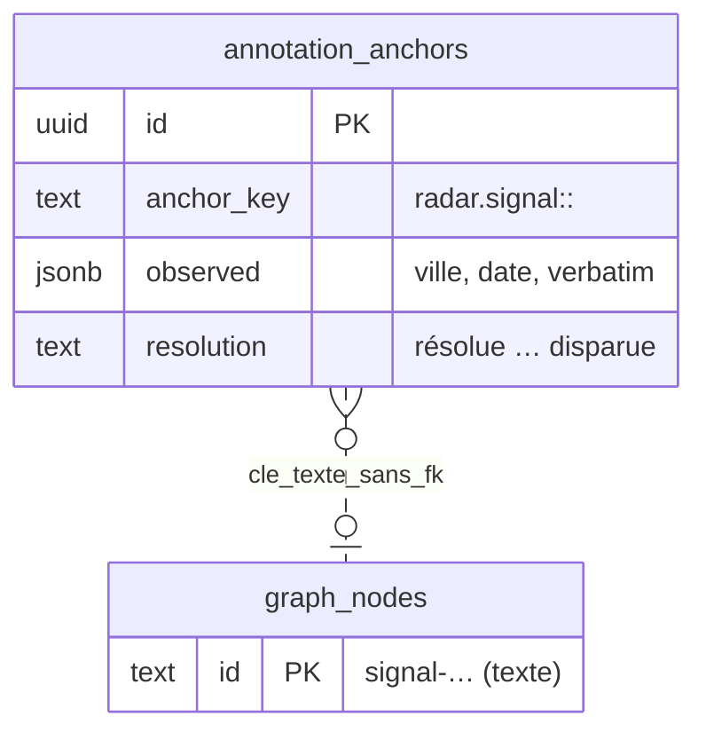

Schéma de l'option (b) Attendre une clé métier stable :

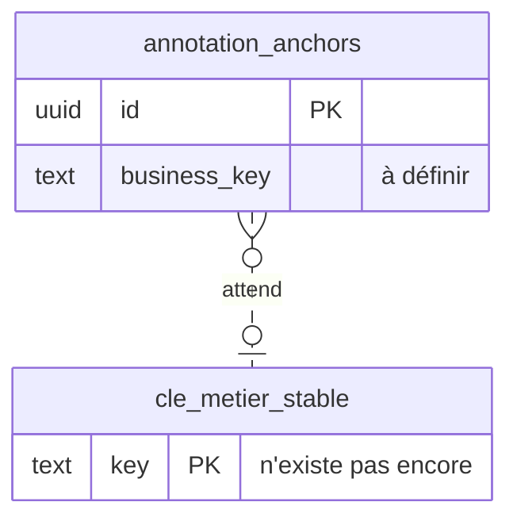

Schéma de l'option (c) Passer par l’UUID signals :

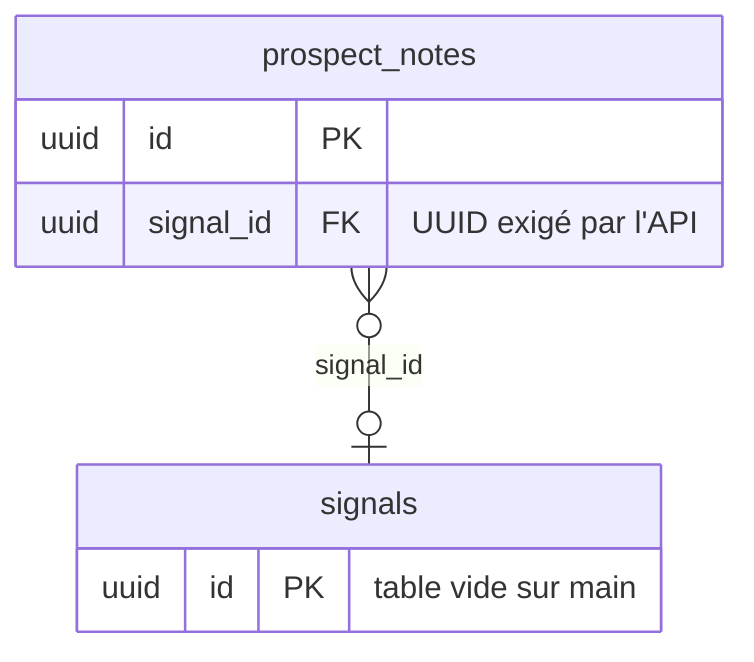

**Recommandation : (a) Clé texte namespacée + instantané observé, B0 immédiat.** (a) avec B0 tout de suite : c’est le seul choix qui rend l’annotation de signal utilisable maintenant et qui ne perd rien à la ré-extraction. Une clé métier stable reste un suivi séparé.

#### D4 — Conformité sentropic et suppression
**Étape 1 · Décide : Fabien · Consulté : Farid.** Prise telle quelle, sauf incohérence avec une autre décision.

Les annotations doivent suivre le contrat du module comments de sentropic, la plateforme commune (exigence E3, §6.1). Ce module, en version 0.2.0, supprime physiquement un commentaire ; or l’owner a décidé (O1, dossier COLLAB) qu’une suppression laisse une trace (« tombstone ») et une durée de rétention. Il faut décider comment être conforme sans contredire O1, avant l’import (L1) et l’API de lecture (L2). Concrètement : peut-on supprimer un retour de Steve, et par quel chemin ? Dans la scène 2, comment_projection relie une évaluation publiée à son fil de commentaires.

**Dépend de :** D2 (Modèle de données). **Conditionne :** D5 (Auteur des retours importés), D6 (Visibilité et données personnelles), D14 (Première livraison UI).

| Option | Description | Avantages | Inconvénients |
|---|---|---|---|
| **(a) Cibles et lecture conformes, import immuable, demande de tombstone** (recommandée) | Les annotations utilisent les cibles et la lecture du module comments, sans modifier le paquet. Les retours importés sont immuables : aucun bouton de suppression. Les réponses de l’équipe vont dans prospect_notes v1, qui sait déjà effacer logiquement. On demande à sentropic une version avec tombstone, puis on adopte le port complet. | • Respecte O1 et la ligne COLLAB « le paquet porte l’intégrité ». • Livrable maintenant : cibles et lecture conformes, sans modifier le paquet. • Les réponses des utilisateurs vont dans prospect_notes v1, qui sait déjà faire une suppression logique. | • Conformité partielle : pas encore le port complet CommentStore. • Une demande à sentropic (tombstone) à suivre. • Une migration vers le port complet plus tard. |
| (b) Adaptateur CommentStore à tombstone hôte | On écrit un adaptateur CommentStore côté radar dont le delete pose une marque (tombstone) au lieu d’effacer. Les retours et réponses passent tout de suite par le port complet. Mais le delete du port ne supprime plus vraiment : sa sémantique diffère de celle du paquet. | • Port complet utilisé dès maintenant. • Un seul chemin d’écriture et de lecture : celui du port. | • Contredit COLLAB §2 : un tombstone porté seulement par Radar est un piège. • Un delete qui ne supprime pas trahit la sémantique du port. • Dette à défaire quand sentropic livrera. |
| (c) Attendre le port complet | On attend que sentropic publie un paquet avec tombstone et rétention, puis on branche tout dessus. Aucun retour de Steve n’est affiché avant cette version, sans date connue. | • Conformité intégrale, aucun écart. • Aucune migration ultérieure vers le port complet. | • Bloquant tant que sentropic n’a pas livré, sans date. • Rien d’affiché pour Steve en attendant. |

**Recommandation : (a) Cibles et lecture conformes, import immuable, demande de tombstone.** (a), puis adoption du port complet quand sentropic publiera la version avec tombstone. Réserve : le dossier COLLAB n’est pas sur main (non vérifié) ; s’il était abandonné, (b) redeviendrait défendable.

#### D9 — Sens de « double annotation » (point ouvert)
**Étape 1 · Décide : Fabien · Consulté : Farid.** Prise telle quelle, sauf incohérence avec une autre décision.

La demande initiale parle de « double annotation (ancienne / nouvelle) » sans dire ce qui est comparé à quoi. Le modèle M3 (D2) porte plusieurs jeux d’étiquettes côte à côte (colonnes label_set et annotator_kind, §6.6) : les trois lectures sont donc possibles techniquement. Mais chacune produit une mesure différente et fixe ce que l’oracle (D10) comparera : il faut la préciser avant de geler l’oracle de ciblage. Le sens de la demande appartient à Fabien.

**Dépend de :** D2 (Modèle de données). **Conditionne :** D10 (Oracle #783), D7 (Définition de C v1).

| Option | Description | Avantages | Inconvénients |
|---|---|---|---|
| Steve contre classification radar | Le jeu « steve-source » (verdict de Steve) est comparé à la classification du radar : B′ reconstituée à la date du relevé, puis C. Exemple : sur la passe 1, Steve juge 24 signaux sur 73 Non pertinent alors que B les affiche ; c’est cet écart que l’on mesure ligne par ligne. | • Mesure directement l’écart entre ce que Steve juge et ce que le radar montre (B aujourd’hui, C demain). • C’est la lecture qui sert la bascule B → C (D13). | • La classification serveur de septembre n’est pas archivée : la version radar sera reconstituée, en partie. • Ne mesure pas l’accord entre deux humains. |
| Ancienne grille de Steve contre grille C | On compare deux grilles humaines de Steve : son classement actuel (P/S/N, motif) et un nouvel étiquetage selon les critères C. Steve repasse sur les mêmes lignes ; l’oracle mesure l’évolution de ses critères, pas le radar. | • Suit l’évolution des critères de Steve dans le temps. • Utile si Steve réétiquette ses lignes avec les critères C. | • Exige un second passage de Steve sur les mêmes lignes. • Ne dit rien de la qualité du radar. |
| Oracle 676 contre oracle Steve | On rapproche l’oracle d’extraction (676 unités sur 100 procès-verbaux) et l’oracle de Steve (124 lignes). Le pont passe par les documents communs, probablement peu nombreux (non vérifié). | • Relie l’extraction (oracle E) et le ciblage (oracle C). • Réutilise deux références déjà constituées (674/676 et le tableur). | • Compare deux questions différentes : « a-t-on extrait l’acte ? » contre « fallait-il le montrer ? ». • Recouvrement des deux corpus probablement faible (non vérifié). |

**Point ouvert.** Point ouvert : aucune option recommandée. La lecture (1) est celle que le dossier a modélisée (§6.6) ; les trois tiennent dans le même schéma.

#### D10 — Oracle #783
**Étape 1 · Décide : Fabien · Consulté : Steve, Farid.** Prise telle quelle, sauf incohérence avec une autre décision.

Un oracle est un jeu de réponses de référence qui note automatiquement le radar. L’oracle actuel (674 unités committées, 676 en copie locale) note l’extraction des actes dans les procès-verbaux, pas le choix des signaux à montrer (§9.3). Les retours de Steve sont la première vérité humaine sur ce choix : dans sa vue de travail, 24 signaux sur 73 sont du bruit (32,9 %, scène 1). Il faut décider comment construire l’oracle de ciblage (#783) avant de développer C (D7), car c’est lui qui dira si C fait mieux que B (D13). Dans la scène 3, l’oracle est la bande du bas : hors ligne, alimenté par les annotations en base. La proposition complète (ancien oracle → nouvel oracle, construction, gel, validation) est au §9.3.

**Dépend de :** D2 (Modèle de données), D9 (Sens de « double annotation »). **Conditionne :** D11 (Benchmark #782), D1 (Périmètre de conservation des retours de Steve), D7 (Définition de C v1), D8 (Cas contradictoires), D12 (Exposition A/B/C), D13 (Seuil de bascule B → C), D15 (Séquencement).

| Option | Description | Avantages | Inconvénients |
|---|---|---|---|
| Remplacer v3 par le tableur | Les 124 lignes du tableur deviennent l’unique oracle, à la place de la version 674/676. Rapide à constituer, mais il ne contient que ce que l’écran montrait à Steve : les sept dossiers manqués (« l’information existait dans la base ») n’y figurent pas. | • Rapide : une seule source. • Aucune adjudication supplémentaire à organiser. | • Les retours ne portent que sur ce que l’écran affichait : échantillon biaisé, les sept dossiers manqués restent invisibles. • Perd l’historique de l’extraction et la comparabilité des benchmarks passés. |
| **Double oracle E / C, jeu test indépendant** (recommandée) | Deux oracles versionnés et gelés par empreinte. E reste l’oracle d’extraction (676 unités). C est construit à partir des évaluations et ancres de Steve, adjugées et étayées. Développement sur ses 51 villes, test sur les 52 suivantes, jamais vues ; toutes les unités d’un même dossier dans la même partition. | • Mesure séparément « a-t-on extrait l’acte ? » (E) et « fallait-il le montrer ? » (C). • Jeu test indépendant : les 52 villes suivantes de Steve, jamais vues pendant le réglage (51 villes de développement). • Partition par dossier : pas de fuite entre développement et test. | • Adjudication nommée et corpus de test coûtent du travail (Steve, l’équipe). • Deux oracles à versionner et geler par empreinte (sha256). |
| Campagne C entièrement nouvelle | On lance une campagne d’annotation neuve, conçue pour le ciblage C, sur un nouveau corpus. Les 124 lignes de Steve servent seulement d’exemples ; la comparaison avec l’historique se fait à part. | • Conçue pour le besoin réel, sans biais d’affichage. • Peut couvrir d’emblée les 52 villes restantes avec la méthode C. | • Comparaison moins directe avec l’historique. • Repart de zéro : délai et coût d’annotation les plus élevés. |

Schéma de l'option Remplacer v3 par le tableur :

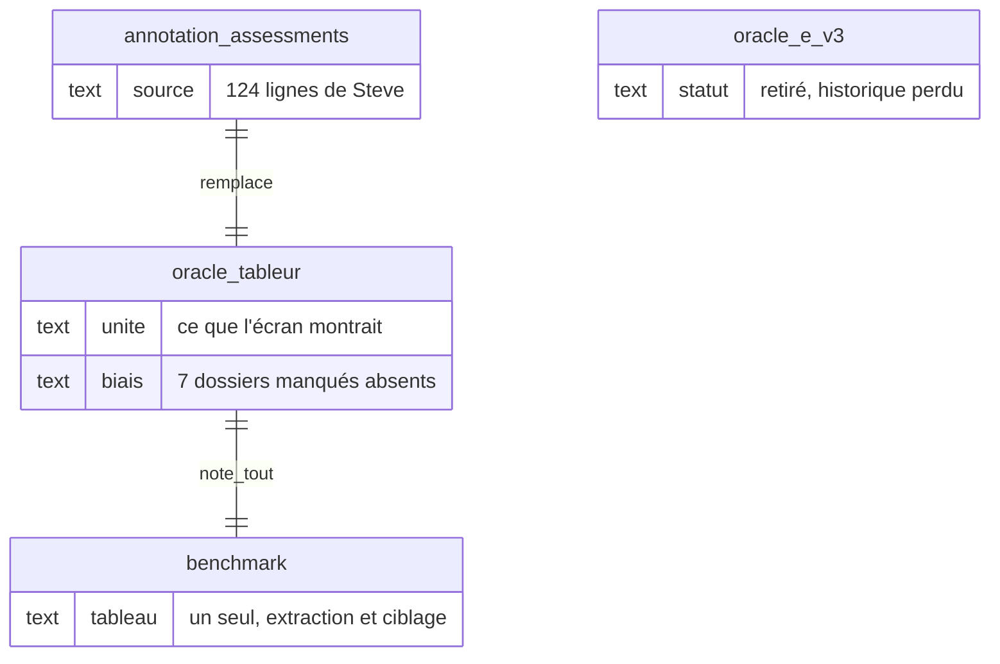

Schéma de l'option Double oracle E / C, jeu test indépendant :

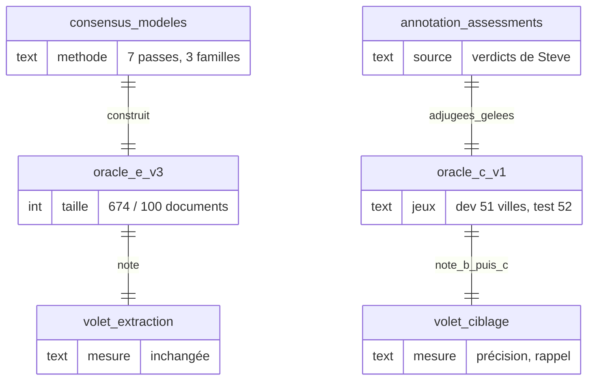

Schéma de l'option Campagne C entièrement nouvelle :

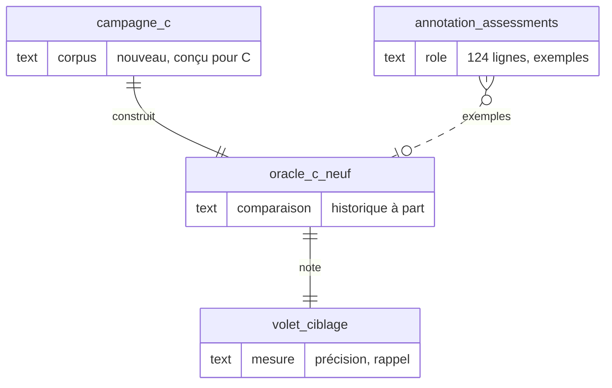

**Recommandation : Double oracle E / C, jeu test indépendant.** Double oracle : c’est la seule façon de mesurer l’utilité (ciblage) sans perdre la mesure de l’extraction ; campagne nouvelle seulement pour ce que les archives ne permettent pas d’évaluer. Unité : le signal, regroupé par dossier ; une unité « dossier » serait plus fidèle mais dépend d’une clé de règlement peu fiable (C-26).

#### D11 — Benchmark #782
**Étape 1 · Décide : Fabien · Consulté : Farid.** Prise telle quelle, sauf incohérence avec une autre décision.

Le benchmark #782 compare des modèles et des réglages sur un même oracle. Si on y ajoute la mesure du ciblage (B, puis C), il faut décider si elle rejoint les métriques d’extraction ou forme un volet à part (§9.4). Le choix fixe aussi le sort du prompt d’extraction gelé (immo-pv-extraction-v9) : lui faire produire sens, effet et portée romprait la comparabilité des campagnes v10 et v11. Ce que verra Farid : un tableau unique, ou deux tableaux qui ne se mélangent pas.

**Dépend de :** D10 (Oracle #783). **Conditionne :** D12 (Exposition A/B/C), D13 (Seuil de bascule B → C).

| Option | Description | Avantages | Inconvénients |
|---|---|---|---|
| **Volet ciblage séparé** (recommandée) | Le rapport du benchmark #782 garde son tableau d’extraction inchangé et ajoute un tableau « ciblage » : précision et rappel de l’historique, de B, puis de C, sur l’oracle C. Le prompt gelé immo-pv-extraction-v9 n’est pas modifié ; l’enrichir serait une nouvelle version, décidée à part. | • Extraction et ciblage restent comparables chacun dans le temps. • Colonnes historique, B et C distinctes : l’effet de C se lit directement. • Tout changement du contrat d’extraction devient une nouvelle version, décidée à part. | • Deux tableaux à lire. • Pont entre les deux seulement sur les 100 documents du corpus commun. |
| Métriques fusionnées | Un seul tableau et un seul score mêlent l’extraction (étape et citation) et le ciblage (fallait-il montrer le signal). | • Un seul tableau, un seul score. • Lecture plus simple pour un public non technique. | • Mélange deux questions différentes : un F1 fusionné ne dit plus rien. • Perd la comparabilité avec les campagnes passées. |

**Recommandation : Volet ciblage séparé.** Volet ciblage séparé : c’est la condition pour comparer B et C sans casser l’historique de l’extraction.

### Étape 2 · Farid décide ensuite (produit, affichage, priorités)

#### D1 — Périmètre de conservation des retours de Steve
**Étape 2 · Décide : Farid · Consulté : Steve, Mathieu.** Décidée après les décisions de Fabien.

Steve a livré un classeur de 7 feuilles (124 lignes de triage, 121 contrôles d’exclusion, 77 constats, 26 règles, 28 codes de motif) et une analyse écrite qui pose ses trois critères (§2, §5.1). Il faut décider ce qu’on garde en base : seulement le triage, tout, ou de simples notes. Ce choix fixe ce que l’équipe pourra montrer sur les objets du radar et ce que l’oracle pourra mesurer (D10). Cohérence avec D2 : « tout conserver » suppose le modèle M3.

**Dépend de :** D2 (Modèle de données), D10 (Oracle #783).

| Option | Description | Avantages | Inconvénients |
|---|---|---|---|
| (a) Triage seul | On importe seulement la feuille Triage : 124 lignes, 51 villes. Les 121 contrôles d’exclusion (dont 3 faux négatifs « écartés à tort »), les 77 constats et les 26 règles restent dans le fichier. | • Rapide : une feuille, 124 lignes. • Moins de rattachements à vérifier à l’import. | • Perd les 121 contrôles d’exclusion, là où se trouvent les faux négatifs, ainsi que les constats et les règles. • Oracle incomplet : impossible de mesurer ce que les filtres cachent à tort. |
| **(b) Tout le classeur et l’analyse, brut immuable** (recommandée) | On importe les 7 feuilles et l’analyse du 21 septembre, sans rien modifier : 124 lignes de triage, 121 contrôles d’exclusion, 77 constats, 26 règles, 28 codes, et la Synthèse avec ses formules et leurs valeurs mémorisées. L’analyse est conservée à part, comme annotation distincte. | • Aucune perte : chaque cellule, formule et valeur mémorisée. • L’oracle (D10) dispose des exclusions et des règles. • Les 52 villes suivantes s’importeront de la même façon. | • Plus de tables et de curation (rattachements à vérifier). • Import un peu plus long à écrire et à recetter. |
| (c) Notes libres seules | Chaque ligne devient une note de texte libre sur une ville ou un signal, dans l’UI des notes actuelle. Le classement, le motif et le sens ne sont plus des champs : ils sont dans le texte. | • Surface existante : les notes des lots et des signaux. • Aucun schéma nouveau : livrable vite. | • Perd la structure (classement, motif, sens), les groupes et la provenance. • Inutilisable pour l’oracle ; une note est limitée à 10 000 caractères. |

**Recommandation : (b) Tout le classeur et l’analyse, brut immuable.** (b) : conserve tout ce que Steve a produit et sert à la fois l’affichage et l’oracle. La recommandation changerait seulement si le besoin se limitait à quelques commentaires.

#### D5 — Auteur des retours importés
**Étape 2 · Décide : Farid · Consulté : Steve, Fabien.** Décidée après les décisions de Fabien.

Quand les retours de Steve apparaîtront dans le radar, chacun portera un auteur. Steve n’a pas de compte vérifié, et ce n’est pas lui qui lance l’import. Il faut décider qui est affiché comme auteur, sans usurper l’identité de Steve ni effacer celle de l’importateur (exigence E5, §6.2). Le contrat sentropic accepte un auteur externe sans compte (§6.1), dans le cadre fixé par D4. Effet visible : la ligne « auteur » de chaque retour dans le panneau du signal.

**Dépend de :** D4 (Conformité sentropic et suppression). **Conditionne :** D6 (Visibilité et données personnelles).

| Option | Description | Avantages | Inconvénients |
|---|---|---|---|
| **(a) Auteur documentaire externe + importateur tracé** (recommandée) | Chaque retour importé affiche « Steve Chaperon — importé par <nom> ». Steve est un auteur externe (ext:chaperon:steve) sans compte ; l’importateur réel est enregistré à part (recorded_by). Personne ne peut modifier ni supprimer un retour importé. | • Le contenu est attribué à son vrai auteur, Steve Chaperon. • L’importateur réel est tracé (recorded_by) : on sait qui a chargé quoi. • Aucun droit de modifier ou supprimer un retour importé. | • Un auteur sans compte apparaît dans les fils. • Steve ne peut pas répondre sous son nom tant qu’il n’a pas de compte. |
| (b) Importateur seul comme auteur | Le retour est affiché comme écrit par la personne qui a lancé l’import ; le nom de Steve n’apparaît que dans la provenance (fichier, feuille, ligne). | • Aucune identité externe à gérer. • Aucun libellé spécial à afficher dans les fils. | • Le fil attribue le texte de Steve à l’importateur : faux pour le lecteur. • Perd la valeur de la parole du client. |
| (c) Compte Steve | On crée un compte pour Steve et ses retours importés sont rattachés à ce compte, comme s’il les avait saisis lui-même dans l’outil. | • Steve pourra répondre et annoter lui-même. • Ses réponses futures seront attribuées à un compte réel. | • Compte non vérifié aujourd’hui. • Ne doit jamais servir pour l’import : ce n’est pas lui qui importe. |

**Recommandation : (a) Auteur documentaire externe + importateur tracé.** (a) : attribue le contenu à son vrai auteur sans créer de compte ni usurper de session. (c) viendra le jour où Steve annotera lui-même dans l’UI.

#### D6 — Visibilité et données personnelles
**Étape 2 · Décide : Farid · Consulté : Steve, Mathieu, Fabien.** Décidée après les décisions de Fabien.

Le constat C-79 de Steve signale des noms de particuliers en clair dans des résumés de signaux (§5.6) ; les verbatims importés peuvent en contenir aussi. Règle actuelle des notes (migration 0011) : tout utilisateur approuvé lit tout. Il faut décider qui voit les retours et s’ils sont caviardés avant le premier affichage (U1), au regard de la Loi 25 (exigence E9). Le module comments de sentropic ne masque pas les données personnelles : c’est au radar de le faire (D4, D5).

**Dépend de :** D4 (Conformité sentropic et suppression), D5 (Auteur des retours importés). **Conditionne :** D14 (Première livraison UI).

| Option | Description | Avantages | Inconvénients |
|---|---|---|---|
| (a) Tous les approuvés, sans caviardage | Tout utilisateur approuvé voit tous les retours, verbatims compris, comme pour les notes actuelles (règle 0011). Aucun masquage. | • Règle existante, aucun travail. • Toute l’équipe voit tout. | • Expose des noms de particuliers. • Ne répond pas à la demande C-79 de Steve. |
| (b) Administrateurs et Steve | Seuls les administrateurs et Steve voient les retours ; le reste de l’équipe ne les voit pas dans le panneau. | • Exposition minimale. • Aucun caviardage à développer. | • L’équipe produit ne voit pas les retours : on perd l’intérêt de les afficher. • Gestion de droits spécifique à construire. |
| **(c) Approuvés, verbatims caviardés** (recommandée) | Tout utilisateur approuvé voit les retours, mais les noms de particuliers sont masqués avant affichage, dans les verbatims importés comme dans les résumés de signaux (demande C-79 de Steve). Une colonne pii_status trace le traitement. | • Toute l’équipe voit les retours. • Noms de particuliers masqués dans les retours et dans les résumés de signaux : répond à C-79. | • Détection des données personnelles à écrire et tester (colonne pii_status). • Un caviardage peut masquer un nom utile (élu, promoteur) : règles à préciser. |

**Recommandation : (c) Approuvés, verbatims caviardés.** (c) : toute l’équipe garde l’accès aux retours, et les noms de particuliers sont masqués, dans les retours comme dans les résumés de signaux.

#### D7 — Définition de C v1
**Étape 2 · Décide : Farid · Consulté : Steve, Mathieu, Fabien.** Décidée après les décisions de Fabien.

C est la nouvelle sélection de signaux proposée, alignée sur les trois critères de Steve : résidentiel, assouplissement, densification (§2.2, scène 1). Aujourd’hui, deux de ces trois critères n’ont aucune donnée au radar. Steve pose une réserve : un signal dont le sens n’est pas lisible doit rester affiché (« masquer ce qui n’a pas pu être lu transformerait une lacune en dossier manqué »). Il faut fixer la règle de C avant de la développer (lot C1) ; elle sera mesurée par l’oracle de ciblage (D10), sur la lecture de la double annotation retenue (D9). Les critères K1 à K9 sont détaillés au §9.2.

**Dépend de :** D9 (Sens de « double annotation »), D10 (Oracle #783). **Conditionne :** D8 (Cas contradictoires), D12 (Exposition A/B/C), D16 (Retour à Steve).

| Option | Description | Avantages | Inconvénients |
|---|---|---|---|
| Triplet strict pour toute visibilité | C n’affiche que les signaux qui réunissent les trois critères de façon établie. Exemple : sur la passe 1, seuls 22 signaux sur 73 resteraient ; les 12 Pertinent dont le sens n’est pas donné disparaîtraient. | • Flux court et lisible : seulement ce qui réunit les trois critères (22 sur 73). • Plus simple à calculer : un signal entre ou non. | • Masque les indéterminés : contredit la réserve explicite de Steve. • Perte de rappel sur les dossiers mal lus. |
| **K1–K9 + trois états** (recommandée) | C applique les critères K1 à K9 (§9.2) avec trois états : confirmé (critères étayés), à instruire (sens ou effet non déterminable, reste visible), exclu prouvé (masqué, raison affichée). Deux compteurs distincts « confirmés » et « à instruire ». Aucun seuil de taille de projet ni filtre sur l’origine privée. | • Respecte les trois critères et la réserve : on ne masque que ce qui est établi hors critères. • Trois états (confirmé, à instruire, exclu prouvé) et deux compteurs : un cas incertain n’est pas présenté comme une opportunité. | • Le flux garde du travail manuel (les « à instruire »). • Exige des extractions nouvelles (sens, effet sur les unités, portée) : lot C1 de taille L. |
| B inchangé, critères pour trier | La sélection affichée reste B ; les critères de Steve servent seulement à trier la liste (les « trois critères » en premier). Aucun signal n’entre ni ne sort. | • Aucun changement d’appartenance, aucun risque. • Aucune extraction nouvelle à développer. | • Le bruit connu (24 sur 73) persiste. • Ne répond pas à Steve : « ce n’est pas une question de hiérarchie ». |

**Recommandation : K1–K9 + trois états.** K1–K9 + trois états, après relecture de la table de dérivation par Steve : c’est la seule règle qui applique ses trois critères sans masquer ce qui n’a pas pu être lu. Aucun seuil de taille de projet ni filtre sur l’origine privée.

#### D8 — Cas contradictoires (Saint-Victor, Amos, CPTAQ, seconds projets, ODJ, S-RESTRICTIF)
**Étape 2 · Décide : Farid · Consulté : Steve, Mathieu.** Décidée après les décisions de Fabien.

Certains cas ne se tranchent pas par une règle automatique : Saint-Victor (un resserrement qui favorise pourtant la densification), Amos (logement sur commerce), portée de l’exception CPTAQ, seconds projets, points d’ordre du jour, trois restrictions « À surveiller » (§9.2). Le tableur et l’analyse de Steve se contredisent parfois sur ces cas. Il faut décider qui les arbitre avant de geler l’oracle (D10) et la règle C (D7) ; sinon l’oracle sanctionnera le bon comportement.

**Dépend de :** D7 (Définition de C v1), D10 (Oracle #783). **Conditionne :** D16 (Retour à Steve).

| Option | Description | Avantages | Inconvénients |
|---|---|---|---|
| **Revue métier, abstention en attendant** (recommandée) | Steve et Mathieu examinent les cas listés au §9.2 sur exemples et preuves (Saint-Victor, Amos, CPTAQ, seconds projets, ODJ, trois S-RESTRICTIF). Tant qu’un cas n’est pas tranché, il est marqué « abstention » dans l’oracle : il ne compte ni pour ni contre. | • Steve et Mathieu tranchent sur exemples et preuves : la règle reste celle du client. • En attendant, abstention explicite : ces cas ne comptent ni pour ni contre. | • Demande du temps à Steve et Mathieu. • Quelques cas restent ouverts plus longtemps. |
| Arbitrage par l’équipe | L’équipe tranche elle-même chaque cas à partir de l’analyse et des règles de Steve, puis lui présente le résultat. | • Plus rapide. • Ne mobilise ni Steve ni Mathieu. | • Risque de prêter à Steve une règle qu’il n’a pas posée. • L’oracle refléterait l’avis de l’équipe, pas celui du client. |
| Statu quo | Les cas restent dans l’oracle avec l’étiquette du tableur, sans statut particulier, même quand le tableur et l’analyse se contredisent. | • Aucun effort. • L’oracle peut être gelé tout de suite. | • Cas sans statut dans l’oracle : mesures faussées. • Désaccords invisibles. |

**Recommandation : Revue métier, abstention en attendant.** (a) : la règle reste celle du client, et les cas ouverts ne faussent pas la mesure pendant qu’ils sont arbitrés.

#### D12 — Exposition A/B/C (point ouvert)
**Étape 2 · Décide : Farid · Consulté : Steve, Mathieu, Fabien.** Décidée après les décisions de Fabien.

Aujourd’hui l’écran montre la sélection B ; le sélecteur A/B a été retiré en août (§9.1). La demande initiale parle d’un « mécanisme A/B étendu en C », mais les règles de partage validées le 1er octobre (#787, item 4) demandent de ne pas réintroduire de choix entre plusieurs viviers. Les deux lectures sont défendables (§9.5) : Farid tranche. Concrètement : Steve verra-t-il un sélecteur A/B/C, ou une seule sélection qui change le jour où C est prouvée meilleure (D13) ? La règle C (D7) et sa mesure (D10, D11) doivent être connues.

**Dépend de :** D7 (Définition de C v1), D10 (Oracle #783), D11 (Benchmark #782). **Conditionne :** D13 (Seuil de bascule B → C).

| Option | Description | Avantages | Inconvénients |
|---|---|---|---|
| **(a) C en shadow, comparaison réservée UAT, puis remplacement de B** (recommandée) | Steve et l’équipe continuent de voir B, sans sélecteur. C est calculée en parallèle par le backend ; une page de comparaison B / C n’est accessible qu’en recette UAT et aux administrateurs. Le jour où le seuil D13 est franchi et que Farid décide, C remplace B à l’écran (scène 5). | • Conforme à #787 : aucun choix de vivier pour les utilisateurs. • Interface simple, comme Steve le demande. • Retour arrière simple : désactiver C. | • Steve ne voit C qu’en UAT (mode réservé) avant la bascule. • La comparaison reste un outil interne. |
| (b) Sélecteur A/B/C visible + mode comparatif | Un sélecteur A / B / C apparaît dans le rail pour tous les utilisateurs, avec un mode comparatif ; le choix est porté dans l’URL (filter.targeting=a|b|c). | • Littéralement « A/B étendu en C ». • L’utilisateur compare lui-même les sélections. | • Réintroduit un choix de viviers, contraire à #787 (item 4). • Plus complexe à expliquer et à maintenir (paramètre filter.targeting). |
| (c) Incréments dans B | On n’expose pas C comme un tout : on ajoute à B, un par un, les critères de C (sens, plein droit, second projet), chacun livré quand il est prêt. | • Aligné avec #761 ; livrable par petits morceaux (sens, plein droit, second projet). • Chaque amélioration est visible pour Steve dès sa livraison. | • Pas de mesure d’ensemble B contre C. • Les filtres Résidentiel et Zonage restent. |
| (d) Application C séparée | On construit une seconde application dédiée à C, avec sa propre carte, ses filtres et ses notes ; Steve choisit l’une ou l’autre application. | • Liberté totale de simplification. • Aucun risque pour l’écran actuel de Steve. | • Duplique sélection, filtres et notes. • Deux applications à maintenir. |

**Recommandation : (a) C en shadow, comparaison réservée UAT, puis remplacement de B.** (a), avec des emprunts à (c) : interface simple pour Steve, conforme à #787, retour arrière immédiat. Si Farid veut un sélecteur visible, (b).

#### D13 — Seuil de bascule B → C (à fixer)
**Étape 2 · Décide : Farid · Consulté : Steve, Mathieu, Fabien.** Décidée après les décisions de Fabien.

Si C tourne en parallèle de B (D12), il faut écrire à l’avance quand C remplace B ; sans seuil écrit, la bascule se décidera à l’impression. La mesure viendra de l’oracle de ciblage (D10), sur le jeu test des 52 villes, dans le volet ciblage du benchmark (D11). Point de départ mesuré sur l’échantillon de Steve : précision P ∪ S de B = 67,1 % (49 sur 73) ; 34 des 40 Pertinent visibles en passe 1 (§9.3). Proposition à amender par Farid dans le commentaire.

**Dépend de :** D10 (Oracle #783), D11 (Benchmark #782), D12 (Exposition A/B/C).

| Option | Description | Avantages | Inconvénients |
|---|---|---|---|
| **Aucun P masqué, précision P ∪ S > B, parité** (recommandée) | C remplace B seulement si, sur le jeu test des 52 villes : aucun signal que Steve juge Pertinent n’est masqué ; la précision P ∪ S de C dépasse celle de B (67,1 % sur la passe 1) ; l’API, le rail, la carte et le panneau montrent les mêmes ensembles ; Farid fait la recette. | • Protège la réserve de Steve : aucun Pertinent masqué. • Exige un gain réel de précision, pas seulement un affichage plus court. • Parité API, rail, carte, panneau : aucun écart entre écrans (#786). | • Demande le jeu test complet (52 villes) avant de basculer. • La bascule peut tarder si un seul Pertinent est perdu. |
| Seuil chiffré différent | Farid écrit d’autres chiffres dans le commentaire (par exemple une précision minimale ou un rappel minimal), mesurés par le même oracle. | • Farid fixe ses propres chiffres (à écrire dans le commentaire). • Peut refléter un compromis métier que Farid connaît mieux. | • À préciser. • Risque d’un seuil non mesurable par l’oracle. |
| Bascule sur recette seule | La bascule se décide sur la recette de Farid seule, sans mesure chiffrée par l’oracle. | • Rapide : recette de Farid seulement. • Ne dépend pas de l’achèvement du jeu test. | • Sans mesure, aucune garantie de non-régression. • Contraire à l’objet de l’oracle de ciblage. |

**Recommandation : Aucun P masqué, précision P ∪ S > B, parité.** (a) : garantit qu’aucun dossier utile ne disparaît et que C fait réellement mieux que B, sur des écrans cohérents entre eux. Résidentiel et Zonage ne sont retirés qu’après une décision #761 fondée sur la mesure.

#### D14 — Première livraison UI
**Étape 2 · Décide : Farid · Consulté : Mathieu, Fabien.** Décidée après les décisions de Fabien.

Une fois les retours en base, il faut les montrer. L’UI est en migration : 39 composants Svelte sur 69 utilisent le design system, les 3 composants d’annotation aucun, et la carte Signaux est un composant local MapLibre de 2 761 lignes destiné à être remplacé (§8, scène 4). Il faut choisir où le retour de Steve apparaît en premier : dans le panneau du signal et le rail, ou directement sur la carte. Le choix décide si #784 avance sans attendre la migration geo. Il suppose l’ancre réparée (D3), la lecture conforme (D4) et la règle de visibilité (D6).

**Dépend de :** D3 (Ancre signal et correctif B0), D4 (Conformité sentropic et suppression), D6 (Visibilité et données personnelles). **Conditionne :** D15 (Séquencement).

| Option | Description | Avantages | Inconvénients |
|---|---|---|---|
| **(a) Panneau + rail + DS ciblé** (recommandée) | Dans le panneau du signal, un badge « Retour de Steve » (vert, jaune, rouge) ouvre une section « Avis de Steve » : classement, motif, sens, analyse, provenance, état du rattachement. Dans le rail, des compteurs P / S / N par ville. Les 3 composants d’annotation passent au design system. Rien sur la carte au premier lot. | • Valeur immédiate : badge et section « Avis de Steve » dans le panneau, compteurs P / S / N dans le rail. • Aucun code ajouté à un composant à remplacer. • Les 3 composants d’annotation migrent au design system dans le même lot. | • Pas d’indicateur sur la carte au premier lot. • Les badges par signal exigent la lecture groupée du lot L2. |
| (b) Pastilles sur la carte actuelle dès L3 | En plus du panneau, des pastilles colorées sur la carte Signaux actuelle (composant local MapLibre de 2 761 lignes) dès le lot L3. | • Visibilité cartographique immédiate. • L’ancre ne dépend pas du moteur de carte. | • Code ajouté à un composant de 2 761 lignes voué au remplacement. • Double travail à la migration geo. |
| (c) Migration geo complète d’abord | On termine d’abord la migration de la carte vers les composants geo partagés (Porte 2), puis on affiche les retours sur la nouvelle carte et dans le panneau. | • Expérience cohérente d’emblée. • Aucun code d’annotation à reprendre après la migration. | • Dépend de la « Porte 2 » (moteur geo désactivé aujourd’hui). • Retarde #784 sans date. |
| (d) Tableau de retours séparé seul | Un écran séparé liste tous les retours de Steve (filtrable par ville, motif, statut de rattachement), sans rien afficher sur les objets du radar. | • Toute la donnée consultable en un seul écran. • Utile comme outil de curation des rattachements. | • N’annote pas l’élément associé : ne répond pas à #784. • Un écran de plus. |

**Recommandation : (a) Panneau + rail + DS ciblé.** (a) : valeur visible tout de suite, sans investir dans un composant de carte destiné à être remplacé.

#### D15 — Séquencement
**Étape 2 · Décide : Farid · Consulté : Mathieu, Fabien.** Décidée après les décisions de Fabien.

La priorité n° 1 de Steve reste la fraîcheur des signaux (#703, rafraîchissement quotidien). Le travail de ce dossier peut avancer en parallèle ou attendre. B0 (D3), l’import (L1) et l’oracle (O1, D10) ne touchent pas la chaîne de rafraîchissement ; le classifieur C (C1), lui, a besoin de signaux frais (§12). Le choix fixe quand Steve verra ses retours dans l’outil (D14).

**Dépend de :** D3 (Ancre signal et correctif B0), D10 (Oracle #783), D14 (Première livraison UI).

| Option | Description | Avantages | Inconvénients |
|---|---|---|---|
| **(a) B0, import et oracle en parallèle de la fraîcheur** (recommandée) | B0, l’import (L1) et l’oracle de ciblage (O1) démarrent maintenant, en parallèle de #703, car ils ne touchent pas la chaîne de rafraîchissement. Le classifieur C (C1) attend que le rafraîchissement soit stable. | • Valeur livrée tôt : annotation réparée, retours visibles, oracle prêt. • Aucune interférence avec la chaîne de rafraîchissement. • C1 démarre sur des signaux stabilisés. | • Deux chantiers en parallèle à suivre. • L’attention de l’équipe est partagée. |
| (b) Tout après #703 | Tout le travail de ce dossier attend la clôture de #703 (rafraîchissement quotidien en production). | • Une seule priorité à la fois. • Aucun risque d’interférence, même indirecte, avec le rafraîchissement. | • Rien de visible pour Steve sur ses retours avant #703. • L’annotation de signal reste cassée plus longtemps. |

**Recommandation : (a) B0, import et oracle en parallèle de la fraîcheur.** (a) : livre tôt ce qui ne gêne pas le rafraîchissement, et garde C1 pour après sa stabilisation.

#### D16 — Retour à Steve
**Étape 2 · Décide : Farid · Consulté : Mathieu.** Décidée après les décisions de Fabien.

Steve a reconstitué le fonctionnement des filtres en observant l’écran, et écrit qu’« une seule réponse des développeurs remplacerait toute cette reconstitution » (R-16, §5.7). Le dossier a confronté sa reconstitution au code. Il faut décider si on lui renvoie maintenant la définition réelle des filtres et la table qui relie ses codes de motif aux critères C (D7, D8), ou si on attend C.

**Dépend de :** D7 (Définition de C v1), D8 (Cas contradictoires).

| Option | Description | Avantages | Inconvénients |
|---|---|---|---|
| **Renvoyer filtres réels et table de dérivation** (recommandée) | Mathieu et Farid envoient à Steve la définition réelle des cinq filtres (§5.7, lue dans le code) et la table qui relie ses 28 codes de motif aux critères C, pour qu’il la corrige avant le développement de C. | • Répond directement à sa demande R-16. • Lui permet de corriger la table de dérivation avant le développement de C. • Renforce la confiance du client. | • Un aller-retour à préparer (relecture par Mathieu et Farid). • Une partie de ses observations date de septembre, en partie périmée depuis #793. |
| Ne rien renvoyer avant C | On ne répond pas à sa question R-16 avant que C soit développée ; il reçoit alors directement la nouvelle sélection. | • Évite un aller-retour intermédiaire. • La réponse portera directement sur C, déjà développée. | • Steve continue à deviner le fonctionnement des filtres. • Erreurs de dérivation découvertes trop tard. |

**Recommandation : Renvoyer filtres réels et table de dérivation.** Renvoyer, par Mathieu et Farid après relecture : répond à sa question et lui permet de corriger la table de dérivation avant que C soit développée.

---

## 11. Risques

| Risque | Effet | Réponse |
|---|---|---|
| Dérive des ids du graphe (ré-extraction, nœuds orphelins supprimés) | Annotations orphelines, oracle inapplicable | Ancres texte + instantané `observed` + statut `vanished` ; mesure de résolution en L1 ; clé métier stable en suivi |
| Plusieurs objets par ligne, ids abrégés, alias de villes | Note attribuée au mauvais objet | Aperçu de résolution, rôles des liens, revue des ambiguïtés |
| Tableur, analyse et règles se contredisent | Oracle qui sanctionne le bon comportement | Sources immuables, double annotation, adjudication nommée, désaccords publiés avant notation |
| Échantillon biaisé (51 villes, ordre du relevé ; corpus déjà filtré) | C réglée sur un sous-ensemble ; rappel surestimé | Test sur les 52 villes suivantes ; extension documentaire |
| Vue de Steve datée du 15–21 septembre | Constats de filtres périmés | §5.7 ; refaire C-49 et C-55 sur la version actuelle |
| Tension R-21 / S-RESTRICTIF ; sens par disposition | Perte d'un droit nouveau ou d'une étape utile | D8 ; sens par disposition ; un mixte reste visible |
| Données personnelles dans les verbatims | Exposition non conforme | D6 ; détection avant affichage ; export de benchmark limité |
| Paquet `comments` sans tombstone | Dette ou divergence avec sentropic | D4 ; demande à sentropic ; aucun chemin de suppression par le paquet |
| Annotation existante cassée sans que les tests le voient | Fonction morte | B0 avec test sur un id réel et preuve navigateur |
| Sur-investissement UI avant la maquette | Travail jeté | U1 en lecture seule |
| Oracle 676 local contre 674 committé ; prompt gelé modifié | Benchmark non reproductible | Geler par hash ; D11 |
| Bascule geo couplée aux annotations | Livraison retardée | Ancre indépendante du moteur (D14) |

**Retour arrière.** Désactiver C et revenir à B ; désactiver la publication d'un lot sans effacer source ni réponses ; migrations additives, sans DROP. Une modification du cycle de suppression ou des droits est une décision contractuelle, pas un flag.

**Pré-mortem (hypothèse).** Six mois plus tard, l'échec viendrait d'avoir importé les classifications comme vérité définitive, attribué des groupes à un seul signal, affiché un nombre plus faible comme preuve de qualité, laissé disparaître les indéterminés, perdu les cibles à la ré-ingestion et cassé le dénominateur commun du benchmark. Garde-fous prioritaires : traçabilité des ancres, conservation des désaccords, rappel de bout en bout.

---

## 12. Plan et suites

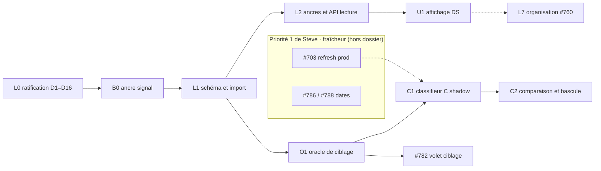

| Carte | Suite proposée | À ne pas lui attribuer |
|---|---|---|
| #784 | Sources, import, rattachement, restitution (B0, L1, L2, U1) | Importer un fichier ne clôt ni l'oracle ni C |
| #783 | Contrat d'oracle, double annotation, adjudication, version C (O1) | Aucun résultat C avant campagne ou rescoring valide |
| #760 | Parcours manuel et états utilisateur, avec la maquette (L7) | Pas d'extraction ni de benchmark |
| #761 | Rôle des filtres, second projet, sens, comparaison C | Rafraîchissement quotidien ≠ précocité réglementaire |
| #782 | Résultats post-B′ et post-C à côté de l'extraction | Ne pas appeler « v11 final » le rapport v11alpha |
| #697 | Nouvelles preuves de qualité et écarts de périmètre | Pas de choix de modèle C actuel |
| #786 / #787 / #788 | Dates et URL complète consommées par C | Aucun nouveau workflow LLM dates |
| #703 | Priorité fraîcheur ; snapshots d'évaluation traçables | Ce dossier n'arme aucun CronJob |

Les mises à jour de cartes sont des suites proposées, pas des publications effectuées.

---

## Annexe A — Convergence entre les deux auteurs

Légende : **=** convergence · **≈** convergence de fond, forme différente · **≠** divergence. Colonne « Arbitrage » : la source qui tranche, ou le décideur (Farid ou Fabien) si les sources ne suffisent pas.

### A.1 Chiffres

| Point | Auteur A | Auteur B | État | Arbitrage et preuve |
|---|---|---|---|---|
| Volumétrie (124 / 121 / 77 / 26 / 28) | identique | identique | = | Recompté sur `workbook-full.json` |
| Classement × passe (34/15/24 …) | identique | identique | = | Recompté sur `triage-rows.json` |
| Sens (55/38/14/10/7) | par passe | × classement | ≈ | Les deux tableaux sont repris (§5.3) |
| Codes employés 24/28 | = | = | = | Feuille Synthèse et Triage |
| Verdicts d'exclusion (102 …) | = | = | = | Feuille Écartés |
| Périmètre des constats | 67 V1, 5 Info, 4 « V2 — pour mémoire », 1 V2 | 67 / 5 / 5 V2 | ≈ | Auteur A plus fin, recompté colonne B |
| Valeurs mémorisées de la Synthèse | 45 formules avec valeurs | « formules sans valeur en cache » | ≠ | **Auteur A** : 45 formules sur 45 portent une valeur (`workbook-full.json`, ex. B4 = 40) |
| Qualité du filtrage | 5 comptes = 123 | 88/25/8/3 normalisé contre 88/25/7/3 | ≈ | Synthèse : 88/25/7/3/0 ; l'écart d'une ligne tient au regroupement de B |
| Identifiants candidats | colonne L : 121/124, 148 distincts, 27 multiples | 121/124, 33 multiples, 172 mentions, 227 distincts sur 3 feuilles | ≈ | Recompte : colonne L 121/148/27 ; toutes colonnes 121/150/30 ; 3 feuilles 227–237 selon la règle. Publier par le rapport d'import, avec la règle |
| Reconstitution 22/12/15/24 | « l'écart 34−22 n'établit pas quels enregistrements changent » | correspondance exacte | ≈ | **Effectifs vérifiés** (Pertinent ∧ Assouplissement = 22 en passe 1, etc.) ; règle de passage non énoncée par Steve → D8 |
| Oracle 676 | 674/47 committé (`dd0561f6`) ; 676/43 copie locale par sha256 | 676 « introuvable sur les branches distantes » | ≈ | Les deux exacts ; la 676 doit être committée et gelée |
| Contrôles HTML bruts | 132 `<button>` / 37 fichiers | 125 / 35 | ≈ | 132/37 reproduit sur tous les `.svelte` hors tests ; 125/35 exclut stubs et harnais |
| Cellule la plus longue | 17 114 caractères vs corps de note 10 000 | — | = | `NOTE_BODY_MAX = 10_000` (`prospect-marks.ts:91`), cellule Constats E57 |

### A.2 Constats

| Point | Auteur A | Auteur B | État | Arbitrage et preuve |
|---|---|---|---|---|
| Défaut UUID de l'ancre signal | oui | oui | = | `prospect-marks.ts:107` `signal_id: z.string().uuid()` |
| Défaut auteur `authorId` / `sub` | — | oui | + | **Confirmé** : `SignalAnnotations.svelte:30` retombe sur `$authStore.user.sub` ; aucun panneau ne passe `currentUserId` ; l'API résout `session.sub` → `account_users.id` |
| Stabilité des ids du graphe | non mesurée | non garantie, nœuds orphelins supprimés | ≈ | **Auteur B** : suppression des orphelins dans `graph-store.ts` |
| Table `signals` | UUID volatil | aucune insertion sur `main` | ≈ | Seule insertion : test d'intégration |
| `packages/focus` sentropic | lu en local (HEAD `97fe9f53`) | supprimé de `main` | ≠ | **Auteur B** : `6ca53d11a chore: delete packages/focus (focus is owned by h2a)` |
| Suppression `comments` 0.2.0 | physique | physique, écart avec O1 | = | `store.ts:47-48` |
| Routeur Hono `contextType` fermé | — | oui | + | `hono.ts:17` `z.enum([...])` |
| Sélecteur A/B retiré | oui | oui (`f2c20573`) | = | `f2c20573` 2026-08-22 |
| « Décision owner #787 de ne pas réintroduire de choix de viviers » | — | décision du 2026-10-01 | ≠ | **Nuancé** : phrase de l'item 4 du comportement attendu (grammaire d'URL), règles validées le 1er octobre ; absente de la liste « Décisions du propriétaire » |
| Période datée par le document | écart relatif / personnalisé à réconcilier | #793 fusionnée le 2026-10-02 | ≈ | `27891b10` = merge de #793 |
| DS : 39/69 ; collab 0/3 ; carte MapLibre locale ; moteur désactivé | = | = | = | `code-audit.mjs`, `geo-engine-flag.ts` |

### A.3 Options, recommandations et décisions

| Sujet | Auteur A | Auteur B | État | Consolidation |
|---|---|---|---|---|
| Stockage | D1b sources + assertions + ancres | D1(b) + M3 couches | = | D1 (b), D2 M3 |
| Correctif ancre | branche `entity` + `target_ref` | colonne texte `signal_node_id` + B0 | ≈ | D3 : clé texte namespacée sans FK, B0 immédiat |
| Conformité sentropic | D2b sous-contrats + mutation Radar | D3(a) adaptateur PG à tombstone hôte | ≠ | **Tranché vers A** par COLLAB §2 (« le paquet porte l'intégrité », tombstone hôte = piège) ; demande de tombstone à sentropic (B) conservée — D4 |
| Auteur Steve | pas d'identité forgée, auteur = écrivain réel | `ext:chaperon:steve` auteur du fil | ≠ | **Synthèse** : auteur documentaire externe + importateur tracé, sans droit de mutation — D5 |
| Visibilité / données personnelles | risque C-79 | D5(c) caviardage | ≈ | D6 (c) |
| Définition de C | D3b confirmés + à instruire | K1–K8 + asymétrie | ≈ | D7 : K1–K9 + trois états |
| Cas contradictoires | D3-cas | §9, §10 | = | D8 |
| Double annotation | 3 niveaux (source, référence, calcul) | `label_set` (radar B′ / Steve / prédiction) | ≈ | §6.6 ; sens laissé à Fabien (Farid consulté) — D9 |
| Oracle | D4b double oracle, corpus indépendant | D9 oracle C, 51 / 52 villes | ≈ | D10 : les deux mécanismes cumulés |
| Benchmark | colonnes séparées | volet séparé, contrat v10 sous décision | = | D11 |
| A/B/C | D5b sélecteur + comparatif, B défaut | V2 shadow puis remplacement | ≠ | **Farid** — D12 ; recommandation consolidée : shadow + comparatif UAT |
| Seuil de bascule | non chiffré | exemple proposé | ≈ | **Farid** — D13 |
| UI première livraison | D6a panneaux + badges carte | U1 panneau + rail ; carte après migration | ≠ (partiel) | D14 (a) : pastilles carte après migration de `GeoCityMapBase` (2 761 lignes locales) ; (b) reste une option |
| Séquencement | L4 en parallèle de L3 | D11 (a) | = | D15 |
| Retour à Steve | — | D12 | + | D16 |

### A.4 Points laissés à la décision (Farid ou Fabien)

1. **D9** (Fabien, Farid consulté) : sens exact de « double annotation ».
2. **D12** (Farid, Steve, Mathieu et Fabien consultés) : C en shadow avec comparaison UAT, ou sélecteur A/B/C visible.
3. **D13** (Farid, Steve, Mathieu et Fabien consultés) : seuil chiffré de bascule.
4. **D4, réserve** (Fabien) : statut du dossier COLLAB hors `main` ; s'il n'est plus valable, l'adaptateur à tombstone hôte redevient une option.
5. **D8** (Farid) : cas métier contradictoires, à faire trancher avec Steve.

---

## Annexe B — Scènes Focus (sources canoniques)

Cinq scènes, chacune dans la forme qui convient à ce qu'elle montre. Elles ne changent rien au fond : elles rendent lisibles les critères de Steve en regard de l'existant (§2), le modèle de données (§6), l'architecture de l'import à l'affichage avec l'oracle (§6.5, §7, §9.3), l'architecture UI (§8) et l'affichage A/B/C (§9.5).
- Scène 1 : une **matrice** (tableau ci-dessous), un critère par ligne.
- Scène 2 : un **diagramme entité-relation** (`erDiagram`) : tables, colonnes clés, relations et cardinalités.
- Scène 3 : une **architecture en couloirs verticaux** de gauche à droite (`flowchart LR`, un `subgraph` par couloir : utilisateurs, écrans UI, fonctions backend, données sur S3 et PostgreSQL), l'oracle en bande transversale en bas, système d'évaluation hors ligne.
- Scène 4 : des composants, en cartes A' 460 × 200 ; chaque `subgraph` est un conteneur natif `parentId`.
- Scène 5 : **deux zones explicites** (`flowchart LR`, un `subgraph` par couloir) : en haut l'**application**, ce que voient les utilisateurs et où chaque élément vit (écran, backend, base) ; en bas l'**évaluation hors ligne** (job Node sans écran) : référence gelée, diff nommé, oracle C, mesure, seuil de bascule, décision de Farid.

### `criteres-steve` — Scène 1 · les trois critères de Steve en regard de l'existant

| Critère | Steve demande | Radar aujourd'hui | Couverture | Bruit passe 1 |
|---|---|---|---|---:|
| 1 · Résidentiel | Habitation seulement, et un règlement d'urbanisme | Filtre Résidentiel par marqueurs regex ; nature de l'acte non reconnue | partiel | 3 |
| 2 · Assouplissement | La modification ouvre, elle ne resserre pas | Aucun champ de sens, aucun filtre | absent | 4 |
| 3 · Densification | Plus d'unités qu'avant | Champ d'effet toujours `inconnu` ; B′ ne prouve pas la densité | absent | 6 |
| Exclusion · autorisation individuelle | Une règle générale, pas un PPCMOI ni une dérogation accordés à un demandeur | PIIA et dérogation exclus ; PPCMOI et usage conditionnel non exclus | partiel | 8 |
| Exclusion · point d'ordre du jour | Une décision du conseil, pas un point inscrit à l'ordre du jour | Aucune distinction entre ordre du jour et décision | absent | 3 |
| Vue de travail · passe 1 | 22 sur 73 réunissent les trois critères | 34 des 40 Pertinent affichés | — | 24 |

### `modele-donnees` — Scène 2 · modèle de données, de la source à la publication

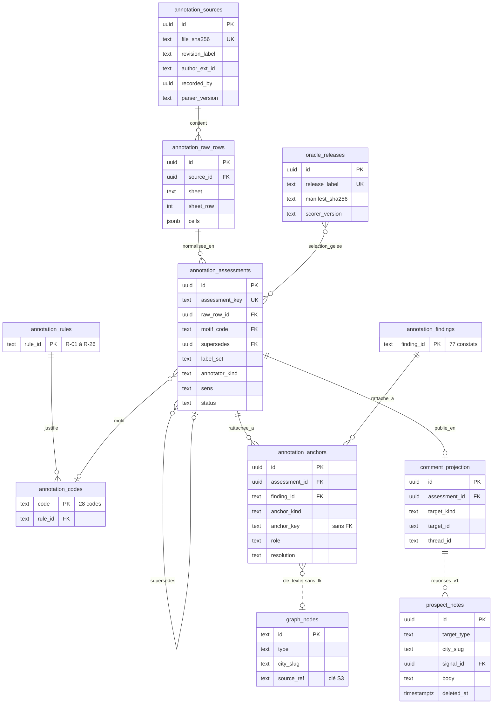

### `flux-import-oracle` — Scène 3 · architecture de l'import à l'affichage, oracle transversal

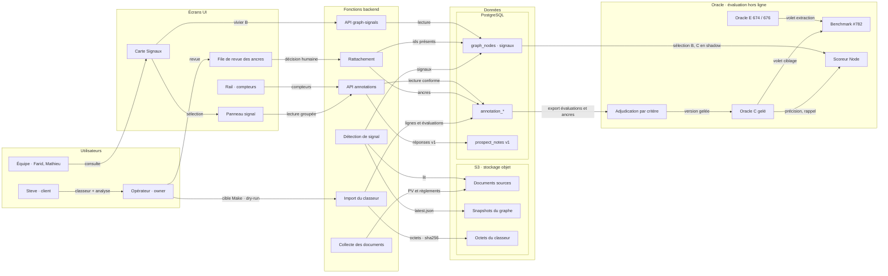

### `architecture-ui` — Scène 4 · architecture UI et état de la migration

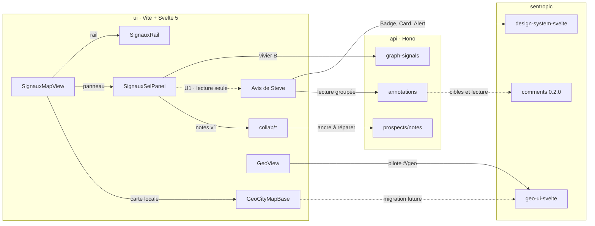

### `affichage-abc` — Scène 5 · A, B et C : ce que voit l'application, ce que mesure l'évaluation

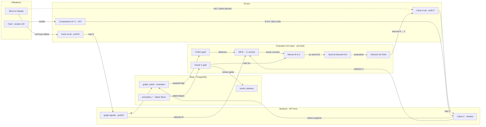
