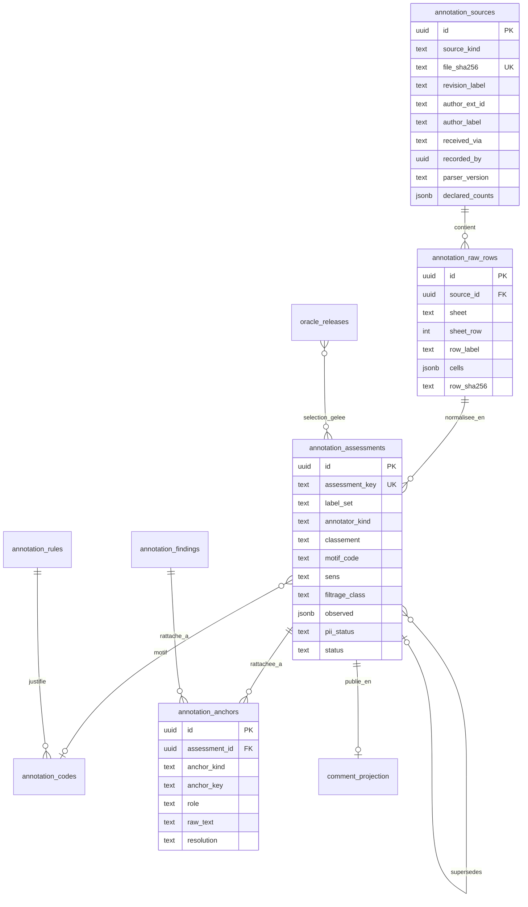
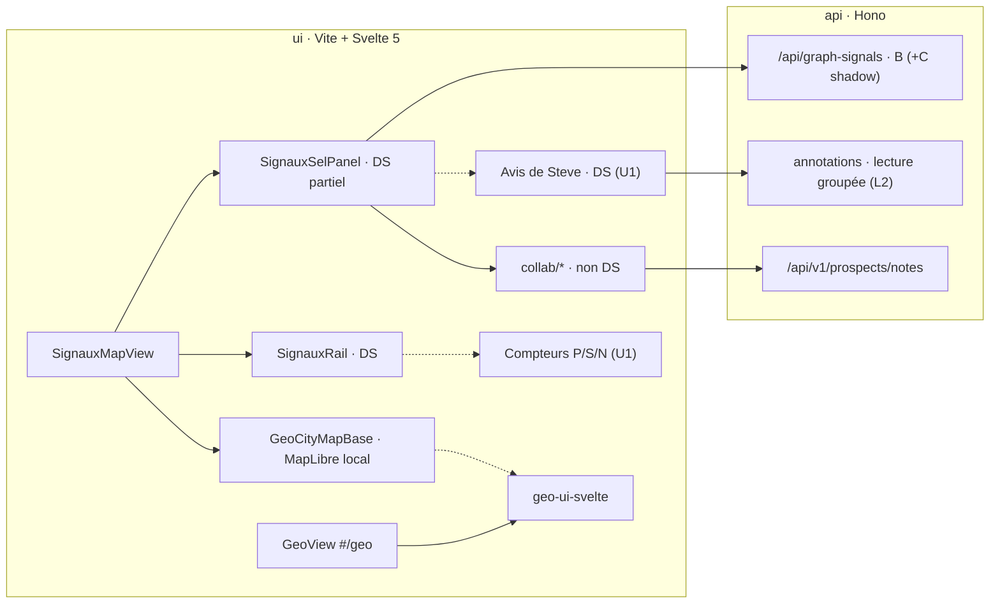
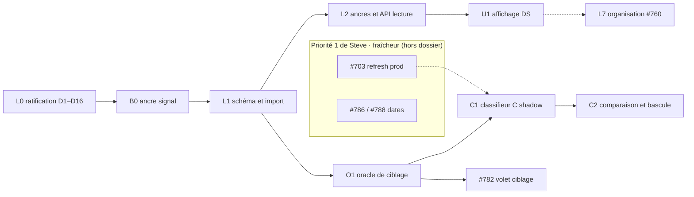
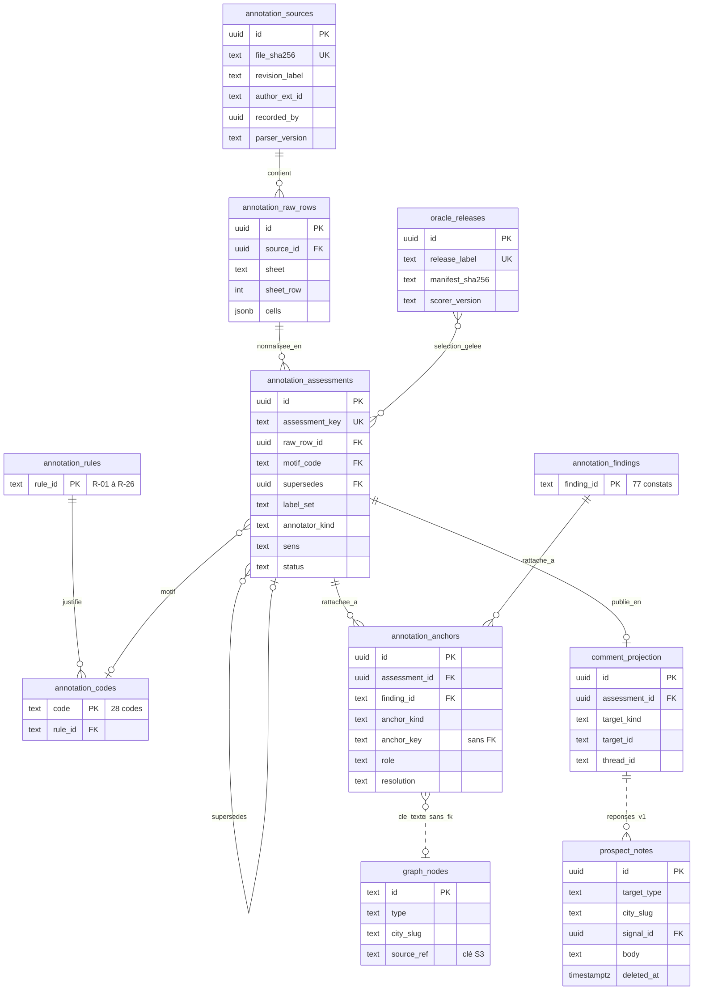
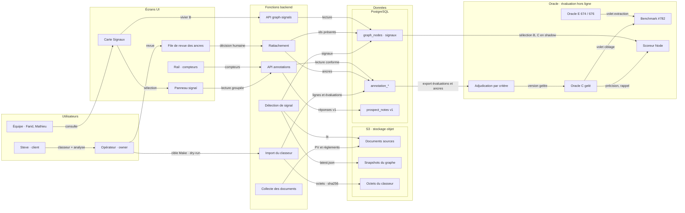
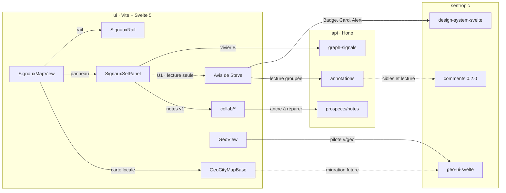
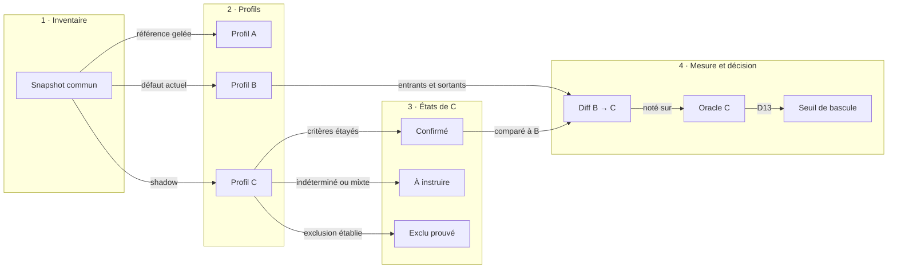

# Analyse des retours d'usage du 21 septembre 2026 : capitalisation des données annotées, vers de nouveaux critères de ciblage

- **Date** : 2026-10-03. Analyse de Steve Chaperon datée du 21 septembre 2026 (date du mail de transmission).
- **Type** : dossier de décision.
- **Nature** : dossier consolidé, issu de deux dossiers rédigés indépendamment (auteur A et auteur B), réconciliés point par point. Chaque divergence a été tranchée en revenant aux sources, ou laissée à l'owner (voir annexe A).
- **Destinataire** : Farid (Product Owner), qui décide le produit, le backlog et les priorités. **Validation technique** : Fabien (AI Builder) pour l'architecture, l'IA, l'oracle et le modèle de données. Consultés : Steve (client, utilisateur principal) et Mathieu (Product Manager).
- **Statut** : **PROPOSITION**. Aucune décision n'est prise. Aucun code, aucune migration, aucun import, aucune action prod ou cluster.
- **Cartes** : #783 (nouvel oracle), #784 (données de Steve en annotations), #760 (tri et classement), #761 (filtres), #697 et #782 (benchmark), #703 (rafraîchissement), #786, #787 et #788 (dates et URL), #725 (oracle v3).
- **Sources** :
  - `radar-triage-signaux.xlsx`, sha256 `c7e19f46feb78c245fcd04b3e64fd4ac6f174f2d30ff1d4c77aa5a2bf0dc1bb8` ;
  - `Analyse Radar 21 sept.docx`, sha256 `2dbc1d6f87a92ca128815575eb8e6830d5b552cd15b7c2b1e52a93d05ae067ff` ;
  - radar-immobilier `origin/main` `27891b10` ; branches `origin/feat/t1-model-benchmark-real` (oracle v3) et `origin/lane/conductor` (dossier COLLAB du 2026-08-16, absent de `main`) ;
  - sentropic `origin/main` `7d1002505`.
- **Méthode** : lectures Node uniquement (JSZip, fast-xml-parser, exceljs, mammoth), sans Python ; recomptages reproductibles sur les lignes du classeur ; lectures de code par `git show origin/main:<fichier>`.

Conventions : **FAIT** = constaté dans une source citée · **CALCUL** = dérivé des données, méthode donnée · **JUGEMENT** = appréciation · `non vérifié`, `source manquante`, `N-A` = limites déclarées.

---

## 1. Intention du dossier, objectifs de l'owner

Reformulation de la demande de l'owner, avant toute modélisation. Chaque objectif renvoie à l'endroit du dossier qui y répond.

| # | Objectif de l'owner | Où le dossier y répond | Décisions |
|---|---|---|---|
| O1 | Stocker **tous** les retours de Steve en base (données du tableur), chacun **attaché à l'élément associé** (ville, zone, signal, lot…), selon l'annotation prévue (#784, contrat d'ancre). | §6.3 (schéma : sources, lignes brutes, évaluations, ancres 1 à N), §6.4 (ancres par type d'objet), §6.5 (import idempotent, aucune ligne rejetée) ; scène `modele-donnees` | D1, D2, D3 |
| O2 | **Finaliser la modélisation** et proposer une **première mise en œuvre**, en base et en UI, qui respecte le **contrat sentropic d'annotation et de canevas**. | §6.1 (contrat sentropic lu dans le code), §6.3 (projection `Comment` conforme), §7 (lots B0, L1, L2, U1, O1, C1, C2) ; scènes `modele-donnees` et `flux-import-oracle` | D2, D4, D5, D6, D14, D15 |
| O3 | Faire un **focus sur l'état de la migration** vers l'UI de base (composants geo et design system). | §8 (mesures sur `origin/main`, ce qui conditionne l'UI des annotations) ; scène `architecture-ui` | D14 |
| O4 | Prendre en compte l'**analyse de Steve**, qui réoriente le ciblage : remettre en place un **oracle** qui détecte ses besoins et s'y aligne ; prévoir peut-être une **double annotation** (ancienne / nouvelle) et un **mécanisme d'affichage A/B étendu en C** (on était déjà sur B). | §2 (ce que veut Steve, écart avec l'existant), §9.2 (critères C), §9.3 (oracle #783), §6.6 (double annotation), §9.5 (A/B/C) ; scènes `criteres-steve` et `affichage-abc` | D7, D8, D9, D10, D11, D12, D13, D16 |

Les objectifs O1 à O4 n'emploient aucun terme technique ; les termes repris ensuite sont expliqués au §1.2.

Contraintes de forme : 0 Python (Node/TS uniquement) ; aucune action prod ou cluster ; aucun chiffre inventé (`non vérifié`, `source manquante`, `N-A` quand la source manque).

### 1.1 Destinataires et rôles

Ce dossier s'adresse à **Farid**. Il est rédigé pour le produit ; la partie technique y figure pour validation par **Fabien**.

| Personne | Rôle | Ce qu'on attend de lui dans ce dossier |
|---|---|---|
| Steve Chaperon | Client (financeur) et utilisateur principal | Ses retours sont la matière du dossier ; il est consulté sur ses critères et les cas ambigus (D7, D8). |
| Mathieu Portier | Product Manager : oriente | Consulté sur les orientations produit (priorités, exposition de la nouvelle sélection, retour à Steve). |
| Farid | Product Owner / proxy : définit et valide le backlog | **Décide** le produit, le backlog et les priorités : 10 décisions (D1, D5, D6, D7, D8, D12, D13, D14, D15, D16). |
| Fabien | AI Builder : propriétaire du code, garant de la livraison | **Valide** l'architecture, les algorithmes d'IA, les modèles, l'oracle et la modélisation technique : 6 décisions (D2, D3, D4, D9, D10, D11). |

Chaque décision porte la mention « Décide : … · Consulté : … » (§3 et §10).

### 1.2 Termes utilisés

| Terme | Sens dans ce dossier |
|---|---|
| Signal | Un événement réglementaire détecté par le radar dans un document municipal (avis de motion, projet de règlement, résolution…), affiché sur la carte. |
| Vue de travail, passe 1 | Ce que Steve voit avec ses cinq filtres cochés et une période de six mois : 73 signaux. Les passes 2 et 3 retirent des filtres pour voir ce qui était masqué. |
| Vues A, B et C | Trois manières de choisir les signaux affichés. A : l'ancienne sélection, retirée de l'écran depuis août. B (ou B′, « B prime », sa version actuelle) : la sélection affichée aujourd'hui (zonage, résidentiel, étape précoce, sans les exclusions). C : la **proposition** de ce dossier, alignée sur les critères de Steve ; elle n'existe pas encore. |
| Filtre, exclusion | Case à cocher qui retire des signaux de la vue ; une exclusion retire une famille entière (par exemple les PIIA ou les dérogations). |
| PIIA | Plan d'implantation et d'intégration architecturale : règlement sur l'apparence des bâtiments, sans effet sur le nombre de logements. |
| PPCMOI | Projet particulier de construction, de modification ou d'occupation d'un immeuble : autorisation accordée à un projet précis, sur un terrain précis. |
| Dérogation (mineure) | Écart autorisé à une norme, pour un seul terrain. |
| CPTAQ | Commission de protection du territoire agricole du Québec ; le « dézonage » retire un secteur de la zone agricole. |
| ODJ | Ordre du jour d'une séance du conseil : un point inscrit n'est pas une décision. |
| Annotation | Note ou verdict attaché à un objet du radar (ville, zone, lot, signal, règlement). |
| Oracle | Jeu de réponses de référence, vérifiées, qui sert à noter automatiquement le radar ou un modèle (combien de bonnes réponses, combien d'erreurs). L'oracle actuel (674 ou 676 unités) note l'extraction des actes dans les procès-verbaux, pas le choix des signaux à montrer. |
| Benchmark | Campagne de mesure qui compare plusieurs modèles ou réglages sur le même oracle. |
| Précision, rappel, bruit | Précision : part des signaux affichés qui sont utiles. Rappel : part des signaux utiles qui sont affichés. Bruit : part des signaux affichés qui sont inutiles. |
| Design system (DS), composants geo | Bibliothèque commune de composants d'interface (boutons, badges, cartes) et de cartographie, partagée par les applications sentropic. |
| sentropic, contrat d'annotation | Plateforme commune ; son module de commentaires définit comment une annotation désigne sa cible. |
| `non vérifié`, `source manquante`, `N-A` | Ce que le dossier n'a pas pu établir, faute d'accès ou de source. |

---

## 2. Ce que veut Steve

Sources : `Analyse Radar 21 sept.docx` (citations entre guillemets, avec la section de l'analyse) et `radar-triage-signaux.xlsx` (recomptes sur la feuille Triage ; passe 1 = la vue de travail de Steve, cinq filtres cochés, 73 signaux).

### 2.1 Le principe : appartenance, pas classement

> « Un signal m'intéresse quand les trois conditions suivantes sont réunies. Pas deux sur trois - les trois. » (analyse, §1)

> « Tout ce qui ne réunit pas ces trois conditions est du bruit pour moi, et je ne devrais pas le recevoir. Ce n'est pas une question de hiérarchie entre les signaux : c'est une question d'appartenance ou non au périmètre. » (analyse, §1)

### 2.2 Les trois critères de ciblage

**Critère 1 — Résidentiel.**
> « Le règlement touche l'habitation. Pas le commercial, pas l'industriel, pas l'institutionnel, pas l'agricole (sauf en cas de dézonage par la CPTAQ), pas le récréatif. » (analyse, §1)

Il inclut, en amont, que l'acte soit un règlement d'urbanisme : « Reconnaître qu'un règlement n'est pas un règlement d'urbanisme. Matières résiduelles, gestion contractuelle, règlement d'emprunt, programme de subvention - ces règlements existent dans toutes les municipalités du Québec et reviendront partout. » (analyse, §5) Règles associées : R-18 (exception CPTAQ résidentielle).

| Mesure (CALCUL, tableur) | Passe 1 | 124 lignes |
|---|---:|---:|
| Non pertinent, motif N-NON-RES (zonage non résidentiel) | 1 | 6 |
| Non pertinent, motif N-FAUX-POSITIF (pas un règlement d'urbanisme) | 2 | 4 |
| Familles de l'analyse : « pas des règlements d'urbanisme » | 4 sur 24 | — |

« Ils occupaient à eux seuls toute la vue principale de leur municipalité. » (analyse, §3, à propos de Saint-Louis-de-Gonzague, Saint-Roch-de-Richelieu, Delson, Pointe-Claire.)

**Critère 2 — Assouplissement des règles.**
> « La modification ouvre, elle ne resserre pas. Un règlement qui réduit une hauteur, restreint un usage ou impose une nouvelle contrainte ne m'intéresse pas. » (analyse, §1)

> « Déterminer le sens de la modification. Le verbe du titre suffit le plus souvent : afin de permettre, afin d'autoriser, afin d'agrandir d'un côté ; afin d'interdire, afin de limiter, afin de préserver de l'autre. » (analyse, §5)

Avec une réserve explicite : « Quand le sens d'une modification n'est pas déterminable, le signal doit rester affiché. Masquer par défaut ce qui n'a pas pu être lu transformerait une lacune en dossier manqué, et c'est le risque que je ne peux pas prendre. Même chose pour un règlement qui resserre d'un côté et ouvre de l'autre : il y en a cinq dans mon relevé, et aucun ne doit disparaître. » (analyse, §5)

| Sens de la modification (CALCUL) | Passe 1 | 124 lignes | dont Pertinent / À surveiller / Non pertinent (124) |
|---|---:|---:|---|
| Assouplissement | 35 | 55 | 27 / 5 / 23 |
| Indéterminé | 21 | 38 | 7 / 21 / 10 |
| Restriction | 6 | 10 | 0 / 3 / 7 |
| Mixte | 5 | 7 | 5 / 0 / 2 |
| Neutre | 6 | 14 | 1 / 0 / 13 |
| Motif N-RESTRICTIF (resserrement) | 4 | 7 | Non pertinent |

**Critère 3 — Densification.**
> « Le résultat est plus d'unités que le règlement en permettait avant. C'est le critère qui tranche : un assouplissement résidentiel qui ne change pas le nombre d'unités possibles ne m'apporte rien. » (analyse, §1)

> « Reconnaître qu'un règlement d'urbanisme ne touche pas la capacité de construire. Clôtures, cabanons, enseignes, structures de jardin : ce sont des règlements de zonage, mais ils ne changent aucun nombre d'unités. » (analyse, §5)

| Mesure (CALCUL) | Passe 1 | 124 lignes |
|---|---:|---:|
| Pertinent, motifs P-DENSITE + P-USAGE-MULTI (hausse de densité, multilogement) | 13 | 16 |
| Non pertinent sans effet sur la capacité : N-ADMIN, N-FORME, N-UNIFAM, N-ACCESSOIRE | 6 | 13 |
| Familles de l'analyse : « urbanisme sans effet sur la capacité » | 4 sur 24 | — |
| Passe 1 où le critère n'est pas qualifiable (analyse : « sens non donné » 12 + « portée ou ampleur non identifiables » 15) | 27 | — |

**Deux règles d'exclusion transversales**, posées par Steve à côté des trois critères :
- « Distinguer une décision d'un point d'ordre du jour. Un point inscrit à l'ordre du jour n'est pas une décision du conseil. » (analyse, §5) — N-ODJ-SEUL : 3 en passe 1, 4 au total.
- « Distinguer une règle générale d'une autorisation individuelle. Un PPCMOI ou une dérogation accordés à un demandeur pour un immeuble précis ne créent de droit pour personne d'autre. » (analyse, §5) — V2-PRECEDENT : 8 en passe 1, 21 au total, tous Non pertinent (« hors de mon périmètre actuel », analyse, §3).

Bilan de la passe 1 (CALCUL, recompté par motif) : les 24 Non pertinent se répartissent en **3** hors résidentiel ou hors urbanisme, **4** resserrements, **6** sans effet sur la capacité, **11** hors portée (8 autorisations individuelles, 3 points d'ordre du jour). 22 signaux réunissent les trois critères ; 27 ne sont pas qualifiables avec l'information servie.

### 2.3 Écart avec l'existant, critère par critère

Existant lu sur `origin/main` `27891b10` : vue A retirée de l'UI depuis `f2c20573` (comptes encore calculés côté serveur) ; vue B′ = `!exclusion && zonage && residentielEligible && precoce` ; classification `vivier_v2` par axes zonage / résidentiel / étape, avec un champ d'effet (`densifie`, `reduit`, `stable`, `inconnu`) ; exclusions d'affichage PIIA et dérogation ; oracle v3 (674 unités committées, 676 en copie locale) qui note l'extraction d'actes.

| Critère de Steve | Ce que fait le radar aujourd'hui | Couverture | Effet mesuré sur la vue de travail (passe 1) |
|---|---|---|---|
| 1. Résidentiel (et règlement d'urbanisme) | Filtre Résidentiel : `res=oui`, ou `res=indetermine` ∧ instrument ∈ {rezonage, refonte} ; `res` par marqueurs regex ; filtre Zonage par catégorie et étape. Aucune reconnaissance de la nature de l'acte : un règlement de matières résiduelles typé `rezonage` passe. | **Partiel** | 3 signaux hors résidentiel ou hors urbanisme affichés (codes) ; 4 selon l'analyse. Commentaire #761 : « résidentiel et zonage ne sont pas utiles pour Steve ». |
| 2. Assouplissement | Aucun champ « sens » dans `vivier_v2` ni dans B′ ; aucun filtre. | **Absent** | 6 restrictions affichées, dont 4 Non pertinent (N-RESTRICTIF) ; 21 indéterminés que le radar ne qualifie pas. |
| 3. Densification | Champ d'effet présent mais toujours `inconnu` ; `nb_unites_max` partiel ; le contrat B′ précise que l'appartenance au vivier « ne prouve pas une hausse de densité ». | **Absent** | 6 signaux sans effet sur la capacité affichés ; 27 non qualifiables (sens ou ampleur non donnés). |
| Exclusion « autorisation individuelle » | Exclusions PIIA (sans preuve résidentielle) et dérogation ; PPCMOI, usage conditionnel, Loi 31 et CPTAQ individuelle ne sont pas exclus. | **Partiel** | 8 autorisations individuelles affichées (V2-PRECEDENT). |
| Exclusion « point d'ordre du jour » | Aucune distinction ODJ / décision dans les propriétés lues. | **Absent** | 3 points d'ordre du jour affichés (Mont-Tremblant). |
| Ne rien masquer d'illisible (réserve) | B′ garde le résidentiel indéterminé pour certains instruments ; pas de notion de sens ni de mixte. | **Partiel** | 34 des 40 Pertinent sont dans la vue de travail (85 %) ; 6 n'apparaissent qu'en passe 2 ou 3 ; 7 dossiers manqués alors que « l'information existait dans la base du radar » (analyse, §4). |
| Mesure de tout cela | L'oracle 674/676 note l'extraction (étape + citation) sur 100 PV ; aucun oracle ne note le ciblage ni le post-filtrage. | **Absent** | Bruit de la vue de travail : 24/73 = **32,9 %** ; précision « trois critères » : 22/73 = **30,1 %** ; précision P ∪ S : 49/73 = 67,1 %. |

**Lecture (JUGEMENT).** Le radar actuel filtre par **nature d'instrument et étape** ; Steve demande un filtre par **effet du règlement** (sens et nombre d'unités). Deux des trois critères n'ont aujourd'hui aucune donnée, ce qui explique que C demande une extraction nouvelle (§9.2) et un oracle de ciblage distinct (§9.3). Scène `criteres-steve` : les critères de Steve en regard de l'existant.

---

## 3. Synthèse et décisions demandées

**Recommandation globale (JUGEMENT).** Conserver intégralement les sources de Steve, les rattacher aux objets métier par des ancres durables, afficher son verdict en lecture seule dans les panneaux existants, construire un oracle de ciblage distinct de l'oracle d'extraction, puis développer une vue C mesurée contre B. B reste le défaut jusqu'à une bascule fondée sur la mesure. Tout cela reste subordonné à la priorité n° 1 de Steve : le rafraîchissement (#703, #786, #788).

| Sujet | Constat déterminant | Recommandation |
|---|---|---|
| Ce que Steve a livré | **FAIT.** 7 feuilles : 124 lignes de triage (51 villes sur 103), 121 contrôles d'exclusion, 77 constats, 26 règles, 28 codes de motif ; une analyse qui pose trois critères cumulatifs. | Tout importer, sans supposer « une ligne = un signal ». |
| Qualité de la vue de travail | **CALCUL.** Passe 1 (73 lignes) : 34 Pertinent, 15 À surveiller, 24 Non pertinent. L'analyse en retient 22 qui réunissent les trois critères. | Le défaut principal est le bruit (24/73 = 32,9 %) ; le rappel est secondaire. |
| Annotation de signal existante | **FAIT.** L'UI envoie l'identifiant texte du graphe ; l'API exige un UUID (`prospect-marks.ts:107`). | Correctif B0 avant tout import. |
| Contrat sentropic | **FAIT.** Les cibles `record` conviennent sans changement du paquet ; `delete` est une suppression physique dans la 0.2.0 publiée, alors que l'owner a ratifié tombstone et rétention (O1). | Lecture conforme, import immuable, aucun chemin de suppression par le paquet tant qu'il n'a pas de tombstone. |
| UI | **FAIT.** 39 composants Svelte sur 69 importent le DS ; les 3 composants d'annotation n'en importent aucun ; la carte Signaux reste MapLibre local. | Afficher dans le panneau et le rail avec le DS, sans attendre la migration geo. |
| Ciblage C | **FAIT.** Aucun champ « sens » ; `effet_densifiant` toujours `inconnu` ; ni « de plein droit », ni « ODJ / décision ». | C demande une extraction nouvelle, mesurée sur un oracle de Steve. |
| Oracle | **FAIT.** L'oracle v3 (674 unités committées, 676 en copie locale) mesure l'extraction d'actes, pas le ciblage. | Deux oracles distincts : extraction (E) et ciblage (C). |

### Décisions demandées (D1 à D16)

Farid décide le produit, le backlog et les priorités ; Fabien valide l'architecture, l'IA, l'oracle et le modèle de données. Steve et Mathieu sont consultés là où leur avis porte.

| # | Décision | Décide · Consulté | Option recommandée | Alternatives |
|---|---|---|---|---|
| D1 | Périmètre de conservation | **Farid** · Steve, Mathieu | **(b)** tout le classeur et l'analyse, brut immuable | (a) Triage seul ; (c) notes libres seules |
| D2 | Modèle de données | **Fabien** · Farid | **M3** couches : source → lignes brutes → évaluations → ancres → publication | M1 étendre `prospect_notes` ; M2 table de contrôle seule ; M4 attendre le paquet |
| D3 | Ancre signal et correctif | **Fabien** · Farid | **(a)** clé texte namespacée sans clé étrangère + instantané observé ; B0 immédiat | (b) attendre une clé métier stable ; (c) passer par l'UUID `signals` |
| D4 | Conformité sentropic et suppression | **Fabien** · Farid | **(a)** cibles, lecture et événements conformes ; import immuable ; réponses dans `prospect_notes` v1 ; demande de tombstone à sentropic | (b) adaptateur `CommentStore` à tombstone hôte ; (c) attendre le port complet |
| D5 | Auteur des retours importés | **Farid** · Steve, Fabien | **(a)** auteur documentaire externe + importateur réel tracé, sans droit de mutation | (b) importateur seul comme auteur ; (c) compte Steve |
| D6 | Visibilité et données personnelles | **Farid** · Steve, Mathieu, Fabien | **(c)** utilisateurs approuvés, verbatims caviardés | (a) tous les approuvés sans caviardage ; (b) administrateurs et Steve |
| D7 | Définition de C v1 | **Farid** · Steve, Mathieu, Fabien | **K1–K9 + trois états** : confirmé, à instruire, exclu prouvé | triplet strict ; tri seulement |
| D8 | Cas contradictoires | **Farid** · Steve, Mathieu | **Revue métier** par Steve et Mathieu ; abstention explicite en attendant | arbitrage par l'équipe ; statu quo |
| D9 | Sens de « double annotation » | **Fabien** · Farid | **Point ouvert** — lecture proposée : verdict Steve source + ancienne classification radar + adjudication C + prédiction C | ancienne / nouvelle grille de Steve ; oracle 676 / oracle Steve |
| D10 | Oracle #783 | **Fabien** · Steve, Farid | **Double oracle E / C** ; unité signal regroupée par dossier ; développement 51 villes, test 52 villes, partition par dossier | remplacer v3 par le tableur ; campagne C entièrement nouvelle |
| D11 | Benchmark #782 | **Fabien** · Farid | **Volet ciblage séparé** ; enrichir le contrat d'extraction = nouvelle version, décision dédiée | fusion des métriques ; statu quo |
| D12 | Exposition A/B/C | **Farid** · Steve, Mathieu, Fabien | **Point ouvert** — recommandation consolidée : C en shadow + mode comparatif réservé à l'UAT ; B défaut | sélecteur A/B/C visible ; incréments dans B ; application C séparée |
| D13 | Seuil de bascule B → C | **Farid** · Steve, Mathieu, Fabien | **À fixer par Farid** — proposition : aucun Pertinent masqué sur le jeu test, précision P ∪ S > B, parité des ensembles | seuil chiffré différent ; bascule sur recette seule |
| D14 | Première livraison UI | **Farid** · Mathieu, Fabien | **(a)** panneau + rail + DS ciblé ; pastilles carte plus tard | (b) pastilles sur la carte actuelle dès L3 ; (c) migration geo d'abord ; (d) tableau séparé seul |
| D15 | Séquencement | **Farid** · Mathieu, Fabien | **(a)** B0, import et oracle en parallèle de la fraîcheur ; C1 après stabilisation du rafraîchissement | (b) tout après #703 |
| D16 | Retour à Steve | **Farid** · Mathieu | **Oui** : renvoyer la définition réelle des filtres et la table de dérivation, par Mathieu et Farid | ne rien renvoyer avant C |

Les options, leurs meilleurs arguments contraires et les conditions qui feraient changer la recommandation figurent au §10.

---

## 4. Contexte

- **FAIT.** Steve Chaperon (Chaperon Immobilier) a préparé le 21 septembre 2026 un relevé sur la période du 15 au 21 septembre. La transmission par Mathieu Portier, puis Farid le 27 septembre, provient du mandat de l'owner ; le courriel original est `source manquante`.
- **FAIT.** Le relevé repose sur ce qu'affiche l'interface et sur les outils MCP en lecture (`search_signals`, `query_zoning_events`). Steve écrit qu'il n'a pas eu accès au code et que la majorité des procès-verbaux n'ont pas été contre-vérifiés à la source.
- **FAIT.** Protocole en trois passes (règle R-26), période réglée sur 6 mois :
  1. passe 1 : les cinq filtres cochés (vue de travail) ;
  2. passe 2 : sans le filtre Précoce ;
  3. passe 3 : aucun filtre, pour repérer faux négatifs et faux positifs.
- **FAIT.** Les colonnes « Classement » (valeur pour Steve) et « Filtrage » (le filtre avait-il raison ?) sont indépendantes.
- **FAIT.** Priorités de Steve, dans l'ordre : rafraîchir les signaux ; enlever le bruit ; une interface plus simple pour archiver, classer, lier et épingler.
- **FAIT.** #783 et #784 n'ont ni corps ni commentaire : leur titre est tout le cadrage. #760 et #761 attendaient « le document d'analyse de Steve » ; il est disponible, sans que leurs autres critères soient clos pour autant.
- **FAIT.** Commentaire de `fbellame` sur #761 : « résidentiel et zonage ne sont pas utiles pour Steve. Précoce ne sera plus nécessaire lorsque la mise à jour des signaux sera quotidienne. »

### 4.1 Précédents à respecter

| Date | Source | Ce qui s'impose ici |
|---|---|---|
| 2026-06-11 | `SPEC_CONTROLE_PARITE_VILLES_STEVE.md` (main) | Un corpus de Steve va dans une table de contrôle séparée du store opérationnel : la parité « mesure le pipeline, elle ne le nourrit jamais ». Implémentation sur `main` : non trouvée. |
| 2026-08-12 | `SPEC_RAW_STEVE_MEETING_2026-08-12.md` (main) | Cibles annotables ville, signal, zone, lot, règlement. Réutiliser le modèle de commentaires sentropic, « pas de système parallèle ». |
| 2026-08-16 | `DOSSIER_DECISION_COLLAB_2026-08-16.md` (`origin/lane/conductor`, absent de `main`) | Décisions owner ratifiées : cible = objet métier ; suppression = tombstone + rétention (O1). « Le paquet porte l'intégrité » : un tombstone porté seulement par un adaptateur Radar est un piège. Tout chemin de suppression attend une version du paquet avec tombstone. Statut actuel du fichier hors `main` : `non vérifié`. |
| v1 | `SPEC_CONTRAT_ANCRE_ANNOTATIONS_v1.md` + migration 0011 (main) | Cibles `lot` et `signal` ; `signal_id` UUID `ON DELETE SET NULL` ; lecture par les approuvés, mutation par l'auteur ; suppression logique ; `tenant_id` inerte. Le §3.1 admet l'absence d'identité de signal stable à la ré-ingestion. |
| 2026-10-01 | #787, règles de partage validées par l'owner | Une URL avec un paramètre `filter.*` décrit tout l'état. Item 4 du comportement attendu : « sans réintroduire de choix entre plusieurs viviers ». |

### 4.2 Ce qui manque et ne doit pas être masqué

- Maquette de l'interface simplifiée annoncée par Steve et Mathieu : non fournie.
- Taux de résolution des identifiants de Steve contre le graphe actuel : `non vérifié` (aucune requête prod ou préprod).
- SHA déployé du 15 au 21 septembre : `non vérifié` (`30-api.yaml` utilise `:latest`).
- Classification serveur exacte au moment du relevé : non archivée (`source manquante`).

---

## 5. Retours de Steve, chiffrés

### 5.1 Inventaire du classeur

**FAIT.** 7 feuilles visibles, 433 lignes ayant au moins une valeur, 4 392 cellules non vides, 47 cellules de formule, aucun hyperlien Excel.

| Feuille | Contenu mesuré | Usage à l'import |
|---|---|---|
| Triage | 124 lignes (Excel 6–129), 20 colonnes A:T toutes renseignées, 51 municipalités | Évaluations individuelles ou groupées |
| Écartés par les filtres | 121 lignes (5–125), 8 colonnes, 46 municipalités ; certaines lignes regroupent plusieurs enregistrements | Évaluations d'exclusion, dont lignes agrégées |
| Constats transversaux | 77 constats C-01…C-82 (numéros absents : 40, 50, 62, 70, 71), 7 colonnes | Constats rattachés aux villes ou à un artefact |
| Règles de classement | 26 règles R-01…R-26 | Référentiel daté et sourcé |
| Codes de motif | 28 codes (8 P-, 8 S-, 11 N-, 1 V2-) | Dictionnaire ; 24 codes employés |
| Synthèse | 45 formules, **toutes avec une valeur mémorisée** | Conserver formule et valeur ; recalculer à part |
| Villes à couvrir | 51 traitées sur 103, 124 triés sur 146 captés ; pas de liste nominative des 52 restantes | Comptes déclarés |

« 124 signaux » est le libellé de Steve ; « 124 lignes » est la mesure reproductible. La ligne #112 traite deux signaux, la #7 nomme deux événements, la #55 décrit un dossier absent du radar.

### 5.2 Classement par passe (CALCUL, feuille Triage)

| Passe | Pertinent | À surveiller | Non pertinent | Total |
|---|---:|---:|---:|---:|
| 1 — 5 filtres | 34 | 15 | 24 | **73** |
| 2 — sans Précoce | 4 | 11 | 18 | 33 |
| 3 — reste | 2 | 3 | 12 | 17 |
| Hors radar | 0 | 0 | 1 | 1 |
| **Total** | **40** | **29** | **55** | **124** |

Ce sont des distributions d'annotations, pas une précision ni un rappel du système. 34 des 40 Pertinent sont en passe 1, 38 en passe 1 ou 2.

### 5.3 Sens de la modification × classement (CALCUL)

| Sens | Pertinent | À surveiller | Non pertinent | Total | dont passe 1 |
|---|---:|---:|---:|---:|---:|
| Assouplissement | 27 | 5 | 23 | 55 | 35 |
| Indéterminé | 7 | 21 | 10 | 38 | 21 |
| Neutre | 1 | 0 | 13 | 14 | 6 |
| Restriction | 0 | 3 | 7 | 10 | 6 |
| Mixte | 5 | 0 | 2 | 7 | 5 |

Lecture (JUGEMENT) : 23 assouplissements sont Non pertinent, surtout des autorisations au cas par cas (V2-PRECEDENT). Le sens seul ne suffit pas : il faut aussi « de plein droit » (R-06). Trois restrictions sont À surveiller (S-RESTRICTIF), ce qui tempère R-21.

### 5.4 Motifs, exclusions et constats

| Motif le plus employé | Lignes | Motif | Lignes |
|---|---:|---|---:|
| V2-PRECEDENT | 21 | N-RESTRICTIF | 7 |
| P-VILLE-TERRITOIRE | 13 | N-NON-RES | 6 |
| S-PORTEE-FLOUE | 10 | N-ACCESSOIRE | 5 |
| P-USAGE-MULTI, P-DENSITE, S-INFO-MANQUANTE | 8 chacun | P-PERIM-URB, P-NOUV-ZONE, N-FAUX-POSITIF, N-ODJ-SEUL, N-FORME | 4 chacun |

Codes jamais employés : P-TYPO-INTERM, N-RETIRE, N-DOUBLON, N-HORS-TERR.

| Verdict « Écartés par les filtres » | Lignes |
|---|---:|
| Écarté à raison | 102 |
| Absent de l'UI | 6 |
| Typage fautif — hors fenêtre | 4 |
| Écarté — non vérifiable | 3 |
| Écarté à tort — faux négatif | 3 |
| Typage fautif — filtrage correct | 2 |
| Capté à tort — faux positif | 1 |
| **Total** | **121** |

102/121 n'est pas un rappel : des lignes décrivent des groupes ou des cas déjà présents dans Triage.

| Gravité des constats | Lignes | Périmètre | Lignes |
|---|---:|---|---:|
| Question | 20 | V1 | 67 |
| Confort | 19 | Info | 5 |
| Erreur vérifiée | 18 | V2 — pour mémoire | 4 |
| Exigence | 9 | V2 | 1 |
| Info | 7 | | |
| V2 | 4 | | |

Le bandeau de la feuille indique encore « 3 sur 25 » erreurs vérifiées : texte ancien, incohérent avec les 18 lignes actuelles.

**Qualité du filtrage (Synthèse, valeurs mémorisées)** : Correct 88, Fuite 25, Anomalie 7, À vérifier 3, Non évalué 0, soit 123 sur 124. Un regroupement par préfixe des 81 libellés libres de la colonne O donne 88 / 25 / 8 / 3 en rangeant ANOMALIE, ABSENT et SORTI DE LA VUE ensemble ; l'écart d'une ligne tient à ce regroupement.

### 5.5 Ce que dit l'analyse, rapprochée du tableur

| Catégorie de l'analyse (passe 1) | Analyse | Reconstitution par le tableur | Tableur |
|---|---:|---|---:|
| Trois critères réunis | 22 | Pertinent ∧ sens = Assouplissement | 22 |
| Résidentiel, portée générale, sens non donné | 12 | Pertinent ∧ sens ∈ {Indéterminé 6, Mixte 5, Neutre 1} | 12 |
| Portée ou ampleur non identifiable | 15 | À surveiller | 15 |
| Hors critères | 24 | Non pertinent | 24 |

**CALCUL, recompté.** La correspondance est exacte en effectifs. L'analyse n'énonce pas la règle de passage : le rangement des 5 « Mixte » dans « sens non donné » reste une reconstitution, à confirmer par Steve (D8).

Apports de l'analyse :
- **Trois critères cumulatifs** : résidentiel, assouplissement, densification (« pas deux sur trois — les trois ») ; la densification exige plus d'unités qu'avant.
- **Cinq exclusions** : pas un règlement d'urbanisme ; pas d'effet sur la capacité de construire ; sens restrictif ; point d'ordre du jour et non décision ; autorisation individuelle et non règle générale.
- **Réserve d'asymétrie** : un sens indéterminé reste affiché, un règlement mixte ne disparaît jamais (R-13, R-21, C-57, C-66).
- **Sept dossiers manqués** alors que « l'information existait dans la base » : Saint-Michel (36 logements, résumé tronqué), Richelieu, Deux-Montagnes 1770, Mascouche 1103-81, Sainte-Anne-des-Plaines 1079-1, Saint-Jérôme 0351-006, Saint-Gilbert U-161-2026 (affiché comme projet alors qu'il est en vigueur).
- **Interface souhaitée** : archiver sans supprimer ; classer ; lier les signaux d'un même règlement ou secteur ; garder en alerte (épingler hors période, notifier à chaque étape).
- **Suite** : 52 municipalités restent à relever selon la même méthode.

Écarts internes à ne pas lisser : la famille « autorisations individuelles » annonce six signaux puis cite sept municipalités ; l'analyse nomme 21 ou 22 cas pour 24 annoncés. **Le tableur fait foi pour l'import** ; l'analyse est conservée comme annotation distincte.

### 5.6 Exigences techniques des constats (sélection)

| Constat | Exigence | Carte |
|---|---|---|
| C-21, C-57, C-66 | Le sens devient un filtre coché par défaut qui masque le purement restrictif ; étiqueté par disposition ; « indéterminé » distinct de « neutre », toujours visible ; un restrictif masqué n'emporte pas l'étape d'un dossier visible. | C, #761 |
| C-15, C-26, R-07 | Lier les étapes d'un même règlement avec correction manuelle, sans fusion ; `reglement_number` vide ou incohérent (« 026-509 » / « 2026-509 »). | #760 |
| C-69, R-25 | Épingler un dossier et une municipalité, hors période, avec notification. | #760 |
| C-72 | Ampleur chiffrée : logements, densité, hauteur, avant et après. | extraction |
| C-82 | Le second projet est la dernière fenêtre avant le registre référendaire ; exclu de Précoce. | #761 |
| C-49, C-34 | Enregistrements servis par l'API et rendus dans aucune vue ; cause inconnue. | #761 |
| C-79 | Noms de particuliers en clair dans des résumés de signaux ; caviardage demandé. | conformité |
| C-81 | Municipalités introuvables par leur nom (slug désambiguïsé par la MRC). | import, MCP |

### 5.7 Filtres reconstitués par Steve (R-16), confrontés au code

Lecture du code `27891b10` ; les causes sont des hypothèses de lecture, non exécutées, et le code peut différer de celui déployé en septembre.

| Filtre | Observé par Steve | Définition dans le code | Lecture (JUGEMENT) |
|---|---|---|---|
| Précoce | Retient avis_motion, projet_reglement, un ppcmoi mais pas un autre | `etape ∈ {avis_motion, projet_reglement}` ; étape annotée, sinon dérivée par mots-clés (`vivier-view-mode.ts`, `graph-store.ts`) | Étape dérivée différemment selon le texte ; second projet exclu par construction (C-82). |
| Résidentiel | « Se prononce sur le type et rien d'autre » ; fuites non urbanistiques | `res=oui` ou `res=indetermine` ∧ instrument ∈ {rezonage, refonte} (`radar-domain/src/vivier/counts.ts`) | Un règlement de matières résiduelles typé `rezonage` passe par l'instrument. |
| Zonage | Semble laisser tomber `densification_residentielle` | Liste contenant `densification` mais pas `densification_residentielle` (`graph-store.ts`) | Cohérent avec l'observation. |
| Exclure PIIA | Écarte tout `piia` | Masque un PIIA sans preuve de projet résidentiel (`vivier-display-exclusions.ts`) | Proche. |
| Exclure dérogation | Écarte dérogation et dérogation mineure | Masque toute dérogation | Cohérent. |
| Période | Glissante, datée par la première étape (C-56) | Depuis #793 (fusionnée le 2026-10-02) : date du document par défaut, collecte en période personnalisée (`document-date-filter.ts`) | Observations de Steve en partie périmées. |
| Jamais rendus (C-49) | Cause inconnue | `non vérifié` | À reproduire (#761). |

Steve écrit (R-16) qu'« une seule réponse des développeurs remplacerait toute cette reconstitution ». Ce tableau peut lui être renvoyé après relecture (D16).

---

## 6. Modèle de données conforme au contrat sentropic d'annotation et de canevas

### 6.1 Contraintes établies

**Identité des objets annotables (FAIT).**

| Objet | Où il vit | Clé | Stabilité |
|---|---|---|---|
| Signal `signal-…`, événement `event-…` | `graph_nodes`, projetés depuis `graph/<ville>/latest.json` | `id` texte choisi par l'extraction | **Non garantie** : `upsertGraphAtomic` supprime les nœuds orphelins d'une ville (`graph-store.ts`, vers les lignes 1134–1166). |
| `signals` (historique) | table `signals` | UUID aléatoire | Aucune insertion dans le code applicatif de `main` (seulement dans un test d'intégration). |
| Municipalité | registre `QC_MUNICIPALITIES` ; nœuds `muni-<slug>` | slug, homonymes suffixés par la MRC | Stable |
| Règlement | `bylaw-<slug>-<num>`, `regulatory_stages.bylaw_canonical_id`, `reglement_number` | texte | Peu fiable (C-05, C-26) |
| Zone | `zone_versions` bitemporel | `ogc:zones:<ville>:<codeNorm>` | Stable par code |
| Lot | `lot_versions` bitemporel | `ogc:lots:<ville>:<noLotNorm>` | Stable |
| Document | `documents` | sha256 | Stable |

**Annotations existantes (FAIT, lecture de code).**
- `prospect_notes` (0011) : cible `lot` ou `signal` (UUID `ON DELETE SET NULL`), auteur `account_users`, corps limité à 10 000 caractères, suppression logique, flux SSE `prospect:note`.
- **Défaut 1** : l'UI envoie `GraphSignalNode.id` (texte) alors que l'API exige `z.string().uuid()` (`prospect-marks.ts:107`). Un refus 400 est attendu ; les tests utilisent `"sig-1"` sur un fetch simulé. Effet en prod : `non vérifié`.
- **Défaut 2** : `SignalAnnotations` compare `note.authorId` (`account_users.id`) à `$authStore.user.sub` (sujet IdP) quand `currentUserId` n'est pas fourni ; ni `SignauxSelPanel` ni `LotFichePanel` ne le fournissent. Les boutons d'édition n'apparaîtraient pas. Effet : `non vérifié`.
- **Défaut 3** : le badge de comptage n'est rempli qu'à l'ouverture de la fiche.
- Une cellule du classeur atteint **17 114 caractères** (Constats, E57) : le corps de note de 10 000 ne peut pas porter la source sans troncature.

**Contrat sentropic (FAIT, `origin/main` `7d1002505`).**

| Élément | `@sentropic/comments` 0.2.0 | Conséquence pour Radar |
|---|---|---|
| Cible | `{kind:'message'\|'canvas'\|'artifact'\|'field'\|'record', id, sectionKey?, recordType?}` ; `recordType` opaque | `{kind:'record', recordType:'radar.signal'\|'radar.municipality'\|'radar.bylaw'\|'radar.zone'\|'radar.lot'\|'radar.document', id:<clé namespacée>}` sans changement du paquet. Préfixer l'`id` : `TargetQuery` ne filtre pas sur `recordType`. |
| Fil | plat (`threadId`), `open\|resolved` par fil, `assignedTo` | Une évaluation publiée = un fil ; `resolved` ne signifie pas « non pertinent ». |
| Auteur | `{id, kind?: 'human'\|'agent'\|'nhi', displayLabel?}`, identifiant opaque | Auteur externe possible sans compte (D5). |
| Provenance | `{toolCallId?, runId?}` | La provenance d'import vit dans des tables hôtes. |
| Verdict structuré, étiquettes | absents | Tables hôtes ; le port n'est pas élargi. |
| Suppression | **physique par ligne** (`store.ts:47-48`) | Écart avec O1 (tombstone) ; pas de chemin de suppression par le paquet (D4). |
| Routeur Hono | `contextType` en énumération fermée (`hono.ts:17`) | Inutilisable tel quel pour `signal`. |
| Canevas | `SPEC_VOL_INTERACTIVE_CANVAS.md` = intentions brutes | Une position sur carte n'est qu'une représentation de la cible. |
| Focus | `packages/focus` supprimé de sentropic `main` (`6ca53d11a`, « focus is owned by h2a ») | Ne pas concevoir contre ce paquet. |
| Dépendance Radar | aucune référence à `@sentropic/comments` dans `ui/`, `api/` ou à la racine | À ajouter. |

### 6.2 Exigences

| # | Exigence | Source |
|---|---|---|
| E1 | Stocker toutes les cellules de toutes les feuilles, sans perte ni troncature | brief, #784 |
| E2 | Rattacher chaque retour à 1 à N éléments (signal, événement, ville, MRC, règlement, zone, lot, document, dossier) | brief, spec 2026-08-12 |
| E3 | Être conforme au contrat `comments`, sans système parallèle | spec 2026-08-12, COLLAB |
| E4 | Ne jamais détruire une annotation lors d'une ré-ingestion de sa cible | contrat d'ancre §3.1 |
| E5 | Provenance : fichier, sha256, feuille, ligne, révision, auteur, importateur, version du parseur | oracle |
| E6 | Import idempotent ; nouvelles révisions (52 villes) sans doublon, avec historique | analyse |
| E7 | Ne perdre aucune ligne non rattachable | brief |
| E8 | Coexistence de plusieurs jeux d'étiquettes (D9) | brief |
| E9 | Données personnelles (C-79) ; tombstone et rétention (O1) | Loi 25, COLLAB |

### 6.3 Schéma proposé (option M3)

Principes : clés naturelles texte **sans clé étrangère** vers le graphe (E4) ; valeurs brutes conservées à côté des valeurs normalisées ; versions par chaîne `supersedes` ; `tenant_id` inerte comme en 0011 ; migration nouvelle, 0011 n'est pas réécrite.

| Table | Rôle | Invariants |
|---|---|---|
| `annotation_sources` | Un fichier reçu : sha256, révision déclarée, auteur documentaire (`author_ext_id`, `author_label`), chaîne de transmission (`received_via`), importateur réel (`recorded_by`), version du parseur, comptes déclarés et mesurés | Octets originaux immuables, déposés dans le stockage objet ; unicité par sha256. |
| `annotation_raw_rows` | Toutes les cellules (valeur, formule, valeur mémorisée), par feuille et ligne Excel ; `row_label` = #, C-xx, R-xx | Aucune troncature ; unicité `(source_id, sheet, sheet_row)`. |
| `annotation_assessments` | Jugement structuré d'une ligne : classement, motif, sens, filtrage brut et normalisé, niveau de preuve, initiateur, portée, analyse, suites, instantané `observed` (ville, MRC, date, type, état, règlement, zones, verbatim) ; `label_set` et `annotator_kind` | Une nouvelle interprétation = une nouvelle ligne (`supersedes`) ; statut `active`, `withdrawn_in_revision`, `tombstoned`. |
| `annotation_anchors` | 1 à N ancres par évaluation ou constat : `anchor_kind`, `anchor_key`, `role` (`primary`, `twin`, `cited`, `aggregate`, `context`), texte brut, `resolution` (`resolved`, `abbreviated`, `ambiguous`, `unresolved`, `vanished`), validateur, date | Un lien de contexte à une ville ne propage pas le classement à tous ses signaux. |
| `annotation_codes`, `annotation_rules`, `annotation_findings` | Référentiels de Steve (28 codes, 26 règles, 77 constats) | Identifiants source conservés, jamais renumérotés. |
| `comment_projection` | Lien entre une évaluation publiée et sa représentation `Comment` (cible, fil) | Lecture conforme ; aucune suppression physique. |
| `oracle_releases` | Version d'oracle gelée : manifeste, sha256, unités, partitions, adjudications, version du scoreur | Une correction produit une nouvelle version. |

**Clé d'idempotence** : `assessment_key = sha256(label_set | feuille | city_slug | tri(ids complets cités) | règlement normalisé | zone normalisée)`. Le numéro « # » ne sert pas de clé : il peut changer d'une révision à l'autre ; il reste dans `row_label`.

**Projection conforme au contrat sentropic.** Chaque évaluation active publiée produit une représentation `Comment` :
- `target = {kind:'record', recordType:<type de l'ancre primary>, id:<anchor_key primary>, sectionKey:'steve:triage' | 'steve:ecartes'}` ;
- `author` selon D5 ; `body` = analyse puis « Suite à donner » ; le verdict structuré reste dans les tables hôtes ;
- les ancres secondaires (jumeau `event-`, ville, règlement) retrouvent le fil par requête hôte, sans dupliquer le fil ;
- une cellule précise se cible en `kind:'artifact'`, `id` = source, `sectionKey` = feuille/ligne/colonne.

### 6.4 Ancres et rattachement

| Objet | Ancre proposée | Vérification avant confirmation |
|---|---|---|
| Signal ou événement du graphe | `radar.signal:<ville>:<id>` + génération du graphe + instantané `observed` | Id exact présent dans un snapshot, ville, type et source concordants ; un préfixe seul n'est pas une preuve. |
| Document | sha256 + page + extrait | Un préfixe d'empreinte tronqué n'identifie pas un document. |
| Municipalité | slug du registre + alias source | Homonymes et suffixes MRC (C-81) ; pas de slug fabriqué par retrait des accents. |
| Zone | ville + code canonique + millésime | Pas de réancrage silencieux d'une zone renumérotée. |
| Lot | ville + numéro cadastral normalisé | Adresse civique ≠ numéro cadastral. |
| Dossier réglementaire | identité locale + liens vers règlement et étapes | Ville + numéro ne suffit pas (C-26) ; pas de fusion automatique des étapes. |
| Retour transversal, groupe non résolu | `artifact` = source + `sectionKey` de ligne | Ne jamais fabriquer une cible métier pour éliminer un reliquat. |

**Mesures lexicales (CALCUL, candidats, pas entités vérifiées).**
- Colonne L du Triage : au moins un identifiant complet dans **121/124** lignes, **148** chaînes distinctes, plusieurs candidats dans 27 lignes.
- Toutes colonnes du Triage : 121 lignes, 150 chaînes distinctes, plusieurs candidats dans 30 lignes.
- Trois feuilles Triage, Écartés et Constats : **227 à 237** identifiants complets distincts selon la règle d'extraction.
- Identifiants abrégés (`event-…-zonage-0013`) et lignes agrégées sans identifiant (« 13 signaux PIIA ») : présents dans Triage et surtout dans Écartés ; effectif exact dépendant de la règle, à publier par le rapport d'import.
- Les lignes #55 et #58 décrivent un dossier absent ; la #112 n'utilise que des identifiants abrégés.

Ordre de résolution : id exact + ville → identité documentaire + étape → dossier, zone ou lot validé → file de revue pour les ambiguïtés. Aucun rapprochement approximatif n'est confirmé sans trace humaine ou règle déterministe.

### 6.5 Import idempotent

1. **Script Node/TS** (exceljs en dépendance de développement d'`api/`), **dry-run par défaut**, via une cible Make. Rapport : comptes par feuille et par statut de résolution, écarts avec les comptes déclarés (124/146, 51/103, 121, 77, 26, 28).
2. **Idempotence** : un sha256 déjà importé ne produit aucune écriture ; une nouvelle révision fait un upsert par `assessment_key` ; une valeur modifiée crée une version `supersedes` ; une évaluation absente de la révision suivante passe en `withdrawn_in_revision`, jamais supprimée ; une transaction par fichier ; deux imports concurrents des mêmes octets convergent sans doublon ni double notification.
3. **Lignes non rattachables** : jamais rejetées. Ancre `municipality` toujours créée depuis la colonne Ville ; id abrégé résolu par ville + suffixe, sinon `ambiguous` ou `unresolved` ; ligne agrégée → ancre `municipality`, rôle `aggregate`, `count_hint` ; id complet absent du graphe → `vanished`, instantané `observed` affichable.
4. **Mesure de résolution avant tout affichage** : part des identifiants encore présents dans `graph_nodes` d'une préprod restaurée. C'est un critère de sortie du lot L1.
5. **Qualité à traiter dès l'import (FAIT)** : 4 dates partielles ou composites sur 124 ; 7 états `firm` hors liste de validation ; 66 « Procès-verbal » dans la colonne Type, hors liste d'étapes ; 29 initiateurs et 46 portées hors listes déroulantes ; 40 libellés de MRC non normalisés (dériver la MRC du registre) ; la Synthèse ne compte que 95 initiateurs normalisés sur 124. Toutes les cellules sont conservées ; les recomptages sont publiés avec leurs règles et une catégorie explicite pour les valeurs non reconnues.
6. **Données personnelles** : détection sur les verbatims, `pii_status` renseigné ; affichage selon D6.
7. **Retrait** : désactiver la publication d'un lot sans effacer source, évaluations ni réponses ultérieures des utilisateurs.
8. **Exécution en prod** : acte owner distinct, par un job de migration et d'import sur l'image Node existante de l'API ; aucun job Python.

### 6.6 Double annotation

**JUGEMENT, à confirmer (D9).** Le même schéma (`label_set`, `annotator_kind`) porte plusieurs jeux d'étiquettes sans table supplémentaire :

| Jeu | Contenu | Statut |
|---|---|---|
| `steve-source-2026-09` | Verdict original de Steve (classement, motif, sens, passe, filtrage) ; faits et interprétations de l'analyse séparés | Immuable |
| `radar-bprime` | Classification calculée par le radar (axes zonage, résidentiel, étape, exclusions, B′), reconstituée à la date du relevé | Partielle : la classification serveur de septembre n'est pas archivée |
| `targeting-c-adjudication` | Adjudication par critère C, auteur nommé, preuves, motifs de changement | Une interprétation de l'équipe n'est pas un reclassement signé Steve |
| `radar-c-v1` | Prédiction machine de C, version du classifieur, traces | Une prédiction ne devient jamais label de référence |

Cela permet de mesurer B contre Steve aujourd'hui, puis C contre Steve, de tracer les désaccords ligne par ligne, et d'ajouter un second annotateur humain si Fabien veut mesurer l'accord.

---

## 7. Première mise en œuvre — base et UI

| Lot | Contenu | Sortie observable | Taille (JUGEMENT) | Dépend de |
|---|---|---|---|---|
| **B0** — réparer l'ancre signal | Ancre texte du graphe acceptée par l'API pour les notes de signal, sans clé étrangère ; correction de la comparaison auteur (`account_users.id` contre `sub`) ; tests sur un id réel `signal-…` | Une note sur un signal réel est créée, relue et éditée en préprod, preuve navigateur | S | D3 |
| **L1** — schéma et import | Migration nouvelle (tables du §6.3) ; script Node/TS dry-run puis réel en préprod ; rapport de résolution | 124 + 121 + 77 + 26 + 28 lignes stockées ; ré-import du même fichier = 0 écriture ; taux de résolution mesuré | M | D1, D2, D3 |
| **L2** — ancres et API lecture | Résolution sur snapshot ; `GET` par entité, lecture groupée par lot d'ancres (badges), lecture complète d'un retour sans limite de 10 000 ; projection `Comment` conforme ; événement SSE étendu | Contrat zod et tests ; une seule requête par vue pour les compteurs | S–M | L1, D4, D6 |
| **U1** — affichage lecture seule | Dans `SignauxSelPanel` : badge de classement (vert, jaune, rouge), sens et code, section « Avis de Steve » (analyse, suite, niveau de preuve, provenance, statut de résolution) ; compteurs P / S / N par ville dans le rail ; migration DS des 3 composants `collab/*` | Exemples réels consultables avec contenu complet ; aucun nouveau `<button>` brut | M | L2, D14 |
| **O1** — oracle de ciblage v1 | Export `oracle-ciblage-steve-v1.json` depuis les évaluations et ancres ; partitions ; scoreur Node pour B (et C ensuite) | Tableau précision / rappel de B sur l'oracle | S–M | L1, D10 |
| **C1** — classifieur C en shadow | Extraction du sens par disposition, de la portée (plein droit / individuel), de la nature de la source (ODJ / PV), de l'effet sur les unités ; prédicat C côté serveur en parallèle de B | Précision / rappel de C contre B | L | O1, D7 |
| **C2** — comparaison et bascule | Diff B → C nommé ; parité API / rail / carte / panneau ; bascule si le seuil D13 est franchi | Décision de Farid sur mesure | S | C1, D12, D13 |
| **L7** — organisation #760 | Archiver, classer, lier, épingler hors période ; alertes seulement sur événement fiable | États durables et réversibles | N-A | maquette Steve/Mathieu, #703 |

Première valeur livrable : **B0 + L1 + L2 + U1**. O1 avance en parallèle de U1 une fois sources et ancres stabilisées. Les tailles S/M/L sont des appréciations, pas des charges mesurées.

**Parcours U1 depuis un signal.** Un badge « Retour de Steve » ouvre une section du panneau : classement original, code et sens ; analyse, niveau de preuve, suite proposée, recommandation ; fichier, feuille, numéro, ligne, révision ; état du rattachement et autres objets de la même ligne ; adjudication C distincte de la source le moment venu ; réponses des utilisateurs sous la restitution, sans édition du retour importé.

**Compteurs.** Un retour publié sur plusieurs objets ne compte qu'une fois dans le total d'import. Afficher séparément nombre de retours, nombre d'entités annotées et nombre de rattachements à confirmer. Les compteurs d'annotations ne changent pas le nombre de signaux des vues.

Tests futurs dans un environnement isolé `ENV=test-*` ou `ENV=e2e-*`, via Make, avec `down -v` après chaque stack. Cas de recette d'identité : Triage #1 (id complet), #7 (deux événements), #55 (dossier absent), #112 (ids abrégés), #110 (deux signaux proches).

---

## 8. Focus migration UI — geo et design system

**FAIT**, mesuré sur `origin/main` `27891b10`, `ui/` (SPA Vite + Svelte 5). Les références sont textuelles : un import ne prouve pas une migration complète.

| Indicateur | Valeur | Lecture |
|---|---|---|
| Dépendances déclarées | design-system-svelte ^0.34.71, themes et tokens ^0.11.0, geo-core et geo-map-engine ^0.6.0, geo-ui-svelte ^0.1.1, chat-ui ^0.33.0 | Plages déclarées, pas version déployée |
| Racine | `App.svelte` dans `ThemeProvider`, thème Sent-Tech | Tokens disponibles pour les nouvelles surfaces |
| Composants `.svelte` | 69, dont **39** importent le DS (56,5 %) ; 63 hors stubs et harnais | Adoption large mais partielle, pas « 56,5 % migré » |
| Composants DS les plus utilisés | Badge (25 fichiers), Alert 19, Button 14, Card 12, EmptyState 11 | — |
| Composants DS jamais utilisés | Tabs, Modal, Table, Input, Textarea, Tooltip | — |
| Contrôles HTML bruts | **132** `<button>` dans 37 fichiers (125 dans 35 hors stubs et harnais) ; 13 `<input>` ; 7 `<textarea>` ; 6 `<select>` ; 8 `<table>` | Indice de reste, pas inventaire de violations |
| Couleurs | 1 668 classes de couleur Tailwind (49 fichiers) contre 370 `var(--st-*)` (13 fichiers) ; 481 couleurs hexadécimales | Tokens DS minoritaires |
| Carte Signaux | `SignauxMapView` → `GeoCityMapBase.svelte`, MapLibre local (2 761 lignes) ; geo-map-engine seulement pour le fond satellite | Non migrée |
| Composants geo partagés | Seule la route `#/geo` (`GeoView`) rend `GeoMap` + `GeoDetailPanel` | Pilote isolé, sans panneau d'annotations |
| Moteur geo partagé | `GEO3D_ENGINE_ENABLED = false` ; montage par défaut en attente de la « Porte 2 » | Désactivé ; l'activer exige caméra et sélection, pas seulement le booléen |
| Annotations `collab/*` | **0 sur 3** utilisent le DS (`<textarea>` ×2, `<button>` ×5, badge Tailwind) | À migrer dans U1 |
| `SignauxSelPanel` | Importe le DS, contient 16 `<button>` bruts | Point de montage des annotations |
| `@sentropic/comments`, focus | 0 référence | Adaptateurs à réaliser |
| Dernière mesure officielle | `audit-ds-realignement.md` (2026-06-14) : 5 OK, 29 à migrer | Aucune mesure plus récente : `source manquante` |

**Ce qui conditionne l'UI des annotations (JUGEMENT).**
1. On n'attend pas la migration geo : U1 vit dans le panneau et le rail, avec des composants DS déjà adoptés (Badge, Card, Alert, Popover, Drawer).
2. Les trois composants `collab/*` migrent vers le DS dans le même lot : faible coût, pas de dette ajoutée.
3. Une couche carte « annotations » (pastille par ville ou lot) attend la migration de `GeoCityMapBase` : sinon on ajoute du code à un composant local de 2 761 lignes destiné à être remplacé (D14).
4. Le badge par signal exige la lecture groupée de L2 : le comptage actuel n'affiche rien avant l'ouverture de la fiche.
5. Pas d'investissement dans l'UI de tri (#760) avant la maquette de Steve et Mathieu.

---

## 9. Ciblage réorienté, nouvel oracle, double annotation et affichage A/B/C

### 9.1 B actuel

- **FAIT.** Le contrat B′ définit son défaut par `!exclusion && zonage && residentielEligible && precoce`. Le résidentiel indéterminé est éligible pour certains instruments ; l'étape précoce est avis de motion ou projet de règlement. B′ est un vivier de découverte : son appartenance « ne prouve pas une hausse de densité ».
- **FAIT.** Le sélecteur A/B a été retiré du rail (`f2c20573`, 2026-08-22) : `SignauxRail` rend directement B, les anciennes clés A sont normalisées vers B. Les comptes A sont encore calculés côté serveur.
- **Conséquence.** Ajouter C n'est pas ajouter un troisième onglet à un sélecteur actif : toute comparaison A/B/C est un mécanisme à réexposer.

### 9.2 Critères C proposés

Un signal est **dans C** si aucune exclusion **établie** ne s'applique ; il est **confirmé** si les critères requis sont étayés, **à instruire** sinon. Les étiquettes de Steve servent de vérité par critère.

| # | Critère | Règle de Steve | Donnée disponible (FAIT) | Donnée à produire |
|---|---|---|---|---|
| K1 | Règlement d'urbanisme (pas matières résiduelles, emprunt, gestion contractuelle, subvention, éthique) | analyse ; N-FAUX-POSITIF, N-ADMIN | `category` fourre-tout (`rezonage`, C-52) | Nature de l'acte sur le titre complet |
| K2 | Résidentiel ; agricole seulement en dézonage CPTAQ résidentiel | critère 1, R-18 | `res` par regex et instrument | Usage visé, préfixe de zone (C-55) |
| K3 | Sens ≠ purement restrictif ; mixte et indéterminé restent visibles | critère 2, R-21, C-57, C-66 | aucune | `sens` par disposition, 5 valeurs |
| K4 | Densification : plus d'unités qu'avant | critère 3, R-08 | `effet_densifiant` toujours `inconnu` | `effet_unites` avant / après (C-72) |
| K5 | De plein droit, non individuel (exclut PPCMOI, dérogation, usage conditionnel, Loi 31, CPTAQ individuelle sauf R-18) | R-06, R-09, R-10 | `instrument` | Portée du droit ; finalité CPTAQ (C-53) |
| K6 | Capacité de construire (exclut PIIA, construction, clôtures ; lotissement seulement s'il agit seul, R-22) | R-06, R-15, R-22 | instrument piia | Rattachement du lotissement au dossier |
| K7 | Décision, pas simple point d'ordre du jour ; un point retiré est mort | R-01, R-02, R-23 | nature du document source : `non vérifié` | `source_nature` et état du point (C-35) |
| K8 | Étape : avis de motion, premier projet, **second projet**, mandat d'urbaniste, résolution CPTAQ | R-05, R-23, C-82, C-68 | `etape ∈ {avis_motion, projet_reglement}` | `second_projet` ; cycle par famille d'instrument |
| K9 | Épinglé ⇒ visible quelle que soit la période | R-25, C-69 | aucune | Hors C (#760), mais C le respecte |

**Règle d'asymétrie (contraignante).** Une absence de données n'est jamais une preuve négative. Si K3 ou K4 sont `indéterminé`, le signal reste dans C, état « à instruire ». On ne masque que ce qui est établi hors critères. Par construction, C ne dégrade pas le rappel sur les cas illisibles ; son gain porte sur la précision. Deux compteurs distincts, « confirmés » et « à instruire », évitent de présenter une conservation prudente comme une opportunité avérée.

**Cas à arbitrer par Steve plutôt que par regex (D8)** : Saint-Victor (resserrement des maxima de lots qui favorise la densification, R-22) ; Amos (logement sur commerce rejeté par l'analyse) ; portée exacte de l'exception CPTAQ ; seconds projets (R-19 contre C-82) ; visibilité des ODJ ; trois restrictions À surveiller (S-RESTRICTIF) contre R-21 ; ligne Mixte #41 non pertinente alors que l'analyse protège les mixtes ; rangement des 5 Mixte dans la reconstitution 22/12/15/24 ; table de dérivation code de motif → critères (S-CONTRAINTE, S-PPCMOI-SERIE, S-PREEMPTION ne se projettent pas proprement).

### 9.3 Nouvel oracle (#783)

| | Oracle E — extraction | Oracle C — ciblage |
|---|---|---|
| Question | A-t-on extrait l'acte ? | L'aurait-on montré à raison ? |
| Unité | acte d'un PV (étape + citation) | signal (nœud du graphe), regroupé par dossier pour les jumeaux et les grappes |
| Étiquettes | étape | classement P/S/N, motif, sens, filtrage, critères K1–K8 dérivés du motif (table relue par Steve) |
| Origine | consensus de 3 familles de modèles, ancrage textuel, arbitrage ; pas d'annotation humaine | Steve (source), adjudication nommée |
| Version | 674 unités / 47 non résolus committés sur `feat/t1-model-benchmark-real` (`dd0561f6`) ; 676 / 43 en copie locale identifiée par sha256 (`consensus.json` `8e8e9cc0…`), non committée | `oracle-ciblage-steve-v1`, à geler |

« 676 » est le nombre d'unités, pas la carte #676 (déploiement immo-mcp) ; le suivi de l'oracle est #725. **La version 676 doit être committée et gelée par empreinte avant la campagne suivante.**

**Construction.**
1. Figer règles et unités ; séparer détection d'acte, qualification C et affichage.
2. Manifeste de corpus : documents, empreintes, millésimes, profils de filtre, liens vers les retours. L'intersection avec les 100 documents du banc est `non vérifié`, probablement faible.
3. Le jeu de Steve sert de régression et de jeu de développement ; seuls les labels rattachés et étayés entrent dans la référence notée.
4. Étendre la vérité documentaire : les retours issus de l'écran ne mesurent pas les opportunités jamais extraites (sept dossiers manqués).
5. Adjudication indépendante des sorties des modèles candidats ; désaccord métier → revue humaine ; absence de preuve → non résolu.
6. **Séparation développement / test** : les 51 villes du relevé pour régler C, les 52 suivantes annoncées par Steve comme jeu de test aveugle ; toutes les unités d'un même dossier dans la même partition.
7. Geler chaque version (sha256) ; ne jamais comparer deux bras sur deux versions différentes.

**Base B mesurée sur l'échantillon de Steve (CALCUL, passe 1 = 73).**

| Mesure | Valeur | Calcul |
|---|---:|---|
| Bruit (Non pertinent) | 32,9 % | 24/73 |
| Précision P ∪ S | 67,1 % | 49/73 |
| Précision P | 46,6 % | 34/73 |
| Précision « trois critères » | 30,1 % | 22/73 |
| Part des P en passe 1 | 85 % | 34/40 |
| Part des P en passe 1 ou 2 | 95 % | 38/40 |

Biais : 124 signaux sur 146, 51 villes sur 103, choisies dans l'ordre du relevé ; non représentatif du parc (JUGEMENT).

### 9.4 Impacts sur le benchmark (#782)

| Mesure | Règle | Pourquoi |
|---|---|---|
| Extraction historique | Même oracle E, même corpus, même méthode ; refus comptés en manqués | Comparabilité ; détecter une perte d'extraction |
| Précision et rappel post-filtrage de B, puis de C | Oracle C, même snapshot | Sens concret du « rappel max post-filtrage » de #782 |
| Rappel critique | Aucun Pertinent masqué, en particulier mixtes et indéterminés | Réserve d'asymétrie de Steve |
| Couverture de qualification | Unités au verdict C étayé / unités candidates ; indéterminés publiés à part | Éviter un gain obtenu par abstention |
| Effet B → C | Entrants, sortants, conservés, nommés avec raison | Expliquer au lieu de proclamer |
| Parité d'affichage | Mêmes ensembles API / rail / carte / panneau, même profil, mêmes dates | Défaut de classe relevé dans #786 |
| Coût utile | Coût, latence, refus par opportunité C retrouvée | Aujourd'hui `N-A` |

Les tableaux extraction et ciblage restent séparés, sans fusion des F1. Pont possible : id Steve → nœud → `docRefs.docSha` → unités E, seulement pour les 100 documents du corpus. Toute modification du prompt gelé `immo-pv-extraction-v9` pour produire sens, effet et portée rompt la comparabilité v10/v11 : nouvelle version du contrat, décision dédiée (D11). Aucun changement de modèle principal n'est recommandé sur la seule base des retours de Steve.

### 9.5 Affichage A/B/C

| Profil | Rôle | Conservation |
|---|---|---|
| A | Référence historique (`z/m/p`), calculée côté serveur | Gelée ; pas de retour silencieux à A |
| B | Vivier actuel, défaut pendant la recette de C | Contrats B′ conservés ; ce que C retire ne disparaît pas de B |
| C | Ciblage Steve, versionné, calculé côté serveur sur le même inventaire | États confirmé / à instruire / exclu prouvé, chaque exclusion expliquée |

**Divergence non tranchée par les sources (D12).**
- Auteur B : C en shadow, comparée à B sur l'oracle, aperçu UAT par un paramètre non documenté, puis **remplacement** de B au seuil. Argument : #787 demande de ne pas réintroduire de choix entre plusieurs viviers, et Steve veut une interface plus simple.
- Auteur A : B par défaut, C expérimental, **sélecteur et mode comparatif A/B/C**, paramètre dédié du type `filter.targeting=a|b|c` (et non `mode`, déjà pris par le parcours geo).
- Vérification : la phrase de #787 figure dans l'item 4 du comportement attendu (grammaire d'URL), règles validées par l'owner le 1er octobre ; elle ne figure pas dans la liste « Décisions du propriétaire ». Le brief de ce dossier parle d'un « mécanisme A/B d'affichage étendu en C ». Les deux lectures sont défendables ; Farid tranche, après consultation de Steve, Mathieu et Fabien.
- **Recommandation consolidée** : C en shadow, comparaison A/B/C dans un mode réservé à l'UAT et aux administrateurs, B par défaut, aucun choix de vivier exposé aux utilisateurs courants ; bascule au seuil D13. Si Farid veut un sélecteur visible, la variante de l'auteur A s'applique, avec URL complète conforme à #787.

**Dates orthogonales au ciblage.** Date documentaire, de collecte, de l'acte, du retour et de l'import restent distinctes. C consomme les dates de #788 via la politique de #786, sans relancer de LLM à l'affichage. Un dossier épinglé hors période figure dans une liste de suivi, pas dans un total limité à la période. Les comparaisons A/B/C figent l'horloge des périodes relatives.

**Diagrammes** : critères de Steve en regard de l'existant (matrice), modèle de données (entité-relation), architecture de l'import à l'affichage avec l'oracle transversal (couloirs), architecture UI et A/B/C sont rendus en scènes Focus (annexe B).

---

## 10. Options et recommandation

Les coûts sont des jugements relatifs de périmètre, pas des estimations d'heures ni de budget (`N-A` jusqu'à l'inventaire des rattachements).

### D1 — Périmètre de conservation
**Décide : Farid · Consulté : Steve, Mathieu.**

| Option | Pour | Contre |
|---|---|---|
| (a) Triage seul | Rapide | Perd exclusions, constats, règles : base d'oracle incomplète |
| **(b) Tout le classeur + analyse, brut immuable** | Couvre E1 et E7 ; réemploi oracle | Plus de tables et de curation |
| (c) Notes libres seules | Surface existante | Perd la structure, les groupes et la provenance |

Recommandation **(b)**. Changerait si Farid limitait explicitement le besoin à quelques commentaires.

### D2 — Modèle de données
**Décide : Fabien · Consulté : Farid.**

| Option | Pour | Contre |
|---|---|---|
| M1 étendre `prospect_notes` | Réutilise 0011 et l'UI | Auteur = compte obligatoire, une seule ancre, corps limité à 10 000, aucune structure ni provenance |
| M2 table de contrôle seule | Rapide ; sépare mesure et production (précédent 2026-06-11) | Rien d'affichable : ne répond pas à #784 |
| **M3 couches hôtes + projection conforme** | Couvre E1–E9 ; les couches brutes et évaluations jouent le rôle de table de contrôle, la projection celui d'annotation visible | Plus de tables ; file de rapprochement à exploiter |
| M4 attendre le paquet complet | Aucune dette hôte | Bloquant sans date |

Recommandation **M3**. Meilleur argument contre : la curation durable des identifiants abrégés ; l'architecture ne la supprime pas.

### D3 — Ancre signal et correctif B0
**Décide : Fabien · Consulté : Farid.**

| Option | Pour | Contre |
|---|---|---|
| **(a) Clé texte namespacée sans FK + instantané observé ; B0 immédiat** | Survit à la ré-ingestion ; corrige l'annotation existante | Rapprochements à gérer si l'extraction renomme les ids |
| (b) Attendre une clé métier stable (ontologie) | Identité propre | Bloquant, sans date |
| (c) Passer par l'UUID `signals` | Contrat v1 inchangé | Aucune insertion dans `signals` sur `main` : ancre impossible |

Recommandation **(a)** ; la clé métier stable reste un suivi séparé.

### D4 — Conformité sentropic et suppression
**Décide : Fabien · Consulté : Farid.**

| Option | Pour | Contre |
|---|---|---|
| **(a) Cibles, lecture, événements conformes ; import immuable sans chemin de suppression ; réponses dans `prospect_notes` v1 (suppression logique) ; demande de tombstone à sentropic** | Respecte O1 et la ligne COLLAB « le paquet porte l'intégrité » ; valeur livrable maintenant | Conformité limitée aux sous-contrats ; pas un `CommentStore` complet |
| (b) Adaptateur `CommentStore` PG avec tombstone hôte, écart déclaré | Port utilisé dès maintenant | Contredit COLLAB §2 (tombstone hôte = piège) ; un `delete` qui ne supprime pas trahit la sémantique du port |
| (c) Port complet après une version du paquet avec tombstone | Conformité intégrale | Bloquant tant que sentropic n'a pas livré |

Recommandation **(a)**, puis adoption du port complet à la sortie de la version tombstone. Réserve : le dossier COLLAB n'est pas sur `main` ; son statut est `non vérifié`. S'il était abandonné, (b) redevient défendable.

### D5 — Auteur des retours importés
**Décide : Farid · Consulté : Steve, Fabien.**

| Option | Pour | Contre |
|---|---|---|
| **(a) Auteur documentaire `ext:chaperon:steve`, libellé « Steve Chaperon — importé par … », importateur réel dans `recorded_by`, aucun droit de mutation** | Attribution exacte du contenu sans usurpation de session | Un auteur sans compte dans les fils |
| (b) Importateur comme auteur, Steve en provenance seulement | Aucune identité externe | Le fil n'attribue pas le contenu à son auteur réel |
| (c) Créer et rattacher le compte de Steve | Il pourra répondre | Compte `non vérifié` ; jamais pour l'import |

Synthèse des deux auteurs ; (c) quand Steve annotera dans l'UI.

### D6 — Visibilité et données personnelles
**Décide : Farid · Consulté : Steve, Mathieu, Fabien.**

Options : (a) tous les approuvés (règle 0011) ; (b) administrateurs et Steve ; **(c) approuvés, verbatims caviardés**. Recommandation **(c)** : le caviardage des noms de particuliers (C-79) s'étend aux résumés de signaux. Le paquet `comments` ne masque pas les données personnelles.

### D7 — Définition de C v1
**Décide : Farid · Consulté : Steve, Mathieu, Fabien.**

| Option | Pour | Contre |
|---|---|---|
| Triplet strict pour toute visibilité | Flux lisible | Contredit la réserve de Steve sur l'indéterminé |
| **K1–K9 + trois états** | Respecte les trois critères et l'asymétrie | Le flux garde du travail manuel |
| B inchangé, critères pour trier seulement | Aucun changement d'appartenance | Ne répond pas à « ce n'est pas une question de hiérarchie » |

Recommandation **K1–K9 + trois états**, après relecture de la table de dérivation par Steve. Aucun seuil de taille de projet ni filtre sur l'origine privée.

### D8 — Cas contradictoires
**Décide : Farid · Consulté : Steve, Mathieu.**

Recommandation : **revue métier** par Steve et Mathieu sur exemples et preuves (liste au §9.2) ; cas ouverts en abstention explicite ; aucun réétiquetage automatique.

### D9 — Sens de « double annotation » (point ouvert)
**Décide : Fabien · Consulté : Farid.**

Trois lectures : (1) verdict de Steve contre classification radar (lecture proposée, §6.6) ; (2) ancienne grille de Steve contre nouvelle grille C ; (3) oracle 676 contre oracle Steve. Le schéma `label_set` couvre les trois ; la mesure attendue diffère. **Fabien précise la lecture, Farid consulté.**

### D10 — Oracle #783
**Décide : Fabien · Consulté : Steve, Farid.**

| Option | Pour | Contre |
|---|---|---|
| Remplacer v3 par les classes du tableur | Rapide | Échantillon conditionné par l'affichage ; historique perdu |
| **Double oracle E / C, jeu test indépendant** | Mesure extraction et utilité séparément | Adjudication et corpus de test coûtent du travail |
| Campagne C entièrement nouvelle | Conçue pour le besoin réel | Comparaison moins directe |

Recommandation **double oracle** ; campagne nouvelle seulement pour les parties non évaluables depuis les archives. Granularité : signal regroupé par dossier ; une unité « dossier » serait plus fidèle mais dépend d'une clé de règlement peu fiable (C-26).

### D11 — Benchmark #782
**Décide : Fabien · Consulté : Farid.**

Recommandation : **volet ciblage séparé** ; colonnes historique, B et C distinctes ; enrichissement du contrat d'extraction = nouvelle version sous décision dédiée.

### D12 — Exposition A/B/C (point ouvert)
**Décide : Farid · Consulté : Steve, Mathieu, Fabien.**

| Option | Pour | Contre |
|---|---|---|
| **(a) C en shadow, comparaison réservée UAT/admin, puis remplacement de B au seuil** | Conforme à l'item 4 de #787 ; interface simple pour Steve ; retour arrière simple | Steve ne voit C qu'en UAT avant la bascule |
| (b) Sélecteur A/B/C visible + mode comparatif | Littéralement « A/B étendu en C » ; comparaison par l'utilisateur | Réintroduit un choix de viviers ; plus complexe |
| (c) Incréments dans B (sens, plein droit, second projet) | Aligné #761, livrable par morceaux | Pas de mesure d'ensemble ; Résidentiel et Zonage restent |
| (d) Application C séparée | Liberté de simplification | Duplique sélection, filtres, notes |

Recommandation consolidée **(a) avec emprunts à (c)** ; si Farid veut un sélecteur visible, **(b)**.

### D13 — Seuil de bascule B → C
**Décide : Farid · Consulté : Steve, Mathieu, Fabien.**

À fixer par Farid, après consultation de Steve, Mathieu et Fabien. Proposition : aucun Pertinent masqué sur le jeu test ; précision P ∪ S de C supérieure à celle de B ; parité des ensembles API / rail / carte / panneau ; recette par Farid. Résidentiel et Zonage ne sont retirés qu'après une décision #761 fondée sur la mesure.

### D14 — Première livraison UI
**Décide : Farid · Consulté : Mathieu, Fabien.**

| Option | Pour | Contre |
|---|---|---|
| **(a) Panneau + rail + DS ciblé ; pastilles carte après migration de `GeoCityMapBase`** | Valeur immédiate ; pas de code ajouté à un composant à remplacer | Pas d'indicateur sur la carte au premier lot |
| (b) Pastilles sur la carte actuelle dès le premier lot | Visibilité cartographique immédiate ; l'ancre ne dépend pas du moteur | Code ajouté à un composant local de 2 761 lignes |
| (c) Migration geo complète d'abord | Expérience cohérente | Dépend de la Porte 2 ; retarde #784 |
| (d) Tableau de retours séparé seul | Toute la donnée consultable | N'annote pas l'élément associé ; utile comme outil de curation complémentaire |

### D15 — Séquencement
**Décide : Farid · Consulté : Mathieu, Fabien.**

Recommandation **(a)** : B0, L1 et O1 maintenant, en parallèle du rafraîchissement, car ils ne touchent pas sa chaîne ; C1 après stabilisation de #703. Alternative (b) : tout après #703.

### D16 — Retour à Steve
**Décide : Farid · Consulté : Mathieu.**

Recommandation : **renvoyer** la définition réelle des filtres (§5.7) et la table de dérivation des critères, par Mathieu et Farid, après relecture.

---

## 11. Risques

| Risque | Effet | Réponse |
|---|---|---|
| Dérive des ids du graphe (ré-extraction, nœuds orphelins supprimés) | Annotations orphelines, oracle inapplicable | Ancres texte + instantané `observed` + statut `vanished` ; mesure de résolution en L1 ; clé métier stable en suivi |
| Plusieurs objets par ligne, ids abrégés, alias de villes | Note attribuée au mauvais objet | Aperçu de résolution, rôles des liens, revue des ambiguïtés |
| Tableur, analyse et règles se contredisent | Oracle qui sanctionne le bon comportement | Sources immuables, double annotation, adjudication nommée, désaccords publiés avant notation |
| Échantillon biaisé (51 villes, ordre du relevé ; corpus déjà filtré) | C réglée sur un sous-ensemble ; rappel surestimé | Test sur les 52 villes suivantes ; extension documentaire |
| Vue de Steve datée du 15–21 septembre | Constats de filtres périmés | §5.7 ; refaire C-49 et C-55 sur la version actuelle |
| Tension R-21 / S-RESTRICTIF ; sens par disposition | Perte d'un droit nouveau ou d'une étape utile | D8 ; sens par disposition ; un mixte reste visible |
| Données personnelles dans les verbatims | Exposition non conforme | D6 ; détection avant affichage ; export de benchmark limité |
| Paquet `comments` sans tombstone | Dette ou divergence avec sentropic | D4 ; demande à sentropic ; aucun chemin de suppression par le paquet |
| Annotation existante cassée sans que les tests le voient | Fonction morte | B0 avec test sur un id réel et preuve navigateur |
| Sur-investissement UI avant la maquette | Travail jeté | U1 en lecture seule |
| Oracle 676 local contre 674 committé ; prompt gelé modifié | Benchmark non reproductible | Geler par hash ; D11 |
| Bascule geo couplée aux annotations | Livraison retardée | Ancre indépendante du moteur (D14) |

**Retour arrière.** Désactiver C et revenir à B ; désactiver la publication d'un lot sans effacer source ni réponses ; migrations additives, sans DROP. Une modification du cycle de suppression ou des droits est une décision contractuelle, pas un flag.

**Pré-mortem (hypothèse).** Six mois plus tard, l'échec viendrait d'avoir importé les classifications comme vérité définitive, attribué des groupes à un seul signal, affiché un nombre plus faible comme preuve de qualité, laissé disparaître les indéterminés, perdu les cibles à la ré-ingestion et cassé le dénominateur commun du benchmark. Garde-fous prioritaires : traçabilité des ancres, conservation des désaccords, rappel de bout en bout.

---

## 12. Plan et suites

| Carte | Suite proposée | À ne pas lui attribuer |
|---|---|---|
| #784 | Sources, import, rattachement, restitution (B0, L1, L2, U1) | Importer un fichier ne clôt ni l'oracle ni C |
| #783 | Contrat d'oracle, double annotation, adjudication, version C (O1) | Aucun résultat C avant campagne ou rescoring valide |
| #760 | Parcours manuel et états utilisateur, avec la maquette (L7) | Pas d'extraction ni de benchmark |
| #761 | Rôle des filtres, second projet, sens, comparaison C | Rafraîchissement quotidien ≠ précocité réglementaire |
| #782 | Résultats post-B′ et post-C à côté de l'extraction | Ne pas appeler « v11 final » le rapport v11alpha |
| #697 | Nouvelles preuves de qualité et écarts de périmètre | Pas de choix de modèle C actuel |
| #786 / #787 / #788 | Dates et URL complète consommées par C | Aucun nouveau workflow LLM dates |
| #703 | Priorité fraîcheur ; snapshots d'évaluation traçables | Ce dossier n'arme aucun CronJob |

Les mises à jour de cartes sont des suites proposées, pas des publications effectuées.

---

## Annexe A — Convergence entre les deux auteurs

Légende : **=** convergence · **≈** convergence de fond, forme différente · **≠** divergence. Colonne « Arbitrage » : la source qui tranche, ou le décideur (Farid ou Fabien) si les sources ne suffisent pas.

### A.1 Chiffres

| Point | Auteur A | Auteur B | État | Arbitrage et preuve |
|---|---|---|---|---|
| Volumétrie (124 / 121 / 77 / 26 / 28) | identique | identique | = | Recompté sur `workbook-full.json` |
| Classement × passe (34/15/24 …) | identique | identique | = | Recompté sur `triage-rows.json` |
| Sens (55/38/14/10/7) | par passe | × classement | ≈ | Les deux tableaux sont repris (§5.3) |
| Codes employés 24/28 | = | = | = | Feuille Synthèse et Triage |
| Verdicts d'exclusion (102 …) | = | = | = | Feuille Écartés |
| Périmètre des constats | 67 V1, 5 Info, 4 « V2 — pour mémoire », 1 V2 | 67 / 5 / 5 V2 | ≈ | Auteur A plus fin, recompté colonne B |
| Valeurs mémorisées de la Synthèse | 45 formules avec valeurs | « formules sans valeur en cache » | ≠ | **Auteur A** : 45 formules sur 45 portent une valeur (`workbook-full.json`, ex. B4 = 40) |
| Qualité du filtrage | 5 comptes = 123 | 88/25/8/3 normalisé contre 88/25/7/3 | ≈ | Synthèse : 88/25/7/3/0 ; l'écart d'une ligne tient au regroupement de B |
| Identifiants candidats | colonne L : 121/124, 148 distincts, 27 multiples | 121/124, 33 multiples, 172 mentions, 227 distincts sur 3 feuilles | ≈ | Recompte : colonne L 121/148/27 ; toutes colonnes 121/150/30 ; 3 feuilles 227–237 selon la règle. Publier par le rapport d'import, avec la règle |
| Reconstitution 22/12/15/24 | « l'écart 34−22 n'établit pas quels enregistrements changent » | correspondance exacte | ≈ | **Effectifs vérifiés** (Pertinent ∧ Assouplissement = 22 en passe 1, etc.) ; règle de passage non énoncée par Steve → D8 |
| Oracle 676 | 674/47 committé (`dd0561f6`) ; 676/43 copie locale par sha256 | 676 « introuvable sur les branches distantes » | ≈ | Les deux exacts ; la 676 doit être committée et gelée |
| Contrôles HTML bruts | 132 `<button>` / 37 fichiers | 125 / 35 | ≈ | 132/37 reproduit sur tous les `.svelte` hors tests ; 125/35 exclut stubs et harnais |
| Cellule la plus longue | 17 114 caractères vs corps de note 10 000 | — | = | `NOTE_BODY_MAX = 10_000` (`prospect-marks.ts:91`), cellule Constats E57 |

### A.2 Constats

| Point | Auteur A | Auteur B | État | Arbitrage et preuve |
|---|---|---|---|---|
| Défaut UUID de l'ancre signal | oui | oui | = | `prospect-marks.ts:107` `signal_id: z.string().uuid()` |
| Défaut auteur `authorId` / `sub` | — | oui | + | **Confirmé** : `SignalAnnotations.svelte:30` retombe sur `$authStore.user.sub` ; aucun panneau ne passe `currentUserId` ; l'API résout `session.sub` → `account_users.id` |
| Stabilité des ids du graphe | non mesurée | non garantie, nœuds orphelins supprimés | ≈ | **Auteur B** : suppression des orphelins dans `graph-store.ts` |
| Table `signals` | UUID volatil | aucune insertion sur `main` | ≈ | Seule insertion : test d'intégration |
| `packages/focus` sentropic | lu en local (HEAD `97fe9f53`) | supprimé de `main` | ≠ | **Auteur B** : `6ca53d11a chore: delete packages/focus (focus is owned by h2a)` |
| Suppression `comments` 0.2.0 | physique | physique, écart avec O1 | = | `store.ts:47-48` |
| Routeur Hono `contextType` fermé | — | oui | + | `hono.ts:17` `z.enum([...])` |
| Sélecteur A/B retiré | oui | oui (`f2c20573`) | = | `f2c20573` 2026-08-22 |
| « Décision owner #787 de ne pas réintroduire de choix de viviers » | — | décision du 2026-10-01 | ≠ | **Nuancé** : phrase de l'item 4 du comportement attendu (grammaire d'URL), règles validées le 1er octobre ; absente de la liste « Décisions du propriétaire » |
| Période datée par le document | écart relatif / personnalisé à réconcilier | #793 fusionnée le 2026-10-02 | ≈ | `27891b10` = merge de #793 |
| DS : 39/69 ; collab 0/3 ; carte MapLibre locale ; moteur désactivé | = | = | = | `code-audit.mjs`, `geo-engine-flag.ts` |

### A.3 Options, recommandations et décisions

| Sujet | Auteur A | Auteur B | État | Consolidation |
|---|---|---|---|---|
| Stockage | D1b sources + assertions + ancres | D1(b) + M3 couches | = | D1 (b), D2 M3 |
| Correctif ancre | branche `entity` + `target_ref` | colonne texte `signal_node_id` + B0 | ≈ | D3 : clé texte namespacée sans FK, B0 immédiat |
| Conformité sentropic | D2b sous-contrats + mutation Radar | D3(a) adaptateur PG à tombstone hôte | ≠ | **Tranché vers A** par COLLAB §2 (« le paquet porte l'intégrité », tombstone hôte = piège) ; demande de tombstone à sentropic (B) conservée — D4 |
| Auteur Steve | pas d'identité forgée, auteur = écrivain réel | `ext:chaperon:steve` auteur du fil | ≠ | **Synthèse** : auteur documentaire externe + importateur tracé, sans droit de mutation — D5 |
| Visibilité / données personnelles | risque C-79 | D5(c) caviardage | ≈ | D6 (c) |
| Définition de C | D3b confirmés + à instruire | K1–K8 + asymétrie | ≈ | D7 : K1–K9 + trois états |
| Cas contradictoires | D3-cas | §9, §10 | = | D8 |
| Double annotation | 3 niveaux (source, référence, calcul) | `label_set` (radar B′ / Steve / prédiction) | ≈ | §6.6 ; sens laissé à Fabien (Farid consulté) — D9 |
| Oracle | D4b double oracle, corpus indépendant | D9 oracle C, 51 / 52 villes | ≈ | D10 : les deux mécanismes cumulés |
| Benchmark | colonnes séparées | volet séparé, contrat v10 sous décision | = | D11 |
| A/B/C | D5b sélecteur + comparatif, B défaut | V2 shadow puis remplacement | ≠ | **Farid** — D12 ; recommandation consolidée : shadow + comparatif UAT |
| Seuil de bascule | non chiffré | exemple proposé | ≈ | **Farid** — D13 |
| UI première livraison | D6a panneaux + badges carte | U1 panneau + rail ; carte après migration | ≠ (partiel) | D14 (a) : pastilles carte après migration de `GeoCityMapBase` (2 761 lignes locales) ; (b) reste une option |
| Séquencement | L4 en parallèle de L3 | D11 (a) | = | D15 |
| Retour à Steve | — | D12 | + | D16 |

### A.4 Points laissés à la décision (Farid ou Fabien)

1. **D9** (Fabien, Farid consulté) : sens exact de « double annotation ».
2. **D12** (Farid, Steve, Mathieu et Fabien consultés) : C en shadow avec comparaison UAT, ou sélecteur A/B/C visible.
3. **D13** (Farid, Steve, Mathieu et Fabien consultés) : seuil chiffré de bascule.
4. **D4, réserve** (Fabien) : statut du dossier COLLAB hors `main` ; s'il n'est plus valable, l'adaptateur à tombstone hôte redevient une option.
5. **D8** (Farid) : cas métier contradictoires, à faire trancher avec Steve.

---

## Annexe B — Scènes Focus (sources canoniques)

Cinq scènes, chacune dans la forme qui convient à ce qu'elle montre. Elles ne changent rien au fond : elles rendent lisibles les critères de Steve en regard de l'existant (§2), le modèle de données (§6), l'architecture de l'import à l'affichage avec l'oracle (§6.5, §7, §9.3), l'architecture UI (§8) et l'affichage A/B/C (§9.5).
- Scène 1 : une **matrice** (tableau ci-dessous), un critère par ligne.
- Scène 2 : un **diagramme entité-relation** (`erDiagram`) : tables, colonnes clés, relations et cardinalités.
- Scène 3 : une **architecture en couloirs verticaux** de gauche à droite (`flowchart LR`, un `subgraph` par couloir : utilisateurs, écrans UI, fonctions backend, données sur S3 et PostgreSQL), l'oracle en bande transversale en bas, système d'évaluation hors ligne.
- Scènes 4 et 5 : des composants, en cartes A' 460 × 200 ; chaque `subgraph` est un conteneur natif `parentId`.

### `criteres-steve` — Scène 1 · les trois critères de Steve en regard de l'existant

| Critère | Steve demande | Radar aujourd'hui | Couverture | Bruit passe 1 |
|---|---|---|---|---:|
| 1 · Résidentiel | Habitation seulement, et un règlement d'urbanisme | Filtre Résidentiel par marqueurs regex ; nature de l'acte non reconnue | partiel | 3 |
| 2 · Assouplissement | La modification ouvre, elle ne resserre pas | Aucun champ de sens, aucun filtre | absent | 4 |
| 3 · Densification | Plus d'unités qu'avant | Champ d'effet toujours `inconnu` ; B′ ne prouve pas la densité | absent | 6 |
| Exclusion · autorisation individuelle | Une règle générale, pas un PPCMOI ni une dérogation accordés à un demandeur | PIIA et dérogation exclus ; PPCMOI et usage conditionnel non exclus | partiel | 8 |
| Exclusion · point d'ordre du jour | Une décision du conseil, pas un point inscrit à l'ordre du jour | Aucune distinction entre ordre du jour et décision | absent | 3 |
| Vue de travail · passe 1 | 22 sur 73 réunissent les trois critères | 34 des 40 Pertinent affichés | — | 24 |

### `modele-donnees` — Scène 2 · modèle de données, de la source à la publication

### `flux-import-oracle` — Scène 3 · architecture de l'import à l'affichage, oracle transversal

### `architecture-ui` — Scène 4 · architecture UI et état de la migration

### `affichage-abc` — Scène 5 · A, B et C sur le même inventaire

