# Analyse des retours d'usage du 21 septembre 2026 : capitalisation des données annotées, vers de nouveaux critères de ciblage

## 0. En-tête

- **Date** : créé le 2026-10-03 ; restructuré le 2026-10-05 selon la table des matières validée par la revue du plan (annexe IV) ; **dernière mise à jour le 2026-10-06** (tour 3 d'étiquetage, R′ v1 figée par empreinte comme référence de travail, décomposition des écarts : §4.5, §4.6, §5.2 ; journal en annexe I.4). Analyse de Steve Chaperon datée du 21 septembre 2026 (date du mail de transmission).
- **Type** : dossier de décision, rapport unique « retours de Steve ».
- **Nature** : dossier consolidé, issu de deux dossiers rédigés indépendamment (auteur A et auteur B), réconciliés point par point. Le journal de cette consolidation (chiffres, constats, options, arbitrages entre auteurs) est sorti du rapport : [JOURNAL_CONSOLIDATION.md](JOURNAL_CONSOLIDATION.md), versionné avec ce dossier ; ses points laissés à la décision sont repris au §10.4.
- **Destinataire** : Farid (Product Owner), qui décide le produit, le backlog et les priorités. **Validation technique** : Fabien (AI Builder) pour l'architecture, l'IA, le jeu de référence et le modèle de données. Consultés : Steve (client, utilisateur principal) et Mathieu (Product Manager).
- **Owner du dossier** : Fabien, mandant du dossier, distinct du Product Owner (Farid) ; « l'owner » désigne Fabien dans tout le dossier.
- **Statut** : **PROPOSITION**. Aucune décision n'est prise, sauf D1 et D17, actées par Fabien (owner) les 2026-10-04 et 2026-10-05, et deux volets de D10 arbitrés par Fabien le 2026-10-05 : l'usage des 121 lignes (§4.1) et l'absence d'extension du jeu de référence à de nouvelles villes avant clarification des blocs A, B et D du §4.8 ; D13 est une proposition de Fabien (owner), à décider par Farid. Aucun code applicatif, aucune migration, aucun import, aucune écriture prod ou cluster ; lectures seules en production le 2026-10-05 (§4.2, §4.4).
- **Cartes** : #783 (nouveau jeu de référence), #784 (données de Steve en annotations), #797 (orientation du jeu de référence, décisions PO), #760 (tri et classement), #761 (filtres), #697 et #782 (benchmark), #703 (rafraîchissement), #786, #787 et #788 (dates et URL), #725 (jeu de référence v3), #812 (clé du graphe).
- **Sources** :
  - classeur de Steve, **version Google Drive qui fait foi** (dossier partagé « Immo.Zonage », fichier `radar-triage-signaux.xlsx`), exporté par onglet le 2026-10-05, empreintes par onglet en annexe I.2 ; sur les colonnes A à T de Triage, contenu identique au fichier local reçu, sha256 `c7e19f46feb78c245fcd04b3e64fd4ac6f174f2d30ff1d4c77aa5a2bf0dc1bb8` ;
  - `Analyse Radar 21 sept.docx`, sha256 `2dbc1d6f87a92ca128815575eb8e6830d5b552cd15b7c2b1e52a93d05ae067ff` ;
  - cahier du 10 juillet 2026 (« Bilan du prototype et recommandations »), signé Steve Chaperon, hors git (§4.3) ;
  - radar-immobilier `origin/main` à deux états : `27891b10` (2026-10-02 ; §2.5, §2.6, §9.7, annexe III.6) et `782d20c9` (2026-10-04, descendant de `27891b10`, donc le plus récent ; §9.5, annexe III.7) ; annexes III.1 à III.3 : `origin/main` sans commit précisé (`unknown` entre les deux) ; branches `origin/feat/t1-model-benchmark-real` (jeu de référence v3) et `origin/lane/conductor` (dossier COLLAB du 2026-08-16, absent de `main`) ; #812 (clé du graphe) : décidée, branche `fix/graph-city-key` non fusionnée, PK `id` seule sur `782d20c9` (§9.5, annexe III.7.1) ;
  - sentropic `origin/main` `7d1002505` ; graphify (engram) `c96fc01e` et sent-tech-design-system `d681d612` (§9.5, annexe III.7) ;
  - plan v2 du jeu de référence C et sa revue en cinq tours (Astra max, Opus 5.5 max, Gemini 3.8 high), 2026-10-05 (annexes I et IV) ; tableau de référence C du 2026-10-05, privé, non commité (§4.4).
- **Méthode** : lectures Node uniquement (JSZip, fast-xml-parser, exceljs, mammoth), sans Python ; recomptages reproductibles sur les lignes du classeur ; lectures de code par `git show origin/main:<fichier>`.
- **Structure** : chapitres 0 à 12, annexes I à IV. La correspondance avec la numérotation du 2026-10-03, y compris les renvois des cartes #783 et #784, est en annexe I.6. Les scènes Focus sont placées dans les chapitres qu'elles illustrent (§2.6, §8.1, §9.2, §9.6, §9.7) ; leurs sources canoniques sont hors du rapport : [SCENES_FOCUS.md](SCENES_FOCUS.md).

Conventions : **FAIT** = constaté dans une source citée · **CALCUL** = dérivé des données, méthode donnée · **JUGEMENT** = appréciation · `non vérifié` (= `unverified`), `source manquante` (= `source-gap`), `N-A` = limites déclarées. Statuts de mesure : **exploratoire** (lignes exposées, ch. 6), **confirmatoire** (test neuf préenregistré, ch. 7), `not run` (non exécuté). Statuts de donnée : `unknown`, `unverified`, `partial`, `source-gap`.

## Glossaire et statuts

Les termes employés sans définition dans la suite du dossier, dans l'ordre où on les rencontre.

| Terme | Sens dans ce dossier |
|---|---|
| Signal | Un événement réglementaire détecté par le radar dans un document municipal (avis de motion, projet de règlement, résolution…), affiché sur la carte. |
| Passe 1, vue de travail | Ce que Steve voit chaque jour : ses cinq filtres cochés (Précoce, Résidentiel, Zonage, Exclure PIIA, Exclure dérogation), période de six mois. Dans son relevé du 21 septembre 2026 : **73 signaux**. Voir §2.1. |
| Passes 2 et 3 | Les mêmes vues avec moins de filtres : passe 2 sans le filtre Précoce (33 signaux de plus), passe 3 sans aucun filtre (17 de plus), pour voir ce que les filtres masquaient. |
| 124 lignes | La feuille Triage complète du classeur de Steve, toutes passes confondues : 73 + 33 + 17 + 1 hors radar. Une ligne n'est pas toujours un signal (la ligne #112 en traite deux). |
| Classement P / S / N | Le verdict de Steve sur chaque ligne : Pertinent (P), À surveiller (S), Non pertinent (N). |
| Motifs N-…, P-…, S-…, V2-… | Les 28 codes de motif du classeur qui justifient un classement : P- pour Pertinent (ex. P-DENSITE), S- pour À surveiller, N- pour Non pertinent (ex. N-RESTRICTIF : la modification resserre), V2- pour hors du périmètre actuel (V2-PRECEDENT : autorisation individuelle). Steve en applique un par ligne (colonne R) ; un code correspond toujours au même classement (§2.4). |
| Règles R-…, constats C-… | Les 26 règles de classement (R-01 à R-26 : décisions attribuées à Steve par une source datée, rédaction de l'assistant du triage ; R-14 et R-16 sont des textes de l'assistant) et les 77 constats transversaux (C-01 à C-82, onglet rédigé par l'assistant du triage). |
| Vues (profils) A, B, B′, C | Trois manières de choisir les signaux affichés. A : l'ancienne sélection, retirée de l'écran en août. B : la sélection affichée aujourd'hui ; B′ (« B prime ») est sa définition actuelle : zonage, résidentiel, étape précoce, sans les exclusions. C : la **proposition** de ce dossier, alignée sur les critères de Steve ; elle n'existe pas encore. |
| Profil A gelé | La sélection A conservée telle quelle, calculée côté serveur, comme point de référence historique : elle ne change plus et ne s'affiche plus. |
| Shadow (C en shadow) | C calculée par le serveur en parallèle de B, sur les mêmes données, sans être montrée aux utilisateurs ; on la compare à B avant de décider une bascule. |
| UAT | Recette en préproduction (« user acceptance testing ») : l'environnement où Farid valide avant mise en service. |
| Critères K1 à K9 | Les neuf critères proposés pour C (§5.1) : règlement d'urbanisme, résidentiel, sens de la modification, densification, plein droit, capacité de construire, décision et non simple point d'ordre du jour, étape, épinglage. |
| Filtre, exclusion | Case à cocher qui retire des signaux de la vue ; une exclusion retire une famille entière (par exemple les PIIA ou les dérogations). |
| PIIA | Plan d'implantation et d'intégration architecturale : règlement sur l'apparence des bâtiments, sans effet sur le nombre de logements. |
| PPCMOI | Projet particulier de construction, de modification ou d'occupation d'un immeuble : autorisation accordée à un projet précis, sur un terrain précis. |
| Dérogation (mineure) | Écart autorisé à une norme, pour un seul terrain. |
| CPTAQ | Commission de protection du territoire agricole du Québec ; le « dézonage » retire un secteur de la zone agricole. |
| ODJ | Ordre du jour d'une séance du conseil : un point inscrit n'est pas une décision. |
| PV, MRC | Procès-verbal d'une séance du conseil ; municipalité régionale de comté (regroupement de municipalités). |
| Annotation | Note ou verdict attaché à un objet du radar (ville, zone, lot, signal, règlement). |
| Ancre | La référence qui attache un retour de Steve à son objet : une ligne de la table `annotation_targets` du paquet `@sentropic/annotations` (`annotation_cibles` dans la version précédente), ville + id texte du graphe (§9.2). |
| UUID, identifiant texte | UUID : identifiant aléatoire d'une ligne de base de données. Les signaux du graphe ont un identifiant texte (« signal-… ») ; l'API actuelle des notes exige un UUID, d'où le défaut à corriger par B0. |
| B0 et lots immo L1, L2, U1, U2, O1, C1, C2, L7 ; lots génériques G-L0 à G-L4 | Les étapes de mise en œuvre immo proposées (§9.6). B0 : petit correctif qui répare l'annotation des signaux (l'API accepte l'identifiant texte). L1 : tables et import ; L2 : API de lecture ; U1 : affichage en lecture seule ; U2 : annotation et validation dans l'application ; O1 : jeu de référence de ciblage ; C1, C2 : sélection C puis bascule ; L7 : organisation #760 (archiver, classer, lier, épingler). Les lots G-L0 à G-L4 sont la séquence générique de la convergence sentropic + engram (§9.5, G7), distincte des lots immo. |
| Tombstone | Marque laissée à la place d'un élément supprimé (qui, quand, pourquoi), au lieu de l'effacer physiquement ; exigée par la décision owner O1 du dossier COLLAB, à ne pas confondre avec l'objectif O1 ni le lot O1. |
| Jeu de référence (`ReferenceSet`) | Ancien nom : « oracle », abandonné (G1). Jeu de réponses de référence, vérifiées, qui sert **uniquement** à l'évaluation hors ligne du radar ou d'un modèle ; publié en **versions figées** (`ReferenceSetVersion`), partitions développement et test aveugle scellé ; porté par engram. |
| Jeu de référence E | Le jeu de référence d'extraction existant (674 unités committées, 676 en copie locale) : a-t-on bien extrait l'acte d'un procès-verbal ? `label_provenance` = `model_consensus` (« silver »). |
| Jeu de référence C | Le jeu de référence de ciblage proposé (#783), construit à partir des annotations validées de Steve : fallait-il montrer ce signal ? `label_provenance` = `human_single` pour le pilote (« gold » en construction). |
| `label_provenance`, gold, silver | Provenance des étiquettes : `human_single` (un humain), `human_adjudicated` (humains, désaccords tranchés : « gold »), `model_consensus` (consensus de modèles : « silver »), `mixed`. |
| sentropic, engram, track | Plateformes communes. sentropic porte l'humain (identités, commentaires, annotations, validations) ; son module `comments` (0.2.0) définit la cible d'un commentaire, et les annotations relèvent de `@sentropic/annotations` si G2 (b) est retenue. engram porte la mesure (jeux de référence, runs, évaluateurs, garde de promotion) ; track porte les décisions (gel, promotion). §9.3, §9.5. |
| Tags | Attributs qui expliquent un verdict (résidentiel, sens, densification, exclusions, type d'acte et tags complémentaires) ; le verdict s'en dérive par une règle déterministe (R1–R7 jusqu'au guide v2, R′ v1 depuis, §5.2). Le code de motif est une sortie explicative, pas un tag d'entrée (§2.4). |
| κ (kappa) | Accord entre deux annotateurs corrigé du hasard (1 = accord parfait, 0 = hasard). |
| Benchmark | Campagne de mesure qui compare plusieurs modèles ou réglages sur le même jeu de référence (#782). |
| Précision, rappel, bruit | Précision : part des signaux affichés qui sont utiles. Rappel : part des signaux utiles qui sont affichés. Bruit : part des signaux affichés qui sont inutiles. |
| Seuil D13 | La règle écrite à l'avance au-delà de laquelle C remplace B à l'écran (décision D13 : proposition de Fabien, owner, à acter avec Farid ; §7.2). |
| Design system (DS), composants geo | Bibliothèque commune de composants d'interface (boutons, badges, cartes) et de cartographie, partagée par les applications sentropic. |
| MCP | Model Context Protocol : accès en lecture aux données du radar depuis un assistant (outils search_signals, query_zoning_events). |
| Cartes #nnn | Tickets GitHub du projet (#783 nouveau jeu de référence, #784 données de Steve…). |
| `non vérifié`, `source manquante`, `N-A` | Ce que le dossier n'a pas pu établir, faute d'accès ou de source ; `non vérifié` = `unverified`, `source manquante` = `source-gap`. |
| Owner, Product Owner | Owner : Fabien, mandant du dossier (§0, §1.2) ; il a acté D1 et D17, arbitré l'usage des 121 lignes (volet de D10) et propose D13. Product Owner : Farid, qui décide le produit (§1.2). |
| DesignationEvent | Type de nœud du graphe qui porte un événement de désignation ; avec `Signal`, c'est l'un des deux types de signaux (§4.2, annexe III.1). |
| Usage conditionnel, Loi 31 | Deux autorisations accordées à un projet précis par le conseil : l'usage conditionnel autorise un usage sur un immeuble ; la Loi 31 permet d'autoriser un projet résidentiel en dérogation au règlement. Rangées parmi les autorisations individuelles (K5, V05). |
| IdP | Identity Provider (fournisseur d'identité) : service d'authentification partagé de sentropic, qui fournit l'identifiant sujet (`sub`) d'un compte (§9.2, §9.3). |
| PII, `pii_status` | Personally Identifiable Information : donnée qui permet d'identifier une personne (Loi 25). `pii_status` : champ proposé pour tracer la détection et le caviardage des textes, selon D6 (§9.4). |
| OCR | Reconnaissance optique de caractères : conversion d'un document numérisé en texte (§4.4). |
| SSE | Server-Sent Events : événements poussés du serveur vers le navigateur (lot L2, annexe III.3). |
| DAG | Graphe orienté acyclique : enchaînement de tâches du service geo (#699), cité comme futur exécutant du graphe (§9.2). |
| BPMN, d2d | BPMN (Business Process Model and Notation) : notation standard des diagrammes de processus ; ici, second domaine du contrat générique, des diagrammes produits par un outil et comparés à des diagrammes validés (G8). d2d : producteur BPMN actuel, code d'un dépôt Airbus dont la propriété est `non vérifié` (G8). |
| h2a | Outil de coordination et de signature entre agents ; il atteste les décisions track de gel et de promotion (§9.2, §9.5, G6). |
| PRINCIPAL, CONTROL-RECETTE | Rôles nommés par SYNTHESE.md pour la promotion : le PRINCIPAL décide, sous veto de CONTROL-RECETTE. Titulaires : à désigner par Fabien (owner) (§9.5). |
| Porte 2 | Jalon dont dépend le montage par défaut du moteur geo partagé (annexe III.6) ; contenu : `source-gap` dans ce dossier. |
| `z/m/p` | Mention associée au profil A (§8.1) ; sens : `source-gap` dans ce dossier. |
| bwrap | Bubblewrap : outil Linux de bac à sable qui limite ce que l'outil en ligne de commande peut lire ou écrire (§4.5). |
| Séries et numérotations | Identifiants homonymes, qualifiés par leur objet sans renumérotation. Tours : revue du plan T1 à T5 (annexe IV) ; points T1 à T8 de la table des matières (annexe IV) ; tours d'étiquetage 1 à 3 (§4.5) ; tours de revue de R′ 1 et 2 (§5.2). Clauses : X01 à X16 de R′ stricte, V01 à V15 de R′ v1 (correspondance X → V : `source-gap` dans ce dossier). Amendements « Astra A1 », « Opus A9 »… de la revue de R′, distincts des points A1 à A8 de la revue du plan. Rubriques R0 à R6 du rapport d'évaluation (annexe I.7), distinctes des règles R1–R7 et R-01 à R-26. Pratiques P1 à P3 (§4.6). Versions : pilote C v0 (G7) ; guide d'annotation v1 à v3 (§4.5) ; R′ stricte puis R′ v1 (§5.2) ; prompts v1 et v2 du pilote (éradiqués), distincts de la nouvelle série v1 à v3 (ch. 6) ; jeu de référence C v2 (plan v2, §4.9 ; « v1 » dans le dossier du 2026-10-03) ; schéma de données : version du paquet `unknown`. « # » et « n° » : numéro de ligne de Triage (colonne #), distinct de la ligne Excel. « 121 » : 121 lignes retenues (Triage) ou 121 contrôles d'exclusion (Écartés). |

**Termes et statuts de l'évaluation** (plan v2, annexe I).

| Terme | Sens dans ce dossier |
|---|---|
| Jeu de référence C v2, manifeste | Version du jeu de référence de ciblage décrite par un manifeste `engram_reference_set_v1` : provenance de chaque étiquette, règle de sélection, exclusions, accords, mentions (`flags`). |
| `steve_v1`, `steve_v2a`, `steve_v2`, `steve_test`, `human2_test` | Provenance des étiquettes humaines : classement historique du relevé ; réannotation par Steve sans arguments IA ; adjudication par Steve après exposition aux arguments IA ; annotation du test neuf ; second annotateur humain sur le test. Une étiquette non réexaminée n'est pas renommée. |
| Majorité IA | Valeur posée par au moins deux des trois modèles annotateurs (Astra, Opus, Gemini) ; « consensus » est réservé à l'accord 3/3. Référence machine corrélée, jamais une validation. |
| R1–R7, R′ | R1–R7 : règle historique qui dérive le verdict des tags (`derive-verdict.mjs`), employée jusqu'au guide v2. R′ : la règle de décision issue des règles de Steve ; R′ v1 est figée par empreinte comme référence de travail (§5.2) et sera gelée au sens du plan à l'étape 5, après l'arbitrage de Steve (étape 2) ; modifiable seulement par D8. |
| Écart, désaccord de jugement, point à clarifier | Écart : le verdict dérivé des tags des 3 IA diffère du classement de Steve (51 écarts sur 121 lignes avant R′ v1, 40 après). Point à clarifier : écart qui ne vient pas de notre outillage (31 sur 51 avant R′ v1, 28 sur 40 après, §4.6). Désaccord de jugement : sous-ensemble des points à clarifier où le texte disponible suffit à décider (5 avant R′ v1, 11 après) ; les autres sont des données manquantes ou des non convergés. |
| d1, d2 | Donnée qui explique le classement de Steve : présente ailleurs dans immo (d1 : autre signal, règlement, PV de la même ville) ou absente d'immo (d2 : texte du règlement, site de la ville, connaissance du terrain). |
| Montré, masqué, Pertinent masqué | Montré : verdict dérivé P ou S, échec d'exécution ou entrée non lue (réserve de Steve) ; masqué : verdict N. Pertinent masqué : cas que Steve classe P et dont aucun signal n'est montré (§5.4). |
| Précision P ∪ S, P seul | Part des cas montrés que Steve classe P ou S ; « P seul » est le second point de fonctionnement. |
| B′ passes 1, 2, 3 | B′ recalculé sur l'instantané du corpus : passe 1 = comparateur de D13 ; passe 2 = descriptif ; passe 3 = témoin « tout montrer » (§2.5). |
| Dev, test, test neuf, exposé | Dev : lignes de mise au point (les 121 lignes du relevé). Test neuf : unités jamais exposées, tirées hors du registre d'exposition. Exposé : déjà vu par un modèle, un auteur de prompt ou une analyse avec les colonnes de Steve (§4.1). |
| Train, test aveugle exploratoire | Découpage par ville des 121 lignes exposées (ch. 6) : l'aveugle ne vaut que pour l'auteur des nouveaux prompts ; sans valeur confirmatoire ni admissibilité pour D13. « Test » seul désigne le test neuf confirmatoire (ch. 7) ; le test scellé de G5 en est la protection. |
| Exploratoire, confirmatoire, `not run` | Exploratoire : résultat sur des lignes exposées, non admissible pour D13 (ch. 6). Confirmatoire : résultat préenregistré sur test neuf (ch. 7). `not run` : non exécuté. |
| `pass`, `fail`, `indeterminate`, k_max, X | Statuts de l'analyse primaire (§7.2) ; k_max : nombre de Pertinent masqués toléré (0 proposé) ; X : borne maximale admise du taux de Pertinent masqués, fixée par Farid (D13). |
| Rôles de l'évaluation | Préparateur (voit les étiquettes, n'écrit ni n'exécute de prompt), auteur (dev seulement), exécutant (entrées du test seulement), scoreur (attendus et script gelé), gardien (clés du test scellé). |
| `unknown`, `unverified`, `partial`, `source-gap` | Inconnu à ce jour ; affirmé sans vérification ; vérifié en partie ; source absente (`unverified` = `non vérifié`, `source-gap` = `source manquante`). |
| Préenregistrement, scellement, adjudication | Préenregistrement : étape 0 du plan, analyses et règles écrites avant toute passe sur le test (annexe I.1). Scellement : protection de la partie test d'un jeu de référence (G5). Adjudication : un humain désigné tranche un désaccord entre étiquettes ; d'où `human_adjudicated`. |
| Intersection-union, Clopper-Pearson, bootstrap par ville | Intersection-union : l'analyse primaire passe seulement si chacune de ses hypothèses passe (§7.2). Clopper-Pearson : intervalle exact pour une proportion binomiale. Bootstrap par ville : rééchantillonnage avec remise des villes, pour tenir compte de la corrélation entre signaux d'une même ville. |
| Holm, McNemar, F1 | Holm : procédure séquentielle qui contrôle l'erreur sur une famille de tests (§7.2). McNemar : test de proportions appariées, cité par la revue du plan (annexe IV). F1 : moyenne harmonique de la précision et du rappel (§5.4). |

---

## 1. Intention, objectifs et destinataires

Reformulation de la demande de l'owner (Fabien), avant toute modélisation. Chaque objectif renvoie au chapitre qui y répond et aux décisions qu'il appelle.

### 1.1 Objectifs de l'owner

| # | Objectif de l'owner | Où le dossier y répond | Décisions |
|---|---|---|---|
| O1 | Stocker **tous** les retours de Steve en base (données du tableur), chacun **attaché à l'élément associé** (ville, zone, signal, lot…), selon l'annotation prévue (#784, contrat d'ancre). | §9.1 (besoins de Steve), §9.2 (modèle cible : fichiers, lignes, motifs, cibles 1 à N, versions de jeu de référence), §9.4 (ancres par type d'objet, import idempotent, aucune ligne rejetée) ; scène `modele-donnees` ; annexe III | D1, D2, D3 |
| O2 | **Finaliser la modélisation** et proposer une **première mise en œuvre**, en base et dans l'interface (UI), qui respecte le **contrat sentropic d'annotation et de canevas**. | §9.3 (contrat sentropic lu dans le code), §9.2 (modèle à partir des besoins de Steve), §9.6 (lots B0, L1, L2, U1, O1, C1, C2) ; scène `flux-import-oracle` | D2, D4, D5, D6, D14, D15 |
| O3 | Faire un **focus sur l'état de la migration** vers l'UI de base (composants geo et design system). | §9.7 (ce qui conditionne l'UI des annotations), annexe III.6 (mesures sur `origin/main`) ; scène `architecture-ui` | D14 |
| O4 | Prendre en compte l'**analyse de Steve**, qui réoriente le ciblage : remettre en place un **jeu de référence** qui détecte ses besoins et s'y aligne ; prévoir peut-être une **double annotation** (ancienne / nouvelle) et un **mécanisme d'affichage A/B étendu en C** (on était déjà sur B). | ch. 2 (ce que veut Steve, écart avec l'existant), ch. 5 (définition de C), §4.9 (jeu de référence, provenance par champ), ch. 8 (A/B/C) ; scènes `criteres-steve` et `affichage-abc` | D7, D8, D9, D10, D11, D12, D13, D16 |
| O5 | **Analyser en profondeur** les données de Steve : relevé, cohérence avec son premier rapport, prise en compte de chacun de ses inputs, étiquetage, écarts et causes, arbitrage. | ch. 4 (4.1 à 4.9) | D8, D10 |
| O6 | **Détecter et mesurer** : tenter la détection sur le jeu actuel (exploratoire), puis la mesurer sur un test neuf préenregistré. | ch. 5, 6 et 7 ; annexe I | D10, D13, D17 |

Objectifs du plan v2 rattachés (annexe I) : M1, jeu de référence C v2 avec provenance effective → O4, O5 (§4.9) ; M2, mesure contre `steve_test` face à B′ passe 1 → O6 (ch. 7) ; M3, indépendance du test → O6 (ch. 7, annexe I) ; M4, fiabilité et décomposition publiées → O5, O6 (§4.5, ch. 6 et 7).

Les objectifs O1 à O6 n'emploient aucun terme technique ; les termes repris ensuite sont expliqués dans le glossaire, en tête du dossier.

Contraintes de forme : 0 Python (Node/TS uniquement) ; aucune écriture prod ou cluster ; aucun chiffre inventé (`non vérifié`, `source manquante`, `N-A` quand la source manque).

**FAIT.** #783 et #784 n'ont pas de corps de cadrage : leur titre est tout le cadrage. #760 et #761 attendaient « le document d'analyse de Steve » ; il est disponible, sans que leurs autres critères soient clos pour autant.

### 1.2 Destinataires et rôles

Ce dossier s'adresse à **Farid**. Il est rédigé pour le produit ; la partie technique y figure pour validation par **Fabien**, qui est aussi l'owner du dossier (§0).

| Personne | Rôle | Ce qu'on attend de lui dans ce dossier |
|---|---|---|
| Steve Chaperon | Client (financeur) et utilisateur principal | Ses retours sont la matière du dossier ; il est consulté sur ses critères et les cas ambigus (D7, D8), et sollicité pour l'arbitrage et l'annotation du test neuf (§12.1). |
| Mathieu Portier | Product Manager : oriente | Consulté sur les orientations produit (priorités, exposition de la nouvelle sélection, retour à Steve). |
| Farid | Product Owner / proxy : définit et valide le backlog | **Décide** le produit, le backlog et les priorités : 9 décisions (D5, D6, D7, D8, D12, D13, D14, D15, D16). |
| Fabien | AI Builder : propriétaire du code, garant de la livraison | **Valide** l'architecture, les algorithmes d'IA, les modèles, le jeu de référence et la modélisation technique : 16 décisions, les huit génériques G1 à G8 (annexe II) et huit décisions immo (D1, D2, D3, D4, D9, D10, D11, D17). Owner du dossier : **il a acté D1 le 2026-10-04** (tout conserver), **D17 le 2026-10-05** (données de la ville à la date du signal) et l'usage des 121 lignes (volet de D10, 2026-10-05). |

Chaque décision porte la mention « Décide : … · Consulté : … » (registre au §3.1, fiches au ch. 10 et en annexe II).

### 1.3 Précédents à respecter

| Date | Source | Ce qui s'impose ici |
|---|---|---|
| 2026-06-11 | `SPEC_CONTROLE_PARITE_VILLES_STEVE.md` (main) | Un corpus de Steve va dans une table de contrôle séparée du store opérationnel : la parité « mesure le pipeline, elle ne le nourrit jamais ». Implémentation sur `main` : non trouvée. |
| 2026-08-12 | `SPEC_RAW_STEVE_MEETING_2026-08-12.md` (main) | Cibles annotables ville, signal, zone, lot, règlement. Réutiliser le modèle de commentaires sentropic, « pas de système parallèle ». |
| 2026-08-16 | `DOSSIER_DECISION_COLLAB_2026-08-16.md` (`origin/lane/conductor`, absent de `main`) | Décisions owner ratifiées : cible = objet métier ; suppression = tombstone + rétention (O1). « Le paquet porte l'intégrité » : un tombstone porté seulement par un adaptateur Radar est un piège. Tout chemin de suppression attend une version du paquet avec tombstone. Statut actuel du fichier hors `main` : `non vérifié`. |
| v1 | `SPEC_CONTRAT_ANCRE_ANNOTATIONS_v1.md` + migration 0011 (main) | Cibles `lot` et `signal` ; `signal_id` UUID `ON DELETE SET NULL` ; lecture par les approuvés, mutation par l'auteur ; suppression logique ; `tenant_id` inerte. Le §3.1 admet l'absence d'identité de signal stable à la ré-ingestion. |
| 2026-10-01 | #787, règles de partage validées par l'owner | Une URL avec un paramètre `filter.*` décrit tout l'état. Item 4 du comportement attendu : « sans réintroduire de choix entre plusieurs viviers ». |

---

## 2. Ce que veut Steve

Sources : `Analyse Radar 21 sept.docx` (citations entre guillemets, avec la section de l'analyse) et le classeur, version Drive (recomptes sur l'onglet Triage ; passe 1 = la vue de travail de Steve, cinq filtres cochés, 73 signaux). Dans le classeur, seules les colonnes B (passe observée), P (sens), Q (classement) et R (code de motif) sont des décisions ou des observations de Steve ; les textes des colonnes L à T, hors P, Q et R, sont rédigés par l'assistant du triage (§4.4).

### 2.1 Le relevé de Steve du 21 septembre 2026 : trois passes (règle R-26, période de 6 mois)

| Passe | Filtres | Signaux | But |
|---|---|---:|---|
| Passe 1 | Les cinq filtres cochés (Précoce, Résidentiel, Zonage, Exclure PIIA, Exclure dérogation) : la vue de travail par défaut | 73 | Juger ce que l’outil montre normalement |
| Passe 2 | Les mêmes, sans le filtre Précoce | 33 | Voir ce que le filtre Précoce masquait |
| Passe 3 | Aucun filtre | 17 | Repérer les faux négatifs et les faux positifs |

Passe 1 → 34 Pertinent, 15 À surveiller, 24 Non pertinent (bruit 24/73 = 32,9 %). Les 124 lignes = total des lignes de triage sur les trois passes (73 + 33 + 17, plus 1 cas hors radar), 51 villes sur 103.

> **Passe 1, 124 lignes : de quoi parle-t-on ?**
>
> - **Qui, quand, sur quoi.** Steve Chaperon a relevé le 21 septembre 2026 les signaux que le radar lui affichait pour la période du 15 au 21 septembre, avec une période d'affichage réglée sur six mois. Il a travaillé depuis l'interface et les outils MCP en lecture (`search_signals`, `query_zoning_events`), sans accès au code, et a trié 51 municipalités sur 103 (§4.2).
> - **Trois passes, selon sa règle R-26** (comptes dans le tableau ci-dessus). **Passe 1** : sa vue de travail quotidienne. Les passes 2 et 3 retirent des filtres pour repérer ce qu'ils cachaient à tort ou laissaient passer. Un cas est hors radar.
> - **« 124 lignes ».** La feuille Triage complète, toutes passes confondues (somme ci-dessus). Une ligne n'est pas toujours un signal : la #112 en traite deux, la #55 décrit un dossier absent du radar. 121 lignes sont retenues pour le jeu de référence (§4.2).
> - **Comment lire les chiffres.** « Passe 1 » mesure ce que Steve voit chaque jour : c'est là que se mesure le bruit (24 sur 73). « 124 lignes » couvre tout ce qu'il a examiné, y compris ce que ses filtres masquaient.

- **FAIT.** Le relevé repose sur ce qu'affiche l'interface et sur les outils MCP en lecture. Steve écrit qu'il n'a pas eu accès au code et que la majorité des procès-verbaux n'ont pas été contre-vérifiés à la source.
- **FAIT.** Les colonnes « Classement » (Q, décision de Steve) et « Filtrage » (O, jugement de l'assistant : le filtre avait-il raison ?) sont indépendantes.
- **FAIT.** Priorités de Steve, dans l'ordre : rafraîchir les signaux ; enlever le bruit ; une interface plus simple pour archiver, classer, lier et épingler.
- **FAIT.** Commentaire de `fbellame` sur #761 : « résidentiel et zonage ne sont pas utiles pour Steve. Précoce ne sera plus nécessaire lorsque la mise à jour des signaux sera quotidienne. »

### 2.2 Le principe : appartenance, pas classement

> « Un signal m'intéresse quand les trois conditions suivantes sont réunies. Pas deux sur trois - les trois. » (analyse, §1)

> « Tout ce qui ne réunit pas ces trois conditions est du bruit pour moi, et je ne devrais pas le recevoir. Ce n'est pas une question de hiérarchie entre les signaux : c'est une question d'appartenance ou non au périmètre. » (analyse, §1)

### 2.3 Les trois critères de ciblage

**Critère 1 — Résidentiel.**
> « Le règlement touche l'habitation. Pas le commercial, pas l'industriel, pas l'institutionnel, pas l'agricole (sauf en cas de dézonage par la CPTAQ), pas le récréatif. » (analyse, §1)

Il inclut, en amont, que l'acte soit un règlement d'urbanisme : « Reconnaître qu'un règlement n'est pas un règlement d'urbanisme. Matières résiduelles, gestion contractuelle, règlement d'emprunt, programme de subvention - ces règlements existent dans toutes les municipalités du Québec et reviendront partout. » (analyse, §5) Règles associées : R-18 (exception CPTAQ résidentielle).

| Mesure (CALCUL, tableur) | Passe 1 | 124 lignes |
|---|---:|---:|
| Non pertinent, motif N-NON-RES (zonage non résidentiel) | 1 | 6 |
| Non pertinent, motif N-FAUX-POSITIF (pas un règlement d'urbanisme) | 2 | 4 |
| Familles de l'analyse : « pas des règlements d'urbanisme » | 4 sur 24 | — |

« Ils occupaient à eux seuls toute la vue principale de leur municipalité. » (analyse, §3, à propos de Saint-Louis-de-Gonzague, Saint-Roch-de-Richelieu, Delson, Pointe-Claire.)

**Critère 2 — Assouplissement des règles.**
> « La modification ouvre, elle ne resserre pas. Un règlement qui réduit une hauteur, restreint un usage ou impose une nouvelle contrainte ne m'intéresse pas. » (analyse, §1)

> « Déterminer le sens de la modification. Le verbe du titre suffit le plus souvent : afin de permettre, afin d'autoriser, afin d'agrandir d'un côté ; afin d'interdire, afin de limiter, afin de préserver de l'autre. » (analyse, §5)

Avec une réserve explicite : « Quand le sens d'une modification n'est pas déterminable, le signal doit rester affiché. Masquer par défaut ce qui n'a pas pu être lu transformerait une lacune en dossier manqué, et c'est le risque que je ne peux pas prendre. Même chose pour un règlement qui resserre d'un côté et ouvre de l'autre : il y en a cinq dans mon relevé, et aucun ne doit disparaître. » (analyse, §5)

| Sens de la modification (CALCUL) | Passe 1 | 124 lignes | dont Pertinent / À surveiller / Non pertinent (124) |
|---|---:|---:|---|
| Assouplissement | 35 | 55 | 27 / 5 / 23 |
| Indéterminé | 21 | 38 | 7 / 21 / 10 |
| Restriction | 6 | 10 | 0 / 3 / 7 |
| Mixte | 5 | 7 | 5 / 0 / 2 |
| Neutre | 6 | 14 | 1 / 0 / 13 |
| Motif N-RESTRICTIF (resserrement) | 4 | 7 | Non pertinent |

<!-- chart:sens-classement -->

**Critère 3 — Densification.**
> « Le résultat est plus d'unités que le règlement en permettait avant. C'est le critère qui tranche : un assouplissement résidentiel qui ne change pas le nombre d'unités possibles ne m'apporte rien. » (analyse, §1)

> « Reconnaître qu'un règlement d'urbanisme ne touche pas la capacité de construire. Clôtures, cabanons, enseignes, structures de jardin : ce sont des règlements de zonage, mais ils ne changent aucun nombre d'unités. » (analyse, §5)

| Mesure (CALCUL) | Passe 1 | 124 lignes |
|---|---:|---:|
| Pertinent, motifs P-DENSITE + P-USAGE-MULTI (hausse de densité, multilogement) | 13 | 16 |
| Non pertinent sans effet sur la capacité : N-ADMIN, N-FORME, N-UNIFAM, N-ACCESSOIRE | 6 | 13 |
| Familles de l'analyse : « urbanisme sans effet sur la capacité » | 4 sur 24 | — |
| Passe 1 où le critère n'est pas qualifiable (analyse : « sens non donné » 12 + « portée ou ampleur non identifiables » 15) | 27 | — |

**Deux règles d'exclusion transversales**, posées par Steve à côté des trois critères :
- « Distinguer une décision d'un point d'ordre du jour. Un point inscrit à l'ordre du jour n'est pas une décision du conseil. » (analyse, §5) — N-ODJ-SEUL : 3 en passe 1, 4 au total.
- « Distinguer une règle générale d'une autorisation individuelle. Un PPCMOI ou une dérogation accordés à un demandeur pour un immeuble précis ne créent de droit pour personne d'autre. » (analyse, §5) — V2-PRECEDENT : 8 en passe 1, 21 au total, tous Non pertinent (« hors de mon périmètre actuel », analyse, §3).

Bilan de la passe 1 (CALCUL, recompté par motif) : les 24 Non pertinent se répartissent en **3** hors résidentiel ou hors urbanisme, **4** resserrements, **6** sans effet sur la capacité, **11** hors portée (8 autorisations individuelles, 3 points d'ordre du jour). 22 signaux réunissent les trois critères ; 27 ne sont pas qualifiables avec l'information servie.

<!-- chart:bruit-familles -->

### 2.4 Ce que Steve a décidé, ligne par ligne : sens, classement, code de motif

Vérifié au tour 5 de la revue du plan contre le classeur (annexe IV) et recompté depuis Triage.

- **CALCUL.** Un code de motif correspond à un seul classement : 24 codes employés, aucune exception sur les 124 lignes. Le code de motif est donc une **sortie de décision** de Steve, pas une donnée d'entrée : il sort des tags d'entrée et reste une sortie explicative, notée par famille, car plusieurs codes se recouvrent (PIIA, unifamilial, concordance, CPTAQ).
- **FAIT.** Les règles R-01 à R-26 portent une source datée attribuée à Steve, mais leur rédaction est celle de l'assistant (« Steve va plus loin », « J'avais conclu… ») ; R-14 et R-16 sont des textes de l'assistant. La règle de décision R′ (§5.2) est tirée des R-xx attribuées à Steve, R-14 et R-16 exclues.
- **FAIT.** R-13 et R-21 maintiennent un À surveiller à l'affichage. Le dossier distingue la **cible de classement** (le verdict de Steve, P, S ou N) et l'**affichage par passe** (R-26 : ce que chaque passe montre).
- **JUGEMENT (3 relecteurs sur 3, tour 5, annexe IV).** Le positif de la mesure est **P ∪ S** ; P seul reste un second point de fonctionnement (§5.4). Convention à ratifier avec les définitions de l'étape 0 (annexe I.1, point 0.4).
- **CALCUL.** 67,1 % = 49/73 : part des lignes P ou S parmi les 73 lignes de la passe 1 observée, population des 124 lignes du relevé ; P seul : 34/73 = 46,6 %. C'est une mesure de la valeur de ce que montrait la vue de travail, pas de la justesse du filtre (R-26).
- **FAIT.** La colonne B (passe : 73 / 33 / 17 / 1 hors radar) est une **observation de Steve** ; la colonne O (« Filtrage — le filtre a-t-il eu raison ? ») est un **jugement de l'assistant**, cité comme tel (rédaction de l'assistant établie au §4.4 pour les colonnes L à T hors P, Q et R ; au tour 5 : 2 relecteurs sur 3). Date d'observation de chaque ligne : `source-gap`.
- **CALCUL.** Part de Pertinent par passe : 34/73 = 46,6 % ; 4/33 = 12,1 % ; 2/17 = 11,8 %. La passe est corrélée au classement : elle reste hors des entrées (D17) et sert de strate au découpage (ch. 6).
- **JUGEMENT (3 relecteurs sur 3).** Steve lit le sens comme l'effet sur la capacité de construire : R-22 (Saint-Victor : un maximum « resserré » pour densifier) et R-06 (condition 2). Le guide v3 redéfinit `sens` et `densification` sur l'effet sur la capacité (§4.5), à confirmer par Steve (§4.8, bloc A) ; sinon un Pertinent risque d'être masqué par la clause V08 de R′ v1 (D13). La règle R4 de R1–R7, qui portait ce risque, est historique.
- **À soumettre à Steve (D8, §4.8)** : 7 labels contraires à ses propres règles selon la liste du tour 5 (S-RESTRICTIF ×2 contre R-21 ; S-PPCMOI-SERIE ×2 contre R-11 ; S-PLANIFIE ×2 contre R-05 ; S-PREEMPTION ×1 contre R-24). Après R′ v1 (§4.6) : 4 restent en écart comme labels contraires (n° 73 S-PPCMOI-SERIE, n° 92 S-RESTRICTIF, n° 120 S-PLANIFIE, n° 122 S-PREEMPTION) ; n° 102 (S-PPCMOI-SERIE) est comptée en donnée manquante d1 ; les deux autres (un S-RESTRICTIF, un S-PLANIFIE) ne sont pas en écart après R′ v1, numéros de ligne `unknown` dans les sources citées. Une contradiction repérée dans les sources n'est pas la cause principale attribuée à un écart calculé. S'y ajoutent la prise en compte de R-18 par le tag `finalite` (clauses V07, V09, V13 : CPTAQ à fin résidentielle, contraire à l'exclusion `cptaq_individuelle`) et la condition « à l'initiative de la Ville » des codes P-NOUV-ZONE et P-PERIM-URB, contraire à R-04.
- **FAIT.** Codes sans exemple dans le relevé : P-TYPO-INTERM, N-RETIRE, N-DOUBLON, N-HORS-TERR (mesure `N-A` sur ce jeu, à couvrir à l'extension).

### 2.5 Le comparateur B′ : ce que montre le radar aujourd'hui

- **FAIT.** Le contrat B′ définit son défaut par `!exclusion && zonage && residentielEligible && precoce`. Le résidentiel indéterminé est éligible pour certains instruments ; l'étape précoce est avis de motion ou projet de règlement. B′ est un vivier de découverte : son appartenance « ne prouve pas une hausse de densité ».
- **FAIT.** Le sélecteur A/B a été retiré du rail (`f2c20573`, 2026-08-22) : `SignauxRail` rend directement B, les anciennes clés A sont normalisées vers B. Les comptes A sont encore calculés côté serveur.
- **Conséquence.** Ajouter C n'est pas ajouter un troisième onglet à un sélecteur actif : toute comparaison A/B/C est un mécanisme à réexposer.

**B′ dans la mesure (plan v2).** B′ n'est comparé à C qu'en montré / masqué, recalculé sur l'instantané du corpus, jamais déduit de la colonne « passe » : passe 1 = comparateur de D13 ; passe 2 = descriptif ; passe 3 = témoin « tout montrer ». Les résultats sur le relevé portent la mention `pool-limited-to-shown-items` : Steve n'a annoté que ce que ses passes lui montraient ; sur le test neuf, la mention dépend du tirage (§7.3, §7.4).

**Repère historique : passe 1 observée par Steve (CALCUL sur la colonne passe du relevé, 73 lignes ; pas un résultat de B′ recalculé).**

| Mesure | Valeur | Calcul |
|---|---:|---|
| Bruit (Non pertinent) | 32,9 % | 24/73 |
| Part P ∪ S | 67,1 % | 49/73 |
| Part P | 46,6 % | 34/73 |
| Part « trois critères » | 30,1 % | 22/73 |
| Part des P en passe 1 | 85 % | 34/40 |
| Part des P en passe 1 ou 2 | 95 % | 38/40 |

<!-- chart:base-b -->

Biais : 124 lignes de triage, alors que le classeur annonce 146 signaux captés ; 51 villes sur 103, choisies dans l'ordre du relevé ; non représentatif du parc (JUGEMENT).

La part P ∪ S de la passe 1 observée par Steve (67,1 %) est rapportée à titre de repère, jamais utilisée comme seuil ni comme comparateur (D13, §7.2) ; « précision » et « B′ recalculé » sont réservés aux mesures faites sur l'instantané du corpus.

#### Filtres reconstitués dans le classeur (R-16), confrontés au code

La règle R-16 du classeur, rédigée par l'assistant du triage à partir de ce que l'interface montrait à Steve, reconstitue les filtres. Lecture du code `27891b10` ; les causes sont des hypothèses de lecture, non exécutées, et le code peut différer de celui déployé en septembre.

| Filtre | Observé par Steve | Définition dans le code | Lecture (JUGEMENT) |
|---|---|---|---|
| Précoce | Retient avis_motion, projet_reglement, un ppcmoi mais pas un autre | `etape ∈ {avis_motion, projet_reglement}` ; étape annotée, sinon dérivée par mots-clés (`vivier-view-mode.ts`, `graph-store.ts`) | Étape dérivée différemment selon le texte ; second projet exclu par construction (C-82). |
| Résidentiel | « Se prononce sur le type et rien d'autre » ; fuites non urbanistiques | `res=oui` ou `res=indetermine` ∧ instrument ∈ {rezonage, refonte} (`radar-domain/src/vivier/counts.ts`) | Un règlement de matières résiduelles typé `rezonage` passe par l'instrument. |
| Zonage | Semble laisser tomber `densification_residentielle` | Liste contenant `densification` mais pas `densification_residentielle` (`graph-store.ts`) | Cohérent avec l'observation. |
| Exclure PIIA | Écarte tout `piia` | Masque un PIIA sans preuve de projet résidentiel (`vivier-display-exclusions.ts`) | Proche. |
| Exclure dérogation | Écarte dérogation et dérogation mineure | Masque toute dérogation | Cohérent. |
| Période | Glissante, datée par la première étape (C-56) | Depuis #793 (fusionnée le 2026-10-02) : date du document par défaut, collecte en période personnalisée (`document-date-filter.ts`) | Observations de Steve en partie périmées. |
| Jamais rendus (C-49) | Cause inconnue | `non vérifié` | À reproduire (#761). |

R-16 note qu'« une seule réponse des développeurs remplacerait toute cette reconstitution ». Ce tableau peut être renvoyé à Steve après relecture (D16).

### 2.6 Écart avec l'existant, critère par critère

Existant lu sur `origin/main` `27891b10` : vue A retirée de l'UI depuis `f2c20573` (comptes encore calculés côté serveur) ; vue B′ = `!exclusion && zonage && residentielEligible && precoce` ; classification `vivier_v2` par axes zonage / résidentiel / étape, avec un champ d'effet (`densifie`, `reduit`, `stable`, `inconnu`) ; exclusions d'affichage PIIA et dérogation ; jeu de référence v3 (674 unités committées, 676 en copie locale) qui note l'extraction d'actes.

| Critère de Steve | Ce que fait le radar aujourd'hui | Couverture | Effet mesuré sur la vue de travail (passe 1) |
|---|---|---|---|
| 1. Résidentiel (et règlement d'urbanisme) | Filtre Résidentiel : `res=oui`, ou `res=indetermine` ∧ instrument ∈ {rezonage, refonte} ; `res` par marqueurs regex ; filtre Zonage par catégorie et étape. Aucune reconnaissance de la nature de l'acte : un règlement de matières résiduelles typé `rezonage` passe. | **Partiel** | 3 signaux hors résidentiel ou hors urbanisme affichés (codes) ; 4 selon l'analyse. Commentaire #761 : « résidentiel et zonage ne sont pas utiles pour Steve ». |
| 2. Assouplissement | Aucun champ « sens » dans `vivier_v2` ni dans B′ ; aucun filtre. | **Absent** | 6 restrictions affichées, dont 4 Non pertinent (N-RESTRICTIF) ; 21 indéterminés que le radar ne qualifie pas. |
| 3. Densification | Champ d'effet présent mais toujours `inconnu` ; `nb_unites_max` partiel ; le contrat B′ précise que l'appartenance au vivier « ne prouve pas une hausse de densité ». | **Absent** | 6 signaux sans effet sur la capacité affichés ; 27 non qualifiables (sens ou ampleur non donnés). |
| Exclusion « autorisation individuelle » | Exclusions PIIA (sans preuve résidentielle) et dérogation ; PPCMOI, usage conditionnel, Loi 31 et CPTAQ individuelle ne sont pas exclus. | **Partiel** | 8 autorisations individuelles affichées (V2-PRECEDENT). |
| Exclusion « point d'ordre du jour » | Aucune distinction ODJ / décision dans les propriétés lues. | **Absent** | 3 points d'ordre du jour affichés (Mont-Tremblant). |
| Ne rien masquer d'illisible (réserve) | B′ garde le résidentiel indéterminé pour certains instruments ; pas de notion de sens ni de mixte. | **Partiel** | 34 des 40 Pertinent sont dans la vue de travail (85 %) ; 6 n'apparaissent qu'en passe 2 ou 3 ; 7 dossiers manqués alors que « l'information existait dans la base du radar » (analyse, §4). |
| Mesure de tout cela | Le jeu de référence 674/676 note l'extraction (étape + citation) sur 100 procès-verbaux (PV) ; aucun jeu de référence ne note le ciblage ni le post-filtrage. | **Absent** | Bruit de la vue de travail : 24/73 = **32,9 %** ; part « trois critères » : 22/73 = **30,1 %** ; part P ∪ S : 49/73 = 67,1 % (passe 1 observée par Steve, §2.5). |

**Lecture (JUGEMENT).** Le radar actuel filtre par **nature d'instrument et étape** ; Steve demande un filtre par **effet du règlement** (sens et nombre d'unités). Deux des trois critères n'ont aujourd'hui aucune donnée, ce qui explique que C demande une extraction nouvelle (§5.1) et un jeu de référence de ciblage distinct (§4.9). La scène ci-dessous met les critères de Steve en regard de l'existant.

<!-- scene:criteres-steve -->

---

## 3. Synthèse et décisions demandées

Rédigé en dernier, à l'état du 2026-10-06 (registre §3.1 compris) ; les étapes non exécutées portent `not run`. L'ordre de décision est au §10.1.

**Recommandation (JUGEMENT).** Garder B comme défaut et ne rien basculer : aucune mesure admissible pour D13 n'existe. Les 121 lignes du relevé ont servi à mettre au point les règles et les tags avec les 3 IA ; elles ne fondent qu'une mesure **exploratoire**. La prochaine étape utile est une **clarification avec Steve**, dans l'ordre du §4.8 : d'abord le réexamen à l'aveugle d'un lot de 50 cas (étape 2a), puis l'envoi du document de questions fermées, déjà prêt (étape 2b) ; leur lancement est une décision de l'owner (Fabien), après accord de Farid sur la sollicitation de Steve (D8, D16). Tant que ces points ne sont pas clarifiés, **pas d'extension à de nouvelles villes** (arbitrage de l'owner). En parallèle, Fabien tranche G1 à G8 et D2 à D4 (capitalisation), et Farid décide du seuil D13 (zéro Pertinent masqué : proposition de l'owner, Fabien), dont dépend le dimensionnement du test neuf (k_max = 0 Pertinent masqué toléré sur le test neuf et borne supérieure de confiance du taux de Pertinent masqués < X, valeur de X à fixer ; §10.3). Tout reste subordonné à la priorité n° 1 de Steve, le rafraîchissement des données (#703). Séquence de mise en œuvre recommandée (§9.6) : B0, puis L1, L2 et U1 ; le jeu de référence O1 en parallèle de U1 ; le classifieur C1 seulement après O1, D7 et un rafraîchissement stable.

**Actées** : D1 (conservation intégrale), D17 (contrat d'entrée : données de la ville à la date du signal), volets de D10 « usage des 121 lignes » et « pas d'extension du jeu de référence à de nouvelles villes avant clarification des blocs A, B et D du §4.8 » — toutes par l'owner. **Proposée** : D13 (zéro Pertinent masqué), à décider par Farid. Le reste du registre est à décider.

**Constats (statut entre parenthèses).**

| Sujet | Constat | Où |
|---|---|---|
| Ce que Steve a décidé | Sur les 124 lignes du relevé (121 retenues, 51 villes), seules les colonnes P (sens), Q (classement), R (code de motif) et B (passe observée) sont les décisions de Steve ; les autres colonnes de L à T (L à O, S et T) sont rédigées par l'assistant du triage (FAIT). | §2.4, §4.4 |
| Steve dans le temps | Sur 12 dossiers communs au cahier du 10 juillet et au relevé du 21 septembre, la lecture du signal est la même 12 fois sur 12, le niveau 5 fois ; les 7 autres différences de niveau ont une cause identifiée (CALCUL ; cause : JUGEMENT). | §4.3 |
| Écarts et désaccords | Il n'y a pas 51 désaccords avec Steve : 51 écarts entre verdict calculé et Steve, dont 20 erreurs de notre outillage et 31 points à clarifier. Après R′ v1 et la correction des tags : **40 écarts = 12 erreurs de notre outillage + 28 points à clarifier** (12 données manquantes, 11 désaccords de jugement, 5 non convergés) (CALCUL ; classe de cause : JUGEMENT). | §4.6 |
| Règle R′ v1 | 15 clauses tirées des règles écrites de Steve, revues par les 3 IA (3/3 « oui avec amendements »), figée par empreinte comme référence de travail. Sur les tags de référence : accord avec Steve 81/121 (R1–R7 : 70), 1 Pertinent masqué (n° 121, point d'ordre du jour contraire à R-01), rappel P∪S 83,8 %, précision P∪S 90,5 % (CALCUL, exploratoire). | §5.2 |
| Tags | 5 tags ajoutés (instrument, finalité, nature de la source, objet de capacité, zonage associé) ; `sens` et `densification` redéfinis sur la capacité de construire ; 3 corrections reconnues 3/3 (FAIT ; accords des 3 IA : CALCUL). | §4.5 |
| Détection exploratoire | Un auteur de prompt isolé a écrit 3 versions (v1 → v3) sur 60 lignes train ; chaque version gelée a passé une fois le test aveugle exploratoire (61 lignes, 26 villes) avec 3 modèles en effort bas. Face à Steve : précision 93 à 96 % (B′ passe 1 : 70 %), rappel 63 à 80 % (B′ passe 1 : 74 %), 1 à 4 Pertinent masqués sur 20 ; accord 3 classes : train 96,7 à 100 %, test 65,6 à 70,5 % ; aucune amélioration systématique d'une version à l'autre. Aucun candidat retenu (CALCUL, exploratoire, non admissible pour D13 ; lecture en sur-ajustement : JUGEMENT, §6.5). | ch. 6 |
| Mesure confirmatoire | `not run` : test neuf sur des villes hors registre d'exposition, annoté par Steve, second annotateur humain sur au moins 50 cas (ressource `unknown`). | ch. 7 |
| B aujourd'hui | Vue de travail (passe 1, 73 lignes) : bruit 24/73 = 32,9 % ; part P ∪ S 49/73 = 67,1 % (repère historique, pas un comparateur) (CALCUL). | §2.5, §2.6 |
| Capitalisation | Le moteur engram est déjà une bibliothèque d'immo ; son store Postgres (6 tables) est codé mais non déployé et entre en collision de noms avec `graph_nodes` / `graph_edges` d'immo ; seul l'évaluateur `profile evaluate` existe ; la boucle jeu de référence / sceau / promotion est en conception (FAIT, preuves au commit). | §9.5, annexe III.7 |

**Décisions ouvertes à court terme** (le registre complet suit, §3.1).

| Qui | Décision | Pourquoi maintenant |
|---|---|---|
| owner | lancer ou non l'étape 2 avec Steve : réexamen à l'aveugle de 50 cas (2a), puis envoi des questions (2b) (§4.8) | les blocs A, B et D du §4.8 (6 questions de principe, 28 points à clarifier, 7 lignes relevant des pratiques P1 et P3, 3 points du cahier de juillet) bloquent l'extension du jeu de référence et le gel de R′ au sens du plan (étape 5) |
| Farid | D8, D16 : accord sur la sollicitation de Steve (volume : réexamen de 50 cas, puis 41 questions fermées ; délai) ; D8 couvre aussi la revue métier de toute modification de R′ | condition de l'arbitrage (étape 2) |
| Farid | D13 : décider du seuil proposé (zéro Pertinent masqué, k_max = 0, borne < X) | précède la ratification de l'étape 0 et fixe le dimensionnement du test neuf |
| Fabien | D10 : ressource du second annotateur humain | condition d'une mesure confirmatoire |
| Fabien | G1 à G8, D2 à D4 | capitalisation (stockage, versions, scellement) |

### 3.1 Registre des décisions (G1 à G8, D1 à D17)

**Ordre de décision.** Fabien décide d'abord les huit décisions génériques G1 à G8 (convergence sentropic + engram, §9.5 ; fiches en annexe II), puis ses huit décisions immo (D1, D2, D3, D4, D9, D10, D11, D17) ; D1, D17 et le volet « usage des 121 lignes » de D10 sont déjà actés par Fabien (owner) ; les autres sont à décider par Fabien et ne sont pas rouvertes par Farid, sauf incohérence avec une autre décision (§10.1). Farid décide ensuite ses neuf décisions produit (D5, D6, D7, D8, D12, D13, D14, D15, D16), en connaissant les choix de Fabien. Si un choix de Farid contredit un choix de Fabien, on revient à Fabien sur ce seul point. Échéances : plan v2 pour G5 (b), D8, D10 et D17 ; D7, D11, D12 et D13 réalignées le 2026-10-06 sur leurs dépendances (D13 précède la ratification de l'étape 0, qui préenregistre X et k_max) ; JUGEMENT pour les autres. Statuts : tranchée, tranchée en partie ou à décider ; la recommandation est donnée à part.

| # | Décision | Option recommandée | Décide · Consulté | Statut | Échéance | Fiche |
|---|---|---|---|---|---|---|
| G1 | Terminologie et provenance | (c) « jeu de référence » + `label_provenance` | Fabien · Farid | à décider | avant G-L0 (contrats) | annexe II |
| G2 | Porteurs et forme de l'annotation | (b) paquet frère `@sentropic/annotations` | Fabien · Farid | à décider | avant G-L0 | annexe II |
| G3 | Version et effacement | (a) révisions immuables, validation liée au hash, tombstone | Fabien · Farid | à décider | avant G-L0 | annexe II |
| G4 | Autorité de validation et rôles | (a) attributions par (workspace, profil), agents en proposition | Fabien · Farid | à décider | avant G-L0 | annexe II |
| G5 | Scellement et stockage | (a) procédural en v1 ; (b) ou (c) pour tout jeu qui fonde D13 | Fabien · Farid | à décider | (b) avant l'étape 8 (scellement du test neuf) | annexe II |
| G6 | Règle de promotion | (a) gabarit préenregistré, décision track, garde engram | Fabien · Farid | à décider | avant D13 | annexe II |
| G7 | Séquencement, tables immo, pilote C | (b) générique d'abord, immo premier adoptant | Fabien · Farid | à décider | avant G-L0 | annexe II |
| G8 | BPMN | (a) garder le producteur, adopter l'évaluation | Fabien · Farid | à décider | avant G-L1 (parité des évaluateurs) | annexe II |
| D1 | Périmètre de conservation | (b) tout le classeur et l'analyse, brut immuable | Fabien · Farid, Steve, Mathieu | **tranchée** (Fabien, owner, 2026-10-04) | — | §10.2 |
| D2 | Modèle de données immo | (a) immo = profil + données | Fabien · Farid | à décider | avant L1 immo | §10.2 |
| D3 | Ancre signal et correctif | (a) clé texte namespacée + instantané observé ; B0 immédiat | Fabien · Farid | à décider | avant B0 | §10.2 |
| D4 | Conformité sentropic et suppression | (a) commentaires de l'équipe : cibles et lecture conformes, import immuable, demande de tombstone | Fabien · Farid | à décider | avant L1 immo | §10.2 |
| D9 | Sens de « double annotation » | (d) clore : provenance par champ, portée par D10 | Fabien · Farid | à décider (clôture recommandée) | avec D10 | §10.2 |
| D10 | Jeu de référence #783 | (b) 121 lignes en mise au point et en découpage exploratoire ; test confirmatoire neuf ; second annotateur humain ≥ 50 cas | Fabien · Steve, Farid | **tranchée en partie** (usage des 121 lignes : Fabien, owner, 2026-10-05) ; à décider (test neuf, second annotateur) | avant l'étape 6 ; second annotateur avant l'étape 8 | §10.2 |
| D11 | Benchmark #782 | (a) volet ciblage séparé | Fabien · Farid | à décider | avant la campagne #782 suivante, et avant D13 (dépendance) | §10.2 |
| D17 | Contrat d'entrée | (a) données de la ville à la date du signal ; colonnes L à T hors entrée | Fabien · Steve, Farid | **tranchée** (Fabien, owner, 2026-10-05) | avant l'étape 4 | §10.2 |
| D5 | Auteur des retours importés | (c) compte Steve, pour l'import et la saisie | Farid · Steve, Fabien | à décider | avant L1 immo | §10.3 |
| D6 | Visibilité et données personnelles | (c) approuvés, verbatims caviardés | Farid · Steve, Mathieu, Fabien | à décider | avant U1 | §10.3 |
| D7 | Définition de C v1 | (b) K1–K9 + trois états | Farid · Steve, Mathieu, Fabien | à décider | cadrage avant l'étape 2 (requis par D8 et D16) ; règle complète avant C1 | §10.3 |
| D8 | Cas contradictoires | (a) revue métier par Steve et Mathieu, cas `contested` en attendant | Farid · Steve, Mathieu | à décider | avant l'étape 2 (arbitrage, avant le gel du dev à l'étape 5) | §10.3 |
| D12 | Exposition A/B/C | (a) C en shadow, comparaison UAT, puis remplacement de B | Farid · Steve, Mathieu, Fabien | à décider | avant D13 (dépendance) ; mise en œuvre avant C2 | §10.3 |
| D13 | Seuil de bascule B → C | (a) zéro Pertinent masqué (k_max = 0, borne < X), précision P ∪ S > B′ passe 1, parité | Farid · Steve, Mathieu, Fabien | à décider par Farid ; proposition de Fabien (owner) du 2026-10-05 | avant la ratification de l'étape 0 (X et k_max, point 0.5) | §10.3 |
| D14 | Première livraison UI | (a) panneau + rail + DS ciblé | Farid · Mathieu, Fabien | à décider | avant U1 | §10.3 |
| D15 | Séquencement | (a) B0, import et jeu de référence en parallèle de la fraîcheur | Farid · Mathieu, Fabien | à décider | maintenant | §10.3 |
| D16 | Retour à Steve | (a) renvoyer filtres réels et table de dérivation | Farid · Mathieu | à décider | avant l'étape 2 (sollicitation de Steve) | §10.3 |

Notes : D10 et D13 ont été réécrites le 2026-10-05 (§10.1) ; D9 : clôture recommandée par fusion dans D10.

---

## 4. Analyse des données en profondeur

Ce chapitre décrit ce que contiennent les données de Steve, ce qu'on peut en tirer et à quelles conditions. Les sections 4.5 à 4.9 dépendent de résultats en cours (étiquetage, écarts, arbitrage) ; leurs étapes non exécutées portent `not run`.

### 4.1 Statut d'exposition et limites des données

**Statut d'exposition (consensus des 3 relecteurs, annexe IV).**
- **FAIT.** Les 121 lignes retenues (51 villes) portent l'aveugle consommé du pilote C (`v0`, exploratoire, jamais rescellé). L'analyse d'écart les a traitées comme un seul ensemble, avec toutes les colonnes du classeur ; les tags complémentaires, les consignes corrigées du guide d'annotation et les 10 propositions de règle en dérivent.
- **Conséquence (JUGEMENT : consensus des 3 relecteurs, annexe IV, A1 ; usage arbitré par Fabien, D10).** **Aucune de ces lignes ne sert de test confirmatoire.** Chiffrer, effacer ou redécouper ne change pas leur historique d'exposition (registre en annexe I.3). Tout résultat obtenu sur elles est exploratoire (ch. 6) ; la mesure qui fonde D13 se fait sur un test neuf (ch. 7).
- « Sans aucune contamination » devient « indépendance du test documentée » : registre d'exposition, journal, limites de vérification déclarées (annexe I).
- **Usage arbitré par Fabien (owner, 2026-10-05, volet de D10).** Les 121 lignes servent à la mise au point des règles (R′) et des tags avec les 3 IA ; elles sont aussi découpées de façon homogène par ville en train et test aveugle exploratoire pour les premiers prompts, aux résultats exploratoires. L'extension à de nouvelles villes n'a lieu qu'après la clarification avec Steve des points listés au §4.8 (blocs A, B et D).

**Limites, à côté des chiffres qu'elles affectent.**
- Maquette de l'interface simplifiée annoncée par Steve et Mathieu : non fournie.
- Résolution des identifiants de Steve contre le graphe actuel : `partial`. Sur les 121 lignes, les 162 nœuds cités ont été relus en production le 2026-10-05 (lecture seule) : 9 lignes citent au moins un signal disparu et le nœud de #14 est absent du graphe (§4.2). Non exécutés : le taux de résolution de l'import (préprod restaurée, lot L1 immo, §9.4) et la résolution des onglets Écartés et Constats.
- SHA déployé du 15 au 21 septembre : `non vérifié` (`30-api.yaml` utilise `:latest`) ; classification serveur exacte au moment du relevé : non archivée (`source manquante`).
- Notes de cellule du classeur : `unverified` (l'export CSV ne les porte pas). Date d'observation de chaque ligne par Steve : `source-gap`.
- Compteurs de l'onglet Synthèse incohérents avec Triage (qualité du filtrage sur 123 lignes, 95 initiateurs normalisés sur 124, dates postérieures à la révision affichée) : tout compte du dossier est recalculé depuis Triage (§4.2).
- Fuite temporelle dans les colonnes de l'assistant (ligne de Triage citée au tour 5 : signal du 2026-04-14, la colonne L cite un second projet adopté le 2026-05-05) : ces colonnes sont exclues de toute entrée (D17, §5.3).
- Biais de sélection : Steve n'a annoté que ce que ses passes lui montraient ; le rappel mesuré sur ce jeu ne compte pas les opportunités jamais montrées à Steve, y compris celles dont l'information existait dans la base du radar (sept dossiers manqués, §4.2 ; leur présence parmi les 124 lignes : `unknown`) : mention `pool-limited-to-shown-items`. 51 villes sur 103, prises dans l'ordre du relevé : non représentatif du parc (JUGEMENT).

### 4.2 Relevé de Steve : inventaire et comptes

**Qui, quand, sur quoi (FAIT).** Steve Chaperon (Chaperon Immobilier) a préparé le 21 septembre 2026 un relevé sur la période du 15 au 21 septembre. La transmission par Mathieu Portier, puis Farid le 27 septembre, provient du mandat de l'owner ; le courriel original est `source manquante`.

**Version qui fait foi (FAIT).** La version Google Drive du classeur (dossier partagé « Immo.Zonage », propriétaire Farid), exportée par onglet le 2026-10-05 ; empreintes en annexe I.2. Comparée au fichier local reçu : Triage 124 lignes des deux côtés, 0 cellule différente sur les colonnes A à T, en-têtes identiques ; autres onglets de même contenu (Synthèse : mêmes valeurs, mise en forme différente).

#### Inventaire du classeur

**FAIT.** 7 feuilles visibles, 433 lignes ayant au moins une valeur, 4 392 cellules non vides, 47 cellules de formule, aucun hyperlien Excel. Auteur de chaque onglet : position retenue au tour 5 de la revue (annexe IV), JUGEMENT des relecteurs sauf pour Triage (FAIT établi au §4.4).

| Feuille | Contenu mesuré | Auteur (tour 5) | Usage à l'import |
|---|---|---|---|
| Triage | 124 lignes (Excel 6–129), 20 colonnes A:T toutes renseignées, 51 municipalités | mixte : B, P, Q, R de Steve ; L à T hors P, Q, R de l'assistant (FAIT, §4.4) | Évaluations individuelles ou groupées |
| Écartés par les filtres | 121 lignes (5–125), 8 colonnes, 46 municipalités ; certaines lignes regroupent plusieurs enregistrements | assistant, validations de Steve citées | Évaluations d'exclusion, dont lignes agrégées |
| Constats transversaux | 77 constats C-01…C-82 (numéros absents : 40, 50, 62, 70, 71), 7 colonnes | assistant (3 relecteurs sur 3) | Constats rattachés aux villes ou à un artefact |
| Règles de classement | 26 règles R-01…R-26 | mixte : décisions attribuées à Steve, rédaction de l'assistant ; R-14 et R-16 de l'assistant | Référentiel daté et sourcé |
| Codes de motif | 28 codes (8 P-, 8 S-, 11 N-, 1 V2-) | définitions `unverified` ; codes appliqués par Steve en colonne R | Dictionnaire ; 24 codes employés |
| Synthèse | 45 formules, **toutes avec une valeur mémorisée** | assistant (2 sur 3) ; compteurs non repris (§4.1) | Conserver formule et valeur ; recalculer à part |
| Villes à couvrir | 51 traitées sur 103, 124 triés sur 146 captés ; pas de liste nominative des 52 restantes | assistant probable | Comptes déclarés |

« 124 signaux » est le libellé du classeur ; « 124 lignes » est la mesure reproductible. La ligne #112 traite deux signaux, la #7 nomme deux événements, la #55 décrit un dossier absent du radar.

#### Comptes recalculés depuis Triage

**Classement par passe (CALCUL, feuille Triage).**

| Passe | Pertinent | À surveiller | Non pertinent | Total |
|---|---:|---:|---:|---:|
| 1 — 5 filtres | 34 | 15 | 24 | **73** |
| 2 — sans Précoce | 4 | 11 | 18 | 33 |
| 3 — reste | 2 | 3 | 12 | 17 |
| Hors radar | 0 | 0 | 1 | 1 |
| **Total** | **40** | **29** | **55** | **124** |

<!-- chart:classement-passes -->

Ce sont des distributions d'annotations, pas une précision ni un rappel du système. 34 des 40 Pertinent sont en passe 1, 38 en passe 1 ou 2.

**Sens de la modification × classement (CALCUL).**

| Sens | Pertinent | À surveiller | Non pertinent | Total | dont passe 1 |
|---|---:|---:|---:|---:|---:|
| Assouplissement | 27 | 5 | 23 | 55 | 35 |
| Indéterminé | 7 | 21 | 10 | 38 | 21 |
| Neutre | 1 | 0 | 13 | 14 | 6 |
| Restriction | 0 | 3 | 7 | 10 | 6 |
| Mixte | 5 | 0 | 2 | 7 | 5 |

Lecture (JUGEMENT) : 23 assouplissements sont Non pertinent, surtout des autorisations au cas par cas (V2-PRECEDENT). Le sens seul ne suffit pas : il faut aussi « de plein droit » (R-06). Trois lignes Restriction sont classées À surveiller (croisement sens × classement), ce qui tempère R-21. À distinguer des codes S-RESTRICTIF : la liste du tour 5 en compte 2 contraires à R-21, dont 1 reste en écart après R′ v1 (n° 92 ; §2.4, §4.6). Ces labels sont à soumettre à Steve (§4.8).

**Motifs, exclusions et constats (CALCUL).**

| Motif le plus employé | Lignes | Motif | Lignes |
|---|---:|---|---:|
| V2-PRECEDENT | 21 | N-RESTRICTIF | 7 |
| P-VILLE-TERRITOIRE | 13 | N-NON-RES | 6 |
| S-PORTEE-FLOUE | 10 | N-ACCESSOIRE | 5 |
| P-USAGE-MULTI, P-DENSITE, S-INFO-MANQUANTE | 8 chacun | P-PERIM-URB, P-NOUV-ZONE, N-FAUX-POSITIF, N-ODJ-SEUL, N-FORME | 4 chacun |

Codes jamais employés : P-TYPO-INTERM, N-RETIRE, N-DOUBLON, N-HORS-TERR.

| Verdict « Écartés par les filtres » | Lignes |
|---|---:|
| Écarté à raison | 102 |
| Absent de l'UI | 6 |
| Typage fautif — hors fenêtre | 4 |
| Écarté — non vérifiable | 3 |
| Écarté à tort — faux négatif | 3 |
| Typage fautif — filtrage correct | 2 |
| Capté à tort — faux positif | 1 |
| **Total** | **121** |

102/121 n'est pas un rappel : des lignes décrivent des groupes ou des cas déjà présents dans Triage.

| Gravité des constats | Lignes | Périmètre | Lignes |
|---|---:|---|---:|
| Question | 20 | V1 | 67 |
| Confort | 19 | Info | 5 |
| Erreur vérifiée | 18 | V2 — pour mémoire | 4 |
| Exigence | 9 | V2 | 1 |
| Info | 7 | | |
| V2 | 4 | | |

Anomalie du classeur source (onglet Constats transversaux, rédigé par l'assistant du triage) : son bandeau indique « 3 sur 25 » erreurs vérifiées, contre 18 lignes « Erreur vérifiée ».

**Qualité du filtrage (colonne O, jugement de l'assistant ; Synthèse, valeurs mémorisées)** : Correct 88, Fuite 25, Anomalie 7, À vérifier 3, Non évalué 0, soit 123 sur 124. Un regroupement par préfixe des 81 libellés libres de la colonne O donne 88 / 25 / 8 / 3 en rangeant ANOMALIE, ABSENT et SORTI DE LA VUE ensemble ; l'écart d'une ligne tient à ce regroupement.

#### Les 121 lignes retenues

**CALCUL (Triage).** 121 lignes retenues sur 124 ; 3 exclues : #14 (Saint-Jean-Baptiste, passe 3, Non pertinent, V2-PRECEDENT : nœud absent du graphe), #55 (Mont-Saint-Hilaire, passe 3, Pertinent, P-PROJ-INTEGRE : aucun signal radar, dossier absent du radar) et #58 (Sainte-Cécile-de-Milton, hors radar, Non pertinent, N-NON-RES : aucun signal radar). Les 121 lignes comptent 39 Pertinent, 29 À surveiller, 53 Non pertinent ; 73 en passe 1, 33 en passe 2, 15 en passe 3 ; 51 villes.

**Ce que visent les 121 lignes retenues : signaux et documents distincts du radar** (comptes mesurés, recomptés pour ce dossier).

| Verdict de Steve | Lignes | Signaux distincts | Documents (PV) distincts | Types de signaux |
|---|---:|---:|---:|---|
| Pertinent | 39 | 55 | 36 | 34 Signal, 21 DesignationEvent |
| À surveiller | 29 | 38 | 26 | 25 Signal, 13 DesignationEvent |
| Non pertinent | 53 | 69 | 39 | 42 Signal, 27 DesignationEvent |
| **Total** | **121** | **162** | **80** (distincts, pas la somme) | 51 villes |

121 lignes de Steve (3 exclues : #14, nœud absent du graphe ; #55 et #58, sans signal radar) → 162 signaux distincts du radar (nœuds relus en production le 2026-10-05, en lecture seule) → 80 documents (PV) distincts, 51 villes. 81 lignes visent un seul signal, 40 en regroupent plusieurs ; 9 lignes citent au moins un signal qui n’existe plus. Les signaux à détecter sont ceux que Steve juge Pertinent : 39 lignes → 55 signaux distincts (34 Signal, 21 DesignationEvent) dans 36 documents. Son analyse cite 22 cas réunissant les trois critères : c’est un périmètre plus étroit, la seule passe 1 et le sens Assouplissement (22 des 34 Pertinent de la passe 1).

<!-- chart:steve-signaux -->

#### Ce que dit l'analyse, rapprochée du tableur

| Catégorie de l'analyse (passe 1) | Analyse | Reconstitution par le tableur | Tableur |
|---|---:|---|---:|
| Trois critères réunis | 22 | Pertinent ∧ sens = Assouplissement | 22 |
| Résidentiel, portée générale, sens non donné | 12 | Pertinent ∧ sens ∈ {Indéterminé 6, Mixte 5, Neutre 1} | 12 |
| Portée ou ampleur non identifiable | 15 | À surveiller | 15 |
| Hors critères | 24 | Non pertinent | 24 |

**CALCUL, recompté.** La correspondance est exacte en effectifs. L'analyse n'énonce pas la règle de passage : le rangement des 5 « Mixte » dans « sens non donné » reste une reconstitution, à confirmer par Steve (D8).

Apports de l'analyse :
- **Trois critères cumulatifs et réserve d'asymétrie** : citations au §2.2 et au §2.3 ; règle opérationnelle au §5.1.
- **Cinq exclusions** : pas un règlement d'urbanisme ; pas d'effet sur la capacité de construire ; sens restrictif ; point d'ordre du jour et non décision ; autorisation individuelle et non règle générale.
- **Sept dossiers manqués** alors que « l'information existait dans la base du radar » : Saint-Michel (36 logements, résumé tronqué), Richelieu, Deux-Montagnes 1770, Mascouche 1103-81, Sainte-Anne-des-Plaines 1079-1, Saint-Jérôme 0351-006, Saint-Gilbert U-161-2026 (affiché comme projet alors qu'il est en vigueur).
- **Interface souhaitée** : archiver sans supprimer ; classer ; lier les signaux d'un même règlement ou secteur ; garder en alerte (épingler hors période, notifier à chaque étape).
- **Suite** : 52 municipalités restent à relever selon la même méthode.

Écarts internes à ne pas lisser : la famille « autorisations individuelles » annonce six signaux puis cite sept municipalités ; l'analyse nomme 21 ou 22 cas pour 24 annoncés. **Le tableur fait foi pour l'import** ; l'analyse est conservée comme annotation distincte.

### 4.3 Cohérence avec le premier rapport de Steve (cahier du 10 juillet 2026)

Source : analyse de cohérence du 2026-10-05, relue par Astra max et Opus 5.5 max, en lecture seule (scripts Node) ; tableau détaillé `recouvrement.csv` (32 lignes : 16 rapprochements, 16 villes non relevées), hors dépôt.

- **FAIT.** Le premier rapport noté de Steve est le cahier du 10 juillet 2026 (« Bilan du prototype et recommandations ») : 30 villes, une note sur 10 par ville. Il mesure, selon ses termes, « l'intérêt de l'opportunité pour notre stratégie d'acquisition — pas la qualité de la détection ». Le cahier de vision du 22 mai note des types d'instruments, pas des dossiers.
- **Deux échelles.** Juillet : une ville, une note sur 10, intérêt d'acquisition (signal, terrain, propriétaire, échelle du projet), PV lus à la main et projets trouvés en ligne. Septembre : une ligne de signal, P / S / N + code de motif + sens, appartenance au périmètre (« Pas deux sur trois - les trois »), sur les résumés servis par le radar.
- **CALCUL.** Recouvrement : 14 villes sur 30 figurent dans le relevé de septembre ; **12 paires** de dossiers appariées sur un identifiant fiable (n° de règlement, zone ou lot), soit 11 jugements distincts de juillet.
- **CALCUL.** **Lecture identique dans 12 paires sur 12** (même objet, même sens de modification). **Niveau identique** (note ↔ classe) **dans 5 paires sur 12**. Les **7 autres** ont chacune une cause identifiée : base d'information différente, 3 (Saint-Mathieu-de-Beloeil, Sutton, Saint-Raphaël) ; échelle différente, acquisition contre périmètre, 3 (Petite-Rivière-Saint-François, Cowansville, Champlain) ; motif différent, 1 (Mont-Tremblant 102-85 : le contenu en juillet, la procédure en septembre, R-01). Aucune incohérence ne reste sans explication ; avec n = 12, aucun pourcentage robuste n'est tiré.
- **Évolutions de critère.** Elles portent sur des familles d'instruments, pas sur ces 12 dossiers : PPCMOI, dérogations, Loi 31 et CPTAQ individuelle sortis de la v1 (exception R-18 pour le dézonage à fin résidentielle) ; le sens devient un filtre (R-21, avec la réserve sur l'indéterminé) ; un initiateur privé est admis (R-04) ; un point d'ordre du jour seul n'est plus une décision (R-01) ; la forme (PIIA) est séparée de la capacité (R-06, R-15).
- **Tensions internes au relevé de septembre** : #80 Saint-Victor (P-DENSITE avec un verbe restrictif) ; #92 Candiac (S-RESTRICTIF au lieu de N, contre R-21). Elles sont à l'ordre du jour de l'arbitrage (§4.8).

**Conséquences pour le jeu de référence C.**
1. Lignes confortées (même lecture, même niveau, à 10 semaines d'écart) : #101, #52, #79, #19, #56 (+#57). Classement stable mais sens ouvert : #70, #84. Verdict stable, motif changé : #16.
2. Lignes à soumettre à Steve sans changer l'étiquette d'office : #46 (le cahier fournit l'information hors immo qui manque en septembre), #53 (possible signal 1 de Mont-Saint-Hilaire, 0/10 en juillet), #56 (divergence du numéro de lot).
3. Le cahier de juillet entre comme **annotation historique datée** (échelle « acquisition », granularité ville, note, citation, fiabilité de l'appariement) : contrôle et adjudication seulement, exclu des métriques, jamais une étiquette, jamais dans le bac à sable de l'auteur du prompt ; ses villes sont inscrites au registre d'exposition (annexe I.3).
4. `gold-steve-30.expected.json` n'est pas un jugement de Steve : c'est une cible B′ de présence par ville, dérivée du cahier (écarts constatés : Sainte-Cécile, Rosemère, Mont-Tremblant). L'analyse du vivier B (IA) est écartée comme source de jugement.
5. Aucun tag de classement n'est tiré de l'acquisition (propriétaire du terrain : donnée hors signal, gardée en contexte).

### 4.4 Inputs de Steve pris en compte

**Qui a écrit quoi dans le classeur (FAIT, vérifié sur les 124 lignes).** Les colonnes **L à T** de Triage, hors P, Q et R (Objet du signal, Analyse, Niveau de preuve, Filtrage, Suite à donner, Recommandation au radar), sont **rédigées par l'assistant du triage** : la colonne M tutoie Steve dans 35 lignes et le nomme à la troisième personne dans 23 ; S le tutoie dans 4 lignes ; T dans 7, le nomme dans 3 et contient « je n'ai pas vu le code ». Seules **P (sens), Q (classement) et R (code de motif)** sont les décisions de Steve, avec **B** (passe observée). La colonne S s'intitule « Suite à donner (Steve) », mais son texte est celui de l'assistant. Les textes de Steve lui-même sont l'analyse signée du 21 septembre et le cahier du 10 juillet.

Conséquences : les textes de l'assistant dans L à T, hors P, Q et R, ne servent ni d'entrées ni de références ; P, Q et R sont des références humaines ; B, P, Q et R ne sont jamais des entrées des modèles (D17, §5.3) ; la colonne N devient `niveau_preuve_assistant`, descriptive, et la strate « source de Steve » est retirée ; une contradiction avec la seule colonne M n'est pas une incohérence de Steve.

| Ce qui vient de Steve | Où | Comment il est pris en compte |
|---|---|---|
| Sens de la modification | colonne P | référence directe du tag `sens` |
| Classement P / S / N | colonne Q | cible de classement (`steve_v1`) |
| Code de motif (24 codes employés) | colonne R | sortie explicative, notée par famille ; `residentiel`, `densification` et exclusions déduits du code quand il l'implique, sinon `unknown` |
| Passe observée | colonne B | strate du découpage (Passe × Classement), jamais en entrée |
| Trois critères, cinq exclusions, réserve d'asymétrie | analyse signée du 21 septembre | ch. 2 ; définition de C (ch. 5) |
| Règles à source datée attribuée à Steve | onglet Règles de classement | R′ (§5.2), sauf R-14 et R-16 |
| Annotation historique datée | cahier du 10 juillet | contrôle et adjudication (§4.3) |
| Validations citées « confirmé par Steve » | onglets Écartés et Constats | contexte, cité avec sa provenance |

**Aucun input mis de côté (CALCUL, tableau de référence C).** Les 605 champs non vides des colonnes M, N, O, S et T sur les 121 lignes ont tous un statut (intégré ou sans objet), avec le nombre de modèles qui l'ont traité : 3 sur 3 pour 595 champs, 2 sur 3 pour 10. Statut cellule par cellule (contradictoire, non exploitable) et audit humain de 30 cellules tirées à graine : `not run` (étape 1 du plan, §12.1).

**Le tableau de référence C (2026-10-05).** Il assemble, pour les 121 lignes, les colonnes A à T du classeur et des colonnes ajoutées ; chaque citation porte sa provenance (décision de Steve, texte de Steve, règle R-xx, cahier de juillet, texte de l'assistant). Emplacement : **privé, non commité**, car il contient le relevé de Steve et des extraits lus en production ; l'emplacement d'archivage et le partage avec Farid (Google Sheet) sont à décider par Fabien (owner). Empreintes en annexe I.2. Aucune colonne de découpage n'y est publiée.

| Groupe de colonnes | Contenu | Contrôle |
|---|---|---|
| Liens | lien du PV dans immo (route publique de l'API, `#page`) ; lien le plus proche du signal (vue ville, `mode=signal`) ; identifiants des nœuds du graphe | PV : **80 documents distincts sur 80, HTTP 200**, contenu téléchargé et lu ; 4 lignes sans document rattaché au nœud ; lien direct vers un signal : non disponible (l'URL ne restaure pas la sélection) |
| Citations | citation littérale du nœud, avec la page ; passage du document portant le n° de règlement quand la citation n'est qu'un en-tête | 144 citations : 102 trouvées telles quelles dans le document, 24 dont le début est trouvé, 18 non retrouvées dans le texte extrait (OCR, mise en page) |
| Tags des 3 IA | valeur majoritaire et accord par tag ; relation `rattache_a` ; corrections du guide v2 | §4.5 |
| Verdict | verdict dérivé par R1–R7 des tags majoritaires, accord des 3 IA, écart avec Steve | §4.6 |
| Motivation, inputs, critère | motivation de Steve (extraits vérifiés mot pour mot dans leur source) ; inputs du relevé pris en compte ; critère détectable proposé | 726 extraits vérifiés, 82 introuvables écartés, 11 sources mal déclarées corrigées |
| Contexte | annotation historique datée (cahier du 10 juillet) ; « à soumettre à Steve » | §4.3, §4.8 |
| Cause | classe et description de la cause d'écart ; liens immo de la cause (d1), revérifiés en production ; source hors immo (d2) | 19 liens d1, tous présents en production ; 10 lignes d2, 1 URL externe vérifiée |

### 4.5 Étiquetage de référence v0 par les 3 IA et accords (pilote exposé)

**Statut : exploratoire (lignes exposées).** Les tags ci-dessous décrivent les 121 lignes du relevé ; ils servent à la mise au point des règles et des tags avec les 3 IA (arbitrage de Fabien, owner), jamais à une mesure confirmatoire.

**Méthode (FAIT).** Trois annotateurs IA, sièges seulement, sans outil ni fichier, indépendants aux tours 2 et 3 (au tour 1, Opus relisait Astra ; `type_acte` et `motif` en restent hérités, voir les limites) : Astra (`gpt-6-astra`, effort max), Claude Opus 5.5 (effort max), Gemini 3.8 (high, sous `bwrap`, toute réponse ayant appelé un outil rejetée). Entrée : le texte du signal tel que le radar le sert (libellé, propriétés, extraits verbatim du document source), lots de 10 lignes groupées par ville ; ni le classement de Steve, ni ses colonnes, ni celles de l'assistant ne sont montrés. Majorité par tag (3/3 ou 2/3), sinon `non convergé` ; votes individuels et justifications conservés.

| Tour | Guide | Tags posés |
|---|---|---|
| 1 (2026-10-04) | guide v1 | `densification`, `type_acte`, `motif` (Opus relisait Astra) |
| 2 (2026-10-05) | guide v2 : point d'ordre du jour, résidentiel selon le préfixe de zone, `sans_effet_capacite` / `non_urbanisme`, restriction / mixte | `residentiel`, `sens`, `exclusions` ré-annotés ; 7 tags complémentaires (`portee`, `type_reglement`, `typologie_max`, `refonte_complete`, `contrainte_territoriale`, `contrainte_acquisition`, `serie_convergente`) ; relation `rattache_a` |
| 3 (2026-10-06) | guide v3 : `sens` et `densification` **redéfinis sur l'effet sur la capacité de construire** (un resserrement qui sert à densifier est un assouplissement, R-22 ; jumelés, rangées et contiguës comptent comme densification, R-08) ; 5 tags retenus par la revue de R′ | `sens`, `densification` ré-annotés ; `instrument`, `finalite`, `nature_source`, `objet_capacite`, `zonage_associe` |

**Tags retenus par la revue de R′ (tour 2, CALCUL).** `instrument` 3/3, `nature_source` 3/3, `zonage_associe` 3/3, `finalite` 2/3 (Opus : fusion dans `residentiel`), `objet_capacite` 2/3 (Opus : fusion dans `sens`) ; `transaction_fonciere` et l'objet CPTAQ fusionnés dans `instrument` (3/3 et 2/3) ; `concordance_schema` rejeté (3/3) ; `droit_plein_droit` sans accord (non retenu : le plein droit est dérivé de l'instrument et de la portée).

**Accord des 3 IA par tag (CALCUL, 121 lignes).**

| Tag | 3/3 | 2/3 | non convergé | Tour |
|---|---:|---:|---:|---|
| residentiel | 110 | 11 | 0 | 2 |
| exclusions | 103 | 17 | 1 | 2 |
| portee | 94 | 24 | 3 | 2 |
| type_reglement | 112 | 9 | 0 | 2 |
| typologie_max | 109 | 12 | 0 | 2 |
| refonte_complete | 108 | 13 | 0 | 2 |
| contrainte_territoriale | 107 | 14 | 0 | 2 |
| contrainte_acquisition | 99 | 22 | 0 | 2 |
| serie_convergente | 115 | 6 | 0 | 2 |
| rattache_a | 117 | 4 | 0 | 2 |
| sens (redéfini) | 99 | 21 | 1 | 3 |
| densification (redéfini) | 97 | 24 | 0 | 3 |
| instrument | 109 | 9 | 3 | 3 |
| finalite | 117 | 4 | 0 | 3 |
| nature_source | 73 | 44 | 4 | 3 |
| objet_capacite | 99 | 21 | 1 | 3 |
| zonage_associe | 118 | 3 | 0 | 3 |

`nature_source` est le tag le moins stable (73 accords 3/3) : la nature de la pièce (procès-verbal, ordre du jour, avis) n'est souvent pas énoncée dans l'extrait servi. Un tag non convergé prend la valeur `indetermine` (règle prudente : une absence d'information n'est jamais négative).

**Corrections de tags reconnus faux par les 3 IA (3/3, CALCUL).** Trois corrections explicites, chacune avec sa preuve : n° 9 (`sans_effet_capacite` non établi : « bâtiments accessoires » n'établit pas l'absence d'effet sur les marges et l'implantation, R-06 (2)) ; n° 71 (`cptaq_individuelle` retiré, contrôle mécanique de l'analyse d'écart) ; n° 120 (`usage_conditionnel` faux : premier projet d'un règlement modificateur de zonage ; `instrument` corrigé en `zonage`). Les autres tags contestés à 2/3 seulement (n° 51, 93, 94, 100) restent tels quels et sont comptés comme erreurs présumées de nos tags selon la majorité (2/3), non corrigées (§4.6, §4.7). Effet sur le verdict : n° 120 passe de Non pertinent à Pertinent (Steve : À surveiller, code fondé sur l'étape, §4.8) ; n° 9 et 71 restent Non pertinent pour une autre raison (§4.6).

**Référence avant R′ (guide v2, règle R1–R7)** : état historique, chiffres au §4.6, sous « Mesure globale ».

Limites : `type_acte` et `motif` restent ceux du tour 1 (tour non indépendant : Opus relisait Astra) ; `motif` n'est jamais une entrée de règle (un code = un classement chez Steve, §2.4) ; l'extrait servi est parfois mal apparié au signal (n° 85, défaut d'ingestion) ; 6 descriptions radar contenaient des étapes postérieures à la date du signal (retirées des entrées du ch. 6, pas de ces annotations).

### 4.6 Analyse d'écart

**Ce qu'est un écart.** Un écart est une ligne où le verdict **calculé** par notre outillage (tags des 3 IA, puis règle déterministe) diffère du classement de Steve (colonne Q). Un écart n'est pas un désaccord avec Steve : il peut venir de notre règle, de nos tags ou de notre entrée. Seuls les écarts qui restent une fois nos erreurs écartées sont des **points à clarifier avec Steve**, et parmi eux on distingue une **donnée manquante** (Steve savait quelque chose que le signal ne dit pas) d'un **vrai désaccord de jugement**.

**Décomposition (CALCUL, 121 lignes ; JUGEMENT du pilote pour la classe de cause des écarts restants, appuyé sur la revue des 3 IA et l'analyse d'écart).**

| | Avant : règle R1–R7, tags v2 | Après : R′ v1 figée, tags v3 corrigés |
|---|---:|---:|
| **Écarts (verdict calculé ≠ Steve)** | **51** | **40** |
| *Nos erreurs d'outillage* (provisoire pour P1 / P3, à confirmer par Steve) | **20** | **12** |
| — notre règle (critère de Steve absent de la règle) | 14 | 7 (pratiques sans R-xx, P1 et P3, en attente de Steve) |
| — nos tags (erreur d'étiquetage des IA) | 6 | 4 (erreurs présumées selon la majorité, 2/3, non corrigées) |
| — notre entrée (document mal apparié au signal) | — | 1 |
| *Points à clarifier avec Steve* | **31** | **28** |
| — donnée manquante : hors immo (d2) | 10 | 9 |
| — donnée manquante : ailleurs dans immo (d1) | 4 | 3 |
| — désaccord de jugement : incohérence de Steve | 5 | 7 |
| — désaccord de jugement : label contraire à ses propres règles | — | 4 |
| — non convergé (cause non établie à 3/3 ; définition à préciser) | 12 | 5 |
| Pertinent de Steve calculé Non pertinent (Pertinent masqué) | 1 (n° 121) | 1 (n° 121) |

Lecture : **il n'y a pas 51 désaccords avec Steve.** Avant R′ v1, 20 écarts sur 51 étaient des erreurs de notre outillage et 31 des points à clarifier. Après R′ v1 et la correction des tags, il reste 40 écarts : 12 erreurs de notre outillage (dont 7 attendent seulement que Steve confirme une pratique qu'il applique sans l'avoir écrite) et **28 points à clarifier**, qui se partagent en **12 données manquantes**, **11 désaccords de jugement** et **5 non convergés**.

**Ce qu'est devenu chacun des 51 écarts (CALCUL).**

| Cause avant (R1–R7) | Résolus par R′ v1 et les tags v3 | Restent, nouvelle cause |
|---|---|---|
| notre règle (14) | 3 (n° 8, 37, 115 : lotissement accessoire, R-22) | 6 notre règle P1 / P3 (n° 10, 52, 84, 86, 113, 117) ; 2 nos tags (n° 51, 100) ; **3 labels de Steve contraires à ses règles** (n° 73, 92, 122) |
| nos tags (6) | 2 (n° 28, 82 : densification « non » non établie) | 1 nos tags (n° 93) ; 1 notre entrée (n° 85) ; 1 incohérence de Steve (n° 71) ; 1 label contraire (n° 120) |
| non convergé (12) | 4 (n° 77, 81, 98, 103 : CPTAQ par instrument et finalité, plein droit) | 5 non convergés (n° 1, 2, 9, 27, 114) ; 1 notre règle P3 (n° 50) ; 1 donnée d1 (n° 80) ; 1 incohérence (n° 34) |
| donnée hors immo, d2 (10) | 1 (n° 119) | 9 d2 (n° 16, 35, 36, 43, 44, 49, 69, 70, 76) |
| donnée dans immo, d1 (4) | 2 (n° 18, 40) | 2 d1 (n° 6, 102) |
| incohérence de Steve (5) | 0 | 5 (n° 23, 88, 104, 111, 121) |
| aucun écart avant | — | 1 nouvel écart : n° 94 (nos tags : sens 2/3 sur des usages complémentaires et des thermopompes) |

Pourquoi trois écarts « notre règle » (n° 73, 92, 122) et un écart « nos tags » (n° 120) deviennent des points à clarifier : R1–R7 n'encodait pas les règles écrites de Steve ; R′ v1 les encode (chaque clause cite une R-xx). Sur n° 73 (S-PPCMOI-SERIE), 92 (S-RESTRICTIF), 120 (S-PLANIFIE) et 122 (S-PREEMPTION), c'est alors le label de Steve qui contredit sa propre règle (R-11, R-21, R-05, R-24 ; liste du tour 5, §2.4). La ligne 102 porte aussi S-PPCMOI-SERIE, mais la série n'y est connue qu'hors du signal : elle est comptée en donnée manquante (d1). Pourquoi n° 34 et 71 deviennent des incohérences : la même configuration (demande d'autorisation CPTAQ à finalité non énoncée) est À surveiller chez Steve en n° 34 et 71, Non pertinent en n° 112.

**Mesure globale (CALCUL).**

| Règle (tags) | Accord avec Steve /121 | Pertinent masqués | Rappel P | Précision P | Rappel P∪S | Précision P∪S |
|---|---:|---:|---:|---:|---:|---:|
| R1–R7 (v2) | 70 | 1 | 11/39 = 28,2 % | 11/13 = 84,6 % | 54/68 = 79,4 % | 54/64 = 84,4 % |
| R′ stricte (v2) | 80 | 1 | 17/39 = 43,6 % | 17/20 = 85,0 % | 58/68 = 85,3 % | 58/68 = 85,3 % |
| R′ v1 (v3) | 81 | 1 | 16/39 = 41,0 % | 16/19 = 84,2 % | 56/68 = 82,4 % | 56/62 = 90,3 % |
| **R′ v1 (v3 corrigés)** | **81** | **1** | 16/39 = 41,0 % | 16/20 = 80,0 % | 57/68 = 83,8 % | 57/63 = 90,5 % |

Ces chiffres décrivent l'accord de R′ appliquée aux **tags de référence** avec Steve, sur des lignes qui ont servi à mettre au point R′ et les tags : ils sont biaisés à la hausse et ne mesurent aucun prompt (ch. 6). Le Pertinent masqué restant (n° 121) est un Pertinent de Steve sur un point d'ordre du jour, contraire à R-01 (§4.8).

**Référence avant R′ : guide v2, règle R1–R7 (état historique, CALCUL).** Verdict dérivé : 51 À surveiller, 57 Non pertinent, 13 Pertinent ; égal à Steve sur 70 lignes ; accord des 3 IA sur le verdict : 3/3 sur 96 lignes, 2/3 sur 22, 1/3 sur 3. Le guide v2 a changé `residentiel`, `sens` ou `exclusions` sur 38 lignes (verdict changé : 17).

Détail par ligne (n°, verdict calculé, clause, cause) : tableau de référence privé et `rule-r-prime/v1/tableaux-v1.md` (hors dépôt, empreintes en annexe I.2).

### 4.7 Motivations, classes de cause, critères détectables

**Classes de cause (définitions du tableau de référence C, appliquées sans changement).** Accord ; erreur d'étiquetage IA (tag majoritaire faux au regard du texte même du signal, retenue seulement à 3/3 et après contrôle mécanique) ; donnée dans immo (d1, information présente ailleurs dans immo, enregistrement revérifié en production) ; donnée hors immo (d2) ; règle différente (Steve applique de façon cohérente un critère que la règle n'encode pas, à 3/3) ; incohérence de Steve (sa décision P / Q / R se contredit ou contredit son propre texte ; une contradiction avec la seule colonne M de l'assistant n'en est pas une) ; tag manquant ; non convergé ; non vérifié. Deux classes ajoutées après R′ v1 : **label contraire à ses règles** (le classement de Steve contredit une R-xx qu'il a énoncée, liste du tour 5) et **notre entrée** (l'extrait servi ne correspond pas au signal). Après R′ v1, les erreurs de tags se répartissent en **erreurs reconnues et contrôlées** (3/3 et contrôle mécanique : n° 9, 71, 120, corrigées, §4.5) et **erreurs présumées selon la majorité** (2/3 : n° 51, 93, 94, 100, non corrigées, comptées au §4.6).

**Méthode (FAIT).** Passe indépendante des 3 modèles sur les 121 lignes (critères et analyse signée de Steve, onglets Codes de motif et Règles de classement, enregistrements immo de la ville, colonnes du relevé avec leur auteur), puis réconciliation sur les lignes non unanimes. Accord des modèles sur la classe : 3/3 sur 38 écarts, 2/3 sur 13. Vérification mécanique : 19 liens d1 tous présents en production ; 10 lignes d2, dont 1 URL externe vérifiée. Après R′ v1, la revue des 3 IA (tour 2) a réexaminé la cause des 41 écarts de R′ stricte : cause jugée juste 3/3 sur 8 lignes, partielle ou fausse sur les autres ; ses causes corrigées fondent la reclassification du §4.6.

**Motivations de Steve (CALCUL).** Motivation retrouvée 3/3 sur 119 lignes, 2/3 sur 2. 726 extraits cités vérifiés mot pour mot dans leur source : décision de Steve 300, analyse signée du 21 septembre 210, règle R-xx énoncée par Steve 163, texte de l'assistant 39, cahier du 10 juillet 14 ; 82 extraits introuvables écartés ; 11 sources mal déclarées corrigées. Chaque motivation reformulée est marquée interprétative ; sa validation par Steve sur échantillon reste `not run` (étape 2d du plan, §12.1).

**Critère détectable proposé (CALCUL, 121 lignes).** Tag existant 79, règle 23, donnée à acquérir hors immo 10, donnée à ajouter à l'entrée depuis immo 5, nouveau tag 2, non détectable 2. Sur les écarts : règle 21, tag existant 11, d2 10, d1 5, nouveau tag 2, non détectable 2. Les critères de type « règle » ne passent jamais directement dans R′ : ils passent par Steve (D8) ; ceux de type « nouveau tag » ont été tranchés par la revue de R′ (§4.5).

**Ce que disent les causes (JUGEMENT ; effectifs : §4.6 ; classes de cause jugées par le pilote).**
- Les **données manquantes** (12 points) relèvent d'abord de la couverture : 9 sur 12 sont hors immo (contenu de règlements non publiés dans le PV, consultations, grilles). Elles ne se corrigent pas par un prompt ; elles appellent une acquisition de données datées (décision de périmètre, D17 : rien de postérieur à la date du signal) ou restent `source-gap`.
- Les **désaccords de jugement** (11 points) sont des cas où le texte disponible suffit à décider et où la décision de Steve diffère de ses propres règles ou de ses autres décisions : ils se tranchent par une question fermée à Steve (§4.8).
- Les **pratiques sans R-xx** (P1 : unifamilial seul ; P3 : concordance territoriale et refonte → Pertinent) expliquent 7 écarts ; les 3 IA proposent de les soumettre à Steve plutôt que de les coder (3/3, risque de surajustement élevé).

### 4.8 Conséquences et arbitrage de Steve

**Statut : document prêt, non envoyé.** L'envoi à Steve est une décision de l'owner (Fabien), après accord de Farid sur la sollicitation de Steve (D8, D16). Le document contient des codes de Steve par ligne et des extraits de procès-verbaux : il reste en emplacement privé, hors du dépôt public (chemin local du pilote : `rapport-suivi/QUESTIONS-STEVE.md`, empreinte en annexe I.2).

**Forme.** Une question **fermée** (oui / non) par cas, avec la ligne, la règle en jeu recopiée mot pour mot depuis l'onglet « Règles de classement » (contrôle automatique de sous-chaîne) et la citation verbatim du signal. Les questions sont reprises des propositions convergentes de la revue des 3 IA (tour 2), réécrites pour être fermées.

| Bloc | Questions | Lignes |
|---|---:|---|
| A. Questions de principe (une réponse vaut pour plusieurs lignes) | 6 | P3 concordances et refontes (n° 10, 50, 52, 84, 113, 117) ; P1 unifamilial seul (n° 86) ; R-18 dans R′ (clauses V07, V09, V13 ; CPTAQ : exclusion à fin résidentielle de plein droit, autorisation non pertinente ; écarts n° 34, 71 ; confirmation sur les cas résolus n° 81, 103 et sur n° 112, sans écart) ; définition de `sens` sur la capacité (n° 9, 27, 80 ; n° 94, erreur de nos tags, l'illustre) ; « ou » de R-03 ; portée d'« À surveiller » (flux v1 ou veille ; n° 73, 92, 102, 122) |
| B. Une question par ligne : donnée manquante | 12 | d2 : n° 16, 35, 36, 43, 44, 49, 69, 70, 76 ; d1 : n° 6, 80, 102 |
| B. Une question par ligne : désaccord de jugement | 11 | incohérences : n° 23, 34, 71, 88, 104, 111, 121 ; labels contraires à ses règles : n° 73, 92, 120, 122 |
| B. Une question par ligne : non convergé | 5 | n° 1, 2, 9, 27, 114 |
| B. Une question par ligne : pratique sans R-xx | 7 | n° 10, 50, 52, 84, 86, 113, 117 |
| C. Écarts dus à notre outillage (aucune question) | 0 | n° 51, 93, 94, 100 (nos tags) ; n° 85 (notre entrée) |
| D. Cahier de juillet à confirmer | 3 | n° 46, 53, 56 (§4.3) |

**Ce que les réponses changent (JUGEMENT).** Une réponse sur une donnée manquante ne change pas R′ : elle décide si la ligne reste dans la référence avec la strate `source-gap`. Une réponse de jugement ou de principe peut modifier une étiquette (`steve_v2`, provenance « après exposition aux arguments IA ») ou une clause de R′ (via D8 seulement) ; toute modification de R′ fait réexaminer tous les cas touchés. Tant qu'un cas n'est pas tranché, il garde son étiquette du relevé (`steve_v1`), porte le statut `contested`, et les résultats sont publiés avec et sans ces cas ; la lecture principale et son dénominateur sont à fixer par D8.

**Ordre recommandé.** D'abord le réexamen à l'aveugle d'un lot de 50 cas (les cas à soumettre + des cas en accord, sans tags ni verdict calculé), qui mesure l'accord de Steve entre deux dates (étape 2a du plan, §12.1) ; ensuite seulement les questions ci-dessus (étape 2b). Sans accord de Farid sur la sollicitation de Steve (volume, délai), aucune de ces étapes n'est lancée.

**Extension à de nouvelles villes.** Elle n'a pas lieu tant que les points des blocs A, B et D ne sont pas clarifiés (arbitrage de Fabien, owner, volet de D10).

### 4.9 Jeu de référence C v2

Sens retenu de la « double annotation » : la **provenance par champ** (D9, clôture recommandée). Chaque étiquette garde sa source ; une étiquette non réexaminée n'est jamais renommée.

| Champ | Provenance | État au 2026-10-06 |
|---|---|---|
| Classement, sens, code de motif | `steve_v1` (relevé du 21 sept., colonnes Q, P, R) | 121 lignes, inchangées |
| Réexamen à l'aveugle | `steve_v2a` | `not run` (étape 2a du plan, §12.1 ; accord de Farid requis) |
| Adjudication après exposition aux arguments | `steve_v2` | `not run` (questions du §4.8) |
| Tags v2 et v3 | annotations IA individuelles (Astra, Opus, Gemini) + majorité IA avec votes | fait (§4.5) ; 3 corrections 3/3 tracées |
| Verdict calculé | R′ v1 (tags de référence) | fait (§4.6) ; R′ v1 figée par empreinte comme référence de travail, gel du plan à l'étape 5 (§5.2) |
| Cause de l'écart, motivation, critère détectable | 3 IA, réconciliation, vérification mécanique | fait (§4.7) |
| Annotation historique datée | cahier du 10 juillet | 12 paires ; contrôle et adjudication seulement (§4.3) |
| Audit humain des tags qui changent R′ (`residentiel`, `sens`, `densification`, `portee`, `instrument`) | humain | `not run` (≥ 50 cas, étape 4 du plan, §12.1) |

**Manifeste.** Le jeu C v2 se décrit par un manifeste `engram_reference_set_v1` : provenance par étiquette, règle de sélection (121 lignes sur 124 ; exclues : #14, #55, #58), `completeness`, exclusions, accords par paire, flags (`pilot-exposed`, `test-informed-schema`), fiche descriptive. Le découpage train / test aveugle exploratoire du ch. 6 est une propriété de la campagne exploratoire, pas du jeu : il n'est pas publié dans le tableau de référence. Libellé retenu : jeu de référence C v2 (pilote : v0 ; « v1 » est le libellé du dossier du 2026-10-03 ; correspondance des versions au glossaire, « Séries et numérotations »).

**Stockage.** Les données de Steve et les extraits lus en production restent en emplacement privé (dépôt radar public : seuls manifestes, empreintes et agrégats). Le modèle de stockage cible (six objets S3 privés sous un préfixe de jeu de référence, store engram non déployé dans immo) est décrit au §9.2 (stockage réel), au §9.5 et en annexe III.7.6 ; le choix du préfixe relève de G5.

**Jeux de référence E et C.** Le jeu E (extraction, 674 unités committées, 676 en copie locale à committer et geler) reste inchangé et note l'extraction ; le jeu C note la sélection. Le benchmark #782 publie deux volets séparés, jamais fusionnés (D10, D11).

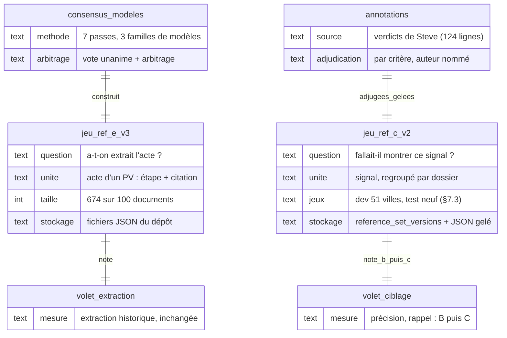

<!-- diagram:jeux-reference -->

---

## 5. Définition opérationnelle de C

La définition de C réunit les critères K1–K9 à trois états (D7), la règle de décision R′ à trois verdicts (D8), le contrat d'entrée (D17), l'unité, les définitions et les métriques (plan v2, étape 0). La mesure des chapitres 6 et 7 porte sur R′ (§5.4) ; la correspondance entre les états de D7 et les verdicts P / S / N de R′ reste à établir avec D7 (§5.1).

### 5.1 Critères K1 à K9 et règle d'asymétrie (D7)

Un signal est **dans C** si aucune exclusion **établie** ne s'applique ; il est **confirmé** si les critères requis sont étayés, **à instruire** sinon. Un verdict P calculé par R′ v1 ne vaut pas encore confirmation des trois critères : K4 est plus strict que V13 (§5.2), et la correspondance entre R′ et ces états reste à arbitrer avec D7. Les décisions de Steve (sens, classement, code de motif) servent de référence ; par critère, la référence est directe pour le sens, déduite du code de motif quand il l'implique, sinon `unknown` (§4.4).

| # | Critère | Règle de Steve | Donnée disponible (FAIT) | Donnée à produire |
|---|---|---|---|---|
| K1 | Règlement d'urbanisme (pas matières résiduelles, emprunt, gestion contractuelle, subvention, éthique) | analyse ; N-FAUX-POSITIF, N-ADMIN | `category` fourre-tout (`rezonage`, C-52) | Nature de l'acte sur le titre complet |
| K2 | Résidentiel ; agricole seulement en dézonage CPTAQ résidentiel | critère 1, R-18 | `res` par regex et instrument | Usage visé, préfixe de zone (C-55) |
| K3 | Sens ≠ purement restrictif ; mixte et indéterminé restent visibles | critère 2, R-21, C-57, C-66 | aucune | `sens` par disposition, 5 valeurs |
| K4 | Densification : plus d'unités qu'avant | critère 3, R-08 | `effet_densifiant` toujours `inconnu` | `effet_unites` avant / après (C-72) |
| K5 | De plein droit, non individuel (exclut PPCMOI, dérogation, usage conditionnel, Loi 31, CPTAQ individuelle sauf R-18) | R-06, R-09, R-10 | `instrument` | Portée du droit ; finalité CPTAQ (C-53) |
| K6 | Capacité de construire (exclut PIIA, construction, clôtures ; lotissement seulement s'il agit seul, R-22) | R-06, R-15, R-22 | instrument piia | Rattachement du lotissement au dossier |
| K7 | Décision, pas simple point d'ordre du jour ; un point retiré est mort | R-01, R-02, R-23 | nature du document source : `non vérifié` | `source_nature` et état du point (C-35) |
| K8 | Étape : avis de motion, premier projet, **second projet**, mandat d'urbaniste, résolution CPTAQ | R-05, R-23, C-82, C-68 | `etape ∈ {avis_motion, projet_reglement}` | `second_projet` ; cycle par famille d'instrument |
| K9 | Épinglé ⇒ visible quelle que soit la période | R-25, C-69 | aucune | Hors C (#760), mais C le respecte |

**Règle d'asymétrie (contraignante).** Une absence de données n'est jamais une preuve négative. Si K3 ou K4 sont `indéterminé`, le signal reste dans C, état « à instruire ». On ne masque que ce qui est établi hors critères. Par construction, C ne dégrade pas le rappel sur les cas illisibles ; son gain porte sur la précision. Deux compteurs distincts, « confirmés » et « à instruire », évitent de présenter une conservation prudente comme une opportunité avérée.

**Correspondance des états.** Confirmé et à instruire → montré ; exclu prouvé → masqué ; échec d'exécution ou entrée non lue → montré (réserve de Steve). Les écarts entre K1–K9 (D7) et R′ v1 sont listés à la fin du §5.2 et soumis à Farid avec D7. La mesure (ch. 6 et 7) porte sur R′ v1 (§5.4) ; la correspondance des trois états avec P / S / N est à établir avec D7 et D8 avant la mesure confirmatoire, et chaque campagne identifie la version de R′ effectivement gelée.

### 5.2 Règle de décision R′

**R′ v1 est figée par empreinte comme référence de travail** (2026-10-06, empreinte sha256 `e5836deb69a6165907966868e6e06fedac582c7a74741b0cd89097a6cfa501a2` du fichier `derive-verdict-rprime-v1.mjs`, hors dépôt, reportée en annexe I.2) ; son gel au sens du plan a lieu à l'étape 5, après l'arbitrage de Steve (étape 2). Elle tire un verdict P / S / N des **seuls tags** ; elle ne lit jamais le code de motif, les décisions de Steve, les colonnes de l'assistant, la passe ni la ville. **Statut : référence de travail**, pas une règle validée par Steve ; toute modification passe par D8 (revue métier de Steve et Mathieu, décision de Farid), jamais pour améliorer un score.

**Construction (FAIT).** Point de départ : R′ stricte, où chaque clause dérive d'une règle R-xx attribuée à Steve par la colonne « Source » de l'onglet « Règles de classement » (R-14 et R-16, rédigées par l'assistant, ne fondent rien). Revue par les 3 IA en deux tours (avis indépendant, puis réconciliation, chaque changement de position justifié par une R-xx citée mot pour mot) : verdict 3/3 « oui avec amendements ». Fidélité des clauses au tour 2 : 9 fidèles à 3/3 ou 2/3, X05, X08, X16 « élargissent » (3/3), X13 « restreint » (3/3), X06 et X10 « trahissent » (3/3), X14 et X15 « trahissent » (2/3). Choix d'interprétation : le « ou » de R-03 fidèle (3/3) ; l'inférence typologique de densification (R-08) et la lecture de R-22 par `rattache_a` infidèles (3/3). Seuls les amendements majoritaires sont intégrés ; la colonne « Amendement » nomme l'IA qui a formulé la proposition, pas le vote : V08 reprend Opus A2 (rejoint par Astra A11 sur le resserrement destiné à densifier), V12 garde la condition de X12 (3/3 fidèle), seule la définition de `sens` change (guide v3, tour 5 3/3).

| Clause | Règle de Steve | Condition (tags) | Verdict | Amendement |
|---|---|---|---|---|
| V01 | R-01 | `nature_source` = ordre du jour seul, ou exclusion « point d'ordre du jour » sans procès-verbal | N | Astra A1, Opus A9 |
| V02 | R-02 | point retiré | N | inchangée |
| V03 | R-06 (2), R-15 | PIIA (exclusion ou instrument) | N | inchangée |
| V04 | R-06 (2) | sans effet sur la capacité, pas d'urbanisme, ou `objet_capacite` = forme, procédure, hors urbanisme | N | Astra A7, Opus A8 |
| V05 | R-06 (1), R-09, R-10, R-11 | autorisation individuelle : PPCMOI, dérogation mineure, usage conditionnel, Loi 31 (la valeur « autre » ne déclenche plus) | N | Astra A2, Opus A7 |
| V06 | R-24, R-06 | `instrument` = transaction foncière municipale | N | 3/3 |
| V07 | R-06 (1), R-18 | demande CPTAQ individuelle hors exception : autorisation (sans exclusion), ou finalité non résidentielle, ou non résidentiel | N | Astra A4, Opus A4 |
| V08 | R-03, R-21 (1) | sens = restriction sans densification (une restriction qui densifie est traitée comme mixte) | N | Opus A2, A12 |
| V09 | R-18, R-13 | demande CPTAQ individuelle à finalité non établie | S | réserve maintenue |
| V10 | R-26 | non résidentiel | N | inchangée |
| V11 | R-22, R-06 (2) | construction → N ; lotissement : zonage associé → N, inconnu → S, absent → clauses suivantes | N ou S | Astra A5, Opus A5 |
| V12 | R-06 (2), R-13 | sens = neutre (absence d'effet sur la capacité établie par le texte) | N | Opus A3 |
| V13 | R-06, R-03, R-08, R-18, R-21 (1), R-04 | test positif commun, règlements mixtes compris : résidentiel établi, plein droit (instrument d'urbanisme, ou portée territoire / zone entière) ou exception CPTAQ à fin résidentielle, et ouverture (assouplissement, mixte ou densification) | P | Astra A6, A8, A9 ; Opus A1, A10, A11 ; Gemini A4, A5 |
| V14 | R-06 (1), R-13 | immeubles désignés sans plein droit établi | S | Opus A1, Gemini A3 |
| V15 | R-13, R-21 (2) | sinon (au moins un critère non établi, aucun en échec) | S | inchangée |

**Note sur V08, à valider en D8.** La valeur du tag et le traitement de la clause sont deux niveaux distincts : le guide v3 annote `sens` = assouplissement pour un resserrement qui sert à densifier (R-22, §4.5) ; V08 traite une restriction qui densifie comme un cas mixte. Leur correspondance est à faire valider en D8 ; les formulations du guide et de la règle seront ensuite harmonisées.

**Retirés de R′ stricte** : la clause « mandat → À surveiller » (R-25 régit l'horizon d'affichage, pas le verdict ; 2/3) ; l'inférence de densification tirée de la seule typologie ; la lecture de `rattache_a` pour le lotissement. **Non retenus** (pas de majorité) : exiger densification ≠ non dans le test positif (Gemini seul), exiger une preuve positive de capacité (Astra seul), un tag `droit_plein_droit` (désaccord), la préemption → Non pertinent (Opus seul ; question à Steve, §4.8) : V06 ne vise que les transactions foncières ; un règlement de préemption suit les clauses ordinaires (en n° 122, V04, objet hors urbanisme). **Hors R′ v1, soumis à Steve** : P1 (unifamilial seul → Non pertinent) et P3 (concordance territoriale ou refonte → Pertinent), 3/3 « proposer à Steve » ; P2 (contrainte territoriale plafonne à S) rejetée 2/3.

**Mesure sur les 121 lignes (CALCUL, exploratoire, biaisée à la hausse : lignes de mise au point).** Accord avec Steve 81/121 (R1–R7 : 70 ; R′ stricte : 80) ; Pertinent masqués 1 (n° 121, point d'ordre du jour contraire à R-01) ; rappel P∪S 57/68 = 83,8 %, précision P∪S 57/63 = 90,5 %. Détail et décomposition des écarts : §4.6.

**Écarts K1–K9 (D7) / R′ v1** : K4 (« plus d'unités qu'avant ») est plus strict que V13, qui suit le « ou » de R-03 (assouplissement ou densification) ; K6 exclut le lotissement sauf s'il agit seul, comme V11 ; K7 et K8 relèvent de `nature_source` et de l'étape, que R′ v1 ne lit que pour V01. Liste à soumettre à Farid avec D7.

### 5.3 Contrat d'entrée (D17)

- **Entrée** : le signal et le contexte d1 de sa ville (autres signaux, métadonnées des documents), reconstruit par une procédure déterministe appliquée à **tous** les cas, **coupé à la date du signal** : rien de postérieur (arbitrage de Fabien, owner, du 2026-10-05). Entrée rendue et sha256 figés.
- **Hors entrée** : les colonnes L à T du classeur (hors P, Q, R), textes de l'assistant ; les décisions et observations de Steve (colonnes B, P, Q et R : passe, sens, classement, code de motif), ses analyses et les causes d'écart ; d2 (donnée hors immo), tant qu'aucune récupération uniforme, datée et disponible en production n'existe (choix de tâche) : strate `source-gap`, cas conservés au dénominateur.
- **Conditions secondaires** : coupure à la date de revue de Steve (évaluation rétrospective, annoncée comme telle) ; signal seul, sur le dev, où `rattache_a` est `not covered`.
- Le contrat servi aux modèles et les informations autorisées à Steve pour établir la référence sont documentés séparément.

### 5.4 Unité, agrégation, définitions et métriques

- **Unité** : l'enregistrement radar (signal- ou event-), une étape par ligne (R-07 : « ne pas regrouper ») ; un dossier est une relation `rattache_a`, jamais une fusion. Dev : cas = ligne de Steve, avec la correspondance publiée cas → signaux → documents → ville. Test : annotation par signal, cas = dossier défini par le `rattache_a` de référence, fixé avant les prédictions et appliqué à tous les bras. Grappe : la ville. « 162 » désigne les nœuds distincts cités par les 121 lignes (§4.2), pas un compte du classeur.
- **Agrégation** : un cas est montré si au moins un de ses signaux l'est ; verdict de cas à 3 classes = maximum P > S > N par défaut, soumis à Steve (étape 2c du plan, §12.1).
- **Définitions** : montré = verdict dérivé P ou S, ou échec d'exécution, ou entrée non lue ; Pertinent masqué = cas P sans aucun signal montré ; précision P ∪ S = part des cas montrés classés P ou S ; bruit = cas N montrés (compte et part) ; P seul = second point de fonctionnement ; échecs au dénominateur, taux d'échec plafonné (préenregistré). Une référence manquante reste une couverture inconnue, jamais un négatif.

**Métriques.**

| Niveau | Métrique | Ce qu'elle dit |
|---|---|---|
| Par tag | précision, rappel et F1 par valeur ; κ (kappa de Cohen) entre Steve et le modèle, et entre deux annotateurs humains quand il y en a deux | Où le modèle se trompe sur les faits (sens, densification, exclusions) |
| Classification | précision, rappel et F1 de « montrer » (P ∪ S) ; **bruit** = part des N montrés ; **Pertinents perdus** = P masqués (contrainte critique : aucun) | Utilité pour Steve |
| Baseline | les mêmes métriques pour B′ passes 1, 2 et 3, recalculées sur l'instantané, sur les mêmes cas que C (§7.2) ; les valeurs du relevé (bruit de la passe 1 observée par Steve : 24/73, §2.5) restent un repère | Ce que C doit battre (D13) |

- κ : accord brut, prévalence et supports à côté ; accords avant réconciliation séparés de l'accord candidat–référence ; κ par valeur pour les exclusions (plusieurs valeurs) ; κ pondéré seulement avec ordinalité et poids justifiés.
- Graphiques : **points** précision–rappel (pas de courbe sans score continu), par configuration, référence et définition du positif, avec intervalle par ville ; comptes bruts (Pertinent masqués) à côté des ratios ; nombre de villes contributrices.

---

## 6. Tentative de détection sur le jeu actuel — résultats exploratoires (lignes exposées)

**Statut : exploratoire (lignes exposées).** Tout résultat de ce chapitre est exploratoire : aucun résultat n'est admissible pour D13. Les 121 lignes ont toutes été annotées par les 3 IA et analysées par Steve avant la campagne ; les définitions (guide v3, règles de Steve) ont été rédigées après les avoir vues. Le test aveugle exploratoire est aveugle pour l'auteur du prompt, pas vierge. Les résultats sont rapportés contre `steve_v1` (classement du relevé) et contre le **consensus IA** (R′ v1 appliquée aux tags majoritaires des 3 IA), qui est une référence machine corrélée, jamais une seconde validation ; `steve_v2` est `not run` (arbitrage de Steve à venir, §4.8).

### 6.1 Découpage homogène (arbitrage de l'owner)

- **Train** : 60 lignes, 25 villes ; **test aveugle exploratoire** : 61 lignes, 26 villes ; une ville entière d'un seul côté ; les 3 lignes exclues restent exclues (CALCUL).
- Recherche déterministe (graine `20261005`, 2 000 initialisations puis recherche locale par ville), fonction objectif et tolérances écrites avant le tirage, **rapport d'équilibre publié avant tout prompt** (comptes seulement, aucun identifiant de ligne test). Écarts de part maximaux train / test : Classement 2,4 points, Passe 2,1, Passe × Classement 3,6, sens de Steve 4,8, tags de support ≥ 10 : 9,3 (`portee = zone_entiere`) ; verdict de faisabilité : faisable (CALCUL).
- **Tags orphelins** (support < 5 ou présents d'un seul côté) : 15 valeurs de tags et 13 codes du motif IA. Fusion retenue : `typologie_max` `logement_unique → unifamiliale` (équivalence sémantique, même verdict R′). Fusions publiées mais non retenues (verdict R′ identique, équivalence sémantique partielle) : `usage_conditionnel → ppcmoi`, `autre → ppcmoi`, `sans_effet_capacite → non_urbanisme`, `consultation → projet_reglement`, `intermediaire → multilogement`, `bi_trifamiliale → intermediaire`, `serie_convergente indetermine → non`. Sans cible (R′ a un chemin propre) : `mixte`, `cptaq_individuelle`, `mandat`, `contrainte_acquisition = oui`. Codes de motif de Steve présents d'un seul côté : 10 (5 de chaque côté) ; leur mesure est `N-A` sur ce découpage.

### 6.2 Contrat d'entrée et scellement

- **Entrée** (D17) : l'enregistrement radar du signal et le contexte de sa ville **limité aux enregistrements datés au plus tard du signal** (30 plus récents), caviardage typé (`[PERSONNE]`, `[DEMANDEUR]`, `[ADRESSE]`). Contrôle mécanique sur les 121 entrées : 0 champ interdit (codes de motif, colonnes de l'assistant, classement, tags), 0 date postérieure au signal ; 6 descriptions radar portaient des étapes postérieures, retirées (CALCUL).
- **Test scellé** : AES-256-GCM, clé tenue hors dépôt (jamais affichée) ; entrées et attendus en paquets séparés ; chaque accès journalisé (54 entrées, refus compris). Écart déclaré au préenregistrement : une seule clé au lieu de deux clés et d'un gardien distinct (G5 (b)) : la séparation exécutant / scoreur est procédurale.

### 6.3 Protocole : auteur, gel, exécutants

- **Auteur de prompt** : une session neuve et isolée par version (Claude Opus 5.5, effort max, siège, répertoire vide, outils désactivés, sans MCP ni clé). Il ne reçoit que le **bac à sable** : les 60 lignes train avec le classement, le sens et le code de Steve, les définitions sans aucun compte (codes de motif, règles de Steve sans R-14 ni R-16 et sans phrase citant une ville, un règlement ou une ligne, guide des tags v2 + v3), le schéma de sortie ; aux versions 2 et 3, son prompt précédent et le **rapport train** de la version précédente. Il ne voit jamais l'analyse de Steve du 21 septembre, le cahier de juillet, le tableau de référence complet, R′ ni aucune donnée test. Chaque message est contrôlé mécaniquement avant envoi (identifiants, villes, nœuds, numéros de règlement test, sous-chaînes de 12 mots de l'analyse) : conforme pour v1, v2, v3.
- **Exécutants distincts** : `gpt-6-astra` effort low (codex exec), `claude-opus-5-5` effort low (claude -p), `gemini-3.8-flash-low` (agy sous bwrap) ; un appel par signal ; sortie : 18 tags, verdict à 3 classes, « montrer » (= Pertinent ou À surveiller), justification et citation. 18 passes (3 versions × 3 modèles × train et test) : 1 089 appels, 0 échec, 0 appel d'outil (CALCUL).
- **Gel** : chaque version est commitée dans un dépôt local puis inscrite au registre de gel **avant** tout appel, train compris : v1 `7b2353f8…` (03:10Z), v2 `104c9779…` (04:29Z), v3 `16e7cfcc…` (05:02Z), le 2026-10-06.
- **Une passe test par version gelée et par modèle**, journalisée ; aucun score test calculé avant le gel de v3 et la fin des 9 passes ; aucun retour du test vers l'auteur ; pas de v4.

**Garantie « personne ne regarde le test pour optimiser un prompt » (FAIT pour les événements consignés dans les journaux, preuves générées depuis ceux-ci).** Ordre vérifié pour chaque version : appel auteur → contrôle du message (conforme) → gel → passes train → passes test. Ouvertures des attendus test avant la fin des 9 passes : **0** ; refus journalisés : 6. Limites : le préparateur / exécutant / scoreur a lu tout le matériau, test compris, et n'écrit aucun prompt ; le contrôle des messages est mécanique (il ne détecte pas une paraphrase) ; les journaux sont locaux, non signés.

### 6.4 Résultats sur le test aveugle exploratoire (61 lignes, 26 villes)

Steve sur le test : 20 Pertinent, 15 À surveiller, 26 Non pertinent ; consensus IA : 11 / 21 / 29. Rappel et précision de « montrer à Steve » (montré = P ∪ S), en % ; IC 95 % bootstrap par villes de ±15 à ±20 points sur le rappel ; Pertinent masqués = Pertinent de Steve (ou du consensus) classés Non pertinent (CALCUL).

| Système | Rappel (Steve) | Précision (Steve) | Pertinent masqués (Steve) | Rappel (consensus IA) | Précision (consensus IA) | Pertinent masqués (consensus IA) | Accord 3 classes (Steve) |
|---|---:|---:|---:|---:|---:|---:|---:|
| Astra v1 | 68,6 | 96,0 | 3 | 78,1 | 100,0 | 4 | 67,2 |
| Opus v1 | 74,3 | 96,3 | 2 | 84,4 | 100,0 | 3 | 70,5 |
| Gemini v1 | 77,1 | 93,1 | 1 | 87,5 | 96,6 | 2 | 68,9 |
| Astra v2 | 65,7 | 95,8 | 4 | 75,0 | 100,0 | 4 | 65,6 |
| Opus v2 | 74,3 | 96,3 | 2 | 84,4 | 100,0 | 3 | 68,9 |
| Gemini v2 | 77,1 | 93,1 | 1 | 87,5 | 96,6 | 2 | 70,5 |
| Astra v3 | 62,9 | 95,7 | 4 | 71,9 | 100,0 | 4 | 65,6 |
| Opus v3 | 74,3 | 96,3 | 2 | 84,4 | 100,0 | 3 | 70,5 |
| Gemini v3 | 80,0 | 93,3 | 1 | 87,5 | 93,3 | 2 | 68,9 |
| B′ passe 1 (5 filtres) | 74,3 | 70,3 | 2 | 75,0 | 64,9 | 3 | — |
| B′ passe 2 (sans Précoce) | 94,3 | 62,3 | 0 | 96,9 | 58,5 | 0 | — |
| B′ passe 3 (aucun filtre) | 100,0 | 57,4 | 0 | 100,0 | 52,5 | 0 | — |

B′ = passe **observée** par Steve (colonne B), flag `observed-pass-not-recomputed` : aucun recalcul des filtres hors production n'était disponible.

<!-- chart:pr-test-steve -->

<!-- chart:pr-test-consensus -->

**Détection des tags (CALCUL, test, accord moyen % / κ moyen sur les 18 tags, contre la majorité des 3 IA).**

| Version | Astra | Opus | Gemini |
|---|---|---|---|
| v1 | 87,6 / 0,68 | 87,0 / 0,68 | 87,4 / 0,65 |
| v2 | 91,1 / 0,69 | 91,2 / 0,69 | 90,2 / 0,72 |
| v3 | 90,5 / 0,68 | 90,9 / 0,69 | 90,3 / 0,72 |

Tags faibles en κ malgré un accord élevé (classes rares) : `serie_convergente` (κ 0,00), `refonte_complete`, `rattache_a`, `zonage_associe`.

**Train (indicatif, biaisé : l'auteur a vu ces lignes et reçu le rapport train).** Accord 3 classes avec Steve : 96,7 à 100 % pour les trois versions et les trois modèles ; accord moyen des tags : 85–87 % (v1), 95–97 % (v2), 97–98 % (v3).

### 6.5 Lecture (JUGEMENT, exploratoire)

- Les 9 configurations C sont **plus précises** que B′ à toutes les passes (93 à 96 % contre 57 à 70 % face à Steve) et ont un rappel **du même ordre que B′ passe 1** (63 à 80 % contre 74 %) ; elles masquent 1 à 4 Pertinent de Steve sur 20 (B′ passe 1 : 2). Aucune n'atteint « zéro Pertinent masqué » (D13).
- **Les itérations n'apportent pas d'amélioration systématique sur le test** : sur « montrer » (rappel, précision, Pertinent masqués), Opus est identique en v1, v2, v3, Gemini gagne une ligne de rappel en v3 et Astra en perd une à chaque version ; l'accord 3 classes varie d'au plus une ligne par modèle (65,6 à 70,5 %). Le train atteint 97–100 % : l'écart d'environ 30 points entre train et test indique un **sur-ajustement des consignes du prompt au train**. Les tags gagnent 3 à 4 points de v1 à v2, puis plafonnent.
- La précision de 100 % d'Astra et d'Opus contre le consensus IA (93 à 97 % pour Gemini) reflète en partie la parenté des références (mêmes familles de modèles, mêmes définitions) : c'est un accord avec une référence corrélée.
- **limites du signal seul** (aucun plafond établi) : sur les 121 lignes, 12 des 40 écarts de R′ v1 reposent sur une donnée absente du signal (§4.6) ; un prompt ne peut pas retrouver les 9 qui relèvent d'une donnée hors immo (d2) ; les 3 qui relèvent d'une donnée ailleurs dans immo (d1) ne lui sont accessibles que si elle figure dans le contexte de ville fourni (§6.2), ce qui n'est pas vérifié.
- **Candidat** : aucun n'est retenu. La règle de sélection préenregistrée (annexe I.1 : Pertinent masqués ≤ seuil, puis précision P ∪ S) ne s'applique qu'au test neuf ; sur ce test exploratoire, Gemini v1, v2 et v3 ont le moins de Pertinent masqués (1), avec les trois précisions les plus basses des neuf (93,1 à 93,3 %). Aucune décision ne s'en déduit.

Fichiers (hors dépôt, empreintes en annexe I.2) : rapport d'équilibre, protocole du test, garantie, agrégats et graphiques de la campagne (`ch6/`).

---

## 7. Mesure confirmatoire sur test neuf

**Statut : `not run`.** Aucune étape n'est exécutée et l'étape 0 du plan (préenregistrement) n'est pas ratifiée. Les résultats primaire, secondaire et exploratoire de la passe test (R3 à R6 dans la structure du plan) restent `not run` jusqu'à la passe. Détail du préenregistrement : annexe I.1.

### 7.1 Préenregistrement (résumé de l'étape 0)

- Ratifié par Fabien (owner) avant toute graine, annotation neuve ou appel de modèle évalué ; le consensus des 3 IA, dont les familles sont évaluées, ne suffit pas.
- Sources figées (instantané du classeur, sha256 par onglet), registre d'exposition (toute ville exposée sort du vivier test), unité, agrégation et définitions du §5.4.
- Règle de sélection hors test : Pertinent masqués sous le seuil, puis précision P ∪ S maximale, puis version la plus récente, puis coût. Le candidat est un couple prompt–modèle et sa politique d'exécution.
- Configurations sur le test : le candidat avec les 3 modèles, obligatoire ; d'autres configurations figées peuvent passer, déclarées et hachées avant l'ouverture, en exploratoire, sans substitution possible du candidat.
- Clause : toute modification de R′, du schéma, du contrat d'entrée, de l'agrégation ou de l'évaluateur après l'ouverture rend le résultat exploratoire ; changer de candidat impose un nouveau test.
- Dimensionnement calculé après les itérations sur le dev, inscrit dans track avant le tirage ; faisabilité comptée avant ratification sur le vivier éligible (villes hors registre).

### 7.2 Analyse primaire et seuil (D13)

- **Analyse primaire unique**, intersection-union : `pass` si (1) et (2) passent ; `fail` si l'un échoue ou si le taux d'échec dépasse le plafond ; `indeterminate` sinon. (2) ne compte qu'après le `pass` de (1).
- **(1) Pertinent masqués** : k sur n ; borne supérieure exacte unilatérale à 95 % (Clopper-Pearson) sur n effectif (pondérations, effet de grappe ville). `pass` si k ≤ k_max et borne < X ; `fail` si k > k_max. Proposition de Fabien (owner) : k_max = 0 (D13). Zéro observé seul ne démontre pas un faible risque (P(0 | taux de 5 %, n = 20) ≈ 36 %).
- **(2) Précision P ∪ S** : différence entre le candidat et B′ passe 1, sur les mêmes cas ; intervalle bilatéral à 95 % par bootstrap des villes (au moins 10 000 tirages). `pass` si la borne inférieure est positive, `fail` si la borne supérieure est négative.
- **Caractéristique opératoire (CALCUL binomial a priori, sous l'hypothèse d'un taux réel de 2 % et de cas indépendants ; valeurs reprises des relecteurs, non recalculées indépendamment, annexe IV)** : avec k_max = 0 et un taux réel de Pertinent masqués de 2 %, P(pass) ≈ 0,56 à 29 Pertinent pour X = 10 % et ≈ 0,30 à 59 Pertinent pour X = 5 %. Repères de taille : au moins 29 Pertinent (borne < 10 % à 0 observé) ou 59 (< 5 %), avant correction de l'effet de grappe ; une vingtaine de Pertinent ne donneraient que des estimations peu précises (0 sur 20 laisse une borne de 13,9 %).
- La part P ∪ S de la passe 1 observée par Steve (49/73 = 67,1 %, relevé, autre population) est rapportée, jamais utilisée comme comparateur ; « B′ recalculé » désigne seulement la mesure sur l'instantané, sur les mêmes cas.
- Famille secondaire (Holm) : le statut primaire des deux autres modèles avec le même prompt ; variante à figer à la ratification.

### 7.3 Échantillonnage, annotation et scellement (étape 8)

- Test neuf à deux degrés dans le vivier éligible (villes hors registre d'exposition) : villes, puis documents tirés à probabilités connues, stratifiés sur l'état de B′ passe 1 ; graine et tirage engagés dans track avant toute annotation.
- Steve annote selon le guide gelé (`steve_test`), avec les sources consultées par cas, dans une interface sans indicateur B′ ; un second annotateur humain (`human2_test`) annote au moins 50 cas, aveugle à Steve, à B′ et aux tags IA, tirés après l'annotation de Steve et avant toute prédiction (ressource `unknown`, D10) ; sans lui, mention `single-human-annotator`. Un tel résultat peut être publié ; son admissibilité pour une bascule, alors que G4 (a) exige une référence `human_adjudicated` pour toute promotion, est à arbitrer (D10, D13).
- Scellement G5 (b) : deux paquets chiffrés (entrées, attendus), deux clés, un gardien distinct de l'auteur et de l'exécutant ; engagement de contenu dans track.

### 7.4 Passe non adaptative (étape 9)

- Une passe par configuration ; reprises automatiques préenregistrées ; toutes les tentatives conservées ; tous les bras dans une fenêtre courte déclarée.
- Rôles en liste blanche (glossaire) ; chaque appel isolé : répertoire vide ne contenant que l'entrée, HOME neuf, aucune configuration MCP, aucun droit de lecture sur le dépôt, le stockage scellé et les tables immo.
- B′ passes 1, 2 et 3 recalculées sur l'instantané du corpus ; B′ comparé uniquement en montré / masqué. La population couverte est celle du tirage du §7.3 (documents tirés à probabilités connues dans le vivier éligible, stratifiés sur l'état de B′ passe 1, montré ou masqué). La mention `pool-limited-to-shown-items` reste sur les résultats historiques (§2.5) ; elle ne s'applique au test neuf que si son tirage se limite aux unités montrées, avec une justification propre (`not run`).
- Aucun retour vers l'auteur ; aucune version 4 sur ce test.

### 7.5 Résultats

`not run`.

---

## 8. Exposition A/B/C et benchmark

### 8.1 Affichage A/B/C (D12)

| Profil | Rôle | Conservation |
|---|---|---|
| A | Référence historique (`z/m/p`), calculée côté serveur | Gelée ; pas de retour silencieux à A |
| B | Vivier actuel, défaut pendant la recette de C | Contrats B′ conservés ; ce que C retire ne disparaît pas de B |
| C | Ciblage Steve, versionné, calculé côté serveur sur le même inventaire | États confirmé / à instruire / exclu prouvé, chaque exclusion expliquée |

**Divergence non tranchée par les sources (D12).**
- Auteur B : C en shadow, comparée à B sur le jeu de référence, aperçu UAT par un paramètre non documenté, puis **remplacement** de B au seuil. Argument : #787 demande de ne pas réintroduire de choix entre plusieurs viviers, et Steve veut une interface plus simple.
- Auteur A : B par défaut, C expérimental, **sélecteur et mode comparatif A/B/C**, paramètre dédié du type `filter.targeting=a|b|c` (et non `mode`, déjà pris par le parcours geo).
- Vérification : la phrase de #787 figure dans l'item 4 du comportement attendu (grammaire d'URL), règles validées par l'owner le 1er octobre ; elle ne figure pas dans la liste « Décisions du propriétaire ». Le brief de ce dossier parle d'un « mécanisme A/B d'affichage étendu en C ». Les deux lectures sont défendables ; Farid tranche, après consultation de Steve, Mathieu et Fabien.
- **Recommandation consolidée** : C en shadow, comparaison A/B/C dans un mode réservé à l'UAT et aux administrateurs, B par défaut, aucun choix de vivier exposé aux utilisateurs courants ; bascule au seuil D13. Si Farid veut un sélecteur visible, la variante de l'auteur A s'applique, avec URL complète conforme à #787.

**Dates orthogonales au ciblage.** Date documentaire, de collecte, de l'acte, du retour et de l'import restent distinctes. C consomme les dates de #788 via la politique de #786, sans relancer de modèle de langage (LLM) à l'affichage. Un dossier épinglé hors période figure dans une liste de suivi, pas dans un total limité à la période. Les comparaisons A/B/C figent l'horloge des périodes relatives.

La scène ci-dessous montre, en haut, ce que voient les utilisateurs et où chaque élément vit (écran, backend, base) ; en bas, l'évaluation hors ligne jusqu'à la décision de bascule.

<!-- scene:affichage-abc -->

### 8.2 Benchmark #782 : volet ciblage (D11)

| Mesure | Règle | Pourquoi |
|---|---|---|
| Extraction historique | Même jeu de référence E, même corpus, même méthode ; refus comptés en manqués | Comparabilité ; détecter une perte d'extraction |
| Précision et rappel post-filtrage de B, puis de C | Jeu de référence C, même snapshot | Sens concret du « rappel max post-filtrage » de #782 |
| Rappel critique | Aucun Pertinent masqué, en particulier mixtes et indéterminés | Réserve d'asymétrie de Steve |
| Couverture de qualification | Unités au verdict C étayé / unités candidates ; indéterminés publiés à part | Éviter un gain obtenu par abstention |
| Effet B → C | Entrants, sortants, conservés, nommés avec raison | Expliquer au lieu de proclamer |
| Parité d'affichage | Mêmes ensembles API / rail / carte / panneau, même profil, mêmes dates | Défaut de classe relevé dans #786 |
| Coût utile | Coût, latence, refus par opportunité C retrouvée | Aujourd'hui `N-A` |

Les tableaux extraction et ciblage restent séparés, sans fusion des F1. Pont possible : id Steve → nœud → `docRefs.docSha` → unités E, seulement pour les 100 documents du corpus. Toute modification du prompt gelé `immo-pv-extraction-v9` pour produire sens, effet et portée rompt la comparabilité v10/v11 : nouvelle version du contrat, décision dédiée (D11). Aucun changement de modèle principal n'est recommandé sur la seule base des retours de Steve.

### 8.3 Conditions de bascule

C remplace B à l'écran seulement si le seuil D13 est franchi sur le test neuf (§7.2) et que Farid le décide sur la mesure ; B reste le défaut jusque-là, et ce que C retire ne disparaît pas de B. Retour arrière : désactiver C et revenir à B (ch. 11).

---

## 9. Capitalisation : données et première mise en œuvre

Condensé de la modélisation et de la première mise en œuvre : ce qui sert aux décisions D1 à D6, D14, D15 et G1 à G8. Le modèle physique complet (état initial, rattachement des cibles, tableau des écarts), les contraintes détaillées, les schémas par option de D2 et D3 et le détail de la migration UI sont en annexe III.

### 9.1 Vision de l'owner et besoins de Steve

On part de ce que Steve a produit et de ce qu'il demande, pas des tables existantes. Les tables `prospect_marks` et `prospect_notes` (annexe III.2) servent au travail de l'équipe sur les lots : `prospect_marks` reste inchangée ; `prospect_notes` reçoit seulement le correctif B0 (ancre texte, comparaison auteur, annexe III.1). Pour les retours de Steve, elles ne sont ni étendues ni réutilisées : les étendre mélangerait deux usages sans couvrir ses besoins ; les retours structurés sont portés par le modèle cible du §9.2.

**Vision de l'owner (Fabien).** Steve poursuit son travail d'annotation, de validation et de triage **dans l'application**, avec son propre compte. L'application porte des **boucles de validation** : Steve annote, l'équipe ou le PO valide ou conteste, la décision est gardée et chaque changement crée une nouvelle version. Les annotations sont donc des **données d'application vivantes en Postgres**, pas seulement un import. Le jeu de référence C est **stocké** (versions gelées tirées des annotations validées), mais l'**évaluation et l'optimisation des prompts d'engram se font hors ligne**, jamais dans l'application.

**Architecture des données : cinq ensembles.** Chacun est marqué par son **propriétaire** (immo, sentropic, engram, track), **existe** ou **proposé** (titre du couloir, bordure pleine ou en tirets) et **en ligne** (zone du haut) ou **hors ligne** (bande du bas) ; les flèches disent qui alimente qui.

```mermaid
flowchart LR
  subgraph U["Utilisateurs de l'application"]
    STV["Steve · son compte"]
    EQP["Équipe et PO"]
  end
  subgraph DA["(a) Données de Steve · immo · proposé"]
    XLS["Classeur du 21 sept."]
    SRC["Import unique, tel quel"]
  end
  subgraph DB["(b) Annotations · sentropic · proposé"]
    ANN["Annotations de Steve"]
    VAL["Validations équipe / PO"]
    HIS["Historique versionné"]
  end
  subgraph DC["(c) Graphe · immo · existe"]
    S3G["S3 · latest.json"]
    GRN["graph_nodes"]
  end
  subgraph DD["(d) Jeu de référence · engram · proposé"]
    ORC["Jeu de référence C · versions gelées"]
    ORE["Jeu de référence E v3 · fichiers"]
  end
  subgraph EV["(e) Évaluation (engram) et décisions (track) · hors ligne"]
    BEN["Benchmark #782"]
    ENG["Optimisation des prompts"]
    TRK["Décisions · track"]
  end
  XLS -->|"importé une fois"| SRC
  SRC -->|"pré-remplit"| ANN
  STV -->|"annote, trie"| ANN
  EQP -->|"valide ou conteste"| VAL
  ANN -->|"à valider"| VAL
  VAL -->|"décision gardée"| HIS
  ANN -.->|"ville + id texte"| GRN
  S3G -->|"projection"| GRN
  HIS -->|"validées, gelées"| ORC
  ORC -->|"volet ciblage"| BEN
  ORE -->|"volet extraction"| BEN
  BEN -->|"résultats"| ENG
  ENG -->|"candidat figé"| TRK
  TRK -.->|"promotion du prompt"| S3G
```

<!-- lanes:architecture-donnees -->

Où chaque table nouvelle se rattache à l'existant (signal, ville, PV, zone, lot) : annexe III.1 (état actuel, rattachement des cibles, tableau des écarts) et scène `modele-donnees` (§9.2).

**Besoins de Steve → données nécessaires.**

| # | Besoin (source) | Donnée nécessaire | Objet (propriétaire) |
|---|---|---|---|
| 1 | Garder son verdict sur chaque signal : Pertinent, À surveiller, Non pertinent, avec motif, sens, passe (feuille Triage, 124 lignes) | classement, code de motif, sens, passe | `annotation_revisions` (sentropic) |
| 2 | Garder sans perte ses 121 contrôles d'exclusion, 77 constats et 26 règles (autres feuilles) | feuille, ligne, référence (#, C-xx, R-xx), toutes les cellules brutes | `annotation_revisions` (sentropic) |
| 3 | Relier ses 28 codes de motif à ses critères et exclusions (table de dérivation à établir, `not run`, relue par Steve : D7, D8, D16) | code → critère K1 à K9 ou exclusion, règle R-xx | schéma d'étiquettes du profil (immo) |
| 4 | Une ligne vise 1 à N objets : signal, ville, règlement (la #7 nomme deux événements ; une ligne agrégée vise une ville) | type d'objet, ville, id texte, état du rattachement, ce que Steve a vu | `annotation_targets` (sentropic) |
| 5 | Savoir d'où vient chaque verdict | fichier (sha256), nom, révision, auteur, importateur ; feuille et ligne | `annotation_sources`, `annotation_revisions` (sentropic) |
| 6 | Recevoir les révisions et les 52 villes suivantes sans rien écraser | nouveau fichier ; ligne qui en remplace une autre ; statut active, retirée, remplacée | `annotation_sources`, `annotation_revisions` (sentropic) |
| 7 | Voir son avis sur le signal dans l'outil : badge, section « Retour du relevé de Steve » (décision de Steve et texte de l'assistant séparés), compteurs (U1) | lecture par ville + id du signal | `annotation_targets` → `annotation_revisions` (sentropic) |
| 8 | Archiver, classer, lier, épingler (#760) | états durables par utilisateur | hors du périmètre, voir plus bas |
| 9 | Jeu de référence C : un jeu gelé, versionné, avec un développement (les 121 lignes, 51 villes) et un test neuf (villes hors registre d'exposition), D10 | liste des annotations validées retenues, partition, empreinte du fichier gelé | `ReferenceSetVersion` (engram) |
| 10 | Poursuivre son annotation, sa validation et son triage dans l'application (vision owner) | saisie avec son propre compte, origine « saisie », nouvelle version à chaque changement | `annotation_revisions` (sentropic), `account_users` (immo) |
| 11 | Boucle de validation : l'équipe ou le PO valide ou conteste, la décision est gardée | décideur (compte), décision, motif, date ; statut courant de l'annotation | `annotation_validations` (sentropic) |

**Table de dérivation (besoin 3).** Elle relie chaque code de motif à un critère K1–K9 ou à une exclusion, à la règle R-xx qui le justifie et à son classement. Elle n'est pas jointe à ce dossier : `not run`, à établir avant sa relecture par Steve (D7, D16). Elle explique les codes et sert à déduire les tags de référence quand le code l'implique (§4.4, §5.1) ; R′ ne la lit jamais (§5.2).

### 9.2 Modèle cible par propriétaire

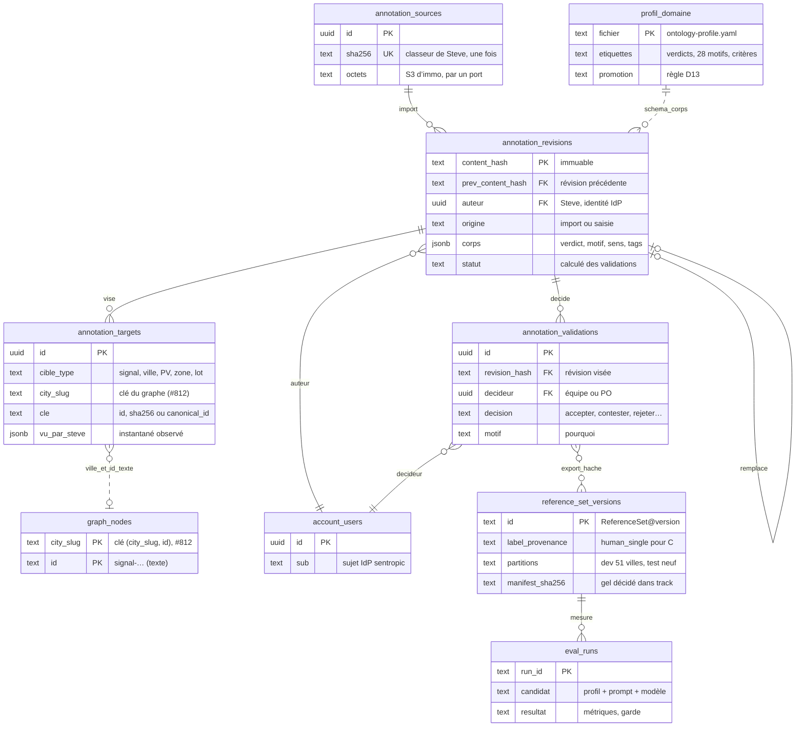

<!-- diagram:modele-minimal -->

**Sort des six tables du brouillon** (convergence 4/4 des sièges, SYNTHESE.md, §6.1) : immo ne les construit pas si G7 (b) et D2 (a) sont retenues (recommandation, à décider).

| Table immo du brouillon | Devient | Propriétaire |
|---|---|---|
| `retours_fichiers` | `annotation_sources` | sentropic ; parseur du classeur : immo |
| `annotations` | `annotation_revisions` (corps adressés par contenu ; `remplace_id` → `prev_content_hash`) | sentropic |
| `validations` | `annotation_validations`, liées au hash de la révision | sentropic |
| `annotation_cibles` | `annotation_targets` + résolutions ajoutées sans écraser | sentropic ; clé de la cible : immo |
| `motifs` | schéma d'étiquettes (codebook) du profil | contenu : immo ; format : engram |
| `reference_set_versions` | `ReferenceSetVersion` + décision de gel (track) + artefact privé | engram + track |

Ce qui reste propre à immo : le profil de domaine, le parseur du classeur, le résolveur d'ancres (signal, ville, PV, zone, lot), les écrans (panneau, rail, U1, U2), les décisions produit et les prompts candidats.

**Ce qui reste hors du périmètre, volontairement.**
- Pas de fil de discussion libre : la boucle de validation passe par des décisions (validée, contestée) avec un motif ; un fil de commentaires sentropic pourra s'ajouter avec le port complet (D4).
- Pas d'états archiver, classer, lier, épingler (#760) : ils attendent la maquette de Steve et Mathieu (lot L7) ; une table dédiée s'ajoutera alors sans toucher à celles-ci.
- Pas de clé étrangère vers le graphe, pas de suppression physique : un retrait est un statut.
- Pas d'évaluation dans l'application : la prédiction C, les mesures et l'optimisation des prompts vivent hors ligne (ensemble e) ; la classification du radar se recalcule.

**Clé d'une annotation importée** : fichier + feuille + référence de Steve (#, C-xx, R-xx) ; le numéro « # » peut changer d'une révision à l'autre, il reste lisible dans `ref` et la nouvelle version remplace l'ancienne. Une annotation saisie dans l'application n'a pas de fichier : son origine est « saisie ».

Les six tables immo de la version précédente restent décrites comme option b de D2 (§10.2), avec leur schéma en annexe III.5.

**Stockage réel et propriétaires.** Dans la scène ci-dessous, les **colonnes** sont le **stockage réel** (Postgres d'immo, S3 d'immo, service geo, dépôt git d'immo) et le **badge** de chaque boîte est le **propriétaire du schéma ou du code** (immo, engram, sentropic, track, geo) ; vert : nouveau, orange : modifié, gris : inchangé, rien n'est supprimé.

- **engram = moteur de détection et d'évaluation.** Aujourd'hui, la librairie `@sentropic/graphify` 0.18.0 (futur `@sentropic/engram`) est **exécutée dans le job immo** `radar-refresh-pv` (CronJob, image `ghcr.io/rhanka/radar-api`) ; elle produit le graphe, que **le job immo écrit** dans `graph/<ville>/latest.json` sur le **S3 d'immo** (bucket `radar-immobilier-docs`), puis **projette** dans `graph_nodes` / `graph_edges` du **Postgres d'immo**. Format et code du graphe : engram ; exécution : job immo (demain : DAG geo, #699) ; stockage : S3 et Postgres d'immo. L'évaluation (jeu de référence, runs) est l'autre moitié d'engram, hors ligne.
- **sentropic = propriétaire du modèle d'annotation** (paquet `@sentropic/annotations`), mais ses tables `annotation_*` sont **installées et stockées dans le Postgres d'immo**, par les migrations du paquet ; les octets du classeur vont dans le **S3 d'immo**, par le port du paquet.
- **Jeux de référence et runs** : stockage objet privé de l'hôte derrière un port du paquet (SYNTHESE.md, §3.3), donc un **préfixe privé du S3 d'immo** (nom à fixer, `non vérifié`) ; manifestes et empreintes publics dans le dépôt. **Option, pas un fait** : SYNTHESE.md évoque aussi un port de stockage commun ; un stockage propre à engram n'est pas recommandé.
- **track** : les décisions de gel et de promotion sont des événements dans les fichiers `.track/` du dépôt d'immo, attestés par h2a.

Si G7 (b) et D2 (a) sont retenues (recommandation, à décider), immo ne construit pas de tables d'annotation : les annotations vivent dans les tables du paquet générique `@sentropic/annotations`, installées dans le Postgres d'immo ; le jeu de référence et les runs appartiennent à engram ; les décisions de gel et de promotion à track ; immo apporte son profil de domaine et ses données.

<!-- scene:modele-donnees -->

### 9.3 Exigences et contraintes établies

| # | Exigence | Source |
|---|---|---|
| E1 | Stocker toutes les cellules de toutes les feuilles, sans perte ni troncature | brief, #784 |
| E2 | Rattacher chaque retour à 1 à N éléments (signal, événement, ville, MRC, règlement, zone, lot, document, dossier) | brief, spec 2026-08-12 |
| E3 | Être conforme au contrat `comments`, sans système parallèle | spec 2026-08-12, COLLAB |
| E4 | Ne jamais détruire une annotation lors d'une ré-ingestion de sa cible | contrat d'ancre §3.1 |
| E5 | Provenance : fichier, sha256, feuille, ligne, révision, auteur, importateur, version du parseur | jeu de référence |
| E6 | Import idempotent ; nouvelles révisions (52 villes) sans doublon, avec historique | analyse |
| E7 | Ne perdre aucune ligne non rattachable | brief |
| E8 | Coexistence de plusieurs jeux d'étiquettes (D9) | brief |
| E9 | Données personnelles (C-79) ; tombstone et rétention (O1) | Loi 25 (protection des renseignements personnels, Québec), COLLAB |

**Contraintes établies (FAIT ; détail en annexe III.3).**
- **Identité des objets** : les signaux sont des nœuds `graph_nodes` à identifiant texte, dont la stabilité n'est **pas garantie** (`upsertGraphAtomic` supprime les nœuds orphelins d'une ville) ; villes, zones, lots et documents ont des clés stables ; la clé de règlement est peu fiable (C-05, C-26).
- **Défaut 1** : l'UI envoie l'identifiant texte du signal, l'API exige un UUID de l'ancienne table `signals` (`prospect-marks.ts:107`), que plus aucun code de `main` n'alimente : à corriger par B0 (incompatibilité constatée dans le code ; effet en production `non vérifié`, annexe III.3). **Défaut 2** : comparaison de l'auteur (`account_users.id` contre sujet IdP). **Défaut 3** : badge de comptage rempli seulement à l'ouverture de la fiche.
- **Taille** : une cellule du classeur atteint 17 114 caractères, au-delà du corps de note de 10 000.
- **Contrat sentropic** (`@sentropic/comments` 0.2.0) : les cibles `record` conviennent sans changement du paquet ; la suppression est physique, en écart avec la décision owner O1 (tombstone et rétention) ; le routeur Hono a une énumération fermée ; aucune référence au paquet dans Radar aujourd'hui.

### 9.4 Ancres et import idempotent

| Objet | Ancre proposée | Vérification avant confirmation |
|---|---|---|
| Signal ou événement du graphe | `radar.signal:<ville>:<id>` + génération du graphe + instantané `observed` | Id exact présent dans un snapshot, ville, type et source concordants ; un préfixe seul n'est pas une preuve. |
| Document | sha256 + page + extrait | Un préfixe d'empreinte tronqué n'identifie pas un document. |
| Municipalité | slug du registre + alias source | Homonymes et suffixes MRC (C-81) ; pas de slug fabriqué par retrait des accents. |
| Zone | ville + code canonique + millésime | Pas de réancrage silencieux d'une zone renumérotée. |
| Lot | ville + numéro cadastral normalisé | Adresse civique ≠ numéro cadastral. |
| Dossier réglementaire | identité locale + liens vers règlement et étapes | Ville + numéro ne suffit pas (C-26) ; pas de fusion automatique des étapes. |
| Retour transversal, groupe non résolu | `artifact` = source + `sectionKey` de ligne | Ne jamais fabriquer une cible métier pour éliminer un reliquat. |

Mesures lexicales des identifiants candidats : annexe III.4. Ordre de résolution : id exact + ville → identité documentaire + étape → dossier, zone ou lot validé → file de revue pour les ambiguïtés. Aucun rapprochement approximatif n'est confirmé sans trace humaine ou règle déterministe.

**Import idempotent.**

1. **Script Node/TS** (exceljs en dépendance de développement d'`api/`), **dry-run par défaut**, via une cible Make. Rapport : comptes par feuille et par statut de résolution, écarts avec les comptes déclarés (124/146, 51/103, 121, 77, 26, 28).
2. **Idempotence** : un sha256 déjà importé ne produit aucune écriture ; une nouvelle révision ajoute ses lignes, chacune reliée par `prev_content_hash` à la révision qu'elle remplace (même fichier d'origine, feuille et référence) ; une ligne absente de la révision suivante passe au statut « retirée », jamais supprimée ; une transaction par fichier ; deux imports concurrents des mêmes octets convergent sans doublon ni double notification.
3. **Lignes non rattachables** : jamais rejetées. Une cible « ville » toujours créée depuis la colonne Ville ; id abrégé résolu par ville + suffixe, sinon « ambiguë » ou « non résolue » ; ligne agrégée → cible « ville » ; id complet absent du graphe → « disparue », instantané `vu_par_steve` affichable.
4. **Mesure de résolution avant tout affichage** : part des identifiants encore présents dans `graph_nodes` d'une préprod restaurée. C'est un critère de sortie du lot L1 immo.
5. **Qualité à traiter dès l'import (FAIT)** : 4 dates partielles ou composites sur 124 ; 7 états `firm` hors liste de validation ; 66 « Procès-verbal » dans la colonne Type, hors liste d'étapes ; 29 initiateurs et 46 portées hors listes déroulantes ; 40 libellés de MRC non normalisés (dériver la MRC du registre) ; la Synthèse ne compte que 95 initiateurs normalisés sur 124. Toutes les cellules sont conservées ; les recomptages sont publiés avec leurs règles et une catégorie explicite pour les valeurs non reconnues.
6. **Données personnelles** : détection sur les verbatims, `pii_status` renseigné ; affichage selon D6.
7. **Retrait** : désactiver la publication d'un lot sans effacer source, évaluations ni réponses ultérieures des utilisateurs.
8. **Exécution en prod** : acte owner distinct, par un job de migration et d'import sur l'image Node existante de l'API ; aucun job Python.

### 9.5 Convergence sentropic + engram : qui porte quoi

FAIT pour la source : synthèse convergée de quatre sièges (engram et sentropic, deux modèles chacun), `graphify/.graphify/scratch/design/learning-loop/SYNTHESE.md`, 2026-10-04, avec revue sentropic intégrée. **Aucune décision n'y est prise** : ses huit décisions sont reprises ici en G1 à G8, décidées par Fabien.

- **Terminologie (G1)** : « oracle » est abandonné comme nom d'objet ; on dit **jeu de référence** (`ReferenceSet`), **version figée** (`ReferenceSetVersion`), **élément de référence** (`ReferenceItem`), partitions `dev` et `test` scellée ; la provenance est l'attribut `label_provenance` (`human_single`, `human_adjudicated`, `model_consensus`, `mixed`) : E = `model_consensus` (« silver ») ; le pilote C = `human_single` (un seul annotateur), « gold » en construction.
- **Répartition (G2)** : **sentropic porte l'humain** (identités par l'IdP partagé déjà utilisé par immo, commentaires, annotations versionnées, validations, adjudications, export haché) dans un paquet frère `@sentropic/annotations` ; **engram porte la mesure** (jeu de référence figé, split dev / test aveugle, sceau, runs, évaluateurs pluggables, statistiques, garde de promotion) ; **track porte les décisions** de gel et de promotion, attestées par h2a ; **le domaine** apporte un profil et des données.
- **Deux interfaces seulement** : un instantané haché des annotations validées, de sentropic vers engram (engram ne lit jamais la base vivante ; aucune partition dans l'export) ; un enregistrement de promotion qui lie la décision track aux empreintes du candidat.
- **Immo = profil + données** : profil `radar/ontology/ontology-profile.yaml` complété (schéma d'étiquettes C, évaluateurs `classification`, `span`, `typed_occurrence`, règle D13, unité de groupe = municipalité) ; données : PV, E, C, classeur de Steve, registre des municipalités. Immo ne construit pas ses six tables si G7 (b) et D2 (a) sont retenues (recommandation, à décider).
- **Séquencement (G7)**, lots génériques notés G-L0 à G-L4 pour les distinguer des lots immo (§9.6) : G-L0 contrats ; G-L1 parité des évaluateurs + un diagramme BPMN en recette ; G-L2 `@sentropic/annotations` et import, consommé dans sentropic ; G-L3 jeu de référence C v2 (selon SYNTHESE.md : 51 villes en développement, 52 en test aveugle ; remplacé par D10 réécrite : test neuf sur des villes hors registre d'exposition, §7.3) ; G-L4 boucle BPMN. Le pilote C actuel devient `v0`, `flags: [exploratory, single-annotator]`, non admissible pour D13.
- **Rôles à désigner par Fabien (owner)** : responsable de la politique d'annotation, validateurs et arbitres, responsable du gel (Fabien proposé), gardien du test aveugle, décideur de promotion (le PRINCIPAL, sous veto de CONTROL-RECETTE).
- **Points ouverts de la synthèse** (§9 de la source) : refs lues différentes entre sièges ; port de stockage commun à décider ; consommation réelle exigée côté sentropic ; parseur de profil engram qui ignore les blocs inconnus ; profils sans registre ; petits effectifs (puissance faible) ; propriété du code BPMN d2d `non vérifié` ; chiffrage `non vérifié`.

**Articulation avec les décisions immo.** D2 devient « adoption du générique » (options revues). D4 est modifiée : les annotations relèvent de G2 et G3, D4 ne porte plus que sur les commentaires de l'équipe. D3, D5, D11 et D15 gardent leurs options. D9 est à décider (clôture recommandée) ; D10 et D13 sont réécrites (§10.1). Chaque fiche indique ses dépendances envers G1 à G7 ; G8 n'a pas d'effet direct sur immo (annexe II). Aucune décision immo n'est sans objet.

#### Modèle engram vérifié (état au commit `c96fc01e`)

Références : engram = dépôt `graphify` au commit `c96fc01e` (paquet `@sentropic/engram` 0.19.1, `package.json@c96fc01e:2-3`) ; immo = `radar-immobilier` `origin/main` `782d20c9` ; conception = `graphify/.graphify/scratch/design/learning-loop/SYNTHESE.md` (fichier non suivi par git, ignoré par `.gitignore@c96fc01e:60`, daté du 2026-10-04). S3 non listé : la présence réelle des objets est `unverified`. Seul le code qui écrit les clés a été lu.

**Ce qui existe.** Le moteur d'engram tourne déjà dans immo comme bibliothèque : `@sentropic/graphify` 0.18.0 (`api/package.json@782d20c9:26`), utilisé pour `mergeExtractions` et pour des types (`api/src/services/graph/refresh-run.ts@782d20c9:4`). Engram n'a aucun client S3 (aucun `@aws-sdk` sous `src/`). **Toutes les clés S3 citées sont écrites par du code immo**, pas par engram. Le store Postgres d'engram (6 tables) est codé mais n'est câblé nulle part dans immo (aucune référence à `ENGRAM_POSTGRES_URL` ni à `graph_meta`). Le seul évaluateur codé est `profile evaluate` (rapprochement d'occurrences typées avec un gold, sans appel LLM). Il est présent dès la v0.18.0, mais immo ne produit aucun `occurrences.json` à évaluer.

**Ce qui est en conception.** `ReferenceSet`, la version figée, le sceau, les runs, les résultats, les comparaisons et la garde de promotion sont décrits dans SYNTHESE §3 (« proposés, aucun n'existe », `SYNTHESE.md:137`). Aucun de ces objets n'apparaît dans le code au commit `c96fc01e` (`git grep ReferenceSet` ne renvoie rien).

**Ce qu'immo doit faire, ou ne pas faire.** Ne pas créer le store engram dans le schéma par défaut de sa base (voir la collision ci-dessous). Ne pas construire ses tables d'annotation (G7 (b), recommandé, en attente de décision). Compléter son profil avec les blocs `evaluation`, `promotion` et le schéma d'étiquettes (`SYNTHESE.md:287-293`). Choisir le préfixe S3 privé (G5). Passer à `@sentropic/engram` ≥ 0.19 s'il veut le binaire `engram` : la v0.18.0 n'expose que `graphify` (`package.json@c96fc01e:23-25`).

**Collisions et prérequis** (résumé ; tables, index, clés et preuves en annexe III.7.1).
- **Tables `graph_nodes` et `graph_edges`, index `graph_nodes_city_type_idx`** : mêmes noms côté immo et côté engram, schémas incompatibles (immo à `782d20c9` : PK `id` seule ; engram : PK `(city_slug, id)`) ; le store engram créé dans le schéma par défaut d'immo échouerait à ses upserts. #812 passe immo en PK `(city_slug, id)` sur une branche non fusionnée. Prérequis : ne pas créer le store engram dans le schéma par défaut ; parade : option `schema` du store ou base séparée.
- **Artefact `graph/{citySlug}/latest.json`** : le store engram le réécrit à chaque push sous son répertoire local `target`, au même chemin que la clé canonique S3 d'immo ; ne jamais faire pointer `target` sur le bucket.
- **Homonymes** : « sealed » d'engram-memory désigne une enveloppe chiffrée de mémoire, pas le sceau d'un jeu de référence ; « 6 tables » désigne soit le store engram, soit les 6 tables immo de l'option (b) de D2 (§9.2, annexe III.5).

| Objet | État | Preuve |
|---|---|---|
| Graphe sérialisé local `.engram/graph.json` | codé (outil local) | `src/paths.ts@c96fc01e:11,176` |
| `graph/<ville>/latest.json` sur S3 | déployé (écrit par immo) ; présence `unverified` | `api/src/storage/object-store.ts@782d20c9:46` |
| `graph/<ville>/graphify-3.4.manifest.json`, `graphify-34-backups/…` | codé (script immo, `--apply`) ; présence `unverified` | `api/src/services/graph/graphify-34-snapshot.ts@782d20c9:329` ; `canonical-graph-writer.ts@782d20c9:90-97` |
| `ontology/<ville>/project-state.json`, `patches.json` | déployé (écrit par immo) ; présence `unverified` | `api/src/services/exploitation/project-state.ts@782d20c9:30` ; `patches.ts@782d20c9:105` |
| État de run (profile_hash, sorties d'ontologie, cache) | codé, fichiers locaux | `src/ontology-profile.ts@c96fc01e:505,552` ; `src/paths.ts@c96fc01e:183,195,212-217` ; `src/cache.ts@c96fc01e:178` |
| Store Postgres engram (6 tables) + `engram store push` | codé, non déployé dans immo | `src/storage/postgres.ts@c96fc01e:381-563` ; `src/cli.ts@c96fc01e:3421-3425` |
| Évaluation par occurrences typées (`profile evaluate`) | codé (CLI seule, non exportée), non exécuté côté immo | `src/profile-evaluate.ts@c96fc01e:1-24` ; `src/cli.ts@c96fc01e:2858-2945` |
| ReferenceSet, sceau, runs, promotion | conception | `SYNTHESE.md:137,165-213` (non suivi par git) |
| Mémoire d'agent `engram-memory` (tables `memory_*`) | codé, paquet privé, sans lien avec immo | `engram-memory/package.json@c96fc01e:2-4` ; `engram-memory/postgres.ts@c96fc01e:89-109` |
| `@sentropic/graph` | publié : rendu WebGL et calcul de mise en page, aucun stockage | `sent-tech-design-system` `packages/graph/package.json@d681d612:2-4` |

Détail technique, tables, clés S3 et diagrammes : annexe III.7.

### 9.6 Première mise en œuvre : lots

| Lot | Contenu | Sortie observable | Taille (JUGEMENT) | Dépend de |
|---|---|---|---|---|
| **B0** — réparer l'ancre signal | Ancre texte du graphe acceptée par l'API pour les notes de signal, sans clé étrangère ; correction de la comparaison auteur (`account_users.id` contre `sub`) ; tests sur un id réel `signal-…` | Une note sur un signal réel est créée, relue et éditée en préprod, preuve navigateur | S | D3 |
| **L1** — schéma et import | Migration nouvelle (tables du §9.2) ; script Node/TS dry-run puis réel en préprod ; rapport de résolution | 124 + 121 + 77 + 26 + 28 lignes stockées ; ré-import du même fichier = 0 écriture ; taux de résolution mesuré | M | D1, D2, D3, D5 (compte de Steve vérifié avant l'import) ; G-L2 livré si G7 (b) |
| **L2** — ancres et API lecture | Résolution sur snapshot ; `GET` par entité, lecture groupée par lot d'ancres (badges), lecture complète d'un retour sans limite de 10 000 ; cibles désignées selon le contrat sentropic (`kind:'record'`) ; événement SSE étendu | Contrat zod et tests ; une seule requête par vue pour les compteurs | S–M | L1, D4, D6 |
| **U1** — affichage lecture seule | Dans `SignauxSelPanel` : badge de classement (vert, jaune, rouge) ; section « Retour du relevé de Steve » en deux blocs, « Décision de Steve » (passe, sens, classement, code de motif) et « Texte de l'assistant du triage » (colonnes L à T hors P, Q, R : analyse, niveau de preuve, suite, recommandation), avec provenance et statut de résolution ; compteurs P / S / N par ville dans le rail ; migration DS des 3 composants `collab/*` | Exemples réels consultables avec contenu complet ; aucun nouveau `<button>` brut | M | L2, D14 |
| **U2** — annotation et validation dans l'application | Steve annote, trie et corrige avec son compte ; l'équipe ou le PO valide ou conteste avec un motif ; chaque changement est une nouvelle version (tables `annotation_revisions`, `annotation_validations`, §9.2) | Une boucle complète en préprod : annotation de Steve, contestation, correction, validation, historique lisible | M | U1, D2, D5 ; G-L2 si G7 (b) |
| **O1** — jeu de référence de ciblage C v2 | Export `reference-set-ciblage-steve-v2.json` (nom proposé) depuis les évaluations et ancres ; partitions ; scoreur Node pour B (et C ensuite) | Tableau précision / rappel de B sur le jeu de référence | S–M | L1, D10 |
| **C1** — classifieur C en shadow | Extraction du sens par disposition, de la portée (plein droit / individuel), de la nature de la source (ODJ / PV), de l'effet sur les unités ; prédicat C côté serveur en parallèle de B | Précision / rappel de C contre B | L | O1, D7 ; rafraîchissement stable (#703) |
| **C2** — comparaison et bascule | Diff B → C nommé ; parité API / rail / carte / panneau ; bascule si le seuil D13 est franchi | Décision de Farid sur mesure | S | C1, D12, D13 |
| **L7** — organisation #760 | Archiver, classer, lier, épingler hors période ; alertes seulement sur événement fiable | États durables et réversibles | N-A | maquette Steve/Mathieu, #703 |

Lots immo ; les lots génériques G-L0 à G-L4 sont au §9.5. Première valeur livrable : **B0 + L1 + L2 + U1**. O1 avance en parallèle de U1 une fois sources et ancres stabilisées. Les tailles S/M/L sont des appréciations, pas des charges mesurées.

**Parcours U1 depuis un signal.** Un badge « Retour de Steve » ouvre la section « Retour du relevé de Steve » du panneau : bloc « Décision de Steve » (classement original, code, sens, passe) ; bloc « Texte de l'assistant du triage » (analyse, niveau de preuve, suite proposée, recommandation) ; fichier, feuille, numéro, ligne, révision ; état du rattachement et autres objets de la même ligne ; adjudication C distincte de la source le moment venu ; aucune édition du retour importé. Les réponses libres relèvent du futur fil de commentaires (D4), hors U1 ; la validation et la contestation sont livrées en U2.

**Compteurs.** Un retour publié sur plusieurs objets ne compte qu'une fois dans le total d'import. Afficher séparément nombre de retours, nombre d'entités annotées et nombre de rattachements à confirmer. Les compteurs d'annotations ne changent pas le nombre de signaux des vues.

Tests futurs dans un environnement isolé `ENV=test-*` ou `ENV=e2e-*`, via Make, avec `down -v` après chaque stack. Cas de recette d'identité : Triage #1 (id complet), #7 (deux événements), #55 (dossier absent), #112 (ids abrégés), #110 (deux signaux proches).

La scène ci-dessous montre l'architecture de l'import à l'affichage : utilisateurs, écrans, fonctions backend, données sur S3 et PostgreSQL, et le jeu de référence en bande transversale, hors ligne.

<!-- scene:flux-import-oracle -->

### 9.7 État de la migration UI (résumé)

**FAIT**, mesuré sur `origin/main` `27891b10` (détail des indicateurs en annexe III.6) : 39 composants Svelte sur 69 importent le design system (DS), mais les 3 composants d'annotation `collab/*` n'en importent aucun ; la carte Signaux reste un composant local MapLibre de 2 761 lignes ; les composants geo partagés ne servent qu'au pilote `#/geo` et le moteur geo partagé est désactivé (`GEO3D_ENGINE_ENABLED = false`) ; `SignauxSelPanel`, point de montage des annotations, importe le DS mais contient 16 boutons bruts ; aucune référence à `@sentropic/comments`.

**Ce qui conditionne l'UI des annotations (JUGEMENT).**
1. On n'attend pas la migration geo : U1 vit dans le panneau et le rail, avec des composants DS déjà adoptés (Badge, Card, Alert, Popover, Drawer).
2. Les trois composants `collab/*` migrent vers le DS dans le même lot : faible coût, pas de dette ajoutée.
3. Une couche carte « annotations » (pastille par ville ou lot) attend la migration de `GeoCityMapBase` : sinon on ajoute du code à un composant local de 2 761 lignes destiné à être remplacé (D14).
4. Le badge par signal exige la lecture groupée de L2 : le comptage actuel n'affiche rien avant l'ouverture de la fiche.
5. Pas d'investissement dans l'UI de tri (#760) avant la maquette de Steve et Mathieu.

<!-- scene:architecture-ui -->

---

## 10. Décisions : options et recommandations

### 10.1 Ordre de décision et lecture des fiches

**Ordre de décision.** Fabien décide d’abord les huit décisions génériques G1 à G8 (convergence sentropic + engram, §9.5 ; fiches en annexe II), puis ses huit décisions immo (D1, D2, D3, D4, D9, D10, D11, D17) : D1 et D17 sont déjà actées par Fabien (owner) les 2026-10-04 et 2026-10-05, ainsi que le volet « usage des 121 lignes » de D10 ; les autres sont à décider par Fabien et ne sont pas rouvertes par Farid, sauf incohérence avec une autre décision. Farid décide ensuite ses neuf décisions (D5, D6, D7, D8, D12, D13, D14, D15, D16), en connaissant les choix de Fabien. Si un choix de Farid contredit un choix de Fabien (par exemple D1 « tout conserver » avec D2 = (c), une table de contrôle qui n’affiche rien), on revient à Fabien sur ce seul point.

Chaque fiche s'ouvre sur une courte introduction (le problème, pourquoi maintenant, ce qui change selon le choix, les renvois au dossier), dit de quelles décisions elle dépend, puis détaille chaque option : ce qui est proposé, ses avantages et ses inconvénients. Les schémas de tables des options de D2 et D3 sont en annexe III.5. Les coûts sont des jugements relatifs de périmètre, pas des estimations d'heures ni de budget (`N-A` jusqu'à l'inventaire des rattachements). Changements du 2026-10-05 : D9, clôture recommandée (fusion dans D10, à décider) ; D10 et D13 réécrites ; D17 nouvelle, actée par Fabien (owner). Les options sont lettrées (a), (b)… dans l’ordre des tableaux, comme au registre (§3.1).

### 10.2 Étape 1 · Fabien décide d’abord (G1 à G8 en annexe II, puis architecture, données, jeu de référence, contrat d'entrée)

#### D1 — Périmètre de conservation des retours de Steve
**Étape 1 · Décide : Fabien · Consulté : Farid, Steve, Mathieu.** **Tranchée : actée par Fabien (owner) le 2026-10-04, option (b) Tout le classeur et l’analyse, brut immuable.**

Décision actée par Fabien (owner) le 2026-10-04 : on conserve tous les retours de Steve ; c’est sa décision, il en a besoin pour le jeu de référence. Steve a livré un classeur de 7 feuilles (124 lignes de triage, 121 contrôles d’exclusion, 77 constats, 26 règles, 28 codes de motif) et une analyse écrite qui pose ses trois critères (§2, §4.2). Ce choix fixe ce que l’équipe pourra montrer sur les objets du radar et ce que le jeu de référence pourra mesurer (D10). Conséquence pour D2 : « tout conserver » suppose un modèle qui garde toutes les lignes, l’option a (ou b) de D2.

**Dépend de :** aucune décision antérieure. **Conditionne :** D2 (Modèle de données immo : adoption du générique).

| Option | Description | Avantages | Inconvénients |
|---|---|---|---|
| (a) Triage seul | On importe seulement la feuille Triage : 124 lignes, 51 villes. Les 121 contrôles d’exclusion (dont 3 faux négatifs « écartés à tort »), les 77 constats et les 26 règles restent dans le fichier. | • Rapide : une feuille, 124 lignes.<br>• Moins de rattachements à vérifier à l’import. | • Perd les 121 contrôles d’exclusion, là où se trouvent les faux négatifs, ainsi que les constats et les règles.<br>• Jeu de référence incomplet : impossible de mesurer ce que les filtres cachent à tort. |
| **(b) Tout le classeur et l’analyse, brut immuable** (recommandée) | On importe les 7 feuilles et l’analyse du 21 septembre, sans rien modifier : 124 lignes de triage, 121 contrôles d’exclusion, 77 constats, 26 règles, 28 codes, et la Synthèse avec ses formules et leurs valeurs mémorisées. L’analyse est conservée à part, comme annotation distincte. | • Aucune perte : chaque cellule, formule et valeur mémorisée.<br>• Le jeu de référence (D10) dispose des exclusions et des règles.<br>• Les 52 villes suivantes s’importeront de la même façon. | • Plus de tables et de curation (rattachements à vérifier).<br>• Import un peu plus long à écrire et à recetter. |
| (c) Notes libres seules | Chaque ligne devient une note de texte libre sur une ville ou un signal, dans l’UI des notes actuelle. Le classement, le motif et le sens ne sont plus des champs : ils sont dans le texte. | • Surface existante : les notes des lots et des signaux.<br>• Aucun schéma nouveau : livrable vite. | • Perd la structure (classement, motif, sens), les groupes et la provenance.<br>• Inutilisable pour le jeu de référence ; une note est limitée à 10 000 caractères. |

**Recommandation : (b) Tout le classeur et l’analyse, brut immuable.** Tranchée : (b), tout conserver, actée par Fabien (owner) le 2026-10-04 ; les options a et c restent affichées pour mémoire.

#### D2 — Modèle de données immo : adoption du générique
**Étape 1 · Décide : Fabien · Consulté : Farid.** À décider par Fabien ; non rouverte par Farid sauf incohérence avec une autre décision (§10.1).

La convergence sentropic + engram (G2, G7) attribue les annotations, révisions et validations à un paquet générique, @sentropic/annotations, et le jeu de référence à engram ; elle recommande qu’immo ne construise pas ses propres tables. Il reste à décider comment immo s’y inscrit : en premier adoptant, qui apporte un profil (schéma d’étiquettes : verdicts, 28 motifs, critères, sens) et ses données (graphe, documents, rattachements geo, classeur de Steve), ou en construisant d’abord six tables à lui. L’état initial et l’état proposé, objet par objet et par propriétaire, sont à l’annexe III et au §9.2 ; les besoins de Steve au §9.1. L’import (L1), l’affichage (U1, U2) et le jeu de référence C (O1) en dépendent.

**Dépend de :** D1 (Périmètre de conservation des retours de Steve), G2 (Porteurs et forme de l’annotation), G7 (Séquencement, tables immo et pilote C). **Conditionne :** D3 (Ancre signal et correctif B0), D4 (Conformité sentropic et suppression), D9 (Sens de « double annotation » (clôture recommandée)), D10 (Jeu de référence #783), D5 (Auteur des retours importés).

| Option | Description | Avantages | Inconvénients |
|---|---|---|---|
| **(a) Adopter le générique : immo = profil + données** (recommandée) | Immo ne crée aucune table d’annotation. Il écrit son profil de domaine (schéma d’étiquettes : verdict Pertinent / À surveiller / Non pertinent, 28 motifs reliés aux critères K1 à K9 et aux exclusions, sens, règle de promotion D13) et branche @sentropic/annotations sur son Postgres et son S3 : le classeur de Steve est importé une fois, Steve annote et l’équipe valide dans l’application, chaque révision est immuable et liée à son hash. Les annotations validées partent, en instantané haché, vers un jeu de référence engram. | • Aucune table d’annotation propre à immo : pas de migration ultérieure.<br>• Les besoins de Steve servent de recette au paquet générique, sur le PG et le S3 d’immo.<br>• Mêmes règles de version, de validation et de jeu de référence que les autres domaines (BPMN). | • Dépend du calendrier de @sentropic/annotations (G-L2) et d’engram (G-L0, G-L1).<br>• Un profil de domaine à écrire et à faire valider (schéma d’étiquettes, règle D13). |
| (b) Six tables immo, puis migration | Immo construit d’abord les six tables de la version précédente du dossier (retours_fichiers, annotations, validations, motifs, annotation_cibles, reference_set_versions), les utilise, puis les migre vers @sentropic/annotations et engram quand ils seront prêts : annotations → annotation_revisions, validations → annotation_validations, annotation_cibles → annotation_targets, motifs → profil, reference_set_versions → ReferenceSetVersion. | • Livrable sans attendre le générique.<br>• Modèle déjà décrit et testé dans les versions précédentes du dossier. | • Réimplémentation que la convergence déconseille (« prevent each new app … from inventing a private model »).<br>• Migration vers @sentropic/annotations à faire ensuite, avec reprise des données.<br>• Deux modèles à maintenir pendant la transition. |
| (c) Table de contrôle seule (jeu de référence) | On crée une seule table de contrôle qui recopie le classeur pour mesurer le radar, sans aucun lien vers ce qui est affiché. Le nom de table est indicatif. Rien n’apparaît dans le panneau du signal : Steve ne retrouve pas son verdict sur le signal qu’il a trié ; seul le jeu de référence lit la table. | • Rapide : une table.<br>• Respecte le précédent du 2026-06-11 : la mesure ne nourrit pas la production. | • Rien d’affichable : ne répond pas à #784 (« attaché à l’élément associé »).<br>• Steve ne peut ni annoter ni valider dans l’application.<br>• Une seconde structure sera nécessaire plus tard. |
| (d) Attendre le générique sans borne | On ne construit rien côté immo et on attend que @sentropic/annotations et engram soient livrés, sans délai convenu. En attendant, le classeur reste un fichier hors de l’outil et Steve ne peut ni annoter ni valider dans l’application. | • Aucun travail côté immo maintenant.<br>• Aucune dette de transition. | • Steve ne voit rien dans l’outil tant que le paquet n’est pas livré.<br>• Aucun délai : la recette de Steve n’est pas planifiée. |

**Recommandation : (a) Adopter le générique : immo = profil + données.** (a) : aucun double travail, les besoins de Steve deviennent la recette du paquet générique, et immo ne garde que ce qui lui est propre (profil, données, résolveur d’ancres, écrans). (b) ne vaut que si le paquet générique prend un retard non borné.

Schéma de table par option : annexe III.5.

#### D3 — Ancre signal et correctif B0
**Étape 1 · Décide : Fabien · Consulté : Farid.** À décider par Fabien ; non rouverte par Farid sauf incohérence avec une autre décision (§10.1).

Une ancre est la référence qui attache une annotation à un objet du radar (signal, ville, zone, lot…) ; c’est une ligne de la table annotation_targets (ville + id texte, §9.2). Aujourd’hui l’annotation d’un signal est cassée : l’UI envoie l’identifiant texte du graphe (« signal-… »), alors que l’API exige un UUID, identifiant aléatoire de l’ancienne table signals que plus aucun code n’alimente (§9.3, défaut 1). « B0 » est le petit lot correctif qui répare cela (§9.6). Sans ancre fiable, aucun retour de Steve ne s’affiche sur son signal. Risque connu : une ré-extraction du graphe peut supprimer ou renommer des identifiants (graph-store.ts, annexe III).

**Dépend de :** G2 (Porteurs et forme de l’annotation), D2 (Modèle de données immo : adoption du générique). **Conditionne :** D14 (Première livraison UI), D15 (Séquencement).

| Option | Description | Avantages | Inconvénients |
|---|---|---|---|
| **(a) Clé texte namespacée + instantané observé, B0 immédiat** (recommandée) | On stocke la cible sous forme de texte (« radar.signal:<ville>:<id> ») dans annotation_targets (ville + id texte du graphe), sans clé étrangère vers le graphe, avec un instantané de ce que Steve a vu (ville, date, type, verbatim). B0 corrige l’API pour accepter cet identifiant texte. Si une ré-extraction supprime le signal, l’ancre passe « disparue » et le panneau montre l’instantané au lieu de perdre le retour. | • Survit à la ré-extraction : l’ancre passe « disparue » au lieu d’effacer l’annotation, et l’instantané observé (ville, date, type, verbatim) reste lisible.<br>• Répare tout de suite l’annotation existante (B0, taille S).<br>• Aucune clé étrangère vers le graphe, donc aucune suppression en cascade. | • Si l’extraction renomme un identifiant, un rapprochement est nécessaire (file de revue).<br>• La clé texte n’est pas une identité métier définitive. |
| (b) Attendre une clé métier stable | On n’ancre rien tant qu’une clé métier stable (dossier réglementaire, étape) n’existe pas dans une ontologie du radar. Aucun lot B0 : l’annotation de signal reste en échec 400 et les retours de Steve ne s’affichent sur aucun signal. | • Identité propre et stable par conception.<br>• Évite plus tard tout rapprochement d’identifiants. | • Dépend d’une ontologie qui n’existe pas : bloquant, sans date.<br>• L’annotation de signal reste cassée en attendant. |
| (c) Passer par l’UUID signals | On garde le contrat v1 : une annotation de signal pointe vers l’UUID de la table signals. Mais aucun code de main n’écrit dans signals : il n’existe aucun UUID à viser pour les 124 lignes de Steve. L’ancre ne peut pas être créée. | • Contrat v1 (migration 0011) inchangé.<br>• Aucune nouvelle colonne d’ancre à créer. | • Aucune insertion dans signals sur main : l’ancre est impossible en pratique.<br>• Maintient le défaut actuel (refus 400 attendu). |

**Recommandation : (a) Clé texte namespacée + instantané observé, B0 immédiat.** (a) avec B0 tout de suite : c’est le seul choix qui rend l’annotation de signal utilisable maintenant et qui ne perd rien à la ré-extraction. Une clé métier stable reste un suivi séparé.

Schéma de table par option : annexe III.5.

#### D4 — Conformité sentropic et suppression
**Étape 1 · Décide : Fabien · Consulté : Farid.** À décider par Fabien ; non rouverte par Farid sauf incohérence avec une autre décision (§10.1).

Modifiée par G2 et G3 : les annotations de Steve passent par @sentropic/annotations (révisions immuables, tombstone) ; D4 ne porte plus que sur les commentaires de l’équipe et la conformité de lecture. Les commentaires de l’équipe doivent suivre le contrat du module comments de sentropic, la plateforme commune (exigence E3, §9.3). Ce module, en version 0.2.0, supprime physiquement un commentaire ; or l’owner a décidé (O1, dossier COLLAB) qu’une suppression laisse une trace (« tombstone ») et une durée de rétention. Il faut décider comment être conforme sans contredire O1, avant l’import (L1) et l’API de lecture (L2). Concrètement : peut-on supprimer un commentaire de l’équipe, et par quel chemin ?

**Dépend de :** G2 (Porteurs et forme de l’annotation), G3 (Sémantique de version et effacement), D2 (Modèle de données immo : adoption du générique). **Conditionne :** D5 (Auteur des retours importés), D6 (Visibilité et données personnelles), D14 (Première livraison UI).

| Option | Description | Avantages | Inconvénients |
|---|---|---|---|
| **(a) Cibles et lecture conformes, import immuable, demande de tombstone** (recommandée) | Les commentaires de l’équipe utilisent les cibles et la lecture du module comments, sans modifier le paquet. Les retours importés sont immuables : aucun bouton de suppression. Les annotations, révisions et validations relèvent de G2, G3 et D2 (annotation_validations du paquet), pas de D4 ; un fil de commentaires sentropic pourra s’ajouter avec le port complet. On demande à sentropic une version avec tombstone, puis on adopte le port complet. | • Respecte O1 et la ligne COLLAB « le paquet porte l’intégrité ».<br>• Livrable maintenant : cibles et lecture conformes, sans modifier le paquet.<br>• Premier lot en lecture seule : aucune suppression à gérer tant que le paquet n’a pas de tombstone. | • Conformité partielle : pas encore le port complet CommentStore.<br>• Une demande à sentropic (tombstone) à suivre.<br>• Une migration vers le port complet plus tard. |
| (b) Adaptateur CommentStore à tombstone hôte | On écrit un adaptateur CommentStore côté radar dont le delete pose une marque (tombstone) au lieu d’effacer. Les commentaires de l’équipe passent tout de suite par le port complet. Mais le delete du port ne supprime plus vraiment : sa sémantique diffère de celle du paquet. | • Port complet utilisé dès maintenant.<br>• Un seul chemin d’écriture et de lecture : celui du port. | • Contredit COLLAB §2 : un tombstone porté seulement par Radar est un piège.<br>• Un delete qui ne supprime pas trahit la sémantique du port.<br>• Dette à défaire quand sentropic livrera. |
| (c) Attendre le port complet | On attend que sentropic publie un paquet avec tombstone et rétention, puis on branche tout dessus. Aucun commentaire de l’équipe n’est ouvert avant cette version, sans date connue. | • Conformité intégrale, aucun écart.<br>• Aucune migration ultérieure vers le port complet. | • Bloquant tant que sentropic n’a pas livré, sans date.<br>• Aucun fil de commentaires pour l’équipe en attendant. |

**Recommandation : (a) Cibles et lecture conformes, import immuable, demande de tombstone.** (a), puis adoption du port complet quand sentropic publiera la version avec tombstone. Réserve : le dossier COLLAB n’est pas sur main (non vérifié) ; s’il était abandonné, (b) redeviendrait défendable.

#### D9 — Sens de « double annotation » (clôture recommandée)
**Étape 1 · Décide : Fabien · Consulté : Farid.** À décider par Fabien ; non rouverte par Farid sauf incohérence avec une autre décision (§10.1). **Clôture recommandée (fusion dans D10), à décider.**

La demande initiale parle de « double annotation (ancienne / nouvelle) » sans dire ce qui est comparé à quoi. La revue du plan (annexe IV) a retenu une lecture : la provenance par champ, où chaque étiquette du jeu de référence C v2 garde sa source (steve_v1, steve_v2a, steve_v2, steve_test, annotations IA individuelles, majorité IA) (§4.9). Les trois lectures initiales restent mesurables dans ce schéma, et D10 fixe déjà l’usage de chaque provenance. La proposition est de clore D9 en la fusionnant dans D10.

**Dépend de :** G1 (Terminologie et provenance du jeu de référence), D2 (Modèle de données immo : adoption du générique). **Conditionne :** D10 (Jeu de référence #783), D7 (Définition de C v1).

| Option | Description | Avantages | Inconvénients |
|---|---|---|---|
| (a) Steve contre classification radar | Le jeu « steve-source » (verdict de Steve) est comparé à la classification du radar : B′ reconstituée à la date du relevé, puis C. Exemple : sur la passe 1, Steve juge 24 signaux sur 73 Non pertinent alors que B les affiche ; c’est cet écart que l’on mesure ligne par ligne. | • Mesure directement l’écart entre ce que Steve juge et ce que le radar montre (B aujourd’hui, C demain).<br>• C’est la lecture qui sert la bascule B → C (D13). | • La classification serveur de septembre n’est pas archivée : la version radar sera reconstituée, en partie.<br>• Ne mesure pas l’accord entre deux humains. |
| (b) Ancienne grille de Steve contre grille C | On compare deux grilles humaines de Steve : son classement actuel (P/S/N, motif) et un nouvel étiquetage selon les critères C. Steve repasse sur les mêmes lignes ; le jeu de référence mesure l’évolution de ses critères, pas le radar. | • Suit l’évolution des critères de Steve dans le temps.<br>• Utile si Steve réétiquette ses lignes avec les critères C. | • Exige un second passage de Steve sur les mêmes lignes.<br>• Ne dit rien de la qualité du radar. |
| (c) Jeu de référence 676 contre jeu de référence Steve | On rapproche le jeu de référence d’extraction (676 unités sur 100 procès-verbaux) et le jeu de référence de Steve (124 lignes). Le pont passe par les documents communs, probablement peu nombreux (non vérifié). | • Relie l’extraction (jeu de référence E) et le ciblage (jeu de référence C).<br>• Réutilise deux références déjà constituées (674/676 et le tableur). | • Compare deux questions différentes : « a-t-on extrait l’acte ? » contre « fallait-il le montrer ? ».<br>• Recouvrement des deux corpus probablement faible (non vérifié). |
| **(d) Clore D9 : provenance par champ, portée par D10** (recommandée) | D9 n’est plus une décision séparée : le jeu de référence C v2 garde, pour chaque champ, la provenance de son étiquette (steve_v1 historique, steve_v2a réannotation sans arguments IA, steve_v2 adjudication, steve_test, annotations IA individuelles et majorité IA). La « double annotation » devient une propriété du manifeste, décidée avec D10. | • Une seule décision (D10) fixe le jeu de référence et l’usage de chaque provenance.<br>• Les trois lectures restent mesurables : chaque étiquette garde sa source (label_provenance, versions de Steve). | • Le terme « double annotation » de la demande initiale sort du registre.<br>• Suppose que D10 soit tranchée avec la provenance par champ explicite. |

**Recommandation : (d) Clore D9 : provenance par champ, portée par D10.** (d) : clore D9. La provenance par champ couvre les trois lectures (Steve contre radar avec B′ recalculé, ancienne contre nouvelle annotation de Steve, rapprochement E / C) ; le sujet est porté par D10.

#### D10 — Jeu de référence #783
**Étape 1 · Décide : Fabien · Consulté : Steve, Farid.** À décider par Fabien ; non rouverte par Farid sauf incohérence avec une autre décision (§10.1).

Les 121 lignes retenues du relevé (51 villes) sont exposées : le pilote C v0 les a consommées et l’analyse d’écart les a lues avec toutes les colonnes de Steve (§4.1). Elles ne peuvent donc pas fonder seules un test confirmatoire, quel que soit le découpage. L’arbitrage de Fabien (owner) du 2026-10-05 leur donne deux usages : la mise au point des règles et des tags avec les 3 IA, et un découpage homogène par ville en train et test aveugle exploratoire pour les premiers prompts (ch. 6). L’extension à de nouvelles villes attend la clarification avec Steve des points listés au §4.8 (blocs A, B et D ; 28 points à clarifier après R′ v1, §4.6) ; la mesure qui fonde D13 exige un test neuf (ch. 7).

**Dépend de :** G1 (Terminologie et provenance du jeu de référence), G5 (Scellement et stockage des jeux de référence), G7 (Séquencement, tables immo et pilote C), D2 (Modèle de données immo : adoption du générique), D9 (Sens de « double annotation » (clôture recommandée)). **Conditionne :** D11 (Benchmark #782), D17 (Contrat d’entrée : données de la ville à la date du signal), D7 (Définition de C v1), D8 (Cas contradictoires (Saint-Victor, Amos, CPTAQ, seconds projets, ODJ, S-RESTRICTIF)), D12 (Exposition A/B/C (point ouvert)), D13 (Seuil de bascule B → C (proposition de l’owner à acter)), D15 (Séquencement).

| Option | Description | Avantages | Inconvénients |
|---|---|---|---|
| (a) Lecture littérale : la moitié des 121 lignes en test | Les 121 lignes sont redécoupées par ville, une moitié servant de test aveugle pour toute la suite, sans annotation neuve. Les résultats portent les mentions exploratory, pilot-exposed et test-informed-schema : les tags, consignes et propositions de règle dérivent déjà de ces lignes, et aucune mesure n’est admissible pour D13. | • Aucune annotation neuve demandée à Steve.<br>• Résultats disponibles tôt, sur des données déjà relues. | • Aucune mesure admissible pour D13 : le test est exposé.<br>• Écartée par les 3 relecteurs de la revue du plan (annexe IV, A1). |
| **(b) 121 lignes en mise au point et en découpage exploratoire, test confirmatoire neuf** (recommandée) | Les 121 lignes servent à la mise au point des règles (R′) et des tags avec les 3 IA ; elles sont aussi découpées de façon homogène par ville (stratifié au moins sur Passe × Classement, puis sur les tags) en train et test aveugle exploratoire pour les premiers prompts. L’extension à de nouvelles villes vient après la clarification avec Steve des points listés au §4.8. Le test confirmatoire est un échantillon neuf de villes hors registre d’exposition, annoté par Steve et, sur au moins 50 cas, par un second annotateur humain. | • Toutes les lignes de Steve servent : règles, tags, premiers prompts.<br>• Seule voie vers une mesure admissible pour D13 (test neuf, scellé selon G5 b).<br>• Fiabilité de la référence mesurée par un second annotateur humain. | • Annotation neuve par Steve : volume unknown tant que la faisabilité n’est pas chiffrée (annexe I).<br>• Second annotateur humain : ressource unknown à ce jour. |
| (c) Campagne C entièrement nouvelle | On lance une campagne d’annotation neuve, conçue pour le ciblage C, sur un nouveau corpus. Les 124 lignes de Steve servent seulement d’exemples ; la comparaison avec l’historique se fait à part. | • Conçue pour le besoin réel, sans biais d’affichage.<br>• Peut couvrir d’emblée les 52 villes restantes avec la méthode C. | • Comparaison moins directe avec l’historique.<br>• Repart de zéro : délai et coût d’annotation les plus élevés. |

**Recommandation : (b) 121 lignes en mise au point et en découpage exploratoire, test confirmatoire neuf.** (b) : seule option qui utilise toutes les lignes de Steve pour la mise au point tout en gardant une mesure admissible pour D13. Les résultats sur les 121 lignes restent exploratoires ; le test neuf est annoté par Steve et, sur au moins 50 cas, par un second annotateur humain (ressource unknown). Le jeu E (extraction) reste séparé et inchangé. À arbitrer avec D13 et G4 : sans second annotateur, le résultat porte la mention single-human-annotator et peut être publié ; son admissibilité pour une bascule, alors que G4 (a) exige une référence human_adjudicated pour toute promotion, reste à décider.

#### D11 — Benchmark #782
**Étape 1 · Décide : Fabien · Consulté : Farid.** À décider par Fabien ; non rouverte par Farid sauf incohérence avec une autre décision (§10.1).

Le benchmark #782 compare des modèles et des réglages sur un même jeu de référence. Si on y ajoute la mesure du ciblage (B, puis C), il faut décider si elle rejoint les métriques d’extraction ou forme un volet à part (§8.2). Le choix fixe aussi le sort du prompt d’extraction gelé (immo-pv-extraction-v9) : lui faire produire sens, effet et portée romprait la comparabilité des campagnes v10 et v11. Ce que verra Farid : un tableau unique, ou deux tableaux qui ne se mélangent pas.

**Dépend de :** G6 (Règle et porteur de la promotion), D10 (Jeu de référence #783). **Conditionne :** D12 (Exposition A/B/C (point ouvert)), D13 (Seuil de bascule B → C (proposition de l’owner à acter)).

| Option | Description | Avantages | Inconvénients |
|---|---|---|---|
| **(a) Volet ciblage séparé** (recommandée) | Le rapport du benchmark #782 garde son tableau d’extraction inchangé et ajoute un tableau « ciblage » : précision et rappel de l’historique, de B, puis de C, sur le jeu de référence C. Le prompt gelé immo-pv-extraction-v9 n’est pas modifié ; l’enrichir serait une nouvelle version, décidée à part. | • Extraction et ciblage restent comparables chacun dans le temps.<br>• Colonnes historique, B et C distinctes : l’effet de C se lit directement.<br>• Tout changement du contrat d’extraction devient une nouvelle version, décidée à part. | • Deux tableaux à lire.<br>• Pont entre les deux seulement sur les 100 documents du corpus commun. |
| (b) Métriques fusionnées | Un seul tableau et un seul score mêlent l’extraction (étape et citation) et le ciblage (fallait-il montrer le signal). | • Un seul tableau, un seul score.<br>• Lecture plus simple pour un public non technique. | • Mélange deux questions différentes : un F1 fusionné ne dit plus rien.<br>• Perd la comparabilité avec les campagnes passées. |

**Recommandation : (a) Volet ciblage séparé.** (a) : c’est la condition pour comparer B et C sans casser l’historique de l’extraction.

#### D17 — Contrat d’entrée : données de la ville à la date du signal
**Étape 1 · Décide : Fabien · Consulté : Steve, Farid.** **Tranchée : actée par Fabien (owner) le 2026-10-05, option (a) Signal + données de la ville à la date du signal.**

Un modèle évalué ne doit recevoir que ce qui serait disponible en production au moment de la détection. Le classeur montre une fuite : une colonne de l’assistant cite, pour un signal du 2026-04-14, un second projet adopté le 2026-05-05 (§4.1). Fabien (owner) a tranché le 2026-10-05 : les données de la ville entrent à la date du signal, rien de postérieur, et restent hors entrée les colonnes L à T du classeur (hors P, Q, R) comme les décisions de Steve en B, P, Q et R (§5.3). La décision fixe l’entrée des itérations de prompt (ch. 6) et du test neuf (ch. 7) ; elle précède la ré-annotation (étape 4 du plan).

**Dépend de :** D10 (Jeu de référence #783).

| Option | Description | Avantages | Inconvénients |
|---|---|---|---|
| **(a) Signal + données de la ville à la date du signal** (recommandée) | L’entrée d’un cas est le signal et le contexte d1 de sa ville (autres signaux, métadonnées des documents), reconstruit par une procédure déterministe appliquée à tous les cas et coupé à la date du signal : rien de postérieur. Les colonnes L à T du classeur (textes de l’assistant, hors P, Q, R) et les décisions de Steve (colonnes B, P, Q et R : passe, sens, classement, code de motif) ne sont jamais en entrée ; d2 reste hors entrée. | • Évaluation réaliste : le modèle voit ce que la production verrait à la détection.<br>• Ferme la fuite temporelle constatée dans les colonnes de l’assistant.<br>• Même règle sur le dev et sur le test neuf. | • Écart possible avec Steve, qui a jugé avec une information postérieure (jusqu’au 21 septembre).<br>• Reconstruction datée du contexte à écrire et à vérifier (sha256 de l’entrée rendue). |
| (b) Signal + données de la ville à la date de revue de Steve | Le contexte d1 est coupé à la date à laquelle Steve a relu le signal (au plus tard le 21 septembre 2026 pour le relevé), et à la date d’annotation pour le test. L’entrée est plus proche de ce que Steve savait ; l’évaluation devient rétrospective et doit être annoncée comme telle. | • Plus proche de l’information dont Steve disposait.<br>• Moins de cas où Steve juge sur une donnée absente de l’entrée. | • Information postérieure au signal, indisponible en production au moment de la détection.<br>• Résultat rétrospectif : ne mesure pas la détection précoce que Steve demande. |
| (c) Signal seul | Chaque cas n’est évalué que sur le texte et les métadonnées de son signal, sans autre signal ni document de la ville. C’est la condition la plus simple ; la relation rattache_a et toute règle qui regroupe les étapes d’un même dossier y sont not covered. | • Entrée minimale, sans reconstruction de contexte.<br>• Sert de condition expérimentale secondaire sur le dev. | • Rattachement des étapes d’un même dossier (rattache_a, R-07) non couvert.<br>• Pénalise les cas où Steve s’appuie sur le contexte de la ville (donnée dans immo). |

**Recommandation : (a) Signal + données de la ville à la date du signal.** Tranchée : (a), actée par Fabien (owner) le 2026-10-05. L’autre coupure (date de revue de Steve) est publiée en analyse secondaire, comme évaluation rétrospective ; le signal seul reste une condition expérimentale secondaire sur le dev.

### 10.3 Étape 2 · Farid décide ensuite (produit, affichage, priorités)

#### D5 — Auteur des retours importés
**Étape 2 · Décide : Farid · Consulté : Steve, Fabien.** À décider par Farid, après les décisions de Fabien.

Steve poursuivra son annotation dans l’application (vision owner, §9.1) : ses retours importés et ses annotations futures doivent porter le même auteur. Aujourd’hui il n’a pas de compte vérifié, et ce n’est pas lui qui lance l’import. Il faut décider qui est affiché comme auteur, sans usurper son identité ni effacer celle de l’importateur (exigence E5, §9.3). Effet visible : la ligne « auteur » de chaque annotation dans le panneau du signal, et le nom de qui valide ou conteste.

**Dépend de :** G4 (Autorité de validation et rôles), D2 (Modèle de données immo : adoption du générique), D4 (Conformité sentropic et suppression). **Conditionne :** D6 (Visibilité et données personnelles).

| Option | Description | Avantages | Inconvénients |
|---|---|---|---|
| (a) Auteur documentaire externe + importateur tracé | Chaque retour importé affiche « Steve Chaperon — importé par <nom> ». Steve est un auteur externe (ext:chaperon:steve) sans compte ; l’importateur réel est enregistré à part. Steve ne peut pas annoter lui-même tant que cette identité externe est utilisée. | • Le contenu est attribué à son vrai auteur sans attendre la création d’un compte.<br>• L’importateur réel est tracé : on sait qui a chargé quoi. | • Steve ne peut ni annoter ni valider dans l’application sous ce nom externe.<br>• Deux identités pour la même personne le jour où il aura un compte. |
| (b) Importateur seul comme auteur | Le retour est affiché comme écrit par la personne qui a lancé l’import ; le nom de Steve n’apparaît que dans la provenance (fichier, feuille, ligne). | • Aucune identité externe à gérer.<br>• Aucun libellé spécial à afficher. | • Le texte de Steve est attribué à l’importateur : faux pour le lecteur.<br>• Perd la valeur de la parole du client et empêche la boucle de validation. |
| **(c) Compte Steve, pour l’import et la saisie** (recommandée) | On crée et vérifie un compte pour Steve. Ses décisions importées (colonnes B, P, Q et R) sont attribuées à ce compte ; les textes de l’assistant du triage (colonnes L à T hors P, Q, R) gardent leur auteur documentaire, et l’importateur est tracé avec la source de l’import (annotation_sources, §9.1). Ses annotations, triages et réponses aux contestations dans l’application portent le même compte. | • Une seule identité : ses retours importés et ses annotations futures portent son compte.<br>• Il annote, trie et répond aux contestations lui-même dans l’application.<br>• L’importateur reste tracé à part, avec la source de l’import. | • Compte à créer et vérifier avant l’import.<br>• Droits à cadrer : Steve annote, l’équipe ou le PO valide. |

**Recommandation : (c) Compte Steve, pour l’import et la saisie.** (c) : Steve annote et valide avec son propre compte ; ses décisions importées lui sont attribuées, les textes de l’assistant gardent leur auteur et l’importateur est tracé à part. (a) ne vaut que si la création du compte tarde.

#### D6 — Visibilité et données personnelles
**Étape 2 · Décide : Farid · Consulté : Steve, Mathieu, Fabien.** À décider par Farid, après les décisions de Fabien.

Le constat C-79 du classeur (onglet Constats transversaux, rédigé par l’assistant du triage) signale des noms de particuliers en clair dans des résumés de signaux (§12.3) ; les verbatims importés peuvent en contenir aussi. Règle actuelle des notes (migration 0011) : tout utilisateur approuvé lit tout. Il faut décider qui voit les retours et s’ils sont caviardés avant le premier affichage (U1), au regard de la Loi 25 (exigence E9). Le module comments de sentropic ne masque pas les données personnelles : c’est au radar de le faire (D4, D5).

**Dépend de :** D4 (Conformité sentropic et suppression), D5 (Auteur des retours importés). **Conditionne :** D14 (Première livraison UI).

| Option | Description | Avantages | Inconvénients |
|---|---|---|---|
| (a) Tous les approuvés, sans caviardage | Tout utilisateur approuvé voit tous les retours, verbatims compris, comme pour les notes actuelles (règle 0011). Aucun masquage. | • Règle existante, aucun travail.<br>• Toute l’équipe voit tout. | • Expose des noms de particuliers.<br>• Ne répond pas au constat C-79. |
| (b) Administrateurs et Steve | Seuls les administrateurs et Steve voient les retours ; le reste de l’équipe ne les voit pas dans le panneau. | • Exposition minimale.<br>• Aucun caviardage à développer. | • L’équipe produit ne voit pas les retours : on perd l’intérêt de les afficher.<br>• Gestion de droits spécifique à construire. |
| **(c) Approuvés, verbatims caviardés** (recommandée) | Tout utilisateur approuvé voit les retours, mais les noms de particuliers sont masqués avant affichage, dans les verbatims importés comme dans les résumés de signaux (constat C-79). Une colonne pii_status trace le traitement. | • Toute l’équipe voit les retours.<br>• Noms de particuliers masqués dans les retours et dans les résumés de signaux : répond à C-79. | • Détection des données personnelles à écrire et tester (colonne pii_status).<br>• Un caviardage peut masquer un nom utile (élu, promoteur) : règles à préciser. |

**Recommandation : (c) Approuvés, verbatims caviardés.** (c) : toute l’équipe garde l’accès aux retours, et les noms de particuliers sont masqués, dans les retours comme dans les résumés de signaux.

#### D7 — Définition de C v1
**Étape 2 · Décide : Farid · Consulté : Steve, Mathieu, Fabien.** À décider par Farid, après les décisions de Fabien.

C est la nouvelle sélection de signaux proposée, alignée sur les trois critères de Steve : résidentiel, assouplissement, densification (§2.3, scène criteres-steve). Aujourd’hui, deux de ces trois critères n’ont aucune donnée au radar. Steve pose une réserve : un signal dont le sens n’est pas lisible doit rester affiché (« masquer ce qui n’a pas pu être lu transformerait une lacune en dossier manqué »). Il faut fixer la règle de C avant de la développer (lot C1) ; elle sera mesurée par le jeu de référence de ciblage (D10), sur la lecture de la double annotation retenue (D9). Les critères K1 à K9 sont détaillés au §5.1.

**Dépend de :** D9 (Sens de « double annotation » (clôture recommandée)), D10 (Jeu de référence #783). **Conditionne :** D8 (Cas contradictoires (Saint-Victor, Amos, CPTAQ, seconds projets, ODJ, S-RESTRICTIF)), D12 (Exposition A/B/C (point ouvert)), D16 (Retour à Steve).

| Option | Description | Avantages | Inconvénients |
|---|---|---|---|
| (a) Triplet strict pour toute visibilité | C n’affiche que les signaux qui réunissent les trois critères de façon établie. Exemple : sur la passe 1, seuls 22 signaux sur 73 resteraient ; les 12 Pertinent dont le sens n’est pas donné disparaîtraient. | • Flux court et lisible : seulement ce qui réunit les trois critères (22 sur 73).<br>• Plus simple à calculer : un signal entre ou non. | • Masque les indéterminés : contredit la réserve explicite de Steve.<br>• Perte de rappel sur les dossiers mal lus. |
| **(b) K1–K9 + trois états** (recommandée) | C applique les critères K1 à K9 (§5.1) avec trois états : confirmé (critères étayés), à instruire (sens ou effet non déterminable, reste visible), exclu prouvé (masqué, raison affichée). Deux compteurs distincts « confirmés » et « à instruire ». Aucun seuil de taille de projet ni filtre sur l’origine privée. | • Respecte les trois critères et la réserve : on ne masque que ce qui est établi hors critères.<br>• Trois états (confirmé, à instruire, exclu prouvé) et deux compteurs : un cas incertain n’est pas présenté comme une opportunité. | • Le flux garde du travail manuel (les « à instruire »).<br>• Exige des extractions nouvelles (sens, effet sur les unités, portée) : lot C1 de taille L. |
| (c) B inchangé, critères pour trier | La sélection affichée reste B ; les critères de Steve servent seulement à trier la liste (les « trois critères » en premier). Aucun signal n’entre ni ne sort. | • Aucun changement d’appartenance, aucun risque.<br>• Aucune extraction nouvelle à développer. | • Le bruit connu (24 sur 73) persiste.<br>• Ne répond pas à Steve : « ce n’est pas une question de hiérarchie ». |

**Recommandation : (b) K1–K9 + trois états.** (b), après relecture par Steve de la table de dérivation (à établir, `not run`, §9.1) : c’est la seule règle qui applique ses trois critères sans masquer ce qui n’a pas pu être lu. Aucun seuil de taille de projet ni filtre sur l’origine privée. La correspondance entre ces trois états et les verdicts P / S / N de R′ reste à arbitrer : un P calculé par R′ v1 ne vaut pas confirmation des trois critères (§5.1, §5.2).

#### D8 — Cas contradictoires (Saint-Victor, Amos, CPTAQ, seconds projets, ODJ, S-RESTRICTIF)
**Étape 2 · Décide : Farid · Consulté : Steve, Mathieu.** À décider par Farid, après les décisions de Fabien.

Certains cas ne se tranchent pas par une règle automatique : Saint-Victor (un resserrement qui favorise pourtant la densification), portée de l’exception CPTAQ, seconds projets, points d’ordre du jour, trois lignes Restriction classées « À surveiller » (§4.2, §4.8), et Amos (logement sur commerce), point du 2026-10-03 absent de la liste actuelle du §4.8. Le tableur et l’analyse de Steve se contredisent parfois sur ces cas, et 7 labels de Steve contredisent ses propres règles selon la liste du tour 5, dont 4 restent en écart après R′ v1 (§2.4, §4.6). Il faut décider qui les arbitre avant de geler le jeu de référence (D10) et la règle C (D7) ; sinon le jeu de référence sanctionnera le bon comportement.

**Dépend de :** D7 (Définition de C v1), D10 (Jeu de référence #783). **Conditionne :** D16 (Retour à Steve).

| Option | Description | Avantages | Inconvénients |
|---|---|---|---|
| **(a) Revue métier, cas contestés en attendant** (recommandée) | Steve et Mathieu examinent sur exemples et preuves les cas listés au §4.8 (Saint-Victor, CPTAQ, seconds projets, ODJ, labels contraires à ses règles) et le cas Amos du 2026-10-03, hors de cette liste. Tant qu’un cas n’est pas tranché, il garde son étiquette du relevé, porte le statut contested et les résultats sont publiés avec et sans ces cas (§4.8) ; la lecture principale et son dénominateur sont à fixer par cette décision. | • Steve et Mathieu tranchent sur exemples et preuves : la règle reste celle du client.<br>• En attendant, statut contested explicite : résultats publiés avec et sans ces cas. | • Demande du temps à Steve et Mathieu.<br>• Quelques cas restent ouverts plus longtemps. |
| (b) Arbitrage par l’équipe | L’équipe tranche elle-même chaque cas à partir de l’analyse et des règles de Steve, puis lui présente le résultat. | • Plus rapide.<br>• Ne mobilise ni Steve ni Mathieu. | • Risque de prêter à Steve une règle qu’il n’a pas posée.<br>• Le jeu de référence refléterait l’avis de l’équipe, pas celui du client. |
| (c) Statu quo | Les cas restent dans le jeu de référence avec l’étiquette du tableur, sans statut particulier, même quand le tableur et l’analyse se contredisent. | • Aucun effort.<br>• Le jeu de référence peut être gelé tout de suite. | • Cas sans statut dans le jeu de référence : mesures faussées.<br>• Désaccords invisibles. |

**Recommandation : (a) Revue métier, cas contestés en attendant.** (a) : la règle reste celle du client, et les cas ouverts ne faussent pas la mesure pendant qu’ils sont arbitrés.

#### D12 — Exposition A/B/C (point ouvert)
**Étape 2 · Décide : Farid · Consulté : Steve, Mathieu, Fabien.** À décider par Farid, après les décisions de Fabien.

Aujourd’hui l’écran montre la sélection B ; le sélecteur A/B a été retiré en août (§2.5). La demande initiale parle d’un « mécanisme A/B étendu en C », mais les règles de partage validées le 1er octobre (#787, item 4) demandent de ne pas réintroduire de choix entre plusieurs viviers. Les deux lectures sont défendables (§8.1) : Farid tranche. Concrètement : Steve verra-t-il un sélecteur A/B/C, ou une seule sélection qui change le jour où C est prouvée meilleure (D13) ? La règle C (D7) et sa mesure (D10, D11) doivent être connues.

**Dépend de :** D7 (Définition de C v1), D10 (Jeu de référence #783), D11 (Benchmark #782). **Conditionne :** D13 (Seuil de bascule B → C (proposition de l’owner à acter)).

| Option | Description | Avantages | Inconvénients |
|---|---|---|---|
| **(a) C en shadow, comparaison réservée UAT, puis remplacement de B** (recommandée) | Steve et l’équipe continuent de voir B, sans sélecteur. C est calculée en parallèle par le backend ; une page de comparaison B / C n’est accessible qu’en recette UAT et aux administrateurs. Le jour où le seuil D13 est franchi et que Farid décide, C remplace B à l’écran (scène affichage-abc, §8.1). | • Conforme à #787 : aucun choix de vivier pour les utilisateurs.<br>• Interface simple, comme Steve le demande.<br>• Retour arrière simple : désactiver C. | • Steve ne voit C qu’en UAT (mode réservé) avant la bascule.<br>• La comparaison reste un outil interne. |
| (b) Sélecteur A/B/C visible + mode comparatif | Un sélecteur A / B / C apparaît dans le rail pour tous les utilisateurs, avec un mode comparatif ; le choix est porté dans l’URL (filter.targeting=a|b|c). | • Littéralement « A/B étendu en C ».<br>• L’utilisateur compare lui-même les sélections. | • Réintroduit un choix de viviers, contraire à #787 (item 4).<br>• Plus complexe à expliquer et à maintenir (paramètre filter.targeting). |
| (c) Incréments dans B | On n’expose pas C comme un tout : on ajoute à B, un par un, les critères de C (sens, plein droit, second projet), chacun livré quand il est prêt. | • Aligné avec #761 ; livrable par petits morceaux (sens, plein droit, second projet).<br>• Chaque amélioration est visible pour Steve dès sa livraison. | • Pas de mesure d’ensemble B contre C.<br>• Les filtres Résidentiel et Zonage restent. |
| (d) Application C séparée | On construit une seconde application dédiée à C, avec sa propre carte, ses filtres et ses notes ; Steve choisit l’une ou l’autre application. | • Liberté totale de simplification.<br>• Aucun risque pour l’écran actuel de Steve. | • Duplique sélection, filtres et notes.<br>• Deux applications à maintenir. |

**Recommandation : (a) C en shadow, comparaison réservée UAT, puis remplacement de B.** (a), avec des emprunts à (c) : interface simple pour Steve, conforme à #787, retour arrière immédiat. Si Farid veut un sélecteur visible, (b).

#### D13 — Seuil de bascule B → C (proposition de l’owner à acter)
**Étape 2 · Décide : Farid · Consulté : Steve, Mathieu, Fabien.** À décider par Farid, après les décisions de Fabien. **Proposition de Fabien (owner) du 2026-10-05, à acter avec Farid.**

Si C tourne en parallèle de B (D12), il faut écrire à l’avance quand C remplace B ; sans seuil écrit, la bascule se décidera à l’impression. Fabien (owner) propose le 2026-10-05 de traduire « aucun Pertinent masqué » par zéro Pertinent masqué sur le test neuf (k_max = 0), avec une borne supérieure exacte sous un seuil X à fixer par Farid (§7.2). Zéro observé seul ne prouve pas un faible risque : avec un taux réel de 2 %, la probabilité de pass vaut environ 0,56 à 29 Pertinent pour X = 10 % et 0,30 à 59 Pertinent pour X = 5 % (CALCUL binomial, annexe I). Le comparateur est B′ passe 1 recalculé sur les mêmes cas ; la part P ∪ S de la passe 1 observée par Steve (49/73 = 67,1 %) est rapportée, jamais utilisée comme seuil.

**Dépend de :** G6 (Règle et porteur de la promotion), D10 (Jeu de référence #783), D11 (Benchmark #782), D12 (Exposition A/B/C (point ouvert)).

| Option | Description | Avantages | Inconvénients |
|---|---|---|---|
| **(a) Zéro Pertinent masqué (k_max = 0, borne < X), précision P ∪ S > B′ passe 1, parité** (recommandée) | C remplace B seulement si, sur le test neuf : aucun cas classé Pertinent par Steve n’est entièrement masqué (k_max = 0, unité du §5.4) et la borne supérieure exacte du taux de Pertinent masqués est sous X ; puis la différence de précision P ∪ S entre C et B′ passe 1, sur les mêmes cas, a une borne inférieure positive (bootstrap par ville) ; l’API, le rail, la carte et le panneau montrent les mêmes ensembles ; Farid fait la recette. | • Protège la réserve de Steve : aucun Pertinent masqué, borne publiée.<br>• Exige un gain réel de précision contre B′ passe 1, sur les mêmes cas.<br>• Statuts pass, fail, indeterminate écrits avant la passe ; parité entre écrans (#786). | • Taille du test liée à X : environ 29 Pertinent (X = 10 %) ou 59 (X = 5 %), avant effet de grappe.<br>• Avec un taux réel de 2 %, P(pass) ≈ 0,56 (29 P, X = 10 %) ou 0,30 (59 P, X = 5 %). |
| (b) Seuil chiffré différent | Farid écrit d’autres chiffres dans le commentaire (par exemple une précision minimale ou un rappel minimal), mesurés par le même jeu de référence. | • Farid fixe ses propres chiffres (à écrire dans le commentaire).<br>• Peut refléter un compromis métier que Farid connaît mieux. | • À préciser.<br>• Risque d’un seuil non mesurable par le jeu de référence. |
| (c) Bascule sur recette seule | La bascule se décide sur la recette de Farid seule, sans mesure chiffrée par le jeu de référence. | • Rapide : recette de Farid seulement.<br>• Ne dépend pas de l’achèvement du jeu test. | • Sans mesure, aucune garantie de non-régression.<br>• Contraire à l’objet du jeu de référence de ciblage. |

**Recommandation : (a) Zéro Pertinent masqué (k_max = 0, borne < X), précision P ∪ S > B′ passe 1, parité.** (a) : proposition de Fabien (owner), à acter avec Farid. Statut pass si les deux critères passent (masquage, puis précision P ∪ S contre B′ passe 1), fail si l’un échoue, indeterminate sinon ; X (10 % ou 5 %) fixe la taille du test. Résidentiel et Zonage ne sont retirés qu’après une décision #761 fondée sur la mesure. Toute exigence supplémentaire par signal est une condition distincte, à décider. À arbitrer aussi : un résultat portant la mention single-human-annotator (sans second annotateur, D10) peut être publié ; son admissibilité pour la bascule, alors que G4 (a) exige une référence human_adjudicated pour toute promotion, reste à décider.

#### D14 — Première livraison UI
**Étape 2 · Décide : Farid · Consulté : Mathieu, Fabien.** À décider par Farid, après les décisions de Fabien.

Une fois les retours en base, il faut les montrer. L’UI est en migration : 39 composants Svelte sur 69 utilisent le design system, les 3 composants d’annotation aucun, et la carte Signaux est un composant local MapLibre de 2 761 lignes destiné à être remplacé (§9.7, scène architecture-ui). Il faut choisir où le retour de Steve apparaît en premier : dans le panneau du signal et le rail, ou directement sur la carte. Le choix décide si #784 avance sans attendre la migration geo. Il suppose l’ancre réparée (D3), la lecture conforme (D4) et la règle de visibilité (D6).

**Dépend de :** D3 (Ancre signal et correctif B0), D4 (Conformité sentropic et suppression), D6 (Visibilité et données personnelles). **Conditionne :** D15 (Séquencement).

| Option | Description | Avantages | Inconvénients |
|---|---|---|---|
| **(a) Panneau + rail + DS ciblé** (recommandée) | Dans le panneau du signal, un badge « Retour de Steve » (vert, jaune, rouge) ouvre une section « Retour du relevé de Steve » en deux blocs : « Décision de Steve » (passe, sens, classement, code de motif) et « Texte de l’assistant du triage » (colonnes L à T hors P, Q, R), avec provenance et état du rattachement. Dans le rail, des compteurs P / S / N par ville. Les 3 composants d’annotation passent au design system. Rien sur la carte au premier lot. | • Valeur immédiate : badge et section « Retour du relevé de Steve » dans le panneau, compteurs P / S / N dans le rail.<br>• Aucun code ajouté à un composant à remplacer.<br>• Les 3 composants d’annotation migrent au design system dans le même lot. | • Pas d’indicateur sur la carte au premier lot.<br>• Les badges par signal exigent la lecture groupée du lot L2. |
| (b) Pastilles sur la carte actuelle dès U1 | En plus du panneau, des pastilles colorées sur la carte Signaux actuelle (composant local MapLibre de 2 761 lignes) dès le lot U1, premier lot d’affichage (§9.6). | • Visibilité cartographique immédiate.<br>• L’ancre ne dépend pas du moteur de carte. | • Code ajouté à un composant de 2 761 lignes voué au remplacement.<br>• Double travail à la migration geo. |
| (c) Migration geo complète d’abord | On termine d’abord la migration de la carte vers les composants geo partagés (Porte 2), puis on affiche les retours sur la nouvelle carte et dans le panneau. | • Expérience cohérente d’emblée.<br>• Aucun code d’annotation à reprendre après la migration. | • Dépend de la « Porte 2 » (moteur geo désactivé aujourd’hui).<br>• Retarde #784 sans date. |
| (d) Tableau de retours séparé seul | Un écran séparé liste tous les retours de Steve (filtrable par ville, motif, statut de rattachement), sans rien afficher sur les objets du radar. | • Toute la donnée consultable en un seul écran.<br>• Utile comme outil de curation des rattachements. | • N’annote pas l’élément associé : ne répond pas à #784.<br>• Un écran de plus. |

**Recommandation : (a) Panneau + rail + DS ciblé.** (a) : valeur visible tout de suite, sans investir dans un composant de carte destiné à être remplacé.

#### D15 — Séquencement
**Étape 2 · Décide : Farid · Consulté : Mathieu, Fabien.** À décider par Farid, après les décisions de Fabien.

La priorité n° 1 de Steve reste la fraîcheur des signaux (#703, rafraîchissement quotidien). Le travail de ce dossier peut avancer en parallèle ou attendre. B0 (D3), l’import (L1) et le jeu de référence (O1, D10) ne touchent pas la chaîne de rafraîchissement ; le classifieur C (C1), lui, a besoin de signaux frais (§12.2). Le choix fixe quand Steve verra ses retours dans l’outil (D14).

**Dépend de :** G7 (Séquencement, tables immo et pilote C), D3 (Ancre signal et correctif B0), D10 (Jeu de référence #783), D14 (Première livraison UI).

| Option | Description | Avantages | Inconvénients |
|---|---|---|---|
| **(a) B0, import et jeu de référence en parallèle de la fraîcheur** (recommandée) | B0, l’import (L1) et le jeu de référence de ciblage (O1) démarrent en parallèle de #703, car ils ne touchent pas la chaîne de rafraîchissement, dès que leurs prérequis sont levés (§9.6) : D3 pour B0 ; D5 et, si G7 (b), le lot générique G-L2 pour L1 ; L1 et D10 pour O1. Le classifieur C (C1) attend que le rafraîchissement soit stable. | • Valeur livrée tôt : annotation réparée, retours visibles, jeu de référence prêt.<br>• Aucune interférence avec la chaîne de rafraîchissement.<br>• C1 démarre sur des signaux stabilisés. | • Deux chantiers en parallèle à suivre.<br>• L’attention de l’équipe est partagée. |
| (b) Tout après #703 | Tout le travail de ce dossier attend la clôture de #703 (rafraîchissement quotidien en production). | • Une seule priorité à la fois.<br>• Aucun risque d’interférence, même indirecte, avec le rafraîchissement. | • Rien de visible pour Steve sur ses retours avant #703.<br>• L’annotation de signal reste cassée plus longtemps. |

**Recommandation : (a) B0, import et jeu de référence en parallèle de la fraîcheur.** (a) : livre tôt ce qui ne gêne pas le rafraîchissement, et garde C1 pour après sa stabilisation.

#### D16 — Retour à Steve
**Étape 2 · Décide : Farid · Consulté : Mathieu.** À décider par Farid, après les décisions de Fabien.

Le classeur reconstitue le fonctionnement des filtres observé à l’écran ; sa règle R-16, rédigée par l’assistant du triage, note qu’« une seule réponse des développeurs remplacerait toute cette reconstitution » (§2.5). Le dossier a confronté cette reconstitution au code. Il faut décider si on lui renvoie maintenant la définition réelle des filtres et la table qui relie ses codes de motif aux critères C (D7, D8), ou si on attend C.

**Dépend de :** D7 (Définition de C v1), D8 (Cas contradictoires (Saint-Victor, Amos, CPTAQ, seconds projets, ODJ, S-RESTRICTIF)).

| Option | Description | Avantages | Inconvénients |
|---|---|---|---|
| **(a) Renvoyer filtres réels et table de dérivation** (recommandée) | Mathieu et Farid envoient à Steve la définition réelle des cinq filtres (§2.5, lue dans le code) et la table qui relie ses 28 codes de motif aux critères C (table à établir, not run, §9.1), pour qu’il la corrige avant le développement de C. | • Répond directement à la question posée en R-16.<br>• Lui permet de corriger la table de dérivation avant le développement de C.<br>• Renforce la confiance du client. | • Un aller-retour à préparer (relecture par Mathieu et Farid).<br>• Une partie de ses observations date de septembre, en partie périmée depuis #793. |
| (b) Ne rien renvoyer avant C | On ne répond pas à la question posée en R-16 avant que C soit développée ; il reçoit alors directement la nouvelle sélection. | • Évite un aller-retour intermédiaire.<br>• La réponse portera directement sur C, déjà développée. | • Steve continue à deviner le fonctionnement des filtres.<br>• Erreurs de dérivation découvertes trop tard. |

**Recommandation : (a) Renvoyer filtres réels et table de dérivation.** (a) : renvoyer, par Mathieu et Farid après relecture : répond à sa question et lui permet de corriger la table de dérivation avant que C soit développée.

### 10.4 Points laissés à la décision (ancienne annexe A du journal de consolidation)

Repris du journal de consolidation ([JOURNAL_CONSOLIDATION.md](JOURNAL_CONSOLIDATION.md), A.4) et mis à jour au 2026-10-06.

| Point | Décideur | État au 2026-10-06 |
|---|---|---|
| D9 : sens exact de « double annotation » | Fabien, Farid consulté | à décider, clôture recommandée : provenance par champ, portée par D10 |
| D12 : C en shadow avec comparaison UAT, ou sélecteur A/B/C visible | Farid ; Steve, Mathieu, Fabien consultés | à décider |
| D13 : seuil chiffré de bascule | Farid ; Steve, Mathieu, Fabien consultés | à décider par Farid : proposition de Fabien (owner) du 2026-10-05 (zéro Pertinent masqué, borne < X, comparateur B′ passe 1), réécrite le 2026-10-05 |
| D4, réserve : statut du dossier COLLAB hors `main` ; s'il n'est plus valable, l'adaptateur à tombstone hôte redevient une option | Fabien | ouvert, `non vérifié` |
| D8 : cas métier contradictoires, à faire trancher avec Steve | Farid | à décider ; ordre du jour enrichi au tour 5 et après R′ v1 (§2.4, §4.6, §4.8) |
| D10 : ressource du second annotateur humain (au moins 50 cas) | Fabien ; profil désigné par Farid | `unknown` |
| D17 : coupure temporelle du contexte | Fabien (owner) | tranchée le 2026-10-05 : date du signal |

---

## 11. Risques

| Risque | Effet | Réponse |
|---|---|---|
| Dérive des ids du graphe (ré-extraction, nœuds orphelins supprimés) | Annotations orphelines, jeu de référence inapplicable | Ancres texte + instantané `observed` + statut `vanished` ; mesure de résolution en L1 ; clé métier stable en suivi |
| Plusieurs objets par ligne, ids abrégés, alias de villes | Note attribuée au mauvais objet | Aperçu de résolution, rôles des liens, revue des ambiguïtés |
| Tableur, analyse et règles se contredisent | Jeu de référence qui sanctionne le bon comportement | Sources immuables, provenance par champ (§4.9), arbitrage de Steve (§4.8), cas `contested` publiés avant notation (D8) |
| Échantillon biaisé (51 villes, ordre du relevé ; corpus déjà filtré) | C réglée sur un sous-ensemble ; rappel surestimé | Test neuf sur des villes hors registre d'exposition ; extension documentaire |
| Vue de Steve datée du 15–21 septembre | Constats de filtres périmés | §2.5 ; refaire C-49 et C-55 sur la version actuelle |
| Tension R-21 / S-RESTRICTIF ; sens par disposition | Perte d'un droit nouveau ou d'une étape utile | D8 ; sens par disposition ; un mixte reste visible |
| Données personnelles dans les verbatims | Exposition non conforme | D6 ; détection avant affichage ; export de benchmark limité |
| Paquet `comments` sans tombstone | Dette ou divergence avec sentropic | D4 ; demande à sentropic ; aucun chemin de suppression par le paquet |
| Annotation existante cassée sans que les tests le voient | Fonction morte | B0 avec test sur un id réel et preuve navigateur |
| Sur-investissement UI avant la maquette | Travail jeté | U1 en lecture seule |
| Jeu de référence 676 local contre 674 committé ; prompt gelé modifié | Benchmark non reproductible | Geler par hash ; D11 |
| Bascule geo couplée aux annotations | Livraison retardée | Ancre indépendante du moteur (D14) |
| Test neuf infaisable (vivier éligible trop petit, capacité d'annotation de Steve) | Analyse primaire `indeterminate` | Faisabilité comptée avant ratification de l'étape 0 ; extension préenregistrée ou test d'estimation |
| Disponibilité de Steve (arbitrage, annotation du test) | Aucune analyse confirmatoire | Sollicitations actées par Farid avant l'étape concernée (D8, D16) |
| Auto-accord : relecteurs et annotateurs IA des mêmes familles que les modèles évalués | Accords surestimés | Matrice bras × annotateur, référence hors famille, audit humain d'au moins 50 cas, ratification humaine de l'étape 0 |
| Exposition des 121 lignes (pilote, analyse d'écart, relecteurs) | Résultat présenté à tort comme confirmatoire | Statut exploratoire (ch. 6), registre d'exposition (annexe I.3), test neuf scellé selon G5 (b) |
| Fuite temporelle (textes de l'assistant, contexte postérieur au signal) | Performance surestimée | D17 : date du signal ; colonnes L à T hors entrée |
| Référence humaine unique | Fiabilité de `steve_test` non mesurée | Second annotateur sur au moins 50 cas (D10, ressource `unknown`) ; sinon mention `single-human-annotator` |
| Compteurs de l'onglet Synthèse incohérents | Chiffres faux repris dans le dossier | Tout compte recalculé depuis Triage (§4.2) |

**Retour arrière.** Désactiver C et revenir à B ; désactiver la publication d'un lot sans effacer source ni réponses ; migrations additives, sans DROP. Une modification du cycle de suppression ou des droits est une décision contractuelle, pas un flag.

**Pré-mortem (hypothèse).** Six mois plus tard, l'échec viendrait d'avoir importé les classifications comme vérité définitive, attribué des groupes à un seul signal, affiché un nombre plus faible comme preuve de qualité, laissé disparaître les indéterminés, perdu les cibles à la ré-ingestion et cassé le dénominateur commun du benchmark. Garde-fous prioritaires : traçabilité des ancres, conservation des désaccords, rappel de bout en bout.

---

## 12. Plan et suites

### 12.1 Étapes du plan v2 (jeu de référence C et évaluation)

| Étape | Contenu | Statut au 2026-10-06 | Dépend de | Porteur |
|---|---|---|---|---|
| 0 | Socle et préenregistrement : sources, registre d'exposition, unité, définitions, analyse primaire, sélection, dimensionnement, faisabilité (annexe I.1) | rédigée ; `not run` (à ratifier par Fabien, owner, après D13 : X et k_max) | D13, D17 | Fabien (owner : ratification ; rédaction) |
| 1 | Analyse des inputs de Steve sur les 121 lignes (inputs 2 à 5 de l'owner, annexe I.1) | `partial` : tableau de référence C (§4.4), cohérence avec le cahier de juillet (§4.3) ; statut cellule par cellule et audit de 30 cellules `not run` | 0 | équipe IA (sessions d'analyse) |
| 2 | Arbitrage de Steve avant le gel du dev (étape 5) : 2a réexamen à l'aveugle d'un lot de 50 cas (§4.8) ; 2b questions fermées des blocs A à D (§4.8) ; 2c règle d'agrégation des cas (§5.4) ; 2d validation des motivations sur échantillon (§4.7) ; contradictions et clauses de R′ v1 (§5.2), via D8 ; 10 propositions de règle de l'analyse d'écart (§4.1 ; liste et sort : `source-gap` dans ce dossier ; P1 et P3 sont soumises au bloc A) | `not run` | 1 ; D7 (cadrage), D8, D16 | Steve, Mathieu ; décision de Farid |
| 3 | Contrat d'entrée | décidé (D17, Fabien, owner, 2026-10-05) ; mise en œuvre `not run` | 1 | Fabien |
| 4 | Schéma v2 et ré-annotation indépendante de tous les tags sur tous les cas par 3 annotateurs ; audit humain d'au moins 50 cas | `partial` : tour 2 indépendant (`residentiel`, `sens`, `exclusions`, 7 tags complémentaires) ; tour 3 indépendant (`sens` et `densification` redéfinis sur la capacité, 5 tags retenus par la revue de R′) ; `type_acte` et `motif` du tour 1, non indépendant ; audit humain `not run` (§4.5) | 3 ; D17 | équipe IA ; audit humain |
| 5 | Gel du dev : empreintes de R′, du schéma, du contrat, de l'agrégation, du scoreur ; tableau de référence dev en emplacement privé | `not run` (R′ v1 déjà figée par empreinte comme référence de travail, §5.2) | 2, 4 | Fabien (gel) |
| 6 | Partition : découpage homogène des 121 lignes (train et test aveugle exploratoire) ; test neuf à deux degrés (villes hors registre) | `not run` | 5 ; D10 | préparateur |
| 7 | Trois itérations de prompt hors test ; sélection préenregistrée | `not run` | 6 | auteur neuf |
| 8 | Test neuf : annotation `steve_test` (+ `human2_test`, au moins 50 cas) ; scellement G5 (b) | `not run` | 7 ; D10, D13, G5 | Steve ; second annotateur ; gardien |
| 9 | Passe test non adaptative ; isolement des bras ; B′ recalculé | `not run` | 8 | exécutant ; scoreur |
| 10 | Rapport intégré à ce dossier (ch. 4 à 7, annexe I) | `not run` | 9 | Fabien |
| 11 | Livraison du tableau de référence : privé, puis Google Sheet partagé avec Farid ; aucune ligne test avant clôture | `not run` (le tableau du 2026-10-05 n'est ni commité ni partagé) | 5, 9 | Fabien (owner : emplacement, partage) |

**Extension à de nouvelles villes** (train et test étendus, annotation convergée des 3 IA) : seulement après la clarification avec Steve des points listés au §4.8 (blocs A, B et D ; 28 points à clarifier après R′ v1, 31 avant, §4.6). Les 10 inputs de l'owner, leur objectif et leur étape : annexe I.1.

### 12.2 Capitalisation et cartes

Première valeur livrable : B0, puis L1, L2 et U1 (§9.6) ; O1 avance en parallèle une fois sources et ancres stabilisées ; C1 attend un rafraîchissement stable (#703) ; C2 n'intervient qu'au seuil D13 ; L7 (organisation #760) attend la maquette de Steve et Mathieu.

| Carte | Suite proposée | À ne pas lui attribuer |
|---|---|---|
| #784 | Sources, import, rattachement, restitution (B0, L1, L2, U1) | Importer un fichier ne clôt ni le jeu de référence ni C |
| #797 | Orientation du jeu de référence : D7, D8, D12, D13 (réécrite), D16 | Aucune bascule sans le seuil D13 mesuré sur le test neuf |
| #783 | Jeu de référence C v2 (plan v2, étapes 0 à 11), provenance par champ (D9, clôture recommandée), lot O1 | Aucun résultat C avant campagne ou rescoring valide |
| #760 | Parcours manuel et états utilisateur, avec la maquette (L7) | Pas d'extraction ni de benchmark |
| #761 | Rôle des filtres, second projet, sens, comparaison C | Rafraîchissement quotidien ≠ précocité réglementaire |
| #782 | Résultats post-B′ et post-C à côté de l'extraction | Ne pas appeler « v11 final » le rapport v11alpha |
| #697 | Nouvelles preuves de qualité et écarts de périmètre | Pas de choix de modèle C actuel |
| #786 / #787 / #788 | Dates et URL complète consommées par C | Aucun nouveau workflow LLM dates |
| #703 | Priorité fraîcheur ; snapshots d'évaluation traçables | Ce dossier n'arme aucun CronJob |

Les mises à jour de cartes sont des suites proposées, pas des publications effectuées.

### 12.3 Backlog hors ciblage : exigences techniques des constats

Constats du classeur (onglet rédigé par l'assistant du triage, validations de Steve citées), sélection : à verser au suivi produit, hors du plan d'évaluation.

| Constat | Exigence | Carte |
|---|---|---|
| C-21, C-57, C-66 | Le sens devient un filtre coché par défaut qui masque le purement restrictif ; étiqueté par disposition ; « indéterminé » distinct de « neutre », toujours visible ; un restrictif masqué n'emporte pas l'étape d'un dossier visible. | C, #761 |
| C-15, C-26, R-07 | Lier les étapes d'un même règlement avec correction manuelle, sans fusion ; `reglement_number` vide ou incohérent (« 026-509 » / « 2026-509 »). | #760 |
| C-69, R-25 | Épingler un dossier et une municipalité, hors période, avec notification. | #760 |
| C-72 | Ampleur chiffrée : logements, densité, hauteur, avant et après. | extraction |
| C-82 | Le second projet est la dernière fenêtre avant le registre référendaire ; exclu de Précoce. | #761 |
| C-49, C-34 | Enregistrements servis par l'API et rendus dans aucune vue ; cause inconnue. | #761 |
| C-79 | Noms de particuliers en clair dans des résumés de signaux ; caviardage demandé. | conformité |
| C-81 | Municipalités introuvables par leur nom (slug désambiguïsé par la MRC, municipalité régionale de comté). | import, MCP |

À verser aussi au suivi produit (tour 5) : Saint-Michel sans zone ni lot ; doublons `signal-` / `event-` ; fenêtre glissante ; typage fautif.

---

## Annexe I — Préenregistrement et traçabilité

Source : plan v2 du jeu de référence C (2026-10-05) et sa revue (annexe IV). Le préenregistrement n'est pas ratifié et le test confirmatoire n'a pas été exécuté ; les travaux préparatoires et exploratoires réalisés sont indiqués dans les tableaux de statut (I.1, §12.1).

### I.1 Étape 0 du plan : préenregistrement (à ratifier)

| Point | Contenu | Statut |
|---|---|---|
| 0.1 Sources | instantané privé daté du classeur, tous les onglets, sha256 par onglet (I.2), comptes de lignes ; diff cellule à cellule avec la copie lue par l'analyse d'écart ; glossaire convergé | export du 2026-10-05 fait ; diff A–T de Triage = 0 ; notes de cellule `unverified` |
| 0.2 Registre d'exposition | pilote C, analyse d'écart, cahier du 10 juillet, gold Steve 30, vivier B (I.3) ; toute ville exposée sort du vivier test | à compléter (vérification dans track, engram, historique git) |
| 0.3 Unité et agrégation | §5.4 ; verdict de cas = max P > S > N par défaut, soumis à Steve | à ratifier |
| 0.4 Définitions | montré, Pertinent masqué, précision P ∪ S, bruit, P seul, échecs (§5.4) | à ratifier |
| 0.5 Analyse primaire | intersection-union : masquage (k ≤ k_max, borne exacte < X) puis précision P ∪ S contre B′ passe 1 (§7.2) | à ratifier ; X et k_max par D13 |
| 0.6 Famille secondaire | Holm sur les deux autres modèles ; variante (2 hypothèses composites ou 4 tests) à figer | à ratifier |
| 0.7 Règle de sélection | Pertinent masqués sous le seuil, puis précision P ∪ S, puis version la plus récente, puis coût ; appliquée hors test | à ratifier |
| 0.8 Configurations sur le test | candidat × 3 modèles obligatoire ; autres configurations figées en exploratoire | à ratifier |
| 0.9 Rôles, isolement, scellement | §7.3, §7.4 ; scellement G5 (b) bloquant pour tout résultat admissible pour D13 | à ratifier |
| 0.10 Clause | toute modification après ouverture rend le résultat exploratoire ; nouveau candidat = nouveau test | à ratifier |
| 0.11 Dimensionnement | méthode fixée à l'étape 0, taille calculée après l'étape 7 ; repères 29 et 59 Pertinent ; effet dev biaisé à la hausse | à ratifier |
| 0.12 Faisabilité | comptage, sans étiquette, des signaux, documents et états B′ passe 1 du vivier éligible ; confrontation à la capacité d'annotation de Steve | `not run` |

**Gouvernance.** Fabien (owner) ratifie l'étape 0 ; D17 précède l'étape 4 ; D13 précède la ratification de l'étape 0, qui préenregistre X et k_max (point 0.5), et D11 et D12, dont D13 dépend, la précèdent (registre, §3.1). R′ ne change que par D8. La ratification est humaine : le consensus des 3 IA, dont les familles sont évaluées, ne suffit pas.

**Ordre de prise en compte des 10 inputs de l'owner** : inputs 1 et 10 (étape 0.1) ; input 2, puis 3 et 4, puis 5 (étape 1) ; arbitrage de Steve (étape 2) et contrat d'entrée (étape 3) ; input 6 (étape 4) ; input 9 pour le dev (étape 5) ; input 7 (étapes 6, 7, 8) ; input 8 (préenregistré en 0.3 à 0.8, exécuté aux étapes 9 et 10) ; input 9 pour les lignes test, après clôture.

**Les 10 inputs de l'owner** (addendum de Fabien au plan, 2026-10-05 ; libellés repris de la revue du plan, annexe IV ; objectif associé : JUGEMENT).

| # | Input | Objectif (§1.1) | Étape du plan (§12.1) |
|---|---|---|---|
| 1 | Classeur Drive de référence commun | O5 | 0.1 |
| 2 | Aucun input de Steve mis de côté | O1, O5 | 1 |
| 3 | Motivation de Steve → critère détectable | O5, O6 | 1 ; validation 2d |
| 4 | Classes de cause précisées | O5 | 1 ; statuts finaux après 2b |
| 5 | Cohérence avec le premier rapport (gold Steve 30, vivier B) | O5 | 1, avant 2 |
| 6 | Nouveaux tags par les 3 IA ; orphelins | O5, O6 | 4 |
| 7 | Découpage, 3 itérations low, aucun regard sur le test | O6 | 6, 7, 8 |
| 8 | Évaluation contre Steve et majorité IA, B′, graphiques précision–rappel | O6 | 0.3 à 0.8 ; 9, 10 |
| 9 | Tableau de référence commité + Google Sheet | O4, O5 | 5 (dev), 11 |
| 10 | Vocabulaire convergé | O4 | 0.1, transversal |

### I.2 Manifestes et empreintes

| Objet | Empreinte (sha256) |
|---|---|
| Classeur Drive, onglet Triage | `a813b2b5bc752497ee429e1e2c73292c6b175dedcd643d58ff393ed32c390ed9` |
| Classeur Drive, onglet Synthèse | `f0535688202d1253706d9ee65bcc0c5b50e0d6822506de114883461ed234cd1a` |
| Classeur Drive, onglet Codes de motif | `be26dbfaed38f7aa0b84416e2c87bd7b33d0980a482ca61fad51287334425645` |
| Classeur Drive, onglet Règles de classement | `efcc94d433ef1c0d2ca57d8a5c7d4f767c1d1765e8a5f7e37d1b43242eb05185` |
| Classeur Drive, onglet Constats transversaux | `928f9f114e2737daa9d9e91df23a7f1e33df381801c2edf8d9ec947e8981659c` |
| Classeur Drive, onglet Écartés par les filtres | `d8db16274df6d249d1a10add2a026b8cb6ade71c491f7e0934dcedfa60de343a` |
| Classeur Drive, onglet Villes à couvrir | `812162896caeb0994f1732759869f33502d59fdb301686244e22579b84b57527` |
| Classeur local reçu, `radar-triage-signaux.xlsx` | `c7e19f46feb78c245fcd04b3e64fd4ac6f174f2d30ff1d4c77aa5a2bf0dc1bb8` |
| `Analyse Radar 21 sept.docx` | `2dbc1d6f87a92ca128815575eb8e6830d5b552cd15b7c2b1e52a93d05ae067ff` |
| Tableau de référence C, `reference-c.xlsx` (privé, non commité) | `4a81b4d744a8dd76f768f401cc9d2b3b675abb65159f651b4d4b6ef585956afb` |
| Tableau de référence C, `reference-c.csv` (privé, non commité) | `f47ec61f0c14ad38e844732871ad5edaf0e1cc9bbda7e70b334ed91770703d07` |
| R′ v1, `derive-verdict-rprime-v1.mjs` (hors dépôt, §5.2) | `e5836deb69a6165907966868e6e06fedac582c7a74741b0cd89097a6cfa501a2` |
| Tableaux de R′ v1, `rule-r-prime/v1/tableaux-v1.md` (hors dépôt, §4.6) | `a678e991ede0792ca0f9a32822552251b1583990554a7d1a27a228434a0bab7c` (relevée le 2026-10-06) |
| Questions à Steve, `rapport-suivi/QUESTIONS-STEVE.md` (privé, non envoyé, §4.8) | `251601dc02184cf195593be468333b8847a993fd681867fe56af2c7c7208075d` (relevée le 2026-10-06 ; document de travail, susceptible d'évoluer avant envoi) |

Manifeste `engram_reference_set_v1` du jeu de référence C v2 : `not run` (étape 5).

### I.3 Registre d'exposition

| Matériau | Lignes ou villes | Exposé à | Conséquence |
|---|---|---|---|
| Pilote C `v0` | 121 lignes, 51 villes | prompts v1 et v2 du pilote, agrégat incluant des lignes du test | aveugle consommé, jamais rescellé |
| Analyse d'écart | 121 lignes, toutes les colonnes du classeur | 3 modèles (Astra, Opus, Gemini) | tags complémentaires, guide corrigé et 10 propositions dérivés de ces lignes |
| Tableau de référence C | 121 lignes | 3 modèles, sessions d'analyse | dev seulement |
| Revue du plan, tour 5 | onglets Synthèse, Codes, Règles, Villes à couvrir ; Triage en colonnes, distributions et 3 lignes | 3 relecteurs | dev seulement |
| Cahier du 10 juillet | 30 villes, dont 14 dans le relevé | analyse de cohérence | villes au registre, hors vivier test |
| Gold Steve 30, vivier B | 30 villes | recette B′ et analyses antérieures | villes au registre, hors vivier test |

Vérification du registre dans track, engram et l'historique git : `not run` (étape 0.2).

### I.4 Journal

| Date | Événement |
|---|---|
| 2026-07-10 | Cahier « Bilan du prototype et recommandations » de Steve (30 villes notées) |
| 2026-09-21 | Relevé de Steve (124 lignes, 51 villes) et analyse signée |
| 2026-10-03 | Dossier de décision consolidé (auteurs A et B) |
| 2026-10-04 | D1 actée par Fabien (owner) ; synthèse sentropic + engram (G1 à G8) |
| 2026-10-05 | Revue du plan en quatre tours puis tour 5 sur le classeur ; arbitrages de Fabien, owner (usage des 121 lignes, D17 ; proposition D13) ; tableau de référence C ; cohérence avec le cahier de juillet ; version Drive du classeur déclarée comme faisant foi ; restructuration de ce dossier |
| 2026-10-06 | Tour 3 d'étiquetage (guide v3) ; R′ v1 figée par empreinte comme référence de travail ; décomposition des écarts après R′ v1 (40 = 12 erreurs d'outillage + 28 points à clarifier) ; relecture de cohérence du dossier |

États historiques conservés : colonne « Avant » et référence avant R′ du §4.6 ; recommandation du 2026-10-03 (§3.2, à remplacer).

### I.5 Écarts au préenregistrement

`N-A` : le préenregistrement n'est pas ratifié et le test confirmatoire n'a pas été exécuté ; aucun écart ne peut encore être constaté. Les travaux exploratoires (§4.5 à §4.7) ne relèvent pas du préenregistrement.

### I.6 Table de correspondance : numérotation du 2026-10-03 → numérotation actuelle

| Avant (2026-10-03) | Maintenant |
|---|---|
| Préambule « Le relevé de Steve du 21 septembre 2026 » (passes, comptes) | §2.1 (passes) ; §4.2 (comptes des 121 lignes) |
| Glossaire ; §1.2 Termes utilisés | Glossaire et statuts |
| §1 Intention ; §1.1 Destinataires et rôles | §1.1 ; §1.2 |
| §2.1 Principe ; §2.2 Trois critères ; §2.3 Écart avec l'existant | §2.2 ; §2.3 ; §2.6 |
| §3 Synthèse et décisions demandées | §3 (registre au §3.1, ancien texte au §3.2) |
| §4 Contexte | §2.1 (relevé, priorités), §4.2 (transmission), §1.1 (cartes) |
| §4.1 Précédents à respecter | §1.3 |
| §4.2 Ce qui manque | §4.1 |
| §5.1 à §5.5 Retours de Steve, chiffrés | §4.2 |
| §5.6 Exigences techniques des constats | §12.3 |
| §5.7 Filtres reconstitués (R-16) | §2.5 |
| §6.0 Modèle physique | annexe III.1 et III.2 ; scène `modele-donnees` au §9.2 |
| §6.1 Contraintes établies | §9.3 (résumé) ; annexe III.3 |
| §6.2 Exigences | §9.3 |
| §6.3 Besoins de Steve et modèle cible | §9.1 et §9.2 |
| §6.4 Ancres et rattachement ; §6.5 Import idempotent | §9.4 (mesures lexicales en annexe III.4) |
| §6.6 Double annotation | §4.9 ; D9, clôture recommandée |
| §6.7 Convergence sentropic + engram | §9.5 |
| §7 Première mise en œuvre | §9.6 |
| §8 Focus migration UI | §9.7 ; annexe III.6 |
| §9.1 B actuel | §2.5 |
| §9.2 Critères C proposés | §5.1 (cas à arbitrer : §4.8) |
| §9.3 Nouveau jeu de référence | §4.9 (base B mesurée : §2.5) |
| §9.4 Impacts sur le benchmark ; §9.5 Affichage A/B/C | §8.2 ; §8.1 |
| §9.6 Tags et métriques | §4.5 (tags) ; §5.4 (métriques) ; §4.2 (comptes) |
| §9.7 Protocole anti-contamination | ch. 6, ch. 7, annexe I |
| §10 G1 à G8 | annexe II (une ligne chacune au §3.1) |
| §10 D1 à D16 | §10.2 et §10.3 (schémas D2 et D3 : annexe III.5) ; D17 ajoutée |
| §11 Risques ; §12 Plan et suites | ch. 11 ; ch. 12 |
| Annexe A, convergence entre auteurs (A.1 à A.4) | [JOURNAL_CONSOLIDATION.md](JOURNAL_CONSOLIDATION.md) ; A.4 → §10.4 |
| Annexe B, scènes Focus | [SCENES_FOCUS.md](SCENES_FOCUS.md) ; scènes aux §2.6, §8.1, §9.2, §9.6, §9.7 |
| Scène 1 · critères ; 2 · modèle ; 3 · flux ; 4 · UI ; 5 · A/B/C | `criteres-steve` (§2.6) ; `modele-donnees` (§9.2) ; `flux-import-oracle` (§9.6) ; `architecture-ui` (§9.7) ; `affichage-abc` (§8.1) |

**Renvois des cartes #783 et #784** (commentaires « Analyse — dossier de décision disponible »).

| Contenu cité par la carte | Emplacement actuel |
|---|---|
| Intention et objectifs ; ce que veut Steve, ses 3 critères, écart avec le radar (24/73 = 32,9 % ; 34 des 40 Pertinent affichés) | ch. 1 ; ch. 2 (§2.3, §2.5, §2.6) |
| Modèle de données des retours de Steve en base, conforme au contrat sentropic | §9.1 à §9.4 ; annexe III |
| Première mise en œuvre (lots B0, L1, L2, U1) ; migration UI | §9.6 ; §9.7 et annexe III.6 |
| Nouveau jeu de référence de ciblage, double annotation, affichage A/B/C | §4.9 (D9, clôture recommandée) ; ch. 8 |
| « 16 décisions » D1 à D16 | registre au §3.1 (G1 à G8, D1 à D17) ; fiches au ch. 10 et en annexe II |
| #783, mise en œuvre : double annotation (D9), double jeu E / C, dev 51 villes et test 52 villes (D10), volet ciblage (D11), lots O1, C1, C2 | D9, clôture recommandée ; D10 réécrite (§10.2) ; §8.2 ; §9.6 et ch. 12 |
| #797, orientation : D7, D8, D12, D13, D16 | §10.3 (D13 réécrite) |

### I.7 Correspondance de la structure du rapport d'évaluation (R0 à R6)

R0 → glossaire ; R1 → annexe I ; R2 → §4.4 à §4.9 ; R3 et R4 → ch. 7 ; R5 → ch. 6 et 7 ; R6 → ch. 6, 7 et 11. Un écart à cette correspondance est un écart au préenregistrement (I.5).

---

## Annexe II — Fiches G1 à G8

Décisions génériques de la convergence sentropic + engram (§9.5), décidées par Fabien, Farid consulté ; une ligne chacune au registre (§3.1).

#### G1 — Terminologie et provenance du jeu de référence
**Étape 1 · Décide : Fabien · Consulté : Farid.** À décider par Fabien ; non rouverte par Farid sauf incohérence avec une autre décision (§10.1).

Le mot « oracle » désigne, en génie logiciel, le mécanisme qui rend le verdict d’un test, pas un jeu de réponses ; les quatre sièges de la convergence le rejettent comme nom d’objet (§9.5). Il faut un terme commun à immo, BPMN et aux paquets génériques avant d’écrire les contrats, et une façon de dire d’où viennent les étiquettes. Ce dossier applique déjà la recommandation : « jeu de référence » partout, avec l’attribut label_provenance (E = machine, « silver » ; C = un seul annotateur humain, Steve, « gold » en construction). Le renommage ne change aucune empreinte.

**Dépend de :** aucune décision antérieure. **Conditionne :** G2 (Porteurs et forme de l’annotation), G5 (Scellement et stockage des jeux de référence), D9 (Sens de « double annotation » (clôture recommandée)), D10 (Jeu de référence #783).

| Option | Description | Avantages | Inconvénients |
|---|---|---|---|
| (a) Garder « oracle » avec une définition locale | On garde le mot partout (glossaire, tables, scripts) et on le définit dans chaque dossier comme « jeu de réponses de référence ». | • Aucun renommage de tables, de scripts ni de textes.<br>• Terme déjà connu de l’équipe immo. | • Contredit le sens établi (verdict d’un test) : malentendus avec sentropic, engram et la littérature.<br>• Ne dit rien de la provenance (machine ou humain). |
| (b) « Gold standard » / « vérité terrain » | On nomme le jeu « gold standard » (EN) et « vérité terrain » (FR), pour E comme pour C. | • Termes usuels en évaluation.<br>• Faciles à comprendre. | • Faux pour E, construit par consensus de modèles (silver), et pour C pilote, un seul annotateur.<br>• « Vérité » unique critiquée (Aroyo et Welty 2015 ; IEEE 7014-2024). |
| **(c) « Jeu de référence » (ReferenceSet) + label_provenance** (recommandée) | Objet ReferenceSet, versions figées ReferenceSetVersion, éléments ReferenceItem ; un attribut label_provenance ∈ {human_single, human_adjudicated, model_consensus, mixed}, d’où les libellés « référence validée (gold) » et « référence machine (silver) ». | • Exact pour E (model_consensus) et pour C (human_single, puis human_adjudicated).<br>• Aligné sur HF evaluate (references), spaCy (Example.reference) et le VIM.<br>• La provenance sert directement à la règle de promotion (G6). | • Renommage dans le glossaire, les tables proposées et quelques scripts (oracle_eval.py, oracle_versions).<br>• Nouveau vocabulaire à expliquer à l’équipe. |

**Recommandation : (c) « Jeu de référence » (ReferenceSet) + label_provenance.** (c) : seul terme exact pour E comme pour C, aligné sur les usages établis (HF evaluate, spaCy, VIM) ; la provenance devient un attribut au lieu d’un mot dans le nom.

#### G2 — Porteurs et forme de l’annotation
**Étape 1 · Décide : Fabien · Consulté : Farid.** À décider par Fabien ; non rouverte par Farid sauf incohérence avec une autre décision (§10.1).

Les retours de Steve, ses annotations futures et les validations de l’équipe doivent vivre quelque part ; la même boucle existe déjà trois fois dans les domaines (immo E, brouillon C, BPMN d2d). Le module comments de sentropic ne convient pas à la validation : il édite en place et supprime physiquement (§9.5, annexe III). Il faut décider qui porte l’annotation et sous quelle forme, avant que D2 (modèle immo) puisse être tranchée. Concrètement : soit immo écrit ses tables, soit un paquet générique les fournit, avec ses tables dans le Postgres d’immo.

**Dépend de :** G1 (Terminologie et provenance du jeu de référence). **Conditionne :** G3 (Sémantique de version et effacement), G4 (Autorité de validation et rôles), G7 (Séquencement, tables immo et pilote C), D2 (Modèle de données immo : adoption du générique), D3 (Ancre signal et correctif B0), D4 (Conformité sentropic et suppression).

| Option | Description | Avantages | Inconvénients |
|---|---|---|---|
| (a) Le domaine (six tables immo) | Chaque domaine écrit ses tables d’annotation : pour immo, les six tables de la version précédente du dossier. | • Livrable vite, sans attendre un paquet.<br>• Modèle sur mesure pour Steve. | • Réimplémentation : chaque domaine refait la boucle (« prevent each new app … from inventing a private model »).<br>• Pas de mise en commun avec BPMN ni avec sentropic. |
| **(b) Paquet frère @sentropic/annotations** (recommandée) | Un nouveau paquet sentropic porte annotations, révisions, validations, adjudications et cibles, avec un adaptateur Postgres (./pg) installé dans la base de l’hôte et un port vers son stockage objet ; comments reçoit seulement deux évolutions (tombstone, types ouverts déplacés vers le port hôte, sans changement d’UI). | • Une seule implémentation pour immo, BPMN et sentropic.<br>• Réemploi de CommentTarget, CommentAuthor et de l’IdP partagé.<br>• Données dans la base de l’hôte (résidence des données respectée). | • Paquet à créer, avec une consommation réelle dans sentropic exigée dès G-L2.<br>• Immo dépend de son calendrier (G7). |
| (c) Étendre comments | On ajoute révisions, validations et statuts au module comments existant : un commentaire devient aussi une annotation validable. | • Un seul module à connaître.<br>• Pas de nouveau paquet. | • Casse la sémantique du commentaire : « résolu » n’est pas « validé ».<br>• Les quatre sièges rejettent cette voie. |
| (d) h2a ou track | Les annotations sont portées par h2a ou par track, à côté des décisions, dans leurs propres journaux. | • Proche des outils de décision existants.<br>• Pas de nouveau paquet à publier. | • Hors de leur rôle : track porte des décisions, pas des données métier.<br>• Pas d’écran ni de cible métier dans ces outils. |
| (e) Tout dans engram, en fichiers | Annotations et validations sont des fichiers versionnés dans le dépôt, lus par engram. | • Simple pour un jeu figé.<br>• Versionnage par git. | • Pas de saisie dans l’application ni de boucle de validation pour Steve.<br>• Données personnelles dans un dépôt. |

**Recommandation : (b) Paquet frère @sentropic/annotations.** (b) : réemploi des cibles et des auteurs de comments et de l’IdP sentropic, sans casser la sémantique du commentaire ; les données restent dans la base de l’hôte. L’évaluation reste un module d’engram, indépendant du producteur.

#### G3 — Sémantique de version et effacement
**Étape 1 · Décide : Fabien · Consulté : Farid.** À décider par Fabien ; non rouverte par Farid sauf incohérence avec une autre décision (§10.1).

Une annotation change : Steve corrige, l’équipe conteste, un retour est retiré. Il faut décider comment une modification est gardée, sur quoi porte une validation et comment on efface une donnée personnelle (Loi 25, décision O1 du dossier COLLAB : tombstone et rétention). Ce choix fixe ce que le jeu de référence peut citer : une révision précise, désignée par son empreinte. Il remplace, pour les annotations, la question posée par D4 sur la suppression (§9.5).

**Dépend de :** G2 (Porteurs et forme de l’annotation). **Conditionne :** D4 (Conformité sentropic et suppression).

| Option | Description | Avantages | Inconvénients |
|---|---|---|---|
| **(a) Révisions immuables chaînées, validation liée au hash, tombstone** (recommandée) | Chaque modification crée une révision immuable (content_hash, prev_content_hash) ; une validation porte sur une révision désignée par son hash ; le statut courant est calculé ; un effacement laisse un tombstone (corps purgé, hash gardé). | • Aucune modification ne se perd ; l’historique se relit.<br>• Une validation ne « glisse » jamais sur une version qu’elle n’a pas vue.<br>• Compatible Loi 25 et décision O1. | • Plus de lignes stockées.<br>• Calcul du statut à chaque lecture (ou vue matérialisée). |
| (b) État modifiable + journal d’audit | L’annotation est modifiée en place ; un journal à part garde les changements, sans lien avec les validations. | • Simple à lire : une ligne par annotation.<br>• Proche des tables existantes (prospect_notes). | • Une validation peut porter sur un état qui a changé depuis.<br>• Le journal et l’état peuvent diverger. |
| (c) Journal pur (événements) | Seuls des événements sont stockés ; tout état se reconstruit en rejouant le journal. | • Historique complet par construction.<br>• Rejouable pour reconstruire un état passé. | • Lecture coûteuse pour l’application.<br>• Effacement Loi 25 difficile dans un journal immuable. |

**Recommandation : (a) Révisions immuables chaînées, validation liée au hash, tombstone.** (a) : l’absence d’écrasement est garantie par construction, une validation reste attachée à ce qu’elle a validé, et l’effacement purge le corps en gardant l’empreinte.

#### G4 — Autorité de validation et rôles
**Étape 1 · Décide : Fabien · Consulté : Farid.** À décider par Fabien ; non rouverte par Farid sauf incohérence avec une autre décision (§10.1).

La boucle de validation demandée par l’owner (Steve annote, l’équipe ou le PO valide ou conteste, §9.1) suppose de dire qui a le droit de faire quoi. Sentropic ne connaît aujourd’hui aucun rôle de revue : seulement des rôles de workspace, de tenant et globaux (§9.5). Il faut décider comment ces rôles s’attribuent, ce que peut faire un agent (modèle, MCP) et qui décide d’un gel ou d’une promotion. D5 (compte de Steve) et D8 (cas contradictoires) en dépendent.

**Dépend de :** G2 (Porteurs et forme de l’annotation). **Conditionne :** G6 (Règle et porteur de la promotion), D5 (Auteur des retours importés).

| Option | Description | Avantages | Inconvénients |
|---|---|---|---|
| **(a) Attributions par (workspace, profil), agents en proposition seulement** (recommandée) | Chaque rôle (annotateur, validateur, adjudicateur, curateur, décideur) s’attribue pour un workspace et un profil ; un agent ou un connecteur MCP lit et propose, sans valider ; gel et promotion sont des actes humains. | • Steve peut valider le ciblage sans droit sur d’autres domaines.<br>• Les agents ne signent jamais.<br>• Une promotion repose sur une référence humaine adjugée. | • Gestion d’attributions à construire dans sentropic.<br>• Rôles à désigner par Fabien, owner (voir §9.5). |
| (b) Dérivées des rôles de workspace | Les rôles de workspace existants suffisent : un éditeur peut valider, un administrateur peut geler un jeu. | • Aucune nouvelle notion de rôle.<br>• Rien à construire dans sentropic. | • Mélange droit d’édition et compétence métier.<br>• Un éditeur quelconque pourrait valider le ciblage de Steve. |
| (c) Validation par la machine seule | Un modèle ou une règle valide automatiquement les annotations, sans intervention de l’équipe ni du PO. | • Rapide, sans charge humaine.<br>• Aucune attente de validation. | • Circularité : le jeu de référence noterait des modèles avec des étiquettes de modèles.<br>• Contraire à la vision owner (validation par l’équipe ou le PO). |

**Recommandation : (a) Attributions par (workspace, profil), agents en proposition seulement.** (a) : la compétence est liée au profil (Steve sur le ciblage, pas sur BPMN), les agents ne font que proposer, et seul un humain décide d’un gel ou d’une promotion ; une promotion exige une référence human_adjudicated.

#### G5 — Scellement et stockage des jeux de référence
**Étape 1 · Décide : Fabien · Consulté : Farid.** À décider par Fabien ; non rouverte par Farid sauf incohérence avec une autre décision (§10.1).

Un jeu de référence n’a de valeur que si sa partie test n’a jamais servi à optimiser un prompt ; le pilote C l’a montré : son test aveugle est consommé et partiellement contaminé (§4.1). Il faut décider comment la partie test est protégée et où les jeux sont stockés, sachant que le dépôt radar est public et qu’un agent en ligne de commande peut lire les fichiers. D10 (jeu de référence #783) et D13 (seuil de bascule) en dépendent.

**Dépend de :** G1 (Terminologie et provenance du jeu de référence). **Conditionne :** G6 (Règle et porteur de la promotion), D10 (Jeu de référence #783).

| Option | Description | Avantages | Inconvénients |
|---|---|---|---|
| **(a) Procédural : garde, sceau track, journal d’exposition** (recommandée) | Le runner refuse de passer deux fois sur le test ; l’engagement de contenu est inscrit dans track avant tout appel de modèle ; chaque exposition est journalisée ; les éléments sont dans un stockage objet privé, seuls manifestes et empreintes sont publics. | • Couvre les défauts observés sur le pilote C.<br>• Réalisable tout de suite. | • Repose sur la discipline : un agent peut encore lire un fichier local.<br>• Insuffisant seul pour une bascule (D13). |
| (b) Chiffrement, clé chez un gardien | La partie test est chiffrée ; la clé est détenue par un gardien qui ne l’ouvre que pour la passe unique. | • Protection technique réelle.<br>• Résiste à la lecture des fichiers par un agent. | • Gestion de clés et de rôles à mettre en place.<br>• Passe de notation plus lourde. |
| (c) Service de notation | Le test ne quitte jamais un service qui reçoit les prédictions et ne rend que les scores. | • Aucune exposition des attendus.<br>• Une seule passe par candidat, garantie par le service. | • Service à construire et à exploiter.<br>• Diagnostic d’erreurs plus difficile. |

**Recommandation : (a) Procédural : garde, sceau track, journal d’exposition.** (a) en v1 (garde, sceau inscrit dans track avant tout appel de modèle, journal d’exposition, stockage privé) ; (b) ou (c) obligatoire pour tout jeu qui fonde une bascule (D13). Stockage : objet privé de l’hôte, derrière un port du paquet ; manifestes publics.

#### G6 — Règle et porteur de la promotion
**Étape 1 · Décide : Fabien · Consulté : Farid.** À décider par Fabien ; non rouverte par Farid sauf incohérence avec une autre décision (§10.1).

Promouvoir un candidat (prompt, modèle, effort) en production doit reposer sur une preuve mesurée sur le jeu figé, pas sur une impression. Il faut décider si la règle est commune aux domaines, qui la décide et qui l’applique. La règle immo de bascule B → C (D13) en est une instance, et D11 (benchmark #782) en fournit les preuves (§9.5).

**Dépend de :** G4 (Autorité de validation et rôles), G5 (Scellement et stockage des jeux de référence). **Conditionne :** G8 (BPMN : producteur, code d2d, constructeur silver), D11 (Benchmark #782), D13 (Seuil de bascule B → C (proposition de l’owner à acter)).

| Option | Description | Avantages | Inconvénients |
|---|---|---|---|
| **(a) Gabarit générique préenregistré, décision track, garde engram** (recommandée) | Critères écrits avant la passe test (contraintes critiques, non-infériorité avec marge, pas de régression par classe, coût) ; décision track à au moins deux options dont « garder la production » ; la production refuse toute empreinte sans « go ». | • Comparabilité entre domaines.<br>• Preuve liée au tuple exact promu.<br>• Retour arrière par une nouvelle décision. | • Demandes à track (preuve d’évaluation) et à h2a (voie de signature).<br>• Discipline de préenregistrement. |
| (b) Règle libre par domaine | Chaque domaine écrit sa règle de promotion et son circuit de décision, sans gabarit commun. | • Souplesse.<br>• Aucun gabarit commun à négocier. | • Pas de comparabilité ; règles réécrites après coup.<br>• Pas de garde commune en production. |
| (c) Recette seule | La promotion se décide sur une recette humaine, sans mesure chiffrée sur le jeu de référence. | • Rapide.<br>• Aucun outillage de preuve. | • Aucune garantie de non-régression.<br>• Le jeu de référence ne sert plus à décider. |
| (d) Seuil automatique | Un candidat qui dépasse un seuil fixé à l’avance est promu automatiquement, sans décision humaine. | • Aucune attente.<br>• Aucune charge de décision. | • Aucun humain responsable de la mise en production.<br>• Risque de promouvoir sur un test exposé. |

**Recommandation : (a) Gabarit générique préenregistré, décision track, garde engram.** (a) : gabarit générique préenregistré, instancié par domaine ; décision dans track, attestée par h2a et jamais par l’API sentropic ; signataire humain authentifié par l’IdP ; garde de production dans engram sur l’empreinte exacte.

#### G7 — Séquencement, tables immo et pilote C
**Étape 1 · Décide : Fabien · Consulté : Farid.** À décider par Fabien ; non rouverte par Farid sauf incohérence avec une autre décision (§10.1).

Immo pourrait construire ses six tables tout de suite, puis migrer ; ou attendre les paquets génériques et en être le premier adoptant. La convergence recommande de ne pas construire les tables immo et d’ordonner le travail en lots génériques G-L0 à G-L4 : contrats, parité des évaluateurs (avec un diagramme BPMN en recette), @sentropic/annotations avec une consommation réelle dans sentropic, jeu de référence C v2, boucle BPMN. Le pilote C actuel devient une version v0 exploratoire, jamais rescellée ; Selon la convergence, C v2 prend les 51 villes déjà vues en développement et les 52 suivantes en test aveugle ; ce test est remplacé par le test neuf de D10 réécrite (villes hors registre d’exposition, §7.3). D2 (modèle immo) et D15 (séquencement immo) en dépendent (§9.5).

**Dépend de :** G2 (Porteurs et forme de l’annotation). **Conditionne :** D2 (Modèle de données immo : adoption du générique), D10 (Jeu de référence #783), D15 (Séquencement).

| Option | Description | Avantages | Inconvénients |
|---|---|---|---|
| (a) Immo construit ses tables, puis migre | Immo livre ses six tables (lot L1 immo), puis les migre vers les paquets génériques quand ils existent. | • Valeur immédiate pour Steve.<br>• Aucune dépendance aux autres dépôts. | • Double travail et migration de données.<br>• Deux modèles pendant la transition. |
| **(b) Générique d’abord, immo premier adoptant, délai borné** (recommandée) | G-L0 contrats ; G-L1 parité des évaluateurs (renotation sans appel de modèle) + un diagramme BPMN en recette ; G-L2 @sentropic/annotations et import, consommé dans sentropic ; G-L3 jeu de référence C v2 (52 villes en test selon la convergence, remplacé par le test neuf de D10 réécrite, §7.3) ; G-L4 boucle BPMN. | • Une seule implémentation.<br>• Les besoins de Steve servent de recette.<br>• Pilote C reclassé en v0 exploratoire, sans être rescellé. | • Steve attend G-L2 pour annoter dans l’application.<br>• Dépend de la coordination entre trois dépôts. |
| (c) Attendre sans borne | Immo n’engage rien tant que les paquets génériques ne sont pas livrés, sans date convenue. | • Aucun travail immédiat.<br>• Aucune dette de transition. | • Aucun calendrier pour Steve.<br>• La boucle reste refaite à la main dans les domaines. |

**Recommandation : (b) Générique d’abord, immo premier adoptant, délai borné.** (b) : pas de double travail, les besoins de Steve deviennent la recette du générique, et le délai est borné par les lots.

#### G8 — BPMN : producteur, code d2d, constructeur silver
**Étape 1 · Décide : Fabien · Consulté : Farid.** À décider par Fabien ; non rouverte par Farid sauf incohérence avec une autre décision (§10.1).

BPMN est le second domaine qui doit valider le contrat générique : des diagrammes de processus produits par un outil et comparés à des diagrammes validés. Il faut décider si l’on garde le producteur actuel en n’adoptant que l’évaluation, et si le constructeur de références machine (silver) devient générique. Cette décision n’a pas d’effet direct sur immo ; elle conditionne la recette « deux profils sur la même implémentation » de G7 (§9.5).

**Dépend de :** G6 (Règle et porteur de la promotion).

| Option | Description | Avantages | Inconvénients |
|---|---|---|---|
| **(a) Garder le producteur actuel, adopter l’évaluation** (recommandée) | Le producteur BPMN actuel (d2d ou F0) reste ; engram apporte seulement l’évaluateur de graphe et le protocole. | • Évaluation indépendante du producteur.<br>• Peu de changement côté BPMN. | • Propriété du code d2d non vérifiée (dépôt Airbus).<br>• Le script Python oracle_eval.py est à réécrire en Node/TS. |
| (b) Extraction BPMN par engram | Engram produit lui-même les diagrammes BPMN à partir des textes source, puis les évalue. | • Une seule chaîne de production et d’évaluation.<br>• Producteur sous contrôle d’engram. | • Paires texte → BPMN encore à constituer.<br>• Gros chantier avant toute mesure. |
| (c) Reporter BPMN | Le contrat générique est qualifié sur immo seul ; BPMN viendra plus tard, sans recette commune. | • Moins de coordination.<br>• Livraison immo plus directe. | • Pas de preuve que le contrat est générique.<br>• Risque de modèle taillé pour immo. |

**Recommandation : (a) Garder le producteur actuel, adopter l’évaluation.** (a) maintenant, (b) sur mesure sur le même jeu ; constructeur silver générique seulement si BPMN le confirme comme second cas. La propriété du code d2d est à clarifier avant tout réemploi.

---

## Annexe III — Modèle physique et détails techniques

### III.1 État initial et état proposé : le modèle physique

FAIT, mesuré sur `origin/main` : `api/src/db/schema.ts`, `api/drizzle/*.sql`, `rebuild-from-s3.ts`, `graph-store.ts`, `ogc-pull.ts`, `geo-collections.ts`, `packages/radar-sources/src/municipalities.ts`. Principe en place : **S3 est la source de vérité, Postgres une projection reconstructible** (`rebuild-from-s3.ts`) ; la collecte écrit les documents sur S3, le refresh écrit le graphe d'une ville sur S3 puis le projette dans Postgres ; **l'application ne lit que Postgres** (et le service geo pour le zonage).

**État initial — Postgres d'immo (tables pertinentes).**

| Table | Ce qu'elle porte | Clés et liens réels | Écrite par | Lue par |
|---|---|---|---|---|
| `graph_nodes` | Un nœud du graphe par entité. **Les signaux sont les nœuds de type `Signal` et `DesignationEvent`.** | `id` texte (`signal-…`, `event-…`, `muni-<ville>`, `bylaw-…`), `type`, `city_slug`, `props`, `source_ref` (clé S3 du document) | refresh (`upsertGraphAtomic`), depuis `graph/<ville>/latest.json` | API `graph-signals` : carte, rail, panneau |
| `graph_edges` | Les relations entre nœuds | `src_id`, `dst_id` texte, sans clé étrangère | refresh | API graphe |
| `documents` | Les métadonnées d'un document (PV, avis) | `s3_key` (clé adressée par contenu), `sha256`, `extracted` | projection des sidecars `*.meta.json` de S3 (`rebuild-from-s3`) ; remplissage en prod : `non vérifié` | `non vérifié` |
| `signals` (+ `opportunities`, `scores`) | Table historique de signaux à UUID | `id` UUID | **aucune écriture dans le code de main** | `prospect_notes.signal_id` |
| `zone_versions`, `lot_versions` | Zones et lots bitemporels, **copiés du service geo** | `canonical_id` = `ogc:zones:<ville>:<code>` ou `ogc:lots:<ville>:<no_lot>` ; `city_slug` | pull OGC (`ogc-pull`) | carte (lots d'abord en local, zonage en secours), mapper |
| `geo_resolutions`, `geo_unresolved` | Résultat du mapper G1 : quel signal concerne quelle zone ou quel lot, ou pourquoi ce n'est pas résolu | `node_id` (Signal, DesignationEvent) + `city_slug` → `target_id` (`canonical_id` zone ou lot), score, provenance | mapper G1 | carte, cohérence |
| `regulatory_stages`, `constraint_hits` | Étapes d'un règlement ; contraintes sur un lot ou une zone | `bylaw_canonical_id` ; `target_canonical_id` | `non vérifié` | `non vérifié` |
| `account_users` (+ invitations, événements de statut) | Les comptes de l'application | `id` UUID | authentification | partout |
| `prospect_marks`, `prospect_notes` (+ contacts, journal d'accès) | Annotations de l'équipe sur les lots et les signaux (détail plus bas) | voir plus bas | fiche lot, panneau signal | idem |
| `consistency_snapshots`, `refresh_document_outcomes`, `sources`, `ingestions` | Cohérence par ville ; résultat par document d'un cycle de refresh ; sources de collecte | `city_slug` ; `document_sha` | refresh, collecte | tableaux de bord |

**Villes : aucune table.** Le registre `QC_MUNICIPALITIES` (**1 106 municipalités**, JSON dans `packages/radar-sources`) fait foi ; `city_slug` est une colonne texte dans les tables ; chaque ville est aussi un nœud `muni-<ville>` du graphe.

**État initial — S3 d'immo (préfixes vus dans le code).**

| Préfixe | Contenu | Écrit par | Projeté dans |
|---|---|---|---|
| `raw/proces-verbaux-<ville>/cas/<sha>.pdf` (aussi `raw/pv-index/cas/…`, `raw/avis-publics-<ville>/cas/…`) | Documents bruts adressés par leur sha256, chacun avec un sidecar `*.meta.json` (URL, dates, ville) | collecte | `documents` |
| `graph/<ville>/latest.json`, `graph/<ville>/history/…` | Graphe canonique d'une ville et ses versions | refresh | `graph_nodes`, `graph_edges` |
| `runs/<source>/<runId>/manifest.jsonl`, `runs/<source>/collected-urls.jsonl` | Manifestes de collecte | collecte | dates de `documents` |
| `refresh/018/<ville>/runs/…`, `refresh/018/sweep/…` | Traces et curseur du refresh | refresh | `non vérifié` |
| `state/<ville>/<source>.json`, `scrape-status/index.json` | État de collecte | collecte | état de collecte |

Volumes : 1 106 municipalités au registre (FAIT) ; nombre de documents, de nœuds et de signaux en prod : `non vérifié`. Sauvegardes : hors du code applicatif, `non vérifié`.

**Service geo (séparé).** API OGC `api.geo.sent-tech.ca`, collections `qc-zonage-<ville>`, `qc-lots-<ville>`, `qc-zoning-events-<ville>`. Immo **copie** zones et lots dans `zone_versions` / `lot_versions` (pull OGC) ; la carte lit le **zonage en direct** par le proxy `/api/geo/collections/…` (Postgres en secours) et les **lots** dans la copie Postgres d'abord ; les événements de zonage sont **seulement référencés** (proxy, aucune copie). Stockage interne du service geo (PostGIS, S3) : `non vérifié` depuis le code d'immo.

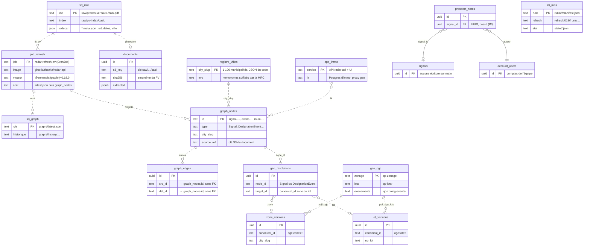

<!-- diagram:etat-actuel -->

Qui lit quoi : la collecte et le refresh écrivent S3, puis projettent dans Postgres ; l'application lit Postgres ; le mapper relie les signaux du graphe aux zones et lots copiés du service geo.

**État proposé.** Le même dessin, avec un statut par objet et le propriétaire de chaque schéma, est la scène `modele-donnees` (§9.2) ; il n'est pas répété ici.

**Où une annotation de Steve se rattache aux données existantes** (table `annotation_targets` du paquet `@sentropic/annotations`, sans clé étrangère ; la clé est fournie par immo).

| Cible | Objet physique existant | Clé utilisée | Clé existante ou nouvelle |
|---|---|---|---|
| Signal | nœud `graph_nodes` de type `Signal` ou `DesignationEvent` | `city_slug` + `id` texte | clé `(city_slug, id)` décidée pour #812 (branche `fix/graph-city-key` non fusionnée ; PK `id` seule sur `782d20c9`, annexe III.7.1) |
| Ville | registre `QC_MUNICIPALITIES` (pas de table) | `city_slug` | existante |
| PV, document | objet S3 `raw/proces-verbaux-<ville>/cas/<sha>.pdf` et ligne `documents` | `sha256` (+ page) | existante |
| Zone | `zone_versions`, copie de `qc-zonage-<ville>` du service geo | `canonical_id` `ogc:zones:<ville>:<code>` | existante |
| Lot | `lot_versions`, copie de `qc-lots-<ville>` | `canonical_id` `ogc:lots:<ville>:<no_lot>` | existante |
| Règlement | nœud `bylaw-<ville>-<numéro>`, `regulatory_stages.bylaw_canonical_id` | `bylaw_canonical_id` | existante, peu fiable (C-05, C-26) |

**Côté geo, rien ne change** : aucune table, aucune collection, aucune API nouvelle ; une annotation de zone ou de lot garde le `canonical_id` déjà utilisé par immo.

**Tableau des écarts.**

| Objet | Stockage physique | Propriétaire du schéma / code | Exécuté par | Statut | Détail | Décision |
|---|---|---|---|---|---|---|
| `graph/<ville>/latest.json` (+ `history/`) | S3 d'immo (`radar-immobilier-docs`) | format : engram | job immo `radar-refresh-pv` (librairie `@sentropic/graphify` 0.18.0) | inchangé | Graphe produit par engram, écrit par le job immo | — |
| `graph_nodes` | Postgres d'immo | engram (format) · immo (table) | job immo (projection) | **modifié** | Clé `(city_slug, id)` au lieu de `id` seul | #812 |
| `graph_edges` | Postgres d'immo | engram · immo | job immo | **modifié** | Références portant la ville (détail dans #812, `non vérifié` ici) | #812 |
| Classeur de Steve (par sha256, sidecar `*.meta.json`) | S3 d'immo | sentropic (port du paquet) | application immo (import) | **nouveau** | Importé une fois, gardé tel quel | D1, G2 |
| `annotation_sources`, `annotation_revisions`, `annotation_validations` (+ adjudications), `annotation_targets` | Postgres d'immo (migrations du paquet) | sentropic (`@sentropic/annotations`) | application immo (saisie de Steve, validations de l'équipe) | **nouveau** | Révisions immuables liées au hash, validations, cibles par clé immo | G2, G3, G4, D2 |
| Profil de domaine (`radar/ontology/ontology-profile.yaml`) | dépôt git d'immo | immo (contenu) ; format : engram | lu par le job immo et par l'évaluation | **modifié** | + schéma d'étiquettes, règle D13, unité de groupe | D2, D7 |
| Jeux de référence (éléments des versions figées) et runs | S3 d'immo, préfixe privé (nom à fixer) | engram | job d'évaluation hors ligne (engram) | **nouveau** | Versions figées, partitions dev / test scellée, prédictions, résultats | G1, G5, D10, D11 |
| Manifestes et empreintes | dépôt git d'immo | engram | job d'évaluation | **nouveau** | Publics ; `label_provenance` | G1, G5 |
| Décisions de gel et de promotion | dépôt git d'immo (`.track/`) | track (attestation h2a) | humain (Fabien) | **nouveau (usage)** | Gel d'une version, promotion d'un candidat exact | G6, D13 |
| `account_users` | Postgres d'immo | immo ; identité : IdP sentropic | application immo | **modifié (données)** | Un compte pour Steve | D5, G4 |
| `prospect_notes` | Postgres d'immo | immo | application immo | **modifié** | Ancre signal en texte (`city_slug` + id), comparaison auteur corrigée | D3 |
| `documents`, `raw/…`, `runs/…`, `refresh/…`, `state/…` | Postgres et S3 d'immo | immo | collecte et refresh immo | inchangé | Lus pour rattacher un PV | — |
| `zone_versions`, `lot_versions`, `geo_resolutions`, `geo_unresolved` | Postgres d'immo (copie du service geo) | immo | pull OGC, mapper G1 | inchangé | `canonical_id` réutilisé comme clé de cible | — |
| `signals`, `prospect_marks` | Postgres d'immo | immo | application immo | inchangé | `signals` orpheline ; `prospect_marks` pour l'équipe | — |
| Collections `qc-zonage-*`, `qc-lots-*`, `qc-zoning-events-*` | service geo (PostGIS, S3 geo : `non vérifié`) | geo | service geo | inchangé | Aucune collection ni API nouvelle | — |
| Six tables immo du brouillon | — | — | — | **abandonnées si D2 (a)** | Remplacées par les tables du paquet (§9.2) dans le scénario recommandé G7 (b) et D2 (a), à décider ; avec D2 (b), construites puis migrées | G7, D2 |
| Supprimé de l'existant | — | — | — | **aucun** | Rien de ce qui existe n'est supprimé | — |

### III.2 Annotations existantes : deux tables, aucune table de jeu de référence

**Oui, un modèle d'annotation existe déjà, mais il ne sert pas à ce dont Steve a besoin.** FAIT, lu dans `api/src/db/schema.ts` et les migrations `0005_prospect_marks.sql` et `0011_prospect_notes_annotations.sql` sur `origin/main`.

| Table | Créée par | Ce qu'elle porte | À quoi elle sert dans l'UI aujourd'hui |
|---|---|---|---|
| `prospect_marks` | migration 0005 | Le **marquage d'équipe d'un lot**, sur deux dimensions : pipeline (favori, écarté, sollicité, lettre envoyée) et marché (en vente, prix demandé, lien d'annonce). Ancre : `lot_version_id` (+ `no_lot`, `city_slug`) ; auteur : `author_id` → `account_users`, obligatoire ; chaîne append-only `supersedes` / `superseded_by` (une nouvelle marque remplace l'ancienne sans l'effacer) ; mode `real` (saisie) ou `simulation`. | Boutons de statut de la fiche lot (`LotFichePanel`) et carte d'évaluation. Ce n'est pas une annotation de signal. |
| `prospect_notes` | migration 0005, revue en 0011 | Une **note libre** sur un lot (`no_lot` + `city_slug`) ou un signal (`signal_id` → `signals.id`, UUID, `ON DELETE SET NULL`) ; auteur = compte obligatoire ; `body` limité à 10 000 caractères ; édition en place, suppression logique (`deleted_at`) ; `tenant_id` inerte. | Composants `collab/*` : notes dans la fiche lot et dans le panneau signal (`SignalAnnotations`), flux en direct `prospect:note`. |

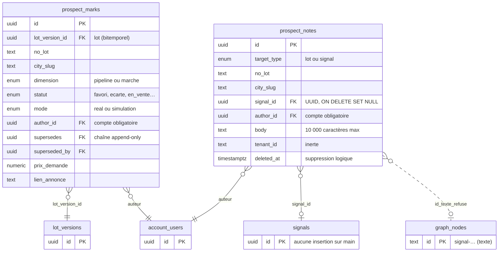

<!-- diagram:existant -->

**Pourquoi ces tables ne suffisent pas pour les retours de Steve.**
1. **Auteur avec compte obligatoire** : Steve n'a pas de compte vérifié, et ce n'est pas lui qui importe (D5).
2. **Une seule cible par note**, alors qu'une ligne du classeur vise 1 à N objets (la ligne #7 nomme deux événements ; une ligne agrégée vise une ville).
3. **10 000 caractères au plus** : la cellule E57 des Constats en compte 17 114.
4. **Aucune provenance** (fichier, sha256, feuille, ligne, révision) **ni verdict structuré** (classement, motif, sens, filtrage) : on ne peut ni réimporter sans doublon, ni construire un jeu de référence.
5. **L'ancre signal est cassée (défaut à corriger par B0)** : l'UI envoie l'identifiant texte du graphe (`signal-…`, table `graph_nodes`), l'API exige l'UUID de la table `signals`, que plus aucun code de `main` n'alimente.

**Aucune table de jeu de référence n'existe en base aujourd'hui.** Le jeu de référence actuel (jeu de référence d'extraction v3, dit E) est un ensemble de fichiers JSON versionnés dans le dépôt, hors de `main` : `docs/reviews/refresh-benchmark/v101b/oracle-v3/` sur la branche `feat/t1-model-benchmark-real` (commit `dd0561f6`, 674 éléments sur 100 documents) ; la version 676 n'existe qu'en copie locale. Les campagnes du benchmark #782 lisent ces fichiers. Le §4.9 décrit comment le jeu de référence de ciblage C s'y ajoute.

Les diagrammes du dossier distinguent ce qui **existe** sur `main` (en-tête ocre, bordure pleine : `graph_nodes`) de ce qui est **proposé** (en-tête bleu, bordure en tirets : les tables du paquet `@sentropic/annotations`, le profil complété, le jeu de référence engram).

### III.3 Contraintes établies (détail)

**Identité des objets annotables (FAIT).**

| Objet | Où il vit | Clé | Stabilité |
|---|---|---|---|
| Signal `signal-…`, événement `event-…` | `graph_nodes`, projetés depuis `graph/<ville>/latest.json` | `id` texte choisi par l'extraction | **Non garantie** : `upsertGraphAtomic` supprime les nœuds orphelins d'une ville (`graph-store.ts`, vers les lignes 1134–1166). |
| `signals` (historique) | table `signals` | UUID aléatoire | Aucune insertion dans le code applicatif de `main` (seulement dans un test d'intégration). |
| Municipalité | registre `QC_MUNICIPALITIES` ; nœuds `muni-<slug>` | slug, homonymes suffixés par la MRC | Stable |
| Règlement | `bylaw-<slug>-<num>`, `regulatory_stages.bylaw_canonical_id`, `reglement_number` | texte | Peu fiable (C-05, C-26) |
| Zone | `zone_versions` bitemporel | `ogc:zones:<ville>:<codeNorm>` | Stable par code |
| Lot | `lot_versions` bitemporel | `ogc:lots:<ville>:<noLotNorm>` | Stable |
| Document | `documents` | sha256 | Stable |

**Annotations existantes (FAIT, lecture de code).**
- `prospect_notes` (0011) : cible `lot` ou `signal` (UUID `ON DELETE SET NULL`), auteur `account_users`, corps limité à 10 000 caractères, suppression logique, flux SSE (événements poussés du serveur vers le navigateur) `prospect:note`.
- **Défaut 1** : l'UI envoie `GraphSignalNode.id` (texte) alors que l'API exige `z.string().uuid()` (`prospect-marks.ts:107`). Un refus 400 est attendu ; les tests utilisent `"sig-1"` sur un fetch simulé. Effet en prod : `non vérifié`.
- **Défaut 2** : `SignalAnnotations` compare `note.authorId` (`account_users.id`) à `$authStore.user.sub` (sujet IdP) quand `currentUserId` n'est pas fourni ; ni `SignauxSelPanel` ni `LotFichePanel` ne le fournissent. Les boutons d'édition n'apparaîtraient pas. Effet : `non vérifié`.
- **Défaut 3** : le badge de comptage n'est rempli qu'à l'ouverture de la fiche.
- Une cellule du classeur atteint **17 114 caractères** (Constats, E57) : le corps de note de 10 000 ne peut pas porter la source sans troncature.

**Contrat sentropic (FAIT, `origin/main` `7d1002505`).**

| Élément | `@sentropic/comments` 0.2.0 | Conséquence pour Radar |
|---|---|---|
| Cible | `{kind:'message'\|'canvas'\|'artifact'\|'field'\|'record', id, sectionKey?, recordType?}` ; `recordType` opaque | `{kind:'record', recordType:'radar.signal'\|'radar.municipality'\|'radar.bylaw'\|'radar.zone'\|'radar.lot'\|'radar.document', id:<clé namespacée>}` sans changement du paquet. Préfixer l'`id` : `TargetQuery` ne filtre pas sur `recordType`. |
| Fil | plat (`threadId`), `open\|resolved` par fil, `assignedTo` | Une évaluation publiée = un fil ; `resolved` ne signifie pas « non pertinent ». |
| Auteur | `{id, kind?: 'human'\|'agent'\|'nhi', displayLabel?}`, identifiant opaque | Auteur externe possible sans compte (D5). |
| Provenance | `{toolCallId?, runId?}` | La provenance d'import vit dans des tables hôtes. |
| Verdict structuré, étiquettes | absents | Tables hôtes ; le port n'est pas élargi. |
| Suppression | **physique par ligne** (`store.ts:47-48`) | Écart avec O1 (tombstone) ; pas de chemin de suppression par le paquet (D4). |
| Routeur Hono | `contextType` en énumération fermée (`hono.ts:17`) | Inutilisable tel quel pour `signal`. |
| Canevas | `SPEC_VOL_INTERACTIVE_CANVAS.md` = intentions brutes | Une position sur carte n'est qu'une représentation de la cible. |
| Focus | `packages/focus` supprimé de sentropic `main` (`6ca53d11a`, « focus is owned by h2a ») | Ne pas concevoir contre ce paquet. |
| Dépendance Radar | aucune référence à `@sentropic/comments` dans `ui/`, `api/` ou à la racine | À ajouter. |

### III.4 Mesures lexicales des identifiants candidats

**Mesures lexicales (CALCUL, candidats, pas entités vérifiées).**
- Colonne L du Triage : au moins un identifiant complet dans **121/124** lignes, **148** chaînes distinctes, plusieurs candidats dans 27 lignes.
- Toutes colonnes du Triage : 121 lignes, 150 chaînes distinctes, plusieurs candidats dans 30 lignes.
- Trois feuilles Triage, Écartés et Constats : **227 à 237** identifiants complets distincts selon la règle d'extraction.
- Identifiants abrégés (`event-…-zonage-0013`) et lignes agrégées sans identifiant (« 13 signaux PIIA ») : présents dans Triage et surtout dans Écartés ; effectif exact dépendant de la règle, à publier par le rapport d'import.
- Les lignes #55 et #58 décrivent un dossier absent ; la #112 n'utilise que des identifiants abrégés.

### III.5 Schémas des options de D2 et D3

Schéma de l’option D2 (a) Adopter le générique : immo = profil + données : identique au modèle cible par propriétaire du §9.2 (même source, non répétée ici).

Schéma de l’option D2 (b) Six tables immo, puis migration :

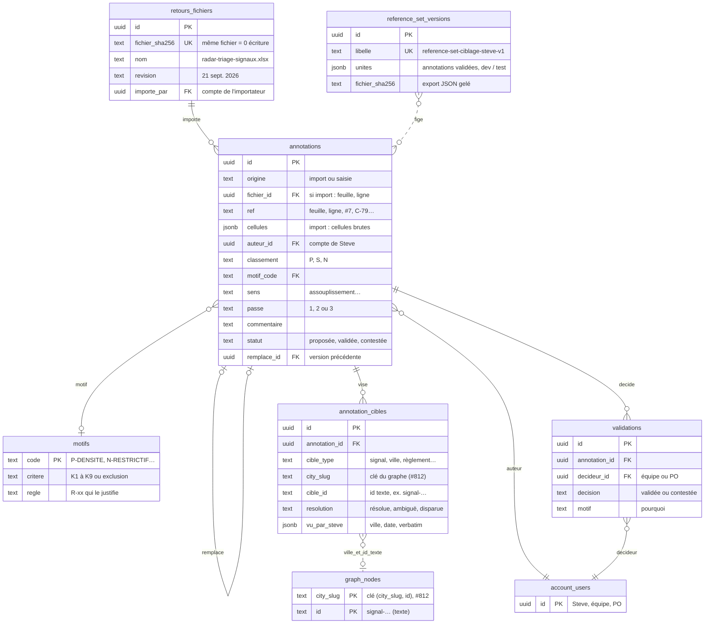

Schéma de l’option D2 (c) Table de contrôle seule (jeu de référence) :

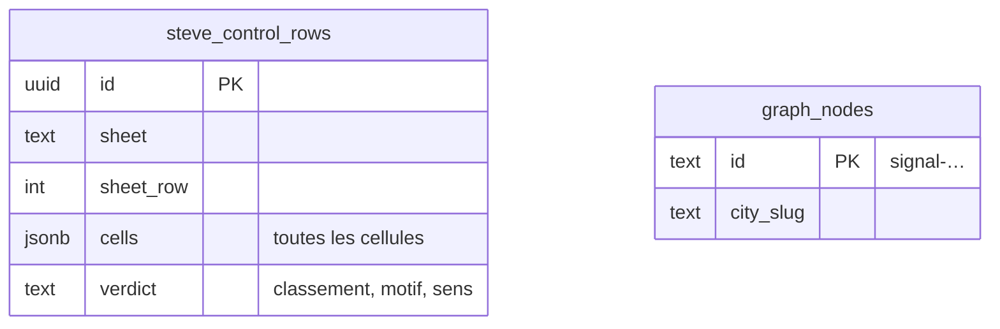

Schéma de l’option D2 (d) Attendre le générique sans borne :

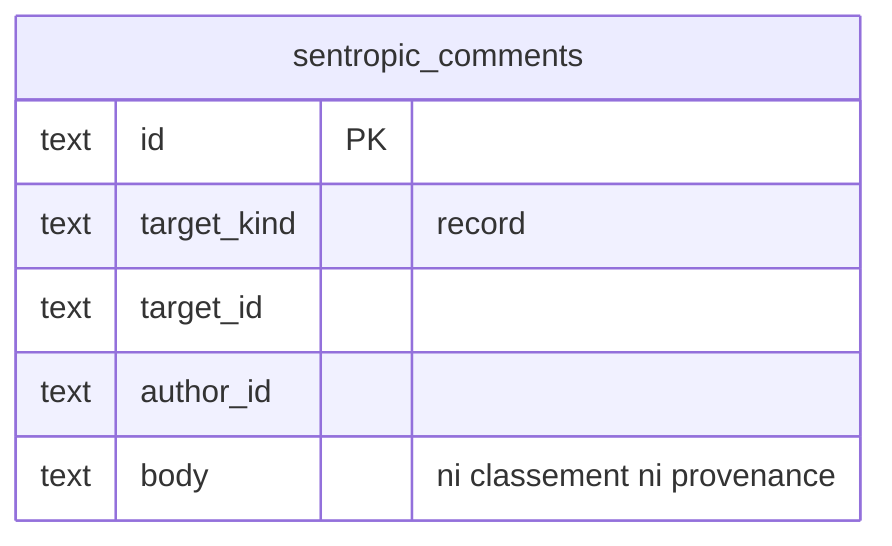

Schéma de l’option D3 (a) Clé texte namespacée + instantané observé, B0 immédiat :

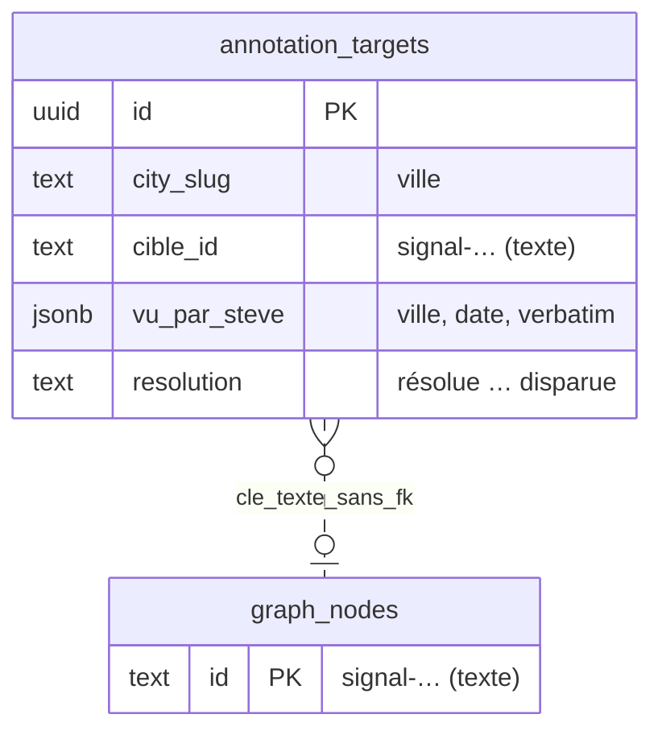

Schéma de l’option D3 (b) Attendre une clé métier stable :

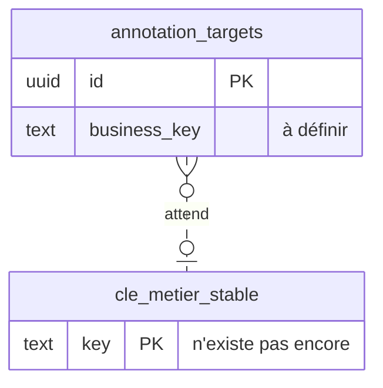

Schéma de l’option D3 (c) Passer par l’UUID signals :

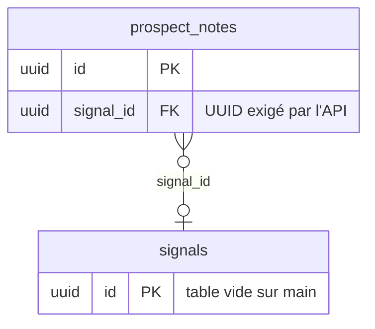

### III.6 Détail de la migration UI

**FAIT**, mesuré sur `origin/main` `27891b10`, `ui/` (application web monopage, Vite + Svelte 5). Les références sont textuelles : un import ne prouve pas une migration complète.

| Indicateur | Valeur | Lecture |
|---|---|---|
| Dépendances déclarées | design-system-svelte ^0.34.71, themes et tokens ^0.11.0, geo-core et geo-map-engine ^0.6.0, geo-ui-svelte ^0.1.1, chat-ui ^0.33.0 | Plages déclarées, pas version déployée |
| Racine | `App.svelte` dans `ThemeProvider`, thème Sent-Tech | Tokens disponibles pour les nouvelles surfaces |
| Composants `.svelte` | 69, dont **39** importent le DS (56,5 %) ; 63 hors stubs et harnais | Adoption large mais partielle, pas « 56,5 % migré » |
| Composants DS les plus utilisés | Badge (25 fichiers), Alert 19, Button 14, Card 12, EmptyState 11 | — |
| Composants DS jamais utilisés | Tabs, Modal, Table, Input, Textarea, Tooltip | — |
| Contrôles HTML bruts | **132** `<button>` dans 37 fichiers (125 dans 35 hors stubs et harnais) ; 13 `<input>` ; 7 `<textarea>` ; 6 `<select>` ; 8 `<table>` | Indice de reste, pas inventaire de violations |
| Couleurs | 1 668 classes de couleur Tailwind (49 fichiers) contre 370 `var(--st-*)` (13 fichiers) ; 481 couleurs hexadécimales | Tokens DS minoritaires |
| Carte Signaux | `SignauxMapView` → `GeoCityMapBase.svelte`, MapLibre local (2 761 lignes) ; geo-map-engine seulement pour le fond satellite | Non migrée |
| Composants geo partagés | Seule la route `#/geo` (`GeoView`) rend `GeoMap` + `GeoDetailPanel` | Pilote isolé, sans panneau d'annotations |
| Moteur geo partagé | `GEO3D_ENGINE_ENABLED = false` ; montage par défaut en attente de la « Porte 2 » | Désactivé ; l'activer exige caméra et sélection, pas seulement le booléen |
| Annotations `collab/*` | **0 sur 3** utilisent le DS (`<textarea>` ×2, `<button>` ×5, badge Tailwind) | À migrer dans U1 |
| `SignauxSelPanel` | Importe le DS, contient 16 `<button>` bruts | Point de montage des annotations |
| `@sentropic/comments`, focus | 0 référence | Adaptateurs à réaliser |
| Dernière mesure officielle | `audit-ds-realignement.md` (2026-06-14) : 5 OK, 29 à migrer | Aucune mesure plus récente : `source manquante` |

### III.7 Modèle engram vérifié (détail technique)

Conventions. Chaque citation suit la forme `chemin@commit:ligne`. `SYNTHESE.md` désigne `graphify/.graphify/scratch/design/learning-loop/SYNTHESE.md`, un fichier de conception non suivi par git. Le dossier en cours est `tmp/dossier-yaml-plain`, branche `docs/dossier-yaml-plain` au commit `07b9920a`. Aucun test n'a été exécuté pour cette annexe (`not run`).

#### III.7.1 Store Postgres d'engram : 6 tables

Source unique de la DDL : `postgresDdlStatements()` (`src/storage/postgres.ts@c96fc01e:381`). Toutes les tables sont préfixées par `city_slug`. Le nom de schéma est optionnel et validé (`:172-180`, `:577`). Le DSN vient uniquement de l'environnement (`ENGRAM_POSTGRES_URL`, ancien nom `GRAPHIFY_POSTGRES_URL`, `:572,666`).

| Table | Colonnes clés | PK | Preuve |
|---|---|---|---|
| `graph_nodes` | `city_slug`, `id`, `label`, `type`, `community`, `props jsonb` | `(city_slug, id)` | `postgres.ts@c96fc01e:397-404` |
| `graph_edges` | `city_slug`, `source_id`, `target_id`, `relation`, `confidence`, `props jsonb` | `(city_slug, source_id, target_id, relation)` | `:412-419` |
| `graph_meta` | `city_slug`, `topology_signature`, `pushed_at`, `tool_version` | `(city_slug)` | `:427-432` |
| `graph_group_counts` | `city_slug`, `snapshot_id`, `axis`, `key`, `label`, `count`, `parent_key` | `(city_slug, axis, key)` | `:446-454` |
| `graph_positions` | `city_slug`, `snapshot_id`, `layout_id`, `node_id`, `x`, `y`, `degree` | `(city_slug, layout_id, node_id)` | `:469-477` |
| `graph_tombstones` | `city_slug`, `target_kind`, `node_id`, `edge_source`, `edge_target`, `edge_relation`, `t`, `reason` | `(city_slug, target_kind, node_id, edge_source, edge_target, edge_relation)` | `:540-549` |

Index :
- `(city_slug, type)` ;
- GIN plein texte français sur `label` ;
- GIN `props jsonb_path_ops` ;
- index temporels `t` et `t_end` ;
- index de voisinage `(city_slug, source_id|target_id)` (`:483-531`).

Écriture : `engram store push`, en mode « replace », reconstruit les agrégats (`src/store-cli.ts@c96fc01e:1-17` ; `src/cli.ts@c96fc01e:3421-3425`). Un push réécrit aussi `<target>/graph/{citySlug}/latest.json` en local (`postgres.ts@c96fc01e:582-585,990-994`). Le schéma pgvector, séparé, ajoute `graph_embeddings` (`src/storage/vector/pgvector.ts@c96fc01e:16,115`). Il n'est pas compté dans les 6.

Déploiement :
- immo : aucune référence dans le code ni dans `deploy/` (`git grep` des variables `ENGRAM_POSTGRES_URL`, `GRAPHIFY_STORE`, `graph_meta`, `graph_positions` : vide à `782d20c9`) ;
- graphify : aucun répertoire de déploiement à `c96fc01e` ;
- autres clusters : `unverified`.

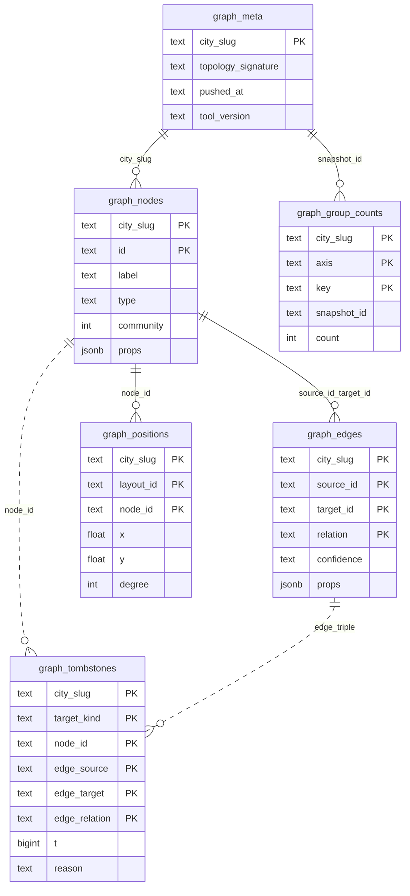

<!-- diagram:engram-store -->

Les relations sont logiques : la DDL ne déclare aucune clé étrangère.

**Collision avec immo.**

| Table | Immo (`api/src/db/schema.ts@782d20c9`) | Engram (`postgres.ts@c96fc01e`) |
|---|---|---|
| `graph_nodes` | PK `id` seule (`:287`), `city_slug` nullable (`:290`), en plus `source_ref` et `created_at` | PK `(city_slug, id)` |
| `graph_edges` | PK `uuid id` (`:316`), `src_id`, `dst_id`, `kind` | PK naturelle (`source_id`, `target_id`, `relation`) |
| Index `graph_nodes_city_type_idx` | même nom (`:299`) | même nom (`:490`) |

La branche immo `fix/graph-city-key` (non fusionnée, `.worktrees/fix-812-city-scoped-pk`) passe immo en PK `(city_slug, id)`. Les noms de colonnes des arêtes restent différents. Parade : un schéma dédié (option `schema`) ou une base séparée.

Détail repris du §9.5. Immo : `city_slug` nullable, arêtes `src_id`/`dst_id`/`kind` (`api/src/db/schema.ts@782d20c9:285-290,314-319`) ; engram : arêtes `source_id`/`target_id`/`relation` (`src/storage/postgres.ts@c96fc01e:397-421`). Le `CREATE TABLE IF NOT EXISTS` du store ne fait rien en silence sur la table immo, puis les upserts échouent. Option `schema` du store : `postgres.ts@c96fc01e:577`. Le store réécrit `graph/{citySlug}/latest.json` à chaque push, avec `force: true` (`postgres.ts@c96fc01e:990-994`), sous `target` (`:585`), même chemin que la clé canonique S3 d'immo (`api/src/storage/object-store.ts@782d20c9:46`). Homonyme « sealed » : `engram-memory/contracts/index.ts@c96fc01e:462`.

#### III.7.2 Clés S3 exactes et producteurs

Engram n'écrit pas sur S3 : aucun `@aws-sdk` ni `S3Client` sous `src/` à `c96fc01e`. S3 n'a pas été listé, donc toutes les présences sont `unverified (S3 non listé)`.

| Clé | Producteur (immo, `782d20c9`) | Contenu |
|---|---|---|
| `graph/<ville>/latest.json` | `canonicalGraphKey()`, `api/src/storage/object-store.ts:46`, via le writer protégé `canonical-graph-writer.ts` | graphe canonique d'une ville |
| `graph/<ville>/graphify-3.4.manifest.json` | `applyGraphify34Snapshots`, `api/src/services/graph/graphify-34-snapshot.ts:327-330`, déclenché par `tsx src/scripts/graphify-34-enrich.ts --apply <ville>` (`api/src/scripts/graphify-34-enrich.ts:16-19`) | `municipality`, `graphify_pass`, `ontology_version`, `snapshot_key`, `snapshot_mode`, `source: "graph_nodes"`, comptes (`graphify-34-snapshot.ts:153-162`) |
| `graphify-34-backups/<backupId>/graph/<ville>/…` + `_backup-complete.json` | `archiveCityGraphPrefix`, `canonical-graph-writer.ts:90-97,235-282` | copie du préfixe `graph/<ville>/` avec sha256 et ETag |
| `graphify-34-backups/<backupId>/_apply-plan.json`, `…/_applied/<ville>.json` | `graphify-34-snapshot.ts:165-171` | plan et marqueurs de reprise |
| `ontology/<ville>/project-state.json` | `projectStateKey()`, `api/src/services/exploitation/project-state.ts:30` | état d'exploitation, lu par la vue Signaux |
| `ontology/<ville>/patches.json` | `patchLogKey()`, `api/src/services/exploitation/patches.ts:105` | journal des correctifs en ajout seul |

#### III.7.3 État de run engram (local, hors S3)

- **Répertoire d'état.** Par défaut `.engram/`, avec `.graphify/` et `graphify-out/` reconnus comme anciens noms (`src/paths.ts@c96fc01e:11-21,147`).
- **`profile_hash`.** Sha256 du profil normalisé et trié. Le hachage exclut `sourcePath`, `profile_hash` et `bound_source_path`, et hache le module de normalisation par son contenu (`src/ontology-profile.ts@c96fc01e:69-80,505,552,576`). D'après la conception, `profile_hash` n'inclut pas encore les registres (`SYNTHESE.md:167`, `unverified` dans le code).
- **État du profil.** Fichier `<state>/profile/profile-state.json`, plus le profil normalisé et les registres (`src/paths.ts@c96fc01e:191-199`).
- **Sorties d'ontologie.** Sous `<state>/ontology/` : `manifest.json`, `nodes.json`, `aliases.json`, `relations.json`, `sources.json`, `occurrences.json`, `validation.json`, `index.json` (`src/paths.ts@c96fc01e:210-220`). Le manifest suit le schéma `engram_ontology_outputs_v1` et porte `graph_hash`, `profile_hash` et `generated_at` (`src/ontology-output.ts@c96fc01e:482-490`).
- **Cache.** Répertoire `<state>/cache/<kind>/`, avec un espace de noms `profile-<profile_hash>` quand un profil est actif (`src/paths.ts@c96fc01e:183` ; `src/cache.ts@c96fc01e:81-85,176-180,298-300`).

#### III.7.4 Évaluation par occurrences typées (codée)

- **Module.** `src/profile-evaluate.ts@c96fc01e` (en-tête `:1-24`). Évaluation déterministe, sans LLM. Le rapprochement se fait par égalité exacte de `(source_file, node_type, start, end)` (offsets UTF-16, intervalle demi-ouvert).
- **Schémas.** `engram_typed_linking_gold_v1` en entrée, `engram_typed_linking_evaluation_v1` en sortie (`:23-24`).
- **Métriques.** `mention_recall`, `set_recall`, `resolution_precision`, `unresolved_rate` (`:61-64,298-301`).
- **Gate.** Valeurs `pass` ou `fail` seulement (`:93,339`). Une métrique `null` fait échouer un plancher (`:327`). La valeur `indeterminate`, prévue par la conception, n'est pas codée.
- **Exposition.** Le module est importé par la seule CLI (`src/cli.ts@c96fc01e:78`), et non exporté par l'index public.
- **Spécification.** Aucune spec dédiée sous `spec/`. Le contrat vit dans l'en-tête du module et dans `tests/profile-evaluate.test.ts@c96fc01e:227-245`. Test `not run` ici.
- **Commande exacte** (`src/cli.ts@c96fc01e:2857-2867`) :

```
engram profile evaluate --run <occurrences.json> --gold <gold.json> \
  [--out evaluation.json] [--profile-state <state>/profile/profile-state.json] \
  [--corpus <racine>] [--floors <gate.json>] [--floor metrique=valeur]... \
  [--ceiling metrique=valeur]... [--json]
```

- **Code de sortie.** Non nul si le gold est invalide ou si la gate vaut `fail` (`:2873-2949`).
- **Version 0.18.0.** Elle est épinglée par immo et contient déjà ce module (tag `v0.18.0`, `src/profile-evaluate.ts`, ajouté par `e63ad25a` le 2026-07-17). Avec cette version, la commande s'appelle `graphify profile evaluate`.
- **Côté immo.**
  - Aucun `occurrences.json`, aucun appel `link`, aucun gold au format `engram_typed_linking_gold_v1` (`git grep` vide à `782d20c9`).
  - Le profil `radar/ontology/ontology-profile.yaml@782d20c9` n'a pas de bloc `evaluation`.
  - L'évaluation n'est donc pas applicable aujourd'hui sans un run `link` et un gold.

#### III.7.5 Boucle ReferenceSet, sceau, runs, promotion (conception)

Rien n'est codé à `c96fc01e`. Tout ce qui suit est spécifié dans `SYNTHESE.md` (non suivi par git) et repris dans le dossier §6.7 de la version `07b9920a` (aujourd'hui §9.5) et les fiches G1 à G7 (`DOSSIER_DECISION_RETOURS_STEVE_2026-10-03.md@07b9920a:1087-1099,1458-1503`).

- **Terminologie.**
  - `ReferenceSet`, `ReferenceSetVersion` (`engram_reference_set_v1`), `ReferenceItem` (`SYNTHESE.md:60-66`).
  - Partitions `dev` et `test` + `sealed: true` (`:65`).
  - Provenance `label_provenance` ∈ {`human_single`, `human_adjudicated`, `model_consensus`, `mixed`} (`:69`).
- **Version figée** (`:178-191`) :
  - identité, provenance et partitions `{file, sha256, items, groups}` ;
  - manifeste de split public et affectations privées ;
  - sceau : `seedCommitment`, engagement de contenu inscrit dans track avant tout appel de modèle, politique `single_shot_per_frozen_candidate`, journal d'exposition en ajout seul et distinct de la version ;
  - qualité et exclusions ;
  - stockage : éléments privés, manifestes publics.
- **Runs et résultats.** `engram_eval_run_v1`, `engram_eval_result_v1` (gate `pass|fail|indeterminate`), `engram_eval_comparison_v1` (`:204-212`).
- **Promotion** (`engram_promotion_v1`, `:165-176`) : candidat, version en production, preuves, règle préenregistrée, décision track. La production refuse toute empreinte sans « go ». La commande visée est `engram promote check` (`:122`), non codée.
- **Évaluateurs prévus** (`:235-242`) : `engram.classification@1`, `engram.span@1`, `engram.typed_occurrence@1` et `engram.graph@1` (BPMN). Seul `typed_occurrence` correspond à du code existant (`profile evaluate`).
- **Porteurs.** sentropic porte l'humain, engram la mesure, track les décisions attestées par h2a (dossier `07b9920a:1092`).

#### III.7.6 Découpage de `s3_reference_sets` en 6 objets (proposition)

Le schéma actuel la représente comme une seule boîte : `s3_reference_sets {prefixe, versions, runs}` (`focus/physical-model.js@07b9920a:108-112`). Le découpage ci-dessous en fait 6 objets. Le préfixe `reference-sets/` est provisoire : le nom reste à fixer en G5. Il désigne un bucket privé de l'hôte, derrière un port du paquet (`SYNTHESE.md:190,365`). Les 6 clés sont une **proposition** : aucune n'existe dans le code.

| # | Objet | Clé proposée | Contenu | Visibilité |
|---|---|---|---|---|
| 1 | `rs_manifest` | `reference-sets/<set_id>/v<N>/manifest.json` | `engram_reference_set_v1` : identité, profil (`profile_hash`, `registries_sha256`), provenance, partitions `{file, sha256, items, groups}`, bloc de split public, bloc sceau (`seedCommitment`, référence track), qualité, exclusions, fiche descriptive | publique (manifeste + empreintes) |
| 2 | `rs_assignments` | `reference-sets/<set_id>/v<N>/private/assignments.json` | correspondance élément → groupe (municipalité) → partition, référencée par `privateAssignmentManifestRef` + sha256 | privée |
| 3 | `rs_items_dev` | `reference-sets/<set_id>/v<N>/private/dev.jsonl` | `ReferenceItem` de développement : `itemId`, `groupKey`, `strata`, `input` figé + sha256, `reference`, `annotationRefs`, `tags`, `completeness` | privée, seule partition utilisable pour optimiser |
| 4 | `rs_items_test` | `reference-sets/<set_id>/v<N>/private/test.jsonl` | mêmes champs, partition `test` scellée, `accessBudget` | privée, scellée, une passe par candidat figé |
| 5 | `rs_exposure_log` | `reference-sets/<set_id>/v<N>/exposure.jsonl` | journal d'exposition en ajout seul : qui, quand, quel candidat, quelle partition. Il reste hors du contenu haché de la version. | privée, en ajout seul |
| 6 | `eval_runs` | `reference-sets/<set_id>/v<N>/runs/<run_id>/{run.json, predictions.jsonl, result.json}` + `…/campaigns/<campaign_id>/comparison.json` | `engram_eval_run_v1` (candidat, bras, isolation, une ligne par élément et par tentative), `engram_eval_result_v1`, `engram_eval_comparison_v1` | privée. Les agrégats peuvent être publiés. |

Trois éléments restent hors de ces 6 objets :
- l'instantané d'annotations (interface 1, produit par sentropic, `SYNTHESE.md:139-163`) ;
- le corpus figé (`engram_corpus_snapshot_v1`) ;
- l'enregistrement de promotion (`engram_promotion_v1`), rattaché à `decisions_track`.

Leur emplacement est `unverified` : il reste à décider.

#### III.7.7 `job_evaluation` = `engram profile evaluate`

- **Rôle dans le schéma.** Le nœud `job_evaluation` (`focus/physical-model.js@07b9920a:133-137`) devient l'exécution de `engram profile evaluate` (III.7.4) : un job Node, sans Python, qui utilise le binaire `engram` du paquet (`package.json@c96fc01e:23-25`).
- **Entrées et sorties v1.**
  - `--run`, soit l'objet 6 (`predictions.jsonl` au format `TypedEntityOccurrenceV1[]`) ;
  - `--gold`, soit l'objet 3 ou 4 au format `engram_typed_linking_gold_v1` ;
  - `--profile-state` ;
  - `--out` pour écrire `result.json` (objet 6).
- **Limites.**
  - Seul l'évaluateur `typed_occurrence` existe.
  - `classification`, `span`, `graph`, la garde de passe unique sur `test`, le journal d'exposition et `indeterminate` ne sont pas codés.
  - Aucun job k8s ni CronJob `job_evaluation` n'existe dans immo (`git grep` vide à `782d20c9`).
  - L'image `api` contient `@sentropic/graphify` 0.18.0, donc le binaire `graphify`. Il n'a pas été exécuté (`unverified`).

| Étape | Objet | État |
|---|---|---|
| 1 | Instantané haché des annotations validées (sentropic) | conception |
| 2 | Construire la version du jeu de référence (`ReferenceSetVersion`) : dev / test, découpage groupé | conception |
| 3 | Sceau : engagement inscrit dans track avant tout appel de modèle | conception |
| 4 | Runs du candidat sur dev, itérations autorisées | conception |
| 5 | Candidat figé : passe unique sur test et journal d'exposition | conception |
| 6 | `job_evaluation` = `engram profile evaluate` (depuis 4 ou 5) | **codé**, évaluateur `typed_occurrence` seul |
| 7 | Garde `pass` / `fail` (`indeterminate` non codé) | codé en partie |
| 8 | Comparaison avec la production | conception |
| 9 | Décision track go / no-go, attestée h2a | conception |
| 10 | `engram_promotion_v1` et garde de production (`engram promote check`) | conception |

---

## Annexe IV — Revue du plan

Revue du plan « jeu de référence C » par trois relecteurs isolés (Astra max via `codex exec`, Opus 5.5 max via `claude -p`, Gemini 3.8 high via `agy`), sans outil ni clé d'API, en cinq tours, le 2026-10-05. Sorties brutes et prompts : dossier de revue hors dépôt.

**Verdicts.**

| Relecteur | T1 (plan v1) | T2 (plan v1 + inputs de l'owner) | T3 (projet de plan v2) | T4 (table des matières réconciliée) |
|---|---|---|---|---|
| Astra max | rejet | rejet | approuvé avec amendements | table acceptée, aucune objection bloquante |
| Opus 5.5 max | approuvé avec changements | rejet de la v1 | approuvé avec amendements | table acceptée, corrections non bloquantes |
| Gemini 3.8 high | rejet | approuvé avec changements | approuvé avec amendements | table acceptée, aucune objection bloquante |

Motif bloquant commun (3/3) : redécouper les 121 lignes exposées ne peut pas produire un test indépendant.

**Positions sur A1 à A8, par relecteur et par tour** (T3 → T4 ; « rallié » = position changée au T4).

| Point | Astra | Opus | Gemini | Issue |
|---|---|---|---|---|
| A1 Origine du test (input 7) | (b) test neuf, dev intégral → maintenu | (a) test neuf + découpage interne des 121 → rallié à (b) | (b) → maintenu, contre tout découpage interne | (b) ; lecture littérale (moitié des 121 en test) soutenue par aucun relecteur ; usage des 121 lignes arbitré par l'owner (D10) |
| A2 Configurations sur le test | toutes les configurations figées, exploratoires hors candidat → maintenu | idem → maintenu | candidat × 3 modèles seulement → rallié | toutes les configurations figées, déclarées avant ouverture |
| A3 Critère primaire | intersection-union contre B′ passe 1, 67,1 % rapporté → maintenu | idem → maintenu | gate à 0 masqué puis McNemar par grappes → rallié | intersection-union (§7.2) |
| A4 Contrat d'entrée | signal + d1, d2 admissible si uniforme → rallié au typage temporel, date du signal | signal + d1 → coupure à typer d'abord par cas | signal + d1 → date du signal | signal + d1 ; date du signal tranchée par l'owner (D17) |
| A5 Second annotateur humain | tout le test, idéalement → rallié à au moins 50 cas | au moins 50 cas → maintenu | aucun, audit descriptif → rallié | au moins 50 cas ; ressource `unknown` (D10) |
| A6 B′ contre la majorité IA | inclus en exploratoire → maintenu | exclu → rallié (matrice descriptive) | exclu → rallié | matrice descriptive montré / masqué × verdict, sans rappel ni test |
| A7 Verdict multi-signaux | max P > S > N après validation par Steve → maintenu | adopté → rallié (soumis à Steve) | adopté → rallié | max P > S > N par défaut, soumis à Steve (étape 2c) |
| A8 Seuil de masquage | 0 observé et borne < X → maintenu (k_max = 0) | borne supérieure → maintenu, caractéristique opératoire publiée | gate à 0 + borne rapportée → rallié | k ≤ k_max et borne exacte < X ; proposition de l'owner : k_max = 0 (D13) |

**Table des matières (points T1 à T8, accord au T4).** Analyse en profondeur après « Ce que veut Steve », registre en tête rédigé en dernier (T1) ; chapitre distinct pour la définition de C (T3) ; détection scindée en exploratoire et confirmatoire (T4) ; capitalisation condensée dans le corps, détail en annexe (T5) ; registre unique au ch. 3, fiches G en annexe II, fiches D au ch. 10 (T6) ; annexe A sortie vers un journal externe, scènes ventilées dans les chapitres (T7) ; « limites du signal seul » au lieu de « plafond du signal seul » (T8).

**Points arbitrés par Fabien (owner) le 2026-10-05.** Accès des 3 IA au classeur (refusé aux tours 1 à 4 par le contrôle de permissions, accordé au tour 5) ; usage des 121 lignes et extension après clarification des points à clarifier avec Steve (D10, §4.8) ; date du signal pour le contexte d'entrée (D17) ; zéro Pertinent masqué (D13 : proposition, à acter avec Farid). Restent mineurs : la variante de la famille secondaire et le découpage interne facultatif du dev.

**Tour 5 : le classeur vérifié.** Verdicts retenus sur les 12 points vérifiés : code de motif = sortie de décision (3/3) ; biais des propositions 3, 8, 9, 10 partiel (2/3) ; positif P ∪ S maintenu avec la distinction classement / affichage par passe (3/3) ; R′ intégrée avec provenance, R-14 et R-16 exclues (3/3) ; inputs de Steve = P, Q, R + B, colonnes L à T de l'assistant (3/3) ; strate « source de Steve » retirée (3/3) ; colonne B observation de Steve, colonne O jugement de l'assistant (2/3) ; unité = enregistrement radar, une étape par ligne, « 162 » absent du classeur (3/3) ; correspondance colonnes → tags `partial` (3/3) ; une paire touchant L à T n'est pas une incohérence de Steve (3/3) ; premier rapport, gold 30 et vivier B absents du classeur (3/3) ; 67,1 % = 49/73, part P ∪ S en passe 1 observée (3/3). Nouveaux constats : §2.4, §4.1, §5.2, §12.3.

**Limites de la revue.** Les relecteurs appartiennent aux familles des modèles évalués : leur consensus ne remplace pas la ratification humaine de l'étape 0. Ralliements tardifs de Gemini (un effet de conformité n'est pas exclu ; ses désaccords maintenus sont conservés). Les amendements des tours 3 et 4 ont été intégrés au plan v2 sans relecture finale en bloc (`unverified` pour la fidélité de l'intégration). Les chiffres repris des relecteurs (bornes, probabilités) sont des CALCUL non recalculés indépendamment.
