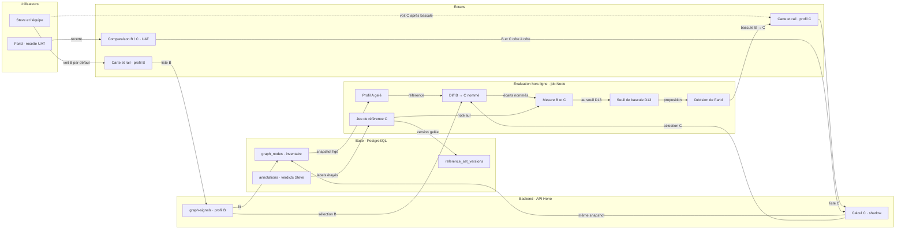
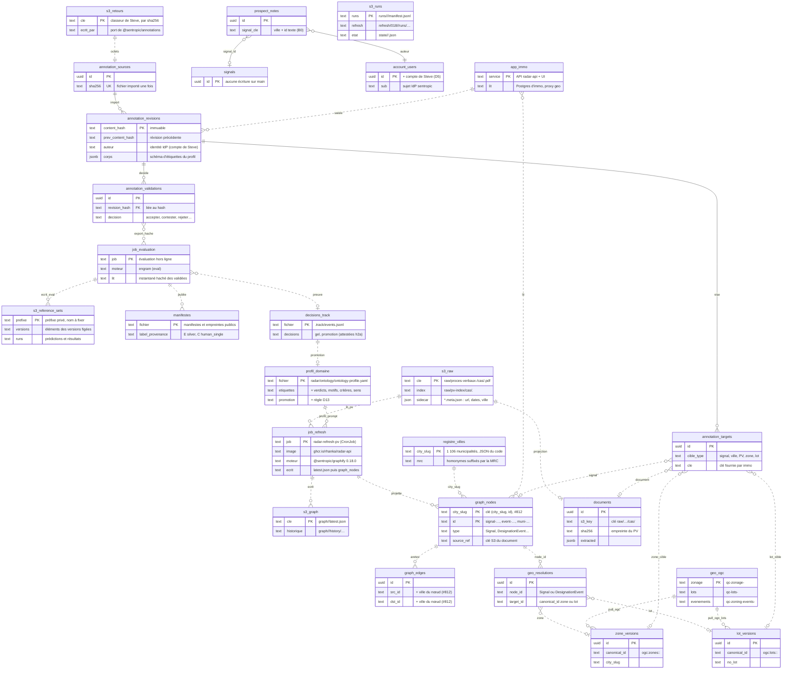
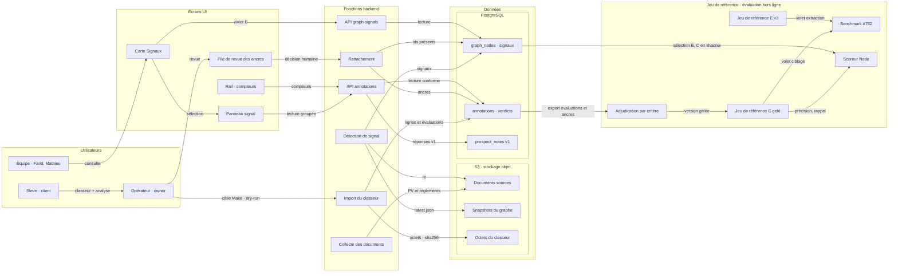
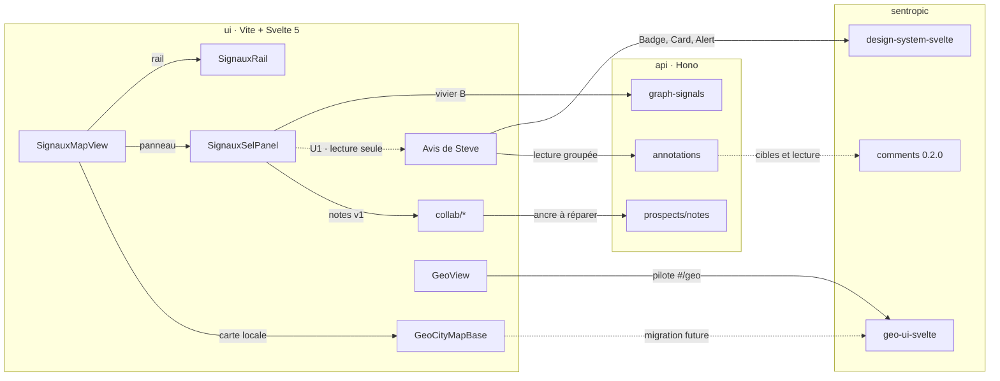

# Scènes Focus du dossier « retours de Steve » : sources canoniques

- **Objet** : sources canoniques des cinq scènes de la page Focus du dossier [DOSSIER_DECISION_RETOURS_STEVE_2026-10-03.md](DOSSIER_DECISION_RETOURS_STEVE_2026-10-03.md), lues par `focus/build-map.mjs` (ancienne annexe B, sortie du rapport le 2026-10-05).
- **Placement** : chaque scène est rendue dans le chapitre qu'elle illustre, à l'endroit du repère `<!-- scene:<id> -->` du dossier : `criteres-steve` (§2.6), `affichage-abc` (§8.1), `modele-donnees` (§9.2), `flux-import-oracle` (§9.6), `architecture-ui` (§9.7). L'ordre ci-dessous est celui du dossier.
- **Formes** : `criteres-steve` est une matrice (tableau Markdown, un critère par ligne) ; `modele-donnees` un diagramme entité-relation (`erDiagram` : colonnes = stockage réel, badge = propriétaire du schéma ou du code, statut par objet) ; `flux-import-oracle` une architecture en couloirs verticaux (`flowchart LR`, un `subgraph` par couloir, jeu de référence en bande transversale en bas) ; `affichage-abc` deux zones (application en haut, évaluation hors ligne en bas) ; `architecture-ui` des composants en cartes A' 460 × 200, chaque `subgraph` étant un conteneur natif `parentId`.
- Elles ne changent rien au fond du dossier : elles rendent lisibles les chapitres qui les portent.

## `criteres-steve` — Les trois critères de Steve en regard de l'existant

| Critère | Steve demande | Radar aujourd'hui | Couverture | Bruit passe 1 |
|---|---|---|---|---:|
| 1 · Résidentiel | Habitation seulement, et un règlement d'urbanisme | Filtre Résidentiel par marqueurs regex ; nature de l'acte non reconnue | partiel | 3 |
| 2 · Assouplissement | La modification ouvre, elle ne resserre pas | Aucun champ de sens, aucun filtre | absent | 4 |
| 3 · Densification | Plus d'unités qu'avant | Champ d'effet toujours `inconnu` ; B′ ne prouve pas la densité | absent | 6 |
| Exclusion · autorisation individuelle | Une règle générale, pas un PPCMOI ni une dérogation accordés à un demandeur | PIIA et dérogation exclus ; PPCMOI et usage conditionnel non exclus | partiel | 8 |
| Exclusion · point d'ordre du jour | Une décision du conseil, pas un point inscrit à l'ordre du jour | Aucune distinction entre ordre du jour et décision | absent | 3 |
| Vue de travail · passe 1 | 22 sur 73 réunissent les trois critères | 34 des 40 Pertinent affichés | — | 24 |

## `affichage-abc` — A, B et C : ce que voit l'application, ce que mesure l'évaluation

## `modele-donnees` — Stockage réel et propriétaires : Postgres, S3, geo, dépôt

## `flux-import-oracle` — Architecture de l'import à l'affichage, jeu de référence transversal

## `architecture-ui` — Architecture UI et état de la migration

