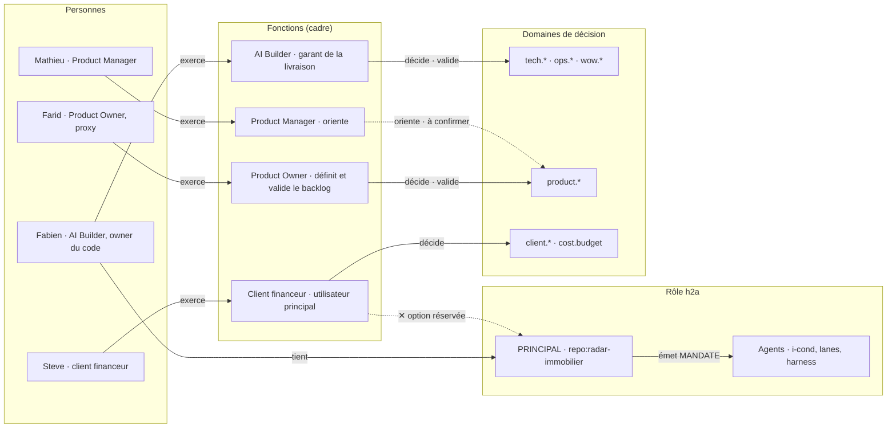
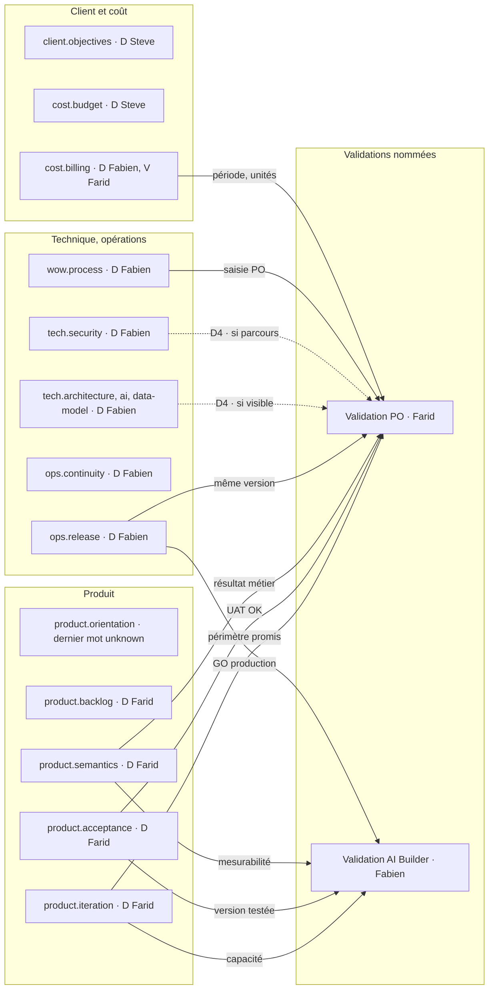
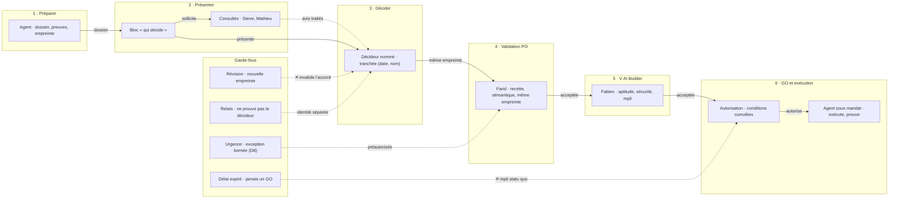
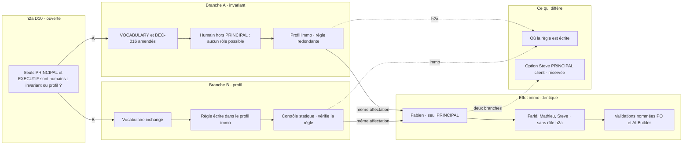
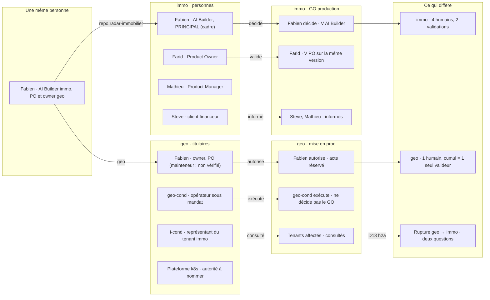

# Rôles et droits de décision dans radar-immobilier : application du modèle de rôles humains issu du quorum h2a

- **Date** : 2026-10-03 (rédaction le 2 octobre 2026 au soir, après la réconciliation du quorum h2a du même jour).
- **Type** : dossier de décision.
- **Nature** : proposition d'application à radar-immobilier du modèle de rôles humains établi par le quorum h2a (Astra, Fable, Gemini, deux rondes, réconciliation du 2026-10-02). Rédigé par Fable 5.1 (conducteur i-cond), relu contradictoirement par Astra (gpt-6-astra, effort xhigh) ; le tableau de consensus des deux relecteurs est en annexe A. Rien n'est retenu dans ce dossier sans ce consensus, ou sans être présenté comme option nommée.
- **Destinataires** : **Farid** (Product Owner) et **Fabien** (AI Builder, owner du code). Chaque décision dit qui la prend : **validation PO (Farid)** et/ou **validation AI Builder (Fabien, owner)**, et qui est consulté. Steve (client, financeur) et Mathieu (Product Manager) sont consultés ; les questions qui relèvent de Steve lui sont **portées**, jamais tranchées à sa place.
- **Statut** : **PROPOSITION**. Aucune décision n'est prise. Aucune écriture dans `rules/` ni dans `docs/governance/` : ce que le dépôt écrira une fois les décisions prises est listé au §12 et fera l'objet d'une PR séparée. Aucune action prod ou cluster, aucun événement Track, aucun droit accordé.
- **Qui décide, pour ce dossier** (bloc du §8 appliqué à lui-même) : Décision : *adopter un modèle de rôles et de droits de décision pour radar-immobilier* · Domaine : `wow.process` · Périmètre : `repo:radar-immobilier`, `origin/main` `27891b10` · Décideur : par décision (§3 : 7 décisions à Farid, 11 à Fabien) · Validation PO : Farid — forme adressée au PO, saisie PO, périmètre de sa validation · Validation AI Builder : Fabien — dispositif technique, dépôt, Track, profil · Consultés : Steve, Mathieu ; quorum h2a (avis) · Présentateur : i-cond (Fable 5.1), agent, ne décide pas · Relecteur contradictoire : Astra · Acte demandé : choix par décision, ou « différer » · Repli : statu quo (aucune règle écrite dans le dépôt).
- **Base vérifiée** : radar-immobilier `origin/main` `27891b10` (2026-10-02 15:44 -0400), lu dans le worktree de la branche `docs/dossier-roles-immo` ; h2a `origin/main` `9a5d7d18` tel que re-mesuré par la réconciliation (non re-mesuré ici : les faits h2a sont cités avec la mention `[FAIT réconciliation]`).
- **État de relecture** : r1. La r0 (Fable seul) a été relue par Astra ; les 15 constats factuels F01-F15 sont corrigés, aucun n'est réfuté ; sur les deux désaccords de fond (D7, D8) Fable se rallie à Astra et conserve sa position r0 comme option nommée ; le détail, point par point, est en annexe A. L'accord d'Astra sur la r1 n'est pas re-mesuré (`non vérifié`) : chaque ligne de l'annexe dit l'état par version.
- **Entrées** : `reconciliation.md` **r1** (SHA-256 `b9225a37ce008702407d4751648aef13727bc9933e9c6d26dcf816b877952174` ; la r0 `8c505abe…54fe0503` est conservée sous `reconciliation-r0.md` ; les lignes citées `R:n` sont celles de la r1), `position-immo.md` (`cdee6ae08c8c…f3975abd74`), `position-geo.md` (`7c4cab12fccd…3a745a952f9c`) — empreintes complètes en réconciliation §0, `r1-*.md`, `r2-*.md` ; dossier h2a `2026-10-02-h2a-human-roles-decision-dossier.html` (en relecture, non ratifié) ; cadre fixé par l'owner, repris tel quel au §1.
- **Méthode** : lecture du dépôt par `git` et Node uniquement (0 Python) ; une seule lecture GitHub, en lecture seule : la visibilité du dépôt (`gh repo view`, confirmée par Astra sur l'API publique le 2 octobre 2026, 22:43 EDT) ; aucune requête prod ou préprod. Permissions des personnes, reviewers des Environments et protections de branche effectives : `non vérifié`.

Conventions : **FAIT** = constaté dans une source citée (`fichier:ligne` sur `27891b10`, ou pièce du quorum) · **CADRE** = fixé par l'owner, prime sur tout le reste · **JUGEMENT** = appréciation des auteurs · `non vérifié`, `unknown`, `source manquante`, `N-A` = limites déclarées. Lettres : **D** décide (une seule personne) · **V** valide (refus motivé sur critères nommés, avant exécution, sans initiative) · **C** consulté (avis tracé, sans veto) · **I** informé · **R** prépare ou exécute · **H** réserve humaine (jamais un agent en D ni en V).

---

## 1. Intention du dossier, objectifs de l'owner

Reformulation de la demande de l'owner, avant toute modélisation. Chaque objectif renvoie à l'endroit du dossier qui y répond.

| # | Objectif de l'owner | Où le dossier y répond | Décisions |
|---|---|---|---|
| O1 | **Appliquer à radar-immobilier** le modèle de rôles humains issu du quorum h2a : affecter chaque personne, sans présumer des décisions h2a encore ouvertes. | §4 (ce que le quorum a établi, ce qui reste ouvert), §5 (affectation, correspondance h2a, deux branches de D10) ; scènes `roles-perimetres` et `deux-branches-d10` | D1, D2 |
| O2 | Dire, **pour chaque type de décision**, qui décide, qui valide, qui est consulté, qui est informé. | §6 (matrice), §7 (règles de validation PO et AI Builder) ; scènes `matrice-decide-valide` et `circuit-validation` | D3 à D9 |
| O3 | Faire que **chaque dossier et chaque question** disent clairement qui décide : validation PO (Farid) et/ou validation AI Builder (Fabien, owner), et qui est consulté — dans les dossiers, les questions, Track, les cartes GitHub et le board. | §8 (règle de présentation « qui décide »), §12 (ce qui sera écrit) | D10 à D15 |
| O4 | Que Farid **et** Fabien voient chacun clairement les décisions qui leur reviennent. | §3 (deux tableaux séparés), §10 (chaque décision porte « Décide : … · Consulté : … ») | toutes |
| O5 | Rester cohérent avec geo, où Fabien est PO et owner complet. | §9 (comparaison immo / geo) ; scène `immo-vs-geo` | D1, D16 |

Contraintes de forme : dossier en français ; 0 Python (Node/TS) ; aucune attribution IA dans un commit ou une PR ; aucun fait inventé ; aucune action prod ; rien n'est commité ni fusionné par ce travail ; rien n'est écrit dans `rules/` ni `docs/governance/`.

### 1.1 Cadre fixé par l'owner, repris tel quel

`CADRE` — prime sur toute proposition de ce dossier et du quorum.

- Steve : client (financeur) et utilisateur principal.
- Mathieu : Product Manager (oriente).
- Farid : Product Owner / proxy (définit et valide le backlog).
- Fabien : AI Builder, **owner du code et seul PRINCIPAL pour le code du dépôt**, garant de la livraison.
- Dans h2a, seuls PRINCIPAL et EXECUTIF sont humains.
- Chaque dossier et chaque question dit clairement qui décide : **validation PO (Farid)** et/ou **validation AI Builder (Fabien, owner)**, et qui est consulté.
- Le dossier s'adresse à Farid **et** à Fabien.

Toute proposition qui s'écarte de ce cadre est présentée comme **option nommée, non retenue par défaut**.

---

## 2. Destinataires et rôles

Ce dossier s'adresse à Farid et à Fabien. Il est rédigé pour les deux : la partie produit (ce que couvre la validation PO, la recette, l'orientation, la surface de travail du PO) revient à Farid ; la partie dispositif (affectation h2a, profil, contrôle statique, Track, identités, urgence, facturation) revient à Fabien.

| Personne | Fonction (cadre) | Ce qu'on attend de lui dans ce dossier |
|---|---|---|
| Steve Chaperon | Client (financeur) et utilisateur principal | **Consulté** sur la recette, l'usage et le coût. Quatre questions lui sont **portées** (délégation à Mathieu, droit de reprise sur la recette, responsable légal des données, seuils budgétaires) : D17 (par Farid) et D18 (par Fabien). Il n'est pas sollicité pour ratifier le dispositif interne ; il reste décideur des actes qui relèvent de son autorité (objectifs, financement, délégations) ; ses réponses, quand elles arriveront, seront consignées avec leur source. |
| Mathieu Portier | Product Manager : oriente | **Consulté** sur l'orientation produit et la traduction en backlog. Son droit de dernier mot sur `product.orientation` est `non vérifié` : c'est l'objet de D7 et D17. |
| Farid | Product Owner / proxy : définit et valide le backlog | **Décide** : 7 décisions (D3, D4, D6, D7, D11, D12, D17). **Valide (PO)** : D5, D8, D9, D10. |
| Fabien | AI Builder : owner du code, seul PRINCIPAL du dépôt, garant de la livraison | **Décide** : 11 décisions (D1, D2, D5, D8, D9, D10, D13, D14, D15, D16, D18). **Valide (AI Builder)** : tout ce qui, dans les décisions de Farid, engage le dispositif (D11, D12). |
| Agents (i-cond, lanes, harness, présentateur) | CONDUCTOR, AGENTS, CONTROL, MANDATAIRE | Préparent, exécutent, présentent, contrôlent ; **jamais D, V ni arbitre**. Fable 5.1 (auteur) et Astra (relecteur) sont consultatifs. |

Chaque décision porte la mention « Décide : … · Consulté : … » (§3 et §10). Quand une validation PO ou AI Builder s'ajoute à la décision, elle est écrite « · Validation PO : Farid » ou « · Validation AI Builder : Fabien ».

### 2.1 Termes utilisés

| Terme | Sens dans ce dossier |
|---|---|
| h2a | Protocole de coordination entre agents et humains utilisé par les dépôts sentropic (h2a, radar-immobilier, geo). Il connaît six rôles protocolaires ; il ne connaît pas, aujourd'hui, les fonctions métier (PO, PM, client). |
| PRINCIPAL, EXECUTIF | Les deux rôles h2a tenus par des humains dans le cadre owner. Le PRINCIPAL « possède le but » d'un périmètre, émet les mandats, signe les contrats. L'EXECUTIF couvre un périmètre englobant plusieurs PRINCIPALs ; il n'y en a pas pour radar-immobilier. |
| CONDUCTOR, AGENTS, CONTROL, MANDATAIRE | Les quatre rôles h2a des agents : conducteur (i-cond), lanes de travail, contrôle (harness, cyber), présentateur neutre d'une décision. |
| Décision h2a D1 à D14 | Les quatorze décisions que le dossier h2a présente à Fabien, owner de h2a (forme du modèle, preuve, Track, DEC…). Elles sont **ouvertes** ; ce dossier n'en présume aucune. |
| D10 (h2a) | La décision h2a sur le statut du cadre « seuls PRINCIPAL et EXECUTIF sont humains » : invariant du protocole (branche A) ou règle de profil par défaut (branche B). Les deux branches sont traitées au §5.3. |
| Profil (de gouvernance) | Le fichier, dans le dépôt, qui déclare personnes, fonctions, domaines de décision et droits D/V/C/I. Il n'existe pas encore ; ce dossier propose de l'écrire (D14). |
| Domaine de décision | Type de décision nommé (`product.backlog`, `ops.release`…) auquel la matrice §6 attache un décideur, des validations, des consultés et des informés. |
| Bloc « qui décide » | Le bloc parsable placé sous le titre de chaque dossier et répété dans chaque question (§8). |
| Validation PO, Validation AI Builder | Les deux validations nommées du cadre : refus motivé sur des critères nommés, avant exécution, sans initiative (un valideur ne choisit pas une autre option à la place du décideur). |
| Réserve humaine | Un domaine dont D et V ne peuvent jamais revenir à un agent, même sous mandat. |
| Track | Journal de décisions et d'avancement du dépôt (`.track/events.jsonl`), écrit par la CLI `track`. |
| Focus | Rendu h2a d'un dossier ou d'une architecture en page autonome (ce fichier `decision-focus.html`). |
| Carte, board | Une issue GitHub (« carte ») et le projet GitHub où elles sont rangées (« board ») ; surface de travail du PO. |
| Incrément 0, 1, 2 | Le séquencement du quorum : 0 = convention et contrôle statique dans les dépôts, sans toucher h2a ; 1 = profil additif lu par h2a, Track et Focus ; 2 = activation qui change des contrats, sous DEC h2a. Ce dossier couvre l'incrément 0 et prépare le 1. |
| `non vérifié`, `unknown`, `source manquante`, `N-A` | Ce que le dossier n'a pas pu établir, faute d'accès ou de source. |

---

## 3. Synthèse et décisions demandées

**Recommandation globale (JUGEMENT).** Appliquer dès maintenant, dans radar-immobilier et sans attendre h2a, le noyau sur lequel le quorum converge (séparation personne / fonction / droit / rôle h2a, validations nommées, réserve humaine, incrément 0 dans les dépôts) : un seul PRINCIPAL (Fabien, `repo:radar-immobilier`, selon le cadre ; aucun enregistrement h2a n'existe), trois humains décideurs sans rôle h2a (Farid, Mathieu, Steve), des droits attachés à des **fonctions** et à des **domaines de décision** (forme recommandée par Astra et Fable ; Gemini préfère le rattachement direct à la personne, voir §4.2), deux validations nommées (PO, AI Builder) sur critères, et un bloc « qui décide » parsable dans chaque dossier, chaque question, chaque décision Track et chaque carte de type décision — dont la cohérence déclarée est vérifiée par un contrôle statique Node/TS dans le dépôt. L'affectation des personnes est **identique sous les deux branches** de la décision h2a D10 ; seule change la place où la règle « seuls PRINCIPAL et EXECUTIF sont humains » est écrite. Aucune autorité n'est inventée : là où une source manque (délégation à Mathieu, responsable légal, seuils budgétaires, droit de reprise de Steve), la case reste `unknown` et la question est portée à Steve.

| Sujet | Constat déterminant | Recommandation |
|---|---|---|
| Gouvernance humaine écrite | **FAIT.** Sur `27891b10`, `docs/governance/` n'existe pas ; aucun `CODEOWNERS`, `CONTRIBUTING`, `GOVERNANCE`. `rules/MASTER.md` et `rules/conductor.md` ne connaissent qu'un « user » / « owner » unique, sans nom, et un conducteur « human or agent » (`rules/workflow.md:22`). | Écrire le profil (D14) et la règle de présentation (D10) ; PR séparée (§12). |
| Qui écrit les décisions | **FAIT.** Track : 1048 événements, **1048** portent `by: human:fabien.antoine@m4x.org` ; `accountable` vaut toujours `rhanka` (106 occurrences sur le journal entier) ; aucun champ consulté, informé ni validation ; 17 `decision.created`, 17 `decision.outcome` (15 `go`, 2 `deferred`), 13 `decision.option-selected`. Cela établit un identifiant d'**écriture** unique, pas l'auteur effectif des décisions relayées. | Le relais (`by`) n'est pas le décideur ; nommer le décideur attendu puis l'auteur effectif dans `--context` jusqu'aux champs natifs (D13). |
| Rôle h2a enregistré | **FAIT.** Aucun `org.h2a.yaml`, aucun `.h2a/` ni `registry/` versionné sur `main` (des répertoires locaux non suivis existent dans le checkout principal : `non versionné`). Fabien est PRINCIPAL **selon le cadre owner** ; aucun enregistrement h2a ne l'établit. | Un seul PRINCIPAL déclaré dans le profil ; aucun rôle h2a pour Farid, Mathieu, Steve (D1). |
| Validation humaine de la production | **FAIT (déclaré).** Les workflows référencent l'Environment `production` (`build-push-images.yml:1092`, `rollback.yml:75`) et documentent en **commentaire** une garde par reviewer : « (tag refs + reviewer) … Held until owner GO » (`:1072-1073`), prod « owner-gated » (`rollback.yml:11-12`). La configuration GitHub effective (reviewer, titulaire, périmètre) est `non vérifié`. | `ops.release` : D Fabien + V AI Builder, V PO Farid sur la même version (§6) ; l'Environment porte la trace de l'acte, pas la preuve de la recette. |
| Format des questions | **FAIT.** `rules/conductor.md:66-69` : questions `BRxx-Qn` avec décision, options, recommandation — **aucun champ décideur**. | Bloc réduit par question (D11), règle dans `rules/conductor.md` (§12). |
| Autorités non établies | **FAIT.** Aucune source ne nomme un responsable légal des données (Loi 25) ; `decision-proprietaires-lots-geo-loi25.md:4` : « Décideur: rhanka / utilisateur projet » ; `:25` : « Déclaration Loi 25 à prévoir ». Délégation Steve → Mathieu : seule trace, le walkthrough « Steve × Fabien × Mathieu » (`SPEC_REORIENTATION_GRAND_FILET.md:3`). | `unknown` écrit tel quel ; questions portées à Steve (D17, D18). |

### Décisions demandées (D1 à D18)

Farid décide le périmètre de sa validation, la recette, l'orientation telle qu'elle entre au backlog, et sa surface de travail ; Fabien décide le dispositif. Steve et Mathieu sont consultés là où leur avis porte.

| # | Décision | Décide · Consulté | Option recommandée | Alternatives |
|---|---|---|---|---|
| D1 | Affectation des personnes et correspondance h2a | **Fabien** · Steve, Farid, Mathieu | **(a)** Fabien seul PRINCIPAL `repo:radar-immobilier` ; Farid, Mathieu, Steve humains décideurs sans rôle h2a | (b) Steve PRINCIPAL `client:radar` (option réservée, après D7 h2a) ; (c) différer |
| D2 | Règle « seuls PRINCIPAL et EXECUTIF sont humains » dans le profil immo, sous les deux branches de D10 h2a | **Fabien** · Farid | **(a)** écrire la règle dans le profil immo maintenant (tient sous A et B) | (b) attendre la DEC h2a ; (c) ne pas l'écrire |
| D3 | Périmètre et critères de la Validation PO | **Farid** · Fabien, Mathieu, Steve | **(a)** cinq critères : recette de la version, sémantique métier visible, oracle et seuils métier, saisie PO, effets du coût refacturé sur le produit | (b) recette seule ; (c) recette + tout ce qui est visible du client |
| D4 | Déclencheurs de la Validation PO sur une décision technique | **Farid** · Fabien | **(a)** qualité servie, coût refacturé, droit ou parcours produit, saisie PO ; sinon Farid C et V PO `N-A` motivé ; effet `unknown` = à instruire | (b) toujours V PO ; (c) jamais, C seulement |
| D5 | Ordre du backlog et engagement d'itération | **Fabien** · Validation PO : **Farid** | **(a)** Farid ordonne seul (Fabien C) ; contenu d'itération = D Farid ; engagement de livraison et échéance = D Fabien + V AI Builder, V PO sur le périmètre promis (deux actes liés) | (b) V AI Builder aussi sur l'ordre ; (c) Fabien C partout |
| D6 | Recette : qui porte « UAT OK » | **Farid** · Steve, Fabien | **(a)** Farid D + V PO ; Steve consulté, remontée via Farid ; Fabien V AI Builder (version testée) ; une acceptation contractuelle client, si elle existe, est établie séparément | (b) droit de reprise convenu entre Steve et Farid (question portée, D17) ; (c) Steve valide chaque recette |
| D7 | Orientation produit : décideur inscrit tant que la délégation n'est pas écrite | **Farid** · Mathieu, Steve, Fabien | **(c)** dernier mot `unknown` : Mathieu exerce la fonction d'orientation du cadre, Farid garde définition et validation du backlog, Steve garde objectifs et financement ; seuls les engagements qui exigent l'autorité non établie sont suspendus ; question portée (D17) | (a) Steve décideur par défaut, « délégation : `non vérifié` » (Fable r0) ; (b) Mathieu D « à confirmer » |
| D8 | Urgence production (hotfix) | **Fabien** · Validation PO : **Farid** | **(a)** procédure d'urgence **préautorisée et bornée**, définie avant incident par Fabien et Farid (actes admissibles, critères, exclusions, preuves, durée, information, repli) ; revue de Farid après intervention, qui ne vaut pas validation rétroactive ; écart = décision corrective | (b) V PO a posteriori sous 2 jours ouvrés, retrait si refusée (Fable r0) ; (c) toujours V PO préalable ; (d) délégation permanente à Fabien |
| D9 | Facturation (`cost.billing`) | **Fabien** · Validation PO : **Farid** ; Steve informé | **(a)** Fabien D (émetteur), Farid V (période, unités) — proposition à confirmer, fonction contractuelle distincte de la Validation PO | (b) Fabien seul ; (c) Steve V |
| D10 | Bloc « qui décide » dans les dossiers | **Fabien** · Validation PO : **Farid** (forme adressée au PO) | **(a)** bloc complet §8.1 (avec empreinte du profil, décideur attendu, auteur effectif, relais, preuve), sous le titre, répété par question (bloc réduit §8.2, qui garde les consultés) | (b) bloc réduit partout ; (c) différer jusqu'à la réponse h2a |
| D11 | Questions au PO : format réduit, canal, délai et repli | **Farid** · Mathieu · Validation AI Builder : **Fabien** (canal, archivage) | **(a)** bloc réduit §8.2 ; réponse sur la carte GitHub si publiable, sinon preuve archivée hors dépôt à accès approprié et référencée ; délai par défaut 5 jours ouvrés ; repli = statu quo | (b) réunion + compte rendu ; (c) libre |
| D12 | Cartes GitHub et board : conventions de la surface PO | **Farid** · Mathieu · Validation AI Builder : **Fabien** (outillage) | **(a)** carte de type décision = bloc réduit + étiquettes `decide:farid` / `decide:fabien`, et `porte:…` pour une question transmise à Steve ou à une autre autorité ; cartes de décision et d'orientation adressées au PO dans la colonne « Validation PO (UAT preprod, orientations design) » du board, cartes de mise en œuvre en design ou dev ; décisions collées en YAML dans la carte ; créer ou prioriser ≠ engager | (b) étiquettes seules ; (c) pas de convention |
| D13 | Track : décideur, validations, relais | **Fabien** · Farid | **(a)** à la création, décideur **attendu** et base d'autorité dans `--context` ; après réponse, auteur **effectif**, preuve, relais ; `accountable` inchangé ; champs natifs quand `track` les offre (D6 h2a) | (b) attendre les champs natifs ; (c) `accountable` = décideur |
| D14 | Fichier de profil, source unique | **Fabien** · Farid, Mathieu, Steve | **(a)** `docs/governance/roles.profile.json` (parsable, avec provenance, version, validité et révocation de chaque droit) + `docs/governance/ROLES.md` (lisible, contrôlé) | (b) `ROLES.md` seul, tableau parsé ; (c) `org.h2a.yaml` v2 dès maintenant |
| D15 | Contrôle statique Node/TS | **Fabien** · Farid | **(a)** `make check-decisions` (Node) sur `DOSSIER_DECISION_*.md` et `plan/*-BRANCH_*.md`, bloquant en CI pour les transitions engageantes, tolérant pour les brouillons et renseignements `unknown` | (b) avertissement seul ; (c) différer |
| D16 | Identités stables et droits GitHub | **Fabien** · chaque personne confirme son association ; Farid | **(b)** identifiants stables **sans prénom ni adresse encodés** dans le profil + table d'alias (courriel, GitHub) hors dépôt, le dépôt étant **public** ; les prénoms et fonctions affichés restent des données personnelles déjà présentes dans le dépôt ; droits GitHub de Farid re-mesurés et alignés | (a) `human:<courriel>` comme dans Track ; (c) prénoms seuls |
| D17 | Questions produit portées à Steve par Farid | **Farid** · Mathieu, Fabien | **(a)** Farid porte deux fiches : Q17.1 délégation d'orientation (Steve décide, Mathieu accepte, Farid valide l'articulation backlog) ; Q17.2 recette client (renseignement : existe-t-il une acceptation contractuelle ? reprise convenue Steve / Farid) ; réponses consignées avec leur source | (b) Fabien porte ; (c) attendre |
| D18 | Questions contractuelles portées à Steve par Fabien | **Fabien** · Farid | **(a)** Fabien porte deux fiches : Q18.1 responsable légal des données (acte : **renseignement**, source juridique ou contractuelle à produire) ; Q18.2 seuils et délégations de dépense (acte : **décision** de Steve) ; `unknown` jusqu'à réponse | (b) Farid porte ; (c) attendre |

### Décisions de Farid

| # | Décision | Consulté | Recommandation |
|---|---|---|---|
| D3 | Périmètre et critères de la Validation PO | Fabien, Mathieu, Steve | (a) |
| D4 | Déclencheurs de la Validation PO sur une décision technique | Fabien | (a) |
| D6 | Recette : qui porte « UAT OK » | Steve, Fabien | (a) |
| D7 | Orientation produit : décideur inscrit tant que la délégation n'est pas écrite | Mathieu, Steve, Fabien | (c) |
| D11 | Questions au PO : format réduit, canal, délai et repli | Mathieu ; V AI Builder Fabien | (a) |
| D12 | Cartes GitHub et board : conventions de la surface PO | Mathieu ; V AI Builder Fabien | (a) |
| D17 | Questions produit portées à Steve | Mathieu, Fabien | (a) |

Farid porte aussi la **Validation PO** sur quatre décisions de Fabien : D5 (engagement d'itération), D8 (urgence), D9 (facturation), D10 (forme du bloc adressé au PO). Ce décompte porte sur les choix de **dispositif et de portage** ; il ne donne à Farid aucun pouvoir sur le dernier mot de Steve ou de Mathieu.

### Décisions de Fabien

| # | Décision | Consulté | Recommandation |
|---|---|---|---|
| D1 | Affectation des personnes et correspondance h2a | Steve, Farid, Mathieu | (a) |
| D2 | Règle « humains et rôles » dans le profil immo (deux branches de D10 h2a) | Farid | (a) |
| D5 | Ordre du backlog et engagement d'itération | Validation PO : Farid | (a) |
| D8 | Urgence production | Validation PO : Farid | (a) |
| D9 | Facturation | Validation PO : Farid ; Steve informé | (a) |
| D10 | Bloc « qui décide » dans les dossiers | Validation PO : Farid | (a) |
| D13 | Track : décideur, validations, relais | Farid | (a) |
| D14 | Fichier de profil, source unique | Farid, Mathieu, Steve | (a) |
| D15 | Contrôle statique Node/TS | Farid | (a) |
| D16 | Identités stables et droits GitHub | chaque personne ; Farid | (b) |
| D18 | Questions contractuelles portées à Steve | Farid | (a) |

Fabien porte la **Validation AI Builder** sur les décisions de Farid qui touchent le dispositif : D11 (canal et archivage), D12 (outillage des cartes et du board). Ce décompte porte sur le dispositif et le portage ; il ne permet pas à Fabien d'attribuer une responsabilité juridique ni un pouvoir au nom de la partie cliente.

Les options, leurs meilleurs arguments contraires et les conditions qui feraient changer la recommandation figurent au §10.

---

## 4. Ce que le quorum a établi, et ce qui reste ouvert côté h2a

Source : `reconciliation.md` (§3 convergences C1 à C14, §4 désaccords X1 à X12, §7 décisions D1 à D14), dossier h2a du 2026-10-02. Les faits h2a (`fichier:ligne` sur `9a5d7d18`) sont ceux de la réconciliation, non re-mesurés ici.

### 4.1 Points de convergence du quorum — portée et réserves indiquées par ligne

Convergence 3/3 en ronde 2 sauf mention : C13 (Gemini silencieux en R2), C14 (accord d'Astra implicite). Le rattachement des droits aux fonctions n'est **pas** dans ce noyau : c'est une position majoritaire (Astra, Fable), voir X1 au §4.2.

| # | Point établi | Conséquence pour radar-immobilier |
|---|---|---|
| C1 | Les six rôles h2a restent intacts ; aucun rôle métier (PO, PM, client) dans `H2A_ROLES`. | Farid, Mathieu et Steve ne reçoivent **aucun rôle h2a** ; leur fonction est déclarée dans le profil du dépôt. |
| C2 | Quatre objets séparés : personne, fonction, droit par domaine, rôle protocolaire éventuel. | Le profil immo déclare les quatre plans séparément (§5.1, D14). |
| C3 | Pas de PRINCIPAL par défaut pour un humain non-owner ; PRINCIPAL seulement pour une autorité réellement autonome, jamais pour contourner une limite technique. | Steve PRINCIPAL `client:radar` reste une **option réservée** (D1 b), fermée tant que D7 h2a n'est pas appliquée. |
| C4 | Un seul décideur résolu par décision atomique ; une validation est un refus motivé sur critères, pas un vote. | « Double validation PO + AI Builder » = deux validations nommées, chacune sur ses critères, jamais un quorum 2/2 (§7). |
| C5 | Le présentateur ne décide ni ne valide ; le quorum d'experts est consultatif. | i-cond, Fable et Astra n'apparaissent dans aucune colonne D ou V. |
| C6 | Track : `accountable` reste le sponsor ; ajouts additifs ; le relais `by` n'est pas le décideur. | D13 : ne pas redéfinir `accountable` ; nommer le décideur ailleurs. |
| C7 | Chaque accord est lié à l'empreinte de l'objet soumis ; une révision n'hérite d'aucun accord. | §7.5 : révision = nouvelle validation ; correction de présentation ≠ révision. |
| C8 | Réserve humaine typée par domaine ou par acte. | Colonne H de la matrice §6. |
| C9 | L'attestation h2a « sous mandat » proposée par la position immo n'est pas faisable pour un humain sans rôle. | Aucune attestation h2a n'est demandée à Farid, Mathieu, Steve ; la preuve de leur acte est une **référence externe** qui porte son statut (`vérifié` / `non vérifié`) ; un éventuel reçu natif dépend du choix et de l'application de D5 h2a, encore ouverts. |
| C10 | Incréments : convention et contrôle statique d'abord (0), profil additif (1), activation sous DEC (2). | Ce dossier = incrément 0 ; D14 prépare le 1 sans l'activer. |
| C11, C12 | Durcir le scope des signataires et la ratification au provisioning avant tout PRINCIPAL ajouté ou profil opposable. | Le profil immo n'est **pas opposable à h2a** tant que ces DEC ne sont pas actées ; il engage le dépôt et ses règles. |
| C13 | Responsabilité légale des données jamais déduite d'un titre ; `unknown` sans source. | `tech.security` : Steve C, V conditionnelle `unknown` (D18). |
| C14 | Vocabulaire D/V/C/I ; le « A approuve » de geo devient V. | Mêmes lettres ici et à geo (§9). |

### 4.2 Désaccords du quorum qui touchent immo

| # | Désaccord | État au quorum | Traitement ici |
|---|---|---|---|
| X1 | Droits liés à une fonction (Astra, Fable) ou directement à la personne ou à l'instance (Gemini). | 2 contre 1, décision h2a D3 ouverte. **Les deux options représentent un agent sous mandat** (R:79, correction r1). | Le profil immo lie **fonction → titulaire** (D14) : l'indirection permet de remplacer un titulaire sans réécrire chaque règle ; le rattachement direct réduit les renvois pour un collectif stable. Proposition locale, sans préjuger de D3 h2a ; si h2a tranchait B, le profil immo se projette sans perte (une fonction, une personne). |
| X6 | Séparations de personnes obligatoires. | Astra : nommées par acte ; Fable : `validator ≠ executor` par défaut sur `ops.release`. | Immo, proposition locale : Farid porte la recette métier d'une livraison **avant** le GO ; Fabien porte le GO technique et peut aussi opérer. Une certification **après** déploiement (celle que geo exige, position geo §2) devrait définir séparément son objet, son certificateur et ses incompatibilités de personnes : `not covered` ici. Position de Fable révisée vers celle d'Astra ; « Fabien seul opérateur » est `non vérifié`. |
| X11 | Orientation produit immo : Steve décideur par défaut (Fable, Gemini) ou ne pas substituer automatiquement (Astra). | Renvoyé à i-cond. | **D7** : trois options nommées ; la recommandation r1 (c) laisse le dernier mot `unknown` sans suspendre les droits déjà établis de Mathieu (oriente) et de Farid (backlog) ; la position r0 de Fable (Steve par défaut) reste l'option (a). Voir annexe A. |
| X12 | Faits d'exemple non sourcés (Fabien V sur `cost.budget`, Steve V sur `tech.security`). | Contestés en ronde 2. | Matrice §6 : Fabien **C** sur `cost.budget` ; Steve **C** sur `tech.security`, V conditionnelle `unknown`. |

### 4.3 Ce qui reste ouvert côté h2a, et ce que ce dossier n'en présume pas

Les quatorze décisions h2a sont présentées à Fabien comme owner de h2a et **ne sont pas prises**. Pour chacune, ce que ce dossier fait et ne fait pas :

| h2a | Objet | Ce que ce dossier en présume | Ce qui, ici, dépendrait de son issue |
|---|---|---|---|
| D1 | Forme du modèle | Rien ; le profil immo est un JSON local lu par Node (D14), projetable vers `org.h2a.yaml` v2 si E1 est adoptée | la projection vers h2a |
| D2 | Représentation d'un humain sans rôle | Rien ; représentation 3/3 (A) reprise comme **cadre**, pas comme décision h2a | une attestation ou signature native pour Farid, Mathieu, Steve |
| D3 | Liaison des droits | Rien ; fonction → titulaire retenu localement (X1) | la forme du manifeste v2 |
| D4 | Grammaire du profil | Rien ; verbes D/V/C/I/R locaux, résolution exacte, séparations nommées | la compatibilité du profil local avec la grammaire h2a |
| D5 | Preuve de l'acte humain | Rien ; preuve = référence externe avec son statut ; aucun reçu annoncé comme certain | le passage de `non vérifié` à vérifié pour les actes de Farid, Mathieu, Steve |
| D6 | Track et Focus | Rien ; bloc dans `--context`, `accountable` inchangé (D13) | les champs natifs `decidedBy`, `decision.validated` |
| D7 | Scope des signataires | Rien ; aucun PRINCIPAL ajouté | l'ouverture de l'option Steve PRINCIPAL (D1 b), avec les autres conditions listées |
| D8 | Ratification au provisioning | Rien ; aucun manifeste provisionné | l'opposabilité du profil à h2a |
| D9 | Escalade routée | Rien ; escalade humaine et nommée (§7.4) | une escalade outillée |
| D10 | Statut « seuls PRINCIPAL et EXECUTIF sont humains » | Rien ; les deux branches sont traitées (§5.3) | où la règle est écrite ; l'effet immo est identique |
| D11 | Identités humaines | Rien ; identifiants stables sans donnée personnelle encodée, alias hors dépôt (D16), même forme que l'option A h2a | l'authentification des personnes |
| D12 | Autorités extérieures | Rien ; responsable légal et plateforme k8s restent `unknown`, référencés comme autorités extérieures sans projection de l'ownership du code (D18, §9) | la résolution `external-holder-unresolved` |
| D13 | Rupture d'un contrat servi | Rien ; la convention geo (consultation obligatoire, accord pour un nouvel engagement) est **décrite**, pas ratifiée côté h2a (§9) | l'amendement bisigné si un CONTRACT h2a existait (`non vérifié`) |
| D14 | Séquencement | Rien ; l'incrément 0 est proposé **sous réserve d'adoption** par Fabien (D10, D15), pas acquis | l'ordre des incréments 1 et 2 |

Réciproquement, ce que ce dossier fixe — l'affectation des personnes, la matrice, le bloc, le contrôle statique — correspond à l'**incrément 0** que le quorum propose aux dépôts consommateurs (C10 ; D14 h2a option A) ; i-cond portera ce dossier comme avis consultatif sur les décisions h2a. **Ratification partielle** : les lots G1 à G6 du §12 ne dépendent d'aucune décision h2a ; seuls G8 (projection vers le manifeste v2) et l'option D1 (b) en dépendent ; une autorité extérieure `unknown` (D17, D18) laisse la case correspondante `unknown` sans bloquer le reste.

---

## 5. Application à radar-immobilier : affectation des personnes

### 5.1 Affectation et correspondance h2a

| Personne | Fonction (cadre) | Droits de principe (§6) | Correspondance h2a par défaut | Option nommée |
|---|---|---|---|---|
| **Fabien** | AI Builder, owner du code, garant de la livraison | **D** sur `tech.*`, `ops.*`, `wow.process`, `cost.billing` ; **V AI Builder** sur toute décision produit qui engage une livraison | **PRINCIPAL**, scope `repo:radar-immobilier` — selon le cadre owner ; seul PRINCIPAL déclaré dans le profil ; **aucun enregistrement h2a** n'existe (§5.2) ; émettra les mandats des agents | — |
| **Farid** | Product Owner / proxy | **D** sur `product.backlog`, `product.iteration`, `product.acceptance`, `product.semantics` ; **V PO** sur toute décision technique visible du client (D4) | Humain décideur **sans rôle h2a** ; identité stable et fonction déclarées dans le profil | — |
| **Mathieu** | Product Manager | **C** sur tout le produit ; **D** sur `product.orientation` seulement si Steve le délègue par écrit (D7, D17) | idem Farid | — |
| **Steve** | Client (financeur), utilisateur principal | **D** sur `client.objectives`, `cost.budget` ; **C** sur recette, usage, coût ; V conditionnelle sur `tech.security` si responsable légal nommé (D18) | idem Farid | **O-D1.b** : PRINCIPAL `client:radar`, réservée, après D7 h2a |
| Agents | i-cond (conducteur), lanes, harness, cyber, présentateur | Préparent, exécutent, présentent, contrôlent. Ne décident ni ne valident les **actes réservés aux humains** (colonne H du §6) et n'arbitrent pas les désaccords humains ; peuvent prendre les décisions opérationnelles ordinaires **explicitement déléguées** (`tech.*` sous mandat de Fabien), la trace nommant alors l'agent, son mandant et le mandat borné. Le présentateur d'une question ne décide ni ne valide cette question. | CONDUCTOR, AGENTS, CONTROL, MANDATAIRE | — |

Aucun EXECUTIF : radar-immobilier n'est pas un périmètre englobant plusieurs PRINCIPALs (A6 de la position immo). Le lien Steve ↔ Fabien est un contrat client-fournisseur, pas une fédération h2a.

### 5.2 État mesuré du dépôt (`27891b10`)

| Point | Constat | Source |
|---|---|---|
| Gouvernance écrite | `docs/governance/` absent ; `CODEOWNERS`, `CONTRIBUTING`, `SECURITY`, `GOVERNANCE` absents ; `.github/` ne contient que `workflows/`. | arborescence |
| Rôles dans les règles | `rules/MASTER.md` vise « the agent » ; décisions attribuées à « the owner » sans nom (`:112`, `:139`) ; `rules/conductor.md:12` : « The conductor owns PLAN.md, schedules branches, dispatches work » ; `rules/workflow.md:22` : « Conductor (human or agent) » ; `:51` : « CI green is mandatory before merge », aucun approbateur humain de PR exigé. | FAIT |
| Mentions nominatives | Fichiers versionnés à `27891b10`, sous `docs/`, `rules/`, `plan/`, `.track/`, recherche insensible à la casse (`git grep -il`) : Steve : 49 ; Mathieu : 14 (dont des toponymes « Saint-Mathieu ») ; Fabien : 11 ; Farid : 4 (dont « période de facturation Farid », `methode-unites-facturation.md:7`) ; « Product Manager », « AI Builder », « Product Owner » : 0. | FAIT (re-mesuré par les deux relecteurs) |
| Track | 1048 événements, tous `by: human:fabien.antoine@m4x.org` ; `accountable: rhanka` (106) ; `decision.created` 17, `decision.outcome` 17 (15 go, 2 deferred), `decision.option-selected` 13 ; exemple `events.jsonl:941` (M1, `decisionKind: orientation`, `prov.auth: local-user`) : aucun champ consulté, informé ni validation. Binaire global `@sentropic/track` 0.97.10, hors dépôt. | FAIT |
| h2a dans le dépôt | aucun `*.h2a.yaml`, aucun `.h2a/`, `identity/`, `registry/` versionné ; `rules/` ne mentionne ni h2a, ni MANDATE, ni PRINCIPAL ; `docs/spec/SPEC_EVOL_OPERATING_MODEL.md:23-24` (hypothèse hors V1) : « PRINCIPAL = des humains : toi …, responsable produit … Jamais l'IA ». | FAIT |
| Production | Le code référence l'Environment `production` (`build-push-images.yml:1092`, `rollback.yml:75`) ; les **commentaires** documentent une garde par reviewer : « (tag refs + reviewer) … Held until owner GO » (`build-push-images.yml:1072-1073`), prod « owner-gated », préprod non gardée (`rollback.yml:11-12`) ; `bascule-preprod.yml:235` : « la PLANIFICATION EST le GO (0 owner-in-the-loop) » ; `bascule-bundle-cd.yml:327-332` : `radar-backup-prod` sans reviewer requis. Configuration GitHub effective (reviewer, titulaire, périmètre) : `non vérifié`. | FAIT (déclaré dans le code) |
| Visibilité du dépôt | `visibility: PUBLIC`, `isPrivate: false` (`gh repo view` et API publique, 2026-10-02). Conséquence : le profil n'ajoute aucune donnée personnelle nouvelle au-delà des prénoms et fonctions déjà présents dans le dépôt (D16). Le courriel de Fabien figure déjà dans `.track/events.jsonl` (`by`) ; le caractère volontaire de cette publication est `source-gap`. | FAIT |
| Protection de branche | « Branch protection on main : deferred » (`plan/done/00-BRANCH_chore-scaffolding-base.md:130`) ; aucune autre mention ; état réel GitHub `non vérifié`. | FAIT |
| Board, cartes | Les issues sont appelées « cartes » ; le Kanban existe comme décision Track (« Kanban v9 », `events.jsonl:967`) et comme demande (`track-demande-evolution-2026-06-28.md:28`) ; aucun GitHub Project documenté ; droits de Farid sur le dépôt et le projet `non vérifié`. | FAIT |
| Dossiers de décision | `DOSSIER_DECISION_M1_V4_2026-09-17.md` (« décision owner actée »), `study-2026-08/OWNER_DECISIONS.md` ; aucun bloc « Décide / Consulté », « Validation PO » ni « Validation AI Builder » sur `main`. Le dossier Steve (`docs/dossier-retours-steve`, branche non fusionnée) emploie « Décide : … · Consulté : … » par décision. | FAIT |
| Skill `present-decision` | absente du dépôt ; installée globalement (`~/.claude/skills/present-decision/SKILL.md`) ; `:80` : « Do NOT record the bridge/relay principal as the human decider ». | FAIT |
| Loi 25 | `rules/security.md:35-38` : PII, « Confirm with the user » ; aucune mention de Loi 25 dans `rules/` ; `decision-proprietaires-lots-geo-loi25.md:4` « Décideur: rhanka / utilisateur projet », `:25` « Déclaration Loi 25 à prévoir » ; responsable légal : **absent**. | FAIT |

Lecture (JUGEMENT) : le journal du dépôt utilise un identifiant d'écriture unique associé à Fabien, sous deux formes (`rhanka` pour GitHub et `accountable`, `human:fabien.antoine@m4x.org` pour Track). Cela établit une centralisation de la **trace**, pas l'auteur effectif ni l'autorité des décisions relayées. Les décisions de Farid, Mathieu et Steve existent (walkthrough, cartes, courriels, verbatims cités dans les spécifications) mais ne sont écrites nulle part avec leur nom en position de décideur. L'incrément 0 corrige cela sans toucher h2a.

### 5.3 Les deux branches de la décision h2a D10

La décision h2a D10 demande une DEC sur le statut du cadre « seuls PRINCIPAL et EXECUTIF sont humains » : **(A)** invariant protocolaire (VOCABULARY et DEC-016 amendés) ou **(B)** règle de profil par défaut du parc, vocabulaire inchangé (le dossier h2a recommande B, JUGEMENT de son auteur). `[FAIT réconciliation]` le vocabulaire h2a est aujourd'hui plus large : CONDUCTOR « may be a human », CONTROL « Held by a CLI agent or a human », AGENTS « human in operator mode » (`VOCABULARY.md:48, :73, :91`) ; rien dans le code n'applique une contrainte humain/agent par rôle.

| | Branche A — invariant protocolaire | Branche B — règle de profil |
|---|---|---|
| Ce que h2a écrit | VOCABULARY §1.2-1.5 et DEC-016 amendés : seuls PRINCIPAL et EXECUTIF peuvent être humains. | Rien dans le vocabulaire ; une règle de profil par défaut, vérifiée par le contrôle statique de chaque dépôt. |
| Conséquence pour Farid, Mathieu, Steve | Aucun humain ne peut tenir CONTROL, AGENTS ni CONDUCTOR ; un humain reste **décideur ou valideur sans rôle h2a** (D2 h2a, option A). PRINCIPAL ou EXECUTIF ne lui est attribué que si l'autorité et le périmètre correspondants sont établis ; le risque X9 est celui d'une conversion **injustifiée** vers PRINCIPAL, pas une obligation. | Aucun rôle h2a par défaut ; un humain en CONTROL resterait possible dans un autre dépôt, pas dans immo si son profil l'exclut. |
| Affectation immo | **Identique** : Fabien seul PRINCIPAL ; trois humains décideurs sans rôle ; validations nommées PO et AI Builder. | **Identique**. |
| Règle écrite dans le profil immo (D2) | Redondante avec h2a ; conservée pour que le contrôle statique du dépôt la vérifie sans dépendre de la version de h2a. | **Nécessaire** : c'est le profil qui porte la règle. |
| Option Steve PRINCIPAL `client:radar` | Reste réservée : conforme à la lettre de A, fermée tant que D7 h2a (scope des signataires) n'est pas appliquée. | Idem. |
| Ce que ce dossier ne présume pas | Le contenu de la DEC. | Le contenu de la DEC. |

Conclusion (JUGEMENT) : avis de Fable, **D2 (a)** — écrire la règle dans le profil immo maintenant — tient sous les deux branches sans rien préjuger : sous B elle est nécessaire, sous A elle est redondante et inoffensive. Avis d'Astra (relecture de la r0) : accord sur la règle locale sous les deux branches, sous réserve de la description corrigée de la branche A ci-dessus ; différer l'écriture (D2 b) ne trancherait pas davantage D10 h2a. La scène `deux-branches-d10` le montre.

---

## 6. Matrice décide / valide / consulté / informé par type de décision

Base : matrice de la position immo §3.2 (consensus Astra + Fable), corrigée des relectures de ronde 2 (X11, X12), du cadre et de la relecture r1 (un seul D par acte atomique ; actes de `ops.*` distingués ; réserve humaine explicite). **R** (préparer, exécuter) est toujours nommé séparément dans le dossier : un agent, ou Fabien en mode opérateur. Colonne **H** : **H** = acte réservé aux humains (jamais un agent en D ni en V) ; **délégable** = décision ordinaire qu'un agent peut porter sous mandat explicite de Fabien, hors actes réservés listés à la règle 6. Les cases **?** sont `unknown` tant que la question portée à Steve n'a pas de réponse (D17, D18). C'est une proposition : aucune case n'est ratifiée.

| Domaine | Exemples (corpus) | Steve | Mathieu | Farid | Fabien | H |
|---|---|---|---|---|---|---|
| `client.objectives` — objectifs, périmètre contractuel, enveloppe | Grand filet, walkthrough | **D** | C | C | C | H |
| `product.orientation` — orientation ou pivot dans l'enveloppe | carte-first, 3D | objectifs et enveloppe ; **dernier mot : `unknown` ?** (délégation à Mathieu à établir, D7, Q17.1) | **oriente** (fonction du cadre) ; D si délégué **?** | **V PO** (traduction en backlog) | C (faisabilité) | H |
| `product.backlog` — définition, ordre, priorités | Kanban « À prioriser » | C | C | **D** (ses critères PO sont couverts par cet acte ; aucune seconde approbation) | C (effort, risques, dépendances) | H |
| `product.iteration` — contenu et priorité d'une itération | Kanban v9 | I | C | **D** | C (capacité, dépendances) | H |
| `product.commitment` — engagement de livraison, échéance réalisable (acte lié au précédent) | Kanban v9 | I | C | **V PO** (périmètre promis) | **D + V AI Builder** | H |
| `product.acceptance` — critères de recette, « UAT OK », parité ; distincte d'une acceptation contractuelle client (`unknown`, Q17.2) | WP5 RECETTE | C (usage terrain) **?** | C | **D + V PO** | **V AI Builder** (version testée, preuves) | H |
| `product.semantics` — sémantique métier visible, oracle métier, seuils de qualité | COLLAB, oracle, dossier Steve | C (vérité terrain) | C | **D + V PO** | **V AI Builder** (mesurabilité, contrats) | H |
| `tech.architecture` — frontières immo/geo/DS, modules, dépendances | 3D maps, boundary | I | I | C ; **V PO** si le contrat produit change | **D + V AI Builder** | délégable |
| `tech.ai` — modèles, prompts, cascade, méthode de benchmark | M1 v2 → v4 | C (coût) | I | **V PO** si qualité servie ou coût refacturé change ; sinon C, V PO `N-A` motivé | **D + V AI Builder** | délégable |
| `tech.data-model` — schéma, migrations, contrats d'API | tombstone, annotations | I | I | C ; **V PO** si le comportement métier change | **D + V AI Builder** | délégable |
| `tech.security` — IAM, clés, auth, données personnelles, Loi 25 | PREPROD, PRA clés, propriétaires de lots | C ; **V conditionnelle ?** (seulement si une source établit la responsabilité légale, Q18.1 ; une inscription au profil ne la crée pas) | I | C ; **V PO** si un droit ou parcours produit change | **D + V AI Builder**, sous contraintes légales | H |
| `ops.merge` — fusion sur `main`, promotion préprod (prépare l'environnement de recette) | CI verte, `bascule-preprod` | I | I | I ; V PO `N-A` (la recette vient après) | **D** (+ V AI Builder = CI et revue) | délégable |
| `ops.release` — **GO production** d'une livraison produit | Environment `production` | I | I | **V PO** (recette de cette version, avant le GO) | **D + V AI Builder** (aptitude, sécurité, repli) | H |
| `ops.continuity` — PRA, backup, restore, break-glass | BACKUP_PRA, bascule | C (RPO, RTO, rétention) | I | C | **D + V AI Builder** | H |
| `wow.process` — way of working, Kanban, Track, rôles, ce dossier | Kanban v1-v9 | C | C | **V PO** (ce qui touche la saisie PO) | **D + V AI Builder** | H |
| `cost.budget` — financement additionnel, dépassement, dépenses récurrentes | sièges, tuiles, coût M1 | **D** (autorité financière ; n'autorise par elle-même ni livraison ni privilège technique) | C | C | C (estimation, alternatives, soutenabilité) | H |
| `cost.billing` — facturation, unités, périodes (D9, à confirmer) | `methode-unites-facturation.md` | I | — | **V** (fonction contractuelle, distincte de la V PO) | **D** | H |

Règles transversales (reprises de la position immo §3.2, révisées) :

1. **Fabien = V AI Builder sur toute décision produit qui engage une livraison** ; **Farid = V PO sur toute décision technique visible du client** (D4 : qualité servie, coût refacturé, droit ou parcours produit, saisie PO). C'est la traduction mécanique du cadre.
2. Une décision mixte (ex. M1 : modèle, couverture métier, surcoût) est **découpée** : Fabien choisit la solution technique, Farid valide critères et résultat métier, Steve autorise le financement. Une note de benchmark ne déclenche aucune approbation par elle-même.
3. **Désaccord D/V** : chacun expose le critère non satisfait ; Farid ne lève pas une réserve technique, Fabien ne déclare pas la recette métier (§7.4).
4. Créer ou prioriser une carte ne demande aucune validation ; **engager en réalisation ou déclarer livré** exige les validations applicables **sur la même version**.
5. Le board GitHub est une surface de travail : la permission d'y créer une carte ne vaut ni fusion ni GO production ; un automate n'infère jamais une recette d'une fusion de PR.
6. **Réserve humaine (H)** : D et V ne reviennent jamais à un agent sur ces domaines, même sous mandat ; un agent y prépare et y exécute en référençant l'autorisation. Sur les domaines **délégables** (`tech.*`, `ops.merge`), un agent peut porter une décision ordinaire sous mandat explicite de Fabien, tracée comme acte d'agent qui nomme le mandant et le mandat borné (position geo §1, réconciliation X4). **Actes réservés en toute circonstance** (jamais délégués, repris de la position geo §7 et adaptés) : GO production, retrait de production, levée d'un kill-switch, mint de clés ou de tokens donnant un nouveau pouvoir, écriture irréversible sur des données servies, changement de rôles ou de droits (ce profil), engagement budgétaire ou contractuel, levée d'un refus lié aux données personnelles.

---

## 7. Règles de validation PO et AI Builder

### 7.1 Ce que chaque validation couvre (critères nommés)

| Validation | Qui | Critères (refus motivé possible sur chacun) | Ne couvre pas |
|---|---|---|---|
| **Validation PO** (D3) | Farid | (1) recette fonctionnelle de **cette version** : parcours, parité des ensembles affichés, cas connus ; (2) sémantique métier visible : catégories, libellés, filtres, états ; (3) oracle et seuils métier : ce qui est compté comme bon ou mauvais ; (4) saisie PO : formats de cartes, de questions, de board qui touchent son travail ; (5) effets sur le produit d'un coût refacturé qui change. | l'aptitude technique, la sécurité, le repli, l'architecture : elle peut les **questionner**, pas les lever ni les refuser. Le critère (5) ne confère ni autorisation de financement (Steve, `cost.budget`) ni fonction contractuelle de facturation (D9). |
| **Validation AI Builder** (cadre) | Fabien | (1) aptitude technique : tests, CI, preuves navigateur ; (2) sécurité et données personnelles ; (3) repli : retour arrière possible et prouvé ; (4) capacité, faisabilité, échéance réalisable ; (5) coût d'exploitation soutenable. | la recette métier et la sémantique : il peut les **questionner**, pas les déclarer. |

Une validation est un **refus motivé sur un critère nommé**, avant exécution. Elle ne choisit pas une autre option à la place du décideur et ne porte aucune initiative. Son acceptation est écrite « acceptée (date, nom, version) » ; son refus « refusée (date, nom, critère n) ».

Quatre actes à ne pas confondre : la **recette PO** (Farid, avant le GO, sur la version candidate) ; l'**acceptation contractuelle client** (Steve, si le contrat la prévoit : `unknown`, Q17.2) ; le **GO technique** (Fabien, `ops.release`) ; la **certification après opération** (contrôle, après déploiement, que ce qui tourne est ce qui a été autorisé : `not covered` par ce dossier, à définir avec son objet, son certificateur et ses incompatibilités de personnes).

### 7.2 Circuit proposé : PO puis AI Builder

Six étapes, montrées par la scène `circuit-validation` :

1. **Préparer** (agent, R) : options, preuves, risques, **empreinte de l'objet soumis** (version, SHA, hash du dossier).
2. **Présenter** (i-cond, présentateur, jamais décideur) : bloc « qui décide » (§8), sollicitation des consultés, avis tracés.
3. **Décider** : la personne nommée choisit ; « tranchée (date, nom) ».
4. **Validation PO** (Farid) : sur la même empreinte ; acceptée ou refusée avec motif.
5. **Validation AI Builder** (Fabien) : sur la même empreinte ; acceptée ou refusée avec motif.
6. **Autoriser et exécuter** : l'autorisation n'existe que si toutes les conditions tiennent (décision + validations applicables + aucune révision depuis) ; un agent sous mandat exécute en référençant l'autorisation ; la preuve d'exécution est jointe.

Le cadre impose de **nommer** les validations applicables (« validation PO et/ou validation AI Builder ») ; il ne fixe pas leur ordre. PO puis AI Builder est le circuit **proposé** pour une livraison : la recette d'une version précède son GO. L'exécution attend toutes les validations applicables sur le même objet et la même version du profil. Quand Fabien est à la fois décideur et valideur AI Builder (`ops.release`), sa réponse couvre les deux **si elle les nomme** ; deux validations nommées portées par une même personne ont un seul valideur et n'apportent aucune indépendance supplémentaire.

### 7.3 Cas où une seule validation s'applique

- Décision produit **sans livraison engagée** (créer, ordonner, décrire une carte) : Farid D ; ses critères PO sont couverts par cet acte, aucune seconde approbation (règle 4 du §6).
- Décision technique **invisible du client** (refactor interne, dépendance, PRA) : Fabien D + V AI Builder ; Farid C ou I selon la ligne de la matrice ; la Validation PO est écrite « `N-A` (motif : déclencheurs D4 non atteints) ». Si l'effet produit est `unknown`, le point est instruit avant de conclure à l'absence de validation.
- Décision client (`client.objectives`, `cost.budget`) : Steve D ; aucune des deux validations ne s'applique à son propre acte ; Farid et Fabien sont consultés ; la question est **portée** à Steve par Farid (produit) ou Fabien (contrat), jamais tranchée à sa place. Les conséquences de sa décision sur une livraison passent ensuite par les actes et validations correspondants.

### 7.4 Désaccord entre décideur et valideur

Chacun écrit le critère non satisfait. Farid ne lève pas une réserve technique ; Fabien ne déclare pas la recette métier. Escalade humaine, nommée, pour **instruire** le désaccord : `product.*` → Mathieu (avis) puis Steve ; `tech.*`, `ops.*` → Fabien reste D ; `cost.*` → Steve. L'escalade ne transfère aucun droit non établi (escalader vers Steve ne lui donne pas le backlog). Toute modification ou résiliation contractuelle suit les pouvoirs et conditions établis par le contrat, dont la portée est `non vérifié` ici. Sans issue, la décision reste suspendue ou son périmètre est réduit explicitement. Aucun délai écoulé ne vaut accord.

### 7.5 Révision, délai, relais, cumul, urgence (garde-fous)

- **Objet soumis** : l'objet canonique d'une décision est le Markdown du dossier (ou de la carte) à une version donnée, identifié par son empreinte SHA-256 et, pour une livraison, par le SHA de la version ; le profil applicable est identifié par son empreinte. Le bloc « qui décide » porte les deux.
- **Révision** : toute modification de l'objet, des options, du périmètre, des critères ou du profil applicable crée une **révision** avec une nouvelle empreinte ; l'accord antérieur ne la couvre pas. Une **correction de présentation** (coquille, mise en page) ne rouvre pas la décision **si** l'objet canonique soumis reste identique et si le lien entre les rendus est tracé (ancienne et nouvelle empreinte, nature de la correction).
- **Délai** : le délai d'une question a un repli écrit (statu quo par défaut) ; son expiration **n'est jamais une approbation**.
- **Relais** : le compte qui relaie une réponse (i-cond, courriel transféré, `by` de Track) est tracé séparément du décideur ; il ne prouve pas le décideur (skill `present-decision:80`).
- **Cumul** : une personne qui tient deux fonctions (Fabien décideur et valideur AI Builder ; Fabien PO et owner à geo) peut porter deux validations nommées ; elles ont un seul valideur et n'apportent aucune indépendance supplémentaire.
- **Urgence** (D8, option retenue) : une validation définie comme préalable ne devient pas rétroactive. Fabien et Farid définissent **avant incident** une procédure d'urgence bornée : actes admissibles, critères d'urgence, exclusions, preuves exigées, durée maximale, information, repli. Dans ce périmètre, Fabien autorise l'intervention et nomme l'exécutant ; les validations applicables sont celles que la procédure approuvée prévoit ; hors déclencheurs D4, la Validation PO est `N-A` motivé. Farid effectue une **revue après intervention**, qui ne vaut pas validation rétroactive ; un écart déclenche une décision corrective (maintien temporaire, correction ou repli) selon les risques constatés, jamais un retrait automatique qui rétablirait la panne. Une restauration de service peut modifier un comportement visible : cette seule propriété ne l'exclut pas de la procédure. Les délais proposés (information sous 24 h, revue sous 2 jours ouvrés) sont des propositions.

### 7.6 Suppléance

Aucune délégation tacite. En l'absence de Farid, la Validation PO attend, ou Farid délègue par écrit, pour une durée et un périmètre nommés, à une personne qu'il désigne (le profil consigne cette délégation avec sa source) ; à défaut, repli = statu quo. En l'absence de Fabien, aucun GO production, aucun acte réservé ; les décisions déléguées sous mandat à un agent continuent dans les bornes du mandat. Qui peut suppléer Fabien sur les actes réservés : `unknown`, question à inscrire au profil (G1).

---

## 8. Règle de présentation « qui décide »

Un seul bloc, identique partout, placé **immédiatement après le titre** d'un dossier et **répété dans chaque question**, y compris détachée (capture, export, carte, courriel). Clé = valeur, ordre fixe, parsable par le contrôle statique (D15). Le vocabulaire des domaines est celui du §6, lu dans le profil (D14), jamais recopié dans un script.

### 8.1 Bloc complet (dossiers, décisions Track)

```
Décision              : <une phrase>
ID                    : <ID dossier> / <ID question>
Acte demandé          : avis | renseignement | choix | validation | autorisation d'exécuter
Domaine               : product.backlog                      # ∈ profil
Périmètre             : repo:radar-immobilier · <environnement>
Objet / empreinte     : <version ou SHA-256 de l'objet canonique soumis>
Profil / empreinte    : docs/governance/roles.profile.json@<version> · <SHA-256> · règle <domaine>
Décideur attendu (D)  : Farid — PO | autorité unknown (à établir : <question>)   # exactement une personne ou unknown
Auteur effectif       : N-A avant réponse | <personne> (date)
Validation PO         : Farid — critères : … — requise | en attente | acceptée (date) | refusée (date, critère) | N-A (motif)
Validation AI Builder : Fabien — critères : … — mêmes états
Autres validations    : Steve — financement (si cost.budget) ; aucune autorité inventée
Consulté (C)          : Mathieu — PM ; Steve — usage
Informé (I)           : …
Présentateur          : i-cond (CONDUCTOR) — agent, ne décide pas cette question
Relais                : <compte qui a transmis la réponse> — distinct du décideur
Préparation / exécution (R) : <agent ou personne>
Base d'autorité       : cadre owner | contrat <réf> | délégation <réf> | profil#<domaine> — source vérifiée | non vérifié
Preuve de l'acte      : <référence externe : carte, écrit archivé, approbation d'Environment> — vérifiée | non vérifié
Couverture du contrôle : déclaratif (contrôle statique) | partial | not covered
Réponse attendue      : GO | NO-GO | option a/b/c | renseignement | critère manquant
Délai / repli         : <date> · repli = statu quo
Statut                : brouillon | renseignement en cours | à trancher | tranchée (date, D) | validations satisfaites | exécution autorisée | exécution prouvée
```

La base d'autorité peut être établie par le cadre owner, un contrat ou une délégation vérifiée **indépendamment** de toute lecture du profil par h2a ; le bloc distingue trois états : autorité établie (source), preuve de l'acte vérifiée, couverture du contrôle informatique.

### 8.2 Bloc réduit (questions `BRxx-Qn`, cartes GitHub de type décision)

Une question détachée conserve : `ID`, `Acte demandé`, `Objet / empreinte`, `Domaine`, `Décideur attendu` (ou autorité `unknown`), `Validation PO`, `Validation AI Builder`, autres validations applicables, `Consulté` (exigé par le cadre owner), `Réponse attendue`, `Délai / repli`, `Base d'autorité`. **Une question de décision sans décideur établi n'est pas transmissible comme décision** : le conducteur la retient et la complète, ou la transforme en **demande de renseignement** (« Acte demandé : renseignement — décision demandée : aucune »), qui, elle, peut circuler précisément pour résoudre une autorité `unknown`, en nommant qui peut répondre et qui décidera de l'usage ; un renseignement ne permet aucun passage à « tranchée » ni à « exécution autorisée ». Le présentateur visé par « ne décide pas » est la posture protocolaire (agent) ; Farid ou Fabien peuvent porter une question sans en être le décideur, et le bloc dit alors « porteur ».

### 8.3 Application par surface

| Surface | Règle | État sur `main` |
|---|---|---|
| Dossier `DOSSIER_DECISION_*.md` | bloc complet sous le titre ; chaque décision du §« Options » porte « Décide : … · Consulté : … » et, s'il y a lieu, « · Validation PO : … » / « · Validation AI Builder : … » ; §« Ce que j'attends de Farid (PO) » puis « … de Fabien (AI Builder) » | aucun bloc (FAIT §5.2) |
| Question `BRxx-Qn` | bloc réduit ; règle ajoutée au « User question / answer protocol » de `rules/conductor.md` (§12, PR séparée) | champs : ID, décision, options, recommandation, impact — pas de décideur (`conductor.md:66-69`) |
| Track `decision.created` | à la création, le contexte nomme le **décideur attendu** et sa base d'autorité ; après réponse, la trace associe l'**auteur effectif**, l'acte, l'option ou validation, les empreintes de l'objet et du profil, la référence de preuve, le relais et le statut de vérification ; `by` reste l'auteur technique de l'écriture ; `accountable` reste le sponsor | 1048/1048 `by` = Fabien ; aucun champ (FAIT) |
| Focus, export | `decidedBy`, `validatedBy[]` nominatifs, jamais « owner » seul ; le compte qui relaie est tracé à part | **`partial`** : l'export de cette page est un bloc YAML à coller dans la carte ou la PR (le JSON reste interne, réservé à la connexion backend) ; il fournit les attributions prévues (`decide`, `consulte`, `role` : décide ou valide), les choix saisis, leur statut (`tranchee`, `differee`, `non_traitee`) et le `decideur` déclaré par « Je suis », `non vérifié` ; auteur effectif, validations effectuées et relais : `not covered` |
| Carte GitHub de type décision | bloc réduit dans le corps ; étiquettes `decide:farid` / `decide:fabien` pour le décideur, `porte:farid` / `porte:fabien` pour une question transmise à Steve ou à une autre autorité (D12) ; une carte « à prioriser » n'en porte pas ; les décisions s'y collent en YAML (bouton « Copier mes décisions (YAML) » de la page Focus) | `non vérifié` (aucun accès GitHub en écriture ici) |
| Board | vue « Décisions » filtrée sur les étiquettes ; les cartes de décision et d'orientation adressées au PO vont dans la colonne « Validation PO (UAT preprod, orientations design) » ; les cartes de mise en œuvre restent en design ou en dev ; créer ou déplacer une carte ≠ engager ; « livré » exige les validations sur la version | Kanban v9 : décision Track, pas de Project documenté ; colonne « Validation PO (UAT preprod, orientations design) » renommée par l'owner (ancien nom « Déployé sur preprod (UAT) »), board lui-même `non vérifié` ici |

### 8.4 Vérification graduée

1. Gabarit et auto-contrôle `present-decision` : « décideur nommé, unique, autorisé par le profil pour ce domaine ; validations PO et AI Builder listées ou `sans objet` motivé ; présentateur ≠ décideur » (ligne de spécification, sans contrôle).
2. **Contrôle statique Node/TS dans le dépôt** (D15) : `make check-decisions` parse le bloc de tout `DOSSIER_DECISION_*.md` et `plan/*-BRANCH_*.md`. Il distingue brouillon, renseignement, décision et autorisation : il **accepte** les lacunes déclarées en brouillon ou en renseignement (`unknown`, `source-gap`) ; il **refuse** une transition engageante (« à trancher », « tranchée », « exécution autorisée ») avec domaine inconnu, décideur absent, multiple ou hors D(domaine), validation requise manquante ou `N-A` sans motif, présentateur agent en position de décideur, consultés absents, incohérence dossier / questions. Le profil est lu dans **un seul fichier** (D14). Il vérifie la **cohérence des déclarations**, pas leur vérité : ni identité, ni consentement, ni effet produit.
3. `track validate` refuserait une décision dont le décideur ∉ D(domaine) : dépend de D6 h2a (non présumé).
4. h2a : attestation ou reçu exigé du décideur nommé, pas du relais : dépend de D5 h2a (non présumé).

---

## 9. Comparaison immo / geo

Source : `position-geo.md` (consensus Fable + Astra, geo-cond, `cfeb5875`), réconciliation X5, D13 h2a. Cadre geo : Fabien = PO et owner complet, service transverse, maximum open source.

| Aspect | radar-immobilier | geo |
|---|---|---|
| Humains | quatre : Fabien (AI Builder, PRINCIPAL selon le cadre), Farid (PO), Mathieu (PM), Steve (client) | un seul : Fabien (owner et PO selon le cadre ; attribution de la fonction de mainteneur : `non vérifié`, R:349) |
| Fonctions tenues par des agents | aucune en D ni V sur les actes réservés ; décisions ordinaires `tech.*` délégables sous mandat ; agents en R | opérateur (geo-cond, sous mandat, compte tenant, local, jamais en CI) ; mainteneur sous mandat pour les décisions ordinaires |
| Validations sur un GO production | **deux personnes** : Fabien D + V AI Builder, Farid V PO sur la même version ; Steve et Mathieu informés | **une personne** : Fabien autorise (acte réservé, Environment avec reviewer) ; geo-cond prépare et exécute ; tenants affectés consultés ; deux validations nommées peuvent être portées par Fabien dans ses fonctions distinctes, avec un seul valideur et sans indépendance supplémentaire |
| Représentation du tenant immo | — | i-cond = représentant du tenant immo : consultation obligatoire avant rupture (inventaire du coût), information minor/MEP, PR recevables, aucun veto général, aucun déploiement ni secret |
| Rupture d'un contrat servi geo → immo | immo est consommateur : i-cond consulté, inventaire du coût ; accord d'immo requis pour un **nouvel** engagement réciproque ; blocage de l'acceptation seulement sur critère objectif (test de contrat rouge, non-conformité prouvée) | geo décide après consultation obligatoire ; si un CONTRACT h2a était stabilisé (`non vérifié`), sa rupture serait un amendement bisigné (D13 h2a, option A) |
| Deux questions, même répondant | « immo accepte-t-il la rupture ? » est posée à i-cond, qui la porte à Fabien **en tant qu'owner d'immo** ; distincte de « geo adopte-t-il la rupture ? » posée à Fabien **en tant que PO de geo**. Même personne, deux actes, deux périmètres, écrits séparément. | |
| Responsable légal des données | `unknown` (D18) | position geo : « PII/Loi 25 » en D owner ; responsable légal non établi non plus (réconciliation : `legal-responsible = Fabien` pour geo était une hypothèse de Fable, corrigée) |
| Lettres | D / V / C / I / R / H | le « A approuve » de geo devient V (C14) ; GO prod : Fabien D, opérateur R (X5, changement de lettre, pas de pouvoir) |

Lecture (JUGEMENT) : le même modèle (fonction → titulaire, droits par domaine, validations nommées, réserve humaine) décrit les deux dépôts. À immo il sépare des personnes ; à geo il sépare des actes d'une même personne et borne les agents. La scène `immo-vs-geo` met les deux GO côte à côte.

---

## 10. Options et recommandation

Les coûts sont des jugements relatifs de périmètre, pas des estimations d'heures.

### D1 — Affectation des personnes et correspondance h2a
**Décide : Fabien · Consulté : Steve, Farid, Mathieu.**

| Option | Pour | Contre |
|---|---|---|
| **(a) Fabien seul PRINCIPAL `repo:radar-immobilier` ; Farid, Mathieu, Steve humains décideurs sans rôle h2a, déclarés dans le profil** | Cadre owner appliqué à la lettre ; C1-C3 du quorum (3/3) ; aucune DEC h2a requise ; identique sous les deux branches de D10 h2a | Aucune attestation h2a native pour les trois autres humains ; preuve de leur acte = référence externe (`non vérifié`) jusqu'à l'incrément 2 |
| (b) Steve PRINCIPAL sur un scope `client:radar` (O-D1.a de la position immo) | Lecture littérale de DEC-017 ; signature native d'un CONTRACT client-fournisseur | Tant que le scope des signataires n'est pas comparé (D7 h2a), un PRINCIPAL listé signataire satisfait la matrice pour tout artefact de kind connu (X9) ; seconde autorité de ratification ; abandonnée par Gemini en ronde 2 ; **réservée** par le quorum (C3) |
| (c) Différer | Aucun coût | Les dossiers continuent de nommer des décideurs qu'aucun profil ne porte |

Recommandation **(a)**. (b) reste **option nommée, non retenue par défaut**. Sa réouverture exige, cumulativement : une autorité autonome de Steve établie par une source, son accord, un besoin réel de signature dans son périmètre, le contrôle de scope des signataires effectivement appliqué (D7 h2a) et une ratification issue des autorités compétentes. Fabien décide le dispositif du dépôt ; il n'accorde aucun pouvoir au nom de la partie cliente. Changerait si h2a tranchait D2 h2a vers B ou C, ce qui n'est pas présumé.

### D2 — Règle « seuls PRINCIPAL et EXECUTIF sont humains » dans le profil immo
**Décide : Fabien · Consulté : Farid.**

| Option | Pour | Contre |
|---|---|---|
| **(a) Écrire la règle dans le profil immo maintenant** (`humanRoles: ["PRINCIPAL", "EXECUTIF"]`, vérifiée par D15) | Tient sous les deux branches : nécessaire sous B, redondante et inoffensive sous A ; ne présume pas de la DEC | Deux endroits possibles pour une même règle (profil, h2a) si A est retenue |
| (b) Attendre la DEC h2a (D10) | Une seule source | L'incrément 0 attend une DEC dont la date est `unknown` ; différer n'éclaire pas davantage D10 |
| (c) Ne pas l'écrire | Rien à maintenir | Le cadre owner n'est écrit nulle part dans le dépôt |

Recommandation **(a)**.

### D3 — Périmètre et critères de la Validation PO
**Décide : Farid · Consulté : Fabien, Mathieu, Steve.**

| Option | Pour | Contre |
|---|---|---|
| **(a) Cinq critères du §7.1** : recette de la version, sémantique métier visible, oracle et seuils métier, saisie PO, effets du coût refacturé sur le produit | Couvre ce que le cadre confie au PO (« définit et valide le backlog ») et ce qui est visible du client ; critères nommés, donc refus motivables ; le cinquième ne confère ni pouvoir de financement ni fonction de facturation | Demande à Farid de se prononcer sur l'oracle métier et les seuils, travail nouveau |
| (b) Recette seule | Léger | La sémantique visible et les seuils métier passeraient sans validation PO |
| (c) Recette + tout ce qui est visible du client, sans liste | Large | Non vérifiable par un contrôle statique ; déclencheurs flous |

Recommandation **(a)**. Farid peut amender la liste dans son commentaire ; c'est sa décision.

### D4 — Déclencheurs de la Validation PO sur une décision technique
**Décide : Farid · Consulté : Fabien.**

| Option | Pour | Contre |
|---|---|---|
| **(a) Quatre déclencheurs** : qualité servie, coût refacturé, droit ou parcours produit, saisie PO ; si leur absence est établie, Farid C et Validation PO `N-A` avec motif ; si l'effet produit est `unknown`, instruire avant de conclure | Correspond aux lignes `tech.*` de la matrice (position immo §3.2, règle 1) ; limite les sollicitations du PO à ce qui le concerne | Le jugement « visible du client » reste à poser par Fabien au moment de présenter, et à motiver |
| (b) Toujours V PO sur `tech.*` | Simple | Farid validerait des choix de dépendances ou de PRA qu'il ne peut pas juger |
| (c) Jamais, C seulement | Le PO n'est pas sollicité | Une décision technique qui change la qualité servie passerait sans lui |

Recommandation **(a)**.

### D5 — Ordre du backlog et engagement d'itération
**Décide : Fabien · Validation PO : Farid.**

| Option | Pour | Contre |
|---|---|---|
| **(a) Farid ordonne seul le backlog (Fabien C : effort, risques, dépendances) ; contenu et priorité d'une itération = D Farid ; engagement de livraison et échéance réalisable = D Fabien + Validation AI Builder, avec V PO de Farid sur le périmètre promis — deux actes liés, un seul D chacun** | Respecte le verbatim owner du 2026-09-15 cité par la position immo (« c'est le PO qui va prioriser, nous on prendra le backlog », `non re-mesuré`) et le cadre (« garant de la livraison ») | Deux temps à distinguer sur le board (prioriser, engager). « Fabien décide D5 » désigne l'adoption du dispositif, pas les priorités futures |
| (b) Validation AI Builder aussi sur l'ordre | Protège la capacité | Contredit le verbatim ; le PO ne priorise plus librement |
| (c) Fabien consulté partout, jamais valideur | Le PO engage seul | Fabien garantirait des échéances qu'il n'a pas validées |

Recommandation **(a)** (position immo D3, consensus Astra + Fable).

### D6 — Recette : qui porte « UAT OK »
**Décide : Farid · Consulté : Steve, Fabien.**

| Option | Pour | Contre |
|---|---|---|
| **(a) Farid D + V PO par défaut ; Steve consulté (usage terrain), sa remontée passe par Farid ; Fabien V AI Builder (version testée, preuves)** | Cadre (« valide le backlog », proxy du client) ; aucune autorité inventée pour Steve | Le rapport mensuel d'août-septembre attendait que **Steve** valide les parcours de démonstration (`[FAIT B]` position immo, non re-mesuré) : la pratique peut différer |
| (b) Droit de reprise de Steve (O-D4) | Reconnaît l'utilisateur principal | Une reprise de recette est une option à **convenir explicitement entre Steve et Farid** (position immo Q4), avec périmètre et conditions ; l'inscription au profil consigne cet accord, elle ne le crée pas : question **portée** (Q17.2), pas tranchée ici |
| (c) Steve valide chaque recette | Le client a le dernier mot | Acceptation contractuelle de Steve : `unknown`, à établir par sa source (Q17.2) ; charge sur Steve non demandée |

Recommandation **(a)**, avec (b) portée à Steve et Farid par D17. La recette PO et une éventuelle acceptation contractuelle client sont deux actes distincts (§7.1).

### D7 — Orientation produit : décideur inscrit tant que la délégation n'est pas écrite
**Décide : Farid · Consulté : Mathieu, Steve, Fabien.**

Le cadre dit « Mathieu : Product Manager (oriente) » et « Steve : client (financeur) ». Aucune source du dépôt n'écrit une délégation de décision de Steve à Mathieu (seule trace : le walkthrough « Steve × Fabien × Mathieu »). Le quorum converge sur « aucun droit activé sans délégation écrite » (X11) et diverge sur ce qu'écrire en attendant.

| Option | Pour | Contre |
|---|---|---|
| (a) Décideur inscrit : « Steve — délégation à Mathieu : `non vérifié` » ; Mathieu C ; Farid V PO sur la traduction en backlog ; question portée (**position r0 de Fable**) | Steve est l'autorité que le cadre nomme (client financeur) et le destinataire de la question de délégation | Inscrit dans la matrice un **D Steve** sur l'orientation que le cadre n'écrit pas (il lui donne objectifs et financement) : la mention `non vérifié` n'annule pas le D inscrit ; substitue de fait Steve à Mathieu (objection d'Astra, X11, maintenue en relecture) |
| (b) Mathieu D « à confirmer » (position immo D2) | Colle à « oriente » lu comme « décide l'orientation » | Inscrit un droit que personne n'a écrit (critique d'Astra, ronde 1 : « prématuré ») |
| **(c) Dernier mot à établir** : le décideur du dernier mot sur `product.orientation` reste `unknown` ; Mathieu exerce la fonction d'orientation fixée par le cadre ; Farid conserve définition et validation du backlog ; Steve conserve objectifs et financement ; Farid porte à Steve et Mathieu la demande de confirmation de la délégation, de ses limites et de son acceptation (Q17.1) ; **seuls les arbitrages qui exigent l'autorité non établie sont suspendus** | Aucun nom inventé dans aucun sens ; les travaux d'orientation, consultations et décisions relevant de droits déjà établis continuent ; conforme à « aucun droit activé sans délégation écrite » (X11, 3/3) | Une case `unknown` dans la matrice tant que Steve et Mathieu n'ont pas répondu |

Recommandation **(c)** (r1 : Fable se rallie à la position d'Astra ; sa position r0 reste l'option (a)). Voir annexe A.

### D8 — Urgence production
**Décide : Fabien · Validation PO : Farid.**

| Option | Pour | Contre |
|---|---|---|
| **(a) Procédure d'urgence préautorisée et bornée** : Fabien et Farid définissent avant incident les actes admissibles, critères d'urgence, exclusions, preuves, durée maximale, information et repli ; dans ce périmètre Fabien autorise l'intervention et nomme l'exécutant ; les validations applicables sont celles que la procédure prévoit (hors déclencheurs D4 : V PO `N-A` motivé) ; Farid fait une **revue après intervention**, qui ne vaut pas validation rétroactive ; un écart déclenche une décision corrective (maintien temporaire, correction ou repli) | Ne bloque pas une production cassée ; la Validation PO reste ce qu'elle est (préalable) : c'est la **procédure** qui est validée d'avance, pas l'acte après coup ; une restauration de service qui change un comportement visible n'est pas exclue par principe | Demande d'écrire la procédure avant le premier incident ; « urgence » demande un jugement de Fabien, tracé |
| (b) V PO a posteriori sous 2 jours ouvrés, Farid informé sous 24 h, retrait si refusée (**position r0 de Fable**) | Simple à énoncer | Transforme une validation définie comme préalable en validation rétroactive ; un retrait automatique peut rétablir la panne ou la vulnérabilité (objection d'Astra, maintenue en relecture) |
| (c) Toujours V PO préalable | Aucune exception | Une panne attend une recette |
| (d) Délégation permanente à Fabien pour tout correctif | Simple | Un correctif qui change un comportement visible passerait sans V PO ni procédure |

Recommandation **(a)** (r1 : Fable se rallie à la position d'Astra ; sa position r0 reste l'option (b)). Les délais (information sous 24 h, revue sous 2 jours ouvrés) restent des propositions que Farid amende dans sa validation.

### D9 — Facturation (`cost.billing`)
**Décide : Fabien · Validation PO : Farid · Informé : Steve.**

| Option | Pour | Contre |
|---|---|---|
| **(a) Fabien D (émetteur), Farid V (période, unités) — proposition à confirmer** | La source mentionne une période de facturation associée à Farid (`methode-unites-facturation.md:7`) | La source n'établit **pas** un contrôle existant de Farid sur les unités (`source-gap`) ; le V proposé est une fonction contractuelle à confirmer, distincte de la Validation PO |
| (b) Fabien seul | Simple | Perd le contrôle de période |
| (c) Steve V | Le financeur valide | Charge Steve d'un contrôle que Farid fait |

Recommandation **(a)** (position immo D9, optionnelle).

### D10 — Bloc « qui décide » dans les dossiers
**Décide : Fabien · Validation PO : Farid (forme adressée au PO).**

| Option | Pour | Contre |
|---|---|---|
| **(a) Bloc complet §8.1 sous le titre, répété par question (bloc réduit §8.2, consultés compris)** | Parsable (D15) ; E0 du quorum (3/3) ; chaque dossier dit qui décide ; porte empreinte de l'objet et du profil, décideur attendu, auteur effectif, relais, preuve, couverture du contrôle (E0, C7) | Verbosité ; discipline de rédaction |
| (b) Bloc réduit partout | Court | Perd présentateur, base d'autorité, preuve, statut : le contrôle statique ne peut pas vérifier « présentateur ≠ décideur » ni la couverture |
| (c) Différer jusqu'à la réponse h2a | Une seule forme pour tous les dépôts | h2a n'a pas de date ; les dossiers continuent sans décideur nommé |

Recommandation **(a)**. Farid valide la forme adressée au PO (ordre des champs, vocabulaire), pas le dispositif.

### D11 — Questions au PO : format réduit, canal, délai et repli
**Décide : Farid · Consulté : Mathieu · Validation AI Builder : Fabien (canal, archivage).**

| Option | Pour | Contre |
|---|---|---|
| **(a) Bloc réduit §8.2 ; réponse sur la carte GitHub lorsque son contenu peut être public, sinon preuve archivée hors dépôt à accès approprié et référencée par un identifiant stable (le dossier public ne porte que l'extrait nécessaire) ; délai par défaut 5 jours ouvrés ; repli = statu quo** | Réponse datée, attribuable, archivée ; le délai a un repli écrit ; compatible avec un dépôt public | Demande à Farid d'écrire ses réponses là où le dossier les attend ; une archive hors dépôt à tenir |
| (b) Réunion + compte rendu | Discussion | Le compte rendu est écrit par le relais : le décideur doit le confirmer |
| (c) Libre | Aucune contrainte | Réponses relayées indiscernables du décideur |

Recommandation **(a)**. **Validation AI Builder : Fabien**, limitée au canal, à l'archivage et à l'outillage concernés ; elle est nommée dans la question elle-même.

### D12 — Cartes GitHub et board : conventions de la surface PO
**Décide : Farid · Consulté : Mathieu · Validation AI Builder : Fabien (outillage).**

| Option | Pour | Contre |
|---|---|---|
| **(a) Carte de type décision = bloc réduit dans le corps + étiquettes `decide:farid` / `decide:fabien` (décideur) et `porte:farid` / `porte:fabien` (question transmise à Steve ou à une autre autorité, qui n'est pas pour autant une décision du porteur) ; vue « Décisions » du board ; les cartes de décision et d'orientation adressées au PO vont dans la colonne « Validation PO (UAT preprod, orientations design) » (ancien nom « Déployé sur preprod (UAT) »), les cartes de mise en œuvre restent en design ou en dev ; les décisions se collent en YAML dans la carte (bouton « Copier mes décisions (YAML) » de la page Focus) ; créer ou prioriser ≠ engager ; « livré » exige les validations sur la version** | Le PO voit ses décisions ; porteur, destinataire et décideur sont distingués ; un automate ne confond pas « priorisé » et « engagé » | Étiquettes et vue à créer ; droits de Farid sur le projet `non vérifié` (D16) |
| (b) Étiquettes seules | Léger | Pas de décideur lisible sur la carte détachée |
| (c) Aucune convention | Rien à faire | Le board reste muet sur qui décide |

Recommandation **(a)**. **Validation AI Builder : Fabien**, limitée à l'outillage (étiquettes, vue, automatisations).

### D13 — Track : décideur, validations, relais
**Décide : Fabien · Consulté : Farid.**

| Option | Pour | Contre |
|---|---|---|
| **(a) À la création, le contexte nomme le décideur attendu et sa base d'autorité ; après réponse sourcée, la trace associe l'auteur effectif, l'acte, l'option ou validation, les empreintes de l'objet et du profil, la référence de preuve, le relais et le statut de vérification ; aucun `decidedBy` prérempli comme fait accompli ; `accountable` inchangé (sponsor), `by` = auteur technique de l'écriture ; champs natifs adoptés quand `track` les offre (D6 h2a) ; anciens actes marqués « autorité historique non établie — non vérifié »** | Rien de rétroactif ; conforme à C6 ; lisible dès maintenant ; décideur attendu et auteur effectif séparés | Non vérifiable par `track validate` tant que les champs n'existent pas |
| (b) Attendre les champs natifs | Une seule écriture | Date `unknown` ; 1048 événements de plus sans décideur nommé |
| (c) `accountable` = décideur | Un champ existant | Défait la décision D6 du package `track` (« accountable IS the decision sponsor ») |

Recommandation **(a)**.

### D14 — Fichier de profil, source unique
**Décide : Fabien · Consulté : Farid, Mathieu, Steve.**

| Option | Pour | Contre |
|---|---|---|
| **(a) `docs/governance/roles.profile.json`** (personnes, fonctions → titulaires, domaines, D/V/C/I, réserve humaine, `humanRoles`, déclencheurs D4 ; **chaque attribution porte sa provenance** — cadre owner, contrat, délégation —, **son périmètre, sa validité, ses conditions de révocation et sa source de ratification** ; le profil consigne les autorités établies, il ne crée pas celles des tiers) **+ `docs/governance/ROLES.md`** lisible, contrôlé contre le JSON par D15 | Un seul fichier parsé ; projection possible vers `org.h2a.yaml` v2 si h2a adopte E1 ; lisible par les quatre personnes ; l'indirection fonction → titulaire reste une proposition locale (D3 h2a non présumée) | Deux fichiers à garder cohérents (le contrôle le fait) ; le profil ne prouve pas sa propre autorité (sa ratification est un acte de Fabien, tracé) |
| (b) `ROLES.md` seul, tableau Markdown parsé | Un fichier | Parseur fragile ; une mise en page casse le contrôle |
| (c) `org.h2a.yaml` v2 dès maintenant | Format cible | Présume D1-D4 h2a ; le parseur h2a actuel ne lit que `scope`, `version`, `instances`, `commEdges` (`org-parse.ts:300-308`, réconciliation) : configuration décorative |

Recommandation **(a)**. Les identités écrites dans le profil suivent D16.

### D15 — Contrôle statique Node/TS
**Décide : Fabien · Consulté : Farid.**

| Option | Pour | Contre |
|---|---|---|
| **(a) `make check-decisions`** (script Node sous `scripts/`, 0 dépendance nouvelle) sur `DOSSIER_DECISION_*.md` et `plan/*-BRANCH_*.md` ; distingue brouillon, renseignement, décision et autorisation ; accepte les lacunes déclarées en brouillon (`unknown`, `source-gap`) ; refuse une **transition engageante** avec domaine inconnu, décideur absent ou multiple ou ∉ D(domaine), validation requise manquante ou `N-A` sans motif, présentateur agent en décideur, consultés absents, incohérence dossier / questions ; **bloquant en CI** ; branché dans `harness verify --category static` | Vérifiable, reproductible ; E0 du quorum ; 0 Python | Vérifie la cohérence des déclarations, pas leur vérité (ni identité, ni consentement, ni effet produit) ; les dossiers existants sur `main` ne passent pas : périmètre = nouveaux dossiers et plans, anciens listés en exceptions datées |
| (b) Avertissement seul | Aucun blocage | Reste une ligne de spécification |
| (c) Différer | Rien | Le bloc n'est pas vérifié |

Recommandation **(a)**.

### D16 — Identités stables et droits GitHub
**Décide : Fabien · Chaque personne confirme son association · Consulté : Farid.**

| Option | Pour | Contre |
|---|---|---|
| (a) `human:<courriel>` (déjà la forme du `by` de Track) + alias GitHub déclarés dans le profil ; chaque personne confirme | Une clé par humain ; cohérent avec Track | **Le dépôt est public** (`gh repo view` : `PUBLIC`) : des courriels de tiers dans le profil seraient une donnée personnelle publiée |
| **(b) Identifiants stables sans prénom ni adresse encodés** (clé opaque par personne, ex. `human:h-immo-01`, avec un libellé d'affichage) **+ table d'alias** (courriel, compte GitHub) **hors dépôt public, à accès approprié** (D11 h2a, option A) ; chaque personne confirme son association ; droits GitHub de Farid (dépôt, projet) séparés des droits de décision, re-mesurés et alignés | Aucune donnée personnelle **nouvelle** au-delà des prénoms et fonctions déjà présents dans le dépôt (49 / 14 / 11 / 4 fichiers, §5.2) ; survit à un changement d'adresse ; même forme que la recommandation h2a | Les noms et associations de fonctions affichés dans `ROLES.md` restent des données personnelles : un identifiant opaque ne rend pas l'ensemble anonyme ; table à héberger (par Fabien, hors git) ; `by` de Track continue de porter le courriel de Fabien (publication antérieure, caractère volontaire `source-gap`) |
| (c) Prénoms seuls | Lisible | Ambigu ; aucune clé stable |

Recommandation **(b)**, le dépôt étant public. L'invitation `write` de Farid et ses droits sur le projet (`[FAIT B]` position immo) sont `non vérifié` : à re-mesurer avant d'écrire la ligne.

### D17 — Questions produit portées à Steve par Farid
**Décide : Farid · Consulté : Mathieu, Fabien.**

| Option | Pour | Contre |
|---|---|---|
| **(a) Farid porte deux fiches, chacune avec son bloc réduit.** **Q17.1 — Délégation d'orientation** (acte : décision de Steve) : Steve décide d'une délégation relevant de son autorité, son périmètre et ses limites ; Mathieu confirme son acceptation ; Farid valide l'articulation avec le backlog ; Fabien consulté ; dernier mot `unknown` jusque-là. **Q17.2 — Recette client** (acte : renseignement puis accord) : établir s'il existe une acceptation contractuelle distincte de la recette PO ; toute reprise de recette est convenue entre Steve et Farid ; Fabien valide ses effets sur le circuit de livraison. Réponses consignées avec leur source. | Le proxy porte les questions produit ; porteur, décideur de fond, validations et consultés sont distingués par fiche ; D17 n'enregistre pas la réponse aux questions qu'elle transmet | Charge Farid de formuler ce que le dossier a préparé |
| (b) Fabien porte | Owner ↔ client | Mélange produit et contrat |
| (c) Attendre | Rien | Les cases **?** du §6 restent `unknown` sans date |

Recommandation **(a)**.

### D18 — Questions contractuelles portées à Steve par Fabien
**Décide : Fabien · Consulté : Farid.**

| Option | Pour | Contre |
|---|---|---|
| **(a) Fabien porte deux fiches.** **Q18.1 — Responsabilité des données** (acte : **renseignement**) : fournir la source juridique ou contractuelle qui établit la responsabilité des données traitées (Loi 25) et les personnes habilitées ; responsable `unknown` jusqu'à examen de cette source ; aucune personne n'est désignée par simple inscription au profil ; une V de Steve sur `tech.security` n'en découle que si la source l'établit. **Q18.2 — Seuils et délégations de dépense** (acte : **décision** de Steve, dans son autorité financière) : où commence `cost.budget` ; Fabien et Farid consultés ; ces décisions ne remplacent pas les validations de livraison. | Un rôle technique ne confère aucune autorité légale (C13) ; renseignement et décision sont séparés | Peut demander un avis juridique (`SPEC_EVOL_OPERATING_MODEL.md:65` : « avis juridique requis ») |
| (b) Farid porte | Une seule voix vers Steve | La qualité de partie contractante et l'habilitation de Farid pour ce portage sont `non vérifié` ; le choix du porteur repose sur les responsabilités établies et les accords des parties |
| (c) Attendre | Rien | La « Déclaration Loi 25 à prévoir » reste sans responsable |

Recommandation **(a)**.

---

## 11. Risques

| Risque | Effet | Réponse |
|---|---|---|
| Les écrans affichent les bons noms, l'exécution accepte n'importe qui (pré-mortem partagé du quorum) | Faux sentiment de gouvernance | Incrément 0 annoncé comme **convention vérifiée statiquement**, pas comme contrôle d'autorité ; incrément 2 h2a non présumé ; « Base d'autorité : non vérifié » écrit tant que le profil n'est pas lu par h2a |
| Un dossier réutilise un accord donné sur une version antérieure | Validation périmée tenue pour valide | Empreinte de l'objet dans le bloc ; révision = nouvelle validation (§7.5) ; contrôle statique sur l'empreinte |
| Le relais est pris pour le décideur (1048/1048 `by` = Fabien) | Décisions de Farid, Mathieu ou Steve attribuées à Fabien | `decidedBy` nominatif dans le contexte ; règle `present-decision:80` ; identités D16 |
| Substitution silencieuse de Mathieu par Steve, ou droit inventé pour Mathieu (X11) | Autorité inventée dans un sens ou l'autre | D7 (c) : dernier mot `unknown` écrit tel quel, fonctions du cadre maintenues, question portée (Q17.1) ; aucune décision d'orientation écrite « tranchée » au nom de Mathieu ni de Steve avant réponse |
| Validation PO vécue comme un veto technique, ou Validation AI Builder comme un veto produit | Blocage ou contournement | Critères nommés (§7.1) ; un valideur ne lève pas la réserve de l'autre (§7.4) ; escalade nommée |
| Urgence utilisée pour contourner la Validation PO | Changements livrés sans recette ni procédure | D8 (a) : procédure préautorisée et bornée, écrite avant incident ; revue après intervention tracée ; écart = décision corrective ; tracé dans le bloc |
| Deux copies du profil divergent (JSON, Markdown, script) | Contrôle qui vérifie autre chose que ce que lisent les humains | Un seul fichier parsé ; `ROLES.md` contrôlé contre le JSON ; aucun domaine recopié dans le script |
| Données personnelles dans le dépôt (courriels, alias) | Le dépôt est public : toute adresse écrite est publiée | D16 (b) : identifiants opaques dans le profil, alias hors dépôt |
| Steve PRINCIPAL ajouté avant la DEC de scope h2a | Un signataire qui satisfait la matrice pour tout artefact (X9) | D1 (b) réservée, explicitement fermée tant que D7 h2a n'est pas appliquée |
| Le profil immo est lu comme opposable à h2a | Attentes sur des contrôles qui n'existent pas | §4.3 : non opposable à h2a tant que C11, C12 ne sont pas actées ; vocabulaire « engage le dépôt » |
| Les dossiers existants sur `main` ne passent pas le contrôle | CI rouge sur l'historique | Périmètre = nouveaux dossiers et plans ; exceptions datées pour l'existant ; aucune réécriture |
| Charge nouvelle pour Farid (critères, oracle, réponses écrites) | Validation PO non exercée, repli silencieux | D3 amendable par Farid ; délai avec repli écrit = statu quo, jamais approbation |

**Retour arrière.** Le travail de rédaction présent ne modifie aucun droit ni événement. Les suites proposées (§12) comprennent des écritures Track (G0, G6) et d'éventuels changements de permissions GitHub (G5) : leur retour arrière conserve l'historique (aucun événement réécrit), trace les corrections ou révocations, et traite séparément la restauration des permissions. Retirer le profil, la règle et le script rétablit les conventions de `main` ; cela ne supprime pas les décisions déjà prises sous ces conventions.

**Pré-mortem (hypothèse).** Six mois plus tard, l'échec viendrait d'un bloc rempli mécaniquement avec les mêmes noms partout, de validations acceptées sans critère écrit, d'un `decidedBy` jamais lu parce qu'enfoui dans un contexte libre, et de cases **?** restées `unknown` faute d'avoir porté les questions à Steve. Garde-fous prioritaires : D15 bloquant, D17 et D18 datées, revue du profil à chaque dossier de décision.

---

## 12. Plan et suites

Ce dossier n'écrit rien dans `rules/` ni `docs/governance/`. Une fois les décisions prises (ou différées), une **PR séparée** `docs/governance-roles` écrira ce qui suit ; la liste est la sortie attendue de ce dossier, pas une action faite.

| Lot | Contenu | Décisions requises | Décide · valide |
|---|---|---|---|
| G0 | Ratification de D1 à D18 (ou « différer ») par le bloc de choix de la page Focus ou par écrit ; réponses consignées en Track (`decision.created` avec bloc en `--context`) | — | Farid (7), Fabien (11) |
| G1 | `docs/governance/roles.profile.json` : `version`, `humanRoles: ["PRINCIPAL","EXECUTIF"]`, `principals: [{scope:"repo:radar-immobilier", holder:"<id opaque>", basis:"cadre owner", registered:false}]`, `humans[]` (id opaque, libellé), `functions[]` (fonction → titulaire), `domains[]` (D, V + critères, C, I, R, `reserve`, `delegable`), `triggers.validationPO[]`, `emergency` (procédure D8), `substitution` (suppléance §7.6), et pour chaque attribution `provenance`, `scope`, `validFrom`, `revocation`, `ratifiedBy` | D1, D2, D3, D4, D8, D14, D16 | Fabien · V PO Farid sur les lignes `product.*`, les critères de sa validation et la procédure d'urgence |
| G2 | `docs/governance/ROLES.md` : le §5.1, la matrice §6 et les règles §7 rendus lisibles ; contrôlé contre le JSON | D5 à D9 | Fabien · V PO Farid |
| G3 | `rules/conductor.md` : paragraphe « Qui décide » dans « User question / answer protocol » (bloc réduit §8.2 obligatoire ; question sans décideur non transmissible) ; renvoi au profil | D10, D11 | Fabien · V PO Farid (forme adressée au PO) |
| G4 | `scripts/check-decisions.mjs` + cible `make check-decisions`, branchée dans `harness verify --category static` et la CI ; exceptions datées pour les dossiers antérieurs | D15 | Fabien |
| G5 | Conventions GitHub : étiquettes `decide:farid`, `decide:fabien`, vue « Décisions » ; droits de Farid re-mesurés et alignés | D12, D16 | Farid (surface) · V AI Builder Fabien (outillage) |
| G6 | Track : convention `--context` avec bloc et `decidedBy` ; note dans `rules/conductor.md` ; marquage « autorité historique non établie » dans les rapports, sans réécriture | D13 | Fabien |
| G7 | Questions portées à Steve : D17 (Farid : délégation à Mathieu, reprise de recette), D18 (Fabien : responsable légal, seuils de dépense) ; réponses versées au profil avec leur source | D17, D18 | Farid, Fabien |
| G8 | Retour au quorum h2a : i-cond porte ce dossier comme avis consultatif sur D1-D4, D6, D10, D14 h2a ; projection du profil JSON vers `org.h2a.yaml` v2 **seulement** si E1 est adoptée | — | Fabien (owner h2a), hors de ce dossier |

Séquencement proposé : G0 → G1, G2, G3 (une PR) → G4 (même PR ou suivante, CI) → G5, G6 → G7 en parallèle dès G0 → G8 après G1. **Ratification partielle** : G1 à G6 n'attendent aucune décision h2a ; si une décision D1-D18 est « différée », la ligne correspondante du profil est écrite `unknown` ou omise et le contrôle statique la tolère en brouillon ; si une autorité extérieure reste `unknown` (Q17, Q18), la case reste `unknown` et seuls les actes qui l'exigent sont suspendus.

**Ce que le dépôt n'écrira pas** sur la base de ce dossier : aucun `org.h2a.yaml`, aucun PRINCIPAL ajouté, aucun mandat h2a, aucun événement Track rétroactif, aucune règle de protection de branche (elle relève d'un GO séparé de Fabien, hors périmètre), aucune autorité pour Steve ou Mathieu au-delà de ce qu'ils auront écrit.

---

## Annexe A — Consensus Fable / Astra

Chaîne : r0 écrite par Fable 5.1 ; relecture contradictoire d'Astra (`codex exec -m gpt-6-astra`, effort xhigh, lecture seule, sortie `astra-review.md`, 43 322 octets) : 15 constats factuels F01-F15, un avis par décision D1-D18 et par section §6-§8, 10 manques, 16 corrections C01-C16, un tableau de consensus ; r1 = intégration par Fable, ci-dessous. Légende : **=** accord · **≈** accord de fond, forme différente · **≠** désaccord. « Fable r0 » = texte relu ; « r1 » = texte présent. **L'accord d'Astra sur la r1 n'est pas re-mesuré** : les états « ≈ » et « ≠ » ne valent pas acceptation par Astra des formulations r1 ; une seconde relecture peut être demandée.

### A.1 Faits (F01-F15) — tous corrigés en r1, aucun réfuté

| # | Point | Fable r0 | Astra | État r0 → r1 | Arbitrage et preuve |
|---|---|---|---|---|---|
| F01 | Version de `reconciliation.md` | empreinte `8c505abe…` (r0) | le fichier est en **r1**, `b9225a37…` ; la r0 est `reconciliation-r0.md` | ≠ → corrigé | re-mesuré (`sha256sum`) ; en-tête |
| F02 | « Unanimité » du quorum sur tout le modèle | 3/3 global | noyau convergent (C1-C12) ≠ positions majoritaires (X1) ; C13 Gemini silencieux, C14 Astra implicite | ≠ → corrigé | R §3, §4 ; §3 et §4.1 réécrits |
| F03 | « Seule l'indirection porte un agent titulaire » | affirmé | les deux options représentent un agent (correction r1 de la réconciliation) | ≠ → corrigé | R:79 ; §4.2 X1 |
| F04 | Consensus annoncé avant relecture (« partagée par les deux relecteurs ») | affirmé | annexe vide à ce stade | ≠ → corrigé | §5.3, en-tête : état par version |
| F05 | Mentions nominatives | 61 / 15 / 10 (checkout, non versionné) | 49 / 11 / 4 (`git grep -il`, fichiers versionnés) | ≠ → corrigé | re-mesuré : 49 / 14 / 11 / 4 ; §5.2 |
| F06 | « Aucune requête GitHub » vs `gh repo view` | méthode contradictoire | PUBLIC confirmé par l'API ; corriger la méthode | ≈ → corrigé | en-tête Méthode |
| F07 | Garde reviewer de l'Environment `production` | présentée comme état mesuré | déclarée en **commentaires** ; code : `:1092`, `rollback.yml:75` ; configuration GitHub `non vérifié` | ≈ → corrigé | §3, §5.2 |
| F08 | « Décideur humain unique, Fabien » | déduit de `by` | `by` = écriture, pas autorité | ≠ → corrigé | R:63 ; §3, §5.2 |
| F09 | Farid « vérifie déjà périodes et unités » ; « proxy non partie au contrat » | affirmés | `source-gap` | ≠ → corrigé | D9, D18 (b) |
| F10 | Branche A de D10 : CONTROL humain ⇒ PRINCIPAL | affirmé | humain sans rôle possible ; X9 = risque de conversion injustifiée | ≠ → corrigé | R:209 ; §5.3 |
| F11 | Ordre PO puis AI Builder « celui du cadre » | affirmé | le cadre dit « et/ou » ; circuit proposé | ≠ → corrigé | §1.1 ; §7.2 |
| F12 | Geo : Fabien mainteneur ; cumul = une validation | affirmés | mainteneur `non vérifié` ; deux validations nommées, un seul valideur | ≠ → corrigé | R:349, R:367 ; §7.2, §9 |
| F13 | `human:farid` « opaque » ; « aucune donnée personnelle nouvelle » ; courriel « par son choix » | affirmés | prénom encodé ≠ opaque ; associations affichées restent personnelles ; choix `source-gap` | ≠ → corrigé | R:254 ; D16 |
| F14 | Export Focus : `decidedBy`, `validatedBy[]` « ce dossier le fait » | affirmé | l'export fournit attributions prévues et brouillon ; auteur effectif, relais : `not covered` | ≠ → corrigé | `focus/choices.js` ; §8.3 `partial` |
| F15 | Retour arrière « tout documentaire et statique » | affirmé | les suites prévoient Track et permissions | ≠ → corrigé | §11 |

Vérifications d'Astra sans erreur relevée : compteurs Track (1048 / 1048 / 106 ; 17 / 17 / 13 ; 15 go, 2 deferred) ; citations de `rules/conductor.md` (liste complète aux lignes 69-70) et des workflows ; renvois aux décisions h2a D5-D13.

### A.2 Modèle, matrice et règles

| Point | Fable r0 | Astra | État | Arbitrage r1 |
|---|---|---|---|---|
| Matrice §6 : orientation | D Steve « délégation non vérifié » | dernier mot `unknown` | ≠ → rallié | voir D7 ; case `unknown`, fonctions du cadre maintenues |
| Matrice §6 : `product.iteration` à deux D | une ligne, D Farid et D Fabien | un seul D par acte atomique | ≠ → rallié | scindée : `product.iteration` (D Farid) et `product.commitment` (D Fabien + V AI Builder, V PO) |
| Matrice §6 : backlog « D + V PO » et « aucune validation » | contradictoire | le choix de Farid couvre ses critères, pas deux accords | ≈ → rallié | « D (critères couverts par l'acte) » |
| Matrice §6 : `H = tous` ; « agents jamais D, V » vs décisions déléguées | non défini ; contradiction | réserve = liste d'actes ; décisions ordinaires délégables sous mandat | ≠ → rallié | colonne H / délégable ; règle 6 avec actes réservés ; §2, §5.1 réécrits |
| Matrice §6 : `ops.release` fusion + préprod + GO | un acte | trois actes ; la recette PO ne peut pas précéder la préparation de préprod | ≠ → rallié | `ops.merge` (V PO `N-A`) et `ops.release` (GO) séparés |
| X6 appliqué à `ops.release` | exécutant ≠ certificateur de recette (Farid) ; « Fabien seul opérateur » | séparation admissible comme proposition locale ; ne couvre pas la certification après déploiement (geo) ; « seul opérateur » `non vérifié` | ≈ → rallié | §4.2 X6 ; §7.1 quatre actes ; certification `not covered` |
| Budget, sécurité | Fabien C sur `cost.budget` ; V légale `unknown` | accord ; une inscription au profil ne crée pas la responsabilité ; budget n'autorise ni livraison ni privilège | = | cases annotées |
| §7.2 ordre des validations | imposé par le cadre | circuit proposé | ≠ → rallié | « Circuit proposé » |
| §7.3 décision client | aucune V | accord ; les conséquences sur une livraison passent par leurs actes | ≈ → intégré | §7.3 |
| §7.4 escalade | « Steve peut amender ou résilier le contrat » | ne transfère aucun droit ; portée contractuelle `non vérifié` | ≈ → intégré | §7.4 |
| §7.5 correction de présentation | « ne rouvre rien » | définir l'objet canonique et tracer le lien entre rendus | ≈ → intégré | §7.5 « Objet soumis » |
| §7.5 urgence | V PO a posteriori | validation préalable ≠ rétroactive ; procédure préautorisée | ≠ → rallié | voir D8 |
| §8 bloc réduit sans consultés | six champs | les consultés sont exigés par le cadre owner ; ID, objet, base d'autorité à garder | ≠ → rallié | §8.2 réécrit |
| §8 bloc complet | sans relais, preuve, empreinte du profil | E0/C7 les prévoient | ≈ → intégré | §8.1 étendu |
| §8 renseignement, présentateur humain | non transmissible ; « présentateur humain » refusé | le renseignement doit circuler pour résoudre un `unknown` ; viser la posture protocolaire | ≈ → intégré | §8.2, §8.4 |
| §8 « base d'autorité non vérifié tant que h2a ne lit pas le profil » | confondait trois états | autorité (source) ≠ preuve de l'acte ≠ contrôle informatique | ≠ → rallié | §8.1 (trois états), §8.3 |
| Répartition 7 Farid / 11 Fabien | décompte | exact pour le dispositif et le portage ; ne transfère aucun droit des autres parties | ≈ → intégré | §3, notes sous les deux tableaux |
| 14 décisions h2a | D1-D10 traitées, D11-D14 insuffisamment | table complète demandée ; reçu D5 non certain | ≈ → intégré | §4.3 table 14 lignes, ratification partielle |

### A.3 Décisions D1-D18

| # | Fable r0 | Astra | État | Arbitrage r1 |
|---|---|---|---|---|
| D1 | (a) ; Steve PRINCIPAL réservé « après D7 h2a » | (a) ; conditions cumulatives supplémentaires pour l'option (b) | ≈ → intégré | conditions écrites dans D1 |
| D2 | (a), « seule option » | (a) ; corriger la justification de la branche A ; différer ne tranche pas D10 | = | §5.3 corrigé |
| D3 | 4 critères au §3, 5 au §7.1 | 5 critères ; coût refacturé sans pouvoir financier | ≈ → intégré | harmonisé |
| D4 | « sinon C » | `N-A` motivé ; `unknown` = à instruire | = → intégré | D4, §7.3 |
| D5 | (a) | (a) ; actes atomiques distincts | ≈ → intégré | deux actes liés |
| D6 | (a) ; reprise « si Steve le demande » | (a) ; reprise convenue Steve / Farid ; acceptation contractuelle distincte | ≈ → intégré | D6 |
| **D7** | **(a) Steve D par défaut** | **(c) dernier mot `unknown`, sans suspendre les droits établis** | **≠ → Fable se rallie à (c)** ; (a) reste option nommée | les sources ne donnent à Steve que objectifs et financement, à Mathieu « oriente » ; aucune n'écrit un D sur l'orientation : écrire `unknown` est la seule lecture sans invention |
| **D8** | **V PO a posteriori, retrait si refus** | **procédure préautorisée et bornée, revue après intervention** | **≠ → Fable se rallie** ; r0 reste option (b) | une validation définie comme préalable (§7.1) ne peut pas être rétroactive sans se contredire ; le retrait automatique est un risque |
| D9 | (a) comme pratique | proposition à confirmer ; fonction contractuelle | ≈ → intégré | D9 |
| D10 | (a) ; bloc réduit à six champs | champs manquants ; consultés dans le réduit | ≈ → intégré | §8.1, §8.2 |
| D11 | courriel joint au dossier | archive hors dépôt public ; V AI Builder nommée | ≈ → intégré | D11 |
| D12 | étiquettes Farid / Fabien | couvrir le portage externe ; V AI Builder nommée | ≈ → intégré | étiquettes `porte:` |
| D13 | `decidedBy` dans le contexte | décideur attendu puis auteur effectif, avec preuve | ≈ → intégré | D13, §8.3 |
| D14 | JSON + MD | provenance, validité, révocation, ratification | ≈ → intégré | D14, G1 |
| D15 | parsing bloquant | distinguer brouillon et autorisation ; cohérence ≠ vérité | ≈ → intégré | D15, §8.4 |
| D16 | clés « opaques » `human:<prénom>` | sans prénom encodé ; associations restent personnelles | ≈ → intégré | D16 |
| D17 | deux questions en une | fiches Q17.1 (décision de Steve, acceptation de Mathieu, V Farid) et Q17.2 (renseignement, accord Steve / Farid) | ≈ → intégré | D17 |
| D18 | deux questions | Q18.1 renseignement (source juridique) ; Q18.2 décision de Steve | ≈ → intégré | D18 |

### A.4 Manques signalés par Astra et traitement

| # | Manque | Traitement r1 |
|---|---|---|
| 1 | Une fiche par sous-question de D17 / D18 | Q17.1, Q17.2, Q18.1, Q18.2 |
| 2 | Provenance des droits (cadre, contrat, délégation ; périmètre, durée, révocation, ratification) | D14, G1 |
| 3 | Distinguer recette PO, acceptation contractuelle, GO technique, certification après opération | §7.1 (quatre actes) ; certification `not covered` |
| 4 | Indisponibilité de Farid / Fabien, sans délégation tacite | §7.6 Suppléance ; suppléant de Fabien sur les actes réservés : `unknown` (G1) |
| 5 | Définition de l'objet haché, de l'empreinte du profil, des changements invalidants | §7.5 « Objet soumis », §8.1 |
| 6 | Circuit de preuve compatible avec un dépôt public | D11 (a), §8.3 |
| 7 | Autorités extérieures sans projection de l'ownership du code | §4.3 (D12 h2a), §9, Q18.1 |
| 8 | Table complète des 14 décisions h2a | §4.3 |
| 9 | Ratification partielle explicite | §4.3, §12 |
| 10 | État du consensus par version | cette annexe ; en-tête « État de relecture » |

### A.5 Désaccords restants

Aucun désaccord de fond n'est maintenu par Fable après relecture : sur D7 et D8, Fable se rallie à la position d'Astra et conserve sa position r0 comme option nommée ((a) pour D7, (b) pour D8), pour que Farid et Fabien voient les deux lectures. Restent **ouverts, non des désaccords** : l'accord d'Astra sur les formulations r1 (`non vérifié`, seconde relecture possible) ; les cases `unknown` de la matrice (délégation à Mathieu, acceptation contractuelle client, responsabilité légale, seuils de dépense, suppléant de Fabien), qui ne se tranchent pas entre relecteurs mais par les réponses de Steve, Mathieu et Farid.

---

## Annexe B — Scènes Focus (sources canoniques)

Cinq scènes, cinq blocs Mermaid `flowchart LR`. Elles ne changent rien au fond : elles rendent lisibles les rôles et périmètres (§5), la matrice (§6), le circuit de validation (§7), les deux branches de D10 h2a (§5.3) et la comparaison immo / geo (§9). Chaque nœud est une carte A' 460 × 200 ; chaque `subgraph` est un conteneur natif `parentId`.

### `roles-perimetres` — Scène 1 · rôles et périmètres : personnes, fonctions, rôle h2a, domaines



### `matrice-decide-valide` — Scène 2 · matrice décide / valide par type de décision



### `circuit-validation` — Scène 3 · circuit de validation PO puis AI Builder



### `deux-branches-d10` — Scène 4 · les deux branches de la décision h2a D10



### `immo-vs-geo` — Scène 5 · comparaison immo / geo


