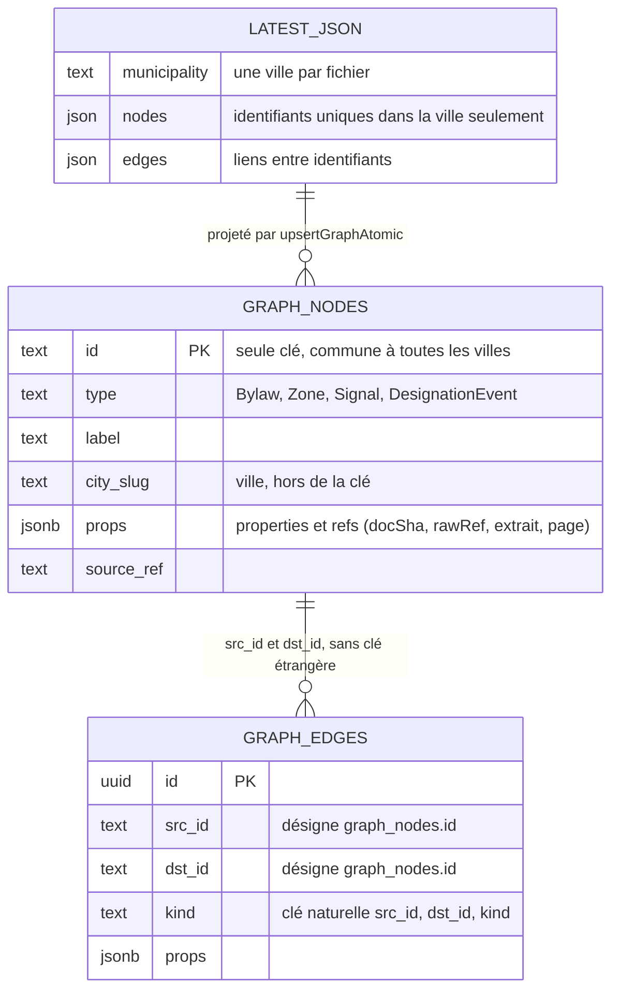
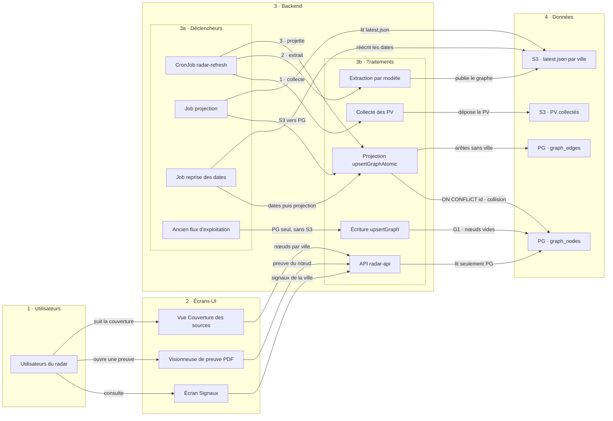

# Villes dont la base et le graphe stocké ne concordent plus : corriger le mélange de nœuds entre villes et remettre 226 villes en cohérence

- **Date** : 2026-10-04. Diagnostic en lecture seule du même jour, après la reprise des dates documentaires lancée en prod le 2026-10-03.
- **Type** : dossier de décision.
- **Destinataire** : **Fabien** (owner, AI Builder), qui décide les sept décisions D1 à D7 : ce sont des décisions techniques et de données. **Farid** (Product Owner) est **consulté** pour D2 et D3, parce que des villes affichent aujourd'hui des preuves venant d'une autre ville, et **informé** des autres décisions.
- **Statut** : **PROPOSITION**. Aucune réparation n'est lancée. Aucune écriture dans un cluster, un bucket ou une base n'a été faite pour ce dossier.
- **Carte** : [#812](https://github.com/rhanka/radar-immobilier/issues/812) (collision d'identifiants entre villes en projection PG).
- **Sources** :
  - diagnostic en lecture seule du 2026-10-04 (SELECT en transaction `read_only` dans le pod `radar-api` image `3c98731` ; S3 Get/Head/List) et ses fichiers de preuve, copiés dans [preuves/diagnostic/](preuves/diagnostic/) : `groups.json` (villes par groupe), `rows.json` (comptes S3 et PG par ville), `sim.json` (simulation des garde-fous par ville), `contam2.json` (nœuds dont le contenu vient d'une autre ville) ;
  - journal de la reprise du 2026-10-03 (v1.2.8, apply sans `--heal`) : 1 008 villes, 354 écrites, 205 stoppées, 21 avortées ;
  - code sur `origin/main` `f6550765` : `api/src/services/graph/graph-store.ts` (`upsertGraphAtomic`, `upsertGraph`), `api/src/db/schema.ts` (`graph_nodes`, `graph_edges`), `api/src/scripts/recover-document-dates.ts`, `api/src/scripts/project-graph-from-s3.ts`, `api/src/services/sources/exploitation.ts`, `api/src/routes/source-coverage.ts`, `.github/workflows/run-job.yaml`.
- **Méthode** : comptes S3 et PG ville par ville ; reproduction locale des trois garde-fous de `upsertGraphAtomic` appliqués au `latest.json` de chaque ville contre l'état PG actuel ; cette reproduction retrouve à l'identique les 21 refus du 2026-10-03. Lectures Node uniquement, sans Python.

Conventions : **FAIT** = constaté dans une source citée · **CALCUL** = dérivé des données, méthode donnée · **JUGEMENT** = appréciation · `non vérifié`, `source manquante`, `N-A` = limites déclarées.

---

## 1. Intention du dossier et ce qu'on attend de Fabien

Le diagnostic du 2026-10-04 a trouvé 226 villes dont les deux copies du graphe (le fichier stocké dans S3 et la base PG que l'application sert) ne contiennent pas les mêmes éléments. Ce dossier explique d'abord le contexte sans prérequis (§2), puis demande sept décisions. Rien n'est réparé avant ces décisions.

| # | Objectif | Où le dossier y répond | Décisions |
|---|---|---|---|
| O1 | Comprendre ce qui s'est passé : ce que sont S3 et PG, qui lit quoi, ce que fait la projection, ce qu'a fait le job de reprise, pourquoi les villes ont divergé. | §2, Scène 1 (architecture), Figure 2 (tables) | — |
| O2 | Arrêter le mélange de contenus entre villes dans la base, qui fait afficher à 109 villes des preuves d'une autre ville. | §4, Figure 2, §7 D2 et D3 | D2, D3 |
| O3 | Remettre chaque groupe de villes en cohérence avec le bon remède, sans perdre de données et sans `--heal` là où il est dangereux. | §5 (Tableau 3), §6, §7 D1, D4 à D7 | D1, D4, D5, D6, D7 |
| O4 | Stopper le coût caché : à chaque passage du rafraîchissement, 65 villes paient l'extraction par modèle puis voient leur projection refusée. | §5.3, §7 D3 | D3 |

### 1.1 Destinataires et rôles

| Personne | Rôle | Ce qu'on attend de lui |
|---|---|---|
| **Fabien** | Owner, AI Builder | Décide D1 à D7. Les décisions sont prises telles quelles, sauf incohérence entre elles (dépendances au §3.2). |
| **Farid** | Product Owner | Consulté sur D2 et D3 : des utilisateurs voient sur une ville des preuves tirées des procès-verbaux d'une autre ville. Informé du reste. |

### 1.2 Termes utilisés

| Terme | Sens dans ce dossier |
|---|---|
| **Graphe d'une ville** | Ce que le radar sait d'une ville, tiré de ses procès-verbaux (PV) : règlements, zones, signaux, événements, chacun étant un **nœud**, reliés par des **arêtes**. |
| **Nœud** | Un élément du graphe, avec un **identifiant** (par exemple `bylaw-242` pour le règlement 242), un type, un libellé et des propriétés. |
| **Preuve (ref)** | La citation qui justifie un nœud : empreinte du PV (`docSha`), lien vers le fichier (`rawRef`), extrait, page. C'est ce que l'utilisateur ouvre dans la visionneuse de PDF. |
| **S3 `latest.json`** | Le fichier `graph/<ville>/latest.json` du bucket S3 : la copie de référence du graphe d'une ville, produite par le rafraîchissement. Un fichier par ville. |
| **PG** | La base PostgreSQL, tables `graph_nodes` et `graph_edges` : la copie **servie**. L'API, donc l'application, lit uniquement PG. |
| **Projection** | La recopie du graphe d'une ville de S3 vers PG, par la fonction `upsertGraphAtomic`, en une transaction par ville. |
| **Garde-fou** | Contrôle de la projection qui refuse d'écrire une ville si des données existantes disparaîtraient (§2.3). |
| **Rafraîchissement (refresh)** | Le CronJob `radar-refresh`, quatre passages par jour (05:17, 11:17, 17:17, 23:17 UTC, 1 h 30 à 2 h chacun) : collecte de nouveaux PV, extraction par modèle, publication dans S3, projection dans PG. |
| **`--heal`** | Option du job de reprise des dates : au lieu de partir de `latest.json`, il part du graphe servi par PG et **réécrit `latest.json` avec**, après archivage de l'ancien fichier. |

---

## 2. Le contexte, en clair

### 2.1 Deux copies du graphe de chaque ville

**FAIT.** Chaque ville a deux copies de son graphe :

1. **S3 `graph/<ville>/latest.json`** : un fichier par ville, écrit par le rafraîchissement après l'extraction des PV. C'est la copie de référence : elle contient tout ce que l'extraction a produit, ville par ville, dans des fichiers séparés.
2. **PG `graph_nodes` et `graph_edges`** : deux tables communes à **toutes** les villes. Chaque ligne de `graph_nodes` porte une colonne `city_slug` qui dit à quelle ville elle appartient. C'est la copie **servie** : l'écran Signaux, la visionneuse de preuve PDF et la vue Couverture des sources passent par l'API, qui lit uniquement PG.

Une ville est « en écart » quand ses deux copies ne contiennent pas les mêmes nœuds. L'utilisateur voit alors PG, pas S3.

### 2.2 Qui écrit, qui lit

La **Scène 1** (architecture, plus bas dans la page) range les vrais composants en cinq couloirs verticaux de gauche à droite : utilisateurs, écrans, déclencheurs et traitements (regroupés dans le backend), données. Elle montre où naît l'écart (projection refusée, ou écriture dans PG sans passer par S3) et où se produit la collision (`ON CONFLICT (id)` dans `graph_nodes`).

| Composant | Écrit | Lit |
|---|---|---|
| CronJob `radar-refresh` | PV dans S3, `latest.json`, puis PG par la projection | PV, `latest.json` |
| Job `projection` (workflow `run-job.yaml`, entrée `project_cities`) | PG, par la projection | `latest.json` |
| Job `document-date-recovery` (entrées `recovery_mode`, `recovery_cities`, `recovery_heal`) | `latest.json` (dates documentaires), puis PG par la projection | `latest.json` ; PG si `--heal` |
| Ancien flux d'exploitation (`runExploitation` → `projectStateToGraph` → `upsertGraph`) | PG seulement, sans garde-fou | état d'exploitation |
| API `radar-api` | — | PG seulement |

### 2.3 La projection et ses trois garde-fous

**FAIT (code).** `upsertGraphAtomic` recopie le graphe d'une ville dans PG, en une transaction : elle insère ou met à jour les nœuds et arêtes présents, supprime les nœuds de cette ville absents du nouveau graphe, puis vérifie. Elle refuse la ville, sans rien écrire, si l'un de ces garde-fous échoue :

1. **Propriétés métier** : une propriété existante d'un nœud (par exemple `resolution` d'un règlement) disparaîtrait.
2. **Provenance** : une empreinte de PV (`docSha`) présente dans PG disparaîtrait d'un nœud.
3. **Complétude** : la ville aurait moins de signaux « complets » (avec citation et lien vers le PV) qu'avant.

Ces garde-fous protègent PG contre les pertes. Ils sont aussi ce qui bloque les villes dont PG contient un contenu qui n'est pas le leur (§4).

### 2.4 Le job de reprise des dates du 3 octobre, et `--heal`

**FAIT.** Le 2026-10-03, le job `document-date-recovery` (v1.2.8, mode apply, **sans** `--heal`) a parcouru 1 008 villes pour ajouter aux nœuds la date documentaire du PV. Pour chaque ville, il part de `latest.json`, ajoute les dates, réécrit `latest.json`, puis projette dans PG. Avant d'écrire, il compare les nœuds de `latest.json` à ceux de PG :

- **354 villes écrites** : les deux copies concordaient.
- **205 villes stoppées** (HALT) : les deux copies n'avaient pas les mêmes nœuds ; rien n'a été écrit.
- **21 villes avortées** : `latest.json` a été réécrit, puis la projection dans PG a été refusée par un garde-fou.

Ces 205 + 21 = **226 villes** sont l'objet du dossier.

**`--heal`** traite autrement une ville stoppée : il prend le graphe **servi par PG** comme vérité, archive `latest.json`, puis le réécrit à partir de PG. C'est le bon remède quand PG est plus riche que S3 (groupes G5a, G5b). C'est dangereux quand PG contient des nœuds vides (G1 : on les recopierait dans S3) ou le contenu d'une autre ville (G2, G3, G4 : on recopierait la contamination dans S3 et on effacerait les nouveaux nœuds que seul S3 possède).

### 2.5 L'ancien flux d'exploitation

**FAIT.** Les 2026-09-10 et 2026-09-11, l'ancien flux d'exploitation (`runExploitation` → `projectStateToGraph` → `upsertGraph`) a écrit dans PG, pour 71 villes, **3 535 nœuds** de type `source` et `designationevent` (en minuscules), sans propriétés ni preuves. Ce flux écrit PG mais jamais `latest.json`, et `upsertGraph` n'a aucun garde-fou. Il reste appelable depuis une route de l'API (`api/src/routes/sources.ts`) et depuis les services `exploit-scrape` et `pv-seed` ; ses déclencheurs effectifs en prod : `non vérifié`.

### 2.6 Pourquoi 226 villes ont divergé

Trois causes, détaillées aux §4 et §5 :

1. **Collision d'identifiants entre villes (cause principale, 148 villes : G2, G3, G4).** Les identifiants de nœuds ne sont pas propres à une ville : `bylaw-2026-04` existe dans 9 villes, `bylaw-242` dans gore et barkmere. Or PG a une seule clé, `id`. Quand deux villes ont le même identifiant, la seconde projection remplace le contenu du nœud de la première, qui reste rattaché à la première ville. Ensuite les garde-fous refusent les projections de la ville lésée (G2, G4), ou la ville gagnante ne voit pas son nœud (G3).
2. **Écriture dans PG sans S3 (71 villes : G1)** par l'ancien flux d'exploitation (§2.5).
3. **Preuves appauvries côté S3 (7 villes : G5a, G5b, G5c, G6)** : extraits ou pages perdus dans S3, refs vidées par le rafraîchissement, ou ré-extraction jamais projetée.

---

## 3. Synthèse et décisions demandées

**Recommandation globale (JUGEMENT).** Corriger en priorité le mélange de nœuds entre villes, en partant de S3, qui est propre (aucun cas dans les 226 `latest.json`) ; poser tout de suite un garde-fou d'une ligne qui empêche toute nouvelle contamination ; traiter dès maintenant, hors fenêtres du rafraîchissement, les groupes qui ne partagent aucun identifiant avec une autre ville (G1, G5a, G5b) ; ne jamais utiliser `--heal` sur G1, G2, G3, G4, G5c et G6.

| Sujet | Constat déterminant | Recommandation |
|---|---|---|
| Collision | **FAIT.** `ON CONFLICT (id) DO UPDATE` met à jour libellé, type et propriétés, jamais `city_slug`. 164 nœuds dans 109 villes portent dans PG des preuves tirées des PV d'une autre ville. S3 est propre. | D2 : clé `(city_slug, id)` (option C), passée d'abord par `harness brainstorm` ; réparation depuis chaque `latest.json`. |
| Urgence | **FAIT.** L'écart grandit : 53 des 81 villes de G2 ont grandi depuis le 03/10 ; 2 nouvelles villes refusées (pont-rouge, riviere-a-pierre). | D3 : priorité immédiate, garde-fou d'une ligne tout de suite. |
| Coût caché | **FAIT.** Chaque passage du rafraîchissement : 65 villes extraites par modèle (appel payant), publiées dans S3, puis projection refusée et abandon. Le contenu reste dans S3. | D3 : accepter ce coût jusqu'à la réparation, le contenu servant à la réparation. |
| G1, 71 villes | **FAIT.** 3 535 nœuds vides seulement dans PG ; tout S3 est déjà dans PG ; 0 identifiant partagé ; la simulation fait passer les 71 villes. | D1 : projection S3 → PG des 71, puis reprise des dates sans `--heal`. |
| G5a, G5b | **FAIT.** PG plus riche que S3 (citations complètes), mêmes nœuds ou presque, aucune preuve étrangère. | D4, D5 : `--heal`. |
| G5c, G6 | **FAIT.** Refs vidées par le rafraîchissement (G5c) ; ré-extraction de juillet jamais projetée (G6). | D6 : analyse du bug producteur en priorité. D7 : opération ponctuelle acceptant 21 suppressions. |

### 3.1 Décisions demandées (D1 à D7)

Fabien décide les sept décisions. Farid est consulté sur D2 et D3 et informé des autres.

| # | Décision | Décide · Consulté | Option recommandée | Alternatives |
|---|---|---|---|---|
| D1 | G1 (71 villes) : supprimer de PG les 3 535 nœuds vides | **Fabien** · Farid informé | **(a)** projection S3 → PG des 71 villes, puis reprise des dates sans `--heal` | (b) laisser en l'état ; (c) `--heal` |
| D2 | Principe de correction de la collision | **Fabien** · Farid consulté | **C** clé primaire `(city_slug, id)`, arêtes rattachées à la ville, réparation depuis chaque `latest.json` ; `harness brainstorm` avant l'implémentation | A identifiant préfixé par la ville ; B garde-fou et renommage à la projection |
| D3 | Priorité de la correction et mesure d'attente | **Fabien** · Farid consulté | **(a)** priorité immédiate, garde-fou d'une ligne tout de suite, coût d'extraction accepté jusqu'à la réparation | (b) idem + suspension de l'extraction des villes refusées ; (c) planification normale |
| D4 | G5a (3 villes) | **Fabien** · Farid informé | **(a)** reprise des dates avec `--heal` | (b) attendre |
| D5 | G5b victoriaville | **Fabien** · Farid informé | **(a)** reprise des dates avec `--heal` | (b) attendre |
| D6 | G5c (2 villes) : refs vidées par le rafraîchissement | **Fabien** · Farid informé | **(a)** analyse du bug producteur ouverte maintenant, en priorité haute | (b) priorité normale après D2 ; (c) ne rien ouvrir |
| D7 | G6 brigham | **Fabien** · Farid informé | **(a)** opération ponctuelle acceptant 21 suppressions, après export des lignes PG | (b) laisser ; (c) `--heal` |

### 3.2 Ordre et dépendances entre décisions

- **D2 conditionne la réparation de G2, G3 et G4** (148 villes) : tant que PG n'a qu'une clé `id`, re-projeter ces villes rejoue la collision.
- **D3 dépend de D2** : le délai acceptable pour le coût caché dépend du coût de l'option choisie (C demande une migration, B non).
- **D1, D4, D5 et D7 sont indépendantes de D2** : **CALCUL** sur `sim.json`, aucune de ces villes ne partage d'identifiant avec une autre ville (0 identifiant rattaché à une autre ville pour G1, G5a, G5b, G6). Elles peuvent être exécutées avant la correction.
- **D6 est indépendante pour l'analyse**, mais la réparation des deux villes de G5c attend à la fois la correction du bug producteur et D2 (chacune a 1 identifiant rattaché à une autre ville).
- **D5 dépend partiellement de D6** : si le bug producteur n'est pas corrigé, un prochain rafraîchissement de victoriaville peut de nouveau publier des refs sans extrait ; PG reste protégé par le garde-fou de complétude.

---

## 4. La collision d'identifiants entre villes

### 4.1 Le mécanisme

**FAIT (code).** `graph_nodes` a pour seule clé primaire `id` (`api/src/db/schema.ts`). La projection écrit chaque nœud avec `INSERT … ON CONFLICT (id) DO UPDATE SET label, type, props, source_ref` : en cas d'identifiant déjà présent, elle remplace le contenu mais **ne touche jamais `city_slug`**. `graph_edges` n'a pas de ville du tout : ses colonnes `src_id` et `dst_id` désignent un `id` de nœud, sans clé étrangère, et sa clé naturelle est `(src_id, dst_id, kind)`.

Exemple réel, **gore** et **barkmere**, qui ont toutes deux un règlement `bylaw-242` dans leur `latest.json` :

1. gore projette : la ligne `bylaw-242` est créée avec `city_slug = gore` et les preuves des PV de gore.
2. barkmere projette : `ON CONFLICT (id)` remplace les propriétés et les preuves de la ligne par celles de barkmere ; `city_slug` reste `gore`.
3. **Effet 1, preuve étrangère affichée** : l'écran de gore montre pour `bylaw-242` la `resolution` et le PV de barkmere.
4. **Effet 2, ville lésée bloquée (G2)** : à la projection suivante de gore, son `latest.json` ne contient pas l'empreinte du PV de barkmere ; le garde-fou de provenance croit à une perte et refuse gore. **FAIT** : gore est refusé depuis le 2026-10-02 06:25 (`postgres-regression-refused`).
5. **Effet 3, ville gagnante incomplète (G3)** : barkmere ne voit pas `bylaw-242` dans son graphe servi, puisque la ligne est rattachée à gore. barkmere est elle-même refusée depuis le 2026-10-02 06:08, parce que son `bylaw-134` porte le contenu de saint-andre-dargenteuil.

La **Figure 2** (plus bas dans la page) dessine les deux tables et la ligne partagée.

### 4.2 Les tables en jeu (Figure 2)

### 4.3 Ampleur

- **FAIT.** PG contaminé : **164 nœuds dans 109 villes** portent des preuves (`rawRef`) tirées des PV d'une autre ville.
- **FAIT.** S3 propre : aucun cas dans les 226 `latest.json`.
- **FAIT.** Identifiants courants : `bylaw-2026-04` (9 villes), `bylaw-242`, `zone-c-6`, `zone-r-8`, `bylaw-432`.
- `non vérifié` : le périmètre exact de l'affichage côté client (quels écrans montrent ces preuves étrangères, et pour combien d'utilisateurs).
- **À vérifier** : lascension (G3) a 47 identifiants sur 53 rattachés à une autre ville ; une confusion de slug avec lascension-de-notre-seigneur est possible.

---

## 5. Les groupes de villes, chiffrés

### 5.1 Tableau 3 — les huit groupes

| Groupe | Villes | Ce qui diverge | Nœuds en jeu (CALCUL, `rows.json`) | Cause | Remède proposé | Décision |
|---|---|---|---|---|---|---|
| G1 PG en avance, nœuds vides | 71 | PG a des nœuds absents de S3 | 3 535 seulement dans PG ; 0 seulement dans S3 | ancien flux d'exploitation, 2026-09-10/11 | projection S3 → PG, puis reprise sans `--heal` | D1 |
| G2 S3 en avance, projection refusée | 81 | S3 a des nœuds absents de PG | 1 834 seulement dans S3 (dont 769 signaux et événements) | collision : refus de provenance (59) ou de propriété métier (22) | après correction : projection, puis reprise sans `--heal` | D2, D3 |
| G3 S3 en avance, collision seule | 49 | identifiants restés sous une autre ville | 159 seulement dans S3 | collision, projections acceptées | après correction : projection, puis reprise sans `--heal` | D2 |
| G4 reprise avortée, collision | 18 | S3 réécrit (dates présentes), PG refusé | 16 seulement dans S3 | collision : provenance (11), propriété métier (7) | après correction : projection | D2 |
| G5a reprise avortée, PG plus riche | 3 | refs S3 sans extrait ni page | mêmes 76 nœuds ; signaux complets 25 dans PG contre 13 dans S3 | refus de complétude justifié | reprise avec `--heal` | D4 |
| G5b victoriaville | 1 | refs republiées sans extrait | 3 seulement dans S3 ; signaux complets 15 dans PG contre 0 dans S3 | rafraîchissement du 2026-09-29 | `--heal`, ou attendre | D5 |
| G5c perte de refs | 2 | refs vidées dans S3 | 36 seulement dans S3 ; sainte-clotilde : complétude 38 → 21 | bug du producteur (rafraîchissement) + collision | rien ; analyse du bug | D6 |
| G6 brigham | 1 | S3 = ré-extraction du 2026-07-04 jamais projetée | 35 seulement dans S3, 21 seulement dans PG ; signaux complets 9 dans S3 contre 0 dans PG | refus de propriété métier (les nœuds de juin disparaîtraient) | opération ponctuelle, ou laisser | D7 |
| **Total** | **226** | 205 stoppées = G1 + G2 + G3 + G5b + G5c + G6 ; 21 avortées = G4 + G5a | | | | |

Les listes de villes sont en annexe A.

### 5.2 L'écart grandit-il ?

**FAIT.** G2 a grandi pour 53 villes sur 81 (barkmere : 80 nœuds S3 / 51 PG le 03/10, 84 / 51 le 04/10 ; mont-laurier : 78 / 71, puis 105 / 71). G3 a grandi pour 6 villes. G1, G5b et brigham sont stables. G5c grandit. Deux villes hors des 226 sont désormais refusées : pont-rouge et riviere-a-pierre.

### 5.3 Le coût caché

**FAIT.** Le rafraîchissement termine en vert (code de sortie 0), mais à chaque passage **65 villes** finissent en `Graphify34ApplyInterrupted` : le nouveau PV est extrait (appel de modèle payant) et publié dans S3, la projection est refusée, deux reprises gratuites échouent, puis la ville est marquée abandonnée pour ce passage. Le contenu extrait reste dans S3 et servira à la réparation. `non vérifié` : le montant de ce coût, et si un même PV peut être ré-extrait d'un passage à l'autre.

---

## 6. Réparer : principes communs

1. **S3 fait foi pour la réparation de la collision** (G2, G3, G4, puis G5c) : chaque `latest.json` est propre et contient tout ce que l'extraction a produit. Le contenu des lignes PG contaminées est remplacé par celui du `latest.json` de la ville propriétaire.
2. **PG fait foi seulement quand il est plus riche et sans contenu étranger** (G5a, G5b) : c'est le cas de `--heal`.
3. **`--heal` est proscrit** sur G1, G2, G3, G4, G5c et G6 : il recopierait dans S3 des nœuds vides ou le contenu d'une autre ville, et effacerait les nouveaux nœuds que seul S3 possède.
4. **Exécution par les jobs CD existants seulement** : workflow `run-job.yaml`, `job=projection` avec `project_cities`, ou `job=document-date-recovery` avec `recovery_mode`, `recovery_cities` et `recovery_heal`. Aucun accès manuel à la base ou au bucket.
5. **Hors des fenêtres du rafraîchissement** (05:17, 11:17, 17:17, 23:17 UTC, 1 h 30 à 2 h chacune) : le job `projection` ne pose pas de verrou de lecture et pourrait croiser une écriture du rafraîchissement.
6. **Retour arrière** : `--heal` archive `latest.json` avant d'écrire. Une suppression dans PG ne se rattrape que par la sauvegarde PG quotidienne, dont le contenu est `non vérifié` ; pour D7, un export des lignes concernées précède l'opération.
7. **Ne pas relancer l'ancien flux d'exploitation** tant que son sort n'est pas décidé : il recréerait les nœuds vides de G1.

---

## 7. Options et recommandation

Les coûts sont des jugements relatifs de périmètre, pas des estimations d'heures ni de budget. Chaque décision rappelle le problème, pourquoi décider maintenant, ce qui change concrètement et où regarder dans le dossier. Chaque option donne d'abord une **description** concrète (ce qu'on lance ou construit, quel job CD avec quels paramètres, ce qui change dans S3 et dans PG, ce que voit l'utilisateur, sur un exemple réel), puis ses avantages et inconvénients ; dans la page, un mini-schéma accompagne les options de D1, D2, D4, D5 et D7.

### D1 — G1 (71 villes) : supprimer de PG les 3 535 nœuds vides
**Décide : Fabien · Farid informé.**

71 villes ont dans PG 3 535 nœuds `source` et `designationevent` (minuscules), vides, créés les 2026-09-10/11 par l'ancien flux d'exploitation (§2.5, Scène 1 : flèche « PG seul, sans S3 »). Tout le contenu de S3 est déjà dans PG ; ces villes restent bloquées pour la reprise des dates (HALT). Décider maintenant permet de débloquer 71 villes sans attendre la correction de la collision : aucune ne partage d'identifiant avec une autre ville (§3.2). Exemple suivi dans les trois options : acton-vale, 37 nœuds dans S3 et 473 dans PG, dont 380 `source` et 56 `designationevent` vides. Voir Tableau 3.

#### (a) Projection S3 → PG des 71 villes, puis reprise des dates sans `--heal` — recommandée

**Description.** Deux jobs CD du workflow `run-job.yaml`, l'un après l'autre, hors des fenêtres du rafraîchissement. 1) `job=projection`, `project_cities` = les 71 villes de l'annexe A : pour chaque ville, la projection lit `graph/<ville>/latest.json` et recopie le graphe dans PG ; comme elle supprime les nœuds de la ville absents de `latest.json`, les 3 535 nœuds vides disparaissent de PG. S3 ne change pas. 2) `job=document-date-recovery`, `recovery_mode=apply`, `recovery_heal=false`, `recovery_cities` = les mêmes 71 : les deux copies concordent désormais, le job ajoute la date documentaire dans chaque `latest.json`, puis projette. acton-vale passe de 37 nœuds S3 / 473 PG à 37 / 37, avec dates. L'utilisateur : rien ne change sur l'écran Signaux (ces nœuds n'y sont pas affichés, `non vérifié` à l'écran) ; la vue Couverture des sources affiche 37 nœuds au lieu de 473 pour acton-vale.

**Avantages.**
- La simulation fait passer les 71 villes aux trois garde-fous.
- Débloque la reprise des dates ; PG redevient identique à S3.
- Deux jobs CD existants, sans code nouveau.

**Inconvénients.**
- Suppression dans PG rattrapable seulement par la sauvegarde PG (contenu `non vérifié`) ; les nœuds supprimés n'ont toutefois ni propriété ni preuve.
- Le compte « graphe » de la vue Couverture des sources baisse pour ces villes (il comptait les nœuds vides).

#### (b) Laisser en l'état

**Description.** Aucun job. PG garde les 3 535 nœuds vides, S3 ne change pas. acton-vale reste à 37 nœuds S3 / 473 PG ; la prochaine reprise des dates s'arrête de nouveau sur ces 71 villes, et le rafraîchissement continue de les voir « à jour ».

**Avantages.**
- Aucun risque d'écriture.

**Inconvénients.**
- 71 villes restent sans dates documentaires.
- Le rafraîchissement les voit « à jour » à tort ; les comptes de couverture restent gonflés.

#### (c) Reprise des dates avec `--heal`

**Description.** Un job : `job=document-date-recovery`, `recovery_mode=apply`, `recovery_heal=true`, `recovery_cities` = les 71. Pour chaque ville, il archive `latest.json` puis le réécrit à partir du graphe servi par PG, nœuds vides compris, et projette. acton-vale : `latest.json` passe de 37 à 473 nœuds (436 nœuds vides ajoutés) ; PG reste à 473. L'utilisateur ne voit rien de plus ; c'est S3 qui perd sa propreté.

**Avantages.**
- Débloque la reprise sans projection préalable.

**Inconvénients.**
- Recopie les 3 535 nœuds vides dans les 71 `latest.json` : S3 serait pollué à son tour.
- Irréversible sans les archives.

Recommandation **(a)**. Changerait si un usage de ces nœuds minuscules apparaissait. Mesure associée : ne pas relancer l'ancien flux d'exploitation (§6, point 7).

### D2 — Principe de correction de la collision
**Décide : Fabien · Consulté : Farid.**

La base n'a qu'une clé, `id`, commune à toutes les villes, alors que les identifiants ne sont uniques qu'à l'intérieur d'une ville (§4.1, Figure 2). C'est la cause de 148 villes en écart (G2, G3, G4) et des 164 nœuds aux preuves étrangères dans 109 villes ; l'écart grandit à chaque passage (§5.2). Il faut choisir le principe avant toute réparation, car re-projeter ces villes sans correction rejoue la collision. Dans toutes les options, **S3 fait foi pour la réparation** : les `latest.json` sont propres (§6, point 1). Exemple suivi : `bylaw-242`, règlement de gore et de barkmere, aujourd'hui une seule ligne rattachée à gore avec le contenu de barkmere. Farid est consulté parce que des utilisateurs voient aujourd'hui des preuves d'une autre ville.

#### A. Identifiant PG propre à la ville (`ville:id`), avec migration

**Description.** On change l'identifiant stocké dans PG : chaque identifiant est préfixé par sa ville (`gore:bylaw-242`, `barkmere:bylaw-242`). À construire : une migration qui réécrit `graph_nodes.id`, `graph_edges.src_id` et `graph_edges.dst_id` pour toutes les villes ; une projection qui préfixe à l'écriture ; l'adaptation de tout ce qui reçoit ou renvoie un identifiant (API, UI, MCP, ancres d'annotation par identifiant texte). Puis réparation : `job=projection`, `project_cities` = les 148 villes de G2, G3 et G4, depuis leur `latest.json`. S3 ne change pas (identifiants sans préfixe). Dans PG, `bylaw-242` devient deux lignes, chacune avec le contenu de sa ville. L'utilisateur : gore retrouve sa preuve, barkmere son règlement ; les liens existants qui contiennent un identifiant changent.

**Avantages.**
- Plus aucune collision possible.
- La clé unique `id` reste.

**Inconvénients.**
- Tous les identifiants changent : API, liens UI, MCP, ancres d'annotation et arêtes sont à migrer ; plus fort impact.
- Retour arrière par migration inverse seulement.

#### B. Garde-fou et renommage à la projection, préfixe côté producteur, script de réparation

**Description.** On garde la clé `id` commune. À construire : 1) à la projection, tout identifiant déjà rattaché à une autre ville est refusé ou renommé (par exemple `barkmere--bylaw-242`) ; 2) dans le producteur (rafraîchissement), les identifiants génériques (`bylaw-<numéro>`, `zone-<code>`) sont préfixés par la ville pour les futurs PV ; 3) un script de réparation remet dans chaque ligne contaminée le contenu du `latest.json` de la ville propriétaire et crée la ligne renommée de l'autre ville, exécuté par un job CD revu. `bylaw-242` : la ligne reste à gore avec le contenu de gore ; barkmere obtient `barkmere--bylaw-242` dans PG, alors que son `latest.json` dit toujours `bylaw-242`. L'utilisateur voit les bonnes preuves.

**Avantages.**
- Pas de changement de schéma ; changement local à la projection et au producteur.
- Rapide à livrer.

**Inconvénients.**
- L'espace d'identifiants reste commun à toutes les villes : la collision reste possible pour tout identifiant non préfixé.
- Un nœud renommé n'a plus le même identifiant dans S3 et dans PG, ce que la reprise des dates verra comme un écart ; les arêtes sans ville sont à traiter à part.

#### C. Clé primaire `(city_slug, id)`, arêtes rattachées à la ville, réparation depuis chaque `latest.json` — recommandée

**Description.** On change la clé de `graph_nodes` en `(city_slug, id)` et on ajoute `city_slug` à `graph_edges` (clé naturelle `(city_slug, src_id, dst_id, kind)`), sans changer aucun identifiant. À construire : la migration de schéma des deux tables ; la projection en `ON CONFLICT (city_slug, id)` ; la ville ajoutée aux lectures par identifiant seul (voisinage d'un nœud, routes par identifiant) ; un traitement des nœuds sans ville. Puis réparation : `job=projection`, `project_cities` = les 148 villes de G2, G3 et G4, depuis leur `latest.json`, puis `job=document-date-recovery` sans `--heal`. `bylaw-242` : deux lignes, `(gore, bylaw-242)` avec le contenu de gore et `(barkmere, bylaw-242)` avec celui de barkmere. S3 ne change pas. L'utilisateur voit chez gore la preuve de gore ; identifiants et liens restent les mêmes.

**Avantages.**
- Corrige la cause : chaque ville a son espace d'identifiants, comme dans S3.
- Les identifiants visibles ne changent pas ; la comparaison S3 / PG de la reprise reste valable telle quelle.

**Inconvénients.**
- Migration de schéma des deux tables (clé, colonne ville sur les arêtes).
- Les lectures par identifiant seul doivent recevoir la ville ; nœuds sans ville (`city_slug` nul, nombre `non vérifié`) à traiter.

Recommandation **C**, après un passage par `harness brainstorm` qui fixe le schéma cible, le traitement des nœuds sans ville, des arêtes et des lectures par identifiant, puis le script de réparation (une projection par ville depuis son `latest.json`, dans l'ordre, hors fenêtres). B reste le repli si le brainstorm montre un impact de C trop élevé. Changerait si l'inventaire des lectures par identifiant seul révélait des usages externes (MCP, liens partagés) impossibles à rattacher à une ville.

### D3 — Priorité de la correction et mesure d'attente
**Décide : Fabien · Consulté : Farid.**

Tant que la collision n'est pas corrigée, chaque passage du rafraîchissement extrait par modèle les nouveaux PV de 65 villes, les publie dans S3, puis voit la projection refusée (§5.3) ; l'écart grandit (§5.2) et 109 villes affichent des preuves étrangères (§4.3). Il faut fixer la priorité et ce qu'on fait en attendant. Un garde-fou d'une ligne existe : n'appliquer la mise à jour `ON CONFLICT (id)` que si `city_slug` est identique (`… DO UPDATE … WHERE graph_nodes.city_slug = excluded.city_slug`) ; il empêche toute nouvelle contamination, sans débloquer les villes déjà touchées. Suspendre les deux reprises de projection n'économiserait rien : elles sont gratuites.

#### (a) Priorité immédiate : garde-fou d'une ligne tout de suite, coût d'extraction accepté jusqu'à la réparation — recommandée

**Description.** Tout de suite : une PR d'une ligne dans `upsertGraphAtomic` (la condition ci-dessus), revue puis déployée par la chaîne CD. Dès ce déploiement, une projection de barkmere ne peut plus écraser la ligne `bylaw-242` de gore : barkmere ne reçoit simplement pas ce nœud, comme les villes de G3 aujourd'hui. Ensuite, le brainstorm puis la correction D2. Le rafraîchissement continue tel quel : à chaque passage, les 65 villes refusées paient l'extraction, le résultat reste dans S3 et sera projeté à la réparation. L'utilisateur : les 164 preuves étrangères restent visibles jusqu'à la réparation, mais leur nombre ne grandit plus.

**Avantages.**
- Arrête la contamination dès le déploiement du garde-fou ; aucun changement au rafraîchissement.
- Le contenu extrait reste dans S3 et sera servi après réparation : l'argent n'est pas perdu.

**Inconvénients.**
- Le coût de 65 extractions par passage continue jusqu'à la réparation (montant `non vérifié`).
- Les preuves étrangères restent affichées jusqu'à la réparation.

#### (b) Comme (a), et suspendre l'extraction par modèle des villes refusées

**Description.** Le garde-fou de (a), plus un changement du rafraîchissement : pour les villes dont la dernière projection a été refusée pour collision (G2, G4), la collecte des PV continue (gratuite) mais l'extraction par modèle n'est plus lancée, jusqu'à la réparation, puis elle est réactivée. Dans S3, ces villes n'avancent plus ; PG ne change pas ; leurs nouveaux PV attendent dans le bucket des PV.

**Avantages.**
- Économise les appels de modèle pendant l'attente.

**Inconvénients.**
- Ces villes ne reçoivent plus de nouveaux PV dans S3, alors que la fraîcheur est la priorité de Steve.
- Demande un changement du rafraîchissement en pleine correction ; risque d'oublier de réactiver.

#### (c) Planification normale, sans garde-fou immédiat

**Description.** Aucun changement immédiat ; la correction D2 est planifiée après les chantiers en cours. Chaque passage continue d'extraire puis de refuser, et chaque projection d'une ville qui partage un identifiant peut encore écraser le contenu d'une autre ville, comme barkmere l'a fait pour gore.

**Avantages.**
- Aucun changement de plan.

**Inconvénients.**
- L'écart et la contamination continuent de grandir ; coût caché prolongé.
- Réparation plus longue ensuite.

Recommandation **(a)**. Avant de l'accepter, une lecture d'un journal du rafraîchissement confirme qu'un même PV n'est pas ré-extrait d'un passage à l'autre ; sinon, (b) devient préférable. Si Farid juge inacceptable l'affichage de preuves d'une autre ville même quelques jours, une mesure d'affichage (masquer les preuves des 164 nœuds touchés) peut s'ajouter : non chiffrée, hors de ce dossier.

### D4 — G5a (3 villes) : `--heal`
**Décide : Fabien · Farid informé.**

dixville, nominingue et saint-honore-de-shenley ont été avortées le 2026-10-03 : la reprise a réécrit `latest.json`, mais les refs y ont perdu extrait et page par rapport à PG, et la projection a été refusée par le garde-fou de complétude (Tableau 3). Les deux copies ont les mêmes 76 nœuds ; PG a 25 signaux complets contre 13 dans S3. Aucune de ces villes ne partage d'identifiant avec une autre (§3.2), aucune preuve étrangère. Exemple suivi : dixville, 10 signaux complets dans PG contre 5 dans S3.

#### (a) Reprise des dates avec `--heal` sur les 3 villes — recommandée

**Description.** Un job : `job=document-date-recovery`, `recovery_mode=apply`, `recovery_heal=true`, `recovery_cities` = `dixville nominingue saint-honore-de-shenley`. Pour chaque ville, il archive `latest.json`, le réécrit depuis le graphe servi par PG (refs complètes, avec extrait et page), ajoute les dates, puis projette. dixville : S3 passe de 5 à 10 signaux complets, PG reste à 10, avec dates. L'utilisateur : rien ne change à l'écran, puisqu'il voit déjà PG, sinon l'apparition des dates documentaires.

**Avantages.**
- Rend à S3 les citations complètes de PG ; dates ajoutées.
- Mêmes nœuds des deux côtés ; archive de `latest.json` avant écriture.

**Inconvénients.**
- Un prochain rafraîchissement peut de nouveau appauvrir les refs si la cause n'est pas corrigée (voir D6) ; PG reste protégé.

#### (b) Attendre

**Description.** Aucun job. S3 garde les refs appauvries, PG les citations complètes ; dixville reste à 5 signaux complets dans S3 contre 10 dans PG, sans date documentaire, et une prochaine reprise sans `--heal` s'arrête de nouveau.

**Avantages.**
- Aucune écriture.

**Inconvénients.**
- Les 3 villes restent sans dates documentaires ; S3 reste plus pauvre que PG.

Recommandation **(a)**. Risque faible.

### D5 — G5b victoriaville : `--heal` ou attendre
**Décide : Fabien · Farid informé.**

Le rafraîchissement du 2026-09-29 a republié pour victoriaville des refs sans extrait : S3 a 0 signal complet contre 15 dans PG, et 3 nœuds de plus que PG. La projection est refusée depuis le 2026-09-30 (`postgres-regression-refused`). Les utilisateurs voient PG, donc les 15 citations, mais victoriaville ne reçoit plus de nouveau contenu dans PG. Voir Tableau 3 et §3.2 (lien avec D6).

#### (a) Reprise des dates avec `--heal` sur victoriaville — recommandée

**Description.** Un job : `job=document-date-recovery`, `recovery_mode=apply`, `recovery_heal=true`, `recovery_cities` = `victoriaville`. Il archive `latest.json`, le réécrit depuis PG (15 signaux complets), ajoute les dates et projette. Les 3 nœuds présents seulement dans S3 sortent de `latest.json` et restent dans l'archive. L'utilisateur voit toujours les 15 citations, désormais datées ; le prochain rafraîchissement de victoriaville peut de nouveau être projeté.

**Avantages.**
- S3 retrouve les 15 citations ; dates ajoutées ; la ville sort du blocage.
- Aucune preuve étrangère en jeu.

**Inconvénients.**
- Les 3 nœuds propres à S3 sont retirés (archivés, pas ré-extraits automatiquement : `non vérifié`).
- Un prochain rafraîchissement peut reproduire le bug tant que D6 n'est pas traité.

#### (b) Attendre la correction du bug producteur (D6)

**Description.** Aucun job. S3 reste à 0 signal complet, PG à 15 ; la projection de victoriaville est refusée à chaque passage, donc ses nouveaux PV n'arrivent pas dans PG tant que le bug producteur n'est pas corrigé.

**Avantages.**
- Aucune perte des 3 nœuds.

**Inconvénients.**
- Ville bloquée pour une durée inconnue ; aucune date documentaire.

Recommandation **(a)**, risque faible. Changerait si les 3 nœuds propres à S3 portaient un signal absent de PG.

### D6 — G5c (2 villes) : analyse du bug producteur
**Décide : Fabien · Farid informé.**

Pour saint-roch-de-lachigan et sainte-clotilde, le rafraîchissement a réécrit des nœuds avec des refs vidées ; le garde-fou refuse à raison (sainte-clotilde : signaux complets 38 → 21), et chaque ville a en plus un identifiant rattaché à une autre ville. Ni la projection ni `--heal` ne réparent sans perte. Le groupe grandit (§5.2), et la même famille de défaut explique G5b et peut-être G5a : le producteur (le rafraîchissement) publie des refs appauvries. Il faut décider la priorité de l'analyse, à mener avec `harness debug`.

#### (a) Ouvrir l'analyse maintenant, priorité haute, en parallèle de D2 — recommandée

**Description.** Ouvrir maintenant une carte de bug et la mener avec `harness debug` : sur sainte-clotilde, comparer les refs de `latest.json` avant et après le passage qui les a vidées (archives S3), localiser l'étape du rafraîchissement qui écrit des refs sans extrait, corriger avec un test qui reproduit le cas. Après D2, réparer les 2 villes par `job=projection`, `project_cities` = `saint-roch-de-lachigan sainte-clotilde`. Aucune écriture tant que l'analyse n'est pas finie ; l'utilisateur ne voit rien changer d'ici là.

**Avantages.**
- Le défaut touche potentiellement toutes les villes à chaque passage.
- Code distinct de la projection, donc parallélisable ; évite de refaire D4 et D5.

**Inconvénients.**
- Une charge de plus pendant la correction de la collision.

#### (b) Priorité normale, après D2

**Description.** La même analyse, menée une fois la collision corrigée. D'ici là, chaque passage peut appauvrir les refs d'autres villes ; les garde-fous protègent PG mais ces villes cessent d'être mises à jour.

**Avantages.**
- Concentre l'effort sur la collision.

**Inconvénients.**
- Le groupe grandit ; D4 et D5 risquent d'être défaits.

#### (c) Ne rien ouvrir

**Description.** Aucune carte. Les garde-fous continuent de refuser ces villes, qui restent figées dans PG ; sainte-clotilde reste à 38 signaux complets servis et ne reçoit plus rien.

**Avantages.**
- Aucune charge.

**Inconvénients.**
- Défaut actif, masqué par les garde-fous : les villes touchées cessent d'être mises à jour.

Recommandation **(a)**. La réparation des deux villes attend la correction du bug et D2.

### D7 — G6 brigham : opération ponctuelle ou laisser
**Décide : Fabien · Farid informé.**

Le `latest.json` de brigham est une ré-extraction du 2026-07-04 (36 nœuds, 9 signaux complets), jamais projetée : PG est resté sur la version de juin (22 nœuds, 0 signal complet). Le garde-fou de propriétés métier refuse parce que les 21 nœuds de juin disparaîtraient. Aucun identifiant partagé (§3.2). Aucun job CD existant n'accepte des suppressions voulues : `upsertGraphAtomic` a un paramètre `intendedRemovals`, utilisé par `purge-avis-bylaws`, mais pas exposé par le job `projection`.

#### (a) Opération ponctuelle acceptant 21 suppressions, après export des lignes PG — recommandée

**Description.** Deux actes revus. 1) Une petite PR qui expose au job `projection` une liste explicite de suppressions voulues (le paramètre `intendedRemovals` existe déjà). 2) Export des 22 lignes PG de brigham, puis `job=projection`, `project_cities` = `brigham`, avec les 21 identifiants de juin listés. PG passe à la version de juillet (36 nœuds, 9 signaux complets) ; S3 ne change pas. L'utilisateur voit 9 signaux complets pour brigham au lieu de 0.

**Avantages.**
- brigham sert enfin 9 signaux complets au lieu de 0.
- Suppressions listées et exportées avant l'écriture.

**Inconvénients.**
- Demande un petit outillage revu (exposer la liste de suppressions voulues dans un job CD).
- Faible priorité.

#### (b) Laisser

**Description.** Aucun acte. PG reste sur juin (22 nœuds, 0 signal complet), S3 sur juillet (36 nœuds, 9 signaux complets) ; chaque projection de brigham est refusée.

**Avantages.**
- Aucun outillage.

**Inconvénients.**
- brigham reste sans signal complet servi, et bloquée à chaque rafraîchissement.

#### (c) Reprise des dates avec `--heal`

**Description.** `job=document-date-recovery`, `recovery_mode=apply`, `recovery_heal=true`, `recovery_cities` = `brigham` : le `latest.json` de juillet est archivé puis réécrit depuis la version de juin servie par PG. S3 perd la ré-extraction (36 → 22 nœuds, 9 → 0 signal complet) ; PG ne change pas.

**Avantages.**
- Débloque sans outillage.

**Inconvénients.**
- Écrase la ré-extraction de juillet par la version de juin (archivée) : on perd 9 signaux complets.

Recommandation **(a)**, après D1 et D4, sans urgence.

---

## 8. Ordre d'exécution proposé

Une fois les décisions prises, chaque étape passe par les jobs CD et hors des fenêtres du rafraîchissement.

| Étape | Quoi | Job CD et entrées | Dépend de |
|---|---|---|---|
| 1 | G1 : projection des 71 villes, puis reprise sans `--heal` | `projection`, `project_cities` = 71 villes ; puis `document-date-recovery`, `recovery_mode=apply`, `recovery_heal=false`, `recovery_cities` = 71 villes | D1 |
| 2 | G5a : reprise avec `--heal` | `document-date-recovery`, `apply`, `recovery_heal=true`, `recovery_cities` = dixville nominingue saint-honore-de-shenley | D4 |
| 3 | G5b : reprise avec `--heal` | idem, `recovery_cities` = victoriaville | D5 |
| 4 | Garde-fou d'une ligne sur `ON CONFLICT (id)` | PR revue, déploiement par la chaîne CD | D3 |
| 5 | Brainstorm puis correction de la collision | `harness brainstorm`, puis PR et migration | D2 |
| 6 | Réparation G2, G3, G4 depuis S3, puis reprise sans `--heal` | `projection` sur les 148 villes, puis `document-date-recovery` sans `--heal` | 5 |
| 7 | Analyse du bug producteur, puis réparation G5c | `harness debug` ; réparation après 5 | D6 |
| 8 | brigham | outillage revu, puis opération ponctuelle | D7 |

Chaque étape se termine par un contrôle en lecture seule : comptes S3 et PG de la ville, et simulation des garde-fous.

---

## 9. Risques et limites

| Risque ou limite | Effet | Mesure |
|---|---|---|
| Sauvegarde PG quotidienne : contenu `non vérifié` | Une suppression dans PG (D1, D7) ne serait pas rattrapable si la sauvegarde manque | Vérifier la sauvegarde avant l'étape 1 ; export ciblé avant D7 |
| Job `projection` sans verrou de lecture | Croisement possible avec une écriture du rafraîchissement | Exécuter hors des fenêtres 05:17, 11:17, 17:17, 23:17 UTC |
| Ancien flux d'exploitation encore appelable | Recréation des nœuds vides de G1 | Ne pas le relancer ; décider de son retrait à part |
| Périmètre de l'affichage des preuves étrangères : `non vérifié` | Impact utilisateur sous-estimé ou surestimé | Inventaire des écrans au brainstorm de D2 |
| Montant du coût caché, ré-extraction d'un même PV : `non vérifié` | D3 mal calibrée | Lecture d'un journal du rafraîchissement avant de confirmer D3 |
| lascension : confusion de slug possible avec lascension-de-notre-seigneur | Réparation G3 erronée pour cette ville | Vérifier avant l'étape 6 |
| Nœuds sans ville (`city_slug` nul) : nombre `non vérifié` | Migration C plus complexe | Compter au brainstorm |

---

## Annexe A — Listes des villes par groupe

Source : [preuves/diagnostic/groups.json](preuves/diagnostic/groups.json).

- **G1 (71)** : acton-vale, arundel, austin, baie-durfe, blainville, bois-des-filion, bolton-est, brome, brossard, carignan, chambly, dollard-des-ormeaux, dundee, frelighsburg, grenville-sur-la-rouge, lac-brome, lavenir, lawrenceville, lile-perrot, longueuil, louiseville, maricourt, mont-blanc, montreal-est, nicolet, notre-dame-de-la-merci, orford, otterburn-park, pierreville, pointe-claire, potton, racine, richelieu, roxton, saint-amable, saint-barthelemy, saint-basile-le-grand, saint-bruno-de-montarville, saint-cleophas-de-brandon, saint-come, saint-cuthbert, saint-cyrille-de-wendover, saint-donat--matawinie, saint-edouard-de-maskinonge, saint-etienne-de-bolton, saint-francois-du-lac, saint-gabriel, saint-germain-de-grantham, saint-jean-de-matha, saint-joachim-de-shefford, saint-lambert, saint-leon-le-grand--maskinonge, saint-mathias-sur-richelieu, saint-mathieu-de-beloeil, saint-nazaire-dacton, saint-pie-de-guire, saint-theodore-dacton, saint-zephirin-de-courval, sainte-agathe-des-monts, sainte-anne-de-la-rochelle, sainte-brigitte-des-saults, sainte-christine, sainte-monique--nicolet-yamaska, sainte-ursule, senneville, shefford, val-des-lacs, warden, waterloo, wickham, yamachiche.
- **G2 (81)** : ayers-cliff, barkmere, berthier-sur-mer, boischatel, bolton-ouest, bouchette, campbells-bay, champlain, cheneville, chute-saint-philippe, clarenceville, cleveland, compton, denholm, deschaillons-sur-saint-laurent, donnacona, esterel, farnham, ferme-neuve, gore, ham-nord, ham-sud, havelock, hudson, kingsey-falls, la-minerve, lac-du-cerf, lac-tremblant-nord, lepiphanie, lisle-aux-coudres, melbourne, mont-laurier, notre-dame-de-ham, notre-dame-du-sacre-coeur-dissoudun, petite-riviere-saint-francois, piedmont, plessisville, portneuf, prevost, rawdon, riviere-beaudette, saint-agapit, saint-albert, saint-alexis, saint-barnabe-sud, saint-casimir, saint-claude, saint-come-liniere, saint-denis-de-brompton, saint-francois-xavier-de-brompton, saint-gabriel-de-valcartier, saint-jacques-de-leeds, saint-joseph-de-beauce, saint-leonard-daston, saint-louis, saint-lucien, saint-norbert, saint-patrice-de-beaurivage, saint-paul-de-lile-aux-noix, saint-pie, saint-polycarpe, saint-raymond, saint-roch-de-richelieu, saint-roch-ouest, saint-stanislas-de-kostka, saint-tite-des-caps, saint-valere, sainte-catherine-de-hatley, sainte-cecile-de-milton, sainte-marguerite-du-lac-masson, sainte-petronille, sainte-seraphine, saints-anges, stoke, stratford, terrasse-vaudreuil, upton, val-david, val-joli, val-racine, westbury.
- **G3 (49)** : beauceville, chartierville, danville, daveluyville, eastman, hampstead, hinchinbrooke, huntingdon, lac-edouard, lac-superieur, lambton, lascension, low, neuville, ogden, parisville, saint-aime, saint-alexis-des-monts, saint-andre-dargenteuil, saint-anicet, saint-antoine-de-lisle-aux-grues, saint-christophe-darthabaska, saint-colomban, saint-gabriel-de-brandon, saint-gilbert, saint-guillaume, saint-jerome, saint-mathieu-du-parc, saint-rosaire, saint-valerien-de-milton, saint-zotique, sainte-anne-de-la-perade, sainte-brigide-diberville, sainte-catherine-de-la-jacques-cartier, sainte-clotilde-de-horton, sainte-felicite--lislet, sainte-justine-de-newton, sainte-marie, sainte-sophie-dhalifax, salaberry-de-valleyfield, scott, stoneham-et-tewkesbury, val-alain, vercheres, waterville, wentworth, wentworth-nord, westmount, windsor.
- **G4 (18)** : fortierville, herouxville, montcerf-lytton, notre-dame-de-lourdes--joliette, notre-dame-des-bois, notre-dame-des-prairies, rougemont, saint-augustin-de-desmaures, saint-boniface, saint-esprit, saint-hyacinthe, saint-ludger, saint-severin--mekinac, sainte-anne-des-lacs, sainte-croix, sainte-emelie-de-lenergie, sainte-therese-de-la-gatineau, shannon.
- **G5a (3)** : dixville, nominingue, saint-honore-de-shenley.
- **G5b (1)** : victoriaville.
- **G5c (2)** : saint-roch-de-lachigan, sainte-clotilde.
- **G6 (1)** : brigham.

## Annexe B — Scène Focus (source canonique)

Une scène, un bloc Mermaid `flowchart LR`. Chaque `subgraph` de dernier niveau est un couloir vertical (conteneur natif `parentId`) ; les couloirs se lisent de gauche à droite : 1 utilisateurs, 2 écrans, 3a déclencheurs et 3b traitements (regroupés dans le conteneur 3 · Backend), 4 données. Chaque nœud est un composant réel, carte A' 460 × 200. La Figure 2 (tables) est dessinée à part : ce n'est pas une architecture de composants.

### `architecture-ecart` — Scène 1 · qui écrit et qui lit le graphe d'une ville

