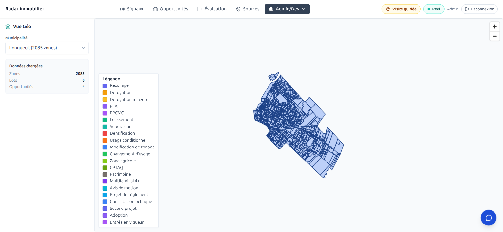
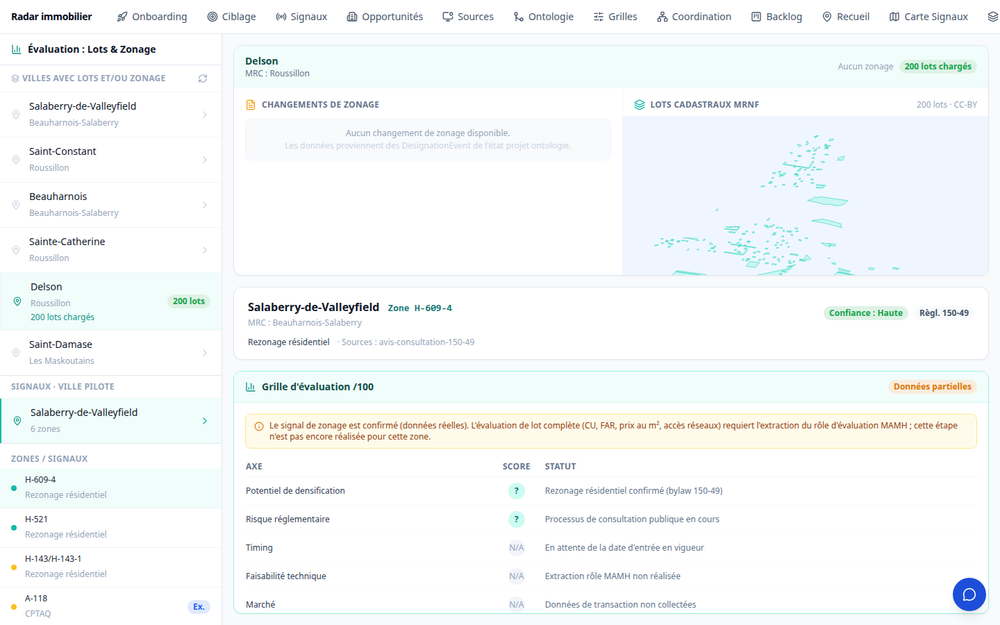
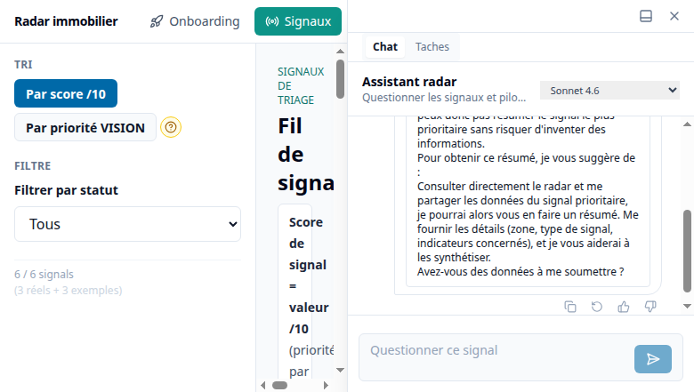
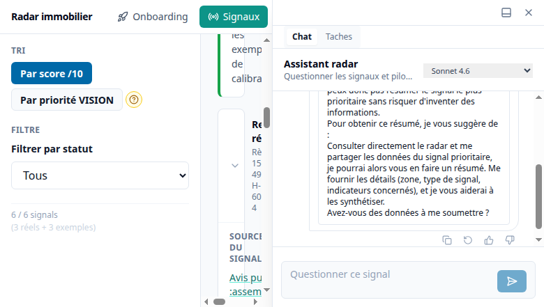
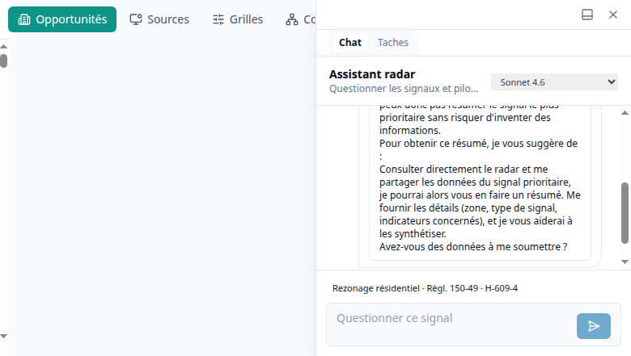

# Rapport d'étude — Radar Immobilier

Date : 2026-07-02
Statut : étude de faisabilité et de livraison, version consolidée pour relecture client.
Périmètre de mesure : graphes S3 et API geo mesurés du 28 juin au 2 juillet 2026 ; surface produit
et tests lus sur la baseline de branche ; jobs d'exploitation lus dans les manifests Kubernetes au
1er juillet 2026 ; livraisons produit du 2 juillet intégrées (connecteur assistant, dérivation
« 4+ logements », parité carte).

> **Note de lecture — effectif vs projeté.** Chaque chiffre est qualifié :
> **[effectif]** = mesuré réellement sur les données ou le code à une date donnée ;
> **[projeté]** = extrapolation crédible mais non encore réalisée ;
> **[en attente]** = dépend d'une donnée ou d'une livraison externe identifiée et demandée.
> Aucune métrique n'est présentée comme acquise si elle ne l'est pas. Les mesures reposent sur des
> commandes bornées et reproductibles, documentées dans les rapports internes cités en annexe.

---

## Résumé exécutif

Le socle livré démontre la faisabilité d'une chaîne bout-en-bout reliant des sources municipales
hétérogènes à une expérience produit exploitable : collecte documentaire, extraction de signaux
réglementaires, structuration en graphe avec citations, projection en base géospatiale, API de
domaine, vues cartographiques, vue de consolidation des données et connecteur assistant (MCP). La
chaîne fonctionne aujourd'hui de bout en bout sur un large ensemble de municipalités et sert de
banc de démonstration.

La lecture doit se faire sur **deux axes indissociables** :

- l'axe **de couverture** : ce qui est **effectif** sur les **30 villes prioritaires** (focus 30)
  versus les **1104 municipalités cibles** de la province ;
- l'axe **de profondeur de preuve** : les **33 opportunités témoins** suivies de bout en bout
  (signal → document → zone → grille → lot) versus l'échelle visée de **plus de 5000** couples
  ville × signal. C'est la vérifiabilité de chaque couche (citation, code de zone exact, lot
  rattaché, norme verbatim) qui conditionne l'usage réel du produit.

Les acquis principaux, **effectifs** :

1. un pipeline d'extraction (graphify) qui produit signaux, événements de désignation, zones,
   citations et références à partir des procès-verbaux et documents municipaux, sous **gate strict
   de citation vérifiable** en version 2.3 ;
2. une couche géographique qui ingère zonage et lots cadastraux depuis une API géospatiale, les
   projette en PostgreSQL/PostGIS, et résout des références signal → zone/lot ;
3. une couche **grilles de zonage** naissante : les normes réglementaires (hauteur, marges,
   densité) extraites verbatim et rattachées aux lots — pilote validé sur Salaberry-de-Valleyfield
   (**97,9 % des 15 510 lots** portent leurs normes) ;
4. une application exposant **quatre vues** — Signaux, Sources, Évaluation, Opportunités — dont la
   vue Évaluation désormais alignée sur l'application de référence du partenaire (filtres
   combinés, colorisation hiérarchique, fiche lot enrichie) ;
5. un **connecteur assistant (MCP) en production** : l'application est interrogeable depuis
   claude.ai, avec authentification par utilisateur et outils de données brutes ;
6. une architecture modulaire, à responsabilités séparées, où sources, geo, domaine, API, UI,
   intégrations et jobs d'exploitation sont découplés, avec une première industrialisation via
   jobs Kubernetes.

Les limites principales, **assumées et documentées** :

- disponibilité inégale des sources municipales ; ~97 villes cibles n'ont **aucune** donnée brute
  collectée (scraping préalable bloqué), et certaines villes résistent durablement au scraping ;
- consistance **signal↔zone** encore faible : **14/30** villes du focus citent une zone dans
  leurs signaux ; rappel ~60 % (proxy focus) et 47–59 % mesuré sur 55 villes — c'est le principal
  chantier de qualité (cf. §1.7) ;
- grounding des signaux à compléter : **56/70** signaux du focus portent une citation vérifiable ;
  la cible est **100 %** (passe de cleansing planifiée) ;
- données nominatives (propriétaires) et aires TOD **[en attente]** — acquisitions cadrées mais
  non livrées ;
- exploitation encore partielle : jobs geo one-shot/daily en place mais **cronjobs de refresh
  suspendus** pour des raisons de coût (FinOps), en attente de correction de la cause racine.

### Ontologie du signal — versions v2.2 et v2.3 (à lire avant les chiffres)

Les signaux sont extraits des PV selon un **schéma d'ontologie versionné**. Deux versions
apparaissent dans ce rapport :

- **v2.2** — schéma antérieur : entités et relations correctement extraites, mais **grounding
  partiel** (la citation source est parfois absente, ou pointe un identifiant de document non
  retrouvé).
- **v2.3** — schéma courant : ajoute une **contrainte de qualité forte** — chaque signal doit
  porter une **citation vérifiable** (page/passage du PV réel, verbatim) et franchir des
  **contrôles de publication** qui rejettent toute citation non substantiée.

Le passage **v2.2 → v2.3** est un **durcissement de la preuve** (pas un simple changement de
format) : il publie *moins* de signaux, mais chaque signal publié est **traçable jusqu'au
document**.

### Chiffres clés — deux périmètres : **Focus 30** vs **Province ≈1104**

La lecture se fait toujours sur **deux périmètres distincts** : les **30 villes focus** (banlieues
de la région de Montréal, le banc de démonstration E2E) et la **province ≈1104** (hors
Montréal/Laval). Un même indicateur a **deux valeurs** — ne jamais les additionner.

Les couches sont **distinctes** : le **PV scrapé** est le substrat brut ; les **signaux** en sont
extraits (le graphe v2.3 est la *méthode de parsing*, pas une finalité). Un signal n'a de valeur
que rattaché à une **citation vérifiable**.

| Couche (finalité) | **Focus 30** | **Province ≈1104** | Statut |
|---|---:|---:|---|
| **PV scrapés** — recueil brut (~3272 documents) | **27 / 30** | **~1007 / 1104** | **[effectif]** — préalable ; 3 focus (brossard, kirkland, lile-dorval) sans brut |
| **Signaux extraits** (v2.3) | **25 / 30** | **978 / 1104** | **[effectif]** — le graphe = *méthode d'extraction*, pas la finalité |
| **Signaux à citation vérifiable** | **56 / 70** — cible **100 %** | — | **[effectif]** — **14 signaux à traiter** (purge/re-ground, cf. §1.2) |
| **Zonage servi** (geo) | **29 / 30** | **~485 / 1106** | **[effectif — live 2026-07-02]** |
| **Grilles de zonage** (normes verbatim) | pilote validé — Salaberry : **97,9 % des 15 510 lots** avec normes | alignement 4 villes de référence en cours | **[effectif — pilote]** |
| **Lots servis** (cadastre MRNF) | **30 / 30** | **~1102 / 1106** | **[effectif — live 2026-07-02]** |
| Données nominatives (propriétaires) | — | — | **[en attente]** — acquisition cadrée, non lancée |
| Aires TOD (PMAD/CMM) | 4 villes de référence demandées en priorité | — | **[en attente]** — incrément demandé au fournisseur géo |
| Signaux **désignant une zone** | **14 / 30** | — | **[effectif]** — vrai goulot de consistance |
| Consistance signal↔zone (rappel) | **~60 %** (proxy) | 47–59 % (55 villes) | **[effectif]** — à re-mesurer sur PG peuplé |

> **Bascule récente (geo)** : le zonage focus est passé de **7/30 → 29/30** (livraison geo ; seul
> `lile-dorval`, micro-île, manque) et les lots à **30/30**. La **carte Évaluation en profite déjà
> en live** (passthrough OGC). En revanche la **vue Sources et le rapprochement signal↔zone
> lisent le PostgreSQL** peuplé par le *pull* — encore limité à ~7 villes — d'où un rappel
> **plafonné par l'état du PG**, pas par geo : le levier est de **puller les 29/30 en PG** (jobs
> `populate-geo` prêts).

### Les deux bancs E2E

Deux bancs de validation complémentaires structurent la démonstration :

1. **Le banc « signaux » — les 30 villes focus** (banlieues de la région de Montréal) : il
   éprouve la chaîne **signaux → zones → lots**. La difficulté centrale y est le **rapprochement
   signaux↔zones** : 14/30 villes citent une zone dans leurs signaux, et le rappel mesuré est de
   ~60 % (proxy focus) / 47–59 % (mesuré sur 55 villes). Les causes sont identifiées : les
   libellés de zones dans les PV diffèrent des codes servis par la couche géo, et une part des
   non-matchs est **attendue** (zones *proposées*, non encore en vigueur dans le zonage courant).
2. **Le banc « parité produit » — les 4 villes de l'application de référence du partenaire**
   (Delson, Sainte-Catherine, Saint-Constant, Candiac) : il éprouve l'expérience produit —
   visualisation lots/zones, filtres, fiche lot — contre une référence mesurable. Exemple : la
   dérivation « 4+ logements » par lot atteint **97,5 % d'exactitude** mesurée contre
   l'application de référence sur **3171 lots** (cf. §2.D).

Sur l'axe de profondeur, **33 opportunités témoins** servent de banc de preuve bout en bout
(signal → document → zone → grille → lot) ; l'échelle cible est de **plus de 5000** couples
ville × signal — l'écart entre les deux est le chantier de généralisation.

---

# 1 — Données : état par couche

Cette section décrit chaque couche de données séparément — de la plus brute (documents) à la plus
raffinée (normes par lot) — avec, pour chacune : la méthode d'acquisition, l'état mesuré, et les
limites.

## 1.1 — PV (procès-verbaux)

**Ce que c'est** : le substrat brut — procès-verbaux de conseils municipaux, avis publics et
règlements, collectés par scraping configuré par ville et archivés en stockage objet (adressage
par contenu, preuve conservée).

**État mesuré [effectif]** :

- **~3272 documents bruts** scrapés et archivés ;
- **~1007 / 1104** municipalités disposent d'un substrat documentaire ;
- focus 30 : **27 / 30** (brossard, kirkland et lile-dorval n'ont encore aucun brut).

**Limites** : ~97 villes cibles n'ont aucune donnée brute (portails protégés, sites sans PDF
exploitable, périmètres non résolus — ces cas sont classés dans un manifeste des villes
difficiles) ; certaines villes exigeront des contournements dédiés ou un rattrapage manuel.

## 1.2 — Signaux

**Ce que c'est** : les signaux réglementaires (rezonage, PPCMOI, dérogations, consultations…)
extraits des PV. L'extraction passe par les **graphes v2.3** — le graphe est la *méthode de
parsing*, pas la finalité : la finalité est un signal daté, typé, cité et localisable.

**État mesuré [effectif]** :

- **978 / 1104** municipalités ont des signaux extraits (v2.3) ; focus 30 : **25 / 30**
  (saint-constant et saint-philippe encore en v2.2) ;
- sur le focus : **70 signaux**, dont **56 avec citation vérifiable** (page/passage verbatim du
  PV réel) ;
- le reliquat provincial de **128 villes** se décompose en **~30 graphes v2.2 résiduels** (à
  re-grounder) et **~97 villes sans aucune donnée brute** (préalable scraping, cf. §1.1).

**Cible qualité — 100 % de citations vérifiables.** Un signal sans citation vérifiable ne doit
pas être présenté. Les **14 signaux** du focus qui n'en portent pas encore sont traités par une
**passe de cleansing** : soit **re-grounder** depuis le PDF réel (retrouver la citation verbatim),
soit **purger** le signal s'il n'est pas substantiable. La cible n'est pas « 80 % », c'est
**100 %**.

**Rigueur mesurée** : le run déterministe sur les 30 villes v2.2 résiduelles n'a publié que
**1 / 30** (saint-césaire) — 29 restent bloquées (22 sans référence groundée, 6 sans description,
1 structurellement invalide). Cette rigueur est **volontaire** : le gate v2.3 refuse de publier
une citation non vérifiable. L'audit a d'ailleurs montré que certaines baselines v2.2 portaient
des citations **partiellement fabriquées** (ex. une ville avec 12/12 identifiants de document
introuvables dans le brut) ; la voie retenue lit le **PDF réel** et marque `found:false` quand le
passage est absent. **Moins de volume publié, meilleure confiance.**

## 1.3 — Zones géographiques — par méthode d'acquisition

**Ce que c'est** : les polygones de zonage municipaux (la zone `H-609-4` et sa géométrie), acquis
par le partenaire géospatial puis servis via API OGC et projetés en PostgreSQL/PostGIS.

**Méthodes d'acquisition** — une ville peut relever d'une ou de plusieurs :

| Méthode | Ce que c'est |
|---|---|
| **ArcGIS** | feature-layers / services ArcGIS municipaux (géométries exposées directement) |
| **GeoNet** | portails géographiques municipaux moissonnés |
| **Contournements dédiés (« obscura »)** | sources difficiles (portails protégés, rendus dynamiques) traitées par un composant d'acquisition spécialisé |
| **PDF + recalage géoréférencé** | plans de zonage officiels PDF, géoréférencés et calés sur le cadastre quand la géométrie n'est pas exposée |

Après acquisition (quelle que soit la méthode) : mapping standard côté geo → ingestion dans
`zone_versions` + **normalisation des codes de zone** pour permettre le rapprochement signal↔zone.

**État mesuré [effectif — live 2026-07-02]** :

- **~485 / 1106** villes servies en zonage ; focus 30 : **29 / 30** (seul `lile-dorval`,
  micro-île, manque) ;
- **exemple validé — Salaberry-de-Valleyfield** : **645 zones** servies, **96,3 % de
  correspondance** avec le règlement officiel, **0 trou spatial** ;
- ~506 collections `qc-zonage-*` exposées, dont ~200 fragments (variantes ArcGIS, affectations,
  PIIA) non requêtés par le rapprochement — la canonisation à **une collection par ville** reste
  le chantier de stabilité du comptage.

> **Point d'architecture — geo « live » vs projection PG.** Le rapprochement signal → zone ne
> requête pas l'API géospatiale en direct : il lit la **projection PostgreSQL/PostGIS locale**
> (`zone_versions` / `lot_versions`), peuplée par l'étape d'**ingestion**. La fraîcheur du zonage
> rapproché dépend donc du **dernier job de pull réussi**. C'est un choix de robustesse
> (indépendance vis-à-vis d'un tiers, requêtes géospatiales performantes), qui impose en
> contrepartie des jobs de rafraîchissement fiables (cf. §1.8). La carte Évaluation, elle, lit la
> couche geo **en direct** (passthrough OGC) et bénéficie immédiatement du 29/30.

**Limites** : nommage non canonique des collections ; plusieurs couches par ville (zonage,
affectation, grille, PIIA, plan d'urbanisme) ; champs de code hétérogènes (`zone_code`, `code`,
`NumZone`, `NO_ZONAGE`, `ETIQUETTE`…) ; granularité différente entre signal et couche (famille
`H1` vs sous-zone `H1-30`) ; nécessité de conserver l'historique temporel des règlements (zones
proposées, entrées en vigueur).

## 1.4 — Grilles de zonage (normes)

**Ce que c'est** : les grilles des usages et normes — la couche qui transforme une zone en
**règles constructibles** : usages permis, hauteur, marges, densité, contraintes. C'est le levier
de la qualification « 4+ logements fondée sur la grille » (et non sur une heuristique).

**Méthode** : extraction des normes **verbatim** depuis les grilles officielles (valeur exacte,
cellule, page), rattachement zone → normes, puis mapping **lot → zone → normes**.

**État mesuré [effectif — pilote]** :

- **Salaberry-de-Valleyfield** : **97,9 % des 15 510 lots** portent leurs normes (hauteur,
  marges, densité), mapping lot → zone → normes complet ;
- **alignement en cours** sur les 4 villes de l'application de référence du partenaire (Delson,
  Sainte-Catherine, Saint-Constant, Candiac) ;
- **exposition des normes dans l'API géo en cours** — c'est le déclencheur du « 4+ fondé
  grille » côté produit.

**Recommandation IA — prudente et explicite :**

- **conserver le moteur OCR spécialisé (Mistral OCR 4)** pour l'OCR, où il donne de bons
  résultats sur les documents complexes ;
- **rester prudent avec la complétion (completion Mistral)** sur la reconstruction
  réglementaire : **mesurer et borner l'écart d'erreur avant tout usage à portée réglementaire**.
  Une grille reconstruite par complétion peut paraître plausible tout en étant fausse sur une
  valeur critique (hauteur, densité, usage) — inacceptable pour une décision d'investissement ;
- préférer une **extraction structurée avec preuve** : cellule, page, citation, table, champ ;
- produire les grilles en mode **« preuve d'abord »** plutôt qu'en mode résumé.

## 1.5 — Lots (cadastre) et données nominatives

**Ce que c'est** : les parcelles cadastrales — numéro de lot et géométrie — issues du **cadastre
public (MRNF, licence CC-BY)**, avec bornage strict par commune / bbox.

**État mesuré [effectif — live 2026-07-02]** :

- **~1102 / 1106** villes servies en lots ; focus 30 : **30 / 30** ;
- sur Salaberry-de-Valleyfield : **100 % des lots assignés à une zone** (jointure par code de
  zone, sinon jointure spatiale par centroïde — cf. §2.E).

**Données nominatives (propriétaires) : [en attente].** La donnée servie aujourd'hui est
**géométrique et cadastrale uniquement, sans propriétaire**. Une acquisition légitime (fichier
fourni par le client, base légale et gouvernance dédiées) est **cadrée mais non lancée**. Le
pipeline maintient la séparation :

- pas d'enrichissement propriétaire sans base légale et gouvernance spécifiques ;
- pas d'affichage de donnée personnelle ;
- **tests anti-PII côté UI/API** : un test vérifie que les propriétés exposées d'un lot se
  limitent au strict nécessaire. Ce test est en cours de recalage suite à l'ajout de champs
  dérivés publics (score, indicateurs 4+/TOD — des attributs calculés, pas des données
  personnelles).

## 1.6 — TOD (aires de transit)

**Ce que c'est** : les aires TOD (transit-oriented development) du PMAD/CMM — un critère majeur
de qualification des lots (densification près des points de transport).

**État : [en attente].** L'incrément a été **demandé au fournisseur géo**, avec les 4 villes de
l'application de référence en priorité. Côté produit, le filtre TOD et la colorisation associée
sont **déjà câblés** (cf. §2.D) et s'activeront à réception de la donnée.

## 1.7 — Consistance signal↔zone : la mesure de référence

Le rapprochement signal → zone a été mesuré **trois fois**, sans extrapolation, sur le périmètre
strict des villes ayant à la fois des signaux désignant une zone et une collection zonage servie :

| Mesure | Rappel | Périmètre | Date |
|---|---:|---|---|
| Live (rapprochement tel quel) | **52 / 110 = 47,3 %** | 55 villes d'intersection | 28 juin |
| Après fix applicatif (lecture des champs de zone non-candidats) | **63 / 110 = 57,3 %** (+9,1 pts) | idem | 28 juin |
| Re-mesure finale (corrections applicatives + geo) | **71 / 120 = 59,2 %** | 55 villes, logique de champ finale | 29 juin |

Sur le focus 30, le proxy courant est de **~60 %** (28/47). Détails utiles à la décision :

- répartition des causes de non-match : **gap-data 63,8 %**, champ-non-lu 19,0 %, écart-schéma
  17,2 %, format-zéro-tête **0,0 %** (hypothèse réfutée sur la donnée réelle) ;
- **~81 % du déficit résiduel n'est pas corrigeable côté application** : il relève d'une
  extraction d'entités trop grossière (famille `H1` au lieu de `H1-30`) ou de couches geo
  divergentes (couche d'affectation servie au lieu de la grille) ;
- une part des non-matchs est **attendue et légitime** : un signal de **zone proposée** ou de
  **règlement en cours** peut ne pas exister dans le zonage courant ;
- le **plafond de rappel atteignable côté application seule est ~57–59 %** ; aller au-delà exige
  l'acquisition des vraies grilles réglementaires (geo) et l'affinage de la granularité
  d'extraction (graphify). Le fix applicatif a débloqué des villes entières (rimouski 0→5/5,
  saint-hyacinthe 0→4/4).

Lecture étude : la normalisation et la jointure côté application sont **saines** ; le levier de
progression restant est **hors application** (données geo + granularité d'extraction), ce qui
doit guider la priorisation.

## 1.8 — Exploitation, limites transverses et préconisations

### Jobs récurrents

Trois jobs Kubernetes industrialisent la chaîne geo **[effectif]** :

- `radar-populate-geo` (one-shot) : pull zones/lots puis résolution des références ;
- `radar-populate-geo` en CronJob : rafraîchissement récurrent ;
- `radar-run-geo-mapper` : relance du rapprochement seul.

Deux CronJobs de refresh applicatif (`radar-refresh-scrape` et `radar-refresh-projection`) sont
**actuellement suspendus** (`suspend: true`) **[effectif]** : ils échouaient chaque nuit et
réveillaient un pool de calcul à la demande, avec un coût injustifié tant que la cause racine
(secret/schéma) n'est pas corrigée. Un nettoyage automatique (`ttlSecondsAfterFinished`) a été
ajouté. C'est une **décision FinOps assumée**, pas une capacité manquante : la réactivation est un
simple `suspend: false` après correction.

### Préconisations

1. **passe de cleansing grounding** : viser **100 %** de signaux à citation vérifiable —
   re-grounder ou purger (aucun signal sans citation vérifiable en production) ;
2. **spécialiser le modèle de détection** des signaux réglementaires (prompts/schémas dédiés par
   famille : PPCMOI, dérogations, rezonage, PIIA, TOD, usages, densité) ;
3. **mapping rues / zones** : relier adresse, toponyme, rue, lot et zone — couche encore faible,
   principal levier de précision restant ;
4. **canonisation zonage** : réduire les fragments à **une** collection canonique par ville ;
5. **normalisation des grilles** : généraliser l'extraction des normes verbatim et son exposition
   API (pilote Salaberry validé) ;
6. **contrôle qualité** : métriques automatiques de rappel, précision, taux de citation et
   couverture ; journaliser les résultats par ville et par couche ; publier un tableau de bord de
   fraîcheur ; conserver les échecs par cause ; **borner les extractions** (bbox, pagination) ;
7. **score de confiance par signal** (citation, date, type, zone, lot, source, état du règlement)
   et séparation explicite signaux **constatés** / **inférés** / **opportunités projetées**.

---

# 2 — Réalisations fonctionnelles

Quatre vues officielles sont câblées dans la navigation : **Signaux**, **Opportunités**,
**Évaluation**, **Sources**. Un socle cartographique partagé (`GeoCityMapBase`) a été extrait et
alimente les vues MapLibre.

## 2.A — Vues cartographiques : ville, zones, lots



*Vue Géo — Longueuil : 2085 zones de zonage rendues (couche geo servie live), légende par type de signal réglementaire.*

### Signaux — **fonctionnel**

- carte **MapLibre GL** sur socle `GeoCityMapBase` ;
- aplats choroplèthes par ville, coloriés par nombre d'opportunités récentes ;
- clic ville → vol cartographique, rail et panneau listant les signaux (rezonage, PPCMOI,
  dérogation…) ;
- **3 filtres de type de signal** (`z | m | p`), **persistés dans l'URL et le stockage local** ;
- recherche de villes dans le rail ; légende épinglée ; affichage des citations et du contexte.

Limite : la précision lot/zone dépend du rapprochement signal → zone et de la couverture geo
(cf. §1.7).

### Évaluation — **alignée sur l'application de référence (livraison du 2 juillet)**



*Vue Évaluation — Delson : lots cadastraux, signal réglementaire relié, et grille /100 avec affichage explicite des axes non encore mesurés (pas de faux score).*

- carte des **lots cadastraux avec zones jointes** (couche geo live, passthrough OGC) ;
- **filtres combinés** dans le panneau données : 4+ logements, TOD, priorité, usages, superficie
  minimale ;
- **colorisation hiérarchique** : vert (4+), bleu (TOD), ambre (priorité), lots hors filtre
  estompés ;
- **fiche lot enrichie** : adresse, superficie, **façade estimée** (méthode géométrique
  documentée), zone et **normes verbatim** quand disponibles, liens cartes externes ;
- buckets de score et grilles de score (onglet dédié) ; marques/prospects **en lecture seule**
  (écriture à venir).

Limites restantes : aires TOD **[en attente]** du fournisseur géo (filtre câblé) ; écriture des
marques/notes et « mini-formulaire en vente » à finaliser.

### Sources — **fonctionnel, fiabilisé**

Vue de consolidation (« grand filet ») :

- villes coloriées par **maturité de recueil** (choroplèthe sur `GeoCityMapBase`) ;
- distinction `hasZonage`, statut par source (graphifié / scrappé / identifié / erreur) ;
- panneau qualité des données et détail par ville ;
- état vide **explicite** si la donnée est absente (aucune couverture affichée sans donnée) ;
- **fiabilisation du chargement** (livraison récente) : indicateurs de chargement par requête
  (zones/lots/signaux) et protection anti-course (les réponses obsolètes sont abandonnées).

Elle s'appuie sur `/api/scrape-status`, la couverture qualité par ville et
`/api/signals/by-city`.

## 2.B — Signaux : filtrage, citations, affichage



*Vue Signaux — fil de triage, tri/filtre, assistant conversationnel. Le compteur distingue signaux réels et exemples.*



*Détail d'un signal — type, zone citée, indicateurs et contexte source.*

Les signaux disposent déjà d'une expérience consultable : catégorisation par type, filtre dans la
vue, citation affichable, chemin vers le document source quand disponible, contextualisation par
ville. Le point clef est la **traçabilité** ; un signal doit répondre à : quelle ville ? quel
document ? quelle page / citation ? quel type ? quelle zone / lot / rue ? quelle confiance ? Le
produit couvre les premiers éléments ; la **confiance** et la **liaison fine zone/lot** restent à
renforcer.

La preuve documentaire est disponible : un viewer PDF (pdf.js) affiche le document source à
partir d'une archive objet. La route de service **sonde d'abord l'archive de scraping** (PDF PV
stockés en adressage par contenu) puis **retombe** sur un store de métadonnées — mécanisme de
repli utile quand la source d'origine est complexe ou indisponible.

## 2.C — Vue données : consolidation et couverture produit



*Vue Opportunités — entonnoir de dossiers par phase (données de démonstration à ce stade ; la carte lots/opportunités branchée sur l'API réelle reste à finaliser).*

La vue Sources / Données consolide l'état de collecte et de qualité. C'est une réalisation
importante car elle **distingue la couverture vérifiée de la couverture théorique**. Elle a
vocation à devenir le **tableau de bord de pilotage** : couverture raw, graph, zonage, lots ;
fraîcheur des jobs ; erreurs par source ; villes bloquées ; qualité des citations.

### Couverture des 17 fonctionnalités cibles (référentiel de l'application de référence du partenaire)

Sur les 17 fonctionnalités du cahier des charges produit **[effectif, lecture code + tests,
mise à jour 2 juillet]** :

- **Livré : 3** — pastilles réglementaires (signaux automatiques), dashboard multi-villes (vue
  Sources), et **filtres combinés** (4+/TOD/priorité/usage/superficie — livrés le 2 juillet) ;
- **Partiel : 5** — scoring lots (aires TOD en attente, carte Opportunités MapLibre à faire),
  fiche lot (enrichie le 2 juillet : adresse, façade estimée, normes verbatim ; formulaire « en
  vente » manquant), marques équipe (**lecture seule**, pas d'écriture), authentification (livrée ;
  synchronisation temps réel et export/import JSON absents), fiche mobile (tiroir latéral, pas
  encore bottom-sheet) ;
- **Absent / planifié : 9** — export CSV, couches environnementales, recherche adresse/lot,
  sélection multiple batch, labels par zoom, flux annonces, lookup code postal, éditeur de zonage
  manuel, marquage batch de zone.

> **Point de transparence produit :** la vue **Opportunités** de la navigation est aujourd'hui un
> **entonnoir de dossiers de démonstration** (fixture statique), **pas** la carte
> lots/zonage/scoring branchée sur l'API réelle. La carte lots scorée et filtrée existe côté
> **Évaluation**. La carte Opportunités réelle reste à faire.

**Tests :** la suite UI compte **680 tests** (**669 passent**, 1 échoue, 10 à écrire, 10 ignorés)
**[effectif, 28 juin]**. Le sous-ensemble logique lots/fiche/prospect/scoring est **au vert
(86/86)**. Le seul test rouge est le test anti-PII à recaler décrit au §1.5.

## 2.D — Livraisons du 2 juillet

Quatre livraisons produit ont été intégrées le 2 juillet :

1. **Connecteur assistant (MCP) pour claude.ai — en production.** Un serveur MCP avec
   authentification **OAuth 2.1/PKCE** est déployé et **validé de bout en bout** : chaque
   utilisateur enrôle sa propre connexion depuis claude.ai et interroge les données de
   l'application (signaux, couverture, sources) depuis l'assistant. S'y ajoutent **4 outils de
   données brutes** — zones et lots **GeoJSON** (requêtes bornées, avec indicateurs 4+/TOD par
   lot), grilles et procès-verbaux **PDF** — qui permettent à l'assistant de produire des
   représentations ad hoc (cartes, tableaux, synthèses) à la demande.
2. **Dérivation « 4+ logements » par lot.** Chaque lot est qualifié constructible « 4 logements
   et plus » par jointure avec sa zone (par code de zone, sinon par jointure spatiale au
   centroïde), en s'appuyant sur les **normes réelles de la grille quand elles sont disponibles**
   et sinon sur une **heuristique explicitement signalée comme telle**. Exactitude mesurée :
   **97,5 %** contre l'application de référence du partenaire, sur **3171 lots**. L'exposition
   des normes dans l'API géo (§1.4) fera converger ce chiffre vers le « 4+ fondé grille ».
3. **Parité carte.** Filtres combinés 4+/TOD/priorité/usage/superficie, colorisation
   hiérarchique (vert 4+, bleu TOD, ambre priorité, hors-filtre estompé), fiche lot enrichie
   (adresse, façade estimée par méthode géométrique documentée, normes verbatim) — cf. §2.A.
4. **Vue Sources fiabilisée.** Couverture qualité par ville, indicateurs de chargement par
   requête et protection anti-course sur les chargements de couches.

## 2.E — Cas difficiles résolus

Trois exemples de problèmes non triviaux résolus pendant la période, illustrant la profondeur
technique du socle :

- **Jointure spatiale lot↔zone sans code porté.** Dans plusieurs villes, les lots cadastraux ne
  portent pas le code de leur zone. La résolution joint alors chaque lot à sa zone **par
  inclusion spatiale de son centroïde** dans le polygone de zone — avec repli documenté et
  indicateur de méthode, pour ne jamais présenter une jointure spatiale comme une jointure
  exacte. Résultat : 100 % des lots de Salaberry-de-Valleyfield assignés à une zone.
- **Serveur MCP autonome et vérifié au build.** Le connecteur assistant est empaqueté en image
  autonome (aucune dépendance externe au démarrage) avec un **test de démarrage intégré à la
  construction** : si le serveur ne démarre pas, l'image ne se construit pas — l'échec est
  détecté avant tout déploiement.
- **Robustesse cartographique sur données vides.** Les expressions de style de la carte
  (filtres, colorisation) devenaient invalides quand une couche arrivait vide ; elles sont
  désormais construites pour rester valides sur toute forme de données, et les chargements
  concurrents sont protégés contre les courses (les réponses périmées sont abandonnées).

---

# 3 — Code et intégration

## 3.A — Architecture générale et réversibilité

L'architecture est **modulaire, à responsabilités séparées** :

```text
Sources municipales / géographiques
        ↓
Acquisition et scraping
        ↓
OCR / extraction / graphify
        ↓
Graphe normalisé + citations
        ↓
Projection PostgreSQL / PostGIS
        ↓
API domaine
        ↓
Application UI
        ↓
Intégrations assistées (connecteur MCP)
```

Le dépôt est un **monorepo** à espaces de travail : API, UI et bibliothèques de domaine
(`radar-domain`, `radar-scoring`, `radar-sources`), plus des jobs d'exploitation. Chaque
bibliothèque a une convention homogène (modules ES, TypeScript, build et typage via `tsc`, tests
`vitest`).

Les sources sont **pilotées par configuration** plutôt que codées ville par ville : un registre
central décrit chaque municipalité (procès-verbaux, avis publics, règlements d'urbanisme, rôle
d'évaluation, adresses, séances vidéo) et un scraper générique la consomme. Cette approche est un
atout de scalabilité — mais elle **ne rend pas toutes les villes accessibles** : un manifeste des
villes « dures » classe explicitement les cas irréductibles (par exemple portails protégés par
anti-bot, sites sans PDF exploitable, périmètres minuscules au domaine non résolu). Ces cas sont
**documentés**, pas masqués.

Cette séparation permet :

- de remplacer une source sans réécrire l'UI ;
- de changer de fournisseur OCR / LLM ;
- de rejouer une projection à volonté ;
- de **brancher ou retirer une couche d'authentification** sans toucher au domaine.

**Réversibilité des couches d'identité (OAuth) :** l'authentification repose sur un flux OIDC
standard (`authorization_code` + PKCE) et une session applicative auto-portée ; l'interface de
domaine reste stable pendant que la couche d'identité évolue. Le **connecteur assistant (MCP)**
réutilise la même discipline : OAuth 2.1/PKCE, enrôlement par utilisateur, aucune donnée exposée
sans authentification. Cette couche transverse est **réversible** : le produit fonctionne avec ou
sans elle, et son durcissement (session durable, refresh silencieux, persistance du consentement)
est un chantier identifié et cadré, indépendant du domaine métier.

## 3.B — Utilisation de l'IA : mixture of agents (consensus)

La production repose sur une **mixture of agents** : plusieurs agents autonomes travaillent en
parallèle et, sur les problèmes complexes, **convergent par consensus** (double relecture,
vérification adverse, arbitrage croisé) plutôt que de faire confiance à une seule passe. Le
consensus est le mécanisme central — il attrape les erreurs qu'un agent seul laisserait passer.

| Rôle | Agent / capacité | Usage |
|---|---|---|
| Raisonnement complexe, arbitrages d'architecture | agents **Claude 4.8 (xhigh)**, en **double compte** | conception, décisions, **1ʳᵉ passe** du consensus |
| Exécution, patchs, **relecture adverse** | agents **Codex 5.5 (xhigh)**, en **double compte** | implémentation, correctifs, **2ᵉ passe** (relecture) du consensus |
| OCR de documents complexes | moteur OCR spécialisé (**Mistral OCR 4**) | extraction de texte sur PDF difficiles |
| Grounding verbatim des citations | agent de raisonnement rapide | retrouver la citation exacte, anti-hallucination |
| Agents parallèles | flotte d'agents isolés (worktrees) | mesures, UI, infra, data, rédaction |

Le **consensus multi-agents** (un agent produit, un autre relit/arbitre ; profils Claude 4.8 xhigh
et Codex 5.5 xhigh en doubles comptes) sert à **croiser les points de vue** et à sécuriser les
décisions difficiles. La difficulté n'est pas seulement de générer du code, mais de **coordonner
des couches hétérogènes, valider les faits et garantir l'exactitude des métriques** — d'où le
recours systématique au consensus plutôt qu'à une réponse unique.

**Principe à conserver :** l'IA accélère extraction, mapping, tests et rédaction ; des **gates
déterministes** décident de ce qui est publié ; les **métriques et citations** arbitrent ; les
**humains** valident les hypothèses métier et les priorités.

## 3.C — Infrastructure et coûts

### Infrastructure

- API Node / TypeScript ;
- PostgreSQL / PostGIS (projection géospatiale) ;
- jobs Kubernetes (backfill, refresh, mapper) ;
- stockage objet S3 (documents, PV en adressage par contenu, graphes) ;
- CDN / distribution du front ; application web ; serveur MCP (connecteur assistant).

Les jobs geo permettent de passer d'une exécution manuelle à une exploitation : one-shot pour
backfill ou relance, CronJob pour rafraîchissement, mapper autonome pour recalculer les
résolutions. Comme indiqué au §1.8, deux CronJobs de refresh applicatif sont **suspendus pour
raison de coût** en attendant la correction de leur cause racine — l'exploitation est donc
**amorcée mais pas encore pleinement stabilisée**.

### Projection des coûts et des tokens — coût au siège vs coût complet

Il faut distinguer **deux coûts** et ne jamais présenter le premier comme le second :

1. **Coût au siège / marginal de démonstration** : runs ciblés, focus 30, extraction ponctuelle,
   modèles premium réservés aux cas difficiles. C'est le coût d'une **preuve**, faible et maîtrisé.
2. **Coût complet industrialisé** : 1104 municipalités, refresh régulier, OCR, stockage, LLM, jobs,
   supervision et reprise d'erreurs. C'est le coût d'un **service**, dominé par les volumes récurrents
   (OCR + LLM sur les documents, et refresh geo/scrape) plutôt que par le développement.

**Stratégie recommandée pour maîtriser le coût complet :**

- réserver les **modèles premium aux cas complexes ou à forte valeur** ; garder les transformations
  **déterministes** partout où c'est possible (le reshape et le gate ne consomment pas de LLM) ;
- réserver l'**OCR spécialisé** aux documents où il apporte un gain mesurable ;
- **batcher** les villes et **borner** les extractions (bbox, pagination) ;
- exploiter **hashes, fraîcheur et jobs incrémentaux** pour éviter les relances complètes inutiles ;
- **mesurer le coût par ville, par document et par signal validé** — la bonne unité économique n'est
  pas le token brut mais le **signal vérifiable produit**.

La suspension FinOps des CronJobs de refresh est une **illustration concrète** de cette discipline :
un job récurrent défaillant a un coût réel (réveil d'un pool de calcul), et il est légitime de le
suspendre tant qu'il ne produit pas de valeur.

#### Chiffrage — à consolider avec agent-stats et k8s

> **Cette section est en attente des chiffres réels** et sera renseignée pour être **cohérente avec
> les demandes de facturation** déjà émises côté agent-stats et k8s. Structure cible :

| Poste | Coût siège (démo) | Coût complet (1104) | Source |
|---|---:|---:|---|
| **immo** — LLM/agents (extraction, mapping, IA) | *[en attente agent-stats]* | *[en attente agent-stats]* | agent-stats (tokens) |
| **immo** — infra (compute, PG, stockage, CDN) | *[en attente k8s]* | *[en attente k8s]* | poc-k8s |
| **geo** — acquisition/OCR/compute | *[en attente geo]* | *[en attente geo]* | geo |
| **geo-quebec** — (à préciser) | *[en attente geo]* | *[en attente geo]* | geo |

Demandes h2a envoyées à **agent-stats** (tokens/coût immo), **poc-k8s** (infra cluster) et **geo**
(coût geo + geo-quebec). Les montants seront insérés dès réception, format aligné sur la facturation.

---

# Conclusion et feuille de route

La faisabilité est **démontrée** : les briques data, geo, graphe, API, UI et connecteur assistant
existent et communiquent. Le produit permet déjà de **consulter des signaux avec citations**,
d'**inspecter la maturité des sources**, de **filtrer et visualiser des lots qualifiés** (4+,
priorité) sur les villes couvertes, et d'**interroger les données depuis claude.ai**.

La prochaine étape n'est pas une preuve de concept supplémentaire, mais une **consolidation
priorisée**, dans cet ordre :

1. **prioriser le focus 30** : zonage/lots geo désormais à **29/30 & 30/30** — les **puller en
   PG** puis remonter la **consistance signal↔zone** (le vrai goulot) ;
2. **passe de cleansing grounding** : atteindre 100 % de signaux à citation vérifiable sur le
   focus (56/70 aujourd'hui) ;
3. **généraliser les grilles de normes** : aligner les 4 villes de l'application de référence sur
   le pilote Salaberry (97,9 % des lots avec normes) et exposer les normes dans l'API géo — le
   « 4+ fondé grille » ;
4. **stabiliser les jobs récurrents** (corriger puis réactiver les refresh) et **canoniser les
   collections zonage** (une par ville) ;
5. **intégrer les acquisitions en attente** : aires TOD (fournisseur géo) et données nominatives
   (fichier client, gouvernance dédiée) ;
6. **finaliser les vues lots / opportunités** (carte Opportunités réelle, écriture des marques) et
   **publier un tableau de bord de couverture** distinguant effectif et projeté.

Le potentiel 1104 est **atteignable par itérations**, en séparant clairement ce qui est
**effectif** de ce qui est **projeté**. La valeur du socle actuel tient autant à ce qu'il produit
qu'à sa **discipline de vérité** : gates déterministes, citations obligatoires, mesures
reproductibles et limites documentées.

---

# Annexes — métriques citées, provenance et dates

| Sujet | Mesure | Qualification | Source interne | Date |
|---|---|---|---|---|
| Documents bruts scrapés (PV) | ~3272 documents | effectif | mesure S3 / manifeste scraping | 2 juillet |
| Graphes v2.3 | ~976 (dans cible) à 978 (après publication) / 1104 | effectif | `2.3-completude-1105-FRESH.md`, `2.3-finition-progress.md` | 28 juin |
| Reliquat v2.3 | 128 villes (~30 v2.2 + ~97 sans brut) | effectif | idem | 28 juin |
| Focus 30 v2.2 résiduel | 1 publié (saint-césaire), 29 bloquées | effectif | `2.3-finition-progress.md` | 28 juin |
| Grounding fabriqué (v2.2) | ex. 12/12 identifiants de document introuvables sur une ville | effectif | `2.3-finition-progress.md` | 28 juin |
| Collections zonage | ~506 `qc-zonage-*` (dont ~200 fragments ArcGIS) | effectif | `zones-geo-30-investigation.md`, `wp3-mapper-recall-2026-06-28.md` | 28–29 juin |
| Couverture zonage province | ~234/1104 (juin) → **~485 / 1106** | effectif (live) | mesure directe API geo `/collections` | 2 juillet |
| **Focus 30 zonage servi** | 3/30 (juin) → **29 / 30** | effectif (live) | idem (seul `lile-dorval` manque) | 2 juillet |
| **Focus 30 lots servis** | **30 / 30** | effectif (live) | idem | 2 juillet |
| Zonage Salaberry-de-Valleyfield | **645 zones ; 96,3 % de correspondance au règlement officiel ; 0 trou spatial** | effectif | validation geo (recalage/contrôle) | 2 juillet |
| Grilles de normes — Salaberry | **97,9 % des 15 510 lots** avec normes (hauteur, marges, densité) | effectif (pilote) | pipeline grilles (extraction verbatim) | 2 juillet |
| Lots → zone — Salaberry | **100 %** des lots assignés à une zone | effectif | jointure code + centroïde | 2 juillet |
| Dérivation « 4+ logements » | **97,5 %** d'exactitude sur **3171 lots** | effectif | comparaison vs application de référence | 2 juillet |
| Connecteur MCP claude.ai | OAuth 2.1/PKCE en production, validé e2e ; 4 outils données brutes | effectif | déploiement k8s + tests e2e | 2 juillet |
| Focus 30 — PV scrapé (recueil brut) | **27 / 30** | effectif | mesure S3 | 2 juillet |
| Focus 30 — signaux extraits (v2.3) | **25 / 30** | effectif | mesure S3 | 2 juillet |
| Focus 30 — signaux à citation vérifiable (cible 100 %) | **56 / 70** | effectif | mesure S3 | 2 juillet |
| Focus 30 — signaux désignant une zone | **14 / 30** | effectif | mesure S3 | 2 juillet |
| Focus 30 — rappel signal↔zone (proxy) | **28 / 47 = 60 %** | proxy | S3 + croisement geo | 2 juillet |
| Collections lots province | ~1103 → **~1102 / 1106** | effectif (API geo) | idem | 2 juillet |
| Rappel mapper (live) | 52 / 110 = 47,3 % | effectif | `wp3-mapper-recall-2026-06-28.md` | 28 juin |
| Rappel mapper (fix applicatif) | 63 / 110 = 57,3 % | effectif | idem | 28 juin |
| Rappel mapper (final immo+geo) | 71 / 120 = 59,2 % | effectif | idem, §6 | 29 juin |
| Causes de non-match | gap-data 63,8 % · champ-non-lu 19 % · écart-schéma 17,2 % · zéro-tête 0 % | effectif | idem | 28 juin |
| Vues produit | 3 livré · 5 partiel · 9 absent (17 features) | effectif | `wp4-produit-coverage.md` + livraisons du 2 juillet | 2 juillet |
| Tests UI | 680 (669 pass, 1 fail, 10 todo, 10 skip) | effectif | idem | 28 juin |
| Jobs geo | populate-geo one-shot + CronJob, run-geo-mapper | effectif | `deploy/k8s/35a/35b/35` | 1er juillet |
| CronJobs refresh | suspendus (`suspend: true`, FinOps) | effectif | `deploy/k8s/34-refresh-cronjob.yaml` | 1er juillet |

> Les captures d'écran des vues (Signaux, Sources, Évaluation) peuvent être jointes sous
> `docs/spec/reports/study-2026-07/assets/` pour la version présentée ; elles ne modifient aucun
> chiffre du présent rapport.
