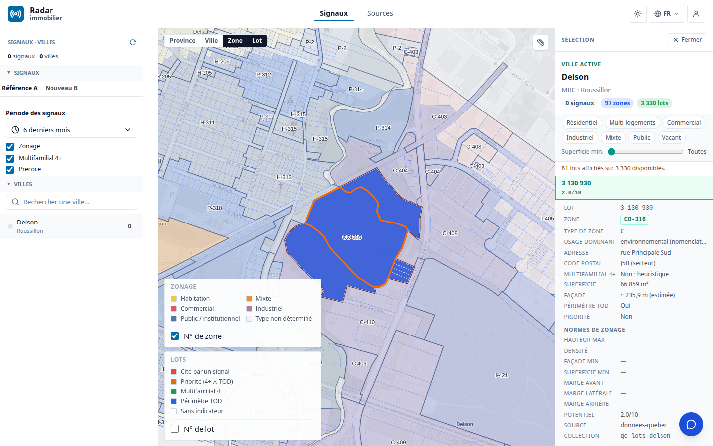
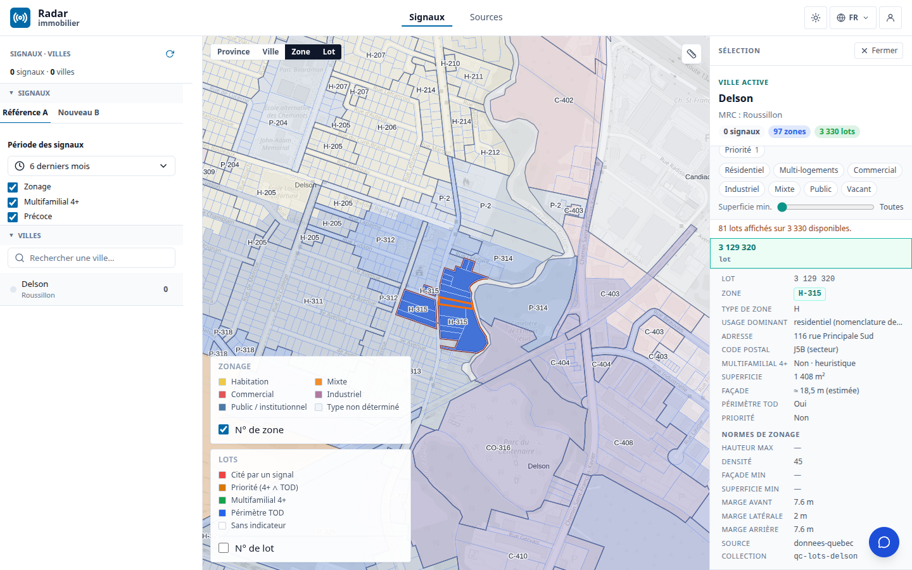
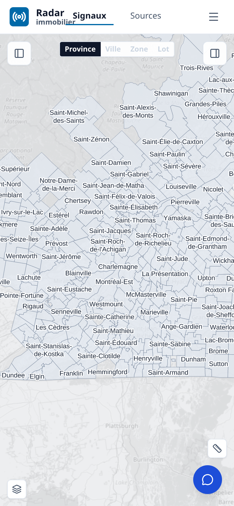
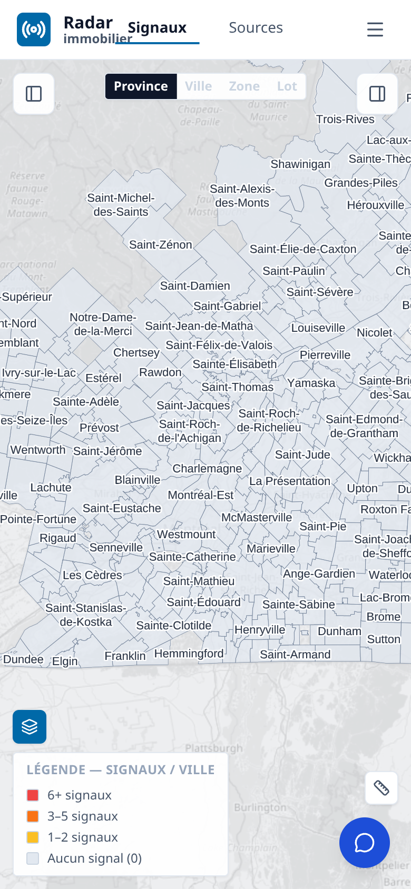

# Rapport d'étude — Radar Immobilier

Période étudiée : 2026-07-13 → 2026-08-09  
Statut : rapport de période final — périmètres IMMO et GEO.  
Périmètre de mesure : livraisons de la fenêtre ; état Track, production IMMO et catalogue OGC
GEO **[effectif — mesures du 2026-08-09]** ; photographie qualité GEO **[effectif —
2026-07-25]**. Les métriques antérieures non remesurables sans accès authentifié sont conservées
uniquement comme baselines datées.

> **Note de lecture — effectif vs projeté.** Chaque chiffre est qualifié :
> **[effectif]** = mesuré réellement sur les données ou le code à une date donnée ;
> **[projeté]** = extrapolation crédible mais non encore réalisée ;
> **[en attente]** = dépend d'une donnée ou d'une livraison externe identifiée et demandée.
> Aucune métrique n'est présentée comme acquise si elle ne l'est pas. Les mesures reposent sur des
> commandes bornées et reproductibles, documentées en annexe.

---

## Résumé exécutif

Le radar propose désormais une chaîne de décision lisible dans une même expérience :
**signal → preuve → zone → lot → décision client**. L'utilisateur part d'un fait réglementaire,
en vérifie le contexte, choisit une zone puis un lot en deux clics et conserve la zone active
pendant l'examen parcellaire. Le retrait du score « Potentiel x.x/10 », qui n'était pas fondé sur
les caractéristiques du lot, évite qu'une précision d'interface soit confondue avec une
évaluation démontrée. La carte Signaux est aussi utilisable sur petit écran : fil centré sur une
ligne, légendes repliées et outil de mesure accessible.

Cette expérience n'est crédible que si les couches GEO qui la portent sont qualifiées. La
présence canonique mesurée atteint **29/30** villes Focus et **868/1104** villes provinciales en
zonage, **30/30** et **1102/1104** en lots, ainsi que **29/30** et **596/1104** pour les
collections de normes **[effectif — API GEO, 2026-08-09]**. Ces nombres attestent une couche
servie, pas sa complétude réglementaire, son bon millésime ni sa preuve exacte.

> **Deux bancs E2E, deux questions différentes.**
>
> - **Couverture : Focus 30 vs Province ≈1104.** Le banc vérifie si les couches nécessaires sont
>   présentes. Les deux périmètres restent distincts et ne sont jamais additionnés. Ses limites
>   principales sont la qualité variable des grilles et de leur millésime, l'absence de données
>   de propriétaire gouvernées et l'écart entre présence d'une collection et complétude réelle.
> - **Profondeur : ~33 témoins vs >5000 ville×signal.** Les **~33 opportunités témoins
>   [effectif — banc de référence]** éprouvent la chaîne signal → document → zone → grille → lot ;
>   **>5000 couples ville×signal [projeté]** en représentent l'échelle visée. Ses limites sont la
>   provenance exacte encore incomplète et le rappel/précision signal↔zone non remesuré sur toute
>   la fenêtre.

### Acquis effectifs

1. **Une navigation client continue.** Le parcours ville → zone → lot garde la zone active au
   clic sur le lot et présente les deux contextes dans la sélection **[effectif — code fusionné
   et build servi vérifié]**.
2. **Une décision plus honnête.** Le score parcellaire « Potentiel x.x/10 » a été retiré faute de
   fondement démontré sur le lot **[effectif — code fusionné]**.
3. **Une carte Signaux adaptée au mobile.** Le fil de navigation, les légendes et la mesure ont
   été réorganisés pour les petits écrans **[effectif — code fusionné et build servi vérifié]**.
4. **Un substrat GEO largement servi.** Le Focus 30 dispose des lots pour 30 villes et du zonage
   pour 29 ; les lots sont présents pour 1102 des 1104 municipalités cibles **[effectif — API
   GEO, 2026-08-09]**.
5. **Une chaîne de vérité mieux bornée.** Les contrats d'extraction protègent davantage les
   propriétés métier, la provenance et la séparation entre candidat et publication
   **[effectif — code et tests fusionnés]**.
6. **Un flux assistant mieux aligné.** Le connecteur MCP lit le même flux de signaux réels que
   l'application sous l'identité de l'utilisateur **[effectif — code et tests fusionnés]**.

### Limites assumées

| Limite | Banc principalement touché | Lecture correcte |
|---|---|---|
| Qualité variable des grilles et de leur millésime | Couverture | Une collection de normes présente ne prouve pas que chaque norme est complète, en vigueur et rattachée au bon lot. |
| Provenance exacte encore incomplète | Profondeur | La jointure de provenance existe largement, mais la preuve exacte v2 reste non évaluée ou incomplète à l'échelle du portefeuille. |
| Rappel/précision signal↔zone non remesuré sur la fenêtre | Profondeur | La dernière baseline comparable demeure datée du 2026-06-29 ; aucun gain de période n'est revendiqué. |
| PV, signaux et citations non remesurés sur la production authentifiée | Les deux | Les valeurs de juillet restent des baselines datées, avec TODO de remesure ; aucun chiffre courant n'est inféré. |
| Aucune donnée de propriétaire livrée | Couverture | Acquisition, base légale et gouvernance restent **[en attente]**. |
| Présence d'une collection ≠ complétude réglementaire | Couverture | Les comptes OGC mesurent la présence canonique, pas le contenu, la fraîcheur ou la valeur juridique. |
| ~33 témoins ≠ généralisation | Profondeur | L'échelle **>5000 ville×signal** demeure **[projeté]**. |

### Chiffres clés — deux périmètres : **Focus 30** vs **Province ≈1104**

Les couches restent distinctes : le PV est le substrat documentaire ; un signal est une
extraction ; le zonage et les lots sont des géométries servies ; la grille porte les normes ; la
réconciliation et la preuve relient ces couches. Le tableau ne les additionne jamais.

| Couche (finalité) | **Focus 30** | **Province ≈1104** | Statut |
|---|---:|---:|---|
| **PV scrapés** — substrat documentaire | **27/30** | **~1007/1104** | **[effectif — baseline 2026-07-02, hors fenêtre]** ; à remesurer |
| **Signaux extraits** — faits réglementaires | **25/30** | **978/1104** | **[effectif — baseline 2026-07-02, hors fenêtre]** ; à remesurer |
| **Signaux à citation vérifiable** | **56/70** | — | **[effectif — baseline 2026-07-02, hors fenêtre]** ; à remesurer, cible 100 % |
| **Zonage servi** — collection canonique présente | **29/30** | **868/1104** | **[effectif — API GEO 2026-08-09]** ; présence, pas complétude |
| **Grilles/normes servies** — collection canonique présente | **29/30** | **596/1104** | **[effectif — API GEO 2026-08-09]** ; qualité et millésime à qualifier |
| **Lots servis** — collection canonique présente | **30/30** | **1102/1104** | **[effectif — API GEO 2026-08-09]** ; `austin` et `saint-marc-du-lac-long` absents |
| **Signaux désignant une zone** | **14/30** | — | **[effectif — baseline 2026-07-02, hors fenêtre]** ; à remesurer |
| **Consistance signal↔zone — rappel** | **~60 %** (28/47) | **59,2 %** (71/120, 55 villes) | **[effectif — dernière mesure 2026-06-29, hors fenêtre]** ; à remesurer |
| **Données nominatives** | — | — | **[en attente]** — acquisition et gouvernance non livrées |
| **Aires TOD** | à mesurer sur la cohorte canonique | **4/39** cas applicables complets | **[effectif — snapshot GEO 2026-07-25]** ; reliquat **[en attente]** |

> **Attention au vocabulaire GEO.** Certains artefacts du dépôt GEO emploient aussi le nom
> `focus30` pour une cohorte de recette différente. Tous les chiffres « Focus 30 » de ce rapport
> utilisent exclusivement la cohorte canonique Radar : `priorityRank <= 30`, villes non
> exclues.

> **TODO — remesure authentifiée.** Mesurer PV, signaux, citations et références de zone depuis
> la production avec un jeton de rapport non consigné dans le dépôt. Tant que ce jeton n'est pas
> disponible, conserver les baselines datées ci-dessus.

> **TODO — recette signal↔zone.** Mesurer rappel et précision sur un même snapshot servi avec la
> commande Track/Make ratifiée pour WP5. Aucun target `make` canonique n'étant exposé dans la
> baseline courante, ne pas substituer un script ad hoc à cette recette.

---

# 1 — IMMO : une expérience client navigable

## 1.A — De la zone au lot sans perdre le contexte

La navigation ferme un problème d'usage central : lorsqu'un utilisateur choisit une zone puis un
lot, la zone ne disparaît plus du contexte. Deux gestes lisibles suffisent — sélectionner la
zone, puis le lot — et le panneau conserve les deux niveaux d'information. La carte devient le
point de jonction visible entre le zonage GEO et l'objet parcellaire **[effectif — PR #499
fusionnée, build servi vérifié]**.

*Recette de la navigation en deux clics : le lot est sélectionné à l'intérieur de la zone, dont
le contour et le contexte restent actifs. Cette capture de la séquence de recette précède le
retrait distinct du score « Potentiel », documenté ci-dessous.*

Cette évolution s'inscrit dans les quatre surfaces du radar :

- **Signaux** : carte et liste reliées aux signaux réels, filtres simplifiés et navigation
  responsive ;
- **Sources** : console et matrice de couverture, avec décomptes restrictifs préservés ;
- **Évaluation** : navigation zone/lot, fiches de preuve et affichage des données disponibles ;
- **Opportunités** : vivier et filtre B′ séparant classification, validation et usage client.

Ces changements sont **[effectif — code fusionné dans la fenêtre]**. Leur recette fonctionnelle
exhaustive reste **[projeté]** ; le WP5 Recette est à **1/9 (11 %) [effectif — mesure Track du
2026-08-09]**.

## 1.B — Retirer un signal de décision non fondé

*Fiche lot après retrait du score non fondé : les attributs disponibles et les normes de zonage
restent visibles, sans note synthétique artificielle.*

Le retrait du score « Potentiel x.x/10 » ferme une dette de confiance : un nombre précis ne doit
pas suggérer une évaluation parcellaire lorsque ses composantes ne sont pas établies. Le produit
gagne ici par une règle simple : **ce qui n'est pas fondé n'est pas affiché comme décision**
**[effectif — PR #500 fusionnée]**.

Cette règle rejoint la méthode du rapport : une donnée présente reste distincte d'une donnée
complète ; une projection reste **[projeté]** ; une dépendance externe reste **[en attente]**.

## 1.C — Carte Signaux utilisable sur petit écran

| Commandes repliées | Légende ouverte |
|---|---|
|  |  |
| *Fil Province → Ville → Zone → Lot centré ; mesure en bas à droite.* | *La légende des signaux s'ouvre à la demande.* |

La carte conserve son fil de navigation sur une seule ligne, centre l'étape active, replie les
légendes derrière une icône et maintient l'outil de mesure en bas à droite. L'information demeure
accessible sans recouvrir en permanence la carte **[effectif — PR #501 fusionnée]**.

## 1.D — Même flux de données dans l'application et l'assistant

Le connecteur MCP interroge `GET /api/graph-signals/:city`, le même flux que l'application,
sous l'identité de l'utilisateur. Cette livraison ferme le risque de présenter dans l'assistant
un jeu de signaux différent de celui vu dans le radar **[effectif — PR #371 et #372 fusionnées,
code et tests]**.

> **TODO — parité authentifiée.** Avec un compte de recette, vérifier qu'une même ville retourne
> le même ensemble d'identifiants de signaux dans l'application et par `search_signals`. Cette
> mesure exige un jeton utilisateur et ne doit pas être simulée avec des fixtures.

## 1.E — Provenance du comportement servi

Les trois évolutions d'interface correspondent aux PR #499, #500 et #501. Le fichier
`build.json` de la production retourne le SHA court `e27baeb`, associé à la dernière de ces
livraisons **[effectif — mesure du 2026-08-09]**. Cette provenance relie le comportement visible
à une révision précise ; elle ne remplace ni la recette E2E authentifiée sur toutes les vues ni
la remesure des données protégées.

---

# 2 — GEO : données, extraction et preuve

La contribution GEO de la période ne se résume pas à davantage de collections. Elle rend plus
explicites trois états auparavant faciles à confondre : **servi**, **réconcilié** et **prouvé**.

## 2.1 — Couverture servie : zonage, lots et normes

La mesure exacte par slug canonique sur l'API GEO donne :

| Couche (finalité) | **Focus 30** | **Province ≈1104** | Statut |
|---|---:|---:|---|
| Zonage — trouver la géométrie d'une zone | **29/30** | **868/1104** | **[effectif — 2026-08-09]** |
| Lots — localiser la parcelle | **30/30** | **1102/1104** | **[effectif — 2026-08-09]** |
| Normes — disposer d'une collection canonique | **29/30** | **596/1104** | **[effectif — 2026-08-09]** ; contenu à recetter |

Cette couverture permet au produit de demander des couches cohérentes par ville. Elle ne permet
pas encore d'affirmer qu'une norme est la bonne norme en vigueur pour chaque lot. Le niveau de
lecture est donc : **capacité de service acquise, qualité réglementaire encore hétérogène**.

La photographie portefeuille GEO du 25 juillet complète la présence par une mesure de qualité
sur son univers opérationnel propre de **1106 municipalités** :

- zonage classé complet pour **868/1106**, incomplet pour **195/1106** et inconnu pour
  **43/1106 [effectif]** ;
- consistance lot↔zone classée complète pour **713/1106**, incomplète pour **121/1106** et
  inconnue pour **272/1106 [effectif]** ; sur **864** municipalités auditables, le taux pondéré
  d'incohérence est **4,34 % [effectif]** ;
- normes classées complètes pour **502/1106**, incomplètes pour **290/1106** et inconnues pour
  **314/1106 [effectif]** ;
- provenance zone avec jointure exacte pour **868/1106 [effectif]**, mais preuve exacte v2
  complète pour **0/1106 [effectif]**.

Le dénominateur 1106 appartient à ce snapshot GEO. Il n'est jamais additionné ni substitué au
périmètre client ≈1104 ; il sert à qualifier la profondeur de la donnée.

## 2.2 — Extraction : durcir la chaîne de vérité

> **Encadré — finalité v2.3 → v3.4.** La v2.3 impose qu'un signal publiable soit relié à une
> citation vérifiable. La fondation v3.4 vise à rendre la provenance rejouable, à préserver les
> propriétés métier au fil des transformations et à séparer une sortie candidate de son
> application. Ces garanties existent dans le code et les tests **[effectif]** ; leur
> généralisation à la province reste **[projeté]**.

Le cas Brossard a produit un graphe `MATCHED` avec **23 événements** stockés dans S3
**[effectif — livraison du 2026-08-07]**. Ce cas confirme la capacité sur un exemple borné ; il
ne suffit pas à réviser les totaux de signaux, qui n'ont pas été remesurés sous authentification.

## 2.3 — Réconciliation et preuve : le chantier déterminant

La chaîne de valeur doit répondre à cinq questions : quel signal, dans quel document et à quel
passage, pour quelle zone, avec quelle grille, et sur quel lot ? La période a renforcé les
contrats de provenance, les événements de désignation et les contrôles de publication. Elle n'a
pas encore produit une nouvelle mesure comparable du rappel et de la précision à l'échelle de la
fenêtre.

La dernière référence signal↔zone reste donc datée du 29 juin : **71/120 = 59,2 %** sur 55 villes
et **~60 %** sur le proxy Focus **[effectif — hors fenêtre]**. La photographie du 25 juillet
montre en parallèle que la preuve exacte v2 n'est encore complète pour aucune municipalité du
portefeuille GEO. Ce zéro qualifie un contrôle non satisfait ou non évalué ; il ne signifie pas
« aucune donnée utile ».

Le volume servi n'est donc plus le seul goulot. Pour franchir le banc de profondeur, il faut
mesurer la correspondance signal↔zone sur un snapshot stable, vérifier la citation et le
millésime, puis démontrer le rattachement zone → grille → lot sur les témoins avant de généraliser.

## 2.4 — Limites GEO et dépendances attendues

- `lile-dorval` ne possède pas de collection canonique de zonage ni de normes
  **[effectif — 2026-08-09]**.
- `austin` et `saint-marc-du-lac-long` ne possèdent pas de collection canonique de lots
  **[effectif — 2026-08-09]**.
- Les normes présentes doivent encore être qualifiées par source, millésime, zone et verbatim ;
  leur généralisation prouvée est **[projeté]**.
- La provenance exacte reste incomplète malgré la présence de jointures ; elle doit être
  contrôlée à la valeur, pas seulement au niveau de la collection **[projeté]**.
- Les propriétaires ne sont ni collectés ni affichés ; base légale, source et gouvernance sont
  **[en attente]**.
- Le snapshot GEO classe **39** municipalités comme applicables au TOD et **4/39** comme
  complètes **[effectif — 2026-07-25]**. Le reliquat et la correspondance avec les villes de
  référence restent **[en attente]**.

---

# 3 — Avancement et lecture de la période

Le Track est la colonne vertébrale du décompte. Le programme porte **92 éléments faits sur 176,
soit 52 % [effectif — mesure du 2026-08-09]**. Les workpackages les plus directement liés au
présent rapport montrent des maturités différentes :

| Workpackage | Finalité | Avancement cumulé |
|---|---|---:|
| WP1 — DATA | Sources et substrat | **17/22 (77 %) [effectif]** |
| WP2 — EXTRACTION | Signaux et ontologie | **9/19 (47 %) [effectif]** |
| WP4 — RÉCONCILIATION & PREUVE | Signal, zone, citation, lot | **14/21 (67 %) [effectif]** |
| WP5 — RECETTE | Mesure et parité avec la référence | **1/9 (11 %) [effectif]** |
| WP6 — PRODUIT | Application radar client | **21/44 (48 %) [effectif]** |
| WP7 — PLATEFORME & DÉPLOIEMENT | Service et CD | **16/25 (64 %) [effectif]** |

Ces ratios sont cumulatifs et ne constituent pas un débit de la période. La fenêtre contient
**256 des 800 événements Track [effectif]**. Elle compte aussi **95 PR fusionnées dans Radar
[effectif]** et **1668 commits sur `geo/origin/main` [effectif]**. Ces volumes établissent la
provenance de l'activité ; ils ne mesurent pas la valeur client, décrite par les capacités et les
limites ci-dessus.

---

# 4 — Acquis, limites et feuille de route

## 4.1 — Ce que la période permet d'affirmer

- Le client peut parcourir une ville, une zone puis un lot en conservant le contexte de zone
  **[effectif]**.
- Le produit retire un score non fondé et rend plus honnête l'information présentée
  **[effectif]**.
- La carte Signaux conserve ses fonctions principales sur petit écran **[effectif]**.
- Le banc Focus 30 dispose des lots pour 30 villes et du zonage pour 29
  **[effectif — présence canonique]**.
- La fondation d'extraction protège mieux les propriétés métier et la provenance
  **[effectif — code et tests]**.
- La qualité GEO peut être décrite sans confondre couverture, complétude, réconciliation et
  preuve **[effectif — snapshot 2026-07-25]**.

## 4.2 — Ce que la période ne permet pas encore d'affirmer

- que 868 collections de zonage sont toutes complètes, du bon millésime et juridiquement
  prouvées ;
- que les baselines PV, signaux et citations de juillet ont progressé d'un nombre donné ;
- que le rappel ou la précision signal↔zone a progressé à périmètre comparable ;
- que les ~33 témoins **[effectif — banc de référence]** sont généralisés à
  **>5000 ville×signal [projeté]** ;
- que des données de propriétaires sont disponibles ou gouvernées ;
- que la parité fonctionnelle et de données est recettée sur toute la surface client.

## 4.3 — Priorités proposées pour la période suivante

1. **Recetter la chaîne de preuve.** Ratifier la commande Track/Make de rappel et précision, puis
   mesurer Focus 30 et Province séparément **[projeté]**.
2. **Requalifier les couches servies.** Pour zonage et normes : source, millésime, complétude,
   code de zone et preuve exacte v2 **[projeté]**.
3. **Remesurer PV, signaux et citations sous authentification.** Publier une photographie datée
   et faire de 100 % de citations vérifiables un gate **[projeté]**.
4. **Recetter l'expérience produit.** Parcours mobile et bureau, zone persistante, lot, Sources,
   Évaluation, Opportunités et parité MCP **[projeté]**.
5. **Conserver les dépendances explicites.** Les propriétaires restent **[en attente]** ; pour le
   TOD, qualifier les **4/39** cas complets puis maintenir le reliquat **[en attente]** tant que
   source et livraison ne sont pas acquises.

---

# Conclusion

Sur la période, Radar Immobilier a gagné en **crédibilité d'usage** : la chaîne
signal → preuve → zone → lot devient une expérience client réellement navigable, l'interface
retire une note parcellaire non justifiée et la carte reste praticable sur mobile. La donnée GEO
est servie beaucoup plus largement qu'elle n'est encore prouvée, mais cette différence est
désormais nommée et mesurable.

La suite ne consiste donc pas à présenter le volume comme une fin. Elle consiste à fermer la
recette sur les ~33 témoins **[effectif — banc de référence]**, puis à démontrer la
généralisation vers **>5000 ville×signal [projeté]** avec les mêmes exigences de citation, de
zone, de grille, de lot, de provenance et de millésime.

---

# Annexes — métriques citées, provenance et commandes

## A. Track

Commandes de lecture du journal partagé :

~~~bash
track report
track report --wp
track report --decisions
track report --since 2026-07-13 --until 2026-08-09 --wp --decisions --format json
~~~

Résultats cités : baseline `43c873e0d2cf`, **92/176**, neuf workpackages, **256/800**
événements dans la fenêtre et aucune décision structurée en attente
**[effectif — 2026-08-09]**.

## B. Livraisons Radar et production

~~~bash
gh pr list --repo rhanka/radar-immobilier --state merged --search 'merged:2026-07-12..2026-08-10' --limit 200 --json number,mergedAt,mergeCommit,title
gh pr view 499 --repo rhanka/radar-immobilier --json number,title,mergedAt,mergeCommit
gh pr view 500 --repo rhanka/radar-immobilier --json number,title,mergedAt,mergeCommit
gh pr view 501 --repo rhanka/radar-immobilier --json number,title,mergedAt,mergeCommit
curl -fsSL https://immo.sent-tech.ca/build.json
~~~

Le décompte de **95 PR [effectif]** utilise les timestamps `mergedAt` bornés à la journée de
Toronto : du `2026-07-13T04:00:00Z` au `2026-08-10T03:59:59.999Z`.

## C. Couverture GEO

Source de la cohorte :
`packages/radar-sources/src/geo/municipalities.qc.json`. La mesure correspond exactement le slug
canonique aux collections `qc-zonage-<slug>`, `qc-lots-<slug>` et
`qc-zonage-norms-<slug>`.

Le filtre Focus doit impérativement être :

~~~jq
select(.excluded != true and .priorityRank != null and .priorityRank <= 30)
~~~

Le test explicite de `null` évite d'inclure Montréal et Laval par coercition `jq`. Résultats
**[effectif — 2026-08-09]** : **3883 collections** au total ; zonage **29/30** et
**868/1104** ; lots **30/30** et **1102/1104** ; normes canoniques présentes **29/30** et
**596/1104**.

## D. Qualité GEO et historique

Photographie qualité et historique cités :

~~~bash
git -C /home/antoinefa/src/geo show origin/main:work/coverage/portfolio-report-history/20260725.json
git -C /home/antoinefa/src/geo rev-list --count --since='2026-07-13 00:00:00 -0400' --until='2026-08-10 00:00:00 -0400' origin/main
~~~

Le snapshot qualité utilise un univers GEO de 1106 municipalités. Ses ratios restent attachés à
ce dénominateur et ne sont jamais additionnés aux valeurs du périmètre Radar ≈1104.

## E. Baselines conservées hors fenêtre

Les valeurs PV, signaux, citations, signal↔zone et parité « 4+ » proviennent du rapport du
2 juillet : `docs/spec/reports/study-2026-07/report.md`. Elles servent uniquement de
comparaison datée et ne constituent pas des livraisons acquises entre le 13 juillet et le
9 août.
