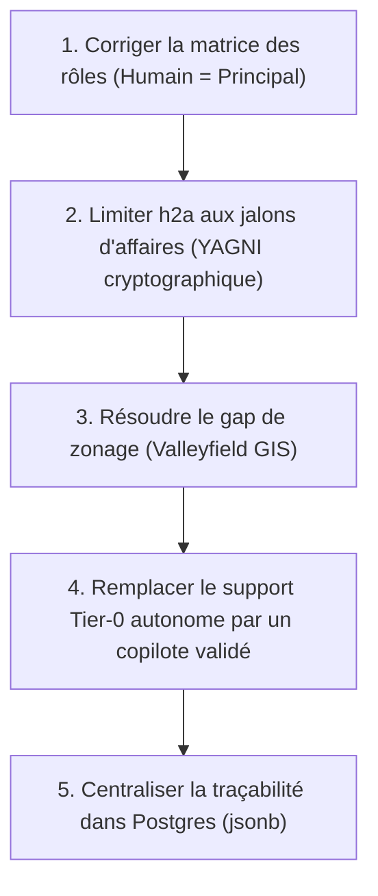

# Relecture Critique Senior — Évaluation du Socle v3 (Process E2E, Modèle Opérationnel & Intégration h2a)

**Auteur** : Antigravity (Gemini 3.5 Flash)  
**Date** : 2026-05-26  
**Contexte** : Analyse critique constructive des spécifications d'évolution du radar immobilier (Salaberry-de-Valleyfield) confrontées aux primitives réelles du protocole de coordination humain-agent `@sentropic/h2a` v0.3.1.  
**Fichiers relus** : 
- [SPEC_EVOL_PROCESS_E2E.md](file:///home/antoinefa/src/radar-immobilier/tmp/docs-process-e2e-socle/docs/spec/SPEC_EVOL_PROCESS_E2E.md) (notamment §5, §6 et §11)
- [SPEC_EVOL_OPERATING_MODEL.md](file:///home/antoinefa/src/radar-immobilier/tmp/docs-process-e2e-socle/docs/spec/SPEC_EVOL_OPERATING_MODEL.md)
- [VISION.md](file:///home/antoinefa/src/radar-immobilier/tmp/docs-process-e2e-socle/docs/spec/input/VISION.md) et [PROCESS.md](file:///home/antoinefa/src/radar-immobilier/tmp/docs-process-e2e-socle/docs/spec/input/PROCESS.md)
- [SPEC_EVOL_DATA_MODEL.md](file:///home/antoinefa/src/radar-immobilier/tmp/docs-process-e2e-socle/docs/spec/SPEC_EVOL_DATA_MODEL.md)

---

## 1. Analyse du mapping des rôles Radar ↔ h2a (§11)

Le mapping proposé au §11 de la `SPEC_EVOL_PROCESS_E2E.md` et repris dans la `SPEC_EVOL_OPERATING_MODEL.md` présente des confusions conceptuelles majeures par rapport aux primitives réelles de `@sentropic/h2a` v0.3.1 :

*   **L'IA usurpant le rôle de `PRINCIPAL` :** 
    Le texte affirme : *« Sentropic (toi) = PRINCIPAL plateforme + CONDUCTOR des agents dev/ops »*. C'est un contresens architectural grave. Dans `@sentropic/h2a`, un `PRINCIPAL` est par définition **un humain** (ou un groupe d'humains légalement constitué) qui pilote sa mini-org et endosse la responsabilité ultime. Une IA (Sentropic / Antigravity) ne peut en aucun cas être un `PRINCIPAL`. Elle est au mieux un `CONDUCTOR` (supervisant une meute d'agents de développement sous délégation) ou un `AGENT` d'exécution. Le vrai `PRINCIPAL` côté plateforme doit être un humain de l'équipe Sentropic.
*   **Abus de vocabulaire sur les modes de gouvernance :**
    La spécification stipule un *« recours public-authority/consortium en dernier ressort »* pour l'IA Sentropic. Les modes `public-authority` et `consortium` désignent des modèles de gouvernance multi-humains réels, hautement juridiques. Associer une IA à une "autorité publique" ou à un "consortium" dans une V1 est une projection théorique déconnectée de la réalité technique de la démo.
*   **Flou autour du Client Final et de la matrice d'autorité :**
    Le *« Client final »* est décrit comme interagissant avec les agents du produit. Cependant, dans h2a, chaque décision ou qualification doit être signée cryptographiquement via une clé `ed25519`. Le client final dispose-t-il d'une `AUTHORITY` ? Signe-t-il des `ENGAGEMENT` ? Si oui, comment gère-t-on le trousseau de clés dans une interface web publique ? Si non, son statut h2a est ignoré, ce qui invalide la promesse d'une traçabilité de bout en bout.

---

## 2. L'upgrade « provenance signée + journalisée » (§6) : Utilité vs Sur-ingénierie

Le §6 de la `SPEC_EVOL_PROCESS_E2E.md` introduit l'idée que chaque donnée foncière doit porter la mention *« instruit/validé par <rôle> »* et que sa provenance devient *« signée + journalisée »* dans un journal append-only `ed25519` afin de rendre la règle anti-triche cryptographiquement auditable.

*   **Diagnostic : Sur-ingénierie manifeste (Over-engineering).**
    Pour une V1/démo dont l'objectif est de sécuriser un contrat commercial et de prouver la pertinence de la détection (VISION §8 / §9), crypter et signer individuellement chaque cellule de données foncières (superficie, code d'usage, matricule) est totalement disproportionné. 
    Le modèle de données de Valleyfield souffre déjà de lacunes critiques (le gap Lot ↔ Zone à cause de l'absence de polygones SIG ouverts, voir `SPEC_EVOL_DATA_MODEL.md` §1.3). Appliquer une sécurité cryptographique de niveau militaire sur des données qui sont, à ce stade, à 80% des "hypothèses par proximité d'adresse" (`hypothese-street-name`) est une contradiction de maturité flagrante.
*   **Surface h2a minimale recommandée en V1 :**
    Pour garder le projet agile, la surface de h2a doit être drastiquement réduite :
    1.  **Pas de signature cryptographique ed25519 sur les données brutes ou les champs de lots.** Une simple colonne Postgres `provenance: enum` (`fait`, `hypothese`, `simule`) suffit amplement pour respecter la règle d'honnêteté de la démo.
    2.  **Limiter le journal signé aux décisions humaines d'affaires :** Seules les actions d'affaires lourdes du pipeline (Étape 6 PROCESS : *« qualifier-avec-expert »*, *« rejeter »*, *« monter-dossier-acquisition »*) doivent générer un artefact `ENGAGEMENT` ou `MANDATE` signé dans un journal d'audit centralisé.

---

## 3. Analyse critique du modèle opérationnel (OPERATING_MODEL)

Le modèle opérationnel à coût marginal basé sur un support multi-tiers pose plusieurs risques critiques et des faiblesses structurelles majeures :

*   **Le leurre du coût marginal en support réglementaire (Tier 0 & Tier 1) :**
    Faire interagir un client final directement avec des agents autonomes (Tier 0) pour interpréter des changements de zonage comporte un risque financier et opérationnel énorme. L'analyse urbanistique au Québec est complexe, locale et sujette à interprétation juridique. Si un agent autonome donne une mauvaise interprétation d'une grille de zonage à cause d'une hallucination ou d'une donnée d'entrée erronée, la responsabilité civile et professionnelle de la plateforme est engagée.
*   **Conformité légale et RGPD au Québec (Loi 25 et LFM art. 72) :**
    Comme documenté dans `SPEC_EVOL_DATA_MODEL.md` §2.2, la Loi sur la fiscalité municipale (LFM art. 72) interdit la diffusion publique des noms des propriétaires dans les rôles d'évaluation en open data. Le recours à des bases payantes (JLR, Registre foncier) pour lever cette contrainte est nécessaire en phase d'acquisition. Faire transiter ces informations nominatives et confidentielles à travers des meutes d'agents de support autonomes sans un cloisonnement strict des contextes LLM expose le système à des fuites de données massives, en violation directe de la Loi 25 du Québec sur la protection des renseignements personnels.
*   **Risque de deadlock opérationnel par boucle de rétroaction :**
    Si les retours clients (Tier 1) génèrent automatiquement des `AMENDMENT` signés qui modifient les instructions (`POLICY`) des agents de développement à chaud, on risque de créer des régressions en cascade et des blocages systématiques. Le processus de support et le cycle de release logicielle ne doivent pas être confondus avec le protocole de gouvernance h2a.

---

## 4. Cohérence globale du socle (Scoring, Signal, réel/sim)

L'introduction de `@sentropic/h2a` v0.3.1 apporte des frictions avec les autres composantes déjà définies :

*   **Contradiction de maturité de la donnée :** 
    Le scoring d'opportunité en V1 (PROCESS §3) repose en grande partie sur des axes non disponibles par défaut en open data (Enrichissement Marché Tier C, Faisabilité foncière avec LFM 72 caviardé). Le système doit donc renormaliser les scores et plafonner la recommandation à "surveillance" (`SPEC_EVOL_PROCESS_E2E.md` §4.4). Rajouter la lourdeur d'une gestion de mandats et de signatures h2a sur des dossiers incomplets par nature nuit à l'utilisabilité de l'outil par le responsable produit, qui a d'abord besoin d'un outil d'aide à la décision simple et rapide.
*   **Le Mode Réel/Simulation vs Provenance Signée :**
    Le choix de faire du mode Réel/Simulation un état global de la donnée (provenance par item, §6) est excellent et évite les datasets divergents. Cependant, h2a complexifie inutilement ce mécanisme en exigeant une signature d'autorité correspondante pour transformer une simulation en fait. Si le responsable produit doit signer cryptographiquement chaque correction manuelle de lot, l'application SPA va rapidement devenir inutilisable.

---

## 5. Identification des éléments YAGNI (You Aren't Gonna Need It)

Afin de livrer un produit V1 fonctionnel, percutant pour la démo et stable, plusieurs concepts h2a doivent être immédiatement reportés ou abandonnés :

*   **Les modes multi-humains avancés (§11) :** Les modes `consortium`, `public-authority`, `federated` et `shared-engagement` sont hors sujet pour un SaaS B2B initial. Seule une relation client-fournisseur classique (unilatérale) doit être implémentée.
*   **Les signatures ed25519 atomiques sur les champs de données (§6) :** À remplacer par de simples métadonnées d'audit SQL en base (champs `updated_at`, `updated_by`).
*   **L'orchestration d'agents dynamiques par `MANDATE`/`POLICY` codés :** Le comportement des agents doit être régi par des fichiers de configuration et des invites de commandes (prompts) classiques, non par une surcouche de contrats h2a négociés en temps réel qui rajoute de l'instabilité.
*   **Le support multi-tiers d'agents autonomes (OPERATING_MODEL §4) :** Remplacer par un assistant d'onboarding et un panneau d'aide classique. Pas de meute d'agents autonomes de support en V1.

---

## 6. Faisabilité d'intégration de h2a v0.3.1 dans Svelte + Hono

L'intégration technique de `@sentropic/h2a` v0.3.1 pose des verrous d'implémentation non négligeables :

*   **Incompatibilité de runtime Edge (API Hono) :**
    Si l'API Hono est déployée sur des runtimes Edge légers (ex. Cloudflare Workers), les dépendances cryptographiques natives de Node.js souvent requises pour les signatures `ed25519` et la gestion de fichiers locaux pour le journal append-only peuvent échouer ou gonfler la taille du bundle. L'intégration doit impérativement s'exécuter sur un runtime Node classique sous Docker, avec un stockage des preuves h2a dans Postgres (`jsonb`) plutôt que sur un système de fichiers plat non persistant en environnement distribué.
*   **Expérience Utilisateur (UX) complexe dans la SPA Svelte :**
    Une application Svelte performante exige une réactivité maximale. Si chaque action de tri ou de filtrage nécessite d'invoquer des clés cryptographiques, de signer une enveloppe h2a et d'attendre la validation de la chaîne, l'UX sera lourde et frustrante pour l'utilisateur. De plus, la gestion sécurisée de la clé privée de l'utilisateur dans le navigateur (pour éviter les failles XSS dérobant les clés de signature) représente un défi de sécurité majeur.

---

## 7. Top 5 des améliorations concrètes priorisées

Voici les actions concrètes à mener pour redresser les spécifications avant d'entamer les développements :

1.  **Corriger la matrice d'autorité et redéfinir les rôles h2a :**
    Retirer immédiatement le rôle de `PRINCIPAL` à l'IA plateforme. Rétablir l'humain (expert Sentropic) comme `PRINCIPAL` souverain, et rétrograder Sentropic (IA) au rang de `CONDUCTOR` ou d'agent sous mandat strict.
2.  **Limiter l'usage de h2a aux jalons d'affaires (YAGNI cryptographique) :**
    Supprimer l'obligation de signature `ed25519` sur la provenance des données de lots individuels. Utiliser des énumérations standard en base de données. Réserver le protocole h2a exclusivement pour la signature d'audits des décisions finales (ex: approbation d'un dossier d'acquisition par le Responsable Produit via un artefact `ENGAGEMENT` signé).
3.  **Prioriser la résolution du gap géospatial de Valleyfield plutôt que la théorie h2a :**
    Rediriger l'effort de développement. Au lieu de passer du temps sur la surcouche h2a en V1, investir 2 jours de travail pour vectoriser manuellement les PDF de zonage (Feuillets 1 & 2) de Valleyfield. Sans polygones de zonage réels, aucune signature cryptographique ne donnera de valeur commerciale à la démo.
4.  **Remplacer le support autonome Tier 0 par un copilote humain-approuvé :**
    Éliminer le risque juridique et financier lié aux hallucinations d'agents autonomes en support direct. L'assistant radar doit agir comme un préparateur de rapports de synthèse et de mémos d'opportunités, qui sont obligatoirement révisés et validés par un expert humain avant toute communication externe.
5.  **Centraliser la traçabilité h2a dans Postgres via `jsonb` :**
    Ne pas tenter de gérer un journal append-only sur fichier plat côté API Hono. Créer une table standard d'audit Postgres (`audit_logs`) indexée, capable de stocker les enveloppes signées h2a sous forme de documents `jsonb`. Cela garantit la réconciliation immédiate avec l'interface Svelte et préserve les performances de l'application.
